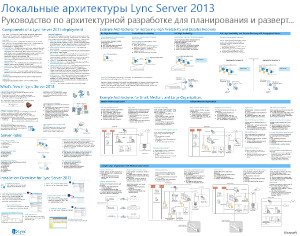
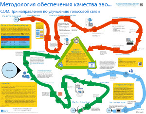
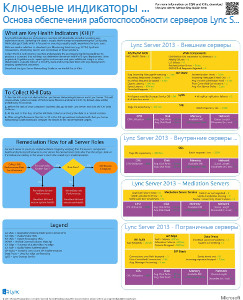
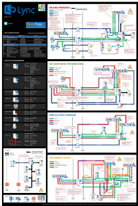

---
title: Технические схемы Lync Server 2013
TOCTitle: Технические схемы
ms:assetid: 7b6da49b-ac72-4ab0-8957-166e330b38fa
ms:mtpsurl: https://technet.microsoft.com/ru-ru/library/Dn594589(v=OCS.15)
ms:contentKeyID: 61170965
ms.date: 12/10/2016
mtps_version: v=OCS.15
ms.translationtype: HT
---

# Технические схемы для Lync Server 2013

 

_**Дата изменения раздела:** 2016-12-08_

**Резюме:** На этих диаграммах приведены наглядные представления рекомендованных решений для Lync 2013.

Эти ресурсы доступны в форматах Visio (.vsd) (Visio 2010 или Visio 2013), а также в формате PDF. Сведения о процедуре печати документов см. в разделе Советы по печати плакатов.

Для просмотра этих файлов может потребоваться дополнительное программное обеспечение. Дополнительные сведения см. в следующей таблице.

<table>
<colgroup>
<col style="width: 50%" />
<col style="width: 50%" />
</colgroup>
<thead>
<tr class="header">
<th>Тип файла</th>
<th>Программное обеспечение</th>
</tr>
</thead>
<tbody>
<tr class="odd">
<td>
.vsd
</td>
<td>
Visio 2010, Visio 2013 или <a href="http://go.microsoft.com/fwlink/?linkid=393676">бесплатное средство просмотра Visio</a>

Если используется средство просмотра Visio, щелкните правой кнопкой мыши VSD-ссылку, выберите пункт <strong>Сохранить объект как</strong>, сохраните файл н свой компьютер, затем откройте сохраненный файл.
</td>
</tr>
<tr class="even">
<td>
.pdf
</td>
<td>
Любое средство просмотра PDF, например, <a href="http://go.microsoft.com/fwlink/?linkid=393675">Adobe Reader</a>
</td>
</tr>
<tr class="odd">
<td>
.zip
</td>
<td>
Любая служебная программа для сжатия файлов. В Windows 7 и 8 имеются собственные программы для открытия этих файлов.
</td>
</tr>
</tbody>
</table>

## Плакаты

На этих плакатах отражена определенная техническая область, и их следует использовать вместе с соответствующими статьями на TechNet, либо с содержимым, доступным в центре загрузки.

<table>
<colgroup>
<col style="width: 50%" />
<col style="width: 50%" />
</colgroup>
<thead>
<tr class="header">
<th>Название</th>
<th>Описание</th>
</tr>
</thead>
<tbody>
<tr class="odd">
<td>
<strong>Локальные архитектуры Lync Server 2013</strong>

<a href="http://go.microsoft.com/fwlink/?linkid=392974">Увеличьте масштаб отображения плаката до максимальной детализации, используя средство Zoom.it корпорации Майкрософт</a> (для настольных или портативных компьютеров)

<a href="http://go.microsoft.com/fwlink/?linkid=392578">Версия PDF</a> (для мобильных устройств или планшетных компьютеров)

<a href="http://go.microsoft.com/fwlink/?linkid=392579">Версия Visio</a> (для пользователей Visio)
</td>
<td>
На плакате представлены архитектурные рекомендации по планированию и развертыванию. На этом плакате представлена информация по общим компонентам Lync Server, терминология, применяемая при планировании развертывания, описание новых функций, ролей серверов и обзор процесса установки. Кроме того, на этом плакате представлены примеры архитектуры для увеличения времени общей доступности, повышения эффективности аварийного восстановления, а также примеры малых, средних и больших топологий.

Размер: 34 х 44 дюйма

Этот плакат создан с помощью Visio 2013. Никакие изменения не должны вноситься с учетом специфики среды.
</td>
</tr>
<tr class="even">
<td>
<strong>Методология качества вызовов Lync</strong>

<a href="http://go.microsoft.com/fwlink/?linkid=392972">Увеличьте масштаб отображения плаката до максимальной детализации, используя средство Zoom.it корпорации Майкрософт</a> (для настольных или портативных компьютеров)

<a href="http://go.microsoft.com/fwlink/?linkid=391841">Версии Visio и PDF в одном .zip-файле</a>
</td>
<td>
Плакат с описанием действий по устранению неисправностей в системе Lync, особенно, неисправностей, влияющих на качество голосовых вызовов предприятия. Используйте этот плакат вместе со следующим материалом:

<ul>
<li>
<a href="http://go.microsoft.com/fwlink/p/?linkid=390677">Руководство по сетевым подключениям Lync Server</a>
</li>
<li>
<a href="lync-server-2013-poster-lync-call-quality-methodology.md">Методология качества звонков Lync в Lync Server 2013</a> (вспомогательная статья)
</li>
<li>
<a href="lync-server-2013-poster-key-health-indicators.md">Ключевые индикаторы работы в Lync Server 2013</a> (вспомогательная статья)
</li>
</ul>

Размер: 34 х 44 дюйма

Этот плакат создан с помощью Visio 2010. Никакие изменения не должны вноситься с учетом специфики среды.
</td>
</tr>
<tr class="odd">
<td>
<strong>Ключевые показатели работоспособности</strong>

<a href="http://go.microsoft.com/fwlink/?linkid=392971">Увеличьте масштаб отображения плаката до максимальной детализации, используя средство Zoom.it корпорации Майкрософт</a> (для настольных или портативных компьютеров)

<a href="http://go.microsoft.com/fwlink/?linkid=391838">Версии Visio и PDF в одном .zip-файле</a>
</td>
<td>
Плакат с описанием метрик устранения неисправностей серверов для обеспечения работоспособности основного сервера, а также для восстановления роли определенного сервера в реализации Lync. Используйте этот плакат вместе со следующим материалом:

<ul>
<li>
<a href="http://go.microsoft.com/fwlink/p/?linkid=390677">Руководство по сетевым подключениям Lync Server</a>
</li>
<li>
<a href="lync-server-2013-poster-lync-call-quality-methodology.md">Методология качества звонков Lync в Lync Server 2013</a> (вспомогательная статья)
</li>
<li>
<a href="lync-server-2013-poster-key-health-indicators.md">Ключевые индикаторы работы в Lync Server 2013</a> (вспомогательная статья)
</li>
</ul>

Размер: 17 х 22 дюйма

Этот плакат создан с помощью Visio 2010. Никакие изменения не должны вноситься с учетом специфики среды.
</td>
</tr>
<tr class="even">
<td>
<strong>Варианты платформ Lync 2013</strong>

<a href="http://go.microsoft.com/fwlink/p/?linkid=391840">Увеличьте масштаб отображения плаката до максимальной детализации, используя средство Zoom.it корпорации Майкрософт</a>

<a href="http://go.microsoft.com/fwlink/p/?linkid=391837">Версия PDF</a> (для мобильных устройств или планшетных компьютеров)

<a href="http://go.microsoft.com/fwlink/p/?linkid=391839">Версия Visio</a> (для пользователей Visio)
</td>
<td>
На этом плакате описываются доступные варианты платформ Lync 2013 для BDM и архитекторов Клиентам доступны для выбора варианты Lync Online в Office 365, Hybrid Lync, локальный Lync Server, а также Hosted Lync. На этом плакате также представлено описание каждого варианта архитектуры, включая наилучшие сценарии для каждого, требования к лицензии, а также обязанности ИТ-специалистов.

Размер: 34 х 44 дюйма

Этот плакат создан с помощью Visio 2013. Никакие изменения не должны вноситься с учетом специфики среды.
</td>
</tr>
<tr class="odd">
<td>
<strong>Рабочие нагрузки для протоколов Microsoft Lync Server 2013</strong>

<a href="http://go.microsoft.com/fwlink/?linkid=392970">Увеличьте масштаб отображения плаката до максимальной детализации, используя средство Zoom.it корпорации Майкрософт</a>

<a href="http://go.microsoft.com/fwlink/?linkid=392512">Версия PDF</a> (для мобильных устройств или планшетных компьютеров)

<a href="http://go.microsoft.com/fwlink/?linkid=392513">Версия Visio</a> (для пользователей Visio)
</td>
<td>
Загрузите этот плакат для более детального изучения возможностей и требований к Lync 2013, Lync Phone, Lync Web App, Lync for Mac, and Lync Mobile w. Узнайте, как Lync Server Workloads упрощает обмен информацией в организации.

Размер: 24 х 36 дюймов

Этот плакат создан с помощью Visio 2013. Никакие изменения не должны вноситься с учетом специфики среды.
</td>
</tr>
</tbody>
</table>

## Советы по печати плакатов.

Если у вас имеется плоттер, то эти плакаты можно распечатывать в полный размер. При отсутствии плоттера выполните следующие действия, чтобы распечатать плакаты на листах меньшего формата.

**Печать плакатов на листах меньшего формата**

1.  Откройте файл плаката в Visio.

2.  В меню **Файл** выберите пункт **Параметры страницы**.

3.  На вкладке **Настройка печати**, в разделе **Бумага принтера**, выберите размер бумаги, на которой требуется выполнить печать.

4.  На вкладке **Настройка печати**, в разделе **Масштаб**, выберите **Вписать**, затем введите значение **1 лист в ширину Х 1 лист в высоту**.

5.  На вкладке **Размер страницы** выберите **Изменять размеры по содержимому**, затем нажмите **OK**.

6.  В меню **Файл** выберите пункт **Печать**.

