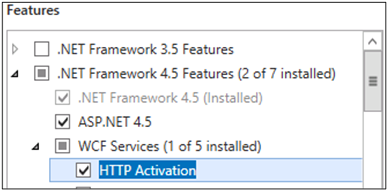

# <a name="system-requirements-for-skype-for-business-server-2019"></a><span data-ttu-id="78134-104">Требования к системе для Скайп для Business Server 2019</span><span class="sxs-lookup"><span data-stu-id="78134-104">System requirements for Skype for Business Server 2019</span></span>
 
<span data-ttu-id="78134-105">**Сводка:** Подготовка для установки Скайп для Business Server 2019 с в этом разделе.</span><span class="sxs-lookup"><span data-stu-id="78134-105">**Summary:** Prepare to install Skype for Business Server 2019 with this topic.</span></span> <span data-ttu-id="78134-106">Оборудование, операционная система, программного обеспечения, баз данных, сертификаты, Active каталогов, DNS и fileshares рассматривается здесь.</span><span class="sxs-lookup"><span data-stu-id="78134-106">Hardware, OS, software, databases, certificates, Active Diretory, DNS, and fileshares are covered here.</span></span> <span data-ttu-id="78134-107">Требования к системе и рекомендации являются здесь для обеспечения успешной установки и развертывания фермы серверов.</span><span class="sxs-lookup"><span data-stu-id="78134-107">All the system requirements and recommendations are here to help ensure a successful install and deployment of your server farm.</span></span>
  
<span data-ttu-id="78134-108">Как можно было бы ожидать, существуют некоторые подготовительные действия, чтобы сделать перед началом развертывания Скайп для Business Server 2019.</span><span class="sxs-lookup"><span data-stu-id="78134-108">As you might expect, there are some preparations to make before you begin deploying Skype for Business Server 2019.</span></span> <span data-ttu-id="78134-109">В этой статье поможет выполнить планирование следующее:</span><span class="sxs-lookup"><span data-stu-id="78134-109">This article will walk you through planning for the following:</span></span>
  
- [<span data-ttu-id="78134-110">Оборудование</span><span class="sxs-lookup"><span data-stu-id="78134-110">Hardware</span></span>](system-requirements.md#Hardware)
  
- [<span data-ttu-id="78134-111">Операционные системы</span><span class="sxs-lookup"><span data-stu-id="78134-111">Operating systems</span></span>](system-requirements.md#OS)
  
- [<span data-ttu-id="78134-112">Программное обеспечение</span><span class="sxs-lookup"><span data-stu-id="78134-112">Software</span></span>](system-requirements.md#Software)

- [<span data-ttu-id="78134-113">Серверная часть базы данных SQL</span><span class="sxs-lookup"><span data-stu-id="78134-113">Back end SQL databases</span></span>](system-requirements.md#DBs)
  
- [<span data-ttu-id="78134-114">Active Directory</span><span class="sxs-lookup"><span data-stu-id="78134-114">Active Directory</span></span>](system-requirements.md#AD)
  
- [<span data-ttu-id="78134-115">Служба доменных имен (DNS)</span><span class="sxs-lookup"><span data-stu-id="78134-115">Domain Name System (DNS)</span></span>](system-requirements.md#DNS)
  
- [<span data-ttu-id="78134-116">Сертификаты</span><span class="sxs-lookup"><span data-stu-id="78134-116">Certificates</span></span>](system-requirements.md#Certs)
  
- [<span data-ttu-id="78134-117">Файловый ресурс</span><span class="sxs-lookup"><span data-stu-id="78134-117">File Share</span></span>](system-requirements.md#Fileshare)

  
## <a name="hardware-for-skype-for-business-server-2019"></a><span data-ttu-id="78134-118">Оборудование для Скайп для Business Server 2019</span><span class="sxs-lookup"><span data-stu-id="78134-118">Hardware for Skype for Business Server 2019</span></span>
<span data-ttu-id="78134-119"><a name="Hardware"> </a></span><span class="sxs-lookup"><span data-stu-id="78134-119"></span></span>

<span data-ttu-id="78134-120">У вашей топологии вниз (, в противном случае можно посмотреть в разделе [Основные сведения о топологии для Скайп для Business Server 2019](../../SfbServer/plan-your-deployment/topology-basics/topology-basics.md) ) имеет время, подумайте о серверах.</span><span class="sxs-lookup"><span data-stu-id="78134-120">After you have your topology down (and if you don't, you can check out the [Topology Basics for Skype for Business Server 2019](../../SfbServer/plan-your-deployment/topology-basics/topology-basics.md) topic), it's time to think about servers.</span></span> <span data-ttu-id="78134-121">Скайп для серверов Business Server 2019 требуется 64-разрядное оборудование.</span><span class="sxs-lookup"><span data-stu-id="78134-121">Skype for Business Server 2019 servers require 64-bit hardware.</span></span> <span data-ttu-id="78134-122">Ниже приведены рекомендации по оборудованию.</span><span class="sxs-lookup"><span data-stu-id="78134-122">Our recommendations for hardware are below.</span></span> <span data-ttu-id="78134-123">Они не требования, но они отражают требования, необходимые для обеспечения оптимальной производительности.</span><span class="sxs-lookup"><span data-stu-id="78134-123">These aren't requirements, but they reflect the requirements necessary for optimal performance.</span></span> <span data-ttu-id="78134-124">Документация по планированию загрузки позволяет определить, не требуется ли более мощное оборудование с учетом конкретных обстоятельств.</span><span class="sxs-lookup"><span data-stu-id="78134-124">We have capacity planning documentation that will help you determine if you need more than this, depending on your circumstances.</span></span>
  
<span data-ttu-id="78134-125">Рекомендуемое оборудование для серверов Standard Edition:</span><span class="sxs-lookup"><span data-stu-id="78134-125">Recommended hardware for Standard Edition servers:</span></span>

|<span data-ttu-id="78134-126">**Аппаратный компонент**</span><span class="sxs-lookup"><span data-stu-id="78134-126">**Hardware component**</span></span>|<span data-ttu-id="78134-127">**Рекомендуется**</span><span class="sxs-lookup"><span data-stu-id="78134-127">**Recommended**</span></span>|
|:-----|:-----|
|<span data-ttu-id="78134-128">ЦП</span><span class="sxs-lookup"><span data-stu-id="78134-128">CPU</span></span>  <br/> |<span data-ttu-id="78134-129">Двухъядерный процессор Intel Xeon E5-2673 версии 3, 6 процессора с тактовой частотой 2,4 ГГц или выше.</span><span class="sxs-lookup"><span data-stu-id="78134-129">Intel Xeon E5-2673 v3 dual processor, 6-core, 2.4 gigahertz (GHz) or higher.</span></span>  <br/> <span data-ttu-id="78134-130">Процессоры Intel Itanium не поддерживаются для Скайп для роли Business Server 2019.</span><span class="sxs-lookup"><span data-stu-id="78134-130">Intel Itanium processors are not supported for Skype for Business Server 2019 roles.</span></span>  <br/> |
|<span data-ttu-id="78134-131">Память</span><span class="sxs-lookup"><span data-stu-id="78134-131">Memory</span></span>  <br/> |<span data-ttu-id="78134-132">32 ГБ.</span><span class="sxs-lookup"><span data-stu-id="78134-132">32 gigabytes (GB).</span></span>  <br/> |
|<span data-ttu-id="78134-133">Диск</span><span class="sxs-lookup"><span data-stu-id="78134-133">Disk</span></span>  <br/> |<span data-ttu-id="78134-134">ЛЮБОЙ ИЗ ВАРИАНТОВ:</span><span class="sxs-lookup"><span data-stu-id="78134-134">EITHER:</span></span>  <br/> <span data-ttu-id="78134-135">• 8 и больше жестких дисков с 10 000 об/мин и не менее 72 ГБ свободного места на диске (два диска объединены в RAID 1, а 6 — в RAID 10). </span><span class="sxs-lookup"><span data-stu-id="78134-135">• 8 or more 10000 RPM hard disk drives with at least 72 GB free disk space (two of the disks using RAID 1 and 6 using RAID 10).</span></span>  <br/> <span data-ttu-id="78134-136">ИЛИ</span><span class="sxs-lookup"><span data-stu-id="78134-136">OR</span></span>  <br/> <span data-ttu-id="78134-137">• твердотельные накопители, которые способны обеспечить свободное пространство и производительность, соответствующие 8 механическим жестким дискам с 10 000 об/мин.</span><span class="sxs-lookup"><span data-stu-id="78134-137">• Solid state drives (SSDs) able to provide the same free space and similar performance to 8 10000 RPM mechanical disk drives.</span></span>  <br/> |
|<span data-ttu-id="78134-138">Сеть</span><span class="sxs-lookup"><span data-stu-id="78134-138">Network</span></span>  <br/> |<span data-ttu-id="78134-139">1 двухпортовый сетевой адаптер, 1 Гбит/с или выше (можно использовать 2 сетевых адаптера, но их необходимо объединить с одним MAC-адресом и одним IP-адресом).</span><span class="sxs-lookup"><span data-stu-id="78134-139">1 dual-port network adapter, 1 Gbps or higher (2 network adapters can be used, but they need to be teamed with a single MAC address and a single IP address).</span></span>  <br/> <span data-ttu-id="78134-140">Конфигурации с двумя или несколькими адресами, **не** поддерживается для серверов переднего плана, внутренними серверами и Standard Edition серверы.</span><span class="sxs-lookup"><span data-stu-id="78134-140">Dual or multi-homed configurations are **not** supported for Front End Servers, Back End Servers, and Standard Edition servers.</span></span> <br/> <span data-ttu-id="78134-141">Поскольку они недоступны для операционной системы и используются для контроля и управления серверного оборудования, может иметь-резервному систем, например DRAC или ILO.</span><span class="sxs-lookup"><span data-stu-id="78134-141">As long as they are not exposed to the operating system and are being used to monitor and manage server hardware, you can have out-of-band management systems, such as DRAC or ILO.</span></span> <span data-ttu-id="78134-142">Этот сценарий не предполагает использования многоадресного сервера и поддерживается.</span><span class="sxs-lookup"><span data-stu-id="78134-142">This scenario doesn't constitute a multi-homed server, and it is supported.</span></span>  <br/> |


<span data-ttu-id="78134-143">Рекомендуемое оборудование для серверов переднего плана и внутренними серверами:</span><span class="sxs-lookup"><span data-stu-id="78134-143">Recommended hardware for Front End Servers and Back End Servers:</span></span>
  
|<span data-ttu-id="78134-144">**Аппаратный компонент**</span><span class="sxs-lookup"><span data-stu-id="78134-144">**Hardware component**</span></span>|<span data-ttu-id="78134-145">**Рекомендуется**</span><span class="sxs-lookup"><span data-stu-id="78134-145">**Recommended**</span></span>|
|:-----|:-----|
|<span data-ttu-id="78134-146">ЦП</span><span class="sxs-lookup"><span data-stu-id="78134-146">CPU</span></span>  <br/> |<span data-ttu-id="78134-147">Двухъядерный процессор Intel Xeon E5-2673 версии 3, 6 процессора с тактовой частотой 2,4 ГГц или выше.</span><span class="sxs-lookup"><span data-stu-id="78134-147">Intel Xeon E5-2673 v3 dual processor, 6-core, 2.4 gigahertz (GHz) or higher.</span></span> <br/> <span data-ttu-id="78134-148">Процессоры Intel Itanium не поддерживаются для Скайп для роли Business Server 2019.</span><span class="sxs-lookup"><span data-stu-id="78134-148">Intel Itanium processors are not supported for Skype for Business Server 2019 roles.</span></span>  <br/> |
|<span data-ttu-id="78134-149">Память</span><span class="sxs-lookup"><span data-stu-id="78134-149">Memory</span></span>  <br/> |<span data-ttu-id="78134-150">64 гигабайта (ГБ).</span><span class="sxs-lookup"><span data-stu-id="78134-150">64 gigabytes (GB).</span></span>  <br/> |
|<span data-ttu-id="78134-151">Диск</span><span class="sxs-lookup"><span data-stu-id="78134-151">Disk</span></span>  <br/> |<span data-ttu-id="78134-152">ЛЮБОЙ ИЗ ВАРИАНТОВ:</span><span class="sxs-lookup"><span data-stu-id="78134-152">EITHER:</span></span>  <br/> <span data-ttu-id="78134-153">• 8 и больше жестких дисков с 10 000 об/мин и не менее 72 ГБ свободного места на диске (два диска объединены в RAID 1, а 6 — в RAID 10). </span><span class="sxs-lookup"><span data-stu-id="78134-153">• 8 or more 10000 RPM hard disk drives with at least 72 GB free disk space (two of the disks using RAID 1 and 6 using RAID 10).</span></span>  <br/> <span data-ttu-id="78134-154">ИЛИ</span><span class="sxs-lookup"><span data-stu-id="78134-154">OR</span></span>  <br/> <span data-ttu-id="78134-155">• твердотельные накопители, которые способны обеспечить свободное пространство и производительность, соответствующие 8 механическим жестким дискам с 10 000 об/мин.</span><span class="sxs-lookup"><span data-stu-id="78134-155">• Solid state drives (SSDs) able to provide the same free space and similar performance to 8 10000 RPM mechanical disk drives.</span></span>  <br/> |
|<span data-ttu-id="78134-156">Сеть</span><span class="sxs-lookup"><span data-stu-id="78134-156">Network</span></span>  <br/> |<span data-ttu-id="78134-157">1 двухпортовый сетевой адаптер, 1 Гбит/с или выше (можно использовать 2 сетевых адаптера, но их необходимо объединить с одним MAC-адресом и одним IP-адресом).</span><span class="sxs-lookup"><span data-stu-id="78134-157">1 dual-port network adapter, 1 Gbps or higher (2 network adapters can be used, but they need to be teamed with a single MAC address and a single IP address).</span></span>  <br/> <span data-ttu-id="78134-158">Конфигурации с двумя или несколькими адресами, **не** поддерживается для серверов переднего плана, внутренними серверами и Standard Edition серверы.</span><span class="sxs-lookup"><span data-stu-id="78134-158">Dual or multi-homed configurations are **not** supported for Front End Servers, Back End Servers, and Standard Edition servers.</span></span> <br/> <span data-ttu-id="78134-159">Поскольку они недоступны для операционной системы и используются для контроля и управления серверного оборудования, может иметь-резервному систем, например DRAC или ILO.</span><span class="sxs-lookup"><span data-stu-id="78134-159">As long as they are not exposed to the operating system and are being used to monitor and manage server hardware, you can have out-of-band management systems, such as DRAC or ILO.</span></span> <span data-ttu-id="78134-160">Этот сценарий не предполагает использования многоадресного сервера и поддерживается.</span><span class="sxs-lookup"><span data-stu-id="78134-160">This scenario doesn't constitute a multi-homed server, and it is supported.</span></span>  <br/> |
   
<span data-ttu-id="78134-161">Рекомендуемое оборудование для пограничных серверов, изолированных серверов-посредников и директоров:</span><span class="sxs-lookup"><span data-stu-id="78134-161">Recommended hardware for Edge Servers, standalone Mediation Servers, and Directors:</span></span>
  
|<span data-ttu-id="78134-162">**Аппаратный компонент**</span><span class="sxs-lookup"><span data-stu-id="78134-162">**Hardware component**</span></span>|<span data-ttu-id="78134-163">**Рекомендуется**</span><span class="sxs-lookup"><span data-stu-id="78134-163">**Recommended**</span></span>|
|:-----|:-----|
|<span data-ttu-id="78134-164">ЦП</span><span class="sxs-lookup"><span data-stu-id="78134-164">CPU</span></span>  <br/> |<span data-ttu-id="78134-165">Двухъядерный процессор Intel Xeon E5-2673 версии 3, 6 процессора с тактовой частотой 2,4 ГГц или выше.</span><span class="sxs-lookup"><span data-stu-id="78134-165">Intel Xeon E5-2673 v3 dual processor, 6-core, 2.4 gigahertz (GHz) or higher.</span></span>  <br/> <span data-ttu-id="78134-166">Процессоры Intel Itanium не поддерживаются для Скайп для роли Business Server 2019.</span><span class="sxs-lookup"><span data-stu-id="78134-166">Intel Itanium processors are not supported for Skype for Business Server 2019 roles.</span></span>  <br/> |
|<span data-ttu-id="78134-167">Память</span><span class="sxs-lookup"><span data-stu-id="78134-167">Memory</span></span>  <br/> |<span data-ttu-id="78134-168">32 гигабайта.</span><span class="sxs-lookup"><span data-stu-id="78134-168">32 gigabytes.</span></span>  <br/> |
|<span data-ttu-id="78134-169">Диск</span><span class="sxs-lookup"><span data-stu-id="78134-169">Disk</span></span>  <br/> |<span data-ttu-id="78134-170">ЛЮБОЙ ИЗ ВАРИАНТОВ:</span><span class="sxs-lookup"><span data-stu-id="78134-170">EITHER:</span></span>  <br/> <span data-ttu-id="78134-171">• 4 и больше жестких дисков с 10 000 об/мин и не менее 72 ГБ свободного места на диске (диски должны быть объединены в конфигурацию 2x RAID 1).</span><span class="sxs-lookup"><span data-stu-id="78134-171">• 4 or more 10000 RPM hard disk drives with at least 72 GB free disk space (the disks should be in a 2x RAID 1 configuration).</span></span>  <br/> <span data-ttu-id="78134-172">ИЛИ</span><span class="sxs-lookup"><span data-stu-id="78134-172">OR</span></span>  <br/> <span data-ttu-id="78134-173">• твердотельные накопители, которые способны обеспечить свободное пространство и производительность, соответствующие 4 механическим жестким дискам с 10 000 об/мин.</span><span class="sxs-lookup"><span data-stu-id="78134-173">• Solid state drives (SSDs) able to provide the same free space and similar performance to 4 10000 RPM mechanical disk drives.</span></span>  <br/> |
|<span data-ttu-id="78134-174">Сеть</span><span class="sxs-lookup"><span data-stu-id="78134-174">Network</span></span>  <br/> |<span data-ttu-id="78134-175">1 двухпортовый сетевой адаптер, 1 Гбит/с или выше (можно использовать 2 сетевых адаптера, но их необходимо объединить с одним MAC-адресом и одним IP-адресом).</span><span class="sxs-lookup"><span data-stu-id="78134-175">1 dual-port network adapter, 1 Gbps or higher (2 network adapters can be used, but they need to be teamed with a single MAC address and a single IP address).</span></span>  <br/> <span data-ttu-id="78134-176">Конфигурации с двумя или несколькими адресами **не** поддерживается для серверов взаимодействия видео и директоров.</span><span class="sxs-lookup"><span data-stu-id="78134-176">Dual or multi-homed configurations are **not** supported for Video Interop Servers and Directors.</span></span> <br/> <span data-ttu-id="78134-177">Пограничным серверам потребуется два сетевых интерфейса — двухпортовые сетевые адаптеры со скоростью передачи 1 Гбит/с или выше (или два сопряженных сетевых адаптера (всего четыре), каждая пара объединена с одним MAC-адресом и одним IP-адресом, всего две пары).</span><span class="sxs-lookup"><span data-stu-id="78134-177">Edge servers will require two network interfaces that are dual-port network adapters, 1 Gbps or higher (or two paired network adapters, for a total of four, each pair being teamed with a single MAC address and a single IP address, for a total of two pairs).</span></span>  <br/> <span data-ttu-id="78134-178">На отдельных серверов-посредников поддерживается установка дополнительных сетевых карт (сетевых адаптеров), чтобы разрешить конфигурации на конкретных PSTN IP-адрес.</span><span class="sxs-lookup"><span data-stu-id="78134-178">On standalone Mediation Servers, the installation of additional network interface cards (NICs) to allow the configuration of a specific PSTN IP address is supported.</span></span>  <br/> |


> [!NOTE]
> <span data-ttu-id="78134-179">Вне зависимости от роли сервера, мы также рекомендуем следующие параметры настройки для Скайп Business Server 2019 (это может изменяться в зависимости от марки оборудования, вы приобрели, поэтому обратитесь к документации по особенности):</span><span class="sxs-lookup"><span data-stu-id="78134-179">Regardless of the server role, we also recommend the following hardware settings for Skype for Business Server 2019 (this may vary depending on the brand of hardware you've purchased, so please refer to manufacturer documentation for specifics):</span></span>
> - <span data-ttu-id="78134-180">BIOS config - должно быть присвоено ПЛОСКОЙ из NUMA.</span><span class="sxs-lookup"><span data-stu-id="78134-180">BIOS config - should be set to FLAT from NUMA.</span></span>
> - <span data-ttu-id="78134-181">Включение технология Hyper-Threading.</span><span class="sxs-lookup"><span data-stu-id="78134-181">Enable Hyperthreading.</span></span>
> - <span data-ttu-id="78134-182">8 очередь необходимо задать параметр очереди RSS-канал.</span><span class="sxs-lookup"><span data-stu-id="78134-182">The RSS queue setting should be set to 8 queue.</span></span>

   
## <a name="operating-systems-for-skype-for-business-server-2019"></a><span data-ttu-id="78134-183">Операционные системы, Скайп для Business Server 2019</span><span class="sxs-lookup"><span data-stu-id="78134-183">Operating systems for Skype for Business Server 2019</span></span>
<span data-ttu-id="78134-184"><a name="OS"> </a></span><span class="sxs-lookup"><span data-stu-id="78134-184"></span></span>

<span data-ttu-id="78134-185">После того как оборудования на месте, необходимо установить операционную систему (ОС), который позволяет устанавливать и успешно использовать Скайп для Business Server 2019.</span><span class="sxs-lookup"><span data-stu-id="78134-185">After you have the hardware in place, you'll need to the install operating system (OS) that will allow you to install and successfully use Skype for Business Server 2019.</span></span>
  
|||
|:-----|:-----|
|<span data-ttu-id="78134-186">Windows Server 2019</span><span class="sxs-lookup"><span data-stu-id="78134-186">Windows Server 2019</span></span> <br/> |
|<span data-ttu-id="78134-187">Windows Server 2016</span><span class="sxs-lookup"><span data-stu-id="78134-187">Windows Server 2016</span></span> <br/> ||
||
   
<span data-ttu-id="78134-188">Все действия, отличные от операционных систем, перечисленных здесь не будут работать должным образом; не повторите его для установки Скайп для Business Server 2019.</span><span class="sxs-lookup"><span data-stu-id="78134-188">Anything other than the operating systems listed here won't work properly; please don't try it for installs of Skype for Business Server 2019.</span></span>

> [!NOTE]
> 
> <span data-ttu-id="78134-189">При установке 2019 Центр администрирования Windows на компьютере Windows Server 2019 он будет предложено ввести номер порта для прослушивания.</span><span class="sxs-lookup"><span data-stu-id="78134-189">If you are installing Windows Admin Center 2019 on your Windows Server 2019 machine, it will prompt you for a port to listen on.</span></span> <span data-ttu-id="78134-190">Существует liklihood, можно выбрать порт 443, но если машины Скайп для 2019 Business Server, установленный, или будет иметь Скайп для Business Server 2019 установленный, тогда необходимо выбрать другой номер порта.</span><span class="sxs-lookup"><span data-stu-id="78134-190">There's a liklihood you might choose port 443, but if that machine has Skype for Business Server 2019 installed on it, or is going to have Skype for Business Server 2019 installed on it, then you must choose a different port number.</span></span>
> 
><span data-ttu-id="78134-191">Почему это так?</span><span class="sxs-lookup"><span data-stu-id="78134-191">Why is this the case?</span></span> <span data-ttu-id="78134-192">Если 2019 Центр администрирования Windows выполняется через порт 443, вы не сможете для подключения к серверу с помощью Скайп для панели управления Business, а также будет вы сможете подключиться к любой внутренней веб-службы, запущенные на сервере (адресной книги веб-службы Службы автообнаружения, службы WebTicket, и т.д.).</span><span class="sxs-lookup"><span data-stu-id="78134-192">If Windows Admin Center 2019 is running on port 443, you will not be able to connect to the server using the Skype for Business Control Panel, nor will you be able to connect to any internal web service running on the server (Address Book Web Service, Autodiscover Service, WebTicket Service, etc).</span></span>  <span data-ttu-id="78134-193">На самом деле вы не сможете для подключения к любой внутренний URL-адрес Web службы.</span><span class="sxs-lookup"><span data-stu-id="78134-193">In fact, you will not be able to connect to any Internal Web Service URL.</span></span> <span data-ttu-id="78134-194">Выберите другой порт, в том случае, если требуется или поместить 2019 Центр администрирования Windows на сервере с Скайп для Business Server 2019.</span><span class="sxs-lookup"><span data-stu-id="78134-194">Please choose a different port, in the event you need or want to put Windows Admin Center 2019 on a server with Skype for Business Server 2019.</span></span>
> 

  
## <a name="software-that-should-be-installed-before-a-skype-for-business-server-2019-deployment"></a><span data-ttu-id="78134-195">Программное обеспечение, которое следует устанавливать до Скайп для развертывания Business Server 2019</span><span class="sxs-lookup"><span data-stu-id="78134-195">Software that should be installed before a Skype for Business Server 2019 deployment</span></span>
<span data-ttu-id="78134-196"><a name="Software"> </a></span><span class="sxs-lookup"><span data-stu-id="78134-196"></span></span>

<span data-ttu-id="78134-197">Существует несколько действий, которые вы собираетесь необходимы для установки и настройки для сервера под управлением Скайп для Business Server 2019.</span><span class="sxs-lookup"><span data-stu-id="78134-197">There are some things you're going to need to install or configure for any server running Skype for Business Server 2019.</span></span> <span data-ttu-id="78134-198">Эти перечисленные ниже, следуют дополнительные требования для определенных ролей сервера.</span><span class="sxs-lookup"><span data-stu-id="78134-198">These are listed below, followed by additional requirements for specific server roles.</span></span>
  
 <span data-ttu-id="78134-199">**Все серверы:**</span><span class="sxs-lookup"><span data-stu-id="78134-199">**All servers:**</span></span>
  
|<span data-ttu-id="78134-200">**Программное обеспечение и роли**</span><span class="sxs-lookup"><span data-stu-id="78134-200">**Software/role**</span></span>|<span data-ttu-id="78134-201">**Сведения**</span><span class="sxs-lookup"><span data-stu-id="78134-201">**Details**</span></span>|
|:-----|:-----|
|<span data-ttu-id="78134-202">Windows PowerShell 3.0</span><span class="sxs-lookup"><span data-stu-id="78134-202">Windows PowerShell 3.0</span></span>  <br/> |<span data-ttu-id="78134-203">Все Скайп для серверов Business Server должны Windows PowerShell 3.0 установлена.</span><span class="sxs-lookup"><span data-stu-id="78134-203">All Skype for Business Server servers need Windows PowerShell 3.0 installed.</span></span>  <br/> <span data-ttu-id="78134-204">• Это должны быть установлены по умолчанию с помощью Windows Server 2016.</span><span class="sxs-lookup"><span data-stu-id="78134-204">• This should be installed by default with Windows Server 2016.</span></span><br/> |
|<span data-ttu-id="78134-205">Microsoft .NET Framework</span><span class="sxs-lookup"><span data-stu-id="78134-205">Microsoft .NET Framework</span></span>  <br/> |<span data-ttu-id="78134-206">Службы WCF — **компонента** , который установлен как компонент Windows, в разделе **Диспетчер серверов**, загрузки, не требуется.</span><span class="sxs-lookup"><span data-stu-id="78134-206">WCF services is a **Feature** that's installed as a Windows feature, under **Server Manager**, no downloads needed.</span></span> <br/> <span data-ttu-id="78134-207">•, Необходимую для убедитесь в том, когда вы устанавливаете этот компонент, или если уже установлен и проверяется, что параметр **HTTP-активацию** также проверяются и установлены, следующим образом:</span><span class="sxs-lookup"><span data-stu-id="78134-207">• You need to make sure, when you install this feature, or if it's already installed and you're checking on it, that the **HTTP Activation** option is also checked and installed, like so:</span></span> <br/> <span data-ttu-id="78134-208"></span><span class="sxs-lookup"><span data-stu-id="78134-208"></span></span> <br/> <span data-ttu-id="78134-209">Не обращайте, если вы получаете дополнительные всплывающее окно, о том, что некоторые другие действия должны быть установлены для активации HTTP для установки.</span><span class="sxs-lookup"><span data-stu-id="78134-209">Don't worry if you get an additional pop-up saying some other things need to be installed for HTTP Activation to be installed.</span></span> <span data-ttu-id="78134-210">Это нормально; Нажмите кнопку ОК и продолжить.</span><span class="sxs-lookup"><span data-stu-id="78134-210">That's normal; click OK and go ahead.</span></span> <span data-ttu-id="78134-211">Если вы не получите это всплывающих, можно допустить перечисленное уже установлены и продолжить.</span><span class="sxs-lookup"><span data-stu-id="78134-211">If you don't get this pop-up, you can assume those things are already installed and go ahead.</span></span>  <br/> <span data-ttu-id="78134-212">При установке Windows Server 2016 обычно устанавливается Microsoft .NET Framework.</span><span class="sxs-lookup"><span data-stu-id="78134-212">Microsoft .NET Framework is usually installed when Windows Server 2016 is installed.</span></span> <span data-ttu-id="78134-213">Скайп для Business Server работает со следующими версиями Microsoft .NET Framework:</span><span class="sxs-lookup"><span data-stu-id="78134-213">Skype for Business Server works with the following Microsoft .NET Framework versions:</span></span>  <br/> <span data-ttu-id="78134-214">• .NET 3.5</span><span class="sxs-lookup"><span data-stu-id="78134-214">• .NET 3.5</span></span>  <br/> <span data-ttu-id="78134-215">• .NET 4.5</span><span class="sxs-lookup"><span data-stu-id="78134-215">• .NET 4.5</span></span>  <br/> <span data-ttu-id="78134-216">• .NET 4.6.x</span><span class="sxs-lookup"><span data-stu-id="78134-216">• .NET 4.6.x</span></span>  <br/> <span data-ttu-id="78134-217">• .NET 4.7</span><span class="sxs-lookup"><span data-stu-id="78134-217">• .NET 4.7</span></span> <br/> |
|<span data-ttu-id="78134-218">Media Foundation</span><span class="sxs-lookup"><span data-stu-id="78134-218">Media Foundation</span></span>  <br/> |<span data-ttu-id="78134-219">Для Windows Server 2016 среда выполнения устанавливается с Microsoft Foundation мультимедиа.</span><span class="sxs-lookup"><span data-stu-id="78134-219">For Windows Server 2016, the Windows Media Format Runtime installs with Microsoft Media Foundation.</span></span>  <br/> <span data-ttu-id="78134-220">Все серверы Standard Edition и серверами переднего плана, используемые для конференц-связи требуется среда выполнения для запуска файлов Windows Media Audio (с расширением WMA), при воспроизведении приложения парковки вызовов, оповещения и группы ответа для объявлений и музыка.</span><span class="sxs-lookup"><span data-stu-id="78134-220">All Front End Servers and Standard Edition servers used for conferencing require Windows Media Format Runtime to run the Windows Media Audio (.wma) files that the Call Park, Announcement, and Response Group applications play for announcements and music.</span></span>  <br/> |
|<span data-ttu-id="78134-221">Windows Identity Foundation</span><span class="sxs-lookup"><span data-stu-id="78134-221">Windows Identity Foundation</span></span>  <br/> |<span data-ttu-id="78134-222">Мы должны Windows Identity Foundation 3.5 для поддержки сценариев проверки подлинности сервер сервер для Скайп для Business Server 2019.</span><span class="sxs-lookup"><span data-stu-id="78134-222">We need Windows Identity Foundation 3.5 to support server-to-server authentication scenarios for Skype for Business Server 2019.</span></span>  <br/> <span data-ttu-id="78134-223">• Для Windows Server 2016, нет необходимости загружать что-либо.</span><span class="sxs-lookup"><span data-stu-id="78134-223">• For Windows Server 2016, there's no need to download anything.</span></span> <span data-ttu-id="78134-224">Откройте **диспетчер серверов** и перейдите к **мастеру добавления ролей и компонентов**.</span><span class="sxs-lookup"><span data-stu-id="78134-224">Open **Server Manager**, and go to the **Add Roles and Features Wizard**.</span></span> <span data-ttu-id="78134-225">Компонент **Windows Identity Foundation 3.5** перечислен в разделе **Компоненты**.</span><span class="sxs-lookup"><span data-stu-id="78134-225">**Windows Identity Foundation 3.5** is listed under the **Features** section.</span></span> <span data-ttu-id="78134-226">Если он установлен, вы готовы.</span><span class="sxs-lookup"><span data-stu-id="78134-226">If it's selected, you're good.</span></span> <span data-ttu-id="78134-227">В противном случае выберите его и нажмите кнопку **Далее** для кнопку **установить** .</span><span class="sxs-lookup"><span data-stu-id="78134-227">Otherwise select it and click **Next** to reach the **Install** button.</span></span> <br/> |
|<span data-ttu-id="78134-228">Средства удаленного администрирования сервера</span><span class="sxs-lookup"><span data-stu-id="78134-228">Remote Server Administration Tools</span></span>  <br/> |<span data-ttu-id="78134-229">Средства администрирования ролей: инструменты AD DS и AD LDS</span><span class="sxs-lookup"><span data-stu-id="78134-229">Role Administration Tools: AD DS and AD LDS tools</span></span>  <br/> |
   
 <span data-ttu-id="78134-230">**Сервер переднего плана и Standard Edition, потребуется также определить:**</span><span class="sxs-lookup"><span data-stu-id="78134-230">**Front End Servers and Standard Edition server also need:**</span></span>
  
|<span data-ttu-id="78134-231">**Программное обеспечение и роли**</span><span class="sxs-lookup"><span data-stu-id="78134-231">**Software/role**</span></span>|<span data-ttu-id="78134-232">**Сведения**</span><span class="sxs-lookup"><span data-stu-id="78134-232">**Details**</span></span>|
|:-----|:-----|
|<span data-ttu-id="78134-233">Службы IIS</span><span class="sxs-lookup"><span data-stu-id="78134-233">Internet Information Services (IIS)</span></span>  <br/> |<span data-ttu-id="78134-234">Службы IIS необходимо на всех серверах переднего плана, а также всех серверов Standard Edition, со следующими модулями выбран:</span><span class="sxs-lookup"><span data-stu-id="78134-234">IIS is needed on all Front End Servers, as well as all Standard Edition servers, with the following modules selected:</span></span>  <br/> <span data-ttu-id="78134-235">• Основные возможности HTTP: по умолчанию статическое содержимое документа, ошибки HTTP</span><span class="sxs-lookup"><span data-stu-id="78134-235">• Common HTTP Features: Default Document, HTTP Errors, Static Content</span></span>  <br/> <span data-ttu-id="78134-236">• Работоспособность и диагностика: HTTP, ведение журнала, средства ведения журнала трассировки</span><span class="sxs-lookup"><span data-stu-id="78134-236">• Health and Diagnostics: HTTP Logging, Logging Tools, Tracing</span></span>  <br/> <span data-ttu-id="78134-237">• Производительности: сжатие статического содержимого, Сжатие динамического содержимого</span><span class="sxs-lookup"><span data-stu-id="78134-237">• Performance: Static Content Compression, Dynamic Content Compression</span></span>  <br/> <span data-ttu-id="78134-238">• Безопасность: фильтрация запросов, проверка подлинности с сопоставлением сертификата клиента, проверка подлинности Windows</span><span class="sxs-lookup"><span data-stu-id="78134-238">• Security: Request Filtering, Client Certificate Mapping Authentication, Windows Authentication</span></span>  <br/> <span data-ttu-id="78134-239">• Application Development: расширяемость платформы .NET 3.5, расширяемость платформы .NET 4.5, ASP.NET 3.5, ASP.NET 4.5, расширения ISAPI, фильтры ISAPI</span><span class="sxs-lookup"><span data-stu-id="78134-239">• Application Development: .NET Extensibility 3.5, .NET Extensibility 4.5, ASP.NET 3.5, ASP.NET 4.5, ISAPI Extensions, ISAPI Filters</span></span>  <br/> <span data-ttu-id="78134-240">• Средства управления: консоль управления IIS, службы IIS сценарии и средства управления</span><span class="sxs-lookup"><span data-stu-id="78134-240">• Management Tools: IIS Management Console, IIS Management Scripts and Tools</span></span>  <br/> <span data-ttu-id="78134-241">Обратите внимание на то, необходимо также анонимный доступ, что вы получаете, при установке служб IIS, поэтому у вас нет отправная точка для выбора в списке.</span><span class="sxs-lookup"><span data-stu-id="78134-241">Note that Anonymous Access is also needed, but you get that when you install IIS, so you don't have a place to select it on the list.</span></span>  <br/> |
|<span data-ttu-id="78134-242">Windows Media Format Runtime</span><span class="sxs-lookup"><span data-stu-id="78134-242">Windows Media Format Runtime</span></span>  <br/> | <span data-ttu-id="78134-243">Для Windows Server 2016 вам потребуются для установки компонента **Базы мультимедиа** в **Диспетчер сервера**.</span><span class="sxs-lookup"><span data-stu-id="78134-243">For Windows Server 2016, you'll need to install the **Media Foundation** feature in **Server Manager**.</span></span> <span data-ttu-id="78134-244">Фактически можно начать вашей Скайп для установки Business Server 2019 без этого, но вам будет предложено установить его и выполняет перезагрузку Установка сервера, прежде чем Скайп для Business Server 2019.</span><span class="sxs-lookup"><span data-stu-id="78134-244">You actually can start your Skype for Business Server 2019 installation without this, but you'll be prompted to install it, and then reboot the server, before the Skype for Business Server 2019 install continues.</span></span> <span data-ttu-id="78134-245">Рекомендуется сделать это заранее.</span><span class="sxs-lookup"><span data-stu-id="78134-245">It's better to do it ahead of time.</span></span> <br/> |
|<span data-ttu-id="78134-246">Silverlight</span><span class="sxs-lookup"><span data-stu-id="78134-246">Silverlight</span></span>  <br/> |<span data-ttu-id="78134-247">Можно установить последнюю версию Silverlight [здесь](https://www.microsoft.com/silverlight/).</span><span class="sxs-lookup"><span data-stu-id="78134-247">You can install the latest version of Silverlight [here](https://www.microsoft.com/silverlight/).</span></span>  <br/> |
   
<span data-ttu-id="78134-248">В качестве помощи в установке приведем ниже пример сценария PowerShell для автоматического запуска:</span><span class="sxs-lookup"><span data-stu-id="78134-248">To help you out, here's a sample PowerShell script you can run to automate this:</span></span>
  
```
Add-WindowsFeature RSAT-ADDS, Web-Server, Web-Static-Content, Web-Default-Doc, Web-Http-Errors, Web-Asp-Net, Web-Net-Ext, Web-ISAPI-Ext, Web-ISAPI-Filter, Web-Http-Logging, Web-Log-Libraries, Web-Request-Monitor, Web-Http-Tracing, Web-Basic-Auth, Web-Windows-Auth, Web-Client-Auth, Web-Filtering, Web-Stat-Compression, Web-Dyn-Compression, NET-WCF-HTTP-Activation45, Web-Asp-Net45, Web-Mgmt-Tools, Web-Scripting-Tools, Web-Mgmt-Compat, Server-Media-Foundation, Telnet-Client
```

 <span data-ttu-id="78134-249">**Совет директоров, потребуется также определить:**</span><span class="sxs-lookup"><span data-stu-id="78134-249">**Directors also need:**</span></span>
  
<span data-ttu-id="78134-250">IIS, с выбранными следующими модулями:</span><span class="sxs-lookup"><span data-stu-id="78134-250">IIS, with the following modules selected:</span></span>
  
- <span data-ttu-id="78134-251">Основные возможности HTTP</span><span class="sxs-lookup"><span data-stu-id="78134-251">Common HTTP Features</span></span>
    
  - <span data-ttu-id="78134-252">Документ по умолчанию</span><span class="sxs-lookup"><span data-stu-id="78134-252">Default Document</span></span>
    
  - <span data-ttu-id="78134-253">Ошибки HTTP</span><span class="sxs-lookup"><span data-stu-id="78134-253">HTTP Errors</span></span>
    
  - <span data-ttu-id="78134-254">Статическое содержимое</span><span class="sxs-lookup"><span data-stu-id="78134-254">Static Content</span></span>
    
- <span data-ttu-id="78134-255">Работоспособность и диагностика</span><span class="sxs-lookup"><span data-stu-id="78134-255">Health and Diagnostics</span></span>
    
  - <span data-ttu-id="78134-256">Ведение журнала HTTP</span><span class="sxs-lookup"><span data-stu-id="78134-256">HTTP Logging</span></span>
    
  - <span data-ttu-id="78134-257">Средства ведения журналов</span><span class="sxs-lookup"><span data-stu-id="78134-257">Logging Tools</span></span>
    
  - <span data-ttu-id="78134-258">Трассировка</span><span class="sxs-lookup"><span data-stu-id="78134-258">Tracing</span></span>
    
- <span data-ttu-id="78134-259">Производительность</span><span class="sxs-lookup"><span data-stu-id="78134-259">Performance</span></span>
    
  - <span data-ttu-id="78134-260">Сжатие статического содержимого</span><span class="sxs-lookup"><span data-stu-id="78134-260">Static Content Compression</span></span>
    
- <span data-ttu-id="78134-261">Безопасность</span><span class="sxs-lookup"><span data-stu-id="78134-261">Security</span></span>
    
  - <span data-ttu-id="78134-262">Фильтрация запросов</span><span class="sxs-lookup"><span data-stu-id="78134-262">Request Filtering</span></span>
    
  - <span data-ttu-id="78134-263">Проверка подлинности с сопоставлением сертификатов клиентов</span><span class="sxs-lookup"><span data-stu-id="78134-263">Client Certificate Mapping Authentication</span></span>
    
  - <span data-ttu-id="78134-264">Проверка подлинности Windows</span><span class="sxs-lookup"><span data-stu-id="78134-264">Windows Authentication</span></span>
    
- <span data-ttu-id="78134-265">Разработка приложений</span><span class="sxs-lookup"><span data-stu-id="78134-265">Application Development</span></span>
    
  - <span data-ttu-id="78134-266">.NET Extensibility 3.5</span><span class="sxs-lookup"><span data-stu-id="78134-266">.NET Extensibility 3.5</span></span>
    
  - <span data-ttu-id="78134-267">.NET Extensibility 4.5</span><span class="sxs-lookup"><span data-stu-id="78134-267">.NET Extensibility 4.5</span></span>
    
  - <span data-ttu-id="78134-268">ASP.NET 3.5</span><span class="sxs-lookup"><span data-stu-id="78134-268">ASP.NET 3.5</span></span>
    
  - <span data-ttu-id="78134-269">ASP.NET 4.5</span><span class="sxs-lookup"><span data-stu-id="78134-269">ASP.NET 4.5</span></span>
    
  - <span data-ttu-id="78134-270">Расширение ISAPI</span><span class="sxs-lookup"><span data-stu-id="78134-270">ISAPI Extension</span></span>
    
  - <span data-ttu-id="78134-271">Фильтры ISAPI</span><span class="sxs-lookup"><span data-stu-id="78134-271">ISAPI Filters</span></span>
    
<span data-ttu-id="78134-272">(Если вам интересно, это тот же модуль задаются в виде сервера Standard Edition и серверами переднего плана с Сжатие динамического содержимого и пропущены средства управления).</span><span class="sxs-lookup"><span data-stu-id="78134-272">(If you're wondering, it's the same module set as the Front End Servers and Standard Edition servers, with the Dynamic Content Compression and Management Tools left out.)</span></span>
  
<span data-ttu-id="78134-273">Кроме того, для него приводится фрагмент кода PowerShell ниже:</span><span class="sxs-lookup"><span data-stu-id="78134-273">And we have some PowerShell code below for this too:</span></span>
  
```
Add-WindowsFeature RSAT-ADDS, Web-Server, Web-Static-Content, Web-Default-Doc, Web-Http-Errors, Web-Asp-Net, Web-Net-Ext, Web-ISAPI-Ext, Web-ISAPI-Filter, Web-Http-Logging, Web-Log-Libraries, Web-Request-Monitor, Web-Http-Tracing, Web-Basic-Auth, Web-Windows-Auth, Web-Client-Auth, Web-Filtering, Web-Stat-Compression, NET-WCF-HTTP-Activation45, Web-Asp-Net45, Web-Scripting-Tools, Web-Mgmt-Compat, Server-Media-Foundation, Telnet-Client
```

## <a name="back-end-databases-that-will-work-with-skype-for-business-server-2019"></a><span data-ttu-id="78134-274">Серверная часть базы данных, которые работают с Скайп для Business Server 2019</span><span class="sxs-lookup"><span data-stu-id="78134-274">Back end databases that will work with Skype for Business Server 2019</span></span>
<span data-ttu-id="78134-275"><a name="DBs"> </a></span><span class="sxs-lookup"><span data-stu-id="78134-275"></span></span>

<span data-ttu-id="78134-276">При установке Скайп для Business Server 2019 Standard Edition, вам придется SQL Server 2016 Express (64-разрядная версия).</span><span class="sxs-lookup"><span data-stu-id="78134-276">When installing Skype for Business Server 2019 Standard Edition, you'll have SQL Server 2016 Express (64-bit edition).</span></span>

<span data-ttu-id="78134-277">Скайп для Business Server 2019 Enterprise Edition потребует полного SQL Server, как указано ниже (только 64-разрядный выпуск; не используйте 32-разрядные версии):</span><span class="sxs-lookup"><span data-stu-id="78134-277">Skype for Business Server 2019 Enterprise Edition will require full SQL Server, as indicated below (only 64-bit edition; please don't use 32-bit editions):</span></span>
  
||||
|:-----|:-----|:-----|
|<span data-ttu-id="78134-278">Microsoft SQL Server 2016 (64-разрядная версия) и необходимо запустить с последними обновлениями.</span><span class="sxs-lookup"><span data-stu-id="78134-278">Microsoft SQL Server 2016 (64-bit edition), and you must run with the latest updates.</span></span>  <br/> ||
 |
   
<span data-ttu-id="78134-279">Если нужная выпуск SQL Server, который будет использоваться перечисленных здесь нельзя использовать его.</span><span class="sxs-lookup"><span data-stu-id="78134-279">If you don't see the SQL Server edition you want to use listed here, you can't use it.</span></span>
  
> [!NOTE]
> <span data-ttu-id="78134-280">Необходимо также установить службы отчетов SQL Server для роли сервера мониторинга.</span><span class="sxs-lookup"><span data-stu-id="78134-280">You also need to install SQL Server Reporting Services for the Monitoring Server role.</span></span> 
  
### <a name="sql-clustering-and-sql-always-on"></a><span data-ttu-id="78134-281">Кластеризация SQL и всегда на SQL</span><span class="sxs-lookup"><span data-stu-id="78134-281">SQL Clustering, and SQL Always On</span></span>

<span data-ttu-id="78134-282">Поддерживается кластеризации SQL с Скайп для Business Server 2019.</span><span class="sxs-lookup"><span data-stu-id="78134-282">SQL Clustering with Skype for Business Server 2019 is supported.</span></span> <span data-ttu-id="78134-283">Если необходимо настроить кластеризации SQL, которая выполняется на сервере SQL Server.</span><span class="sxs-lookup"><span data-stu-id="78134-283">If you want to set up SQL Clustering, that's done in SQL Server.</span></span>
  
<span data-ttu-id="78134-284">Убедитесь, что у вас есть активная/пассивная конфигурация, которая поддерживается кластеризации SQL.</span><span class="sxs-lookup"><span data-stu-id="78134-284">Make sure you have an active/passive configuration for SQL Clustering, which is supported.</span></span> <span data-ttu-id="78134-285">Не совместно использовать пассивный узел с другого экземпляра SQL.</span><span class="sxs-lookup"><span data-stu-id="78134-285">Don't share the passive node with any other SQL instance.</span></span>
  
<span data-ttu-id="78134-286">Для отказоустойчивой кластеризации требуется следующее.</span><span class="sxs-lookup"><span data-stu-id="78134-286">You can have the following for failover clustering:</span></span>
  
<span data-ttu-id="78134-287">Два узла:</span><span class="sxs-lookup"><span data-stu-id="78134-287">Two-node:</span></span>
  
- <span data-ttu-id="78134-288">Microsoft SQL Server 2016 Standard (64-разрядная версия) и мы рекомендуем работать с последним пакетом обновления.</span><span class="sxs-lookup"><span data-stu-id="78134-288">Microsoft SQL Server 2016 Standard (64-bit edition), and we recommend running with the latest service pack.</span></span>
    
<span data-ttu-id="78134-289">16 узлов:</span><span class="sxs-lookup"><span data-stu-id="78134-289">Sixteen-node:</span></span>
  
- <span data-ttu-id="78134-290">Microsoft SQL Server 2016 Enterprise (64-разрядная версия) и мы рекомендуем работать с последним пакетом обновления.</span><span class="sxs-lookup"><span data-stu-id="78134-290">Microsoft SQL Server 2016 Enterprise (64-bit edition), and we recommend running with the latest service pack.</span></span>
    
<span data-ttu-id="78134-291">У нас будет статьи Configure SQL Server кластеризации для Скайп для 2019 Business Server, в которых будут действия для получения кластеризации Готово.</span><span class="sxs-lookup"><span data-stu-id="78134-291">We'll have an article, Configure SQL Server clustering for Skype for Business Server 2019, that will have the steps for getting clustering ready.</span></span>
 
<span data-ttu-id="78134-292">Поддерживается SQL всегда на, поэтому можно получить дополнительные о нем в [Тыловой сервер высокой доступности в Скайп для Business Server 2019](../../SfbServer/plan-your-deployment/high-availability-and-disaster-recovery/back-end-server.md).</span><span class="sxs-lookup"><span data-stu-id="78134-292">SQL Always On is supported, and you can read more about it in [Back End Server high availability in Skype for Business Server 2019](../../SfbServer/plan-your-deployment/high-availability-and-disaster-recovery/back-end-server.md).</span></span>
  

###  <a name="additional-server-installation-recommendations"></a><span data-ttu-id="78134-293">Рекомендации по установке дополнительного сервера:</span><span class="sxs-lookup"><span data-stu-id="78134-293">Additional server installation recommendations:</span></span>
  
<span data-ttu-id="78134-294">Не установите программное обеспечение Microsoft Internet Security and Acceleration (ISA) Server клиента или другое программное обеспечение поставщиков многоуровневый службы Winsock (LSP), (любой брандмауэры сторонних производителей или программного обеспечения проверка на наличие вирусов сети будут включены здесь) на любой из серверов переднего плана или изолированных серверов-посредников.</span><span class="sxs-lookup"><span data-stu-id="78134-294">Please don't install any Microsoft Internet Security and Acceleration (ISA) Server client software, or any other Winsock Layered Service Providers (LSP) software (any third-party firewalls or anti-virus network inspection software would be included here) on any of your front end servers or standalone mediation servers.</span></span> <span data-ttu-id="78134-295">Производительности трафика мультимедиа низкого уровня наблюдалась при установке программного обеспечения.</span><span class="sxs-lookup"><span data-stu-id="78134-295">Poor media traffic performance has been seen when that software is installed.</span></span>
  

## <a name="active-directory"></a><span data-ttu-id="78134-296">Active Directory</span><span class="sxs-lookup"><span data-stu-id="78134-296">Active Directory</span></span>
<span data-ttu-id="78134-297"><a name="AD"> </a></span><span class="sxs-lookup"><span data-stu-id="78134-297"></span></span>

<span data-ttu-id="78134-298">Несмотря на то, что объем данных конфигурации для серверов и служб хранится в Скайп для Business Server 2019 центрального хранилища управления, существует на некоторые факторы, по-прежнему хранятся в Active Directory.</span><span class="sxs-lookup"><span data-stu-id="78134-298">Although much of the configuration data for servers and services is stored in the Skype for Business Server 2019 Central Management store, there are some things still stored in Active Directory:</span></span>
  
|<span data-ttu-id="78134-299">**Объекты Active Directory**</span><span class="sxs-lookup"><span data-stu-id="78134-299">**Active Directory objects**</span></span>|<span data-ttu-id="78134-300">**Типы объектов**</span><span class="sxs-lookup"><span data-stu-id="78134-300">**Object types**</span></span>|
|:-----|:-----|
|<span data-ttu-id="78134-301">Расширения схемы</span><span class="sxs-lookup"><span data-stu-id="78134-301">Schema extensions</span></span>  <br/> |<span data-ttu-id="78134-302">Расширения объекта пользователя</span><span class="sxs-lookup"><span data-stu-id="78134-302">User object extensions</span></span>  <br/> |
||<span data-ttu-id="78134-303">Расширения для Скайп Business Server 2015 и Lync Server 2013 для поддержки обратной совместимости с предыдущими поддерживаемыми версиями</span><span class="sxs-lookup"><span data-stu-id="78134-303">Extensions for Skype for Business Server 2015 and Lync Server 2013, to maintain backward compatibility with the previous supported versions</span></span>  <br/> |
|<span data-ttu-id="78134-304">Данные</span><span class="sxs-lookup"><span data-stu-id="78134-304">Data</span></span>  <br/> |<span data-ttu-id="78134-305">URI SIP пользователя и другие пользовательские параметры</span><span class="sxs-lookup"><span data-stu-id="78134-305">User SIP URI and other user settings</span></span>  <br/> |
||<span data-ttu-id="78134-306">Контактные объекты для приложений (например, приложения группы ответа и помощник по конференц-связи приложения)</span><span class="sxs-lookup"><span data-stu-id="78134-306">Contact objects for applications (like the Response Group application and the Conferencing Attendant application)</span></span>  <br/> |
||<span data-ttu-id="78134-307">Данные, опубликованные для обеспечения обратной совместимости</span><span class="sxs-lookup"><span data-stu-id="78134-307">Data published for backward compatibility</span></span>  <br/> |
||<span data-ttu-id="78134-308">Точка управления службой (SCP) для центрального хранилища управления</span><span class="sxs-lookup"><span data-stu-id="78134-308">A service control point (SCP) for the Central Management store</span></span>  <br/> |
||<span data-ttu-id="78134-309">Учетная запись проверки подлинности Kerberos (дополнительный объект-компьютер)</span><span class="sxs-lookup"><span data-stu-id="78134-309">Kerberos Authentication Account (an optional computer object)</span></span>  <br/> |
   
### <a name="os-for-domain-controllers"></a><span data-ttu-id="78134-310">ОС для контроллеров доменов</span><span class="sxs-lookup"><span data-stu-id="78134-310">OS for Domain Controllers</span></span>

<span data-ttu-id="78134-311">Можно использовать следующие операционные системы контроллера домена:</span><span class="sxs-lookup"><span data-stu-id="78134-311">The following Domain Controller operating systems can be used:</span></span>
  
- <span data-ttu-id="78134-312">Windows Server 2019</span><span class="sxs-lookup"><span data-stu-id="78134-312">Windows Server 2019</span></span>

- <span data-ttu-id="78134-313">Windows Server 2016</span><span class="sxs-lookup"><span data-stu-id="78134-313">Windows Server 2016</span></span>
    
- <span data-ttu-id="78134-314">Windows Server 2012 R2</span><span class="sxs-lookup"><span data-stu-id="78134-314">Windows Server 2012 R2</span></span>
    
- <span data-ttu-id="78134-315">Windows Server 2012</span><span class="sxs-lookup"><span data-stu-id="78134-315">Windows Server 2012</span></span>
    
<span data-ttu-id="78134-316">Из любого домена, Скайп развертывания для бизнеса 2019 сервера в режим работы домена и леса любого леса, Скайп развертывания для 2019 Business Server, должно быть одно из следующих:</span><span class="sxs-lookup"><span data-stu-id="78134-316">The domain functional level of any domain you deploy Skype for Business Server 2019 into, and the forest functional level of any forest you deploy Skype for Business Server 2019 into, must be one of the following:</span></span>
  
- <span data-ttu-id="78134-317">Windows Server 2019</span><span class="sxs-lookup"><span data-stu-id="78134-317">Windows Server 2019</span></span>

- <span data-ttu-id="78134-318">Windows Server 2016</span><span class="sxs-lookup"><span data-stu-id="78134-318">Windows Server 2016</span></span>
    
- <span data-ttu-id="78134-319">Windows Server 2012 R2</span><span class="sxs-lookup"><span data-stu-id="78134-319">Windows Server 2012 R2</span></span>
    
- <span data-ttu-id="78134-320">Windows Server 2012</span><span class="sxs-lookup"><span data-stu-id="78134-320">Windows Server 2012</span></span>
    
<span data-ttu-id="78134-321">Допускается наличие в этих средах контроллеров доменов, доступных только для чтения.</span><span class="sxs-lookup"><span data-stu-id="78134-321">Can you have read-only domain controllers in these environments?</span></span> <span data-ttu-id="78134-322">Проверьте имеется долго также доступны контроллеры домена для записи.</span><span class="sxs-lookup"><span data-stu-id="78134-322">Sure, as long as there are also writable domain controllers available.</span></span>
  
<span data-ttu-id="78134-323">Важно знать, что Скайп для Business Server 2019 не поддерживает с меткой одним доменов.</span><span class="sxs-lookup"><span data-stu-id="78134-323">It's important to know that Skype for Business Server 2019 doesn't support single-labeled domains.</span></span> <span data-ttu-id="78134-324">Что это такое?</span><span class="sxs-lookup"><span data-stu-id="78134-324">What are they?</span></span> <span data-ttu-id="78134-325">При наличии корневого домена с меткой contoso.local, который будет нормально.</span><span class="sxs-lookup"><span data-stu-id="78134-325">If you have a root domain labeled contoso.local, that's going to be fine.</span></span> <span data-ttu-id="78134-326">При наличии корневого домена, который только что с именем локального, который не будет работать и в результате не поддерживается.</span><span class="sxs-lookup"><span data-stu-id="78134-326">If you have a root domain that's just named local, that's not going to work, and it's not supported as a result.</span></span> <span data-ttu-id="78134-327">Немного больше об этом был записан [в этой статье базы знаний](https://support.microsoft.com/kb/300684/en-us).</span><span class="sxs-lookup"><span data-stu-id="78134-327">A little more about this has been written [in this Knowledge Base article](https://support.microsoft.com/kb/300684/en-us).</span></span>
  
<span data-ttu-id="78134-328">Скайп для Business Server 2019 не поддерживает переименования доменов.</span><span class="sxs-lookup"><span data-stu-id="78134-328">Skype for Business Server 2019 also doesn't support renaming domains.</span></span> <span data-ttu-id="78134-329">При наличии действительно Переименование домена, вы будете требуется удаление Скайп для Business Server 2019, выполните Переименование домена и переустановите Скайп для Business Server 2019.</span><span class="sxs-lookup"><span data-stu-id="78134-329">If you really have to rename your domain, you'll need to uninstall Skype for Business Server 2019, do the domain rename, and then reinstall Skype for Business Server 2019.</span></span>
  
<span data-ttu-id="78134-330">И, наконец может иметь дело с доменом с заблокированной среде Доменные службы Active Directory, и это хорошо.</span><span class="sxs-lookup"><span data-stu-id="78134-330">Finally, you may be dealing with a domain with a locked-down AD DS environment, and that's alright.</span></span> <span data-ttu-id="78134-331">У нас есть Дополнительные сведения о том, как развертывание Скайп для Business Server 2019 в среде AD DS заблокированные в документации по развертыванию.</span><span class="sxs-lookup"><span data-stu-id="78134-331">We have more information on how to deploy Skype for Business Server 2019 into a locked-down AD DS environment in the Deployment documentation.</span></span>
  
### <a name="ad-topologies"></a><span data-ttu-id="78134-332">Топологии AD</span><span class="sxs-lookup"><span data-stu-id="78134-332">AD Topologies</span></span>

<span data-ttu-id="78134-333">Поддерживаемые топологии в Скайп для Business Server 2019 являются:</span><span class="sxs-lookup"><span data-stu-id="78134-333">Supported topologies in Skype for Business Server 2019 are:</span></span>
  
- <span data-ttu-id="78134-334">Один лес с одним доменом</span><span class="sxs-lookup"><span data-stu-id="78134-334">Single forest with single domain</span></span>
    
- <span data-ttu-id="78134-335">Один лес с одним деревом и несколькими доменами</span><span class="sxs-lookup"><span data-stu-id="78134-335">Single forest with a single tree and multiple domains</span></span>
    
- <span data-ttu-id="78134-336">Один лес с несколькими деревьями и несвязанными пространствами имен</span><span class="sxs-lookup"><span data-stu-id="78134-336">Single forest with multiple trees and disjoint namespaces</span></span>
    
- <span data-ttu-id="78134-337">Несколько лесов в топологии с центральным лесом</span><span class="sxs-lookup"><span data-stu-id="78134-337">Multiple forests in a central forest topology</span></span>
    
- <span data-ttu-id="78134-338">Несколько лесов в топологии с лесом ресурсов</span><span class="sxs-lookup"><span data-stu-id="78134-338">Multiple forests in a resource forest topology</span></span>
    
- <span data-ttu-id="78134-339">Несколько лесов в топологии с лесом ресурсов Skype для бизнеса с Exchange Online</span><span class="sxs-lookup"><span data-stu-id="78134-339">Multiple forests in a Skype for Business resource forest topology with Exchange Online</span></span>
    
- <span data-ttu-id="78134-340">Несколько лесов в топологии с лесом ресурсов с Skype для бизнеса Online и Azure Active Directory Connect</span><span class="sxs-lookup"><span data-stu-id="78134-340">Multiple forests in a resource forest topology with Skype for Business Online and Azure Active Directory Connect</span></span>
    
<span data-ttu-id="78134-341">У нас есть схемы и описания, которые помогут вам определить, какую топологию, у вас есть в вашей среде или какие может потребоваться настроить перед установкой Скайп для Business Server 2019.</span><span class="sxs-lookup"><span data-stu-id="78134-341">We have diagrams and descriptions to help you determine what topology you have in your environment, or what you may need to set up prior to installing Skype for Business Server 2019.</span></span> <span data-ttu-id="78134-342">Для простоты, также включая ключа:</span><span class="sxs-lookup"><span data-stu-id="78134-342">To keep it simple, we're also including a key:</span></span>
  

  
#### <a name="single-forest-with-single-domain"></a><span data-ttu-id="78134-344">Один лес с одним доменом</span><span class="sxs-lookup"><span data-stu-id="78134-344">Single forest with single domain</span></span>


  
<span data-ttu-id="78134-346">Не становится проще, чем Это леса с одним доменом, типичные топологии.</span><span class="sxs-lookup"><span data-stu-id="78134-346">It doesn't get easier than this; it's a single domain forest, a common topology.</span></span>
  
#### <a name="single-forest-with-a-single-tree-and-multiple-domains"></a><span data-ttu-id="78134-347">Один лес с одним деревом и несколькими доменами</span><span class="sxs-lookup"><span data-stu-id="78134-347">Single forest with a single tree and multiple domains</span></span>


  
<span data-ttu-id="78134-349">На схеме показан один лес с одним или несколькими дочерними доменами (в данном примере с тремя).</span><span class="sxs-lookup"><span data-stu-id="78134-349">This diagram shows a single forest, again, but it has one or more child domains as well (there are three in this specific example).</span></span> <span data-ttu-id="78134-350">Поэтому домен, в котором пользователи создаются в может отличаться от домена Скайп for Business Server 2019 развертывается на.</span><span class="sxs-lookup"><span data-stu-id="78134-350">So the domain the users are created in might be different from the domain Skype for Business Server 2019 is deployed to.</span></span> <span data-ttu-id="78134-351">Это не препятствует нормальной работе.</span><span class="sxs-lookup"><span data-stu-id="78134-351">Why worry about this?</span></span> <span data-ttu-id="78134-352">Важно помнить, что при развертывании Скайп для пула переднего плана Business Server, все серверы в этом пуле, должны быть в одном домене.</span><span class="sxs-lookup"><span data-stu-id="78134-352">It's important to remember that when you deploy a Skype for Business Server Front End pool, all the servers in that pool need to be in a single domain.</span></span> <span data-ttu-id="78134-353">Может иметь доменам Администрирование с помощью Скайп для Business Server поддерживает групп универсальные администраторов Windows.</span><span class="sxs-lookup"><span data-stu-id="78134-353">You can have cross-domain administration via Skype for Business Server support of Windows universal administrator groups.</span></span>
  
<span data-ttu-id="78134-354">На этом рисунке можно увидеть, что пользователей из одного домена имеют доступ к Скайп для пулов Business Server из того же домена или из разных доменов, даже если эти пользователи в дочернем домене.</span><span class="sxs-lookup"><span data-stu-id="78134-354">In the diagram above, you can see that users from one domain are able to access Skype for Business Server pools from the same domain or from different domains, even if those users are in a child domain.</span></span>
  
#### <a name="single-forest-with-multiple-trees-and-disjoint-namespaces"></a><span data-ttu-id="78134-355">Один лес с несколькими деревьями и несвязанными пространствами имен</span><span class="sxs-lookup"><span data-stu-id="78134-355">Single forest with multiple trees and disjoint namespaces</span></span>


  
<span data-ttu-id="78134-357">В некоторых случаях топологии примерно на этом рисунке, где у одного леса, но в пределах леса являются несколько доменов, с помощью отдельных пространства имен AD.</span><span class="sxs-lookup"><span data-stu-id="78134-357">You may have a topology similar to this diagram, where you have one forest, but within that forest are multiple domains, with separate AD namespaces.</span></span> <span data-ttu-id="78134-358">В этом случае на этом рисунке является хорошей иллюстрации, так как он содержит пользователей в трех разных доменах, доступ к Скайп для Business Server 2019.</span><span class="sxs-lookup"><span data-stu-id="78134-358">In this case, this diagram is a good illustration, because it includes users in three different domains accessing Skype for Business Server 2019.</span></span> <span data-ttu-id="78134-359">Линия указывает, что они доступ к которым осуществляется Скайп для пула Business Server в том же домене, тогда как пунктирная линия указывает, что они будут пула в другое дерево полностью.</span><span class="sxs-lookup"><span data-stu-id="78134-359">Solid lines indicate they're accessing a Skype for Business Server pool in their own domain, whereas a dashed line indicates they're going to a pool in a different tree altogether.</span></span>
  
<span data-ttu-id="78134-360">Как вы видите, в том же домене, одном дереве или другое дерево пользователям пулы успешно.</span><span class="sxs-lookup"><span data-stu-id="78134-360">As you can see, users in the same domain, the same tree, or even a different tree can access pools successfully.</span></span>
  
#### <a name="multiple-forests-in-a-central-forest-topology"></a><span data-ttu-id="78134-361">Несколько лесов в топологии с центральным лесом</span><span class="sxs-lookup"><span data-stu-id="78134-361">Multiple forests in a central forest topology</span></span>


  
<span data-ttu-id="78134-363">Скайп для Business Server 2019 поддерживает несколько лесов, настроенных в топологии с центральным лесом.</span><span class="sxs-lookup"><span data-stu-id="78134-363">Skype for Business Server 2019 does support multiple forests configured in a central forest topology.</span></span> <span data-ttu-id="78134-364">Если вы не знаете, которая является то, что у вас есть, центральный лес в топологии использует объекты в нем для представления пользователей в других лесов и узлов учетные записи пользователей для всех пользователей в лесу.</span><span class="sxs-lookup"><span data-stu-id="78134-364">If you're not sure that's what you have, the central forest in the topology uses objects in it to represent users in the other forests, and hosts user accounts for any users in the forest.</span></span>
  
<span data-ttu-id="78134-365">Эта топология функционирует следующим образом.</span><span class="sxs-lookup"><span data-stu-id="78134-365">How does this work?</span></span> <span data-ttu-id="78134-366">Продукт для синхронизации службы каталогов (например, Forefront Identity Manager или FIM) Управление учетными записями пользователей вашей организации во всем их существования.</span><span class="sxs-lookup"><span data-stu-id="78134-366">A directory synchronization product (such as Forefront Identity Manager, or FIM) manages your organization's user accounts throughout their existence.</span></span> <span data-ttu-id="78134-367">При создании или удалении учетной записи в лесу это изменение синхронизируется с соответствующим контактом в центральном лесу.</span><span class="sxs-lookup"><span data-stu-id="78134-367">When an account is created or deleted from a forest, that change is synched up to the corresponding contact in the central forest.</span></span>
  
<span data-ttu-id="78134-368">Очевидно если ваша инфраструктура AD будет готова, двигаясь Эта топология может быть простой, но если вы уже существует, или по-прежнему планирования инфраструктуры леса в работе, это может быть хорошим выбором.</span><span class="sxs-lookup"><span data-stu-id="78134-368">Clearly, if your AD infrastructure is in place, moving to this topology might not be easy, but if you're already there, or still planning out your forest infrastructure, this can be a good choice.</span></span> <span data-ttu-id="78134-369">Хотя пользователи могут поиска, общаться и просматривать сведения о присутствии других пользователей в любом лесу можно централизовать вашей Скайп для развертывания Business Server 2019 в пределах одного леса.</span><span class="sxs-lookup"><span data-stu-id="78134-369">You can centralize your Skype for Business Server 2019 deployment within a single forest, while users can search, communicate, and view the presence of other users in any forest.</span></span> <span data-ttu-id="78134-370">Обновление всех контактов пользователей выполняются автоматически с помощью программного обеспечения синхронизации.</span><span class="sxs-lookup"><span data-stu-id="78134-370">All user contact updates are handled automatically with synchronization software.</span></span>
  
#### <a name="multiple-forests-in-a-skype-for-business-resource-forest-topology"></a><span data-ttu-id="78134-371">Несколько лесов в топологии с лесом ресурсов Skype для бизнеса</span><span class="sxs-lookup"><span data-stu-id="78134-371">Multiple forests in a Skype for Business resource forest topology</span></span>
<span data-ttu-id="78134-372"><a name="BKMK_multipleforestopology"> </a></span><span class="sxs-lookup"><span data-stu-id="78134-372"></span></span>


  
<span data-ttu-id="78134-374">Топологии с лесом ресурсов также поддерживается; Это где выделенный лес для выполнения сервера приложений, как Скайп для Business Server 2019 и Microsoft Exchange Server.</span><span class="sxs-lookup"><span data-stu-id="78134-374">A resource forest topology is also supported; it's where a forest is dedicated to running your server applications, like Microsoft Exchange Server and Skype for Business Server 2019.</span></span> <span data-ttu-id="78134-375">В таких лесах ресурсов размещается также синхронизированное представление активных объектов-пользователей, но не могут размещаться учетные записи пользователей, по которым возможен вход в систему.</span><span class="sxs-lookup"><span data-stu-id="78134-375">This resource forests also hosts a synchronized representation of active user objects, but no logon-enabled user accounts.</span></span> <span data-ttu-id="78134-376">Таким образом, лес ресурсов представляет собой среду общих служб для других лесов, в которых расположены объекты-пользователи; при этом на уровне лесов поддерживаются отношения доверия с лесом ресурсов.</span><span class="sxs-lookup"><span data-stu-id="78134-376">So the resource forest is a shared services environment for other forests in which user objects reside, and they have a forest-level trust relationship with the resource forest.</span></span>
  
<span data-ttu-id="78134-377">Обратите внимание на то, что в одном лесу ресурсов с Скайп для Business Server или в другом лесу можно развернуть Exchange Server.</span><span class="sxs-lookup"><span data-stu-id="78134-377">Note that Exchange Server can be deployed in the same resource forest as Skype for Business Server or in a different forest.</span></span>
  
<span data-ttu-id="78134-378">Чтобы развернуть Скайп для Business Server 2019 в этом типе топологии, при создании один объект отключенных пользователей леса ресурсов для каждой учетной записи пользователя в лесах пользователя (если Microsoft Exchange Server в среде, это можно сделать для вас).</span><span class="sxs-lookup"><span data-stu-id="78134-378">To deploy Skype for Business Server 2019 in this type of topology, you would create one disabled user object in the resource forest for each user account in the user forests (if Microsoft Exchange Server is already in the environment, this might be done for you).</span></span> <span data-ttu-id="78134-379">Затем необходимо средства синхронизации каталогов (например, Forefront Identity Manager или FIM) Управление учетными записями пользователей через их жизненного цикла.</span><span class="sxs-lookup"><span data-stu-id="78134-379">Then you need a directory synchronization tool (like Forefront Identity Manager, or FIM) to manage user accounts through their life cycle.</span></span>
  
#### <a name="multiple-forests-in-a-skype-for-business-resource-forest-topology-with-exchange-online"></a><span data-ttu-id="78134-380">Несколько лесов в топологии с лесом ресурсов Skype для бизнеса с Exchange Online</span><span class="sxs-lookup"><span data-stu-id="78134-380">Multiple forests in a Skype for Business resource forest topology with Exchange Online</span></span>
<span data-ttu-id="78134-381"><a name="BKMK_multipleforestopology"> </a></span><span class="sxs-lookup"><span data-stu-id="78134-381"></span></span>

<span data-ttu-id="78134-382">Эта топология аналогична топологии, описанной в разделе [Несколько лесов в топологии Skype для бизнеса с лесом ресурсов (Multiple forests in a Skype for Business resource forest topology)](system-requirements.md#BKMK_multipleforestopology).</span><span class="sxs-lookup"><span data-stu-id="78134-382">This topology is similar to the topology described in [Multiple forests in a Skype for Business resource forest topology](system-requirements.md#BKMK_multipleforestopology).</span></span>
  
<span data-ttu-id="78134-383">В этой топологии существует один или несколько лесов пользователя и Скайп для Business Server развертывается в лесу выделенных ресурсов.</span><span class="sxs-lookup"><span data-stu-id="78134-383">In this topology, there are one or more user forests, and Skype for Business Server is deployed in a dedicated resource forest.</span></span> <span data-ttu-id="78134-384">Сервер Exchange может быть развертываются локально в том же лесу ресурсов или из другого леса и настроенная для гибридной работы с Exchange Online или службы электронной почты может быть реализована исключительно Exchange Online для локальных учетных записей.</span><span class="sxs-lookup"><span data-stu-id="78134-384">Exchange Server can be deployed on-premises in the same resource forest or a different forest and configured for hybrid with Exchange Online, or email services may be provided exclusively by Exchange Online for the on-premises accounts.</span></span> <span data-ttu-id="78134-385">Схема не доступна для данной топологии.</span><span class="sxs-lookup"><span data-stu-id="78134-385">There is no diagram available for this topology.</span></span>
  
#### <a name="multiple-forests-in-a-resource-forest-topology-with-skype-for-business-online-and-azure-active-directory-connect"></a><span data-ttu-id="78134-386">Несколько лесов в топологии с лесом ресурсов с Skype для бизнеса Online и Azure Active Directory Connect</span><span class="sxs-lookup"><span data-stu-id="78134-386">Multiple forests in a resource forest topology with Skype for Business Online and Azure Active Directory Connect</span></span>
<span data-ttu-id="78134-387"><a name="BKMK_multipleforestopology"> </a></span><span class="sxs-lookup"><span data-stu-id="78134-387"></span></span>


  
<span data-ttu-id="78134-p131">При данном сценарии несколько лесов расположены локально с топологией с лесом ресурсов, что является отношением полного доверия между лесами Active Directory. Служба Azure Active Directory Connect используется для синхронизации учетных записей между локальными лесами пользователей и Office 365.</span><span class="sxs-lookup"><span data-stu-id="78134-p131">With this scenario, there are multiple forests on-premises, with a resource forest topology. There is a full trust relationship between the Active Directory forests. The Azure Active Directory Connect tool is used to synchronize accounts between the on-premises user forests and Office 365.</span></span>
  
 <span data-ttu-id="78134-395">У организации также есть Office 365, и она использует [Azure Active Directory Connect](https://docs.microsoft.com/azure/active-directory/connect/active-directory-aadconnect) для синхронизации своих локальных учетных записей с Office 365.</span><span class="sxs-lookup"><span data-stu-id="78134-395">The organization also has Office 365, and uses [Azure Active Directory Connect](https://docs.microsoft.com/azure/active-directory/connect/active-directory-aadconnect) to synchronize their on-premises accounts with Office 365.</span></span> <span data-ttu-id="78134-396">Пользователи, которым разрешена Скайп для бизнеса включены с помощью Office 365 и Скайп для бизнеса в Интернет.</span><span class="sxs-lookup"><span data-stu-id="78134-396">Users who are enabled for Skype for Business are enabled via Office 365 and Skype for Business Online.</span></span> <span data-ttu-id="78134-397">Скайп для Business Server не развертываются локально.</span><span class="sxs-lookup"><span data-stu-id="78134-397">Skype for Business Server is not deployed on-premises.</span></span>
  
<span data-ttu-id="78134-398">Единого входа проверки подлинности предоставляется в ферму служб федерации Active Directory, расположенных в лесу пользователя.</span><span class="sxs-lookup"><span data-stu-id="78134-398">Single sign-on authentication is provided by an Active Directory Federation Services farm located in the user forest.</span></span>
  
<span data-ttu-id="78134-399">В этом сценарии поддерживается для развертывания Exchange в локальной, Exchange Online гибридного решения Exchange, или чтобы отказаться от Exchange развернут на всех.</span><span class="sxs-lookup"><span data-stu-id="78134-399">In this scenario, it is supported to deploy Exchange on-premises, Exchange Online, a hybrid Exchange solution, or to not have Exchange deployed at all.</span></span> <span data-ttu-id="78134-400">(На схеме изображены только локальные службы Exchange, однако другие решения Exchange также полностью поддерживаются.)</span><span class="sxs-lookup"><span data-stu-id="78134-400">(The diagram shows only Exchange on-premises, but the other Exchange solutions are also fully supported.)</span></span>
  
#### <a name="multiple-forests-in-a-resource-forest-topology-with-hybrid-skype-for-business"></a><span data-ttu-id="78134-401">Несколько лесов в топологии с лесом ресурсов с гибридным развертыванием Skype для бизнеса и Azure Active Directory Connect </span><span class="sxs-lookup"><span data-stu-id="78134-401">Multiple forests in a resource forest topology with hybrid Skype for Business</span></span>
<span data-ttu-id="78134-402"><a name="BKMK_multipleforestopology"> </a></span><span class="sxs-lookup"><span data-stu-id="78134-402"></span></span>

<span data-ttu-id="78134-403">В этом сценарии имеется одна или несколько локальных пользователей лесов, и Скайп для бизнеса развертывается в лесу выделенных ресурсов и настроен режим гибридного с Скайп для бизнеса в Интернет.</span><span class="sxs-lookup"><span data-stu-id="78134-403">In this scenario, there are one or more on-premises user forests, and Skype for Business is deployed in a dedicated resource forest and is configured for hybrid mode with Skype for Business Online.</span></span> <span data-ttu-id="78134-404">Exchange Server может быть развертываются локально в том же лесу ресурсов или из другого леса и может быть настроен для гибридной работы с Exchange Online.</span><span class="sxs-lookup"><span data-stu-id="78134-404">Exchange Server can be deployed on-premises in the same resource forest or a different forest and may be configured for hybrid with Exchange Online.</span></span> <span data-ttu-id="78134-405">Кроме того службы электронной почты может предоставляться исключительно с Exchange Online для локальных учетных записей.</span><span class="sxs-lookup"><span data-stu-id="78134-405">Alternatively, email services may be provided exclusively by Exchange Online for the on-premises accounts.</span></span>
  
<span data-ttu-id="78134-406">Дополнительные сведения можно [настроить среду нескольких лесов для гибридных Скайп для бизнеса](../../SfbServer/skype-for-business-hybrid-solutions/deploy-hybrid-connectivity/configure-a-multi-forest-environment-for-hybrid.md).</span><span class="sxs-lookup"><span data-stu-id="78134-406">For more information, see [Configure a multi-forest environment for hybrid Skype for Business](../../SfbServer/skype-for-business-hybrid-solutions/deploy-hybrid-connectivity/configure-a-multi-forest-environment-for-hybrid.md).</span></span>
  
## <a name="domain-name-system-dns"></a><span data-ttu-id="78134-407">Служба доменных имен (DNS)</span><span class="sxs-lookup"><span data-stu-id="78134-407">Domain Name System (DNS)</span></span>
<span data-ttu-id="78134-408"><a name="DNS"> </a></span><span class="sxs-lookup"><span data-stu-id="78134-408"></span></span>

<span data-ttu-id="78134-409">Скайп для Business Server 2019 требуется DNS, по следующим причинам:</span><span class="sxs-lookup"><span data-stu-id="78134-409">Skype for Business Server 2019 requires DNS, for the following reasons:</span></span>
  
- <span data-ttu-id="78134-410">DNS позволяет Скайп для 2019 Business Server для обнаружения внутренних серверов или пулов, позволяя обеспечить обмен данными сервер сервер.</span><span class="sxs-lookup"><span data-stu-id="78134-410">DNS enables Skype for Business Server 2019 to discover internal servers or pools, allowing for server-to-server communications.</span></span>
    
- <span data-ttu-id="78134-411">DNS позволяет клиентских компьютеров для обнаружения пула переднего плана или сервера Standard Edition, используемый для транзакций SIP.</span><span class="sxs-lookup"><span data-stu-id="78134-411">DNS allows client machines to discover the Front End pool or Standard Edition server being used for SIP transactions.</span></span>
    
- <span data-ttu-id="78134-412">Она обеспечивает связывание простых URL‑адресов для конференций с серверами, на которых размещаются эти конференции.</span><span class="sxs-lookup"><span data-stu-id="78134-412">It associates simple URLs for conferences with the servers hosting those conferences.</span></span>
    
- <span data-ttu-id="78134-413">DNS позволяет внешним пользователям и клиентских компьютерах, для подключения к пограничных серверов, или HTTP обратного прокси-сервера, обмена мгновенными сообщениями обмена Мгновенными сообщениями или конференц-связи.</span><span class="sxs-lookup"><span data-stu-id="78134-413">DNS allows external users and client machines to connect to your Edge Servers, or the HTTP reverse proxy, for instant messaging (IM) or conferencing.</span></span>
    
- <span data-ttu-id="78134-414">Позволяет объединенных коммуникаций (UC) устройств, которые не вошли в обнаружения пула переднего плана или сервера Standard Edition, на котором работает веб-службы обновления устройств для получения обновлений и отправлять журналы.</span><span class="sxs-lookup"><span data-stu-id="78134-414">It lets unified communications (UC) devices that aren't logged in discover the Front End pool or Standard Edition server that's running the Device Update web service to get updates and send logs.</span></span>
    
- <span data-ttu-id="78134-415">На мобильных клиентах служба доменных имен обеспечивает автоматическое обнаружение ресурсов веб-служб без ввода URL‑адресов вручную в разделе параметров устройства.</span><span class="sxs-lookup"><span data-stu-id="78134-415">Using DNS allows mobile clients to automatically discover web services resources without requiring users to manually enter URLs in their device settings.</span></span>
    
- <span data-ttu-id="78134-416">Он используется в Балансировка нагрузки на DNS.</span><span class="sxs-lookup"><span data-stu-id="78134-416">It's used in DNS load balancing.</span></span>
    
<span data-ttu-id="78134-417">Важно отметить, что Скайп для Business Server 2019 не поддерживает международные имена доменов (IDN).</span><span class="sxs-lookup"><span data-stu-id="78134-417">It's important to note that Skype for Business Server 2019 doesn't support internationalized domain names (IDNs).</span></span>
  
<span data-ttu-id="78134-418">И очень важно помнить, что имена в DNS, должно совпадать с именем компьютера, настроен на любом сервере, используемые Скайп для Business Server 2019.</span><span class="sxs-lookup"><span data-stu-id="78134-418">And it's extremely important to remember that any name in DNS be identical to the computer name configured on any server being used by Skype for Business Server 2019.</span></span> <span data-ttu-id="78134-419">В частности, мы не могут иметь имена short в среде и полные доменные имена для построителя топологий.</span><span class="sxs-lookup"><span data-stu-id="78134-419">Specifically, we can't have any short-names in the environment, and must have FQDNs for Topology Builder.</span></span>
  
<span data-ttu-id="78134-420">Это кажется, как он использовался бы логической для любого компьютера, уже присоединенного к домену, но если у вас есть пограничный сервер, который не подключен к домену, он может иметь значение по умолчанию краткое имя с не суффикс домена.</span><span class="sxs-lookup"><span data-stu-id="78134-420">This seems like it would be logical for any computer already joined to a domain, but if you have an Edge Server that's not joined to your domain, it may have a default of a short name, with no domain suffix.</span></span> <span data-ttu-id="78134-421">Убедитесь, что это не так, в службе DNS или на пограничный сервер или любой Скайп для Business Server 2019 сервера или пула, поэтому.</span><span class="sxs-lookup"><span data-stu-id="78134-421">Make sure that's not the case, either in DNS or on the Edge Server, or any Skype for Business Server 2019 server or pool, for that matter.</span></span>
  
<span data-ttu-id="78134-422">Определенно не следует использовать знаки Юникода или знак подчеркивания.</span><span class="sxs-lookup"><span data-stu-id="78134-422">Definitely don't use Unicode characters or underscores.</span></span> <span data-ttu-id="78134-423">Стандартные символы (которые являются 0-9, A-Z, a-z и дефисы) поддерживаются внешние DNS и общедоступных центрам сертификации (необходимо назначить полные доменные имена SN в сертификате, важно помнить), поэтому вы будете запасное самостоятельно много препятствий, если имя с учетом от начала.</span><span class="sxs-lookup"><span data-stu-id="78134-423">Standard characters (which are A-Z, a-z, 0-9, and hyphens) are supported by external DNS and public Certificate Authorities (you'll need to assign FQDNs to the SN in the certificate, it's important to remember), so you'll spare yourself a lot of trouble if you name with this in mind from the start.</span></span>
  
<span data-ttu-id="78134-424">Дополнительные сведения о требованиях к службе доменных имен для сетей см. в разделе [Networking](../../SfbServer/plan-your-deployment/network-requirements/network-requirements.md) документации по планированию.</span><span class="sxs-lookup"><span data-stu-id="78134-424">For further reading on DNS requirements for Networking, check out the [Networking](../../SfbServer/plan-your-deployment/network-requirements/network-requirements.md) section of our Planning documentation.</span></span>
  
## <a name="certificates"></a><span data-ttu-id="78134-425">Сертификаты</span><span class="sxs-lookup"><span data-stu-id="78134-425">Certificates</span></span>
<span data-ttu-id="78134-426"><a name="Certs"> </a></span><span class="sxs-lookup"><span data-stu-id="78134-426"></span></span>

<span data-ttu-id="78134-427">Одним из важнейших этапов, предшествующих развертыванию, является подготовка сертификатов.</span><span class="sxs-lookup"><span data-stu-id="78134-427">One of the most important things you can do before deploying is make sure you have your certificates in order.</span></span> <span data-ttu-id="78134-428">Скайп для Business Server 2019 требуется инфраструктура открытых ключей (PKI) для транспортного уровня безопасности (TLS) и подключения mutual транспортного уровня безопасности (MTLS).</span><span class="sxs-lookup"><span data-stu-id="78134-428">Skype for Business Server 2019 needs a public key infrastructure (PKI) for transport layer security (TLS) and mutual transport layer security (MTLS) connections.</span></span> <span data-ttu-id="78134-429">По сути для безопасного взаимодействия в стандартный способ Скайп для Business Server использует сертификаты, выданные центром сертификации (CA).</span><span class="sxs-lookup"><span data-stu-id="78134-429">Basically, to communicate securely in a standardized way, Skype for Business Server uses certificates issued by Certificate Authorities (CAs).</span></span>
  
<span data-ttu-id="78134-430">Далее представлены некоторые действия, которые Скайп для Business Server 2019 использует сертификаты для:</span><span class="sxs-lookup"><span data-stu-id="78134-430">These are some of the things that Skype for Business Server 2019 uses certificates for:</span></span>
  
- <span data-ttu-id="78134-431">для установления соединений между клиентами и серверами по протоколу TLS ;</span><span class="sxs-lookup"><span data-stu-id="78134-431">TLS connections between clients and servers</span></span>
    
- <span data-ttu-id="78134-432">для подключений MTLS между серверами;</span><span class="sxs-lookup"><span data-stu-id="78134-432">MTLS connections between servers</span></span>
    
- <span data-ttu-id="78134-433">Для федерации с использованием автоматического обнаружения DNS партнеров</span><span class="sxs-lookup"><span data-stu-id="78134-433">Federation using automatic DNS discovery of partners</span></span>
    
- <span data-ttu-id="78134-434">для доступа удаленных пользователей к обмену мгновенными сообщениями;</span><span class="sxs-lookup"><span data-stu-id="78134-434">Remote user access for instant messaging (IM)</span></span>
    
- <span data-ttu-id="78134-435">для доступа внешних пользователей к сеансам аудио- или видеосвязи, функциям обмена приложениями и конференц-связи;</span><span class="sxs-lookup"><span data-stu-id="78134-435">External user access to audio/video (AV) sessions, application sharing, and conferencing</span></span>
    
- <span data-ttu-id="78134-436">Взаимодействии с веб-приложениями и Outlook Web Access (OWA)</span><span class="sxs-lookup"><span data-stu-id="78134-436">Talking to web applications and Outlook Web Access (OWA)</span></span>
    
<span data-ttu-id="78134-437">Поэтому сертификат планирования является обязательным.</span><span class="sxs-lookup"><span data-stu-id="78134-437">So certificate planning is a must.</span></span> <span data-ttu-id="78134-438">Теперь давайте рассмотрим список некоторые действия, вам нужно помнить при запросе сертификатов:</span><span class="sxs-lookup"><span data-stu-id="78134-438">Now, let's look at a list of some of the things you need to keep in mind when requesting certificates:</span></span>
  
- <span data-ttu-id="78134-439">Все сертификаты серверов должны поддерживать авторизацию сервера (EKU сервера).</span><span class="sxs-lookup"><span data-stu-id="78134-439">All server certificates must support server authorization (Server EKU).</span></span>
    
- <span data-ttu-id="78134-440">Все сертификаты серверов должны содержать точку распространения списка отзыва сертификатов (CDP).</span><span class="sxs-lookup"><span data-stu-id="78134-440">All server certificates must contain a CRL Distribution Point (CDP).</span></span>
    
- <span data-ttu-id="78134-441">Все сертификаты должны быть подписаны с помощью алгоритма подписывания, поддерживаемого операционной системой.</span><span class="sxs-lookup"><span data-stu-id="78134-441">All certificates must be signed using a signing algorithm supported by the operating system.</span></span> <span data-ttu-id="78134-442">Скайп для Business Server 2019 поддерживает SHA-1 и SHA-2 набор дайджест размеры (224, 256, 384 и 512-разрядная версия) и соответствует и даже превосходит требования к операционной системе.</span><span class="sxs-lookup"><span data-stu-id="78134-442">Skype for Business Server 2019 supports the SHA-1 and SHA-2 suite of digest sizes (224, 256, 384 and 512-bit), and meets or exceeds the operating system requirements.</span></span>
    
- <span data-ttu-id="78134-443">Автоматическая регистрация поддерживается для внутренних серверов с Скайп для Business Server 2019.</span><span class="sxs-lookup"><span data-stu-id="78134-443">Auto-enrollment is supported for internal servers running Skype for Business Server 2019.</span></span>
    
- <span data-ttu-id="78134-444">Автоматическая регистрация не поддерживается для Скайп для Business Server 2019 пограничных серверов.</span><span class="sxs-lookup"><span data-stu-id="78134-444">Auto-enrollment is not supported for Skype for Business Server 2019 Edge Servers.</span></span>
    
> [!NOTE]
> <span data-ttu-id="78134-445">Использование алгоритма подписи RSASSA-PSS не поддерживается и может привести к ошибкам при входе в систему, проблемам с переадресацией звонков и другим неполадкам. </span><span class="sxs-lookup"><span data-stu-id="78134-445">Using the RSASSA-PSS signature algorithm is unsupported, and may lead to errors on login and call forwarding issues, among other problems.</span></span> 
  
- <span data-ttu-id="78134-p141">Поддерживается длина ключей шифрования в 1024, 2048 и 4096 бит. Рекомендуется использовать ключи не короче 2048 бит.</span><span class="sxs-lookup"><span data-stu-id="78134-p141">Encryption key lengths of 1024, 2048, and 4096 are supported. Key lengths of 2048 and greater are recommended.</span></span>
    
- <span data-ttu-id="78134-p142">По умолчанию используется дайджест-алгоритм (алгоритм хэширования и подписывания) RSA. Также поддерживаются алгоритмы ECDH_P256, ECDH_P384 и ECDH_P521.</span><span class="sxs-lookup"><span data-stu-id="78134-p142">The default digest, or hash signing, algorithm is RSA. The ECDH_P256, ECDH_P384, and ECDH_P521 algorithms are also supported.</span></span>
    
<span data-ttu-id="78134-450">Это очень необходимо учитывать и существуют различные уровни удобства с запрос сертификатов из центра сертификации.</span><span class="sxs-lookup"><span data-stu-id="78134-450">That's a lot to think about, and there are a variety of comfort levels with requesting certificates from a CA.</span></span> <span data-ttu-id="78134-451">Мы дадим вам некоторые дополнительные рекомендации ниже внесение планирования как можно более легким.</span><span class="sxs-lookup"><span data-stu-id="78134-451">We'll give you some further guidance below to make your planning as painless as possible.</span></span>
  
### <a name="certificates-for-your-internal-servers"></a><span data-ttu-id="78134-452">Сертификаты для внутренних серверов</span><span class="sxs-lookup"><span data-stu-id="78134-452">Certificates for your internal servers</span></span>

<span data-ttu-id="78134-453">Вам потребуются сертификаты для большинства внутренних серверов и скорее всего, вы получите их от внутренним ЦС (то есть ЦС, расположенных в вашем домене).</span><span class="sxs-lookup"><span data-stu-id="78134-453">You'll need certificates for most of your internal servers, and most likely, you'll get them from an internal CA (that's a CA located in your domain).</span></span> <span data-ttu-id="78134-454">Если вы хотите, можно запросить эти сертификаты из внешнего центра сертификации (один, расположенной в Интернете).</span><span class="sxs-lookup"><span data-stu-id="78134-454">If you want to, you can request these certificates from an external CA (one located on the Internet).</span></span> <span data-ttu-id="78134-455">Если интересно какие общедоступного центра сертификации должен приходить, можно извлечь список [партнеров по сертификатам платформы объединенных коммуникаций](https://support.microsoft.com/kb/929395/en-us) .</span><span class="sxs-lookup"><span data-stu-id="78134-455">If you're wondering what public CA you should go to, you can check out the [Unified Communications certificate partners](https://support.microsoft.com/kb/929395/en-us) list.</span></span>
  
<span data-ttu-id="78134-456">Кроме того, вы собираетесь необходимых сертификатов в случае Скайп для Business Server 2019 взаимодействует с другими приложениями и серверов, например, Microsoft Exchange Server.</span><span class="sxs-lookup"><span data-stu-id="78134-456">You're also going to need certificates when Skype for Business Server 2019 communicates with other applications and servers, such as Microsoft Exchange Server.</span></span> <span data-ttu-id="78134-457">Это очевидно, что необходимо иметь сертификат, этих приложений и серверов можно использовать в поддерживаемых способов.</span><span class="sxs-lookup"><span data-stu-id="78134-457">This will, obviously, need to be a certificate that these other apps and servers can use in a supported way.</span></span> <span data-ttu-id="78134-458">Скайп Business Server 2019 и другими продуктами корпорации Майкрософт поддерживает протокол Open Authorization (OAuth) для проверки подлинности сервер сервер и авторизации.</span><span class="sxs-lookup"><span data-stu-id="78134-458">Skype for Business Server 2019 and other Microsoft products support the Open Authorization (OAuth) protocol for server-to-server authentication and authorization.</span></span> <span data-ttu-id="78134-459">Если вы заинтересованы в этом, у нас есть дополнительные статьи планирования для OAuth и Скайп для Business Server 2019.</span><span class="sxs-lookup"><span data-stu-id="78134-459">If you're interested in this, we have an additional planning article for OAuth and Skype for Business Server 2019.</span></span>
  
<span data-ttu-id="78134-460">Скайп для Business Server 2019 также включает поддержку (без необходимости установки) сертификатов с использованием криптографический хэш-функции SHA-256.</span><span class="sxs-lookup"><span data-stu-id="78134-460">Skype for Business Server 2019 also includes support for (without requiring) certificates signed using the SHA-256 cryptographic hash function.</span></span> <span data-ttu-id="78134-461">Внешний доступ посредством SHA-256 поддерживается при условии, что внешний сертификат выпущен общедоступным центром сертификации с применением SHA-256.</span><span class="sxs-lookup"><span data-stu-id="78134-461">To support external access using SHA-256, the external certificate needs to be issued by a public CA using SHA-256.</span></span>
  
<span data-ttu-id="78134-462">Для сохранения вызывает затруднений, мы собрали требования к сертификатам для серверов Standard Edition, интерфейсных пулов и других ролей в следующих таблицах с вымышленной contoso.com, используется для примеров (возможно, используется другой для среды).</span><span class="sxs-lookup"><span data-stu-id="78134-462">To keep things straightforward, we've put the certificate requirements for Standard Edition servers, Front End pools, and other roles, into the following tables, with the fictional contoso.com being used for examples (you'll probably be using something else for your environment).</span></span> <span data-ttu-id="78134-463">Все сертификаты являются стандартными сертификатами веб-сервера с закрытыми ключами, не подлежащими экспорту.</span><span class="sxs-lookup"><span data-stu-id="78134-463">These are all standard web server certificates, with private keys that are non-exportable.</span></span> <span data-ttu-id="78134-464">Отметим еще некоторые особенности.</span><span class="sxs-lookup"><span data-stu-id="78134-464">Some additional things to note:</span></span>
  
- <span data-ttu-id="78134-465">При запросе сертификатов с помощью мастера сертификатов автоматически настраивается расширенное использование ключа (EKU) сервера.</span><span class="sxs-lookup"><span data-stu-id="78134-465">Server enhanced key usage (EKU) is automatically configured when you use the certificate wizard to request certificates.</span></span>
    
- <span data-ttu-id="78134-466">Понятные имена сертификатов не должны повторятся в пределах хранилища компьютера.</span><span class="sxs-lookup"><span data-stu-id="78134-466">Each certificate friendly name has to be unique in the computer store.</span></span>
    
- <span data-ttu-id="78134-467">На имена пример ниже Если вы настроили sipinternal.contoso.com или sipexternal.contoso.com в DNS, они должны быть добавлены для альтернатива имя сертификата субъекта (SAN).</span><span class="sxs-lookup"><span data-stu-id="78134-467">As per the sample names below, if you've configured sipinternal.contoso.com or sipexternal.contoso.com in your DNS, they need to be added to the certificate's Subject Alternative Name (SAN).</span></span>
    
<span data-ttu-id="78134-468">Сертификаты для серверов Standard Edition:</span><span class="sxs-lookup"><span data-stu-id="78134-468">Certificates for Standard Edition servers:</span></span>
  
|<span data-ttu-id="78134-469">**Сертификат**</span><span class="sxs-lookup"><span data-stu-id="78134-469">**Certificate**</span></span>|<span data-ttu-id="78134-470">**Имя/общее имя субъекта**</span><span class="sxs-lookup"><span data-stu-id="78134-470">**Subject name/common name**</span></span>|<span data-ttu-id="78134-471">**Альтернативное имя субъекта**</span><span class="sxs-lookup"><span data-stu-id="78134-471">**Subject alternative name**</span></span>|<span data-ttu-id="78134-472">**Пример**</span><span class="sxs-lookup"><span data-stu-id="78134-472">**Example**</span></span>|<span data-ttu-id="78134-473">**Комментарии**</span><span class="sxs-lookup"><span data-stu-id="78134-473">**Comments**</span></span>|
|:-----|:-----|:-----|:-----|:-----|
|<span data-ttu-id="78134-474">По умолчанию</span><span class="sxs-lookup"><span data-stu-id="78134-474">Default</span></span>  <br/> |<span data-ttu-id="78134-475">Полное доменное имя пула</span><span class="sxs-lookup"><span data-stu-id="78134-475">FQDN of the pool</span></span>  <br/> |<span data-ttu-id="78134-476">Полные доменные имена пула и сервера</span><span class="sxs-lookup"><span data-stu-id="78134-476">FQDN of the pool and FQDN of the server</span></span>  <br/> <span data-ttu-id="78134-477">Если существует несколько доменов SIP и включена автоматическая настройка клиента, мастер сертификатов обнаруживает все поддерживаемые полные доменные имена SIP.</span><span class="sxs-lookup"><span data-stu-id="78134-477">If you have multiple SIP domains and have enabled automatic client configuration, the certificate wizard detects and adds each supported SIP domain FQDNs.</span></span>  <br/> <span data-ttu-id="78134-478">Если этот пул является сервером для автоматического входа клиентов и для групповой политики требуется строгое сопоставление DNS-имен, также необходимы записи для sip.sipdomain (для каждого домена SIP).</span><span class="sxs-lookup"><span data-stu-id="78134-478">If this pool is the auto-logon server for clients and strict Domain Name System (DNS) matching is required in group policy, you also need entries for sip.sipdomain (for each SIP domain you have).</span></span>  <br/> |<span data-ttu-id="78134-479">SN=se01.contoso.com; SAN=se01.contoso.com</span><span class="sxs-lookup"><span data-stu-id="78134-479">SN=se01.contoso.com; SAN=se01.contoso.com</span></span>  <br/> <span data-ttu-id="78134-480">Если этот пул предназначен для сервера автоматического входа для клиентов, а в групповой политике требуется строгое сопоставление DNS, необходимо также добавить строки SAN=sip.contoso.com; SAN=sip.fabrikam.com</span><span class="sxs-lookup"><span data-stu-id="78134-480">If this pool is the auto-logon server for clients and strict DNS matching is required in group policy, you also need SAN=sip.contoso.com; SAN=sip.fabrikam.com</span></span>  <br/> |<span data-ttu-id="78134-481">На серверах Standard Edition полное доменное имя сервера совпадает с полным доменным ИМЕНЕМ пула.</span><span class="sxs-lookup"><span data-stu-id="78134-481">On Standard Edition servers, the server FQDN is the same as the pool FQDN.</span></span>  <br/> <span data-ttu-id="78134-482">Мастер обнаруживает все домены SIP, указанные вами во время установки, и автоматически добавляет их в альтернативное имя субъекта.</span><span class="sxs-lookup"><span data-stu-id="78134-482">The wizard detects any SIP domains you specified during setup and automatically adds them to the subject alternative name.</span></span>  <br/> <span data-ttu-id="78134-483">Вы также можете использовать этот сертификат для проверки подлинности между серверами.</span><span class="sxs-lookup"><span data-stu-id="78134-483">You can also use this certificate for Server-to-Server Authentication.</span></span>  <br/> |
|<span data-ttu-id="78134-484">Внутренняя сеть</span><span class="sxs-lookup"><span data-stu-id="78134-484">Web internal</span></span>  <br/> |<span data-ttu-id="78134-485">Полное доменное имя сервера</span><span class="sxs-lookup"><span data-stu-id="78134-485">FQDN of the server</span></span>  <br/> |<span data-ttu-id="78134-486">Каждое из следующих:</span><span class="sxs-lookup"><span data-stu-id="78134-486">Each of the following:</span></span>  <br/> <span data-ttu-id="78134-487">• Внутреннее полное доменное имя (которого совпадает с полным доменным ИМЕНЕМ сервера)</span><span class="sxs-lookup"><span data-stu-id="78134-487">• Internal web FQDN (which is the same as the FQDN of the server)</span></span>  <br/> <span data-ttu-id="78134-488">И</span><span class="sxs-lookup"><span data-stu-id="78134-488">AND</span></span>  <br/> <span data-ttu-id="78134-489">• Собраний простых URL-адресов</span><span class="sxs-lookup"><span data-stu-id="78134-489">• Meet simple URLs</span></span>  <br/> <span data-ttu-id="78134-490">• Телефонные простого URL-адреса</span><span class="sxs-lookup"><span data-stu-id="78134-490">• Dial-in simple URL</span></span>  <br/> <span data-ttu-id="78134-491">Простой URL-адрес • администратора</span><span class="sxs-lookup"><span data-stu-id="78134-491">• Admin simple URL</span></span>  <br/> <span data-ttu-id="78134-492">ИЛИ</span><span class="sxs-lookup"><span data-stu-id="78134-492">OR</span></span>  <br/> <span data-ttu-id="78134-493">• Запись с подстановочными знаками для простых URL-адресов</span><span class="sxs-lookup"><span data-stu-id="78134-493">• A wildcard entry for the simple URLs</span></span>  <br/> |<span data-ttu-id="78134-494">SN=se01.contoso.com; SAN=se01.contoso.com; SAN=meet.contoso.com; SAN=meet.fabrikam.com; SAN=dialin.contoso.com; SAN=admin.contoso.com</span><span class="sxs-lookup"><span data-stu-id="78134-494">SN=se01.contoso.com; SAN=se01.contoso.com; SAN=meet.contoso.com; SAN=meet.fabrikam.com; SAN=dialin.contoso.com; SAN=admin.contoso.com</span></span>  <br/> <span data-ttu-id="78134-495">Использование групповых сертификатов:</span><span class="sxs-lookup"><span data-stu-id="78134-495">Using a wildcard certificate:</span></span>  <br/> <span data-ttu-id="78134-496">Sn=se01.contoso.com; SAN=se01.contoso.com; SAN =\*. contoso.com</span><span class="sxs-lookup"><span data-stu-id="78134-496">SN=se01.contoso.com; SAN=se01.contoso.com; SAN=\*.contoso.com</span></span>  <br/> |<span data-ttu-id="78134-497">Не может переопределить внутреннее полное доменное имя в построителе топологий.</span><span class="sxs-lookup"><span data-stu-id="78134-497">You can't override the Internal web FQDN in Topology Builder.</span></span>  <br/> <span data-ttu-id="78134-498">Если у вас есть несколько собраний простых URL-адресов, необходимо включить их все как SANs.</span><span class="sxs-lookup"><span data-stu-id="78134-498">If you have multiple Meet simple URLs, you must include all of them as SANs.</span></span>  <br/> <span data-ttu-id="78134-499">Для простых URL-адресов поддерживаются подстановочные записи.</span><span class="sxs-lookup"><span data-stu-id="78134-499">Wildcard entries are supported for the simple URL entries.</span></span>  <br/> |
|<span data-ttu-id="78134-500">Внешняя сеть</span><span class="sxs-lookup"><span data-stu-id="78134-500">Web external</span></span>  <br/> |<span data-ttu-id="78134-501">Полное доменное имя сервера</span><span class="sxs-lookup"><span data-stu-id="78134-501">FQDN of the server</span></span>  <br/> |<span data-ttu-id="78134-502">Каждое из следующих:</span><span class="sxs-lookup"><span data-stu-id="78134-502">Each of the following:</span></span>  <br/> <span data-ttu-id="78134-503">• Внешнее полное доменное имя</span><span class="sxs-lookup"><span data-stu-id="78134-503">• External web FQDN</span></span>  <br/> <span data-ttu-id="78134-504">И</span><span class="sxs-lookup"><span data-stu-id="78134-504">AND</span></span>  <br/> <span data-ttu-id="78134-505">• Телефонные простого URL-адреса</span><span class="sxs-lookup"><span data-stu-id="78134-505">• Dial-in simple URL</span></span>  <br/> <span data-ttu-id="78134-506">• Собраний простых URL-адресов на каждый домен SIP</span><span class="sxs-lookup"><span data-stu-id="78134-506">• Meet simple URLs per SIP domain</span></span>  <br/> <span data-ttu-id="78134-507">ИЛИ</span><span class="sxs-lookup"><span data-stu-id="78134-507">OR</span></span>  <br/> <span data-ttu-id="78134-508">• Запись с подстановочными знаками для простых URL-адресов</span><span class="sxs-lookup"><span data-stu-id="78134-508">• A wildcard entry for the simple URLs</span></span>  <br/> |<span data-ttu-id="78134-509">SN=se01.contoso.com; SAN=webcon01.contoso.com; SAN=meet.contoso.com; SAN=meet.fabrikam.com; SAN=dialin.contoso.com</span><span class="sxs-lookup"><span data-stu-id="78134-509">SN=se01.contoso.com; SAN=webcon01.contoso.com; SAN=meet.contoso.com; SAN=meet.fabrikam.com; SAN=dialin.contoso.com</span></span>  <br/> <span data-ttu-id="78134-510">Использование групповых сертификатов:</span><span class="sxs-lookup"><span data-stu-id="78134-510">Using a wildcard certificate:</span></span>  <br/> <span data-ttu-id="78134-511">Sn=se01.contoso.com; SAN=webcon01.contoso.com; SAN =\*. contoso.com</span><span class="sxs-lookup"><span data-stu-id="78134-511">SN=se01.contoso.com; SAN=webcon01.contoso.com; SAN=\*.contoso.com</span></span>  <br/> |<span data-ttu-id="78134-512">Если у вас есть несколько собраний простых URL-адресов, необходимо включить их все как альтернативные имена субъекта.</span><span class="sxs-lookup"><span data-stu-id="78134-512">If you have multiple Meet simple URLs, you must include all of them as subject alternative names.</span></span>  <br/> <span data-ttu-id="78134-513">Для простых URL-адресов поддерживаются подстановочные записи.</span><span class="sxs-lookup"><span data-stu-id="78134-513">Wildcard entries are supported for the simple URL entries.</span></span>  <br/> |
   
<span data-ttu-id="78134-514">Сертификаты для сервера переднего плана в пуле переднего плана:</span><span class="sxs-lookup"><span data-stu-id="78134-514">Certificates for Front End Servers in a Front End pool:</span></span>
  
|<span data-ttu-id="78134-515">**Сертификат**</span><span class="sxs-lookup"><span data-stu-id="78134-515">**Certificate**</span></span>|<span data-ttu-id="78134-516">**Имя/общее имя субъекта**</span><span class="sxs-lookup"><span data-stu-id="78134-516">**Subject name/common name**</span></span>|<span data-ttu-id="78134-517">**Альтернативное имя субъекта**</span><span class="sxs-lookup"><span data-stu-id="78134-517">**Subject alternative name**</span></span>|<span data-ttu-id="78134-518">**Пример**</span><span class="sxs-lookup"><span data-stu-id="78134-518">**Example**</span></span>|<span data-ttu-id="78134-519">**Комментарии**</span><span class="sxs-lookup"><span data-stu-id="78134-519">**Comments**</span></span>|
|:-----|:-----|:-----|:-----|:-----|
|<span data-ttu-id="78134-520">По умолчанию</span><span class="sxs-lookup"><span data-stu-id="78134-520">Default</span></span>  <br/> |<span data-ttu-id="78134-521">Полное доменное имя пула</span><span class="sxs-lookup"><span data-stu-id="78134-521">FQDN of the pool</span></span>  <br/> |<span data-ttu-id="78134-522">Полные доменные имена пула и сервера</span><span class="sxs-lookup"><span data-stu-id="78134-522">FQDN of the pool and FQDN of the server</span></span>  <br/> <span data-ttu-id="78134-523">Если существует несколько доменов SIP и включена автоматическая настройка клиента, мастер сертификатов обнаруживает все поддерживаемые полные доменные имена SIP.</span><span class="sxs-lookup"><span data-stu-id="78134-523">If you have multiple SIP domains and have enabled automatic client configuration, the certificate wizard detects and adds each supported SIP domain FQDNs.</span></span>  <br/> <span data-ttu-id="78134-524">Если этот пул является сервером для автоматического входа клиентов и для групповой политики требуется строгое сопоставление DNS-имен, также необходимы записи для sip.sipdomain (для каждого домена SIP).</span><span class="sxs-lookup"><span data-stu-id="78134-524">If this pool is the auto-logon server for clients and strict Domain Name System (DNS) matching is required in group policy, you also need entries for sip.sipdomain (for each SIP domain you have).</span></span>  <br/> |<span data-ttu-id="78134-525">SN=eepool.contoso.com; SAN=eepool.contoso.com; SAN=ee01.contoso.com </span><span class="sxs-lookup"><span data-stu-id="78134-525">SN=eepool.contoso.com; SAN=eepool.contoso.com; SAN=ee01.contoso.com</span></span>  <br/> <span data-ttu-id="78134-526">Если этот пул предназначен для сервера автоматического входа для клиентов, а в групповой политике требуется строгое сопоставление DNS, необходимо также добавить строки SAN=sip.contoso.com; SAN=sip.fabrikam.com</span><span class="sxs-lookup"><span data-stu-id="78134-526">If this pool is the auto-logon server for clients and strict DNS matching is required in group policy, you also need SAN=sip.contoso.com; SAN=sip.fabrikam.com</span></span>  <br/> |<span data-ttu-id="78134-527">Мастер обнаруживает все домены SIP, указанные вами во время установки, и автоматически добавляет их в альтернативное имя субъекта.</span><span class="sxs-lookup"><span data-stu-id="78134-527">The wizard detects any SIP domains you specified during setup and automatically adds them to the subject alternative name.</span></span>  <br/> <span data-ttu-id="78134-528">Вы также можете использовать этот сертификат для проверки подлинности между серверами.</span><span class="sxs-lookup"><span data-stu-id="78134-528">You can also use this certificate for Server-to-Server Authentication.</span></span>  <br/> |
|<span data-ttu-id="78134-529">Внутренняя сеть</span><span class="sxs-lookup"><span data-stu-id="78134-529">Web internal</span></span>  <br/> |<span data-ttu-id="78134-530">Полное доменное имя пула</span><span class="sxs-lookup"><span data-stu-id="78134-530">FQDN of the pool</span></span>  <br/> |<span data-ttu-id="78134-531">Каждое из следующих:</span><span class="sxs-lookup"><span data-stu-id="78134-531">Each of the following:</span></span>  <br/> <span data-ttu-id="78134-532">• Внутреннее полное доменное имя (которого не совпадает с полным доменным ИМЕНЕМ сервера)</span><span class="sxs-lookup"><span data-stu-id="78134-532">• Internal web FQDN (which is NOT the same as the FQDN of the server)</span></span>  <br/> <span data-ttu-id="78134-533">• Полное доменное имя сервера</span><span class="sxs-lookup"><span data-stu-id="78134-533">• Server FQDN</span></span>  <br/> <span data-ttu-id="78134-534">• Скайп для полного доменного ИМЕНИ пула бизнеса</span><span class="sxs-lookup"><span data-stu-id="78134-534">• Skype for Business pool FQDN</span></span>  <br/> <span data-ttu-id="78134-535">И</span><span class="sxs-lookup"><span data-stu-id="78134-535">AND</span></span>  <br/> <span data-ttu-id="78134-536">• Собраний простых URL-адресов</span><span class="sxs-lookup"><span data-stu-id="78134-536">• Meet simple URLs</span></span>  <br/> <span data-ttu-id="78134-537">• Телефонные простого URL-адреса</span><span class="sxs-lookup"><span data-stu-id="78134-537">• Dial-in simple URL</span></span>  <br/> <span data-ttu-id="78134-538">Простой URL-адрес • администратора</span><span class="sxs-lookup"><span data-stu-id="78134-538">• Admin simple URL</span></span>  <br/> <span data-ttu-id="78134-539">ИЛИ</span><span class="sxs-lookup"><span data-stu-id="78134-539">OR</span></span>  <br/> <span data-ttu-id="78134-540">• Запись с подстановочными знаками для простых URL-адресов</span><span class="sxs-lookup"><span data-stu-id="78134-540">• A wildcard entry for the simple URLs</span></span>  <br/> |<span data-ttu-id="78134-541">SN=ee01.contoso.com; SAN=ee01.contoso.com; SAN=meet.contoso.com; SAN=meet.fabrikam.com; SAN=dialin.contoso.com; SAN=admin.contoso.com</span><span class="sxs-lookup"><span data-stu-id="78134-541">SN=ee01.contoso.com; SAN=ee01.contoso.com; SAN=meet.contoso.com; SAN=meet.fabrikam.com; SAN=dialin.contoso.com; SAN=admin.contoso.com</span></span>  <br/> <span data-ttu-id="78134-542">Использование групповых сертификатов:</span><span class="sxs-lookup"><span data-stu-id="78134-542">Using a wildcard certificate:</span></span>  <br/> <span data-ttu-id="78134-543">Sn=ee01.contoso.com; SAN=ee01.contoso.com; SAN =\*. contoso.com</span><span class="sxs-lookup"><span data-stu-id="78134-543">SN=ee01.contoso.com; SAN=ee01.contoso.com; SAN=\*.contoso.com</span></span>  <br/> |<span data-ttu-id="78134-544">Если у вас есть несколько собраний простых URL-адресов, необходимо включить их все как альтернативные имена субъекта.</span><span class="sxs-lookup"><span data-stu-id="78134-544">If you have multiple Meet simple URLs, you must include all of them as subject alternative names.</span></span>  <br/> <span data-ttu-id="78134-545">Для простых URL-адресов поддерживаются подстановочные записи.</span><span class="sxs-lookup"><span data-stu-id="78134-545">Wildcard entries are supported for the simple URL entries.</span></span>  <br/> |
|<span data-ttu-id="78134-546">Внешняя сеть</span><span class="sxs-lookup"><span data-stu-id="78134-546">Web external</span></span>  <br/> |<span data-ttu-id="78134-547">Полное доменное имя пула</span><span class="sxs-lookup"><span data-stu-id="78134-547">FQDN of the pool</span></span>  <br/> |<span data-ttu-id="78134-548">Каждое из следующих:</span><span class="sxs-lookup"><span data-stu-id="78134-548">Each of the following:</span></span>  <br/> <span data-ttu-id="78134-549">• Внешнее полное доменное имя</span><span class="sxs-lookup"><span data-stu-id="78134-549">• External web FQDN</span></span>  <br/> <span data-ttu-id="78134-550">И</span><span class="sxs-lookup"><span data-stu-id="78134-550">AND</span></span>  <br/> <span data-ttu-id="78134-551">• Телефонные простого URL-адреса</span><span class="sxs-lookup"><span data-stu-id="78134-551">• Dial-in simple URL</span></span>  <br/> <span data-ttu-id="78134-552">Простой URL-адрес • администратора</span><span class="sxs-lookup"><span data-stu-id="78134-552">• Admin simple URL</span></span>  <br/> <span data-ttu-id="78134-553">ИЛИ</span><span class="sxs-lookup"><span data-stu-id="78134-553">OR</span></span>  <br/> <span data-ttu-id="78134-554">• Запись с подстановочными знаками для простых URL-адресов</span><span class="sxs-lookup"><span data-stu-id="78134-554">• A wildcard entry for the simple URLs</span></span>  <br/> |<span data-ttu-id="78134-555">SN=ee01.contoso.com; SAN=webcon01.contoso.com; SAN=meet.contoso.com; SAN=meet.fabrikam.com; SAN=dialin.contoso.com</span><span class="sxs-lookup"><span data-stu-id="78134-555">SN=ee01.contoso.com; SAN=webcon01.contoso.com; SAN=meet.contoso.com; SAN=meet.fabrikam.com; SAN=dialin.contoso.com</span></span>  <br/> <span data-ttu-id="78134-556">Использование групповых сертификатов:</span><span class="sxs-lookup"><span data-stu-id="78134-556">Using a wildcard certificate:</span></span>  <br/> <span data-ttu-id="78134-557">Sn=ee01.contoso.com; SAN=webcon01.contoso.com; SAN =\*. contoso.com</span><span class="sxs-lookup"><span data-stu-id="78134-557">SN=ee01.contoso.com; SAN=webcon01.contoso.com; SAN=\*.contoso.com</span></span>  <br/> |<span data-ttu-id="78134-558">Если у вас есть несколько собраний простых URL-адресов, необходимо включить их все как альтернативные имена субъекта.</span><span class="sxs-lookup"><span data-stu-id="78134-558">If you have multiple Meet simple URLs, you must include all of them as subject alternative names.</span></span>  <br/> <span data-ttu-id="78134-559">Для простых URL-адресов поддерживаются подстановочные записи.</span><span class="sxs-lookup"><span data-stu-id="78134-559">Wildcard entries are supported for the simple URL entries.</span></span>  <br/> |
   
<span data-ttu-id="78134-560">Сертификаты для директора:</span><span class="sxs-lookup"><span data-stu-id="78134-560">Certificates for the Director:</span></span>
  
|<span data-ttu-id="78134-561">**Сертификат**</span><span class="sxs-lookup"><span data-stu-id="78134-561">**Certificate**</span></span>|<span data-ttu-id="78134-562">**Имя/общее имя субъекта**</span><span class="sxs-lookup"><span data-stu-id="78134-562">**Subject name/common name**</span></span>|<span data-ttu-id="78134-563">**Альтернативное имя субъекта**</span><span class="sxs-lookup"><span data-stu-id="78134-563">**Subject alternative name**</span></span>|<span data-ttu-id="78134-564">**Пример**</span><span class="sxs-lookup"><span data-stu-id="78134-564">**Example**</span></span>|
|:-----|:-----|:-----|:-----|
|<span data-ttu-id="78134-565">По умолчанию</span><span class="sxs-lookup"><span data-stu-id="78134-565">Default</span></span>  <br/> |<span data-ttu-id="78134-566">директоров</span><span class="sxs-lookup"><span data-stu-id="78134-566">Director pool</span></span>  <br/> |<span data-ttu-id="78134-567">Полное доменное имя директора, полное доменное имя пула директоров.</span><span class="sxs-lookup"><span data-stu-id="78134-567">FQDN of the Director, FQDN of the Director pool.</span></span>  <br/> <span data-ttu-id="78134-568">Если этот пул предназначен для сервера автоматического входа для клиентов и строго в групповой политике требуется сопоставление DNS, вам также понадобится записи для sip.sipdomain (для каждого SIP-домена, у вас есть).</span><span class="sxs-lookup"><span data-stu-id="78134-568">If this pool is the auto-logon server for clients and strict DNS matching is required in group policy, you'll also need entries for sip.sipdomain (for each SIP domain you have).</span></span>  <br/> |<span data-ttu-id="78134-569">pool.contoso.com; SAN=dir01.contoso.com </span><span class="sxs-lookup"><span data-stu-id="78134-569">pool.contoso.com; SAN=dir01.contoso.com</span></span>  <br/> <span data-ttu-id="78134-570">Если этот пул директоров предназначен для сервера автоматического входа для клиентов, а в групповой политике требуется строгое сопоставление DNS, необходимо также добавить; SAN=Fabrikam.com SIP.</span><span class="sxs-lookup"><span data-stu-id="78134-570">If this Director pool is the auto-logon server for clients and strict DNS matching is required in group policy, you also need SAN=sip.contoso.com; SAN=sip.fabrikam.com</span></span>  <br/> |
|<span data-ttu-id="78134-571">Внутренняя сеть</span><span class="sxs-lookup"><span data-stu-id="78134-571">Web internal</span></span>  <br/> |<span data-ttu-id="78134-572">Полное доменное имя сервера</span><span class="sxs-lookup"><span data-stu-id="78134-572">FQDN of the server</span></span>  <br/> |<span data-ttu-id="78134-573">Каждое из следующих:</span><span class="sxs-lookup"><span data-stu-id="78134-573">Each of the following:</span></span>  <br/> <span data-ttu-id="78134-574">• Внутреннее полное доменное имя (которого совпадает с полным доменным ИМЕНЕМ сервера)</span><span class="sxs-lookup"><span data-stu-id="78134-574">• Internal web FQDN (which is the same as the FQDN of the server)</span></span>  <br/> <span data-ttu-id="78134-575">• Полное доменное имя сервера</span><span class="sxs-lookup"><span data-stu-id="78134-575">• Server FQDN</span></span>  <br/> <span data-ttu-id="78134-576">• Скайп для полного доменного ИМЕНИ пула бизнеса</span><span class="sxs-lookup"><span data-stu-id="78134-576">• Skype for Business pool FQDN</span></span>  <br/> <span data-ttu-id="78134-577">И</span><span class="sxs-lookup"><span data-stu-id="78134-577">AND</span></span>  <br/> <span data-ttu-id="78134-578">• Собраний простых URL-адресов</span><span class="sxs-lookup"><span data-stu-id="78134-578">• Meet simple URLs</span></span>  <br/> <span data-ttu-id="78134-579">• Телефонные простого URL-адреса</span><span class="sxs-lookup"><span data-stu-id="78134-579">• Dial-in simple URL</span></span>  <br/> <span data-ttu-id="78134-580">Простой URL-адрес • администратора</span><span class="sxs-lookup"><span data-stu-id="78134-580">• Admin simple URL</span></span>  <br/> <span data-ttu-id="78134-581">ИЛИ</span><span class="sxs-lookup"><span data-stu-id="78134-581">OR</span></span>  <br/> <span data-ttu-id="78134-582">• Запись с подстановочными знаками для простых URL-адресов</span><span class="sxs-lookup"><span data-stu-id="78134-582">• A wildcard entry for the simple URLs</span></span>  <br/> |<span data-ttu-id="78134-583">SN=dir01.contoso.com; SAN=dir01.contoso.com; SAN=meet.contoso.com; SAN=meet.fabrikam.com; SAN=dialin.contoso.com; SAN=admin.contoso.com</span><span class="sxs-lookup"><span data-stu-id="78134-583">SN=dir01.contoso.com; SAN=dir01.contoso.com; SAN=meet.contoso.com; SAN=meet.fabrikam.com; SAN=dialin.contoso.com; SAN=admin.contoso.com</span></span>  <br/> <span data-ttu-id="78134-584">Использование групповых сертификатов:</span><span class="sxs-lookup"><span data-stu-id="78134-584">Using a wildcard certificate:</span></span>  <br/> <span data-ttu-id="78134-585">Sn=dir01.contoso.com; SAN=dir01.contoso.com SAN =\*. contoso.com</span><span class="sxs-lookup"><span data-stu-id="78134-585">SN=dir01.contoso.com; SAN=dir01.contoso.com SAN=\*.contoso.com</span></span>  <br/> |
|<span data-ttu-id="78134-586">Внешняя сеть</span><span class="sxs-lookup"><span data-stu-id="78134-586">Web external</span></span>  <br/> |<span data-ttu-id="78134-587">Полное доменное имя сервера</span><span class="sxs-lookup"><span data-stu-id="78134-587">FQDN of the server</span></span>  <br/> |<span data-ttu-id="78134-588">Каждое из следующих:</span><span class="sxs-lookup"><span data-stu-id="78134-588">Each of the following:</span></span>  <br/> <span data-ttu-id="78134-589">• Внешнее полное доменное имя</span><span class="sxs-lookup"><span data-stu-id="78134-589">• External web FQDN</span></span>  <br/> <span data-ttu-id="78134-590">И</span><span class="sxs-lookup"><span data-stu-id="78134-590">AND</span></span>  <br/> <span data-ttu-id="78134-591">• Собраний простых URL-адресов на каждый домен SIP</span><span class="sxs-lookup"><span data-stu-id="78134-591">• Meet simple URLs per SIP domain</span></span>  <br/> <span data-ttu-id="78134-592">• Телефонные простого URL-адреса</span><span class="sxs-lookup"><span data-stu-id="78134-592">• Dial-in simple URL</span></span>  <br/> <span data-ttu-id="78134-593">ИЛИ</span><span class="sxs-lookup"><span data-stu-id="78134-593">OR</span></span>  <br/> <span data-ttu-id="78134-594">• Запись с подстановочными знаками для простых URL-адресов</span><span class="sxs-lookup"><span data-stu-id="78134-594">• A wildcard entry for the simple URLs</span></span>  <br/> |<span data-ttu-id="78134-595">Полное доменное имя внешней сети директора должно отличаться от пула переднего плана или сервера переднего плана.</span><span class="sxs-lookup"><span data-stu-id="78134-595">The Director external web FQDN must be different from the Front End pool or Front End Server.</span></span>  <br/> <span data-ttu-id="78134-596">SN=dir01.contoso.com; SAN=directorwebcon01.contoso.com SAN=meet.contoso.com; SAN=meet.fabrikam.com; SAN=dialin.contoso.com</span><span class="sxs-lookup"><span data-stu-id="78134-596">SN=dir01.contoso.com; SAN=directorwebcon01.contoso.com SAN=meet.contoso.com; SAN=meet.fabrikam.com; SAN=dialin.contoso.com</span></span>  <br/> <span data-ttu-id="78134-597">Использование групповых сертификатов:</span><span class="sxs-lookup"><span data-stu-id="78134-597">Using a wildcard certificate:</span></span>  <br/> <span data-ttu-id="78134-598">Sn=dir01.contoso.com; SAN=directorwebcon01.contoso.com SAN =\*. contoso.com</span><span class="sxs-lookup"><span data-stu-id="78134-598">SN=dir01.contoso.com; SAN=directorwebcon01.contoso.com SAN=\*.contoso.com</span></span>  <br/> |
   
<span data-ttu-id="78134-599">Сертификаты для автономного сервера-посредника:</span><span class="sxs-lookup"><span data-stu-id="78134-599">Certificates for Stand-alone Mediation Server:</span></span>
  
|<span data-ttu-id="78134-600">**Сертификат**</span><span class="sxs-lookup"><span data-stu-id="78134-600">**Certificate**</span></span>|<span data-ttu-id="78134-601">**Имя/общее имя субъекта**</span><span class="sxs-lookup"><span data-stu-id="78134-601">**Subject name/common name**</span></span>|<span data-ttu-id="78134-602">**Альтернативное имя субъекта**</span><span class="sxs-lookup"><span data-stu-id="78134-602">**Subject alternative name**</span></span>|<span data-ttu-id="78134-603">**Пример**</span><span class="sxs-lookup"><span data-stu-id="78134-603">**Example**</span></span>|
|:-----|:-----|:-----|:-----|
|<span data-ttu-id="78134-604">По умолчанию</span><span class="sxs-lookup"><span data-stu-id="78134-604">Default</span></span>  <br/> |<span data-ttu-id="78134-605">Полное доменное имя пула</span><span class="sxs-lookup"><span data-stu-id="78134-605">FQDN of the pool</span></span>  <br/> |<span data-ttu-id="78134-606">Полное доменное имя пула</span><span class="sxs-lookup"><span data-stu-id="78134-606">FQDN of the pool</span></span>  <br/> <span data-ttu-id="78134-607">Полное доменное имя сервера, входящего в пул</span><span class="sxs-lookup"><span data-stu-id="78134-607">FQDN of the pool member server</span></span>  <br/> |<span data-ttu-id="78134-608">SN=medsvr-pool.contoso.net; SAN=medsvr-pool.contoso.net; SAN=medsvr01.contoso.net</span><span class="sxs-lookup"><span data-stu-id="78134-608">SN=medsvr-pool.contoso.net; SAN=medsvr-pool.contoso.net; SAN=medsvr01.contoso.net</span></span>  <br/> |
   
<span data-ttu-id="78134-609">Сертификаты для обеспечения связи в филиалах (в частности, для обеспечения связи в филиалах 2015 для Скайп для Business Server 2019):</span><span class="sxs-lookup"><span data-stu-id="78134-609">Certificates for Survivable Branch Appliance (Specifically, Survivable Branch Appliance 2015 for Skype for Business Server 2019):</span></span>
  
|<span data-ttu-id="78134-610">**Сертификат**</span><span class="sxs-lookup"><span data-stu-id="78134-610">**Certificate**</span></span>|<span data-ttu-id="78134-611">**Имя/общее имя субъекта**</span><span class="sxs-lookup"><span data-stu-id="78134-611">**Subject name/common name**</span></span>|<span data-ttu-id="78134-612">**Альтернативное имя субъекта**</span><span class="sxs-lookup"><span data-stu-id="78134-612">**Subject alternative name**</span></span>|<span data-ttu-id="78134-613">**Пример**</span><span class="sxs-lookup"><span data-stu-id="78134-613">**Example**</span></span>|
|:-----|:-----|:-----|:-----|
|<span data-ttu-id="78134-614">По умолчанию</span><span class="sxs-lookup"><span data-stu-id="78134-614">Default</span></span>  <br/> |<span data-ttu-id="78134-615">Полное доменное имя устройства</span><span class="sxs-lookup"><span data-stu-id="78134-615">FQDN of the appliance</span></span>  <br/> |<span data-ttu-id="78134-616">SIP. \<sipdomain\> (необходимо только одна запись для каждого домена SIP)</span><span class="sxs-lookup"><span data-stu-id="78134-616">SIP.\<sipdomain\> (you need only one entry per SIP domain)</span></span>  <br/> |<span data-ttu-id="78134-617">SN=sba01.contoso.net; SAN=sip.contoso.com; SAN=sip.fabrikam.com</span><span class="sxs-lookup"><span data-stu-id="78134-617">SN=sba01.contoso.net; SAN=sip.contoso.com; SAN=sip.fabrikam.com</span></span>  <br/> |
   
### <a name="certificates-for-external-user-access-edge"></a><span data-ttu-id="78134-618">Сертификаты для доступа внешних пользователей (пограничные)</span><span class="sxs-lookup"><span data-stu-id="78134-618">Certificates for external user access (Edge)</span></span>

<span data-ttu-id="78134-619">Скайп для Business Server 2019 поддерживает использование **единый общий сертификат** для доступа и веб-конференций пограничных внешних интерфейсов, а также A / V проверки подлинности службы, которая предоставляется через пограничный сервер (серверы).</span><span class="sxs-lookup"><span data-stu-id="78134-619">Skype for Business Server 2019 supports the use of a **single public certificate** for access and web conferencing Edge external interfaces, plus the A/V Authentication service, which is all provided via the Edge Server(s).</span></span> <span data-ttu-id="78134-620">Внутренний пограничный интерфейс обычно используется частный сертификат, выданный внутренним ЦС, но при необходимости, можно использовать общедоступный сертификат для данного, если у доверенного центра сертификации.</span><span class="sxs-lookup"><span data-stu-id="78134-620">Your Edge internal interface will typically use a private certificate issued by your internal CA, but if you'd prefer, you can use a public certificate for this as well, if it's from a trusted CA.</span></span>
  
<span data-ttu-id="78134-621">Общий сертификат требуется также для обратного прокси-сервера (RP); данные, передаваемые между обратным прокси-сервером и клиентами и внутренними серверами, шифруются по протоколу HTTP (точнее, по протоколу TLS на базе HTTP).</span><span class="sxs-lookup"><span data-stu-id="78134-621">Your reverse proxy (RP) is also going to use a public certificate, and it encrypts the communication from your RP to clients, and the RP to internal servers by using HTTP (or more precisely, TLS over HTTP).</span></span>
  
### <a name="certificates-for-mobility"></a><span data-ttu-id="78134-622">Сертификаты для мобильной работы</span><span class="sxs-lookup"><span data-stu-id="78134-622">Certificates for mobility</span></span>

<span data-ttu-id="78134-623">Если выполняется развертывание мобильных устройств и вы поддерживаете автоматическое обнаружение для мобильных клиентов, вы собираетесь, требуется включить записи альтернативного имени некоторые дополнительные субъектов сертификатов, чтобы обеспечить поддержку безопасных подключений для мобильных клиентов.</span><span class="sxs-lookup"><span data-stu-id="78134-623">If you're deploying mobility and you're supporting automatic discovery for mobile clients, you're going to need to include some additional subject alternate name entries on your certificates to support the secure connections from the mobile clients.</span></span>
  
<span data-ttu-id="78134-624">Вам потребуется имена альтернативного имени СУБЪЕКТА для автоматического обнаружения в следующие сертификаты.</span><span class="sxs-lookup"><span data-stu-id="78134-624">You'll need SAN names for automatic discovery on the following certificates:</span></span>
  
- <span data-ttu-id="78134-625">директоров</span><span class="sxs-lookup"><span data-stu-id="78134-625">Director pool</span></span>
    
- <span data-ttu-id="78134-626">переднего плана</span><span class="sxs-lookup"><span data-stu-id="78134-626">Front End pool</span></span>
    
- <span data-ttu-id="78134-627">Обратный прокси-сервер</span><span class="sxs-lookup"><span data-stu-id="78134-627">Reverse Proxy</span></span>
    
<span data-ttu-id="78134-628">В таблицах ниже перечислены особенности.</span><span class="sxs-lookup"><span data-stu-id="78134-628">The specifics are listed in the tables below.</span></span>
  
<span data-ttu-id="78134-629">Это где немного предварительное планирование рассчитан, но развертываются в некоторых случаях без сервера, чтобы развернуть мобильности Скайп для Business Server 2019 и создается впоследствии при наличии сертификатов в вашей среде.</span><span class="sxs-lookup"><span data-stu-id="78134-629">This is where a little pre-planning is good, but sometimes you've deployed Skype for Business Server 2019 without intending to deploy mobility, and that comes up later when you already have certificates in your environment.</span></span> <span data-ttu-id="78134-630">Запрос повторного выпуска сертификатов внутренним центром сертификации не представляет труда, но в случае общих сертификатов требуются дополнительные затраты.</span><span class="sxs-lookup"><span data-stu-id="78134-630">Reissuing them via an internal CA is typically pretty easy, but with public certificates from a public CA, that can be a little more pricy.</span></span>
  
<span data-ttu-id="78134-631">Если это то, что вы просматриваете и у вас есть много доменов SIP (которые сделают Добавление SANS более дорогое), можно настроить обратного прокси-сервера на использование протокола HTTP для начального запроса службы автообнаружения, а не с помощью HTTPS (по умолчанию конфигурация).</span><span class="sxs-lookup"><span data-stu-id="78134-631">If that's what you're looking at, and if you have a lot of SIP domains (which would make adding SANS more expensive), you can configure your reverse proxy to use HTTP for the initial Autodiscover Service request, instead of using HTTPS (which is the default configuration).</span></span> <span data-ttu-id="78134-632">Статья [Планирование для мобильных устройств](../../SfbServer/plan-your-deployment/mobility.md) содержит дополнительные сведения об этом.</span><span class="sxs-lookup"><span data-stu-id="78134-632">The [Plan for Mobility](../../SfbServer/plan-your-deployment/mobility.md) article has more information on this.</span></span>
  
<span data-ttu-id="78134-633">Пул директора и пула переднего плана по сертификатам требования:</span><span class="sxs-lookup"><span data-stu-id="78134-633">Director pool and Front End pool certificate requirements:</span></span>
  
|<span data-ttu-id="78134-634">**Описание**</span><span class="sxs-lookup"><span data-stu-id="78134-634">**Description**</span></span>|<span data-ttu-id="78134-635">**Запись SAN**</span><span class="sxs-lookup"><span data-stu-id="78134-635">**SAN entry**</span></span>|
|:-----|:-----|
|<span data-ttu-id="78134-636">URL-адрес внутренней службы автоматического обнаружения</span><span class="sxs-lookup"><span data-stu-id="78134-636">Internal Autodiscover service URL</span></span>  <br/> |<span data-ttu-id="78134-637">SAN = lyncdiscoverinternal. \<sipdomain\></span><span class="sxs-lookup"><span data-stu-id="78134-637">SAN=lyncdiscoverinternal.\<sipdomain\></span></span>  <br/> |
|<span data-ttu-id="78134-638">URL-адрес внешней службы автоматического обнаружения</span><span class="sxs-lookup"><span data-stu-id="78134-638">External Autodiscover service URL</span></span>  <br/> |<span data-ttu-id="78134-639">SAN = lyncdiscover. \<sipdomain\></span><span class="sxs-lookup"><span data-stu-id="78134-639">SAN=lyncdiscover.\<sipdomain\></span></span>  <br/> |
   
<span data-ttu-id="78134-640">Также можно использовать SAN =\*. \<sipdomain\></span><span class="sxs-lookup"><span data-stu-id="78134-640">You can alternatively use SAN=\*.\<sipdomain\></span></span>
  
<span data-ttu-id="78134-641">Требования к сертификатам для обратного прокси-сервера (общедоступный центр сертификации)</span><span class="sxs-lookup"><span data-stu-id="78134-641">Reverse Proxy (Public CA) certificate requirements:</span></span>
  
|<span data-ttu-id="78134-642">**Описание**</span><span class="sxs-lookup"><span data-stu-id="78134-642">**Description**</span></span>|<span data-ttu-id="78134-643">**Запись SAN**</span><span class="sxs-lookup"><span data-stu-id="78134-643">**SAN entry**</span></span>|
|:-----|:-----|
|<span data-ttu-id="78134-644">URL-адрес внешней службы автоматического обнаружения</span><span class="sxs-lookup"><span data-stu-id="78134-644">External Autodiscover service URL</span></span>  <br/> |<span data-ttu-id="78134-645">SAN = lyncdiscover. \<sipdomain\></span><span class="sxs-lookup"><span data-stu-id="78134-645">SAN=lyncdiscover.\<sipdomain\></span></span>  <br/> |
   
<span data-ttu-id="78134-646">SAN необходимо связать с сертификатом, назначенным прослушивателю SSL на обратном прокси-сервере.</span><span class="sxs-lookup"><span data-stu-id="78134-646">This SAN needs to be assigned to the certificate that's assigned to the SSL Listener on your reverse proxy.</span></span>
  
> [!NOTE]
> <span data-ttu-id="78134-647">Прослушиватель обратного прокси-сервера будет иметь SANs для внешнего URL-адрес Web Services.</span><span class="sxs-lookup"><span data-stu-id="78134-647">Your reverse proxy listener is going to have SANs for your external Web Services URL(s).</span></span> <span data-ttu-id="78134-648">Некоторые примеры бы SAN=skypewebextpool01.contoso.com и dirwebexternal.contoso.com, если развернута директора, (который является необязательным).</span><span class="sxs-lookup"><span data-stu-id="78134-648">Some examples would be SAN=skypewebextpool01.contoso.com and dirwebexternal.contoso.com, if you've deployed the Director, (which is optional).</span></span> 
  
## <a name="file-share"></a><span data-ttu-id="78134-649">Файловый ресурс</span><span class="sxs-lookup"><span data-stu-id="78134-649">File Share</span></span>
<span data-ttu-id="78134-650"><a name="Fileshare"> </a></span><span class="sxs-lookup"><span data-stu-id="78134-650"></span></span>

<span data-ttu-id="78134-651">Скайп для Business Server 2019 можно использовать же общий файловый ресурс для всех файлов данных.</span><span class="sxs-lookup"><span data-stu-id="78134-651">Skype for Business Server 2019 can use the same file share for all file storage.</span></span> <span data-ttu-id="78134-652">Необходимо иметь в виду следующее.</span><span class="sxs-lookup"><span data-stu-id="78134-652">You do need to keep the following in mind:</span></span>
  
- <span data-ttu-id="78134-653">Общий файловый ресурс должен находиться в непосредственно подключенном хранилище (DAS) или в сети хранения данных (SAN); для хранения файлов необходимы распределенная файловая система (DFS) и RAID.</span><span class="sxs-lookup"><span data-stu-id="78134-653">A file share needs to be on either direct attached storage (DAS) or a storage area network (SAN), and this includes the Distributed File System (DFS) as well as a redundant array of independent disks (RAID) for file stores.</span></span> <span data-ttu-id="78134-654">Дополнительные сведения о распределенной файловой системе для Windows Server 2012 приведены на [этой странице DFS](https://technet.microsoft.com/en-us/library/jj127250.aspx).</span><span class="sxs-lookup"><span data-stu-id="78134-654">For further reading on DFS for Windows Server 2012, check out [this DFS page](https://technet.microsoft.com/en-us/library/jj127250.aspx).</span></span>
    
- <span data-ttu-id="78134-655">Мы рекомендуем общего кластера для общего файлового ресурса.</span><span class="sxs-lookup"><span data-stu-id="78134-655">We recommend a shared cluster for the file share.</span></span> <span data-ttu-id="78134-656">Если вы используете, кластер следует использовать Windows Server 2012 или Windows Server 2012 R2.</span><span class="sxs-lookup"><span data-stu-id="78134-656">If you're using one, you should cluster Windows Server 2012 or Windows Server 2012 R2.</span></span> <span data-ttu-id="78134-657">Почему новейшие Windows?</span><span class="sxs-lookup"><span data-stu-id="78134-657">Why the latest Windows?</span></span> <span data-ttu-id="78134-658">Старые версии отсутствуют соответствующие разрешения для включения всех компонентов.</span><span class="sxs-lookup"><span data-stu-id="78134-658">Older versions may not have the right permissions to enable all features.</span></span> <span data-ttu-id="78134-659">Администратор кластеров можно использовать для создания общих файлов и в этой статье [создания кластера](https://support.microsoft.com/en-us/help/224967) статья поможет вам эти сведения.</span><span class="sxs-lookup"><span data-stu-id="78134-659">You can use Cluster Administrator to create the file shares, and this [Creating a Cluster](https://support.microsoft.com/en-us/help/224967) KB article will help you with those details.</span></span>
    
> [!CAUTION]
> <span data-ttu-id="78134-660">Обратите внимание, что использование сетевого хранилища (NAS) не поддерживается в качестве общего файлового ресурса, поэтому следует использовать один из перечисленных ниже вариантов.</span><span class="sxs-lookup"><span data-stu-id="78134-660">You should know that using network attached storage (NAS) as a file share isn't supported, so use one of the options listed above.</span></span> 
  


