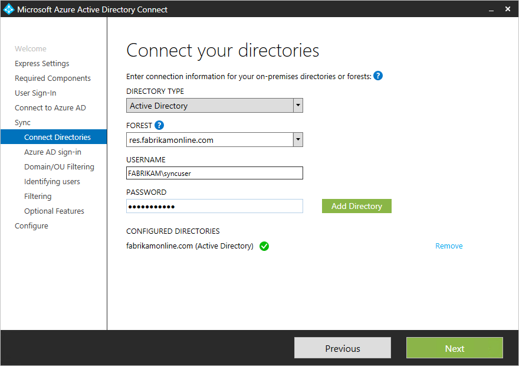

# Обновление AAD Connect для включения нескольких лесовUpdate AAD Connect to include more than one forest

Azure AD Connect поддерживает [синхронизацию из нескольких лесов](https://docs.microsoft.com/azure/active-directory/connect/active-directory-aadconnect-topologies).Azure AD Connect supports [syncing from multiple forests](https://docs.microsoft.com/azure/active-directory/connect/active-directory-aadconnect-topologies). Однако он поддерживает только один экземпляр Azure AD Connect Sync to AAD.However, it supports only one instance of Azure AD Connect syncing to AAD. Таким образом, если служба Azure AD уже установлена в одном лесу, существующий экземпляр AAD Connect необходимо обновить для синхронизации с дополнительным лесом.Therefore, in cases where Azure AD is already installed in one forest, the existing instance of AAD Connect must be updated to sync from the additional forest.

 - Если все удостоверения представлены только один раз в обоих лесах (то есть контакты с включенной поддержкой почты не были настроены), можно просто повторно запустить мастер подключения AAD, выбрать пункт "Настройка параметров синхронизации", а затем на странице **подключить каталоги** введите имя дополнительного леса и учетных записей.If all identities are represented only once across both forests (that is, you haven’t made any mail-enabled contacts), then you can simply re-run the AAD Connect wizard, choose “Customize synchronization options,” and then on the **Connect Your Directories** page, enter the name of the additional forest and creds.  
 
 - Тем не менее, если пользователи могут находиться в нескольких каталогах и вы будете объединять данные (например, если объекты Contact существуют в лесу, соответствующем пользователям в другом лесу), необходимо удалить Azure AD Connect и повторно установить ее.However, if users can exist in more than one directory and you’ll be merging the data (for example, if contact objects exist in a forest corresponding to users in another forest), you will need to uninstall Azure AD Connect and re-install it.  Это связано с тем, что условие правил подключения между лесами можно настроить только при первой установке.This is because the cross-forest join rules condition can only be configured during the first install. Это делается на следующей странице:This is done on the following page:  
 

## См. такжеSee also

[Объединение в облако для Teams и Skype для бизнесаCloud Consolidation for Teams and Skype for Business](cloud-consolidation.md)