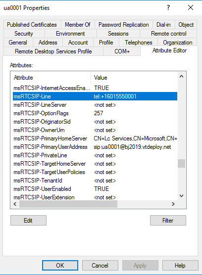

# <a name="disable-hybrid-to-complete-migration-to-the-cloud"></a>Отключение гибридной среды для завершения миграции в облако

После перемещения всех пользователей из локальной среды в облако вы можете удалить локальное развертывание Skype для бизнеса. Помимо отключения любого оборудования важным этапом является логическое отделение локального развертывания от Office 365 путем отключения гибридной среды. Отключение гибридной среды состоит из трех этапов:

1. Изменение DNS-записей, чтобы они указывали на Office 365.

2. Отключение разделенного домена в клиенте Office 365.

3. Отключение возможности локального подключения к Office 365.

Эти действия необходимо выполнить вместе как единое целое. Подробные сведения приведены ниже. Кроме того, предоставляются рекомендации по управлению номерами телефонов для мигрировавших пользователей, когда локальное развертывание отключено.

> [!Note] 
> В редких случаях изменение DNS, направленное на Office 365 для вашей организации, может привести к прекращению работы Федерации с другими организациями, пока другая организация не обновит свою конфигурацию Федерации:<ul><li>
Для всех федеративных организаций, использующих старую прямую модель Федерации (также известное как разрешенный сервер-партнер), необходимо обновить записи разрешенных доменов для своей организации, чтобы удалить полное доменное имя прокси-сервера. Эта устаревшая модель Федерации не основана на записях DNS SRV, поэтому такая конфигурация станет устаревшей после того, как ваша организация перейдет в облако. </li><li>Любая федеративная организация, у которой нет включенного поставщика услуг хостинга для sipfed. Online. Lync. <span>com необходимо обновить конфигурацию, чтобы она была включена. Такая ситуация возможна только в том случае, если федеративная организация является исключительно локальной и никогда не участвует в гибридном или интернет-клиенте. В этом случае Федерация с этими организациями не будет работать, пока не включит их поставщика услуг хостинга.</li></ul>Если вы подозреваете, что любой из федеративных партнеров может использовать прямую федерацию или иметь федеративные связи с любой локальной или гибридной организацией, мы рекомендуем вам отправить им информацию о том, как вы готовитесь к выполнению миграции в облако.

1.  *Обновите DNS, чтобы указать на Office 365.*
Необходимо обновить внешнюю DNS организации для локальной организации, чтобы записи Skype для бизнеса направляться на Office 365, а не в локальное развертывание. Это означает следующее:

    |Тип записи|Имя|TTL (Срок жизни)|Value (Значение)|
    |---|---|---|---|
    |SRV|_sipfederationtls. _tcp|3600|100 1 5061 sipfed. Online. Lync. <span>com-|
    |SRV|_sip. _tls|3600|100 1 443 sipdir. Online. Lync. <span>com-|
    |CNAME| lyncdiscover|   3600|   webdir. Online. Lync. <span>com-|
    |CNAME| sip|    3600|   sipdir. Online. Lync. <span>com-|
    |CNAME| Согласно|   3600|   webdir. Online. Lync. <span>com-|
    |CNAME| Dialin  |3600|  webdir. Online. Lync. <span>com-|

2.  *Отключите общее адресное пространство SIP в клиенте Office 365.*
Приведенная ниже команда должна быть выполнена в окне PowerShell Skype для бизнеса Online.

    ```PowerShell
    Set-CsTenantFederationConfiguration -SharedSipAddressSpace $false
    ```
 
3.  *Отключение возможности локального подключения к Office 365.*  
Приведенная ниже команда должна быть выполнена из локального окна PowerShell:
```PowerShell
    Get-CsHostingProvider|Set-CsHostingProvider -Enabled $false
```

### <a name="manage-phone-numbers-for-users-who-were-migrated-from-on-premises"></a>Управление номерами телефонов для пользователей, которые были перенесены из локальной организации

Администраторы могут управлять пользователями, которые ранее были перемещены с локального сервера Skype для бизнеса в облако, даже после того, как локальное развертывание будет списано. Существует два варианта:

- У пользователя не было значения для локальной организации LineURI перед перемещением. 

  В этом случае вы можете изменить LineURI с помощью параметров-Онпремлинеури в [командлете Set-CsUser](https://docs.microsoft.com/powershell/module/skype/set-csuser?view=skype-ps) в модуле PowerShell Skype для бизнеса Online.

- Пользователь LineURI локально до перемещения (предположительно, так как пользователь включил поддержку корпоративной голосовой связи). 

  Если вы хотите изменить LineURI, это необходимо сделать в локальной службе Active Directory и приступать к Azure AD. Для этого не требуется локальная среда Skype для бизнеса Server. Вместо этого этот атрибут, msRTCSIP, можно редактировать непосредственно в локальной службе Active Directory с помощью оснастки MMC "пользователи и компьютеры Active Directory" либо с помощью PowerShell. Если вы используете оснастку консоли управления (MMC), откройте страницу свойств пользователя, перейдите на вкладку Редактор атрибутов и найдите msRTCSIP-Line.

  

## <a name="see-also"></a>См. также

[Объединение в облако для Teams и Skype для бизнеса](cloud-consolidation.md)
