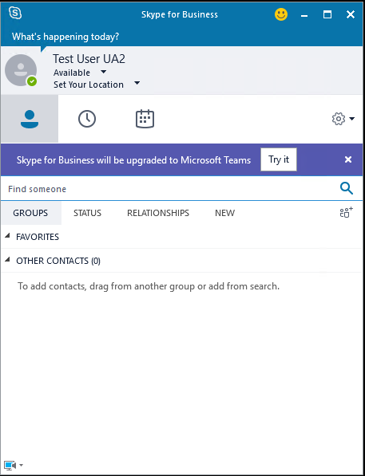

# <a name="move-users-from-on-premises-to-teams"></a>Перемещение пользователей из локальной среды в Teams

[!INCLUDE [sfbo-retirement](../../Hub/includes/sfbo-retirement.md)]

Когда пользователь перемещается из локального помещения в Teams Только, Skype для бизнеса дома пользователя перемещается из локального в online и пользователю назначено TeamsUpgradePolicy с mode=TeamsOnly.  После того как пользователь перемещается из локального в режим TeamsOnly:

- Все входящие вызовы и чаты от других пользователей (Skype для бизнеса или Teams) будут Teams клиента пользователя.
- Пользователь сможет скооперироваться с другими пользователями, которые используют Skype для бизнеса (будь то в Интернете или в помещении).
- Пользователь сможет общаться с пользователями в федерадных организациях.
- Новые собрания, запланированные этим пользователем, Teams собрания.
- Пользователь по-прежнему может присоединяться к Skype для бизнеса собраниям.
- Запланированные на будущее собрания пользователя будут перенесены из локального в Teams.
- Контакты, которые существовали на месте, доступны в Teams вскоре после того, как пользователь впервые вошел в систему.
- Пользователи не могут инициировать звонки или чаты из Skype для бизнеса и не могут планировать новые собрания в Skype для бизнеса. Если они попытаются открыть Skype для бизнеса клиента, они будут перенаправлены для использования Teams, как показано ниже. Если клиент Teams не установлен, он будет направлен в веб-версию Teams браузера.<br><br>
    

Перед перемещением пользователей обязательно просмотрите [необходимые](move-users-between-on-premises-and-cloud.md#prerequisites) условия для перемещения пользователей в облако. Также обязательно просмотрите руководство по миграции и [совместной](/microsoftteams/migration-interop-guidance-for-teams-with-skype)работы для организаций, использующих Teams вместе с Skype для бизнеса .


> [!NOTE]
> Единый магазин контактов должен быть отключен на учетной записи SfB на преме, чтобы контакт был перемещен в Teams.

> [!IMPORTANT]
>При перемещении пользователя из локального облака в облако с помощью Move-CsUser пользователям автоматически назначен режим TeamsOnly, а собрания из локального помещения автоматически преобразуются в Teams собрания независимо от того, задан ли `-MoveToTeams` переключатель. (Это включает миграции с Lync Server 2013, у которого никогда не было `-MoveToTeams` переключателя.)  Ранее, если этот переключатель не был указан, пользователи переходили из локального Skype для бизнеса Server в Skype для бизнеса Online, и их режим остался неизменным. Это недавно было изменено при подготовке к выходу на пенсию Skype для бизнеса Online.


## <a name="move-a-user-directly-from-skype-for-business-on-premises-to-teams-only"></a>Перемещение пользователя непосредственно из Skype для бизнеса в Teams только

Средства администрирования в Skype для бизнеса Server и Lync Server 2013 позволяют перемещать пользователей из локального режима в режим TeamsOnly одним шагом с помощью командлета Move-CsUser PowerShell или панели управления Skype для бизнеса Server, как описано ниже. Теперь не требуется указывать переключатель и поведение, чтобы перейти непосредственно из помещения в Teams Только теперь автоматически, независимо от того, какая версия Skype для бизнеса Server или `-MoveToTeams` Lync Server используется. 

Вы должны иметь достаточные привилегии как в локальной среде, так и в облачной службе (Microsoft 365 или Office 365), как описано в необходимых административных [учетных](move-users-between-on-premises-and-cloud.md#required-administrative-credentials)данных. Можно использовать одну учетную запись, которая имеет привилегии в обеих средах, или можно запустить локальное окно Skype для бизнеса Server Management Shell с учетными данными локального доступа и использовать параметр для указания учетных данных для Microsoft 365 с необходимой административной `-Credential` ролью.

Кроме того, необходимо убедиться, что пользователю была предоставлена лицензия на Teams (в дополнение к Skype для бизнеса Online). Не отключать лицензию Skype для бизнеса Online.

### <a name="move-to-teams-using-move-csuser"></a>Переместите Teams с Move-CsUser

Move-CsUser можно получить в локальном окне Skype для бизнеса Server PowerShell с оболочкой управления или в окне PowerShell для управления Lync Server. Перемещение пользователя в режим TeamsOnly с помощью Move-CsUser:
- Укажите пользователя для перемещения с помощью `Identity` параметра.
- Укажите `-Target` параметр со значением sipfed.online.lync. <span> com".
- Если у вас нет одной учетной записи с достаточными разрешениями как на локальной, так и на облачной службе (Microsoft 365), используйте этот параметр, чтобы предоставить учетную запись с достаточными `-credential` разрешениями в Microsoft 365.
- Если учетная запись с разрешениями в Microsoft 365 не заканчивается в onmicrosoft. <span> com", необходимо указать параметр с правильным значением, как описано в `-HostedMigrationOverrideUrl` [необходимых административных учетных данных](move-users-between-on-premises-and-cloud.md#required-administrative-credentials).

Следующая последовательность командлетов может использоваться для перемещения пользователя в TeamsOnly и предполагает, что учетная запись Microsoft 365 является отдельной учетной записью и предоставляется в качестве ввода для Get-Credential запроса. Поведение одно и то же, указывается переключатель `-MoveToTeams` или нет.

  ```powershell
  $cred=Get-Credential
  $url="https://admin1a.online.lync.com/HostedMigration/hostedmigrationService.svc"
  Move-CsUser -Identity username@contoso.com -Target sipfed.online.lync.com -Credential $cred -HostedMigrationOverrideUrl $url
  ```

> [!TIP]
> Поскольку существуют различные условия, требующие различных параметров, по умолчанию в большинстве случаев существует команда:

```powershell
Move-CsUser -Identity username@contoso.com -Target sipfed.online.lync.com -UseOAuth -HostedMigrationOverrideUrl $url
```

### <a name="move-to-teams-using-skype-for-business-server-control-panel"></a>Перемещение в Teams с Skype для бизнеса Server панели управления

1. Откройте приложение Skype для бизнеса Server панели управления.
2. В левой навигации выберите **Пользователи**.
3. Используйте **Поиск,** чтобы найти пользователя(ы) вы хотели бы перейти к Teams.
4. Выберите пользователя(ы), а затем, из выпадаемой ниже списка действия, выберите Перемещение выбранных пользователей в Teams или Переместить выбранных пользователей в **Skype для бизнеса Online**.     Теперь любой параметр перемещает пользователей непосредственно в TeamsOnly.
5. В мастере нажмите кнопку **Далее**.
6. В случае запроса вопишитесь Microsoft 365 с учетной записью, которая заканчивается в .onmicrosoft.com и имеет достаточно разрешений.
7. Нажмите **кнопку Далее,** а **затем** еще раз, чтобы переместить пользователя.
8. Обратите внимание, что сообщения о состоянии, касающиеся успеха или сбоя, предоставляются в верхней части основного приложения панели управления, а не в мастере.
    
    
## <a name="notify-your-skype-for-business-on-premises-users-of-the-upcoming-move-to-teams"></a>Сообщите Skype для бизнеса локальному пользователю о предстоящем переходе в Teams

Средства локального администрирования в Skype для бизнеса Server 2015 г. с cu8, а также в Skype для бизнеса Server 2019 г. позволяют уведомлять Skype для бизнеса пользователей о предстоящем переходе в Teams. Когда вы включаете эти уведомления, пользователи увидят уведомление в Skype для бизнеса клиенте (Win32, Mac, web и mobile), как показано ниже. Если пользователи нажмет кнопку **Try it,** Teams клиент будет запущен, если он установлен; в противном случае пользователи будут перенавигуться в веб-версию Teams в браузере. По умолчанию при включении уведомлений клиенты Win32 Skype для бизнеса безмолвно загружают клиент Teams, чтобы богатый клиент был доступен до перехода пользователя в режим TeamsOnly; однако вы также можете отключить это поведение.  Уведомления настраиваются с помощью локальной версии, а бесшумная загрузка для клиентов Win32 контролируется с помощью локального `TeamsUpgradePolicy` `TeamsUpgradeConfiguration` комлета.

> [!TIP]
> Некоторым серверам может потребоваться перезагрузка для работы в Skype для бизнеса 2015 г. с cu8.



Чтобы уведомить пользователей о скором обновлении до Teams, создайте новый экземпляр TeamsUpgradePolicy с помощью NotifySfBUsers=true. Затем назначьте эту политику пользователям, которых вы хотите уведомить, назначив политику непосредственно пользователю или установив политику на сайте, пуле или глобальном уровне. Следующие cmdlets создать и предоставить политику на уровне пользователя:

```powershell
New-CsTeamsUpgradePolicy -Identity EnableNotifications -NotifySfbUser $true
Grant-CsTeamsUpgradePolicy -Identity username@contoso.com -PolicyName EnableNotifications
```

Автоматическая загрузка Teams через клиент Skype для бизнеса Win32 контролируется с помощью локального командлета TeamsUpgradeConfiguration с параметром DownloadTeams. Вы создаете эту конфигурацию на глобальном, сайте и уровне пула. Например, следующая команда создает конфигурацию для сайта Redmond1:

```powershell
New-CsTeamsUpgradeConfiguration -Identity "site:redmond1"
```

По умолчанию значение DownloadTeams является true; Однако это честь только *в* том случае, если NotifySfbUser = True для данного пользователя.

## <a name="see-also"></a>См. также

[Move-CsUser](/powershell/module/skype/move-csuser)

[Grant-CsTeamsUpgradePolicy](/powershell/module/skype/grant-csteamsupgradepolicy
)

[Руководство по миграции и взаимодействию для организаций, использующих Teams вместе со Skype для бизнеса](/microsoftteams/migration-interop-guidance-for-teams-with-skype)

[Сосуществование со Skype для бизнеса](/microsoftteams/coexistence-chat-calls-presence)
