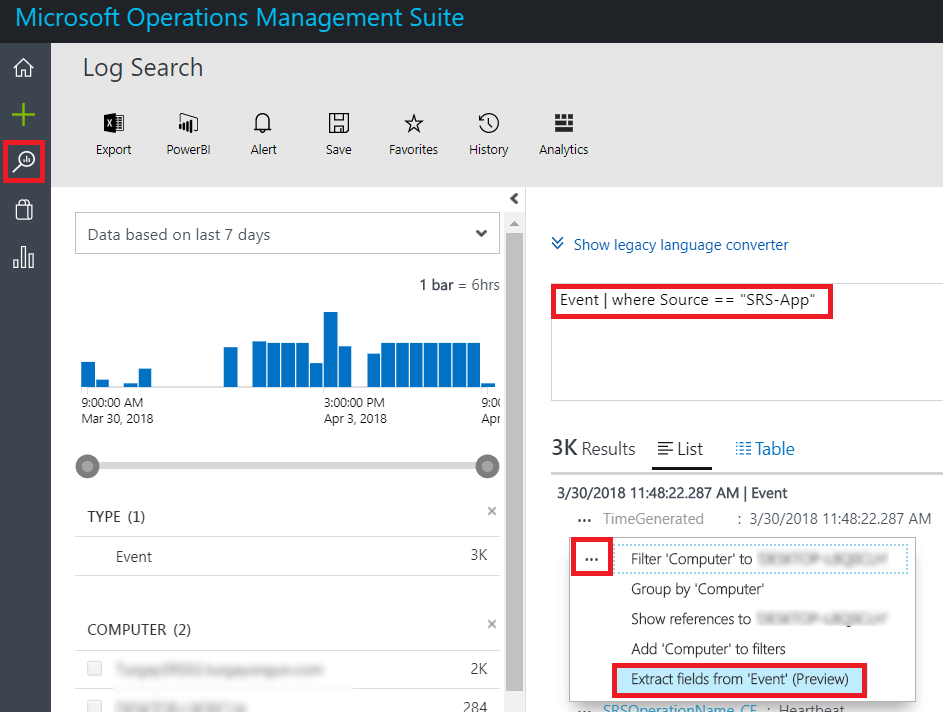
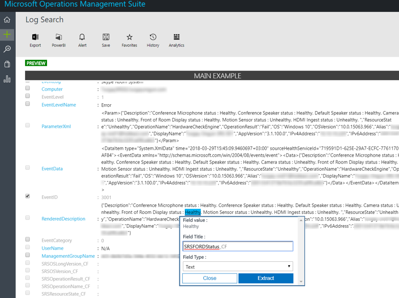
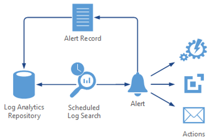
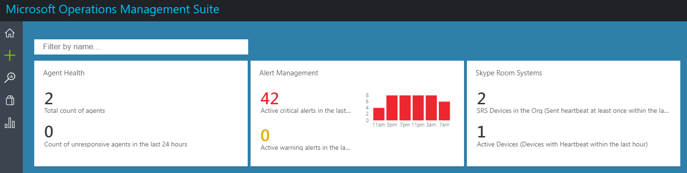

# <a name="deploy-skype-room-systems-v2-management-with-oms"></a><span data-ttu-id="80c3a-103">Развертывание управления системами комнат Skype версии 2 с помощью OMS</span><span class="sxs-lookup"><span data-stu-id="80c3a-103">Deploy Skype Room Systems v2 management with OMS</span></span>
 
<span data-ttu-id="80c3a-104">В этой статье описывается установка и развертывание интегрированная, сквозного управления устройствами версии 2 Скайп комнаты систем с помощью Microsoft Operations Management Suite.</span><span class="sxs-lookup"><span data-stu-id="80c3a-104">This article discusses how to set up and deploy integrated, end-to-end management of Skype Room Systems v2 devices by using Microsoft Operations Management Suite.</span></span>
  
<span data-ttu-id="80c3a-105">Можно настроить пакет управления Microsoft операций для обеспечения базовой телеметрии и оповещения, которые помогут вам управлять Скайп собрания комнаты устройств.</span><span class="sxs-lookup"><span data-stu-id="80c3a-105">You can configure Microsoft Operations Management Suite to provide basic telemetry and alerts that will help you manage Skype meeting room devices.</span></span> <span data-ttu-id="80c3a-106">Мере разработки решения по управлению можно развернуть дополнительные данные и возможности управления для создания более подробные представления производительности и доступности устройства.</span><span class="sxs-lookup"><span data-stu-id="80c3a-106">As your management solution matures, you might decide to deploy additional data and management capabilities to create a more detailed view of device availability and performance.</span></span>

<span data-ttu-id="80c3a-107">Выполнив в этом руководстве, можно использовать панели мониторинга как следующий пример, чтобы получить подробные сведения о состоянии отчетов о доступности устройства, приложения и работоспособности оборудования и распространения версии приложений систем комнаты Скайп версии 2.</span><span class="sxs-lookup"><span data-stu-id="80c3a-107">By following this guide, you can use a dashboard like the following example to get detailed status reporting for device availability, application and hardware health, and Skype Room Systems v2 application version distribution.</span></span>

<span data-ttu-id="80c3a-108">![Пример OMS представления для SRS версии 2] (../../media/Deploy_OMS_1.png "Пример OMS представления для SRS версии 2")</span><span class="sxs-lookup"><span data-stu-id="80c3a-108"></span></span>
  
<span data-ttu-id="80c3a-109">В общих чертах вам необходимо выполнить следующие задачи.</span><span class="sxs-lookup"><span data-stu-id="80c3a-109">At a high level, you need to perform the following tasks:</span></span>


1.  [<span data-ttu-id="80c3a-110">Проверка конфигурации пакет управления Operations</span><span class="sxs-lookup"><span data-stu-id="80c3a-110">Validate Operations Management Suite configuration</span></span>](with-oms.md#validate_OMS)
2.  [<span data-ttu-id="80c3a-111">Настройка тестовых устройств для настройки управления Operations Management Suite</span><span class="sxs-lookup"><span data-stu-id="80c3a-111">Configure test devices for Operations Management Suite management setup</span></span>](with-oms.md#configure_test_devices)
3.  [<span data-ttu-id="80c3a-112">Сопоставление настраиваемых полей</span><span class="sxs-lookup"><span data-stu-id="80c3a-112">Map custom fields</span></span>](with-oms.md#Custom_fields)
4.  [<span data-ttu-id="80c3a-113">Определение представлений систем комнаты Скайп версии 2 в пакет управления Operations</span><span class="sxs-lookup"><span data-stu-id="80c3a-113">Define the Skype Room Systems v2 views in Operations Management Suite</span></span>](with-oms.md#Define_Views)
5.  [<span data-ttu-id="80c3a-114">Определение оповещений</span><span class="sxs-lookup"><span data-stu-id="80c3a-114">Define alerts</span></span>](with-oms.md#Alerts)
6.  [<span data-ttu-id="80c3a-115">Настройка всех устройств для управления набора операций</span><span class="sxs-lookup"><span data-stu-id="80c3a-115">Configure all devices for Operations Management Suite</span></span>](with-oms.md#configure_all_devices)
7.  [<span data-ttu-id="80c3a-116">Настройка дополнительных операций Management Suite решений</span><span class="sxs-lookup"><span data-stu-id="80c3a-116">Configure additional Operations Management Suite solutions</span></span>](with-oms.md#Solutions)

> [!IMPORTANT]
> <span data-ttu-id="80c3a-117">Несмотря на то, что в минимальной конфигурации пакет управления Operations можно отслеживать компьютера под управлением операционной системы Windows, по-прежнему существует некоторых систем комнаты Скайп версии 2 – этапов, которые необходимо выполнить перед началом развертывания агентов всех Скайп комнаты Устройства системы.</span><span class="sxs-lookup"><span data-stu-id="80c3a-117">Although with minimal configuration, the Operations Management Suite can monitor a computer running a Windows operating system, there are still some Skype Room Systems v2–specific steps that you need to take before you start deploying agents to all Skype Room Systems devices.</span></span>
> <span data-ttu-id="80c3a-118">Таким образом настоятельно рекомендуется выполнить все действия по настройке в правильном порядке для управляемой установки и настройки.</span><span class="sxs-lookup"><span data-stu-id="80c3a-118">Therefore, we highly recommend you perform all configuration steps in the right order for a controlled setup and configuration.</span></span> <span data-ttu-id="80c3a-119">Качество конечный результат сильно зависит от качества начальной настройки.</span><span class="sxs-lookup"><span data-stu-id="80c3a-119">The quality of the end result very much depends on the quality of the initial configuration.</span></span>

## <a name="validate-operations-management-suite-configuration"></a><span data-ttu-id="80c3a-120">Проверка конфигурации пакет управления Operations</span><span class="sxs-lookup"><span data-stu-id="80c3a-120">Validate Operations Management Suite configuration</span></span>
<span data-ttu-id="80c3a-121"><a name="validate_OMS"> </a></span><span class="sxs-lookup"><span data-stu-id="80c3a-121"></span></span>

<span data-ttu-id="80c3a-122">Необходимо установить пакет управления Operations рабочей области для запуска сбор данных в журналах с системами комнаты Скайп v2 устройств.</span><span class="sxs-lookup"><span data-stu-id="80c3a-122">You need to have an Operations Management Suite workspace to start collecting logs from Skype Room Systems v2 devices.</span></span> <span data-ttu-id="80c3a-123">Рабочая область — уникальный анализа журнала среды с собственными хранилище данных, источники данных и решения.</span><span class="sxs-lookup"><span data-stu-id="80c3a-123">A workspace is a unique Log Analytics environment with its own data repository, data sources, and solutions.</span></span> <span data-ttu-id="80c3a-124">Если у вас уже есть существующей рабочей области для анализа журнала, его можно использовать для отслеживания развертывания систем комнаты Скайп версии 2 или можно создать должно выделенного анализа журнала рабочую область для наблюдение за системами комнаты Скайп версии 2.</span><span class="sxs-lookup"><span data-stu-id="80c3a-124">If you already have an existing Log Analytics workspace, you might use it to monitor your Skype Room Systems v2 deployment or you can create a dedicated Log Analytics workspace specific to your Skype Room Systems v2 monitoring needs.</span></span>

<span data-ttu-id="80c3a-125">Если вам необходимо создать новую рабочую область анализа журнала, следуйте инструкциям, представленным в статье [Создание рабочей области для анализа журнала на портале Azure](https://docs.microsoft.com/azure/log-analytics/log-analytics-quick-create-workspace)</span><span class="sxs-lookup"><span data-stu-id="80c3a-125">If you need to create a new Log Analytics workspace, follow the instructions in the article [Create a Log Analytics workspace in the Azure portal](https://docs.microsoft.com/azure/log-analytics/log-analytics-quick-create-workspace)</span></span>

> [!NOTE]
> <span data-ttu-id="80c3a-126">Для использования журнала аналитики с помощью пакета управления Operations, необходимо иметь active Azure подписки.</span><span class="sxs-lookup"><span data-stu-id="80c3a-126">To use Log Analytics with Operations Management Suite, you need to have an active Azure subscription.</span></span> <span data-ttu-id="80c3a-127">Если у вас нет Azure подписки, можно создать [бесплатную пробную подписку](https://azure.microsoft.com/free) в качестве отправной точки.</span><span class="sxs-lookup"><span data-stu-id="80c3a-127">If you don’t have an Azure subscription, you can create [a free trial subscription](https://azure.microsoft.com/free) as a starting point.</span></span>


### <a name="configure-operations-management-suite-to-collect-skype-room-systems-v2-event-logs"></a><span data-ttu-id="80c3a-128">Настройка операций Management Suite собирать систем комнаты Скайп версии 2</span><span class="sxs-lookup"><span data-stu-id="80c3a-128">Configure Operations Management Suite to collect Skype Room Systems v2 event logs</span></span>

<span data-ttu-id="80c3a-129">Аналитика журнала только собирает события в журнале событий Windows, которые указаны в диалоговом окне настройки.</span><span class="sxs-lookup"><span data-stu-id="80c3a-129">Log Analytics only collects events from the Windows event logs that are specified in the settings.</span></span> <span data-ttu-id="80c3a-130">Для каждого журнала событий с помощью выбранного серьезности собираются.</span><span class="sxs-lookup"><span data-stu-id="80c3a-130">For each log, only the events with the selected severities are collected.</span></span>

<span data-ttu-id="80c3a-131">Необходимо настроить Operations Management Suite собирать журналы, требуемые для отслеживания состояния устройства и приложение-версии 2 Скайп комнаты систем.</span><span class="sxs-lookup"><span data-stu-id="80c3a-131">You need to configure Operations Management Suite to collect the logs required to monitor Skype Room Systems v2 device and application status.</span></span> <span data-ttu-id="80c3a-132">Устройства v2 систем комнаты Скайп используют **Скайп комнаты системный** журнал событий.</span><span class="sxs-lookup"><span data-stu-id="80c3a-132">Skype Room Systems v2 devices use the **Skype Room System** event log.</span></span>

<span data-ttu-id="80c3a-133">Настройка набора операций управления для сбора событий версии 2 Скайп комнаты систем, в статье [источников данных журнала событий Windows в аналитике журнала](https://docs.microsoft.com/azure/log-analytics/log-analytics-data-sources-windows-events)</span><span class="sxs-lookup"><span data-stu-id="80c3a-133">To configure Operations Management Suite to collect the Skype Room Systems v2 events, see [Windows event log data sources in Log Analytics](https://docs.microsoft.com/azure/log-analytics/log-analytics-data-sources-windows-events)</span></span>

<span data-ttu-id="80c3a-134">![Параметры журнала событий] (../../media/Deploy_OMS_2.png "Параметры журнала событий")</span><span class="sxs-lookup"><span data-stu-id="80c3a-134"></span></span>


> [!IMPORTANT]
> <span data-ttu-id="80c3a-135">Выберите **Скайп комнаты системный** журнал событий и затем установите флажки **ошибки**, **предупреждения**и **сведения** .</span><span class="sxs-lookup"><span data-stu-id="80c3a-135">Select the **Skype Room System** event log, and then select the **Error**, **Warning**, and **Information** check boxes.</span></span>

## <a name="configure-test-devices-for-operations-management-suite-setup"></a><span data-ttu-id="80c3a-136">Настройка тестовых устройств для установки пакетов управления Operations</span><span class="sxs-lookup"><span data-stu-id="80c3a-136">Configure test devices for Operations Management Suite setup</span></span>
<span data-ttu-id="80c3a-137"><a name="configure_test_devices"> </a></span><span class="sxs-lookup"><span data-stu-id="80c3a-137"></span></span>

<span data-ttu-id="80c3a-138">Необходимо подготовить набор операций управления должны иметь возможность отслеживания событий, связанных с версии 2 Скайп комнаты систем.</span><span class="sxs-lookup"><span data-stu-id="80c3a-138">You need to prepare Operations Management Suite to be able to monitor Skype Room Systems v2–related events.</span></span> <span data-ttu-id="80c3a-139">Начать с, необходимо выполнить развертывание агентов пакет управления Operations устройств версии 2 систем комнаты Скайп только один или два физических доступ к и передавать эти устройства проверки создания некоторых данных и записывать его в рабочую область аналитических журнала.</span><span class="sxs-lookup"><span data-stu-id="80c3a-139">To start with, you need to deploy Operations Management Suite agents to just one or two Skype Room Systems v2 devices that you have physical access to and have those test devices generate some data and push it to the Log Analytics workspace.</span></span>

### <a name="install-operations-management-suite-agents-to-test-devices"></a><span data-ttu-id="80c3a-140">Установить пакет управления Operations агенты для тестирования устройств</span><span class="sxs-lookup"><span data-stu-id="80c3a-140">Install Operations Management Suite agents to test devices</span></span>

<span data-ttu-id="80c3a-141">Развертывание агента Operations Management Suite тестовых устройств с помощью инструкций, приведенных в [компьютеры Windows подключиться к службе анализа журнала в Azure](https://docs.microsoft.com/azure/log-analytics/log-analytics-agent-windows).</span><span class="sxs-lookup"><span data-stu-id="80c3a-141">Deploy the Operations Management Suite agent to the test devices by using the instructions provided in [Connect Windows computers to the Log Analytics service in Azure](https://docs.microsoft.com/azure/log-analytics/log-analytics-agent-windows).</span></span> <span data-ttu-id="80c3a-142">В этой статье приводятся подробные сведения о действиях, которые для развертывания Microsoft мониторинга агента для Windows, инструкции по получении пакет управления Operations *Идентификатор рабочей области* и *первичный ключ* для получения устройств систем комнаты Скайп версии 2 подключена к развертывания пакета управления операции и действия для проверки подключения агента анализа журнала.</span><span class="sxs-lookup"><span data-stu-id="80c3a-142">This article gives detailed information about the steps for deploying Microsoft Monitoring Agent for Windows, instructions for obtaining the Operations Management Suite *Workspace ID* and the *primary key* to get Skype Room Systems v2 devices connected to your Operations Management Suite deployment, and steps to verify agent connectivity to Log Analytics.</span></span>

### <a name="generate-sample-skype-room-systems-events"></a><span data-ttu-id="80c3a-143">Создание образца Скайп комнаты системных событий</span><span class="sxs-lookup"><span data-stu-id="80c3a-143">Generate sample Skype Room Systems events</span></span>

<span data-ttu-id="80c3a-144">После развертывания агентов управления набор операций на тестовых устройств убедитесь, что аналитика журнала собирают данные журналов событий.</span><span class="sxs-lookup"><span data-stu-id="80c3a-144">After the Operations Management Suite agent is deployed onto the test devices, verify that the required event log data is collected by Log Analytics.</span></span>

1.  <span data-ttu-id="80c3a-145">Войдите в [портал Microsoft Operations Management Suite](http://aka.ms/omsportal).</span><span class="sxs-lookup"><span data-stu-id="80c3a-145">Sign in to the [Microsoft Operations Management Suite portal](http://aka.ms/omsportal).</span></span>

2.  <span data-ttu-id="80c3a-146">Перечислены события, создаваемые устройства версии 2 Скайп комнаты систем:</span><span class="sxs-lookup"><span data-stu-id="80c3a-146">List the events generated by a Skype Room Systems v2 device:</span></span>
    1.  <span data-ttu-id="80c3a-147">Перейти к **Поиску журнала** и использовать запрос для извлечения записей, которые будут иметь настраиваемого поля.</span><span class="sxs-lookup"><span data-stu-id="80c3a-147">Go to **Log Search** and use a query to retrieve the records that will have the custom field.</span></span>
    2.  <span data-ttu-id="80c3a-148">Пример запроса:`Event | where Source == "SRS-App"`</span><span class="sxs-lookup"><span data-stu-id="80c3a-148">Sample query: `Event | where Source == "SRS-App"`</span></span>

3.  <span data-ttu-id="80c3a-149">Убедитесь в том, что запрос возвращает записи журнала, включая успешные пульса события.</span><span class="sxs-lookup"><span data-stu-id="80c3a-149">Make sure that the query returns log records that include successful heartbeat events.</span></span>

4.  <span data-ttu-id="80c3a-150">Создание проблема оборудования и проверить, что необходимые события регистрируются в пакет управления Operations.</span><span class="sxs-lookup"><span data-stu-id="80c3a-150">Generate a hardware issue, and validate that the required events are logged in Operations Management Suite.</span></span>
    1.  <span data-ttu-id="80c3a-151">Отключите один из периферийных устройств на тестовых систем комнаты Скайп v2 системы.</span><span class="sxs-lookup"><span data-stu-id="80c3a-151">Unplug one of the peripheral devices on the test Skype Room Systems v2 system.</span></span> <span data-ttu-id="80c3a-152">Это может быть камера, устройство громкой связи, микрофон или отображения передний план комнаты</span><span class="sxs-lookup"><span data-stu-id="80c3a-152">This could be the camera, speakerphone, microphone, or Front Room Display</span></span>
    2.  <span data-ttu-id="80c3a-153">Подождите 10 минут для журнала событий, которые следует добавить в пакет управления Operations.</span><span class="sxs-lookup"><span data-stu-id="80c3a-153">Wait 10 minutes for the event log to be populated in Operations Management Suite.</span></span>
    3.  <span data-ttu-id="80c3a-154">Использование запроса для списка Список аппаратных предупреждений об ошибках:`Event | where EventID == 3001`</span><span class="sxs-lookup"><span data-stu-id="80c3a-154">Use a query to list hardware error events: `Event | where EventID == 3001`</span></span>

5.  <span data-ttu-id="80c3a-155">Создание проблем приложений и проверки необходимых событий.</span><span class="sxs-lookup"><span data-stu-id="80c3a-155">Generate an application issue, and validate that the required events are logged.</span></span>
    1.  <span data-ttu-id="80c3a-156">Изменение конфигурации приложения v2 Скайп комнаты систем и введите пара неправильный адрес и пароль Session Initiation Protocol (SIP).</span><span class="sxs-lookup"><span data-stu-id="80c3a-156">Modify Skype Room Systems v2 application configuration, and type an incorrect Session Initiation Protocol (SIP) address/password pair.</span></span>
    2.  <span data-ttu-id="80c3a-157">Подождите 10 минут для журнала событий, которые следует добавить в пакет управления Operations.</span><span class="sxs-lookup"><span data-stu-id="80c3a-157">Wait 10 minutes for the event log to be populated in Operations Management Suite.</span></span>
    3.  <span data-ttu-id="80c3a-158">Использование запроса на события ошибки приложения списка:`Event | where EventID == 2001`</span><span class="sxs-lookup"><span data-stu-id="80c3a-158">Use a query to list application error events: `Event | where EventID == 2001`</span></span>

> [!IMPORTANT]
> <span data-ttu-id="80c3a-159">Эти журналы событий примера требуются перед настраиваемых полей можно настроить.</span><span class="sxs-lookup"><span data-stu-id="80c3a-159">These sample event logs are required before custom fields can be configured.</span></span> <span data-ttu-id="80c3a-160">Не переходите к следующему шагу, пока не будут собраны необходимые журналы событий.</span><span class="sxs-lookup"><span data-stu-id="80c3a-160">Don’t proceed to the next step until you have collected the required event logs.</span></span>

## <a name="map-custom-fields"></a><span data-ttu-id="80c3a-161">Сопоставление настраиваемых полей</span><span class="sxs-lookup"><span data-stu-id="80c3a-161">Map custom fields</span></span>
<span data-ttu-id="80c3a-162"><a name="Custom_fields"> </a></span><span class="sxs-lookup"><span data-stu-id="80c3a-162"></span></span>

<span data-ttu-id="80c3a-163">Использование настраиваемых полей для извлечения данных из журналов событий.</span><span class="sxs-lookup"><span data-stu-id="80c3a-163">You use custom fields to extract specific data from the event logs.</span></span> <span data-ttu-id="80c3a-164">Необходимо определить настраиваемые поля, которые будут использоваться позднее представления панели мониторинга, оповещения и заголовков.</span><span class="sxs-lookup"><span data-stu-id="80c3a-164">You need to define custom fields that will be used later with your tiles, dashboard views, and alerts.</span></span> <span data-ttu-id="80c3a-165">Просмотреть [настраиваемых полей в аналитике журнала](https://docs.microsoft.com/azure/log-analytics/log-analytics-custom-fields) и ознакомиться с понятиями, прежде чем начать создание настраиваемых полей.</span><span class="sxs-lookup"><span data-stu-id="80c3a-165">See [Custom fields in Log Analytics](https://docs.microsoft.com/azure/log-analytics/log-analytics-custom-fields) and become familiar with the concepts before you start creating your custom fields.</span></span>

<span data-ttu-id="80c3a-166">Чтобы извлечь настраиваемых полей из него захвата журналы событий, выполните следующие действия:</span><span class="sxs-lookup"><span data-stu-id="80c3a-166">To extract your custom fields out of the captured event logs, follow these steps:</span></span>

1.  <span data-ttu-id="80c3a-167">Войдите в [портал Microsoft Operations Management Suite](http://aka.ms/omsportal).</span><span class="sxs-lookup"><span data-stu-id="80c3a-167">Sign in to the [Microsoft Operations Management Suite portal](http://aka.ms/omsportal).</span></span>

2.  <span data-ttu-id="80c3a-168">Перечислены события, создаваемые устройства версии 2 Скайп комнаты систем:</span><span class="sxs-lookup"><span data-stu-id="80c3a-168">List the events generated by a Skype Room Systems v2 device:</span></span>
    1.  <span data-ttu-id="80c3a-169">Перейти к **Поиску журнала** и использовать запрос для извлечения записей, которые будут иметь настраиваемого поля.</span><span class="sxs-lookup"><span data-stu-id="80c3a-169">Go to **Log Search** and use a query to retrieve the records that will have the custom field.</span></span>
    2.  <span data-ttu-id="80c3a-170">Пример запроса:`Event | where Source == "SRS-App"`</span><span class="sxs-lookup"><span data-stu-id="80c3a-170">Sample query: `Event | where Source == "SRS-App"`</span></span>

3.  <span data-ttu-id="80c3a-171">Выберите один из записей, нажмите кнопку слева и запустите мастер извлечения поля.</span><span class="sxs-lookup"><span data-stu-id="80c3a-171">Select one of the records, select the button to the left, and start the field extraction wizard.</span></span>

   <span data-ttu-id="80c3a-172">![Мастер извлечения поля] (../../media/Deploy_OMS_3.png "Мастер извлечения поля")</span><span class="sxs-lookup"><span data-stu-id="80c3a-172"></span></span>

4.  <span data-ttu-id="80c3a-173">Выделите данные, которые вы хотите извлечь из RenderedDescription и укажите название поля.</span><span class="sxs-lookup"><span data-stu-id="80c3a-173">Highlight the data you’d like to extract from the RenderedDescription and provide a Field Title.</span></span> <span data-ttu-id="80c3a-174">В таблице 1 приведены имена полей, которые следует использовать.</span><span class="sxs-lookup"><span data-stu-id="80c3a-174">The field names that you should use are provided in Table 1.</span></span>

   <span data-ttu-id="80c3a-175">![Определение настраиваемого поля] (../../media/Deploy_OMS_4.png "Определение настраиваемого поля")</span><span class="sxs-lookup"><span data-stu-id="80c3a-175"></span></span>

5.  <span data-ttu-id="80c3a-176">Использование сопоставлений, показано в *таблице 1*.</span><span class="sxs-lookup"><span data-stu-id="80c3a-176">Use the mappings shown in *Table 1*.</span></span> <span data-ttu-id="80c3a-177">Пакет управления Operations автоматически добавляет ** \_CF** строка при определении нового поля.</span><span class="sxs-lookup"><span data-stu-id="80c3a-177">Operations Management Suite will automatically add the **\_CF** string when you define the new field.</span></span>

> [!IMPORTANT]
> <span data-ttu-id="80c3a-178">Имейте в виду, что все поля JSON и пакет управления Operations зависят от регистра символов.</span><span class="sxs-lookup"><span data-stu-id="80c3a-178">Remember that all JSON and Operations Management Suite fields are case-sensitive.</span></span>

> <span data-ttu-id="80c3a-179">Обратите внимание на состояние флажка EventID в таблице ниже.</span><span class="sxs-lookup"><span data-stu-id="80c3a-179">Pay attention to the state of the EventID check box in the table below.</span></span> <span data-ttu-id="80c3a-180">Убедитесь, что проверить состояние этого флажка для операций Management Suite успешно извлечение значения настраиваемых полей.</span><span class="sxs-lookup"><span data-stu-id="80c3a-180">Be sure you confirm the state of this check box for Operations Management Suite to successfully extract custom field values.</span></span>
> 
> <span data-ttu-id="80c3a-181">![Определение настраиваемого поля] (../../media/Deploy_OMS_5.png "Определение настраиваемого поля")</span><span class="sxs-lookup"><span data-stu-id="80c3a-181"></span></span> 

<span data-ttu-id="80c3a-182">**В таблице 1**</span><span class="sxs-lookup"><span data-stu-id="80c3a-182">**Table 1**</span></span>

| <span data-ttu-id="80c3a-183">Поле JSON</span><span class="sxs-lookup"><span data-stu-id="80c3a-183">JSON field</span></span>                   | <span data-ttu-id="80c3a-184">Настраиваемое поле OMS</span><span class="sxs-lookup"><span data-stu-id="80c3a-184">OMS custom field</span></span>           | <span data-ttu-id="80c3a-185">Идентификатор события</span><span class="sxs-lookup"><span data-stu-id="80c3a-185">Event ID</span></span>        |
|:-----------------------------|:---------------------------|:----------------|
| <span data-ttu-id="80c3a-186">Описание</span><span class="sxs-lookup"><span data-stu-id="80c3a-186">Description</span></span>                  | <span data-ttu-id="80c3a-187">SRSEventDescription_CF</span><span class="sxs-lookup"><span data-stu-id="80c3a-187">SRSEventDescription_CF</span></span>     | <span data-ttu-id="80c3a-188">Не выбран</span><span class="sxs-lookup"><span data-stu-id="80c3a-188">Not selected</span></span>    |
| <span data-ttu-id="80c3a-189">ResourceState</span><span class="sxs-lookup"><span data-stu-id="80c3a-189">ResourceState</span></span>                | <span data-ttu-id="80c3a-190">SRSResourceState_CF</span><span class="sxs-lookup"><span data-stu-id="80c3a-190">SRSResourceState_CF</span></span>        | <span data-ttu-id="80c3a-191">Не выбран</span><span class="sxs-lookup"><span data-stu-id="80c3a-191">Not selected</span></span>    |
| <span data-ttu-id="80c3a-192">Имя_операции</span><span class="sxs-lookup"><span data-stu-id="80c3a-192">OperationName</span></span>                | <span data-ttu-id="80c3a-193">SRSOperationName_CF</span><span class="sxs-lookup"><span data-stu-id="80c3a-193">SRSOperationName_CF</span></span>        | <span data-ttu-id="80c3a-194">Не выбран</span><span class="sxs-lookup"><span data-stu-id="80c3a-194">Not selected</span></span>    |
| <span data-ttu-id="80c3a-195">OperationResult</span><span class="sxs-lookup"><span data-stu-id="80c3a-195">OperationResult</span></span>              | <span data-ttu-id="80c3a-196">SRSOperationResult_CF</span><span class="sxs-lookup"><span data-stu-id="80c3a-196">SRSOperationResult_CF</span></span>      | <span data-ttu-id="80c3a-197">Не выбран</span><span class="sxs-lookup"><span data-stu-id="80c3a-197">Not selected</span></span>    |
| <span data-ttu-id="80c3a-198">OS</span><span class="sxs-lookup"><span data-stu-id="80c3a-198">OS</span></span>                           | <span data-ttu-id="80c3a-199">SRSOSVersion_CF</span><span class="sxs-lookup"><span data-stu-id="80c3a-199">SRSOSVersion_CF</span></span>            | <span data-ttu-id="80c3a-200">Не выбран</span><span class="sxs-lookup"><span data-stu-id="80c3a-200">Not selected</span></span>    |
| <span data-ttu-id="80c3a-201">OSVersion</span><span class="sxs-lookup"><span data-stu-id="80c3a-201">OSVersion</span></span>                    | <span data-ttu-id="80c3a-202">SRSOSLongVersion_CF</span><span class="sxs-lookup"><span data-stu-id="80c3a-202">SRSOSLongVersion_CF</span></span>        | <span data-ttu-id="80c3a-203">Не выбран</span><span class="sxs-lookup"><span data-stu-id="80c3a-203">Not selected</span></span>    |
| <span data-ttu-id="80c3a-204">Alias</span><span class="sxs-lookup"><span data-stu-id="80c3a-204">Alias</span></span>                        | <span data-ttu-id="80c3a-205">SRSAlias_CF</span><span class="sxs-lookup"><span data-stu-id="80c3a-205">SRSAlias_CF</span></span>                | <span data-ttu-id="80c3a-206">Не выбран</span><span class="sxs-lookup"><span data-stu-id="80c3a-206">Not selected</span></span>    |
| <span data-ttu-id="80c3a-207">Отображаемое имя</span><span class="sxs-lookup"><span data-stu-id="80c3a-207">DisplayName</span></span>                  | <span data-ttu-id="80c3a-208">SRSDisplayName_CF</span><span class="sxs-lookup"><span data-stu-id="80c3a-208">SRSDisplayName_CF</span></span>          | <span data-ttu-id="80c3a-209">Не выбран</span><span class="sxs-lookup"><span data-stu-id="80c3a-209">Not selected</span></span>    |
| <span data-ttu-id="80c3a-210">AppVersion</span><span class="sxs-lookup"><span data-stu-id="80c3a-210">AppVersion</span></span>                   | <span data-ttu-id="80c3a-211">SRSAppVersion_CF</span><span class="sxs-lookup"><span data-stu-id="80c3a-211">SRSAppVersion_CF</span></span>           | <span data-ttu-id="80c3a-212">Не выбран</span><span class="sxs-lookup"><span data-stu-id="80c3a-212">Not selected</span></span>    |
| <span data-ttu-id="80c3a-213">IPv4-адрес</span><span class="sxs-lookup"><span data-stu-id="80c3a-213">IPv4Address</span></span>                  | <span data-ttu-id="80c3a-214">SRSIPv4Address_CF</span><span class="sxs-lookup"><span data-stu-id="80c3a-214">SRSIPv4Address_CF</span></span>          | <span data-ttu-id="80c3a-215">Не выбран</span><span class="sxs-lookup"><span data-stu-id="80c3a-215">Not selected</span></span>    |
| <span data-ttu-id="80c3a-216">IPv6-адрес</span><span class="sxs-lookup"><span data-stu-id="80c3a-216">IPv6Address</span></span>                  | <span data-ttu-id="80c3a-217">SRSIPv6Address_CF</span><span class="sxs-lookup"><span data-stu-id="80c3a-217">SRSIPv6Address_CF</span></span>          | <span data-ttu-id="80c3a-218">Не выбран</span><span class="sxs-lookup"><span data-stu-id="80c3a-218">Not selected</span></span>    |
| <span data-ttu-id="80c3a-219">Передний план комнаты отображения состояния</span><span class="sxs-lookup"><span data-stu-id="80c3a-219">Front of Room Display status</span></span> | <span data-ttu-id="80c3a-220">SRSFORDStatus_CF</span><span class="sxs-lookup"><span data-stu-id="80c3a-220">SRSFORDStatus_CF</span></span>           | <span data-ttu-id="80c3a-221">3001</span><span class="sxs-lookup"><span data-stu-id="80c3a-221">3001</span></span>            |
| <span data-ttu-id="80c3a-222">Состояние камеры</span><span class="sxs-lookup"><span data-stu-id="80c3a-222">Camera status</span></span>                | <span data-ttu-id="80c3a-223">SRSCameraStatus_CF</span><span class="sxs-lookup"><span data-stu-id="80c3a-223">SRSCameraStatus_CF</span></span>         | <span data-ttu-id="80c3a-224">3001</span><span class="sxs-lookup"><span data-stu-id="80c3a-224">3001</span></span>            |
| <span data-ttu-id="80c3a-225">Состояние микрофон конференции</span><span class="sxs-lookup"><span data-stu-id="80c3a-225">Conference Microphone status</span></span> | <span data-ttu-id="80c3a-226">SRSConfMicrophoneStatus_CF</span><span class="sxs-lookup"><span data-stu-id="80c3a-226">SRSConfMicrophoneStatus_CF</span></span> | <span data-ttu-id="80c3a-227">3001</span><span class="sxs-lookup"><span data-stu-id="80c3a-227">3001</span></span>            |
| <span data-ttu-id="80c3a-228">Состояние динамик конференции</span><span class="sxs-lookup"><span data-stu-id="80c3a-228">Conference Speaker status</span></span>    | <span data-ttu-id="80c3a-229">SRSConfSpeakerStatus_CF</span><span class="sxs-lookup"><span data-stu-id="80c3a-229">SRSConfSpeakerStatus_CF</span></span>    | <span data-ttu-id="80c3a-230">3001</span><span class="sxs-lookup"><span data-stu-id="80c3a-230">3001</span></span>            |
| <span data-ttu-id="80c3a-231">Состояние по умолчанию динамика</span><span class="sxs-lookup"><span data-stu-id="80c3a-231">Default Speaker status</span></span>       | <span data-ttu-id="80c3a-232">SRSDefaultSpeakerStatus_CF</span><span class="sxs-lookup"><span data-stu-id="80c3a-232">SRSDefaultSpeakerStatus_CF</span></span> | <span data-ttu-id="80c3a-233">3001</span><span class="sxs-lookup"><span data-stu-id="80c3a-233">3001</span></span>            |
| <span data-ttu-id="80c3a-234">Состояние датчиков движения</span><span class="sxs-lookup"><span data-stu-id="80c3a-234">Motion Sensor status</span></span>         | <span data-ttu-id="80c3a-235">SRSMotionSensorStatus_CF</span><span class="sxs-lookup"><span data-stu-id="80c3a-235">SRSMotionSensorStatus_CF</span></span>   | <span data-ttu-id="80c3a-236">3001</span><span class="sxs-lookup"><span data-stu-id="80c3a-236">3001</span></span>            |
| <span data-ttu-id="80c3a-237">Состояние HDMI потребления</span><span class="sxs-lookup"><span data-stu-id="80c3a-237">HDMI Ingest status</span></span>           | <span data-ttu-id="80c3a-238">SRSHDMIIngestStatus_CF</span><span class="sxs-lookup"><span data-stu-id="80c3a-238">SRSHDMIIngestStatus_CF</span></span>     | <span data-ttu-id="80c3a-239">3001</span><span class="sxs-lookup"><span data-stu-id="80c3a-239">3001</span></span>            |


## <a name="define-the-skype-room-systems-v2-views-in-operations-management-suite"></a><span data-ttu-id="80c3a-240">Определение представлений систем комнаты Скайп версии 2 в пакет управления Operations</span><span class="sxs-lookup"><span data-stu-id="80c3a-240">Define the Skype Room Systems v2 views in Operations Management Suite</span></span>
<span data-ttu-id="80c3a-241"><a name="Define_Views"> </a></span><span class="sxs-lookup"><span data-stu-id="80c3a-241"></span></span>

<span data-ttu-id="80c3a-242">После сбора данных и сопоставлении настраиваемых полей, управления набор операций открыть в конструкторе можно использовать для разработки панели мониторинга, содержащий различных заголовков отслеживания событий систем комнаты Скайп версии 2.</span><span class="sxs-lookup"><span data-stu-id="80c3a-242">After data is collected and custom fields are mapped, you can use Operations Management Suite View Designer to develop a dashboard containing various tiles to monitor Skype Room Systems v2 events.</span></span> <span data-ttu-id="80c3a-243">С помощью конструктора представлений создайте следующие плитки.</span><span class="sxs-lookup"><span data-stu-id="80c3a-243">Use View Designer to create the following tiles.</span></span> <span data-ttu-id="80c3a-244">Дополнительные сведения можно [Открыть в конструкторе используется для создания настраиваемых представлений в аналитике журнала](https://docs.microsoft.com/azure/log-analytics/log-analytics-view-designer)</span><span class="sxs-lookup"><span data-stu-id="80c3a-244">For more information, see [Use View Designer to create custom views in Log Analytics](https://docs.microsoft.com/azure/log-analytics/log-analytics-view-designer)</span></span>

> [!NOTE]
> <span data-ttu-id="80c3a-245">Более ранних действия, описанные в этом руководстве должны быть выполнены для элементов панели мониторинга для правильной работы.</span><span class="sxs-lookup"><span data-stu-id="80c3a-245">Earlier steps in this guide should have been completed for the dashboard tiles to work properly.</span></span>


### <a name="create-a-skype-room-systems-v2-dashboard-by-using-the-import-method"></a><span data-ttu-id="80c3a-246">Создание панели мониторинга системы комнаты Скайп версии 2 с помощью метода импорта</span><span class="sxs-lookup"><span data-stu-id="80c3a-246">Create a Skype Room Systems v2 dashboard by using the import method</span></span>

<span data-ttu-id="80c3a-247">Можно импортировать пакет управления Operations панели мониторинга и начать наблюдение за устройство немедленно.</span><span class="sxs-lookup"><span data-stu-id="80c3a-247">You can import an Operations Management Suite dashboard and start monitoring your devices immediately.</span></span> <span data-ttu-id="80c3a-248">Выполните следующие действия для импорта панели мониторинга.</span><span class="sxs-lookup"><span data-stu-id="80c3a-248">Take the following steps to import the dashboard:</span></span>

1.  <span data-ttu-id="80c3a-249">Получите файл [SkypeRoomSystems_v2.omsview](http://download.microsoft.com/download/9/0/D/90D4826A-9FD2-47D2-B911-97BF1737F4F7/SkypeRoomSystems_v2.omsview) панели мониторинга.</span><span class="sxs-lookup"><span data-stu-id="80c3a-249">Get the [SkypeRoomSystems_v2.omsview](http://download.microsoft.com/download/9/0/D/90D4826A-9FD2-47D2-B911-97BF1737F4F7/SkypeRoomSystems_v2.omsview) dashboard file.</span></span>
2.  <span data-ttu-id="80c3a-250">Войдите в [портал Microsoft Operations Management Suite](http://aka.ms/omsportal).</span><span class="sxs-lookup"><span data-stu-id="80c3a-250">Sign in to the [Microsoft Operations Management Suite portal](http://aka.ms/omsportal).</span></span>
3.  <span data-ttu-id="80c3a-251">Откройте **Конструктор представлений**.</span><span class="sxs-lookup"><span data-stu-id="80c3a-251">Open **View Designer**.</span></span>
4.  <span data-ttu-id="80c3a-252">Выберите **Импорт**, а затем выберите файл **SkypeRoomSystems_v2.omsview** .</span><span class="sxs-lookup"><span data-stu-id="80c3a-252">Select **Import**, and then select the **SkypeRoomSystems_v2.omsview** file.</span></span>
5.  <span data-ttu-id="80c3a-253">Нажмите кнопку **Сохранить**.</span><span class="sxs-lookup"><span data-stu-id="80c3a-253">Select **Save**.</span></span>

### <a name="create-a-skype-room-systems-v2-dashboard-manually"></a><span data-ttu-id="80c3a-254">Создание панели мониторинга v2 систем комнаты Скайп вручную</span><span class="sxs-lookup"><span data-stu-id="80c3a-254">Create a Skype Room Systems v2 dashboard manually</span></span>

<span data-ttu-id="80c3a-255">Кроме того можно создавать свои собственные панели мониторинга и добавление элементов, которые вы хотите отслеживать.</span><span class="sxs-lookup"><span data-stu-id="80c3a-255">Alternatively, you can create your own dashboard and add only the tiles that you wish to monitor.</span></span>

#### <a name="configure-the-overview-tile"></a><span data-ttu-id="80c3a-256">Настройка заголовков Обзор</span><span class="sxs-lookup"><span data-stu-id="80c3a-256">Configure the Overview Tile</span></span>
1.  <span data-ttu-id="80c3a-257">Откройте **Конструктор представлений**.</span><span class="sxs-lookup"><span data-stu-id="80c3a-257">Open **View Designer**.</span></span>
2.  <span data-ttu-id="80c3a-258">Выберите **Плитку Обзор**и выберите **двух чисел** из коллекции.</span><span class="sxs-lookup"><span data-stu-id="80c3a-258">Select **Overview Tile**, and then select **Two numbers** from the gallery.</span></span>
3.  <span data-ttu-id="80c3a-259">Имя плитку **систем комнаты Скайп версии 2**.</span><span class="sxs-lookup"><span data-stu-id="80c3a-259">Name the tile **Skype Room Systems v2**.</span></span>
4.  <span data-ttu-id="80c3a-260">Определите **первый фрагмент**:</span><span class="sxs-lookup"><span data-stu-id="80c3a-260">Define the **First Tile**:</span></span><br>
    <span data-ttu-id="80c3a-261">**Условные обозначения:** Устройства, которые передаются пульса по крайней мере один раз в последний месяц</span><span class="sxs-lookup"><span data-stu-id="80c3a-261">**Legend:** Devices that sent a heartbeat at least once within the last month</span></span><br>
    <span data-ttu-id="80c3a-262">**Запроса:**```Event | where EventLog == "Skype Room System" and TimeGenerated > ago(30d) | summarize TotalSRSDevices = dcount(Computer)```</span><span class="sxs-lookup"><span data-stu-id="80c3a-262">**Query:** ```Event | where EventLog == "Skype Room System" and TimeGenerated > ago(30d) | summarize TotalSRSDevices = dcount(Computer)```</span></span>
5.  <span data-ttu-id="80c3a-263">Определите **второй заголовков**:</span><span class="sxs-lookup"><span data-stu-id="80c3a-263">Define the **Second Tile**:</span></span><br>
    <span data-ttu-id="80c3a-264">**Условные обозначения:** Активных устройств, которые отправлены пульса за последний час</span><span class="sxs-lookup"><span data-stu-id="80c3a-264">**Legend:** Active devices that sent a heartbeat within the last hour</span></span><br>
    <span data-ttu-id="80c3a-265">**Запроса:**```Event | where EventLog == "Skype Room System" and SRSOperationName_CF == "Heartbeat" and TimeGenerated > ago(1h) | summarize TotalSRSDevices = dcount(Computer)```</span><span class="sxs-lookup"><span data-stu-id="80c3a-265">**Query:** ```Event | where EventLog == "Skype Room System" and SRSOperationName_CF == "Heartbeat" and TimeGenerated > ago(1h) | summarize TotalSRSDevices = dcount(Computer)```</span></span>
6.  <span data-ttu-id="80c3a-266">Выберите **Применить**.</span><span class="sxs-lookup"><span data-stu-id="80c3a-266">Select **Apply**.</span></span>

### <a name="create-a-tile-that-displays-active-devices"></a><span data-ttu-id="80c3a-267">Создать элемент, который отображает активных устройств</span><span class="sxs-lookup"><span data-stu-id="80c3a-267">Create a tile that displays active devices</span></span>
1.  <span data-ttu-id="80c3a-268">Выберите **Вид панели мониторинга** для запуска Добавление вашей заголовков.</span><span class="sxs-lookup"><span data-stu-id="80c3a-268">Select **View Dashboard** to start adding your tiles.</span></span>
2.  <span data-ttu-id="80c3a-269">Выберите **номер & списка** из коллекции</span><span class="sxs-lookup"><span data-stu-id="80c3a-269">Select **Number & list** from the gallery</span></span>
3.  <span data-ttu-id="80c3a-270">Определение **общих** свойств:</span><span class="sxs-lookup"><span data-stu-id="80c3a-270">Define the **General** properties:</span></span><br>
    <span data-ttu-id="80c3a-271">**Групповой заголовок:** Состояние пульса</span><span class="sxs-lookup"><span data-stu-id="80c3a-271">**Group Title:** Heartbeat Status</span></span><br>
    <span data-ttu-id="80c3a-272">**Новую группу:** Выбранные</span><span class="sxs-lookup"><span data-stu-id="80c3a-272">**New Group:** Selected</span></span>
4.  <span data-ttu-id="80c3a-273">Определение свойств **заголовков** :</span><span class="sxs-lookup"><span data-stu-id="80c3a-273">Define the **Tile** properties:</span></span><br>
    <span data-ttu-id="80c3a-274">**Условные обозначения:** Активных устройств (периодический сигнал, отправленных в последние 20 минут)</span><span class="sxs-lookup"><span data-stu-id="80c3a-274">**Legend:** Active devices (heartbeat sent in the last 20 minutes)</span></span><br>
    <span data-ttu-id="80c3a-275">**Запрос для плитки: ** ```Event | where EventLog == "Skype Room System" and SRSOperationName_CF == "Heartbeat" and TimeGenerated > ago(20m) | summarize AggregatedValue = count() by Computer | count```</span><span class="sxs-lookup"><span data-stu-id="80c3a-275">**Tile Query:** ```Event | where EventLog == "Skype Room System" and SRSOperationName_CF == "Heartbeat" and TimeGenerated > ago(20m) | summarize AggregatedValue = count() by Computer | count```</span></span>
5.  <span data-ttu-id="80c3a-276">Определение свойств **списка** :</span><span class="sxs-lookup"><span data-stu-id="80c3a-276">Define the **List** properties:</span></span><br>
    <span data-ttu-id="80c3a-277">**Список запроса:**```Event | where EventLog == "Skype Room System" and SRSOperationName_CF == "Heartbeat" and TimeGenerated > ago(20m) | summarize TimeGenerated = max(TimeGenerated) by Computer | order by TimeGenerated```</span><span class="sxs-lookup"><span data-stu-id="80c3a-277">**List Query:** ```Event | where EventLog == "Skype Room System" and SRSOperationName_CF == "Heartbeat" and TimeGenerated > ago(20m) | summarize TimeGenerated = max(TimeGenerated) by Computer | order by TimeGenerated```</span></span>
6.  <span data-ttu-id="80c3a-278">Определите **заголовки столбцов**:</span><span class="sxs-lookup"><span data-stu-id="80c3a-278">Define **Column Titles**:</span></span><br>
    <span data-ttu-id="80c3a-279">**Имя:** Отображаемое имя</span><span class="sxs-lookup"><span data-stu-id="80c3a-279">**Name:** Display Name</span></span><br>
    <span data-ttu-id="80c3a-280">**Значение:** Последний пульса</span><span class="sxs-lookup"><span data-stu-id="80c3a-280">**Value:** Last Heartbeat</span></span>
7.  <span data-ttu-id="80c3a-281">Определение **запроса навигации**.</span><span class="sxs-lookup"><span data-stu-id="80c3a-281">Define **Navigation Query**.</span></span><br>
    ```search {selected item} | where EventLog == "Skype Room System" and SRSOperationName_CF == "Heartbeat" | summarize arg_max(TimeGenerated, *) by Computer | project TimeGenerated, Computer, SRSAlias_CF, SRSAppVersion_CF, SRSOSVersion_CF, SRSOSLongVersion_CF, SRSIPv4Address_CF, SRSIPv6Address_CF, SRSOperationName_CF, SRSOperationResult_CF, SRSResourceState_CF, SRSEventDescription_CF```
8.  <span data-ttu-id="80c3a-282">Выберите **Применить**, а затем **Закрыть**.</span><span class="sxs-lookup"><span data-stu-id="80c3a-282">Select **Apply**, and then **Close**.</span></span>

### <a name="create-a-tile-that-displays-devices-that-have-connectivity-issues"></a><span data-ttu-id="80c3a-283">Создать элемент, который отображает устройств, проблем с подключением</span><span class="sxs-lookup"><span data-stu-id="80c3a-283">Create a tile that displays devices that have connectivity issues</span></span>
1.  <span data-ttu-id="80c3a-284">Выберите **номер & списка** из коллекции, а затем добавьте новый фрагмент.</span><span class="sxs-lookup"><span data-stu-id="80c3a-284">Select **Number & list** from the gallery, and then add a new tile.</span></span>
2.  <span data-ttu-id="80c3a-285">Определение **общих** свойств:</span><span class="sxs-lookup"><span data-stu-id="80c3a-285">Define the **General** properties:</span></span><br>
    <span data-ttu-id="80c3a-286">**Групповой заголовок:** Оставить пустым</span><span class="sxs-lookup"><span data-stu-id="80c3a-286">**Group Title:** Leave empty</span></span><br>
    <span data-ttu-id="80c3a-287">**Новую группу:** Не выбран</span><span class="sxs-lookup"><span data-stu-id="80c3a-287">**New Group:** Not Selected</span></span>
3.  <span data-ttu-id="80c3a-288">Определение свойств **заголовков** :</span><span class="sxs-lookup"><span data-stu-id="80c3a-288">Define the **Tile** properties:</span></span><br>
    <span data-ttu-id="80c3a-289">**Условные обозначения:** Неактивные устройства (сообщение подтверждения не отправляются в последние 20 минут)</span><span class="sxs-lookup"><span data-stu-id="80c3a-289">**Legend:** Inactive Devices (no heartbeat message sent in the last 20 minutes)</span></span><br>
    <span data-ttu-id="80c3a-290">**Запрос для плитки: ** ```Event | where EventLog == "Skype Room System" and SRSOperationName_CF == "Heartbeat" | summarize LastHB = max(TimeGenerated) by Computer | where LastHB < ago(20m) | count```</span><span class="sxs-lookup"><span data-stu-id="80c3a-290">**Tile Query:** ```Event | where EventLog == "Skype Room System" and SRSOperationName_CF == "Heartbeat" | summarize LastHB = max(TimeGenerated) by Computer | where LastHB < ago(20m) | count```</span></span>
4.  <span data-ttu-id="80c3a-291">Определение свойств **списка** :</span><span class="sxs-lookup"><span data-stu-id="80c3a-291">Define the **List** properties:</span></span><br>
    <span data-ttu-id="80c3a-292">**Список запроса:**```Event | where EventLog == "Skype Room System" and SRSOperationName_CF == "Heartbeat" | summarize TimeGenerated = max(TimeGenerated) by Computer | where TimeGenerated < ago(20m) | order by TimeGenerated```</span><span class="sxs-lookup"><span data-stu-id="80c3a-292">**List Query:** ```Event | where EventLog == "Skype Room System" and SRSOperationName_CF == "Heartbeat" | summarize TimeGenerated = max(TimeGenerated) by Computer | where TimeGenerated < ago(20m) | order by TimeGenerated```</span></span>
5.  <span data-ttu-id="80c3a-293">Определите **заголовки столбцов**:</span><span class="sxs-lookup"><span data-stu-id="80c3a-293">Define **Column Titles**:</span></span><br>
    <span data-ttu-id="80c3a-294">**Имя:** Отображаемое имя</span><span class="sxs-lookup"><span data-stu-id="80c3a-294">**Name:** Display Name</span></span><br>
    <span data-ttu-id="80c3a-295">**Значение:** Последний пульса</span><span class="sxs-lookup"><span data-stu-id="80c3a-295">**Value:** Last Heartbeat</span></span>
6.  <span data-ttu-id="80c3a-296">Определение **запроса навигации**:</span><span class="sxs-lookup"><span data-stu-id="80c3a-296">Define **Navigation Query**:</span></span><br>
    ```search {selected item} | where EventLog == "Skype Room System" and SRSOperationName_CF == "Heartbeat" | summarize arg_max(TimeGenerated, *) by Computer | project TimeGenerated, Computer, SRSAlias_CF, SRSAppVersion_CF, SRSOSVersion_CF, SRSOSLongVersion_CF, SRSIPv4Address_CF, SRSIPv6Address_CF, SRSOperationName_CF, SRSOperationResult_CF, SRSResourceState_CF, SRSEventDescription_CF```
7.  <span data-ttu-id="80c3a-297">Выберите **Применить**, а затем **Закрыть**.</span><span class="sxs-lookup"><span data-stu-id="80c3a-297">Select **Apply**, and then **Close**.</span></span>

### <a name="create-a-tile-that-displays-devices-that-have-a-hardware-error"></a><span data-ttu-id="80c3a-298">Создать элемент, который отображает устройств, которые имеют ошибки оборудования</span><span class="sxs-lookup"><span data-stu-id="80c3a-298">Create a tile that displays devices that have a hardware error</span></span>

1.  <span data-ttu-id="80c3a-299">Выберите **номер & списка** из коллекции, а затем добавьте новый фрагмент.</span><span class="sxs-lookup"><span data-stu-id="80c3a-299">Select **Number & list** from the gallery, and then add a new tile.</span></span>
2.  <span data-ttu-id="80c3a-300">Определение **общих** свойств:</span><span class="sxs-lookup"><span data-stu-id="80c3a-300">Define the **General** properties:</span></span><br>
    <span data-ttu-id="80c3a-301">**Групповой заголовок:** Состояние оборудования</span><span class="sxs-lookup"><span data-stu-id="80c3a-301">**Group Title:** Hardware Status</span></span><br>
    <span data-ttu-id="80c3a-302">**Новую группу:** Выбранные</span><span class="sxs-lookup"><span data-stu-id="80c3a-302">**New Group:** Selected</span></span>
3.  <span data-ttu-id="80c3a-303">Определение свойств **заголовков** :</span><span class="sxs-lookup"><span data-stu-id="80c3a-303">Define the **Tile** properties:</span></span><br>
    <span data-ttu-id="80c3a-304">**Условные обозначения:** Устройства, на которых произошла ошибка оборудования за последний час</span><span class="sxs-lookup"><span data-stu-id="80c3a-304">**Legend:** Devices that experienced a hardware error in the last hour</span></span> <br>
    <span data-ttu-id="80c3a-305">**Запрос для плитки: ** ```Event | where EventLog == "Skype Room System" and EventLevelName == "Error" and EventID == "3001" and TimeGenerated > ago(1h) | summarize AggregatedValue = count() by Computer | count```</span><span class="sxs-lookup"><span data-stu-id="80c3a-305">**Tile Query:** ```Event | where EventLog == "Skype Room System" and EventLevelName == "Error" and EventID == "3001" and TimeGenerated > ago(1h) | summarize AggregatedValue = count() by Computer | count```</span></span>
4.  <span data-ttu-id="80c3a-306">Определение свойств **списка** :</span><span class="sxs-lookup"><span data-stu-id="80c3a-306">Define the **List** properties:</span></span><br>
    <span data-ttu-id="80c3a-307">**Список запроса:**```Event | where EventLog == "Skype Room System" and EventLevelName == "Error" and EventID == "3001" and TimeGenerated > ago(1h) | summarize TimeGenerated = max(TimeGenerated) by Computer```</span><span class="sxs-lookup"><span data-stu-id="80c3a-307">**List Query:** ```Event | where EventLog == "Skype Room System" and EventLevelName == "Error" and EventID == "3001" and TimeGenerated > ago(1h) | summarize TimeGenerated = max(TimeGenerated) by Computer```</span></span>
5.  <span data-ttu-id="80c3a-308">Определите **заголовки столбцов**:</span><span class="sxs-lookup"><span data-stu-id="80c3a-308">Define **Column Titles**:</span></span><br>
    <span data-ttu-id="80c3a-309">**Имя:** Отображаемое имя</span><span class="sxs-lookup"><span data-stu-id="80c3a-309">**Name:** Display Name</span></span><br>
    <span data-ttu-id="80c3a-310">**Значение:** Последняя ошибка</span><span class="sxs-lookup"><span data-stu-id="80c3a-310">**Value:** Last Error</span></span>
6.  <span data-ttu-id="80c3a-311">Определение **запроса навигации**:</span><span class="sxs-lookup"><span data-stu-id="80c3a-311">Define **Navigation Query**:</span></span><br>
    ```search {selected item} | where EventLog == "Skype Room System" and EventID == 3001 and EventLevelName == "Error" | summarize arg_max(TimeGenerated, *) by Computer | project TimeGenerated, Computer, SRSAlias_CF, SRSAppVersion_CF, SRSOSVersion_CF, SRSOSLongVersion_CF, SRSIPv4Address_CF, SRSIPv6Address_CF, SRSOperationName_CF, SRSOperationResult_CF, SRSResourceState_CF, SRSConfMicrophoneStatus_CF, SRSConfSpeakerStatus_CF, SRSDefaultSpeakerStatus_CF, SRSCameraStatus_CF, SRSFORDStatus_CF, SRSMotionSensorStatus_CF, SRSHDMIIngestStatus_CF, SRSEventDescription_CF | sort by TimeGenerated desc```
7.  <span data-ttu-id="80c3a-312">Выберите **Применить**, а затем **Закрыть**.</span><span class="sxs-lookup"><span data-stu-id="80c3a-312">Select **Apply**, and then **Close**.</span></span>

### <a name="create-a-tile-that-displays-skype-room-systems-v2-operating-system-versions"></a><span data-ttu-id="80c3a-313">Создать элемент, который отображает версии операционной системы Скайп комнаты систем версии 2</span><span class="sxs-lookup"><span data-stu-id="80c3a-313">Create a tile that displays Skype Room Systems v2 Operating System versions</span></span>

1.  <span data-ttu-id="80c3a-314">Выберите **список & пончик** из коллекции, а затем добавьте новый фрагмент.</span><span class="sxs-lookup"><span data-stu-id="80c3a-314">Select **Donut & list** from the gallery, and then add a new tile.</span></span>
2.  <span data-ttu-id="80c3a-315">Определение **общих** свойств:</span><span class="sxs-lookup"><span data-stu-id="80c3a-315">Define the **General** properties:</span></span><br>
    <span data-ttu-id="80c3a-316">**Групповой заголовок:** Сведения о операционной системы</span><span class="sxs-lookup"><span data-stu-id="80c3a-316">**Group Title:** Operating Syetem details</span></span> <br>
    <span data-ttu-id="80c3a-317">**Новую группу:** Выбранные</span><span class="sxs-lookup"><span data-stu-id="80c3a-317">**New Group:** Selected</span></span>
3.  <span data-ttu-id="80c3a-318">Определение свойств **верхнего колонтитула** :</span><span class="sxs-lookup"><span data-stu-id="80c3a-318">Define the **Header** properties:</span></span><br>
    <span data-ttu-id="80c3a-319">**Название:** Версии операционной системы</span><span class="sxs-lookup"><span data-stu-id="80c3a-319">**Title:** Operating System versions</span></span><br>
    <span data-ttu-id="80c3a-320">**Подзаголовка:** Устройств под управлением версии операционной системы</span><span class="sxs-lookup"><span data-stu-id="80c3a-320">**Subtitle:** Devices running specific OS versions</span></span>
4.  <span data-ttu-id="80c3a-321">Определите свойства **пончик** :</span><span class="sxs-lookup"><span data-stu-id="80c3a-321">Define the **Donut** properties:</span></span><br>
    <span data-ttu-id="80c3a-322">**Запроса:**```Event | where EventLog == "Skype Room System" and SRSOperationName_CF == "Heartbeat" | summarize OS_Version = max(SRSOSLongVersion_CF) by Computer | summarize AggregatedValue = count() by OS_Version | sort by OS_Version asc```</span><span class="sxs-lookup"><span data-stu-id="80c3a-322">**Query:** ```Event | where EventLog == "Skype Room System" and SRSOperationName_CF == "Heartbeat" | summarize OS_Version = max(SRSOSLongVersion_CF) by Computer | summarize AggregatedValue = count() by OS_Version | sort by OS_Version asc```</span></span><br>
    <span data-ttu-id="80c3a-323">**Текста по центру:** Устройства</span><span class="sxs-lookup"><span data-stu-id="80c3a-323">**Center Text:** Devices</span></span><br>
    <span data-ttu-id="80c3a-324">**Операции:** Сумма</span><span class="sxs-lookup"><span data-stu-id="80c3a-324">**Operation:** Sum</span></span>
5.  <span data-ttu-id="80c3a-325">Определение свойств **списка** .</span><span class="sxs-lookup"><span data-stu-id="80c3a-325">Define the **List** properties.</span></span><br>
    <span data-ttu-id="80c3a-326">**Список запроса:**```Event | where EventLog == "Skype Room System" and SRSOperationName_CF == "Heartbeat" | summarize SRSOSLongVersion_CF = max(SRSOSLongVersion_CF) by Computer | sort by Computer asc```</span><span class="sxs-lookup"><span data-stu-id="80c3a-326">**List Query:** ```Event | where EventLog == "Skype Room System" and SRSOperationName_CF == "Heartbeat" | summarize SRSOSLongVersion_CF = max(SRSOSLongVersion_CF) by Computer | sort by Computer asc```</span></span><br>
    <span data-ttu-id="80c3a-327">**Скрыть графике:** Выбранные</span><span class="sxs-lookup"><span data-stu-id="80c3a-327">**Hide Graph:** Selected</span></span><br>
    <span data-ttu-id="80c3a-328">**Включение спарклайны:** Не выбран</span><span class="sxs-lookup"><span data-stu-id="80c3a-328">**Enable Sparklines:** Not selected</span></span>
6.  <span data-ttu-id="80c3a-329">Определите **заголовки столбцов**.</span><span class="sxs-lookup"><span data-stu-id="80c3a-329">Define **Column Titles**.</span></span><br>
    <span data-ttu-id="80c3a-330">**Имя:** Отображаемое имя</span><span class="sxs-lookup"><span data-stu-id="80c3a-330">**Name:** Display Name</span></span><br>
    <span data-ttu-id="80c3a-331">**Значение:** Оставить пустым</span><span class="sxs-lookup"><span data-stu-id="80c3a-331">**Value:** Leave Empty</span></span>
7.  <span data-ttu-id="80c3a-332">Определение **запроса навигации**.</span><span class="sxs-lookup"><span data-stu-id="80c3a-332">Define **Navigation Query**.</span></span><br>
    ```search {selected item} | where EventLog == "Skype Room System" and SRSOperationName_CF == "Heartbeat" | summarize arg_max(TimeGenerated, *) by Computer | project TimeGenerated, Computer, SRSDisplayName_CF, SRSAlias_CF, SRSAppVersion_CF, SRSOSVersion_CF, SRSOSLongVersion_CF, SRSIPv4Address_CF, SRSIPv6Address_CF, SRSOperationName_CF, SRSOperationResult_CF, SRSResourceState_CF, SRSEventDescription_CF```
8.  <span data-ttu-id="80c3a-333">Выберите **Применить** , а затем **Закрыть**.</span><span class="sxs-lookup"><span data-stu-id="80c3a-333">Select **Apply** and then **Close**.</span></span>

### <a name="create-a-tile-that-displays-skype-room-systems-v2-application-versions"></a><span data-ttu-id="80c3a-334">Создать элемент, который отображает версии приложений системы комнаты Скайп версии 2</span><span class="sxs-lookup"><span data-stu-id="80c3a-334">Create a tile that displays Skype Room Systems v2 application versions</span></span>

1.  <span data-ttu-id="80c3a-335">Выберите **список & пончик** из коллекции, а затем добавьте новый фрагмент.</span><span class="sxs-lookup"><span data-stu-id="80c3a-335">Select **Donut & list** from the gallery, and then add a new tile.</span></span>
2.  <span data-ttu-id="80c3a-336">Определение **общих** свойств:</span><span class="sxs-lookup"><span data-stu-id="80c3a-336">Define the **General** properties:</span></span><br>
    <span data-ttu-id="80c3a-337">**Групповой заголовок:** Сведения о приложении систем комнаты Скайп версии 2</span><span class="sxs-lookup"><span data-stu-id="80c3a-337">**Group Title:** Skype Room Systems v2 application details</span></span> <br>
    <span data-ttu-id="80c3a-338">**Новую группу:** Выбранные</span><span class="sxs-lookup"><span data-stu-id="80c3a-338">**New Group:** Selected</span></span>
3.  <span data-ttu-id="80c3a-339">Определение свойств **верхнего колонтитула** :</span><span class="sxs-lookup"><span data-stu-id="80c3a-339">Define the **Header** properties:</span></span><br>
    <span data-ttu-id="80c3a-340">**Название:** Версии приложений</span><span class="sxs-lookup"><span data-stu-id="80c3a-340">**Title:** Application versions</span></span><br>
    <span data-ttu-id="80c3a-341">**Подзаголовка:** Устройств под управлением версии определенных приложений</span><span class="sxs-lookup"><span data-stu-id="80c3a-341">**Subtitle:** Devices running specific application versions</span></span>
4.  <span data-ttu-id="80c3a-342">Определите свойства **пончик** :</span><span class="sxs-lookup"><span data-stu-id="80c3a-342">Define the **Donut** properties:</span></span><br>
    <span data-ttu-id="80c3a-343">**Запроса:**```Event | where EventLog == "Skype Room System" and SRSOperationName_CF == "Heartbeat" | summarize App_Version = max(SRSAppVersion_CF) by Computer | summarize AggregatedValue = count() by App_Version | sort by App_Version asc```</span><span class="sxs-lookup"><span data-stu-id="80c3a-343">**Query:** ```Event | where EventLog == "Skype Room System" and SRSOperationName_CF == "Heartbeat" | summarize App_Version = max(SRSAppVersion_CF) by Computer | summarize AggregatedValue = count() by App_Version | sort by App_Version asc```</span></span><br>
    <span data-ttu-id="80c3a-344">**Текста по центру:** Устройства</span><span class="sxs-lookup"><span data-stu-id="80c3a-344">**Center Text:** Devices</span></span><br>
    <span data-ttu-id="80c3a-345">**Операции:** Сумма</span><span class="sxs-lookup"><span data-stu-id="80c3a-345">**Operation:** Sum</span></span>
5.  <span data-ttu-id="80c3a-346">Определение свойств **списка** .</span><span class="sxs-lookup"><span data-stu-id="80c3a-346">Define the **List** properties.</span></span><br>
    <span data-ttu-id="80c3a-347">**Список запроса:**```Event | where EventLog == "Skype Room System" and SRSOperationName_CF == "Heartbeat" | summarize SRSAppVersion_CF = max(SRSAppVersion_CF) by Computer | sort by Computer asc```</span><span class="sxs-lookup"><span data-stu-id="80c3a-347">**List Query:** ```Event | where EventLog == "Skype Room System" and SRSOperationName_CF == "Heartbeat" | summarize SRSAppVersion_CF = max(SRSAppVersion_CF) by Computer | sort by Computer asc```</span></span><br>
    <span data-ttu-id="80c3a-348">**Скрыть графике:** Выбранные</span><span class="sxs-lookup"><span data-stu-id="80c3a-348">**Hide Graph:** Selected</span></span><br>
    <span data-ttu-id="80c3a-349">**Включение спарклайны:** Не выбран</span><span class="sxs-lookup"><span data-stu-id="80c3a-349">**Enable Sparklines:** Not selected</span></span>
6.  <span data-ttu-id="80c3a-350">Определите **заголовки столбцов**.</span><span class="sxs-lookup"><span data-stu-id="80c3a-350">Define **Column Titles**.</span></span><br>
    <span data-ttu-id="80c3a-351">**Имя:** Отображаемое имя</span><span class="sxs-lookup"><span data-stu-id="80c3a-351">**Name:** Display Name</span></span><br>
    <span data-ttu-id="80c3a-352">**Значение:** Оставить пустым</span><span class="sxs-lookup"><span data-stu-id="80c3a-352">**Value:** Leave Empty</span></span>
7.  <span data-ttu-id="80c3a-353">Определение **запроса навигации**.</span><span class="sxs-lookup"><span data-stu-id="80c3a-353">Define **Navigation Query**.</span></span><br>
    ```search {selected item} | where EventLog == "Skype Room System" and SRSOperationName_CF == "Heartbeat" | summarize arg_max(TimeGenerated, *) by Computer | project TimeGenerated, Computer, SRSAlias_CF, SRSAppVersion_CF, SRSOSVersion_CF, SRSOSLongVersion_CF, SRSIPv4Address_CF, SRSIPv6Address_CF, SRSOperationName_CF, SRSOperationResult_CF, SRSResourceState_CF, SRSEventDescription_CF```
8.  <span data-ttu-id="80c3a-354">Выберите **Применить** , а затем **Закрыть**.</span><span class="sxs-lookup"><span data-stu-id="80c3a-354">Select **Apply** and then **Close**.</span></span>

### <a name="create-a-tile-that-displays-devices-that-have-an-application-error"></a><span data-ttu-id="80c3a-355">Создать элемент, который отображает устройств, которые имеют ошибки приложения</span><span class="sxs-lookup"><span data-stu-id="80c3a-355">Create a tile that displays devices that have an application error</span></span>

1.  <span data-ttu-id="80c3a-356">Выберите **номер & списка** из коллекции, а затем добавьте новый фрагмент.</span><span class="sxs-lookup"><span data-stu-id="80c3a-356">Select **Number & list** from the gallery, and then add a new tile.</span></span>
2.  <span data-ttu-id="80c3a-357">Определение **общих** свойств.</span><span class="sxs-lookup"><span data-stu-id="80c3a-357">Define the **General** properties.</span></span><br>
    <span data-ttu-id="80c3a-358">**Групповой заголовок:** Оставить пустым</span><span class="sxs-lookup"><span data-stu-id="80c3a-358">**Group Title:** Leave empty</span></span><br>
    <span data-ttu-id="80c3a-359">**Новую группу:** Не выбран</span><span class="sxs-lookup"><span data-stu-id="80c3a-359">**New Group:** Not Selected</span></span>
3.  <span data-ttu-id="80c3a-360">Определение свойств **заголовков** .</span><span class="sxs-lookup"><span data-stu-id="80c3a-360">Define the **Tile** properties.</span></span><br>
    <span data-ttu-id="80c3a-361">**Условные обозначения:** Устройства, на которых произошла ошибка приложения за последний час</span><span class="sxs-lookup"><span data-stu-id="80c3a-361">**Legend:** Devices that experienced an application error in the last hour</span></span><br>
    <span data-ttu-id="80c3a-362">**Запрос для плитки: ** ```Event | where EventLog == "Skype Room System" and EventLevelName == "Error" and EventID == "2001" and TimeGenerated > ago(1h) | summarize AggregatedValue = count() by Computer | count```</span><span class="sxs-lookup"><span data-stu-id="80c3a-362">**Tile Query:** ```Event | where EventLog == "Skype Room System" and EventLevelName == "Error" and EventID == "2001" and TimeGenerated > ago(1h) | summarize AggregatedValue = count() by Computer | count```</span></span>
4.  <span data-ttu-id="80c3a-363">Определение свойств **списка** .</span><span class="sxs-lookup"><span data-stu-id="80c3a-363">Define the **List** properties.</span></span><br>
    <span data-ttu-id="80c3a-364">**Список запроса:**```Event | where EventLog == "Skype Room System" and EventLevelName == "Error" and EventID == "2001" and TimeGenerated > ago(1h) | summarize TimeGenerated = max(TimeGenerated) by Computer | order by TimeGenerated```</span><span class="sxs-lookup"><span data-stu-id="80c3a-364">**List Query:** ```Event | where EventLog == "Skype Room System" and EventLevelName == "Error" and EventID == "2001" and TimeGenerated > ago(1h) | summarize TimeGenerated = max(TimeGenerated) by Computer | order by TimeGenerated```</span></span>
5.  <span data-ttu-id="80c3a-365">Определите **заголовки столбцов**.</span><span class="sxs-lookup"><span data-stu-id="80c3a-365">Define **Column Titles**.</span></span><br>
    <span data-ttu-id="80c3a-366">**Имя:** Отображаемое имя</span><span class="sxs-lookup"><span data-stu-id="80c3a-366">**Name:** Display Name</span></span><br>
    <span data-ttu-id="80c3a-367">**Значение:** Последняя ошибка</span><span class="sxs-lookup"><span data-stu-id="80c3a-367">**Value:** Last Error</span></span>
6.  <span data-ttu-id="80c3a-368">Определение **запроса навигации**.</span><span class="sxs-lookup"><span data-stu-id="80c3a-368">Define **Navigation Query**.</span></span><br>
    ```search {selected item} | where EventLog == "Skype Room System" and EventID == 2001 and EventLevelName == "Error" | summarize arg_max(TimeGenerated, *) by Computer | project TimeGenerated, Computer, SRSAlias_CF, SRSAppVersion_CF, SRSOSVersion_CF, SRSOSLongVersion_CF, SRSIPv4Address_CF, SRSIPv6Address_CF, SRSOperationName_CF, SRSOperationResult_CF, SRSResourceState_CF, SRSEventDescription_CF | sort by TimeGenerated desc```
7.  <span data-ttu-id="80c3a-369">Выберите **Применить** , а затем **Закрыть**.</span><span class="sxs-lookup"><span data-stu-id="80c3a-369">Select **Apply** and then **Close**.</span></span>

### <a name="create-a-tile-that-displays-devices-that-have-been-restarted"></a><span data-ttu-id="80c3a-370">Создать элемент, который отображает устройства, на которых запущены</span><span class="sxs-lookup"><span data-stu-id="80c3a-370">Create a tile that displays devices that have been restarted</span></span>

1.  <span data-ttu-id="80c3a-371">Выберите **номер & списка** из коллекции, а затем добавьте новый фрагмент.</span><span class="sxs-lookup"><span data-stu-id="80c3a-371">Select **Number & list** from the gallery, and then add a new tile.</span></span>
2.  <span data-ttu-id="80c3a-372">Определение **общих** свойств.</span><span class="sxs-lookup"><span data-stu-id="80c3a-372">Define the **General** properties.</span></span><br>
    <span data-ttu-id="80c3a-373">**Групповой заголовок:** Оставить пустым</span><span class="sxs-lookup"><span data-stu-id="80c3a-373">**Group Title:** Leave empty</span></span><br>
    <span data-ttu-id="80c3a-374">**Новую группу:** Не выбран</span><span class="sxs-lookup"><span data-stu-id="80c3a-374">**New Group:** Not Selected</span></span>
3.  <span data-ttu-id="80c3a-375">Определение свойств **заголовков** .</span><span class="sxs-lookup"><span data-stu-id="80c3a-375">Define the **Tile** properties.</span></span><br>
    <span data-ttu-id="80c3a-376">**Условные обозначения:** Где перезапуска приложения в последние 24 часа и перезапусков устройств</span><span class="sxs-lookup"><span data-stu-id="80c3a-376">**Legend:** Devices where the application was restarted in the last 24 hours, and number of restarts</span></span><br>
    <span data-ttu-id="80c3a-377">**Запрос для плитки: ** ```Event | where EventLog == "Skype Room System" and EventID == "4000" and TimeGenerated > ago(24h) | summarize AggregatedValue = count() by Computer | count```</span><span class="sxs-lookup"><span data-stu-id="80c3a-377">**Tile Query:** ```Event | where EventLog == "Skype Room System" and EventID == "4000" and TimeGenerated > ago(24h) | summarize AggregatedValue = count() by Computer | count```</span></span>
4.  <span data-ttu-id="80c3a-378">Определение свойств **списка** .</span><span class="sxs-lookup"><span data-stu-id="80c3a-378">Define the **List** properties.</span></span><br>
    <span data-ttu-id="80c3a-379">**Список запроса:**```Event | where EventLog == "Skype Room System" and EventID == "4000" and TimeGenerated > ago(24h) | order by TimeGenerated | summarize AggregatedValue = count(EventID) by Computer```</span><span class="sxs-lookup"><span data-stu-id="80c3a-379">**List Query:** ```Event | where EventLog == "Skype Room System" and EventID == "4000" and TimeGenerated > ago(24h) | order by TimeGenerated | summarize AggregatedValue = count(EventID) by Computer```</span></span>
5.  <span data-ttu-id="80c3a-380">Определите **заголовки столбцов**.</span><span class="sxs-lookup"><span data-stu-id="80c3a-380">Define **Column Titles**.</span></span><br>
    <span data-ttu-id="80c3a-381">**Имя:** Отображаемое имя</span><span class="sxs-lookup"><span data-stu-id="80c3a-381">**Name:** Display Name</span></span><br>
    <span data-ttu-id="80c3a-382">**Значение:** Количество перезапусков</span><span class="sxs-lookup"><span data-stu-id="80c3a-382">**Value:** Number of Restarts</span></span>
6.  <span data-ttu-id="80c3a-383">Определение **запроса навигации**.</span><span class="sxs-lookup"><span data-stu-id="80c3a-383">Define **Navigation Query**.</span></span><br>
    ```search {selected item} | where EventLog == "Skype Room System" and EventID == "4000" and TimeGenerated > ago(24h) | project TimeGenerated, Computer, SRSAlias_CF, SRSAppVersion_CF, SRSOSVersion_CF, SRSOSLongVersion_CF, SRSIPv4Address_CF, SRSIPv6Address_CF, SRSOperationName_CF, SRSOperationResult_CF, SRSResourceState_CF, SRSEventDescription_CF```
7.  <span data-ttu-id="80c3a-384">Выберите **Применить** , а затем **Закрыть**.</span><span class="sxs-lookup"><span data-stu-id="80c3a-384">Select **Apply** and then **Close**.</span></span>
8.  <span data-ttu-id="80c3a-385">Выберите команду **Сохранить** для сохранения панели мониторинга.</span><span class="sxs-lookup"><span data-stu-id="80c3a-385">Select **Save** to save your dashboard.</span></span>

<span data-ttu-id="80c3a-386">После завершения создания представлений.</span><span class="sxs-lookup"><span data-stu-id="80c3a-386">Now you’ve completed creating your views.</span></span>

<span data-ttu-id="80c3a-387">Пакет управления Microsoft Operations портала или пакет управления Operations мобильных клиентов для [Windows Phone](https://www.microsoft.com/en-us/store/p/microsoft-operations-management-suite/9wzdncrfjz2r), [iOS](https://itunes.apple.com/us/app/microsoft-operations-management-suite/id1042424859)и [Android](https://play.google.com/store/apps/details?id=com.microsoft.operations.AndroidPhone) можно использовать для доступа к вашей представлений.</span><span class="sxs-lookup"><span data-stu-id="80c3a-387">You can use the Microsoft Operations Management Suite portal or Operations Management Suite mobile clients for [Windows Phone](https://www.microsoft.com/en-us/store/p/microsoft-operations-management-suite/9wzdncrfjz2r), [iOS](https://itunes.apple.com/us/app/microsoft-operations-management-suite/id1042424859), or [Android](https://play.google.com/store/apps/details?id=com.microsoft.operations.AndroidPhone) to access your views.</span></span>

## <a name="configure-alerts-in-operations-management-suite"></a><span data-ttu-id="80c3a-388">Настройка оповещений в пакет управления Operations</span><span class="sxs-lookup"><span data-stu-id="80c3a-388">Configure Alerts in Operations Management Suite</span></span>
<span data-ttu-id="80c3a-389"><a name="Alerts"></a> Устройства при систем комнаты Скайп версии 2 обнаруживает ошибку, пакет управления Microsoft Operations может создать оповещения для уведомления администраторов подробные сведения о проблеме.</span><span class="sxs-lookup"><span data-stu-id="80c3a-389"><a name="Alerts"> </a> When a Skype Room Systems v2 device encounters an issue, Microsoft Operations Management Suite can raise alerts to notify the administrators with the details of the issue.</span></span>

<span data-ttu-id="80c3a-390">Пакет управления Operations включает в себя встроенный механизм предупреждения, на котором выполняется через поисков в журнале запланированного через регулярные интервалы времени.</span><span class="sxs-lookup"><span data-stu-id="80c3a-390">Operations Management Suite includes a built-in alerting mechanism that runs through scheduled log searches at regular intervals.</span></span> <span data-ttu-id="80c3a-391">Если результаты поиска журнала соответствует некоторые определенным условиям, создается запись оповещения.</span><span class="sxs-lookup"><span data-stu-id="80c3a-391">If the results of the log search match some particular criteria, an alert record is created.</span></span>

<span data-ttu-id="80c3a-392">![Механизм предупреждения OMS] (../../media/Deploy_OMS_6.png "Механизм предупреждения OMS")</span><span class="sxs-lookup"><span data-stu-id="80c3a-392"></span></span>

<span data-ttu-id="80c3a-393">Правило можно автоматически выполните одно или несколько действий для заранее уведомлять пользователя об уведомлении или вызвать другим процессом.</span><span class="sxs-lookup"><span data-stu-id="80c3a-393">The rule can then automatically run one or more actions to proactively notify you of the alert or invoke another process.</span></span> <span data-ttu-id="80c3a-394">Имеются следующие параметры с оповещениями пакет управления Operations:</span><span class="sxs-lookup"><span data-stu-id="80c3a-394">The possible options with Operations Management Suite alerts are:</span></span>
-   <span data-ttu-id="80c3a-395">Отправка сообщения электронной почты</span><span class="sxs-lookup"><span data-stu-id="80c3a-395">Sending an email</span></span>
-   <span data-ttu-id="80c3a-396">Вызов внешний процесс посредством запроса HTTP POST</span><span class="sxs-lookup"><span data-stu-id="80c3a-396">Invoking an external process through an HTTP POST request</span></span>
-   <span data-ttu-id="80c3a-397">Запуск runbook в службы автоматизации Azure</span><span class="sxs-lookup"><span data-stu-id="80c3a-397">Starting a runbook in Azure Automation service</span></span>

<span data-ttu-id="80c3a-398">В разделе [Общие сведения о оповещений в аналитике журнала](https://docs.microsoft.com/azure/log-analytics/log-analytics-alerts) для получения дополнительных сведений о оповещения в пакет управления Operations.</span><span class="sxs-lookup"><span data-stu-id="80c3a-398">See [Understanding alerts in Log Analytics](https://docs.microsoft.com/azure/log-analytics/log-analytics-alerts) to learn more about the alerts in Operations Management Suite.</span></span>

> [!NOTE]
> <span data-ttu-id="80c3a-399">В приведенных ниже примерах отправлять оповещения по электронной почте, если устройство v2 систем комнаты Скайп создает оборудования или ошибки приложения.</span><span class="sxs-lookup"><span data-stu-id="80c3a-399">The following examples send email alerts when a Skype Room Systems v2 device generates a hardware or an application error.</span></span> 


### <a name="configure-an-email-alert-for-skype-room-systems-v2-hardware-issues"></a><span data-ttu-id="80c3a-400">Настройка оповещения по электронной почте для проблемы с оборудованием систем комнаты Скайп версии 2</span><span class="sxs-lookup"><span data-stu-id="80c3a-400">Configure an email alert for Skype Room Systems v2 hardware issues</span></span>

<span data-ttu-id="80c3a-401">Настройте правило оповещения, которое проверяет наличие устройства версии 2 Скайп комнаты систем, которые были применены неполадки с оборудованием за последний час.</span><span class="sxs-lookup"><span data-stu-id="80c3a-401">Configure an alert rule that checks for Skype Room Systems v2 devices that have had hardware issues within the last hour.</span></span>
1.  <span data-ttu-id="80c3a-402">Войдите в [портал Microsoft Operations Management Suite](http://aka.ms/omsportal).</span><span class="sxs-lookup"><span data-stu-id="80c3a-402">Sign in to the [Microsoft Operations Management Suite portal](http://aka.ms/omsportal).</span></span>

2.  <span data-ttu-id="80c3a-403">Выберите **Журнал поиска**.</span><span class="sxs-lookup"><span data-stu-id="80c3a-403">Select **Log Search**.</span></span>

3.  <span data-ttu-id="80c3a-404">Введите следующий запрос и затем выберите команду **выполнить**.</span><span class="sxs-lookup"><span data-stu-id="80c3a-404">Enter the following query, and then select **Run**.</span></span><br>
    ```
    Event
    | where EventLog == "Skype Room System" and EventLevelName == "Error" and EventID == "3001" and TimeGenerated > ago(1h)
    | summarize arg_max(TimeGenerated, *) by Computer
    | project TimeGenerated, Computer, SRSAlias_CF, SRSAppVersion_CF, SRSOSVersion_CF, SRSOSLongVersion_CF, SRSIPv4Address_CF, SRSIPv6Address_CF, SRSOperationName_CF, SRSOperationResult_CF, SRSResourceState_CF, SRSConfMicrophoneStatus_CF, SRSConfSpeakerStatus_CF, SRSDefaultSpeakerStatus_CF, SRSCameraStatus_CF, SRSFORDStatus_CF, SRSMotionSensorStatus_CF, SRSHDMIIngestStatus_CF, SRSEventDescription_CF 
    |sort by TimeGenerated desc
    ```

4.  <span data-ttu-id="80c3a-405">После выполнения запроса выберите **оповещения**.</span><span class="sxs-lookup"><span data-stu-id="80c3a-405">After the query is executed, select **Alert**.</span></span> <span data-ttu-id="80c3a-406">Откроется страница **Добавить правило оповещения** .</span><span class="sxs-lookup"><span data-stu-id="80c3a-406">This will open the **Add Alert Rule** page.</span></span>

5.  <span data-ttu-id="80c3a-407">Настройка параметров оповещений с помощью следующие сведения:</span><span class="sxs-lookup"><span data-stu-id="80c3a-407">Configure alert settings by using the information below:</span></span><br>
    <span data-ttu-id="80c3a-408">**Имя правила:** Оповещение о сбоя оборудования комнаты Скайп систем версии 2</span><span class="sxs-lookup"><span data-stu-id="80c3a-408">**Rule Name:** Skype Room Systems v2 Hardware Failure Alert</span></span><br>
    <span data-ttu-id="80c3a-409">**Описание:** Список устройств, в которых обнаружены проблемы оборудования за последний час</span><span class="sxs-lookup"><span data-stu-id="80c3a-409">**Description:** List of devices that encountered a hardware issue within the last hour</span></span><br>
    <span data-ttu-id="80c3a-410">**Уровень серьезности:** Критические</span><span class="sxs-lookup"><span data-stu-id="80c3a-410">**Severity:** Critical</span></span><br>
    <span data-ttu-id="80c3a-411">**Запроса:** Использовать предварительно заполненными поискового запроса</span><span class="sxs-lookup"><span data-stu-id="80c3a-411">**Query:** Use the prepopulated search query</span></span><br>
    <span data-ttu-id="80c3a-412">**Временной интервал:** 1 час</span><span class="sxs-lookup"><span data-stu-id="80c3a-412">**Time Window:** 1 hour</span></span><br>
    <span data-ttu-id="80c3a-413">**Частота оповещений:** 1 час</span><span class="sxs-lookup"><span data-stu-id="80c3a-413">**Alert Frequency:** 1 hour</span></span><br>
    <span data-ttu-id="80c3a-414">**Количество результатов:** Больше 0</span><span class="sxs-lookup"><span data-stu-id="80c3a-414">**Number of results:** Greater than 0</span></span><br>
    <span data-ttu-id="80c3a-415">**Электронной почты субъекта:** Оповещение о сбоя оборудования комнаты Скайп систем версии 2</span><span class="sxs-lookup"><span data-stu-id="80c3a-415">**Email Subject:** Skype Room Systems v2 Hardware Failure Alert</span></span><br>
    <span data-ttu-id="80c3a-416">**Получателей:** Укажите адреса электронной почты, используя точку с запятой в качестве разделителей</span><span class="sxs-lookup"><span data-stu-id="80c3a-416">**Recipients:** Include the email addresses, using semicolons as separators</span></span><br>

6.  <span data-ttu-id="80c3a-417">Нажмите кнопку **Сохранить**.</span><span class="sxs-lookup"><span data-stu-id="80c3a-417">Select **Save**.</span></span>

### <a name="configure-an-email-alert-for-skype-room-systems-v2-application-issues"></a><span data-ttu-id="80c3a-418">Настройка оповещения по электронной почте для проблем приложений системы комнаты Скайп версии 2</span><span class="sxs-lookup"><span data-stu-id="80c3a-418">Configure an email alert for Skype Room Systems v2 application issues</span></span>

<span data-ttu-id="80c3a-419">Настройка оповещений правила, которое проверяет наличие систем комнаты Скайп v2 устройств, которые были применены проблем приложений за последний час.</span><span class="sxs-lookup"><span data-stu-id="80c3a-419">Configure an alert rule, that checks for Skype Room Systems v2 devices that have had application issues within the last hour.</span></span>
1.  <span data-ttu-id="80c3a-420">Выберите **Журнал поиска**.</span><span class="sxs-lookup"><span data-stu-id="80c3a-420">Select **Log Search**.</span></span>

2.  <span data-ttu-id="80c3a-421">Введите следующий запрос и затем выберите команду **выполнить**.</span><span class="sxs-lookup"><span data-stu-id="80c3a-421">Enter the following query, and then select **Run**.</span></span><br>
    ```
    Event
    | where EventLog == "Skype Room System" and EventLevelName == "Error" and EventID == "2001" and TimeGenerated > ago(10h)
    | summarize arg_max(TimeGenerated, *) by Computer
    | project TimeGenerated, Computer, SRSAlias_CF, SRSAppVersion_CF, SRSOSVersion_CF, SRSOSLongVersion_CF, SRSIPv4Address_CF, SRSIPv6Address_CF, SRSOperationName_CF, SRSOperationResult_CF, SRSResourceState_CF, SRSEventDescription_CF
    | sort by TimeGenerated desc
    ```

3.  <span data-ttu-id="80c3a-422">После выполнения запроса выберите **оповещения**.</span><span class="sxs-lookup"><span data-stu-id="80c3a-422">After the query is executed, select **Alert**.</span></span> <span data-ttu-id="80c3a-423">Откроется страница **Добавить правило оповещения** .</span><span class="sxs-lookup"><span data-stu-id="80c3a-423">This will open the **Add Alert Rule** page.</span></span>

4.  <span data-ttu-id="80c3a-424">Настройка параметров оповещений с помощью следующие сведения:</span><span class="sxs-lookup"><span data-stu-id="80c3a-424">Configure alert settings by using the information below:</span></span><br>
    <span data-ttu-id="80c3a-425">**Имя правила:** Оповещение о сбое при Скайп комнаты систем версии 2 приложения</span><span class="sxs-lookup"><span data-stu-id="80c3a-425">**Rule Name:** Skype Room Systems v2 Application Failure Alert</span></span><br>
    <span data-ttu-id="80c3a-426">**Описание:** Список устройств, в которых обнаружены проблемы приложения за последний час</span><span class="sxs-lookup"><span data-stu-id="80c3a-426">**Description:** List of devices that encountered an application issue within the last hour</span></span><br>
    <span data-ttu-id="80c3a-427">**Уровень серьезности:** Критические</span><span class="sxs-lookup"><span data-stu-id="80c3a-427">**Severity:** Critical</span></span><br>
    <span data-ttu-id="80c3a-428">**Запроса:** Использовать предварительно заполненными поискового запроса</span><span class="sxs-lookup"><span data-stu-id="80c3a-428">**Query:** Use the prepopulated search query</span></span><br>
    <span data-ttu-id="80c3a-429">**Временной интервал:** 1 час</span><span class="sxs-lookup"><span data-stu-id="80c3a-429">**Time Window:** 1 hour</span></span><br>
    <span data-ttu-id="80c3a-430">**Частота оповещений:** 1 час</span><span class="sxs-lookup"><span data-stu-id="80c3a-430">**Alert Frequency:** 1 hour</span></span><br>
    <span data-ttu-id="80c3a-431">**Количество результатов:** Больше 0</span><span class="sxs-lookup"><span data-stu-id="80c3a-431">**Number of results:** Greater than 0</span></span><br>
    <span data-ttu-id="80c3a-432">**Электронной почты субъекта:** Оповещение о сбое при Скайп комнаты систем версии 2 приложения</span><span class="sxs-lookup"><span data-stu-id="80c3a-432">**Email Subject:** Skype Room Systems v2 Application Failure Alert</span></span><br>
    <span data-ttu-id="80c3a-433">**Получателей:** Укажите адреса электронной почты, используя точку с запятой в качестве разделителей</span><span class="sxs-lookup"><span data-stu-id="80c3a-433">**Recipients:** Include the email addresses, using semicolons as separators</span></span>

5.  <span data-ttu-id="80c3a-434">Нажмите кнопку **Сохранить**.</span><span class="sxs-lookup"><span data-stu-id="80c3a-434">Select **Save**.</span></span>

<span data-ttu-id="80c3a-435">Теперь вы завершили определение оповещения.</span><span class="sxs-lookup"><span data-stu-id="80c3a-435">Now you’ve completed defining alerts.</span></span> <span data-ttu-id="80c3a-436">Можно определить дополнительные предупреждения с помощью приведенных выше примерах.</span><span class="sxs-lookup"><span data-stu-id="80c3a-436">You can define additional alerts by using the examples above.</span></span>

<span data-ttu-id="80c3a-437">Когда создается соответствующее уведомление, вы получите сообщение электронной почты, в котором приведены устройства, в которых обнаружены проблемы за последний час.</span><span class="sxs-lookup"><span data-stu-id="80c3a-437">When an alert is generated, you’ll get an email that lists the devices that encountered an issue within the last hour.</span></span>

<span data-ttu-id="80c3a-438">![Пример OMS оповещения по электронной почте] (../../media/Deploy_OMS_7.png "Пример OMS оповещения по электронной почте")</span><span class="sxs-lookup"><span data-stu-id="80c3a-438"></span></span>

<span data-ttu-id="80c3a-439">Используйте страницу параметров оповещений для изменения существующей конфигурации оповещений, или для отключения или удаления оповещения.</span><span class="sxs-lookup"><span data-stu-id="80c3a-439">You use an alert settings page to modify an existing alert configuration, or to disable or remove an alert.</span></span>

<span data-ttu-id="80c3a-440">![Параметры оповещений OMS] (../../media/Deploy_OMS_8.png "Параметры оповещений OMS")</span><span class="sxs-lookup"><span data-stu-id="80c3a-440"></span></span>

> [!NOTE]
> <span data-ttu-id="80c3a-441">Может потребоваться использовать Azure портала для добавления или изменения пакет управления Operations оповещения, если в рабочей области пакет управления Operations настроена для расширения пакет управления Operations оповещений в Azure.</span><span class="sxs-lookup"><span data-stu-id="80c3a-441">You might need to use the Azure portal to add or modify Operations Management Suite alerts if your Operations Management Suite workspace is configured to extend the Operations Management Suite alerts into Azure.</span></span> <span data-ttu-id="80c3a-442">Для получения дополнительных сведений см. [оповещения расширить с портала OMS в Azure](https://docs.microsoft.com/azure/monitoring-and-diagnostics/monitoring-alerts-extend).</span><span class="sxs-lookup"><span data-stu-id="80c3a-442">For more details, see [Extend alerts from OMS portal into Azure](https://docs.microsoft.com/azure/monitoring-and-diagnostics/monitoring-alerts-extend).</span></span>

## <a name="configure-all-devices-for-operations-management-suite"></a><span data-ttu-id="80c3a-443">Настройка всех устройств для управления набора операций</span><span class="sxs-lookup"><span data-stu-id="80c3a-443">Configure all devices for Operations Management Suite</span></span>
<span data-ttu-id="80c3a-444"><a name="configure_all_devices"></a> После настройки панели мониторинга и оповещения можно Установка и настройка агенты управления набор операций на всех устройствах систем комнаты Скайп v2 для выполнения мониторинга развертывания.</span><span class="sxs-lookup"><span data-stu-id="80c3a-444"><a name="configure_all_devices"> </a> After the dashboards and alerts are configured, you can set up and configure Operations Management Suite agents on all Skype Room Systems v2 devices to complete your monitoring deployment.</span></span>

<span data-ttu-id="80c3a-445">Несмотря на то, что можно установить и настроить пакет управления Operations агенты вручную на каждом устройстве, мы настоятельно рекомендуем использовать существующие средств развертывания программного обеспечения и методы.</span><span class="sxs-lookup"><span data-stu-id="80c3a-445">Although you can install and configure the Operations Management Suite agents manually on each device, we highly recommend you leverage existing software deployment tools and methods.</span></span>

<span data-ttu-id="80c3a-446">При создании устройство систем комнаты Скайп версии 2 в первый раз, может потребоваться включить шагов установки и настройки агента Operations Management Suite как часть процесса построения.</span><span class="sxs-lookup"><span data-stu-id="80c3a-446">If you’re building your Skype Room Systems v2 devices for the first time, you might want to include the Operations Management Suite agent setup and configuration steps as part of your build process.</span></span> <span data-ttu-id="80c3a-447">Дополнительные сведения можно [установить агент, с помощью командной строки](https://docs.microsoft.com/azure/log-analytics/log-analytics-agent-windows#install-the-agent-using-the-command-line).</span><span class="sxs-lookup"><span data-stu-id="80c3a-447">For more information, see [Install the agent using the command line](https://docs.microsoft.com/azure/log-analytics/log-analytics-agent-windows#install-the-agent-using-the-command-line).</span></span>

### <a name="deploying-operations-management-suite-agents-by-using-a-group-policy-object"></a><span data-ttu-id="80c3a-448">Развертывание пакета управления Operations агентов с помощью объекта групповой политики</span><span class="sxs-lookup"><span data-stu-id="80c3a-448">Deploying Operations Management Suite agents by using a Group Policy Object</span></span>

<span data-ttu-id="80c3a-449">Если вы уже развернули устройство v2 систем комнаты Скайп перед реализацией операций Management Suite, предоставленного сценария можно использовать для установки и настройки агентов с помощью групповых политик Active Directory.</span><span class="sxs-lookup"><span data-stu-id="80c3a-449">If you already deployed your Skype Room Systems v2 devices before you implement Operations Management Suite, you can use the provided script to set up and configure the agents by using Active Directory group policies.</span></span>

1.  <span data-ttu-id="80c3a-450">Создание общей сетевой путь и предоставить ей права чтения для группы **Компьютеров домена** .</span><span class="sxs-lookup"><span data-stu-id="80c3a-450">Create a shared network path and grant read access to **Domain Computers** group.</span></span>

2.  <span data-ttu-id="80c3a-451">Загрузка 64-разрядная версия операции управления набор агентов для Windows из<http://go.microsoft.com/fwlink/?LinkID=517476></span><span class="sxs-lookup"><span data-stu-id="80c3a-451">Download the 64-bit version of the Operations Management Suite Agent for Windows from <http://go.microsoft.com/fwlink/?LinkID=517476></span></span>

3.  <span data-ttu-id="80c3a-452">Извлеките содержимое пакета установки в сетевой папке.</span><span class="sxs-lookup"><span data-stu-id="80c3a-452">Extract the contents of the setup package into the network share.</span></span>
    1.  <span data-ttu-id="80c3a-453">Откройте окно командной строки и выполните **MMASetup AMD64.exe/c**</span><span class="sxs-lookup"><span data-stu-id="80c3a-453">Open a Command Prompt window, and then execute **MMASetup-AMD64.exe /c**</span></span>
    2.  <span data-ttu-id="80c3a-454">Укажите папку, которую вы только что создали и извлеките содержимое.</span><span class="sxs-lookup"><span data-stu-id="80c3a-454">Specify the share you just created, and extract the content.</span></span>

4.  <span data-ttu-id="80c3a-455">Создание нового объекта групповой политики и назначения ее подразделение, где хранятся учетные записи компьютера систем комнаты Скайп версии 2.</span><span class="sxs-lookup"><span data-stu-id="80c3a-455">Create a new Group Policy Object and assign it to the organizational unit where Skype Room Systems v2 machine accounts are located.</span></span>

5.  <span data-ttu-id="80c3a-456">Настройте политику выполнения PowerShell:</span><span class="sxs-lookup"><span data-stu-id="80c3a-456">Configure PowerShell execution policy:</span></span>
    1.  <span data-ttu-id="80c3a-457">Изменение только что созданный объект групповой политики и выберите пункты Конфигурация компьютера \\ политик \\ административные шаблоны \\ компоненты Windows \\ Windows PowerShell</span><span class="sxs-lookup"><span data-stu-id="80c3a-457">Edit the newly created Group Policy Object and navigate to Computer Configuration \\ Policies \\ Administrative Templates \\ Windows Components \\ Windows PowerShell</span></span>
    2.  <span data-ttu-id="80c3a-458">Включить **Включить выполнение сценария** и задать **Политику выполнения** **Разрешить локальных сценариев**.</span><span class="sxs-lookup"><span data-stu-id="80c3a-458">Enable the **Turn on Script Execution** and set **Execution Policy** to **Allow Local Scripts**.</span></span>

6.  <span data-ttu-id="80c3a-459">Настройка сценариев загрузки:</span><span class="sxs-lookup"><span data-stu-id="80c3a-459">Configure the startup script:</span></span>
    1.  <span data-ttu-id="80c3a-460">Скопируйте приведенный ниже сценарий и сохраните файл с именем Install OMSAgent.ps1.</span><span class="sxs-lookup"><span data-stu-id="80c3a-460">Copy the following script and save it as Install-OMSAgent.ps1.</span></span>
    2.  <span data-ttu-id="80c3a-461">Изменение параметров WorkspaceId, WorkspaceKey и SetupPath в соответствии с вашей конфигурации.</span><span class="sxs-lookup"><span data-stu-id="80c3a-461">Modify WorkspaceId, WorkspaceKey, and SetupPath parameters to match your configuration.</span></span>
    3.  <span data-ttu-id="80c3a-462">Изменение одного объекта групповой политики и выберите пункты Конфигурация компьютера \\ политик \\ Конфигурация Windows \\ сценарии (запуск и завершение)</span><span class="sxs-lookup"><span data-stu-id="80c3a-462">Edit the same Group Policy Object and navigate to Computer Configuration \\ Policies \\ Windows Settings \\ Scripts (Startup/Shutdown)</span></span>
    4.  <span data-ttu-id="80c3a-463">Дважды щелкните параметр **Запуск**, а затем выберите **Скриптов PowerShell**.</span><span class="sxs-lookup"><span data-stu-id="80c3a-463">Double-click to select **Startup**, and then select **PowerShell Scripts**.</span></span>
    5.  <span data-ttu-id="80c3a-464">Выберите **Показать файлы**и затем скопируйте файл **Установки OMSAgent.ps1** эту папку.</span><span class="sxs-lookup"><span data-stu-id="80c3a-464">Select **Show Files**, and then copy the **Install-OMSAgent.ps1** file to that folder.</span></span>
    6.  <span data-ttu-id="80c3a-465">Выберите **Добавить**, а затем **Обзор**.</span><span class="sxs-lookup"><span data-stu-id="80c3a-465">Select **Add**, and then **Browse**.</span></span>
    7.  <span data-ttu-id="80c3a-466">Выберите скрипт ps1, скопированные.</span><span class="sxs-lookup"><span data-stu-id="80c3a-466">Select the ps1 script you just copied.</span></span>

7.  <span data-ttu-id="80c3a-467">Устройств систем комнаты Скайп версии 2 следует Установка и настройка агента мониторинг Microsoft с второй перезагрузки.</span><span class="sxs-lookup"><span data-stu-id="80c3a-467">Skype Room Systems v2 devices should install and configure the Microsoft Monitoring agent with the second reboot.</span></span>


    ```
    # Install-OMSAgent.ps1
    <# 
    Date:        04/20/2018 
    Script:      Install-OMSAgent.ps1 
    Version:     1.0
    #> 
    
    # Set the parameters
    $WorkspaceId = "<your workspace id>"
    $WorkspaceKey = "<your workspace key>"
    $SetupPath = "\\Server\Share"
    
    $SetupParameters = "/qn NOAPM=1 ADD_OPINSIGHTS_WORKSPACE=1 OPINSIGHTS_WORKSPACE_AZURE_CLOUD_TYPE=0 OPINSIGHTS_WORKSPACE_ID=$WorkspaceId OPINSIGHTS_WORKSPACE_KEY=$WorkspaceKey AcceptEndUserLicenseAgreement=1"
    
    # $SetupParameters = $SetupParameters + " OPINSIGHTS_PROXY_URL=<Proxy server URL> OPINSIGHTS_PROXY_USERNAME=<Proxy server username> OPINSIGHTS_PROXY_PASSWORD=<Proxy server password>"
    
    # Start PowerShell logging
    Start-Transcript -Path C:\OMSAgentInstall.Log  
    
    # Check if the Microsoft Monitoring Agent is installed
    $mma = New-Object -ComObject 'AgentConfigManager.MgmtSvcCfg'
    
    # Check if the Microsoft Monitoring agent is installed 
    if (!$mma)
    {
        #Install agent
        Start-Process -FilePath "$SetupPath\Setup.exe" -ArgumentList $SetupParameters -ErrorAction Stop -Wait
    }
    
    # Check if the agent has a valid configuration
    $CheckOMS = $mma.GetCloudWorkspace($WorkspaceId).AgentId
    if (!$CheckOMS)
    {
        # Apply new configuration
        $mma.AddCloudWorkspace($WorkspaceId, $WorkspaceKey)
        $mma.ReloadConfiguration()
    } 
    
    Stop-Transcript 
    
    ```
    
> [!NOTE]
> <span data-ttu-id="80c3a-468">При необходимости повторно настройте агент, перетащить его в другой рабочей области и изменение параметров прокси-сервера после первоначальной установки можно найти в статье [Управление и обслуживание анализа журнала агента](https://docs.microsoft.com/azure/log-analytics/log-analytics-agent-manage) .</span><span class="sxs-lookup"><span data-stu-id="80c3a-468">You can refer to the article [Managing and maintaining the Log Analytics agent](https://docs.microsoft.com/azure/log-analytics/log-analytics-agent-manage) when you need to reconfigure an agent, move it to a different workspace, or modify proxy settings after the initial installation.</span></span>

## <a name="additional-solutions"></a><span data-ttu-id="80c3a-469">Дополнительные решения</span><span class="sxs-lookup"><span data-stu-id="80c3a-469">Additional Solutions</span></span>
<span data-ttu-id="80c3a-470"><a name="Solutions"> </a></span><span class="sxs-lookup"><span data-stu-id="80c3a-470"></span></span>

<span data-ttu-id="80c3a-471">Пакет управления Operations предоставляет встроенные решения по его [каталог решений](https://docs.microsoft.com/azure/log-analytics/log-analytics-add-solutions) для дальнейшей наблюдения за среды.</span><span class="sxs-lookup"><span data-stu-id="80c3a-471">Operations Management Suite provides built-in solutions through its [solution gallery](https://docs.microsoft.com/azure/log-analytics/log-analytics-add-solutions) to further help you monitor your environment.</span></span> <span data-ttu-id="80c3a-472">Мы настоятельно рекомендуем добавлять решения для [Управления предупреждениями](https://docs.microsoft.com/azure/log-analytics/log-analytics-solution-alert-management) и [Агент работоспособности](https://docs.microsoft.com/azure/operations-management-suite/oms-solution-agenthealth) в рабочую область пакет управления Operations.</span><span class="sxs-lookup"><span data-stu-id="80c3a-472">We highly recommend that you add [Alert Management](https://docs.microsoft.com/azure/log-analytics/log-analytics-solution-alert-management) and [Agent Health](https://docs.microsoft.com/azure/operations-management-suite/oms-solution-agenthealth) solutions to your Operations Management Suite workspace as well.</span></span>

<span data-ttu-id="80c3a-473">![Представления OMS] (../../media/Deploy_OMS_9.png "Представления OMS")</span><span class="sxs-lookup"><span data-stu-id="80c3a-473"></span></span>

> [!NOTE]
> <span data-ttu-id="80c3a-474">Агент работоспособности решения может помочь определить устаревшие или поврежденные агенты управления набор операций во всей среде и решения управления предупреждениями содержатся сведения о оповещений, которые были созданы в течение заданного периода.</span><span class="sxs-lookup"><span data-stu-id="80c3a-474">The Agent Health solution can help you identify outdated or broken Operations Management Suite agents within your environment, and the Alert Management solution provides details about the alerts that have been raised within a given period.</span></span>

## <a name="see-also"></a><span data-ttu-id="80c3a-475">См. также</span><span class="sxs-lookup"><span data-stu-id="80c3a-475">See also</span></span>

[<span data-ttu-id="80c3a-476">Планирование управления системами комнат Skype версии 2 с помощью OMS</span><span class="sxs-lookup"><span data-stu-id="80c3a-476">Plan Skype Room Systems v2 management with OMS</span></span>](../../plan-your-deployment/clients-and-devices/oms-management.md)
  
[<span data-ttu-id="80c3a-477">Управление устройствами Систем комнат Skype версии 2 с помощью OMS</span><span class="sxs-lookup"><span data-stu-id="80c3a-477">Manage Skype Room Systems v2 devices with OMS</span></span>](../../manage/skype-room-systems-v2/oms.md)
