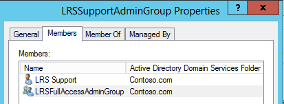

# <a name="deploy-srs-v1-administrative-web-portal-in-skype-for-business-server"></a><span data-ttu-id="cef70-105">Развертывание веб-портала администрирования SRS версии 1 в Skype для бизнеса Server</span><span class="sxs-lookup"><span data-stu-id="cef70-105">Deploy SRS v1 Administrative Web Portal in Skype for Business Server</span></span>

<span data-ttu-id="cef70-106">В Skype для бизнеса Server для систем комнат Skype v1 (SRS v1, ранее известной как система комнат Lync) используется веб-портал, который организации могут использовать для обслуживания комнат конференц-зала системы Skype.</span><span class="sxs-lookup"><span data-stu-id="cef70-106">The Skype for Business Server Skype Room Systems v1 (SRS v1, formerly known as Lync Room System) Administrative Web Portal is a web portal that organizations can use to maintain their Skype Room Systems conference rooms.</span></span> <span data-ttu-id="cef70-107">Администраторы могут использовать веб-портал администрирования SRS версии 1 для мониторинга работоспособности устройств, например, с помощью мониторинга аудио-и видеоустройств.</span><span class="sxs-lookup"><span data-stu-id="cef70-107">Administrators can use the SRS v1 Administrative Web Portal to monitor device health, for example by monitoring audio/video devices.</span></span> <span data-ttu-id="cef70-108">С помощью этого портала администраторы могут удаленно собирать диагностические сведения для отслеживания работоспособности конференц-зала.</span><span class="sxs-lookup"><span data-stu-id="cef70-108">With this portal, administrators can remotely collect diagnostic information to monitor conference room health.</span></span>

<span data-ttu-id="cef70-109">Чтобы использовать эту функцию, необходимо развернуть веб-портал администрирования SRS v1 на каждом сервере переднего плана Skype для бизнеса Server.</span><span class="sxs-lookup"><span data-stu-id="cef70-109">To use this feature, the SRS v1 Administrative Web Portal needs to be deployed on every Skype for Business Server Front End Server.</span></span> <span data-ttu-id="cef70-110">В этом руководстве приведены инструкции для администраторов об установке и настройке веб-портала администрирования SRS.</span><span class="sxs-lookup"><span data-stu-id="cef70-110">This guide provides instructions for administrators on how to install and configure the SRS Administrative Web Portal.</span></span> <span data-ttu-id="cef70-111">Он предназначен для администраторов, обладающих знаниями об администрировании Skype для бизнеса Server и имеющих права администратора на изменение топологии Skype для бизнеса Server.</span><span class="sxs-lookup"><span data-stu-id="cef70-111">It is intended for administrators who have knowledge of Skype for Business Server administration, and who have administrator user rights to modify the Skype for Business Server topology.</span></span>

<span data-ttu-id="cef70-112">После развертывания веб-портала администрирования SRS v1 на сервере администраторы могут проверить состояние устройств SRS v1, войдя на сайт с собственных компьютеров или ноутбуков.</span><span class="sxs-lookup"><span data-stu-id="cef70-112">After the SRS v1 Administrative Web Portal is deployed on the server, administrators can check the status SRS v1 devices by logging on to the site from their own computers or laptops.</span></span>

> [!IMPORTANT]
> <span data-ttu-id="cef70-113">Скачайте [веб-портал администрирования систем комнат Microsoft Skype версии 1 для Skype для бизнеса Server 2015](https://www.microsoft.com/download/details.aspx?id=46906).</span><span class="sxs-lookup"><span data-stu-id="cef70-113">Download the [Microsoft Skype Room Systems v1 Administrative Web Portal for Skype for Business Server 2015](https://www.microsoft.com/download/details.aspx?id=46906).</span></span>

<span data-ttu-id="cef70-114">Содержание раздела</span><span class="sxs-lookup"><span data-stu-id="cef70-114">In this topic:</span></span>

- [<span data-ttu-id="cef70-115">Настройка среды для веб-портала администрирования SRS версии 1</span><span class="sxs-lookup"><span data-stu-id="cef70-115">Configure your environment for the SRS v1 Administrative Web Portal</span></span>](room-system-v1-administrative-web-portal.md#Config_Env)

- [<span data-ttu-id="cef70-116">Установка веб-портала администрирования SRS версии 1</span><span class="sxs-lookup"><span data-stu-id="cef70-116">Install the SRS v1 Administrative Web Portal</span></span>](room-system-v1-administrative-web-portal.md#Install_SRS)

- [<span data-ttu-id="cef70-117">Использование веб-портала администрирования SRS</span><span class="sxs-lookup"><span data-stu-id="cef70-117">Use the SRS Administrative Web Portal</span></span>](room-system-v1-administrative-web-portal.md#Use_Portal)

## <a name="configure-your-environment-for-the-srs-v1-administrative-web-portal"></a><span data-ttu-id="cef70-118">Настройка среды для веб-портала администрирования SRS версии 1</span><span class="sxs-lookup"><span data-stu-id="cef70-118">Configure your environment for the SRS v1 Administrative Web Portal</span></span>
<span data-ttu-id="cef70-119"><a name="Config_Env"> </a></span><span class="sxs-lookup"><span data-stu-id="cef70-119"><a name="Config_Env"> </a></span></span>

<span data-ttu-id="cef70-120">Чтобы использовать веб-портал администрирования SRS версии 1, необходимо установить или настроить следующие необходимые компоненты.</span><span class="sxs-lookup"><span data-stu-id="cef70-120">To use the SRS v1 Administrative Web Portal, you will need to install or configure the following prerequisites.</span></span>

> [!IMPORTANT]
> <span data-ttu-id="cef70-121">Если на сервере настроена проверка подлинности Kerberos и NTLM, а служба SRS запущена на компьютере, который не присоединен к домену, проверка подлинности Kerberos не будет выполнена, а пользователь не будет видеть состояние SRS на административном портале.</span><span class="sxs-lookup"><span data-stu-id="cef70-121">If the server is configured with both Kerberos and NTLM authentication, and SRS is running on a computer that is not joined to the domain, Kerberos authentication will fail and the user will not see the status of SRS in the administrative portal.</span></span> <span data-ttu-id="cef70-122">Чтобы устранить эту проблему, настройте сервер с проверкой подлинности NTLM или проверкой подлинности NTLM и TLS-ДСК (без Kerberos) или Присоедините компьютер SRS к домену.</span><span class="sxs-lookup"><span data-stu-id="cef70-122">To resolve this issue, configure the server with NTLM authentication or both NTLM and TLS-DSK authentication (without Kerberos), or join the SRS computer to the domain.</span></span>

1. <span data-ttu-id="cef70-123">Установите накопительные пакеты обновления для Skype для бизнеса Server в топологии Skype для бизнеса Server.</span><span class="sxs-lookup"><span data-stu-id="cef70-123">Install Skype for Business Server Cumulative Updates in the Skype for Business Server topology.</span></span>

    <span data-ttu-id="cef70-124">Чтобы получить обновление или просмотреть сведения о том, что входит в состав этого приложения, ознакомьтесь со статьей [Обновление для Skype для бизнеса Server 2015](https://support.microsoft.com/help/3061064/updates-for-skype-for-business-server-2015).</span><span class="sxs-lookup"><span data-stu-id="cef70-124">To get the update or see what's included with it, see [Updates for Skype for Business Server 2015](https://support.microsoft.com/help/3061064/updates-for-skype-for-business-server-2015).</span></span>

2. <span data-ttu-id="cef70-125">Создайте пользователя Active Directory с включенной поддержкой SIP.</span><span class="sxs-lookup"><span data-stu-id="cef70-125">Create a SIP-enabled Active Directory user.</span></span>

    <span data-ttu-id="cef70-126">Веб-портал администрирования SRS v1 использует эти учетные данные для запроса информации из Skype для бизнеса Server.</span><span class="sxs-lookup"><span data-stu-id="cef70-126">The SRS v1 Administrative Web Portal uses these credentials to query information from Skype for Business Server.</span></span> <span data-ttu-id="cef70-127">Имя пользователя в примерах — Lrsapp включена поддержка.</span><span class="sxs-lookup"><span data-stu-id="cef70-127">The username in the examples given is LRSApp.</span></span>

3. <span data-ttu-id="cef70-128">Создайте группу безопасности Active Directory с именем LRSSupportAdminGroup.</span><span class="sxs-lookup"><span data-stu-id="cef70-128">Create an Active Directory security group with name LRSSupportAdminGroup.</span></span>

    <span data-ttu-id="cef70-129">Создайте группу с областью действия групп в качестве глобальной и типа группы как безопасность.</span><span class="sxs-lookup"><span data-stu-id="cef70-129">Create the group with Group Scope as Global and Group Type as Security.</span></span> <span data-ttu-id="cef70-130">Пользователи с включенной поддержкой SIP, добавленные в эту группу, будут авторизованы для просмотра списка помещений и выполнения определенных команд, например сбора журналов.</span><span class="sxs-lookup"><span data-stu-id="cef70-130">SIP enabled users who are added to this group will be authorized to see the list of rooms and execute certain commands, such as collecting logs.</span></span>

4. <span data-ttu-id="cef70-131">Создайте группу безопасности Active Directory с именем LRSFullAccessAdminGroup.</span><span class="sxs-lookup"><span data-stu-id="cef70-131">Create an Active Directory security group with name LRSFullAccessAdminGroup.</span></span>

    <span data-ttu-id="cef70-132">Создайте группу с областью действия групп в качестве глобальной и типа группы как "безопасность". SIP Enabled пользователи, добавленные в эту группу, имеют право на использование всех функций портала администрирования в одной комнате Skype.</span><span class="sxs-lookup"><span data-stu-id="cef70-132">Create the group with Group Scope as Global and Group Type as Security.SIP enabled users who are added to this group are authorized to use all admin portal functionality on a single Skype room.</span></span> <span data-ttu-id="cef70-133">Чтобы включить поддержку массового управления комнатами Skype, обратитесь к шагу 5.</span><span class="sxs-lookup"><span data-stu-id="cef70-133">To include support for bulk management of Skype rooms, refer to step 5.</span></span>

     

5. <span data-ttu-id="cef70-135">Создайте группу безопасности Active Directory с именем LRSPowerUserAdminsGroup.</span><span class="sxs-lookup"><span data-stu-id="cef70-135">Create an Active Directory security group with name LRSPowerUserAdminsGroup.</span></span>

    <span data-ttu-id="cef70-136">Создайте группу с областью действия групп в качестве глобальной и типа группы как безопасность.</span><span class="sxs-lookup"><span data-stu-id="cef70-136">Create the group with Group Scope as Global and Group Type as Security.</span></span> <span data-ttu-id="cef70-137">Пользователи с включенной поддержкой SIP, добавленные в эту группу, имеют право на использование всех функций портала администрирования, включая массовое управление комнатами Skype для бизнеса.</span><span class="sxs-lookup"><span data-stu-id="cef70-137">SIP enabled users who are added to this group are authorized to use all admin portal functionality including bulk management of Skype for Business rooms.</span></span>

6. <span data-ttu-id="cef70-138">Добавьте LRSFullAccessAdminGroup в качестве члена LRSSupportAdminGroup.</span><span class="sxs-lookup"><span data-stu-id="cef70-138">Add LRSFullAccessAdminGroup as a member of LRSSupportAdminGroup.</span></span>

     

7. <span data-ttu-id="cef70-140">Создайте пользователя с включенной поддержкой SIP Active Directory с именем LRSSupport.</span><span class="sxs-lookup"><span data-stu-id="cef70-140">Create a SIP enabled Active Directory user with name LRSSupport.</span></span> <span data-ttu-id="cef70-141">Добавьте этого пользователя в LRSSupportAdminGroup.</span><span class="sxs-lookup"><span data-stu-id="cef70-141">Add this user to LRSSupportAdminGroup.</span></span>

     

8. <span data-ttu-id="cef70-143">Установите [ASP.NET MVC 4 для Visual Studio 2010 с пакетом обновления 1 (SP1) и Visual Web Developer 2010 SP1](https://go.microsoft.com/fwlink/p/?LinkId=323967).</span><span class="sxs-lookup"><span data-stu-id="cef70-143">Install [ASP.NET MVC 4 for Visual Studio 2010 SP1 and Visual Web Developer 2010 SP1](https://go.microsoft.com/fwlink/p/?LinkId=323967).</span></span>

## <a name="install-the-srs-v1-administrative-web-portal"></a><span data-ttu-id="cef70-144">Установка веб-портала администрирования SRS версии 1</span><span class="sxs-lookup"><span data-stu-id="cef70-144">Install the SRS v1 Administrative Web Portal</span></span>
<span data-ttu-id="cef70-145"><a name="Install_SRS"> </a></span><span class="sxs-lookup"><span data-stu-id="cef70-145"><a name="Install_SRS"> </a></span></span>

<span data-ttu-id="cef70-146">Скачайте [веб-портал администрирования систем комнат Microsoft Skype версии 1 для Skype для бизнеса Server 2015](https://www.microsoft.com/download/details.aspx?id=46906).</span><span class="sxs-lookup"><span data-stu-id="cef70-146">Download the [Microsoft Skype Room Systems v1 Administrative Web Portal for Skype for Business Server 2015](https://www.microsoft.com/download/details.aspx?id=46906).</span></span>

<span data-ttu-id="cef70-147">Для установки веб-портала администрирования SRS версии 1 выполните указанные ниже действия.</span><span class="sxs-lookup"><span data-stu-id="cef70-147">To install the SRS v1 Administrative Web Portal, use the following steps.</span></span>

1. <span data-ttu-id="cef70-148">Настройте порт доверенного приложения, выполнив следующий командлет в командной консоли Skype для бизнеса Server:</span><span class="sxs-lookup"><span data-stu-id="cef70-148">Configure the Trusted Application Port by running the following cmdlet in Skype for Business Server Management Shell:</span></span>

   ```powershell
   Set-CsWebServer -Identity POOLFQDN -MeetingRoomAdminPortalInternalListeningPort 4456 -MeetingRoomAdminPortalExternalListeningPort 4457
   ```

2. <span data-ttu-id="cef70-149">Чтобы установить портал "комната для собраний", скачайте **митингрумпорталинсталлер. msi** , а затем запустите его от имени администратора.</span><span class="sxs-lookup"><span data-stu-id="cef70-149">To install the Meeting Room Portal, download **MeetingRoomPortalInstaller.msi** and then run it as an administrator.</span></span>

3. <span data-ttu-id="cef70-150">Откройте файл Web. config в следующем расположении:</span><span class="sxs-lookup"><span data-stu-id="cef70-150">Open the Web.config file from the following location:</span></span>

    <span data-ttu-id="cef70-151">% Program Филес%\скипе for Business Server 2015 \ Интернет Компонентс\митинг комната Портал\инт\хандлер</span><span class="sxs-lookup"><span data-stu-id="cef70-151">%Program Files%\Skype for Business Server 2015\Web Components\Meeting Room Portal\Int\Handler</span></span>\

4. <span data-ttu-id="cef70-152">В файле Web. config замените Порталусернаме на имя пользователя, созданное в шаге 2, в разделе "[Настройка среды для административного веб-портала SRS v1](room-system-v1-administrative-web-portal.md#Config_Env)" (рекомендуемое имя в шаге — lrsapp включена поддержка):</span><span class="sxs-lookup"><span data-stu-id="cef70-152">In the Web.Config file, change the PortalUserName to the username created in Step 2 under the section "[Configure your environment for the SRS v1 Administrative Web Portal](room-system-v1-administrative-web-portal.md#Config_Env)" (the recommended name in the step is LRSApp):</span></span>

    ```xml
    <add key="PortalUserName" value="sip:LRSApp@domain.com" />
    ```

5. <span data-ttu-id="cef70-153">Поскольку портал администрирования SRS v1 является доверенным приложением, вам не нужно указывать пароль в конфигурации портала.</span><span class="sxs-lookup"><span data-stu-id="cef70-153">Because the SRS v1 Admin Portal is a trusted application, you do not need to provide the password in the portal configuration.</span></span> <span data-ttu-id="cef70-154">Если для этого пользователя используется другой регистратор, отличный от регистратора локального регистратора, необходимо указать для него регистратор, добавив следующую строку в файл Web. config:</span><span class="sxs-lookup"><span data-stu-id="cef70-154">If this user is using a different registrar than local registrar, you need to specify the registrar for it by adding the following line in the Web.Config file:</span></span>

   ```xml
   <add key="PortalUserRegistrarFQDN" value="pool-xxxx.domain.com" />
   ```

6. <span data-ttu-id="cef70-155">Если используется порт, отличный от 5061, добавьте в файл Web. config следующую строку:</span><span class="sxs-lookup"><span data-stu-id="cef70-155">If the port used is other than 5061, add the following line in the Web.Config file:</span></span>

   ```xml
   <add key="PortalUserRegistrarPort" value="5061" />
   ```

### <a name="verify-installation-of-the-srs-administrative-web-portal"></a><span data-ttu-id="cef70-156">Проверка установки веб-портала администрирования SRS</span><span class="sxs-lookup"><span data-stu-id="cef70-156">Verify Installation of the SRS Administrative Web Portal</span></span>

<span data-ttu-id="cef70-157">Чтобы проверить установку веб-портала администрирования SRS версии 1, выполните следующие действия:</span><span class="sxs-lookup"><span data-stu-id="cef70-157">To verify installation of the SRS v1 Administrative Web Portal, do the following:</span></span>

1. <span data-ttu-id="cef70-158">На сервере переднего плана перейдите по следующему URL-адресу:</span><span class="sxs-lookup"><span data-stu-id="cef70-158">On a Front End server, browse to the following URL:</span></span>

    <span data-ttu-id="cef70-159">https:// \< Fe Server \> /ЛРС</span><span class="sxs-lookup"><span data-stu-id="cef70-159">https://\<fe-server\>/lrs</span></span>

    <span data-ttu-id="cef70-160">Не отображаются никакие ошибки, как показано на следующем рисунке:</span><span class="sxs-lookup"><span data-stu-id="cef70-160">You should not see any errors, as shown in the following image:</span></span>

     

2. <span data-ttu-id="cef70-162">Если ошибки не отображаются, попробуйте получить доступ к следующему URL-адресу с любого другого компьютера в топологии:</span><span class="sxs-lookup"><span data-stu-id="cef70-162">If you do not see any errors, try accessing the following URL from any other computer in the topology:</span></span>

    <span data-ttu-id="cef70-163">https:// \< Fe Server \> /ЛРС</span><span class="sxs-lookup"><span data-stu-id="cef70-163">https://\<fe-server\>/lrs</span></span>

    <span data-ttu-id="cef70-164">Чтобы получить доступ к странице, необходимо добавить записи DNS, как описано в разделе "[необходимые записи DNS для автоматического входа клиентов](https://go.microsoft.com/fwlink/p/?LinkId=318056)".</span><span class="sxs-lookup"><span data-stu-id="cef70-164">To access the page, you will need to add the DNS records as described in "[Required DNS Records for Automatic Client Sign-In](https://go.microsoft.com/fwlink/p/?LinkId=318056)."</span></span>

## <a name="use-the-srs-administrative-web-portal"></a><span data-ttu-id="cef70-165">Использование веб-портала администрирования SRS</span><span class="sxs-lookup"><span data-stu-id="cef70-165">Use the SRS Administrative Web Portal</span></span>
<span data-ttu-id="cef70-166"><a name="Use_Portal"> </a></span><span class="sxs-lookup"><span data-stu-id="cef70-166"><a name="Use_Portal"> </a></span></span>

<span data-ttu-id="cef70-167">После развертывания SRS на сервере можно проверить состояние всех комнат SRS, войдя на веб-портал администрирования SRS v1 из браузера.</span><span class="sxs-lookup"><span data-stu-id="cef70-167">After you deploy SRS on the server, you can check the status of all SRS rooms by signing into the SRS v1 Administrative Web Portal from a browser.</span></span>

### <a name="sign-in"></a><span data-ttu-id="cef70-168">Вход</span><span class="sxs-lookup"><span data-stu-id="cef70-168">Sign in</span></span>

1. <span data-ttu-id="cef70-169">Перейдите по следующему URL-адресу:</span><span class="sxs-lookup"><span data-stu-id="cef70-169">Browse to the following URL:</span></span>

    <span data-ttu-id="cef70-170">https:// \< Fe Server \> /ЛРС</span><span class="sxs-lookup"><span data-stu-id="cef70-170">https://\<fe-server\>/lrs</span></span>

2. <span data-ttu-id="cef70-171">Введите учетные данные для учетной записи LRSSupport или учетной записи, которая была добавлена в группу безопасности LRSSupportAdminGroup.</span><span class="sxs-lookup"><span data-stu-id="cef70-171">Enter the credentials for the LRSSupport account or an account that was added to the LRSSupportAdminGroup security group.</span></span>


### <a name="srs-administrative-web-portal-summary-page"></a><span data-ttu-id="cef70-173">Сводная страница веб-портала администрирования SRS</span><span class="sxs-lookup"><span data-stu-id="cef70-173">SRS Administrative Web Portal Summary Page</span></span>

<span data-ttu-id="cef70-174">На странице сводки представлены следующие сведения обо всех комнатах SRS, развернутых на сервере.</span><span class="sxs-lookup"><span data-stu-id="cef70-174">The summary page provides the following information for all of the SRS rooms deployed on the server:</span></span>

- <span data-ttu-id="cef70-175">**Tag (тег** ) Настраиваемое имя, которое администратор предоставляет для комнаты.</span><span class="sxs-lookup"><span data-stu-id="cef70-175">**Tag** The custom name that the administrator gives to the room.</span></span> <span data-ttu-id="cef70-176">Тег можно задать в портале, щелкнув имя комнаты.</span><span class="sxs-lookup"><span data-stu-id="cef70-176">The Tag can be set in the portal by clicking on the room name.</span></span>

- <span data-ttu-id="cef70-177">**Работоспособность** Состояние работоспособности комнаты, которая является производной от сводного состояния работоспособности комнаты, которая отображается в разделе работоспособность на странице "Параметры комнаты".</span><span class="sxs-lookup"><span data-stu-id="cef70-177">**Health** The health status of the room, which is derived from the Aggregate Health status of the room, which is shown under the Health section of the Room Settings page.</span></span>

- <span data-ttu-id="cef70-178">**Следующее собрание** Дата и время запланированного выполнения следующего собрания.</span><span class="sxs-lookup"><span data-stu-id="cef70-178">**Next Meeting** The date and time the next meeting is scheduled.</span></span>

- <span data-ttu-id="cef70-179">**Версия SRS, производитель, модель** Эти значения предварительно установлены в службе SRS.</span><span class="sxs-lookup"><span data-stu-id="cef70-179">**SRS Version, Manufacturer, Model** These values are preset in SRS.</span></span> <span data-ttu-id="cef70-180">В зависимости от производителя эти поля могут оставаться пустыми.</span><span class="sxs-lookup"><span data-stu-id="cef70-180">Depending on the manufacturer, these fields might be left blank.</span></span>

- <span data-ttu-id="cef70-181">**Последнее обновление** Отображает время последнего обновления веб-страницы.</span><span class="sxs-lookup"><span data-stu-id="cef70-181">**Last Refresh** Displays the last time the web page was refreshed.</span></span>


> [!NOTE]
> <span data-ttu-id="cef70-183">Меню группового управления отображается, только если вы являетесь частью группы безопасности LRSPowerUserAdminsGroup.</span><span class="sxs-lookup"><span data-stu-id="cef70-183">You will only see the Bulk Management menu if you are part of the LRSPowerUserAdminsGroup security group.</span></span>

### <a name="srs-room-information"></a><span data-ttu-id="cef70-184">Сведения о комнате SRS</span><span class="sxs-lookup"><span data-stu-id="cef70-184">SRS Room Information</span></span>

<span data-ttu-id="cef70-185">Раздел сведения о комнате портала позволяет просматривать и настраивать отдельные комнаты SRS.</span><span class="sxs-lookup"><span data-stu-id="cef70-185">The Room Info section of the portal allows you to view and configure individual SRS rooms.</span></span> <span data-ttu-id="cef70-186">Он содержит четыре раздела: параметры, сведения, ведение журнала и работоспособность.</span><span class="sxs-lookup"><span data-stu-id="cef70-186">It contains four sections: Settings, Details, Logging, and Health.</span></span>

#### <a name="settings"></a><span data-ttu-id="cef70-187">Параметры</span><span class="sxs-lookup"><span data-stu-id="cef70-187">Settings</span></span>

<span data-ttu-id="cef70-188">В разделе Параметры можно задать пароль, тег комнаты и уровни громкости по умолчанию для комнаты.</span><span class="sxs-lookup"><span data-stu-id="cef70-188">In the Settings section, you can set the password, room tag, and default volume levels for the room.</span></span> <span data-ttu-id="cef70-189">Если вы настроили эти параметры, изменения реплицируются только после перезапуска консоли SRS.</span><span class="sxs-lookup"><span data-stu-id="cef70-189">If you configure these settings, the changes are replicated only after you restart the SRS console.</span></span> <span data-ttu-id="cef70-190">Вы увидите только параметры обновления системы для устройств SRS, использующих выпуск 15,12 и более поздних версий.</span><span class="sxs-lookup"><span data-stu-id="cef70-190">You will only see System Updates settings for SRS devices using release 15.12 and later.</span></span>


#### <a name="details"></a><span data-ttu-id="cef70-192">Сведения</span><span class="sxs-lookup"><span data-stu-id="cef70-192">Details</span></span>

<span data-ttu-id="cef70-193">Раздел Details (сведения) предоставляет сводку по параметрам комнаты SRS, которая доступна только для чтения, в том числе: время последнего обновления; следующее собрание; Последние обновления, Обслуживание и калибровка; Параметры динамика, микрофона и абонента по умолчанию; Отслеживание УНИВЕРСАЛЬНЫЙ КОД РЕСУРСА (URI) SIP; Количество экранов и подробные сведения о каждом экране; состояние и действие.</span><span class="sxs-lookup"><span data-stu-id="cef70-193">The Details section provides a read-only summary of the SRS room's settings, including: the time of last refresh; next meeting; last updates, maintenance and calibration; default speaker, mic, and ringer settings; version; SIP URI; number of screens and details about each screen; status, and activity.</span></span>


#### <a name="troubleshooting"></a><span data-ttu-id="cef70-195">Устранение неполадок</span><span class="sxs-lookup"><span data-stu-id="cef70-195">Troubleshooting</span></span>

<span data-ttu-id="cef70-196">Раздел "Устранение неполадок" можно использовать для удаленного сбора журналов и их сохранения в указанном расположении.</span><span class="sxs-lookup"><span data-stu-id="cef70-196">The Troubleshooting section can be used to remotely collect logs and save them to a specified location.</span></span> <span data-ttu-id="cef70-197">Вы также можете перезапустить консоль SRS (пользовательский интерфейс SRS) или перезапустить всю систему.</span><span class="sxs-lookup"><span data-stu-id="cef70-197">You can also restart the SRS console (SRS user interface) or restart the entire system.</span></span> <span data-ttu-id="cef70-198">Чтобы собрать журналы, укажите путь к папке в указанном формате и убедитесь, что в папке есть разрешения на запись, предоставленные учетной записи компьютера SRS.</span><span class="sxs-lookup"><span data-stu-id="cef70-198">To collect logs, provide a folder path in the specified format and make sure that the folder has write permissions given to the SRS machine account.</span></span> <span data-ttu-id="cef70-199">Если размер журнала слишком велик, может потребоваться до 5 минут для завершения сбора журналов.</span><span class="sxs-lookup"><span data-stu-id="cef70-199">If the log size is too big, it can take up to 5 minutes to finish collecting logs.</span></span> <span data-ttu-id="cef70-200">После обновления страницы вы получите Последнее состояние.</span><span class="sxs-lookup"><span data-stu-id="cef70-200">Refreshing the page will give you the latest status.</span></span>

#### <a name="health"></a><span data-ttu-id="cef70-201">Здравоохранение</span><span class="sxs-lookup"><span data-stu-id="cef70-201">Health</span></span>

<span data-ttu-id="cef70-202">Раздел Health дает визуальную индикацию о работоспособности подключения к серверу Skype для бизнеса, звуковое устройство, видеоустройство, состояние устойчивости и устройство отображения.</span><span class="sxs-lookup"><span data-stu-id="cef70-202">The Health section gives a visual indication of the health of the Skype for Business Server connection, audio device, video device, resiliency state, and screen device.</span></span>


### <a name="additional-notes-about-the-administrative-web-portal"></a><span data-ttu-id="cef70-204">Дополнительные заметки о веб-портале администрирования</span><span class="sxs-lookup"><span data-stu-id="cef70-204">Additional Notes about the Administrative Web Portal</span></span>

> [!NOTE]
>  <span data-ttu-id="cef70-205">Изменения вступят в силу только после перезапуска системы SRS. > если срок действия пароля учетной записи Lrsapp включена поддержка истечет, состояние комнат будет недоступно.</span><span class="sxs-lookup"><span data-stu-id="cef70-205">Setting changes are applied only after the SRS system is restarted.>  If the LRSApp account password expires, you will not be able to see the status of the rooms.</span></span> <span data-ttu-id="cef70-206">Настройте пароль учетной записи Лрсаппусер, чтобы он никогда не истекал, или не забудьте обновить пароль, если срок действия истекает. > веб-портал администрирования SRS поддерживается только для локальных развертываний.</span><span class="sxs-lookup"><span data-stu-id="cef70-206">Configure the LRSAppuser account password so that it never expires, or be sure to update the password when it is near expiration.>  The SRS administrative web portal is supported for on-premises deployments only.</span></span>

### <a name="bulk-management"></a><span data-ttu-id="cef70-207">Массовое управление</span><span class="sxs-lookup"><span data-stu-id="cef70-207">Bulk management</span></span>

<span data-ttu-id="cef70-208">Массовое управление комнатами SRS — это функция, предназначенная для опытных ИТ-администраторов, для упрощения рабочих процессов, а также для предоставления им возможности эффективного управления несколькими комнатами в пакетном режиме.</span><span class="sxs-lookup"><span data-stu-id="cef70-208">Bulk management of SRS rooms is a feature designed for advanced IT administrators, to simplify their workflow, and enable them with a time-saving convenient tool to remotely manage multiple rooms in a bulk fashion.</span></span>

<span data-ttu-id="cef70-209">Чтобы увидеть эту функцию, пользователю необходимо подготовиться к работе в качестве участника специальной группы безопасности **LRSPowerUserAdminsGroup**.</span><span class="sxs-lookup"><span data-stu-id="cef70-209">In order to see this functionality, the user need to be provisioned as a member of the special security group, **LRSPowerUserAdminsGroup**.</span></span>

<span data-ttu-id="cef70-210">Количество комнат SRS, которые можно выбрать для массового управления, не ограничено.</span><span class="sxs-lookup"><span data-stu-id="cef70-210">There is no limit to the number of SRS rooms you can select for bulk management.</span></span> <span data-ttu-id="cef70-211">Однако за один раз можно выполнить только одну операцию массового управления.</span><span class="sxs-lookup"><span data-stu-id="cef70-211">However, you can perform only one bulk management operation at a time.</span></span>

<span data-ttu-id="cef70-212">Чтобы выполнить операцию массового управления, выберите комнаты, которые нужно отслеживать, и щелкните меню "групповое управление".</span><span class="sxs-lookup"><span data-stu-id="cef70-212">To perform a bulk management operation, select the rooms you want to monitor, and click on the Bulk management menu.</span></span>

### <a name="frequently-asked-questions"></a><span data-ttu-id="cef70-213">Вопросы и ответы</span><span class="sxs-lookup"><span data-stu-id="cef70-213">Frequently asked questions</span></span>

#### <a name="why-cant-i-sign-in-to-the-administrative-web-portal"></a><span data-ttu-id="cef70-214">Почему я не могу войти на веб-портал администрирования?</span><span class="sxs-lookup"><span data-stu-id="cef70-214">Why can't I sign in to the administrative web portal?</span></span>

<span data-ttu-id="cef70-215">Когда вы открываете https://localhost/lrs страницу входа, вы сможете увидеть страницу входа, но при вводе учетных данных вы не сможете войти в систему.</span><span class="sxs-lookup"><span data-stu-id="cef70-215">When you open https://localhost/lrs, you will be able to see the sign in page, but when you type in your credentials, you cannot sign in.</span></span> <span data-ttu-id="cef70-216">В этом случае необходимо открыть https://FQDNofFEserver/SRS для входа на веб-портал администрирования.</span><span class="sxs-lookup"><span data-stu-id="cef70-216">In this case, you must open https://FQDNofFEserver/SRS to sign in to the administrative web portal.</span></span>

#### <a name="why-cant-i-see-srs-v1-in-the-administrative-web-portal"></a><span data-ttu-id="cef70-217">Почему в веб-портале администрирования не отображается SRS v1?</span><span class="sxs-lookup"><span data-stu-id="cef70-217">Why can't I see SRS v1 in the administrative web portal?</span></span>

- <span data-ttu-id="cef70-218">Убедитесь, что у вас есть учетные записи SRS в развертывании, и они созданы в соответствии с рекомендациями по развертыванию веб-портала администрирования SRS.</span><span class="sxs-lookup"><span data-stu-id="cef70-218">Make sure you have SRS accounts in your deployment and that they are created according to the SRS Administrative Web Portal deployment recommendations.</span></span> <span data-ttu-id="cef70-219">Убедитесь, что учетные записи SRS подготовлены с помощью команды Enable-CsMeetingRoom, а не Enable-CsUser на сервере Skype для бизнеса.</span><span class="sxs-lookup"><span data-stu-id="cef70-219">Make sure the SRS accounts are provisioned using Enable-CsMeetingRoom, not Enable-CsUser, on the Skype for Business Server.</span></span>

- <span data-ttu-id="cef70-220">Если вы создали учетные записи SRS и не видите учетные записи на веб-портале администрирования, соберите журналы сервера с помощью средства ведения журнала Skype для бизнеса Server с выбранным компонентом **митингпортал** , а затем отправьте их в контакт службы поддержки SRS.</span><span class="sxs-lookup"><span data-stu-id="cef70-220">If you have created SRS accounts and cannot see the accounts in administrative web portal, collect the server logs by using the Skype for Business Server Logging tool with the **MeetingPortal** component selected, and then send them to your SRS support contact.</span></span>

- <span data-ttu-id="cef70-221">Если вы создали учетные записи SRS и не видите учетные записи на веб-портале администрирования, соберите журналы клиентов с помощью Fiddler, а также скопируйте журнал консоли из средств разработки браузера, а затем отправьте их в контакт службы поддержки SRS.</span><span class="sxs-lookup"><span data-stu-id="cef70-221">If you have created SRS accounts and cannot see the accounts in administrative web portal, collect the client logs using Fiddler, and also copy the console log from the browser development tools, and then send them to your SRS support contact.</span></span> <span data-ttu-id="cef70-222">Вы также можете изменить значение уровня трассировки в файле Web. config, чтобы получить более подробный журнал.</span><span class="sxs-lookup"><span data-stu-id="cef70-222">You can also modify the trace level value in the Web.config to get a more detailed log.</span></span>

  ```xml
  <system.diagnostics>
    <switches>
      <!--
      This switch controls logging message levels. 0 implies
      logging is turned off. 1 implies only errors are logged,
      2 implies errors &amp; warnings. 4 is the most detailed.
      -->
      <add name="TraceLevelSwitch" value="3" />
    </switches>
  </system.diagnostics>
  ```

#### <a name="why-cant-i-see-the-status-of-srs-in-the-administrative-web-portal"></a><span data-ttu-id="cef70-223">Почему не отображается состояние SRS на веб-портале администрирования?</span><span class="sxs-lookup"><span data-stu-id="cef70-223">Why can't I see the status of SRS in the administrative web portal?</span></span>

- <span data-ttu-id="cef70-224">Убедитесь, что учетная запись пользователя Lrsapp включена поддержка включена для SIP.</span><span class="sxs-lookup"><span data-stu-id="cef70-224">Make sure that the LRSApp user account is SIP-enabled.</span></span>

- <span data-ttu-id="cef70-225">Если у вас по-прежнему возникают проблемы, соберите файл **Trace. log** в системе SRS из д:\траЦинг\лрсадминлогс \, и отправьте его контакту службы поддержки SRS.</span><span class="sxs-lookup"><span data-stu-id="cef70-225">If you are still having issues, collect the **Trace.log** file in the SRS system from D:\Tracing\LRSAdminLogs\, and then send it to your SRS support contact.</span></span>

#### <a name="why-cant-i-see-the-bulk-management-menus-for-srs-in-the-administrative-web-portal"></a><span data-ttu-id="cef70-226">Почему меню группового управления для SRS не отображается на веб-портале администрирования?</span><span class="sxs-lookup"><span data-stu-id="cef70-226">Why can't I see the bulk management menus for SRS in the administrative web portal?</span></span>

<span data-ttu-id="cef70-227">Убедитесь, что учетная запись пользователя Lrsapp включена поддержка включена для SIP и является частью группы безопасности LRSPowerUserAdminsGroup.</span><span class="sxs-lookup"><span data-stu-id="cef70-227">Make sure that the LRSApp user account is SIP-enabled, and is part of the LRSPowerUserAdminsGroup security group.</span></span>

#### <a name="does-the-srs-v1-administrative-web-portal-work-with-microsoft-teams-rooms"></a><span data-ttu-id="cef70-228">Работает ли веб-портал администрирования SRS v1 с комнатами Microsoft Teams?</span><span class="sxs-lookup"><span data-stu-id="cef70-228">Does the SRS v1 administrative web portal work with Microsoft Teams Rooms?</span></span>

<span data-ttu-id="cef70-229">Нет.</span><span class="sxs-lookup"><span data-stu-id="cef70-229">No.</span></span>


