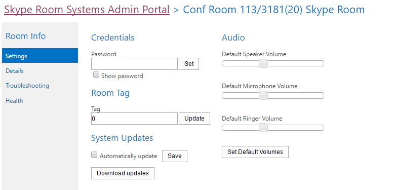

# <a name="deploy-srs-v1-administrative-web-portal-in-skype-for-business-server"></a><span data-ttu-id="f7711-105">Развертывание веб-портала администрирования SRS 1 в Skype для бизнеса Server</span><span class="sxs-lookup"><span data-stu-id="f7711-105">Deploy SRS v1 Administrative Web Portal in Skype for Business Server</span></span>

<span data-ttu-id="f7711-106">Веб-портал администрирования систем комнат Skype для бизнеса Server 1 (SRS 1, прежнее название — система комнат Lync) — это веб-портал, который организации могут использовать для обслуживания конференц-залов систем комнат Skype.</span><span class="sxs-lookup"><span data-stu-id="f7711-106">The Skype for Business Server Skype Room Systems v1 (SRS v1, formerly known as Lync Room System) Administrative Web Portal is a web portal that organizations can use to maintain their Skype Room Systems conference rooms.</span></span> <span data-ttu-id="f7711-107">Администраторы могут использовать веб-портал администрирования SRS 1 для отслеживания состояния устройства, например путем наблюдения за аудио- и видео устройствами.</span><span class="sxs-lookup"><span data-stu-id="f7711-107">Administrators can use the SRS v1 Administrative Web Portal to monitor device health, for example by monitoring audio/video devices.</span></span> <span data-ttu-id="f7711-108">На этом портале администраторы могут удаленно собирать диагностические сведения для отслеживания состояния конференц-зала.</span><span class="sxs-lookup"><span data-stu-id="f7711-108">With this portal, administrators can remotely collect diagnostic information to monitor conference room health.</span></span>

<span data-ttu-id="f7711-109">Чтобы использовать эту функцию, веб-портал администрирования SRS 1 необходимо развернуть на каждом сервере переднего сервера Skype для бизнеса Server.</span><span class="sxs-lookup"><span data-stu-id="f7711-109">To use this feature, the SRS v1 Administrative Web Portal needs to be deployed on every Skype for Business Server Front End Server.</span></span> <span data-ttu-id="f7711-110">Это руководство содержит инструкции для администраторов по установке и настройке веб-портала администрирования SRS.</span><span class="sxs-lookup"><span data-stu-id="f7711-110">This guide provides instructions for administrators on how to install and configure the SRS Administrative Web Portal.</span></span> <span data-ttu-id="f7711-111">Он предназначен для администраторов, которые знают об администрировании Skype для бизнеса Server и имеют права администратора на изменение топологии Skype для бизнеса Server.</span><span class="sxs-lookup"><span data-stu-id="f7711-111">It is intended for administrators who have knowledge of Skype for Business Server administration, and who have administrator user rights to modify the Skype for Business Server topology.</span></span>

<span data-ttu-id="f7711-112">После развертывания веб-портала администрирования SRS v1 на сервере администраторы могут проверить состояние устройств SRS v1, войдя на сайт с собственных компьютеров или ноутбуков.</span><span class="sxs-lookup"><span data-stu-id="f7711-112">After the SRS v1 Administrative Web Portal is deployed on the server, administrators can check the status SRS v1 devices by logging on to the site from their own computers or laptops.</span></span>

> [!IMPORTANT]
> <span data-ttu-id="f7711-113">Скачайте веб-портал администрирования систем комнат [Skype 1 для Skype для бизнеса Server 2015.](https://www.microsoft.com/download/details.aspx?id=46906)</span><span class="sxs-lookup"><span data-stu-id="f7711-113">Download the [Microsoft Skype Room Systems v1 Administrative Web Portal for Skype for Business Server 2015](https://www.microsoft.com/download/details.aspx?id=46906).</span></span>

<span data-ttu-id="f7711-114">Содержание раздела</span><span class="sxs-lookup"><span data-stu-id="f7711-114">In this topic:</span></span>

- [<span data-ttu-id="f7711-115">Настройка среды для веб-портала администрирования SRS 1</span><span class="sxs-lookup"><span data-stu-id="f7711-115">Configure your environment for the SRS v1 Administrative Web Portal</span></span>](room-system-v1-administrative-web-portal.md#Config_Env)

- [<span data-ttu-id="f7711-116">Установка веб-портала администрирования SRS 1</span><span class="sxs-lookup"><span data-stu-id="f7711-116">Install the SRS v1 Administrative Web Portal</span></span>](room-system-v1-administrative-web-portal.md#Install_SRS)

- [<span data-ttu-id="f7711-117">Использование веб-портала администрирования SRS</span><span class="sxs-lookup"><span data-stu-id="f7711-117">Use the SRS Administrative Web Portal</span></span>](room-system-v1-administrative-web-portal.md#Use_Portal)

## <a name="configure-your-environment-for-the-srs-v1-administrative-web-portal"></a><span data-ttu-id="f7711-118">Настройка среды для веб-портала администрирования SRS 1</span><span class="sxs-lookup"><span data-stu-id="f7711-118">Configure your environment for the SRS v1 Administrative Web Portal</span></span>
<span data-ttu-id="f7711-119"><a name="Config_Env"> </a></span><span class="sxs-lookup"><span data-stu-id="f7711-119"><a name="Config_Env"> </a></span></span>

<span data-ttu-id="f7711-120">Чтобы использовать веб-портал администрирования SRS 1, необходимо установить или настроить следующие предварительные условия.</span><span class="sxs-lookup"><span data-stu-id="f7711-120">To use the SRS v1 Administrative Web Portal, you will need to install or configure the following prerequisites.</span></span>

> [!IMPORTANT]
> <span data-ttu-id="f7711-121">Если на сервере настроена проверка подлинности Kerberos и NTLM, а SRS запущена на компьютере, который не присоединился к домену, проверка подлинности Kerberos не будет работать, и пользователь не увидит состояние SRS на портале администрирования.</span><span class="sxs-lookup"><span data-stu-id="f7711-121">If the server is configured with both Kerberos and NTLM authentication, and SRS is running on a computer that is not joined to the domain, Kerberos authentication will fail and the user will not see the status of SRS in the administrative portal.</span></span> <span data-ttu-id="f7711-122">Чтобы устранить эту проблему, настройте сервер с проверкой подлинности NTLM или проверкой подлинности NTLM и TLS-DSK (без Kerberos) или присоедините компьютер SRS к домену.</span><span class="sxs-lookup"><span data-stu-id="f7711-122">To resolve this issue, configure the server with NTLM authentication or both NTLM and TLS-DSK authentication (without Kerberos), or join the SRS computer to the domain.</span></span>

1. <span data-ttu-id="f7711-123">Установка накопительных обновлений Skype для бизнеса Server в топологии Skype для бизнеса Server.</span><span class="sxs-lookup"><span data-stu-id="f7711-123">Install Skype for Business Server Cumulative Updates in the Skype for Business Server topology.</span></span>

    <span data-ttu-id="f7711-124">To get the update or see what's included with it, see [Updates for Skype for Business Server 2015](https://support.microsoft.com/help/3061064/updates-for-skype-for-business-server-2015).</span><span class="sxs-lookup"><span data-stu-id="f7711-124">To get the update or see what's included with it, see [Updates for Skype for Business Server 2015](https://support.microsoft.com/help/3061064/updates-for-skype-for-business-server-2015).</span></span>

2. <span data-ttu-id="f7711-125">Создайте пользователя Active Directory с поддержкой SIP.</span><span class="sxs-lookup"><span data-stu-id="f7711-125">Create a SIP-enabled Active Directory user.</span></span>

    <span data-ttu-id="f7711-126">Веб-портал администрирования SRS 1 использует эти учетные данные для запроса сведений из Skype для бизнеса Server.</span><span class="sxs-lookup"><span data-stu-id="f7711-126">The SRS v1 Administrative Web Portal uses these credentials to query information from Skype for Business Server.</span></span> <span data-ttu-id="f7711-127">Имя пользователя в примерах— LRSApp.</span><span class="sxs-lookup"><span data-stu-id="f7711-127">The username in the examples given is LRSApp.</span></span>

3. <span data-ttu-id="f7711-128">Создайте группу безопасности Active Directory с именем LRSSupportAdminGroup.</span><span class="sxs-lookup"><span data-stu-id="f7711-128">Create an Active Directory security group with name LRSSupportAdminGroup.</span></span>

    <span data-ttu-id="f7711-129">Создайте группу с глобальной областью действия и типом группы "Безопасность".</span><span class="sxs-lookup"><span data-stu-id="f7711-129">Create the group with Group Scope as Global and Group Type as Security.</span></span> <span data-ttu-id="f7711-130">Пользователи с включенной поддержкой SIP, добавленные в эту группу, будут иметь право на просмотр списка помещений и выполнение определенных команд, таких как сбор журналов.</span><span class="sxs-lookup"><span data-stu-id="f7711-130">SIP enabled users who are added to this group will be authorized to see the list of rooms and execute certain commands, such as collecting logs.</span></span>

4. <span data-ttu-id="f7711-131">Создайте группу безопасности Active Directory с именем LRSFullAccessAdminGroup.</span><span class="sxs-lookup"><span data-stu-id="f7711-131">Create an Active Directory security group with name LRSFullAccessAdminGroup.</span></span>

    <span data-ttu-id="f7711-132">Создайте группу с глобальной областью действия и типом группы как пользователи с включенной поддержкой Security.SIP, добавленные в эту группу, имеют право использовать все функции портала администрирования в одной комнате Skype.</span><span class="sxs-lookup"><span data-stu-id="f7711-132">Create the group with Group Scope as Global and Group Type as Security.SIP enabled users who are added to this group are authorized to use all admin portal functionality on a single Skype room.</span></span> <span data-ttu-id="f7711-133">Чтобы включить поддержку массовой рассылки комнат Skype, обратитесь к шагу 5.</span><span class="sxs-lookup"><span data-stu-id="f7711-133">To include support for bulk management of Skype rooms, refer to step 5.</span></span>

     

5. <span data-ttu-id="f7711-135">Создайте группу безопасности Active Directory с именем LRSPowerUserAdminsGroup.</span><span class="sxs-lookup"><span data-stu-id="f7711-135">Create an Active Directory security group with name LRSPowerUserAdminsGroup.</span></span>

    <span data-ttu-id="f7711-136">Создайте группу с глобальной областью действия и типом группы "Безопасность".</span><span class="sxs-lookup"><span data-stu-id="f7711-136">Create the group with Group Scope as Global and Group Type as Security.</span></span> <span data-ttu-id="f7711-137">Пользователи с включенной поддержкой SIP, добавленные в эту группу, имеют право на использование всех функций портала администрирования, включая массовое управление комнатами Skype для бизнеса.</span><span class="sxs-lookup"><span data-stu-id="f7711-137">SIP enabled users who are added to this group are authorized to use all admin portal functionality including bulk management of Skype for Business rooms.</span></span>

6. <span data-ttu-id="f7711-138">Добавьте LRSFullAccessAdminGroup в качестве члена LRSSupportAdminGroup.</span><span class="sxs-lookup"><span data-stu-id="f7711-138">Add LRSFullAccessAdminGroup as a member of LRSSupportAdminGroup.</span></span>

     

7. <span data-ttu-id="f7711-140">Создайте пользователя Active Directory с поддержкой SIP с именем LRSSupport.</span><span class="sxs-lookup"><span data-stu-id="f7711-140">Create a SIP enabled Active Directory user with name LRSSupport.</span></span> <span data-ttu-id="f7711-141">Добавьте этого пользователя в LRSSupportAdminGroup.</span><span class="sxs-lookup"><span data-stu-id="f7711-141">Add this user to LRSSupportAdminGroup.</span></span>

     

8. <span data-ttu-id="f7711-143">Установите [ASP.NET MVC 4 для Visual Studio 2010 с sp1 и Visual Web Developer 2010 с sp1.](https://go.microsoft.com/fwlink/p/?LinkId=323967)</span><span class="sxs-lookup"><span data-stu-id="f7711-143">Install [ASP.NET MVC 4 for Visual Studio 2010 SP1 and Visual Web Developer 2010 SP1](https://go.microsoft.com/fwlink/p/?LinkId=323967).</span></span>

## <a name="install-the-srs-v1-administrative-web-portal"></a><span data-ttu-id="f7711-144">Установка веб-портала администрирования SRS 1</span><span class="sxs-lookup"><span data-stu-id="f7711-144">Install the SRS v1 Administrative Web Portal</span></span>
<span data-ttu-id="f7711-145"><a name="Install_SRS"> </a></span><span class="sxs-lookup"><span data-stu-id="f7711-145"><a name="Install_SRS"> </a></span></span>

<span data-ttu-id="f7711-146">Скачайте веб-портал администрирования систем комнат [Skype 1 для Skype для бизнеса Server 2015.](https://www.microsoft.com/download/details.aspx?id=46906)</span><span class="sxs-lookup"><span data-stu-id="f7711-146">Download the [Microsoft Skype Room Systems v1 Administrative Web Portal for Skype for Business Server 2015](https://www.microsoft.com/download/details.aspx?id=46906).</span></span>

<span data-ttu-id="f7711-147">Чтобы установить веб-портал администрирования SRS 1, с помощью следующих действий.</span><span class="sxs-lookup"><span data-stu-id="f7711-147">To install the SRS v1 Administrative Web Portal, use the following steps.</span></span>

1. <span data-ttu-id="f7711-148">Настройте порт доверенного приложения с помощью следующего команды в оболочке управления Skype для бизнеса Server:</span><span class="sxs-lookup"><span data-stu-id="f7711-148">Configure the Trusted Application Port by running the following cmdlet in Skype for Business Server Management Shell:</span></span>

   ```powershell
   Set-CsWebServer -Identity POOLFQDN -MeetingRoomAdminPortalInternalListeningPort 4456 -MeetingRoomAdminPortalExternalListeningPort 4457
   ```

2. <span data-ttu-id="f7711-149">Чтобы установить портал комнаты для **собраний,** загрузитеMeetingRoomPortalInstaller.msiи запустите его от администратора.</span><span class="sxs-lookup"><span data-stu-id="f7711-149">To install the Meeting Room Portal, download **MeetingRoomPortalInstaller.msi** and then run it as an administrator.</span></span>

3. <span data-ttu-id="f7711-150">Откройте файл Web.config из следующего расположения:</span><span class="sxs-lookup"><span data-stu-id="f7711-150">Open the Web.config file from the following location:</span></span>

    <span data-ttu-id="f7711-151">%Program Files%\Skype for Business Server 2015\Web Components\Meeting Room Portal\Int\Handler</span><span class="sxs-lookup"><span data-stu-id="f7711-151">%Program Files%\Skype for Business Server 2015\Web Components\Meeting Room Portal\Int\Handler</span></span>\

4. <span data-ttu-id="f7711-152">В файле Web.Config измените portalUserName на имя пользователя, созданное на шаге 2, в разделе "Настройка среды для веб-портала администрирования[SRS v1"](room-system-v1-administrative-web-portal.md#Config_Env)(рекомендуемое имя в шаге — LRSApp):</span><span class="sxs-lookup"><span data-stu-id="f7711-152">In the Web.Config file, change the PortalUserName to the username created in Step 2 under the section "[Configure your environment for the SRS v1 Administrative Web Portal](room-system-v1-administrative-web-portal.md#Config_Env)" (the recommended name in the step is LRSApp):</span></span>

    ```xml
    <add key="PortalUserName" value="sip:LRSApp@domain.com" />
    ```

5. <span data-ttu-id="f7711-153">Так как портал администрирования SRS v1 является доверенным приложением, вам не нужно вводить пароль в конфигурации портала.</span><span class="sxs-lookup"><span data-stu-id="f7711-153">Because the SRS v1 Admin Portal is a trusted application, you do not need to provide the password in the portal configuration.</span></span> <span data-ttu-id="f7711-154">Если этот пользователь использует другой регистратор, чем локальный регистратор, необходимо указать для него регистратор, добавив в Web.Config следующую строку:</span><span class="sxs-lookup"><span data-stu-id="f7711-154">If this user is using a different registrar than local registrar, you need to specify the registrar for it by adding the following line in the Web.Config file:</span></span>

   ```xml
   <add key="PortalUserRegistrarFQDN" value="pool-xxxx.domain.com" />
   ```

6. <span data-ttu-id="f7711-155">Если используется порт, не 5061, добавьте в Web.Config следующую строку:</span><span class="sxs-lookup"><span data-stu-id="f7711-155">If the port used is other than 5061, add the following line in the Web.Config file:</span></span>

   ```xml
   <add key="PortalUserRegistrarPort" value="5061" />
   ```

### <a name="verify-installation-of-the-srs-administrative-web-portal"></a><span data-ttu-id="f7711-156">Проверка установки веб-портала администрирования SRS</span><span class="sxs-lookup"><span data-stu-id="f7711-156">Verify Installation of the SRS Administrative Web Portal</span></span>

<span data-ttu-id="f7711-157">Чтобы проверить установку веб-портала администрирования SRS 1, сделайте следующее:</span><span class="sxs-lookup"><span data-stu-id="f7711-157">To verify installation of the SRS v1 Administrative Web Portal, do the following:</span></span>

1. <span data-ttu-id="f7711-158">На сервере переднего сервера перейдите по следующему URL-адресу:</span><span class="sxs-lookup"><span data-stu-id="f7711-158">On a Front End server, browse to the following URL:</span></span>

    <span data-ttu-id="f7711-159">https:// \<fe-server\> /lrs</span><span class="sxs-lookup"><span data-stu-id="f7711-159">https://\<fe-server\>/lrs</span></span>

    <span data-ttu-id="f7711-160">Ошибок не должно быть, как показано на следующем рисунке:</span><span class="sxs-lookup"><span data-stu-id="f7711-160">You should not see any errors, as shown in the following image:</span></span>

     

2. <span data-ttu-id="f7711-162">Если ошибок нет, попробуйте получить доступ к следующему URL-адресу с любого другого компьютера в топологии:</span><span class="sxs-lookup"><span data-stu-id="f7711-162">If you do not see any errors, try accessing the following URL from any other computer in the topology:</span></span>

    <span data-ttu-id="f7711-163">https:// \<fe-server\> /lrs</span><span class="sxs-lookup"><span data-stu-id="f7711-163">https://\<fe-server\>/lrs</span></span>

    <span data-ttu-id="f7711-164">Чтобы получить доступ к странице, необходимо добавить записи DNS, как описано в подстроке "Необходимые[записи DNS](https://go.microsoft.com/fwlink/p/?LinkId=318056)для автоматического клиентского входов".</span><span class="sxs-lookup"><span data-stu-id="f7711-164">To access the page, you will need to add the DNS records as described in "[Required DNS Records for Automatic Client Sign-In](https://go.microsoft.com/fwlink/p/?LinkId=318056)."</span></span>

## <a name="use-the-srs-administrative-web-portal"></a><span data-ttu-id="f7711-165">Использование веб-портала администрирования SRS</span><span class="sxs-lookup"><span data-stu-id="f7711-165">Use the SRS Administrative Web Portal</span></span>
<span data-ttu-id="f7711-166"><a name="Use_Portal"> </a></span><span class="sxs-lookup"><span data-stu-id="f7711-166"><a name="Use_Portal"> </a></span></span>

<span data-ttu-id="f7711-167">После развертывания SRS на сервере можно проверить состояние всех комнат SRS, во время входов на веб-портал администрирования SRS 1 из браузера.</span><span class="sxs-lookup"><span data-stu-id="f7711-167">After you deploy SRS on the server, you can check the status of all SRS rooms by signing into the SRS v1 Administrative Web Portal from a browser.</span></span>

### <a name="sign-in"></a><span data-ttu-id="f7711-168">Вход</span><span class="sxs-lookup"><span data-stu-id="f7711-168">Sign in</span></span>

1. <span data-ttu-id="f7711-169">Перейдите по следующему URL-адресу:</span><span class="sxs-lookup"><span data-stu-id="f7711-169">Browse to the following URL:</span></span>

    <span data-ttu-id="f7711-170">https:// \<fe-server\> /lrs</span><span class="sxs-lookup"><span data-stu-id="f7711-170">https://\<fe-server\>/lrs</span></span>

2. <span data-ttu-id="f7711-171">Введите учетные данные для учетной записи LRSSupport или учетной записи, добавленной в группу безопасности LRSSupportAdminGroup.</span><span class="sxs-lookup"><span data-stu-id="f7711-171">Enter the credentials for the LRSSupport account or an account that was added to the LRSSupportAdminGroup security group.</span></span>


### <a name="srs-administrative-web-portal-summary-page"></a><span data-ttu-id="f7711-173">Страница сводки по веб-порталу администрирования SRS</span><span class="sxs-lookup"><span data-stu-id="f7711-173">SRS Administrative Web Portal Summary Page</span></span>

<span data-ttu-id="f7711-174">На странице сводки следующую информацию можно получить для всех комнат SRS, развернутых на сервере:</span><span class="sxs-lookup"><span data-stu-id="f7711-174">The summary page provides the following information for all of the SRS rooms deployed on the server:</span></span>

- <span data-ttu-id="f7711-175">**Tag** Пользовательское имя, которое администратор предоставляет комнате.</span><span class="sxs-lookup"><span data-stu-id="f7711-175">**Tag** The custom name that the administrator gives to the room.</span></span> <span data-ttu-id="f7711-176">Тег можно установить на портале, щелкнув имя комнаты.</span><span class="sxs-lookup"><span data-stu-id="f7711-176">The Tag can be set in the portal by clicking on the room name.</span></span>

- <span data-ttu-id="f7711-177">**Health** Состояние состояния помещения, которое является производным от состояния "Сводка состояния состояния" комнаты, которое отображается в разделе "Состояние" на странице "Параметры помещения".</span><span class="sxs-lookup"><span data-stu-id="f7711-177">**Health** The health status of the room, which is derived from the Aggregate Health status of the room, which is shown under the Health section of the Room Settings page.</span></span>

- <span data-ttu-id="f7711-178">**Следующее собрание** Дата и время запланированного следующего собрания.</span><span class="sxs-lookup"><span data-stu-id="f7711-178">**Next Meeting** The date and time the next meeting is scheduled.</span></span>

- <span data-ttu-id="f7711-179">**Версия SRS, производитель, модель** Эти значения предустановлены в SRS.</span><span class="sxs-lookup"><span data-stu-id="f7711-179">**SRS Version, Manufacturer, Model** These values are preset in SRS.</span></span> <span data-ttu-id="f7711-180">В зависимости от производителя эти поля могут быть оставлены пустыми.</span><span class="sxs-lookup"><span data-stu-id="f7711-180">Depending on the manufacturer, these fields might be left blank.</span></span>

- <span data-ttu-id="f7711-181">**Последнее обновление** Отображает время последнего обновления веб-страницы.</span><span class="sxs-lookup"><span data-stu-id="f7711-181">**Last Refresh** Displays the last time the web page was refreshed.</span></span>


> [!NOTE]
> <span data-ttu-id="f7711-183">Меню "Массовое управление" будет отозвано только в том случае, если вы входите в группу безопасности LRSPowerUserAdminsGroup.</span><span class="sxs-lookup"><span data-stu-id="f7711-183">You will only see the Bulk Management menu if you are part of the LRSPowerUserAdminsGroup security group.</span></span>

### <a name="srs-room-information"></a><span data-ttu-id="f7711-184">Сведения о помещении SRS</span><span class="sxs-lookup"><span data-stu-id="f7711-184">SRS Room Information</span></span>

<span data-ttu-id="f7711-185">Раздел "Сведения о помещении" портала позволяет просматривать и настраивать отдельные комнаты SRS.</span><span class="sxs-lookup"><span data-stu-id="f7711-185">The Room Info section of the portal allows you to view and configure individual SRS rooms.</span></span> <span data-ttu-id="f7711-186">Он содержит четыре раздела: "Параметры", "Сведения", "Ведение журнала" и "Состояние".</span><span class="sxs-lookup"><span data-stu-id="f7711-186">It contains four sections: Settings, Details, Logging, and Health.</span></span>

#### <a name="settings"></a><span data-ttu-id="f7711-187">Параметры</span><span class="sxs-lookup"><span data-stu-id="f7711-187">Settings</span></span>

<span data-ttu-id="f7711-188">В разделе "Параметры" можно настроить пароль, тег помещения и уровни громкости по умолчанию для комнаты.</span><span class="sxs-lookup"><span data-stu-id="f7711-188">In the Settings section, you can set the password, room tag, and default volume levels for the room.</span></span> <span data-ttu-id="f7711-189">Если вы настроите эти параметры, изменения будут реплицированы только после перезапуска консоли SRS.</span><span class="sxs-lookup"><span data-stu-id="f7711-189">If you configure these settings, the changes are replicated only after you restart the SRS console.</span></span> <span data-ttu-id="f7711-190">Параметры обновления системы для устройств SRS будут отсланы только с помощью выпуска 15.12 и более поздних версий.</span><span class="sxs-lookup"><span data-stu-id="f7711-190">You will only see System Updates settings for SRS devices using release 15.12 and later.</span></span>



#### <a name="details"></a><span data-ttu-id="f7711-192">Сведения</span><span class="sxs-lookup"><span data-stu-id="f7711-192">Details</span></span>

<span data-ttu-id="f7711-193">В разделе "Сведения" содержится сводка параметров комнаты SRS, доступная только для чтения, в том числе время последнего обновления; следующее собрание; последние обновления, обслуживание и калибровка; параметры динамика, микрофона и звонка по умолчанию; version; URI SIP; количество экранов и сведения о каждом экране; состояние и действие.</span><span class="sxs-lookup"><span data-stu-id="f7711-193">The Details section provides a read-only summary of the SRS room's settings, including: the time of last refresh; next meeting; last updates, maintenance and calibration; default speaker, mic, and ringer settings; version; SIP URI; number of screens and details about each screen; status, and activity.</span></span>


#### <a name="troubleshooting"></a><span data-ttu-id="f7711-195">Устранение неполадок</span><span class="sxs-lookup"><span data-stu-id="f7711-195">Troubleshooting</span></span>

<span data-ttu-id="f7711-196">Раздел "Устранение неполадок" можно использовать для удаленного сбора журналов и их сохранения в указанном расположении.</span><span class="sxs-lookup"><span data-stu-id="f7711-196">The Troubleshooting section can be used to remotely collect logs and save them to a specified location.</span></span> <span data-ttu-id="f7711-197">Можно также перезапустить консоль SRS (пользовательский интерфейс SRS) или перезапустить всю систему.</span><span class="sxs-lookup"><span data-stu-id="f7711-197">You can also restart the SRS console (SRS user interface) or restart the entire system.</span></span> <span data-ttu-id="f7711-198">Для сбора журналов укайте путь к папке в указанном формате и убедитесь, что у папки есть разрешения на запись, предоставленные учетной записи компьютера SRS.</span><span class="sxs-lookup"><span data-stu-id="f7711-198">To collect logs, provide a folder path in the specified format and make sure that the folder has write permissions given to the SRS machine account.</span></span> <span data-ttu-id="f7711-199">Если размер журнала слишком велик, может занять до 5 минут, чтобы завершить сбор журналов.</span><span class="sxs-lookup"><span data-stu-id="f7711-199">If the log size is too big, it can take up to 5 minutes to finish collecting logs.</span></span> <span data-ttu-id="f7711-200">Обновление страницы позволит получить последнее состояние.</span><span class="sxs-lookup"><span data-stu-id="f7711-200">Refreshing the page will give you the latest status.</span></span>

#### <a name="health"></a><span data-ttu-id="f7711-201">Здравоохранение</span><span class="sxs-lookup"><span data-stu-id="f7711-201">Health</span></span>

<span data-ttu-id="f7711-202">В разделе "Состояние" приводится визуальное представление о состоянии подключения Skype для бизнеса Server, аудио- и видео устройств, состоянии устойчивости и устройстве с экраном.</span><span class="sxs-lookup"><span data-stu-id="f7711-202">The Health section gives a visual indication of the health of the Skype for Business Server connection, audio device, video device, resiliency state, and screen device.</span></span>


### <a name="additional-notes-about-the-administrative-web-portal"></a><span data-ttu-id="f7711-204">Дополнительные примечания о веб-портале администрирования</span><span class="sxs-lookup"><span data-stu-id="f7711-204">Additional Notes about the Administrative Web Portal</span></span>

> [!NOTE]
>  <span data-ttu-id="f7711-205">Изменения параметров применяются только после перезапуска системы SRS.> Если срок действия пароля учетной записи LRSApp истек, вы не сможете увидеть состояние комнат.</span><span class="sxs-lookup"><span data-stu-id="f7711-205">Setting changes are applied only after the SRS system is restarted.>  If the LRSApp account password expires, you will not be able to see the status of the rooms.</span></span> <span data-ttu-id="f7711-206">Настройте пароль учетной записи LRSAppuser так, чтобы срок его действия никогда не истекал, или обязательно обновив пароль по истечении срока действия.> Веб-портал администрирования SRS поддерживается только для локального развертывания.</span><span class="sxs-lookup"><span data-stu-id="f7711-206">Configure the LRSAppuser account password so that it never expires, or be sure to update the password when it is near expiration.>  The SRS administrative web portal is supported for on-premises deployments only.</span></span>

### <a name="bulk-management"></a><span data-ttu-id="f7711-207">Массовое управление</span><span class="sxs-lookup"><span data-stu-id="f7711-207">Bulk management</span></span>

<span data-ttu-id="f7711-208">Массовое управление комнатами SRS — это функция, предназначенная для продвинутых ИТ-администраторов, упрощает их рабочий процесс и позволяет им использовать удобное средство для удаленного управления несколькими комнатами в массовом порядке.</span><span class="sxs-lookup"><span data-stu-id="f7711-208">Bulk management of SRS rooms is a feature designed for advanced IT administrators, to simplify their workflow, and enable them with a time-saving convenient tool to remotely manage multiple rooms in a bulk fashion.</span></span>

<span data-ttu-id="f7711-209">Чтобы увидеть эту функцию, необходимо, чтобы пользователь был участником специальной группы безопасности **LRSPowerUserAdminsGroup.**</span><span class="sxs-lookup"><span data-stu-id="f7711-209">In order to see this functionality, the user need to be provisioned as a member of the special security group, **LRSPowerUserAdminsGroup**.</span></span>

<span data-ttu-id="f7711-210">Количество комнат SRS, которые можно выбрать для массовой рассылки, не ограничивается.</span><span class="sxs-lookup"><span data-stu-id="f7711-210">There is no limit to the number of SRS rooms you can select for bulk management.</span></span> <span data-ttu-id="f7711-211">Однако одновременно можно выполнить только одну операцию по массовому управлению.</span><span class="sxs-lookup"><span data-stu-id="f7711-211">However, you can perform only one bulk management operation at a time.</span></span>

<span data-ttu-id="f7711-212">Чтобы выполнить операцию по массовому управлению, выберите комнаты, которые нужно отслеживать, и щелкните меню "Массовое управление".</span><span class="sxs-lookup"><span data-stu-id="f7711-212">To perform a bulk management operation, select the rooms you want to monitor, and click on the Bulk management menu.</span></span>

### <a name="frequently-asked-questions"></a><span data-ttu-id="f7711-213">Вопросы и ответы</span><span class="sxs-lookup"><span data-stu-id="f7711-213">Frequently asked questions</span></span>

#### <a name="why-cant-i-sign-in-to-the-administrative-web-portal"></a><span data-ttu-id="f7711-214">Почему я не могу войти на веб-портал администрирования?</span><span class="sxs-lookup"><span data-stu-id="f7711-214">Why can't I sign in to the administrative web portal?</span></span>

<span data-ttu-id="f7711-215">После открытия вы сможете увидеть страницу входа, но при введите свои учетные данные, вы не сможете https://localhost/lrs войти.</span><span class="sxs-lookup"><span data-stu-id="f7711-215">When you open https://localhost/lrs, you will be able to see the sign in page, but when you type in your credentials, you cannot sign in.</span></span> <span data-ttu-id="f7711-216">В этом случае необходимо открыть для https://FQDNofFEserver/SRS вход на веб-портал администрирования.</span><span class="sxs-lookup"><span data-stu-id="f7711-216">In this case, you must open https://FQDNofFEserver/SRS to sign in to the administrative web portal.</span></span>

#### <a name="why-cant-i-see-srs-v1-in-the-administrative-web-portal"></a><span data-ttu-id="f7711-217">Почему на веб-портале администрирования не видно SRS 1?</span><span class="sxs-lookup"><span data-stu-id="f7711-217">Why can't I see SRS v1 in the administrative web portal?</span></span>

- <span data-ttu-id="f7711-218">Убедитесь, что в развертывании есть учетные записи SRS и что они созданы в соответствии с рекомендациями по развертыванию веб-портала администрирования SRS.</span><span class="sxs-lookup"><span data-stu-id="f7711-218">Make sure you have SRS accounts in your deployment and that they are created according to the SRS Administrative Web Portal deployment recommendations.</span></span> <span data-ttu-id="f7711-219">Убедитесь, что учетные записи SRS на сервере Skype для бизнеса Server были готовы с помощью Enable-CsMeetingRoom, а не Enable-CsUser.</span><span class="sxs-lookup"><span data-stu-id="f7711-219">Make sure the SRS accounts are provisioned using Enable-CsMeetingRoom, not Enable-CsUser, on the Skype for Business Server.</span></span>

- <span data-ttu-id="f7711-220">If you have created SRS accounts and cannot see the accounts in administrative web portal, collect the server logs by using the Skype for Business Server Logging tool with the **MeetingPortal** component selected, and then send them to your SRS support contact.</span><span class="sxs-lookup"><span data-stu-id="f7711-220">If you have created SRS accounts and cannot see the accounts in administrative web portal, collect the server logs by using the Skype for Business Server Logging tool with the **MeetingPortal** component selected, and then send them to your SRS support contact.</span></span>

- <span data-ttu-id="f7711-221">Если вы создали учетные записи SRS и не видите их на веб-портале администрирования, соберите журналы клиентов с помощью Fiddler, а также скопируйте журнал консоли из средств разработки браузера, а затем отправьте их контакту службы поддержки SRS.</span><span class="sxs-lookup"><span data-stu-id="f7711-221">If you have created SRS accounts and cannot see the accounts in administrative web portal, collect the client logs using Fiddler, and also copy the console log from the browser development tools, and then send them to your SRS support contact.</span></span> <span data-ttu-id="f7711-222">Вы также можете изменить значение уровня трассировки в Web.config, чтобы получить более подробный журнал.</span><span class="sxs-lookup"><span data-stu-id="f7711-222">You can also modify the trace level value in the Web.config to get a more detailed log.</span></span>

  ```xml
  <system.diagnostics>
    <switches>
      <!--
      This switch controls logging message levels. 0 implies
      logging is turned off. 1 implies only errors are logged,
      2 implies errors &amp; warnings. 4 is the most detailed.
      -->
      <add name="TraceLevelSwitch" value="3" />
    </switches>
  </system.diagnostics>
  ```

#### <a name="why-cant-i-see-the-status-of-srs-in-the-administrative-web-portal"></a><span data-ttu-id="f7711-223">Почему состояние SRS не видно на веб-портале администрирования?</span><span class="sxs-lookup"><span data-stu-id="f7711-223">Why can't I see the status of SRS in the administrative web portal?</span></span>

- <span data-ttu-id="f7711-224">Убедитесь, что для учетной записи пользователя LRSApp включена SIP.</span><span class="sxs-lookup"><span data-stu-id="f7711-224">Make sure that the LRSApp user account is SIP-enabled.</span></span>

- <span data-ttu-id="f7711-225">Если у вас по-прежнему возникли проблемы, соберите файл **Trace.log** в системе SRS из D:\Tracing\LRSAdminLogs и отправьте его контакту службы поддержки \, SRS.</span><span class="sxs-lookup"><span data-stu-id="f7711-225">If you are still having issues, collect the **Trace.log** file in the SRS system from D:\Tracing\LRSAdminLogs\, and then send it to your SRS support contact.</span></span>

#### <a name="why-cant-i-see-the-bulk-management-menus-for-srs-in-the-administrative-web-portal"></a><span data-ttu-id="f7711-226">Почему на веб-портале администрирования не видно меню массовой рассылки для SRS?</span><span class="sxs-lookup"><span data-stu-id="f7711-226">Why can't I see the bulk management menus for SRS in the administrative web portal?</span></span>

<span data-ttu-id="f7711-227">Убедитесь, что учетная запись пользователя LRSApp включена в SIP и входит в группу безопасности LRSPowerUserAdminsGroup.</span><span class="sxs-lookup"><span data-stu-id="f7711-227">Make sure that the LRSApp user account is SIP-enabled, and is part of the LRSPowerUserAdminsGroup security group.</span></span>

#### <a name="does-the-srs-v1-administrative-web-portal-work-with-microsoft-teams-rooms"></a><span data-ttu-id="f7711-228">Работает ли веб-портал администрирования SRS v1 с комнатами Microsoft Teams?</span><span class="sxs-lookup"><span data-stu-id="f7711-228">Does the SRS v1 administrative web portal work with Microsoft Teams Rooms?</span></span>

<span data-ttu-id="f7711-229">Нет.</span><span class="sxs-lookup"><span data-stu-id="f7711-229">No.</span></span>


