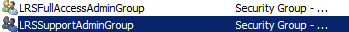

# <a name="deploy-srs-v1-administrative-web-portal-in-skype-for-business-server"></a><span data-ttu-id="bae5c-105">Развертывание SRS v1 административного веб-портала в Скайп for Business Server</span><span class="sxs-lookup"><span data-stu-id="bae5c-105">Deploy SRS v1 Administrative Web Portal in Skype for Business Server</span></span>

<span data-ttu-id="bae5c-106">Скайп для бизнес-систем комнаты Скайп Server v1 (SRS v1, ранее называлась системы комнаты Lync) административного веб-портала — это веб-портала, организации могут использовать для поддержки конференц-залов Скайп комнаты систем.</span><span class="sxs-lookup"><span data-stu-id="bae5c-106">The Skype for Business Server Skype Room Systems v1 (SRS v1, formerly known as Lync Room System) Administrative Web Portal is a web portal that organizations can use to maintain their Skype Room Systems conference rooms.</span></span> <span data-ttu-id="bae5c-107">Администраторы могут использовать SRS v1 административного веб-портала для отслеживания работоспособности устройств, например следя за устройства аудио и видео.</span><span class="sxs-lookup"><span data-stu-id="bae5c-107">Administrators can use the SRS v1 Administrative Web Portal to monitor device health, for example by monitoring audio/video devices.</span></span> <span data-ttu-id="bae5c-108">С помощью этого портала, администраторы могут удаленно собирать диагностические сведения, чтобы отслеживать работоспособность конференц-зала.</span><span class="sxs-lookup"><span data-stu-id="bae5c-108">With this portal, administrators can remotely collect diagnostic information to monitor conference room health.</span></span>

<span data-ttu-id="bae5c-109">Чтобы использовать эту функцию, веб-портал администрирования v1 SRS требуется развернуть на каждом Скайп для сервера переднего плана Business Server.</span><span class="sxs-lookup"><span data-stu-id="bae5c-109">To use this feature, the SRS v1 Administrative Web Portal needs to be deployed on every Skype for Business Server Front End Server.</span></span> <span data-ttu-id="bae5c-110">Это руководство содержит инструкции для администраторов по установке и настройке веб-портала администрирования SRS.</span><span class="sxs-lookup"><span data-stu-id="bae5c-110">This guide provides instructions for administrators on how to install and configure the SRS Administrative Web Portal.</span></span> <span data-ttu-id="bae5c-111">Предназначена для администраторов, имеющих знаний Скайп для администрирования Business Server и пользователей, которые имеют права администратора для изменения Скайп для топологии Business Server.</span><span class="sxs-lookup"><span data-stu-id="bae5c-111">It is intended for administrators who have knowledge of Skype for Business Server administration, and who have administrator user rights to modify the Skype for Business Server topology.</span></span>

<span data-ttu-id="bae5c-112">После v1 SRS, административного веб-портала развертывается на сервере администраторы могут проверить устройства v1 SRS состояние, войдя на сайт из их компьютеров и ноутбуков.</span><span class="sxs-lookup"><span data-stu-id="bae5c-112">After the SRS v1 Administrative Web Portal is deployed on the server, administrators can check the status SRS v1 devices by logging on to the site from their own computers or laptops.</span></span>

> [!IMPORTANT]
> <span data-ttu-id="bae5c-113">Загрузите [Microsoft Скайп комнаты систем v1 административного веб-портала для Скайп для Business Server 2015](https://www.microsoft.com/en-us/download/details.aspx?id=46906).</span><span class="sxs-lookup"><span data-stu-id="bae5c-113">Download the [Microsoft Skype Room Systems v1 Administrative Web Portal for Skype for Business Server 2015](https://www.microsoft.com/en-us/download/details.aspx?id=46906).</span></span>

<span data-ttu-id="bae5c-114">В этом разделе:</span><span class="sxs-lookup"><span data-stu-id="bae5c-114">In this topic:</span></span>

- [<span data-ttu-id="bae5c-115">настройка среды для работы с веб-порталом администрирования SRS версии 1.</span><span class="sxs-lookup"><span data-stu-id="bae5c-115">Configure your environment for the SRS v1 Administrative Web Portal</span></span>](room-system-v1-administrative-web-portal.md#Config_Env)

- [<span data-ttu-id="bae5c-116">Установка веб-портала администрирования SRS версии 1</span><span class="sxs-lookup"><span data-stu-id="bae5c-116">Install the SRS v1 Administrative Web Portal</span></span>](room-system-v1-administrative-web-portal.md#Install_SRS)

- [<span data-ttu-id="bae5c-117">использование веб-портала администрирования SRS;</span><span class="sxs-lookup"><span data-stu-id="bae5c-117">Use the SRS Administrative Web Portal</span></span>](room-system-v1-administrative-web-portal.md#Use_Portal)

## <a name="configure-your-environment-for-the-srs-v1-administrative-web-portal"></a><span data-ttu-id="bae5c-118">настройка среды для работы с веб-порталом администрирования SRS версии 1.</span><span class="sxs-lookup"><span data-stu-id="bae5c-118">Configure your environment for the SRS v1 Administrative Web Portal</span></span>
<span data-ttu-id="bae5c-119"><a name="Config_Env"> </a></span><span class="sxs-lookup"><span data-stu-id="bae5c-119"></span></span>

<span data-ttu-id="bae5c-120">Для работы с веб-порталом администрирования SRS версии 1 потребуется установить или настроить указанные ниже компоненты.</span><span class="sxs-lookup"><span data-stu-id="bae5c-120">To use the SRS v1 Administrative Web Portal, you will need to install or configure the following prerequisites.</span></span>

> [!IMPORTANT]
> <span data-ttu-id="bae5c-p104">Если на сервере настроена проверка подлинности Kerberos и NTLM, а SRS работает на компьютере, который не присоединен к домену, проверка подлинности Kerberos не будет выполнена и пользователь не сможет видеть состояние SRS на портале администрирования. Чтобы устранить эту проблему, настройте на сервере  проверку подлинности NTLM или NTLM и TLS-DSK (без Kerberos) либо присоедините компьютер SRS к домену.</span><span class="sxs-lookup"><span data-stu-id="bae5c-p104">If the server is configured with both Kerberos and NTLM authentication, and SRS is running on a computer that is not joined to the domain, Kerberos authentication will fail and the user will not see the status of SRS in the administrative portal. To resolve this issue, configure the server with NTLM authentication or both NTLM and TLS-DSK authentication (without Kerberos), or join the SRS computer to the domain.</span></span>

1. <span data-ttu-id="bae5c-123">Установка Скайп for Business Server накопительных пакетов обновления в Скайп для топологии Business Server.</span><span class="sxs-lookup"><span data-stu-id="bae5c-123">Install Skype for Business Server Cumulative Updates in the Skype for Business Server topology.</span></span>

    <span data-ttu-id="bae5c-124">Получение обновления и увидеть, что включила с ним см [обновления для Скайп для Business Server 2015](https://support.microsoft.com/en-us/help/3061064/updates-for-skype-for-business-server-2015).</span><span class="sxs-lookup"><span data-stu-id="bae5c-124">To get the update or see what's included with it, see [Updates for Skype for Business Server 2015](https://support.microsoft.com/en-us/help/3061064/updates-for-skype-for-business-server-2015).</span></span>

2. <span data-ttu-id="bae5c-125">Создайте учетную запись пользователя Active Directory с включенной поддержкой SIP.</span><span class="sxs-lookup"><span data-stu-id="bae5c-125">Create a SIP-enabled Active Directory user.</span></span>

    <span data-ttu-id="bae5c-126">SRS v1 административного веб-портала использует эти учетные данные для запроса сведений от Скайп для Business Server.</span><span class="sxs-lookup"><span data-stu-id="bae5c-126">The SRS v1 Administrative Web Portal uses these credentials to query information from Skype for Business Server.</span></span> <span data-ttu-id="bae5c-127">В приведенном примере используется имя пользователя LRSApp.</span><span class="sxs-lookup"><span data-stu-id="bae5c-127">The username in the examples given is LRSApp.</span></span>

3. <span data-ttu-id="bae5c-128">Создайте группу безопасности Active Directory с именем LRSSupportAdminGroup.</span><span class="sxs-lookup"><span data-stu-id="bae5c-128">Create an Active Directory security group with name LRSSupportAdminGroup.</span></span>

    <span data-ttu-id="bae5c-p106">Создайте группу с глобальной областью действия и типом "Безопасность". Пользователи с включенной поддержкой SIP, добавляемые в эту группу, будут автоматически получать разрешения на просмотр списка комнат и выполнение определенных команд, таких как ведение журналов.</span><span class="sxs-lookup"><span data-stu-id="bae5c-p106">Create the group with Group Scope as Global and Group Type as Security. SIP enabled users who are added to this group will be authorized to see the list of rooms and execute certain commands, such as collecting logs.</span></span>

4. <span data-ttu-id="bae5c-131">Создайте группу безопасности Active Directory с именем LRSFullAccessAdminGroup. </span><span class="sxs-lookup"><span data-stu-id="bae5c-131">Create an Active Directory security group with name LRSFullAccessAdminGroup.</span></span>

    <span data-ttu-id="bae5c-p107">Создайте группу с глобальной областью действия и типом "Безопасность". Пользователи с поддержкой возможностей SIP, добавляемые в эту группу, будут автоматически получать разрешения на доступ ко всем функциям администрирования портала в отдельном конференц-зале Skype. Чтобы добавить поддержку группового управления конференц-залами Skype, см. действие 5. </span><span class="sxs-lookup"><span data-stu-id="bae5c-p107">Create the group with Group Scope as Global and Group Type as Security.SIP enabled users who are added to this group are authorized to use all admin portal functionality on a single Skype room. To include support for bulk management of Skype rooms, refer to step 5.</span></span>

     

5. <span data-ttu-id="bae5c-135">Создайте группу безопасности Active Directory с именем LRSPowerUserAdminsGroup.</span><span class="sxs-lookup"><span data-stu-id="bae5c-135">Create an Active Directory security group with name LRSPowerUserAdminsGroup.</span></span>

    <span data-ttu-id="bae5c-136">Создайте группу с глобальной областью действия и типом "Безопасность".</span><span class="sxs-lookup"><span data-stu-id="bae5c-136">Create the group with Group Scope as Global and Group Type as Security.</span></span> <span data-ttu-id="bae5c-137">SIP поддержкой пользователей, добавленных в эту группу, могут использовать все функции портала администрирования, включая массового управление Скайп для бизнес-залов.</span><span class="sxs-lookup"><span data-stu-id="bae5c-137">SIP enabled users who are added to this group are authorized to use all admin portal functionality including bulk management of Skype for Business rooms.</span></span>

6. <span data-ttu-id="bae5c-138">Добавление LRSFullAccessAdminGroup как члена LRSSupportAdminGroup.</span><span class="sxs-lookup"><span data-stu-id="bae5c-138">Add LRSFullAccessAdminGroup as a member of LRSSupportAdminGroup.</span></span>

     

7. <span data-ttu-id="bae5c-140">Создайте пользователя Active Directory с поддержкой возможностей SIP и именем LRSSupport.</span><span class="sxs-lookup"><span data-stu-id="bae5c-140">Create a SIP enabled Active Directory user with name LRSSupport.</span></span> <span data-ttu-id="bae5c-141">Добавьте его в группу LRSSupportAdminGroup.</span><span class="sxs-lookup"><span data-stu-id="bae5c-141">Add this user to LRSSupportAdminGroup.</span></span>

     

8. <span data-ttu-id="bae5c-143">Установка [ASP.NET MVC 4 для Visual Studio 2010 с пакетом обновления 1 и Visual Web Developer 2010 с пакетом обновления 1](https://go.microsoft.com/fwlink/p/?LinkId=323967).</span><span class="sxs-lookup"><span data-stu-id="bae5c-143">Install [ASP.NET MVC 4 for Visual Studio 2010 SP1 and Visual Web Developer 2010 SP1](https://go.microsoft.com/fwlink/p/?LinkId=323967).</span></span>

## <a name="install-the-srs-v1-administrative-web-portal"></a><span data-ttu-id="bae5c-144">Установка веб-портала администрирования SRS версии 1</span><span class="sxs-lookup"><span data-stu-id="bae5c-144">Install the SRS v1 Administrative Web Portal</span></span>
<span data-ttu-id="bae5c-145"><a name="Install_SRS"> </a></span><span class="sxs-lookup"><span data-stu-id="bae5c-145"></span></span>

<span data-ttu-id="bae5c-146">Загрузите [Microsoft Скайп комнаты систем v1 административного веб-портала для Скайп для Business Server 2015](https://www.microsoft.com/en-us/download/details.aspx?id=46906).</span><span class="sxs-lookup"><span data-stu-id="bae5c-146">Download the [Microsoft Skype Room Systems v1 Administrative Web Portal for Skype for Business Server 2015](https://www.microsoft.com/en-us/download/details.aspx?id=46906).</span></span>

<span data-ttu-id="bae5c-147">Для установки веб-портала администрирования SRS версии 1 выполните следующее.</span><span class="sxs-lookup"><span data-stu-id="bae5c-147">To install the SRS v1 Administrative Web Portal, use the following steps.</span></span>

1. <span data-ttu-id="bae5c-148">Настройте порт надежные приложения, выполнив следующий командлет в Скайп для консоли Business Server:</span><span class="sxs-lookup"><span data-stu-id="bae5c-148">Configure the Trusted Application Port by running the following cmdlet in Skype for Business Server Management Shell:</span></span>

   ```
   Set-CsWebServer -Identity POOLFQDN -MeetingRoomAdminPortalInternalListeningPort 4456 -MeetingRoomAdminPortalExternalListeningPort 4457
   ```

2. <span data-ttu-id="bae5c-149">Чтобы установить портал комнат для собраний, скачайте файл **MeetingRoomPortalInstaller.msi** и запустите его от имени администратора.</span><span class="sxs-lookup"><span data-stu-id="bae5c-149">To install the Meeting Room Portal, download **MeetingRoomPortalInstaller.msi** and then run it as an administrator.</span></span>

3. <span data-ttu-id="bae5c-150">Откройте файл Web.config в следующей папке:</span><span class="sxs-lookup"><span data-stu-id="bae5c-150">Open the Web.config file from the following location:</span></span>

    <span data-ttu-id="bae5c-151">%Program Files%\Skype for Business Server 2015\Web Components\Meeting Room Portal\Int\Handler\\</span><span class="sxs-lookup"><span data-stu-id="bae5c-151">%Program Files%\Skype for Business Server 2015\Web Components\Meeting Room Portal\Int\Handler\\</span></span>

4. <span data-ttu-id="bae5c-152">В файле Web.Config измените PortalUserName на имя пользователя, созданный на шаге 2 в разделе «[Настройка среды для администрирования веб-портала SRS v1](room-system-v1-administrative-web-portal.md#Config_Env)» (рекомендуемый имя на этапе — LRSApp):</span><span class="sxs-lookup"><span data-stu-id="bae5c-152">In the Web.Config file, change the PortalUserName to the username created in Step 2 under the section "[Configure your environment for the SRS v1 Administrative Web Portal](room-system-v1-administrative-web-portal.md#Config_Env)" (the recommended name in the step is LRSApp):</span></span>

    ```
    <add key="PortalUserName" value="sip:LRSApp@domain.com" />
    ```

5. <span data-ttu-id="bae5c-p110">Поскольку портал администрирования SRS версии 1 является доверенным приложением, указывать пароль в конфигурации портала не требуется. Если этот пользователь использует регистратор, отличный от локального, необходимо указать регистратор, добавив в файл Web.Config следующую строку: </span><span class="sxs-lookup"><span data-stu-id="bae5c-p110">Because the SRS v1 Admin Portal is a trusted application, you do not need to provide the password in the portal configuration. If this user is using a different registrar than local registrar, you need to specify the registrar for it by adding the following line in the Web.Config file:</span></span>

   ```
   <add key="PortalUserRegistrarFQDN" value="pool-xxxx.domain.com" />
   ```

6. <span data-ttu-id="bae5c-155">Если используется порт, отличный от 5061, добавьте в файл Web.Config следующую строку: </span><span class="sxs-lookup"><span data-stu-id="bae5c-155">If the port used is other than 5061, add the following line in the Web.Config file:</span></span>

   ```
   <add key="PortalUserRegistrarPort" value="5061" />
   ```

### <a name="verify-installation-of-the-srs-administrative-web-portal"></a><span data-ttu-id="bae5c-156">Проверка установки веб-портала администрирования SRS</span><span class="sxs-lookup"><span data-stu-id="bae5c-156">Verify Installation of the SRS Administrative Web Portal</span></span>

<span data-ttu-id="bae5c-157">Чтобы проверить установку веб-портала администрирования SRS версии 1, сделайте следующее.</span><span class="sxs-lookup"><span data-stu-id="bae5c-157">To verify installation of the SRS v1 Administrative Web Portal, do the following:</span></span>

1. <span data-ttu-id="bae5c-158">Откройте следующий URL-адрес на сервере переднего плана:</span><span class="sxs-lookup"><span data-stu-id="bae5c-158">On a Front End server, browse to the following URL:</span></span>

    <span data-ttu-id="bae5c-159">https://\<fe server\>/lrs</span><span class="sxs-lookup"><span data-stu-id="bae5c-159">https://\<fe-server\>/lrs</span></span>

    <span data-ttu-id="bae5c-160">При этом не должно выводиться никаких сообщений об ошибках, как на следующем рисунке:</span><span class="sxs-lookup"><span data-stu-id="bae5c-160">You should not see any errors, as shown in the following image:</span></span>

     

2. <span data-ttu-id="bae5c-162">Если никаких сообщений при этом не выводится, попробуйте перейти по следующему URL-адресу с любого другого компьютера в топологии:</span><span class="sxs-lookup"><span data-stu-id="bae5c-162">If you do not see any errors, try accessing the following URL from any other computer in the topology:</span></span>

    <span data-ttu-id="bae5c-163">https://\<fe server\>/lrs</span><span class="sxs-lookup"><span data-stu-id="bae5c-163">https://\<fe-server\>/lrs</span></span>

    <span data-ttu-id="bae5c-164">Для доступа к странице, необходимо добавить записи DNS, как описано в «[необходимые записи DNS для автоматического вход клиента](https://go.microsoft.com/fwlink/p/?LinkId=318056)».</span><span class="sxs-lookup"><span data-stu-id="bae5c-164">To access the page, you will need to add the DNS records as described in "[Required DNS Records for Automatic Client Sign-In](https://go.microsoft.com/fwlink/p/?LinkId=318056)."</span></span>

## <a name="use-the-srs-administrative-web-portal"></a><span data-ttu-id="bae5c-165">использование веб-портала администрирования SRS;</span><span class="sxs-lookup"><span data-stu-id="bae5c-165">Use the SRS Administrative Web Portal</span></span>
<span data-ttu-id="bae5c-166"><a name="Use_Portal"> </a></span><span class="sxs-lookup"><span data-stu-id="bae5c-166"></span></span>

<span data-ttu-id="bae5c-167">После развертывания SRS на сервере можно проверить состояние всех конференц-залов SRS , войдя на веб-портал администрирования SRS версии 1 с помощью браузера.</span><span class="sxs-lookup"><span data-stu-id="bae5c-167">After you deploy SRS on the server, you can check the status of all SRS rooms by signing into the SRS v1 Administrative Web Portal from a browser.</span></span>

### <a name="sign-in"></a><span data-ttu-id="bae5c-168">Вход</span><span class="sxs-lookup"><span data-stu-id="bae5c-168">Sign in</span></span>

1. <span data-ttu-id="bae5c-169">Перейдите по следующему URL-адресу:</span><span class="sxs-lookup"><span data-stu-id="bae5c-169">Browse to the following URL:</span></span>

    <span data-ttu-id="bae5c-170">https://\<fe server\>/lrs</span><span class="sxs-lookup"><span data-stu-id="bae5c-170">https://\<fe-server\>/lrs</span></span>

2. <span data-ttu-id="bae5c-171">Введите учетные данные учетной записи LRSSupport или учетной записи, добавленной в группу безопасности LRSSupportAdminGroup.</span><span class="sxs-lookup"><span data-stu-id="bae5c-171">Enter the credentials for the LRSSupport account or an account that was added to the LRSSupportAdminGroup security group.</span></span>


### <a name="srs-administrative-web-portal-summary-page"></a><span data-ttu-id="bae5c-173">Страница сводных данных веб-портала администрирования SRS</span><span class="sxs-lookup"><span data-stu-id="bae5c-173">SRS Administrative Web Portal Summary Page</span></span>

<span data-ttu-id="bae5c-174">На странице сводных данных предоставляется следующая информация обо всех конференц-залах SRS, развернутых на сервере:</span><span class="sxs-lookup"><span data-stu-id="bae5c-174">The summary page provides the following information for all of the SRS rooms deployed on the server:</span></span>

- <span data-ttu-id="bae5c-175">**Тег** Имя настраиваемого, администратор предоставляет в комнату.</span><span class="sxs-lookup"><span data-stu-id="bae5c-175">**Tag** The custom name that the administrator gives to the room.</span></span> <span data-ttu-id="bae5c-176">Тег можно задать на портале, щелкнув имя конференц-зала.</span><span class="sxs-lookup"><span data-stu-id="bae5c-176">The Tag can be set in the portal by clicking on the room name.</span></span>

- <span data-ttu-id="bae5c-177">**Работоспособности** Состояние работоспособности комнаты, который является производным от состояния работоспособности статистические комнаты, как показано в разделе работоспособности на странице Параметры комнаты.</span><span class="sxs-lookup"><span data-stu-id="bae5c-177">**Health** The health status of the room, which is derived from the Aggregate Health status of the room, which is shown under the Health section of the Room Settings page.</span></span>

- <span data-ttu-id="bae5c-178">**Далее собрания** Дата и время запланированного следующего собрания.</span><span class="sxs-lookup"><span data-stu-id="bae5c-178">**Next Meeting** The date and time the next meeting is scheduled.</span></span>

- <span data-ttu-id="bae5c-179">**SRS версии, производителя, модель** Эти значения заданы в SRS.</span><span class="sxs-lookup"><span data-stu-id="bae5c-179">**SRS Version, Manufacturer, Model** These values are preset in SRS.</span></span> <span data-ttu-id="bae5c-180">В зависимости от производителя данные поля могут оставаться пустыми.</span><span class="sxs-lookup"><span data-stu-id="bae5c-180">Depending on the manufacturer, these fields might be left blank.</span></span>

- <span data-ttu-id="bae5c-181">**Последнее обновление** Время последнего обновления веб-страницы.</span><span class="sxs-lookup"><span data-stu-id="bae5c-181">**Last Refresh** Displays the last time the web page was refreshed.</span></span>


> [!NOTE]
> <span data-ttu-id="bae5c-183">В меню Управление массового будут видеть только часть из группы безопасности LRSPowerUserAdminsGroup.</span><span class="sxs-lookup"><span data-stu-id="bae5c-183">You will only see the Bulk Management menu if you are part of the LRSPowerUserAdminsGroup security group.</span></span>

### <a name="srs-room-information"></a><span data-ttu-id="bae5c-184">Информация о конференц-зале SRS</span><span class="sxs-lookup"><span data-stu-id="bae5c-184">SRS Room Information</span></span>

<span data-ttu-id="bae5c-p113">Раздел "Информация о конференц-зале" портала позволяет просматривать и настраивать отдельные конференц-залы SRS . Он состоит из четырех разделов: "Параметры", "Сведения", "Ведение журнала" и "Работоспособность".</span><span class="sxs-lookup"><span data-stu-id="bae5c-p113">The Room Info section of the portal allows you to view and configure individual SRS rooms. It contains four sections: Settings, Details, Logging, and Health.</span></span>

#### <a name="settings"></a><span data-ttu-id="bae5c-187">Параметры</span><span class="sxs-lookup"><span data-stu-id="bae5c-187">Settings</span></span>

<span data-ttu-id="bae5c-p114">В разделе "Параметры" для выбранного конференц-зала можно задать пароль, тег конференц-зала и уровни громкости по умолчанию. Изменения этих параметров реплицируются только после перезапуска консоли SRS. Параметры обновлений системы будут доступны только для устройств SRS, использующих выпуск версии 15.12 и выше.</span><span class="sxs-lookup"><span data-stu-id="bae5c-p114">In the Settings section, you can set the password, room tag, and default volume levels for the room. If you configure these settings, the changes are replicated only after you restart the SRS console. You will only see System Updates settings for SRS devices using release 15.12 and later.</span></span>


#### <a name="details"></a><span data-ttu-id="bae5c-192">Подробности</span><span class="sxs-lookup"><span data-stu-id="bae5c-192">Details</span></span>

<span data-ttu-id="bae5c-193">В разделе сведения предоставляются обобщенные сведения только для чтения параметров SRS комнаты, включая: времени последнего обновления; Далее собрания; последние обновления, обслуживания в ремонтной мастерской; по умолчанию динамик, микрофона и параметры звонка; версия; SIP URI; Число экранов и подробные сведения о каждом экрана; состояния и действия.</span><span class="sxs-lookup"><span data-stu-id="bae5c-193">The Details section provides a read-only summary of the SRS room's settings, including: the time of last refresh; next meeting; last updates, maintenance and calibration; default speaker, mic, and ringer settings; version; SIP URI; number of screens and details about each screen; status, and activity.</span></span>


#### <a name="troubleshooting"></a><span data-ttu-id="bae5c-195">Поиск и устранение неполадок</span><span class="sxs-lookup"><span data-stu-id="bae5c-195">Troubleshooting</span></span>

<span data-ttu-id="bae5c-p115">Раздел "Поиск и устранение неполадок" можно использовать для удаленного сбора журналов и их сохранения в указанном месте. Кроме того, можно перезапустить консоль SRS (пользовательский интерфейс SRS) или всю систему. Для сбора журналов укажите путь к папке в заданном формате и убедитесь, что эта папка имеет разрешения на запись, предоставленные учетной записи компьютера SRS. Если журнал имеет слишком большой размер, процесс сбора журналов может занять до пяти минут. Для просмотра актуального состояния обновите страницу.</span><span class="sxs-lookup"><span data-stu-id="bae5c-p115">The Troubleshooting section can be used to remotely collect logs and save them to a specified location. You can also restart the SRS console (SRS user interface) or restart the entire system. To collect logs, provide a folder path in the specified format and make sure that the folder has write permissions given to the SRS machine account. If the log size is too big, it can take up to 5 minutes to finish collecting logs. Refreshing the page will give you the latest status.</span></span>

#### <a name="health"></a><span data-ttu-id="bae5c-201">Работоспособность</span><span class="sxs-lookup"><span data-stu-id="bae5c-201">Health</span></span>

<span data-ttu-id="bae5c-202">В разделе работоспособности предоставляет визуальный индикатор работоспособности Скайп для подключений к Business Server, звуковое устройство, видеоустройство, состояние устойчивости и экрана устройства.</span><span class="sxs-lookup"><span data-stu-id="bae5c-202">The Health section gives a visual indication of the health of the Skype for Business Server connection, audio device, video device, resiliency state, and screen device.</span></span>


### <a name="additional-notes-about-the-administrative-web-portal"></a><span data-ttu-id="bae5c-204">Дополнительные примечания о веб-портале администрирования</span><span class="sxs-lookup"><span data-stu-id="bae5c-204">Additional Notes about the Administrative Web Portal</span></span>

> [!NOTE]
>  <span data-ttu-id="bae5c-205">Параметр изменения вступают в силу только после системы SRS перезапустить .> Если срок действия пароля учетной записи LRSApp, вы не сможете видеть состояние аудитории.</span><span class="sxs-lookup"><span data-stu-id="bae5c-205">Setting changes are applied only after the SRS system is restarted.>  If the LRSApp account password expires, you will not be able to see the status of the rooms.</span></span> <span data-ttu-id="bae5c-206">Настройте пароля учетной записи LRSAppuser таким образом, никогда не истекает срок действия или обновите пароль, когда это рядом с expiration.> SRS административные, что поддерживает только развертывание на локальном веб-портала.</span><span class="sxs-lookup"><span data-stu-id="bae5c-206">Configure the LRSAppuser account password so that it never expires, or be sure to update the password when it is near expiration.>  The SRS administrative web portal is supported for on-premises deployments only.</span></span>

### <a name="bulk-management"></a><span data-ttu-id="bae5c-207">Групповое управление </span><span class="sxs-lookup"><span data-stu-id="bae5c-207">Bulk management</span></span>

<span data-ttu-id="bae5c-208">Групповое управление конференц-залами SRS — это функция, предназначенная для продвинутых ИТ-администраторов. Она позволяет упростить рабочие процессы и дает возможность сэкономить время, предоставляя удобное средство для удаленного группового управления несколькими конференц-залами.</span><span class="sxs-lookup"><span data-stu-id="bae5c-208">Bulk management of SRS rooms is a feature designed for advanced IT administrators, to simplify their workflow, and enable them with a time-saving convenient tool to remotely manage multiple rooms in a bulk fashion.</span></span>

<span data-ttu-id="bae5c-209">Чтобы получить доступ к этой функции, пользователь должен входить в специальную группу безопасности **LRSPowerUserAdminsGroup**.  </span><span class="sxs-lookup"><span data-stu-id="bae5c-209">In order to see this functionality, the user need to be provisioned as a member of the special security group, **LRSPowerUserAdminsGroup**.</span></span>

<span data-ttu-id="bae5c-p117">Для группового управления можно задать неограниченное число конференц-залов SRS. При этом в один момент времени можно выполнять только одну операцию группового управления.</span><span class="sxs-lookup"><span data-stu-id="bae5c-p117">There is no limit to the number of SRS rooms you can select for bulk management. However, you can perform only one bulk management operation at a time.</span></span>

<span data-ttu-id="bae5c-212">Чтобы выполнить операцию группового управления, выберите комнаты, которые нужно отслеживать, и щелкните меню "Групповое управление". </span><span class="sxs-lookup"><span data-stu-id="bae5c-212">To perform a bulk management operation, select the rooms you want to monitor, and click on the Bulk management menu.</span></span>

### <a name="frequently-asked-questions"></a><span data-ttu-id="bae5c-213">Вопросы и ответы</span><span class="sxs-lookup"><span data-stu-id="bae5c-213">Frequently asked questions</span></span>

#### <a name="why-cant-i-sign-in-to-the-administrative-web-portal"></a><span data-ttu-id="bae5c-214">Почему не удается войти для администрирования веб-портала?</span><span class="sxs-lookup"><span data-stu-id="bae5c-214">Why can't I sign in to the administrative web portal?</span></span>

<span data-ttu-id="bae5c-215">При открытии https://localhost/lrs, вы сможете видеть странице входа, но при вводе в свои учетные данные, не удается выполнить вход.</span><span class="sxs-lookup"><span data-stu-id="bae5c-215">When you open https://localhost/lrs, you will be able to see the sign in page, but when you type in your credentials, you cannot sign in.</span></span> <span data-ttu-id="bae5c-216">В этом случае необходимо открыть https://FQDNofFEserver/SRS для входа в программу администрирования веб-портала.</span><span class="sxs-lookup"><span data-stu-id="bae5c-216">In this case, you must open https://FQDNofFEserver/SRS to sign in to the administrative web portal.</span></span>

#### <a name="why-cant-i-see-srs-v1-in-the-administrative-web-portal"></a><span data-ttu-id="bae5c-217">Почему не видны SRS v1 в административных веб-портала?</span><span class="sxs-lookup"><span data-stu-id="bae5c-217">Why can't I see SRS v1 in the administrative web portal?</span></span>

- <span data-ttu-id="bae5c-218">Убедитесь, что в развернутой системе есть учетные записи SRS, и что они созданы в соответствии с рекомендациями по развертыванию веб-портала администрирования SRS.</span><span class="sxs-lookup"><span data-stu-id="bae5c-218">Make sure you have SRS accounts in your deployment and that they are created according to the SRS Administrative Web Portal deployment recommendations.</span></span> <span data-ttu-id="bae5c-219">Убедитесь, что учетные записи SRS подготавливаются с помощью Enable-CsMeetingRoom, не Enable-CsUser, на Скайп для Business Server.</span><span class="sxs-lookup"><span data-stu-id="bae5c-219">Make sure the SRS accounts are provisioned using Enable-CsMeetingRoom, not Enable-CsUser, on the Skype for Business Server.</span></span>

- <span data-ttu-id="bae5c-220">Если были созданы SRS учетных записей и не могут просматривать учетные записи в административных веб-портала, сбор журналов сервера с помощью Скайп средства ведения журнала Business Server с **MeetingPortal** компонент, а затем отправьте их поддержка контакту SRS.</span><span class="sxs-lookup"><span data-stu-id="bae5c-220">If you have created SRS accounts and cannot see the accounts in administrative web portal, collect the server logs by using the Skype for Business Server Logging tool with the **MeetingPortal** component selected, and then send them to your SRS support contact.</span></span>

- <span data-ttu-id="bae5c-p120">Если вы создали учетные записи SRS, но они не отображаются на веб-портале администрирования, соберите журналы клиента, используя средство Fiddler, а также скопируйте журнал консоли из средств разработки браузера и отправьте все эти данные своему контактному лицу в службе поддержки SRS. Чтобы получить более подробные журналы, можно также изменить значение уровня трассировки в файле Web.config.</span><span class="sxs-lookup"><span data-stu-id="bae5c-p120">If you have created SRS accounts and cannot see the accounts in administrative web portal, collect the client logs using Fiddler, and also copy the console log from the browser development tools, and then send them to your SRS support contact. You can also modify the trace level value in the Web.config to get a more detailed log.</span></span>

  ```
  <system.diagnostics>
    <switches>
      <!--
      This switch controls logging message levels. 0 implies
      logging is turned off. 1 implies only errors are logged,
      2 implies errors &amp; warnings. 4 is the most detailed.
      -->
      <add name="TraceLevelSwitch" value="3" />
    </switches>
  </system.diagnostics>
  ```

#### <a name="why-cant-i-see-the-status-of-srs-in-the-administrative-web-portal"></a><span data-ttu-id="bae5c-223">Почему не удается просмотреть состояние SRS в административных веб-портала?</span><span class="sxs-lookup"><span data-stu-id="bae5c-223">Why can't I see the status of SRS in the administrative web portal?</span></span>

- <span data-ttu-id="bae5c-224">Убедитесь, что для учетной записи пользователя LRSApp включена поддержка SIP.</span><span class="sxs-lookup"><span data-stu-id="bae5c-224">Make sure that the LRSApp user account is SIP-enabled.</span></span>

- <span data-ttu-id="bae5c-225">Если по-прежнему возникают проблемы, сбор файлов **Trace.log** в системе SRS D:\Tracing\LRSAdminLogs\, и отправьте его контакту поддержки SRS.</span><span class="sxs-lookup"><span data-stu-id="bae5c-225">If you are still having issues, collect the **Trace.log** file in the SRS system from D:\Tracing\LRSAdminLogs\, and then send it to your SRS support contact.</span></span>

#### <a name="why-cant-i-see-the-bulk-management-menus-for-srs-in-the-administrative-web-portal"></a><span data-ttu-id="bae5c-226">Почему не видны в меню Управление массового для SRS в административных веб-портала?</span><span class="sxs-lookup"><span data-stu-id="bae5c-226">Why can't I see the bulk management menus for SRS in the administrative web portal?</span></span>

<span data-ttu-id="bae5c-227">Убедитесь в том, что учетная запись пользователя LRSApp поддержкой SIP и является частью группы безопасности LRSPowerUserAdminsGroup.</span><span class="sxs-lookup"><span data-stu-id="bae5c-227">Make sure that the LRSApp user account is SIP-enabled, and is part of the LRSPowerUserAdminsGroup security group.</span></span>

#### <a name="does-the-srs-v1-administrative-web-portal-work-with-microsoft-teams-rooms"></a><span data-ttu-id="bae5c-228">Административные веб-портала v1 SRS работает с комнат группами Майкрософт?</span><span class="sxs-lookup"><span data-stu-id="bae5c-228">Does the SRS v1 administrative web portal work with Microsoft Teams Rooms?</span></span>

<span data-ttu-id="bae5c-229">Нет</span><span class="sxs-lookup"><span data-stu-id="bae5c-229">No.</span></span>


