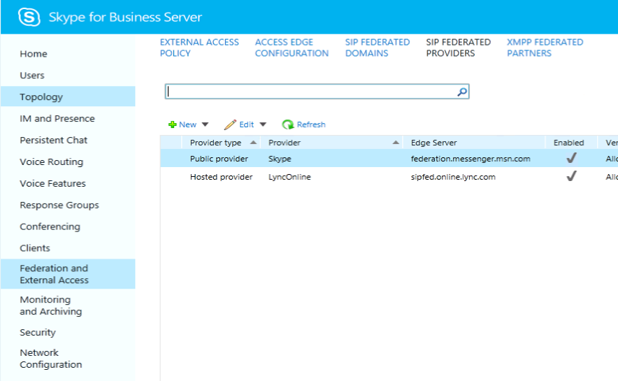

# <a name="deploy-skype-connectivity-in-skype-for-business-server"></a>Развертывание подключения Skype в Skype для бизнеса Server

**Сводка:** Узнайте, как подключить Skype для бизнеса Server к потребителю Skype. Также известна как подключение к Skype.
  
Эта статья посвящена развертыванию для подключения к Skype.
  
## <a name="skype-connectivity-overview-for-it-professionals"></a>Обзор подключения Skype для ИТ-специалистов

Подключение к Skype предоставляет пользователям Skype для бизнеса возможность поиска и добавления пользователей Skype. Подключение к Skype — это функция Skype для бизнеса, которая позволяет включить поиск федерации и каталогов с пользователями Skype. После подключения Skype пользователи Skype для бизнеса смогут искать и добавлять пользователей Skype.
  
## <a name="skype-directory-search"></a>Поиск по каталогам Skype

Функции поиска по каталогам Skype предоставляют пользователям Skype для бизнеса возможность поиска контактов Skype. Функция поиска позволяет пользователям искать с помощью следующих функций:
  
- **Поиск по имени отображения, например "John Doe".** Это может привести к возвращению многих результатов, поэтому вы можете не найти то, что вы ищете.
    
- **Поиск по имени отображения плюс расположение, например "John Doe в Барселоне"** - Это значительно сузит результаты поиска.
    
- **Поиск по электронной почте, пример "johndoe@outlook.com"** — в большинстве случаев это должно привести к одному результату; тот, который точно соответствует указанному сообщению электронной почты. Но если одна и та же электронная почта связана с несколькими учетными записьми, может быть возвращено несколько результатов.
    
- **Поиск по номеру телефона, примеру "123-123-1234"** - в большинстве случаев это должно привести к одному результату; тот, который точно соответствует указанному телефону. Номер телефона должен включать код страны (например, 1-xxx-yyy-zzzz). Если один и тот же номер телефона связан с несколькими учетными записьми, может быть возвращено несколько результатов.
    
- **Поиск по Skype Name, пример "JohnDoe1456".** Если будет найден точный совпадение, он будет возвращен в качестве первого результата. Другие возможные совпадения "имя" могут быть возвращены.
    
    > [!NOTE]
    > Поиск каталогов Skype должен иметь возможность связи со следующими IP-адресами в порту 443: 104.40.75.246, 23.101.135.34 и 40.113.86.19. 
  
## <a name="supported-deployment-matrix-for-skype-directory-search"></a>Поддерживаемая матрица развертывания для поиска по каталогам Skype

В следующей таблице описывается поддержка поиска по каталогам Skype.
  

|&nbsp;|Передняя часть Skype для бизнес-сервера|Передний конец Lync Server 2013 (или старше)|Комментарии|
|:-----|:-----|:-----|:-----|
|Skype для бизнеса Server Edge   |Поддерживается   |Не поддерживается   |Skype для бизнеса Server и Edge являются необходимыми условиями для поиска по каталогам Skype   |
|Skype для бизнеса Server Edge + Lync Server 2013 Edge, развернутый бок о бок   |Поддерживается   |Не поддерживается   |Трафик поиска в Skype Directory проходит через серверы Skype для бизнеса Server Edge. Трафик федерации проходит через край, настроенный администратором. Например, администратор может продолжить отправлять трафик федерации через серверы Lync Server 2013 Edge, которые не поддерживают поиск в Skype Directory.   |
|Lync Server 2013 (или старше) Edge   |Не поддерживается   |Не поддерживается   ||
   
> [!NOTE]
> Служба адресной книги, запущенная на переднем конце Skype для бизнес-сервера, находит край с помощью порта поиска Skype 4443 на сервере Edge. 
  
> [!NOTE]
> Если клиент имеет несколько сайтов в локальном развертывании, и если он развернул только один сервер Skype для бизнеса Server Edge server/pool, то поисковый трафик со всех сайтов будет проходить через единый доступный сервер Edge. Администратору необходимо убедиться, что пулы всех сайтов могут получать доступ к развернутой серверу и пулу Skype для бизнеса Server Edge. 
  
> [!NOTE]
> Служба графиков Skype будет затметь поисковые запросы от любого локального клиента или клиента Microsoft 365 или Office 365, если скорость запросов превышает 15 запросов в секунду. 
  
> [!NOTE]
> Для крупных корпоративных клиентов домены должны быть добавлены в список допуска с помощью службы поиска Skype, чтобы обеспечить более высокий уровень запросов.
  
> [!NOTE]
> Skype для бизнеса Server будет затормажать входящие запросы, если в очереди слишком много ожидающих запросов. 
  
## <a name="deploying-skype-connectivity-for-skype-for-business-online"></a>Развертывание подключения Skype для Skype для бизнеса в Интернете

Подключение к Skype также является функцией Skype для бизнеса Online, которая является частью Microsoft 365 и Office 365. Вы можете включить функцию подключения Skype из Центра администрирования Skype для бизнеса в центре администрирования Microsoft 365.
  
Для microsoft 365 среднего бизнеса Office 365 Enterprise, Microsoft 365 Education и Office 365 для правительства: войдите в центр администрирования Microsoft 365 и перейдите в Центр администрирования Skype для бизнеса. Перейдите к внешним коммуникациям. В рамках общедоступных поставщиков услуг im щелкните Включить. Если вы хотите управлять отдельным доступом пользователей к skype Connectivity, вы можете изменить параметры внешних коммуникаций отдельных пользователей.
  
Для Office 365 Премиум для малого бизнеса: войдите в Office 365 и перейдите в службу администрирования Параметры мгновенных сообщений, собраний и \> \> собраний. Включи внешние коммуникации. Переключатель внешних коммуникаций включает подключение к Skype и связь с другими организациями, которые используют Skype для бизнеса.
  
Дополнительные сведения об администрировании Skype для бизнеса в Интернете см. в.
  
- [Разрешите пользователям связываться с внешними пользователями Skype для бизнеса](../../SfbOnline/set-up-skype-for-business-online/allow-users-to-contact-external-skype-for-business-users.md)

- [Что делать, если внешние контакты Skype для бизнеса или Skype не могут быть мгновенными](https://support.office.com/article/What-to-try-if-you-cant-IM-Skype-for-Business-Lync-or-Skype-external-contacts-87f6d5d7-3b8c-4196-9c8c-1dabb75f54b8?ui=en-US&amp;rs=en-US&amp;ad=US)
    
- [Добавление контакта в Skype для бизнеса](https://support.office.com/article/Add-a-contact-in-Skype-for-Business-89338023-2adf-4f5c-90b6-f8b6f72fadd1)
  
- [Администраторы: настройка параметров Skype для бизнеса для отдельных пользователей](../../SfbOnline/set-up-skype-for-business-online/configure-skype-for-business-settings-for-individual-users.md)
    
## <a name="deploying-skype-connectivity-for-skype-for-business-server"></a>Развертывание подключения Skype для Skype для бизнес-сервера

Skype для бизнеса Server использует архитектуру доступа федерации для поддержки подключения к Skype. Это подключение позволяет пользователям Skype для бизнеса Server добавлять Skype. Клиенты Skype также могут добавлять пользователей Skype для бизнеса в список контактов. На основе политик, установленных в Skype для бизнеса Server, пользователи смогут общаться с помощью мгновенных сообщений, видеть присутствие друг друга и инициировать аудио- и видеозвонки. Подключение к Skype также является функцией Skype для бизнеса Online и может быть включено для клиентов Skype для бизнеса Online из Центра администрирования Skype для бизнеса в центре администрирования Microsoft 365.
  
> [!NOTE]
> Если Skype для бизнеса Server уже настроен для подключения к Windows Messenger с помощью подключения к общедоступным мгновенным сообщениями (PIC), развертывание уже настроено для подключения к Skype. Единственное изменение, которые вы можете рассмотреть, это переименовать существующую запись PIC-приложения Messenger в Skype. 
  
### <a name="the-skype-for-business-server-public-im-connectivity-provisioning-site-is-no-longer-available"></a>Общедоступный сайт по обеспечению подключения к чатам Skype для бизнеса Server больше не доступен

Сайт, который ранее использовался для ручного обеспечения федерации между локальной развертыванием Skype для бизнеса и Skype, больше не требуется и будет закрыт 15 сентября 2019 г. Федерация со Skype теперь использует федератное открытие партнеров, которое является тем же механизмом, который требуется для федерации с Skype для бизнеса Online.

Для связи между любыми локальной развертыванием Skype для бизнеса и пользователями Skype с помощью существующей инфраструктуры общедоступных мгновенных сообщений теперь требуется, чтобы конфигурация edge Server на локальной основе была совместима со Skype для бизнеса Online.

> [!NOTE]
> Большинству клиентов, включая все развертывания, которые федератируют с помощью Skype для бизнеса Online, не требуется никаких действий.
  
Локальное развертывание требуется для публикации записи SRV федерации DNS для каждого домена, в которых они размещены. Руководство доступно в [планировании DNS.](../plan-your-deployment/edge-server-deployments/edge-environmental-requirements.md#dns-planning) Каждый домен должен решить запросом DNS SRV на серверЕ FQDN, который соответствует суффиксу верхнего уровня домена. Например, рассмотрим домен "contoso.com":

|**Допустимые FQDNs**|**Comment**|
|:-----|:-----|
|sip.contoso.com   ||
|sipfed.contoso.com   |В каждом случае точный FQDN должен присутствовать в SN или SAN внешнего сертификата, установленного на краевом сервере.   |
|access.contoso.com   ||
|**Недействительные FQDNs**|**Причина**|
|sip.contoso-edge.com   |Не совпадает с суффиксом.  |
|sip.it.contoso.com   |Не соответствует суффиксу верхнего уровня.   |

Дополнительные рекомендации по внешним сертификатам можно найти в [планировании сертификатов.](../plan-your-deployment/edge-server-deployments/edge-environmental-requirements.md#certificate-planning)

#### <a name="faqs"></a>Вопросы и ответы

**Почему закрывается веб-сайт подготовка?**
Механизм обеспечения общедоступных чатов (PIC) (pic.lync.com), развернутый в 2006 г., больше не может быть служив и будет закрыт 8/15/2019. Вместо этого общественная федерация мгновенных данных предполагает ту же модель федерации, которая используется Skype для бизнеса Online, известная как "обнаружение партнеров", в результате чего локальное развертывание открыто обнаруживается ее записью DNS SRV федерации(s).

**Означает ли это изменение, что федерация общедоступных чатов отстает от данной области?**
Нет. Общественная федерация мгновенных вызовов будет поддерживаться в течение многих лет, вероятно, до тех пор, пока локальное средство Skype для бизнеса не достигнет конца жизни.

**Наша компания имеет гибридные отношения (общее адресное пространство) с Skype для бизнеса Online, мы затронуты?**
Нет, так как вы уже федерация в Skype для бизнеса Online, это изменение не повлияет на вас.
 
**Означает ли это изменение, что наша компания должна включить федерацию в Skype для бизнеса Online?**
Нет. Если параметры прокси-сервера не позволяют включить федерацию с поставщиком хостинга Skype для бизнеса Online (sipfed.online.lync.com), это изменение не повлияет на это. Тем не менее, те же требования к DNS и сертификатам, которые применяются к федеранию с Помощью Skype для бизнеса Online, теперь также применяются к федеранию с пользователями Skype.
 
**Наша компания является большой и не может изменить свою конфигурацию края из-за нормативных и соответствия требованиям и т.д. причинам ... что мы можем сделать?**
Любая локальной организации, которая не может изменить конфигурацию края сервера в указанном случае, должна при первой возможности связаться с поддержкой продукта.

### <a name="enabling-federation-and-public-im-connectivity-pic"></a>Включение подключения федерации и общего чата (PIC)

Теперь сосредоточься на среде Skype для бизнес-сервера и административных задачах, необходимых для настройки подключения Skype. В этом разделе предполагается, что администратор развернул Skype для бизнеса Server и настроил внешний доступ, также известный как edge servers. 
  
Чтобы включить федерацию и PIC, требуется три основных шага. Они перечислены ниже.
  
1. Настройка Федерации и PIC
    
2. Настройка по крайней мере одной политики для поддержки федератного доступа к пользователю
    
3. Настройка параметров поставщика pic Skype
    
#### <a name="1-configure-federation-and-pic"></a>1. Настройка федерации и PIC

Федерация необходима для того, чтобы пользователи Skype могли общаться с пользователями Skype для бизнеса в вашей организации. Подключение к общедоступным мгновенным сообщениями (PIC) — это класс федерации, который необходимо настроить, чтобы пользователи Skype для бизнеса могли общаться с пользователями Skype. Федерации и PIC настраиваются с помощью панели управления Skype для бизнес-серверов.
  
> [!NOTE]
> Федерация PIC больше не поддерживается выпусками продуктов до Lync Server 2010 (Live Communication Server, Office Communications Server). Поддерживаемые платформы федерации PIC включают Skype для бизнеса Server, Lync Server 2013 и Lync Server 2010. 
  
Федерация необходима для того, чтобы пользователи Skype могли общаться с пользователями Skype для бизнеса в вашей организации. Подключение к общедоступным мгновенным сообщениями (PIC) — это класс федерации, который необходимо настроить, чтобы пользователи Skype для бизнеса Server могли общаться с пользователями Skype. Федерации и PIC настроены с помощью диалогового диалога конфигурации Edge панели управления Skype для бизнес-серверов, как показано на рисунке.
  

  
> [!NOTE]
> Атрибуты EnableSkypeIdRouting и EnableSkypeDirectorySearch должны быть заданы в параметрах общедоступных поставщиков (см. более поздние инструкции) для работы поиска. 
  
Это завершает административные задачи, которые должны выполняться на сервере. Теперь вы настроены для подключения к Skype.
  
#### <a name="2-configure-at-least-one-policy-to-support-federated-user-access"></a>2. Настройка по крайней мере одной политики для поддержки федера-

С помощью панели управления Skype для бизнес-серверов администратор должен настроить одну или несколько внешних политик доступа пользователей, чтобы определить, могут ли пользователи Skype сотрудничать с внутренними пользователями Skype для бизнеса Server.
  
#### <a name="3-configure-the-skype-pic-provider-setting"></a>3. Настройка параметров поставщика pic Skype

Используя оболочку управления Skype для бизнес-серверов, администратор должен настроить клиентскую политику Skype для бизнеса для отображения Skype в качестве дополнительного поставщика pic. 
  
> [!NOTE]
> Пользователи поставщиков общедоступных служб подключения к мгновенным сообщениями (PIC) не могут участвовать в обмена мгновенными сообщениями или конференциях в вашей организации, пока не настроите хотя бы одну политику (шаг 2, ранее в этой процедуре) для поддержки общедоступных подключений к чатам. 
  
Для новых установок можно настроить подключение к Skype, включив общедоступный поставщик Skype с помощью панели управления Skype для бизнес-серверов, как показано на рисунке.
  

  
> [!NOTE]
> Чтобы настроить подключение Skype при обновлении до Skype для бизнеса Server, необходимо удалить и повторно добавить существующий общедоступный поставщик Skype. 
  
Настройка подключения Skype также может быть сделана с помощью только PowerShell. Настройка подключения Skype с помощью PowerShell:
  
1. На переднем сервере Skype для бизнеса Server откройте оболочку управления Skype для бизнес-серверов.
    
2. Запустите следующие две команды:
    
   ```powershell
    Remove-CsPublicProvider -Identity <identity-name>
   ```

    > [!NOTE]
    > Если у вас еще нет поставщика pic в среде и вы создаете новый поставщик pic, то вам не нужно запускать Remove-CsPublicProvider cmdlet. 
  
   ```powershell
   New-CsPublicProvider -Identity Skype -ProxyFqdn federation.messenger.msn.com -IconUrl https://images.edge.messenger.live.com/Messenger_16x16.png -NameDecorationRoutingDomain msn.com -NameDecorationExcludedDomainList "msn.com,outlook.com,live.com,hotmail.com" -Enabled $true -EnableSkypeIdRouting $true -EnableSkypeDirectorySearch $true
   ```

    Что делают менее очевидные параметры?
    
   - ProxyFqdn: расположение края федерации Skype (принадлежит и поддерживается Корпорацией Майкрософт)
    
   - IconURL: значок, используемый клиентом Lync Skype для бизнеса для &amp; визуального определения контактов Skype
    
   - NameDecorationRoutingDomain и NameDecorationExcludedDomainList: настройка этих данных позволяет пользователям вводить MSAs пользователей Skype без необходимости знать о "украшении" доменов не microsoft с помощью "msn.com". Это устраняет необходимость ввести "user(contoso.com)@msn.com" для всех доменов, не вложенных в ExcludedDomainList. Клиент SfB автоматически форматируется MSA, если домен не находится в исключенном списке. В исключенный список добавлены наиболее распространенные домены учетной записи Майкрософт.
    
     > [!NOTE]
     > При внесении изменений общедоступный поставщик должен быть удален и добавлен в нее. Изменения на месте не допускаются. 
  
     > [!NOTE]
     > Добавленные в настольный клиент Lync Server 2013 CU5 &amp; Lync в Office 2013 SP1, nameDecorationRoutingDomain и NameDecorationExcludedDomainList улучшают ситуацию, в которой пользователи Lync, добавляя контакты Skype, необходимые для "украшения" доменов, не вклюаний Майкрософт, для идентификации и маршрутизации их в Skype (формат: user(contoso.com)@msn.com). Эти новые параметры позволят автоматическое форматирование ввода адреса пользователя в диалоговом окне "Добавить контакт Skype" с nameDecorationRoutingDomain (которое должно быть задавано msn.com), если в нем не содержатся домены в NameDecorationExcludedDomainList (в настоящее время мы можем поддерживать msn.com, live.com, Hotmail.com, outlook.com). 
  
3. Теперь клиенты Skype для бизнеса могут искать и добавлять пользователя Skype.
    
## <a name="clients-and-interoperability-matrix"></a>Матрица клиентов и интероперабельности

В следующей таблице описывается состояние взаимодействия между последней версией потребителя Skype и последней версией Skype для бизнеса.
  

|Клиенты Skype|Добавление контактов, чата, присутствия, аудио- и видеозвонков|Comment|
|:-----|:-----|:-----|
|Skype Windows Desktop   |7.6 или выше, Windows XP и выше   |**NEW.** Поддержка клиента Windows Skype, запущенного в Windows XP, и Windows Vista (требуется последняя клиентская версия **7.26 или выше)**  |
|Skype Mobile — Android Phone и Планшет   |6.19 или выше, с операционной системой Android версии 4.0.3 или выше   |Устройства с низким уровнем спецификации могут не поддерживать видеозвонки   |
|Skype Mobile — iOS   |6.11 или выше на IOS 7 или более   |Не поддерживаются iPhone 4 и более ранние iPod 4-го поколения и более ранние iPad 1-го поколения   |
|Skype Mac   |7.19 или выше на Mac OS X 10.9 (Mavericks) или выше   |Требуется Mac OSX 10.9 или более   |
|Skype Универсальное приложение Для Windows (Windows 10) Для настольных компьютеров и мобильных устройств   |Windows 10 (обновление Redstone 1 или более позднее)   |Универсальное приложение Windows получит обновление осенью 2016 г., добавив поддержку интероп-операций   |
   
В следующей таблице описывается состояние взаимодействия между последней версией Skype для бизнеса и последней версией потребителя Skype. 
  
|Клиент|Поиск и добавление контактов в каталоге Skype|Skype A/V, interop im|
|:-----|:-----|:-----|
|Skype для бизнеса   |Да   |Да   |
|Skype для бизнеса на Mac   |Можно добавить (без поиска)   |Да   |
|Lync Desktop 2013   |Можно добавить (без поиска)   |Да   |
|Веб-приложение Lync — онлайн и локально   |Н/Д   |Н/Д   |
|Lync Mobile — Windows Phone   |Ожидается в скором времени   |Да   |
|Lync Mobile — Android   |Ожидается в скором времени   |Да   |
|Lync Mobile — iOS   |Ожидается в скором времени   |Да   |
|Система комнат Lync   |Ожидается в скором времени   |Да   |
|Современное приложение Lync (Win 8.1)   |Да   |Да   |
|Lync Mac 2011   |Можно добавить (без поиска)   |Да   |
|Lync Desktop 2010   |Можно добавить (без поиска)   |Да   |
|Lync Phone Edition   |Н/Д   |Н/Д   |
|Lync Attendant   |Н/Д   |Н/Д   |
   
