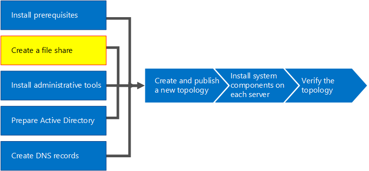

# Создание файловой папки в Skype для бизнеса Server
 
**Сводка:** Узнайте, как создать обойму файловой папки Windows Server в рамках установки Skype для бизнеса Server. Скачайте бесплатную пробную версия Skype для бизнеса Server в Центре оценки Майкрософт по [https://www.microsoft.com/evalcenter/evaluate-skype-for-business-server](https://www.microsoft.com/evalcenter/evaluate-skype-for-business-server) ссылке:
  
Для Skype для бизнеса Server требуется файловая папка, чтобы компьютеры в топологии могли обмениваться файлами. Создание файлового сервера — шаг 2 из 8 в процессе установки Skype для бизнеса Server. Шаги 1-5 можно делать в любом порядке. Однако шаги 6, 7 и 8 необходимо делать по порядку и после шагов 1–5, как по описано на схеме. For planning details about file share, see [Environmental requirements for Skype for Business Server](../../plan-your-deployment/requirements-for-your-environment/environmental-requirements.md) or Server [requirements for Skype for Business Server 2019.](../../../SfBServer2019/plan/system-requirements.md)
  

  
## Создание базового файловой папки

В этом разделе поется о создании базовой файловой папки Windows Server. В Skype для бизнеса Server поддерживается базовая файловая папка Windows Server. Однако она не обеспечивает высокую доступность явным образом. Для среды с высоким уровнем доступности рекомендуется использовать обилие файлов распределенной файловой системы (DFS). Дополнительные сведения о файловом сервере с высоким уровнем доступности и DFS см. в плане высокой доступности и аварийного [восстановления в Skype для бизнеса Server.](../../plan-your-deployment/high-availability-and-disaster-recovery/high-availability-and-disaster-recovery.md)
  
> [!NOTE]
> В Windows Server 2012 R2 были сделаны серьезные прыжки в предоставлении решений для файлового доступа, похожих на SAN, с помощью платформы Windows Server. По сравнению с традиционным устройством на основе SAN, решение для хранения данных Windows Server 2012 R2 может сократить затраты в два раза с минимальным влиянием на производительность. Дополнительные сведения о параметрах файлового пространства в Windows Server 2012 R2 см. в загружаемом документе ["Хранилище Windows Server 2012 R2".](https://download.microsoft.com/download/9/4/A/94A15682-02D6-47AD-B209-79D6E2758A24/Windows_Server_2012_R2_Storage_White_Paper.pdf) 
  
Просмотрите видео по созданию **файловой папки:**
  
> [!video https://www.microsoft.com/videoplayer/embed/dbef31be-e899-4a32-a1ca-370053284f56?autoplay=false]
  
### Создание базового файловой папки

1. Войдите на компьютер, на который будет работать файловая папка.
    
2. Щелкните правой кнопкой мыши папку, к которая планируется поделиться, и выберите **"Свойства".**
    
3. Выберите **вкладку "Общий** доступ" и нажмите кнопку **"Расширенный общий доступ".**
    
4. Щелкните **"Поделиться этой папкой".**
    
5. Выберите пункт **Разрешения**.
    
6. Добавьте **группу** локальных администраторов сервера, на который размещена файловая папка, предоставление прав **"Разрешить: полный доступ",** "Изменение" и "Чтение" и нажмите кнопку **"ОК".**
    
7. Нажмите **кнопку** "ОК" еще раз и заметьте сетевой путь.
    
8. Нажмите **кнопку** "Готово", чтобы закрыть мастер.
    
     
  
> [!NOTE]
>Если хранилище файлов находится в папке DFS, будет получено следующее предупреждение:

Предупреждение: не удается получить доступ к разрешениям для \\ <domain> \<share> ".

>Это ожидаемо, если вы не администратор файловой сервер или это папка распределенной файловой системы (DFS). Если разрешения на доступ уже настроены, это предупреждение можно проигнорировать. Если это новая обетовка, обратитесь к документации, чтобы получить подробные сведения о настройке разрешений для совместной работы вручную.

>Из-за невозможности доступа к разрешениям на доступ к данным в папке DFS Skype для бизнеса Server не сможет явным образом настроить группы в файловом файловом файле. Чтобы компоненты Skype для бизнеса Server могли получать доступ к файловой папке с соответствующими разрешениями, убедитесь, что следующие группы RTC добавлены с разрешениями на чтение и изменение уровня доступа в дополнение к локальным администраторам с разрешениями на полный доступ к совместной работе.
* RTCHSUniversalServices
* RTCComponentUniversalServices
* RTCUniversalServerAdmins
