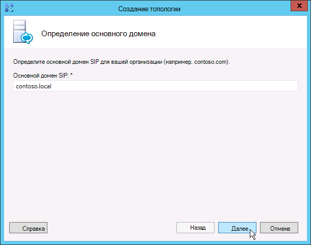
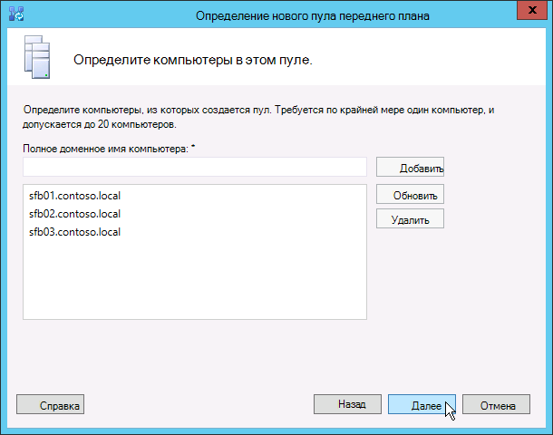

# Создание и публикация новой топологии в Skype для бизнеса Server
 
**Сводка:** Узнайте, как создать, опубликовать и проверить новую топологию перед установкой Skype для бизнеса Server. Скачайте бесплатную пробную Skype для бизнеса Server из Центра оценки Майкрософт по ссылке: [https://www.microsoft.com/evalcenter/evaluate-skype-for-business-server](https://www.microsoft.com/evalcenter/evaluate-skype-for-business-server) .
  
Прежде чем установить систему Skype для бизнеса Server на каждом из серверов топологии, необходимо создать топологию и опубликовать ее. При публикации топологии сведения топологии загружаются в базу данных Центра управления. Если это пул выпуск Enterprise, вы создаете базу данных Центра управления при первом публикации новой топологии. Если это выпуск Standard, перед публикацией топологии необходимо выполнить процесс Подготовки выпуск Standard сервера из мастера развертывания. Это готовится к выпуск Standard, установив экземпляр SQL Server Express Edition и создав центральный магазин управления. Вы можете сделать шаги от 1 до 5 в любом порядке. Однако необходимо сделать шаги 6, 7 и 8 в порядке и после шагов 1-5, как описано на схеме. Как создать и опубликовать новую топологию, описано в шаге 6 из 8.
  

  
## Создание и публикация новой топологии

Вы можете использовать Skype для бизнеса Server топологии для разработки, определения, настройки и публикации топологий. Этот инструмент был установлен при установке административных средств ранее в статье. Существует множество различных вариантов, которые можно сделать при создании топологии. В этой процедуре будет создаваться базовая топология с помощью конференций.
  
> [!IMPORTANT]
> Skype для бизнеса Server требуется SQL Server для работы. Основные базы данных называются Центральным хранилищем управления. Если вы развертываете выпуск Enterprise, эти базы данных создаются при публикации топологии с помощью указанных ниже шагов. В этом случае Topology Builder попросит у вас сведения о подключении к установке SQL Server. Если вы планируете развертывать выпуск Standard, вам потребуется установить SQL Server Express Edition, прежде чем определить и опубликовать новую топологию. Чтобы установить SQL Server Express Edition, необходимо открыть мастер развертывания на сервере, который будет выступать в качестве переднего выпуск Standard Server. При нажатии кнопки Prepare First выпуск Standard Server мастер развертывания автоматически устанавливает SQL Server Express Edition и создает базы данных Центрального магазина управления. 
  
### Создание новой топологии

1. Вход в качестве стандартного пользователя с доступом к Topology Builder.
    
2. Откройте Skype для бизнеса Server топологию.
    
3. Выберите **новую топологию** и нажмите **кнопку ОК**..
    
4. Выберите расположение и имя файла для файла конфигурации топологии.
    
    > [!NOTE]
    > Конфигурация топологии сохранена в качестве XML-файла Topology Builder (.tbxml). При публикации топологии сведения о конфигурации из файла перенадвигаются в SQL Server базу данных. Когда вы откроете Topology Builder в будущем, вы можете скачать существующую конфигурацию из SQL Server непосредственно в Topology Builder и опубликовать ее обратно в SQL Server или сохранить ее в качестве файла конфигурации Topology Builder. 
  
5. На экране **Определить основной домен** введите основной домен **SIP** и нажмите **кнопку Далее**. В этом примере мы `contoso.local` используем, как показано на рисунке.
    
     
  
6. Добавьте дополнительные поддерживаемые домены SIP и нажмите **кнопку Далее**.
    
7. Введите **имя** и **описание** для первого сайта (расположения), а затем нажмите **кнопку Далее,** как показано на рисунке.
    
     
  
8. Введите **код города,** **штата и** провинции и **страны/региона** для сайта, а затем нажмите **кнопку Далее**.
    
9. Нажмите **кнопку Готово,** чтобы завершить процесс определения новой топологии. Мастер нового переднего конца запускается автоматически.
    
### Определение пула переднего выпуск Standard сервера

1. Просмотрите необходимые условия мастера и нажмите кнопку **Далее**.
    
2. Введите полное доменное имя (FQDN) пула  и выберите выпуск Enterprise пула или **выпуск Standard Server,** а затем нажмите кнопку **Далее,** как показано на рисунке.
    
    > [!TIP]
    > Skype для бизнеса Server выпуск Enterprise могут включать несколько серверов, работающих вместе для обеспечения роли переднего плана. Когда для выполнения роли используется несколько серверов, она называется пулом. Таким образом, несколько серверов, работающих вместе для обеспечения роли переднего плана, также называются пулом переднего плана. Skype для бизнеса Server выпуск Standard может включать только один сервер для предоставления роли переднего плана. Обычно ссылаются на пул переднего плана, даже если роль предоставляет только один сервер. 
  
     
  
3. Введите полностью квалифицированные доменные имена (FQDNs) всех компьютеров в пуле, а затем нажмите **кнопку Далее,** как показано на рисунке.
    
     
  
4. Выберите функции, которые будут включены в эту топологию, а затем нажмите **кнопку Далее,** как показано на рисунке.
    
    > [!NOTE]
    > Skype для бизнеса Server включает множество расширенных функций. Просмотрите документацию по планированию и развертыванию для каждой конкретной функции, которая вам нужна. 
  
     
  
5. На странице **Select collocated server roles** можно сделать коллокацию сервера-посредника на переднем сервере или развернуть его как автономный сервер.
    
    Если вы собираетесь объединить сервер-посредник в пуле выпуск Enterprise переднего выпуск Enterprise, убедитесь, что выбрано окно. Данная роль сервера будет развернута на серверах пула. Если вы собираетесь развернуть сервер-посредник в качестве отдельного сервера, зачистим соответствующий контрольный ящик. Вы развернет сервер-посредник на отдельном этапе развертывания после полного развертывания переднего сервера. Сведения о планировании коллокации см. в материале [Topology Basics for Skype для бизнеса Server.](../../plan-your-deployment/topology-basics/topology-basics.md)
    
6. С помощью ролей **партнерского сервера с этой** страницей пула переднего плана можно определить и связать роли сервера с пулом переднего плана. Доступны следующие роли:
    
    **Включить пул Edge** Определяет и связывает один edge Server или пул edge Servers. Edge Server упрощает связь и совместную работу между пользователями внутри организации и людьми, не включами в организацию, в том числе федеративными пользователями.
    
    Существует два возможных сценария, которые можно использовать для развертывания и связывать роли сервера.
    
    В первом сценарии вы определяете новую топологию для новой установки. К установке можно подойти одним из двух следующих способов:
    
   - Оставьте поле четким и определите топологию. После публикации, настройки и тестирования ролей переднего и заднего серверов можно запустить Topology Builder, чтобы добавить серверы ролей в топологию. С помощью этой стратегии можно протестировать пул переднего плана и сервер, работающий SQL Server без дополнительных сложностей из-за дополнительных ролей. После завершения начального тестирования можно снова запустить Topology Builder, чтобы выбрать роли, которые необходимо развернуть.
    
   - Выберите роли, которые необходимо установить, а затем настройте оборудование для размещения выбранных ролей.
    
     Для второго сценария у вас есть существующее развертывание, и ваша инфраструктура готова к новым ролям или вам необходимо связать существующие роли с новым сервером переднего плана.
    
   - В этом случае будут выбраны роли, которые вы собираетесь развернуть или связать с новым сервером переднего плана. В любом случае вы продолжаете определять роли, настраиваете все необходимое оборудование и продолжаете установку.
    
7. Далее вы определите SQL Server, который будет использоваться с топологией. В этом примере используется экземпляр по умолчанию. Дополнительные сведения о SQL Server, таких как высокая доступность, см. в этой Skype для бизнеса Server [.](../../plan-your-deployment/high-availability-and-disaster-recovery/high-availability-and-disaster-recovery.md)
    
   - Чтобы использовать существующее хранилище SQL Server, которые уже было определено в топологии, выберите экземпляр из **хранилища SQL**.
    
   - Чтобы определить новый экземпляр SQL Server для хранения сведений о пуле, нажмите кнопку New **,** а затем укажите SQL Server **FQDN** в диалоговом окне **Define New SQL Store.**
    
   - Чтобы указать имя экземпляра SQL Server, выберите **Именованный экземпляр**, а затем укажите имя экземпляра.
    
   - Чтобы использовать экземпляр по умолчанию, щелкните **Экземпляр по умолчанию**.
    
   - Чтобы использовать SQL зеркальное отражение, **выберите включить SQL** зеркальное отражение и выберите существующий экземпляр или создайте новый экземпляр.

     > [!NOTE]
     > SQL Зеркальное зеркальное Skype для бизнеса Server 2015 г., но больше не поддерживается Skype для бизнеса Server 2019 г. В 2019 г. предпочтительны группы доступности AlwaysOn, экземпляры кластера неудачной передачи alwaysOn и SQL Skype для бизнеса Server кластеризация неудачи.
    
     В этом примере мы входим **SQL Server FQDN** и настраиваем любые соответствующие параметры высокой доступности, а затем щелкаем ОК, как показано на рисунке.
    
     
  
8. Решите, хотите ли вы включить SQL Server зеркальное или зеркальное SQL Server зеркального свидетеля, а затем нажмите **кнопку Далее**.
    
9. Определите файл, который необходимо использовать.
    
   - Чтобы использовать общий файловый ресурс, который уже определен в топологии, выберите параметр **Использовать ранее определенный файловый ресурс**.
    
   - Чтобы определить новый ресурс, выберите параметр **Определить новый файловый ресурс**, в поле **Полное доменное имя файлового сервера** введите полное доменное имя существующего файлового сервер, на котором будет размещаться файловый ресурс, а затем введите имя ресурса в поле **Файловый ресурс**.
    
     В этом примере мы нажимаем **кнопку Определить** новый файловый магазин, введите файловый сервер **FQDN** и файловый **доступ,** а затем нажмите **кнопку Далее**.
    
     > [!NOTE]
     > Файл для Skype для бизнеса Server может быть collocated, но это не рекомендуется по соображениям производительности. Обратите внимание, что в этом примере файл был расположен на одном выделенном сервере, который будет выступать в качестве файла. Однако рекомендуется использовать другие более надежные системы обмена файлами, такие как DFS с Windows Server 2012 R2. Сведения о поддерживаемых системах обмена файлами см. в материале [Requirements for your Skype для бизнеса среды.](../../plan-your-deployment/requirements-for-your-environment/requirements-for-your-environment.md) Дополнительные сведения о создании файла см. в раздел Создание доли файлов [в Skype для бизнеса Server.](create-a-file-share.md) Вы можете определить файловый ресурс без создания файлового ресурса. Вам потребуется создать файловый ресурс в заданном расположении до публикации топологии. 
  
10. На странице Укажите URL-адрес веб-служб, необходимо решить, нужно ли переопределять внутренний базовый URL-адрес пула веб-служб. Причина этого переопределения заключается в балансировке нагрузки. Основной трафик SIP можно сбалансировать с помощью простой балансировки нагрузки DNS. Однако сетевой трафик HTTP/S Веб-служб должен использовать поддерживаемые решения балансировки нагрузки на оборудование или программное обеспечение. Для поддерживаемых балансинов нагрузки см. [в этой Skype для бизнеса.](../../../SfbPartnerCertification/certification/infra-gateways.md) В этом примере мы использовали балансировку нагрузки DNS для трафика SIP и поддерживаемые решения балансировки нагрузки программного обеспечения. Так как мы делим трафик таким образом, нам необходимо переопределить внутренний пул веб-служб FQDN. Кроме того, если у нас был балансировка нагрузки верхней строки и мы отправили весь трафик через него вместо того, чтобы использовать балансировку нагрузки DNS для трафика SIP, нам не нужно переопределять URL-адрес веб-служб. 
    
    В разделе DNS этого раздела мы создали запись `webint.contoso.local` для . Это URL-адрес, который мы используем для трафика HTTP/S веб-служб, и он должен пройти через поддерживаемый балансировку нагрузки программного обеспечения, который мы создали. Таким образом, в этом примере мы переопределяем URL-адрес, чтобы Skype для бизнеса Server знали, что весь трафик HTTP/S должен идти вместо , как показано на `webint.contoso.local` `pool.contoso.local` рисунке. Дополнительные информацию о балансировки нагрузки см. в дополнительных требованиях к балансировки нагрузки [для Skype для бизнеса.](../../plan-your-deployment/network-requirements/load-balancing.md)
    
    > [!IMPORTANT]
    > Базовый URL-адрес представляет собой удостоверение веб-служб для URL-адреса без префикса https://. Например, если полный URL-адрес веб-служб пула — `https://webint.contoso.local` базовый `webint.contoso.local` URL-адрес . 
  
    - При настройке балансировки нагрузки DNS, как мы в этом примере, выберите флажок переопределения внутреннего пула веб-служб **FQDN** и введите внутренний базовый URL-адрес (который должен быть отличается от FQDN пула) в URL-адресе внутренней базы **.** 
    
    > [!CAUTION]
    > Если вы решите переопрепредить внутренние веб-службы с помощью самоопределяемого FQDN, каждый FQDN должен быть уникальным из любого другого пула, директора или пула директоров. **Используйте только стандартные** символы (в том числе A-Z, a-z, 0-9 и дефис) при определении URL-адресов или полностью квалифицированных доменных имен. Не используйте символы Юникода или подчеркивания. Нестандартные символы в URL-адресе или FQDN часто не поддерживаются внешними DNS и государственными органами сертификации (то есть, когда URL-адрес или FQDN должны быть назначены имени субъекта или альтернативному имени субъекта в сертификате).
  
    - Необязательно введите внешний базовый URL-адрес в **URL-адресе внешней базы.** Чтобы отличить его от внутреннего доменного имени, необходимо ввести внешний базовый URL-адрес. Например, ваш внутренний домен `contoso.local` , но ваше внешнее доменное имя `contoso.com` . URL-адрес будет определяться с помощью доменного имени, так как он должен быть `contoso.com` разрешим из общедоступных DNS. Это также важно при использовании обратного прокси-сервера. Доменное имя внешнего базового URL-адреса должно совпадать с полным доменным именем обратного прокси-сервера. Для обмена мгновенными сообщениями и присутствия на мобильных клиентах требуется доступ HTTP к пулу передней части.
    
      
  
11. Если вы выбрали **conferencing** на странице **Выбор** функций, вам будет предложено выбрать сервер Office веб-приложений. Нажмите **кнопку New,** чтобы запустить диалоговое окно.
    
12. В диалоговом **окне Определите** Office сервер веб-приложений введите FQDN сервера Office веб-приложений в поле **FQDN** Office Web Apps Server; При этом URL-адрес Office сервера веб-приложений должен автоматически вписаться в **URL-адрес Office веб-Office сервера веб-приложений.**
    
    Если сервер Office веб-приложений установлен локально и в той же сетевой зоне, что и Skype для бизнеса Server, не выберите вариант, Office сервер веб-приложений развернут во внешней сети (то есть периметре **или Интернете).**
    
    Если сервер Office веб-приложений развернут за пределами внутреннего брандмауэра, выберите вариант, Office сервер веб-приложений развернут во внешней сети (то есть **периметре или Интернете).**
    
13. Нажмите **кнопку Готово,** чтобы завершить конфигурацию. Если вы определили другие серверы ролей на ролях ассоциированного сервера с этой страницей пула переднего плана, будут открыты отдельные страницы мастера конфигурации ролей, на которых можно настроить роли сервера.  В этом примере мы выбрали только конференцию.
    
### Настройка простых URL-адресов

1. В Topology Builder щелкните правой кнопкой мыши **верхний Skype для бизнеса Server,** а затем нажмите **кнопку Изменить** свойства, как показано на рисунке.
    
     
  
2. В области **Простых URL-адресов** выберите url-адреса Телефон **доступа:** (Dial-in) или Meeting **URL-адреса:** (Meet) для редактирования, а затем нажмите кнопку Изменить **URL-адрес**.
    
3. Задайте для URL-адреса требуемое значение и нажмите кнопку **ОК**, чтобы сохранить изменения. Необходимо настроить простой URL-адрес с помощью внешнего домена SIP, чтобы внешние пользователи могли присоединяться к собраниям, например, внешним, а не внутренним `contoso.com` `contoso.local` доменом. Таким образом, домен SIP должен быть разрешен внешним DNS.
    
4. При необходимости тем же способом измените URL-адрес Meet.
    
### Определение дополнительного URL-адреса Admin

1. В Topology Builder щелкните правой кнопкой **мыши узел Skype для бизнеса Server** и нажмите **кнопку Изменить свойства**.
    
2. В поле **URL-адрес административного** доступа введите простой URL-адрес, который необходимо для административного доступа Skype для бизнеса Server панели управления, а затем нажмите **кнопку ОК.**
    
    > [!TIP]
    > Рекомендуется использовать самый простой URL-адрес для административного доступа. Самый простой вариант https://admin . _\<domain\>_ . URL-адрес администратора может быть как внутренним, так и внешним доменом, например, или, если во внутренней DNS можно разрешить `contoso.local` `contoso.com` запись. 
  
    > [!IMPORTANT]
    > Если простые URL-адреса меняются после развертывания, то необходимо подумать о том, какие изменения простых URL-адресов повлияют на записи DNS и сертификаты. Если изменение влияет на базу простого URL-адреса, необходимо также изменить записи и сертификаты DNS. Например, изменение базового `https://sfb.contoso.com/Meet` `https://meet.contoso.com` URL-адреса из sfb в изменение.`contoso.com` для этого потребуется изменить DNS-записи и сертификаты для `meet.contoso.com` ссылки `meet.contoso.com` на . Если вы изменили простой URL-адрес с на , базовый URL-адрес остается таким же, поэтому никакие `https://sfb.contoso.com/Meet` `https://sfb.contoso.com/Meetings` изменения `sfb.contoso.com` DNS или сертификата не нужны. Однако при изменении простого имени URL-адреса для регистрации изменения необходимо запустить на каждом сервере Director и Front End для запуска cmdlet **Enable-CsComputer.**
  
### Публикация и проверка топологии

1. Проверьте, что все простые URL-адреса настроены правильно.
    
2. Подтвердим, что SQL Server сервер находится в сети и доступен компьютеру, на котором установлен topology Builder, включая все необходимые правила брандмауэра.
    
3. Подтвердим, что доступ к файлу доступен и определены соответствующие разрешения.
    
4. Проверьте, что в топологии заданы правильные роли сервера, удовлетворяющие требованиям развертывания.
    
5. Убедитесь, что серверы существуют в службах домена Active Directory (AD DS). Это происходит автоматически при подключе к домену серверов.
    
    Когда топология проверена и ошибки проверки отсутствуют, все должно быть готово к публикации топологии. Если имеются ошибки проверки, их необходимо исправить, прежде чем опубликовать топологию.
    
6. Щелкните правой кнопкой **мыши узел Skype для бизнеса Server** и нажмите **кнопку Опубликовать топологию**.
    
7. На странице **Publish the topology** (Публикация топологии) нажмите кнопку **Next** (Далее).
    
8. На странице **Выберите центральный сервер** управления выберите пул переднего конца, как показано на рисунке.
    
    > [!NOTE]
    > Для настройки расположения файлов базы данных можно нажать **кнопку Advanced.**
  
     
  
9. На странице **Выбор баз данных** выберите базы данных, которые необходимо опубликовать.
    
    > [!NOTE]
    > Если у вас нет соответствующих прав на создание баз данных, вы можете очистить флажки рядом с этими базами данных, а кто-то с соответствующими правами может позже создать базы данных. Сведения о требованиях см. в [материале Server requirements for Skype для бизнеса Server.](../../plan-your-deployment/requirements-for-your-environment/server-requirements.md) 
  
10. Можно также щелкнуть элемент **Advanced** (Дополнительно). С помощью параметров SQL Server расширенных файлов данных можно выбрать следующие параметры: 
    
    - **Автоматически определите** расположение файлов базы данных . Этот параметр определяет лучшую операционную производительность в зависимости от конфигурации диска на SQL Server сервере путем распространения журналов и файлов данных в наилучшее расположение.
    
    - **Используйте SQL Server** по умолчанию экземпляра — этот параметр помещает файлы журналов и данных на SQL Server сервер с помощью параметров экземпляра. Этот параметр не использует рабочие функциональные возможности сервера SQL Server, чтобы определить оптимальные расположения для журналов и данных. Обычно администратор SQL Server перемещает файлы данных и журналов в расположения, удобные для сервера SQL Server и процедур управления организацией.
    
    Нажмите кнопку **OK** (ОК) и затем кнопку **Next** (Далее). 
    
11. Дополнительно нажмите **кнопку Advanced**. С помощью параметров SQL Server расширенных файлов данных можно выбрать следующие параметры: 
    
    - **Автоматически определите** расположение файлов базы данных . Этот параметр определяет лучшую операционную производительность в зависимости от конфигурации диска на SQL Server сервере путем распространения журналов и файлов данных в наилучшее расположение.
    
    - **Используйте SQL Server** по умолчанию экземпляра — этот параметр помещает файлы журналов и данных на SQL Server сервер с помощью параметров экземпляра. Этот параметр не использует рабочие функциональные возможности сервера SQL Server, чтобы определить оптимальные расположения для журналов и данных. Обычно администратор SQL Server перемещает файлы данных и журналов в расположения, удобные для сервера SQL Server и процедур управления организацией.
    
    Нажмите кнопку **OK** (ОК).
    
12. Нажмите кнопку **Next** (Далее) для завершения процесса публикации.
    
    > [!NOTE]
    > Распространенным сбоем для этого шага является невозможность создания SQL Server баз данных. Если процесс не может завершиться, предоставляется ошибка, как показано на рисунке. Наиболее вероятной причиной является то, что пользователь, пытающийся создать базу данных, не имеет соответствующих разрешений, или система SQL Server не может связаться из-за брандмауэра или другой проблемы сети. 
  
     
  
13. По завершению процесса публикации вам будет представлена ссылка, чтобы открыть список следующих действий. Нажмите **кнопку Нажмите здесь, чтобы** открыть список действий, чтобы просмотреть следующие действия, а затем нажмите **кнопку Готово**. 
    
    Сообщение "Завершено с предупреждениями" для создания базы данных не означает, что произошла ошибка. Процесс установки должен изменить параметры в SQL Server, чтобы Skype для бизнеса Server правильно работать. Когда параметр меняется в SQL Server, он регистрируется как предупреждение, SQL Server администраторы могут точно понять, что завершено процесс установки. Если вы получили предупреждение, вы можете выбрать запись, а затем нажмите **журналы просмотра,** чтобы просмотреть сведения о предупреждении.
    
    После успешного опубликования топологии можно приступить к установке локальной реплики магазина центра управления на каждом сервере, Skype для бизнеса Server в топологии. Рекомендуется начать с первого пула переднего конца. 
