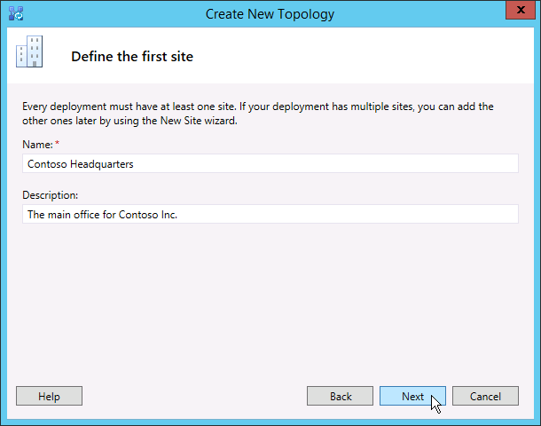

# Создание и публикация новой топологии в Skype для бизнеса Server
 
**Сводка:** Узнайте, как создавать, публиковать и проверять новую топологию перед установкой Skype для бизнеса Server. Скачайте бесплатную пробную версия Skype для бизнеса Server в Центре оценки Майкрософт по [https://www.microsoft.com/evalcenter/evaluate-skype-for-business-server](https://www.microsoft.com/evalcenter/evaluate-skype-for-business-server) ссылке:
  
Перед установкой системы Skype для бизнеса Server на каждом сервере в топологии необходимо создать топологию и опубликовать ее. При публикации топологии сведения о топологии загружаются в базу данных центрального банка управления. Если это пул Enterprise Edition, база данных центрального банка управления создается при первой публикации новой топологии. Если это Standard Edition, перед публикацией топологии необходимо запустить процесс подготовки первого сервера Standard Edition из мастера развертывания. Для подготовки к выпуску Standard Edition устанавливается экземпляр SQL Server Express Edition и создается центральное хранилище управления. Шаги 1-5 можно делать в любом порядке. Однако шаги 6, 7 и 8 необходимо делать по порядку и после шагов с 1 по 5, как описано на схеме. Создание и публикация новой топологии описано в шаге 6 из 8.
  

  
## Создание и публикация новой топологии

Построитель топологий Skype для бизнеса Server можно использовать для разработки, определения, настройки и публикации топологий. Это средство было установлено при установке средств администрирования ранее в этой статье. Существует множество различных вариантов, которые можно сделать при создании топологии. В этой процедуре мы создадим базовую топологию с помощью функции "Conferencing".
  
> [!IMPORTANT]
> Skype для бизнеса Server требует SQL Server для работы. Основные базы данных называются центральным хранилищем управления. При развертывании Enterprise Edition эти базы данных создаются при публикации топологии с помощью указанных ниже действий. В этом случае построитель топологий запросит у вас сведения о под подключением к SQL Server установки. Если планируется развертывание Standard Edition, необходимо установить SQL Server Express Edition, прежде чем определять и публиковать новую топологию. Чтобы установить SQL Server Express Edition, необходимо открыть мастер развертывания на сервере, который будет выступать в качестве сервера переднего сервера, а затем запустить подготовку первого сервера Standard Edition. При нажатии кнопки "Подготовка первого сервера Standard Edition" мастер развертывания автоматически устанавливает SQL Server Express Edition и создает базы данных центрального банка управления. 
  
### Создание новой топологии

1. Войдите как обычный пользователь с доступом к построитель топологий.
    
2. Откройте построитель топологий Skype для бизнеса Server.
    
3. Выберите **новую топологию** и нажмите кнопку **"ОК".**
    
4. Выберите расположение и имя файла конфигурации топологии.
    
    > [!NOTE]
    > Конфигурация топологии сохранена в XML-файле построитель топологий (TBXML). При публикации топологии сведения о конфигурации из файла перенакладыются в SQL Server данных. Открыв построитель топологий в будущем, вы можете скачать существующую конфигурацию из SQL Server непосредственно в построитель топологий и опубликовать ее обратно в SQL Server или сохранить в качестве файла конфигурации построитель топологий. 
  
5. На экране **"Определение основного домена"** введите основной **домен SIP** и нажмите кнопку **"Далее".** В этом примере мы используем **contoso.local,** как показано на рисунке.
    
     
  
6. Добавьте все дополнительные поддерживаемые домены SIP и нажмите кнопку **"Далее".**
    
7. Введите **имя** и **описание** для первого сайта (расположения), а затем нажмите кнопку **"Далее",** как показано на рисунке.
    
     
  
8. Введите **код города,** **области** и региона для сайта и нажмите кнопку **"Далее".** 
    
9. Нажмите **кнопку** "Готово", чтобы завершить процесс определения новой топологии. Мастер нового переднего входа запускается автоматически.
    
### Определение пула переднего сервера или сервера Standard Edition

1. Просмотрите необходимые условия для мастера и нажмите кнопку **"Далее".**
    
2. Введите полное доменное имя пула и выберите пул переднего уровня **Enterprise Edition** или **сервер Standard Edition,** а затем нажмите кнопку "Далее", как показано на рисунке. 
    
    > [!TIP]
    > Skype для бизнеса Server Enterprise Edition может включать несколько серверов, работающих вместе для предоставления роли переднего плана. Если для выполнения роли используется несколько серверов, она называется пулом. Таким образом, несколько серверов, работающих совместно для предоставления роли переднего плана, также называются пулом переднего плана. Skype для бизнеса Server Standard Edition может включать только один сервер для предоставления роли переднего плана. Часто используется пул переднего плана, даже если роль предоставляет только один сервер. 
  
     
  
3. Введите полное доменное имя всех компьютеров в пуле и нажмите  кнопку "Далее", как показано на рисунке.
    
     
  
4. Выберите функции, которые будут включены в эту топологию, и нажмите кнопку **"Далее",** как показано на рисунке.
    
    > [!NOTE]
    > Skype для бизнеса Server включает множество расширенных функций. Просмотрите документацию по планированию и развертыванию для каждого конкретного функции, который вы хотите использовать. 
  
     
  
5. На странице **выбора** ролей сервера-посредника можно выбрать размещение сервера-посредника на сервере переднего плана или развернуть его как отдельный сервер.
    
    Если вы собираетесь выполнив выверку сервера-посредника в пул Данная роль сервера будет развернута на серверах пула. Если вы собираетесь развернуть сервер-посредник в качестве отдельного сервера, съем соответствующий соответствующий контрольный ящик. Сервер-посредник будет развернут на отдельном этапе развертывания после полного развертывания сервера переднего сервера. For planning details about a collocation, see [Topology Basics for Skype for Business Server.](../../plan-your-deployment/topology-basics/topology-basics.md)
    
6. Используя **страницу "Связывать** роли сервера с этой страницей пула переднего плана", можно определить и связать роли сервера с пулом переднего плана. Доступны следующие роли:
    
    **Включить пул edge** Определяет и связывает один сервер или пул серверов. Edge Server упрощает взаимодействие и совместную работу между пользователями внутри организации и людьми за пределами организации, включая федеративных пользователей.
    
    Существует два возможных сценария, которые можно использовать для развертывания и связывание ролей сервера.
    
    В первом сценарии вы определяете новую топологию для новой установки. К установке можно использовать один из следующих способов:
    
   - Оставьте этот контроль понятным и определите топологию. После публикации, настройки и тестирования ролей сервера переднего плана и тыловых серверов можно снова запустить построитель топологий, чтобы добавить серверы ролей в топологию. С помощью этой стратегии можно протестировать пул переднего плана и сервер, на SQL Server без дополнительных сложностей, связанных с дополнительными ролями. После завершения первоначального тестирования можно запустить построитель топологий еще раз, чтобы выбрать роли, которые необходимо развернуть.
    
   - Выберите роли, которые необходимо установить, а затем настройте оборудование для размещения выбранных ролей.
    
     В сценарии 2 имеется существующее развертывание, и инфраструктура готова к новым ролям или необходимо связать существующие роли с новым сервером переднего плана.
    
   - В этом случае необходимо выбрать роли, которые вы собираетесь развернуть или связать с новым сервером переднего плана. В любом случае вы продолжаете определять роли, настраиваете все необходимое оборудование и продолжаете установку.
    
7. Затем определите хранилище SQL Server, которое будет использоваться с топологией. В этом примере используется экземпляр Default. Дополнительные сведения о SQL Server, таких как высокая доступность, см. в плане высокой доступности и аварийного [восстановления в Skype для бизнеса Server.](../../plan-your-deployment/high-availability-and-disaster-recovery/high-availability-and-disaster-recovery.md)
    
   - Чтобы использовать существующее хранилище SQL Server, которые уже было определено в топологии, выберите экземпляр из **хранилища SQL**.
    
   - Чтобы определить новый экземпляр SQL Server для хранения сведений о пуле, нажмите кнопку "Новый" и укажите SQL Server **FQDN** в диалоговом **окне "Определение** нового SQL Store".
    
   - Чтобы указать имя экземпляра SQL Server, выберите **Именованный экземпляр**, а затем укажите имя экземпляра.
    
   - Чтобы использовать экземпляр по умолчанию, щелкните **Экземпляр по умолчанию**.
    
   - Чтобы использовать SQL зеркальное отражение, выберите **"Включить** SQL зеркальное отражение" и выберите существующий экземпляр или создайте новый экземпляр.

     > [!NOTE]
     > SQL зеркальное отражение доступно в Skype для бизнеса Server 2015, но больше не поддерживается в Skype для бизнеса Server 2019. В Skype для бизнеса Server 2019 предпочтительнее использовать группы доступности AlwaysOn, экземпляры кластера для отокрутки AlwaysOn и SQL кластеров.
    
     В этом примере введите **SQL Server FQDN** и настроим все соответствующие параметры высокой доступности, а затем нажмите кнопку "ОК", как показано на рисунке.
    
     
  
8. Решите, нужно ли включить зеркальное SQL Server или SQL Server зеркального зеркального отражания, а затем нажмите кнопку **"Далее".**
    
9. Определите обную папку, которую вы хотите использовать.
    
   - Чтобы использовать общий файловый ресурс, который уже определен в топологии, выберите параметр **Использовать ранее определенный файловый ресурс**.
    
   - Чтобы определить новый ресурс, выберите параметр **Определить новый файловый ресурс**, в поле **Полное доменное имя файлового сервера** введите полное доменное имя существующего файлового сервер, на котором будет размещаться файловый ресурс, а затем введите имя ресурса в поле **Файловый ресурс**.
    
     В этом примере мы нажимаем кнопку **"Определить** новое хранилище файлов", введите **FQDN** файловой сервер и обную папку, а затем нажмите кнопку **"Далее".**
    
     > [!NOTE]
     > Файловую папку для Skype для бизнеса Server можно совместно расположить, но это не рекомендуется из соображений производительности. Обратите внимание, что в этом примере файловая папка расположена на отдельном выделенном сервере, который будет выступать в качестве файловой папки. Однако рекомендуется использовать другие более надежные системы файлового обмена, например DFS, использующие Windows Server 2012 R2. Подробные сведения о поддерживаемых системах файловых файловых файлов см. в подсистеме "Требования" для [среды Skype для бизнеса.](../../plan-your-deployment/requirements-for-your-environment/requirements-for-your-environment.md) Дополнительные сведения о создании файловой папки см. в файловом файловом файле [в Skype для бизнеса Server.](create-a-file-share.md) Вы можете определить файловый ресурс без создания файлового ресурса. Вам потребуется создать файловый ресурс в заданном расположении до публикации топологии. 
  
10. На странице "Укажите URL-адрес веб-служб" необходимо решить, нужно ли переопределять базовый URL-адрес пула внутренних веб-служб. Причина этого переопределения заключается в балансировке нагрузки. Базовый трафик SIP можно сбалансировать с помощью простой балансировки нагрузки на DNS. Однако сетевой трафик веб-служб HTTP/S должен использовать поддерживаемые аппаратные или программные решения балансировки нагрузки. Для поддерживаемых балансиры нагрузки [см. "Инфраструктура для Skype для бизнеса".](https://docs.microsoft.com/SkypeForBusiness/certification/infra-gateways) В этом примере мы использовали балансировку нагрузки на DNS для трафика SIP и поддерживаемые программные решения балансировки нагрузки. Так как трафик делится таким образом, необходимо переопределить внутреннее FQDN пула веб-служб. Кроме того, если бы мы использовали балансировку нагрузки верхней строки и отправляли весь трафик через нее вместо балансировки нагрузки на DNS для трафика SIP, нам не нужно переопределять URL-адрес веб-служб. 
    
    В разделе DNS этого раздела мы создали запись A для webint.contoso.local. Это URL-адрес, который мы используем для трафика HTTP/S веб-служб, и он должен проходить через поддерживаемый программный балансировчик нагрузки, который мы настроили. Поэтому в этом примере мы переопределяем URL-адрес, чтобы skype для бизнеса Server знал, что весь трафик HTTP/S должен перенаходить на webint.contoso.local, а не pool.contoso.local, как показано на рисунке. Дополнительные информацию о балансировку нагрузки см. в требованиях к [балансировку нагрузки для Skype для бизнеса.](../../plan-your-deployment/network-requirements/load-balancing.md)
    
    > [!IMPORTANT]
    > Базовый URL-адрес представляет собой удостоверение веб-служб для URL-адреса без префикса https://. Например, если полный URL-адрес веб-служб пула — https://webint.contoso.local это webint.contoso.local. 
  
    - Если вы настраиваете балансировку нагрузки на DNS, как в этом примере, устанавливайте флажок переопределения **FQDN** пула внутренних веб-служб и введите внутренний базовый URL-адрес (который должен быть не таким, как у FQDN пула) во внутреннем базовом URL-адресе.  
    
    > [!CAUTION]
    > Если вы решите переопредить внутренние веб-службы с помощью самоопределяемого FQDN, каждое FQDN должно быть уникальным для любого другого пула переднего входа, директора или пула директоров. **Используйте только стандартные** символы (включая A-Z, a-z, 0-9 и дефис) при определении URL-адресов или полного доменных имен. Не используйте символы Юникода или подчеркивания. Нестандартные символы в URL-адресе или полном доменном имени часто не поддерживаются внешними DNS-службами и общедоступными ЦС (то есть, когда URL-адрес или FQDN должны быть назначены имени субъекта или альтернативному имени субъекта в сертификате).
  
    - При желании введите внешний базовый URL-адрес во **внешнем базовом URL-адресе.** Введите внешний базовый URL-адрес, чтобы отличать его от внутреннего доменного имени. Например, ваш внутренний домен contoso.local, а внешнее имя домена contoso.com. URL-адрес определяется с помощью contoso.com доменного имени, так как он должен быть разрешим из общедоступных DNS. Это также важно при использовании обратного прокси-сервера. Доменное имя внешнего базового URL-адреса должно совпадать с полным доменным именем обратного прокси-сервера. Для обмена мгновенными сообщениями и присутствия на мобильных клиентах требуется http-доступ к пулу переднего доступа.
    
      
  
11. Если вы выбрали **"Conferencing"** (Выбор компонентов) на странице "Выбор компонентов", вам будет предложено выбрать сервер Office Web Apps.  Нажмите **кнопку** "Новое", чтобы запустить диалоговое окно.
    
12. В **диалоговом** окне "Определение нового сервера Office Web Apps" введите FQDN сервера Office Web Apps в поле **"FQDN** сервера Office Web Apps"; При этом URL-адрес обнаружения сервера Office Web Apps должен автоматически быть введен в поле **"URL-адрес** обнаружения сервера Office Web Apps".
    
    Если сервер Office Web Apps установлен локально и в той же зоне сети, что и Skype для бизнеса Server, не выбирайте вариант развертывания сервера Office Web Apps во внешней сети (то есть в периметре **или Интернете).**
    
    Если сервер Office Web Apps развернут за пределами внутреннего брандмауэра, выберите вариант развертывания сервера Office Web Apps во внешней сети **(периметре или Интернете).**
    
13. Нажмите **кнопку** "Готово", чтобы завершить настройку. Если вы определили другие серверы ролей на странице "Связывать роли сервера с этой страницей пула переднего плана", будут открыты отдельные страницы мастера настройки ролей, на которых можно настроить роли сервера.  В этом примере мы выбрали только видеоконференцию.
    
### Настройка простых URL-адресов

1. В построитель топологий щелкните правой кнопкой мыши верхний узел **Skype** для бизнеса Server и выберите "Изменить свойства", как показано на рисунке.
    
     
  
2. В области **простых URL-адресов** выберите URL-адреса телефонного **доступа:** (Dial-in) или Meeting **URLS:** (Meet) to edit, and then click Edit **URL**.
    
3. Задайте для URL-адреса требуемое значение и нажмите кнопку **ОК**, чтобы сохранить изменения. Необходимо настроить простой URL-адрес с помощью внешнего домена SIP, чтобы внешние пользователи могли присоединяться к собраниям, например contoso.com, который является внешним, в отличие от домена contoso.local, который является внутренним доменом. Таким образом, домен SIP должен быть разрешен внешней DNS.
    
4. При необходимости тем же способом измените URL-адрес Meet.
    
### Определение дополнительного URL-адреса Admin

1. В построитель топологий щелкните правой кнопкой мыши узел **Skype для** бизнеса Server и выберите "Изменить **свойства".**
    
2. In the **Administrative access URL** box, enter the simple URL you want for administrative access to Skype for Business Server Control Panel, and then click **OK**.
    
    > [!TIP]
    > Рекомендуется использовать самый простой URL-адрес для административного доступа. Самый простой вариант — https://admin ... _\<domain\>_ URL-адрес администратора может быть внутренним или внешним доменом, например contoso.local или contoso.com, если любая запись может быть разрешима во внутренней DNS. 
  
    > [!IMPORTANT]
    > Если простые URL-адреса меняются после развертывания, то необходимо подумать о том, какие изменения простых URL-адресов повлияют на записи DNS и сертификаты. Если изменение влияет на базу простого URL-адреса, необходимо также изменить записи DNS и сертификаты. Например, измените базовый URL-адрес с sfb.contoso.com на meet.contoso.com, чтобы изменить записи DNS и сертификаты для ссылки на https://sfb.contoso.com/Meet https://meet.contoso.com meet.contoso.com. Если вы изменили простой URL-адрес с на , базовый URL-адрес sfb.contoso.com остается таким же, поэтому DNS или сертификат изменений https://sfb.contoso.com/Meet https://sfb.contoso.com/Meetings не требуется. Однако при каждом изменении имени простого URL-адреса для регистрации изменения необходимо выполнить на каждом директоре и сервере переднего сервера **запусклета Enable-CsComputer.**
  
### Публикация и проверка топологии

1. Проверьте, что все простые URL-адреса настроены правильно.
    
2. Подтвердим SQL Server что сервер на основе SQL Server доступен для компьютера, на котором установлен построитель топологий, включая все необходимые правила брандмауэра.
    
3. Подтвердим, что файловая папка доступна и что определены соответствующие разрешения.
    
4. Проверьте, что в топологии заданы правильные роли сервера, удовлетворяющие требованиям развертывания.
    
5. Убедитесь, что серверы существуют в доменных службах Active Directory (AD DS). Это происходит автоматически при подключе серверов к домену.
    
    Когда топология проверена и ошибки проверки отсутствуют, все должно быть готово к публикации топологии. Если имеются ошибки проверки, их необходимо исправить, прежде чем можно будет опубликовать топологию.
    
6. Щелкните правой кнопкой мыши узел **Skype для** бизнеса Server и выберите **"Опубликовать топологию".**
    
7. На странице **Publish the topology** (Публикация топологии) нажмите кнопку **Next** (Далее).
    
8. На странице **"Выбор центрального сервера управления"** выберите пул переднего сервера, как показано на рисунке.
    
    > [!NOTE]
    > Для настройки **расположения файлов базы** данных можно нажать кнопку "Дополнительные".
  
     
  
9. На странице **"Выбор баз данных"** выберите базы данных, которые нужно опубликовать.
    
    > [!NOTE]
    > Если у вас нет соответствующих прав на создание баз данных, можно с помощью флажков рядом с этими базами данных, а кто-то с соответствующими правами сможет позже создать базы данных. Подробные сведения о требованиях см. в сведениях о требованиях к [серверу для Skype для бизнеса Server.](../../plan-your-deployment/requirements-for-your-environment/server-requirements.md) 
  
10. Можно также щелкнуть элемент **Advanced** (Дополнительно). С помощью параметров SQL Server дополнительных данных можно выбрать один из следующих вариантов: 
    
    - **Автоматически определите** расположение файла базы данных. Этот параметр определяет наимую операционную производительность в зависимости от конфигурации диска на сервере SQL Server путем распределения файлов журналов и данных в наилучшее расположение.
    
    - **Используйте SQL Server** по умолчанию — этот параметр помещает файлы журналов и данных SQL Server на сервер на основе SQL Server с помощью параметров экземпляра. Этот параметр не использует рабочие функциональные возможности сервера SQL Server, чтобы определить оптимальные расположения для журналов и данных. Обычно администратор SQL Server перемещает файлы данных и журналов в расположения, удобные для сервера SQL Server и процедур управления организацией.
    
    Нажмите кнопку **OK** (ОК) и затем кнопку **Next** (Далее). 
    
11. При желании нажмите **кнопку "Дополнительно".** С помощью параметров SQL Server дополнительных данных можно выбрать один из следующих вариантов: 
    
    - **Автоматически определите** расположение файла базы данных. Этот параметр определяет наимую операционную производительность в зависимости от конфигурации диска на сервере SQL Server путем распределения файлов журналов и данных в наилучшее расположение.
    
    - **Используйте SQL Server** по умолчанию — этот параметр помещает файлы журналов и данных SQL Server на сервер на основе SQL Server с помощью параметров экземпляра. Этот параметр не использует рабочие функциональные возможности сервера SQL Server, чтобы определить оптимальные расположения для журналов и данных. Обычно администратор SQL Server перемещает файлы данных и журналов в расположения, удобные для сервера SQL Server и процедур управления организацией.
    
    Нажмите кнопку **OK** (ОК).
    
12. Нажмите кнопку **Next** (Далее) для завершения процесса публикации.
    
    > [!NOTE]
    > Распространенный сбой этого шага — невозможность SQL Server баз данных. Если процесс не может завершиться, отображается ошибка, как показано на рисунке. Наиболее вероятной причиной является то, что пользователь, пытающийся создать базу данных, не имеет соответствующих разрешений или к SQL Server системы невозможно связаться из-за брандмауэра или другой проблемы с сетью. 
  
     
  
13. После завершения процесса публикации вам будет представлена ссылка для открытия списка следующих действий. Щелкните **здесь, чтобы открыть** список дел, чтобы просмотреть дальнейшие действия, а затем нажмите кнопку **"Готово".** 
    
    Сообщение "Завершено с предупреждениями" для создания базы данных не означает, что произошла ошибка. Процесс установки должен изменить параметры в SQL Server для правильной работы Skype для бизнеса Server. При смене параметра в SQL Server занося в журнал предупреждение, чтобы администраторы SQL Server точно понимали, что процесс установки завершен. Если вы получили предупреждение, можно выбрать запись  и нажать кнопку "Просмотреть журналы", чтобы просмотреть сведения о предупреждении.
    
    После успешной публикации топологии можно приступить к установке локальной реплики центрального банка управления на каждом сервере со Skype для бизнеса Server в топологии. Рекомендуется начать с первого пула переднего входа. 
    

