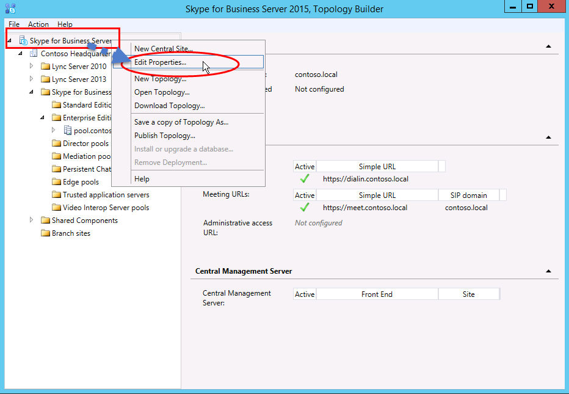

# Создание и публикация новой топологии в Skype для бизнеса Server
 
**Сводка:** Узнайте, как создать, опубликовать и проверить новую топологию перед установкой Skype для бизнеса Server.
  
Перед установкой Skype для бизнеса Server системы на каждом из серверов в топологии необходимо создать топологию и опубликовать ее. При публикации топологии сведения о топологии загружаются в базу данных Центрального хранилища управления. Если это пул выпуск Enterprise, вы создаете базу данных Центрального хранилища управления при первой публикации новой топологии. Если это выпуск Standard, перед публикацией топологии необходимо запустить процесс подготовки первого выпуск Standard Server из мастера развертывания. Это позволяет подготовиться к выпуск Standard путем установки экземпляра SQL Server Express Edition и создания центрального хранилища управления. Вы можете выполнить шаги с 1 по 5 в любом порядке. Однако необходимо выполнить шаги 6, 7 и 8 по порядку и после шагов 1–5, как показано на схеме. Создание и публикация новой топологии описана на шаге 6 из 8.
  

  
## Создание и публикация новой топологии

Вы можете использовать Skype для бизнеса Server построитель топологий для проектирования, определения, настройки и публикации топологий. Это средство было установлено ранее при установке средств администрирования. Существует множество различных вариантов, которые можно сделать при создании топологии. В этой процедуре вы создадим базовую топологию с конференц-связью.
  
> [!IMPORTANT]
> Skype для бизнеса Server требуются SQL Server для работы. Основные базы данных называются центральным хранилищем управления. При развертывании выпуск Enterprise эти базы данных создаются при публикации топологии с помощью приведенных ниже действий. В этом случае построитель топологий запросите сведения о подключении к SQL Server установки. Если вы планируете развернуть выпуск Standard, необходимо установить SQL Server Express Edition, прежде чем определять и публиковать новую топологию. Чтобы установить SQL Server Express Edition, необходимо открыть мастер развертывания на сервере, который будет выступать в качестве внешнего интерфейса, а затем запустить prepare First выпуск Standard Server. При нажатии кнопки "Подготовка первого выпуск Standard Server" мастер развертывания автоматически устанавливает SQL Server Express Edition и создает базы данных Центрального хранилища управления. 
  
### Создание топологии

1. Войдите как обычный пользователь с доступом к построитель топологий.
    
2. Откройте Skype для бизнеса Server построитель топологий.
    
3. Выберите **"Новая топология**" и нажмите кнопку **"ОК"**.
    
4. Выберите расположение и имя файла конфигурации топологии.
    
    > [!NOTE]
    > Конфигурация топологии сохраняется в виде построитель топологий XML (.tbxml). При публикации топологии вы отправляете сведения о конфигурации из файла в базу SQL Server данных. При открытии построитель топологий в будущем можно скачать существующую конфигурацию из SQL Server непосредственно в построитель топологий и опубликовать ее обратно в SQL Server или сохранить как файл конфигурации построитель топологий. 
  
5. На экране **"Определение основного домена**" введите основной **домен SIP** и нажмите кнопку **"Далее"**. В этом примере мы используем `contoso.local`, как показано на рисунке.
    
     
  
6. Добавьте дополнительные поддерживаемые домены SIP и нажмите кнопку **"Далее"**.
    
7. Введите **имя** и **описание** первого сайта (расположения), а затем нажмите кнопку **"** Далее", как показано на рисунке.
    
     
  
8. Введите **код города**, **штата** или края, страны **или региона** для сайта и нажмите кнопку " **Далее"**.
    
9. Нажмите **кнопку "** Готово", чтобы завершить процесс определения новой топологии. Мастер создания интерфейса запускается автоматически.
    
### Определение пула переднего плана или выпуск Standard сервера

1. Просмотрите предварительные требования мастера и нажмите кнопку **"Далее"**.
    
2. Введите полное доменное имя пула, выберите выпуск Enterprise переднего плана или **выпуск Standard Server**, а затем  нажмите кнопку "Далее **", как** показано на рисунке.
    
    > [!TIP]
    > Skype для бизнеса Server выпуск Enterprise может включать несколько серверов, совместно работающих для предоставления роли переднего плана. Если для выполнения роли используется несколько серверов, он называется пулом. Таким образом, несколько серверов, совместно работающих для предоставления роли переднего плана, также называются пулом переднего плана. Skype для бизнеса Server выпуск Standard может включать только один сервер для предоставления роли переднего плана. Обычно этот пул ссылается на пул переднего плана, даже если роль предоставляет только один сервер. 
  
     
  
3. Введите полные доменные имена всех компьютеров в пуле и нажмите кнопку "Далее", как показано на рисунке.
    
     
  
4. Выберите компоненты, которые будут включены в эту топологию, и нажмите кнопку **"** Далее", как показано на рисунке.
    
    > [!NOTE]
    > Skype для бизнеса Server включает множество расширенных функций. Ознакомьтесь с документацией по планированию и развертыванию для каждой конкретной функции, которую вы хотите использовать. 
  
     
  
5. На странице **"** Выбор ролей сервера с объединением" можно выбрать совместное размещение сервера-посредника на сервере переднего плана или развернуть его в качестве автономного сервера.
    
    Если вы планируете распределить сервер-посредник в пуле выпуск Enterprise переднего плана, убедитесь, что флажок установлен. Данная роль сервера будет развернута на серверах пула. Если вы планируете развернуть сервер-посредник в качестве автономного сервера, снимите соответствующий флажок. Сервер-посредник будет развернут на отдельном этапе развертывания после полного развертывания сервера переднего плана. Дополнительные сведения о планировании параметров сортировки см. в разделе ["Основные](../../plan-your-deployment/topology-basics/topology-basics.md) сведения о топологии" Skype для бизнеса Server.
    
6. Используя **связывание ролей сервера с этой** страницей пула переднего плана, можно определить и связать роли сервера с пулом переднего плана. Доступны следующие роли:
    
    **Включение пограничного пула** Определяет и связывает один пограничный сервер или пул пограничных серверов. Пограничный сервер упрощает взаимодействие и совместную работу между пользователями внутри организации и людьми за пределами организации, включая федеративных пользователей.
    
    Существует два возможных сценария, которые можно использовать для развертывания и связывания ролей сервера.
    
    В первом сценарии вы определяете новую топологию для новой установки. Вы можете выполнить установку одним из двух следующих способов:
    
   - Оставьте флажок пустым и определите топологию. После публикации, настройки и тестирования ролей переднего и внутреннего серверов можно снова запустить построитель топологий, чтобы добавить серверы ролей в топологию. С помощью этой стратегии можно протестировать пул переднего плана и сервер, на котором выполняется SQL Server без дополнительных сложностей из-за дополнительных ролей. После завершения первоначального тестирования можно запустить построитель топологий еще раз, чтобы выбрать роли, которые необходимо развернуть.
    
   - Выберите роли, которые необходимо установить, а затем настройте оборудование для размещения выбранных ролей.
    
     В сценарии 2 у вас есть существующее развертывание, и ваша инфраструктура готова к новым ролям или вам нужно связать существующие роли с новым сервером переднего плана.
    
   - В этом случае вы выберете роли, которые планируется развернуть или связать с новым сервером переднего плана. В любом случае вы продолжаете определять роли, настраиваете все необходимое оборудование и продолжаете установку.
    
7. Далее вы определите хранилище SQL Server, которое будет использоваться с топологией. В этом примере используется экземпляр default. Дополнительные сведения о SQL Server, таких как высокий уровень доступности, см. в разделе "Планирование высокой доступности и [аварийного восстановления в Skype для бизнеса Server"](../../plan-your-deployment/high-availability-and-disaster-recovery/high-availability-and-disaster-recovery.md).
    
   - Чтобы использовать существующее хранилище SQL Server, которые уже было определено в топологии, выберите экземпляр из **хранилища SQL**.
    
   - Чтобы определить новый экземпляр SQL Server для хранения сведений о пуле, нажмите кнопку "Создать **", а** затем **укажите** полное доменное имя SQL Server в диалоговом окне "Определение нового SQL Store".
    
   - Чтобы указать имя экземпляра SQL Server, выберите **Именованный экземпляр**, а затем укажите имя экземпляра.
    
   - Чтобы использовать экземпляр по умолчанию, щелкните **Экземпляр по умолчанию**.
    
   - Чтобы использовать SQL зеркальном отображении, выберите **SQL** зеркальное отображение, выберите существующий экземпляр или создайте новый экземпляр.

     > [!NOTE]
     > SQL зеркальное отображение доступно Skype для бизнеса Server 2015, но больше не поддерживается в Skype для бизнеса Server 2019. В 2019 г. предпочтительнее использовать группы доступности AlwaysOn, экземпляры отказоустойчивого кластера AlwaysOn и SQL Skype для бизнеса Server отказоустойчивой кластеризации.
    
     В этом примере мы введите **полное SQL Server**, настроим все соответствующие параметры высокой доступности, а затем нажмите кнопку "ОК **", как** показано на рисунке.
    
     
  
8. Решите, следует ли включить SQL Server зеркальное отображение или SQL Server зеркального отображения, а затем нажмите кнопку **"Далее"**.
    
9. Определите общую папку, которую вы хотите использовать.
    
   - Чтобы использовать общий файловый ресурс, который уже определен в топологии, выберите параметр **Использовать ранее определенный файловый ресурс**.
    
   - Чтобы определить новый ресурс, выберите параметр **Определить новый файловый ресурс**, в поле **Полное доменное имя файлового сервера** введите полное доменное имя существующего файлового сервер, на котором будет размещаться файловый ресурс, а затем введите имя ресурса в поле **Файловый ресурс**.
    
     В этом примере мы нажмем кнопку "Определить новое хранилище файлов **",** введите **полное** доменное имя файлового сервера и общую папку **, а** затем нажмите кнопку **"Далее"**.
    
     > [!NOTE]
     > Общую папку для Skype для бизнеса Server можно совместно найти, но это не рекомендуется из соображений производительности. Обратите внимание, что в этом примере файловые папки находятся на одном выделенном сервере, который будет выступать в качестве общей папки. Однако рекомендуется использовать другие более надежные системы файловых ресурсов, такие как DFS, использующие Windows Server 2012 R2. Дополнительные сведения о поддерживаемых системах файловых ресурсов см. в разделе "Требования [к вашей Skype для бизнеса файловой среде"](../../plan-your-deployment/requirements-for-your-environment/requirements-for-your-environment.md). Дополнительные сведения о создании общей папки см. в разделе "Создание общей папки [в Skype для бизнеса Server"](create-a-file-share.md). Вы можете определить файловый ресурс без создания файлового ресурса. Вам потребуется создать файловый ресурс в заданном расположении до публикации топологии. 
  
10. На странице "Укажите URL-адрес веб-служб" необходимо решить, нужно ли переопределить базовый URL-адрес внутреннего пула веб-служб. Причина этого переопределения заключается в балансировке нагрузки. Базовый трафик SIP можно сбалансировать с помощью простой балансировки нагрузки DNS. Однако сетевой трафик веб-служб HTTP/S должен использовать поддерживаемое решение для балансировки нагрузки оборудования или программного обеспечения. Сведения о поддерживаемых подсистемах балансировки нагрузки см. в разделе ["Инфраструктура для Skype для бизнеса](../../../SfbPartnerCertification/certification/infra-gateways.md)". В этом примере мы использовали балансировку нагрузки DNS для трафика SIP и поддерживаемое решение для балансировки нагрузки программного обеспечения. Так как мы разделяем трафик таким образом, необходимо переопределить полное доменное имя внутреннего пула веб-служб. Кроме того, если бы у нас была подсистема балансировки нагрузки верхнего уровня и мы отправляли весь трафик через нее вместо балансировки нагрузки DNS для трафика SIP, нам не нужно переопределять URL-адрес веб-служб. 
    
    В разделе DNS этого раздела мы создали запись A для `webint.contoso.local`. Это URL-адрес, который мы используем для трафика HTTP/S веб-служб, и он должен проходить через поддерживаемую программную подсистему балансировки нагрузки, настроенную. Поэтому в этом примере мы переопределяем URL-адрес, чтобы Skype для бизнеса Server, что весь трафик HTTP/S `webint.contoso.local` `pool.contoso.local`должен переходить в него, как показано на рисунке. Дополнительные сведения о балансировке нагрузки см. в разделе о требованиях к балансировке нагрузки [для Skype для бизнеса](../../plan-your-deployment/network-requirements/load-balancing.md).
    
    > [!IMPORTANT]
    > Базовый URL-адрес представляет собой удостоверение веб-служб для URL-адреса без префикса https://. Например, если полный URL-адрес `https://webint.contoso.local`для веб-служб пула — базовый URL-адрес `webint.contoso.local`. 
  
    - Если вы настраиваете балансировку нагрузки DNS, как в этом примере, установите флажок переопределения полного доменного имени пула внутренних веб-служб и введите внутренний базовый URL-адрес (который должен отличаться от полного доменного имени пула) во внутреннем базовом **URL-адресе**. 
    
    > [!CAUTION]
    > Если вы решили переопределить внутренние веб-службы с помощью самоопределяемого полного доменного имени, каждое полное доменное имя должно быть уникальным из любого другого пула переднего плана, директора или пула директоров. **При выборе** URL-адресов или полных доменных имен используйте только стандартные символы (включая A-Z, a-z, 0–9 и дефисы). Не используйте символы Юникода или подчеркивания. Нестандартные символы в URL-адресе или FQDN часто не поддерживаются внешними DNS и общедоступными центрами сертификации (Т. е. когда URL-адрес или полное доменное имя необходимо назначить имени субъекта или альтернативному имени субъекта в сертификате).
  
    - При необходимости введите внешний базовый URL-адрес во **внешнем базовом URL-адресе**. Введите внешний базовый URL-адрес, чтобы отличить его от внутреннего доменного имени. Например, внутренний домен имеет значение `contoso.local`, а имя внешнего домена — это `contoso.com`. URL-адрес следует определить с помощью доменного `contoso.com` имени, так как он должен быть разрешен из общедоступной службы DNS. Это также важно при использовании обратного прокси-сервера. Доменное имя внешнего базового URL-адреса должно совпадать с полным доменным именем обратного прокси-сервера. Для обмена мгновенными сообщениями и присутствия на мобильных клиентах требуется доступ по протоколу HTTP к пулу переднего плана.
    
      
  
11. Если вы выбрали **конференц-связь** на странице "Выбор компонентов", вам будет предложено выбрать Office веб-приложения сервера. Нажмите **кнопку "** Создать", чтобы открыть диалоговое окно.
    
12. В диалоговом окне **"Определение нового сервера Office веб-приложения Server**" введите полное доменное имя сервера Office веб-приложения в поле **Office веб-приложения Server FQDN**; при этом Office веб-приложения  URL-адрес обнаружения сервера должен автоматически вводиться **в поле Office веб-приложения server discovery URL**.
    
    Если сервер Office веб-приложения установлен локально и в той же сетевой зоне, что и Skype для бизнеса Server, не устанавливайте параметр Office веб-приложения Server развертывается во внешней сети (то есть периметре **или Интернете).**
    
    Если сервер Office веб-приложения развернут за пределами внутреннего брандмауэра, выберите параметр Office веб-приложения Server развернут во внешней сети (то есть **периметре или Интернете).**
    
13. Нажмите **кнопку "** Готово", чтобы завершить настройку. Если вы определили другие серверы ролей на странице  связывания ролей сервера с этой страницей пула переднего плана, будут открыты отдельные страницы мастера настройки ролей, на которых можно настроить роли сервера. В этом примере мы выбрали только конференц-связь.
    
### Настройка простых URL-адресов

1. В построитель топологий щелкните правой кнопкой мыши узел  верхнего Skype для бизнеса Server и выберите команду "Изменить **свойства**", как показано на рисунке.
    
     
  
2. В области **"Простые URL-адреса**" выберите url-адреса доступа **Телефон(** dial-in) или **Meeting URL:(** Meet) для редактирования, а затем нажмите кнопку "Изменить **URL-адрес"**.
    
3. Задайте для URL-адреса требуемое значение и нажмите кнопку **ОК**, чтобы сохранить изменения. Необходимо настроить простой URL-адрес с помощью внешнего домена SIP, чтобы внешние пользователи могли присоединяться к собраниям, `contoso.com`например внешним, `contoso.local`а не внутренним доменом. Таким образом, домен SIP должен быть разрешен внешним DNS.
    
4. При необходимости тем же способом измените URL-адрес Meet.
    
### Определение дополнительного URL-адреса Admin

1. В построитель топологий щелкните правой кнопкой **мыши узел Skype для бизнеса Server** и выберите команду "Изменить **свойства"**.
    
2. В поле **"URL-адрес административного** доступа" введите простой URL-адрес, который требуется для административного доступа к Skype для бизнеса Server панель управления и нажмите кнопку "ОК **"**.
    
    > [!TIP]
    > Рекомендуется использовать самый простой URL-адрес для административного доступа. Самый простой вариант — https://admin. _\<domain\>_ Url-Администратор может быть, например, внутренним или внешним доменом, `contoso.local` `contoso.com`или , если во внутренней службе DNS разрешена запись. 
  
    > [!IMPORTANT]
    > Если простые URL-адреса меняются после развертывания, то необходимо подумать о том, какие изменения простых URL-адресов повлияют на записи DNS и сертификаты. Если изменение влияет на базу простого URL-адреса, необходимо также изменить записи и сертификаты DNS. Например, при переходе с `https://sfb.contoso.com/Meet` базового `https://meet.contoso.com` URL-адреса на sfb изменяется.`contoso.com` для `meet.contoso.com`, поэтому необходимо изменить записи DNS и сертификаты для ссылки `meet.contoso.com`. Если вы изменили простой URL-адрес `https://sfb.contoso.com/Meet` `https://sfb.contoso.com/Meetings`, базовый URL-адрес `sfb.contoso.com` останется таким же, поэтому изменения DNS или сертификата не требуются. Однако при каждом изменении простого ИМЕНИ URL-адреса необходимо выполнить командлет **Enable-CsComputer** на каждом сервере Director и Front End, чтобы зарегистрировать изменение.
  
### Публикация и проверка топологии

1. Проверьте, что все простые URL-адреса настроены правильно.
    
2. Убедитесь, SQL Server подключен к сети и доступен компьютеру, на котором построитель топологий, включая все необходимые правила брандмауэра.
    
3. Убедитесь, что файловая папка доступна и что определены соответствующие разрешения.
    
4. Проверьте, что в топологии заданы правильные роли сервера, удовлетворяющие требованиям развертывания.
    
5. Убедитесь, что серверы существуют в доменные службы Active Directory (AD DS). Это происходит автоматически при присоединении серверов к домену.
    
    Когда топология проверена и ошибки проверки отсутствуют, все должно быть готово к публикации топологии. При наличии ошибок проверки их необходимо исправить, прежде чем публиковать топологию.
    
6. Щелкните правой кнопкой мыши **узел Skype для бизнеса Server** и выберите команду "**Опубликовать топологию"**.
    
7. На странице **Publish the topology** (Публикация топологии) нажмите кнопку **Next** (Далее).
    
8. На странице **"Выбор центрального сервера управления** " выберите пул переднего плана, как показано на рисунке.
    
    > [!NOTE]
    > Чтобы настроить расположения **файлов базы** данных, нажмите кнопку "Дополнительно".
  
     
  
9. На странице **"Выбор баз данных** " выберите базы данных, которые нужно опубликовать.
    
    > [!NOTE]
    > Если у вас нет необходимых прав на создание баз данных, можно снять флажки рядом с этими базами данных, а кто-то с соответствующими правами позднее сможет создать базы данных. Дополнительные сведения о требованиях см. в разделе ["Требования к серверу для Skype для бизнеса Server](../../plan-your-deployment/requirements-for-your-environment/server-requirements.md)". 
  
10. Можно также щелкнуть элемент **Advanced** (Дополнительно). С помощью дополнительных SQL Server файлов данных можно выбрать один из следующих вариантов: 
    
    - **Автоматическое** определение расположения файла базы данных. Этот параметр определяет оптимальную операционную производительность в зависимости от конфигурации диска на сервере SQL Server, распределяя файлы журналов и данных в оптимальное расположение.
    
    - **Используйте SQL Server** экземпляра по умолчанию. Этот параметр помещает файлы журналов и данных на сервер SQL Server на основе экземпляра с помощью параметров экземпляра. Этот параметр не использует рабочие функциональные возможности сервера SQL Server, чтобы определить оптимальные расположения для журналов и данных. Обычно администратор SQL Server перемещает файлы данных и журналов в расположения, удобные для сервера SQL Server и процедур управления организацией.
    
    Нажмите кнопку **OK** (ОК) и затем кнопку **Next** (Далее). 
    
11. При необходимости нажмите **кнопку "Дополнительно"**. С помощью дополнительных SQL Server файлов данных можно выбрать один из следующих вариантов: 
    
    - **Автоматическое** определение расположения файла базы данных. Этот параметр определяет оптимальную операционную производительность в зависимости от конфигурации диска на сервере SQL Server, распределяя файлы журналов и данных в оптимальное расположение.
    
    - **Используйте SQL Server** экземпляра по умолчанию. Этот параметр помещает файлы журналов и данных на сервер SQL Server на основе экземпляра с помощью параметров экземпляра. Этот параметр не использует рабочие функциональные возможности сервера SQL Server, чтобы определить оптимальные расположения для журналов и данных. Обычно администратор SQL Server перемещает файлы данных и журналов в расположения, удобные для сервера SQL Server и процедур управления организацией.
    
    Нажмите кнопку **OK** (ОК).
    
12. Нажмите кнопку **Next** (Далее) для завершения процесса публикации.
    
    > [!NOTE]
    > Распространенным сбоем этого шага является то, что SQL Server базы данных не могут быть созданы. Если процесс не может завершиться, отображается ошибка, как показано на рисунке. Наиболее вероятной причиной является то, что пользователь, пытающееся создать базу данных, не имеет соответствующих разрешений или не удается связаться с системой SQL Server из-за брандмауэра или другой проблемы с сетью. 
  
     
  
13. После завершения процесса публикации отобразит ссылку, чтобы открыть список следующих действий. **Щелкните здесь, чтобы** открыть список задач, чтобы просмотреть дальнейшие действия, а затем нажмите кнопку **"Готово"**. 
    
    Сообщение "Завершено с предупреждениями" для создания базы данных не означает, что произошла ошибка. Процесс установки должен изменить параметры в SQL Server, чтобы Skype для бизнеса Server правильно работать. При изменении параметра в SQL Server он регистрируется как предупреждение, чтобы администраторы SQL Server могли точно понять, что завершил процесс установки. Если появится предупреждение, можно выбрать запись, а затем щелкнуть "Просмотреть журналы", чтобы просмотреть сведения о предупреждении.
    
    После успешной публикации топологии можно начать установку локальной реплики центрального хранилища управления на каждом сервере, Skype для бизнеса Server в топологии. Рекомендуется начать с первого пула переднего плана. 
