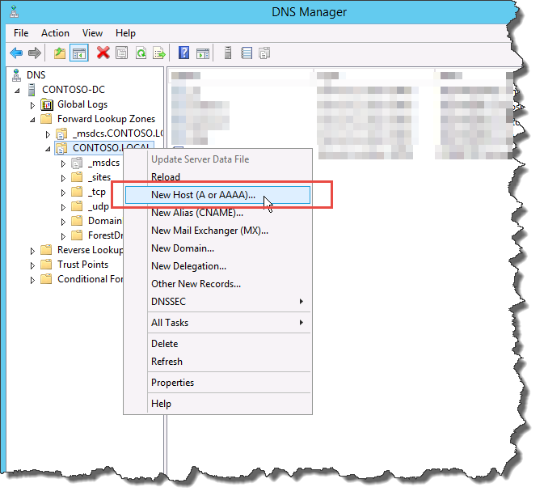

# Создание записей DNS для Skype для бизнеса Server
 
**Сводка:** Узнайте, как настроить DNS и создать записи DNS для установки Skype для бизнеса Server. Скачайте бесплатную пробную Skype для бизнеса Server из Центра оценки Майкрософт по ссылке: [https://www.microsoft.com/evalcenter/evaluate-skype-for-business-server](https://www.microsoft.com/evalcenter/evaluate-skype-for-business-server).
  
Чтобы Skype для бизнеса Server правильно работать, необходимо установить ряд параметров системы доменных имен (DNS). Это необходимо для того, чтобы клиенты знали, как получить доступ к службам и чтобы серверы знали друг о друге. Эти параметры необходимо завершить только один раз за развертывание, так как после назначения записи DNS она доступна во всем домене. Вы можете сделать шаги от 1 до 5 в любом порядке. Однако необходимо сделать шаги 6, 7 и 8 в порядке и после шагов 1-5, как описано на схеме. Создание записей DNS включает этап 5 из 8. Дополнительные сведения о планировании DNS см. в Skype для бизнеса Server [требования к Skype для бизнеса Server 2019 г](../../../SfBServer2019/plan/system-requirements.md).
  
> [!IMPORTANT]
> Важно отметить, что это всего лишь пример создания записей DNS в среде Windows DNS сервера. Существует множество других записей DNS, необходимых для Skype для бизнеса Server, и процедура создания записей DNS зависит от системы управления DNS в организации. Полный список требований к DNS см. в [Skype для бизнеса Server.](../../plan-your-deployment/network-requirements/dns.md) 
  

  
## Настройка DNS

Записи DNS необходимы для Skype для бизнеса Server для правильной работы и доступности пользователями.
  
В этом примере используется сбалансированный FQDN нагрузки DNS с именем pool.contoso.local. Этот пул состоит из трех серверов, работающих Skype для бизнеса Server выпуск Enterprise. Сервер выпуск Standard может содержать только один сервер. Используя выпуск Standard, можно использовать только полностью квалифицированное доменное имя (FQDN) одного сервера выпуск Standard при ссылке на передовую роль вместо создания сбалансированного пула серверов нагрузки DNS, как показано в этом примере. Этот простой пример, использующий только роль переднего плана, включает записи DNS в следующей таблице. Чтобы спланировать конкретные требования DNS[, см.](../../plan-your-deployment/network-requirements/dns.md) в Skype для бизнеса Server. 
  
 
|**Описание**|**Record Type (Тип записи)**|**Имя**|**Во что разрешается**|**Тип балансировки нагрузки**|
|:-----|:-----|:-----|:-----|:-----|
|Внутренние веб-службы FQDN    |A    |webint.contoso.local    |VIP для внутренних веб-служб    |Поддерживаемые программное обеспечение и оборудование    |
|Полное доменное имя пула    |A    |pool.contoso.local    |IP-адрес сервера SFB01    |DNS    |
|SFB01 FQDN    |A    |SFB01.contoso.local    |IP-адрес сервера SFB01    |DNS    |
|Полное доменное имя пула    |A    |pool.contoso.local    |IP-адрес сервера SFB02    |DNS    |
|SFB02 FQDN    |A    |SFB02.contoso.local    |IP-адрес сервера SFB02    |DNS    |
|Полное доменное имя пула    |A    |pool.contoso.local    |IP-адрес сервера SFB03    |DNS    |
|SFB03 FQDN    |A    |SFB03.contoso.local    |IP-адрес сервера SFB03    |DNS    |
|Skype для бизнеса Auto Discover    |A    |lyncdiscoverinternal.contoso.local    |VIP для внутренних веб-служб    |Поддерживаемые программное обеспечение и оборудование    |
|Собрание простого URL-адреса    |A    |meet.contoso.local    |VIP для внутренних веб-служб    |Поддерживаемые программное обеспечение и оборудование    |
|Простой URL-адрес с набором номеров    |A    |dialin.contoso.local    |VIP для внутренних веб-служб    |Поддерживаемые программное обеспечение и оборудование    |
|Простой URL-адрес веб-планировщика    |A    |scheduler.contoso.local    |VIP для внутренних веб-служб    |Поддерживаемые программное обеспечение и оборудование    |
|URL-адрес администрирования    |A    |admin.contoso.local    |VIP для внутренних веб-служб    |Поддерживаемые программное обеспечение и оборудование    |
|Legacy Discovery    |SRV    |_sipinternaltls._tcp.contoso.local    |FQDN пула (порт 5061)    |Недоступно    |
   
### Создание записей DNS

1. Войдите на DNS-сервер и откройте **диспетчер сервера**.
    
2. Щелкните  выпадаемое меню Tools и нажмите **кнопку DNS**.
    
3. В дереве консоли для домена SIP раздвигайте зоны досмотра, а затем расширяйте домен SIP, в котором Skype для бизнеса Server будут установлены.
    
4. Щелкните правой кнопкой мыши домен SIP и выберите новый хост **(A или AAAA)**, как показано на рисунке.
    
     
  
5. В поле **Имя** введите имя хост-записи (доменное имя будет автоматически примеся).
    
6. В поле **IP-адрес** введите IP-адрес отдельного переднего сервера, а затем выберите запись **create associated pointer (PTR)** или разрешить любому пользователю, у которого есть проверка подлинности, обновлять записи **DNS** с тем же именем владельца, если это применимо. Обратите внимание, что это предполагает, что DNS используется для загрузки баланса всего трафика, за исключением веб-служб. В этом примере у нас есть три серверов переднего входа, как показано в таблице.
    
   |**Имя сервера**|**Type (Тип)**|**Data (Данные)**|
   |:-----|:-----|:-----|
   |SFB01    |Узел (A)    |10.0.0.5    |
   |SFB02    |Узел (A)    |10.0.0.6    |
   |SFB03    |Узел (A)    |10.0.0.7    |
   
7. Далее создайте записи балансировки нагрузки DNS для пула. Балансировка нагрузки DNS позволяет DNS отправлять запросы на отдельные серверы пула при использовании того же имени пула DNS. Дополнительные сведения о DNS и балансировки нагрузки см. в [Skype для бизнеса Server.](../../plan-your-deployment/network-requirements/dns.md) 
    
    > [!NOTE]
    > Объединение нескольких серверов вместе доступно только в выпуск Enterprise развертываниях. Если развертывается один сервер Enterprise или выпуск Standard сервер, необходимо создать только запись для одного сервера. 
  
    Например, если у вас есть пул с именем pool.contoso.local и три серверов переднего входа, можно создать следующие записи DNS:
    
   |**FQDN**|**Type (Тип)**|**Data (Данные)**|
   |:-----|:-----|:-----|
   |pool.contoso.local    |Узел (A)    |10.0.0.5    |
   |pool.contoso.local    |Узел (A)    |10.0.0.6    |
   |pool.contoso.local    |Узел (A)    |10.0.0.7    |
   
8. Продолжить создание записей A для всех серверов в запланированном развертывании. 
    
9. Чтобы создать запись службы для обнаружения старых, щелкните правой кнопкой мыши домен SIP и выберите **другие новые записи**.
    
10. В разделе **Выбор типа записи ресурса** выберите **Service Location (SRV) (Расположение службы (запись SRV))**, а затем нажмите кнопку **Создать запись**.
    
11. Щелкните элемент **Служба** и введите **_sipinternaltls**.
    
12. Нажмите пункт **Протокол** и введите **_tcp**.
    
13. Нажмите **Номер порта** и введите **5061**.
    
14. **Щелкните Хост, предлагающий** эту службу, а затем введите FQDN пула или выпуск Standard сервера.
    
     
  
15. Нажмите кнопку **ОК**, а затем нажмите кнопку **Готово**.
    
### Проверка записей DNS

1. Выполните вход на клиентский компьютер с использованием учетной записи, которая является членом группы прошедших проверку пользователей или имеет эквивалентные разрешения.
    
2. Нажмите **кнопку** Начните, а затем введите **cmd** и нажмите кнопку Ввод.
    
3. **Введите nslookup \<FQDN of the Front End pool\>** или **\<FQDN of the Standard Edition server or single Enterprise Edition server\>**, и нажмите ввод.
    
4. Продолжить проверку остальных записей A для развертывания.
    
5. Если вы поддерживаете устаревшие клиенты и создаете запись SRV, убедитесь в этом, набрав набор type **=srv** в **запросе nslookup** , а затем нажмите кнопку Ввод.
    
6. **Введите _sipinternaltls._tcp. *домен*** (например, _sipinternaltls._tcp.contoso.local), а затем нажмите кнопку Ввод.
    
7. Ожидаемый результат должен быть похож на показанный на рисунке. Обратите внимание, что не все записи DNS показаны в выпуске образца, но все записи должны быть проверены. 
    
     
  

