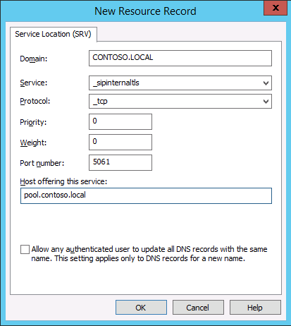
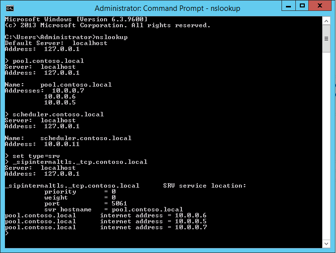

# Создание записей DNS для Skype для бизнеса Server
 
**Сводка.** Сведения о настройке DNS и создании записей DNS для установки Skype для бизнеса Server. Скачайте бесплатную пробную версию Skype для бизнеса Server из центра оценки Майкрософт по адресу: [https://www.microsoft.com/evalcenter/evaluate-skype-for-business-server](https://www.microsoft.com/evalcenter/evaluate-skype-for-business-server).
  
Для нормальной работы Skype для бизнеса Server необходимо задать ряд параметров службы доменных имен (DNS). Эти параметры предоставляют клиентам информацию о способе доступа к службам, а серверам — о других серверах. Для каждого развертывания достаточно задать параметры один раз, так как назначенная вами запись службы доменных имен доступна во всем домене. Шаги с 1 по 5 могут выполняться в произвольном порядке. Но шаги 6, 7 и 8 должны выполняться в указанном порядке после шагов с 1 по 5, как показано на схеме. Создание записей DNS выполняется в шагах 5–8. Дополнительные сведения о планировании DNS см. в статьях [Требования к среде Skype для бизнеса Server](../../plan-your-deployment/requirements-for-your-environment/environmental-requirements.md) и [Требования к серверу для Skype для бизнеса Server 2019](../../../SfBServer2019/plan/system-requirements.md).
  
> [!IMPORTANT]
> Обратите внимание, что это лишь пример создания записей DNS в среде DNS Windows Server. Для работы Skype для бизнеса Server требуется много других записей DNS. Процедура их создания зависит от системы, используемой в конкретной организации для управления службой доменных имен. Полный список требований DNS см. в статье [Требования к DNS для Skype для бизнеса Server](../../plan-your-deployment/network-requirements/dns.md). 
  

  
## Настройка службы доменных имен

Записи DNS необходимы для нормальной работы Skype для бизнеса Server и предоставления доступа пользователей к нему.
  
В этом примере используется полное доменное имя с балансировкой нагрузки на DNS pool.contoso.local. Этот пул состоит из трех серверов с Skype для бизнеса Server Enterprise Edition. Сервер переднего плана Standard Edition может содержать только один сервер. При использовании Standard Edition можно использовать лишь полное доменное имя (FQDN) одного сервера Standard Edition при обращении к роли интерфейса, а не создавать пул серверов с балансировкой нагрузки на DNS, как показано в данном примере. Этот простой пример, использующий только роль сервера переднего плана, содержит DNS-записи из приведенной ниже таблицы. Сведения о том, как спланировать требования к DNS, см. в статье [Требования к DNS для Skype для бизнеса Server](../../plan-your-deployment/network-requirements/dns.md). 
  
 
|**Описание**|**Тип записи**|**Имя**|**Во что разрешается**|**Тип балансировки нагрузки**|
|:-----|:-----|:-----|:-----|:-----|
|Полное доменное имя внутренних веб-служб    |А    |webint.contoso.local    |Виртуальный IP-адрес (VIP) для внутренних веб-служб    |Поддерживаемое ПО и оборудование    |
|Полное доменное имя пула    |А    |pool.contoso.local    |IP-адрес сервера SFB01    |DNS    |
|Полное доменное имя сервера SFB01    |А    |SFB01.contoso.local    |IP-адрес сервера SFB01    |DNS    |
|Полное доменное имя пула    |А    |pool.contoso.local    |IP-адрес сервера SFB02    |DNS    |
|Полное доменное имя сервера SFB02    |А    |SFB02.contoso.local    |IP-адрес сервера SFB02    |DNS    |
|Полное доменное имя пула    |А    |pool.contoso.local    |IP-адрес сервера SFB03    |DNS    |
|Полное доменное имя сервера SFB03    |А    |SFB03.contoso.local    |IP-адрес сервера SFB03    |DNS    |
|Автообнаружение Skype для бизнеса    |А    |lyncdiscoverinternal.contoso.local    |Виртуальный IP-адрес (VIP) для внутренних веб-служб    |Поддерживаемое ПО и оборудование    |
|Простой URL-адрес собрания    |А    |meet.contoso.local    |Виртуальный IP-адрес (VIP) для внутренних веб-служб    |Поддерживаемое ПО и оборудование    |
|Простой URL-адрес для телефонного подключения    |А    |dialin.contoso.local    |Виртуальный IP-адрес (VIP) для внутренних веб-служб    |Поддерживаемое ПО и оборудование    |
|Простой URL-адрес для веб-планировщика    |А    |scheduler.contoso.local    |Виртуальный IP-адрес (VIP) для внутренних веб-служб    |Поддерживаемое ПО и оборудование    |
|Простой URL-адрес администратора    |А    |admin.contoso.local    |Виртуальный IP-адрес (VIP) для внутренних веб-служб    |Поддерживаемое ПО и оборудование    |
|Обнаружение устаревших данных    |SRV    |_sipinternaltls._tcp.contoso.local    |Полное доменное имя пула (порт 5061)    |Недоступно    |
   
### Создание записей DNS

1. Войдите на сервер DNS и откройте **диспетчер серверов**.
    
2. Щелкните раскрывающееся меню **Сервис** и нажмите **DNS**.
    
3. В дереве консоли вашего домена SIP разверните узел **Зоны прямого просмотра** и щелкните правой кнопкой мыши домен SIP, в котором будет установлен сервер Skype для бизнеса Server.
    
4. Щелкните домен SIP правой кнопкой мыши и выберите **Новый узел (A или AAAA)**, как показано на рисунке ниже.
    
     
  
5. В поле **Имя** введите имя записи узла (имя домена добавляется автоматически).
    
6. В поле **IP-адрес** введите IP-адрес отдельного сервера переднего плана и выберите **Создать соответствующую PTR-запись** или **Разрешать любому прошедшему проверку пользователю обновлять DNS-записи с таким же именем владельца**, если это возможно. Следует отметить, что это предполагает использование службы доменных имен для балансировки нагрузки всего трафика, за исключением веб-служб. В данном примере используются три сервера переднего плана, показанные в таблице.
    
   |**Имя сервера**|**Тип**|**Данные**|
   |:-----|:-----|:-----|
   |SFB01    |Узел (A)    |10.0.0.5    |
   |SFB02    |Узел (A)    |10.0.0.6    |
   |SFB03    |Узел (A)    |10.0.0.7    |
   
7. Далее создайте записи балансировки нагрузки на DNS для пула. Балансировка нагрузки на DNS позволяет службе DNS отправлять запросы отдельным серверам в пуле, используя то же имя пула DNS. Дополнительные сведения о DNS и балансировке нагрузки см. в статье [Требования к DNS для Skype для бизнеса Server](../../plan-your-deployment/network-requirements/dns.md). 
    
    > [!NOTE]
    > Объединение нескольких серверов в пул доступно только в развертываниях Enterprise Edition. При развертывании одного сервера Enterprise Edition или Standard Edition запись A необходимо создать только для одного сервера. 
  
    Например, если бы у вас был пул с именем pool.contoso.local и три сервера переднего плана, потребовалось бы создать следующие DNS-записи:
    
   |**Полное доменное имя**|**Тип**|**Данные**|
   |:-----|:-----|:-----|
   |pool.contoso.local    |Узел (A)    |10.0.0.5    |
   |pool.contoso.local    |Узел (A)    |10.0.0.6    |
   |pool.contoso.local    |Узел (A)    |10.0.0.7    |
   
8. Продолжите создание записей A для всех серверов в запланированном развертывании. 
    
9. Чтобы создать записи службы (SRV) для обнаружения устаревших данных, щелкните правой кнопкой мыши домен SIP и выберите пункт **Другие новые записи**.
    
10. В разделе **Выбор типа записи ресурса** выберите **Обнаружение службы (запись SRV)**, а затем нажмите кнопку **Создать запись**.
    
11. Нажмите **Служба** и введите **_sipinternaltls**.
    
12. Нажмите **Протокол** и введите **_tcp**.
    
13. Нажмите **Номер порта** и введите значение **5061**.
    
14. Нажмите **Узел этой службы** и введите полное доменное имя пула или сервера Standard Edition.
    
     
  
15. Нажмите кнопку **ОК**, а затем нажмите кнопку **Готово**.
    
### Проверка записей DNS

1. Выполните вход на клиентский компьютер с использованием учетной записи, которая является членом группы прошедших проверку пользователей или имеет эквивалентные разрешения.
    
2. Нажмите **Пуск**, введите **cmd** и нажмите ВВОД.
    
3. Введите **nslookup \<полное доменное имя пула переднего плана\>** или **\<полное доменное имя сервера Standard Edition или одного сервера Enterprise Edition\>** и нажмите клавишу ВВОД.
    
4. Продолжите проверку остальных записей A для вашего развертывания.
    
5. Если вы поддерживаете устаревшие клиенты и создали запись SRV, проверьте ее, набрав **set type=srv** в командной строке **nslookup** и затем нажмите ВВОД.
    
6. Введите **_sipinternaltls._tcp. *домен*** (например, _sipinternaltls._tcp.contoso.local), затем нажмите клавишу ВВОД.
    
7. Ожидаемый результат должен быть похож на тот, который приведен на рисунке. Обратите внимание, что не все DNS-записи показаны в примере выходных данных, и поэтому все записи следует проверить. 
    
     
  

