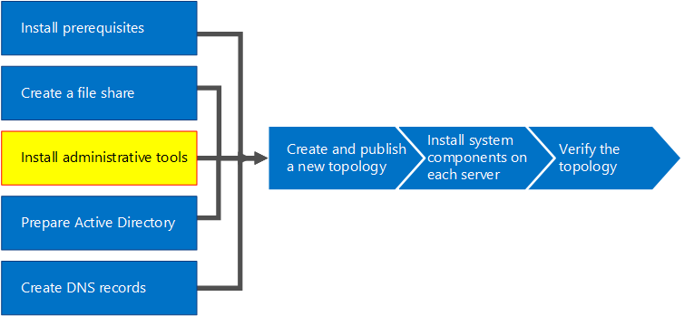
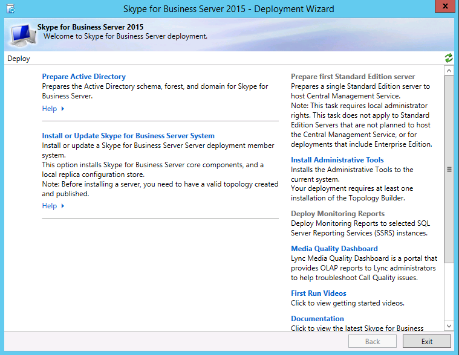

# Установка средств администрирования в Skype для бизнеса Server
 
**Сводка:** Узнайте, как установить административные средства, необходимые для установки Skype для бизнеса Server. Скачайте бесплатную пробную Skype для бизнеса Server из Центра оценки Майкрософт по ссылке: [https://www.microsoft.com/evalcenter/evaluate-skype-for-business-server](https://www.microsoft.com/evalcenter/evaluate-skype-for-business-server) .
  
Административные средства включают топологию Builder и панель управления. Административные средства должны быть установлены по крайней мере на одном сервере топологии или 64-битной рабочей станции управления с Windows оси, поддерживаемой Skype для бизнеса Server. Вы можете сделать шаги от 1 до 5 в любом порядке. Однако необходимо сделать шаги 6, 7 и 8 в порядке и после шагов 1-5, как описано на схеме. Установка административных средств — шаг 3 из 8.
  

  
## Установка Skype для бизнеса Server средств администрирования

Установка носителя для Skype для бизнеса Server обеспечивает гибкий опыт. При первом запуске Setup.exe установлены только мастер развертывания Skype для бизнеса Server и Skype для бизнеса Server управленческой оболочки. С помощью этих двух средств, известных как основные компоненты, можно продолжить процесс установки, но они не предоставляют основные функции для общей Skype для бизнеса Server среды. Мастер развертывания запускается автоматически после установки основных компонентов. В разделе Мастер развертывания под названием **Установка** административных средств устанавливается Skype для бизнеса Server и панель управления Skype для бизнеса Server.
  
> [!IMPORTANT]
> Каждая Skype для бизнеса Server должна иметь по крайней мере один сервер с установленными административными средствами. 
  
Просмотрите видео действия для **установки административных средств:**
  
> [!video https://www.microsoft.com/videoplayer/embed/99a5c436-963b-4eed-b423-651568c87cb1?autoplay=false]
  
### Установка Skype для бизнеса Server средств администрирования из мастера развертывания

1. Вставьте Skype для бизнеса Server установки. Если установка не начинается автоматически, дважды нажмите кнопку **Установка**.
    
2. Носители установки требуют Microsoft Visual C++ для запуска. В диалоговом окне будет всплывающее окно с вопросом, хотите ли вы установить его. Нажмите кнопку **Да**.
    
3. С помощью смарт-установки, новой функции в Skype для бизнеса Server, вы можете подключиться к Интернету, чтобы проверить обновления во время процесса установки. Это обеспечивает лучший опыт, убедившись, что у вас есть самые последние обновления для продукта при установке. Щелкните **Установите,** чтобы приступить к установке.
    
4. Внимательно просмотрите лицензионный договор, и если вы согласны, выберите я **принимаю** условия лицензионного соглашения и нажмите **кнопку ОК**.
    
5. Основные Skype для бизнеса Server будут установлены на сервере. 
    
    Основные компоненты состоят из следующих, как показано на рисунке.
    
    
  
   - **Skype для бизнеса Server мастер развертывания** Программа развертывания, которая предоставляет пусковую площадку для установки различных компонентов Skype для бизнеса Server.
    
   - **Skype для бизнеса Server управленческой оболочки** Программа PowerShell с предварительной подготовкой, которая позволяет использовать Skype для бизнеса Server.
    
     После завершения установки основных компонентов мастер развертывания Skype для бизнеса Server запуска, как показано на рисунке. 
    
     
  
6. В дополнение к основным компонентам необходимо также установить Skype для бизнеса Server topology Builder и панель управления Skype для бизнеса Server по крайней мере на одном сервере в среде. Щелкните **Установите средства администрирования** в мастере развертывания.
    
7. Чтобы начать установку, нажмите кнопку **Далее**.
    
8. После завершения установки нажмите кнопку **Готово**. Административные средства теперь добавляются на сервер, как показано на рисунке.
    
    
  
   - **Skype для бизнеса Server топологии Builder** Программа, используемая для создания, развертывания и управления topologies.
    
   - **Skype для бизнеса Server панели управления** Программа, используемая для администрирования установки.
    

