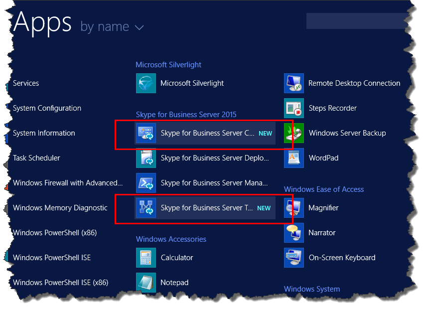

# Установка средств администрирования в Skype для бизнеса ServerInstall administrative tools in Skype for Business Server
 
**Сводка:** Сведения о том, как установить средства администрирования, необходимые для установки Skype для бизнеса Server.**Summary:** Learn how to install the administrative tools required for an installation of Skype for Business Server. Скачайте бесплатную пробную версию Skype для бизнеса Server из центра оценки Майкрософт по адресу: [https://www.microsoft.com/evalcenter/evaluate-skype-for-business-server](https://www.microsoft.com/evalcenter/evaluate-skype-for-business-server).Download a free trial of Skype for Business Server from the Microsoft Evaluation center at: [https://www.microsoft.com/evalcenter/evaluate-skype-for-business-server](https://www.microsoft.com/evalcenter/evaluate-skype-for-business-server).
  
К средствам администрирования относятся построитель топологий и панель управления.The administrative tools include Topology Builder and the Control Panel. Средства администрирования должны быть установлены по крайней мере на одном сервере в топологии или на рабочей станции управления 64-bit для Windows, которая поддерживается в Skype для бизнеса Server.The administrative tools must be installed on at least one server in the topology or a 64-bit management workstation running a Windows OS version that is supported for Skype for Business Server. Шаги с 1 по 5 могут выполняться в произвольном порядке.You can do steps 1 through 5 in any order. Но шаги 6, 7 и 8 должны выполняться в указанном порядке после шагов с 1 по 5, как показано на схеме.However, you must do steps 6, 7, and 8 in order, and after steps 1 through 5, as outlined in the diagram. Установка средств администрирования — шаг 3 из 8.Installing the administrative tools is step 3 of 8.
  

  
## Установка средств администрирования Skype для бизнеса ServerInstall Skype for Business Server administrative tools

Установочный носитель для Skype для бизнеса Server обеспечивает гибкие возможности.The installation media for Skype for Business Server provides a flexible experience. При первом запуске файла Setup. exe единственными установленными инструментами являются Мастер развертывания Skype для бизнеса Server и консоль управления Skype для бизнеса Server.When you first run Setup.exe, the only tools installed are the Skype for Business Server Deployment Wizard and the Skype for Business Server Management Shell. С помощью этих двух инструментов, известных как основные компоненты, вы можете продолжить процесс установки, но они не предоставляют основную функциональность для общей среды Skype для бизнеса Server.By using these two tools, known as Core Components, you can continue with the installation process, but they do not provide primary functionality for the overall Skype for Business Server environment. Мастер развертывания автоматически запускается после установки основных компонентов.The Deployment Wizard launches automatically after you install the Core Components. Раздел мастера развертывания с названием " **Установка средств администрирования** " Построитель топологии Skype для бизнеса Server и панель управления "Skype для бизнеса Server".The section of the Deployment Wizard titled **Install Administrative Tools** installs Skype for Business Server Topology Builder and Skype for Business Server Control Panel.
  
> [!IMPORTANT]
> Каждая серверная среда Skype для бизнеса должна иметь хотя бы один сервер с установленными инструментами администрирования.Every Skype for Business Server environment must have at least one server with the administrative tools installed. 
  
Смотреть видеоруководство **Установка средств администрирования**.Watch the video steps for **Install administrative tools**:
  
> [!video https://www.microsoft.com/en-us/videoplayer/embed/99a5c436-963b-4eed-b423-651568c87cb1?autoplay=false]
  
### Установка средств администрирования Skype для бизнеса Server с помощью мастера развертыванияInstall Skype for Business Server administrative tools from the Deployment Wizard

1. Вставьте установочный носитель Skype для бизнеса Server.Insert the Skype for Business Server installation media. Если установка не началась автоматически, дважды щелкните файл **Setup**.If the setup does not automatically begin, double-click **Setup**.
    
2. Для запуска установочного носителя требуется Microsoft Visual C++. Открывается диалоговое окно с запросом подтверждения установки. Нажмите **Да**.The installation media requires Microsoft Visual C++ to run. A dialog box will pop up asking if you want to install it. Click **Yes**.
    
3. С помощью интеллектуальной настройки, новой функции в Skype для бизнеса Server можно подключаться к Интернету для проверки наличия обновлений в процессе установки.By using Smart Setup, a new feature in Skype for Business Server, you can connect to the Internet to check for updates during the installation process. Это повышает эффективность работы, так как вы можете быть уверены в получении самых последних обновлений продукта.This provides a better experience by making sure you have the most recent updates to the product at installation. Нажмите кнопку **Установить**, чтобы начать установку.Click **Install** to begin the installation.
    
4. Внимательно просмотрите лицензионное соглашение. Если вы согласны, выберите **Я принимаю условия лицензионного соглашения** и нажмите кнопку **ОК**.Carefully review the License Agreement, and if you agree, select **I accept the terms in the license agreement**, and click **OK**.
    
5. Основные компоненты сервера Skype для бизнеса будут установлены на сервере.The Skype for Business Server Core Components will be installed on the server. 
    
    Состав основных компонентов показан на рисунке.The Core Components consist of the following, as shown in the figure.
    
    
  
   - **Мастер развертывания Skype для бизнеса Server** Программа развертывания, которая предоставляет стартовый планшет для установки различных компонентов Skype для бизнеса Server.**Skype for Business Server Deployment Wizard** A deployment program that provides a launch pad for installing the various components of Skype for Business Server.
    
   - **Командная консоль управления Skype для бизнеса Server** Предварительно настроенная программа PowerShell, разрешающая администрирование Skype для бизнеса Server.**Skype for Business Server Management Shell** A preconfigured PowerShell program that allows for administration of Skype for Business Server.
    
     После завершения установки основных компонентов мастер развертывания в Skype для бизнеса Server будет автоматически запущен, как показано на рисунке.Once the installation of the Core Components is complete, the Skype for Business Server Deployment Wizard will automatically launch, as shown in the figure. 
    
     
  
6. В дополнение к основным компонентам вам также потребуется установить построитель топологии Skype для бизнеса Server и панель управления "Skype для бизнеса" на сервере по крайней мере одного сервера в среде.In addition to the Core Components, you will also need to install Skype for Business Server Topology Builder and Skype for Business Server Control Panel on at least one server in the environment. Щелкните **Установить средства администрирования** в окне мастера развертывания.Click **Install Administrative Tools** on the Deployment Wizard.
    
7. Нажмите кнопку **Далее**, чтобы начать установку.Click **Next** to begin the installation.
    
8. После завершения установки нажмите кнопку **Готово**. Теперь средства администрирования добавлены на сервер, как показано на рисунке.Once the installation has completed, click **Finish**. The administrative tools are now added to the server, as shown in the figure.
    
    
  
   - **Построитель топологии Skype для бизнеса Server** Программа, используемая для создания и развертывания топологий и управления ими.**Skype for Business Server Topology Builder** A program used to build, deploy, and manage topologies.
    
   - **Панель управления "Skype для бизнеса" на сервере** Программа, используемая для управления установкой.**Skype for Business Server Control Panel** A program used to administer the installation.
    

