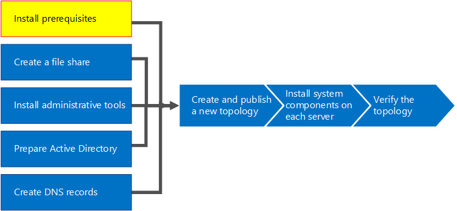

# Установка обязательных компонентов для Skype для бизнеса Server 2015Install prerequisites for Skype for Business Server 2015
 
**Сводка:** Сведения о серверах и роли сервера, которые необходимо настроить перед установкой Скайп для Business Server 2015.**Summary:** Learn about the servers and server roles you must configure before you install Skype for Business Server 2015. Загрузите бесплатную пробную версию программы Скайп для Business Server 2015 [Центр оценки Microsoft](https://www.microsoft.com/evalcenter/evaluate-skype-for-business-server).Download a free trial of Skype for Business Server 2015 from the [Microsoft Evaluation center](https://www.microsoft.com/evalcenter/evaluate-skype-for-business-server).
  
При настройке Windows Server на каждом из серверов в топологии устанавливаются роли и функции, которые являются необходимыми компонентами.Installing prerequisites consists of setting up Windows Server by installing the required roles and features on each of the servers in the topology. Требования зависят от роли, которую выполняет сервер в топологии.The requirements are based on the role the server will fulfill in the topology. Шаги 1–5 можно выполнять в любом порядке.You can do steps 1 through 5 in any order. Однако шаги 6, 7 и 8 необходимо выполнять в указанном порядке и только после шагов 1–5, как показано на схеме.However, you must do steps 6, 7, and 8 in order, and after steps 1 through 5, as outlined in the diagram. Обязательные компоненты устанавливаются на шаге 1 из 8.Installing prerequisites is step 1 of 8.
  

  
## Настройка Windows ServerSetup Windows Server

Скайп для Business Server 2015 требуется операционная система Windows Server и число необходимых компонентов можно установить.Skype for Business Server 2015 requires the Windows Server operating system and a number of prerequisites before it can be installed. Для получения дополнительных сведений о планировании наличие необходимых компонентов просмотрите [требования к серверу для Скайп для Business Server 2015](../../plan-your-deployment/requirements-for-your-environment/server-requirements.md).For details on planning for prerequisites, see [Server requirements for Skype for Business Server 2015](../../plan-your-deployment/requirements-for-your-environment/server-requirements.md). 
  
> [!TIP]
> Здесь приведена процедура для Windows Server 2012 R2. Процедуры для других версий Windows Server могут незначительно отличаться.This procedure uses Windows Server 2012 R2. If you are using a different version of Windows Server, the procedure might be slightly different. 
  
> [!IMPORTANT]
> Прежде чем начать, убедитесь, что Windows Server актуальных с помощью центра обновления Windows.Before you begin, make sure that Windows Server is up-to-date by using Windows Update. 
  

  
Посмотрите видео с инструкциями по **установке необходимых компонентов**:Watch the video steps for **install prerequisites**:
  
> [!video https://www.microsoft.com/en-us/videoplayer/embed/02447c2a-5b26-432f-aad6-b9b05cc93478?autoplay=false]
  
### Установка необходимых ролей и компонентов для серверов переднего планаInstall required roles and features for front-end servers

Можно установить необходимые роли и компоненты, с помощью диспетчера сервера.You can install the required roles and features using Server Manager. 
    
1. Установите необходимые программные компоненты, указанные в [требования к серверу для Скайп для Business Server 2015](../../plan-your-deployment/requirements-for-your-environment/server-requirements.md).Install the prerequisite software features listed in [Server requirements for Skype for Business Server 2015](../../plan-your-deployment/requirements-for-your-environment/server-requirements.md). На сервере, на котором будет запущен Скайп для Business Server 2015 должен быть необходимого программного обеспечения.The required software must be on the server that will run Skype for Business Server 2015.
    
    > [!CAUTION]
    > По умолчанию в Windows Server 2012 R2 не устанавливаются все исходные файлы для обязательных компонентов.Windows Server 2012 R2 does not install all of the source files for the required features by default. Если сервер не подключен в сети Интернет, для установки обязательных компонентов потребуется установить носитель Windows Server 2012 R2 и выбрать **Указать альтернативный исходный путь**.If the server is not connected to the Internet, you will need to insert the Windows Server 2012 R2 media and select **Specify an alternate source path** in order to install the required features. Исходные файлы находятся в каталоге sources\sxs.The source files are located in the sources\sxs directory. Например, если носитель Windows Server 2012 R2 установлен в дисковод D, следует указать путь `d:\sources\sxs`.For example, if the Windows Server 2012 R2 media is in drive D, you would set the path to `d:\sources\sxs`. Важно получить последние пакеты обновления из центра обновления Windows.It is important that you have the latest updates from Windows Update. При отсутствии интернет-подключения потребуется вручную установить все необходимые пакеты обновления, а также обязательные компоненты для этих пакетов.If you are not connected to the Internet, you will need to manually install all relevant updates as well as any prerequisites to the required updates. 
  
1. Когда в диалоговом окне появляется сообщение о завершении установки, для окончательного завершения процесса необходимо перезагрузить сервер.When the dialog box indicates that the installation has completed, you will need to reboot the server to complete the process.
    
1. Снова запустите **центр обновления Windows** и проверьте наличие обновлений для установленных ролей и служб.Run **Windows Update** again to check if there are any updates to the roles and services that were installed.
    
1. Если будет использоваться Скайп для панели управления Business Server на этом сервере необходимо также установить Silverlight.If you will be using Skype for Business Server Control Panel on this server then you must also install Silverlight. Чтобы установить Silverlight, обратитесь к разделу [Microsoft Silverlight](https://www.microsoft.com/silverlight/).To install Silverlight, see [Microsoft Silverlight](https://www.microsoft.com/silverlight/).

> [!IMPORTANT]
> Для серверов, роль которых отличается от роли сервера переднего плана, например для директоров, серверов сохраняемого чата и пограничных серверов, предусмотрены особые наборы обязательных компонентов.The prerequisites for servers performing roles other than front-end server, such as the role of Director, Persistent Chat, or Edge, have their own prerequisites. Сведения на точное необходимого программного обеспечения, необходимые для каждого типа сервера содержатся [требования к серверу для Скайп для Business Server 2015](../../plan-your-deployment/requirements-for-your-environment/server-requirements.md).For details on the exact prerequisites required by each server type, see [Server requirements for Skype for Business Server 2015](../../plan-your-deployment/requirements-for-your-environment/server-requirements.md). 
  

