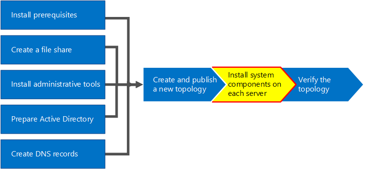

# Установка Skype для бизнеса Server на серверах в топологии
 
**Сводка:** Узнайте, как установить Skype для бизнеса Server компонентов системы на каждом сервере в топологии.
  
После загрузки топологии в центральное хранилище управления и когда Active Directory узнает, какие серверы будут выполнять какие роли, необходимо установить систему Skype для бизнеса Server на каждом из серверов в топологии. Вы можете выполнить шаги с 1 по 5 в любом порядке. Однако необходимо выполнить шаги 6, 7 и 8 по порядку и после шагов 1–5, как показано на схеме. Установка Skype для бизнеса Server системы — шаг 7 из 8.
  

  
## Установка Skype для бизнеса Server системы

После публикации топологии можно установить Skype для бизнеса Server компонентов на каждом сервере в топологии. В этом разделе описывается установка Skype для бизнеса Server и настройка ролей сервера для пула переднего плана и всех ролей сервера, совместно размещенных с серверами переднего плана. Чтобы установить и настроить роли сервера, запустите Skype для бизнеса Server развертывания на каждом компьютере, на котором устанавливается роль сервера. Мастер развертывания используется для выполнения всех четырех этапов развертывания, включая установку локального хранилища конфигураций, установку серверов переднего плана, настройку сертификатов и запуск служб.
  
> [!IMPORTANT]
> Необходимо использовать построитель топологий для завершения и публикации топологии перед установкой Skype для бизнеса Server на серверах. 
  
> [!NOTE]
> Эта процедура должна быть завершена для всех серверов в топологии. 
  
> [!CAUTION]
> После установки Skype для бизнеса Server на сервере переднего плана при первом запуске служб необходимо убедиться, что служба брандмауэра Windows запущена на сервере. 
  
> [!CAUTION]
> Перед выполнением этих действий убедитесь, что вы вошли на сервер с учетной записью пользователя домена, которая является локальным администратором и членом группы RTCUniversalServerAdmins. 
  
> [!NOTE]
> Если вы еще не запускали Skype для бизнеса Server на этом сервере, вам будет предложено указать диск и путь для установки. Это позволяет установить диск, отличный от системного, если это требуется вашей организации или если у вас есть проблемы с пространством. Путь к расположению установки для Skype для бизнеса Server файлов в диалоговом окне установки  можно изменить на новый доступный диск. При установке файлов установки по этому пути, включая OCSCore.msi, остальные Skype для бизнеса Server файлы также будут развернуты там.
  
> [!IMPORTANT]
> Перед началом установки убедитесь, что Windows Server находится в актуальном состоянии с помощью клиентский компонент Центра обновления Windows. 
  

  
### Установка Skype для бизнеса Server системы

1. Вставьте Skype для бизнеса Server установки. Если установка не начинается автоматически, дважды щелкните " **Настройка"**.
    
2. Установимый носитель Microsoft Visual C++ запуска. Отобразит диалоговое окно с вопросом, хотите ли вы установить его. Нажмите **кнопку "Да".**
    
3. Внимательно изучите лицензионное соглашение и, если вы согласны, выберите "Я принимаю условия лицензионного соглашения" и нажмите кнопку "**ОК"**. 
    
4. Интеллектуальная установка — это функция в Skype для бизнеса Server, где можно подключиться к Интернету для проверки на наличие обновлений из Центра обновления Майкрософт (MU) во время установки, как показано на рисунке. Это обеспечивает более эффективное взаимодействие за счет того, что у вас есть последние обновления для продукта. Нажмите **кнопку "** Установить", чтобы начать установку.
    
    > [!NOTE]
    > Многие организации развернули Windows Server Update Services (WSUS) в своих корпоративных средах. Службы WSUS позволяют администраторам полностью управлять распространением обновлений, выпущенных с помощью Центра обновления Майкрософт, на компьютерах в сети. В рамках выпуска накопительного пакета обновления 1 Skype для бизнеса Server включена поддержка интеллектуальной установки для работы с WSUS. Клиенты с WSUS, которые развертывают Skype для бизнеса Server в первый раз или обновляют среду Lync Server 2013 с помощью функции обновления In-Place, будут иметь возможность выборки интеллектуальной установки Skype для Windows обновлений из WSUS, а не получать обновления из MU. Клиенты, желающие использовать интеллектуальную установку, должны запустить SmartSetupWithWSUS.psq на всех компьютерах перед запуском Setup.exe. 
  
     
  
5. На странице мастера развертывания нажмите **кнопку "Установить" или "Обновить Skype для бизнеса Server System"**.
    
6. Выполните процедуры, описанные в следующих процедурах. Завершив их, нажмите кнопку **"** Выйти", чтобы закрыть мастер развертывания. Повторите процедуры для каждого сервера переднего плана в пуле.
    
### Шаг 1. Установка локального хранилища конфигураций

1. Просмотрите предварительные требования и нажмите кнопку **"** Выполнить рядом с шагом **1. Установка локального хранилища конфигураций"**.
    
    > [!NOTE]
    > Локальное хранилище конфигураций — это копия центрального хранилища управления, доступная только для чтения. В развертывании выпуск Standard центральное хранилище управления создается с помощью локальной копии SQL Server Express Edition на сервере переднего плана. Это происходит при выполнении процедуры prepare First выпуск Standard Server. При развертывании выпуск Enterprise создается центральное хранилище управления при публикации топологии, которая включает выпуск Enterprise интерфейсного пула. 
  
2. На странице **"Установка локального хранилища конфигураций** " убедитесь, что выбран параметр **"** Получить непосредственно из центрального хранилища управления", а затем нажмите кнопку **"Далее"**.
    
    SQL Server Express edition устанавливается на локальном сервере. SQL Server Express требуется выпуск для локального хранилища конфигураций.
    
3. По окончании установки конфигурации локального сервера нажмите кнопку **Finish** (Готово).
    
### Шаг 2. Настройка или удаление Skype для бизнеса Server компонентов

1. Просмотрите предварительные требования и нажмите кнопку **"Выполнить** рядом с шагом **2. Установка или Skype для бизнеса Server компонентов"**.
    
2. На странице **"Skype для бизнеса Server компонентов**" нажмите кнопку "Далее", чтобы настроить компоненты, как определено в опубликованной топологии.
    
3. На **странице "Выполнение команд** " отображается сводка по командам и сведения об установке по мере настройки. После этого можно использовать список, чтобы выбрать журнал для просмотра, а затем нажать кнопку **"Просмотреть журнал"**.
    
4. Когда Skype для бизнеса Server компоненты будут завершены и вы просмотрите журналы по мере необходимости, нажмите кнопку **"** Готово", чтобы завершить этот шаг в установке.
    
    > [!NOTE]
    > Перезапустите сервер при появлении запроса (что может произойти, если Windows необходимо установить интерфейс рабочего стола). При резервном копировании и запуске компьютера необходимо снова выполнить эту процедуру (шаг 2. Установка или удаление Skype для бизнеса Server компонентов). 
  
    > [!NOTE]
    > Если установщик найдет необходимые компоненты, которые не были выполнены, вы будете уведомлены с сообщением "Необходимые условия не выполнены", как показано на рисунке. Выполните необходимые условия, а затем снова запустите эту процедуру (шаг 2. Установка или удаление Skype для бизнеса Server компонентов). 
  
     
  
5. Убедитесь, что первые два шага выполнены должным образом. Убедитесь, что установлен зеленый флажок со словом **"Завершено**", как показано на рисунке.
    
     
  
6. **Запустите клиентский компонент Центра обновления Windows** еще раз, чтобы проверить наличие обновлений после установки Skype для бизнеса Server компонентов.
    
### Шаг 3. Запрос, установка или назначение сертификатов

1. Просмотрите предварительные требования и нажмите кнопку **"** Выполнить рядом с шагом **3. Запрос, установка или назначение сертификатов"**.
    
    > [!NOTE]
    > Skype для бизнеса Server включает поддержку набора SHA-2 (SHA-2 использует хэш-код длиной 224, 256, 384 или 512 бит) хэша и алгоритмов подписывания хэша для подключений от клиентов под управлением Windows 10, Windows 8, Windows 7, Windows Server 2012 R2, Windows Server 2012 или Windows Server 2008 R2. Для поддержки внешнего доступа с помощью набора SHA-2 внешний сертификат выдан общедоступным ЦС, который также может выдан сертификат с тем же хэш-кодом длины бита. 
  
    > [!IMPORTANT]
    > Выбор хэш-дайджеста и алгоритма подписи зависит от клиентов и серверов, которые будут использовать сертификат, а также от других компьютеров и устройств, с которыми клиенты и серверы будут взаимодействовать, которые также должны знать, как использовать алгоритмы, используемые в сертификате. Сведения о том, какие длины хэш-кода поддерживаются в операционной системе и некоторых клиентских приложениях, см. в Windows [PKI — SHA2 и Windows](/archive/blogs/pki/sha2-and-windows). 
  
    Для выпуск Standard или сервера переднего плана требуется до четырех сертификатов: сертификат oAuthTokenIssuer, сертификат по умолчанию, внутренний веб-сертификат и внешний веб-сертификат. Однако можно запросить и назначить один сертификат по умолчанию с соответствующими альтернативными записями имени субъекта, а также сертификатом oAuthTokenIssuer. Дополнительные сведения о требованиях к сертификатам см. в Skype для бизнеса Server требованиях к Skype для бизнеса Server [2019](../../../SfBServer2019/plan/system-requirements.md).
    
    > [!IMPORTANT]
    > В следующей процедуре описывается настройка сертификатов из внутреннего центра сертификации на основе служб сертификатов Active Directory. 
  
2. На странице **Мастер сертификатов** щелкните **Запрос**.
    
3. На странице **запроса сертификата** заполните соответствующие данные, включая выбор домена SIP, и нажмите кнопку **"Далее"**.
    
4. На странице **Delayed or Immediate Requests** (Отложенные или немедленные запросы) вы можете принять используемый по умолчанию параметр **Send the request immediately to an online certification authority** (Немедленно отправить запрос в локальный центр сертификации), нажав кнопку **Next** (Далее). В случае выбора этого параметра должен быть доступен внутренний центр сертификации с автоматической регистрацией по сети. Если вы выбираете задержку запроса, отображается запрос на ввод имени и расположения для сохранения файла запроса на сертификат. Запрос на сертификат должен быть представлен и обработан центром сертификации внутри вашей организации или общим центром сертификации. После этого вам необходимо импортировать ответ сертификата и назначить его подходящей роли сертификата.
    
5. На странице "Выбор центра сертификации( ЦС **)** выберите центр  сертификации из списка, обнаруженного в параметре среды, а затем выберите в списке известный (посредством регистрации в доменные службы Active Directory) ЦС. Либо выберите параметр **Указать другой центр сертификации**, введите в поле имя другого центра сертификации и нажмите кнопку **Далее**.
    
6. На странице **Certificate Authority Account** (Учетная запись центра сертификации) требуется ввести учетные данные для запроса сертификата и обработки этого запроса на сертификат в центре сертификации. Вам следовало заранее узнать, требуются ли имя пользователя и пароль для запроса сертификата. Администратор ЦС будет иметь необходимые сведения, и вам может потребоваться помощь на этом шаге. Если вам необходимо указать альтернативные сертификаты, установите флажок, укажите имя пользователя и пароль в текстовых полях и нажмите кнопку **Next** (Далее).
    
7. На странице **Specify Alternate Certificate Template** (Указание альтернативного шаблона сертификата) нажмите кнопку **Next** (Далее), чтобы использовать шаблон веб-сервера по умолчанию.
    
    > [!NOTE]
    > Если ваша организация создала шаблон для использования в качестве альтернативы для шаблона веб-сервера по умолчанию, установите флажок, а затем введите имя альтернативного шаблона. Вам потребуется имя шаблона, заданное администратором центра сертификации. 
  
8. На странице **"Имя и Параметры** безопасности" укажите **понятное имя**. Используя понятное имя, можно быстро определить сертификат и назначение. Если оставить поле пустым, имя создается автоматически. Задайте значение **Bit length** (Длина в битах) для ключа или примите значение по умолчанию, равное 2048 битам. Выберите " **Пометить** закрытый ключ сертификата как экспортируемый", если вы определили, что сертификат и закрытый ключ необходимо переместить или скопировать в другие системы, а затем нажмите кнопку **"Далее"**.
    
    > [!NOTE]
    > Skype для бизнеса Server имеет минимальные требования для экспортируемого закрытого ключа. Одним из таких мест являются пограничные серверы в пуле, где служба проверки подлинности при ретрансляции мультимедиа использует копии этого сертификата вместо отдельных сертификатов для каждого из экземпляров пула. 
  
9. При необходимости укажите информацию  об организации на странице **Organization Information** (Сведения об организации) и нажмите кнопку **Next** (Далее).
    
10. При необходимости укажите информацию о местоположении на странице **Geographical Information** (Сведения о местоположении) и нажмите кнопку **Next** (Далее).
    
11. На странице **Subject Name / Subject Alternate Names** (Имя субъекта/альтернативные имена субъектов) просмотрите добавляемые альтернативные имена субъектов и нажмите кнопку **Next** (Далее).
    
12. На странице **SIP Domain setting** (Настройка домена SIP) выберите **SIP Domain** (Домен SIP) и нажмите кнопку **Next** (Далее).
    
13. На странице **Configure Additional Subject Alternate Names** (Настройка дополнительных альтернативных имен субъектов) добавьте все необходимые альтернативные имена субъектов, включая те из них, которые могут потребоваться в будущем для дополнительных доменов SIP, и нажмите кнопку **Next** (Далее).
    
14. На странице **Certificate Request Summary** (Сводка по запросу на сертификат) просмотрите сводные сведения. Если они верны, нажмите кнопку **Next** (Далее). Если необходимо внести исправления, нажмите кнопку **Back** (Назад) для перехода на соответствующую страницу.
    
15. На странице **Executing Commands** (Выполнение команд) нажмите кнопку **Next** (Далее).
    
16. На странице **Online Certificate Request Status** (Состояние веб-запроса на сертификат) просмотрите полученную информацию. Вы должны заметить, что сертификат был выдан и установлен в локальное хранилище сертификатов. Если сообщается, что он был выдан и установлен, но является недопустимым, убедитесь, что корневой сертификат ЦС установлен в хранилище доверенных корневых ЦС сервера. Сведения о получении сертификата доверенного корневого центра сертификации см. в документации по центру сертификации. Если вы хотите просмотреть полученный сертификат, щелкните элемент **View Certificate Details** (Просмотр сведений о сертификате). По умолчанию установлен флажок "Назначить сертификат Skype для бизнеса Server **использования** сертификата". Если вы хотите назначить сертификат вручную, снимите его и нажмите кнопку **Finish** (Готово).
    
17. Если на предыдущей странице снят флажок "**Назначить** сертификат для Skype для бизнеса Server сертификата", отобразит страницу назначения **сертификата**. Нажмите кнопку **Next** (Далее).
    
18. На странице **Certificate Store** (Хранилище сертификатов) выберите запрошенный вами сертификат. Если вы хотите просмотреть сертификат, щелкните элемент **View Certificate Details** (Просмотр сведений о сертификате), а затем нажмите кнопку **Next** (Далее).
    
    > [!NOTE]
    > Если страница **состояния** запроса сертификата в сети сообщила о проблеме с сертификатом, например о недопустимости сертификата, просмотрите фактический сертификат, чтобы получить помощь в ее устранении. Две конкретные проблемы, которые могут привести к тому, что сертификат не является допустимым, — это упомянутый ранее отсутствующий сертификат доверенного корневого ЦС и отсутствующий закрытый ключ, связанный с сертификатом. Чтобы устранить эти две проблемы, обратитесь к документации по ЦС.
  
19. На странице **"Сводка** по назначению сертификатов" просмотрите представленные сведения, чтобы убедиться, что это сертификат, который необходимо назначить, и нажмите кнопку **"Далее"**.
    
20. На странице **Executing Commands** (Выполнение команд) просмотрите выходные данные команды. Щелкните элемент **View Log** (Просмотреть журнал), если хотите ознакомиться с процессом назначения или были выданы ошибка или предупреждение. После завершения просмотра нажмите кнопку **Finish** (Готово).
    
21. На странице  мастера сертификатов убедитесь, что все службы имеют зеленую галу, чтобы указать, что всем службам назначен сертификат, включая OAuthTokenIssuer, как показано на рисунке, и нажмите кнопку "Закрыть **"**.
    
     
  
    > [!TIP]
    > Если вы выполняете установку в лабораторной среде и только что настроили центр сертификации с помощью служб сертификатов Active Directory, необходимо перезагрузить как сервер, на котором работают службы сертификатов, так и сервер переднего плана, прежде чем назначение сертификатов может пройти успешно. 
  
    > [!TIP]
    >  Дополнительные сведения о сертификатах в службах сертификатов Active Directory см. в разделе ["Службы сертификатов Active Directory"](/windows/deployment/deploy-whats-new). 
  
### Шаг 4. Запуск служб

1. Ознакомьтесь с предварительными требованиями **для шага 4. Запуск служб**.
    
2. Если это пул выпуск Enterprise переднего плана по крайней мере с тремя серверами, Windows Fabric используется командлет **Start-CsPool**. Если используется один сервер, что всегда выпуск Standard, используйте командлет **Start-CsWindowsService**. В этом примере мы используем выпуск Enterprise с тремя серверами переднего плана в пуле, откройте командную консоль **Skype для бизнеса Server** и запустите командлет **Start-CsPool**, как показано на рисунке. Для всех остальных ролей, включая выпуск Standard сервера, необходимо использовать **Start-CsWindowsService**. Сведения о развертывании ролей, отличных от роли переднего плана, см. в документации по этим ролям.
    
     
  
3. После того как все службы будут успешно запущены, на странице **Выполнение команд** нажмите кнопку **Готово**.
    
    > [!IMPORTANT]
    > Команда запуска служб на сервере — это лучший способ сообщить о том, что службы фактически запущены. Однако он может не отражать фактическое состояние служб. Для открытия консоли управления (MMC **)** и подтверждения успешного запуска служб, как показано на рисунке, рекомендуется использовать шаг "Состояние службы (необязательно)". Если служба Skype для бизнеса Server не запущена, щелкните ее правой кнопкой мыши в консоли MMC и выберите команду **"Пуск"**. 
  
     
