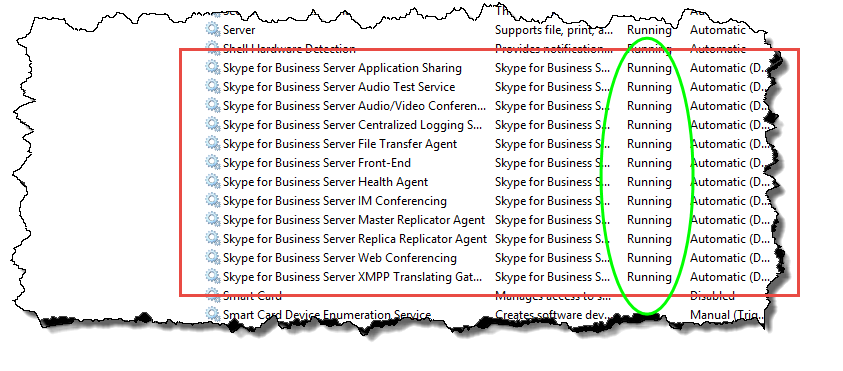

# Установка Skype для бизнеса Server на серверах в топологии
 
**Сводка:** Узнайте, как установить компоненты системы Skype для бизнеса Server на каждом сервере в топологии. Скачайте бесплатную пробную версию Skype для бизнеса Server в [центре оценки Майкрософт](https://www.microsoft.com/evalcenter/evaluate-skype-for-business-server).
  
После того как топология будет загружена в хранилище Центрального управления, и Active Directory будет знать, какие серверы будут выполнять роли, необходимо установить серверную систему Skype для бизнеса на каждом сервере в топологии. Шаги с 1 по 5 можно выполнять в любом порядке. Однако шаги 6, 7 и 8 необходимо выполнять по порядку и после шагов 1 – 5, как показано на схеме. Установка системы Skype для бизнеса Server — шаг 7 из 8.
  

  
## Установка системы Skype для бизнеса Server

После публикации топологии можно установить компоненты Skype для бизнеса Server на каждом сервере в топологии. В этом разделе описывается установка Skype для бизнеса Server и Настройка ролей сервера для пула переднего плана и всех ролей сервера, размещенных на серверах переднего плана. Чтобы установить и настроить роли сервера, запустите мастер развертывания Skype для бизнеса Server на каждом компьютере, на котором устанавливается роль сервера. Мастер развертывания используется для выполнения всех четырех этапов развертывания, в том числе для установки локального хранилища конфигурации, установки серверов переднего плана, настройки сертификатов и запуска служб.
  
> [!IMPORTANT]
> Для завершения и публикации топологии перед установкой Skype для бизнеса Server на серверах необходимо использовать построитель топологий. 
  
> [!NOTE]
> Эту процедуру необходимо выполнить для всех серверов в топологии. 
  
> [!CAUTION]
> После установки Skype для бизнеса Server на сервере переднего плана при первом запуске служб необходимо убедиться, что служба брандмауэра Windows запущена на сервере. 
  
> [!CAUTION]
> Перед выполнением этих действий убедитесь, что вы выполнили вход на сервер с учетной записью пользователя домена, который является как локальным администратором, так и членом группы RTCUniversalServerAdmins. 
  
> [!NOTE]
> Если вы еще не запустили программу установки Skype для бизнеса Server на этом сервере, вам потребуется указать диск и путь для установки. Это обеспечивает возможность установки на диск, отличный от системного диска, если это требуется в Организации, или если есть проблемы с пространством. Вы можете изменить путь к расположению установки для файлов Skype для бизнеса Server в диалоговом окне **программы установки** на новый, доступный диск. Если вы устанавливаете файлы установки по указанному пути, включая OCSCore. msi, остальные файлы сервера Skype для бизнеса будут развернуты там же.
  
> [!IMPORTANT]
> Прежде чем приступить к установке, убедитесь, что Windows Server обновлен с помощью центра обновления Windows. 
  

  
### Установка системы Skype для бизнеса Server

1. Вставьте установочный носитель Skype для бизнеса Server. Если программа установки не запускается автоматически, дважды щелкните файл **Setup**.
    
2. Для работы установочного носителя требуется Microsoft Visual C++. Откроется диалоговое окно с вопросом, следует ли установить его. Нажмите кнопку **Да.**
    
3. Внимательно ознакомьтесь с лицензионным соглашением и, если вы согласны, установите флажок **я принимаю условия лицензионного соглашения**и нажмите кнопку **ОК**. 
    
4. Интеллектуальная настройка — это компонент Skype для бизнеса Server, на котором можно подключаться к Интернету, чтобы проверить наличие обновлений из центра обновления Майкрософт (MU) в процессе установки, как показано на рисунке. Это позволяет улучшить работу, убедившись в наличии последних обновлений для продукта. Нажмите кнопку **установить** , чтобы начать установку.
    
    > [!NOTE]
    > Во многих организациях службы Windows Server Update Services (WSUS) развернуты в корпоративной среде. WSUS позволяет администраторам полностью управлять распределением обновлений, выпускаемых с помощью центра обновления Майкрософт, на компьютерах в сети. В составе накопительного пакета обновления 1 для Skype для бизнеса Server появилась поддержка интеллектуальной настройки для работы с WSUS. Клиенты с WSUS, которые впервые развертывают Skype для бизнеса Server или обновляются с помощью среды Lync Server 2013 с помощью функции обновления на месте, будут иметь интеллектуальную установку, которая будет получать обновления Skype для Windows от WSUS, а не получать обновления из MU. Пользователям, желающим использовать интеллектуальную настройку, необходимо запустить Смартсетупвисвсус. ПСК на всех компьютерах перед запуском программы Setup. exe. 
  
     
  
5. На странице "Мастер развертывания" щелкните **установить или обновить систему Skype для бизнеса Server**.
    
6. Выполните процедуры, описанные в следующих процедурах, после завершения нажмите кнопку **выход** , чтобы закрыть мастер развертывания. Повторите процедуры для каждого сервера переднего плана в пуле.
    
### Шаг 1: Установка локального хранилища конфигурации

1. Проверьте необходимые компоненты и нажмите кнопку **выполнить** рядом с **шагом 1: Установка локального хранилища конфигурации**.
    
    > [!NOTE]
    > Локальное хранилище конфигурации является копией центрального хранилища управления, предназначенной только для чтения. В развертывании Standard Edition центральное хранилище управления создается с помощью локальной копии SQL Server Express Edition на сервере переднего плана. Это происходит при запуске процедуры подготовить первый сервер Standard Edition. В развертывании Enterprise Edition центральное хранилище управления создается при публикации топологии, включающей интерфейсный пул Enterprise Edition. 
  
2. На странице **Установка локального хранилища конфигурации** убедитесь, что установлен флажок **получить непосредственно из центрального хранилища управления** , а затем нажмите кнопку **Далее**.
    
    SQL Server, Экспресс-выпуск установлен на локальном сервере. SQL Server Express Edition необходим для локального хранилища конфигурации.
    
3. По окончании установки конфигурации локального сервера нажмите кнопку **Finish** (Готово).
    
### Шаг 2: Установка или удаление компонентов Skype для бизнеса Server

1. Проверьте необходимые компоненты и нажмите кнопку **выполнить** рядом с пунктом **2: Установка или удаление компонентов Skype для бизнеса Server**.
    
2. На странице " **Настройка компонентов Skype для бизнеса Server** " нажмите кнопку **Далее** , чтобы настроить компоненты в соответствии с опубликованной топологией.
    
3. На странице **выполнение команд** отображается сводка по командам и сведениям об установке в соответствии с настройкой. После этого можно использовать список, чтобы выбрать журнал для просмотра, а затем нажать кнопку **Просмотр журнала**.
    
4. После завершения установки компонентов Skype для бизнеса Server и просмотра журналов по мере необходимости нажмите кнопку **Готово** , чтобы завершить процедуру установки.
    
    > [!NOTE]
    > Перезапустите сервер, если будет предложено (это может произойти, если необходимо установить возможности рабочего стола Windows). При резервном копировании и запуске компьютера необходимо выполнить эту процедуру (шаг 2: Установка или удаление компонентов Skype для бизнеса Server) еще раз. 
  
    > [!NOTE]
    > Если Установщик обнаружил неудовлетворенные необходимые компоненты, будет выведено сообщение "необходимое условие не удовлетворено", как показано на рисунке. Выполните необходимые требования, а затем снова запустите эту процедуру (шаг 2: Установка или удаление компонентов Skype для бизнеса Server). 
  
     
  
5. Убедитесь, что первые два шага выполнены должным образом. Убедитесь, что имеется зеленая галочка со словом **завершено**, как показано на рисунке.
    
     
  
6. Запустите **Обновление Windows** еще раз, чтобы проверить наличие обновлений после установки компонентов Skype для бизнеса Server.
    
### Шаг 3: запрос, установка или назначение сертификатов

1. Проверьте необходимые компоненты и нажмите кнопку **выполнить** рядом с **шагом 3: запрос, установка или назначение сертификатов**.
    
    > [!NOTE]
    > Skype для бизнеса Server включает в себя поддержку комплекта SHA-2 (SHA-2), который использует дайджест-224, 256, 384 или 512 бит) хэш-алгоритма дайджеста и подписи для подключений от клиентов под управлением Windows 10, Windows 8, Windows 7, Windows Server 2012 R2, Windows Сервер 2012 или операционная система Windows Server 2008 R2. Для поддержки внешнего доступа с помощью набора SHA-2 внешний сертификат выдается общедоступным центром сертификации, который также может выдавать сертификат с таким же дайджестом длины. 
  
    > [!IMPORTANT]
    > Выбор алгоритма хэширования и алгоритма подписи зависит от клиентов и серверов, которые будут использовать этот сертификат, а также от других компьютеров и устройств, с которыми клиенты и серверы смогут общаться, и которые также должны знать, как использовать алгоритмы, используемые в сертификат. Сведения о том, какие длины дайджеста поддерживаются в операционной системе и некоторых клиентских приложениях, можно найти в [блоге Windows PKI-SHA2 и Windows](https://go.microsoft.com/fwlink/p/?LinkId=287002). 
  
    Для каждого стандартного выпуска или сервера переднего плана требуется до четырех сертификатов: сертификат oAuthTokenIssuer, сертификат по умолчанию, внутренний веб-сертификат и внешний сертификат на веб-сайте. Однако можно запросить и назначить один сертификат по умолчанию с соответствующими записями альтернативного имени субъекта, а также сертификат oAuthTokenIssuer. Сведения о требованиях к сертификатам приведены в статье [требования к окружающей среде для Skype для бизнеса Server](../../plan-your-deployment/requirements-for-your-environment/environmental-requirements.md) или [серверных требований для Skype для бизнеса Server 2019](../../../SfBServer2019/plan/system-requirements.md).
    
    > [!IMPORTANT]
    > В следующей процедуре описывается настройка сертификатов из внутреннего центра сертификации, основанного на службах сертификатов Active Directory. 
  
2. На странице **Мастер сертификатов** щелкните **Запрос**.
    
3. На странице **запрос сертификата** заполните соответствующие данные, включая выбор домена SIP и нажмите кнопку **Далее**.
    
4. На странице **Delayed or Immediate Requests** (Отложенные или немедленные запросы) вы можете принять используемый по умолчанию параметр **Send the request immediately to an online certification authority** (Немедленно отправить запрос в локальный центр сертификации), нажав кнопку **Next** (Далее). В случае выбора этого параметра должен быть доступен внутренний центр сертификации с автоматической регистрацией по сети. Если вы выбираете задержку запроса, отображается запрос на ввод имени и расположения для сохранения файла запроса на сертификат. Запрос на сертификат должен быть представлен и обработан центром сертификации внутри вашей организации или общим центром сертификации. После этого вам необходимо импортировать ответ сертификата и назначить его подходящей роли сертификата.
    
5. На странице **Выбор центра сертификации (ЦС)** выберите **пункт Выбрать ЦС в списке, обнаруженном в вашей среде** , а затем выберите известный (с помощью регистрации в доменных службах Active Directory) ЦС из списка. Либо выберите параметр **Указать другой центр сертификации**, введите в поле имя другого центра сертификации и нажмите кнопку **Далее**.
    
6. На странице **Certificate Authority Account** (Учетная запись центра сертификации) требуется ввести учетные данные для запроса сертификата и обработки этого запроса на сертификат в центре сертификации. Вам следовало заранее узнать, требуются ли имя пользователя и пароль для запроса сертификата. Ваш администратор ЦС будет иметь необходимые сведения и, возможно, поможет вам на этом шаге. Если вам необходимо указать альтернативные сертификаты, установите флажок, укажите имя пользователя и пароль в текстовых полях и нажмите кнопку **Next** (Далее).
    
7. На странице **Specify Alternate Certificate Template** (Указание альтернативного шаблона сертификата) нажмите кнопку **Next** (Далее), чтобы использовать шаблон веб-сервера по умолчанию.
    
    > [!NOTE]
    > Если ваша организация создала шаблон для использования в качестве альтернативы для шаблона веб-сервера по умолчанию, установите флажок, а затем введите имя альтернативного шаблона. Вам потребуется имя шаблона, заданное администратором центра сертификации. 
  
8. На странице **имя и параметры безопасности** укажите **понятное имя**. С помощью понятного имени можно быстро определить сертификат и назначение. Если оставить поле пустым, имя создается автоматически. Задайте значение **Bit length** (Длина в битах) для ключа или примите значение по умолчанию, равное 2048 битам. Установите флажок **пометить закрытый ключ сертификата как экспортируемый** , если вы определили, что сертификат и закрытый ключ необходимо переместить или скопировать в другие системы, а затем нажмите кнопку **Далее**.
    
    > [!NOTE]
    > Skype для бизнеса Server имеет минимальные требования для экспортируемого закрытого ключа. Одним из таких мест являются пограничные серверы в пуле, где служба проверки подлинности при ретрансляции мультимедиа использует копии этого сертификата вместо отдельных сертификатов для каждого из экземпляров пула. 
  
9. При необходимости укажите информацию  об организации на странице **Organization Information** (Сведения об организации) и нажмите кнопку **Next** (Далее).
    
10. При необходимости укажите информацию о местоположении на странице **Geographical Information** (Сведения о местоположении) и нажмите кнопку **Next** (Далее).
    
11. На странице **Subject Name / Subject Alternate Names** (Имя субъекта/альтернативные имена субъектов) просмотрите добавляемые альтернативные имена субъектов и нажмите кнопку **Next** (Далее).
    
12. На странице **SIP Domain setting** (Настройка домена SIP) выберите **SIP Domain** (Домен SIP) и нажмите кнопку **Next** (Далее).
    
13. На странице **Configure Additional Subject Alternate Names** (Настройка дополнительных альтернативных имен субъектов) добавьте все необходимые альтернативные имена субъектов, включая те из них, которые могут потребоваться в будущем для дополнительных доменов SIP, и нажмите кнопку **Next** (Далее).
    
14. На странице **Certificate Request Summary** (Сводка по запросу на сертификат) просмотрите сводные сведения. Если они верны, нажмите кнопку **Next** (Далее). Если необходимо внести исправления, нажмите кнопку **Back** (Назад) для перехода на соответствующую страницу.
    
15. На странице **Executing Commands** (Выполнение команд) нажмите кнопку **Next** (Далее).
    
16. На странице **Online Certificate Request Status** (Состояние веб-запроса на сертификат) просмотрите полученную информацию. Вы должны заметить, что сертификат был выдан и установлен в локальное хранилище сертификатов. Если сообщение о том, что оно выдано и установлено, не является допустимым, убедитесь, что корневой сертификат ЦС установлен в хранилище доверенных корневых ЦС сервера. Сведения о получении сертификата доверенного корневого центра сертификации см. в документации по центру сертификации. Если вы хотите просмотреть полученный сертификат, щелкните элемент **View Certificate Details** (Просмотр сведений о сертификате). По умолчанию выбран флажок **назначить сертификат для использования сертификата Skype для бизнеса Server** . Если вы хотите назначить сертификат вручную, снимите его и нажмите кнопку **Finish** (Готово).
    
17. Если снять флажок **назначить сертификат для использования сертификатов Skype для бизнеса Server** на предыдущей странице, будет выведена страница **назначения сертификата** . Нажмите кнопку **Next** (Далее).
    
18. На странице **Certificate Store** (Хранилище сертификатов) выберите запрошенный вами сертификат. Если вы хотите просмотреть сертификат, щелкните элемент **View Certificate Details** (Просмотр сведений о сертификате), а затем нажмите кнопку **Next** (Далее).
    
    > [!NOTE]
    > Если на странице " **состояние запроса к сетевому сертификату** " обнаружена неполадка с сертификатом, например сертификат недействителен, просмотрите фактический сертификат, чтобы получить помощь по устранению этой проблемы. Две определенные проблемы, которые могут привести к недействительности сертификата, — ранее упомянутый отсутствующий сертификат доверенного корневого центра сертификации и отсутствующий закрытый ключ, связанный с сертификатом. Чтобы устранить эти две проблемы, обратитесь к документации по ЦС.
  
19. На странице **Сводка по назначениям сертификатов** просмотрите сведения, представленные в этой странице, чтобы убедиться, что это сертификат, который требуется назначить, а затем нажмите кнопку **Далее**.
    
20. На странице **Executing Commands** (Выполнение команд) просмотрите выходные данные команды. Щелкните элемент **View Log** (Просмотреть журнал), если хотите ознакомиться с процессом назначения или были выданы ошибка или предупреждение. После завершения просмотра нажмите кнопку **Finish** (Готово).
    
21. На странице **мастера сертификатов** убедитесь, что все службы имеют зеленую проверку, чтобы показать, что для всех служб назначен сертификат, включая OAuthTokenIssuer, как показано на рисунке, а затем нажмите кнопку **Закрыть**.
    
     
  
    > [!TIP]
    > Если вы устанавливаете в лабораторной среде и только что настроили центр сертификации с помощью служб сертификации Active Directory, вам потребуется перезагрузить сервер, на котором запущены службы сертификации, а также сервер переднего плана перед сертификатом. назначение можно успешно выполнить. 
  
    > [!TIP]
    >  Для получения дополнительных сведений о сертификатах в службах сертификации Active Directory, ознакомьтесь со статьей [службы сертификации Active Directory](https://technet.microsoft.com/windowsserver/dd448615.aspx). 
  
### Шаг 4: запуск служб

1. Изучите необходимые условия для **шага 4: Start Services**.
    
2. Если это пул переднего плана Enterprise Edition, в котором используется по крайней мере три сервера, используется Windows Fabric, и необходимо использовать командлет **Start-CsPool** . При использовании одного сервера, который всегда используется в стандартном выпуске, Мусе использует командлет **Start-CsWindowsService** . В этом примере используется корпоративный выпуск с тремя серверами переднего плана в пуле, откройте **консоль управления Skype для бизнеса Server** и запустите командлет **Start-CsPool** , как показано на рисунке. Для всех остальных ролей, в том числе сервера Standard Edition, необходимо использовать **Start – CsWindowsService**. Для развертывания ролей, отличных от роли сервера переднего плана, обратитесь к документации по определенным ролям.
    
     
  
3. После того как все службы будут успешно запущены, на странице **Выполнение команд** нажмите кнопку **Готово**.
    
    > [!IMPORTANT]
    > Команда для запуска служб на сервере является лучшим способом сообщить о том, что службы на самом деле запущены. Однако он может не отражать фактическое состояние служб. Рекомендуется использовать пошаговое **состояние службы (необязательно)** , чтобы открыть консоль управления (MMC) и убедиться, что службы запущены успешно, как показано на рисунке. Если какая-либо служба Skype для бизнеса Server не запущена, можно щелкнуть ее правой кнопкой мыши в консоли MMC, а затем выбрать пункт **запустить**. 
  
     
  

