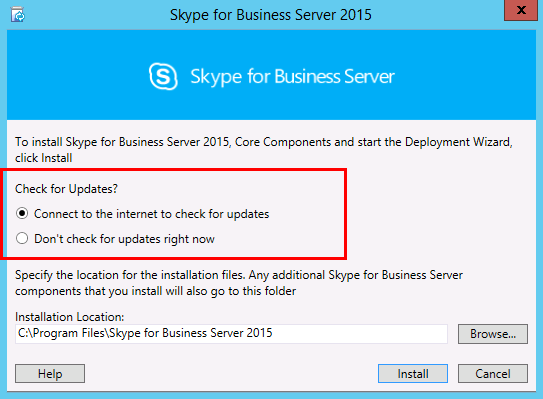

# Установка Skype для бизнеса Server на серверах топологии
 
**Сводка:** Узнайте, как установить Skype для бизнеса Server компонентов системы на каждом сервере топологии. Скачайте бесплатную пробную Skype для бизнеса Server из [Центра оценки Майкрософт.](https://www.microsoft.com/evalcenter/evaluate-skype-for-business-server)
  
После загрузки топологии в Центральный магазин управления и Active Directory известно, какие серверы будут выполнять роли, необходимо установить систему Skype для бизнеса Server на каждом из серверов топологии. Вы можете сделать шаги от 1 до 5 в любом порядке. Однако необходимо сделать шаги 6, 7 и 8 в порядке и после шагов 1-5, как описано на схеме. Установка системы Skype для бизнеса Server является шагом 7 из 8.
  

  
## Установка Skype для бизнеса Server системы

После публикации топологии можно установить Skype для бизнеса Server на каждом сервере топологии. В этом разделе вы можете Skype для бизнеса Server и настройку ролей сервера для пула переднего плана и всех ролей сервера, расположенных с серверами переднего плана. Чтобы установить и настроить роли сервера, вы запустите мастер развертывания Skype для бизнеса Server на каждом компьютере, на котором устанавливается роль сервера. Мастер развертывания используется для выполнения всех четырех этапов развертывания, включая установку локального магазина конфигурации, установку серверов переднего конца, настройку сертификатов и запуск служб.
  
> [!IMPORTANT]
> Для завершения и публикации топологии необходимо использовать topology Builder, чтобы установить Skype для бизнеса Server на серверах. 
  
> [!NOTE]
> Эта процедура должна быть завершена для всех серверов топологии. 
  
> [!CAUTION]
> После установки Skype для бизнеса Server на переднем конечном сервере при первом запуске служб необходимо убедиться, что Windows брандмауэрная служба запущена на сервере. 
  
> [!CAUTION]
> Прежде чем следовать этим шагам, убедитесь, что вы вошли на сервер с учетной записью пользователя домена, которая является локальным администратором и членом группы RTCUniversalServerAdmins. 
  
> [!NOTE]
> Если вы еще не Skype для бизнеса Server на этом сервере, вам будет предложено установить диск и путь для установки. Это обеспечивает возможность установки на диск, помимо системного диска, если это требуется организации, или если у вас есть проблемы с пространством. Вы можете изменить путь расположения установки для Skype для бизнеса Server файлов в диалоговом окне **Установки** на новый доступный диск. Если установить файлы установки на этот путь, включая OCSCore.msi, остальные Skype для бизнеса Server будут развернуты там же.
  
> [!IMPORTANT]
> Перед началом установки убедитесь, что Windows Server обновлен с помощью Windows Update. 
  

  
### Установка Skype для бизнеса Server системы

1. Вставьте Skype для бизнеса Server установки. Если установка не начинается автоматически, дважды нажмите кнопку **Установка**.
    
2. Носители установки требуют Microsoft Visual C++ для запуска. Диалоговое окно всплывет с вопросом, хотите ли вы установить его. Нажмите **кнопку Да.**
    
3. Внимательно просмотрите лицензионный договор, и если вы согласны, выберите я **принимаю** условия лицензионного соглашения и нажмите **кнопку ОК**. 
    
4. Smart Setup — это функция в Skype для бизнеса Server, где можно подключиться к Интернету для проверки обновлений из Microsoft Update (MU) во время процесса установки, как показано на рисунке. Это обеспечивает лучший опыт, убедившись, что у вас есть самые последние обновления для продукта. Щелкните **Установите,** чтобы приступить к установке.
    
    > [!NOTE]
    > Многие организации Windows Server Update Services (WSUS), развернутые в корпоративных средах. WSUS позволяет администраторам полностью управлять распространением обновлений, которые выпускаются с помощью Microsoft Update на компьютеры в их сети. В рамках выпуска накопительного обновления 1 Skype для бизнеса Server для работы с WSUS для smart setup. Клиенты с WSUS, которые развертывают Skype для бизнеса Server в первый раз или обновляются из среды Lync Server 2013 с помощью функции обновления In-Place, будут иметь smart setup fetching Skype для Windows обновлений из WSUS в отличие от получения обновлений из MU. Клиентам, желающим использовать smart Setup, необходимо запустить SmartSetupWithWSUS.psq на всех компьютерах перед запуском Setup.exe. 
  
     
  
5. На странице Мастер развертывания нажмите **кнопку Установить** или обновить Skype для бизнеса Server system .
    
6. Выполните процедуры в следующих процедурах, после их завершения нажмите **кнопку Выход,** чтобы закрыть мастер развертывания. Повторите процедуры для каждого переднего сервера в пуле.
    
### Шаг 1. Установка локального магазина конфигурации

1. Просмотрите необходимые условия, а затем нажмите **кнопку Выполнить** рядом с шагом **1: Установка локального магазина конфигурации**.
    
    > [!NOTE]
    > Локальный магазин конфигурации — это только для чтения копия Центрального магазина управления. В развертывании выпуск Standard центр управления создается с помощью локальной копии SQL Server Express Edition на переднем сервере. Это происходит при запуске процедуры Prepare First выпуск Standard Server. В развертывании выпуск Enterprise центр управления создается при публикации топологии, включаемой выпуск Enterprise переднего выпуск Enterprise. 
  
2. На странице **Установите локальный магазин** конфигурации убедитесь, что выбрана опция **Get directly from the Central Management Store,** а затем нажмите **кнопку Далее**.
    
    SQL Server Express Выпуск устанавливается на локальном сервере. SQL Server Express Выпуск необходим для локального магазина конфигурации.
    
3. По окончании установки конфигурации локального сервера нажмите кнопку **Finish** (Готово).
    
### Шаг 2. Установка или удаление Skype для бизнеса Server компонентов

1. Просмотрите необходимые условия, а затем нажмите кнопку **Выполнить** рядом со этапом **2:** Установка или удаление Skype для бизнеса Server компонентов .
    
2. На странице **Настройка Skype для бизнеса Server компонентов** нажмите **кнопку Далее,** чтобы настроить компоненты, как определено в опубликованной топологии.
    
3. На **странице "Команды выполнения"** отображается сводка команд и сведений об установке по мере установки. Когда это будет сделано, вы можете использовать список, чтобы выбрать журнал для просмотра, а затем нажмите **кнопку Просмотр журнала**.
    
4. После Skype для бизнеса Server установки компонентов и при необходимости вы просмотрели журналы, нажмите кнопку **Готово,** чтобы завершить этот шаг в установке.
    
    > [!NOTE]
    > Перезапустите сервер при запросе (что может произойти, если Windows необходимо установить рабочий стол). При повторном запуске компьютера необходимо выполнить эту процедуру (шаг 2. Установка Skype для бизнеса Server компонентов). 
  
    > [!NOTE]
    > Если установщик находит какие-либо предварительные условия, которые не были удовлетворены, вы будете уведомлены сообщением "Обязательное не удовлетворены", как показано на рисунке. Удовлетворите необходимое условие, а затем запустите эту процедуру (шаг 2. Установка или удаление Skype для бизнеса Server компонентов) снова. 
  
     
  
5. Убедитесь, что первые два шага завершены как ожидалось. Убедитесь, что есть зеленый знак со словом **Complete,** как показано на рисунке.
    
     
  
6. Запустите **Windows обновление,** чтобы проверить, есть ли какие-либо обновления после установки Skype для бизнеса Server компонентов.
    
### Шаг 3. Запрашивать, устанавливать или назначать сертификаты

1. Просмотрите необходимые условия и нажмите кнопку **Выполнить** рядом с шагом **3: запрос, установка или назначение сертификатов.**
    
    > [!NOTE]
    > Skype для бизнеса Server включает поддержку пакета SHA-2 (SHA-2 использует дайджест длиной 224, 256, 384 или 512 бит) алгоритмов дайджест-хаша и подписываемых алгоритмов для подключений от клиентов, работающих с операционными системами Windows 10, Windows 8, Windows 7, Windows Server 2012 R2, Windows Server 2012 или Windows Server 2008 R2. Для поддержки внешнего доступа с помощью пакета SHA-2 внешний сертификат выдан общедоступным ЦС, который также может выдавать сертификат с тем же дайджестом длины бита. 
  
    > [!IMPORTANT]
    > Выбор алгоритма хаш-дайджеста и подписи зависит от клиентов и серверов, которые будут использовать сертификат, а также от других компьютеров и устройств, с которыми будут общаться клиенты и серверы, которые также должны знать, как использовать алгоритмы, используемые в сертификате. Сведения о том, какие длины дайджеста поддерживаются в операционной системе и некоторых клиентских приложениях, см. в Windows [блога PKI - SHA2 и Windows.](/archive/blogs/pki/sha2-and-windows) 
  
    Для каждого выпуск Standard или переднего сервера требуется до четырех сертификатов: сертификат oAuthTokenIssuer, сертификат по умолчанию, внутренний веб-сертификат и веб-внешний сертификат. Однако можно запросить и назначить один сертификат по умолчанию с соответствующими альтернативными записями альтернативных имен субъекта, а также сертификатом oAuthTokenIssuer. Сведения о требованиях к сертификатам см. в материале [Environmental requirements for Skype для бизнеса Server](../../plan-your-deployment/requirements-for-your-environment/environmental-requirements.md) server [requirements for Skype для бизнеса Server 2019.](../../../SfBServer2019/plan/system-requirements.md)
    
    > [!IMPORTANT]
    > В следующей процедуре описывается настройка сертификатов из внутреннего центра сертификатов Active Directory Certificate Services. 
  
2. На странице **Мастер сертификатов** щелкните **Запрос**.
    
3. На странице **Запрос сертификата** заполните соответствующие данные, включая выбор домена SIP и нажмите кнопку **Далее**.
    
4. На странице **Delayed or Immediate Requests** (Отложенные или немедленные запросы) вы можете принять используемый по умолчанию параметр **Send the request immediately to an online certification authority** (Немедленно отправить запрос в локальный центр сертификации), нажав кнопку **Next** (Далее). В случае выбора этого параметра должен быть доступен внутренний центр сертификации с автоматической регистрацией по сети. Если вы выбираете задержку запроса, отображается запрос на ввод имени и расположения для сохранения файла запроса на сертификат. Запрос на сертификат должен быть представлен и обработан центром сертификации внутри вашей организации или общим центром сертификации. После этого вам необходимо импортировать ответ сертификата и назначить его подходящей роли сертификата.
    
5. На странице Выбор центра сертификации **(CA)** выберите ЦС из списка, обнаруженного в параметре среды, а затем выберите известный (посредством регистрации в службе домена Active Directory) ca из списка.  Либо выберите параметр **Указать другой центр сертификации**, введите в поле имя другого центра сертификации и нажмите кнопку **Далее**.
    
6. На странице **Certificate Authority Account** (Учетная запись центра сертификации) требуется ввести учетные данные для запроса сертификата и обработки этого запроса на сертификат в центре сертификации. Вам следовало заранее узнать, требуются ли имя пользователя и пароль для запроса сертификата. Администратор ЦС будет иметь необходимые сведения и может оказать вам помощь в этом шаге. Если вам необходимо указать альтернативные сертификаты, установите флажок, укажите имя пользователя и пароль в текстовых полях и нажмите кнопку **Next** (Далее).
    
7. На странице **Specify Alternate Certificate Template** (Указание альтернативного шаблона сертификата) нажмите кнопку **Next** (Далее), чтобы использовать шаблон веб-сервера по умолчанию.
    
    > [!NOTE]
    > Если ваша организация создала шаблон для использования в качестве альтернативы для шаблона веб-сервера по умолчанию, установите флажок, а затем введите имя альтернативного шаблона. Вам потребуется имя шаблона, заданное администратором центра сертификации. 
  
8. На странице **Имя и безопасность Параметры** укажите **удобное имя.** С помощью удобного имени можно быстро определить сертификат и цель. Если оставить поле пустым, имя создается автоматически. Задайте значение **Bit length** (Длина в битах) для ключа или примите значение по умолчанию, равное 2048 битам. Выберите **закрытый** ключ сертификата в качестве экспортируемого, если вы определите, что сертификат и закрытый ключ необходимо перенажать или скопировать в другие системы, а затем нажмите **кнопку Далее**.
    
    > [!NOTE]
    > Skype для бизнеса Server имеет минимальные требования к экспортируемой частной клавише. Одним из таких мест являются пограничные серверы в пуле, где служба проверки подлинности при ретрансляции мультимедиа использует копии этого сертификата вместо отдельных сертификатов для каждого из экземпляров пула. 
  
9. При необходимости укажите информацию  об организации на странице **Organization Information** (Сведения об организации) и нажмите кнопку **Next** (Далее).
    
10. При необходимости укажите информацию о местоположении на странице **Geographical Information** (Сведения о местоположении) и нажмите кнопку **Next** (Далее).
    
11. На странице **Subject Name / Subject Alternate Names** (Имя субъекта/альтернативные имена субъектов) просмотрите добавляемые альтернативные имена субъектов и нажмите кнопку **Next** (Далее).
    
12. На странице **SIP Domain setting** (Настройка домена SIP) выберите **SIP Domain** (Домен SIP) и нажмите кнопку **Next** (Далее).
    
13. На странице **Configure Additional Subject Alternate Names** (Настройка дополнительных альтернативных имен субъектов) добавьте все необходимые альтернативные имена субъектов, включая те из них, которые могут потребоваться в будущем для дополнительных доменов SIP, и нажмите кнопку **Next** (Далее).
    
14. На странице **Certificate Request Summary** (Сводка по запросу на сертификат) просмотрите сводные сведения. Если они верны, нажмите кнопку **Next** (Далее). Если необходимо внести исправления, нажмите кнопку **Back** (Назад) для перехода на соответствующую страницу.
    
15. На странице **Executing Commands** (Выполнение команд) нажмите кнопку **Next** (Далее).
    
16. На странице **Online Certificate Request Status** (Состояние веб-запроса на сертификат) просмотрите полученную информацию. Вы должны заметить, что сертификат был выдан и установлен в локальное хранилище сертификатов. Если сообщается, что оно было выдано и установлено, но оно не является допустимым, убедитесь, что корневой сертификат ЦС установлен в хранилище Доверенный корневой ЦС сервера. Сведения о получении сертификата доверенного корневого центра сертификации см. в документации по центру сертификации. Если вы хотите просмотреть полученный сертификат, щелкните элемент **View Certificate Details** (Просмотр сведений о сертификате). По умолчанию выбирается поле для назначения сертификата для Skype для бизнеса Server **использования** сертификата. Если вы хотите назначить сертификат вручную, снимите его и нажмите кнопку **Finish** (Готово).
    
17. Если вы очистили поле для присвоения **сертификата** Skype для бизнеса Server использования сертификата на предыдущей странице, вам будет представлена страница **Назначение сертификата.** Нажмите кнопку **Next** (Далее).
    
18. На странице **Certificate Store** (Хранилище сертификатов) выберите запрошенный вами сертификат. Если вы хотите просмотреть сертификат, щелкните элемент **View Certificate Details** (Просмотр сведений о сертификате), а затем нажмите кнопку **Next** (Далее).
    
    > [!NOTE]
    > Если на **странице Состояние** запроса сертификата в Интернете сообщалось о проблеме с сертификатом, например сертификатом, просмотреть фактический сертификат для помощи в решении проблемы. Две конкретные проблемы, из-за которых сертификат может быть недостоверным, — это ранее упомянутый отсутствующий сертификат Trusted Root CA и отсутствующий закрытый ключ, связанный с сертификатом. Чтобы устранить эти две проблемы, обратитесь к документации по ЦС.
  
19. На странице **Сводка** назначения сертификатов просмотрите сведения, представленные, чтобы убедиться, что это сертификат, который должен быть назначен, а затем нажмите **кнопку Далее**.
    
20. На странице **Executing Commands** (Выполнение команд) просмотрите выходные данные команды. Щелкните элемент **View Log** (Просмотреть журнал), если хотите ознакомиться с процессом назначения или были выданы ошибка или предупреждение. После завершения просмотра нажмите кнопку **Finish** (Готово).
    
21. На странице **Мастер** сертификатов убедитесь, что все службы имеют зеленый чек, чтобы указать, что всем был назначен сертификат, в том числе OAuthTokenIssuer, как показано на рисунке, а затем нажмите **кнопку Закрыть**.
    
     
  
    > [!TIP]
    > Если вы устанавливаете в лабораторной среде и только что настроили управление сертификатами с помощью служб сертификатов Active Directory, вам потребуется перезапустить как сервер, на который работают службы сертификатов, так и сервер переднего конца, прежде чем назначение сертификата может успешно пройти. 
  
    > [!TIP]
    >  Дополнительные сведения о сертификатах в службах сертификатов Active Directory см. в [справке Active Directory Certificate Services.](/windows/deployment/deploy-whats-new) 
  
### Шаг 4. Запуск служб

1. Просмотрите необходимые условия **для шага 4: Начните службы.**
    
2. Если это пул выпуск Enterprise с по крайней мере тремя серверами, Windows Fabric используется и вы должны использовать кодлет **Start-CsPool.** Если используется один сервер, что всегда выпуск Standard, то в музе используется кодлет **Start-CsWindowsService.** В этом примере мы используем выпуск Enterprise с тремя серверами переднего конца в пуле, откройте Skype для бизнеса Server управленческой оболочки и запустите команды **Start-CsPool,** как показано на рисунке.  Для всех остальных ролей, в том числе выпуск Standard сервера, необходимо использовать **Start-CsWindowsService.** Чтобы развернуть роли, не влияющую на роль переднего плана, см. документацию по этим определенным ролям.
    
     
  
3. После того как все службы будут успешно запущены, на странице **Выполнение команд** нажмите кнопку **Готово**.
    
    > [!IMPORTANT]
    > Команда запуска служб на сервере — это лучший способ сообщить о том, что службы фактически запущены. Однако он может не отражать фактическое состояние служб. Рекомендуется использовать состояние службы шаг **(необязательный)** для открытия консоли управления Microsoft (MMC) и подтверждения успешного начала работы служб, как показано на рисунке. Если служба Skype для бизнеса Server не запущена, вы можете щелкнуть правой кнопкой мыши эту службу в MMC, а затем нажмите кнопку **Начните**. 
  
     
