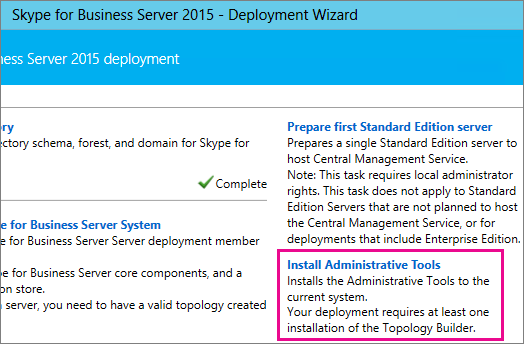
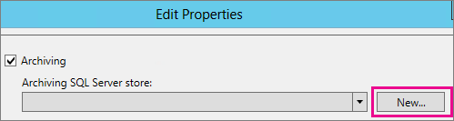

# <a name="upgrade-to-skype-for-business-server-2015"></a>Обновление до Skype для бизнеса Server 2015 г.
 
**Сводка:** Узнайте, как обновиться с Lync Server 2013 до Skype для бизнеса Server 2015. Скачайте бесплатную пробную Skype для бизнеса Server 2015 г. из [Центра оценки Майкрософт.](https://www.microsoft.com/evalcenter/evaluate-skype-for-business-server)
  
Используйте процедуры в этом документе для обновления с Lync Server 2013 до Skype для бизнеса Server 2015 с помощью Skype для бизнеса Server Topology Builder и новой функции In-Place Upgrade. Если вы хотите обновиться с Lync Server 2010 или Office Communications Server 2007 R2, см. в сообщении [Plan to upgrade to Skype для бизнеса Server 2015](../plan-your-deployment/upgrade.md).

> [!NOTE]
> Обновления на месте были доступны в Skype для бизнеса Server 2015 г., но больше не поддерживаются Skype для бизнеса Server 2019 г. Поддерживается совместное сосуществование, см. в Skype для бизнеса Server [2019](../../SfBServer2019/migration/migration-to-skype-for-business-server-2019.md) г. Дополнительные сведения.
  
## <a name="upgrade-from-lync-server-2013"></a>Обновление с Lync Server 2013

Обновление Lync Server 2013 до Skype для бизнеса Server 2015 включает установку необходимого программного обеспечения, использование Skype для бизнеса Server Topology Builder для обновления баз данных в пуле и Skype для бизнеса Server In-Place обновление на каждом из серверов, связанных с пулом. Чтобы завершить обновление, выполните восемь действий в этом разделе.
  
### <a name="before-you-begin"></a>Прежде чем начать

- Обзор [Плана обновления до Skype для бизнеса Server 2015](../plan-your-deployment/upgrade.md).
    
- Просмотрите требования к [серверу Skype для бизнеса Server 2015 г.](../plan-your-deployment/requirements-for-your-environment/server-requirements.md)
    
- [Установка необходимых условий для Skype для бизнеса Server 2015 г.](install/install-prerequisites.md)
    
- [Установка Skype для бизнеса Server 2015](install/install.md) .
    
### <a name="step-1-install-administrator-tools-and-download-topology"></a>Шаг 1. Установка средств администратора и топология загрузки

1. Подключение компьютер в топологии, где не установлен Lync OCSCore или любые другие компоненты Lync.
    
2. В Skype для бизнеса Server 2015 г. запуститеSetup.exeиз **OCS_Volume\Setup\AMD64**.  
    
3. Нажмите **Установить**. 
    
4. Принятие условий лицензионного соглашения.
    
5. В мастере развертывания щелкните **инструменты Install Administrator** и выполните действия по установке.
    
     
  
6. С экрана Windows начните открыть Skype для бизнеса Server топологию Builder.
    
7. Нажмите **кнопку Скачать топологию из существующего развертывания** и нажмите **кнопку Далее**.
    
8. Введите имя топологии и нажмите кнопку **Сохранить**.
    
9. Перейдите к расположению, где сохранили топологию, и сделайте копию топологии.
    
### <a name="step-2-upgrade-and-publish-topology-using-topology-builder"></a>Шаг 2. Обновление и публикация топологии с помощью topology Builder

Перед началом процесса обновления необходимо запустить все службы для пулов, которые планируется обновить. Это значит, что изменения топологии будут реплицированы в локализованную базу данных серверов пула.
  
> [!IMPORTANT]
>  Сохраните копию топологического файла перед обновлением. После обновления вы не сможете понизить рейтинг топологии.> Если ваши службы находятся на тех же серверах, что и базы данных, как и служба "Постоянный чат" на том же сервере, что и база данных "Постоянный чат", пропустите этот шаг и перейдите к шагу 4. После остановки служб запустите установку In-Place обновления на каждом сервере для обновления локальных баз данных.
  
> [!NOTE]
> Если топология имеет зеркальную базу данных, то при публикации топологии с помощью **Topology** Builder будут показываться как основные, так и зеркальные базы данных. Убедитесь, что все базы данных работают на основной и выберите только основной, а не зеркальный, при публикации топологии в противном случае вы увидите предупреждение после публикации топологии.
  
Выберите один из ниже вариантов обновления и публикации новой топологии с помощью Skype для бизнеса Server 2015 topology Builder. После завершения действий и публикации обновленной топологии переходить к шагу 3 в этом разделе.
  
#### <a name="option-1-upgrade-an-isolated-front-end-pool-and-associated-archiving-and-monitoring-stores"></a>Вариант 1. Обновление изолированного пула переднего конца и связанных с ними магазинов архива и мониторинга

Если в обновляемом пуле имеется зависимость магазина архивации и мониторинга, при использовании следующих действий также будет обновлен магазин архивации и мониторинга.
  
1. В Topology Builder щелкните правой кнопкой мыши пул Lync Server 2013, выберите обновление до **Skype для бизнеса Server 2015** г. и выполните следующие действия. 
    
     
  
2. В Topology Builder нажмите **кнопку Action**  >  **Publish топологию** или   >  **топологию**  >  **действий.** 
    
     
  
3. Во время публикации выберите установку базы данных в хранилище архива и мониторинга.
    
#### <a name="option-2-upgrade-front-end-pool-without-upgrading-archiving-and-monitoring-stores"></a>Вариант 2. Обновление пула переднего конца без обновления магазинов архива и мониторинга

При использовании следующих действий архива и мониторинга для выбранного пула отключены. После обновления в пуле не будут иметься хранилища архива и мониторинга.
  
1. В Topology Builder выберите пул Lync Server 2013, который необходимо обновить.
    
2. Удалите зависимость в хранилищах архивации и мониторинга Lync Server 2013. 
    
   - Перейдите к   >  **свойствам редактирования действий.**
    
   - Очистка **контрольного окна архива.**
    
     
  
   - Очистка **контрольного** окна.
    
     
  
3. Щелкните правой кнопкой мыши пул Lync Server 2013, выберите обновление до **Skype для бизнеса Server 2015** г. и выполните действия. 
    
     
  
4. В Topology Builder нажмите **кнопку Action**  >  **Publish топологию** или   >  **топологию**  >  **действий.** 
    
#### <a name="option-3-upgrade-front-end-pool-and-associated-it-to-new-skype-for-business-server-2015-archiving-and-monitoring-stores"></a>Вариант 3. Обновление пула переднего конца и его связывание с новыми хранилищами архива Skype для бизнеса Server 2015 г.

Если вы используете следующие действия, архивативная и мониторинговая система остановится в предыдущем магазине и запустится в созданном вами новом магазине. 
  
1. В Topology Builder выберите пул Lync Server 2013, который необходимо обновить. 
    
2. Удалите зависимость в хранилищах архивации и мониторинга Lync Server 2013. 
    
   - Перейдите к   >  **свойствам редактирования действий.**
    
   - Очистка **контрольного окна архива.**
    
     
  
   - Очистка **контрольного** окна.
    
     
  
3. Щелкните правой кнопкой мыши пул Lync Server 2013, выберите обновление до **Skype для бизнеса Server 2015** г. и выполните действия. 
    
     
  
4. Создайте новый SQL для архива. 
    
   - Выберите свойства пула **и**  >  **изменения действий.** 
    
   -  Выберите поле **архива.**
    
   - Нажмите кнопку **Создать**.
    
     
  
5. Создание нового SQL для мониторинга. 
    
   - Выберите свойства пула **и**  >  **изменения действий.** 
    
   -  Выберите **контрольный** окне Мониторинга.
    
   - Нажмите кнопку **Создать**.
    
     
  
6. В Topology Builder нажмите **кнопку Action**  >  **Publish топологию** или   >  **топологию**  >  **действий.** 
    
7. Во время публикации выберите установку базы данных в новом хранилище архива и мониторинга.
    
### <a name="step-3-wait-for-replication"></a>Шаг 3. Ожидание репликации

Дайте репликации некоторое время, чтобы опубликовать обновленную топологию для всех серверов в среде.
  
### <a name="step-4-stop-all-services-in-pool-to-be-upgraded"></a>Шаг 4. Остановка обновления всех служб в пуле

На каждом сервере, обслуживаемом пулом, который вы собираетесь обновить, запустите следующий cmdlet в PowerShell:
  
```powershell
Disable-CsComputer -Scorch
```

Рекомендуется использовать Disable-CsComputer, так как может потребоваться перезагрузка сервера во время In-Place обновления. Если вы используете Stop-CsWindowsService, некоторые службы могут автоматически перезапуститься после перезагрузки. Это может привести к In-Place обновления.
  
### <a name="step-5-upgrade-front-end-pools-and-non-front-end-pool-servers"></a>Шаг 5. Обновление пулов передней части и серверов пулов, не входных

> [!NOTE]
>  Перед обновлением установите все необходимые для Skype для бизнеса Server 2015 г. новые условия, включающие:> не менее 32 ГБ свободного пространства перед попыткой обновления. Кроме того, убедитесь, что диск является фиксированным локальным диском, не подключен USB или Firewire, форматируется с помощью файловой системы NTFS, не сжимается и не содержит файл страницы.> PowerShell версии 6.2.9200.0 или более поздней версии.> Последнее накопительное обновление Lync Server 2013 установлено.> SQL Server 2012 SP1 установлено.> Установленное ниже KB (установлено автоматически при использовании Microsoft Update): > Windows 2008 R2 -[KB2533623](https://support.microsoft.com/kb/2533623)> Windows Server 2012 -[KB2858668](https://support.microsoft.com/kb/2858668)> Windows Server 2012 R2 -[KB2982006](https://support.microsoft.com/kb/2982006)
  
Используйте обновление In-Place на каждом сервере для обновления пула переднего конца, пула edge, сервера-посредника и пула постоянных чатов.
  
1. На каждом сервере **запуститеSetup.exe** **из OCS_Volume\Setup\amd64** на Skype для бизнеса Server 2015.
    
2. Примите лицензионный договор и следуйте подсказкам для In-Place обновления.
    
3. Повторите эти действия для каждого сервера в пуле переднего конца и на каждом сервере пула, не входя в front end.
    
> [!NOTE]
> Возможно, вам будет предложено перезагрузать сервер во время In-Place обновления. Порядок. После перезагрузки обновление In-Place будет продолжено с того места, где оно было отключено. 
  
После успешного In-Place обновления вы увидите следующее сообщение.
  

  
### <a name="step-6-restart-services-on-all-upgraded-servers"></a>Шаг 6. Перезапуск служб на всех обновленных серверах

> [!NOTE]
> Перед перезапуском служб убедитесь, что %ProgramData%\WindowsFabric не существует на всех серверах переднего входа. Если она существует, удалите ее перед запуском служб. 
  
- После обновления всех серверов в пуле front End перезапустите службы с помощью следующей команды PowerShell: 
    
  ```powershell
  Start-CsPool
  ```

    > [!NOTE]
    > Если перед запуском In-Place обновления уже требуется отложенная перезагрузка системы, In-Place обновление не будет просить вас перезагрузаться в конце установки. Это приведет к тому, что некоторые исключения сборки будут выброшены на первый сервер переднего Start-CSPool. Чтобы устранить эти ошибки, перезагружай все серверы в пуле и снова запустите его. 
  
- На серверах пула, не входя в front end, перезапустите службы с помощью следующей команды:
    
  ```powershell
  Start-CsWindowsService
  ```

После нажатия **ОК** на In-Place обновления вы увидите следующее напоминание, чтобы завершить этот шаг.
  

  
### <a name="step-7-verify-skype-for-business-functionality-works"></a>Шаг 7. Проверка Skype для бизнеса работает

Чтобы убедиться, что обновление было успешным, для обновленного пула проверьте Skype для бизнеса, чтобы функциональность работала как ожидалось. 
  
### <a name="step-8-upgrade-secondary-pools"></a>Шаг 8. Обновление вторичных пулов

Повторите действия в этом разделе, чтобы обновить все дополнительные пулы, которые у вас есть в среде.
  
## <a name="troubleshoot-issues-with-the-in-place-upgrade"></a>Устранение неполадок с In-Place обновления

Если обновление In-Place не удается, может возникнуть сообщение, аналогичное следующему изображению. 
  

  
Просмотрите полное сообщение в нижней части страницы, чтобы устранить проблему. Нажмите **кнопку Просмотр журналов,** чтобы получить более подробные данные.
  
Если обновление In-Place сбой при  проверке готовности к обновлению или установке отсутствующих предпосылок, убедитесь, что на сервере установлены все последние Windows Server, Lync Server и SQL Server применены обновления, а также установлено все необходимое программное обеспечение и роли. Список необходимых требований см. в перечне требований к серверу для [Skype для бизнеса Server 2015](../plan-your-deployment/requirements-for-your-environment/server-requirements.md) г., а также в Skype для бизнеса Server [2015](install/install-prerequisites.md)г. .
  
## <a name="see-also"></a>См. также

[План обновления до Skype для бизнеса Server 2015 г.](../plan-your-deployment/upgrade.md)
  
[Требования к серверу для Skype для бизнеса Server 2015 г.](../plan-your-deployment/requirements-for-your-environment/server-requirements.md)
  
[Установка необходимых условий для Skype для бизнеса Server 2015 г.](install/install-prerequisites.md)
  
[Установка Skype для бизнеса Server 2015 г.](install/install.md)
