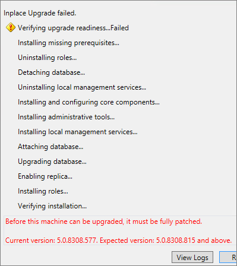

# <a name="upgrade-to-skype-for-business-server-2015"></a>Обновление до Skype для бизнеса Server 2015
 
**Сводка:** Узнайте, как обновление с Lync Server 2013 Скайп для Business Server 2015. Загрузите бесплатную пробную версию программы Скайп для Business Server 2015 [Центр оценки Microsoft](https://www.microsoft.com/evalcenter/evaluate-skype-for-business-server).
  
Используйте процедуры, описанные в этом документе обновления Lync Server 2013 до Скайп для Business Server 2015 с помощью Скайп for Business Server Topology Builder и новая функция обновление на месте. Если требуется обновление с Lync Server 2010 или Office Communications Server 2007 R2, ознакомьтесь со [Планирование обновления до Скайп для Business Server 2015](../plan-your-deployment/upgrade.md).
  
## <a name="upgrade-from-lync-server-2013"></a>Обновление с Lync Server 2013

Обновление Lync Server 2013 до Скайп для Business Server 2015 включает в себя Установка необходимого программного обеспечения, с помощью Скайп для Business Server Topology Builder для обновления баз данных в пуле и использование Скайп для обновления на месте Business Server на каждом серверы, связанных с пулом. В этом разделе приведена процедура обновления, состоящая из восьми шагов.
  
### <a name="before-you-begin"></a>До начала работы

- Просмотрите [Планирование обновления до Скайп для Business Server 2015](../plan-your-deployment/upgrade.md).
    
- Обзор [требований для сервера для Скайп для Business Server 2015](../plan-your-deployment/requirements-for-your-environment/server-requirements.md).
    
- [Установка необходимых компонентов для Скайп для Business Server 2015](install/install-prerequisites.md) .
    
- [Установка Скайп для Business Server 2015](install/install.md) .
    
### <a name="step-1-install-administrator-tools-and-download-topology"></a>Шаг 1. Установка средств администрирования и загрузка топологии

1. Подключитесь к компьютеру в топологии, для которого не Lync OCSCore или другие компоненты Lync, установленные.
    
2. Запустите **Setup.exe** из **OCS_Volume\Setup\AMD64**Скайп для Business Server 2015 установочного носителя. 
    
3. Нажмите **Установить**. 
    
4. Примите условия лицензионного соглашения.
    
5. В мастере развертывания нажмите **Установить средства администрирования** и выполните процедуру установки.
    
     
  
6. На экране запуска Windows откройте Скайп для Business Server Topology Builder.
    
7. Выберите **Загрузить топологию из существующего развертывания** и нажмите **Далее**.
    
8. Введите имя топологии и нажмите **Сохранить**.
    
9. Перейдите в папку, где сохранена топология, и создайте ее копию.
    
### <a name="step-2-upgrade-and-publish-topology-using-topology-builder"></a>Шаг 2. Обновление и публикация топологии с помощью построителя топологий

Перед началом процесса обновления необходимо запустить все службы для пулов, которые планируется обновить. Это обеспечит репликацию изменений топологии в локальную базу данных серверов в пуле.
  
> [!IMPORTANT]
>  Перед обновлением сохраните копию топологии. После обновления, вы не сможете для возврата к предыдущей версии топология. > Если вашей службы на тех же серверах как баз данных, как служба — на том же сервере базы данных сохраняемого чата Persistent Chat пропустить этот этап и перейдите к шагу 4. После остановки служб запустите на каждом сервере настройку обновления на месте для обновления локальных баз данных.
  
> [!NOTE]
> Если топология имеет внутреннюю зеркальную базу данных, тогда **при публикации топологии** с помощью построителя топологий отобразятся и основная и зеркальная базы данных. Убедитесь, что все базы данных запущены на основном сервере, а при публикации топологии выберите только основную, а не зеркальную базу данных. В противном случае после публикации топологии отобразится предупреждение.
  
Выберите один из параметров ниже, чтобы обновить и публикации новой топологии с помощью Скайп for Business Server 2015 Topology Builder. После выполнения указанных шагов и публикации обновленной топологии перейдите к шагу 3 в этом разделе.
  
#### <a name="option-1-upgrade-an-isolated-front-end-pool-and-associated-archiving-and-monitoring-stores"></a>Вариант 1. Обновление изолированного интерфейсного пула и связанных с ним хранилищ архивных данных и данных наблюдения

Если для обновляемого пула задана зависимость от хранилищ архивных данных и данных наблюдения, при выполнении следующих шагов эти хранилища также обновляются.
  
1. В построителе топологий щелкните правой кнопкой мыши пул Lync Server 2013, установите **обновление Скайп для Business Server 2015**и выполните действия, описанные. 
    
     
  
2. В построителе топологий выберите **Действие** > **опубликовать топологию** или **Действие** > **топологии** > **Опубликовать**. 
    
     
  
3. В процессе публикации выберите установку базу данных в хранилищах архивных данных и данных наблюдения.
    
#### <a name="option-2-upgrade-front-end-pool-without-upgrading-archiving-and-monitoring-stores"></a>Вариант 2: Обновление интерфейсный пул без обновления архивирование и мониторинг хранилищ

При выполнении указанных ниже шагов для выбранного пула отключаются архивация и наблюдение. После обновления с пулом не будут связаны хранилища архивных данных и данных наблюдения.
  
1. В построителе топологий выберите пул Lync Server 2013, которую требуется обновить.
    
2. Удалите зависимость в Lync Server 2013 архивирование и мониторинг хранилища. 
    
   - Последовательно выберите пункты **Действие** > **Изменить свойства**.
    
   - Снимите флажок **Архивация**.
    
     
  
   - Снимите флажок **Наблюдение**.
    
     
  
3. Щелкните правой кнопкой мыши пул Lync Server 2013, выберите **обновление Скайп для Business Server 2015**и следуйте инструкциям. 
    
     
  
4. В построителе топологий выберите **Действие** > **опубликовать топологию** или **Действие** > **топологии** > **Опубликовать**. 
    
#### <a name="option-3-upgrade-front-end-pool-and-associated-it-to-new-skype-for-business-server-2015-archiving-and-monitoring-stores"></a>Вариант 3: Обновления интерфейсного пула и связанные с новой Скайп для архивации 2015 Business Server и мониторинг хранилищ

При выполнении следующих шагов архивация и наблюдения останавливаются в прежних хранилищах и запускаются во вновь созданных хранилищах. 
  
1. В построителе топологий выберите пул Lync Server 2013, которую требуется обновить. 
    
2. Удалите зависимость в Lync Server 2013 архивирование и мониторинг хранилища. 
    
   - Последовательно выберите пункты **Действие** > **Изменить свойства**.
    
   - Снимите флажок **Архивация**.
    
     
  
   - Снимите флажок **Наблюдение**.
    
     
  
3. Щелкните правой кнопкой мыши пул Lync Server 2013, выберите **обновление Скайп для Business Server 2015**и следуйте инструкциям. 
    
     
  
4. Создайте новое хранилище SQL для архивации. 
    
   - Выберите пул, а также **Действие** > **Изменить свойства**. 
    
   -  Установите флажок **Архивация**.
    
   - Выберите **Создать**.
    
     
  
5. Создайте новое хранилище SQL для наблюдения. 
    
   - Выберите пул, а также **Действие** > **Изменить свойства**. 
    
   -  Установите флажок **Наблюдение**.
    
   - Выберите **Создать**.
    
     
  
6. В построителе топологий выберите **Действие** > **опубликовать топологию** или **Действие** > **топологии** > **Опубликовать**. 
    
7. В процессе публикации выберите установку базы данных в новое хранилище архивных данных и данных наблюдения.
    
### <a name="step-3-wait-for-replication"></a>Шаг 3. Ожидание репликации

Дождитесь публикации обновленной топологии на всех серверах в данной среде путем репликации.
  
### <a name="step-4-stop-all-services-in-pool-to-be-upgraded"></a>Шаг 4. Остановка всех служб в обновляемом пуле

На каждом сервере, который обслуживает пула, в котором нужно обновить, выполните следующий командлет в PowerShell:
  
```
Disable-CsComputer -Scorch
```

Рекомендуется использовать Disable-CsComputer, так как может потребоваться перезагрузка сервера во время процесса обновления на месте. В случае применения команды Stop-CsWindowsService возможен автоматический запуск некоторых служб после перезагрузки. Это может привести к сбою обновления на месте.
  
### <a name="step-5-upgrade-front-end-pools-and-non-front-end-pool-servers"></a>Шаг 5. Обновление интерфейсных пулов и серверов, не входящих в этот пул

> [!NOTE]
>  До обновления установите все новые компоненты, необходимые для Скайп для Business Server 2015 которые включают: > по крайней мере 32 ГБ свободного места на диске перед обновлением. Кроме того, убедитесь в том, что диск — это локальном жестком диске, не соединена с USB и Firewire, отформатированные с файловой системой NTFS, не сжимается и не содержит файла страницы. > PowerShell версии 6.2.9200.0 или более поздняя версия. > последние Lync Server 2013 Накопительное обновление. > SQL Server 2012 SP1. > следующие КБ установленные (установлены автоматически, если с помощью центра обновления Майкрософт): > Windows Server 2008 R2 -[KB2533623](https://support.microsoft.com/kb/2533623)> Windows Server 2012 -[KB2858668](https://support.microsoft.com/kb/2858668)> Windows Server 2012 R2 -[KB2982006](https://support.microsoft.com/kb/2982006)
  
Обновление на месте на каждом сервере для обновления используйте пула переднего плана, пограничного пула, сервер-посредник и пула Persistent Chat.
  
1. На каждом сервере запустите **Setup.exe** из **OCS_Volume\Setup\amd64** на Скайп для Business Server 2015 установочного носителя.
    
2. Примите условия лицензионного соглашения и следуйте инструкциям для обновления на месте.
    
3. Повторите эти шаги для каждого сервера в разделе пул переднего плана и на каждом сервере, не являющиеся переднего плана пула.
    
> [!NOTE]
> В процессе обновления на месте может появиться запрос на перезагрузку сервера. Подтвердите перезагрузку. После перезагрузки компьютера, от места, где будет обновление на месте. 
  
При успешном завершении обновления на месте отображается следующее сообщение.
  

  
### <a name="step-6-restart-services-on-all-upgraded-servers"></a>Шаг 6. Повторный запуск служб на всех обновленных серверах

> [!NOTE]
> Перед перезапуском службы, чтобы убедиться, что %ProgramData%\WindowsFabric не существует на всех серверах переднего плана. Если он существует, удалите его перед запуском служб. 
  
- После обновления всех серверов в пуле переднего плана, перезапустите службы с помощью следующей команды PowerShell: 
    
  ```
  Start-CsPool
  ```

    > [!NOTE]
    > Если к моменту запуска обновления на месте уже была потребность в обязательной перезагрузке системы, процесс обновления на месте не будет запрашивать выполнение перезагрузки в конце установки. Поэтому при попытке запустить службы с помощью командлета Start-CSPool первый сервер переднего плана получит ряд исключительных ситуаций. Для устранения этих ошибок перезагрузите все серверы в пуле и снова запустите командлет. 
  
- Снова запустите службы на серверах, не входящих в интерфейсный пул, с помощью следующей команды:
    
  ```
  Start-CsWindowsService
  ```

После нажатия кнопки **ОК** на странице обновления на месте отображается следующее напоминание о необходимости завершить этот шаг.
  

  
### <a name="step-7-verify-skype-for-business-functionality-works"></a>Шаг 7: Проверка Скайп для бизнеса функциональные возможности works

Чтобы убедиться в том, что обновление прошло успешно, для пула, в котором было выполнено обновление, тестирования Скайп для бизнеса, чтобы убедиться, что функция работает как надо. 
  
### <a name="step-8-upgrade-secondary-pools"></a>Шаг 8. Обновление дополнительных пулов

Повторите приведенные в этом разделе шаги для обновления всех дополнительных пулов в данной среде.
  
## <a name="troubleshoot-issues-with-the-in-place-upgrade"></a>Устранение неполадок при обновлении на месте

В случае сбоя обновления на месте может отображаться сообщение, подобное показанному на следующем рисунке. 
  

  
Просмотрите полное сообщение внизу страницы, содержащее указания по устранению неполадки. Для просмотра подробных сведений выберите **Просмотреть журналы**.
  
Если обновление на месте не удалось выполнить на **Готовность к обновлению проверка** или ** установка предварительные условия отсутствующий **, убедитесь, что на сервере есть последних Windows Server, Lync Server и установленными обновлениями SQL Server и все необходимое программное обеспечение и роли установить. Что необходимо список в разделе [требования к серверу для Скайп для Business Server 2015](../plan-your-deployment/requirements-for-your-environment/server-requirements.md) и [установить необходимые компоненты для Скайп для Business Server 2015](install/install-prerequisites.md).
  
## <a name="see-also"></a>См. также

[Планирование обновления до Скайп для Business Server 2015](../plan-your-deployment/upgrade.md)
  
[Требования к серверу для Скайп для Business Server 2015](../plan-your-deployment/requirements-for-your-environment/server-requirements.md)
  
[Установка необходимых компонентов для Скайп для Business Server 2015](install/install-prerequisites.md)
  
[Установка Скайп для Business Server 2015](install/install.md)