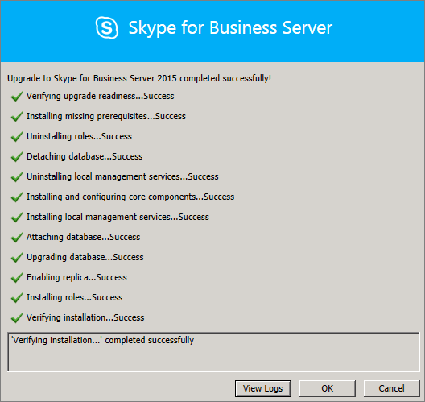

# <a name="upgrade-to-skype-for-business-server-2015"></a>Upgrade to Skype for Business Server 2015
 
**Сводка:** Сведения о том, как перейти с Lync Server 2013 на Skype для бизнеса Server 2015. Загрузите бесплатную пробную версию Skype для бизнеса Server 2015 в [центре оценки Майкрософт](https://www.microsoft.com/evalcenter/evaluate-skype-for-business-server).
  
Чтобы перейти с Lync Server 2013 на Skype для бизнеса Server 2015 с помощью построителя топологии Skype для бизнеса Server и новой функции обновления на месте, выполните действия, описанные в этом документе. Если вы хотите перейти с Lync Server 2010 или Office Communications Server 2007 R2, ознакомьтесь со сведениями о том, [как выполнить обновление до Skype для бизнеса Server 2015](../plan-your-deployment/upgrade.md).

> [!NOTE]
> Обновления на месте были выпущены в Skype для бизнеса Server 2015, но больше не поддерживаются в Skype для бизнеса Server 2019. Поддерживается параллельное сосуществование. Дополнительные сведения можно найти [в разделе Переход на Skype для бизнеса Server 2019](../../SfBServer2019/migration/migration-to-skype-for-business-server-2019.md) .
  
## <a name="upgrade-from-lync-server-2013"></a>Переход с Lync Server 2013

Обновление Lync Server 2013 до Skype для бизнеса Server 2015 включает установку необходимого программного обеспечения, использование построителя топологии Skype для бизнеса Server для обновления баз данных в пуле и использование обновления на месте в Skype для бизнеса Server серверы, связанные с пулом. В этом разделе приведена процедура обновления, состоящая из восьми шагов.
  
### <a name="before-you-begin"></a>До начала работы

- Просмотрите раздел [Plan to upgrade to Skype for Business Server 2015](../plan-your-deployment/upgrade.md).
    
- Ознакомьтесь с [требованиями к серверу в Skype для бизнеса Server 2015](../plan-your-deployment/requirements-for-your-environment/server-requirements.md).
    
- [Установите необходимые требования для Skype для бизнеса Server 2015](install/install-prerequisites.md) .
    
- [Установите Skype для бизнеса Server 2015](install/install.md) .
    
### <a name="step-1-install-administrator-tools-and-download-topology"></a>Шаг 1. Установка средств администрирования и загрузка топологии

1. Подключитесь к компьютеру в топологии, на которой не установлены Lync Окскоре или другие компоненты Lync.
    
2. На установочном носителе Skype для бизнеса Server 2015 запустите **файл Setup. exe** из **OCS_Volume \setup\amd64**. 
    
3. Нажмите **Установить**. 
    
4. Примите условия лицензионного соглашения.
    
5. В мастере развертывания нажмите **Установить средства администрирования** и выполните процедуру установки.
    
     
  
6. На начальном экране Windows откройте построитель топологии Skype для бизнеса Server.
    
7. Выберите **Загрузить топологию из существующего развертывания** и нажмите **Далее**.
    
8. Введите имя топологии и нажмите **Сохранить**.
    
9. Перейдите в папку, где сохранена топология, и создайте ее копию.
    
### <a name="step-2-upgrade-and-publish-topology-using-topology-builder"></a>Шаг 2. Обновление и публикация топологии с помощью построителя топологий

Прежде чем начать процесс обновления, для пулов, которые планируется обновить, должны быть запущены все службы. Это обеспечит репликацию изменений топологии в локальную базу данных серверов в пуле.
  
> [!IMPORTANT]
>  Перед обновлением сохраните копию топологии. После обновления вы не сможете понизить уровень топологии. > если ваши службы находятся на том же сервере, что и базы данных, например, служба сохраняемого чата находится на том же компьютере, что и база данных для работы с сохраняемым чат, пропустите этот шаг и перейдите к действию 4. После остановки служб запустите на каждом сервере настройку обновления на месте для обновления локальных баз данных.
  
> [!NOTE]
> Если топология имеет внутреннюю зеркальную базу данных, тогда **при публикации топологии** с помощью построителя топологий отобразятся и основная и зеркальная базы данных. Убедитесь, что все базы данных запущены на основном сервере, а при публикации топологии выберите только основную, а не зеркальную базу данных. В противном случае после публикации топологии отобразится предупреждение.
  
Выберите один из вариантов ниже, чтобы обновить и опубликовать новую топологию с помощью построителя топологии Skype для бизнеса Server 2015. После выполнения указанных шагов и публикации обновленной топологии перейдите к шагу 3 в этом разделе.
  
#### <a name="option-1-upgrade-an-isolated-front-end-pool-and-associated-archiving-and-monitoring-stores"></a>Вариант 1. Обновление изолированного интерфейсного пула и связанных с ним хранилищ архивных данных и данных наблюдения

Если для обновляемого пула задана зависимость от хранилищ архивных данных и данных наблюдения, при выполнении следующих шагов эти хранилища также обновляются.
  
1. В построителе топологии щелкните правой кнопкой мыши пул Lync Server 2013, выберите команду **Обновить до Skype для бизнеса Server 2015**и следуйте инструкциям. 
    
     
  
2. В построителе топологии щелкните**топология публикации** **действий** > или**опубликовать****топологию** >  **действия** > . 
    
     
  
3. В процессе публикации выберите установку базу данных в хранилищах архивных данных и данных наблюдения.
    
#### <a name="option-2-upgrade-front-end-pool-without-upgrading-archiving-and-monitoring-stores"></a>Вариант 2: Обновление пула переднего плана без обновления архивации и наблюдения за хранилищами

При выполнении указанных ниже шагов для выбранного пула отключаются архивация и наблюдение. После обновления с пулом не будут связаны хранилища архивных данных и данных наблюдения.
  
1. В построителе топологии выберите пул Lync Server 2013, который вы хотите обновить.
    
2. Удалите зависимость с сохранением и мониторингом хранилищ в Lync Server 2013. 
    
   - Перейдите к разделу**изменение свойств** **действия** > .
    
   - Снимите флажок **Архивация**.
    
     
  
   - Снимите флажок **Наблюдение**.
    
     
  
3. Щелкните правой кнопкой мыши пул Lync Server 2013, выберите команду **Обновить до Skype для бизнеса Server 2015**и следуйте инструкциям. 
    
     
  
4. В построителе топологии щелкните**топология публикации** **действий** > или**опубликовать****топологию** >  **действия** > . 
    
#### <a name="option-3-upgrade-front-end-pool-and-associated-it-to-new-skype-for-business-server-2015-archiving-and-monitoring-stores"></a>Вариант 3: Обновление пула переднего плана и его связь с новым приложением Skype для бизнеса Server 2015 архивирование и мониторинг хранилищ

При выполнении следующих шагов архивация и наблюдения останавливаются в прежних хранилищах и запускаются во вновь созданных хранилищах. 
  
1. В построителе топологии выберите пул Lync Server 2013, который вы хотите обновить. 
    
2. Удалите зависимость с сохранением и мониторингом хранилищ в Lync Server 2013. 
    
   - Перейдите к разделу**изменение свойств** **действия** > .
    
   - Снимите флажок **Архивация**.
    
     
  
   - Снимите флажок **Наблюдение**.
    
     
  
3. Щелкните правой кнопкой мыши пул Lync Server 2013, выберите команду **Обновить до Skype для бизнеса Server 2015**и следуйте инструкциям. 
    
     
  
4. Создайте новое хранилище SQL для архивации. 
    
   - Выберите команду**изменить параметры**пула и **действия** > . 
    
   -  Установите флажок **Архивация**.
    
   - Выберите **Создать**.
    
     
  
5. Создайте новое хранилище SQL для наблюдения. 
    
   - Выберите команду**изменить параметры**пула и **действия** > . 
    
   -  Установите флажок **Наблюдение**.
    
   - Выберите **Создать**.
    
     
  
6. В построителе топологии щелкните**топология публикации** **действий** > или**опубликовать****топологию** >  **действия** > . 
    
7. В процессе публикации выберите установку базы данных в новое хранилище архивных данных и данных наблюдения.
    
### <a name="step-3-wait-for-replication"></a>Шаг 3. Ожидание репликации

Дождитесь публикации обновленной топологии на всех серверах в данной среде путем репликации.
  
### <a name="step-4-stop-all-services-in-pool-to-be-upgraded"></a>Шаг 4. Остановка всех служб в обновляемом пуле

На каждом сервере, обслуживающем пул, который вы собираетесь обновить, выполните в PowerShell следующий командлет:
  
```powershell
Disable-CsComputer -Scorch
```

Мы рекомендуем использовать Disable-Кскомпутер, так как вам может потребоваться перезагрузить сервер в процессе обновления на месте. В случае применения команды Stop-CsWindowsService возможен автоматический запуск некоторых служб после перезагрузки. Это может привести к сбою обновления на месте.
  
### <a name="step-5-upgrade-front-end-pools-and-non-front-end-pool-servers"></a>Шаг 5. Обновление интерфейсных пулов и серверов, не входящих в этот пул

> [!NOTE]
>  Перед обновлением установите все новые необходимые компоненты, необходимые для использования Skype для бизнеса Server 2015, который содержит: > не менее 32 ГБ свободного места перед обновлением. Кроме того, убедитесь, что диск является фиксированным локальным диском, а не подключен к USB или FireWire. приложение #a0 форматируется с помощью файловой системы NTFS и не содержит файла подкачки. > PowerShell версии 6.2.9200.0 или более поздней. > установленное обновление для Lync Server 2013. > SQL Server 2012 с пакетом обновления 1 (SP1). > (устанавливается автоматически при использовании Microsoft Update): > Windows Server 2008 R2-[KB2533623](https://support.microsoft.com/kb/2533623)> windows Server 2012-[KB2858668](https://support.microsoft.com/kb/2858668)> Windows Server 2012 R2- [KB2982006](https://support.microsoft.com/kb/2982006)
  
Используйте обновление на месте на каждом сервере для обновления пула переднего плана, пограничного пула, сервера-посредника и пула сохраняемого чата.
  
1. На каждом сервере запустите **файл Setup. exe** с **OCS_Volume \setup\amd64** на установочном носителе Skype для бизнеса Server 2015.
    
2. Принимайте условия лицензионного соглашения и следуйте инструкциям по обновлению на месте.
    
3. Повторите эти действия для каждого сервера в пуле переднего плана и на каждом сервере пула, не являющегося интерфейсом переднего плана.
    
> [!NOTE]
> В процессе обновления на месте может появиться запрос на перезагрузку сервера. Подтвердите перезагрузку. После перезагрузки обновление на месте продолжится с того места, с которого она была выключена. 
  
При успешном завершении обновления на месте отображается следующее сообщение.
  

  
### <a name="step-6-restart-services-on-all-upgraded-servers"></a>Шаг 6. Повторный запуск служб на всех обновленных серверах

> [!NOTE]
> Перед перезапуском служб убедитесь, что%Програмдата%\виндовсфабрик не существует на всех серверах переднего плана. If it exists, delete it before starting the services. 
  
- После обновления всех серверов в пуле переднего плана перезапустите службы, используя следующую команду PowerShell: 
    
  ```powershell
  Start-CsPool
  ```

    > [!NOTE]
    > Если к моменту запуска обновления на месте уже была потребность в обязательной перезагрузке системы, процесс обновления на месте не будет запрашивать выполнение перезагрузки в конце установки. Поэтому при попытке запустить службы с помощью командлета Start-CSPool первый сервер переднего плана получит ряд исключительных ситуаций. Для устранения этих ошибок перезагрузите все серверы в пуле и снова запустите командлет. 
  
- Снова запустите службы на серверах, не входящих в интерфейсный пул, с помощью следующей команды:
    
  ```powershell
  Start-CsWindowsService
  ```

После нажатия кнопки **ОК** на странице обновления на месте отображается следующее напоминание о необходимости завершить этот шаг.
  

  
### <a name="step-7-verify-skype-for-business-functionality-works"></a>Шаг 7: Проверка работы функции Skype для бизнеса

Чтобы убедиться в том, что обновление для обновленного пула прошло успешно, проверьте, правильно ли работают функции Skype для бизнеса. 
  
### <a name="step-8-upgrade-secondary-pools"></a>Шаг 8. Обновление дополнительных пулов

Повторите приведенные в этом разделе шаги для обновления всех дополнительных пулов в данной среде.
  
## <a name="troubleshoot-issues-with-the-in-place-upgrade"></a>Устранение неполадок при обновлении на месте

В случае сбоя обновления на месте может отображаться сообщение, подобное показанному на следующем рисунке. 
  

  
Просмотрите полное сообщение внизу страницы, содержащее указания по устранению неполадки. Для просмотра подробных сведений выберите **Просмотреть журналы**.
  
Если при обновлении на месте происходит сбой **проверки готовности к обновлению** или **установки недостающих необходимых компонентов**, убедитесь, что на сервере установлены все последние обновления Windows Server, Lync Server и SQL Server, а также все необходимое программное обеспечение и роли. Чтобы получить список необходимых данных, ознакомьтесь со сведениями [о серверных требованиях для Skype для бизнеса server 2015](../plan-your-deployment/requirements-for-your-environment/server-requirements.md) и [установите необходимые условия для Skype для бизнеса Server 2015](install/install-prerequisites.md).
  
## <a name="see-also"></a>См. также

[Планирование обновления до Skype для бизнеса Server 2015](../plan-your-deployment/upgrade.md)
  
[Server requirements for Skype for Business Server 2015](../plan-your-deployment/requirements-for-your-environment/server-requirements.md)
  
[Установка обязательных компонентов для Skype для бизнеса Server 2015](install/install-prerequisites.md)
  
[Установка Skype для бизнеса Server 2015](install/install.md)
