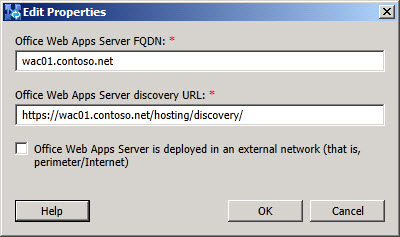

# Изменение параметров сервера Office Web Apps

Вы редактируете свойства настраиваемого Office сервера веб-приложений. Для редактирования доступны следующие свойства.

 **Office веб-приложения Server FQDN:** это свойство определяет полностью квалифицированное доменное имя сервера веб-приложений Office и должно соответствовать системе доменных имен (DNS) с записью A или AAAA (если используется IPv6).

 **Office веб-приложения** Сервер обнаружения : Единый локатор ресурсов (URL) для клиентского доступа к серверу веб-приложений Office, возможно, потребуется изменить этот адрес по умолчанию, если сервер находится в другой сетевой зоне, кроме внутренней сети для развертывания.

Установите флажок **Сервер Office Web Apps развернут во внешней сети**, если этот сервер развернут в сети периметра или в другой сетевой зоне за пределами внутреннего брандмауэра, разделяющего сеть периметра, сети без доверия и Интернет от внутреннего развертывания.

## См. также

[Компоненты и топологии для конференц-связи](/previous-versions/office/lync-server-2013/lync-server-2013-components-and-topologies-for-conferencing)