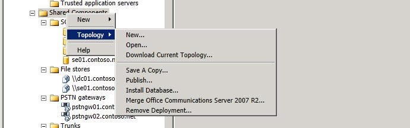

# Узел области общих компонентов
 
Щелкните правой кнопкой мыши общие **компоненты** в дереве иерархии построитель топологий, чтобы создать новые общие компоненты или получить доступ к параметрам уровня топологии.
  

  
Выберите элемент **Создать**, чтобы создать новое хранилище файлов, новый шлюз IP/ТСОП, новый сервер Office Web Apps, новое хранилище SQL Server или новую магистральную линию связи.
  
> [!NOTE]
> Ознакомьтесь с разделами справки для каждого из этих параметров. 
  

  
Выберите элемент **Топология** для доступа к параметрам, позволяющим открыть новый документ топологии. Откройте существующий документ топологии, скачайте текущую топологию из центрального банка управления, сохраните копию текущего документа топологии, опубликуйте текущий документ топологии, установите базу данных для создания настроенных конфигураций базы данных, объединяйте Office Communications Server 2007 R2 в текущее развертывание или удалите развертывание.
  

  

