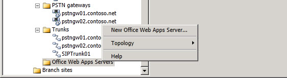

# Расширитель узла области применения сервера Office Web AppsOffice Web Apps Server Scope Node Expander
 
Вы можете щелкнуть правой кнопкой мыши на **серверах Office Web Apps** в построителе топологии, чтобы выполнить указанные ниже действия.You right click on **Office Web Apps Servers** in Topology Builder to perform the following:
  
- **Новый сервер Office Web Apps**: Запуск мастера **определения нового** сервера Office Web Apps, используемого для определения нового сервера Office Web Apps.**New Office Web Apps Server**: Starts the **Define New Office Web Apps Server** wizard used to define a new Office Web Apps Server.
    
В дополнение к новому параметру сервера Office Web Apps вы можете выполнять следующие общие задачи.In addition to the New Office Web Apps Server option, you can perform the following general tasks:
  

  
- **Топология**. Эта команда позволяет задать новую топологию, открыть существующую топологию, загрузить текущую топологию, сохранить копию топологии, опубликовать топологию, установить базу данных, выполнить объединение с компонентами прежних версий или удалить развертывание.**Topology**. You can use this option to define a new topology, open an existing topology, download the current topology, save a copy of the topology, publish the topology, install a database, merge components from previous versions, or remove the deployment.
    
- **Справка**. Эта команда обеспечивает доступ к справке по активному узлу.**Help**. You can use this option to access Help for the active node.
    

