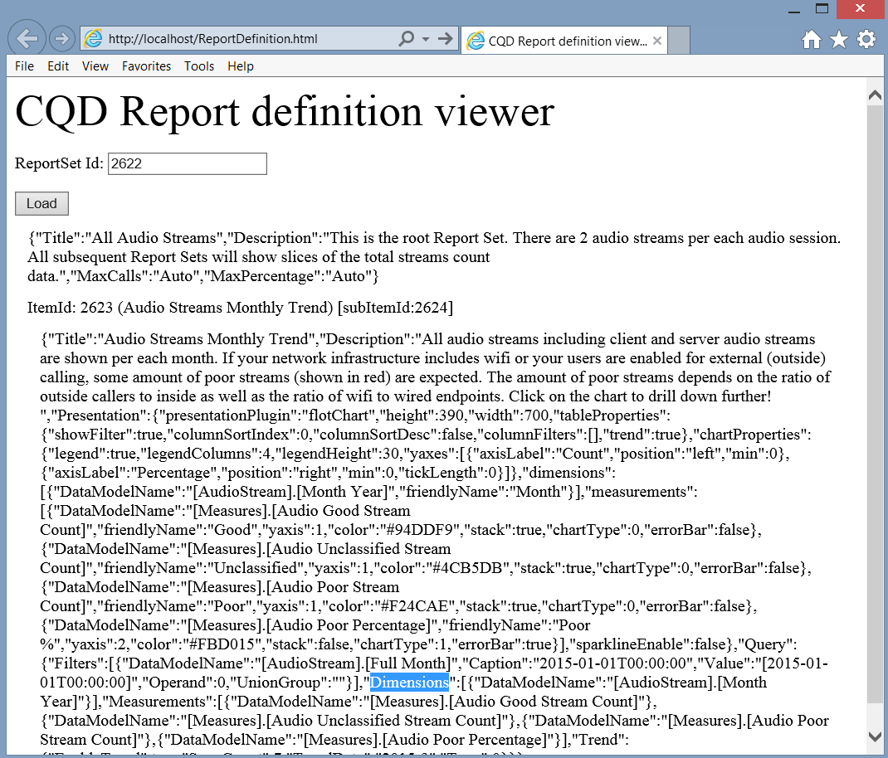

# <a name="cqd-development-samples"></a>Примеры разработки CQD

**Сводка:** Просмотрите примеры учебника и разработки для панели мониторинга качества вызовов. Панель мониторинга качества вызовов — это средство для Skype для бизнеса Server.

В этой статье приводится учебник и примеры разработки панели мониторинга качества вызовов (CQD).

## <a name="call-quality-dashboard-cqd-development-samples"></a>Примеры разработки панели мониторинга качества вызовов (CQD)

Руководство. Создание настраиваемой презентации отчета с помощью API службы данных cQD и службы репозиториев.

### <a name="introduction-to-cqd"></a>Введение в CQD

CQD предоставляет быстрый и простой доступ к агрегированной информации о качестве вызовов для локального Skype для бизнеса Server развертывания. CQD состоит из трех компонентов: базы данных архива QoE, Куба и портала. Портал является основным слоем презентации и может быть далее разделен на следующие три компонента:

1. Служба данных, доступная для пользователей с проверкой подлинности с помощью API данных для панели мониторинга качества вызовов [(CQD)](data-api.md)в Skype для бизнеса Server .

2. Служба репозиториев, доступная для пользователей с проверкой подлинности через API репозиториев для панели мониторинга качества вызовов [(CQD)](repository-api.md)в Skype для бизнеса Server .

3. Веб-портал, который является интерфейсом на основе HTML5, с которым пользователи CQD видят и взаимодействуют. Это доступно для пользователей с проверкой подлинности.

Отчеты, показанные на веб-портале, сгруппировали в "наборы отчетов". На рисунке показан набор отчетов с двумя отчетами. Каждый отчет на этой панели мониторинга ниже показывает результаты запросов по количеству хороших вызовов, плохих вызовов и плохого процента вызовов в течение нескольких месяцев, при этом применяются различные фильтры. 


CQD создается в соответствии с методологией качества вызовов (CQM), поэтому набор отчетов по умолчанию предназначен для согласования потока исследований, представленного CQM. Пользователи также могут изменять или создавать настраиваемые отчеты для удовлетворения своих потребностей. Однако, так как существует несколько способов визуализации данных, визуализация, предоставляемая CQD, может не полностью решить потребности каждого пользователя. В таких ситуациях пользователь может использовать API-интерфейсы данных и API репозиториев для создания пользовательских страниц отчетов. В этом руководстве мы проявим ряд примеров.

### <a name="how-the-dashboard-consumes-the-data-service"></a>Как панель мониторинга потребляет службу данных

При переходе на сайт CQD (например, набор отчетов и соответствующие отчеты для авторизованного и авторизованного пользователя будут извлечены из службы репозиториев. http://localhost/cqd) Полный URL-адрес будет построен из ID заданного отчета и в течение года (ID набора отчетов — это номер в разделе "/#/" в URL-адресе, и по умолчанию текущий месяц будет задан в конце ID-набора отчетов после среза). Определения отчетов хранятся в формате JSON и при извлечении из службы репозиториев будут использоваться в качестве ввода в службу данных. Служба данных создает запросы многомерных выражений (MDX) на основе ввода, а затем запустите эти запросы MDX в кубе для получения данных для каждого отчета. 

### <a name="building-customized-reports"></a>Создание настраиваемых отчетов

CQD уже обладает большой гибкостью в настройке отчетов, но могут возникнуть ситуации, когда пользователям может потребоваться агрегировать данные в нескольких отчетах, созданных в CQD. Например, может быть необходимо создать отчет, который показывает неудовлетворительные проценты вызовов всех возможных комбинаций проводных вызовов в таблице (результат, например рисунок):


С помощью портала, предоставленного CQD, пользователю придется переходить к нескольким отчетам, чтобы извлечь и записать плохой процент вызовов для каждого из них, что может быть трудоемким, если существует много точек данных, которые необходимо собрать. API данных предоставляют пользователям программный способ для этого, путем искания данных из службы данных (например, с помощью вызовов AJAX). 

 **Пример 1. Простой пример отчета**

Сначала рассмотрим простой пример. Если мы хотим показать звуковой хороший поток и количество плохих аудиопотоков февраля 2015 г. на htmL-странице, например на рисунке:


Нам необходимо отправить вызов в службу данных с надлежащими параметрами и показать результаты запроса в таблице HTML. Ниже приводится пример кода JavaScript:

```javascript        
$($.fn.freeFormReport = function (queries, urlApi, presentation) {
            var query = {
                Dimensions: [{ DataModelName: '[StartDate].[Month]' }],
                Filters: [{
                    DataModelName: '[StartDate].[Month]',
                    Value: '[2015-02-01T00:00:00]',
                    Operand: 0
                }],
                Measurements:
                    [{ DataModelName: '[Measures].[Audio Good Streams JPDR Count]' },
                     { DataModelName: '[Measures].[Audio Poor Streams JPDR Count]' },]
            };            

            $.ajax({
                url: 'http://localhost/QoEDataService/RunQuery',
                data: JSON.stringify(query),
                type: 'POST',
                async: true,
                contentType: 'application/json;charset=utf-8',
                success: function (data) {
                    //This is the jQuery syntax for document.GetElementById()
                    $('#AudioGoodStreamsJPDRCount').html(data.DataResult[0][1]);
                    $('#AudioPoorStreamsJPDRCount').html(data.DataResult[0][2]);
                }
                error: function (error) {
                    alert('Error getting data, check that the data service is running and that the URL is correct.');
           }
            });
        });
```

Этот пример можно далее деконструированы в три этапа:

1. Построение запроса (в примере это определяется в переменной "запрос"). Запрос определяется как объект JSON, который включает следующие данные:

   а. Нуль или больше размеров. Каждое измерение указывается dataModelName.

   Б. Нулевой или более фильтров. Каждый фильтр имеет:

   - DataModelName (измерение, которое будет иметь набор фильтров).

   - Значение (значение, которое будет сравниваться с операндом).

   - Operand (тип сравнения, 0 означает "Равный").

     c. Одно или несколько измерений.

2. Отправка запроса в службу данных по вызову AJAX. Необходимо упросить следующие параметры запроса:

   а. url (который должен быть http://[ServerName]/QoEDataService/RunQuery).

   Б. данных (это строковая репрезентация объекта JSON, определенного в переменной "запрос"). Служба данных возвращает результаты запроса в качестве параметра функции обратного вызова для успешного выполнения.

   c. тип (для QoEDataService RunQuery принимает только запросы "POST").

   d. async (флаг, указывающий, должен ли вызов AJAX синхронным или асинхронным).

   e. contentType (должно быть "application/json").

   е) успех (функция обратного вызова при успешном завершении вызова AJAX).

   ж. ошибка (функция обработки ошибок при сбой вызовов AJAX).

3. Поместите данные в элементы div в HTML (в примере кода это делается с помощью анонимного вызова функции после успешного завершения запроса AJAX).

Добавление кода JavaScript на страницу HTML, на странице будет показан отчет, похожий на отчет, показанный на рисунке. Полный html:

```javascript
<!DOCTYPE html>
<html xmlns="http://www.w3.org/1999/xhtml">
<head>
</head>
<body>
    <script src="OpenSourceSoftware/Scripts/jquery-2.1.1.js"></script>

    <script>
        $($.fn.freeFormReport = function (queries, urlApi, presentation) {

            var query = {
                Dimensions: [{ DataModelName: '[StartDate].[Month]' }],
                Filters: [{
                    DataModelName: '[StartDate].[Month]',
                    Value: '[2015-02-01T00:00:00]',
                    Operand: 0
                }],
                Measurements:
                    [{ DataModelName: '[Measures].[Audio Good Streams JPDR Count]' },
                     { DataModelName: '[Measures].[Audio Poor Streams JPDR Count]' },]
            };            

            $.ajax({
                url: 'http://localhost/QoEDataService/RunQuery',
                data: JSON.stringify(query),
                type: 'POST',
                async: true,
                contentType: 'application/json;charset=utf-8',
                success: function (data) {
                    //This is the jQuery syntax for document.GetElementById()
                    $('#AudioGoodStreamsJPDRCount').html(data.DataResult[0][1]);
                    $('#AudioPoorStreamsJPDRCount').html(data.DataResult[0][2]);
                }
                error: function (error) {
                    alert('Error getting data, check that the data service is running and that the URL is correct.');
           }

            });
        });
    </script>
    <table border="1">
        <tr>
            <td></td>
            <td><div>Audio Good Streams JPDR Count</div></td>
            <td><div>Audio Poor Streams JPDR Count</div></td>
        </tr>
        <tr>
            <td>February</td>
            <td><div id="AudioGoodStreamsJPDRCount"></div></td>
            <td><div id="AudioPoorStreamsJPDRCount"></div></td>
        </tr>
    </table>
</body>
</html>
```

До сих пор отчет по-прежнему очень прост. Пользователь может добавить дополнительные измерения, размеры или фильтры для настройки отчета. Например, если вы хотите показать плохой процент вызовов AppSharing, необходимо добавить новое измерение относительно AppSharing. Если вы хотите показать все вызовы TCP v.s. Вызовы UDP, необходимо добавить новое измерение, касающееся типа транспорта. Если вы хотите показать количество плохих вызовов в определенном здании, необходимо добавить новый фильтр, чтобы выбрать вызовы в это здание и из него.

 **Пример 2. Пример определения отчета**

При составлении запроса может возникнуть трудности с написанием полного списка измерений/измерений/фильтров и их соответствующих значений. В этом случае можно перейти на портал, создать отчет с помощью редактора отчета и просмотреть строку JSON определения отчета, а затем скопировать определение в настраиваемый отчет. 

В этом примере мы создадим веб-страницу, похожую на страницу, показанную на рисунке, на которой пользователь может ввести ID любого существующего набора отчетов (или отчетов) и показать определение набора отчетов или отчета на веб-странице. Затем пользователь может подключить строку JSON каждого отчета к коду, аналогичному тому, который показан в примере 1, и создать любой настраиваемый отчет, желаемый пользователем. 



Чтобы создать средство просмотра определения отчетов, необходимо отправить вызовы в службу репозиториев, чтобы получить представления строк JSON определений каждого набора отчетов, которые нам нужны. API репозитория возвращает определение набора отчетов на основе заданного ID набора отчетов. 

Краткий пример: код содержит блок, который является простым примером отправки запроса в службу репозиториев для получения содержимого элемента репозитория на основе его идентификатора. Следующая часть кода (метод processReportSetData) отправляет вызовы AJAX для получения определения каждого отчета в этом наборе отчетов. Так как ID на веб-портале CQD — это ID набора отчетов, вызов AJAX возвращает элемент набора отчетов. Дополнительные подробности об API репозитория и, в частности, GetItems, можно найти в [Get Items.](get-items.md) 

```html
<!DOCTYPE html>
<html lang="en">
<head>
    <meta charset="utf-8" />
    <meta http-equiv='cache-control' content='no-cache'>
    <meta http-equiv='expires' content='0'>
    <meta http-equiv='pragma' content='no-cache'>
    <meta http-equiv="X-UA-Compatible" content="IE=edge">
    <meta http-equiv="x-content-type-options" content="nosniff">
    <title>CQD Report definition viewer</title>
</head>
<body>    
    <div style="font-size:32pt">CQD Report definition viewer</div>
        <p>ReportSet Id: <input id="reportSetId" /></p>
        <button onclick='loadReportSet()'>Load</button>
        <div id="Report"></div>
    <!-- Third party Libraries -->
    <script src="OpenSourceSoftware/Scripts/jquery-2.1.1.js"></script>

    <script>
        var urlRepositoryApi = 'http://localhost/QoERepositoryService/repository/item/';

        var loadReportSet = function ()
        {
            var reportSetId = document.getElementById('reportSetId').value;

            $.ajax({
                url: urlRepositoryApi + reportSetId,
                data: '',
                type: 'GET',
                async: false,
                contentType: 'application/json;charset=utf-8',
                success: function (data) {
                    var reportSetDiv = document.getElementById('Report');
                    reportSetDiv.innerHTML = '';
                    processReportSetData(reportSetDiv, data);
                },
                error: function (error) {
                    alert('Error getting Report, check that the qoe data service is running and url is correct.');
                }
            });
        };

        var processReportSetData = function (divReportSet, reportSetDef) {
             //show the report set definition like Title, Description, etc
            showReportSetDefinition(divReportSet, reportSetDef);

            //for each Report in the Reportset, get the Report definition from the Repository Service
            for (var i = 0; i < reportSetDef.subItemIds.length; i++)
            {
                //the reportId is in the subItemIds array.  This is not shown in the CQD UI at all
                var reportId = reportSetDef.subItemIds[i];

                var divReport = document.createElement('div');
                divReport.style.margin = '12px';                
                divReportSet.appendChild(divReport);

                //retrieve the report definition with the reportId
                $.ajax({
                    url: urlRepositoryApi + reportId,
                    data: '',
                    type: 'GET',
                    async: false,
                    contentType: 'application/json;charset=utf-8',
                    success: function (reportData) {
                        processReportData(divReport, reportData, reportId);
                    },
                    error: function (error) {
                        alert('Error getting Report ' + reportId.toString() + ', check that the qoe data service is running and url is correct.');
                    }
                });
            }
        };

        //helper function to render the ReportSet definition
        var showReportSetDefinition = function (divReportSet, reportSetDef) {
            var div = document.createElement('div');
            ReportSetDefinition = reportSetDef.content;
            txt = document.createTextNode(ReportSetDefinition);
            div.style.margin = '12px';
            div.appendChild(txt);
            divReportSet.appendChild(div);
        };

        //show the report definition
        var processReportData = function (divReport, reportData, itemId) {
            if (divReport != undefined &amp;&amp; reportData.content != undefined) {
                var Report = JSON.parse(reportData.content);

                var divReportId = document.createElement('div');
                var subItemId = reportData.subItemIds.length > 0 ? reportData.subItemIds[0].toString() : 'none';
                divReportId.innerHTML = 'ItemId: ' + itemId.toString() + ' (' + Report.Title + ') [subItemId:' + subItemId + ']';
                divReport.appendChild(divReportId);

                var divReportDef = document.createElement('div');
                txt = document.createTextNode(JSON.stringify(Report));
                divReportDef.style.margin = '12px';
                divReportDef.appendChild(txt);                            
                divReport.appendChild(divReportDef);
            }
        };
    </script>
</body>
</html>
```

Выше приводит к веб-странице, как на рисунке (без определения отчета при первоначальном посещении). Получите ID набора отчетов с портала CQD (это после знака "/#/" в URL-адресе портала CQD (например. на первом рисунке установлено, что ID набора отчетов — 3024, и этот ID набора отчетов будет помещаться в раздел ввода этой веб-страницы. Нажмите кнопку "нагрузка" и посмотрите полное определение (измерения, размеры, списки фильтров) набора отчетов.

В общем, чтобы быстро получить полное определение набора отчетов и отчетов. Ниже описана последовательность действий.

1. Перейдите на портал и используйте редактор запроса для настройки отчета (нажмите кнопку "Изменить" над отчетом, чтобы изменить, добавить, удалить измерения/измерения/фильтры, а затем сохранить отчет).

2. Получите ID набора отчетов из URL-адреса (в наборе после знака "/#/" в URL-адресе).

3. Запустите эту веб-страницу Определения отчетов, созданную в примере 2, и введите ID набора отчетов и извлекаем полное определение набора отчетов (для использования в вызовах API данных).

   **Пример 3. Пример системы показателей**

Время для более сложной задачи. Что делать, если мы хотим создать веб-страницу, похожую на рисунок? Нам необходимо обновить пример 1 (с помощью веб-страницы, сгенерированной в примере 2, чтобы получить полное определение любого отчета), чтобы мы могли обрабатывать больший объем данных.

В этом случае необходимо обновить список измерений и измерений. Способ выяснить, как добавить/изменить измерение и/или измерение, — это следовать инструкциям в примере 2 и получить полное определение отчета, включая полные списки измерений и измерений. Подключите полное определение отчета к примеру кода. 

Ниже описаны подробные действия, чтобы добраться до страницы системы показателей на рисунке из примера, представленного в примере 1:

1. Обновление измерений в переменной "запрос" от  `[Measures].[Audio Good Streams JPDR Count]` и `[Measures].[Audio Poor Streams JPDR Count]` до `[Measures].[AudioPoorJPDRPercentage]` . 

2. Обновление фильтров. Данные JSON для фильтров в примере 1 имеет один фильтр, который устанавливается по размеру  `[StartDate].[Month]` . Так как Фильтры — это массив JSON, в список фильтров можно добавить дополнительные измерения. Например, чтобы получить сервер-клиент внутри проводных вызовов для "currentMonth", мы должны иметь следующие фильтры:

   ```javascript
   Filters: [
     { DataModelName: '[StartDate].[Month]', Value: currentMonth, Operand: 0 },
    {
        "DataModelName": "[Scenarios].[ScenarioPair]",
         "Caption": " Server-Inside-wired,Client-Inside-wired",
         "Value": "[1]&amp;[0]&amp;[1]&amp;[1]&amp;[Wired]&amp;[Wired]",
         "Operand": 0,
         "UnionGroup": ""
     },

     { DataModelName: '[StreamType].[StreamType]', Caption: "Valid", Value: "[False]", Operand: 0, UnionGroup: "" }
   ],
   ```

   Здесь размер  `[Scenarios].[ScenarioPair]` установлен равным `[1]&amp;[0]&amp;[1]&amp;[1]&amp;[Wired]&amp;[Wired]` . Это  `[Scenario.][ScenarioPair]` специальное измерение, созданное для упрощения создания отчета. Он имеет шесть значений, соответствующих `[FirstIsServer], [SecondIsServer], [FirstInside], [SecondIsServer], [FirstConnectionType], [SecondConnectionType]` . Поэтому вместо сочетания из 6 фильтров для определения сценария необходимо использовать только 1 фильтр. В нашем примере значение переводится в сценарий, в котором: первый — сервер, второй — не сервер, первый — внутри, второй — внутри, первый тип подключения — проводной, а второй — проводной, что является точным определением  `[1]&amp;[0]&amp;[1]&amp;[1]&amp;[Wired]&amp;[Wired]` "Server-Client-Inside Wired".

3. Создайте один набор фильтров в сценарии. Каждая строка в табло на рисунке представляет другой сценарий, который будет иметь другой фильтр (в то время как размеры и измерения остаются одинаковыми). 

4. Анализ результатов вызовов AJAX и поместите их в правильное положение таблицы. Так как это в основном манипуляции HTML и JavaScript, мы не будем подробно здесь. Вместо этого код представлен в приложении A.

    > [!NOTE]
    >  Если включено совместное использование ресурсов cross-Origin (CORS), пользователи могут столкнуться с ошибками типа "Нет загона "Access-Control-Allow-Origin" на запрашиваемом ресурсе. Таким образом, "null" origin не допускается к доступу". Чтобы устранить проблему, поместите HTML-файл в папку, в которой установлен портал (по умолчанию он должен быть `%SystemDrive%\Program Files\Skype for Business 2015 CQD\CQD)` . Затем доступ к html через любой браузер с URL-адресом  `http://<servername>/cqd/<html_file_name>` . (URL-адрес локальной панели мониторинга CQD по умолчанию  `http://<servername>/cqd.` : ) 

### <a name="appendix-a"></a>Приложение A

HTML-код для примера 3 (пример системы показателей):

```html
<!DOCTYPE html>
<html xmlns="http://www.w3.org/1999/xhtml">
<head>
    <meta charset="utf-8" />
    <meta http-equiv='cache-control' content='no-cache'>
    <meta http-equiv='expires' content='0'>
    <meta http-equiv='pragma' content='no-cache'>
    <meta http-equiv="X-UA-Compatible" content="IE=edge">
    <title>Scoreboard Sample</title>

    <style>
        .row {
            margin-right: -15px;
            margin-left: -15px;
            display: table-row;
        }
        .col-md-3 {
            width: 25%;
            display: table-cell;
        }
        .col-md-2 {
            width: 16.66666667%;
            display: table-cell;
        }
        .col-md-1 {
            width: 8.33333333%;
            display: table-cell;
        }

    </style>
</head>
<body>    

    <!-- Third party Libraries -->
    <script src="OpenSourceSoftware/Scripts/jquery-2.1.1.js"></script>

    <table id="ScoreCardTable" style="margin:100px">
        <tr>
            <td width="250px" style="text-align: center; font-size: 24px; font-family: 'Segoe UI'; font-weight: lighter; color: white; background-color: #505050">
                <div style="margin:10px">Scoreboard Sample</div>
            </td>
            <td width="1200px">
                <div style="margin:10px;background-color:#D9D9D9" >
                    <div class="row" id="Header" style="font-size:24px;font-family:'Segoe UI';font-weight:lighter;color:white;background-color:#505050">
                        <div class="col-md-3">Poor Call %</div>
                        <div class="col-md-1">Month1</div>
                        <div class="col-md-1">Month2</div>
                        <div class="col-md-1">Month3</div>
                        <div class="col-md-1">Month4</div>
                        <div class="col-md-1">Month5</div>
                        <div class="col-md-1">Month6</div>
                    </div>                    
                    <div class="row"><div class="col-md-3" style="font-weight:bold">Wired</div></div>
                    <div class="row" id="SS"><div class="col-md-3">Server-Server</div><div class="col-md-1"></div><div class="col-md-1"></div><div class="col-md-1"></div><div class="col-md-1"></div><div class="col-md-1"></div><div class="col-md-1"></div></div>
                    <div class="row" id="SWI"><div class="col-md-3">Server-Client (inside)</div><div class="col-md-1"></div><div class="col-md-1"></div><div class="col-md-1"></div><div class="col-md-1"></div><div class="col-md-1"></div><div class="col-md-1"></div></div>
                    <div class="row" id="SWO"><div class="col-md-3">Server-Client (outside)</div><div class="col-md-1"></div><div class="col-md-1"></div><div class="col-md-1"></div><div class="col-md-1"></div><div class="col-md-1"></div><div class="col-md-1"></div></div>
                    <div class="row" id="WWI"><div class="col-md-3">Client-Client (inside)</div><div class="col-md-1"></div><div class="col-md-1"></div><div class="col-md-1"></div><div class="col-md-1"></div><div class="col-md-1"></div><div class="col-md-1"></div></div>
                    <div class="row" id="WIWO"><div class="col-md-3">Client-Client (outside)</div><div class="col-md-1"></div><div class="col-md-1"></div><div class="col-md-1"></div><div class="col-md-1"></div><div class="col-md-1"></div><div class="col-md-1"></div></div>
                    <div class="row"><div class="col-md-3" style="font-weight:bold">Wireless</div></div>
                    <div class="row" id="SWFI"><div class="col-md-3">Server-Client (inside)</div><div class="col-md-1"></div><div class="col-md-1"></div><div class="col-md-1"></div><div class="col-md-1"></div><div class="col-md-1"></div><div class="col-md-1"></div></div>
                    <div class="row" id="SWFO"><div class="col-md-3">Server-Client (outside)</div><div class="col-md-1"></div><div class="col-md-1"></div><div class="col-md-1"></div><div class="col-md-1"></div><div class="col-md-1"></div><div class="col-md-1"></div></div>
                    <div class="row" id="WFIWFI"><div class="col-md-3">Client-Client (inside)</div><div class="col-md-1"></div><div class="col-md-1"></div><div class="col-md-1"></div><div class="col-md-1"></div><div class="col-md-1"></div><div class="col-md-1"></div></div>
                    <div class="row" id="WFOWFO"><div class="col-md-3">Client-Client (outside)</div><div class="col-md-1"></div><div class="col-md-1"></div><div class="col-md-1"></div><div class="col-md-1"></div><div class="col-md-1"></div><div class="col-md-1"></div></div>
                    <div class="row"><div class="col-md-3" style="font-weight:bold">Mobile/Broadband</div></div>
                    <div class="row" id="SMP"><div class="col-md-3">Server-MobilePhone</div><div class="col-md-1"></div><div class="col-md-1"></div><div class="col-md-1"></div><div class="col-md-1"></div><div class="col-md-1"></div><div class="col-md-1"></div></div>
                    <div class="row" id="SMBB"><div class="col-md-3">Server-MobileBroadBand</div><div class="col-md-1"></div><div class="col-md-1"></div><div class="col-md-1"></div><div class="col-md-1"></div><div class="col-md-1"></div><div class="col-md-1"></div></div>
                    <div class="row"><div class="col-md-3" style="font-weight:bold">Lync Web App</div></div>
                    <div class="row" id="SLWA"><div class="col-md-3">Server-Client (inside &amp; outside)</div><div class="col-md-1"></div><div class="col-md-1"></div><div class="col-md-1"></div><div class="col-md-1"></div><div class="col-md-1"></div><div class="col-md-1"></div></div>
                </div>
            </td>
        </tr>
        <tr>
            <td><br /></td>
        </tr>
    </table>

    <script>

        $(function () {
            var month_names_short = ['NAM', 'Jan', 'Feb', 'Mar', 'Apr', 'May', 'Jun', 'Jul', 'Aug', 'Sep', 'Oct', 'Nov', 'Dec'];
            var currentMonth = '2015-3';

            //update the header with the month names
            var row = document.getElementById('Header');
            var numMonthsToShow = 6;
            for (var m = numMonthsToShow-1; m >= 0; m--) {
                var dateSplit = currentMonth.split('-');
                var monthInt = parseInt(dateSplit[1]);
                var yearInt = parseInt(dateSplit[0]);
                monthInt = monthInt - m;
                if (monthInt < 1)
                {
                    monthInt += 12;
                    yearInt--;
                }
                row.children[numMonthsToShow-m].innerHTML = month_names_short[monthInt];
            }

            var queries = [
            {
                Label: "Server-Server",
                ID: "SS",
                Query:
                {
                  Dimensions: [{ DataModelName: '[StartDate].[Month]'}],
                  Filters: [
                      {
                          "DataModelName": "[Scenarios].[ScenarioPair]",
                          "Caption": " Server-Inside-wired,Server-Inside-wired",
                          "Value": "[1]&amp;[1]&amp;[1]&amp;[1]&amp;[Wired]&amp;[Wired]",
                          "Operand": 0,
                          "UnionGroup": ""
                      },
                      { DataModelName: '[StartDate].[Month]', Value: currentMonth, Operand: 0 },
                      { DataModelName: '[StreamType].[StreamType]', Caption: "Valid", Value: "[False]", Operand: 0, UnionGroup: ""}
                  ],
                  Measurements: [{ DataModelName: '[Measures].[AudioPoorJPDRPercentage]'}],
                  Trend: { EnableTrend: true, SpanCount: numMonthsToShow, TrendDate: currentMonth, Type: 0 }
                 }
            },
            {
                Label: "Server-Client (inside)",
                ID: "SWI",
                Query:
                {
                  Dimensions: [{ DataModelName: '[StartDate].[Month]' }],
                  Filters: [
                      {
                          "DataModelName": "[Scenarios].[ScenarioPair]",
                          "Caption": " Server-Inside-wired,Client-Inside-wired",
                          "Value": "[1]&amp;[0]&amp;[1]&amp;[1]&amp;[Wired]&amp;[Wired]",
                          "Operand": 0,
                          "UnionGroup": ""
                      },
                      { DataModelName: '[StartDate].[Month]', Value: currentMonth, Operand: 0 },
                      { DataModelName: '[StreamType].[StreamType]', Caption: "Valid", Value: "[False]", Operand: 0, UnionGroup: "" }
                  ],
                  Measurements: [{ DataModelName: '[Measures].[AudioPoorJPDRPercentage]' }],
                  Trend: { EnableTrend: true, SpanCount: numMonthsToShow, TrendDate: currentMonth, Type: 0 }
                }
            },
            {
                Label: "Server-Client (outside)",
                ID: "SWO",
                Query:
                {
                  Dimensions: [{ DataModelName: '[StartDate].[Month]' }],
                  Filters: [
                      {
                          "DataModelName": "[Scenarios].[ScenarioPair]",
                          "Caption": " Server-Inside-wired,Client-Outside-wired",
                          "Value": "[1]&amp;[0]&amp;[1]&amp;[0]&amp;[Wired]&amp;[Wired]",
                          "Operand": 0,
                          "UnionGroup": ""
                      },
                      { DataModelName: '[StartDate].[Month]', Value: currentMonth, Operand: 0 },
                      { DataModelName: '[StreamType].[StreamType]', Caption: "Valid", Value: "[False]", Operand: 0, UnionGroup: "" }
                  ],
                  Measurements: [{ DataModelName: '[Measures].[AudioPoorJPDRPercentage]' }],
                  Trend: { EnableTrend: true, SpanCount: numMonthsToShow, TrendDate: currentMonth, Type: 0 }
                 }
            },
            {
                Label: "Client-Client (inside)",
                ID: "WWI",
                Query:
                {
                    Dimensions: [{ DataModelName: '[StartDate].[Month]' }],
                    Filters: [
                        {
                            "DataModelName": "[Scenarios].[ScenarioPair]",
                            "Caption": " Client-Inside-wired,Client-Inside-wired",
                            "Value": "[0]&amp;[0]&amp;[1]&amp;[1]&amp;[Wired]&amp;[Wired]",
                            "Operand": 0,
                            "UnionGroup": ""
                        },
                        { DataModelName: '[StartDate].[Month]', Value: currentMonth, Operand: 0 },
                        { DataModelName: '[StreamType].[StreamType]', Caption: "Valid", Value: "[False]", Operand: 0, UnionGroup: "" }
                    ],
                    Measurements: [{ DataModelName: '[Measures].[AudioPoorJPDRPercentage]' }],
                    Trend: { EnableTrend: true, SpanCount: numMonthsToShow, TrendDate: currentMonth, Type: 0 }
                }
            }
            ,
            {
                Label: "Client-Client (outside)",
                ID: "WIWO",
                Query:
                {
                    Dimensions: [{ DataModelName: '[StartDate].[Month]' }],
                    Filters: [
                        {
                          "DataModelName": "[Scenarios].[ScenarioPair]",
                          "Caption": "Client-Outside-Wired,Client-Outside-Wired",
                          "Value": "[0]&amp;[0]&amp;[0]&amp;[0]&amp;[Wired]&amp;[Wired]",
                          "Operand": 0,
                          "UnionGroup": ""
                        },
                        { DataModelName: '[StartDate].[Month]', Value: currentMonth, Operand: 0 },
                        { DataModelName: '[StreamType].[StreamType]', Caption: "Valid", Value: "[False]", Operand: 0, UnionGroup: "" }
                    ],
                    Measurements: [{ DataModelName: '[Measures].[AudioPoorJPDRPercentage]' }],
                    Trend: { EnableTrend: true, SpanCount: numMonthsToShow, TrendDate: currentMonth, Type: 0 }
                }
            },
            {
                Label: "Server-Client (inside)",
                ID: "SWFI",
                Query:
                {
                    Dimensions: [{ DataModelName: '[StartDate].[Month]' }],
                    Filters: [
                        {
                            "DataModelName": "[Scenarios].[ScenarioPair]",
                            "Caption": " Server-Inside-wired,Client-Inside-wifi",
                            "Value": "[1]&amp;[0]&amp;[1]&amp;[1]&amp;[Wired]&amp;[Wifi]",
                            "Operand": 0,
                            "UnionGroup": ""
                        },
                        { DataModelName: '[StartDate].[Month]', Value: currentMonth, Operand: 0 },
                        { DataModelName: '[StreamType].[StreamType]', Caption: "Valid", Value: "[False]", Operand: 0, UnionGroup: "" }
                    ],
                    Measurements: [{ DataModelName: '[Measures].[AudioPoorJPDRPercentage]' }],
                    Trend: { EnableTrend: true, SpanCount: numMonthsToShow, TrendDate: currentMonth, Type: 0 }
                }
            },
            {
                Label: "Server-Client (outside)",
                ID: "SWFO",
                Query:
                {
                    Dimensions: [{ DataModelName: '[StartDate].[Month]' }],
                    Filters: [
                         {
                             "DataModelName": "[Scenarios].[ScenarioPair]",
                             "Caption": " Server-Inside-wired,Client-Outside-wifi",
                             "Value": "[1]&amp;[0]&amp;[1]&amp;[0]&amp;[Wired]&amp;[Wifi]",
                             "Operand": 0,
                             "UnionGroup": ""
                         },
                        { DataModelName: '[StartDate].[Month]', Value: currentMonth, Operand: 0 },
                        { DataModelName: '[StreamType].[StreamType]', Caption: "Valid", Value: "[False]", Operand: 0, UnionGroup: "" }
                    ],
                    Measurements: [{ DataModelName: '[Measures].[AudioPoorJPDRPercentage]' }],
                    Trend: { EnableTrend: true, SpanCount: numMonthsToShow, TrendDate: currentMonth, Type: 0 }
                }
            },
            {
                Label: "Client-Client (inside)",
                ID: "WFIWFI",
                Query:
                {
                    Dimensions: [{ DataModelName: '[StartDate].[Month]' }],
                    Filters: [
                        {
                            "DataModelName": "[Scenarios].[ScenarioPair]",
                            "Caption": " Client-Inside-Wifi,Client-Inside-Wifi",
                            "Value": "[0]&amp;[0]&amp;[1]&amp;[1]&amp;[Wifi]&amp;[Wifi]",
                            "Operand": 0,
                            "UnionGroup": ""
                        },
                        { DataModelName: '[StartDate].[Month]', Value: currentMonth, Operand: 0 },
                        { DataModelName: '[StreamType].[StreamType]', Caption: "Valid", Value: "[False]", Operand: 0, UnionGroup: "" }
                    ],
                    Measurements: [{ DataModelName: '[Measures].[AudioPoorJPDRPercentage]' }],
                    Trend: { EnableTrend: true, SpanCount: numMonthsToShow, TrendDate: currentMonth, Type: 0 }
                }
            },
            {
                Label: "Client-Client (outside)",
                ID: "WFOWFO",
                Query:
                {
                    Dimensions: [{ DataModelName: '[StartDate].[Month]' }],
                    Filters: [
                        {
                          "DataModelName": "[Scenarios].[ScenarioPair]",
                          "Caption": "Client-Outside-Wifi,Client-Outside-Wifi",
                          "Value": "[0]&amp;[0]&amp;[0]&amp;[0]&amp;[Wifi]&amp;[Wifi]",
                          "Operand": 0,
                          "UnionGroup": ""
                        },
                        { DataModelName: '[StartDate].[Month]', Value: currentMonth, Operand: 0 },
                        { DataModelName: '[StreamType].[StreamType]', Caption: "Valid", Value: "[False]", Operand: 0, UnionGroup: "" }
                    ],
                    Measurements: [{ DataModelName: '[Measures].[AudioPoorJPDRPercentage]' }],
                    Trend: { EnableTrend: true, SpanCount: numMonthsToShow, TrendDate: currentMonth, Type: 0 }
                }
            },
            {
                Label: "Server-MobilePhone",
                ID: "SMP",
                Query:
                {
                    Dimensions: [{ DataModelName: '[StartDate].[Month]' }],
                    Filters: [
                        {"DataModelName": "[First Is Server].[Agent]","Caption": "Server","Value": "[1]","Operand": 0,"UnionGroup": ""},
                        {"DataModelName": "[Second User Agent].[User Agent Type]","Caption": "AndroidLync | iPhoneLync | WPLync","Value": "[AndroidLync],[iPhoneLync],[WPLync]","Operand": 0,"UnionGroup": ""},
                        { DataModelName: '[StartDate].[Month]', Value: currentMonth, Operand: 0 },
                    ],
                    Measurements: [{ DataModelName: '[Measures].[AudioPoorJPDRPercentage]' }],
                    Trend: { EnableTrend: true, SpanCount: numMonthsToShow, TrendDate: currentMonth, Type: 0 }
                }
            },
            {
                Label: "Server-MobileBroadBand",
                ID: "SMBB",
                Query:
                {
                    Dimensions: [{ DataModelName: '[StartDate].[Month]' }],
                    Filters: [
                        {"DataModelName": "[Second Network Connection Type].[Network Connection Detail]","Caption": "MobileBB","Value": "[MobileBB]","Operand": 0,"UnionGroup": ""},
                        {"DataModelName": "[First Is Server].[Agent]","Caption": "Server","Value": "[1]","Operand": 0,"UnionGroup": ""},
                        {"DataModelName": "[Second Is Server].[Agent]","Caption": "Client ","Value": "[0]","Operand": 0,"UnionGroup": ""},
                        { DataModelName: '[StartDate].[Month]', Value: currentMonth, Operand: 0 }                       
                    ],
                    Measurements: [{ DataModelName: '[Measures].[AudioPoorJPDRPercentage]' }],
                    Trend: { EnableTrend: true, SpanCount: numMonthsToShow, TrendDate: currentMonth, Type: 0 }
                }
            },
            {
                Label: "Server-LWA",
                ID: "SLWA",
                Query:
                {
                    Dimensions: [{ DataModelName: '[StartDate].[Month]' }],
                    Filters: [
                        {"DataModelName": "[First Is Server].[Agent]","Caption": "Server","Value": "[1]","Operand": 0,"UnionGroup": ""},
                        {"DataModelName": "[Second User Agent].[User Agent Type]","Caption": "LWA","Value": "[LWA]","Operand": 0,"UnionGroup": ""},
                        { DataModelName: '[StartDate].[Month]', Value: currentMonth, Operand: 0 }                       
                    ],
                    Measurements: [{ DataModelName: '[Measures].[AudioPoorJPDRPercentage]' }],
                    Trend: { EnableTrend: true, SpanCount: numMonthsToShow, TrendDate: currentMonth, Type: 0 }
                }
            }

            ];

            //get the overall corpnet data
            for (var i = 0; i < queries.length; i++) {
                $.ajax({

                    url: 'http://localhost/QoEDataService/RunQuery',
                    data: JSON.stringify(queries[i].Query),
                    type: 'POST',
                    async: false,
                    withCredentials: true,
                    contentType: 'application/json;charset=utf-8',
                    success: function (data) {

                        //find the table row corresponding to the name of this query
                        var row = document.getElementById(queries[i].ID);

                        //update the values for each month
                        for (var m = 0; m < data.DataResult.length; m++)
                        {
                            row.children[m + 1].innerHTML = data.DataResult[m][1].toFixed(2).toString();
                        }

                    },
                    error: function (error) {
                        var row = document.getElementById(queries[i].ID);
                        row.children[1].innerHTML = 'error';
                    }
                });
            }
        });
    </script>
</body>
</html>
```
