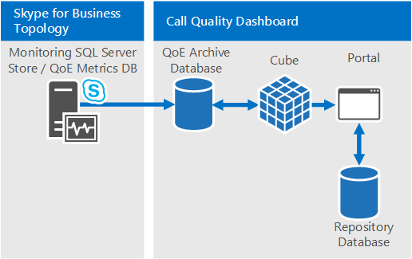
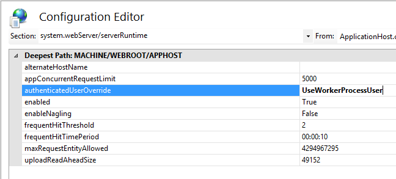
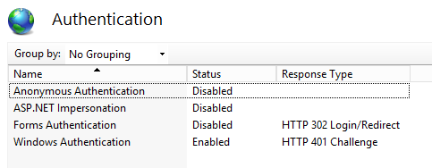

# <a name="deploy-call-quality-dashboard-for-skype-for-business-server"></a>Развертывание панели мониторинга качества вызовов для Skype для бизнеса Server
 
**Сводка:** Узнайте о процессе развертывания панели мониторинга качества вызовов. Панель мониторинга качества вызовов — это средство для Skype для бизнеса Server.
  
## <a name="deployment-overview"></a>Обзор развертывания

Панель мониторинга качества вызовов (CQD) состоит из трех основных компонентов:
  
- **База данных** архива, в которой реплицированы и хранятся данные Качества работы (QoE).
    
- **Cube,** где данные из базы данных архива QoE агрегируются для оптимизированного и быстрого доступа.
    
- **Портал,** где пользователи могут легко запрашивать и визуализировать данные QoE.
    

  
Процесс настройки архива QoE включает создание базы данных архива QoE, развертывание процедуры хранения SQL Server, которая будет перемещать данные из базы данных исходных показателей QoE в базу данных архива QoE, а также настройка задания агента SQL Server для выполнения сохраненной процедуры на регулярной основе. 
  
Развертывание Cube получает от пользователя сведения о расположении архива QoE, развертывает куб и настраивает SQL Server агента, который будет обновлять куб с регулярным интервалом.
  
Установка портала создает базу данных репозиториев, которая хранит сопоставление пользователей CQD с отчетами и запросами каждого пользователя. Затем создается веб-приложение IIS, которое является панелью мониторинга, на которой пользователи могут видеть заранее определенный набор отчетов, а также настраивать и создавать собственные запросы для визуализации данных из куба. Установка портала создает два дополнительных веб-приложения, которые предоставляет пользователям API программный доступ к репозиторию и кубу. (Эти API также используются внутренне панелью мониторинга.)
  

|**Этап**|**Действия**|**Роли и членство в группе**|**Документация**|
|:-----|:-----|:-----|:-----|
|Установка необходимого оборудования и программного обеспечения.  <br/> |Определите конфигурацию CQD и выберите SQL Server, из которого выполняется установка.  <br/> |Пользователь домена, являющийся членом локальной группы администраторов.  <br/> |Раздел "Требования предварительной установки" в документации по развертыванию.  <br/> |
|Установка CQD.  <br/> |Запустите MSI после документа развертывания.  <br/> |Для выполнения установки учетная запись установки должна быть пользователем домена, который является членом группы локальных администраторов и имеет доступ к базе данных показателей QoE на сервере мониторинга.  <br/> |Разделы "Учетные записи и этапы развертывания" в документации по развертыванию.  <br/> |
|Предоставление доступа к пользователю.  <br/> |Для управления авторизацией пользователя на портале рекомендуется использовать авторизацию URL-адресов, которая была представлена в IIS 7.0. Дополнительные сведения см. в [сайте Understanding IIS 7.0 URL-адресов.](https://www.iis.net/learn/manage/configuring-security/understanding-iis-url-authorization)  <br/> |Пользователь домена, являющийся членом локальной группы администраторов.  <br/> |Управление доступом пользователей к разделу Portal в документации по развертыванию.  <br/> |
|Необязательный. Предостанавлить сведения о сопоставлении подсетей.  <br/> |Заполнять таблицы сопоставления сети и построения в базе данных архива QoE.  <br/> |Учетная запись с записью доступа к базе данных архива QoE.  <br/> |Раздел "Сведения о подсетях" в документации пользователя.  <br/> |
   


Развертывание панели мониторинга качества вызовов предполагает настройку инфраструктуры и установку программного обеспечения. В следующей процедуре описывается процесс.
  
## <a name="deployment-steps"></a>Действия развертывания

1. Скопируйте CallQualityDashboard.msi на машину, на которой должен быть установлен компонент базы данных архива CQD (это машина, SQL Server установлена). 
    
2. Выполните MSI (Windows будет предложено выполнить с привилегией администратора, сделайте это). 
    
3. Примите EULA.
    
4. Выберите папку назначения, в которой будут располагаться файлы, связанные с компонентами панели мониторинга качества вызовов, или принять расположение по умолчанию.
    
5. Выберите все функции.
    
6. На странице Конфигурация архива QoE предопос.
    
   - **QoE Metrics SQL Server:** SQL Server имени экземпляра, где расположенА DB метрик QoE (это будет источник данных).
    
   - **Имя архива QoE SQL Server:** Это поле только для чтения и закреплено за полностью квалифицированным доменным именем локальной машины. Архивная DB может быть установлена только на локальном компьютере.
    
   - **QoE Archive SQL Server экземпляр:** Локальное имя SQL Server для создания архивного DB. Чтобы использовать экземпляр SQL Server по умолчанию, оставьте это поле пустым. Чтобы использовать экземпляр с SQL Server, укажите имя экземпляра (например, имя после \" ").
    
   - **Архивная база данных QoE:** По умолчанию этот параметр имеет значение "Создание новой базы данных". Так как обновление архива DB не поддерживается, единственным обстоятельством, при котором можно использовать параметр "Использование существующей базы данных", является то, что существующая база данных Архива имеет ту же схему, что и установленная сборка.
    
   - **Каталог файлов базы данных:** Путь к размещению файлов базы данных (.mdf и .ldf) для архивного DB. Это должно быть на диске (HDD2 в рекомендуемой конфигурации оборудования) отдельно от ОС. Обратите внимание, что так как имена файлов фиксируются в установке, чтобы избежать потенциального конфликта, рекомендуется использовать пустой каталог без файлов.
    
   - **Используйте несколько разделов:** По умолчанию задано значение "Несколько разделов", для чего требуется выпуск business Intelligence или Enterprise выпуск SQL Server. В стандартном выпуске выберите параметр "Один раздел". Обратите внимание, что производительность обработки кубов может повлиять, если используется один раздел.
    
     > [!NOTE]
     > Выбор параметра Use Multiple Partitions нельзя изменить после завершения установки. Чтобы изменить его, необходимо сначала отменить функцию Cube, а затем переустановить ее с помощью параметра "Изменение" в панели управления. 
  
   - **Каталог файлов разделов:** Путь к расположению разделов для базы данных архива QoE. Это должно быть на диске (HDD3 в рекомендуемой конфигурации оборудования) отдельно от диска ОС и SQL файлов базы данных. Обратите внимание, что так как имена файлов фиксируются в установке, чтобы избежать потенциального конфликта, рекомендуется использовать пустой каталог без файлов.
    
   - **SQL агента — имя пользователя &amp; Пароль:** имя и пароль учетной записи службы домена (в маске), которые будут использоваться для запуска шага "Архивные данные QoE" задания SQL Server Agent (который будет запускать сохраненную процедуру для получения данных из QoE Metrics DB в Archive DB, поэтому эта учетная запись должна иметь доступ к QoE Metrics DB, как указано в разделе Учетные записи. Эта учетная запись также должна иметь вход в архив QoE SQL Server Экземпляр).
    
     > [!NOTE]
     > Учетная запись SQL Server экземпляра, например NT SERVICE\MSSQLSERVER, должна иметь доступ и разрешение к каталогам, которые были даны выше для успешной установки. Подробные сведения см. [в материале Настройка](/previous-versions/sql/sql-server-2012/jj219062(v=sql.110)) разрешений файловой системы для ядро СУБД доступа
  
7. Нажав кнопку далее, установщик выполнит необходимые проверки и сообщает, если возникнут какие-либо проблемы. Когда все необходимые проверки проходят, установщик перейдите на страницу Конфигурация Куба. 
    
    > [!NOTE]
    > Если установщик показывает предупреждение о том, что служба агентов SQL Server для экземпляра QoE Archive SQL Server в настоящее время не запущена, установка может продолжиться, но после установки убедитесь, что служба SQL агент запущена и установите тип Запуска автоматическим, чтобы запланированное задание было запущено. 
  
8. На странице Конфигурация Куба укайте следующую информацию:
    
   - **Имя архива QoE SQL Server:** Это поле только для чтения и закреплено за полностью квалифицированным доменным именем локальной машины. Куб можно установить только из машины с базой данных архива QoE (Примечание. Куб может быть установлен на удаленном компьютере. См. ниже)
    
   - **QoE Archive SQL Server пример: SQL Server** имени экземпляра для места, где расположенА DB архива QoE. Чтобы указать экземпляр SQL Server по умолчанию, оставьте это поле пустым. Чтобы указать SQL Server экземпляра, введите имя экземпляра (например, имя после " \" ). Если для установки был выбран компонент архива QoE, это поле будет предварительно заполнено значением, предоставляемым на странице Конфигурация архива QoE.
    
   - **Cube Analysis Server:** SQL Server службы анализа имя экземпляра, для которого должен быть создан куб. Это может быть другая машина, но пользователь установки должен быть членом администраторов сервера целевого SQL Server службы анализа.
    
     > [!NOTE]
     >  Дополнительные сведения о настройке разрешений администратора сервера служб аналитики см. в дополнительных сведениях о разрешениях администратора grant [Server (Analysis Services)](/analysis-services/instances/grant-server-admin-rights-to-an-analysis-services-instance?viewFallbackFrom=sql-server-ver15)
  
   - **Используйте несколько разделов:** По умолчанию задано значение "Несколько разделов", для чего требуется выпуск business Intelligence или Enterprise выпуск SQL Server. В стандартном выпуске выберите параметр "Один раздел". Обратите внимание, что производительность обработки кубов может повлиять, если используется один раздел.
    
     > [!NOTE]
     >  Выбор параметра Use Multiple Partitions нельзя изменить после завершения установки. Чтобы изменить его, необходимо сначала отменить функцию Cube, а затем переустановить ее с помощью параметра "Изменение" в панели управления.
  
   - **Пользователь Cube — имя пользователя &amp; Пароль.** Имя и пароль учетной записи службы домена (в маске), которые будут запускать обработку куба. Если для установки был выбран компонент архива QoE, это поле будет предварительно заполнено значением, предоставляемым на странице Конфигурация архива для пользователя задания агента SQL агентом, но рекомендуется указать другую учетную запись службы домена, чтобы настройка предоставила ему наименее необходимые привилегии.
    
9. При следующем нажатии на кнопку будет выполнен еще один раунд проверки и будет отчитаться о любой проблеме. После успешного завершения проверки установщик перейдите на страницу Конфигурация портала. 
    
10. На странице Конфигурация портала укайте следующую информацию:
    
    - **QoE Archive SQL Server:** SQL Server имени экземпляра, для которого расположена база данных архива QoE. Обратите внимание, что в отличие от страницы конфигурации архива QoE и страницы конфигурации Куба имя машины не фиксируется и должно быть предоставлено. Если для установки был выбран компонент архива QoE, это поле будет предварительно заполнено значением, предоставляемым на странице Конфигурация архива QoE.
    
    - **Сервер анализа куба:** SQL Server службы анализа имя экземпляра, где расположен куб. Если для установки был выбран компонент Cube, это поле будет предварительно заполнено значением, предоставляемым на странице Конфигурация Куба.
    
    - **Репозиторий SQL Server:** SQL Server имени экземпляра, в котором должна быть создана база данных репозиториев. Если имя SQL Server экземпляра, на котором расположена база данных архива QoE, было предоставлено ранее в настройке (в других компонентах), это поле будет предварительно заполнено именем экземпляра QoE Archive DB SQL Server экземпляра. Это может быть любой SQL Server экземпляр.
    
    - **База данных репозиториев:** По умолчанию установлен параметр "Создание новой базы данных". Поскольку обновление хранилища DB не поддерживается, единственным обстоятельством, при котором можно использовать параметр "Использование существующей базы данных", является то, что существующая схема хранилища DB имеет ту же схему, что и установленная сборка.
    
    - **Пользователь пула приложений IIS — имя пользователя &amp; Пароль.** Учетная запись, которую должен выполнять пул приложений IIS. При выборе встроенных системных учетных записей поля "Имя пользователя" и "Пароль" будут серыми. Эти поля будут включены только в том случае, если "Другое" выбрано из окна drop down, чтобы пользователь вошел в сведения учетной записи службы домена.
    
11. При нажатии следующего щелчка будет сделан заключительный раунд проверки, чтобы убедиться, что SQL Server экземпляры доступны с помощью предоставленных учетных данных и что IIS доступен на компьютере. После успешного завершения проверки установщик приступит к установке. 
    
После установки, скорее всего, SQL Server агент будет в процессе выполнения начальной нагрузки данных QoE и обработки куба. В зависимости от количества данных в QoE на портале еще не будут доступны данные для просмотра. Чтобы проверить состояние нагрузки данных и обработки куба, перейдите к  `http://<machinename>/CQD/#/Health` . 
> [!NOTE]
> Обратите внимание, что URL-адрес для проверки состояния обработки куба загрузки является конфиденциальным. Если вы вводите "здоровье", URL-адрес не будет работать. Необходимо ввести "Здоровье" в конце URL-адреса со столицей H. 
  
Подробные сообщения журнала будут показаны, если включен режим отлаживания. Чтобы включить режим отлаживания, перейдите к **%SYSTEMDRIVE%\Program Files\Skype for Business 2015 CQD\QoEDataService\web.config** и обновив следующую строку, чтобы значение было заданная **значение True:**

```xml
<add key="QoEDataLib.DebugMode" value="True" /> 
```

Главная страница портала доступна через  `http://<machinename>/CQD` . 
## <a name="managing-user-access-for-the-portal"></a>Управление доступом пользователей к порталу

Для управления авторизацией пользователя на портале рекомендуется использовать авторизацию URL-адресов, которая была представлена в IIS 7.0. Дополнительные сведения о безопасности IIS см. в ссылке [Understanding IIS 7.0 URL-адресов.](https://www.iis.net/learn/manage/configuring-security/understanding-iis-url-authorization)
  
Любой веб-сайт или веб-приложение наследует авторизацию URL-адресов по умолчанию, настроенную для всего IIS, которое обычно является "Разрешить всем пользователям". Если доступ к порталу должен быть более строгим, администраторы могут предоставлять доступ только определенной группе пользователей, редактирует "Правила авторизации".
  

  
> [!NOTE]
> Значок Правила авторизации не следует путать с ".NET Авторизация" в разделе ASP.NET, который является другим механизмом авторизации. 
  
Сначала администраторы должны удалить унаследованные правила "Разрешить всем пользователям". Это предотвращает доступ к порталу любым пользователям, не уполномоченным.
  

  
Затем администраторам следует добавить новые правила разрешения и предоставить конкретным пользователям разрешение на доступ к порталу. Для управления пользователями рекомендуется создать локальная группа CQDPortalUsers.
  

  
Сведения о конфигурации хранятся в web.config, расположенном в физическом каталоге портала.
  
```xml
<?xml version="1.0" encoding="UTF-8"?> <configuration> <system.webServer> <security> <authorization> <remove users="*" roles="" verbs="" /> <add accessType="Allow" roles="CQDPortalUsers" /> </authorization> </security> </system.webServer> </configuration> 
```

Следующий шаг — настройка панели мониторинга CQD. После проверки подлинности iiS пользователям необходимо иметь разрешения на файл в каталоге CQD, чтобы получить доступ к контенту веб-портала. Можно изменить acLs через вкладку безопасности свойств каталога CQD, чтобы добавить отдельных пользователей или групп; однако рекомендуемый подход заключается в том, чтобы оставить разрешения на файл нетронутыми. Вместо этого измените параметр IIS, чтобы использовать рабочий процесс IIS для доступа к каталогу CQD независимо от того, какой пользователь является авторификацией. 
  
> [!IMPORTANT]
> Важно изменить этот параметр только для приложения CQD, а не для двух приложений API: QoEDataService и QoERepositoryService. 
  
## <a name="configuring-file-access-for-the-cqd-dashboard"></a>Настройка доступа к файлам для CQD (Панель мониторинга)

1. Откройте редактор конфигурации для CQD.
    
     
  
2. В разделе выберите **system.webServer/serverRuntime.**
    
     
  
3. Измените проверку подлинностиUserOverride на **UseWorkerProcessUser.**
    
     
  
4. Нажмите **Кнопку Применить** в правой части страницы.
    
## <a name="known-issues"></a>Известные проблемы

### <a name="the-cqd-shows-no-data-after-deployment"></a>CQD не показывает данных после развертывания

Вы можете получить следующую ошибку:

*Мы не смогли выполнить запрос во время выполнения его на кубе. Чтобы изменить запрос и устранить все проблемы, используйте редактор запроса. Кроме того, убедитесь, что куб доступен.*

Это означает, что куб должен быть обработан в SQL Server службы анализа, прежде чем использоваться в CQD. Это можно решить, следуя следующим шагам:

1. Откройте SQL Management Studio и выберите **службы анализа.**

2. **Расширите объект QoECube,** выберите **метрику QoE**, щелкните правой кнопкой мыши и выберите **Просмотр**. 

    Если это возвращает пустой браузер, куб еще не был приступить.

3. Правой кнопкой **мыши QoE Metric** angain и выберите **Процесс**.

4. Когда обработка завершена, щелкните правой кнопкой мыши объект снова и выберите **Просмотр,** чтобы подтвердить, что на странице браузера теперь показаны данные. 


### <a name="users-have-trouble-logging-in-because-installer-fails-to-create-the-correct-settings-in-iis"></a>У пользователей возникли проблемы с входом в систему, так как установщик не смог создать правильные параметры в IIS

В редких случаях установщику не удается создать правильные параметры в IIS. Для входа в CQD пользователям требуется ручное изменение. Если у пользователей возникли проблемы с входом в систему, выполните следующие действия:
  
1. Откройте диспетчер IIS и перейдите на веб-сайт по умолчанию.
    
     
  
2. Нажмите кнопку "Проверка подлинности". Если параметры "Anonymous Authentication", "ASP.NET Impersonation", "Form Authentication" и "Windows Authentication" не соответствуют показанным ниже параметрам, вручную измените их в соответствие с ниженазванными настройками. Все остальные механизмы проверки подлинности должны быть отключены.
    
     
  
3. Для "Windows проверки подлинности" щелкните Параметры advanced Параметры правой стороне.
    
     
  
4. Установите поле "Расширенная защита", чтобы принять и проверить поле "Включить проверку подлинности в режиме ядра".
    
     
  
5. Повторите следующие действия для каждой из записей "CQD", "QoEDataService" и "QoERepositoryService" ниже "Веб-сайт по умолчанию".
    
Для привязки порта HTTP и HTTPS установщик создаст привязки портов для номеров портов по умолчанию (порт 80 для HTTP и порт 443 для HTTPS). Если на компьютере есть другой веб-сайт, использующий эти привязки, будет конфликт, и поведение IIS невозможно предсказать. Лучший способ избежать этой проблемы — убедиться, что перед установкой CQD никакие другие веб-сайты не будут соеди-ными в порты 80 и 443. 
  
Чтобы включить SSL/TLS в IIS и заставить пользователей подключаться с помощью безопасного HTTPS вместо HTTP:
  
1. Настройка уровня безопасных розеток в IIS см. в рубрике Настройка уровня безопасных [розеток в IIS 7.](/previous-versions/windows/it-pro/windows-server-2008-R2-and-2008/cc771438(v=ws.10)) После этого  `http` замените `https` .
    
2. Инструкции по включению TLS в SQL Server подключениях см. в примере Как включить шифрование [SSL](https://support.microsoft.com/kb/316898/)для экземпляра SQL Server с помощью консоли управления Microsoft.
    
## <a name="cube-sync-fails"></a>Сбой синхронизации Cube

QoEMetrics может содержать некоторые недействительные записи, основанные на часах конечных пользователей. Если время перекоса превышает 60 лет, импорт куба будет неудачным.
  
 Проверьте min и Max StartTime/EndTime с помощью приведенного ниже выбора. И посмотрите и удалите записи в далеком прошлом и очень отдаленном будущем, их можно игнорировать, и они будут разрушать процессы синхронизации.
  
- Выберите MIN (StartTime) из CqdPartitionedStreamView
    
- Выберите MAX (StartTime) из CqdPartitionedStreamView
    
- Выберите MIN (EndTime) из CqdPartitionedStreamView
    
- Выберите MAX (EndTime) из CqdPartitionedStreamView
    
## <a name="post-install-tasks"></a>Задачи после установки

### <a name="importing-buildings-and-networks"></a>Импорт зданий и сетей

После установки CQD выполните следующие задачи конфигурации:
  
1. Определение типов здания (рекомендуется)
    
2. Определение типов владения зданиями (рекомендуется)
    
3. Определение типов сети (настоятельно рекомендуется)
    
4. Импорт зданий (рекомендуется)
    
5. Импортные подсети (рекомендуется)
    
### <a name="define-building-types"></a>Определение типов зданий

Типы зданий используются для описания различных определений или типов зданий в организации. 
  
> [!NOTE]
> Этот шаг необязателен, но рекомендуется. 
  
Примеры
  
- Headquarters
    
- Удаленные Office
    
- Расположение совместного предприятия
    
  **Пример SQL синтаксиса**
  
```SQL
INSERT INTO
[dbo].[CqdBuildingType]
([BuildingTypeId],
[BuildingTypeDesc])
VALUES
(1, 
'Headquarters')   
```

Необходимы параметры BuildingTypeId и BuildingTypeDesc.
  
### <a name="define-building-ownership-types"></a>Определение типов владельцев зданий

Типы собственности используются для различия между собственностью и арендованными активами.
  
> [!NOTE]
> Этот шаг необязателен, но рекомендуется. 
  
Примеры
  
- Contoso Leased non-RE &amp; F
    
- Contoso Leased RE &amp; F
    
- Contoso Owned
    
- Дочерняя аренда
    
  **Пример SQL синтаксиса**
  
```SQL
INSERT INTO
[dbo].[CqdBuildingOwnershipType]
([OwnershipTypeId],
[OwnershipTypeDesc]
)

VALUES
(1,
'Contoso Owned'
)
```

Необходимы параметры OwnershipTypeId и OwnershipTypeDesc. 
  
### <a name="define-network-names"></a>Определение имен сети

Типы сетей используются для описания различных типов сетей в организации. Это позволяет отфильтровать (или отфильтровать) определенные типы сетей.
  
> [!NOTE]
> Настоятельно рекомендуется определять сетевые имена, но это необязательно. Если вы решите не определять сетевые имена, убедитесь, что каждая запись CqdNetwork имеет buildingId 0. 
  
Примеры
  
- VPN
    
- LAB
    
  **Пример SQL синтаксиса**
  
```SQL
INSERT INTO [dbo].[CqdNetworkName] 
( [NetworkName]
,[NetworkType]
 ) 
VALUES
('VPN','VPN') 
```

Параметры NetworkNameID и NetworkName необходимы, параметр NetworkType необязателен, но рекомендуется.
  
### <a name="import-buildings"></a>Импорт зданий

Импорт зданий позволяет получать сведения о конкретных сведениях (неудовлетворительные вызовы для каждого здания на WiFi/Wired и т.д.). 
  
> [!NOTE]
> Этот шаг необязателен, но рекомендуется. 
  
Прежде чем импортировать новое здание, необходимо уже определить заранее заранее установленную модель BuildingKey. Для этого выдайте команду SELECT MAX (BuildingKey) от CqdBuilding SQL для определения текущего значения и добавления 1 к результату.
  
 **Пример SQL синтаксиса**
  
```SQL
INSERT INTO [dbo].[CqdBuilding] 
( [BuildingKey]
,[BuildingName]
,[BuildingShortName]
,[OwnershipTypeId],
[BuildingTypeId]
)
VALUES
(2, 'Ann Arbor', 'AA', 0, 0)
```

Параметры BuildingKey, BuildingName, BuildingShortName, OwnershipTypeId, BuildingTypeId необходимы, остальные параметры необязательны.
  
### <a name="import-subnets"></a>Импортные подсети

Импорт зданий позволяет получать сведения о конкретных сведениях (неудовлетворительные вызовы для каждого здания на WiFi/Wired и т.д.). 
  
> [!NOTE]
> Этот шаг необязателен, но рекомендуется.
  
Импортировать подсети и соотнося их с зданиями, импортируемыми на последнем шаге. Если вы решили не заполнять NetworkName, убедитесь, что каждая запись в этой таблице использует NetworkNameID 0. Дополнительные сведения о синтаксисах SQL и параметрах панели мониторинга качества вызовов см. в странице [Use Call Quality Dashboard for Skype для бизнеса Server.](./use.md)
  
 **Пример SQL синтаксиса**
  
```SQL
INSERT INTO [dbo].[CqdNetwork] 
([Network]
,[NetworkRange]
,[NetworkNameID]
,[BuildingKey]
,[UpdatedDate]
)

VALUES
 ('172.16.254.0',32,0,1,'2015-11-11')
```

Параметры Network и UpdatedDate необходимы, остальные параметры необязательны.
  
### <a name="optional-bssid"></a>Необязательный: BSSID

Заполнение данных BSSID дает дополнительную корреляцию потока WiFi по контроллеру или радио. Это не только фильтрация с помощью создания или подсети. 
  
 **Пример SQL синтаксиса**
  
```SQL
INSERT INTO [dbo].[CqdBssid]
([Ap],
[Bss],
[Building],
[ess],
[phy]
)
VALUES
('AP1','00-00-00-00-00-00','Aruba AP 1','Controller1','bgn')
```

**Сведения о CqdBssidTable**

|**Как показано в CQD**|**Таблица CQDBssid**|**Примеры входных данных**|
|:-----|:-----|:-----|
|Ap NName  <br/> |AP  <br/> |AP1  <br/> |
|BBssid  <br/> |BSS  <br/> |00-00-00-00-00-00 (необходимо использовать делимитированный fformat)  <br/> |
|Контроллер  <br/> |Здание  <br/> |Aruba AP 7  <br/> |
|Device  <br/> |ess  <br/> |Controller1  <br/> |
|Радио  <br/> |phy  <br/> |bgn  <br/> |
   
### <a name="processing-the-imported-data"></a>Обработка импортируемых данных

По умолчанию после импорта данных здания или сети он будет применяться только к записям, созданным после этого момента. 
  
Чтобы пометить все предыдущие записи с помощью этих новых данных, необходимо выполнить процедуру хранения CqdUpdateBuilding, как показано ниже: 
  
Дайте ему дату первой записи (определите, что с помощью команды Select MIN (StartTime) от команды CqdPartitionedStreamView SQL), endDate завтрашнего дня, а затем NULL для последних двух значений.
  
После того как данные связаны с данными потока, куб SSIS должен перепроцесировать все записи. Это также применяется при массовом добавлении данных BSSID/ISP. Убедитесь, что выбран "Полный процесс".
