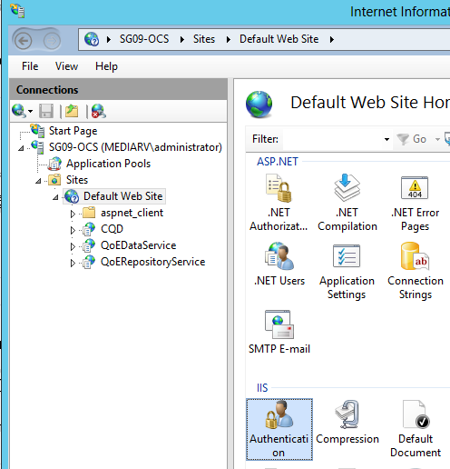

# <a name="deploy-call-quality-dashboard-for-skype-for-business-server"></a>Развертывание панели мониторинга качества звонков для Skype для бизнеса Server
 
**Сводка:** Узнайте о процессе развертывания панели мониторинга качества вызовов. Панель мониторинга качества звонков — это инструмент для Skype для бизнеса Server.
  
## <a name="deployment-overview"></a>Обзор развертывания

Панель мониторинга качества вызовов (CQD) состоит из трех основных компонентов:
  
- **Архивная** база данных, в которой реплицированы и хранятся данные о качестве работы.
    
- **Куб,** где данные из базы данных архива QoE объединяются для оптимизированного и быстрого доступа.
    
- **Портал,** где пользователи могут легко запрашивать и визуализировать данные о QoE.
    

  
Процесс настройки архива QoE включает в себя создание базы данных архива QoE, развертывание хранимой процедуры SQL Server, которая переместит данные из базы данных показателей качества качества в архивную базу данных качества и настройку задания агента SQL Server для выполнения хранимой процедуры с регулярным интервалом. 
  
Развертывание куба получает от пользователя сведения о расположении архива QoE, развертывает куб и настраивает обычное задание агента SQL Server, которое регулярно обновляет куб.
  
При установке портала создается база данных репозитория, в которой хранится сопоставление пользователей CQD с отчетами и запросами каждого пользователя. Затем настраивается веб-приложение IIS, которое является панелью мониторинга, где пользователи могут видеть предварительно определенный набор отчетов, а также настраивать и создавать собственные запросы для визуализации данных из куба. Установка портала создает два дополнительных веб-приложения, которые предоставляет пользователям программный доступ к репозиторию и кубу. (Эти API также используются внутри панели мониторинга.)
  

|**Этап**|**Действия**|**Роли и членство в группах**|**Документация**|
|:-----|:-----|:-----|:-----|
|Установите необходимое оборудование и программное обеспечение.  <br/> |Выберите конфигурацию CQD и выберите SQL Server, из которого выполняется установка.  <br/> |Пользователь домена, являющийся членом локальной группы администраторов.  <br/> |Раздел "Требования перед установкой" в документации по развертыванию.  <br/> |
|Установите CQD.  <br/> |Запустите MSI после документа развертывания.  <br/> |Для выполнения установки учетная запись установки должна быть пользователем домена, который является членом локальной группы администраторов и имеет доступ на чтение к базе данных метрик качества качества работы на сервере мониторинга.  <br/> |Разделы "Учетные записи и этапы развертывания" в документации по развертыванию.  <br/> |
|Предоставление доступа пользователю.  <br/> |Для управления авторизацией пользователей на портале рекомендуется использовать авторизацию URL-адресов, которая была представлена в IIS 7.0. Дополнительные сведения см. [в теме "Understanding IIS 7.0 URL Authorization" (Авторизация URL-адресов IIS 7.0).](https://www.iis.net/learn/manage/configuring-security/understanding-iis-url-authorization)  <br/> |Пользователь домена, являющийся членом локальной группы администраторов.  <br/> |Управление доступом пользователей для раздела "Портал" в документации по развертыванию.  <br/> |
|Необязательный. Предоставление сведений о сопоставлении подсети.  <br/> |Заполнение таблиц сопоставления сети и построения в базе данных архива QoE.  <br/> |Учетная запись с доступом на запись к базе данных архива QoE.  <br/> |Раздел "Сведения о подсети" в документации пользователя.  <br/> |
   


Развертывание панели мониторинга качества вызовов включает настройку инфраструктуры и установку программного обеспечения. Процесс описан в следующей процедуре.
  
## <a name="deployment-steps"></a>Этапы развертывания

1. Скопируйте CallQualityDashboard.msi на компьютер, на котором должен быть установлен компонент архивной базы данных CQD (это компьютер, на котором SQL Server установлено). 
    
2. Выполните MSI (Windows запросит запуск с привилегиями администратора, сделайте это). 
    
3. Примите eula.
    
4. Выберите папку назначения, в которой будут расположены файлы, связанные с компонентами панели мониторинга качества вызовов, или примите расположение по умолчанию.
    
5. Выберите все функции.
    
6. На странице "Конфигурация архива QoE" удостовидим следующие сведения:
    
   - **Показатели качества SQL Server:** SQL Server экземпляра, где расположена DB метрик качества связи (это будет источник данных).
    
   - **Имя архива SQL Server QoE:** Это поле только для чтения и фиксировано к полному доменному имени локального компьютера. Архивную DB можно установить только на локальном компьютере.
    
   - **Экземпляр архива QoE SQL Server:** Локальное SQL Server экземпляра, для которого будет создана архивная DB. Чтобы использовать экземпляр SQL Server по умолчанию, оставьте это поле пустым. Чтобы использовать именуемую SQL Server, укажите имя экземпляра (например, имя после \" ").
    
   - **Архивная база данных QoE:** По умолчанию для этого параметра установлено значение "Создать новую базу данных". Поскольку обновление архивной базы данных не поддерживается, единственным обстоятельствам, при котором можно использовать параметр "Использовать существующую базу данных", является то, что существующая база данных архива имеет ту же схему, что и устанавливаемая сборка.
    
   - **Каталог файлов базы данных:** Путь к расположению файлов базы данных (MDF и LDF) для архивной базы данных. Он должен быть на диске (HDD2 в рекомендуемой конфигурации оборудования) отдельно от операционной системы. Обратите внимание, что так как имена файлов исправлены при установке, во избежание потенциальных конфликтов рекомендуется использовать пустой каталог без файлов.
    
   - **Используйте несколько разделов:** По умолчанию установлено значение "Multiple partition", для которого требуется выпуск Business Intelligence или enterprise SQL Server. В выпуске Standard выберите "Один раздел". Обратите внимание, что производительность обработки куба может повлиять на работу с одним разделом.
    
     > [!NOTE]
     > Выбор параметра "Использовать несколько разделов" нельзя изменить после завершения установки. Чтобы изменить его, необходимо сначала сменить функцию куба, а затем переустановить ее с помощью параметра "Изменить" на панели управления. 
  
   - **Каталог файлов раздела:** Путь к разделу базы данных архива QoE. Он должен быть на диске (HDD3 в рекомендуемой конфигурации оборудования) отдельно от диска ОС и SQL файлов журнала базы данных. Обратите внимание, что так как имена файлов исправлены при установке, во избежание потенциальных конфликтов рекомендуется использовать пустой каталог без файлов.
    
   - **SQL агента — имя пользователя &amp; Пароль:** имя и пароль учетной записи службы домена (с маской), которые будут использоваться для запуска шага "Архивные данные QoE" задания агента SQL Server (которое будет запускать хранимую процедуру для извлечения данных из DB показателей качества обслуживания в архивную DB, поэтому эта учетная запись должна иметь доступ на чтение к DB метрик качества обслуживания, как указано в разделе "Учетные записи". Эта учетная запись также должна иметь вход в архив QoE SQL Server экземпляре).
    
     > [!NOTE]
     > Учетная запись, в SQL Server, например NT SERVICE\MSSQLSERVER, должна иметь доступ к каталогам, заданным выше, для успешной установки. Подробные сведения см. в подсистеме настройки разрешений [файловой системы для доступа к яику базы данных](https://msdn.microsoft.com/library/jj219062%28v=sql.110%29.aspx)
  
7. После нажатия кнопки "Далее" установщик выполняет проверки на наличие необходимых условий и сообщает о проблемах. Когда все необходимые проверки будут пройдены, установщик перейдите на страницу "Конфигурация куба". 
    
    > [!NOTE]
    > Если установщик отображает предупреждение о том, что служба агента SQL Server для экземпляра архива QoE SQL Server в настоящее время не запущена, установка может продолжиться, но после установки убедитесь, что служба агента SQL запущена, и установите для типа запуска автоматический запуск, чтобы запланированное задание было запущено. 
  
8. На странице "Конфигурация куба" укайте следующие сведения:
    
   - **Имя архива SQL Server QoE:** Это поле только для чтения и фиксировано к полному доменному имени локального компьютера. Куб можно установить только с компьютера с архивной базой данных QoE (примечание. Куб может быть установлен на удаленном компьютере. См. ниже)
    
   - **Экземпляр архива QoE SQL Server:** SQL Server экземпляра, где расположена архивная БД QoE. Чтобы указать экземпляр SQL Server по умолчанию, оставьте это поле пустым. Чтобы указать именуемую SQL Server экземпляра, введите имя экземпляра (например, имя после \" "). Если для установки был выбран компонент архива качества связи, это поле будет предварительно заполнено значением, предоставленным на странице "Конфигурация архива качества связи".
    
   - **Сервер анализа куба:** SQL Server экземпляра службы аналитики для места создания куба. Это может быть другой компьютер, но устанавливающий пользователь должен быть членом группы администраторов сервера целевого экземпляра SQL Server службы аналитики.
    
     > [!NOTE]
     >  Дополнительные сведения о настройке разрешений администратора сервера analysis Services см. в поднаправлении разрешений администратора сервера [(службы analysis Services)](https://msdn.microsoft.com/library/ms174561.aspx)
  
   - **Используйте несколько разделов:** По умолчанию установлено значение "Multiple partition", для которого требуется выпуск Business Intelligence или enterprise SQL Server. В выпуске Standard выберите "Один раздел". Обратите внимание, что производительность обработки куба может повлиять на работу при работе с одним разделом.
    
     > [!NOTE]
     >  Выбор параметра "Использовать несколько разделов" нельзя изменить после завершения установки. Чтобы изменить его, необходимо сначала сменить функцию куба, а затем переустановить ее с помощью параметра "Изменить" на панели управления.
  
   - **Пользователь куба — имя пользователя &amp; Пароль: имя** и пароль учетной записи службы домена (маскировать), которые запускают обработку куба. Если для установки был выбран компонент архива качества обслуживания, это поле будет предварительно заполнено значением, предоставленным на странице "Конфигурация архива" для пользователя задания агента SQL, но мы рекомендуем указать другую учетную запись службы домена, чтобы установка предоставила ему наименее необходимые права.
    
9. При нажатии кнопки "Далее" будет выполнен еще один этап проверки, и будет отчитаться о любой проблеме. После успешного завершения проверки установщик перейдите на страницу "Конфигурация портала". 
    
10. На странице "Конфигурация портала" у вас должны быть следующие сведения:
    
    - **Архив QoE SQL Server:** SQL Server экземпляра, в котором расположена база данных архива QoE. Обратите внимание, что в отличие от страницы "Конфигурация архива QoE" и "Конфигурация куба", имя компьютера не является фиксированным и должно быть предоставлено. Если для установки был выбран компонент архива качества связи, это поле будет предварительно заполнено значением, предоставленным на странице "Конфигурация архива качества связи".
    
    - **Сервер анализа куба:** SQL Server имени экземпляра службы analysis Services для того, где расположен куб. Если для установки был выбран компонент куба, это поле будет предварительно заполнено значением, предоставленным на странице "Конфигурация куба".
    
    - **Репозиторий SQL Server:** SQL Server экземпляра, в котором будет создана база данных репозитория. Если имя экземпляра SQL Server, где расположена база данных архива QoE, было предоставлено ранее в установке (в других компонентах), это поле будет предварительно заполнено именем экземпляра SQL Server архива QoE. Это может быть любой SQL Server экземпляр.
    
    - **База данных репозитория:** По умолчанию параметр имеет значение "Создать новую базу данных". Поскольку обновление базы данных репозитория не поддерживается, единственным обстоятельствам, при котором можно использовать параметр "Использовать существующую базу данных", является то, что существующая база данных репозитория имеет ту же схему, что и устанавливаемая сборка.
    
    - **Пользователь пула приложений IIS — имя пользователя &amp; Пароль:** учетная запись, в которую должен выполняться пул приложений IIS. Поля "Имя пользователя" и "Пароль" будут серыми, если выбраны встроенные системные учетные записи. Эти поля будут включены, только если в выпадаемом поле выбрано "Другое", чтобы пользователь вошел в учетную запись службы домена.
    
11. При нажатии кнопки "Далее" будет завершен заключительный этап проверки, чтобы убедиться, что экземпляры SQL Server доступны с использованием предоставленных учетных данных и что на компьютере доступны IIS. После успешного завершения проверки установщик продолжит установку. 
    
По инициалу установщика, скорее всего, будет SQL Server агент, который будет обрабатывать данные О КАЧЕСТВЕ и куб. В зависимости от объема данных в QoE данные на портале пока недоступны для просмотра. Чтобы проверить состояние загрузки данных и обработки куба, перейдите к  `http://<machinename>/CQD/#/Health` . 
> [!NOTE]
> Обратите внимание, что URL-адрес для проверки состояния обработки куба загрузки чувствителен к регистру. Если ввести "health", URL-адрес не будет работать. Необходимо ввести "Health" в конце URL-адреса с загоном H. 
  
Подробные сообщения журнала будут показаны, если включен режим отлаживания. To enable debug mode, go to **%SYSTEMDRIVE%\Program Files\Skype for Business 2015 CQD\QoEDataService\web.config**, and update the following line so the value is set to **True:**

```xml
<add key="QoEDataLib.DebugMode" value="True" /> 
```

Главная страница портала доступна через  `http://<machinename>/CQD` . 
## <a name="managing-user-access-for-the-portal"></a>Управление доступом пользователей для портала

Для управления авторизацией пользователей на портале рекомендуется использовать авторизацию URL-адресов, которая была представлена в IIS 7.0. Дополнительные сведения о безопасности IIS см. в сведениях об авторизации [URL-адресов IIS 7.0.](https://www.iis.net/learn/manage/configuring-security/understanding-iis-url-authorization)
  
Любой веб-сайт или веб-приложение наследует авторизацию URL-адреса по умолчанию, настроенную для всего IIS, которое обычно имеет значение "Разрешить всем пользователям". Если доступ к порталу должен быть более строгим, администраторы могут предоставить доступ только определенной группе пользователей, отредактировать "Правила авторизации".
  

  
> [!NOTE]
> Не следует путать значок правил авторизации с разделом "Авторизация .NET" ASP.NET, который является другим механизмом авторизации. 
  
Сначала администраторы должны удалить унаследованные правила "Разрешить всем пользователям". Это не позволяет любым не авторизованным пользователям получать доступ к порталу.
  

  
Затем администраторы должны добавить новые правила разрешений и предоставить определенным пользователям разрешение на доступ к порталу. Для управления пользователями рекомендуется создать локальная группа CQDPortalUsers.
  

  
Сведения о конфигурации хранятся в web.config в физическом каталоге портала.
  
```xml
<?xml version="1.0" encoding="UTF-8"?> <configuration> <system.webServer> <security> <authorization> <remove users="*" roles="" verbs="" /> <add accessType="Allow" roles="CQDPortalUsers" /> </authorization> </security> </system.webServer> </configuration> 
```

Следующим шагом является настройка панели мониторинга CQD. После проверки подлинности пользователей службами IIS им должны быть доступны разрешения на доступ к содержимому веб-портала в каталоге CQD. Можно изменить ALS с помощью вкладки безопасности свойств каталога CQD, чтобы добавить отдельных пользователей или группы; Однако рекомендуется оставить разрешения файлов без сундуков. Вместо этого измените параметр IIS, чтобы использовать рабочий процесс IIS для доступа к каталогу CQD независимо от того, какой пользователь имеет проверку подлинности. 
  
> [!IMPORTANT]
> Важно изменить этот параметр только для приложения CQD, а не для двух приложений API: QoEDataService и QoERepositoryService. 
  
## <a name="configuring-file-access-for-the-cqd-dashboard"></a>Настройка доступа к файлам для CQD (информационная панель)

1. Откройте редактор конфигурации для CQD.
    
     
  
2. В разделе выберите **system.webServer/serverRuntime.**
    
     
  
3. Измените authenticatedUserOverride на **UseWorkerProcessUser.**
    
     
  
4. Щелкните **"Применить"** в правой части страницы.
    
## <a name="known-issues"></a>Известные проблемы

### <a name="the-cqd-shows-no-data-after-deployment"></a>CQD не отображает данные после развертывания

Может возникнуть следующая ошибка:

*Не удалось выполнить запрос во время его выполнения в кубе. Используйте редактор запросов для изменения запроса и устранения любых проблем. Кроме того, убедитесь, что куб доступен.*

Это означает, что куб должен быть обработан в SQL Server analysis Services перед его помощью в CQD. Чтобы устранить эту проблему, с помощью следующих действий:

1. Откройте SQL Management Studio и выберите **службы Analysis Services.**

2. Разйдите объект **QoECube,** выберите **метрику качества,** щелкните правой кнопкой мыши и выберите **"Обзор".** 

    Если возвращается пустой браузер, куб еще не был продолжит работу.

3. Щелкните правой кнопкой **мыши метрики** качества и выберите **"Процесс".**

4. После завершения обработки щелкните объект правой  кнопкой мыши и выберите "Обзор", чтобы подтвердить, что на странице браузера теперь показаны данные. 


### <a name="users-have-trouble-logging-in-because-installer-fails-to-create-the-correct-settings-in-iis"></a>Пользователи не могут войти в систему, так как установщику не удается создать правильные параметры в IIS

В редких случаях установщику не удается создать правильные параметры в IIS. Чтобы разрешить пользователям входить в CQD, необходимо вручную изменить его. Если у пользователей возникли проблемы с входом в систему, выполните следующие действия.
  
1. Откройте диспетчер IIS и перейдите на веб-сайт по умолчанию.
    
     
  
2. Щелкните "Проверка подлинности". Если параметры "Анонимная проверка подлинности", "ASP.NET подмена", "Проверка подлинности формы" и "Проверка подлинности Windows" не соответствуют показанным ниже настройкам, вручную измените их в соответствие с настройками ниже. Все остальные механизмы проверки подлинности должны быть отключены.
    
     
  
3. В области "Проверка подлинности Windows" щелкните "Дополнительные параметры" справа.
    
     
  
4. Задайте для "Расширенной защиты" действие "Принять" и установите в поле "Включить проверку подлинности в режиме ядра".
    
     
  
5. Повторите вышеперечисленные действия для каждой записи "CQD", "QoEDataService" и "QoERepositoryService" ниже "Веб-сайт по умолчанию".
    
Для привязок портов HTTP и HTTPS установщик создаст привязки портов на номерах портов по умолчанию (порт 80 для HTTP и порт 443 для HTTPS). Если на компьютере есть другой веб-сайт, использующий эти привязки, будет конфликт, и поведение IIS будет невозможно предсказать. Лучший способ избежать этой проблемы — убедиться, что перед установкой CQD никакие другие веб-сайты не соедина с портами 80 и 443. 
  
Чтобы включить протокол SSL/TLS в IIS и принудительно подключить пользователей через безопасный протокол HTTPS вместо HTTP:
  
1. Настройка уровня безопасных sockets в IIS см. в подстроке "Настройка уровня secure [Sockets Layer" в IIS 7.](https://technet.microsoft.com/library/cc771438%28v=ws.10%29.aspx) После этого замените его на  `http` `https` .
    
2. Инструкции по включению TLS в подключениях SQL Server см. в инструкции по включению [шифрования SSL](https://support.microsoft.com/kb/316898/)для экземпляра SQL Server с помощью консоли управления Майкрософт.
    
## <a name="cube-sync-fails"></a>Сбой синхронизации куба

QoEMetrics может содержать некоторые недопустимые записи на основе часов конечных пользователей. Если время больше 60 yrs, импорт куба не удастся.
  
 Проверьте min и Max StartTime/EndTime, используя выборку ниже. Искать и удалять записи в далеком и очень далеком будущем, их можно игнорировать и разбить процессы синхронизации.
  
- Select MIN(StartTime) FROM CqdPartitionedStreamView
    
- Select MAX(StartTime) FROM CqdPartitionedStreamView
    
- Select MIN(EndTime) FROM CqdPartitionedStreamView
    
- Select MAX(EndTime) FROM CqdPartitionedStreamView
    
## <a name="post-install-tasks"></a>Задачи после установки

### <a name="importing-buildings-and-networks"></a>Импорт зданий и сетей

После установки CQD выполните следующие задачи настройки:
  
1. Определение типов здания (рекомендуется)
    
2. Определение типов владения здания (рекомендуется)
    
3. Определение типов сети (настоятельно рекомендуется)
    
4. Импорт зданий (рекомендуется)
    
5. Импорт подсетей (рекомендуется)
    
### <a name="define-building-types"></a>Определение типов зданий

Типы зданий используются для описания различных определений или типов зданий в организации. 
  
> [!NOTE]
> Этот шаг является необязательным, но рекомендуется. 
  
Примеры
  
- Headquarters
    
- Удаленный офис
    
- Совместное размещение
    
  **Пример SQL синтаксиса**
  
```SQL
INSERT INTO
[dbo].[CqdBuildingType]
([BuildingTypeId],
[BuildingTypeDesc])
VALUES
(1, 
'Headquarters')   
```

Необходимы параметры BuildingTypeId и BuildingTypeDesc.
  
### <a name="define-building-ownership-types"></a>Определение типов владения здания

Типы владения используются для разлиения владельцев и арендованных активов.
  
> [!NOTE]
> Этот шаг является необязательным, но рекомендуется. 
  
Примеры
  
- Contoso Leased non-RE &amp; F
    
- Contoso Leased RE &amp; F
    
- Contoso Owned
    
- Аренда дочернего подразделения
    
  **Пример SQL синтаксиса**
  
```SQL
INSERT INTO
[dbo].[CqdBuildingOwnershipType]
([OwnershipTypeId],
[OwnershipTypeDesc]
)

VALUES
(1,
'Contoso Owned'
)
```

Параметры OwnershipTypeId и OwnershipTypeDesc являются обязательной. 
  
### <a name="define-network-names"></a>Определение имен сетей

Типы сетей используются для описания различных типов сетей в организации. Это дает возможность отфильтровать (или отфильтровать) определенные сетевые типы.
  
> [!NOTE]
> Настоятельно рекомендуется определить имена сетей, но они необязательны. Если вы решили не определять имена сетей, убедитесь, что каждая запись CqdNetwork имеет buildingId 0. 
  
Примеры
  
- VPN
    
- LAB
    
  **Пример SQL синтаксиса**
  
```SQL
INSERT INTO [dbo].[CqdNetworkName] 
( [NetworkName]
,[NetworkType]
 ) 
VALUES
('VPN','VPN') 
```

Параметры NetworkNameID и NetworkName являются обязательными, параметр NetworkType является необязательным, но рекомендуется.
  
### <a name="import-buildings"></a>Импорт зданий

Импорт зданий дает возможность получать конкретные сведения о построении (звонков низкого качества для каждого здания на WiFi/ Wired и т. д.). 
  
> [!NOTE]
> Этот шаг является необязательным, но рекомендуется. 
  
Перед импортом нового здания уже должен быть определен предопределен BuildingKey. Для этого выдайте команду SELECT MAX(BuildingKey) FROM CqdBuilding SQL, чтобы определить текущее значение и добавить 1 в результат.
  
 **Пример SQL синтаксиса**
  
```SQL
INSERT INTO [dbo].[CqdBuilding] 
( [BuildingKey]
,[BuildingName]
,[BuildingShortName]
,[OwnershipTypeId],
[BuildingTypeId]
)
VALUES
(2, 'Ann Arbor', 'AA', 0, 0)
```

Параметры BuildingKey, BuildingName, BuildingShortName, OwnershipTypeId, BuildingTypeId являются обязательными, остальные параметры являются необязательными.
  
### <a name="import-subnets"></a>Импорт подсетей

Импорт зданий позволяет получать конкретные сведения о построении (неудовлетворительные звонки для каждого здания на Wi-Fi/ Wired и т. д.). 
  
> [!NOTE]
> Этот шаг является необязательным, но рекомендуется.
  
Импорт подсетей и их соотнося со зданиями, импортируемыми на последнем шаге. Если вы решили не заполнять NetworkName, убедитесь, что каждая запись в этой таблице использует NetworkNameID 0. Дополнительные сведения о синтаксисах SQL и параметрах панели мониторинга качества звонков см. в этой [теме.](https://docs.microsoft.com/skypeforbusiness/management-tools/call-quality-dashboard/use)
  
 **Пример SQL синтаксиса**
  
```SQL
INSERT INTO [dbo].[CqdNetwork] 
([Network]
,[NetworkRange]
,[NetworkNameID]
,[BuildingKey]
,[UpdatedDate]
)

VALUES
 ('172.16.254.0',32,0,1,'2015-11-11')
```

Параметры Network и UpdatedDate являются обязательными, остальные параметры являются необязательными.
  
### <a name="optional-bssid"></a>Необязательно: BSSID

Заполнение данных BSSID дает дополнительную корреляцию потока Wi-Fi по контроллеру или радио. Это дополнение к фильтрации по построению или подсети. 
  
 **Пример SQL синтаксиса**
  
```SQL
INSERT INTO [dbo].[CqdBssid]
([Ap],
[Bss],
[Building],
[ess],
[phy]
)
VALUES
('AP1','00-00-00-00-00-00','Aruba AP 1','Controller1','bgn')
```

**Сведения о CqdBssidTable**

|**Как показано в CQD**|**Таблица CQDBssid**|**Примеры входных данных**|
|:-----|:-----|:-----|
|Ap NName  <br/> |AP  <br/> |AP1  <br/> |
|BBssid  <br/> |BSS  <br/> |00-00-00-00-00-00-00 (необходимо использовать разнородных fformat)  <br/> |
|Контроллер  <br/> |Building  <br/> |Аруба AP 7  <br/> |
|Device  <br/> |ess  <br/> |Controller1  <br/> |
|Радио  <br/> |phy  <br/> |bgn  <br/> |
   
### <a name="processing-the-imported-data"></a>Обработка импортируемых данных

По умолчанию после импорта данных о зданиях и сетях они будут применяться только к записям, созданным после этого момента. 
  
Чтобы пометить все предыдущие записи новыми данными, необходимо выполнить хранимую процедуру CqdUpdateBuilding, как показано ниже: 
  
Присвойте ей дату первой записи (определите, что с помощью команды Select MIN(StartTime) FROM CqdPartitionedStreamView SQL), endDate завтра, а затем значение NULL для последних двух значений.
  
После связываия данных с потоками кубУ SSIS необходимо повторно обрезать все записи. Это также применяется при массовом добавлении данных BSSID/ISP. Убедитесь, что выбрана "Процесс заполнен".
  

