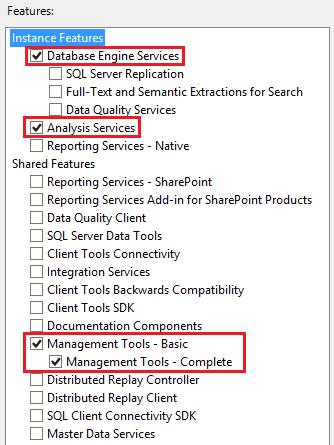

# <a name="skype-for-business-server-plan-for-call-quality-dashboard"></a>Skype для бизнеса Server: Планирование панели мониторинга качества вызовов 
 
**Сводка:** Узнайте, что следует учитывать при планировании панели мониторинга качества вызовов.
  
## <a name="overview-of-the-skype-for-business-server-call-quality-dashboard"></a>Обзор панели мониторинга качества Skype для бизнеса Server вызовов

Панель мониторинга Skype для бизнеса Server вызовов (CQD) — это слой отчетов в верхней части базы данных о качестве работы на сервере мониторинга в Skype для бизнеса Server. CQD Microsoft SQL Server службы анализа для предоставления сведений о качестве использования и вызова, а также для фильтрации и поворота в наборе данных. Функции CQD:
  
- **Архивное хранение данных QoE через компонент QoE Archive CQD.** Компонент архива QoE может хранить данные QoE гораздо дольше, чем сервер мониторинга. Это позволяет создавать тренды и сообщать данные до семи месяцев одновременно, с возможностью сдвига окна отчетов до тех пор, пока имеются данные.
- **Отчеты и анализ с использованием мощности и скорости Microsoft SQL Server служб анализа.** CQD использует службы анализа SQL Майкрософт для обеспечения быстрой сводки, фильтрации и поворотных возможностей для питания панели мониторинга с помощью куба анализа. Скорость выполнения отчетов и возможность сверлить данные могут значительно сократить время анализа.
- **Новая схема данных, оптимизированная для отчетности о качестве вызовов.** В Кубе имеется схема, предназначенная для отчетов о качестве голосовой информации и расследований. Пользователи портала могут сосредоточиться на задачах отчетности, а не на том, как схема базы данных QoE Metrics сопопочитывает представления, которые им необходимы. Сочетание архива QoE и Куба обеспечивает абстракцию, которая снижает сложность отчетности и анализа с помощью CQD. Схема базы данных архива QoE также содержит таблицы, которые можно заполнить данными, определенными для развертывания, чтобы повысить общее значение данных.
- **Встроенный конструктор отчетов и редактирование отчетов на месте.** Компонент Portal поставляется с несколькими встроенными отчетами по образцу методологии качества вызовов. Пользователи портала могут изменять отчеты и создавать новые отчеты с помощью функции редактирования портала.
- **Доступ веб-API к данным Куба структуры отчетов и анализа.** Панель мониторинга отчетов — это не единственный способ отображения данных из Куба. CQD предоставляет несколько примеров использования HTML и JavaScript для получения данных из веб-API CQD и отрисовки данных в настраиваемом формате. Сочетание редактора отчетов и веб-API CQD позволяет быстро ткать отчеты и настраивать макет отчетов.

> [!NOTE]
> Администратор теперь может управлять Skype для бизнеса Server 2019 с помощью [CQD версии 3](https://cqd.teams.microsoft.com) (вход с учетными данными администратора). Это требует гибридной реализации и использования соединитетеля данных вызовов (CDC). [Дополнительные сведения](../../../SfbHybrid/hybrid/plan-call-data-connector.md) о включении CDC см. в соединители данных plan Call. Дополнительные сведения о CQD версии 3 см. в документе Включить и использовать панель мониторинга качества вызовов для Microsoft Teams и [Skype для бизнеса Online](/MicrosoftTeams/turning-on-and-using-call-quality-dashboard).

## <a name="cqd-design-goals"></a>Цели разработки CQD

CQD позволяет ИТ-профессионалам использовать совокупные данные для определения областей фокусиза в среде, испытывающих проблемы с качеством мультимедиа. Это позволяет ИТ-Pro сравнить статистику для различных групп пользователей и определить тенденции и шаблоны. Она ориентирована не на решение отдельных проблем вызовов, а на выявление проблем и решений, которые будут применяться к многим пользователям в данной среде. 
  
## <a name="call-quality-dashboard-components"></a>Компоненты панели мониторинга качества вызовов

Панель мониторинга качества вызовов состоит из нескольких баз данных, заданий SQL агентов, процессов и веб-приложений. Задания агента SQL Майкрософт периодически копируют данные из базы данных метрики QoE в базу данных архива QoE и обрабатывает куб с данными в базе данных архива QoE. База данных репозиториев хранит определения отчетов, которые питания портала. Портал предоставляет доступ браузера к данным Cube. 
  
Компоненты CQD, включая базы данных архива QoE, Cube и Репозитория, можно установить на сервере мониторинга, установить на собственном сервере или установить на нескольких серверах. Конкретный метод установки зависит от требований к производительности CQD, а также от влияния на другие процессы на тех же серверах. Дополнительные сведения можно найти в разделе "Компоненты и топологии для CQD" далее в этой статье.
  
### <a name="architectural-overview"></a>Обзор архитектуры

Чтобы резюмировать, CQD требует следующих элементов:
  
- Две базы данных: база данных архива и база данных репозиториев.
    
- One SSAS Cube visualizing aggregated data 
    
- В IIS размещен веб-портал CQD
    

  
Та же архитектура CQD поддерживает Lync Server 2013 и Skype для бизнеса. 
  
### <a name="cqd-and-skype-for-business-vs-lync-2013"></a>CQD и Skype для бизнеса vs. Lync 2013

 Только в Skype для бизнеса среде доступны следующие возможности:
  
- Wi-Fi отчеты о силе сигнала
    
- Wi-Fi отчеты о драйверах chipset
    
- Оцените мои данные вызовов 
    
## <a name="information-available-through-cqd"></a>Сведения, доступные через CQD

CQD может Skype для бизнеса Server потоковой передачи аудио, видео и приложений, а также количество хороших и плохих вызовов, а также коэффициенты плохих и хороших вызовов. Представления можно нарезать и отфильтровать в разных измерениях. CQD рисует данные из базы данных показателей QoE в сервере мониторинга. Затем данные сливаются с любыми данными, предоставленными клиентами, такими как сопоставление сетевых подсетей с построением, чтобы сделать возможными такие отчеты, как "Качество вызовов для каждого здания". 
  
CQD также абстрагирует многие внутренние коды данных QoE, такие как "вызываемая" и "вызываемая", так что пользователь может сосредоточиться на создании представлений отчетов вокруг "сервера" и "клиента". Следуя методологии качества вызовов, CQD упрощается, чтобы помочь определить условия, которые имеют общие карманы плохие вызовы, один из принципов повышения качества вызовов.
  
## <a name="viewing-data-in-cqd"></a>Просмотр данных в CQD

Данные CQD можно просматривать с помощью портала CQD и получать доступ через вызовы API REST.
  
### <a name="cqd-portal"></a>Портал CQD

Портал — это самый быстрый способ просмотра данных в Кубе. Портал поставляется с несколькими встроенными отчетами, которые можно сразу же завести. Встроенные отчеты связаны структурированным образом, чтобы направлять пользователя к последовательно меньших и меньших фрагментов данных вызовов. Встроенные отчеты также подчеркивают различные способы демонстрации данных, демонстрируя сочетание диаграмм и таблиц с различными поворотами, фильтрами и мерами. Каждый пользователь, который получает доступ к порталу, может иметь собственный набор отчетов, которые он может изменять и делиться ими. Дополнительные сведения об использовании веб-портала CQD см. в странице Использование панели мониторинга качества вызовов [для Skype для бизнеса Server](use.md).
  
Поддерживаемые операционные системы для портала CQD: Windows 8.1, Windows 8, Windows Server 2012 R2, Windows Server 2012 и Windows Server 2016 (Skype для бизнеса Server Только CQD 2019).
  
Поддерживаемые браузеры для портала CQD: Internet Explorer 11, Internet Explorer 10 и Internet Explorer 9.
  
### <a name="rest-apis"></a>REST API

К данным Cube также можно получить доступ с помощью вызовов API REST. Данные, полученные с помощью вызовов API REST, можно отрисовки через HTML-страницы. Пользователи могут воспользоваться скоростью запроса и высокоуровневой схемой CQD, создавая настраиваемые отчеты, подходящие для их бизнес-потребностей. Дополнительные сведения об API и примерах см. в странице [Develop Call Quality Dashboard for Skype для бизнеса Server](develop.md). 
  
## <a name="defining-your-organizations-requirements-for-cqd"></a>Определение требований организации к CQD

CQD предоставляет архивировать данные QoE и быстрый и глубокий анализ данных качества вызовов. В следующем руководстве вы можете определить, когда и зачем следует развертывать CQD.
  
### <a name="when-to-deploy-cqd"></a>Когда развертывание CQD

 **CQD можно развернуть для создания базового измерения качества вызовов, даже если у организации нет проблем с качеством вызовов.** Создание базового измерения качества вызовов имеет важное значение, поскольку каждая организация имеет различное сочетание Wi-Fi проводных и удаленных сотрудников по сравнению с офисами. Когда возникают проблемы с качеством вызовов, последние измерения качества вызовов можно сравнить с предыдущими интервалами времени. Функции тренда CQD позволяют легко обнаруживать изменения в качестве вызовов с течением времени.
  
 **CQD можно развернуть для активного поиска проблемных областей, которые могут повлиять на качество вызовов.** Даже если среднее качество вызовов для организации может соответствовать целям, заданным организацией, могут возникнуть проблемы с качеством вызовов, скрытые за средними метриками. CQD позволяет разбитие показателей качества вызовов по многим измерениям в базе данных QoEMetrics. Обнаружение выбросов в одноранговых группах — это быстрый способ упреждающего обнаружения проблем с качеством вызовов.
  
 **CQD следует развернуть, если в организации возникают проблемы с качеством вызовов, чтобы сократить время, необходимое для устранения неполадок.** CQD может упростить существующие исследования качества вызовов, предлагая быстрое представление отчетов и динамические возможности сверлить. CQD предназначен для многих видов процессов проверки качества вызовов при проверке ремонтных работ в среде.
  
### <a name="why-deploy-cqd"></a>Зачем развертывать CQD

 **CQD следует развернуть, если отчеты QoE должны быть размещены более чем за 3 месяца.** Базы данных QoEMetrics и отчеты серверов мониторинга предназначены для хранения и отчета о небольшом наборе данных. База данных показателей QoE оптимизирована для быстрых вставок, поэтому производительность отчетности может быть затруднена большим объемом вызовов или конкурирующим доступом к базе данных. База данных архива QoE CQD предоставляет вторую копию данных показателей QoE с гораздо более длительными возможностями хранения. Портал также оптимизирован для одновременного показа данных сроком до 7 месяцев и по мере необходимости может сообщать о всех данных в архиве QoE.
  
 **CQD следует развернуть, если нужны пользовательские отчеты QoE.** Портал имеет функцию редактора отчетов для быстрого и легкого создания и создания отчетов. Он также обеспечивает доступность API REST для программного доступа к данным Cube, позволяя настраиваемую презентацию с помощью HTML/JavaScript или многих других платформ. Больше не требуется создавать новые SQL запросы для создания пользовательских представлений данных для отчетов.
  
 **CQD следует развернуть, если существующие функции отчетности QoE не соответствуют скорости и глубине, требуемой организацией.** CQD поставляется со множеством встроенных отчетов. Отчеты сразу же полезны и демонстрируют, как постепенное бурение данных может предлагать дополнительные сведения на каждом уровне. Иерархия отчетов также помогает логически управлять многочисленными отчетами и способствует созданию еще многих отчетов, которые легко доступны и понятны. CQD не только обеспечивает скорость и гибкость, но и оптимизирован для рабочего процесса, разработанного методом качества вызовов.
  
## <a name="components-and-topologies-for-cqd"></a>Компоненты и топологии для CQD

CQD поставляется с несколькими компонентами, и это помогает понять требования каждого компонента и их отношения друг с другом, чтобы получить простейшее и наиболее правильное развертывание средства. В следующей таблице описывается зависимый компонент для каждого компонента CQD.
  

|Имя компонента|Зависимый компонент|
|:-----|:-----|
|Архив QoE   |Microsoft SQL Server   |
|Cube   |Microsoft SQL Server службы анализа   |
|Портал   |Информационные службы Майкрософт   |
|Служба репозиториев (часть установки портала)   |Microsoft SQL Server   |
   
> [!NOTE]
> Для архива QoE и Cube для некоторых вариантов развертывания требуется Enterprise или Microsoft SQL Server. Дополнительные сведения см. в разделе Требования к инфраструктуре для [раздела CQD](plan.md#Infrastructure_Req) .
  

  
### <a name="single-server-configuration"></a>Конфигурация одного сервера

Все компоненты CQD и зависимые компоненты можно установить на одну машину. Конфигурация одного окна — это простейшая конфигурация, которая позволяет сделать CQD автономным. CQD просто потребуется доступ к базе данных показателей QoE на сервере мониторинга. CQD Server может быть автономным компьютером, виртуальной машиной или даже сервером мониторинга в зависимости от доступных ресурсов хост-машины и требований к производительности. 
  
Во время установки пользователю, который выполняет установку, просто необходимо предоставить экземпляры Microsoft SQL Server и Microsoft SQL Server analysis Services, которые ранее были настроены на компьютере, на котором должен быть установлен CQD. Дополнительные сведения можно найти в [информационной](deploy-0.md) панели качества Skype для бизнеса Server вызовов.
  
### <a name="multiserver-configuration"></a>Конфигурация multiserver

В многосерверной конфигурации архив QoE, Cube и Portal могут быть на разных машинах. Существует два основных использования для конфигурации multiserver:
  
- Размещение веб-портала CQD и CQD Cube на различных серверах.
    
- Размещение портала "разработка", отдельного от портала "production". 
    
  **Размещение веб-портала CQD и CQD Cube на разных компьютерах.** Организации, которые могут потребовать отделить портал CQD от установки SQL Server или которые, возможно, захотят смешивать и соответствовать SQL Server выпускам экземпляра SQL Server и SQL Server служб аналитики, могут установить портал CQD и CQD Cube на разных машинах. Компонент архива QoE также может быть единственным компонентом CQD, который устанавливается, если организация просто хочет иметь устойчивый метод архивировать данные QoE, не достигая ограничений производительности на сервере мониторинга.
  

  
 **Размещение портала "разработка", отдельного от портала "production".** Организации, которые разрабатывают собственные пользовательские отчеты (с помощью API REST), могут предпочесть развертывать дополнительные экземпляры портала CQD рядом с производственным порталом, к который обычные пользователи имеют доступ для мониторинга качества вызовов или расследований. Портал разработки может изолировать любые изменения портала от производственной среды. Дополнительные веб-порталы можно развернуть на разных машинах (показано ниже) или развернуть на разных веб-каталогах на одной машине (не показано). Для выполнения последнего необходимо вручную скопировать дополнительный веб-портал CQD на производственную машину, так как процесс установки CQD всегда развертывает веб-портал CQD на веб-сайте по умолчанию с заранее задаваемой веб-приложением.
  

  
### <a name="supported-topologies"></a>Поддерживаемые топологии

CQD не объединяет данные из нескольких баз данных QoEMetrics, как и в случае с несколькими Skype для бизнеса Server, каждый из которых имеет собственный сервер мониторинга. Каждый экземпляр CQD должен указать на одну базу данных QoEMetrics. Однако, поскольку CQD будет перемещать большую часть рабочей нагрузки отчетов с сервера мониторинга, крупные организации, которые должны развернуть один сервер мониторинга на Skype для бизнеса Server топологии, должны рассмотреть возможность использования одного сервера мониторинга для всех топологий.
  
## <a name="infrastructure-requirements-for-cqd"></a>Требования к инфраструктуре для CQD
<a name="Infrastructure_Req"> </a>

CQD, включая все его компоненты и зависимые компоненты, можно развернуть на виртуальной машине, одной машине или на нескольких машинах. Ниже перечислены минимальные требования к программному обеспечению и оборудованию. Доступность данных и производительность запросов могут варьироваться от нескольких минут до нескольких часов в зависимости от количества активных пользователей Skype для бизнеса Server и оборудования и конфигурации, поэтому ниже приведены некоторые измерения производительности.
  

|Для CQD 2015 |&nbsp;  |
|:-----|:-----|
|Поддерживаемые операционные системы    |Windows 2008 R2, Windows Server 2012, Windows Server 2012 R2   |
|Поддерживаемые SQL Server   |SQL Server 2012 г. SQL Server 2014 г. SQL Server 2016 г.   |


|Для CQD 2019  |&nbsp;  |
|:-----|:-----|
|Поддерживаемые операционные системы    |Windows Server 2016, Windows Server 2019   |
|Поддерживаемые SQL Server   |SQL Server 2017 г. SQL Server 2019 г.   |
   
CQD использует Microsoft SQL Server, Microsoft SQL Server аналитические службы и Microsoft IIS поэтому минимальные требования ККУ к оборудованию и программному обеспечению в основном такие же, как и к этим зависимым компонентам. Однако в зависимости от требований организации к свежести данных (отчасти зависят от объема данных QoE, которые создает организация) и затрат на развертывание, необходимо принять дополнительные меры по развертыванию.
  
Обработка данных в CQD разделена на два основных этапа: 
  
- Процесс архивации QoE
    
- Обработка куба CQD
    
  **Обработка архива QoE.** Задача обработки архива QoE копирует данные из базы данных показателей QoE на сервере мониторинга в базу данных архива QoE. Существует две ситуации, в которых время обработки задачи будет иметь принципиально разные характеристики производительности. Первый — после начальной установки CQD. При первом запуске задачи после новой установки задача обработки архива QoE скопирует все данные, которые есть в базе данных QoE Metrics, в базу данных архива QoE. Второй — периодическая обработка после этого начального раунда. Задача обработки архива QoE будет работать каждые 15 минут и обрабатывать все новые записи QoE, которые находятся в базе данных метрики QoE. Как правило, начальное время обработки не является проблемой, так как оно запускается только в первый раз, когда устанавливается CQD. Однако, если сервер CQD серьезно недоумевал, эта задача может занять несколько часов. Обратитесь к таблице ниже, например начальное время обработки архива QoE.
  
  **Обработка CQD Cube.** Задача обработки Куба агрегируется данные из базы данных архива QoE в куб. Начальное время обработки куба и последующее время обработки кубов определяются SQL Server службы анализа, используемого для куба CQD. Если используется стандартное издание, нет разницы между начальным временем обработки куба и последующим временем обработки куба, так как каждый раз, когда данные Cube обновляются, это всегда будет полная обработка всех доступных данных. (Это означает, что время обработки Куба увеличивается по мере увеличения объема данных в базе данных архива QoE.) Так как версия бизнес-аналитики и выпуск Enterprise SQL Server имеют поддержку разделов, если используется либо одно издание, то только начальный запуск будет обрабатывать все данные в базе данных архива QoE. В последующих запусках, когда задача запускается каждые 15 минут, задача обрабатывает только новые записи, добавленные в базу данных архива QoE с момента последнего запуска задачи. Раз в день также будет происходить полная обработка разделов, которые содержат данные текущего месяца.
  
Физические характеристики машины могут повлиять на производительность CQD, а также на функции программного обеспечения, доступные из SQL Server компонентов. Компонент архива QoE будет более дискоемким по сравнению с другими компонентами, в то время как компонент Cube будет более ЦП и памяти. Все эти факторы способствуют общему времени обработки данных CQD, что напрямую влияет на свежесть и доступность данных. Организации должны принимать решения по оборудованию и программному обеспечению в зависимости от индивидуальных потребностей организации. 
  
### <a name="tested-hardware-configurations"></a>Протестированная конфигурация оборудования

В этом разделе делается предположение о том, что в среде существует один DB QoEMetrics. 
  
**Профили машин**

|Компьютер|Ядра ЦП|ОЗУ|Архив QoE и Куб на одном диске|Архив QoE и SQL Temp DB на одном диске|
|:-----|:-----|:-----|:-----|:-----|
|Виртуальная машина   |4   |7 ГБ   |Да   |Да   |
|4 ядра   |4   |20 ГБ   |Да   |Нет   |
|8 ядра   |8    |32 ГБ   |Да   |Нет   |
|16 основных   |16   |128 ГБ   |Нет   |Нет   |
   
**Результаты производительности**

|Компьютер|Размер DB показателей QoE|SQL разделов|Тип диска|Количество потоков|Процесс начального архива|Начальный процесс Куба|Последующий процесс архивации|Последующий процесс Cube|
|:-----|:-----|:-----|:-----|:-----|:-----|:-----|:-----|:-----|
|Виртуальная машина   |900 МБ   |Одинарное   |VHD (переменный размер)   |0,5 м   |30 м   |2 м   |30 s   |1 м   |
|Виртуальная машина   |9 ГБ   |Одинарное   |VHD (переменный размер)   |5 M   |4 ч   |15 м   |1 м   |5 м   |
|Виртуальная машина   |9 ГБ   |Одинарное   |VHD (фиксированный размер)   |5 M   |2 ч   |5 м   |1 м   |5 м   |
|Виртуальная машина   |30+ ГБ   |Одинарное   |VHD (фиксированный размер)   |10 M   |15 ч   |20 м   |2 м   |45 м   |
|8 ядра   |9 ГБ   |Одинарное   |Несколько дисков   |5 M   |2 ч   |5 м   |25 s   |5 м   |
|8 ядра   |9 ГБ   |Несколько   |Несколько дисков   |5 M   |2 ч   |15 м   |35 s   |2 м   |
|8 ядра   |30+ ГБ   |Одинарное   |Несколько дисков   |20 M   |9 ч   |20 м   |1 м   |20 м   |
|8 ядра   |30+ ГБ   |Несколько   |Несколько дисков   |20 M   |9 ч   |30 м   |2 м   |2 м   |
|4 ядра   |200 ГБ   |Одинарное   |Несколько дисков   |125 M   |6+ дней   |7 ч   |2 м   |6 ч   |
|16 основных   |500 ГБ   |Несколько   |Несколько spindles   |250 M   |8 дней   |2 ч   |2 м   |10 м   |
   
\*Ожидается, что они не будут встречаться в реальных развертываниях, так как база данных метрики QoE должна иметь данные за 9 и 18 месяцев соответственно, но они предоставляются здесь для полноты.
  
### <a name="service-account-requirements"></a>Требования к учетной записи службы

Вам понадобится учетная запись (с доступом к QoEMetrics), которую агент SQL CQD Server может использовать для импорта данных в QoEArchiveDB.
  
Может потребоваться также настроить отдельную учетную запись для задания SSAS, чтобы вытащить данные из QoEArchiveDB (это необязательный процесс).
  
IiS чаще всего использует network Service в качестве удостоверения пула приложений, но может быть настроена на учетную запись службы.
  
### <a name="portal-access-control"></a>Управление доступом портала

По умолчанию любой пользователь с проверкой подлинности имеет доступ. Это можно изменить с помощью правил авторизации IIS для ограничения определенной группы.
  
### <a name="pre-install-requirements"></a>Требования к предварительной установке

Эти инструкции предполагают, что база данных метрики QoE уже установлена и запущена где-Skype для бизнеса Server топологии.
  
#### <a name="hardware-requirements"></a>Требования к оборудованию

CQD использует Microsoft SQL Server, Microsoft SQL analysis Server и Microsoft Internet Information Server, поэтому минимальные требования к оборудованию и программному обеспечению CQD в основном такие же, как и к этим зависимым компонентам. Однако в зависимости от требований организации к свежести данных (отчасти зависят от объема данных QoE, которые создает организация) и затрат на развертывание, необходимо принять дополнительные меры по развертыванию.
  
#### <a name="software-requirements"></a>Требования к программному обеспечению

Для CQD необходимы следующие операционные системы:
  
- Windows 2008 R2 с IIS 7.5
    
- Windows Server 2012 IIS 8.0
    
- Windows Server 2012 R2 с IIS 8.5

- Windows Server 2016 iiS 10.0 (только Skype для бизнеса Server 2019 CQD)

- Windows Server 2019 (только Skype для бизнеса Server 2019 CQD)
    
Ниже приводится требуемая служба ролей IIS (в иерархическому порядке):
  
- Веб-сервер
    
  - Основные возможности HTTP
    
  - Статическое содержимое
    
  - Документ по умолчанию
    
  - Разработка приложений
    
  - ASP.NET
    
  - Фильтры ISAPI
    
  - Диагностика &amp; здоровья
    
  - ведение журнала HTTP;
    
  - Безопасность
    
  - Авторизация URL-адреса
    
  - Проверка подлинности Windows
    
  - Средства управления
    
  - Консоль управления IIS
    
> [!NOTE]
>  Обратите внимание на следующие требования: > 3.5 и 4.5 доступны версии фреймворка .Net. Обе системы необходимы (в частности, требуется 3.5 SP1).> В некоторых системах, если ASP.NET установлена перед установкой IIS, ASP.NET не может быть зарегистрирована в IIS. Проблема проявляется в отсутствии пулов приложений для соответствующей версии .Net, а также отсутствии версии CLR .NET в конфигурации пула приложений. Чтобы устранить такую проблему на Windows Server 2008 R2, выполните `%systemroot%\Microsoft.NET\Framework64\4.0.30319\aspnet_regiis.exe -iru`. В Windows Server 2012 и Windows Server 2012 R2 `dism /online /enable-Feature /all /FeatureName:WCF-HTTP-Activation45` выполните выполнение, после чего модуль "ServiceModel" удаляется с веб-сайта по умолчанию в средствах управления IIS Manager.> необязательный, но рекомендуемый.
  
Чтобы установить эти требования с помощью PowerShell, запустите следующее:
  
```PowerShell
import-module servermanager
```

```PowerShell
add-windowsfeature Web-Server, Web-Static-Content, Web-Default-Doc, Web-Asp-Net, Web-Asp-Net45, Web-Net-Ext, Web-Net-Ext45, Web-ISAPI-Ext, Web-ISAPI-Filter, Web-Http-Logging, Web-Url-Auth, Web-Windows-Auth, Web-Mgmt-Console
```

Поддерживаются следующие версии SQL Server:

- CQD 2015: SQL Server 2012, SQL Server 2014, SQL Server 2016
- CQD 2019: SQL Server 2017, SQL Server 2019 
    
Business Intelligence или Enterprise рекомендуется по соображениям производительности. Эти выпуски позволяют использовать несколько файлов разделов, которые можно обрабатывать параллельно, что полезно для обработки данных, охватывающих несколько месяцев или более. 
  
Хотя это и не рекомендуется, стандартная версия также поддерживается. Обработка будет ограничена одним разделом (который необходимо настроить во время установки). 
  
Во всех случаях необходимо установить "ядро СУБД services" и "Analysis Services". Рекомендуется, но не требуется также установить функцию "Средства управления - полный", которая добавляет SQL Server Management Studio службы анализа. Экран выбора функций должен выглядеть как рисунок.
  

  
При настройке установки SSAS в конфигурации служб анализа задай "Режим сервера" в режиме "Multidimensional and Data Mining Mode". 
  
Дополнительные сведения об установке и настройке SQL Server бизнес-аналитики см. в справке [Install Analysis Services in Multidimensional and Data Mining Mode](/previous-versions/sql/sql-server-2012/ms143708(v=sql.110)).
  
#### <a name="account-requirements"></a>Требования к учетной записи

По принципу наименьших привилегий рекомендуется использовать три учетные записи службы домена: 
  
- Тот, который уже имеет как принцип безопасности входа для базы данных метрики QoE (с привилегией db_datareader), так и принцип безопасности входа в QoE Archive SQL Server Instance (необходимый для создания объекта Linked Server во время установки). Эта учетная запись будет использоваться для запуска шага "Архивные данные QoE" задания SQL Server агента.
    
    > [!NOTE]
    > Если вы работаете в сильно заблокированной среде, необходимо проверить, действительно ли эта учетная запись службы предоставлена "Logon как пакетное задание" и "Разрешить вход на локально" права пользователей как в базе данных мониторинга показателей QoE SQL Server, так и в архиве QoE SQL Server.
    
- Один из них, который будет использоваться для запуска шага "Process Cube" задания SQL Server агента. Настройка создаст принцип безопасности входа в базу данных архива QoE (с привилегией чтения и записи), а также создаст участника в роли QoE (с полными привилегиями управления) для Куба.
    
- Один из них, который будет использоваться для запуска процесса iiS worker для веб-порталов и веб-API. Настройка создаст принцип безопасности входа в базу данных архива QoE (с привилегией чтения), принцип безопасности входа в базу данных репозиториев (с привилегией чтения и записи) и участника в QoERole (с полным привилегией управления) для Куба. 
    
    > [!NOTE]
    > Когда база данных архива QoE и база данных репозиториев находятся в одном SQL Server, создается только один принцип безопасности входа с двумя сопоставлениями пользователей. 
  
Первые две учетные записи можно логически рассматривать как "учетные записи службы заднего конца", а последняя учетная запись — это "учетная запись передней конечной службы". Хотя это и не рекомендуется, во всех случаях можно использовать одну учетную запись.
  
> [!NOTE]
> Учетная запись пользователя, которая инициировала установку, должна иметь доступ к DB метрик QoE (помимо права администратора машины на сервере DB архива QoE, где должна происходить установка). 
  
## <a name="capacity-planning"></a>Планирование мощности
<a name="Infrastructure_Req"> </a>

CQD предназначен для минимального воздействия на QoEMetrics: код оптимизирован, чтобы не заблокировать данные, а задания импорта не могут быть заблокированы.
  
Тип используемого оборудования зависит от ваших требований к быстрому запуску синхронизации. Размер диска следующим образом:
  
- QoEArchive в ~1,5x больше, чем изначально QoEMetrics DB
    
- SSIS Cube сжимает данные почти в 10 раз по сравнению с DB
    
- Данные разделяются ежемесячно; разделы можно удалить
