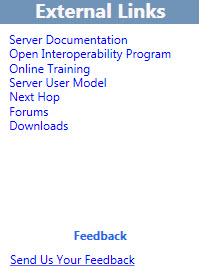

# Навигация по средству планирования в Skype для бизнеса Server 2015

Для навигации по средству планирования Skype для бизнеса Server 2015 используется сочетание панели инструментов, специальных кнопок и ссылок страницы, а также контекстных области. Области контекста предоставляют сведения о проекте для планирования и емкости, соответствующие вариантам выбора на определенной странице.

При запуске средства планирования конструктор сначала видит страницу "Добро пожаловать в средство планирования Skype для бизнеса **Server 2015".**

На странице приветствия конструктор выбирает "Начало **работы",** **"Разработка сайтов"** или **"Отображение".** For details, see [Create the initial topology design for Skype for Business Server 2015](create-the-initial-design.md).

В верхней части средства планирования находится панель инструментов, которая обеспечивает простой доступ к часто используемым функциям. Панель инструментов отображается здесь для справки, и каждая функция будет рассмотрена в соответствующих темах.

В левой части средства планирования имеется раздел "Внешние ссылки". Отсюда у конструктора есть простой доступ к сведениям о планировании и развертывании, а также другим техническим ресурсам, таким как учебные курсы, технические блоги, форумы и другие загружаемые ресурсы. Кроме того, в разделе "Внешние ссылки" находится ссылка "Обратная связь" для группы средств планирования Skype для бизнеса Server 2015.

На многих страницах средства планирования отображается контекстно-чувствительная к контексту областя действий. The Actions pane gives the designer easy access to main sections of the topology. Ссылки, доступные в области действий, изменяются в зависимости от уровня детализации топологии. The Actions pane is available after you have completed the interview questions and displayed your topology. В области действий находится раздел "Обзор", в котором отображаются номера, которые конструктор ввели в процессе собеседования. Обзор контекстно связан с отображаемой информацией.

Кроме того, сведения об оборудовании отображаются в обзоре в области действий. В конфигурации оборудования отображается список требований к оборудованию, рекомендуемых текущей топологией.

## См. также

[Создание начального проекта топологии для Skype для бизнеса Server 2015](create-the-initial-design.md)

[Редактирование проекта](https://technet.microsoft.com/library/08f639ba-0e5f-4ae7-9191-c3d96c25b169.aspx)

[Просмотр отчетов администратора](https://technet.microsoft.com/library/1dee56a9-a033-4201-9765-e3469bd7d3e3.aspx)
