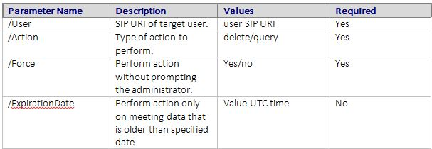

# <a name="skype-for-business-server-2015-resource-kit-tools-documentation"></a>Документация по средствам набора ресурсов Skype для бизнеса Server 2015

В этом разделе описываются средства в наборе ресурсов Skype для бизнеса Server 2015, в том числе назначение каждого средства, а также приводятся примеры их использования. Пакет ресурсов Skype для бизнеса Server 2015 позволяет упростить выполнение повседневных задач для ИТ-администраторов, которые развертывают Skype для бизнеса Server 2015 и управляют им. Например, с помощью средства **Web CONF Data** можно легко управлять данными, отправляемыми пользователями во время собрания по сети. Средство **SEFAUtil** можно использовать для настройки переадресации вызовов делегатов и ответа для пользователей. Мы рекомендуем ИТ-администраторам использовать эти средства для более эффективного управления Skype для бизнеса Server 2015.

## <a name="installation-of-the-resource-kit-tools"></a>Установка средств набора ресурсов

Чтобы установить пакет ресурсов Skype для бизнеса Server 2015, скачайте [OCSReskit. msi](https://www.microsoft.com/download/details.aspx?id=52631) из центра загрузки.

Запустите **OCSResKit. msi** , чтобы выполнить простую установку. MSI устанавливает все средства, указанные в следующем каталоге: **% Program Филес%\скипе for Business Server 2015 \ ResKit**. В этой папке есть инструменты, которые представляют собой автономные исполняемые файлы. Средства, у которых также есть вспомогательные файлы, находятся в своих вложенных папках.

## <a name="supported-environments"></a>Поддерживаемые среды

Пакет ресурсов Skype для бизнеса Server 2015 должен быть установлен на сервере, соответствующем спецификациям, необходимым для Skype для бизнеса Server 2015, обычно он используется для запуска Skype для бизнеса Server 2015.

## <a name="resource-kit-tools-overview"></a>Общие сведения о средствах набора ресурсов

Ниже приведен список средств, предоставленных в наборе ресурсов Skype для бизнеса Server 2015. Описание каждого средства, включая требования и пример использования, описано в следующих разделах.

- [ABSConfig](resource-kit-tools.md#ABSConfig)

- [Монитор службы политики пропускной способности](resource-kit-tools.md#bpsm)

- [Анализатор использования полосы пропускания](resource-kit-tools.md#bua)

- [Вызов Parkometer](resource-kit-tools.md#callpark)

- [DBAnalyze](resource-kit-tools.md#dba)

- [Импорт данных службы хранилища](resource-kit-tools.md#Issd)

- [LCSSync](resource-kit-tools.md#LCSSync)

- [Консоль поиска пользователей](resource-kit-tools.md#LUC)

- [мстурнпинг](resource-kit-tools.md#MsTurnPing)

- [Средство просмотра конфигурации сети](resource-kit-tools.md#NCV)

- [Динамический агент группы ответа](resource-kit-tools.md#RGAL)

- [SEFAUtil](resource-kit-tools.md#SEFAUtil)

- [SYSPrep. ps1](resource-kit-tools.md#SYSPrep)

- [Миграция объявлений неназначенных номеров](resource-kit-tools.md#UNAM)

- [Данные Web CONF](resource-kit-tools.md#WebConfData)

## <a name="absconfig"></a>ABSConfig
<a name="ABSConfig"> </a>

Средство настройки службы адресной книги (ABSConfig) — это средство администрирования, которое помогает администраторам настраивать конфигурацию службы адресной книги в Skype для бизнеса Server 2015. Это средство также позволяет администраторам Skype для бизнеса Server 2015 восстановить параметры службы адресной книги по умолчанию.

### <a name="description"></a>Описание

ABSConfig — это приложение графического пользовательского интерфейса, которое позволяет администраторам настраивать атрибуты доменных служб Active Directory, связанные со службой адресной книги.

Ниже приведены основные сценарии для этого средства.

- Чтобы разрешить администраторам сопоставлять атрибуты в доменных службах Active Directory с атрибутами Skype для бизнеса Server 2015.

- Чтобы разрешить администраторам указывать атрибут доменных служб Active Directory, который необходимо включить или исключить в файлах службы адресной книги.

- , Чтобы разрешить администраторам восстанавливать параметры службы адресной книги по умолчанию.

Средство ABSConfig можно запустить с помощью файла ABSConfig. exe. Средство откроется на вкладке **Настройка атрибутов** . В этой таблице представлены параметры для сопоставления атрибутов доменных служб Active Directory с полями атрибутов Skype для бизнеса Server 2015 и указания пользователей, которые следует включить или исключить в файлах службы адресной книги на основе определенных фильтров атрибутов. Кроме того, можно настроить значение номера телефона, включаемого в файл адресной книги. Параметр **восстановить значения по умолчанию** позволяет администраторам восстанавливать параметры службы адресной книги по умолчанию.

> [!NOTE]
> Повторное сопоставление атрибутов AD с другими именами полей OC будет работать только при загрузке файла адресной книги и не поддерживается веб-запросом адресной книги.

### <a name="output"></a>Output

ABSConfig сохраняет конфигурацию службы адресной книги в базе данных.

```console
Path: %ProgramFiles%\Skype for Business Server 2015\Reskit
```

### <a name="purpose"></a>Назначение

ABSConfig предоставляет быстрый и простой способ настройки службы адресной книги Skype для бизнеса Server 2015.

### <a name="requirements"></a>Requirements

#### <a name="computer"></a>Компьютер

ABSConfig можно запустить только с компьютера, присоединенного к домену, на котором установлен Skype для бизнеса Server 2015. В случае Skype для бизнеса Server 2015, Enterprise Edition это средство можно запустить на всех серверах переднего плана, на которых в процессе установки включена служба адресной книги.

#### <a name="network"></a>Сеть

Компьютер должен иметь возможность подключения к интерфейсному пулу и серверной базе данных.

#### <a name="software"></a>Программное обеспечение

Перед запуском средства ABSConfig необходимо установить следующие компоненты программного обеспечения:

- Skype для бизнеса Server 2015

#### <a name="users"></a>Пользователи

Администраторы, у которых есть разрешения, необходимые для обновления развертывания Skype для бизнеса Server 2015.

### <a name="examples"></a>Примеры

ABSConfig можно запустить, введя **ABSConfig. exe** в командной строке. Ниже показан пользовательский интерфейс средства ABSConfig.


### <a name="summary"></a>Сводка

Средство ABSConfig предоставляет администраторам быстрые и простые в использовании средства для настройки службы адресной книги Skype для бизнеса Server 2015.

## <a name="bandwidth-policy-service-monitor"></a>Монитор службы политики пропускной способности
<a name="bpsm"> </a>

Средство мониторинга службы политики пропускной способности позволяет администраторам просматривать список следующих элементов:

1. Все настроенные службы политики пропускной способности Skype для бизнеса Server 2015 (проверка подлинности и ядро) в топологии

2. Подключения, которые каждая служба делает с другими службами политики пропускной способности и с пограничными серверами

3. Все ссылки, настроенные в документе конфигурации сети и использование пропускной способности в режиме реального времени, отображаются каждой из служб политики пропускной способности.

### <a name="description"></a>Описание

Монитор службы политики пропускной способности реализован в виде приложения, основанного на пользовательском интерфейсе. Администраторы запускают средство, запуская Пдпмонуи. exe.

При запуске средства будет предпринята попытка обнаружить список служб политики пропускной способности в топологии. После первоначального обновления область слева от окна заполняется списком служб, сгруппированных по кластерам, к которым они принадлежат.

Когда Администраторы выбирают определенную службу политики пропускной способности, в области справа отображаются сведения о конкретной службе. Эта область также содержит две основные вкладки, отображающие информацию.

#### <a name="machine-info-tab"></a>Вкладка "сведения о компьютере"

На вкладке **сведения о компьютере** отображаются сведения о выбранном службе политики пропускной способности, а также список и состояние всех подключений, выполняемых выбранной службой политики пропускной способности, к другим службам.

#### <a name="topology-info-tab"></a>Вкладка "сведения о топологии"

На вкладке **сведения о топологии** отображается список всех ссылок, настроенных в параметрах конфигурации сети. Для каждой ссылки отображается пропускная способность звука и видео. Кроме того, отображается текущая полоса пропускания (в кбит/с и в процентах от емкости). Инструмент использует цветовое кодирование для выделения ссылок, которые имеют близкое к емкости значение, позволяет администраторам быстро изолировать такие ссылки.

> [!NOTE]
>  Если монитор службы политики пропускной способности испытывает сбой при подключении к любой из настроенных служб политики пропускной способности, информация в разделе сведения о **компьютере** и вкладки **сведения о топологии** не будут заполнены. Тем не менее, средство может подключаться изначально, но при этом теряет соединение со службой. В таких случаях администраторы могут видеть устаревшую информацию. На каждой из вкладок имеется штамп времени **последнего обновления** , который позволяет администраторам просматривать время последнего обновления данных для конкретной службы политики пропускной способности.

### <a name="output"></a>Output

Отсутствует вывод командной строки; выходные данные программы хранятся в основном графическом интерфейсе пользователя.

### <a name="purpose"></a>Назначение

Средство мониторинга службы политики пропускной способности позволяет администраторам видеть состояние каждой службы политики пропускной способности, определенной в топологии. Кроме того, администраторы могут видеть использование пропускной способности в режиме реального времени для всех ссылок, определенных в документе конфигурации сети.

### <a name="requirements"></a>Requirements

Средство мониторинга службы политики пропускной способности необходимо запускать на компьютере, входящем в топологию Skype для бизнеса Server.

### <a name="summary"></a>Сводка

Монитор службы политики пропускной способности может быть ценным ресурсом для администраторов, чтобы они могли проверить состояние всех служб политики пропускной способности в топологии, и более важно — они могут получить использование пропускной способности в режиме реального времени для ссылок, которые определено в параметрах конфигурации сети.

## <a name="bandwidth-utilization-analyzer"></a>Анализатор использования полосы пропускания
<a name="bua"> </a>

Анализатор использования полосы пропускания — это средство, которое создает отчеты о различных режимах использования полосы пропускания в конечных точках UC по каналам глобальной сети в корпоративной сети. Эти отчеты можно использовать для ознакомления с текущей моделью потребления полосы пропускания и для планирования пропускной способности.

### <a name="description"></a>Описание

Анализатор использования полосы пропускания реализуется как приложение, основанное на пользовательском интерфейсе. Это средство создает отчеты специально для использования звука в сети и помогает при планировании мощности. Кроме того, он выполняет итерацию по пропускной способности, назначенной различным каналам.

### <a name="output"></a>Output

Анализатор использования полосы пропускания предоставляет графический показатель мощности и интенсивности пропускной способности для всех каналов глобальной сети, настроенных в системе.

### <a name="purpose"></a>Назначение

В любом развертывании голосовых и видеофайлов очень важно отслеживать и оценить тенденцию использования пропускной способности трафика мультимедиа в корпоративной сети. Анализатор использования полосы пропускания позволяет администратору добиться всего этого. Это средство выполняет следующие действия:

- Создает конкретные отчеты по использованию звука в сети.

- Способствует более эффективному планированию емкости и итерации по емкости полосы пропускания, назначенной различным связям

Анализатор использования полосы пропускания может создавать графические графики для отчетов о емкости и использовании полосы пропускания; они перечислены ниже.

- Все связи WAN в корпоративной сети

- Фильтрация по выбранным каналам глобальной сети

- Фильтрация по каналам WAN с превышением установленной емкости канала

- Фильтрация по каналам WAN с использованием подготовленной пропускной способности

- Фильтрация по каналам WAN с достижением критических уровней (использование пропускной способности, превышающее 90% пропускной способности канала WAN)

- Фильтрация по типу канала WAN — связи сайтов сети, взаимосвязи между регионами и ссылки на сайте

- Фильтрация по области сети

#### <a name="applications"></a>Приложения

Анализатор использования полосы пропускания использует следующие два приложения (инструменты):

- **Программы wanlinklogcollector. exe** это средство позволяет пользователю ввести необходимые сведения.

- **BandwidthUtilizationAnalyzer. xlsm** отчет по электронной таблице Microsoft Excel автоматически запускается программой программы wanlinklogcollector. exe. Это приложение позволяет пользователю применять фильтры к отчету, как показано далее в этой статье.

#### <a name="phases-of-using-bandwidth-utilization-analyzer"></a>Этапы использования анализатора использования полосы пропускания

Использование анализатора использования полосы пропускания состоит из двух этапов:

- Сбор журналов, выполняемых с помощью программы wanlinklogcollector. exe

- Настройка отчетов, выполняемых с помощью BandwidthUtilizationAnalyzer. xlsm

    > [!IMPORTANT]
    > Для конечных пользователей настоятельно рекомендуется запускать BandwidthUtilizationAnalyzer. xlsm вручную.

#### <a name="starting-bandwidth-utilization-analyzer"></a>Запуск анализатора использования полосы пропускания

Запустите программы wanlinklogcollector. exe из командной строки или с помощью проводника Windows.

 **Использование программы wanlinklogcollector. exe**

Использование программы wanlinklogcollector. exe состоит из трех этапов:

1. **Запись временной шкалы** Укажите временную шкалу, для которой необходимо создать отчет.

2. **Указание каталогов файлов** Предоставление сведений о расположении файлов

3. **Сбор журналов и запуск средства просмотра отчетов** Выполнение команды для создания отчета

#### <a name="step-1---log-the-timeline"></a>Шаг 1: запись временной шкалы

Ведение журнала временной шкалы позволяет пользователю средства указать следующие сведения, как показано на рисунке ниже.

1. **Дата начала** Это Дата начала временной шкалы, для которой создается отчет; Например, 1 августа 2010 г.

2. **Дата окончания** Это Дата окончания временной шкалы, для которой создается отчет; Например, 30 сентября 2010 г.

     

#### <a name="step-2---specify-the-file-directories"></a>Шаг 2. Указание каталогов файлов

Пользователь может указать следующие каталоги файлов, как показано ниже.

- **Расположение файлов журнала сервера** Расположение папки, в которой хранятся журналы сервера политики пропускной способности. Обычно это \<филесервер\> \\<выбора \аппсерверфилес\пдп. Fe\>

- **Расположение хранилища временных файлов** Расположение временного файла, в котором хранятся промежуточные файлы во время создания отчета.

    

    > [!NOTE]
    > Обеспечьте достаточный доступ к файлам для журналов сервера и папку хранилища временных файлов для пользователя средства.

#### <a name="step-3---collect-the-logs-and-start-the-report-viewer"></a>Шаг 3: сбор журналов и запуск средства просмотра отчетов

Для сбора журналов и запуска средства просмотра отчетов нажмите кнопку **выполнить** , как показано ниже. На этом этапе выполняется сбор необходимых данных.


После успешного выполнения проверки входного сообщения отображается приведенное ниже сообщение.


Нажмите кнопку **ОК**. BandwidthUtilizationAnalyzer. xlsm автоматически запускается. Следуйте инструкциям в окне сообщения. Дополнительные сведения см. в разделе **using BandwidthUtilizationAnalyzer. xlsm** в следующем разделе.


### <a name="using-bandwidthutilizationanalyzerxlsm"></a>Использование BandwidthUtilizationAnalyzer. xlsm

1. Когда BandwidthUtilizationAnalyzer. xlsm запускается автоматически, нажмите кнопку **Обновить** , как показано ниже.

     

2. При открытии папки с файлами выберите файл консолидировать. CSV из расположения, указанного в поле сообщение, как показано ниже. Он также показывает расположение как **C:\temp**.

     

3. Нажмите кнопку **Импорт**.

4. Графический график создается автоматически. Он доступен при исчезновении указателя рабочего стола в фоновом режиме.

     

#### <a name="applying-filters-to-the-report-view"></a>Применение фильтров к представлению отчета

Фильтры, которые можно применить к представлению отчета, как показано ниже, описаны ниже.


1. **Name (имя** ) Фильтрация по каналам WAN (фильтр находится в правой части диаграммы). Префикс указывает следующие типы ссылок; Ознакомьтесь с вертикальным (синим) полем:

   - **Сайт S** Связь WAN между сетевым сайтом и регионом сети

   - **Межсайтовый** Канал WAN между двумя сетевыми сайтами

   - **Внутрихолдинговый** Канал WAN между двумя областями сети

2. **Превышено ограничение** Фильтрация по каналам глобальной сети, использование пропускной способности которых превышает емкость полосы пропускания

3. **Критические уровни** Фильтрация по каналам глобальной сети, использование которых пропускной способности достигло 90% или превышает емкость полосы пропускания

4. **Неиспользованный** Фильтрация по каналам глобальной сети, использование полосы пропускания которых было меньше 25% от емкости полосы пропускания

5. **Тип ссылки** Фильтрация по следующим типам каналов WAN Links:

   - Тип **сетевого сайта**

   - Тип **межсайтового взаимодействия**

   - Тип **связи между регионами**

6. **Region (регион** ) Фильтрация по регионам сети

На следующих рисунках показаны ранее описанные фильтры.

Фильтрация по **имени**. Выберите список ссылок, которые должны отображаться на диаграмме.


Фильтрация по **превышению лимита**. Выберите **true** , чтобы применить фильтр.


Фильтрация по **критическим уровням**. Выберите **true** , чтобы применить фильтр.


Отфильтровать по **в разделе используется**. Выберите **true** , чтобы применить фильтр.


Фильтрация по **типу ссылки**. Выберите тип или типы, которые необходимо отобразить.


Фильтрация по **регионам**. Выберите список регионов, ссылки на которые необходимо отобразить.


### <a name="requirements"></a>Requirements

- Платформа .NET Framework 3,5

- Microsoft Excel 2010 или Excel 2007

### <a name="summary"></a>Сводка

Анализатор использования полосы пропускания используется для отображения использования пропускной способности звука для трафика UC в сети. Это средство можно использовать для отправки отчетов об использовании пропускной способности видео в сети.

## <a name="call-parkometer"></a>Вызов Parkometer
<a name="callpark"> </a>

Call Parkometer — это приложение командной строки, предоставляющее простой доступ к базе данных орбиты парковки вызовов.

### <a name="description"></a>Описание

Parkometer вызовов — это средство для отслеживания приостановленных звонков в текущий момент. Он также собирает статистику по орбитам и использованию сервера парковки вызовов (CPS). Это средство командной строки предоставляет доступ для чтения и записи к базе данных SQL Server орбиты CPS с локального или удаленного подключенного компьютера.

Все параметры являются взаимоисключающими. Синтаксис командной строки выглядит следующим образом:

- параметр **-o** — список всех диапазонов орбиты, настроенных для этого пула.

- параметр **-n** — перечисляет все используемые на данный момент орбиты в этом пуле. Отображаются следующие сведения:

  - Универсальный код ресурса (URI) SIP и паркующего;.

  - Имя узла сервера публикаций Contribute, в котором приостановлен звонок.

  - Метка времени приостановки звонка.

- параметр **-f** — отображает число свободных орбит в пуле.

- **параметр- \<r\> n** — содержит \<n\> последних приостановленных звонков. Отображаются следующие сведения:

  - Универсальный код ресурса SIP SIP.

  - URI SIP паркующего;.

  - Имя узла сервера публикаций Contribute, в котором был приостановлен вызов.

  - Метка времени получения или удаления вызова.

- параметр **–\<t\> n** — тестирует резервирование орбиты в базе данных, чтобы показать случайные значения назначенных номеров орбиты.

### <a name="output"></a>Output

В зависимости от входных параметров, указанных в командной строке, вызовите Parkometer отображает следующие выходные данные:

- Все диапазоны орбит, настроенные для этого пула

- Приостановленные звонки

- Количество свободных (доступных) орбит

- Недавно приостановленные звонки

- Зарезервированные орбиты для тестирования единообразных и случайных значений орбиты

### <a name="purpose"></a>Назначение

Средство CPS предназначено для предоставления доступа к базе данных CPS с помощью командной строки. Администратор может просматривать использование CPS и определять число орбит, назначенных пулу.

### <a name="requirements"></a>Requirements

Если это средство запущено на том же компьютере, где установлен сервер публикаций Contribute, никаких требований не существует. Если это средство запущено на удаленном компьютере, то база данных SQL Server, используемая Skype для бизнеса Server 2015, должна быть настроена на разрешение удаленного доступа. Для подключения к SQL Server с помощью Parkometer вызовов необходимо настроить строку подключения к базе данных SQL Server. Эта строка подключения к базе данных SQL Server определена в файле конфигурации **parkometer. exe. config**. Он должен размещаться в том же каталоге, где находится parkometer. exe. Приведенный ниже XML-файл является примером parkometer. exe. config. Параметры, которые необходимо настроить — это имя пользователя (например, Мидомаин\администратор), пароль (например, мипассворд) и имя узла (например, MyServer).

```xml
<?xml version="1.0" encoding="utf-8" ?>
<configuration>
  <appSettings>
   <add key="SQL" value="server=myserver\RTC;
database=cpsdyn;
User Id=mydomain\Administrator;
Password=mypassword.;
Integrated Security=false;"/>
  </appSettings>
</configuration>
```

### <a name="examples"></a>Примеры

Развернутые диапазоны орбиты: параметр – o содержит список всех диапазонов орбиты, настроенных для этого пула, как показано ниже.


В настоящее время приостановленные вызовы: параметр – n перечисляет все используемые на данный момент орбиты на этом пуле, как показано ниже.


Число свободных орбит: параметр – f содержит число свободных орбит в пуле, как показано ниже.


Недавно приостановленные звонки: параметр – r \<n\> содержит \<n\> последних приприпаркованных вызовов, как показано ниже.


Тестовое резервирование орбиты: \<параметр\> -t n тестирует резервирование орбиты в базе данных, как показано ниже.


### <a name="summary"></a>Сводка

Call Parkometer — это средство командной строки, предоставляющее подробные сведения о сервере парковки вызовов.

## <a name="dbanalyze"></a>DBAnalyze
<a name="dba"> </a>

### <a name="description"></a>Описание

DBAnalyze — это средство командной строки, помогающее администраторам собирать отчеты анализа о базах данных Skype для бизнеса Server 2015. В DBAnalyze имеются следующие режимы: диагностика, данные пользователей, конференц-связи, MCUs и фрагментация дисков:

- **Диагностический режим** Создает отчет, содержащий сведения о таблицах (число записей, фрагментация, размер данных, и размер индекса), размерах файлов данных и журналов, время последнего резервного копирования и распространения контактных лиц между серверами с Microsoft Office Communications Server, средним числом разрешений, контактами, контейнерами, подписками, публикациями, конечными точками на пользователя, неправильной находящимися пользователями, пользователями, которые не могут маршрутизироваться, средним числом конференций, запланированных для пользователей и версия базы данных.

    > [!NOTE]
    > Выполнение диагностического режима может повлиять на производительность сервера.

- **Режим данных пользователя** Сообщает сведения о контактах, контейнерах, подписках, публикациях, разрешениях и группах контактов для указанного пользователя или для пользователей, имеющих этого пользователя в списках контактов и разрешений. В этом режиме также выводится сводная информация о конференциях, на которые пользователь организует или приглашает.

- **Режим конференции** Сообщает подробные данные о конкретной конференции, в том числе сведения о времени расписания для Конференции, список приглашений, список типов мультимедиа, разрешенных для Конференции, активные MCUs (единицы управления MultiPoint), список активных участников и состояние сигналов каждого участника.

- **Расшифровка идентификатора собрания** Декодирует идентификатор собрания для телефонной сети общего пользования (PSTN), указанный с помощью коммутатора **/pstnid** , но не подключается к внутреннему серверу для получения подробных сведений.

- **Разрешение конференции** Декодирует идентификатор собрания PSTN, указанный с помощью параметра **/pstnid** , и отображает сведения о конференции, указанной идентификатором.

- **Режим MCUs** Сообщает идентификатор, тип мультимедиа, URL-адрес, состояние пульса, нагрузку на конференцию и загрузку участников для каждого MCU в пуле.

- **Режим фрагментации диска** Отображает состояние фрагментации всех дисков.

Это средство можно использовать для диагностики различных проблем или для оказания помощи администратору по планированию мощности. Например, если большинство пользователей, размещенных на сервере A, выбирают пользователей, размещенных на сервере б, в качестве их контактов, администратор может переместить пользователей на сервер а на сервер б, чтобы уменьшить трафик между серверами.

### <a name="output"></a>Output

Это средство выводит предопределенные отчеты о базе данных Skype для бизнеса Server 2015. **Путь**:%ProgramFiles%\Skype для бизнеса Server 2015 \ reskit

### <a name="purpose"></a>Назначение

Чтобы установить Dbanalyze. exe, скопируйте его в локальную папку и запустите средство. Чтобы использовать средство, выполните приведенную ниже команду в командной строке. `dbanalyze.exe [/v] [/report:value] [/sqlserver:value] [/user:user@domain.com] [/conf:value][/pstnid:Value] [/maxcontacts:value]`Ниже приведены описания параметров командной строки.


### <a name="requirements"></a>Requirements

 **Computer (компьютер** ) DBAnalyze можно запустить только с компьютера, присоединенного к домену, на котором установлен Skype для бизнеса Server 2015.

 **Network (сеть** ) Компьютер должен иметь возможность подключения к серверной базе данных.

 **Программное обеспечение** Перед запуском DBAnalyze необходимо установить компоненты программного обеспечения Skype для бизнеса Server 2015.

 **Users (пользователи** ) В приведенной ниже таблице указаны администраторы, у которых есть необходимые разрешения на доступ к базам данных Skype для бизнеса Server 2015.


> [!NOTE]
> Локальная учетная запись администратора необходима для **/Report: режим диска** .

### <a name="examples"></a>Примеры

Ниже приведены примеры допустимых команд Dbanalyze. exe.

```console
dbanalyze.exe /report:diag
dbanalyze.exe /report:user /user:usera@domainb.com
dbanalyze.exe /report:conf /user:bob@example.com /conf:1W9J71SKSX2X
dbanalyze.exe /report:resolve /pstnid:12345
dbanalyze.exe /report:mcus
dbanalyze.exe /report:disk
```

### <a name="summary"></a>Сводка

Дбанализер позволяет администраторам быстро и легко анализировать базы данных Skype для бизнеса Server 2015.

## <a name="import-storage-service-data"></a>Импорт данных службы хранилища
<a name="Issd"> </a>

Средство Импортсторажесервицедата Resource Kit позволяет повторно импортировать данные очередей и конечных точек, которые были удалены из службы хранения (LYSS), обратно в службу хранения.

### <a name="description"></a>Описание

Данные, удаляемые из службы хранилища, могли быть автоматически (периодически) на основе состояния элемента очереди или размера базы данных. Это могло произойти из-за вызова командлета отработки отказа пула вручную или командлета Сторажесервицефуллфлуш (который вызывается командлетом отработки отказа пула). Обратите внимание, что в идеале данные не будут повторно импортироваться, если размер базы данных службы хранения (LYSS) на интерфейсных серверах переднего плана находится выше обычного уровня, так как это может привести к тому, что все данные будут экспортированы обратно. Кроме того, все проблемы, которые могут возникать при возникновении ошибок при увеличении очереди службы хранения, должны быть решены (например, ошибки конечной точки Exchange, проблемы с сетью или другие проблемы).

 **Сценарий 1:** при отработке отказа пула файлы могут удаляться из службы хранилища для каждого сервера переднего плана. После завершения отработки отказа необходимо запустить средство для повторного импорта данных.

 **Сценарий 2:** данные очищаются автоматически каждый день или в ответ на базу данных службы хранилища, превышающие определенные пороговые значения размера (например, 60%, 80%, 90% Full). Эти автоматически удаляемые данные должны повторно импортироваться администратором регулярно. В приведенной выше ситуации, если пакет мониторинга SCOM не развернут, существуют события для службы хранилища Skype для бизнеса Server, связанные с очисткой данных из службы хранилища. Идентификаторы событий 32075 (операция полного сброса начинается), 32076 (полная очистка завершена), 32082 (начато копирование на уровне обслуживания), 32083 (очистка на уровне обслуживания завершена), 32089 (очистка выполнена из-за заполнения базы данных). Обратите внимание, что эти коды событий соответствуют выпуску RTM. Когда администратор видит эти события, это означает, что существуют файлы, которые были удалены. Эти данные следует регулярно импортировать обратно с помощью этого средства, например один раз в неделю.

При выпуске веб-службы, если развернут пакет мониторинга работоспособности SCOM для Skype для бизнеса Server, появляются новые оповещения, которые попросите администратора повторно импортировать данные, которые были удалены, обратно в службу хранилища. В журнале событий на сервере переднего плана, вызвавшем оповещение, появится соответствующее событие. Событие предоставит описание родительского пути, в котором находятся файлы данных с очисткой, а также количество файлов, соответствующих условиям оповещения. Критерий оповещения состоит в том, что существует X или более файлов по отношению к определенному родительскому пути по крайней мере по крайней мере по крайней мере по оси Y дней (где X и Y задаются в Сторажесервице, но их можно переопределить, изменив файл АППКОНФИГ). Два примера событий, которые могут вызывать оповещение о работоспособности, показаны ниже, а их родительский путь отличается. Один из возможных вариантов — файловый ресурс веб-службы, а другая возможность — локальный каталог данных приложений для каждого сервера переднего плана. (например, К:\програмдата\микрософт\скипе для бизнеса Server 2015 \ Сторажесервице). После этого администратор запустит это средство reskit.

Это средство увеличит нагрузку ЦП и ввода-вывода на интерфейсном сервере, на котором она работает, а также на других интерфейсных серверах, в случае, если данные не принадлежат внешнему интерфейсу, на котором выполняется средство. Мы рекомендуем запускать это средство, если на интерфейсных серверах не загружается высокая загрузка ЦП и ввода-вывода, например, в нерабочее время. Во вторых, это средство может выполнить из 2 до 3 минут, чтобы импортировать один файл данных. Помните об этом при оценке времени, в течение которого будет выполняться средство. Подробный файл журнала, создаваемый средством, по умолчанию отображается в хранилище файлов. Удалите его, если нет сообщений об ошибках, так как файл журнала может содержать не более десятков МБ.


### <a name="requirements"></a>Requirements

Установите средства набора ресурсов Skype для бизнеса Server 2015. Средство запускается на подключенных к домену компьютерах, на которых установлены оболочки управления Skype для бизнеса Server и Skype для бизнеса Server. Средство использует командлет из командной консоли, чтобы определить все серверы переднего плана в пуле. Во вторых случаях средство необходимо запускать на компьютере в пуле, где установлена база данных **RtcLocal** . Эта база данных используется средством для получения расположения общего файлового ресурса WEBSERVICE для пула. Кроме того, перед использованием средства каждый сервер переднего плана должен сначала включить удаленное взаимодействие Windows PowerShell с помощью командлета **Enable-псремотинг** на каждом сервере переднего плана, а также на компьютере, с которого выполняется средство. В противном случае удаленные команды Windows PowerShell из этого средства завершатся с ошибками. Удаленное взаимодействие Windows PowerShell может быть отключено на всех серверах переднего плана в пуле после его завершения. Наконец, учетная запись или учетные данные, вызывающие средство, должны иметь разрешение на чтение и запись для общего файлового ресурса WebService для пула, в котором выполняется это средство. В противном случае средство завершится с ошибками разрешений ввода-вывода.

> [!NOTE]
> В Windows Server 2012 удаленное взаимодействие Windows PowerShell включено по умолчанию, но не в операционной системе Windows Server 2008.

### <a name="examples"></a>Примеры

```console
>  C:\StorageService>ImportStorageServiceData.exe
Description:
This tool will re-import Storage Service (LYSS) flushed queue data back in.  For a pool: you are required to run this tool on a machine inside the pool which has the Lync Server Management Shell installed.  Additionally, all front end machines need to have Windows Powershell Remoting enabled before executing this tool by executing Enable-PSRemoting.  Also, please ensure that all Storage Service instance DB Size are at the 'Normal' level (verify this by viewing Eventlog events). Otherwise re-importing may cause data to be flushed out again if any Storage Service instance DB size level goes above 'Normal'.
Usage: Default behavior is to Import data from web service file share as well as any files on all Front End machines in pool.
Additional Options:
-Verbose                    : Turn verbose output on.

-StorageServiceHostName     : Host Name of Storage Service WCF endpoint.  ( Default=localhost netnamedpipe binding. )

-FileSharePath              : Import only all data from just under the UNC path specified.

ActivityID: cc3b62ff-bb66-4e61-a6e2-96cb3626315c. <-- Use this to correlate with StorageService trace logs if troubleshooting.
Type Server name (TCP binding) or press <enter> for localhost (NamePipe binding):
Using NetNamedPipeBinding...
OnTopologyChanged Event received
Web Service File Share: \\dc.vdomain.com\OcsFileStore\co1-WebServices-1\StorageService

Front Ends:
server.vdomain.com
server2.vdomain.com
server1.vdomain.com
server3.vdomain.com
Looking under directory: \\dc.vdomain.com\OcsFileStore\co1-WebServices-1\StorageService for exported data.
# Files found: 8
Starting Import for file:\\dc.vdomain.com\OcsFileStore\co1-WebServices-1\StorageService\DataExport\2
0120910\SERVER.vdomain.com\944f5724c65c5f93900dc1c8c898b102__0.xml
Items deserialized: 20

All items in file were enqueued successfully, will try to delete file: \\dc.vdomain.com\OcsFileStore\co1-WebServices-1\StorageService\DataExport\20120910\SERVER.vdomain.com\944f5724c65c5f93900dc1c8c898b102__0.xml

All items in file failed to enqueue so file will not be deleted.  File path: \\dc.vdomain.com\OcsFileStore\co1-WebServices-1\StorageService\DataExport\20120910\SERVER.vdomain.com\944f5724c65c5f93900dc1c8c898b102__0.xml

Summary for file \\dc.vdomain.com\OcsFileStore\co1-WebServices-1\StorageService\DataExport\20120910\SERVER.vdomain.com\944f5724c65c5f93900dc1c8c898b102__0.xml: succeeded: 20, failed: 0

Starting Import for file:\\dc.vdomain.com\OcsFileStore\co1-WebServices-1\StorageService\DataExport\20120910\SERVER1.vdomain.com\17d5435ae40259f7bbdf1866776386e4__0.xml
Items deserialized: 20

[cc3b62ff-bb66-4e61-a6e2-96cb3626315c] Send EnqueueMessages to redirected, targetServer=server1.vdomain.com, queueItems=20

All items in file were enqueued successfully, will try to delete file: \\dc.vdomain.com\OcsFileStore\co1-WebServices-1\StorageService\DataExport\20120910\SERVER1.vdomain.com\17d5435ae40259f7bbdf1866776386e4__0.xml

All items in file failed to enqueue so file will not be deleted.  File path: \\dc.vdomain.com\OcsFileStore\co1-WebServices-1\StorageService\DataExport\20120910\SERVER1.vdomain.com\17d5435ae40259f7bbdf1866776386e4__0.xml

Summary for file \\dc.vdomain.com\OcsFileStore\co1-WebServices-1\StorageService\DataExport\20120910\
SERVER1.vdomain.com\17d5435ae40259f7bbdf1866776386e4__0.xml: succeeded: 20, failed: 0

Starting Import for file:\\dc.vdomain.com\OcsFileStore\co1-WebServices-1\StorageService\DataExport\20120910\SERVER1.vdomain.com\904f6c9b8ac951ae8b3c86684d3832e4__0.xml

Items deserialized: 20
[cc3b62ff-bb66-4e61-a6e2-96cb3626315c] Send EnqueueMessages to redirected, targetServer=server1.vdomain.com, queueItems=20

All items in file were enqueued successfully, will try to delete file: \\dc.vdomain.com\OcsFileStore
\co1-WebServices-1\StorageService\DataExport\20120910\SERVER1.vdomain.com\904f6c9b8ac951ae8b3c86684d
3832e4__0.xml

All items in file failed to enqueue so file will not be deleted.  File path: \\dc.vdomain.com\OcsFil
eStore\co1-WebServices-1\StorageService\DataExport\20120910\SERVER1.vdomain.com\904f6c9b8ac951ae8b3c
86684d3832e4__0.xml

Summary for file \\dc.vdomain.com\OcsFileStore\co1-WebServices-1\StorageService\DataExport\20120910\
SERVER1.vdomain.com\904f6c9b8ac951ae8b3c86684d3832e4__0.xml: succeeded: 20, failed: 0

Starting Import for file:\\dc.vdomain.com\OcsFileStore\co1-WebServices-1\StorageService\DataExport\2
0120910\SERVER2.vdomain.com\69844a271e6c5633a1f2b46a42287dd6__0.xml

Items deserialized: 20

[cc3b62ff-bb66-4e61-a6e2-96cb3626315c] Send EnqueueMessages to redirected, targetServer=server2.vdom
ain.com, queueItems=20

All items in file were enqueued successfully, will try to delete file: \\dc.vdomain.com\OcsFileStore
\co1-WebServices-1\StorageService\DataExport\20120910\SERVER2.vdomain.com\69844a271e6c5633a1f2b46a42
287dd6__0.xml

All items in file failed to enqueue so file will not be deleted.  File path: \\dc.vdomain.com\OcsFil
eStore\co1-WebServices-1\StorageService\DataExport\20120910\SERVER2.vdomain.com\69844a271e6c5633a1f2
b46a42287dd6__0.xml

Summary for file \\dc.vdomain.com\OcsFileStore\co1-WebServices-1\StorageService\DataExport\20120910\
SERVER2.vdomain.com\69844a271e6c5633a1f2b46a42287dd6__0.xml: succeeded: 20, failed: 0

Starting Import for file:\\dc.vdomain.com\OcsFileStore\co1-WebServices-1\StorageService\DataExport\2
0120910\SERVER3.vdomain.com\3313935458e35b9b9759e08a15d251e6__0.xml

Items deserialized: 20

[cc3b62ff-bb66-4e61-a6e2-96cb3626315c] Send EnqueueMessages to redirected, targetServer=server3.vdom
ain.com, queueItems=1

All items in file were enqueued successfully, will try to delete file: \\dc.vdomain.com\OcsFileStore
\co1-WebServices-1\StorageService\DataExport\20120910\SERVER3.vdomain.com\3313935458e35b9b9759e08a15
d251e6__0.xml

All items in file failed to enqueue so file will not be deleted.  File path: \\dc.vdomain.com\OcsFil
eStore\co1-WebServices-1\StorageService\DataExport\20120910\SERVER3.vdomain.com\3313935458e35b9b9759
e08a15d251e6__0.xml

Summary for file \\dc.vdomain.com\OcsFileStore\co1-WebServices-1\StorageService\DataExport\20120910\
SERVER3.vdomain.com\3313935458e35b9b9759e08a15d251e6__0.xml: succeeded: 20, failed: 0

Starting Import for file:\\dc.vdomain.com\OcsFileStore\co1-WebServices-1\StorageService\DataExport\2
0120910\SERVER3.vdomain.com\4501e04eae4856059346949ff817c220__0.xml
Items deserialized: 20
[cc3b62ff-bb66-4e61-a6e2-96cb3626315c] Send EnqueueMessages to redirected, targetServer=server3.vdom
ain.com, queueItems=1
All items in file were enqueued successfully, will try to delete file: \\dc.vdomain.com\OcsFileStore
\co1-WebServices-1\StorageService\DataExport\20120910\SERVER3.vdomain.com\4501e04eae4856059346949ff8
17c220__0.xml
All items in file failed to enqueue so file will not be deleted.  File path: \\dc.vdomain.com\OcsFil
eStore\co1-WebServices-1\StorageService\DataExport\20120910\SERVER3.vdomain.com\4501e04eae4856059346
949ff817c220__0.xml

Summary for file \\dc.vdomain.com\OcsFileStore\co1-WebServices-1\StorageService\DataExport\20120910\
SERVER3.vdomain.com\4501e04eae4856059346949ff817c220__0.xml: succeeded: 20, failed: 0
Starting Import for file:\\dc.vdomain.com\OcsFileStore\co1-WebServices-1\StorageService\DataExport\2
0120910\SERVER3.vdomain.com\5ad77443ad955a22a876749be66d5317__0.xml

Items deserialized: 20
[cc3b62ff-bb66-4e61-a6e2-96cb3626315c] Send EnqueueMessages to redirected, targetServer=server3.vdom
ain.com, queueItems=20
All items in file were enqueued successfully, will try to delete file: \\dc.vdomain.com\OcsFileStore
\co1-WebServices-1\StorageService\DataExport\20120910\SERVER3.vdomain.com\5ad77443ad955a22a876749be6
6d5317__0.xml
All items in file failed to enqueue so file will not be deleted.  File path: \\dc.vdomain.com\OcsFil
eStore\co1-WebServices-1\StorageService\DataExport\20120910\SERVER3.vdomain.com\5ad77443ad955a22a876
749be66d5317__0.xml
Summary for file \\dc.vdomain.com\OcsFileStore\co1-WebServices-1\StorageService\DataExport\20120910\
SERVER3.vdomain.com\5ad77443ad955a22a876749be66d5317__0.xml: succeeded: 20, failed: 0
Starting Import for file:\\dc.vdomain.com\OcsFileStore\co1-WebServices-1\StorageService\DataExport\2
0120910\SERVER3.vdomain.com\a11e27ae439a582288d4657eda86b565__0.xml
Items deserialized: 20
[cc3b62ff-bb66-4e61-a6e2-96cb3626315c] Send EnqueueMessages to redirected, targetServer=server3.vdom
ain.com, queueItems=20
All items in file were enqueued successfully, will try to delete file: \\dc.vdomain.com\OcsFileStore
\co1-WebServices-1\StorageService\DataExport\20120910\SERVER3.vdomain.com\a11e27ae439a582288d4657eda
86b565__0.xml
All items in file failed to enqueue so file will not be deleted.  File path: \\dc.vdomain.com\OcsFil
eStore\co1-WebServices-1\StorageService\DataExport\20120910\SERVER3.vdomain.com\a11e27ae439a582288d4
657eda86b565__0.xml
Summary for file \\dc.vdomain.com\OcsFileStore\co1-WebServices-1\StorageService\DataExport\20120910\
SERVER3.vdomain.com\a11e27ae439a582288d4657eda86b565__0.xml: succeeded: 20, failed: 0
All files have been imported into Storage Service for path: \\dc.vdomain.com\OcsFileStore\co1-WebSer
vices-1\StorageService
Importing files for: server.vdomain.com
No files founds.
Importing files for: server2.vdomain.com
No files founds.
Importing files for: server1.vdomain.com
No files founds.
Importing files for: server3.vdomain.com
No files founds.
Writing log: \\dc.vdomain.com\OcsFileStore\co1-WebServices-1\StorageService\ImportStorageServiceData
Log20120910_1609SS
Tool has finished execution.
>  C:\StorageService>
```

## <a name="lcssync"></a>LCSSync
<a name="LCSSync"> </a>

Средство LCSSync помогает развернуть программное обеспечение для связи Skype для бизнеса Server 2015 в среде с несколькими лесами. Это средство используется для синхронизации пользователей и групп из различных лесов пользователя как объект контакта доменных служб Active Directory в центральном лесу, где установлен Skype для бизнеса Server 2015.

### <a name="description"></a>Описание

 LCSSync использует синхронизированные объекты контактов доменных служб Active Directory в центральном лесу, чтобы разрешить пользователям Skype для бизнеса Server. Для предоставления единого входа основная учетная запись пользователя должна быть сопоставлена с объектом контакта доменных служб Active Directory в центральном лесу для Skype для бизнеса Server 2015. Это средство помогает выполнить это сопоставление. Это средство предоставляет шаблоны для создания агентов управления на сервере Microsoft Identity Integration Server.

### <a name="summary"></a>Сводка

Средство LCSSync помогает развертывать Skype для бизнеса Server 2015 в среде с несколькими лесами.

## <a name="lookup-user-console"></a>Консоль поиска пользователей
<a name="LUC"> </a>

Средство LookupUserConsole отображает сведения о маршрутизации внутренних пользователей Skype для бизнеса Server для определенных пользователей. Эта информация может быть полезной для поддержки корпорацией Майкрософт личных сведений при диагностике проблем развертывания и маршрутизации.

### <a name="description"></a>Описание

 При выполнении LookupUserConsole. exe откроется Командная строка, которая принимает адреса SIP и пытается отобразить сведения о маршрутизации внутренних Skype для бизнеса Server. Введите **Exit** , чтобы завершить работу средства LookupUserConsole.

### <a name="requirements"></a>Requirements

Установите пакет ресурсов Skype для бизнеса Server 2015. Средство запускается на подключенных к домену компьютерах, на которых установлен Skype для бизнеса Server.

### <a name="examples"></a>Примеры

C:\Program Files\Skype for Business Server 2015 \ ResKit\>LookupUserConsole. exe

```console
> sip:john.doe@vdomain.com

  Execution time (ms):                            171.094
  Exeuction result:                               Success
  SIP URI:                                        sip:john.doe@vdomain.com
  User info:
    SID:                                          S-1-5-21-2831376166-29632525...    Display name:                                     John Doe
    Grouping ID:                                  00000000-0000-0000-0000-...
    Line URI:                                     <null>
    Policy assignment:                            TenantId={00000000--0000-000....
    SIP enabled:                                  True
    UC enabled:                                   False
    Tenant ID:                                    00000000-0000-0000-0000-...  Cluster info:
    Active cluster:                               pool0.vdomain.com
    Backup registrar cluster:                     <null>
    Deployment location:                          <null>
    Home Front-End FQDN:                          SERVER.vdomain.com
    Primary Registrar cluster:                    pool0.vdomain.com
    Remote Director external SIP FQDN:            <null>
    Remote Director internal SIP FQDN:            <null>
    Remote Director Web FQDN:                     <null>
    Routing group ID:                             4501e04e-ae48-5605-9346...
    Service tag ID:                               1266953005
    User Front-End resolved:                      True
    User in local forest:                         True
    User in remote forest:                        False
    User in split domain:                         False
    User-Services cluster:                        pool0.vdomain.com

> sip:nouser@vdomain.com

  Execution time (ms):                            948.7574
  Exeuction result:                               UserDoesNotExist

> exit
```

## <a name="msturnping"></a>мстурнпинг
<a name="MsTurnPing"> </a>

Средство Мстурнпинг позволяет администратору программного обеспечения для обмена мгновенными сообщениями Skype для бизнеса Server 2015 проверять состояние серверов, на которых работает служба проверки подлинности аудио-и видеоданных, а также серверы, на которых выполняются службы политики пропускной способности в топологии.

### <a name="description"></a>Описание

Средство Мстурнпинг позволяет администратору программного обеспечения для обмена мгновенными сообщениями Skype для бизнеса Server 2015 проверять состояние серверов, на которых работает служба проверки подлинности аудио-и видеоданных, а также серверы, на которых выполняются службы политики пропускной способности в топологии.

Средство позволяет администратору выполнять следующие тесты:

1. Тест пограничного сервера аудио-и видеоданных: средство выполняет тестирование для всех пограничных серверов аудио-и видеоданных в топологии, выполняя следующие действия:

   - Проверка того, что служба аудио-и видеоаутентификации Skype для бизнеса Server запущена и может выдать правильные учетные данные.

   - Проверка того, что служба аудио-и видеоданных Skype для бизнеса Server запущена и может успешно выделять ресурсы на внешнем пограничном сервере.

2. Проверка службы политики пропускной способности: средство выполняет тесты для всех серверов, на которых выполняются службы политики пропускной способности в топологии, выполняя следующие действия:

   - Проверка того, что служба политики пропускной способности Skype для бизнеса Server (проверка подлинности) запущена и может выдать правильные учетные данные.

   - Проверка того, что запущена служба политики пропускной способности Skype для бизнеса Server (ядро), и может успешно выполнить проверку пропускной способности.

Это средство необходимо запускать на компьютере, который входит в топологию и на котором установлено локальное хранилище.

### <a name="output"></a>Output

Средство выводит результаты каждой операции.

- Если выполняется тест **аудиовидеоеджесервер** , выводятся следующие данные средства:

  - Результаты тестирования компьютеров, которые обеспечивают службу проверки подлинности в Skype для бизнеса Server 2015 в топологии

  - Результаты тестирования компьютеров, которые обеспечивают пограничную службу аудио-и видеоданных в Skype для бизнеса Server 2015 в топологии

- Если выполняется тест **бандвидсполицисервер** , выводятся следующие данные средства:

  - Результаты тестирования компьютеров, которые обеспечивают службу политики пропускной способности Skype для бизнеса Server 2015 (проверка подлинности) в топологии

  - Результаты тестирования компьютеров, которые обеспечивают службу политики пропускной способности Skype для бизнеса Server 2015 (ядро) в топологии

### <a name="requirements"></a>Requirements

- Это средство необходимо запускать на компьютере, который находится в топологии и имеет локальное хранилище.

- Средство должно быть запущено от имени администратора, имеющего доступ к локальному хранилищу.

### <a name="examples"></a>Примеры

Ниже приведен пример входных данных средства.

```console
MsTurnPing -ServerRole AudioVideoEdgeServer

MsTurnPing -ServerRole BandwidthPolicyServer
```

### <a name="summary"></a>Сводка

Это средство может быть ценным ресурсом для администраторов Skype для бизнеса Server 2015, которые хотят проверить состояние серверов, на которых работают службы политики аудио-и видеосвязи и пропускной способности.

## <a name="network-configuration-viewer"></a>Средство просмотра конфигурации сети
<a name="NCV"> </a>

Средство просмотра конфигурации сети может использоваться администраторами системы обмена мгновенными сообщениями Skype для бизнеса Server 2015 для просмотра топологии сети контроля допуска звонков (CAC) для предприятия, подготовленного для поддержки сеансов связи в реальном времени, таких как голосовые и видеозвонки на основе указанной емкости полосы пропускания. В Skype для бизнеса Server 2015 администраторы определяют политики CAC, которые применяются службами политики пропускной способности, установленными с помощью Skype для бизнеса Server 2015.

### <a name="description"></a>Описание

Средство просмотра конфигурации сети (Нетворкконфигуратионвиевер. exe) позволяет администраторам выполнять следующие задачи:

- Загрузка и просмотр топологии сети CAC из развертывания Skype для бизнеса Server 2015 в графическом формате.

- Загрузка и просмотр топологии сети CAC из файла журнала сервера политики пропускной способности в графическом формате.

- Сохраните и сохраните топологию сети CAC в формате XML на диске.

- Сохраните и сохраните схему топологии сети CAC в формате JPG или BMP.

- Просмотр данных конфигурации топологии сети CAC.

- Просмотр топологии сети CAC в стиле представления дерева.

- Определите настраиваемые соединители для связей топологии сети CAC (например, "сайт-регион", "между регионами" и "между сайтами").

- Просмотр сведений о сайте топологии сети CAC, сведений о регионе и о подготовленных политиках пропускной способности и сетевых соединениях.

### <a name="purpose"></a>Назначение

Просмотр ссылок на топологию сети CAC в графическом интерфейсе.

### <a name="examples"></a>Примеры

 **Загрузка и просмотр топологии сети CAC с помощью развертывания Skype для бизнеса server 2015 в графическом формате**: Skype для бизнеса Server 2015 администраторы могут загружать и просматривать конфигурацию ТОПОЛОГИИ сети CAC на любом компьютере Skype для бизнеса Server 2015 с помощью параметра **Конфигурация сети** , как показано на рисунке ниже. Средство не сможет скачать или просмотреть такую конфигурацию при развертывании на компьютере, на котором нет подключения к хранилищу конфигураций Skype для бизнеса Server 2015.


 **Загрузка и просмотр топологии сети CAC из файла журнала сервера политики пропускной способности в графическом формате:** Серверы политики пропускной способности Skype для бизнеса Server 2015. Сохраните топологию сети CAC в качестве части механизма ведения журнала в расположении общего файлового ресурса Skype для бизнеса Server 2015. Skype для бизнеса Server 2015 администраторы могут просматривать такой файл в графическом формате с помощью параметра **Конфигурация Open Network** , как показано ниже.


Сохраните и сохраните топологию сети CAC в формате XML на диске: Skype для бизнеса Server 2015 администраторы могут сохранить файл конфигурации топологии сети CAC в формате XML с помощью параметра **сохранить копию конфигурации сети** , как показано ниже. Сохраненный файл конфигурации можно использовать в автономном режиме для просмотра в автономном режиме.


Сохранение и **Сохранение схемы топологии** сети CAC в формате JPG или BMP: Skype для бизнеса Server 2015 администраторы могут сохранить конфигурацию ТОПОЛОГИИ сети CAC в графическом формате (форматы файлов JPG и BMP), как показано ниже.


 <strong>Просмотр данных конфигурации топологии сети CAC:</strong> Skype для бизнеса Server 2015 администраторы могут просматривать связанные данные конфигурации сети, такие как регионы сети, сетевые сайты, профили пропускной способности и IP-адреса подсетей сайтов в текстовом формате, с помощью параметра Просмотр данных конфигурации сети, как показано ниже.


 **Просмотр топологии сети CAC в стиле представления дерева:** Skype для бизнеса Server 2015 администраторы могут просматривать связанные данные конфигурации сети в графическом стиле представления дерева, используя панель управления в левой части окна инструментов, как показано ниже.


 **Определите настраиваемые соединители для связей топологии сети CAC (например, "сайт-регион", "между регионами" и "сеть-сеть"):** Skype для бизнеса Server 2015 администраторы могут определять настраиваемые графические соединители для каналов связи WAN с конфигурацией сети с помощью параметра Settings, как показано ниже. Это позволяет отличать различные типы сетевых связей, подготовленных в конфигурации сети.


 **Просмотр сведений о сайте топологии сети CAC, сведений о регионе и подготовленных политиках пропускной способности:** Skype для бизнеса Server 2015 администраторы могут просматривать связанные сведения о области сети CAC, сведения о сайте и сведения о подготовке пропускной способности CAC с помощью параметров, показанных ниже. (Например, щелкните **сведения** в сетевом регионе или в объекте сетевого сайта.)


### <a name="summary"></a>Сводка

Это средство может быть ценным ресурсом для пользователей Skype для бизнеса Server 2015, которые хотят просмотреть топологию сети CAC для развертывания в графическом формате.

## <a name="response-group-agent-live"></a>Динамический агент группы ответа
<a name="RGAL"> </a>

Приложение группы ответа дает агентам возможность получать доступ к полезной информации в режиме реального времени с помощью встроенной веб-службы. К сожалению, графическое представление этих данных недоступно вне приложения. Средство "Live Resource Kit Agent Agent" решает эту проблему, предоставляя простой и графический способ доступа к этой информации, дополненный сведениями о программном обеспечении Skype для бизнеса в режиме реального времени, такими как присутствие других агентов.

### <a name="description"></a>Описание

Агент группы ответа Live — это приложение Windows, которое предоставляет функции входа и выхода, а также некоторые сведения в режиме реального времени (например, сведения о членстве в группах и текущем количестве звонков) для агентов группы ответа. Она предназначена для расширенной версии страницы "группы агентов" (доступна в Skype для бизнеса).

### <a name="purpose"></a>Назначение

Приложение группы ответа ставит в очередь входящие вызовы, а затем направляет их в группы агентов. Для принятия обоснованных решений о вызовах служб агенты могут получать доступ к сведениям о группах агентов в режиме реального времени, например о том, какие другие агенты доступны и сколько вызовов ожидают в каждой очереди. Эта информация, изначально доступная только через службу группы ответа, становится доступной интуитивно понятным образом агентом группы ответа Live.

#### <a name="features"></a>Возможности

Средство Live Agent Agent (агент группы ответа) построено на основе службы группы ответа и пакета SDK Skype для бизнеса Server 2015. Он предоставляет агентам группы ответа сведения и возможности, доступные в службе группы ответа (например, сведения о членстве в группах, присутствии других агентов и количестве ожидающих вызовов).

На приведенном ниже рисунке показан основной интерфейс агента группы ответа Live.


Для агентов в действующем агенте группы ответа доступны следующие три основные функции:

- **Вход и выход:** В отличие от страницы "группы агентов" (доступного из Skype для бизнеса Server 2015), агент группы ответа Live позволяет только агентам выполнять вход или выход из всех групп агентов одновременно. Это приложение предоставляет три быстрых способа для входа и выхода:

  - Нажмите кнопки Вход/выход (зеленая и красная) в приложении.

  - Щелкните правой кнопкой мыши значок System табло и выберите команду войти или выйти.

  - Использование настраиваемых сочетаний клавиш.

- **Членство в группе:** Если выбрана группа агентов, Live Agent Agent (агент группы ответа) отображает список агентов в этой группе на правой панели. Если Skype для бизнеса Server 2015 запущен на том же компьютере, что и это приложение, сведения о присутствии и карточка контакта отображаются в поле агент группы ответа в реальном времени. Агенты могут отправлять мгновенные сообщения или вызывать другие агенты непосредственно из него.

- **Статистика в режиме реального времени:** Агент группы ответа Live предоставляет статистику в режиме реального времени для всех групп агентов. Частота обновления составляет одну минуту. Когда группа ответа отвечает на вызов, рядом с именем группы добавляется визуальный индикатор с текущим количеством вызовов в очереди. При приостановке указателя над группой также отображается самое большое время ожидания.

### <a name="requirements"></a>Requirements

Для работы агента группы ответа в Live требуется .NET Framework 4,0. Кроме того, чтобы воспользоваться преимуществами функций присутствия и карточки контакта, необходимо установить Skype для бизнеса локально (и на работе).

#### <a name="configuration"></a>Конфигурация

Активный агент группы ответа можно изменить на индивидуальные настройки с помощью диалогового окна "Параметры" в приложении. Кроме того, администратор может определить адрес узла по умолчанию, отредактировав непосредственно свойство Дефаулсостаддресс файла Ргажентливе. exe. config.

На приведенном ниже рисунке показано диалоговое окно "Параметры", которое агенты могут использовать для настройки адреса узла и сочетаний клавиш. Для доступа к этому диалоговому окну нажмите кнопку Параметры в правом верхнем углу основного интерфейса.


В динамической конфигурации агента группы ответа можно настроить следующие три различных параметра:

- Адрес узла: обычно это полное доменное имя веб-пула, которое принадлежит домашнему пулу агента. Точный адрес службы группы ответа автоматически создается на заднем плане от этих сведений (путем добавления правильного пути после размещения узла).

- Сочетания клавиш: можно изменить точные сочетания клавиш для входа и выхода. Единственное ограничение состоит в том, что оба сочетания клавиш должны содержать клавишу Windows Logo (помимо по крайней мере еще одного ключа).

- Начните с Windows: приложение может быть настроено на автоматический запуск с Windows.

### <a name="examples"></a>Примеры

На приведенном ниже рисунке показано, как вызвать или отправить мгновенное сообщение другому агенту, щелкнув контакт правой кнопкой мыши в правой области.


На приведенном ниже рисунке показано, как Live агент группы ответа отображает текущее число вызовов в очереди и самое большое время ожидания для всех входящих вызовов.


### <a name="summary"></a>Сводка

При быстром входе и выходе, членстве в группах и базовой статистике в режиме реального времени используются интересные функции агента группы ответа, которые доступны только вне приложения из службы группы ответа. С помощью средства "Live Resource Agent Agent" (агент группы ответа) администраторы Skype для бизнеса Server 2015 могут предоставлять свои агенты с помощью приложения Windows, позволяющего выполнять задачи быстрее и графически.

## <a name="sefautil"></a>SEFAUtil
<a name="SEFAUtil"> </a>

SEFAUtil (дополнительная активация дополнительных компонентов расширения) — это средство командной строки, которое позволяет администраторам и агентам по связи Skype для бизнеса Server 2015 и агентам службы поддержки настраивать делегирование звонков, переадресацию вызовов, одновременных звонков параметры и групповые звонки для групповых звонков от имени пользователя Skype для бизнеса Server 2015. Кроме того, с помощью этого средства администраторы могут запрашивать параметры маршрутизации вызовов, опубликованные для определенного пользователя. Средство SEFAUtil позволяет администратору включать, отключать и изменять переадресацию вызовов или одновременно звонить от имени пользователя. Администратор может указать целевой объект (в виде URI SIP) или использовать целевой объект, уже опубликованный пользователем. Кроме того, это средство позволяет администраторам добавлять и удалять делегатов или участников группы звонков группы от имени пользователя. Это средство основано на Microsoft Unified Communications Managed API (UCMA) 3,0 и требует, чтобы администраторы создавали доверенное приложение в центральном хранилище управления для SEFAUtil.

SEFAUtil (дополнительный добавочный номер активации) позволяет администраторам Skype для бизнеса Server 2015 и агентам службы поддержки настраивать делегирование звонков, переадресацию вызовов, Одновременный звонок, параметры групповых звонков и групповую отправку звонков от имени Skype для пользователя Business Server 2015. Это средство также позволяет администраторам запрашивать параметры маршрутизации вызовов, опубликованные для определенного пользователя.

### <a name="description"></a>Описание

Текущей версией SEFAUtil является только средство командной строки; нет поддерживающего графического пользовательского интерфейса. Это средство основано на Microsoft Unified Communications Managed API (UCMA) 3,0. Функции этого средства позволяют администраторам и агентам службы поддержки выполнять следующие задачи:

- Просмотр всех параметров маршрутизации вызовов для пользователя (включая переадресацию звонков, делегирование, Одновременный звонок, вызов по команде и групповые звонки)

- Включение, отключение и изменение параметра переадресации вызовов (включая таймер "назначение" и "нет ответа")

- Включение, отключение и изменение немедленных конфигураций пересылки вызовов

- Включение, отключение и изменение параметров делегирования

- Включение, отключение и изменение параметров группы звонков в группе

    > [!NOTE]
    > Новое в средстве SEFAUtil для Skype для бизнеса Server 2015

- Включение, отключение и изменение параметров одновременных звонков (включая назначение)

    > [!NOTE]
    > Новое в средстве SEFAUtil для Skype для бизнеса Server 2015

- Включение, отключение и изменение параметров ответа на групповые звонки

    > [!CAUTION]
    > Новое в средстве SEFAUtil для Skype для бизнеса Server 2015

Это средство имеет следующие ограничения:

- Поддерживается только для пользователей, размещенных в пуле Skype для бизнеса Server

- Массовое изменение параметров маршрутизации звонков для нескольких пользователей не поддерживается

### <a name="output"></a>Output

Текущая версия этого средства предоставляет выходные данные только в окне командной строки. Дополнительные сведения см. в разделе "примеры" Далее в этом документе.

### <a name="purpose"></a>Назначение

Ниже приведены некоторые ключевые сценарии, в которых можно использовать это средство:

- Боб является руководителем и перемещен в телефонную связь Skype для бизнеса Server. У него есть делегирование в существующей системе УАТС. В рамках перехода на Skype для бизнеса Server 2015 администратор может настроить маршрутизацию Боба в соответствии с существующей конфигурацией делегирования.

- Алиса движется и осознает, что она ожидает важный звонок от одного из клиентов. Однако она находится в отеле и не имеет доступа к компьютеру. Она звонит в службу поддержки и запрашивает у нее все звонки, выполненные на свой номер рабочего телефона. Сотрудники службы поддержки могут выполнять настройку от его имени.

- Звонки Джо на свой рабочий номер будут передаются в мобильную голосовую почту, когда он работает; Тем не менее, некоторые из них работают правильно в других расположениях. Специалист по технической поддержки может просматривать конфигурацию маршрутизации Джо и обнаруживать, что у Ивана есть одновременные звонки, настроенные на мобильный телефон. Специалист запрашивает Иван о покрытии мобильного качества на своем офисе и может определить, что одновременное правило вызывает отдачу голосовых голосовых вызовов Джо на мобильную голосовую почту, если ее работа неудовлетворительна.

- Майк — это новый сотрудник в компании Contoso, который присоединяется к новой команде, для которой все участники настроены на вызов команды, при включении поддержки Skype для бизнеса Server 2015 администратор может задать параметры группы звонков в качестве группы звонков, чтобы включить всех ее новых участников группы. Кроме того, администратор добавляет Майк в качестве участника группы звонков группы для каждого участника в своей команде.

- Обслуживание клиентов в отделе кадров компании Contoso заключается в предоставлении личной службы для всех абонентов с момента первого звонка. С учетом того, что все участники отдела располагаются близко друг к другу, и все телефоны в то же время с помощью командного вызова очень нарушают эту группу. Чтобы обеспечить наилучшую службу, не нарушая участников группы, администратор Skype для бизнеса Server 2015 использует функцию отправки групповых вызовов. Администратор добавляет всех участников отдела в группу раскладки и передает их в отделный номер группы раскладки. Когда Samantha отсутствует на рабочем месте, Джо заметит его телефонный звонок и выберет на себя ответ на звонок со своего рабочего места.

### <a name="requirements"></a>Requirements

Средство SEFAUtil можно запустить только на компьютере, который является частью пула доверенных приложений. На этом компьютере должен быть установлен UCMA 3,0. Для запуска средства необходимо создать в этом пуле новое доверенное приложение с ИДЕНТИФИКАТОРом приложения SEFAUtil.

### <a name="creating-a-new-trusted-application-for-the-sefautil-tool"></a>Создание нового доверенного приложения для средства SEFAUtil

1. Средство SEFAUTil можно запускать только на компьютере, входящем в пул доверенных приложений. При необходимости Добавление пула в качестве нового доверенного пула приложений можно выполнить с помощью командной консоли Skype для бизнеса Server с помощью следующего командлета:

   ```powershell
   New-CsTrustedApplicationPool -id <Pool FQDN> -Registrar <Pool Registrar FQDN> -site Site:<Pool Site>
   ```

    > [!NOTE]
    > UCMA 3,0 должен быть установлен на компьютере, который будет использоваться для запуска средства SEFAUtil.

2. Доверенное приложение должно быть определено в топологии для средства SEFAUtil. Чтобы определить SEFAUtil как новое доверенное приложение, используйте командную консоль Skype для бизнеса Server и выполните следующий командлет:

   ```powershell
   New-CsTrustedApplication -ApplicationId sefautil -TrustedApplicationPoolFqdn <Pool FQDN> -Port 7489
   ```

    > [!NOTE]
    > При необходимости можно использовать другой порт.
    
    > [!NOTE]
    > Полное доменное имя пула: полное доменное имя сервера или пула, на котором будет размещаться приложение SEFAUtil (обычно это сервер переднего плана Skype для бизнеса > или пул).
    > Полное доменное имя регистратора пула: полное доменное имя сервера или пула приложений Skype для бизнеса, связанных с этим пулом приложений.
    > Сайт пула: идентификатор сайта, на котором размещен этот пул.

3. Необходимо включить изменения топологии. Включение изменений топологии можно выполнить с помощью командной консоли Skype для бизнеса Server, выполнив следующий командлет:

   ```powershell
   Enable-CsToplogy
   ```

4. При необходимости установите средства набора ресурсов Skype для бизнеса Server 2015 на сервер, который будет использоваться для запуска средства SEFAUtil (сервер должен быть частью пула доверенных приложений).

5. Убедитесь, что SEFAUtil работает правильно. Для этого запустите средство из командной строки Windows с правами администратора, чтобы отобразить параметры переадресации звонков пользователя в развертывании. По умолчанию средство будет размещено в: ". ..\Програм Files\Skype for Business Server 2015 \ reskit". Чтобы отобразить параметры переадресации звонков для пользователя, выполните следующую команду:

   ```console
   SEFAUtil.exe <user SIP address> /server:<Skype for Business Server/Pool FQDN>
   ```

    Должны отобразиться параметры переадресации звонков пользователя.

#### <a name="group-call-pickup"></a>Групповая отправка звонков

Для групповой отправки звонков требуется дополнительная настройка в Skype для бизнеса Server 2015, чтобы обеспечить возможность полной активации. Перед назначением групп раскладки пользователям обратитесь к документации по продукту, чтобы получить сведения о планировании и развертывании этой возможности.

### <a name="examples"></a>Примеры

#### <a name="display-current-call-handling-settings"></a>Отображение текущих параметров обработки звонков

Следующая команда отображает обработку вызовов для пользователя.  `SEFAUtil.exe /server:SfBS2015server.contoso.com katarina@contoso.com`

> [!NOTE]
> В этом примере параметр **/Server** используется для задания подключения к Skype для бизнеса Server.

 **Вывести**

```console
User Aor: sip:katarina@contoso.com
Display Name: Katarina Larsson
UM Enabled: True
Simulring enabled: False
User Ring time: 00:00:20
Call Forward No Answer to: voicemail
```

#### <a name="set-the-call-forwardno-answer-destination"></a>Установка назначения "переадресация вызовов/нет ответа"

В этом примере задается назначение ответа "перенаправление вызова", "нет ответа" и "Задержка звонка". В этом случае параметр/Server не предоставляется; SEFAUtil пытается выполнить автообнаружение Skype для бизнеса Server 2015.

```console
SEFAUtil.exe /server:SfBserver.contoso.com sip:katarina@contoso.com /enablefwdnoanswer /callanswerwaittime:30 /setfwddestination:+14255550126@contoso.com;user=phone
```

 **Вывести**

```console
User Aor: sip:katarina@contoso.com
Display Name: Katarina Larsson
UM Enabled: True
Simulring enabled: False
User Ring time: 00:00:30
Call Forward No Answer to: sip:+14255550126@contoso.com;user=phone
```

#### <a name="enable-call-forwarding-immediately"></a>Немедленное включение переадресации вызовов

В этом примере сразу же включается переадресация звонков для другого пользователя.

```console
SEFAUtil.exe sip:katarina@contoso.com /enablefwdimmediate /setfwddestination:anders@contoso.com
```

 **Вывести**

```console
User Aor: sip:katarina@contoso.com
Display Name: Katarina Larsson
UM Enabled: True
Simulring enabled: False
Forward immediate to: sip:anders@contoso.com
```

#### <a name="disable-call-forwarding-immediately"></a>Немедленное отключение переадресации вызовов

В этом примере немедленно отключается переадресация вызовов.

```console
SEFAUtil.exe /server:SfBserver.contoso.com katarina@contoso.com /disablefwdimmediate
```

 **Вывести**

```console
User Aor: sip:katarina@contoso.com
Display Name: Katarina Larsson
UM Enabled: True
Simulring enabled: False
User Ring time: 00:00:30
Call Forward No Answer to: voicemail
```

#### <a name="add-a-user-as-a-delegate-and-set-up-simultaneous-ringing-of-delegates"></a>Добавление пользователя в качестве делегата и настройка одновременных звонков делегатов

В этом примере пользователь добавляется в качестве делегата и настраивает Одновременный звонок делегатов.

```console
SEFAUtil.exe /server:SfBserver.contoso.com sip:katarina@contoso.com /adddelegate:joe@contoso.com /simulringdelegates
```

 **Вывести**

```console
User Aor: sip:katarina@contoso.com
Display Name: Katarina Larsson
UM Enabled: True
Simultaneously Ringing Delegates: sip:joe@contoso.com
```

#### <a name="change-simultaneous-ringing-rule-of-delegates"></a>Изменение правила одновременных звонков делегатов

В этом примере изменяется правило одновременных звонков, которое было задано в предыдущем примере, в правило задержанных звонков.

```console
SEFAUtil.exe /server:SfBserver.contoso.com sip:katarina@contoso.com /delayringdelegates:10
```

 **Вывести**

```console
User Aor: sip:katarina@contoso.com
Display Name: Katarina Larsson
UM Enabled: True
Simulring enabled: False
Delay Ringing Delegates (delay:10 seconds): sip:joe@contoso.com
```

#### <a name="remove-the-delegate"></a>Удаление делегата

В этом примере удаляется делегат.

> [!NOTE]
> При удалении последнего делегата делегат автоматически отключается.

```console
SEFAUtil.exe /server:SfBserver.contoso.com sip:katarina@contoso.com /removedelegate:joe@contoso.com
```

 **Вывести**

```console
User Aor: sip:katarina@contoso.com
Display Name: Katarina Larsson
UM Enabled: True
Simulring enabled: False
User Ring time: 00:00:30
Call Forward No Answer to: voicemail
```

#### <a name="add-a-delegate-and-set-up-the-call-forward-to-delegates-rule"></a>Добавление делегата и настройка правила перенаправления звонка на "делегировать"

В этом примере добавляется делегат и настраивается правило перенаправления звонка на делегаты.

```console
SEFAUtil.exe /server:SfBserver.contoso.com sip:katarina@contoso.com /adddelegate:anders@contoso.com /fwdtodelegates
```

 **Вывести**

```console
User Aor: sip:katarina@contoso.com
Display Name: Katarina Larsson
UM Enabled: True
Forwarding calls to Delegates: sip:anders@contoso.com
```

#### <a name="enable-simultaneous-ringing-and-set-a-destination-number"></a>Включение одновременных звонков и задание номера назначения

В этом примере включается Одновременный звонок и задается номер назначения для одновременного звонка.

```console
SEFAUtil.exe /server:SfBserver.contoso.com sip:katarina@contoso.com /setsimulringdestination:+14255550126 /enablesimulring
```

> [!NOTE]
> Чтобы изменить номер назначения одновременного звонка для пользователя, для которого уже включен Одновременный звонок, оставьте команду с параметром/енаблесимулринг, в противном случае целевой номер не изменится.

 **Вывести**

```console
User Aor: sip:katarina@contoso.com
Display Name: Katarina Larsson
UM Enabled: True
Simulring enabled: True
Simul_Ringing to: sip:+14255550126@contoso.com;user=phone
```

#### <a name="disable-simultaneous-ringing"></a>Отключение одновременных звонков

В этом примере отключается Одновременный звонок.

```console
SEFAUtil.exe /server:SfBserver.contoso.com sip:katarina@contoso.com /disablesimulring
```

 **Вывести**

```console
User Aor: sip:katarina@contoso.com
Display Name: Katarina Larsson
UM Enabled: True
Simulring enabled: False
User Ring time: 00:00:30
Call Forward No Answer to: voicemail
```

#### <a name="add-a-team-member-for-team-call-and-set-up-simultaneous-ringing-to-the-team-call-members-group"></a>Добавление члена группы для вызова команды и настройка одновременных звонков в группу участников группового звонка

В этом примере участник группы добавляется в группу звонков пользователя и включает одновременный Звонок группе звонков группы.

```console
SEFAUtil.exe /server:SfBserver.contoso.com sip:katarina@contoso.com /addteammember:anders@contoso.com /simulringteam
```

> [!NOTE]
> При добавлении участника в группу звонков для пользователя автоматически переключается Одновременный звонок сеттигс пользователей на выполнение его группу звонков в группу.

 **Вывести**

```console
User Aor: sip:katarina@contoso.com
Display Name: Katarina Larsson
UM Enabled: True
Team ringing enabled. Team: sip:anders@contoso.com
```

#### <a name="remove-a-member-from-the-team-call-group"></a>Удаление участника из группы звонков группы

В этом примере удаляется участник команды группы звонков пользователя.

```console
SEFAUtil.exe /server:SfBserver.contoso.com sip:katarina@contoso.com /removeteammember:anders@contoso.com
```

> [!NOTE]
> Если удаляемый член является единственным участником группы звонков группы, одновременно звонить группе звонков группы будет автоматически отключено.

 **Вывести**

```console
User Aor: sip:katarina@contoso.com
Display Name: Katarina Larsson
UM Enabled: True
User Ring time: 00:00:30
Call Forward No Answer to: voicemail
```

#### <a name="set-the-delayed-ring-to-the-team-call-group"></a>Установка отложенного звонка для группы звонков группы

В этом примере показано, как изменить параметр времени в группе звонков группы звонков.

```console
SEFAUtil.exe /server:SfBserver.contoso.com sip:katarina@contoso.com /delayringteam:5
```

 **Вывести**

```console
User Aor: sip:katarina@contoso.com
Display Name: Katarina Larsson
UM Enabled: True
Delay Ringing Team (delay:5 seconds). Team: sip:anders@contoso.com
```

#### <a name="enable-team-call"></a>Включение командного звонка

В этом примере включается групповой звонок для определенного пользователя.

```console
SEFAUtil.exe /server:SfBserver.contoso.com sip:katarina@contoso.com /simulringteam
```

> [!NOTE]
> Если группа вызовов пользователя не имеет участников, вызов по команде не будет включен.

 **Вывести**

#### <a name="disable-team-call"></a>Отключение командного звонка

В этом примере отключается вызов по команде для определенного пользователя.

```console
SEFAUtil.exe /server:SfBserver.contoso.com sip:katarina@contoso.com /disableteamcall
```

 **Вывести**

```console
User Aor: sip:katarina@contoso.com
Display Name: Katarina Larsson
UM Enabled: True
User Ring time: 00:00:30
Call Forward No Answer to: voicemail
```

#### <a name="enable-group-call-pickup-and-assign-a-pickup-group-to-a-user"></a>Включение групповой отправки звонков и назначение группы раскладки пользователю

В этом примере группа раскладки назначается пользователю и включается запрос группового ответа на звонки.

```console
SEFAUtil.exe /server:SfBserver.contoso.com sip:katarina@contoso.com /enablegrouppickup:199
```

 **Вывести**

```console
User Aor: sip:katarina@contoso.com
Display Name: Katarina Larsson
UM Enabled: True
Group Pickup Orbit: sip:199;phone-context=user-default@contoso.com;user=phone
```

#### <a name="disable-group-call-pickup"></a>Отключение отправки группового звонка

В этом примере отключается отправка группового звонка для определенного пользователя.

```console
SEFAUtil.exe /server:SfBserver.contoso.com sip:katarina@contoso.com /disablegrouppickup
```

> [!NOTE]
> При отключении групповой отправки звонков для пользователя номер группы, назначенный пользователю, не сохраняется. Если вы попытаетесь повторно включить запрос групп для этого пользователя, необходимо повторно назначить номер группы с помощью параметра/енаблеграуппиккуп.

```console
User Aor: sip:katarina@contoso.com
Display Name: Katarina Larsson
UM Enabled: True
```

## <a name="sysprepps1"></a>SYSPrep. ps1
<a name="SYSPrep"> </a>

### <a name="description"></a>Описание

SYSPrep. ps1 — это сценарий Windows PowerShell, который будет устанавливать следующие необходимые компоненты Skype для бизнеса Server 2015 на компьютер с операционной системой Windows Server 2008.

- Microsoft .NET Framework 4,5

- Microsoft SQL Server Express

- Windows PowerShell версии 3,0

- Распространяемый пакет Visual C++ 2010

- Обновления для сервера IIS

- Windows Identity Foundation

- Основные файлы Skype для бизнеса Server 2015

  Имя скрипта аналогично средству подготовки системы для операционных систем Microsoft Windows, но они отличаются. Этот сценарий установит необходимые компоненты для Skype для бизнеса Server 2015. После установки необходимых компонентов средство SYSPrep можно использовать для создания образа сервера.

### <a name="requirements"></a>Requirements

Перед выполнением сценария SYSPrep. ps1 необходимо скопировать файлы необходимых компонентов в локальную папку на компьютере с операционной системой Windows Server 2008 (например, **д:\сетуп)**. В эту папку также необходимо включить копию файлов Skype для бизнеса Server 2015, в частности файл **Setup. exe.** Файлы необходимых компонентов можно скачать из следующих расположений:


| **Необходимого**                                | **Location**                                                            |
|:------------------------------------------------|:------------------------------------------------------------------------|
| Microsoft .NET Framework 4,5  <br/>             | <https://go.microsoft.com/?linkid=9816306>  <br/>                       |
| Microsoft SQL Server Express 2008 R2  <br/>     | <https://www.microsoft.com/download/details.aspx?id=23650>  <br/> |
| Windows PowerShell версии 3,0  <br/>           | <https://www.microsoft.com/download/details.aspx?id=34595>  <br/> |
| Распространяемый пакет Visual C++ 2010  <br/>          | <https://www.microsoft.com/download/details.aspx?id=5555>  <br/>  |
| Обновления для сервера IIS  <br/>      | <https://www.microsoft.com/download/details.aspx?id=34869>  <br/> |
| Windows Identity Foundation  <br/>              | <https://www.microsoft.com/download/details.aspx?id=17331>  <br/> |
| Skype для бизнеса Server 2015 Setup. exe  <br/> | Копирование с носителя Skype для бизнеса Server 2015  <br/>                   |

### <a name="parameter"></a>Параметр

Параметр **– сетупфолдер** принимает в качестве аргумента расположение каталога необходимых файлов

### <a name="examples"></a>Примеры

Чтобы запустить сценарий SYSPrep. ps1 и установить необходимые компоненты для Skype для бизнеса Server 2015, выполните следующую команду из командной строки с повышенными привилегиями:

```console
./SysPrep.PS1 -SetupFolder D:\Setup
```

## <a name="unassigned-number-announcements-migration"></a>Миграция объявлений неназначенных номеров
<a name="UNAM"> </a>

Средство миграции оповещений о неназначенных номерах позволяет администратору Skype для бизнеса Server 2015 перенести конфигурацию неназначенных номеров, обслуживаемую приложением-оповещением с исходного сервера Skype для бизнеса Server или из пула в Целевой сервер или пул Skype для бизнеса.

### <a name="description"></a>Описание

Средство миграции объявлений неназначенных номеров — это сценарий Windows PowerShell, который перемещает конфигурацию неназначенных номеров, обслуживаемую приложением-объявлением исходного сервера или пула, на другой сервер или в пул.

При выполнении сценарий миграции неназначенных номеров будет выполнять следующие операции:

1. Переместите все звуковые файлы, используемые объявлениями неназначенных номеров приложения, размещенного на исходном сервере или в хранилище файлов на целевом сервере или в пуле.

    > [!NOTE]
    > Звуковые файлы удаляются из исходного пула после их копирования в конечный пул.

2. Переместите все объявления неназначенных номеров, настроенные для приложения для оповещений, размещенного на исходном сервере или в пуле, на целевом сервере или в пуле.

3. Переназначение всех диапазонов неназначенных номеров, обслуживаемых приложением для извещения, размещенным на исходном сервере или в пуле, на конечный сервер или в пул.

После успешного выполнения сценария все диапазоны неназначенных номеров, Обслуживаемые приложением, размещенным на исходном сервере или в пуле, теперь будут обслуживаться с одинаковой конфигурацией на целевом сервере или в пуле.

### <a name="output"></a>Output

Сценарий **Move-CsAnnouncementConfiguration** указывает в окне командной консоли Skype для бизнеса Server, откуда она выполняла успешную или неудачную операцию миграции.

Если выполнение операции прерывается из-за любой ошибки, диапазоны неназначенных номеров, которые были успешно перемещены в назначение, останутся в месте назначения в рабочей форме, а остальные диапазоны неназначенных номеров для переноса останутся в Источник, а также Рабочая форма. Чтобы полностью перенести оставшуюся часть конфигурации, повторно запустите сценарий после устранения ошибки.

### <a name="purpose"></a>Назначение

Сценарий переноса оповещений о неназначенных номерах можно использовать в следующих трех сценариях:

- **Перенос параметров конфигурации в новую версию Skype для бизнеса Server:** Компания Contoso находится в процессе перехода на Skype для бизнеса Server 2015 и в процессе миграции администратор Skype для бизнеса Server хотел бы переместить конфигурацию неназначенных номеров, обслуживаемую приложением-оповещением, из развертывания Lync Server 2013 в новое развертывание Skype для бизнеса Server 2015. Чтобы переместить параметры конфигурации, администратор Skype для бизнеса Server использует средство миграции объявлений о неназначенных номерах.

- **Откат развертывания с Skype для бизнеса server 2015 до Lync Server 2013:** Из-за непредвиденных факторов компания Contoso должна откатить миграцию на новое развертывание Skype для бизнеса Server 2015. Чтобы свести к минимуму перерывы в работе службы, администратор Skype для бизнеса Server использует средство миграции объявлений о неназначенных номерах для отката конфигурации из развертывания Skype для бизнеса Server 2015 к развертыванию Lync Server 2013.

- **Перемещение данных между развертываниями:** Компания Contoso находится в процессе замены всех серверов в одном пуле на новые серверы. Их стратегия заключается в развертывании нового пула Skype для бизнеса Server 2015, перемещении всех данных из старой версии в новый пул, а затем использование старого пула. После развертывания нового пула средство миграции объявлений неназначенных номеров используется для перемещения конфигурации из старого пула в новый.

#### <a name="requirements"></a>Requirements

Ниже приведены основные требования, необходимые для успешного запуска средства.

1. Сценарий необходимо запускать на компьютере с установленной консолью управления Skype для бизнеса Server.

2. Приложение объявления должно быть успешно развернуто на серверах или в пулах, использующих исходный и конечный Skype для бизнеса.

#### <a name="move-csannouncementconfiguration-script"></a>Сценарий Move – CsAnnouncementConfiguration

Для скрипта Move – CsAnnouncementConfiguration требуются два параметра, описанные в приведенной ниже таблице.


### <a name="examples"></a>Примеры

#### <a name="moving-the-unassigned-number-announcements-configuration-from-a-lync-server-2013-pool-to-a-skype-for-business-server-2015-pool"></a>Перемещение конфигурации объявлений неназначенных номеров из пула Lync Server 2013 в пул Skype для бизнеса Server 2015

В этом примере показано перемещение объявлений неназначенных номеров из исходного пула (Lync Server 2013) в целевой пул (Skype для бизнеса Server 2015).

```powershell
Move-CsAnnouncementConfiguration.ps1 -Source LS2013Pool.contoso.com -Destination SfBS2015Pool.contoso.com
```

#### <a name="moving-the-unassigned-number-announcements-configuration-from-a-skype-for-business-server-2015-pool-to-a-lync-server-2013-pool"></a>Перемещение конфигурации объявлений неназначенных номеров из пула Skype для бизнеса Server 2015 в пул Lync Server 2013

В этом примере показано перемещение объявлений неназначенных номеров из исходного пула (Skype для бизнеса Server 2015) в целевой пул (Lync Server 2013).

```powershell
Move-CsAnnouncementConfiguration.ps1 -Source SfBS2015Pool.contoso.com -Destination LS2013Pool.contoso.com
```

## <a name="web-conf-data"></a>Данные Web CONF
<a name="WebConfData"> </a>

Средство Web CONF Data позволяет администратору программного обеспечения для обмена мгновенными сообщениями Skype для бизнеса Server 2015 получить более полный контроль над данными, связанными с веб-конференциями организатора. Сценарии включают возможность удалять данные о собрании определенного пользователя на основе условий штампа времени.

### <a name="description"></a>Описание

Это средство позволяет администратору выполнять следующие операции:

1. Поиск всех данных веб-конференций, связанных с одним пользователем.

2. Удалить все данные веб-конференций, связанные с отдельным пользователем.

3. Удалить все данные веб-конференций, связанные с одним пользователем старше определенной даты.

4. Переместить все данные веб-конференций, связанные с отдельным пользователем, когда пользователь перемещается из одного пула в другой.

    > [!NOTE]
    > Средства набора ресурсов для Lync Server 2010 поддерживают перемещение всех данных веб-конференций, связанных с одним пользователем, когда пользователь перемещается из одного пула в другой. Эта функция теперь нерекомендуема для этого средства в пользу параметра **мовеконференцедата** . Для получения дополнительных сведений об этом параметре обратитесь к командлету [Move – CsUser](https://docs.microsoft.com/powershell/module/skype/move-csuser.md?view=skype-ps) .

Средство удаляет данные собраний только для неактивных собраний. Невозможно удалить активные собрания (или собрания в сеансах).

Это средство необходимо запускать на компьютере, который находится в том же пуле, что и целевой пользователь. Пользователи, чьи данные контента собраний управляются этим средством, должны находиться в том же пуле пользователей.

### <a name="output"></a>Output

Это средство выводит результаты каждой из операций:

- Если выполняется запрос, средство выводит список всех неактивных папок с данными собраний, в которых этот пользователь является организатором.

- Если выполняется удаление, средство выводит список всех папок с данными собраний, чьи данные будут удалены.

### <a name="requirements"></a>Requirements

Средство должно быть запущено в том же пуле, в котором в данный момент размещен Организатор.

Средство необходимо запускать с правами администратора с доступом к хранилищу файлов контента.

### <a name="examples"></a>Примеры

В следующей таблице описываются параметры, некоторые из которых используются в примерах.



```console
WebConfDataTool.exe /User:user0@contoso.com /Action:query ""/ExpirationDate:08/09/2010 12:00:00""
```

В предыдущем примере показано, как работает команда запроса. Результатом такой команды будет список всех папок контента собраний, которые будут затронуты этим средством.

```console
WebConfDataTool.exe /User:user0@contoso.com /Action:delete
```

Предыдущий пример команды DELETE. Команда Delete удалит все неактивные папки собраний от этого пользователя.

### <a name="summary"></a>Сводка

Это средство может быть ценным ресурсом для администраторов, которым необходим более точный контроль над данными для собраний по конференциям.


