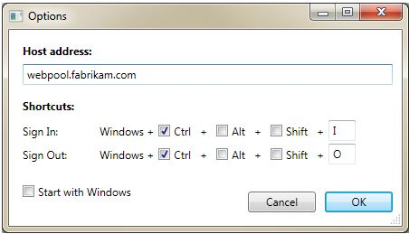

# <a name="skype-for-business-server-2015-resource-kit-tools-documentation"></a><span data-ttu-id="6f3fc-107">Документация по средствам набора ресурсов Skype для бизнеса Server 2015</span><span class="sxs-lookup"><span data-stu-id="6f3fc-107">Skype for Business Server 2015 Resource Kit Tools Documentation</span></span>

<span data-ttu-id="6f3fc-108">В этом разделе описываются средства из набора ресурсов Skype для бизнеса Server 2015, включая назначение каждого средства, а также примеры его использования.</span><span class="sxs-lookup"><span data-stu-id="6f3fc-108">This topic describes the tools in the Skype for Business Server 2015 Resource Kit, including the purpose of each tool, and examples of its use.</span></span> <span data-ttu-id="6f3fc-109">Набор ресурсов Skype для бизнеса Server 2015 помогает упростить выполнение повседневных задач для ИТ-администраторов, которые развертывают Skype для бизнеса Server 2015 и управляют ими.</span><span class="sxs-lookup"><span data-stu-id="6f3fc-109">The Skype for Business Server 2015 Resource Kit helps to make routine tasks easier for IT administrators who deploy and manage Skype for Business Server 2015.</span></span> <span data-ttu-id="6f3fc-110">Например, средство **web Conf Data** можно использовать для управления данными, которые пользователи загружают во время собрания по сети.</span><span class="sxs-lookup"><span data-stu-id="6f3fc-110">For example, the **Web Conf Data** tool can be used to easily control data that is uploaded by users during an online meeting.</span></span> <span data-ttu-id="6f3fc-111">Средство **SEFAUtil** можно использовать для создания делегирования переадментирования вызовов и ответа для пользователей.</span><span class="sxs-lookup"><span data-stu-id="6f3fc-111">The **SEFAUtil** tool can be used to set up delegate call forwarding and answering for users.</span></span> <span data-ttu-id="6f3fc-112">Мы рекомендуем ИТ-администраторам использовать эти средства для более эффективного управления Skype для бизнеса Server 2015.</span><span class="sxs-lookup"><span data-stu-id="6f3fc-112">We encourage IT administrators to use these tools to more effectively manage Skype for Business Server 2015.</span></span>

## <a name="installation-of-the-resource-kit-tools"></a><span data-ttu-id="6f3fc-113">Установка средств набора ресурсов</span><span class="sxs-lookup"><span data-stu-id="6f3fc-113">Installation of the Resource Kit Tools</span></span>

<span data-ttu-id="6f3fc-114">Чтобы установить набор ресурсов Skype для бизнеса Server 2015, скачайтеOCSReskit.msi[ из ](https://www.microsoft.com/download/details.aspx?id=52631) Центра загрузки.</span><span class="sxs-lookup"><span data-stu-id="6f3fc-114">To install the Skype for Business Server 2015 Resource Kit, download [OCSReskit.msi](https://www.microsoft.com/download/details.aspx?id=52631) from the Download Center.</span></span>

<span data-ttu-id="6f3fc-115">Запустите **OCSResKit.msi,** чтобы выполнить простую установку.</span><span class="sxs-lookup"><span data-stu-id="6f3fc-115">Run **OCSResKit.msi** to do a simple installation.</span></span> <span data-ttu-id="6f3fc-116">MSI устанавливает все средства по следующему пути: **%Program Files%\Skype для бизнеса Server 2015\ResKit.**</span><span class="sxs-lookup"><span data-stu-id="6f3fc-116">The .msi installs all the tools in the following path: **%Program Files%\Skype for Business Server 2015\ResKit**.</span></span> <span data-ttu-id="6f3fc-117">В этой папке находятся средства, которые являются автономными исполняемыми папками.</span><span class="sxs-lookup"><span data-stu-id="6f3fc-117">Tools that are self-contained executables are in this folder.</span></span> <span data-ttu-id="6f3fc-118">Средства, которые также имеют вспомогательные файлы, находятся в своих собственных в папках.</span><span class="sxs-lookup"><span data-stu-id="6f3fc-118">Tools that also have supporting files are in their own subfolders.</span></span>

## <a name="supported-environments"></a><span data-ttu-id="6f3fc-119">Поддерживаемые среды</span><span class="sxs-lookup"><span data-stu-id="6f3fc-119">Supported Environments</span></span>

<span data-ttu-id="6f3fc-120">Набор ресурсов Skype для бизнеса Server 2015 должен быть установлен на сервере, который соответствует спецификациям, требуемой для Skype для бизнеса Server 2015( обычно он используется для запуска Skype для бизнеса Server 2015).</span><span class="sxs-lookup"><span data-stu-id="6f3fc-120">The Skype for Business Server 2015 Resource Kit should be installed on a server that meets the specifications required for Skype for Business Server 2015, usually one being used to run Skype for Business Server 2015.</span></span>

## <a name="resource-kit-tools-overview"></a><span data-ttu-id="6f3fc-121">Обзор средств набора ресурсов</span><span class="sxs-lookup"><span data-stu-id="6f3fc-121">Resource Kit Tools Overview</span></span>

<span data-ttu-id="6f3fc-122">Ниже представлен список средств, предоставляемых в наборе ресурсов Skype для бизнеса Server 2015.</span><span class="sxs-lookup"><span data-stu-id="6f3fc-122">The following is a list of the tools that are provided in the Skype for Business Server 2015 Resource Kit.</span></span> <span data-ttu-id="6f3fc-123">Описание каждого средства, включая требования и примеры использования, описано в следующих разделах.</span><span class="sxs-lookup"><span data-stu-id="6f3fc-123">A description of each tool, including the requirements and example usage is covered in the following sections.</span></span>

- [<span data-ttu-id="6f3fc-124">ABSConfig</span><span class="sxs-lookup"><span data-stu-id="6f3fc-124">ABSConfig</span></span>](resource-kit-tools.md#ABSConfig)

- [<span data-ttu-id="6f3fc-125">Монитор службы политики пропускной способности</span><span class="sxs-lookup"><span data-stu-id="6f3fc-125">Bandwidth Policy Service Monitor</span></span>](resource-kit-tools.md#bpsm)

- [<span data-ttu-id="6f3fc-126">Анализатор использования полосы пропускания</span><span class="sxs-lookup"><span data-stu-id="6f3fc-126">Bandwidth Utilization Analyzer</span></span>](resource-kit-tools.md#bua)

- [<span data-ttu-id="6f3fc-127">Call Parkometer</span><span class="sxs-lookup"><span data-stu-id="6f3fc-127">Call Parkometer</span></span>](resource-kit-tools.md#callpark)

- [<span data-ttu-id="6f3fc-128">DBAnalyze</span><span class="sxs-lookup"><span data-stu-id="6f3fc-128">DBAnalyze</span></span>](resource-kit-tools.md#dba)

- [<span data-ttu-id="6f3fc-129">Импорт данных службы хранилища</span><span class="sxs-lookup"><span data-stu-id="6f3fc-129">Import Storage Service Data</span></span>](resource-kit-tools.md#Issd)

- [<span data-ttu-id="6f3fc-130">LCSSync</span><span class="sxs-lookup"><span data-stu-id="6f3fc-130">LCSSync</span></span>](resource-kit-tools.md#LCSSync)

- [<span data-ttu-id="6f3fc-131">Консоль пользователя подкатки</span><span class="sxs-lookup"><span data-stu-id="6f3fc-131">Lookup User Console</span></span>](resource-kit-tools.md#LUC)

- [<span data-ttu-id="6f3fc-132">MsTurnPing</span><span class="sxs-lookup"><span data-stu-id="6f3fc-132">MsTurnPing</span></span>](resource-kit-tools.md#MsTurnPing)

- [<span data-ttu-id="6f3fc-133">Просмотр конфигурации сети</span><span class="sxs-lookup"><span data-stu-id="6f3fc-133">Network Configuration Viewer</span></span>](resource-kit-tools.md#NCV)

- [<span data-ttu-id="6f3fc-134">Live агента группы ответа</span><span class="sxs-lookup"><span data-stu-id="6f3fc-134">Response Group Agent Live</span></span>](resource-kit-tools.md#RGAL)

- [<span data-ttu-id="6f3fc-135">SEFAUtil</span><span class="sxs-lookup"><span data-stu-id="6f3fc-135">SEFAUtil</span></span>](resource-kit-tools.md#SEFAUtil)

- [<span data-ttu-id="6f3fc-136">SYSPrep.ps1</span><span class="sxs-lookup"><span data-stu-id="6f3fc-136">SYSPrep.ps1</span></span>](resource-kit-tools.md#SYSPrep)

- [<span data-ttu-id="6f3fc-137">Миграция объявлений о ненаписаном номере</span><span class="sxs-lookup"><span data-stu-id="6f3fc-137">Unassigned Number Announcements Migration</span></span>](resource-kit-tools.md#UNAM)

- [<span data-ttu-id="6f3fc-138">Данные веб-конферент</span><span class="sxs-lookup"><span data-stu-id="6f3fc-138">Web Conf Data</span></span>](resource-kit-tools.md#WebConfData)

## <a name="absconfig"></a><span data-ttu-id="6f3fc-139">ABSConfig</span><span class="sxs-lookup"><span data-stu-id="6f3fc-139">ABSConfig</span></span>
<span data-ttu-id="6f3fc-140"><a name="ABSConfig"> </a></span><span class="sxs-lookup"><span data-stu-id="6f3fc-140"><a name="ABSConfig"> </a></span></span>

<span data-ttu-id="6f3fc-141">Средство настройки службы адресной книги (ABSConfig) — это средство администрирования, которое помогает администраторам настраивать конфигурацию службы адресной книги в Skype для бизнеса Server 2015.</span><span class="sxs-lookup"><span data-stu-id="6f3fc-141">The Address Book Service Configuration tool (ABSConfig) is an administrative tool that helps administrators customize Address Book Service configuration in Skype for Business Server 2015.</span></span> <span data-ttu-id="6f3fc-142">Это средство также позволяет администраторам Skype для бизнеса Server 2015 восстанавливать параметры службы адресной книги по умолчанию.</span><span class="sxs-lookup"><span data-stu-id="6f3fc-142">This tool also enables Skype for Business Server 2015 administrators to restore the default Address Book Service settings.</span></span>

### <a name="description"></a><span data-ttu-id="6f3fc-143">Описание</span><span class="sxs-lookup"><span data-stu-id="6f3fc-143">Description</span></span>

<span data-ttu-id="6f3fc-144">ABSConfig — это приложение графического пользовательского интерфейса, которое позволяет администраторам настраивать атрибуты доменных служб Active Directory, связанные со службой адресной книги.</span><span class="sxs-lookup"><span data-stu-id="6f3fc-144">ABSConfig is a graphical user interface application that enables administrators to configure Active Directory Domain Services attributes that are related to Address Book Service.</span></span>

<span data-ttu-id="6f3fc-145">Основные сценарии для средства:</span><span class="sxs-lookup"><span data-stu-id="6f3fc-145">The primary scenarios for the tool are the following:</span></span>

- <span data-ttu-id="6f3fc-146">Чтобы позволить администраторам сопооставить атрибуты в доменных службах Active Directory с атрибутами Skype для бизнеса Server 2015.</span><span class="sxs-lookup"><span data-stu-id="6f3fc-146">To enable administrators to map attributes in Active Directory Domain Services to the attributes for Skype for Business Server 2015.</span></span>

- <span data-ttu-id="6f3fc-147">Чтобы позволить администраторам указать атрибут доменных служб Active Directory, который необходимо включить или исключить из файлов службы адресной книги.</span><span class="sxs-lookup"><span data-stu-id="6f3fc-147">To enable administrators to specify the Active Directory Domain Services attribute to be included or excluded in the Address Book Service files.</span></span>

- <span data-ttu-id="6f3fc-148">Чтобы позволить администраторам восстанавливать параметры службы адресной книги по умолчанию.</span><span class="sxs-lookup"><span data-stu-id="6f3fc-148">To enable administrators to restore default Address Book Service settings.</span></span>

<span data-ttu-id="6f3fc-149">Средство ABSConfig можно начать с помощью ABSConfig.exe файла.</span><span class="sxs-lookup"><span data-stu-id="6f3fc-149">The ABSConfig tool can be started by using the ABSConfig.exe file.</span></span> <span data-ttu-id="6f3fc-150">Средство откроется на вкладке **"Настройка атрибутов".** В этой таблице можно сопоказать атрибуты доменных служб Active Directory с полями атрибутов для Skype для бизнеса Server 2015 и указать пользователей, которых необходимо включить или исключить из файлов службы адресной книги на основе определенных фильтров атрибутов.</span><span class="sxs-lookup"><span data-stu-id="6f3fc-150">The tool opens to the **Configure Attributes** tab. This table has options to map Active Directory Domain Services attributes to the attribute fields for Skype for Business Server 2015 and to specify which users to include or exclude in Address Book Service files based on specific attribute filters.</span></span> <span data-ttu-id="6f3fc-151">Он также имеет параметры для настройки того, какое значение номера телефона должно быть включено в файл адресной книги.</span><span class="sxs-lookup"><span data-stu-id="6f3fc-151">It also has options to customize which value of the phone number to be included in the Address Book file.</span></span> <span data-ttu-id="6f3fc-152">Параметр **"Восстановить значения по умолчанию"** позволяет администраторам восстанавливать значения по умолчанию для параметров службы адресной книги.</span><span class="sxs-lookup"><span data-stu-id="6f3fc-152">The **Restore Defaults** option enables administrators to restore Address Book Service settings to default values.</span></span>

> [!NOTE]
> <span data-ttu-id="6f3fc-153">Повторное сопоставление атрибутов AD с разными именами полей OC будет работать только для загрузки файла адресной книги и не поддерживается веб-запросом адресной книги.</span><span class="sxs-lookup"><span data-stu-id="6f3fc-153">Re-mapping of AD attributes to different OC Field Names will only work for Address Book File Download, and is not supported by Address Book Web Query.</span></span>

### <a name="output"></a><span data-ttu-id="6f3fc-154">Выходные данные</span><span class="sxs-lookup"><span data-stu-id="6f3fc-154">Output</span></span>

<span data-ttu-id="6f3fc-155">ABSConfig сохраняет конфигурацию службы адресной книги в базе данных.</span><span class="sxs-lookup"><span data-stu-id="6f3fc-155">ABSConfig stores the Address Book Service configuration in the database.</span></span>

```console
Path: %ProgramFiles%\Skype for Business Server 2015\Reskit
```

### <a name="purpose"></a><span data-ttu-id="6f3fc-156">Назначение</span><span class="sxs-lookup"><span data-stu-id="6f3fc-156">Purpose</span></span>

<span data-ttu-id="6f3fc-157">ABSConfig предоставляет быстрый и простой способ настройки службы адресной книги Skype для бизнеса Server 2015.</span><span class="sxs-lookup"><span data-stu-id="6f3fc-157">ABSConfig provides a quick and easy way to customize Skype for Business Server 2015 Address Book Service.</span></span>

### <a name="requirements"></a><span data-ttu-id="6f3fc-158">Требования</span><span class="sxs-lookup"><span data-stu-id="6f3fc-158">Requirements</span></span>

#### <a name="computer"></a><span data-ttu-id="6f3fc-159">Компьютер</span><span class="sxs-lookup"><span data-stu-id="6f3fc-159">Computer</span></span>

<span data-ttu-id="6f3fc-160">ABSConfig можно запускать только на компьютере, который присоединяется к домену с установленным Skype для бизнеса Server 2015.</span><span class="sxs-lookup"><span data-stu-id="6f3fc-160">ABSConfig can be run only from a domain-joined computer that has Skype for Business Server 2015 installed.</span></span> <span data-ttu-id="6f3fc-161">В случае Skype для бизнеса Server 2015 Enterprise Edition это средство можно запустить на любых серверах переднего сервера, на серверах с включенной службой адресной книги во время установки.</span><span class="sxs-lookup"><span data-stu-id="6f3fc-161">In the case of Skype for Business Server 2015, Enterprise Edition, this tool can be run on any Front End servers that have the Address Book Service enabled during setup.</span></span>

#### <a name="network"></a><span data-ttu-id="6f3fc-162">Сеть</span><span class="sxs-lookup"><span data-stu-id="6f3fc-162">Network</span></span>

<span data-ttu-id="6f3fc-163">Компьютер должен иметь возможность подключения к пулу переднего и тыловой баз данных.</span><span class="sxs-lookup"><span data-stu-id="6f3fc-163">The computer should be able to connect to the Front End pool and back-end database.</span></span>

#### <a name="software"></a><span data-ttu-id="6f3fc-164">Программное обеспечение</span><span class="sxs-lookup"><span data-stu-id="6f3fc-164">Software</span></span>

<span data-ttu-id="6f3fc-165">Перед запуском средства ABSConfig необходимо установить следующие компоненты программного обеспечения:</span><span class="sxs-lookup"><span data-stu-id="6f3fc-165">The following software components must be installed before running the ABSConfig tool:</span></span>

- <span data-ttu-id="6f3fc-166">Skype для бизнеса Server 2015</span><span class="sxs-lookup"><span data-stu-id="6f3fc-166">Skype for Business Server 2015</span></span>

#### <a name="users"></a><span data-ttu-id="6f3fc-167">Пользователи</span><span class="sxs-lookup"><span data-stu-id="6f3fc-167">Users</span></span>

<span data-ttu-id="6f3fc-168">Администраторы, у которых есть разрешения, необходимые для обновления развертывания Skype для бизнеса Server 2015.</span><span class="sxs-lookup"><span data-stu-id="6f3fc-168">Administrators who have the permissions required to update the Skype for Business Server 2015 deployment.</span></span>

### <a name="examples"></a><span data-ttu-id="6f3fc-169">Примеры</span><span class="sxs-lookup"><span data-stu-id="6f3fc-169">Examples</span></span>

<span data-ttu-id="6f3fc-170">AbSConfig можно начать, **введяABSConfig.exe** в командной области.</span><span class="sxs-lookup"><span data-stu-id="6f3fc-170">ABSConfig can be started by typing **ABSConfig.exe** at a command prompt.</span></span> <span data-ttu-id="6f3fc-171">Ниже показан пользовательский интерфейс средства ABSConfig.</span><span class="sxs-lookup"><span data-stu-id="6f3fc-171">Shown below is the ABSConfig tool user interface.</span></span>


### <a name="summary"></a><span data-ttu-id="6f3fc-173">Аннотация</span><span class="sxs-lookup"><span data-stu-id="6f3fc-173">Summary</span></span>

<span data-ttu-id="6f3fc-174">Средство ABSConfig предоставляет администраторам быстрый и простой в использовании инструмент для настройки службы адресной книги Skype для бизнеса Server 2015.</span><span class="sxs-lookup"><span data-stu-id="6f3fc-174">The ABSConfig tool provides administrators a quick and easy to use tool to customize Skype for Business Server 2015 Address Book Service.</span></span>

## <a name="bandwidth-policy-service-monitor"></a><span data-ttu-id="6f3fc-175">Монитор службы политики пропускной способности</span><span class="sxs-lookup"><span data-stu-id="6f3fc-175">Bandwidth Policy Service Monitor</span></span>
<span data-ttu-id="6f3fc-176"><a name="bpsm"> </a></span><span class="sxs-lookup"><span data-stu-id="6f3fc-176"><a name="bpsm"> </a></span></span>

<span data-ttu-id="6f3fc-177">Средство "Монитор службы политики пропускной способности" позволяет администраторам просматривать список следующих данных:</span><span class="sxs-lookup"><span data-stu-id="6f3fc-177">The Bandwidth Policy Service Monitor tool is intended to allow administrators to view a list of the following:</span></span>

1. <span data-ttu-id="6f3fc-178">Все настроенные службы политики пропускной способности Skype для бизнеса Server 2015 (проверка подлинности и ядро) в топологии</span><span class="sxs-lookup"><span data-stu-id="6f3fc-178">All the configured Skype for Business Server 2015 Bandwidth Policy services (Authentication and Core) in the topology</span></span>

2. <span data-ttu-id="6f3fc-179">Подключения, которые каждая служба делает с другими службами политики пропускной способности и к edge-серверам</span><span class="sxs-lookup"><span data-stu-id="6f3fc-179">The connections that each service makes to other Bandwidth Policy services and to the Edge servers</span></span>

3. <span data-ttu-id="6f3fc-180">Все ссылки, настроенные в документе конфигурации сети, и использование пропускной способности в режиме реального времени, как сообщается каждой службой политики пропускной способности</span><span class="sxs-lookup"><span data-stu-id="6f3fc-180">All the links that are configured in the Network configuration document and real-time bandwidth usage as reported by each of the Bandwidth Policy services</span></span>

### <a name="description"></a><span data-ttu-id="6f3fc-181">Описание</span><span class="sxs-lookup"><span data-stu-id="6f3fc-181">Description</span></span>

<span data-ttu-id="6f3fc-182">Монитор службы политики пропускной способности реализован в качестве приложения на основе GUI.</span><span class="sxs-lookup"><span data-stu-id="6f3fc-182">The Bandwidth Policy Service Monitor tool is implemented as a GUI-based application.</span></span> <span data-ttu-id="6f3fc-183">Администраторы запускают средство, запуская PDPMonUI.exe.</span><span class="sxs-lookup"><span data-stu-id="6f3fc-183">Administrators start the tool by running PDPMonUI.exe.</span></span>

<span data-ttu-id="6f3fc-184">При открытии средства оно пытается обнаружить список служб политики пропускной способности в топологии.</span><span class="sxs-lookup"><span data-stu-id="6f3fc-184">When the tool starts, it attempts to discover the list of Bandwidth Policy services in the topology.</span></span> <span data-ttu-id="6f3fc-185">После первоначального обновления в области слева от окна будет отсеяно список служб, сгруппленных по кластерам, к которые они принадлежат.</span><span class="sxs-lookup"><span data-stu-id="6f3fc-185">After the initial update is done, the pane to the left of the window is populated with a list of services that are grouped by the clusters that they belong to.</span></span>

<span data-ttu-id="6f3fc-186">Когда администраторы выбирают определенную службу политики пропускной способности, в области справа отображаются сведения об этой конкретной службе.</span><span class="sxs-lookup"><span data-stu-id="6f3fc-186">When administrators select a particular Bandwidth Policy Service, the pane on the right displays the information about that particular service.</span></span> <span data-ttu-id="6f3fc-187">В этой области также есть две основные вкладки, на которые отображаются сведения.</span><span class="sxs-lookup"><span data-stu-id="6f3fc-187">That pane also has two main tabs that display information.</span></span>

#### <a name="machine-info-tab"></a><span data-ttu-id="6f3fc-188">Вкладка "Сведения о компьютере"</span><span class="sxs-lookup"><span data-stu-id="6f3fc-188">Machine Info Tab</span></span>

<span data-ttu-id="6f3fc-189">На **вкладке** "Сведения о компьютере" показаны сведения о выбранной службе политики пропускной способности, а также список и состояние всех подключений, которые были сделаны выбранной службой политики пропускной способности к другим службам.</span><span class="sxs-lookup"><span data-stu-id="6f3fc-189">The **Machine Info** tab shows the details of the Bandwidth Policy Service that is selected and the list and state of all the connections that are made by the selected Bandwidth Policy Service to other services.</span></span>

#### <a name="topology-info-tab"></a><span data-ttu-id="6f3fc-190">Вкладка "Сведения о топологии"</span><span class="sxs-lookup"><span data-stu-id="6f3fc-190">Topology Info Tab</span></span>

<span data-ttu-id="6f3fc-191">На **вкладке "Сведения** о топологии" показан список всех ссылок, настроенных в параметрах конфигурации сети.</span><span class="sxs-lookup"><span data-stu-id="6f3fc-191">The **Topology Info** tab shows a list of all the links that are configured in the Network configuration settings.</span></span> <span data-ttu-id="6f3fc-192">Для каждой связи отображается пропускная способность звука и видео.</span><span class="sxs-lookup"><span data-stu-id="6f3fc-192">For each link, the audio and video bandwidth capacity is displayed.</span></span> <span data-ttu-id="6f3fc-193">Кроме того, отображается используемая в данный момент пропускная способность как в кбайт/с, так и в процентах от емкости.</span><span class="sxs-lookup"><span data-stu-id="6f3fc-193">Additionally, the currently utilized bandwidth is displayed, both in Kbps and as a percentage of the capacity.</span></span> <span data-ttu-id="6f3fc-194">Средство использует цветовое кодирование для выделения ссылок с использованием, которые близки к емкости, что позволяет администраторам быстро изолировать такие ссылки.</span><span class="sxs-lookup"><span data-stu-id="6f3fc-194">The tool uses color-coding to highlight links that have utilization that is close to the capacity—this allows administrators to quickly isolate such links.</span></span>

> [!NOTE]
>  <span data-ttu-id="6f3fc-195">Если при подключении к какой-либо из настроенных служб политики пропускной способности происходит  сбой  средства мониторинга службы политики пропускной способности, данные на вкладке "Сведения о компьютере" и "Сведения о топологии" не будут заполнены.</span><span class="sxs-lookup"><span data-stu-id="6f3fc-195">If the Bandwidth Policy Service Monitor tool experiences failure when it connects to any of the configured Bandwidth Policy services, the information in the **Machine Info** and the **Topology Info** tabs won't be populated.</span></span> <span data-ttu-id="6f3fc-196">Однако возможно, что средство изначально подключилось, но впоследствии потеряет подключение к службе.</span><span class="sxs-lookup"><span data-stu-id="6f3fc-196">However, it is possible that the tool might connect initially but subsequently lose its connection to the service.</span></span> <span data-ttu-id="6f3fc-197">В таких случаях администраторы могут видеть устаревшую информацию.</span><span class="sxs-lookup"><span data-stu-id="6f3fc-197">In such cases, administrators might see outdated information.</span></span> <span data-ttu-id="6f3fc-198">На каждой **вкладке** есть отметка времени последнего обновления, которая позволяет администраторам видеть время последнего обновления данных для определенной службы политики пропускной способности.</span><span class="sxs-lookup"><span data-stu-id="6f3fc-198">There is a **Last Updated** time stamp on each of the tabs that can allow administrators to see when the data was last updated for a particular Bandwidth Policy Service.</span></span>

### <a name="output"></a><span data-ttu-id="6f3fc-199">Выходные данные</span><span class="sxs-lookup"><span data-stu-id="6f3fc-199">Output</span></span>

<span data-ttu-id="6f3fc-200">Выходных данных из командной строки нет; выходные данные программы содержатся в основном графическом пользовательском интерфейсе (GUI).</span><span class="sxs-lookup"><span data-stu-id="6f3fc-200">There is no command-line output; the program output is contained within the main graphical user interface (GUI).</span></span>

### <a name="purpose"></a><span data-ttu-id="6f3fc-201">Назначение</span><span class="sxs-lookup"><span data-stu-id="6f3fc-201">Purpose</span></span>

<span data-ttu-id="6f3fc-202">Средство мониторинга службы политики пропускной способности позволяет администраторам отслеживать состояние каждой службы политики пропускной способности, определенной в топологии.</span><span class="sxs-lookup"><span data-stu-id="6f3fc-202">The purpose of the Bandwidth Policy Service Monitor tool is to allow administrators visibility into the state of each of the Bandwidth Policy services that are defined in the topology.</span></span> <span data-ttu-id="6f3fc-203">Кроме того, администраторы могут видеть использование пропускной способности в режиме реального времени для всех каналов, определенных в документе конфигурации сети.</span><span class="sxs-lookup"><span data-stu-id="6f3fc-203">In addition, administrators can see real-time bandwidth usage for all the links that are defined in the Network configuration document.</span></span>

### <a name="requirements"></a><span data-ttu-id="6f3fc-204">Требования</span><span class="sxs-lookup"><span data-stu-id="6f3fc-204">Requirements</span></span>

<span data-ttu-id="6f3fc-205">Средство мониторинга службы политики пропускной способности должно быть запускаться на компьютере, который входит в топологию Skype для бизнеса Server.</span><span class="sxs-lookup"><span data-stu-id="6f3fc-205">The Bandwidth Policy Service Monitor tool needs to be run on a computer that is part of the Skype for Business Server topology.</span></span>

### <a name="summary"></a><span data-ttu-id="6f3fc-206">Аннотация</span><span class="sxs-lookup"><span data-stu-id="6f3fc-206">Summary</span></span>

<span data-ttu-id="6f3fc-207">Монитор службы политики пропускной способности может быть ценным ресурсом для администраторов, чтобы они могли проверить состояние всех служб политики пропускной способности в топологии, и, что более важно, они могут получить использование пропускной способности в режиме реального времени для каналов, определенных в параметрах конфигурации сети.</span><span class="sxs-lookup"><span data-stu-id="6f3fc-207">The Bandwidth Policy Service Monitor tool can be a valuable resource to administrators so they can inspect the state of all the Bandwidth Policy services in the topology—and more importantly—they can obtain real-time bandwidth utilization for the links that are defined in the Network configuration settings.</span></span>

## <a name="bandwidth-utilization-analyzer"></a><span data-ttu-id="6f3fc-208">Анализатор использования полосы пропускания</span><span class="sxs-lookup"><span data-stu-id="6f3fc-208">Bandwidth Utilization Analyzer</span></span>
<span data-ttu-id="6f3fc-209"><a name="bua"> </a></span><span class="sxs-lookup"><span data-stu-id="6f3fc-209"><a name="bua"> </a></span></span>

<span data-ttu-id="6f3fc-210">Анализатор использования полосы пропускания — это средство, которое создает отчеты о различных представлениях потребления пропускной способности конечными точками UC по каналам WAN в корпоративной сети.</span><span class="sxs-lookup"><span data-stu-id="6f3fc-210">Bandwidth Utilization Analyzer is a tool that creates reports about various views of bandwidth consumption by the UC endpoints across WAN links in the enterprise network.</span></span> <span data-ttu-id="6f3fc-211">Эти отчеты можно использовать для понимания текущего шаблона использования пропускной способности и для планирования пропускной способности.</span><span class="sxs-lookup"><span data-stu-id="6f3fc-211">These reports can be used to understand the current bandwidth consumption pattern and to aid in bandwidth capacity planning.</span></span>

### <a name="description"></a><span data-ttu-id="6f3fc-212">Описание</span><span class="sxs-lookup"><span data-stu-id="6f3fc-212">Description</span></span>

<span data-ttu-id="6f3fc-213">Анализатор использования полосы пропускания реализован в качестве приложения на основе интерфейса GUI.</span><span class="sxs-lookup"><span data-stu-id="6f3fc-213">Bandwidth Utilization Analyzer is implemented as a GUI-based application.</span></span> <span data-ttu-id="6f3fc-214">Это средство создает отчеты специально для использования звука в сети и помогает с планированием емкости.</span><span class="sxs-lookup"><span data-stu-id="6f3fc-214">This tool generates reports specifically for audio utilization across the network and helps with capacity planning.</span></span> <span data-ttu-id="6f3fc-215">Кроме того, он итерирует пропускную способность, назначенную различным каналам.</span><span class="sxs-lookup"><span data-stu-id="6f3fc-215">It also iterates on the bandwidth capacity that is assigned to various links.</span></span>

### <a name="output"></a><span data-ttu-id="6f3fc-216">Выходные данные</span><span class="sxs-lookup"><span data-stu-id="6f3fc-216">Output</span></span>

<span data-ttu-id="6f3fc-217">Анализатор использования полосы пропускания предоставляет графические диаграммы пропускной способности и использования звука для всех каналов WAN, настроенных в системе.</span><span class="sxs-lookup"><span data-stu-id="6f3fc-217">Bandwidth Utilization Analyzer provides graphic al plots of bandwidth capacity and utilization for audio for all the WAN links that are configured in the system.</span></span>

### <a name="purpose"></a><span data-ttu-id="6f3fc-218">Назначение</span><span class="sxs-lookup"><span data-stu-id="6f3fc-218">Purpose</span></span>

<span data-ttu-id="6f3fc-219">В любом развертывании голосовой и видеосвязи важно отслеживать и понимать тенденцию использования пропускной способности трафика мультимедиа в корпоративной сети.</span><span class="sxs-lookup"><span data-stu-id="6f3fc-219">In any voice and video deployment, it's critical to monitor and understand the trend of bandwidth utilization of media traffic across the enterprise network.</span></span> <span data-ttu-id="6f3fc-220">Анализатор использования полосы пропускания позволяет администратору достичь именно этого.</span><span class="sxs-lookup"><span data-stu-id="6f3fc-220">The Bandwidth Utilization Analyzer tool allows an administrator to achieve just that.</span></span> <span data-ttu-id="6f3fc-221">Это средство делает следующее:</span><span class="sxs-lookup"><span data-stu-id="6f3fc-221">This tool does the following:</span></span>

- <span data-ttu-id="6f3fc-222">Создает отчеты об использовании звука в сети</span><span class="sxs-lookup"><span data-stu-id="6f3fc-222">Generates specific reports for audio utilization across the network</span></span>

- <span data-ttu-id="6f3fc-223">Более эффективное планирование емкости и итерация пропускной способности, назначенной различным каналам связи</span><span class="sxs-lookup"><span data-stu-id="6f3fc-223">Helps with more effective capacity planning and iteration on the bandwidth capacity that is assigned to various links</span></span>

<span data-ttu-id="6f3fc-224">Анализатор использования полосы пропускания может создавать графические отчеты о емкости и использовании пропускной способности; они следуют следующим образом:</span><span class="sxs-lookup"><span data-stu-id="6f3fc-224">Bandwidth Utilization Analyzer can generate graphical plots of bandwidth capacity and utilization reports; they are as follows:</span></span>

- <span data-ttu-id="6f3fc-225">Все связи WAN в корпоративной сети</span><span class="sxs-lookup"><span data-stu-id="6f3fc-225">All the WAN links in the enterprise network</span></span>

- <span data-ttu-id="6f3fc-226">Фильтрация по выбранным соединениям WAN, которые были выбраны</span><span class="sxs-lookup"><span data-stu-id="6f3fc-226">Filtered by selected WAN links that have been chosen</span></span>

- <span data-ttu-id="6f3fc-227">Фильтрация по ссылкам WAN с превышением пропускной способности</span><span class="sxs-lookup"><span data-stu-id="6f3fc-227">Filtered by WAN links that have exceeded link capacity</span></span>

- <span data-ttu-id="6f3fc-228">Фильтрация по каналам WAN, которые использовали несвойенную пропускную способность</span><span class="sxs-lookup"><span data-stu-id="6f3fc-228">Filtered by WAN links that have been under-utilizing the provisioned bandwidth</span></span>

- <span data-ttu-id="6f3fc-229">Фильтрация по каналам WAN, достигающим критических уровней (использование пропускной способности, которое превышает 90 % пропускной способности канала WAN)</span><span class="sxs-lookup"><span data-stu-id="6f3fc-229">Filter by WAN links that have been reaching critical levels (a bandwidth utilization that is greater than 90% of bandwidth capacity of the WAN link)</span></span>

- <span data-ttu-id="6f3fc-230">Фильтруется по типу связи WAN— связи между сетевыми сайтами, межрегиональные ссылки и ссылки на сайте</span><span class="sxs-lookup"><span data-stu-id="6f3fc-230">Filtered by WAN link type—network-site links, interregional links, and links within a site</span></span>

- <span data-ttu-id="6f3fc-231">Фильтрация по области сети</span><span class="sxs-lookup"><span data-stu-id="6f3fc-231">Filtered by network region</span></span>

#### <a name="applications"></a><span data-ttu-id="6f3fc-232">Приложения</span><span class="sxs-lookup"><span data-stu-id="6f3fc-232">Applications</span></span>

<span data-ttu-id="6f3fc-233">Анализатор использования пропускной способности имеет следующие два приложения (средства):</span><span class="sxs-lookup"><span data-stu-id="6f3fc-233">Bandwidth Utilization Analyzer has the following two applications (tools):</span></span>

- <span data-ttu-id="6f3fc-234">**WanLinkLogCollector.exe** Это средство позволяет пользователю вводить требуемую информацию.</span><span class="sxs-lookup"><span data-stu-id="6f3fc-234">**WanLinkLogCollector.exe** This tool enables its user to input the required information.</span></span>

- <span data-ttu-id="6f3fc-235">**BandwidthUtilizationAnalyzer.xlsm** Отчет о программном обеспечении для электронных таблиц Microsoft Excel автоматически WanLinkLogCollector.exe.</span><span class="sxs-lookup"><span data-stu-id="6f3fc-235">**BandwidthUtilizationAnalyzer.xlsm** A Microsoft Excel spreadsheet software report is automatically launched by WanLinkLogCollector.exe.</span></span> <span data-ttu-id="6f3fc-236">Это приложение позволяет пользователю применять фильтры к отчету, как показано далее в этой статье.</span><span class="sxs-lookup"><span data-stu-id="6f3fc-236">This application allows the user to apply filters to the report as shown later in this article.</span></span>

#### <a name="phases-of-using-bandwidth-utilization-analyzer"></a><span data-ttu-id="6f3fc-237">Этапы использования анализатора использования полосы пропускания</span><span class="sxs-lookup"><span data-stu-id="6f3fc-237">Phases of Using Bandwidth Utilization Analyzer</span></span>

<span data-ttu-id="6f3fc-238">При использовании анализатора использования полосы пропускания существует два этапа:</span><span class="sxs-lookup"><span data-stu-id="6f3fc-238">There are two phases when using Bandwidth Utilization Analyzer:</span></span>

- <span data-ttu-id="6f3fc-239">Сбор журналов, который выполняется с помощью WanLinkLogCollector.exe</span><span class="sxs-lookup"><span data-stu-id="6f3fc-239">Collect logs, which is performed by using WanLinkLogCollector.exe</span></span>

- <span data-ttu-id="6f3fc-240">Настройка отчетов, выполняемая с помощью BandwidthUtilizationAnalyzer.xlsm</span><span class="sxs-lookup"><span data-stu-id="6f3fc-240">Customize reports, which is performed by using BandwidthUtilizationAnalyzer.xlsm</span></span>

    > [!IMPORTANT]
    > <span data-ttu-id="6f3fc-241">Настоятельно рекомендуется, чтобы BandwidthUtilizationAnalyzer.xlsm не запускались вручную конечными пользователями.</span><span class="sxs-lookup"><span data-stu-id="6f3fc-241">We strongly recommend that BandwidthUtilizationAnalyzer.xlsm not be manually launched by end users.</span></span>

#### <a name="starting-bandwidth-utilization-analyzer"></a><span data-ttu-id="6f3fc-242">Запуск анализатора использования полосы пропускания</span><span class="sxs-lookup"><span data-stu-id="6f3fc-242">Starting Bandwidth Utilization Analyzer</span></span>

<span data-ttu-id="6f3fc-243">Начните WanLinkLogCollector.exe в командной области или с помощью проводника Windows.</span><span class="sxs-lookup"><span data-stu-id="6f3fc-243">Start WanLinkLogCollector.exe at the command prompt or by using Windows Explorer.</span></span>

 <span data-ttu-id="6f3fc-244">**Использование WanLinkLogCollector.exe**</span><span class="sxs-lookup"><span data-stu-id="6f3fc-244">**Using WanLinkLogCollector.exe**</span></span>

<span data-ttu-id="6f3fc-245">Существует три этапа использования WanLinkLogCollector.exe:</span><span class="sxs-lookup"><span data-stu-id="6f3fc-245">There are three steps to using WanLinkLogCollector.exe:</span></span>

1. <span data-ttu-id="6f3fc-246">**Занося в журнал временную шкалу** Предоставление временной шкалы, для которую требуется сгенерирован отчет</span><span class="sxs-lookup"><span data-stu-id="6f3fc-246">**Log the timeline** Provide the timeline that the report needs to be generated for</span></span>

2. <span data-ttu-id="6f3fc-247">**Указание каталогов файлов** Предоставление сведений о расположении файла</span><span class="sxs-lookup"><span data-stu-id="6f3fc-247">**Specify the file directories** Provide file location information</span></span>

3. <span data-ttu-id="6f3fc-248">**Сбор журналов и запуск средства просмотра отчетов** Выполнение команды для создания отчета</span><span class="sxs-lookup"><span data-stu-id="6f3fc-248">**Collect the logs and launch the report viewer** Execute the command to generate the report</span></span>

#### <a name="step-1---log-the-timeline"></a><span data-ttu-id="6f3fc-249">Шаг 1. Занося временную шкалу в журнал</span><span class="sxs-lookup"><span data-stu-id="6f3fc-249">Step 1 - Log the timeline</span></span>

<span data-ttu-id="6f3fc-250">Ведение журнала временной шкалы позволяет пользователю средства указать следующее, как показано на рисунке ниже.</span><span class="sxs-lookup"><span data-stu-id="6f3fc-250">Logging the timeline allows the tool user to specify the following as shown in the figure below.</span></span>

1. <span data-ttu-id="6f3fc-251">**Дата начала** Это начальная дата временной шкалы, для которую создается отчет; например, 1 августа 2010 г.</span><span class="sxs-lookup"><span data-stu-id="6f3fc-251">**Start date** This is the start date of the timeline that the report is to be generated for; for example, August 1, 2010.</span></span>

2. <span data-ttu-id="6f3fc-252">**Дата окончания** Это дата окончания временной шкалы, для которую создается отчет; например, 30 сентября 2010 г.</span><span class="sxs-lookup"><span data-stu-id="6f3fc-252">**End date** This is the end date of the timeline that the report is to be generated for; for example, September 30, 2010.</span></span>

     

#### <a name="step-2---specify-the-file-directories"></a><span data-ttu-id="6f3fc-254">Шаг 2. Указание каталогов файлов</span><span class="sxs-lookup"><span data-stu-id="6f3fc-254">Step 2 - Specify the file directories</span></span>

<span data-ttu-id="6f3fc-255">Указанные ниже каталоги файлов могут быть указаны пользователем, как показано ниже.</span><span class="sxs-lookup"><span data-stu-id="6f3fc-255">The following file directories can be specified by the user as shown.</span></span>

- <span data-ttu-id="6f3fc-256">**Расположение файлов журналов сервера** Расположение папки, в которой хранятся журналы сервера политики пропускной способности.</span><span class="sxs-lookup"><span data-stu-id="6f3fc-256">**Server log files location** The folder location where Bandwidth policy server logs are stored.</span></span> <span data-ttu-id="6f3fc-257">Как правило, это<\<fileserver\> \\ fe \> \AppServerFiles\PDP.</span><span class="sxs-lookup"><span data-stu-id="6f3fc-257">This is typically in \<fileserver\>\\<choice of FE\>\AppServerFiles\PDP.</span></span>

- <span data-ttu-id="6f3fc-258">**Временное расположение хранения файлов** Временное расположение файлов, где хранятся промежуточные файлы во время сгенерации отчета.</span><span class="sxs-lookup"><span data-stu-id="6f3fc-258">**Temporary file storage location** The temporary file location where intermediate files are stored while the report is being generated.</span></span>

    

    > [!NOTE]
    > <span data-ttu-id="6f3fc-260">Убедитесь, что пользователю средства предоставлен достаточный доступ к журналам сервера и папке временного хранения файлов.</span><span class="sxs-lookup"><span data-stu-id="6f3fc-260">Ensure that sufficient file access to the server logs and the temporary file store folder is provided to the tool user.</span></span>

#### <a name="step-3---collect-the-logs-and-start-the-report-viewer"></a><span data-ttu-id="6f3fc-261">Шаг 3. Сбор журналов и запуск средства просмотра отчетов</span><span class="sxs-lookup"><span data-stu-id="6f3fc-261">Step 3 - Collect the logs and start the report viewer</span></span>

<span data-ttu-id="6f3fc-262">Чтобы собрать журналы и запустить средства просмотра отчетов, нажмите кнопку **"Выполнить",** как показано ниже.</span><span class="sxs-lookup"><span data-stu-id="6f3fc-262">To collect the logs and start the report viewer, click **Execute** as shown below.</span></span> <span data-ttu-id="6f3fc-263">На этом этапе собираются необходимые данные.</span><span class="sxs-lookup"><span data-stu-id="6f3fc-263">This step collects the required data.</span></span>


<span data-ttu-id="6f3fc-265">После успешной проверки ввода отображается сообщение, показанное ниже.</span><span class="sxs-lookup"><span data-stu-id="6f3fc-265">When the input validation is successful, the message shown below is displayed.</span></span>


<span data-ttu-id="6f3fc-267">Нажмите кнопку **ОК**.</span><span class="sxs-lookup"><span data-stu-id="6f3fc-267">Click **OK**.</span></span> <span data-ttu-id="6f3fc-268">BandwidthUtilizationAnalyzer.xlsm автоматически запущен.</span><span class="sxs-lookup"><span data-stu-id="6f3fc-268">BandwidthUtilizationAnalyzer.xlsm is automatically started.</span></span> <span data-ttu-id="6f3fc-269">Следуйте инструкциям в окне сообщения.</span><span class="sxs-lookup"><span data-stu-id="6f3fc-269">Follow the instructions in the message box.</span></span> <span data-ttu-id="6f3fc-270">Подробные сведения **см. в BandwidthUtilizationAnalyzer.xlsразделе** "Использование BandwidthUtilizationAnalyzer.xlsm".</span><span class="sxs-lookup"><span data-stu-id="6f3fc-270">For details, see **Using BandwidthUtilizationAnalyzer.xlsm** in the next section.</span></span>


### <a name="using-bandwidthutilizationanalyzerxlsm"></a><span data-ttu-id="6f3fc-271">Использование BandwidthUtilizationAnalyzer.xlsm</span><span class="sxs-lookup"><span data-stu-id="6f3fc-271">Using BandwidthUtilizationAnalyzer.xlsm</span></span>

1. <span data-ttu-id="6f3fc-272">При BandwidthUtilizationAnalyzer.xlsm автоматически нажмите кнопку **"Обновить",** как показано ниже.</span><span class="sxs-lookup"><span data-stu-id="6f3fc-272">When BandwidthUtilizationAnalyzer.xlsm is automatically started, click **Refresh** as shown below.</span></span>

     

2. <span data-ttu-id="6f3fc-274">Когда папка файлов открывается, выберите consolidated.csv из расположения, указанного в окне сообщения, как показано ниже.</span><span class="sxs-lookup"><span data-stu-id="6f3fc-274">When a file folder is opened, select consolidated.csv from the location that is specified in the message box as shown below.</span></span> <span data-ttu-id="6f3fc-275">Здесь также показано расположение **C:\Temp.**</span><span class="sxs-lookup"><span data-stu-id="6f3fc-275">It also shows the location as **C:\Temp**.</span></span>

     

3. <span data-ttu-id="6f3fc-277">Нажмите кнопку **Импортировать**.</span><span class="sxs-lookup"><span data-stu-id="6f3fc-277">Click **Import**.</span></span>

4. <span data-ttu-id="6f3fc-278">Графический график создается автоматически.</span><span class="sxs-lookup"><span data-stu-id="6f3fc-278">The graphical plot is automatically generated.</span></span> <span data-ttu-id="6f3fc-279">Он доступен, когда пропадает работающий в фоновом режиме указатель.</span><span class="sxs-lookup"><span data-stu-id="6f3fc-279">It is available when the working-in-the-background pointer disappears.</span></span>

     

#### <a name="applying-filters-to-the-report-view"></a><span data-ttu-id="6f3fc-281">Применение фильтров к представлению отчета</span><span class="sxs-lookup"><span data-stu-id="6f3fc-281">Applying Filters to the Report View</span></span>

<span data-ttu-id="6f3fc-282">Фильтры, которые можно применить к представлению отчета, как показано ниже, описаны следующим образом:</span><span class="sxs-lookup"><span data-stu-id="6f3fc-282">The filters that can be applied to the report view as shown below are described as follows:</span></span>


1. <span data-ttu-id="6f3fc-284">**Имя** Фильтрация по ссылкам WAN (фильтр находится в правой части графа). Префикс обозначает следующие типы ссылок; см. вертикальное (синее) поле:</span><span class="sxs-lookup"><span data-stu-id="6f3fc-284">**Name** Filter by WAN links (the filter is on the right side of the graph).The prefix denotes the following link types; see the vertical (blue) box:</span></span>

   - <span data-ttu-id="6f3fc-285">**Сайт S** Связь WAN между сетевым сайтом и регионом сети</span><span class="sxs-lookup"><span data-stu-id="6f3fc-285">**S Site** The WAN link from a network site to a network region</span></span>

   - <span data-ttu-id="6f3fc-286">**Is Inter-Site** Связь WAN между двумя сетевыми сайтами</span><span class="sxs-lookup"><span data-stu-id="6f3fc-286">**IS Inter-Site** The WAN link between two network sites</span></span>

   - <span data-ttu-id="6f3fc-287">**Между регионами R** Соединение WAN между двумя областями сети</span><span class="sxs-lookup"><span data-stu-id="6f3fc-287">**R Inter-Region** The WAN link between two network region</span></span>

2. <span data-ttu-id="6f3fc-288">**Превышено ограничение** Фильтрация по каналам WAN, использование пропускной способности которых превышает пропускную способность</span><span class="sxs-lookup"><span data-stu-id="6f3fc-288">**Exceeded limit** Filter by WAN links whose bandwidth utilization is more than the bandwidth capacity</span></span>

3. <span data-ttu-id="6f3fc-289">**Критические уровни** Фильтрация по каналам WAN, использование пропускной способности которых достигло 90 % или более, чем пропускная способность</span><span class="sxs-lookup"><span data-stu-id="6f3fc-289">**Critical levels** Filter by WAN links whose bandwidth utilization has reached 90% or more than the bandwidth capacity</span></span>

4. <span data-ttu-id="6f3fc-290">**Under-utilized** Фильтрация по каналам WAN, использование пропускной способности которых составляет менее 25 % от пропускной способности</span><span class="sxs-lookup"><span data-stu-id="6f3fc-290">**Under-utilized** Filter by WAN links whose bandwidth utilization has been less than 25% of the bandwidth capacity</span></span>

5. <span data-ttu-id="6f3fc-291">**Тип ссылки** Фильтрация по следующим типам связи WAN:</span><span class="sxs-lookup"><span data-stu-id="6f3fc-291">**Link type** Filter by the following WAN links types:</span></span>

   - <span data-ttu-id="6f3fc-292">**Тип сетевого** сайта</span><span class="sxs-lookup"><span data-stu-id="6f3fc-292">**Network site** type</span></span>

   - <span data-ttu-id="6f3fc-293">**Тип меж сайта**</span><span class="sxs-lookup"><span data-stu-id="6f3fc-293">**Inter-site** type</span></span>

   - <span data-ttu-id="6f3fc-294">**Тип связи между регионами**</span><span class="sxs-lookup"><span data-stu-id="6f3fc-294">**Inter-Region link** type</span></span>

6. <span data-ttu-id="6f3fc-295">**Регион** Фильтрация по области сети</span><span class="sxs-lookup"><span data-stu-id="6f3fc-295">**Region** Filter by network region</span></span>

<span data-ttu-id="6f3fc-296">На следующих рисунках покажите ранее описанные фильтры.</span><span class="sxs-lookup"><span data-stu-id="6f3fc-296">The following figures show the previously described filters.</span></span>

<span data-ttu-id="6f3fc-297">Фильтрация по **имени.**</span><span class="sxs-lookup"><span data-stu-id="6f3fc-297">Filter by **Name**.</span></span> <span data-ttu-id="6f3fc-298">Выберите список ссылок, которые должны отображаться на графике.</span><span class="sxs-lookup"><span data-stu-id="6f3fc-298">Select the list of links that need to be displayed in the graph.</span></span>


<span data-ttu-id="6f3fc-300">Фильтрация по **превышению ограничения.**</span><span class="sxs-lookup"><span data-stu-id="6f3fc-300">Filter by **Exceeded limit**.</span></span> <span data-ttu-id="6f3fc-301">Выберите **"True",** чтобы применить фильтр.</span><span class="sxs-lookup"><span data-stu-id="6f3fc-301">Select **True** to enforce the filter.</span></span>


<span data-ttu-id="6f3fc-303">Фильтрация по **критическим уровням.**</span><span class="sxs-lookup"><span data-stu-id="6f3fc-303">Filter by **Critical levels**.</span></span> <span data-ttu-id="6f3fc-304">Выберите **"True",** чтобы применить фильтр.</span><span class="sxs-lookup"><span data-stu-id="6f3fc-304">Select **True** to enforce the filter.</span></span>


<span data-ttu-id="6f3fc-306">Фильтрация по **затмеяемой .**</span><span class="sxs-lookup"><span data-stu-id="6f3fc-306">Filter by **Under utilized**.</span></span> <span data-ttu-id="6f3fc-307">Выберите **"True",** чтобы применить фильтр.</span><span class="sxs-lookup"><span data-stu-id="6f3fc-307">Select **True** to enforce the filter.</span></span>


<span data-ttu-id="6f3fc-309">Фильтрация **по типу ссылки.**</span><span class="sxs-lookup"><span data-stu-id="6f3fc-309">Filter by **Link Type**.</span></span> <span data-ttu-id="6f3fc-310">Выберите тип или типы, которые необходимо отобразить.</span><span class="sxs-lookup"><span data-stu-id="6f3fc-310">Select the type or types that need to be displayed.</span></span>


<span data-ttu-id="6f3fc-312">Фильтрация по **регионам.**</span><span class="sxs-lookup"><span data-stu-id="6f3fc-312">Filter by **Region**.</span></span> <span data-ttu-id="6f3fc-313">Выберите список областей, ссылки которых необходимо отобразить.</span><span class="sxs-lookup"><span data-stu-id="6f3fc-313">Select a list of regions whose links need to be displayed.</span></span>


### <a name="requirements"></a><span data-ttu-id="6f3fc-315">Требования</span><span class="sxs-lookup"><span data-stu-id="6f3fc-315">Requirements</span></span>

- <span data-ttu-id="6f3fc-316">.NET Framework 3.5</span><span class="sxs-lookup"><span data-stu-id="6f3fc-316">The .NET Framework 3.5</span></span>

- <span data-ttu-id="6f3fc-317">Microsoft Excel 2010, русская версия Или Excel 2007</span><span class="sxs-lookup"><span data-stu-id="6f3fc-317">Microsoft Excel 2010 or Excel 2007</span></span>

### <a name="summary"></a><span data-ttu-id="6f3fc-318">Аннотация</span><span class="sxs-lookup"><span data-stu-id="6f3fc-318">Summary</span></span>

<span data-ttu-id="6f3fc-319">Анализатор использования полосы пропускания используется для списки использования полосы пропускания звука для трафика UC по сети.</span><span class="sxs-lookup"><span data-stu-id="6f3fc-319">Bandwidth Utilization Analyzer is used to plot the audio bandwidth utilization for UC traffic across the network.</span></span> <span data-ttu-id="6f3fc-320">Это средство также можно использовать для создания отчетов об использовании пропускной способности видео в сети.</span><span class="sxs-lookup"><span data-stu-id="6f3fc-320">This tool can be used to report the utilization of video bandwidth on the network as well.</span></span>

## <a name="call-parkometer"></a><span data-ttu-id="6f3fc-321">Call Parkometer</span><span class="sxs-lookup"><span data-stu-id="6f3fc-321">Call Parkometer</span></span>
<span data-ttu-id="6f3fc-322"><a name="callpark"> </a></span><span class="sxs-lookup"><span data-stu-id="6f3fc-322"><a name="callpark"> </a></span></span>

<span data-ttu-id="6f3fc-323">Парковка вызовов — это приложение командной строки, которое обеспечивает простой доступ к базе данных орбиты парковки вызовов.</span><span class="sxs-lookup"><span data-stu-id="6f3fc-323">Call Parkometer is a command-line application that provides easy access to the Call Park orbit database.</span></span>

### <a name="description"></a><span data-ttu-id="6f3fc-324">Описание</span><span class="sxs-lookup"><span data-stu-id="6f3fc-324">Description</span></span>

<span data-ttu-id="6f3fc-325">Парковка вызовов — это средство для отслеживания текущих припаркованных вызовов.</span><span class="sxs-lookup"><span data-stu-id="6f3fc-325">Call Parkometer is a tool to track currently parked calls.</span></span> <span data-ttu-id="6f3fc-326">Он также собирает статистику об орбитах и использовании сервера парковки вызовов (CPS).</span><span class="sxs-lookup"><span data-stu-id="6f3fc-326">It also collects statistics about orbits and Call Park Server (CPS) usage.</span></span> <span data-ttu-id="6f3fc-327">Это средство командной строки предоставляет доступ как для чтения, так и для записи к базе данных орбиты CPS SQL Server с локального или удаленно подключенного компьютера.</span><span class="sxs-lookup"><span data-stu-id="6f3fc-327">This command-line tool provides both read and write-access to the CPS orbit SQL Server database from a local or remotely connected computer.</span></span>

<span data-ttu-id="6f3fc-328">Все параметры являются взаимоисключающими.</span><span class="sxs-lookup"><span data-stu-id="6f3fc-328">All options are mutually exclusive.</span></span> <span data-ttu-id="6f3fc-329">Синтаксис командной строки:</span><span class="sxs-lookup"><span data-stu-id="6f3fc-329">Command-line syntax is as follows:</span></span>

- <span data-ttu-id="6f3fc-330">**Параметр -o** — перечисляет все диапазоны орбит, настроенные для этого пула.</span><span class="sxs-lookup"><span data-stu-id="6f3fc-330">**-o** parameter—lists all orbit ranges configured for this pool.</span></span>

- <span data-ttu-id="6f3fc-331">**Параметр -n** — перечисляет все используемые в данный момент орбиты в этом пуле.</span><span class="sxs-lookup"><span data-stu-id="6f3fc-331">**-n** parameter—lists all currently used orbits in this pool.</span></span> <span data-ttu-id="6f3fc-332">Отображаются такие сведения:</span><span class="sxs-lookup"><span data-stu-id="6f3fc-332">The information displayed is as follows:</span></span>

  - <span data-ttu-id="6f3fc-333">Единый код ресурса (URI) SIP парковки и парковки.</span><span class="sxs-lookup"><span data-stu-id="6f3fc-333">SIP Uniform Resource Identifier (URI) of the parkee and parker.</span></span>

  - <span data-ttu-id="6f3fc-334">Имя хоста CPS, в котором припаркован вызов.</span><span class="sxs-lookup"><span data-stu-id="6f3fc-334">Host name of the CPS where the call is parked.</span></span>

  - <span data-ttu-id="6f3fc-335">Отметка времени парковки вызова.</span><span class="sxs-lookup"><span data-stu-id="6f3fc-335">Time stamp of when the call was parked.</span></span>

- <span data-ttu-id="6f3fc-336">**Параметр -f** — перечисляет количество свободных в данный момент орбит в пуле.</span><span class="sxs-lookup"><span data-stu-id="6f3fc-336">**-f** parameter—lists the number of currently free orbits in the pool.</span></span>

- <span data-ttu-id="6f3fc-337">**-r \<n\>** — перечисляет \<n\> последние припаркованные вызовы.</span><span class="sxs-lookup"><span data-stu-id="6f3fc-337">**-r \<n\>** parameter—lists the \<n\> last parked calls.</span></span> <span data-ttu-id="6f3fc-338">Отображаются такие сведения:</span><span class="sxs-lookup"><span data-stu-id="6f3fc-338">The information displayed is as follows:</span></span>

  - <span data-ttu-id="6f3fc-339">URI SIP для парковки.</span><span class="sxs-lookup"><span data-stu-id="6f3fc-339">Parkee SIP URI.</span></span>

  - <span data-ttu-id="6f3fc-340">URI SIP парковки.</span><span class="sxs-lookup"><span data-stu-id="6f3fc-340">Parker SIP URI.</span></span>

  - <span data-ttu-id="6f3fc-341">Имя хоста CPS, в котором был припаркован вызов.</span><span class="sxs-lookup"><span data-stu-id="6f3fc-341">Host name of the CPS where the call was parked.</span></span>

  - <span data-ttu-id="6f3fc-342">Отметка времени получения или сброса вызова.</span><span class="sxs-lookup"><span data-stu-id="6f3fc-342">Time stamp of when the call was retrieved or dropped.</span></span>

- <span data-ttu-id="6f3fc-343">**-t \<n\>** - тестирует заархивинг орбиты в базе данных, чтобы показать случайность назначенного номера орбиты.</span><span class="sxs-lookup"><span data-stu-id="6f3fc-343">**-t\<n\>** parameter - tests reserving an orbit in the database to show the randomness of the assigned orbit numbers.</span></span>

### <a name="output"></a><span data-ttu-id="6f3fc-344">Выходные данные</span><span class="sxs-lookup"><span data-stu-id="6f3fc-344">Output</span></span>

<span data-ttu-id="6f3fc-345">В зависимости от входных параметров, указанных в командной подсказке, при парковке вызовов отображаются следующие выходные данные:</span><span class="sxs-lookup"><span data-stu-id="6f3fc-345">Depending on the input parameters that are specified at a command prompt, Call Parkometer displays the following output:</span></span>

- <span data-ttu-id="6f3fc-346">Все диапазоны орбит, настроенные для этого пула</span><span class="sxs-lookup"><span data-stu-id="6f3fc-346">All orbit ranges that are configured for this pool</span></span>

- <span data-ttu-id="6f3fc-347">В настоящее время припаркованные вызовы</span><span class="sxs-lookup"><span data-stu-id="6f3fc-347">Currently parked calls</span></span>

- <span data-ttu-id="6f3fc-348">Количество бесплатных (доступных) орбит</span><span class="sxs-lookup"><span data-stu-id="6f3fc-348">Number of free (available) orbits</span></span>

- <span data-ttu-id="6f3fc-349">Недавно припаркованные вызовы</span><span class="sxs-lookup"><span data-stu-id="6f3fc-349">Recently parked calls</span></span>

- <span data-ttu-id="6f3fc-350">Зарезервированные орбиты для тестирования однонамерных и случайных значений орбиты</span><span class="sxs-lookup"><span data-stu-id="6f3fc-350">Reserved orbits for testing uniform and random orbit values</span></span>

### <a name="purpose"></a><span data-ttu-id="6f3fc-351">Назначение</span><span class="sxs-lookup"><span data-stu-id="6f3fc-351">Purpose</span></span>

<span data-ttu-id="6f3fc-352">Средство CPS предназначено для предоставления доступа к базе данных CPS из командной строки.</span><span class="sxs-lookup"><span data-stu-id="6f3fc-352">The purpose of the CPS tool is to provide command-line access to the CPS database.</span></span> <span data-ttu-id="6f3fc-353">Администратор может просмотреть использование CPS и определить количество орбит, назначенное пулу.</span><span class="sxs-lookup"><span data-stu-id="6f3fc-353">The administrator can view the CPS usage and determine the number of orbits assigned to a pool.</span></span>

### <a name="requirements"></a><span data-ttu-id="6f3fc-354">Требования</span><span class="sxs-lookup"><span data-stu-id="6f3fc-354">Requirements</span></span>

<span data-ttu-id="6f3fc-355">Если это средство запущено на том же компьютере, где работает CPS, требования не предъявляются.</span><span class="sxs-lookup"><span data-stu-id="6f3fc-355">There are no requirements if this tool is run on the same computer that is running CPS.</span></span> <span data-ttu-id="6f3fc-356">Если это средство работает на удаленном компьютере, необходимо настроить SQL Server базы данных, используемой Skype для бизнеса Server 2015, чтобы разрешить удаленный доступ.</span><span class="sxs-lookup"><span data-stu-id="6f3fc-356">If this tool is run on a remote computer, the SQL Server database used by Skype for Business Server 2015 must be configured to allow remote access.</span></span> <span data-ttu-id="6f3fc-357">Для подключения к SQL Server SQL Server пула необходимо настроить SQL Server парковки вызовов.</span><span class="sxs-lookup"><span data-stu-id="6f3fc-357">Call Parkometer must be configured with a SQL Server database connection string to connect to the pool's SQL Server.</span></span> <span data-ttu-id="6f3fc-358">Эта SQL Server подключения к базе данных определена в файле конфигурации **parkometer.exe.config.** Его необходимо поместить в тот же каталог, в котором parkometer.exe расположен.</span><span class="sxs-lookup"><span data-stu-id="6f3fc-358">This SQL Server database connection string is defined in the configuration file, **parkometer.exe.config**. It must be placed in the same directory where parkometer.exe is located.</span></span> <span data-ttu-id="6f3fc-359">Следующий XML-файл является примером parkometer.exe.config. Параметры, которые необходимо настроить: имя пользователя (например, mydomain\Administrator), пароль (например, mypassword) и имя хоста (например, myserver).</span><span class="sxs-lookup"><span data-stu-id="6f3fc-359">The following XML file is an example of a parkometer.exe.config. The parameters that must be configured are user name (for example, mydomain\Administrator), password (for example, mypassword), and host name (for example, myserver).</span></span>

```xml
<?xml version="1.0" encoding="utf-8" ?>
<configuration>
  <appSettings>
   <add key="SQL" value="server=myserver\RTC;
database=cpsdyn;
User Id=mydomain\Administrator;
Password=mypassword.;
Integrated Security=false;"/>
  </appSettings>
</configuration>
```

### <a name="examples"></a><span data-ttu-id="6f3fc-360">Примеры</span><span class="sxs-lookup"><span data-stu-id="6f3fc-360">Examples</span></span>

<span data-ttu-id="6f3fc-361">Развернутые диапазоны орбит: параметр -o перечисляет все диапазоны орбит, настроенные для этого пула, как показано ниже.</span><span class="sxs-lookup"><span data-stu-id="6f3fc-361">Deployed orbit ranges: the -o parameter lists all orbit ranges that are configured for this pool as shown</span></span>


<span data-ttu-id="6f3fc-363">В настоящее время припаркованные вызовы: параметр -n перечисляет все используемые в данный момент орбиты в этом пуле, как показано ниже.</span><span class="sxs-lookup"><span data-stu-id="6f3fc-363">Currently parked calls: the -n parameter lists all currently used orbits on this pool as shown</span></span>


<span data-ttu-id="6f3fc-365">Количество свободных орбит: параметр -f перечисляет число свободных орбит в пуле, как показано ниже.</span><span class="sxs-lookup"><span data-stu-id="6f3fc-365">Number of free orbits: the -f parameter lists the number of currently free orbits in the pool as shown</span></span>


<span data-ttu-id="6f3fc-367">Недавно припаркованные вызовы: параметр -r \<n\> перечисляет \<n\> последние припаркованные вызовы, как показано ниже.</span><span class="sxs-lookup"><span data-stu-id="6f3fc-367">Recently parked calls: the -r \<n\> parameter lists the \<n\> last parked calls as shown</span></span>


<span data-ttu-id="6f3fc-369">Проверка резервирования орбиты: параметр -t тестирует резервирование \<n\> орбиты в базе данных, как показано ниже</span><span class="sxs-lookup"><span data-stu-id="6f3fc-369">Test orbit reservation: the -t \<n\> parameter tests reserving an orbit in the database as shown</span></span>


### <a name="summary"></a><span data-ttu-id="6f3fc-371">Аннотация</span><span class="sxs-lookup"><span data-stu-id="6f3fc-371">Summary</span></span>

<span data-ttu-id="6f3fc-372">Парковка вызовов — это средство командной строки, которое предоставляет подробные сведения о сервере парковки вызовов.</span><span class="sxs-lookup"><span data-stu-id="6f3fc-372">Call Parkometer is a command-line tool that provides detailed information about the Call Park Server.</span></span>

## <a name="dbanalyze"></a><span data-ttu-id="6f3fc-373">DBAnalyze</span><span class="sxs-lookup"><span data-stu-id="6f3fc-373">DBAnalyze</span></span>
<span data-ttu-id="6f3fc-374"><a name="dba"> </a></span><span class="sxs-lookup"><span data-stu-id="6f3fc-374"><a name="dba"> </a></span></span>

### <a name="description"></a><span data-ttu-id="6f3fc-375">Описание</span><span class="sxs-lookup"><span data-stu-id="6f3fc-375">Description</span></span>

<span data-ttu-id="6f3fc-376">DBAnalyze — это средство командной строки, которое помогает администраторам собирать аналитические отчеты о базах данных Skype для бизнеса Server 2015.</span><span class="sxs-lookup"><span data-stu-id="6f3fc-376">DBAnalyze is a command-line tool that helps administrators to gather analysis reports about the Skype for Business Server 2015 databases.</span></span> <span data-ttu-id="6f3fc-377">DBAnalyze имеет следующие режимы: диагностика, данные пользователя, конференция, mcus и фрагментация диска:</span><span class="sxs-lookup"><span data-stu-id="6f3fc-377">DBAnalyze has the following modes: diagnostic, user data, conference, MCUs, and disk fragmentation:</span></span>

- <span data-ttu-id="6f3fc-378">**Режим диагностики** Создает отчет, который включает сведения о таблицах (число записей, фрагментация, размер данных и размер индекса), размер файлов данных и журналов, время последнего архивирования, распределение контактов между серверами, на которых работает Microsoft Office Communications Server, среднее количество разрешений, контактов, контейнеров, подписок, публикаций, конечных точек на пользователя, неправильно домашних пользователей, пользователей, которые не могут быть перенаправлены, среднее количество конференций, организованных на пользователя, запланированные конференции, активные конференции и версия базы данных.</span><span class="sxs-lookup"><span data-stu-id="6f3fc-378">**Diagnostic mode** Creates a report that includes information about tables (number of records, fragmentation, data size, and index size), data and log file sizes, the last back-up time, contact distribution among servers that are running Microsoft Office Communications Server, the average number of permissions, contacts, containers, subscriptions, publications, endpoints per user, any improperly homed users, users that can't be routed, the average number of conferences organized per user, scheduled conferences, active conferences, and the database version.</span></span>

    > [!NOTE]
    > <span data-ttu-id="6f3fc-379">Запуск режима диагностики может повлиять на производительность сервера.</span><span class="sxs-lookup"><span data-stu-id="6f3fc-379">Running diagnostic mode can affect server performance.</span></span>

- <span data-ttu-id="6f3fc-380">**Режим пользовательских данных** Сообщает контактные данные, контейнер, подписку, публикацию, разрешение и данные группы контактов для указанного пользователя или пользователей, у которых этот пользователь есть в списках контактов и разрешений.</span><span class="sxs-lookup"><span data-stu-id="6f3fc-380">**User data mode** Reports contact, container, subscription, publication, permission, and contact-group data for a specified user or for users who have that user in their contact and permission lists.</span></span> <span data-ttu-id="6f3fc-381">Этот режим также сообщает сводные данные о конференциях, которые пользователь организовывает или приглашает.</span><span class="sxs-lookup"><span data-stu-id="6f3fc-381">This mode also reports summary data for conferences that a user organizes or is invited to.</span></span>

- <span data-ttu-id="6f3fc-382">**Режим конференции** Сообщает подробные данные для конкретной конференции, включая все сведения о расписании конференции, список приглашенных, список типов мультимедиа, разрешенных для конференции, активные mcUs (блоки управления несколькими точками), список активных участников и состояние сигналов каждого участника.</span><span class="sxs-lookup"><span data-stu-id="6f3fc-382">**Conference mode** Reports detailed data for a specific conference, including all schedule-time details for the conference, the invitee list, the list of media types allowed for the conference, active MCUs (multipoint control units), the active participant list, and each participant's signaling state.</span></span>

- <span data-ttu-id="6f3fc-383">**Расшифровка кода собрания** Декодирует ИД собрания по STN, указанный в коммутаторе **/pstnid,** но не подключается к тыловой части для получения подробных сведений.</span><span class="sxs-lookup"><span data-stu-id="6f3fc-383">**Decode Meeting ID** Decodes a public switched telephone network (PSTN) meeting ID that is specified by the **/pstnid** switch but does not connect to the back end for detailed information.</span></span>

- <span data-ttu-id="6f3fc-384">**Разрешение конференции** Декодирует ИД собрания STN, указанный с помощью переключателя **/pstnid,** и отображает сведения о конференции, указанной по этому ИД.</span><span class="sxs-lookup"><span data-stu-id="6f3fc-384">**Resolve conference** Decodes a PSTN meeting ID that is specified by the **/pstnid** switch and displays information about the conference indicated by the ID.</span></span>

- <span data-ttu-id="6f3fc-385">**Режим многоядерных мук-во** Сообщает об ИД, типе мультимедиа, URL-адресе, состоянии пульса, загрузке конференции и загрузке участника для каждого MCU в пуле.</span><span class="sxs-lookup"><span data-stu-id="6f3fc-385">**MCUs mode** Reports the ID, media type, URL, heartbeat status, conference load, and participant load for each MCU in the pool.</span></span>

- <span data-ttu-id="6f3fc-386">**Режим фрагментации диска** Отображает состояние фрагментации всех дисков.</span><span class="sxs-lookup"><span data-stu-id="6f3fc-386">**Disk fragmentation mode** Displays the fragmentation status of all disks.</span></span>

<span data-ttu-id="6f3fc-387">Это средство можно использовать для диагностики различных проблем или помощи администраторам в планировании емкости.</span><span class="sxs-lookup"><span data-stu-id="6f3fc-387">This tool can be used to diagnose various problems or to assist administrators with capacity planning.</span></span> <span data-ttu-id="6f3fc-388">Например, если большинство пользователей, которые были на сервере А, выбирают пользователей, которые были на сервере B, в качестве контактов, администратор может переместить пользователей на сервер A на сервер Б, чтобы уменьшить трафик между серверами.</span><span class="sxs-lookup"><span data-stu-id="6f3fc-388">For example, if most of the users homed on server A choose users homed on server B as their contacts, the administrator can move the users on server A to server B to reduce cross-server traffic.</span></span>

### <a name="output"></a><span data-ttu-id="6f3fc-389">Выходные данные</span><span class="sxs-lookup"><span data-stu-id="6f3fc-389">Output</span></span>

<span data-ttu-id="6f3fc-390">Это средство выводит предварительно заранее заданной отчеты о базе данных Skype для бизнеса Server 2015.</span><span class="sxs-lookup"><span data-stu-id="6f3fc-390">This tool outputs predefined reports about the Skype for Business Server 2015 database.</span></span> <span data-ttu-id="6f3fc-391">**Путь:**%ProgramFiles%\Skype для бизнеса Server 2015\Reskit</span><span class="sxs-lookup"><span data-stu-id="6f3fc-391">**Path**: %ProgramFiles%\Skype for Business Server 2015\Reskit</span></span>

### <a name="purpose"></a><span data-ttu-id="6f3fc-392">Назначение</span><span class="sxs-lookup"><span data-stu-id="6f3fc-392">Purpose</span></span>

<span data-ttu-id="6f3fc-393">Чтобы установить Dbanalyze.exe, скопируйте его в локализованную папку и запустите средство.</span><span class="sxs-lookup"><span data-stu-id="6f3fc-393">To install Dbanalyze.exe, copy it to a local folder and then run the tool.</span></span> <span data-ttu-id="6f3fc-394">Чтобы использовать средство, в командной строке запустите следующую команду.</span><span class="sxs-lookup"><span data-stu-id="6f3fc-394">To use the tool, run the following command from the command line.</span></span> <span data-ttu-id="6f3fc-395">`dbanalyze.exe [/v] [/report:value] [/sqlserver:value] [/user:user@domain.com] [/conf:value][/pstnid:Value] [/maxcontacts:value]` Ниже приведены описания параметров командной строки.</span><span class="sxs-lookup"><span data-stu-id="6f3fc-395">`dbanalyze.exe [/v] [/report:value] [/sqlserver:value] [/user:user@domain.com] [/conf:value][/pstnid:Value] [/maxcontacts:value]` The descriptions for the command-line options are shown below.</span></span>


### <a name="requirements"></a><span data-ttu-id="6f3fc-397">Требования</span><span class="sxs-lookup"><span data-stu-id="6f3fc-397">Requirements</span></span>

 <span data-ttu-id="6f3fc-398">**Компьютер** DBAnalyze можно запускать только на компьютере, к домену на который установлен Skype для бизнеса Server 2015.</span><span class="sxs-lookup"><span data-stu-id="6f3fc-398">**Computer** DBAnalyze can be run only from a domain-joined computer that has Skype for Business Server 2015 installed.</span></span>

 <span data-ttu-id="6f3fc-399">**Сеть** Компьютер должен иметь возможность подключения к тыловой базе данных.</span><span class="sxs-lookup"><span data-stu-id="6f3fc-399">**Network** The computer should be able to connect to the back-end database.</span></span>

 <span data-ttu-id="6f3fc-400">**Программное обеспечение** Перед запуском DBAnalyze необходимо установить компоненты программного обеспечения Skype для бизнеса Server 2015.</span><span class="sxs-lookup"><span data-stu-id="6f3fc-400">**Software** Skype for Business Server 2015 software components must be installed before running DBAnalyze.</span></span>

 <span data-ttu-id="6f3fc-401">**Пользователи** В таблице ниже показаны администраторы, у которых есть необходимые разрешения на доступ к базам данных Skype для бизнеса Server 2015.</span><span class="sxs-lookup"><span data-stu-id="6f3fc-401">**Users** The table below shows the administrators who have the necessary permissions to access Skype for Business Server 2015 databases.</span></span>


> [!NOTE]
> <span data-ttu-id="6f3fc-403">Для режима **/report:disk** требуется учетная запись локального администратора.</span><span class="sxs-lookup"><span data-stu-id="6f3fc-403">A local administrator account is required for **/report:disk** mode.</span></span>

### <a name="examples"></a><span data-ttu-id="6f3fc-404">Примеры</span><span class="sxs-lookup"><span data-stu-id="6f3fc-404">Examples</span></span>

<span data-ttu-id="6f3fc-405">Ниже примеры допустимых Dbanalyze.exe команд:</span><span class="sxs-lookup"><span data-stu-id="6f3fc-405">The following are examples of valid Dbanalyze.exe commands:</span></span>

```console
dbanalyze.exe /report:diag
dbanalyze.exe /report:user /user:usera@domainb.com
dbanalyze.exe /report:conf /user:bob@example.com /conf:1W9J71SKSX2X
dbanalyze.exe /report:resolve /pstnid:12345
dbanalyze.exe /report:mcus
dbanalyze.exe /report:disk
```

### <a name="summary"></a><span data-ttu-id="6f3fc-406">Аннотация</span><span class="sxs-lookup"><span data-stu-id="6f3fc-406">Summary</span></span>

<span data-ttu-id="6f3fc-407">DBAnalyzer позволяет администраторам быстро и легко анализировать базы данных Skype для бизнеса Server 2015.</span><span class="sxs-lookup"><span data-stu-id="6f3fc-407">DBAnalyzer provides administrators a quick and easy to analyze Skype for Business Server 2015 databases.</span></span>

## <a name="import-storage-service-data"></a><span data-ttu-id="6f3fc-408">Импорт данных службы хранилища</span><span class="sxs-lookup"><span data-stu-id="6f3fc-408">Import Storage Service Data</span></span>
<span data-ttu-id="6f3fc-409"><a name="Issd"> </a></span><span class="sxs-lookup"><span data-stu-id="6f3fc-409"><a name="Issd"> </a></span></span>

<span data-ttu-id="6f3fc-410">Средство importStorageServiceData resource kit позволяет повторно импортировать данные очереди и конечных точек, которые были сброщены из службы хранилища (LYSS) обратно в службу хранилища.</span><span class="sxs-lookup"><span data-stu-id="6f3fc-410">The ImportStorageServiceData resource kit tool allows for re-importing Queue and Endpoint data that was flushed out of the Storage Service (LYSS) back into the Storage Service.</span></span>

### <a name="description"></a><span data-ttu-id="6f3fc-411">Описание</span><span class="sxs-lookup"><span data-stu-id="6f3fc-411">Description</span></span>

<span data-ttu-id="6f3fc-412">Очистка данных из службы хранилища могла быть автоматической (периодической) в зависимости от состояния элемента очереди или размера базы данных.</span><span class="sxs-lookup"><span data-stu-id="6f3fc-412">The data flushed out of the Storage Service could have been automatic (periodic) based on Queue Item status or database size.</span></span> <span data-ttu-id="6f3fc-413">Это могло произойти из-за вызова вручную для отката пула или из-за того, что он вызывается в этом пуле.</span><span class="sxs-lookup"><span data-stu-id="6f3fc-413">It could have happened due to the manual invocation of the pool failover cmdlet, or the StorageServiceFullFlush cmdlet (which the pool failover cmdlet invokes).</span></span> <span data-ttu-id="6f3fc-414">Обратите внимание, что в идеале не следует повторно импортировать данные, если размер базы данных службы хранилища (LYSS) на переднем конце выше обычного уровня, так как это, скорее всего, приведет к простому экспорту большего объема данных. Кроме того, необходимо сначала устранить все проблемы, которые могли быть вызваны ошибками, которые привели к росту очереди службы хранилища (например, ошибки конечной точки Exchange, проблемы с сетью или другие проблемы).</span><span class="sxs-lookup"><span data-stu-id="6f3fc-414">Note that data should ideally not be re-imported if any of the Storage Service (LYSS ) database size on the front ends is above the normal level, because doing so will likely just cause more data to be exported back out. Furthermore, any problems which could have contributed to errors that caused the Storage Service Queue to grow should first be resolved (for example Exchange endpoint errors, network issues, or other problems).</span></span>

 <span data-ttu-id="6f3fc-415">**Сценарий 1.** Во время от сбойного пула файлы могут быть сбросываются из службы хранилища для каждого переднего конца.</span><span class="sxs-lookup"><span data-stu-id="6f3fc-415">**Scenario 1:** during pool failover, files may be flushed out from storage service for each front end.</span></span> <span data-ttu-id="6f3fc-416">После завершения отсев необходимо запустить средство для повторного импорта данных.</span><span class="sxs-lookup"><span data-stu-id="6f3fc-416">After failover is completed, the tool should be run to re-import the data.</span></span>

 <span data-ttu-id="6f3fc-417">**Сценарий 2.** Данные очищаются автоматически каждый день или в ответ на то, что база данных службы хранилища превысила определенные пороговые значения (например, 60%, 80 %, 90 % заполнено).</span><span class="sxs-lookup"><span data-stu-id="6f3fc-417">**Scenario 2:** data is being flushed automatically each day or in response to Storage Service database exceeding certain size thresholds ( for example 60%, 80%, 90% full ).</span></span> <span data-ttu-id="6f3fc-418">Администратор должен регулярно повторно импортировать эти автоматически очищаемые данные.</span><span class="sxs-lookup"><span data-stu-id="6f3fc-418">This automatically flushed data should be re-imported routinely by the administrator.</span></span> <span data-ttu-id="6f3fc-419">В вышеперечисленной ситуации, если пакет мониторинга SCOM не развернут, существуют события для службы хранилища Skype для бизнеса Server, связанные с очисткой данных из службы хранилища.</span><span class="sxs-lookup"><span data-stu-id="6f3fc-419">In the above situation, if the monitoring SCOM pack is not deployed, there are events for Skype for Business Server Storage Service relating to data being flushed from the Storage Service.</span></span> <span data-ttu-id="6f3fc-420">События 32075 (запущена операция полной очистки), 32076 (полная очистка завершена), 32082 (очистка на уровне обслуживания запущена), 32083 (очистка на уровне обслуживания завершена), 32089 (очистка выполнена в связи с заполнением базы данных).</span><span class="sxs-lookup"><span data-stu-id="6f3fc-420">Event IDs of 32075 (full flush operation is started), 32076 (full flush has completed), 32082 (maintenance level flush started), 32083 (maintenance level flush complete), 32089 (flush occurred due to filling up of database).</span></span> <span data-ttu-id="6f3fc-421">Обратите внимание, что эти события соответствуют выпуску RTM.</span><span class="sxs-lookup"><span data-stu-id="6f3fc-421">Note these event Ids correspond to the RTM release.</span></span> <span data-ttu-id="6f3fc-422">Когда администратор видит эти события, это означает, что существуют файлы, которые были сброброс. Эти данные следует регулярно импортировать с помощью этого средства, например один раз в неделю.</span><span class="sxs-lookup"><span data-stu-id="6f3fc-422">When an administrator sees these events, it means that there are files that have been flushed out. This data should routinely be imported back using this tool, for example once per week.</span></span>

<span data-ttu-id="6f3fc-423">При развертывании пакета SCOM для мониторинга состояния системы online Service для Skype для бизнеса Server могут появиться новые оповещения, которые попросите администратора повторно импортировать сбросанные данные обратно в службу хранения.</span><span class="sxs-lookup"><span data-stu-id="6f3fc-423">For the Online Service release, if health monitoring SCOM pack for Skype for Business Server is deployed, there are new alerts which may be raised which ask the administrator to re-import the flushed data back into Storage Service.</span></span> <span data-ttu-id="6f3fc-424">В журнале событий на сервере переднего сервера будет соответствующее событие, которое вызвало оповещение.</span><span class="sxs-lookup"><span data-stu-id="6f3fc-424">There will be a corresponding event in the event log on the Front End server which triggered the alert.</span></span> <span data-ttu-id="6f3fc-425">Это событие даст описание родительского пути, по которому расположены сброщенные файлы данных, а также количество файлов, которые соответствуют условиям оповещения.</span><span class="sxs-lookup"><span data-stu-id="6f3fc-425">The event will give a description of the Parent path under which the flushed data files are located, as well as how many files there are which meet the alert criteria.</span></span> <span data-ttu-id="6f3fc-426">Критерии оповещения : x или более файлов находятся по определенному родительскому пути не менее Y дней (где X и Y предварительно заданы в StorageService, но могут быть переопределены путем изменения файла APPCONFIG.) Ниже показаны два примера событий, которые могут вызывать оповещение о состоянии, с разницей в их родительском пути.</span><span class="sxs-lookup"><span data-stu-id="6f3fc-426">The alert criteria is that there are X or more files under the particular parent path which are at least Y days old ( where X and Y are preset within the StorageService but can be overridden by changing the APPCONFIG file.)Two examples of events which can trigger the health alert are shown below, with the difference being their parent path.</span></span> <span data-ttu-id="6f3fc-427">Один из вариантов находится в файловом каталоге веб-службы, а другой — в локальном каталоге данных приложений на каждом сервере переднего входа.</span><span class="sxs-lookup"><span data-stu-id="6f3fc-427">One possibility is under Web service file share, while the other possibility is the local Application Data directory of each front end.</span></span> <span data-ttu-id="6f3fc-428">( Например, c:\ProgramData\Microsoft\Skype для бизнеса Server 2015\StorageService ).</span><span class="sxs-lookup"><span data-stu-id="6f3fc-428">( for example c:\ProgramData\Microsoft\Skype for Business Server 2015\StorageService ).</span></span> <span data-ttu-id="6f3fc-429">Затем администратор запустит это средство reskit.</span><span class="sxs-lookup"><span data-stu-id="6f3fc-429">The administrator will then run this reskit tool.</span></span>

<span data-ttu-id="6f3fc-430">Это средство увеличит загрузку ЦП и IO на переднем конце, на который оно запущено, а также на других переднем конце, в ситуации, когда данные не принадлежат переднему концу, на который выполняется средство.</span><span class="sxs-lookup"><span data-stu-id="6f3fc-430">This tool will increase CPU and IO load on the front end it is running on, as well as other front ends, in the situation that the data is not owned by the front end that the tool is executed on.</span></span> <span data-ttu-id="6f3fc-431">Мы рекомендуем запускать это средство, если на переднем конце нет большой нагрузки на ЦП и производительности, например в периоды пиковой нагрузки.</span><span class="sxs-lookup"><span data-stu-id="6f3fc-431">We recommend runng this tool when front ends are not under heavy CPU and IO load, for example outside of peak hours.</span></span> <span data-ttu-id="6f3fc-432">Во-вторых, это средство может импортировать один файл данных от 2 до 3 минут.</span><span class="sxs-lookup"><span data-stu-id="6f3fc-432">Secondly, this tool can 2 to 3 minutes to import one data file.</span></span> <span data-ttu-id="6f3fc-433">Помните об этом при оценке времени работы средства.</span><span class="sxs-lookup"><span data-stu-id="6f3fc-433">Keep this in mind when estimating how long tool will be running.</span></span> <span data-ttu-id="6f3fc-434">Подробный файл журнала, созданный средством, по умолчанию будет отображаться в хранилище файлов.</span><span class="sxs-lookup"><span data-stu-id="6f3fc-434">The verbose log file generated by the tool will by default appear on the File Store.</span></span> <span data-ttu-id="6f3fc-435">Удалите его, если об ошибках не сообщается, так как размер файла журнала может быть десятками МБ или более.</span><span class="sxs-lookup"><span data-stu-id="6f3fc-435">Delete it if there are no errors reported, because the log file can be tens of MB or more.</span></span>


### <a name="requirements"></a><span data-ttu-id="6f3fc-437">Требования</span><span class="sxs-lookup"><span data-stu-id="6f3fc-437">Requirements</span></span>

<span data-ttu-id="6f3fc-438">Установите средства skype для бизнеса Server 2015 Resource Kit.</span><span class="sxs-lookup"><span data-stu-id="6f3fc-438">Install the Skype for Business Server 2015 Resource Kit tools.</span></span> <span data-ttu-id="6f3fc-439">Средство запускается на компьютерах, которые присоединились к домену, на которых установлены Skype для бизнеса Server и Skype для бизнеса Server Management Shell.</span><span class="sxs-lookup"><span data-stu-id="6f3fc-439">The tool runs on domain-joined machines where Skype for Business Server and Skype for Business Server Management Shell are installed.</span></span> <span data-ttu-id="6f3fc-440">Средство использует из оболочки управления для идентификации всех серверов переднего сервера в пуле.</span><span class="sxs-lookup"><span data-stu-id="6f3fc-440">The tool uses a cmdlet from the management shell to identify all the Front End servers in the pool.</span></span> <span data-ttu-id="6f3fc-441">Во-вторых, средство должно выполняться с компьютера в пуле, на котором установлена база **данных RtcLocal.**</span><span class="sxs-lookup"><span data-stu-id="6f3fc-441">Secondly, the tool must be executed from a machine in the pool which has the **RtcLocal** database installed.</span></span> <span data-ttu-id="6f3fc-442">Эта база данных используется средством для извлечения расположения файлового папки WEBSERVICE для пула.</span><span class="sxs-lookup"><span data-stu-id="6f3fc-442">This database is used by the tool to retrieve the location of the WEBSERVICE file share for the pool.</span></span> <span data-ttu-id="6f3fc-443">Кроме того, перед использованием этого средства каждый сервер переднего сервера должен сначала включить Windows PowerShell -Remoting с помощью **Enable-PSRemoting** на каждом сервере переднего сервера, а также на компьютере, с которых выполняется средство.</span><span class="sxs-lookup"><span data-stu-id="6f3fc-443">Additionally, before using the tool, each Front End server must first enable Windows PowerShell Remoting using **Enable-PSRemoting** on each Front End server, as well as the machine that the tool is executed from.</span></span> <span data-ttu-id="6f3fc-444">В противном случае Windows PowerShell команды этого средства не будут работать.</span><span class="sxs-lookup"><span data-stu-id="6f3fc-444">Otherwise, remote Windows PowerShell commands from this tool will fail.</span></span> <span data-ttu-id="6f3fc-445">Windows PowerShell отключение можно отключить на всех серверах переднего сервера в пуле после его завершения.</span><span class="sxs-lookup"><span data-stu-id="6f3fc-445">Windows PowerShell Remoting can be turned off on all Front End servers in the pool after it is finished.</span></span> <span data-ttu-id="6f3fc-446">Наконец, учетная запись или учетные данные, выдающие средство, должны иметь разрешение на чтение и запись для файловой папки веб-службы для пула, в который они выполняют это средство.</span><span class="sxs-lookup"><span data-stu-id="6f3fc-446">Finally, the account or credential invoking the tool must have read/write permission to the webservice file share for the pool they are executing this tool on.</span></span> <span data-ttu-id="6f3fc-447">В противном случае средство не будет работать с ошибками разрешения на доступ к доступу.</span><span class="sxs-lookup"><span data-stu-id="6f3fc-447">Otherwise the tool will fail with IO Permission errors.</span></span>

> [!NOTE]
> <span data-ttu-id="6f3fc-448">В Windows Server 2012 Windows PowerShell по умолчанию включено, но не в операционной системе Windows Server 2008.</span><span class="sxs-lookup"><span data-stu-id="6f3fc-448">On Windows Server 2012, Windows PowerShell Remoting is enabled by default, but not on the Windows Server 2008 operating system.</span></span>

### <a name="examples"></a><span data-ttu-id="6f3fc-449">Примеры</span><span class="sxs-lookup"><span data-stu-id="6f3fc-449">Examples</span></span>

```console
>  C:\StorageService>ImportStorageServiceData.exe
Description:
This tool will re-import Storage Service (LYSS) flushed queue data back in.  For a pool: you are required to run this tool on a machine inside the pool which has the Lync Server Management Shell installed.  Additionally, all front end machines need to have Windows Powershell Remoting enabled before executing this tool by executing Enable-PSRemoting.  Also, please ensure that all Storage Service instance DB Size are at the 'Normal' level (verify this by viewing Eventlog events). Otherwise re-importing may cause data to be flushed out again if any Storage Service instance DB size level goes above 'Normal'.
Usage: Default behavior is to Import data from web service file share as well as any files on all Front End machines in pool.
Additional Options:
-Verbose                    : Turn verbose output on.

-StorageServiceHostName     : Host Name of Storage Service WCF endpoint.  ( Default=localhost netnamedpipe binding. )

-FileSharePath              : Import only all data from just under the UNC path specified.

ActivityID: cc3b62ff-bb66-4e61-a6e2-96cb3626315c. <-- Use this to correlate with StorageService trace logs if troubleshooting.
Type Server name (TCP binding) or press <enter> for localhost (NamePipe binding):
Using NetNamedPipeBinding...
OnTopologyChanged Event received
Web Service File Share: \\dc.vdomain.com\OcsFileStore\co1-WebServices-1\StorageService

Front Ends:
server.vdomain.com
server2.vdomain.com
server1.vdomain.com
server3.vdomain.com
Looking under directory: \\dc.vdomain.com\OcsFileStore\co1-WebServices-1\StorageService for exported data.
# Files found: 8
Starting Import for file:\\dc.vdomain.com\OcsFileStore\co1-WebServices-1\StorageService\DataExport\2
0120910\SERVER.vdomain.com\944f5724c65c5f93900dc1c8c898b102__0.xml
Items deserialized: 20

All items in file were enqueued successfully, will try to delete file: \\dc.vdomain.com\OcsFileStore\co1-WebServices-1\StorageService\DataExport\20120910\SERVER.vdomain.com\944f5724c65c5f93900dc1c8c898b102__0.xml

All items in file failed to enqueue so file will not be deleted.  File path: \\dc.vdomain.com\OcsFileStore\co1-WebServices-1\StorageService\DataExport\20120910\SERVER.vdomain.com\944f5724c65c5f93900dc1c8c898b102__0.xml

Summary for file \\dc.vdomain.com\OcsFileStore\co1-WebServices-1\StorageService\DataExport\20120910\SERVER.vdomain.com\944f5724c65c5f93900dc1c8c898b102__0.xml: succeeded: 20, failed: 0

Starting Import for file:\\dc.vdomain.com\OcsFileStore\co1-WebServices-1\StorageService\DataExport\20120910\SERVER1.vdomain.com\17d5435ae40259f7bbdf1866776386e4__0.xml
Items deserialized: 20

[cc3b62ff-bb66-4e61-a6e2-96cb3626315c] Send EnqueueMessages to redirected, targetServer=server1.vdomain.com, queueItems=20

All items in file were enqueued successfully, will try to delete file: \\dc.vdomain.com\OcsFileStore\co1-WebServices-1\StorageService\DataExport\20120910\SERVER1.vdomain.com\17d5435ae40259f7bbdf1866776386e4__0.xml

All items in file failed to enqueue so file will not be deleted.  File path: \\dc.vdomain.com\OcsFileStore\co1-WebServices-1\StorageService\DataExport\20120910\SERVER1.vdomain.com\17d5435ae40259f7bbdf1866776386e4__0.xml

Summary for file \\dc.vdomain.com\OcsFileStore\co1-WebServices-1\StorageService\DataExport\20120910\
SERVER1.vdomain.com\17d5435ae40259f7bbdf1866776386e4__0.xml: succeeded: 20, failed: 0

Starting Import for file:\\dc.vdomain.com\OcsFileStore\co1-WebServices-1\StorageService\DataExport\20120910\SERVER1.vdomain.com\904f6c9b8ac951ae8b3c86684d3832e4__0.xml

Items deserialized: 20
[cc3b62ff-bb66-4e61-a6e2-96cb3626315c] Send EnqueueMessages to redirected, targetServer=server1.vdomain.com, queueItems=20

All items in file were enqueued successfully, will try to delete file: \\dc.vdomain.com\OcsFileStore
\co1-WebServices-1\StorageService\DataExport\20120910\SERVER1.vdomain.com\904f6c9b8ac951ae8b3c86684d
3832e4__0.xml

All items in file failed to enqueue so file will not be deleted.  File path: \\dc.vdomain.com\OcsFil
eStore\co1-WebServices-1\StorageService\DataExport\20120910\SERVER1.vdomain.com\904f6c9b8ac951ae8b3c
86684d3832e4__0.xml

Summary for file \\dc.vdomain.com\OcsFileStore\co1-WebServices-1\StorageService\DataExport\20120910\
SERVER1.vdomain.com\904f6c9b8ac951ae8b3c86684d3832e4__0.xml: succeeded: 20, failed: 0

Starting Import for file:\\dc.vdomain.com\OcsFileStore\co1-WebServices-1\StorageService\DataExport\2
0120910\SERVER2.vdomain.com\69844a271e6c5633a1f2b46a42287dd6__0.xml

Items deserialized: 20

[cc3b62ff-bb66-4e61-a6e2-96cb3626315c] Send EnqueueMessages to redirected, targetServer=server2.vdom
ain.com, queueItems=20

All items in file were enqueued successfully, will try to delete file: \\dc.vdomain.com\OcsFileStore
\co1-WebServices-1\StorageService\DataExport\20120910\SERVER2.vdomain.com\69844a271e6c5633a1f2b46a42
287dd6__0.xml

All items in file failed to enqueue so file will not be deleted.  File path: \\dc.vdomain.com\OcsFil
eStore\co1-WebServices-1\StorageService\DataExport\20120910\SERVER2.vdomain.com\69844a271e6c5633a1f2
b46a42287dd6__0.xml

Summary for file \\dc.vdomain.com\OcsFileStore\co1-WebServices-1\StorageService\DataExport\20120910\
SERVER2.vdomain.com\69844a271e6c5633a1f2b46a42287dd6__0.xml: succeeded: 20, failed: 0

Starting Import for file:\\dc.vdomain.com\OcsFileStore\co1-WebServices-1\StorageService\DataExport\2
0120910\SERVER3.vdomain.com\3313935458e35b9b9759e08a15d251e6__0.xml

Items deserialized: 20

[cc3b62ff-bb66-4e61-a6e2-96cb3626315c] Send EnqueueMessages to redirected, targetServer=server3.vdom
ain.com, queueItems=1

All items in file were enqueued successfully, will try to delete file: \\dc.vdomain.com\OcsFileStore
\co1-WebServices-1\StorageService\DataExport\20120910\SERVER3.vdomain.com\3313935458e35b9b9759e08a15
d251e6__0.xml

All items in file failed to enqueue so file will not be deleted.  File path: \\dc.vdomain.com\OcsFil
eStore\co1-WebServices-1\StorageService\DataExport\20120910\SERVER3.vdomain.com\3313935458e35b9b9759
e08a15d251e6__0.xml

Summary for file \\dc.vdomain.com\OcsFileStore\co1-WebServices-1\StorageService\DataExport\20120910\
SERVER3.vdomain.com\3313935458e35b9b9759e08a15d251e6__0.xml: succeeded: 20, failed: 0

Starting Import for file:\\dc.vdomain.com\OcsFileStore\co1-WebServices-1\StorageService\DataExport\2
0120910\SERVER3.vdomain.com\4501e04eae4856059346949ff817c220__0.xml
Items deserialized: 20
[cc3b62ff-bb66-4e61-a6e2-96cb3626315c] Send EnqueueMessages to redirected, targetServer=server3.vdom
ain.com, queueItems=1
All items in file were enqueued successfully, will try to delete file: \\dc.vdomain.com\OcsFileStore
\co1-WebServices-1\StorageService\DataExport\20120910\SERVER3.vdomain.com\4501e04eae4856059346949ff8
17c220__0.xml
All items in file failed to enqueue so file will not be deleted.  File path: \\dc.vdomain.com\OcsFil
eStore\co1-WebServices-1\StorageService\DataExport\20120910\SERVER3.vdomain.com\4501e04eae4856059346
949ff817c220__0.xml

Summary for file \\dc.vdomain.com\OcsFileStore\co1-WebServices-1\StorageService\DataExport\20120910\
SERVER3.vdomain.com\4501e04eae4856059346949ff817c220__0.xml: succeeded: 20, failed: 0
Starting Import for file:\\dc.vdomain.com\OcsFileStore\co1-WebServices-1\StorageService\DataExport\2
0120910\SERVER3.vdomain.com\5ad77443ad955a22a876749be66d5317__0.xml

Items deserialized: 20
[cc3b62ff-bb66-4e61-a6e2-96cb3626315c] Send EnqueueMessages to redirected, targetServer=server3.vdom
ain.com, queueItems=20
All items in file were enqueued successfully, will try to delete file: \\dc.vdomain.com\OcsFileStore
\co1-WebServices-1\StorageService\DataExport\20120910\SERVER3.vdomain.com\5ad77443ad955a22a876749be6
6d5317__0.xml
All items in file failed to enqueue so file will not be deleted.  File path: \\dc.vdomain.com\OcsFil
eStore\co1-WebServices-1\StorageService\DataExport\20120910\SERVER3.vdomain.com\5ad77443ad955a22a876
749be66d5317__0.xml
Summary for file \\dc.vdomain.com\OcsFileStore\co1-WebServices-1\StorageService\DataExport\20120910\
SERVER3.vdomain.com\5ad77443ad955a22a876749be66d5317__0.xml: succeeded: 20, failed: 0
Starting Import for file:\\dc.vdomain.com\OcsFileStore\co1-WebServices-1\StorageService\DataExport\2
0120910\SERVER3.vdomain.com\a11e27ae439a582288d4657eda86b565__0.xml
Items deserialized: 20
[cc3b62ff-bb66-4e61-a6e2-96cb3626315c] Send EnqueueMessages to redirected, targetServer=server3.vdom
ain.com, queueItems=20
All items in file were enqueued successfully, will try to delete file: \\dc.vdomain.com\OcsFileStore
\co1-WebServices-1\StorageService\DataExport\20120910\SERVER3.vdomain.com\a11e27ae439a582288d4657eda
86b565__0.xml
All items in file failed to enqueue so file will not be deleted.  File path: \\dc.vdomain.com\OcsFil
eStore\co1-WebServices-1\StorageService\DataExport\20120910\SERVER3.vdomain.com\a11e27ae439a582288d4
657eda86b565__0.xml
Summary for file \\dc.vdomain.com\OcsFileStore\co1-WebServices-1\StorageService\DataExport\20120910\
SERVER3.vdomain.com\a11e27ae439a582288d4657eda86b565__0.xml: succeeded: 20, failed: 0
All files have been imported into Storage Service for path: \\dc.vdomain.com\OcsFileStore\co1-WebSer
vices-1\StorageService
Importing files for: server.vdomain.com
No files founds.
Importing files for: server2.vdomain.com
No files founds.
Importing files for: server1.vdomain.com
No files founds.
Importing files for: server3.vdomain.com
No files founds.
Writing log: \\dc.vdomain.com\OcsFileStore\co1-WebServices-1\StorageService\ImportStorageServiceData
Log20120910_1609SS
Tool has finished execution.
>  C:\StorageService>
```

## <a name="lcssync"></a><span data-ttu-id="6f3fc-450">LCSSync</span><span class="sxs-lookup"><span data-stu-id="6f3fc-450">LCSSync</span></span>
<span data-ttu-id="6f3fc-451"><a name="LCSSync"> </a></span><span class="sxs-lookup"><span data-stu-id="6f3fc-451"><a name="LCSSync"> </a></span></span>

<span data-ttu-id="6f3fc-452">Средство LCSSync помогает развернуть программное обеспечение связи Skype для бизнеса Server 2015 в среде с несколькими лесами.</span><span class="sxs-lookup"><span data-stu-id="6f3fc-452">The LCSSync tool helps to deploy Skype for Business Server 2015 communications software in a multi-forest environment.</span></span> <span data-ttu-id="6f3fc-453">Это средство используется для синхронизации пользователей и групп из разных лесов пользователей в качестве контактного объекта доменных служб Active Directory с центральным лесом, в котором установлен Skype для бизнеса Server 2015.</span><span class="sxs-lookup"><span data-stu-id="6f3fc-453">This tool is used to synchronize users and groups from different user forests as an Active Directory Domain Services contact object to a central forest where Skype for Business Server 2015 is installed.</span></span>

### <a name="description"></a><span data-ttu-id="6f3fc-454">Описание</span><span class="sxs-lookup"><span data-stu-id="6f3fc-454">Description</span></span>

 <span data-ttu-id="6f3fc-455">LCSSync использует синхронизированные контактные объекты доменных служб Active Directory в центральном лесу, чтобы пользователи могли использовать Skype для бизнеса Server.</span><span class="sxs-lookup"><span data-stu-id="6f3fc-455">LCSSync uses the synchronized Active Directory Domain Services contact objects in the central forest to enable users for Skype for Business Server.</span></span> <span data-ttu-id="6f3fc-456">Чтобы обеспечить единый вход, основная учетная запись пользователя должна быть сопопуна объекту контакта доменных служб Active Directory в центральном лесу для Skype для бизнеса Server 2015.</span><span class="sxs-lookup"><span data-stu-id="6f3fc-456">To provide single sign-in, the primary user account must be mapped to the Active Directory Domain Services contact object in the central forest for Skype for Business Server 2015.</span></span> <span data-ttu-id="6f3fc-457">Это средство помогает выполнить это сопоставление.</span><span class="sxs-lookup"><span data-stu-id="6f3fc-457">This tool helps perform that mapping.</span></span> <span data-ttu-id="6f3fc-458">Это средство предоставляет шаблоны для создания агентов управления в Microsoft Identity Integration Server.</span><span class="sxs-lookup"><span data-stu-id="6f3fc-458">This tool provides templates for creating Management Agents in the Microsoft Identity Integration Server.</span></span>

### <a name="summary"></a><span data-ttu-id="6f3fc-459">Аннотация</span><span class="sxs-lookup"><span data-stu-id="6f3fc-459">Summary</span></span>

<span data-ttu-id="6f3fc-460">Средство LCSSync помогает развернуть Skype для бизнеса Server 2015 в среде с несколькими лесами.</span><span class="sxs-lookup"><span data-stu-id="6f3fc-460">The LCSSync tool helps to deploy Skype for Business Server 2015 in a multi-forest environment.</span></span>

## <a name="lookup-user-console"></a><span data-ttu-id="6f3fc-461">Консоль пользователя подкатки</span><span class="sxs-lookup"><span data-stu-id="6f3fc-461">Lookup User Console</span></span>
<span data-ttu-id="6f3fc-462"><a name="LUC"> </a></span><span class="sxs-lookup"><span data-stu-id="6f3fc-462"><a name="LUC"> </a></span></span>

<span data-ttu-id="6f3fc-463">The LookupUserConsole tool displays internal Skype for Business Server routing information about specific users.</span><span class="sxs-lookup"><span data-stu-id="6f3fc-463">The LookupUserConsole tool displays internal Skype for Business Server routing information about specific users.</span></span> <span data-ttu-id="6f3fc-464">Эти сведения могут быть полезны персоналу службы поддержки Майкрософт при диагностике проблем с развертыванием и маршрутией.</span><span class="sxs-lookup"><span data-stu-id="6f3fc-464">This information may be useful to Microsoft support personal in diagnosing deployment and routing problems.</span></span>

### <a name="description"></a><span data-ttu-id="6f3fc-465">Описание</span><span class="sxs-lookup"><span data-stu-id="6f3fc-465">Description</span></span>

 <span data-ttu-id="6f3fc-466">При выполнении LookupUserConsole.exe откроется командная подсказка, которая принимает SIP-адреса и пытается отобразить сведения о внутренней маршрутике Skype для бизнеса Server.</span><span class="sxs-lookup"><span data-stu-id="6f3fc-466">Executing LookupUserConsole.exe will open a command prompt that accepts SIP addresses and attempts to display internal Skype for Business Server routing information relating them.</span></span> <span data-ttu-id="6f3fc-467">Введите **выход,** чтобы выйти из средства LookupUserConsole.</span><span class="sxs-lookup"><span data-stu-id="6f3fc-467">Type **exit** to quit the LookupUserConsole tool.</span></span>

### <a name="requirements"></a><span data-ttu-id="6f3fc-468">Требования</span><span class="sxs-lookup"><span data-stu-id="6f3fc-468">Requirements</span></span>

<span data-ttu-id="6f3fc-469">Установите набор ресурсов Skype для бизнеса Server 2015.</span><span class="sxs-lookup"><span data-stu-id="6f3fc-469">Install the Skype for Business Server 2015 Resource Kit.</span></span> <span data-ttu-id="6f3fc-470">Средство запускается на компьютерах, которые присоединились к домену, на которых установлен Skype для бизнеса Server.</span><span class="sxs-lookup"><span data-stu-id="6f3fc-470">The tool runs on domain-joined machines where Skype for Business Server is installed.</span></span>

### <a name="examples"></a><span data-ttu-id="6f3fc-471">Примеры</span><span class="sxs-lookup"><span data-stu-id="6f3fc-471">Examples</span></span>

<span data-ttu-id="6f3fc-472">C:\Program Files\Skype for Business Server 2015\ResKit \>LookupUserConsole.exe</span><span class="sxs-lookup"><span data-stu-id="6f3fc-472">C:\Program Files\Skype for Business Server 2015\ResKit\>LookupUserConsole.exe</span></span>

```console
> sip:john.doe@vdomain.com

  Execution time (ms):                            171.094
  Exeuction result:                               Success
  SIP URI:                                        sip:john.doe@vdomain.com
  User info:
    SID:                                          S-1-5-21-2831376166-29632525...    Display name:                                     John Doe
    Grouping ID:                                  00000000-0000-0000-0000-...
    Line URI:                                     <null>
    Policy assignment:                            TenantId={00000000--0000-000....
    SIP enabled:                                  True
    UC enabled:                                   False
    Tenant ID:                                    00000000-0000-0000-0000-...  Cluster info:
    Active cluster:                               pool0.vdomain.com
    Backup registrar cluster:                     <null>
    Deployment location:                          <null>
    Home Front-End FQDN:                          SERVER.vdomain.com
    Primary Registrar cluster:                    pool0.vdomain.com
    Remote Director external SIP FQDN:            <null>
    Remote Director internal SIP FQDN:            <null>
    Remote Director Web FQDN:                     <null>
    Routing group ID:                             4501e04e-ae48-5605-9346...
    Service tag ID:                               1266953005
    User Front-End resolved:                      True
    User in local forest:                         True
    User in remote forest:                        False
    User in split domain:                         False
    User-Services cluster:                        pool0.vdomain.com

> sip:nouser@vdomain.com

  Execution time (ms):                            948.7574
  Exeuction result:                               UserDoesNotExist

> exit
```

## <a name="msturnping"></a><span data-ttu-id="6f3fc-473">MsTurnPing</span><span class="sxs-lookup"><span data-stu-id="6f3fc-473">MsTurnPing</span></span>
<span data-ttu-id="6f3fc-474"><a name="MsTurnPing"> </a></span><span class="sxs-lookup"><span data-stu-id="6f3fc-474"><a name="MsTurnPing"> </a></span></span>

<span data-ttu-id="6f3fc-475">Средство MSTurnPing позволяет администратору программного обеспечения связи Skype для бизнеса Server 2015 проверять состояние серверов, на котором запущены службы аудио- и видеоконференций и проверки подлинности аудио- и видеосвязи, а также серверов, на которые в топологии запущены службы политики пропускной способности.</span><span class="sxs-lookup"><span data-stu-id="6f3fc-475">The MSTurnPing tool allows an administrator of Skype for Business Server 2015 communications software to check the status of the servers running the Audio/Video Edge and Audio/Video Authentication services as well as the servers that are running Bandwidth Policy Services in the topology.</span></span>

### <a name="description"></a><span data-ttu-id="6f3fc-476">Описание</span><span class="sxs-lookup"><span data-stu-id="6f3fc-476">Description</span></span>

<span data-ttu-id="6f3fc-477">Средство MSTurnPing позволяет администратору программного обеспечения связи Skype для бизнеса Server 2015 проверять состояние серверов, на котором запущены службы аудио- и видеоконференций и проверки подлинности аудио- и видеосвязи, а также серверов, на которые в топологии запущены службы политики пропускной способности.</span><span class="sxs-lookup"><span data-stu-id="6f3fc-477">The MSTurnPing tool allows an administrator of Skype for Business Server 2015 communications software to check the status of the servers running the Audio/Video Edge and Audio/Video Authentication services as well as the servers that are running Bandwidth Policy Services in the topology.</span></span>

<span data-ttu-id="6f3fc-478">Это средство позволяет администратору выполнять следующие тесты:</span><span class="sxs-lookup"><span data-stu-id="6f3fc-478">The tool allows the administrator to perform the following tests:</span></span>

1. <span data-ttu-id="6f3fc-479">Проверка сервера A/V Edge Server: средство выполняет тесты для всех серверов A/V Edge Server в топологии, выполняя следующие следующую проверку:</span><span class="sxs-lookup"><span data-stu-id="6f3fc-479">A/V Edge Server test: The tool performs tests against all A/V Edge Servers in the topology by doing the following:</span></span>

   - <span data-ttu-id="6f3fc-480">Проверка того, что служба проверки подлинности аудио- и видеосвязи Skype для бизнеса Server запущена и может выдавать правильные учетные данные.</span><span class="sxs-lookup"><span data-stu-id="6f3fc-480">Verifying that the Skype for Business Server Audio/Video Authentication service is started and can issue proper credentials.</span></span>

   - <span data-ttu-id="6f3fc-481">Проверка того, что по краям аудио- и видеосвязи Skype для бизнеса Server запущена и может ли успешно выделить ресурсы на внешнем границе.</span><span class="sxs-lookup"><span data-stu-id="6f3fc-481">Verifying that the Skype for Business Server Audio/Video Edge service is started and can allocate the resources on the external edge successfully.</span></span>

2. <span data-ttu-id="6f3fc-482">Тест службы политики пропускной способности: средство выполняет тесты для всех серверов, на которые в топологии запущены службы политики пропускной способности, выполняя следующие проверки:</span><span class="sxs-lookup"><span data-stu-id="6f3fc-482">Bandwidth Policy Service test: The tool performs tests against all the servers that are running the Bandwidth Policy Services in the topology by doing the following:</span></span>

   - <span data-ttu-id="6f3fc-483">Проверка того, что служба политики пропускной способности (проверка подлинности) Skype для бизнеса Server запущена и может выдавать правильные учетные данные.</span><span class="sxs-lookup"><span data-stu-id="6f3fc-483">Verifying that the Skype for Business Server Bandwidth Policy Service (Authentication) is started and can issue proper credentials.</span></span>

   - <span data-ttu-id="6f3fc-484">Проверка того, что служба политики пропускной способности Skype для бизнеса Server (Core) запущена и может успешно выполнить проверку пропускной способности.</span><span class="sxs-lookup"><span data-stu-id="6f3fc-484">Verifying that the Skype for Business Server Bandwidth Policy Service (Core) is started and can perform the bandwidth check successfully.</span></span>

<span data-ttu-id="6f3fc-485">Это средство должно запускаться с компьютера, который входит в топологию и где установлено локальное хранилище.</span><span class="sxs-lookup"><span data-stu-id="6f3fc-485">This tool must be run from a computer that is part of the topology and has the local store installed.</span></span>

### <a name="output"></a><span data-ttu-id="6f3fc-486">Выходные данные</span><span class="sxs-lookup"><span data-stu-id="6f3fc-486">Output</span></span>

<span data-ttu-id="6f3fc-487">Средство выводит результаты каждой операции.</span><span class="sxs-lookup"><span data-stu-id="6f3fc-487">The tool outputs the results of each of the operations.</span></span>

- <span data-ttu-id="6f3fc-488">Если тест **AudioVideoEdgeServer** выполнен, средство выводит следующие данные:</span><span class="sxs-lookup"><span data-stu-id="6f3fc-488">If the **AudioVideoEdgeServer** test is performed, the tool outputs are the following:</span></span>

  - <span data-ttu-id="6f3fc-489">Результаты тестирования компьютеров, которые предоставляют службу проверки подлинности аудио- и видеосвязи Skype для бизнеса Server 2015 в топологии</span><span class="sxs-lookup"><span data-stu-id="6f3fc-489">The test results of the computers that provide the Skype for Business Server 2015 Audio/Video Authentication service in the topology</span></span>

  - <span data-ttu-id="6f3fc-490">Результаты тестирования компьютеров, которые предоставляют службу Skype для бизнеса Server 2015 Audio/Video Edge в топологии</span><span class="sxs-lookup"><span data-stu-id="6f3fc-490">The test results of the computers that provide the Skype for Business Server 2015 Audio/Video Edge service in the topology</span></span>

- <span data-ttu-id="6f3fc-491">Если тест **BandwidthPolicyServer** выполняется, средство выводит следующие данные:</span><span class="sxs-lookup"><span data-stu-id="6f3fc-491">If the **BandwidthPolicyServer** test is performed, the tool outputs are the following:</span></span>

  - <span data-ttu-id="6f3fc-492">Результаты тестирования компьютеров, которые предоставляют службу политики пропускной способности Skype для бизнеса Server 2015 (проверка подлинности) в топологии</span><span class="sxs-lookup"><span data-stu-id="6f3fc-492">The test results of the computers that provide the Skype for Business Server 2015 Bandwidth Policy Service (Authentication) in the topology</span></span>

  - <span data-ttu-id="6f3fc-493">Результаты тестирования компьютеров, которые предоставляют службу политики пропускной способности Skype для бизнеса Server 2015 (Core) в топологии</span><span class="sxs-lookup"><span data-stu-id="6f3fc-493">The test results of the computers that provide the Skype for Business Server 2015 Bandwidth Policy Service (Core) in the topology</span></span>

### <a name="requirements"></a><span data-ttu-id="6f3fc-494">Требования</span><span class="sxs-lookup"><span data-stu-id="6f3fc-494">Requirements</span></span>

- <span data-ttu-id="6f3fc-495">Это средство должно запускаться с компьютера, который находится в топологии и имеет локальное хранилище.</span><span class="sxs-lookup"><span data-stu-id="6f3fc-495">This tool must be run from a computer that is in the topology and that has the local store.</span></span>

- <span data-ttu-id="6f3fc-496">Средство должно запускаться от учетной записи администратора, который имеет доступ к локальному магазину.</span><span class="sxs-lookup"><span data-stu-id="6f3fc-496">The tool must be run as an administrator who has access to the local store.</span></span>

### <a name="examples"></a><span data-ttu-id="6f3fc-497">Примеры</span><span class="sxs-lookup"><span data-stu-id="6f3fc-497">Examples</span></span>

<span data-ttu-id="6f3fc-498">Ниже приводится пример ввода средства.</span><span class="sxs-lookup"><span data-stu-id="6f3fc-498">The following is an example of the tool input.</span></span>

```console
MsTurnPing -ServerRole AudioVideoEdgeServer

MsTurnPing -ServerRole BandwidthPolicyServer
```

### <a name="summary"></a><span data-ttu-id="6f3fc-499">Аннотация</span><span class="sxs-lookup"><span data-stu-id="6f3fc-499">Summary</span></span>

<span data-ttu-id="6f3fc-500">Это средство может быть ценным ресурсом для администраторов Skype для бизнеса Server 2015, которые хотят проверить состояние серверов, на которых запущены службы политик аудио- и видеосвязи и пропускной способности.</span><span class="sxs-lookup"><span data-stu-id="6f3fc-500">This tool can be a valuable resource to Skype for Business Server 2015 administrators who want to check the status of the servers that are running audio/video and bandwidth policy services.</span></span>

## <a name="network-configuration-viewer"></a><span data-ttu-id="6f3fc-501">Просмотр конфигурации сети</span><span class="sxs-lookup"><span data-stu-id="6f3fc-501">Network Configuration Viewer</span></span>
<span data-ttu-id="6f3fc-502"><a name="NCV"> </a></span><span class="sxs-lookup"><span data-stu-id="6f3fc-502"><a name="NCV"> </a></span></span>

<span data-ttu-id="6f3fc-503">Средство просмотра конфигурации сети может использоваться администраторами программного обеспечения связи Skype для бизнеса Server 2015 для просмотра сетевой топологии контроля допуска звонков (CAC) для предприятия, которое должно разрешить сеансы связи в режиме реального времени, такие как голосовые или видеозвонков на основе указанной пропускной способности.</span><span class="sxs-lookup"><span data-stu-id="6f3fc-503">Network Configuration Viewer can be used by Skype for Business Server 2015 communications software administrators to view call admission control (CAC) network topology for an enterprise that is provisioned to allow real-time communication sessions, such as voice or video calls based on specified bandwidth capacity.</span></span> <span data-ttu-id="6f3fc-504">Администраторы Skype для бизнеса Server 2015 определяют политики CAC, которые применяются службами политики пропускной способности, установленными вместе со Skype для бизнеса Server 2015.</span><span class="sxs-lookup"><span data-stu-id="6f3fc-504">Skype for Business Server 2015 administrators define CAC policies, which are enforced by the Bandwidth Policy services that are installed with Skype for Business Server 2015.</span></span>

### <a name="description"></a><span data-ttu-id="6f3fc-505">Описание</span><span class="sxs-lookup"><span data-stu-id="6f3fc-505">Description</span></span>

<span data-ttu-id="6f3fc-506">Просмотр конфигурации сети (NetworkConfigurationViewer.exe) позволяет администраторам выполнять следующие задачи:</span><span class="sxs-lookup"><span data-stu-id="6f3fc-506">Network Configuration Viewer (NetworkConfigurationViewer.exe) allows administrators to perform the following tasks:</span></span>

- <span data-ttu-id="6f3fc-507">Загрузка и просмотр сетевой топологии CAC из развертывания Skype для бизнеса Server 2015 в графическом формате.</span><span class="sxs-lookup"><span data-stu-id="6f3fc-507">Load and view CAC network topology from a Skype for Business Server 2015 deployment in a graphical format.</span></span>

- <span data-ttu-id="6f3fc-508">Загрузка и просмотр сетевой топологии CAC из файла журнала сервера политики пропускной способности в графическом формате.</span><span class="sxs-lookup"><span data-stu-id="6f3fc-508">Load and view CAC network topology from a Bandwidth Policy Server log file in a graphical format.</span></span>

- <span data-ttu-id="6f3fc-509">Сохраните и сохраните сетевую топологию CAC в формате XML на диске.</span><span class="sxs-lookup"><span data-stu-id="6f3fc-509">Save and store CAC network topology in an XML format on the disk.</span></span>

- <span data-ttu-id="6f3fc-510">Сохраните и сохраните схему сетевой топологии CAC в формате JPG или BMP.</span><span class="sxs-lookup"><span data-stu-id="6f3fc-510">Save and store CAC network topology diagram in JPG or BMP format.</span></span>

- <span data-ttu-id="6f3fc-511">Просмотр данных конфигурации сетевой топологии CAC.</span><span class="sxs-lookup"><span data-stu-id="6f3fc-511">View CAC network topology configuration data.</span></span>

- <span data-ttu-id="6f3fc-512">Просмотреть сетевую топологию CAC в стиле древового представления.</span><span class="sxs-lookup"><span data-stu-id="6f3fc-512">View CAC network topology in a tree-view style.</span></span>

- <span data-ttu-id="6f3fc-513">Определите настраиваемые соединители для связей сетевой топологии CAC (например, связи между сайтами, между областями и сайтами).</span><span class="sxs-lookup"><span data-stu-id="6f3fc-513">Define custom connectors for CAC network topology links (for example, site-to-region, region-to-region, and site-to-site links).</span></span>

- <span data-ttu-id="6f3fc-514">Просмотр сведений о сайте топологии сети CAC, сведений о регионе, а также политик пропускной способности и сетевых каналов.</span><span class="sxs-lookup"><span data-stu-id="6f3fc-514">View CAC network topology site information, region Information, and provisioned bandwidth policies and network links.</span></span>

### <a name="purpose"></a><span data-ttu-id="6f3fc-515">Назначение</span><span class="sxs-lookup"><span data-stu-id="6f3fc-515">Purpose</span></span>

<span data-ttu-id="6f3fc-516">Просмотр ссылок на сетевую топологию cac предприятия в графическом интерфейсе.</span><span class="sxs-lookup"><span data-stu-id="6f3fc-516">View enterprise CAC network topology links in a graphical interface.</span></span>

### <a name="examples"></a><span data-ttu-id="6f3fc-517">Примеры</span><span class="sxs-lookup"><span data-stu-id="6f3fc-517">Examples</span></span>

 <span data-ttu-id="6f3fc-518">Загрузка и просмотр сетевой топологии CAC из развертывания Skype для бизнеса **Server 2015** в графическом формате: администраторы Skype для бизнеса Server 2015 могут  загружать и просматривать конфигурацию сетевой топологии CAC на любом компьютере Skype для бизнеса Server 2015 с помощью параметра загрузки конфигурации сети, как показано на рисунке ниже.</span><span class="sxs-lookup"><span data-stu-id="6f3fc-518">**Load and view CAC network topology from a Skype for Business Server 2015 deployment in a graphical format**: Skype for Business Server 2015 administrators can load and view CAC network topology configuration on any Skype for Business Server 2015 computer by using the **Download Network Configuration** option as shown in the figure below.</span></span> <span data-ttu-id="6f3fc-519">Средство не сможет скачать или просмотреть такую конфигурацию при развертывании на компьютере, не подключенном к окнам конфигурации Skype для бизнеса Server 2015.</span><span class="sxs-lookup"><span data-stu-id="6f3fc-519">The tool will fail to download or view such a configuration when deployed on a computer that does not have connectivity to the Skype for Business Server 2015 configuration store.</span></span>


 <span data-ttu-id="6f3fc-521">**Загрузка и просмотр сетевой топологии CAC** из файла журнала сервера политики пропускной способности в графическом формате: Серверы политики пропускной способности Skype для бизнеса Server 2015 сохранения сетевой топологии CAC в рамках механизма ведения журнала в расположении файловой папки Skype для бизнеса Server 2015.</span><span class="sxs-lookup"><span data-stu-id="6f3fc-521">**Load and View CAC network topology from a Bandwidth Policy server log file in a graphical format:** Skype for Business Server 2015 Bandwidth Policy servers save the CAC network topology as a part of the logging mechanism under the Skype for Business Server 2015 file share location.</span></span> <span data-ttu-id="6f3fc-522">Администраторы Skype для бизнеса Server 2015 могут просматривать этот файл в графическом формате с помощью параметра **"Конфигурация** открытой сети", как показано ниже.</span><span class="sxs-lookup"><span data-stu-id="6f3fc-522">Skype for Business Server 2015 administrators can view such a file in a graphical format by using the **Open Network Configuration** option as shown below.</span></span>


<span data-ttu-id="6f3fc-524">Сохраните и сохраните сетевую топологию CAC в формате XML на диске: администраторы Skype для бизнеса Server  2015 могут сохранить файл конфигурации сетевой топологии CAC в формате XML с помощью параметра "Сохранить копию конфигурации сети", как показано ниже.</span><span class="sxs-lookup"><span data-stu-id="6f3fc-524">Save and store CAC network topology in an XML format on the disk: Skype for Business Server 2015 administrators can save the CAC network topology configuration file in an XML format by using the **Save a copy of Network Configuration** option as shown below.</span></span> <span data-ttu-id="6f3fc-525">Сохраненный файл конфигурации можно использовать в автономном режиме в целях графического просмотра.</span><span class="sxs-lookup"><span data-stu-id="6f3fc-525">The saved configuration file can then be used offline for graphical viewing purposes.</span></span>


<span data-ttu-id="6f3fc-527">Сохраните и сохраните схему сетевой топологии CAC в формате JPG или BMP: администраторы Skype для бизнеса Server 2015 могут сохранить  конфигурацию сетевой топологии CAC в графическом формате (форматы файлов JPG и BMP) с помощью схемы "Сохранить сетевую конфигурацию" в виде параметра рисунка, как показано ниже.</span><span class="sxs-lookup"><span data-stu-id="6f3fc-527">Save and Store CAC network topology diagram in JPG or BMP format: Skype for Business Server 2015 administrators can save the CAC network topology configuration in a graphical format (JPG and BMP file formats) by using the **Save Network Configuration diagram as picture** option as shown below.</span></span>


 <span data-ttu-id="6f3fc-529"><strong>Просмотр данных конфигурации сетевой топологии CAC:</strong> Администраторы Skype для бизнеса Server 2015 могут просматривать связанные данные конфигурации сети, такие как области сети, сетевые сайты, профили пропускной способности и IP-адреса подсети сайта в текстовом формате с помощью параметра просмотра данных конфигурации сети, как показано ниже.</span><span class="sxs-lookup"><span data-stu-id="6f3fc-529"><strong>View CAC network topology configuration data:</strong>Skype for Business Server 2015 administrators can view related network configuration data such as network regions, network sites, bandwidth profiles, and site subnet IP addresses in a textual format by using the View Network Configuration data option as shown below.</span></span>


 <span data-ttu-id="6f3fc-531">**Просмотреть сетевую топологию CAC в стиле древового представления:** Администраторы Skype для бизнеса Server 2015 могут просматривать связанные данные конфигурации сети в стиле графического дерева с помощью панели управления в левой части окна средства, как показано ниже.</span><span class="sxs-lookup"><span data-stu-id="6f3fc-531">**View CAC network topology in a tree-view style:** Skype for Business Server 2015 administrators can view related network configuration data in a graphical tree view style by using the control panel on the left side of the tool window as shown below.</span></span>


 <span data-ttu-id="6f3fc-533">**Определите настраиваемые соединители** для связей сетевой топологии CAC (например, связи между сайтами, между регионами и сайтами): Администраторы Skype для бизнеса Server 2015 могут определять настраиваемые графические соединители для подключений WAN конфигурации сети CAC с помощью параметра "Параметры", как показано ниже.</span><span class="sxs-lookup"><span data-stu-id="6f3fc-533">**Define custom connectors for CAC network topology links (such as site-to-region, region-to-region, and site-to-site links):** Skype for Business Server 2015 administrators can define custom graphical connectors for CAC network configuration WAN links by using the Settings option as shown below.</span></span> <span data-ttu-id="6f3fc-534">Это помогает различать различные типы сетевых связей, которые были предусмотрены в конфигурации сети.</span><span class="sxs-lookup"><span data-stu-id="6f3fc-534">This helps differentiate between various types of network links that are provisioned in the network configuration.</span></span>


 <span data-ttu-id="6f3fc-536">**Просмотр сведений о сайте топологии сети CAC, сведений о регионе** и политик пропускной способности: Администраторы Skype для бизнеса Server 2015 могут просматривать сведения о связанных областях сети CAC, сведения о сайте и сведения о предоставлении пропускной способности CAC с помощью параметров, показанных ниже.</span><span class="sxs-lookup"><span data-stu-id="6f3fc-536">**View CAC network topology site information, region information, and provisioned bandwidth policies:** Skype for Business Server 2015 administrators can view related CAC network region information, site information, and CAC bandwidth provisioning information by using options shown below.</span></span> <span data-ttu-id="6f3fc-537">(Например, щелкните **"Сведения"** в области сети или объекте сетевого сайта.)</span><span class="sxs-lookup"><span data-stu-id="6f3fc-537">(For example, click **Info** in a network region or network site object.)</span></span>


### <a name="summary"></a><span data-ttu-id="6f3fc-539">Аннотация</span><span class="sxs-lookup"><span data-stu-id="6f3fc-539">Summary</span></span>

<span data-ttu-id="6f3fc-540">Это средство может быть ценным ресурсом для администраторов Skype для бизнеса Server 2015, которые хотели бы просмотреть сетевую топологию CAC для своего развертывания в графическом формате.</span><span class="sxs-lookup"><span data-stu-id="6f3fc-540">This tool can be a valuable resource to Skype for Business Server 2015 administrators who would like to view CAC network topology for their deployment in a graphical format.</span></span>

## <a name="response-group-agent-live"></a><span data-ttu-id="6f3fc-541">Live агента группы ответа</span><span class="sxs-lookup"><span data-stu-id="6f3fc-541">Response Group Agent Live</span></span>
<span data-ttu-id="6f3fc-542"><a name="RGAL"> </a></span><span class="sxs-lookup"><span data-stu-id="6f3fc-542"><a name="RGAL"> </a></span></span>

<span data-ttu-id="6f3fc-543">Приложение группы ответа предоставляет агентам возможность получать доступ к полезной информации в режиме реального времени с помощью встроенной веб-службы.</span><span class="sxs-lookup"><span data-stu-id="6f3fc-543">The Response Group application gives agents the ability to access useful real-time information using its built-in Web service.</span></span> <span data-ttu-id="6f3fc-544">К сожалению, графическое представление этих данных не доступно за пределами приложения.</span><span class="sxs-lookup"><span data-stu-id="6f3fc-544">Unfortunately, no graphical view of this data is available outside the application.</span></span> <span data-ttu-id="6f3fc-545">Средство Live Resource Kit для агента группы ответа решает эту проблему, предоставляя простой и графический способ доступа к этой информации, усовершенствовав информацию о программном обеспечении связи Skype для бизнеса в режиме реального времени, например о присутствии других агентов.</span><span class="sxs-lookup"><span data-stu-id="6f3fc-545">The Response Group Agent Live Resource Kit tool solves this issue by providing a simple and graphical way to access this information, enhanced with real-time Skype for Business communications software information such as the presence of other agents.</span></span>

### <a name="description"></a><span data-ttu-id="6f3fc-546">Описание</span><span class="sxs-lookup"><span data-stu-id="6f3fc-546">Description</span></span>

<span data-ttu-id="6f3fc-547">Live агента группы ответа — это приложение для Windows, которое предоставляет агентам группы ответа функции для входов и выходов, а также некоторые сведения в режиме реального времени (например, членство в группах и текущее число звонков).</span><span class="sxs-lookup"><span data-stu-id="6f3fc-547">Response Group Agent Live is a Windows application that provides sign-in and sign-out functionality and some real-time information (such as group membership and current number of calls) to Response Group agents.</span></span> <span data-ttu-id="6f3fc-548">Она должна быть расширенной версией страницы "Группы агентов" (доступной из Skype для бизнеса).</span><span class="sxs-lookup"><span data-stu-id="6f3fc-548">It is meant to be an enhanced version of the Agent Groups page (accessible from Skype for Business.</span></span>

### <a name="purpose"></a><span data-ttu-id="6f3fc-549">Назначение</span><span class="sxs-lookup"><span data-stu-id="6f3fc-549">Purpose</span></span>

<span data-ttu-id="6f3fc-550">Приложение "Группа ответа" ставит в очередь входящие вызовы, а затем маршрутит их в группы агентов.</span><span class="sxs-lookup"><span data-stu-id="6f3fc-550">The Response Group application queues incoming calls, and then routes them to agent groups.</span></span> <span data-ttu-id="6f3fc-551">Для принятия обоснованных решений о том, какие вызовы в службу, агенты могут получать доступ к сведениям в режиме реального времени о своих группах агентов, таким как доступные другие агенты и количество звонков, ожидающих в каждой очереди.</span><span class="sxs-lookup"><span data-stu-id="6f3fc-551">To make informed decisions about which calls to service, agents can access real-time information about their agent groups, such as what other agents are available and how many calls are waiting in each queue.</span></span> <span data-ttu-id="6f3fc-552">Эти сведения, изначально доступные только через службу группы ответа, интуитивно доступны агентом группы ответа Live.</span><span class="sxs-lookup"><span data-stu-id="6f3fc-552">This information, initially accessible only through the Response Group service, is made available in an intuitive way by Response Group Agent Live.</span></span>

#### <a name="features"></a><span data-ttu-id="6f3fc-553">Возможности</span><span class="sxs-lookup"><span data-stu-id="6f3fc-553">Features</span></span>

<span data-ttu-id="6f3fc-554">Средство Live агента группы ответа построено на службе группы ответа и skype для бизнеса Server 2015 SDK.</span><span class="sxs-lookup"><span data-stu-id="6f3fc-554">The Response Group Agent Live tool is built on the Response Group service and the Skype for Business Server 2015 SDK.</span></span> <span data-ttu-id="6f3fc-555">Он предоставляет агентам группы ответа информацию и возможности, доступные в службе группы ответа (например, членство в группах, присутствие других агентов и количество ожидающих звонков).</span><span class="sxs-lookup"><span data-stu-id="6f3fc-555">It provides Response Group agents the information and capabilities that are available from the Response Group service (such as group membership, presence of other agents, and number of waiting calls).</span></span>

<span data-ttu-id="6f3fc-556">На рисунке ниже приведен основной интерфейс агента группы ответа Live.</span><span class="sxs-lookup"><span data-stu-id="6f3fc-556">The figure below illustrates the main interface of Response Group Agent Live.</span></span>


<span data-ttu-id="6f3fc-558">Для агентов в Live агента группы ответа доступны следующие три основных функции:</span><span class="sxs-lookup"><span data-stu-id="6f3fc-558">The following three main features are available for agents in Response Group Agent Live:</span></span>

- <span data-ttu-id="6f3fc-559">**Вход и выход:** В отличие от страницы "Группы агентов" (доступной из Skype для бизнеса Server 2015), live агента группы ответа позволяет только агентам в одно и то же время войти или выйти из всех групп агентов.</span><span class="sxs-lookup"><span data-stu-id="6f3fc-559">**Sign-in/out:** Contrary to the Agent Groups page (accessible from Skype for Business Server 2015), Response Group Agent Live allows only agents to sign-in or out of all agent groups at once.</span></span> <span data-ttu-id="6f3fc-560">Это приложение предоставляет агентам три быстрых способа войти или выйти из нее:</span><span class="sxs-lookup"><span data-stu-id="6f3fc-560">This application provides three quick ways for agents to sign in or out:</span></span>

  - <span data-ttu-id="6f3fc-561">Нажмите кнопки "Вход/выход" (зеленый и красный) в приложении.</span><span class="sxs-lookup"><span data-stu-id="6f3fc-561">Click the Sign-in/out (green and red) buttons within the application.</span></span>

  - <span data-ttu-id="6f3fc-562">Щелкните правой кнопкой мыши значок области системы и выберите вход или выход.</span><span class="sxs-lookup"><span data-stu-id="6f3fc-562">Right-click the system tray icon, and select sign in or sign out.</span></span>

  - <span data-ttu-id="6f3fc-563">Использование настраиваемых сочетания клавиш.</span><span class="sxs-lookup"><span data-stu-id="6f3fc-563">Using configurable keyboard shortcuts.</span></span>

- <span data-ttu-id="6f3fc-564">**Членство в группах:** Когда группа агентов выбрана, live агента группы ответа отображает список агентов в этой группе в правой области.</span><span class="sxs-lookup"><span data-stu-id="6f3fc-564">**Group membership:** When an agent group is selected, Response Group Agent Live displays the list of agents in this group in the right pane.</span></span> <span data-ttu-id="6f3fc-565">Если Skype для бизнеса Server 2015 работает на том же компьютере, что и это приложение, сведения о присутствии и карточка контакта отображаются в live агента группы ответа.</span><span class="sxs-lookup"><span data-stu-id="6f3fc-565">If Skype for Business Server 2015 is running on the same computer as this application, presence information and the contact card are displayed in the Response Group Agent Live.</span></span> <span data-ttu-id="6f3fc-566">Агенты могут отправлять мгновенные сообщение или звонить другим агентам непосредственно оттуда.</span><span class="sxs-lookup"><span data-stu-id="6f3fc-566">Agents can send an IM or call other agents directly from there.</span></span>

- <span data-ttu-id="6f3fc-567">**Статистика в режиме реального времени:** Live агента группы ответа предоставляет статистику в режиме реального времени для всех групп агентов.</span><span class="sxs-lookup"><span data-stu-id="6f3fc-567">**Real-time statistics:** Response Group Agent Live provides real-time statistics for all agent groups.</span></span> <span data-ttu-id="6f3fc-568">Частота обновления составляет одну минуту.</span><span class="sxs-lookup"><span data-stu-id="6f3fc-568">The update frequency is one minute.</span></span> <span data-ttu-id="6f3fc-569">Когда группа ответа отвечает на вызов, рядом с именем группы добавляется визуальный индикатор с текущим количеством вызовов в очереди.</span><span class="sxs-lookup"><span data-stu-id="6f3fc-569">When a call is answered by a Response Group, a visual indicator is added next to the group name with the current number of queued calls.</span></span> <span data-ttu-id="6f3fc-570">Приодержание указателя на группу также отображает самое длительное время ожидания.</span><span class="sxs-lookup"><span data-stu-id="6f3fc-570">Pausing the pointer over a group also displays the longest waiting time.</span></span>

### <a name="requirements"></a><span data-ttu-id="6f3fc-571">Требования</span><span class="sxs-lookup"><span data-stu-id="6f3fc-571">Requirements</span></span>

<span data-ttu-id="6f3fc-572">Для live агента группы ответа требуется .NET Framework 4.0.</span><span class="sxs-lookup"><span data-stu-id="6f3fc-572">Response Group Agent Live requires the .NET Framework 4.0.</span></span> <span data-ttu-id="6f3fc-573">Кроме того, чтобы воспользоваться преимуществами функций присутствия и карточки контакта, Skype для бизнеса должен быть установлен локально (и запущен).</span><span class="sxs-lookup"><span data-stu-id="6f3fc-573">In addition, to take advantage of the presence and contact card features, Skype for Business must be installed locally (and be running).</span></span>

#### <a name="configuration"></a><span data-ttu-id="6f3fc-574">Конфигурация</span><span class="sxs-lookup"><span data-stu-id="6f3fc-574">Configuration</span></span>

<span data-ttu-id="6f3fc-575">Live агента группы ответа можно настроить с учетом индивидуальных настроек с помощью диалоговых окна "Параметры" в приложении.</span><span class="sxs-lookup"><span data-stu-id="6f3fc-575">Response Group Agent Live can be customized to individual preferences by using the Options dialog box in the application.</span></span> <span data-ttu-id="6f3fc-576">Кроме того, администратор может определить адрес хоста по умолчанию, отредактировать непосредственно свойство defaultHostAddress RGAgentLive.exe.config файла.</span><span class="sxs-lookup"><span data-stu-id="6f3fc-576">In addition, the administrator can define the default host address by editing directly the defaultHostAddress property of the RGAgentLive.exe.config file.</span></span>

<span data-ttu-id="6f3fc-577">На рисунке ниже показано диалоговое окно "Параметры", которое агенты могут использовать для настройки адреса хоста и сочетания клавиш.</span><span class="sxs-lookup"><span data-stu-id="6f3fc-577">The figure below illustrates the Options dialog box that agents can use to configure the host address and shortcut keys.</span></span> <span data-ttu-id="6f3fc-578">Доступ к этому диалоговом оклу можно получить, нажав кнопку "Параметры" в верхней правой части основного интерфейса.</span><span class="sxs-lookup"><span data-stu-id="6f3fc-578">This dialog is accessed by clicking the Options button on the top right of the main interface.</span></span>



<span data-ttu-id="6f3fc-580">В конфигурации Live агента группы ответа можно настроить следующие три различных параметра:</span><span class="sxs-lookup"><span data-stu-id="6f3fc-580">The following three different settings can be customized in the Response Group Agent Live configuration:</span></span>

- <span data-ttu-id="6f3fc-581">Адрес хоста: обычно это FQDN веб-пула, принадлежащего домашнему пулу агента.</span><span class="sxs-lookup"><span data-stu-id="6f3fc-581">Host address: This is typically the web pool FQDN belonging to the agent's home pool.</span></span> <span data-ttu-id="6f3fc-582">Точный адрес службы группы ответа автоматически получается в фоновом режиме на основе этих сведений (путем стека нужного пути после ведущего приложения).</span><span class="sxs-lookup"><span data-stu-id="6f3fc-582">The exact Response Group service address is automatically derived in the background from this information (by appending the right path after the host).</span></span>

- <span data-ttu-id="6f3fc-583">Ярлыки: можно настроить точные сочетания клавиш для входов и выходов.</span><span class="sxs-lookup"><span data-stu-id="6f3fc-583">Shortcuts: The exact shortcuts to sign-in/out can be customized.</span></span> <span data-ttu-id="6f3fc-584">Единственное ограничение — оба ярлыка должны содержать клавишу "Логотип Windows" (в дополнение к хотя бы другому ключу).</span><span class="sxs-lookup"><span data-stu-id="6f3fc-584">The only limitation is that both shortcuts must contain the "Windows Logo" key (in addition to at least another key).</span></span>

- <span data-ttu-id="6f3fc-585">Начните с Windows: приложение можно настроить для автоматического запуска с Windows.</span><span class="sxs-lookup"><span data-stu-id="6f3fc-585">Start with Windows: The application can be configured to start automatically with Windows.</span></span>

### <a name="examples"></a><span data-ttu-id="6f3fc-586">Примеры</span><span class="sxs-lookup"><span data-stu-id="6f3fc-586">Examples</span></span>

<span data-ttu-id="6f3fc-587">На рисунке ниже показано, как позвонить или отправить мгновенные сообщение другому агенту, щелкнув правой кнопкой мыши контакт в правой области.</span><span class="sxs-lookup"><span data-stu-id="6f3fc-587">The figure below illustrates how to call or send an IM to another agent by right-clicking the contact in the right pane.</span></span>


<span data-ttu-id="6f3fc-589">На рисунке ниже показано, как агент группы ответа Live отображает текущее количество вызовов в очереди и самое длительное время ожидания для всех этих входящих вызовов.</span><span class="sxs-lookup"><span data-stu-id="6f3fc-589">The figure below illustrates how Response Group Agent Live displays the current number of calls in the queue and the longest waiting time among all these incoming calls.</span></span>


### <a name="summary"></a><span data-ttu-id="6f3fc-591">Аннотация</span><span class="sxs-lookup"><span data-stu-id="6f3fc-591">Summary</span></span>

<span data-ttu-id="6f3fc-592">Быстрый вход и выход, членство в группах и базовая статистика в режиме реального времени — это интересные функции агента группы ответа, доступные только вне приложения из службы группы ответа.</span><span class="sxs-lookup"><span data-stu-id="6f3fc-592">Fast sign-in and sign-out, group membership, and basic real-time statistics are interesting Response Group agent features that are only available outside the application from the Response Group service.</span></span> <span data-ttu-id="6f3fc-593">С помощью средства Live Resource Kit агента группы ответа администраторы Skype для бизнеса Server 2015 могут предоставить агентам приложение для Windows, которое позволяет им выполнять задачи более быстрым и графическим образом.</span><span class="sxs-lookup"><span data-stu-id="6f3fc-593">With the Response Group Agent Live Resource Kit tool, Skype for Business Server 2015 administrators can provide their agents with a Windows application that allows them to perform tasks in a faster and graphical way.</span></span>

## <a name="sefautil"></a><span data-ttu-id="6f3fc-594">SEFAUtil</span><span class="sxs-lookup"><span data-stu-id="6f3fc-594">SEFAUtil</span></span>
<span data-ttu-id="6f3fc-595"><a name="SEFAUtil"> </a></span><span class="sxs-lookup"><span data-stu-id="6f3fc-595"><a name="SEFAUtil"> </a></span></span>

<span data-ttu-id="6f3fc-596">SEFAUtil (активация дополнительных функций расширения) — это программа командной строки, которая позволяет администраторам программного обеспечения связи Skype для бизнеса Server 2015 и агентам службы поддержки настраивать делегирование звонков, переадминиторирование вызовов, одновременные звонки, параметры группового вызова и групповой выбор звонков от имени пользователя Skype для бизнеса Server 2015.</span><span class="sxs-lookup"><span data-stu-id="6f3fc-596">SEFAUtil (secondary extension feature activation) is a command-line tool that enables Skype for Business Server 2015 communications software administrators and helpdesk agents to configure delegate-ringing, call-forwarding, simultaneous ringing, team-call settings and group call pickup on behalf of a Skype for Business Server 2015 user.</span></span> <span data-ttu-id="6f3fc-597">Это средство также позволяет администраторам запрашивать параметры маршрутки вызовов, опубликованные для определенного пользователя. Средство SEFAUtil позволяет администратору включить, отключить или изменить переадминант вызовов или одновременно звонить от имени пользователя.</span><span class="sxs-lookup"><span data-stu-id="6f3fc-597">The tool also allows administrators to query the call-routing settings that are published for a particular user.The SEFAUtil tool allows the administrator to enable/disable/modify call forwarding or simultaneously ringing on behalf of the user.</span></span> <span data-ttu-id="6f3fc-598">Администратор может указать целевой объект (в виде SIP URI) или использовать целевой объект, который уже был опубликован пользователем.</span><span class="sxs-lookup"><span data-stu-id="6f3fc-598">The administrator can specify the target (in the form of a SIP URI) or use a target that has already been published by the user.</span></span> <span data-ttu-id="6f3fc-599">Это средство также позволяет администраторам добавлять или удалять делегатов или участников группы группового вызова от имени пользователя. Это средство построено на основе Microsoft Unified Communications Managed API (UCMA) 3.0 и требует, чтобы администраторы создали доверенного приложения в центральном хранилище управления для SEFAUtil.</span><span class="sxs-lookup"><span data-stu-id="6f3fc-599">This tool also allows administrators to add or remove delegates or team-call group members on behalf of the user.This tool is built on Microsoft Unified Communications Managed API (UCMA) 3.0 and requires that administrators create a trusted application in the Central Management store for SEFAUtil.</span></span>

<span data-ttu-id="6f3fc-600">SEFAUtil (активация дополнительных функций расширения) позволяет администраторам Skype для бизнеса Server 2015 и агентам службы поддержки настраивать делегирование звонков, переадминирование вызовов, одновременные звонки, параметры группового вызова и групповой выбор звонков от имени пользователя Skype для бизнеса Server 2015.</span><span class="sxs-lookup"><span data-stu-id="6f3fc-600">SEFAUtil (secondary extension feature activation) enables Skype for Business Server 2015 administrators and helpdesk agents to configure delegate-ringing, call-forwarding, simultaneous ringing, team-call settings and group call pickup on behalf of a Skype for Business Server 2015 user.</span></span> <span data-ttu-id="6f3fc-601">Это средство также позволяет администраторам запрашивать параметры маршрутки вызовов, опубликованные для определенного пользователя.</span><span class="sxs-lookup"><span data-stu-id="6f3fc-601">This tool also allows administrators to query the call-routing settings that are published for a particular user.</span></span>

### <a name="description"></a><span data-ttu-id="6f3fc-602">Описание</span><span class="sxs-lookup"><span data-stu-id="6f3fc-602">Description</span></span>

<span data-ttu-id="6f3fc-603">Текущая версия SEFAUtil является только средством командной строки; графический пользовательский интерфейс не поддерживается.</span><span class="sxs-lookup"><span data-stu-id="6f3fc-603">The current version of SEFAUtil is only a command-line tool; there is no supporting graphical user interface.</span></span> <span data-ttu-id="6f3fc-604">Это средство основано на Microsoft Unified Communications Managed API (UCMA) 3.0.</span><span class="sxs-lookup"><span data-stu-id="6f3fc-604">This tool is based on Microsoft Unified Communications Managed API (UCMA) 3.0.</span></span> <span data-ttu-id="6f3fc-605">Функции этого средства позволяют администраторам и агентам службы справки:</span><span class="sxs-lookup"><span data-stu-id="6f3fc-605">The features in this tool allow administrators and helpdesk agents to do the following:</span></span>

- <span data-ttu-id="6f3fc-606">Просмотр всех параметров маршрутирования параметров для пользователя (в том числе переад/ или делегирования, одновременных звонках, группового звонка и группового).</span><span class="sxs-lookup"><span data-stu-id="6f3fc-606">View all call routing settings for a user (includes call-forwarding, delegation, simultaneous ringing, team-call and group call pickup)</span></span>

- <span data-ttu-id="6f3fc-607">Включить, отключить или изменить параметры переадправления вызовов (включая пункт назначения и отключающий ответ)</span><span class="sxs-lookup"><span data-stu-id="6f3fc-607">Enable/disable/modify call-forwarding setting (includes destination and no-answer timer)</span></span>

- <span data-ttu-id="6f3fc-608">Включить, отключить или изменить конфигурации немедленной переададации вызовов</span><span class="sxs-lookup"><span data-stu-id="6f3fc-608">Enable/disable/modify call-forwarding immediate configurations</span></span>

- <span data-ttu-id="6f3fc-609">Включить, отключить или изменить параметры делегирования</span><span class="sxs-lookup"><span data-stu-id="6f3fc-609">Enable/disable/modify delegation settings</span></span>

- <span data-ttu-id="6f3fc-610">Enable/disable/modify team-call group settings</span><span class="sxs-lookup"><span data-stu-id="6f3fc-610">Enable/disable/modify team-call group settings</span></span>

    > [!NOTE]
    > <span data-ttu-id="6f3fc-611">New in Skype for Business Server 2015 SEFAUtil tool</span><span class="sxs-lookup"><span data-stu-id="6f3fc-611">New in Skype for Business Server 2015 SEFAUtil tool</span></span>

- <span data-ttu-id="6f3fc-612">Включить, отключить или изменить параметры одновременных звонка (включая пункт назначения)</span><span class="sxs-lookup"><span data-stu-id="6f3fc-612">Enable/disable/modify simultaneous ringing settings (includes destination)</span></span>

    > [!NOTE]
    > <span data-ttu-id="6f3fc-613">New in Skype for Business Server 2015 SEFAUtil tool</span><span class="sxs-lookup"><span data-stu-id="6f3fc-613">New in Skype for Business Server 2015 SEFAUtil tool</span></span>

- <span data-ttu-id="6f3fc-614">Включить, отключить или изменить параметры группового вызова</span><span class="sxs-lookup"><span data-stu-id="6f3fc-614">Enable/disable/modify group call pickup settings</span></span>

    > [!CAUTION]
    > <span data-ttu-id="6f3fc-615">New in Skype for Business Server 2015 SEFAUtil tool</span><span class="sxs-lookup"><span data-stu-id="6f3fc-615">New in Skype for Business Server 2015 SEFAUtil tool</span></span>

<span data-ttu-id="6f3fc-616">Это средство имеет следующие ограничения:</span><span class="sxs-lookup"><span data-stu-id="6f3fc-616">This tool has the following limitations:</span></span>

- <span data-ttu-id="6f3fc-617">Поддерживается только для пользователей, которые были в пуле Skype для бизнеса Server</span><span class="sxs-lookup"><span data-stu-id="6f3fc-617">Supported only for users homed in a Skype for Business Server pool</span></span>

- <span data-ttu-id="6f3fc-618">Массовое изменение параметров маршрутики вызовов для нескольких пользователей не поддерживается</span><span class="sxs-lookup"><span data-stu-id="6f3fc-618">Bulk-edit of call routing settings for several users is not supported</span></span>

### <a name="output"></a><span data-ttu-id="6f3fc-619">Выходные данные</span><span class="sxs-lookup"><span data-stu-id="6f3fc-619">Output</span></span>

<span data-ttu-id="6f3fc-620">Текущая версия этого средства предоставляет выходные данные только в окне командной подсказки.</span><span class="sxs-lookup"><span data-stu-id="6f3fc-620">The current version of this tool provides output only in the Command Prompt window.</span></span> <span data-ttu-id="6f3fc-621">Подробные сведения см. в разделе "Примеры" далее в этом документе.</span><span class="sxs-lookup"><span data-stu-id="6f3fc-621">For details, see the Examples section later in this document.</span></span>

### <a name="purpose"></a><span data-ttu-id="6f3fc-622">Назначение</span><span class="sxs-lookup"><span data-stu-id="6f3fc-622">Purpose</span></span>

<span data-ttu-id="6f3fc-623">Ниже ключевых сценариев, в которых может использоваться это средство:</span><span class="sxs-lookup"><span data-stu-id="6f3fc-623">Following are some of the key scenarios where this tool may be used:</span></span>

- <span data-ttu-id="6f3fc-624">Боб является руководителем и был перемещен в телефонию Skype для бизнеса Server.</span><span class="sxs-lookup"><span data-stu-id="6f3fc-624">Bob is an executive and has been moved to Skype for Business Server telephony.</span></span> <span data-ttu-id="6f3fc-625">У него есть делегирования в существующей системе УАКСИ.</span><span class="sxs-lookup"><span data-stu-id="6f3fc-625">He has delegation on his existing PBX system.</span></span> <span data-ttu-id="6f3fc-626">При переходе на Skype для бизнеса Server 2015 администратор может настроить маршрутику Боба, чтобы отразить его существующую конфигурацию делегирования.</span><span class="sxs-lookup"><span data-stu-id="6f3fc-626">As part of the move to Skype for Business Server 2015, the administrator is able to configure Bob's routing to reflect his pre-existing delegation configuration.</span></span>

- <span data-ttu-id="6f3fc-627">Алиса находится в поездке и понимает, что ожидает важный звонок от одного из клиентов.</span><span class="sxs-lookup"><span data-stu-id="6f3fc-627">Alice is travelling and realizes that she is expecting an important call from one of her customers.</span></span> <span data-ttu-id="6f3fc-628">Однако она находится в гостинице и не имеет доступа к компьютеру.</span><span class="sxs-lookup"><span data-stu-id="6f3fc-628">However, she is in a hotel and has no access to a computer.</span></span> <span data-ttu-id="6f3fc-629">Она вызывает helpdesk и запрашивает перенапределять на ее мобильный номер все вызовы, сделанные на ее рабочий номер.</span><span class="sxs-lookup"><span data-stu-id="6f3fc-629">She calls the helpdesk and requests that they forward to her mobile number all the calls made to her work number.</span></span> <span data-ttu-id="6f3fc-630">Сотрудники службы справки могут сделать настройку от ее имени.</span><span class="sxs-lookup"><span data-stu-id="6f3fc-630">The helpdesk personnel are able to do the configuration on her behalf.</span></span>

- <span data-ttu-id="6f3fc-631">Вызовы На рабочий номер Е. будут перенаходить на его мобильную голосовую почту, когда он находится на работе; однако в большинстве других мест все работает правильно.</span><span class="sxs-lookup"><span data-stu-id="6f3fc-631">Joe's calls to his work number are going to his mobile voicemail whenever he is at work; however, things appear to be working correctly in most other locations.</span></span> <span data-ttu-id="6f3fc-632">Специалист технической помощи может просмотреть конфигурацию маршрутиации, настроенную для Ю. И.</span><span class="sxs-lookup"><span data-stu-id="6f3fc-632">The helpdesk technician is able to view Joe's routing configuration and discovers that Joe has simultaneous ringing configured to his mobile phone.</span></span> <span data-ttu-id="6f3fc-633">Специалист спросит Его о мобильном охвате в офисе и может определить, что правило одновременных звонков является причиной того, что вызовы перенаправить на мобильную голосовую почту Joe, когда его сетевой охват плохой.</span><span class="sxs-lookup"><span data-stu-id="6f3fc-633">The technician asks Joe about the mobile coverage at his office and is able to determine that the simultaneous ringing rule is what is causing the calls to go to Joe's mobile voicemail when his network coverage is poor.</span></span>

- <span data-ttu-id="6f3fc-634">Майкл является новым сотрудником компании Contoso и присоединяется к новой команде, в которой все участники настроены для группового звонка, при включив Skype для бизнеса Server 2015, администратор может настроить параметры группы группового вызова, включив в нее всех новых участников группы. Кроме того, администратор добавляет Его в качестве участника группы звонков для каждого члена группы.</span><span class="sxs-lookup"><span data-stu-id="6f3fc-634">Mike is a new employee at Contoso and he's joining a new team on which all members are configured for team-call, when being enabled for Skype for Business Server 2015, the administrator is able to set his team-call group settings to include all his new team members, additionally, the administrator adds Mike as a team-call group member for each of the members in his team.</span></span>

- <span data-ttu-id="6f3fc-635">Практика обслуживания клиентов в отделе кадров компании Contoso — предоставление личных услуг всем звонителям с момента первого вызова.</span><span class="sxs-lookup"><span data-stu-id="6f3fc-635">A customer service practice in the human resources department at Contoso is to provide personal service for all callers since the first call.</span></span> <span data-ttu-id="6f3fc-636">Учитывая, что все сотрудники отдела очень близко друг к другу, звонки на все телефоны одновременно с помощью командного звонка очень нарушают работу команды.</span><span class="sxs-lookup"><span data-stu-id="6f3fc-636">Given that all members of the department sit very close to each other, having all phones ringing at the same time with team-call is very disruptive for the team.</span></span> <span data-ttu-id="6f3fc-637">Чтобы обеспечить наилучшее обслуживание, не нарушая работу участников группы, администратор Skype для бизнеса Server 2015 может воспользоваться функцией группового вызова.</span><span class="sxs-lookup"><span data-stu-id="6f3fc-637">To provide the best service without disrupting the team members, the Skype for Business Server 2015 administrator takes advantage of the Group Call Pickup capability.</span></span> <span data-ttu-id="6f3fc-638">Администратор добавляет всех сотрудников отдела в группу разметки и сообщает отделу номер группы разметки.</span><span class="sxs-lookup"><span data-stu-id="6f3fc-638">The administrator adds all department members to a pickup group and communicates to the department the pickup group number.</span></span> <span data-ttu-id="6f3fc-639">Когда Samantha отсутствует на рабочем столе, Сергей заметит, что ее телефон звонит, и продолжает отвечать на вызов со своего рабочего стола.</span><span class="sxs-lookup"><span data-stu-id="6f3fc-639">When Samantha is absent from her desk, Joe notices her phone ringing and he proceeds to answer the call from his desk.</span></span>

### <a name="requirements"></a><span data-ttu-id="6f3fc-640">Требования</span><span class="sxs-lookup"><span data-stu-id="6f3fc-640">Requirements</span></span>

<span data-ttu-id="6f3fc-641">Средство SEFAUtil можно запустить только на компьютере, который является частью пула доверенных приложений.</span><span class="sxs-lookup"><span data-stu-id="6f3fc-641">The SEFAUtil tool can be run only on a computer that is a part of a Trusted Application Pool.</span></span> <span data-ttu-id="6f3fc-642">На этом компьютере необходимо установить UCMA 3.0.</span><span class="sxs-lookup"><span data-stu-id="6f3fc-642">UCMA 3.0 must be installed on that computer.</span></span> <span data-ttu-id="6f3fc-643">Чтобы запустить средство, необходимо создать новое доверенного приложения с ИД приложения SEFAUtil в этом пуле.</span><span class="sxs-lookup"><span data-stu-id="6f3fc-643">To run the tool, a new Trusted Application with the SEFAUtil application ID must be created on that pool.</span></span>

### <a name="creating-a-new-trusted-application-for-the-sefautil-tool"></a><span data-ttu-id="6f3fc-644">Создание доверенного приложения для средства SEFAUtil</span><span class="sxs-lookup"><span data-stu-id="6f3fc-644">Creating a new Trusted Application for the SEFAUtil tool</span></span>

1. <span data-ttu-id="6f3fc-645">Средство SEFAUTil можно запустить только на компьютере, который входит в пул доверенных приложений.</span><span class="sxs-lookup"><span data-stu-id="6f3fc-645">The SEFAUTil tool can be run only on a computer that is part of a trusted application pool.</span></span> <span data-ttu-id="6f3fc-646">При необходимости добавление пула в качестве нового пула доверенных приложений можно сделать с помощью оболочки управления Skype для бизнеса Server с помощью следующего cmdlet:</span><span class="sxs-lookup"><span data-stu-id="6f3fc-646">If needed, adding a pool as a new trusted application pool can be done via the Skype for Business Server Management Shell with the following cmdlet:</span></span>

   ```powershell
   New-CsTrustedApplicationPool -id <Pool FQDN> -Registrar <Pool Registrar FQDN> -site Site:<Pool Site>
   ```

    > [!NOTE]
    > <span data-ttu-id="6f3fc-647">UCMA 3.0 должен быть установлен на любом компьютере, который будет использоваться для запуска средства SEFAUtil.</span><span class="sxs-lookup"><span data-stu-id="6f3fc-647">UCMA 3.0 must be installed on any computer that will be used to run the SEFAUtil tool.</span></span>

2. <span data-ttu-id="6f3fc-648">Надежное приложение должно быть определено в топологии для средства SEFAUtil.</span><span class="sxs-lookup"><span data-stu-id="6f3fc-648">A trusted application needs to be defined in the topology for the SEFAUtil tool.</span></span> <span data-ttu-id="6f3fc-649">Чтобы определить SEFAUtil в качестве нового доверенного приложения, используйте skype for Business Server Management Shell и выполните следующий cmdlet:</span><span class="sxs-lookup"><span data-stu-id="6f3fc-649">To define SEFAUtil as a new trusted application, use the Skype for Business Server Management Shell and execute the following cmdlet:</span></span>

   ```powershell
   New-CsTrustedApplication -ApplicationId sefautil -TrustedApplicationPoolFqdn <Pool FQDN> -Port 7489
   ```

    > [!NOTE]
    > <span data-ttu-id="6f3fc-650">При необходимости можно использовать другой порт.</span><span class="sxs-lookup"><span data-stu-id="6f3fc-650">A different port can be used if needed.</span></span>
    
    > [!NOTE]
    > <span data-ttu-id="6f3fc-651">FQDN пула: FQDN сервера или пула, на который будет работать приложение SEFAUtil (обычно это сервер переднего > Или пул Skype для бизнеса).</span><span class="sxs-lookup"><span data-stu-id="6f3fc-651">Pool FQDN: The FQDN of the server or pool that will host the SEFAUtil application (usually a Skype for Business Front End server     > or pool).</span></span>
    > <span data-ttu-id="6f3fc-652">FQDN регистратора пулов: FQDN сервера переднего сервера или пула Skype для бизнеса, связанного с этим пулом приложений.</span><span class="sxs-lookup"><span data-stu-id="6f3fc-652">Pool Registrar FQDN: The FQDN of the Skype for Business Front End server or pool associated with this application pool.</span></span>
    > <span data-ttu-id="6f3fc-653">Сайт пула: ИД сайта, на котором находится этот пул.</span><span class="sxs-lookup"><span data-stu-id="6f3fc-653">Pool Site: The Site ID of the site on which this pool is homed.</span></span>

3. <span data-ttu-id="6f3fc-654">Необходимо включить изменения топологии.</span><span class="sxs-lookup"><span data-stu-id="6f3fc-654">The topology changes need to be enabled.</span></span> <span data-ttu-id="6f3fc-655">Включение изменений топологии можно выполнять с помощью оболочки управления Skype для бизнеса Server, выполняв следующий cmdlet:</span><span class="sxs-lookup"><span data-stu-id="6f3fc-655">Enabling the topology changes can be done via the Skype for Business Server Management Shell by executing the following cmdlet:</span></span>

   ```powershell
   Enable-CsToplogy
   ```

4. <span data-ttu-id="6f3fc-656">При необходимости установите средства набора ресурсов Skype для бизнеса Server 2015 на сервере, который будет использоваться для запуска средства SEFAUtil (сервер должен быть частью пула доверенных приложений).</span><span class="sxs-lookup"><span data-stu-id="6f3fc-656">If needed, install the Skype for Business Server 2015 Resource Kit Tools in the server that will be used to run the SEFAUtil tool (the server must be part of a trusted application pool).</span></span>

5. <span data-ttu-id="6f3fc-657">Убедитесь, что SEFAUtil работает правильно.</span><span class="sxs-lookup"><span data-stu-id="6f3fc-657">Verify the SEFAUtil is running correctly.</span></span> <span data-ttu-id="6f3fc-658">Для этого запустите средство из командной окна Windows с привилегиями администратора, чтобы отобразить параметры переадминации вызовов пользователя в развертывании.</span><span class="sxs-lookup"><span data-stu-id="6f3fc-658">To do this, run the tool from a windows command prompt with administrator privileges to display the call forwarding settings of a user in the deployment.</span></span> <span data-ttu-id="6f3fc-659">По умолчанию средство находится в папке "...\Program Files\Skype для бизнеса Server 2015\Reskit".</span><span class="sxs-lookup"><span data-stu-id="6f3fc-659">By default the tool will be located in: "…\Program Files\Skype for Business Server 2015\Reskit".</span></span> <span data-ttu-id="6f3fc-660">Чтобы отобразить параметры переад вызовов пользователя, используйте следующую команду:</span><span class="sxs-lookup"><span data-stu-id="6f3fc-660">To display the call forwarding settings of a user, use the following command:</span></span>

   ```console
   SEFAUtil.exe <user SIP address> /server:<Skype for Business Server/Pool FQDN>
   ```

    <span data-ttu-id="6f3fc-661">Необходимо отобразить параметры переад вызовов пользователя.</span><span class="sxs-lookup"><span data-stu-id="6f3fc-661">The call forwarding settings of the user should be displayed.</span></span>

#### <a name="group-call-pickup"></a><span data-ttu-id="6f3fc-662">Групповой прием звонков</span><span class="sxs-lookup"><span data-stu-id="6f3fc-662">Group Call Pickup</span></span>

<span data-ttu-id="6f3fc-663">Для полной включения этой возможности в Skype для бизнеса Server 2015 требуется дополнительная настройка группового средства группового вызова.</span><span class="sxs-lookup"><span data-stu-id="6f3fc-663">Group Call Pickup requires additional configuration in Skype for Business Server 2015 for the capability to be fully enabled.</span></span> <span data-ttu-id="6f3fc-664">Прежде чем назначать группы раздатки пользователям, обратитесь к документации по продукту группового вызова для планирования и развертывания этой возможности.</span><span class="sxs-lookup"><span data-stu-id="6f3fc-664">Before assigning pickup groups to users, refer to the Group Call Pickup product documentation for the planning and deployment steps of this capability.</span></span>

### <a name="examples"></a><span data-ttu-id="6f3fc-665">Примеры</span><span class="sxs-lookup"><span data-stu-id="6f3fc-665">Examples</span></span>

#### <a name="display-current-call-handling-settings"></a><span data-ttu-id="6f3fc-666">Отображение текущих параметров обработки вызовов</span><span class="sxs-lookup"><span data-stu-id="6f3fc-666">Display Current Call Handling Settings</span></span>

<span data-ttu-id="6f3fc-667">Следующая команда отображает обработку вызовов для пользователя.</span><span class="sxs-lookup"><span data-stu-id="6f3fc-667">The following command displays the call handling for the user.</span></span>  `SEFAUtil.exe /server:SfBS2015server.contoso.com katarina@contoso.com`

> [!NOTE]
> <span data-ttu-id="6f3fc-668">В этом примере используется **коммутатор /server,** чтобы указать Skype для бизнеса Server для подключения.</span><span class="sxs-lookup"><span data-stu-id="6f3fc-668">This example uses the **/server** switch to specify the Skype for Business Server to connect to.</span></span>

 <span data-ttu-id="6f3fc-669">**Вывести**</span><span class="sxs-lookup"><span data-stu-id="6f3fc-669">**Output**</span></span>

```console
User Aor: sip:katarina@contoso.com
Display Name: Katarina Larsson
UM Enabled: True
Simulring enabled: False
User Ring time: 00:00:20
Call Forward No Answer to: voicemail
```

#### <a name="set-the-call-forwardno-answer-destination"></a><span data-ttu-id="6f3fc-670">Set the Call Forward/No Answer Destination</span><span class="sxs-lookup"><span data-stu-id="6f3fc-670">Set the Call Forward/No Answer Destination</span></span>

<span data-ttu-id="6f3fc-671">В этом примере задаются пункт назначения переад/без ответа и задержка звонка.</span><span class="sxs-lookup"><span data-stu-id="6f3fc-671">This example sets the call forward/no answer destination and the ring delay.</span></span> <span data-ttu-id="6f3fc-672">Здесь коммутатор /server не предоставлен; SEFAUtil пытается автооружить Skype для бизнеса Server 2015.</span><span class="sxs-lookup"><span data-stu-id="6f3fc-672">Here, the /server switch is not provided; SEFAUtil attempts to autodiscover the Skype for Business Server 2015.</span></span>

```console
SEFAUtil.exe /server:SfBserver.contoso.com sip:katarina@contoso.com /enablefwdnoanswer /callanswerwaittime:30 /setfwddestination:+14255550126@contoso.com;user=phone
```

 <span data-ttu-id="6f3fc-673">**Вывести**</span><span class="sxs-lookup"><span data-stu-id="6f3fc-673">**Output**</span></span>

```console
User Aor: sip:katarina@contoso.com
Display Name: Katarina Larsson
UM Enabled: True
Simulring enabled: False
User Ring time: 00:00:30
Call Forward No Answer to: sip:+14255550126@contoso.com;user=phone
```

#### <a name="enable-call-forwarding-immediately"></a><span data-ttu-id="6f3fc-674">Немедленное включить переадение вызовов</span><span class="sxs-lookup"><span data-stu-id="6f3fc-674">Enable Call Forwarding Immediately</span></span>

<span data-ttu-id="6f3fc-675">В этом примере немедленно включается переададант вызовов другому пользователю.</span><span class="sxs-lookup"><span data-stu-id="6f3fc-675">This example immediately enables call-forwarding to another user.</span></span>

```console
SEFAUtil.exe sip:katarina@contoso.com /enablefwdimmediate /setfwddestination:anders@contoso.com
```

 <span data-ttu-id="6f3fc-676">**Вывести**</span><span class="sxs-lookup"><span data-stu-id="6f3fc-676">**Output**</span></span>

```console
User Aor: sip:katarina@contoso.com
Display Name: Katarina Larsson
UM Enabled: True
Simulring enabled: False
Forward immediate to: sip:anders@contoso.com
```

#### <a name="disable-call-forwarding-immediately"></a><span data-ttu-id="6f3fc-677">Немедленное отключение переад вызовов</span><span class="sxs-lookup"><span data-stu-id="6f3fc-677">Disable Call Forwarding Immediately</span></span>

<span data-ttu-id="6f3fc-678">В этом примере сразу отключается переад вперед.</span><span class="sxs-lookup"><span data-stu-id="6f3fc-678">This example immediately disables call forwarding.</span></span>

```console
SEFAUtil.exe /server:SfBserver.contoso.com katarina@contoso.com /disablefwdimmediate
```

 <span data-ttu-id="6f3fc-679">**Вывести**</span><span class="sxs-lookup"><span data-stu-id="6f3fc-679">**Output**</span></span>

```console
User Aor: sip:katarina@contoso.com
Display Name: Katarina Larsson
UM Enabled: True
Simulring enabled: False
User Ring time: 00:00:30
Call Forward No Answer to: voicemail
```

#### <a name="add-a-user-as-a-delegate-and-set-up-simultaneous-ringing-of-delegates"></a><span data-ttu-id="6f3fc-680">Добавление пользователя в качестве делегата и настройка одновременных звонка делегатов</span><span class="sxs-lookup"><span data-stu-id="6f3fc-680">Add a User as a Delegate and Set Up Simultaneous Ringing of Delegates</span></span>

<span data-ttu-id="6f3fc-681">В этом примере пользователь добавляется в качестве делегата и настраивается одновременный звонок делегатам.</span><span class="sxs-lookup"><span data-stu-id="6f3fc-681">This example adds a user as a delegate and sets up simultaneous ringing of delegates.</span></span>

```console
SEFAUtil.exe /server:SfBserver.contoso.com sip:katarina@contoso.com /adddelegate:joe@contoso.com /simulringdelegates
```

 <span data-ttu-id="6f3fc-682">**Вывести**</span><span class="sxs-lookup"><span data-stu-id="6f3fc-682">**Output**</span></span>

```console
User Aor: sip:katarina@contoso.com
Display Name: Katarina Larsson
UM Enabled: True
Simultaneously Ringing Delegates: sip:joe@contoso.com
```

#### <a name="change-simultaneous-ringing-rule-of-delegates"></a><span data-ttu-id="6f3fc-683">Изменение правила одновременных звонка делегатов</span><span class="sxs-lookup"><span data-stu-id="6f3fc-683">Change Simultaneous Ringing Rule of Delegates</span></span>

<span data-ttu-id="6f3fc-684">В этом примере изменяется правило одновременных звонка, заданной в предыдущем примере, на правило отложенного звонка.</span><span class="sxs-lookup"><span data-stu-id="6f3fc-684">This example changes the simultaneous ringing rule that was set in the previous example to the delayed ringing rule.</span></span>

```console
SEFAUtil.exe /server:SfBserver.contoso.com sip:katarina@contoso.com /delayringdelegates:10
```

 <span data-ttu-id="6f3fc-685">**Вывести**</span><span class="sxs-lookup"><span data-stu-id="6f3fc-685">**Output**</span></span>

```console
User Aor: sip:katarina@contoso.com
Display Name: Katarina Larsson
UM Enabled: True
Simulring enabled: False
Delay Ringing Delegates (delay:10 seconds): sip:joe@contoso.com
```

#### <a name="remove-the-delegate"></a><span data-ttu-id="6f3fc-686">Удаление делегата</span><span class="sxs-lookup"><span data-stu-id="6f3fc-686">Remove the Delegate</span></span>

<span data-ttu-id="6f3fc-687">В этом примере делегат удаляется.</span><span class="sxs-lookup"><span data-stu-id="6f3fc-687">This example removes the delegate.</span></span>

> [!NOTE]
> <span data-ttu-id="6f3fc-688">При удалении последнего делегата звонок делегата автоматически отключается.</span><span class="sxs-lookup"><span data-stu-id="6f3fc-688">When the last delegate is removed, delegate ringing is automatically disabled.</span></span>

```console
SEFAUtil.exe /server:SfBserver.contoso.com sip:katarina@contoso.com /removedelegate:joe@contoso.com
```

 <span data-ttu-id="6f3fc-689">**Вывести**</span><span class="sxs-lookup"><span data-stu-id="6f3fc-689">**Output**</span></span>

```console
User Aor: sip:katarina@contoso.com
Display Name: Katarina Larsson
UM Enabled: True
Simulring enabled: False
User Ring time: 00:00:30
Call Forward No Answer to: voicemail
```

#### <a name="add-a-delegate-and-set-up-the-call-forward-to-delegates-rule"></a><span data-ttu-id="6f3fc-690">Добавление делегата и настройка правила Call-Forward делегатам</span><span class="sxs-lookup"><span data-stu-id="6f3fc-690">Add a Delegate and Set Up the Call-Forward to Delegates Rule</span></span>

<span data-ttu-id="6f3fc-691">В этом примере добавляется делегат и настраивается правило переад вперед для делегатов.</span><span class="sxs-lookup"><span data-stu-id="6f3fc-691">This example adds a delegate and sets up the call-forward to delegates rule.</span></span>

```console
SEFAUtil.exe /server:SfBserver.contoso.com sip:katarina@contoso.com /adddelegate:anders@contoso.com /fwdtodelegates
```

 <span data-ttu-id="6f3fc-692">**Вывести**</span><span class="sxs-lookup"><span data-stu-id="6f3fc-692">**Output**</span></span>

```console
User Aor: sip:katarina@contoso.com
Display Name: Katarina Larsson
UM Enabled: True
Forwarding calls to Delegates: sip:anders@contoso.com
```

#### <a name="enable-simultaneous-ringing-and-set-a-destination-number"></a><span data-ttu-id="6f3fc-693">Включить одновременные звонок и установить номер назначения</span><span class="sxs-lookup"><span data-stu-id="6f3fc-693">Enable Simultaneous Ringing and Set a Destination Number</span></span>

<span data-ttu-id="6f3fc-694">В этом примере включается одновременный звонок и устанавливается номер назначения одновременного звонка.</span><span class="sxs-lookup"><span data-stu-id="6f3fc-694">This example enables simultaneous ringing and sets a simultaneous ringing destination number.</span></span>

```console
SEFAUtil.exe /server:SfBserver.contoso.com sip:katarina@contoso.com /setsimulringdestination:+14255550126 /enablesimulring
```

> [!NOTE]
> <span data-ttu-id="6f3fc-695">Чтобы изменить номер назначения одновременных звонках пользователя, для него уже включен одновременный звонок, оохраняем команду с переключателем /enablesimulring, иначе номер назначения не будет изменен.</span><span class="sxs-lookup"><span data-stu-id="6f3fc-695">To change the simultaneous ringing destination number of a user that has already simultaneous ringing enabled, keep the command with the /enablesimulring switch, otherwise the destination number will not be changed.</span></span>

 <span data-ttu-id="6f3fc-696">**Вывести**</span><span class="sxs-lookup"><span data-stu-id="6f3fc-696">**Output**</span></span>

```console
User Aor: sip:katarina@contoso.com
Display Name: Katarina Larsson
UM Enabled: True
Simulring enabled: True
Simul_Ringing to: sip:+14255550126@contoso.com;user=phone
```

#### <a name="disable-simultaneous-ringing"></a><span data-ttu-id="6f3fc-697">Отключение одновременных звонка</span><span class="sxs-lookup"><span data-stu-id="6f3fc-697">Disable Simultaneous Ringing</span></span>

<span data-ttu-id="6f3fc-698">В этом примере отключаются одновременные звонка.</span><span class="sxs-lookup"><span data-stu-id="6f3fc-698">This example disables simultaneous ringing.</span></span>

```console
SEFAUtil.exe /server:SfBserver.contoso.com sip:katarina@contoso.com /disablesimulring
```

 <span data-ttu-id="6f3fc-699">**Вывести**</span><span class="sxs-lookup"><span data-stu-id="6f3fc-699">**Output**</span></span>

```console
User Aor: sip:katarina@contoso.com
Display Name: Katarina Larsson
UM Enabled: True
Simulring enabled: False
User Ring time: 00:00:30
Call Forward No Answer to: voicemail
```

#### <a name="add-a-team-member-for-team-call-and-set-up-simultaneous-ringing-to-the-team-call-members-group"></a><span data-ttu-id="6f3fc-700">Добавление участника группы для Team-Call и настройка одновременных звонках в группу Team-Call участников</span><span class="sxs-lookup"><span data-stu-id="6f3fc-700">Add a Team Member for Team-Call and Set up Simultaneous Ringing to the Team-Call Members Group</span></span>

<span data-ttu-id="6f3fc-701">В этом примере участник группы добавляется в группу групповых вызовов пользователя и включается одновременный звонок в группу группового вызова.</span><span class="sxs-lookup"><span data-stu-id="6f3fc-701">This example adds a team member to the team-call group of a user and enables simultaneous ringing to the team-call group.</span></span>

```console
SEFAUtil.exe /server:SfBserver.contoso.com sip:katarina@contoso.com /addteammember:anders@contoso.com /simulringteam
```

> [!NOTE]
> <span data-ttu-id="6f3fc-702">При добавлении участника в группу группового вызова пользователя автоматически переключаются одновременные вызовы пользователей на simulring его группу группового вызова.</span><span class="sxs-lookup"><span data-stu-id="6f3fc-702">Adding a member to the team-call group of a user will automatically switch the simultaneous ringing settigs of the users to simulring his team-call group.</span></span>

 <span data-ttu-id="6f3fc-703">**Вывести**</span><span class="sxs-lookup"><span data-stu-id="6f3fc-703">**Output**</span></span>

```console
User Aor: sip:katarina@contoso.com
Display Name: Katarina Larsson
UM Enabled: True
Team ringing enabled. Team: sip:anders@contoso.com
```

#### <a name="remove-a-member-from-the-team-call-group"></a><span data-ttu-id="6f3fc-704">Удаление участника из Team-Call группы</span><span class="sxs-lookup"><span data-stu-id="6f3fc-704">Remove a Member from the Team-Call Group</span></span>

<span data-ttu-id="6f3fc-705">В этом примере удаляется участник группы группового вызова пользователя.</span><span class="sxs-lookup"><span data-stu-id="6f3fc-705">This example removes a team member of the team-call group of a user.</span></span>

```console
SEFAUtil.exe /server:SfBserver.contoso.com sip:katarina@contoso.com /removeteammember:anders@contoso.com
```

> [!NOTE]
> <span data-ttu-id="6f3fc-706">Если удаляемый участник является единственным членом группы группового вызова, одновременный звонок в группу группового вызова будет автоматически отключен.</span><span class="sxs-lookup"><span data-stu-id="6f3fc-706">If the member being removed is the only member of the team-call group, simultaneously ringing to the team-call group will be automatically disabled.</span></span>

 <span data-ttu-id="6f3fc-707">**Вывести**</span><span class="sxs-lookup"><span data-stu-id="6f3fc-707">**Output**</span></span>

```console
User Aor: sip:katarina@contoso.com
Display Name: Katarina Larsson
UM Enabled: True
User Ring time: 00:00:30
Call Forward No Answer to: voicemail
```

#### <a name="set-the-delayed-ring-to-the-team-call-group"></a><span data-ttu-id="6f3fc-708">Настройка отложенного звонка в группу Team-Call</span><span class="sxs-lookup"><span data-stu-id="6f3fc-708">Set the Delayed Ring to the Team-Call Group</span></span>

<span data-ttu-id="6f3fc-709">В этом примере отложенный звонок изменяется на параметр времени группы группового вызова.</span><span class="sxs-lookup"><span data-stu-id="6f3fc-709">This example changes the delayed ring to the team-call group time setting.</span></span>

```console
SEFAUtil.exe /server:SfBserver.contoso.com sip:katarina@contoso.com /delayringteam:5
```

 <span data-ttu-id="6f3fc-710">**Вывести**</span><span class="sxs-lookup"><span data-stu-id="6f3fc-710">**Output**</span></span>

```console
User Aor: sip:katarina@contoso.com
Display Name: Katarina Larsson
UM Enabled: True
Delay Ringing Team (delay:5 seconds). Team: sip:anders@contoso.com
```

#### <a name="enable-team-call"></a><span data-ttu-id="6f3fc-711">Включить Team-Call</span><span class="sxs-lookup"><span data-stu-id="6f3fc-711">Enable Team-Call</span></span>

<span data-ttu-id="6f3fc-712">В этом примере включается командный звонок для данного пользователя.</span><span class="sxs-lookup"><span data-stu-id="6f3fc-712">This example enables team-call for a given user.</span></span>

```console
SEFAUtil.exe /server:SfBserver.contoso.com sip:katarina@contoso.com /simulringteam
```

> [!NOTE]
> <span data-ttu-id="6f3fc-713">Если группа группового вызова пользователя не имеет участников, групповой звонок не будет включен.</span><span class="sxs-lookup"><span data-stu-id="6f3fc-713">If the team-call group of the user has no members, team-call won't be enabled.</span></span>

 <span data-ttu-id="6f3fc-714">**Вывести**</span><span class="sxs-lookup"><span data-stu-id="6f3fc-714">**Output**</span></span>

#### <a name="disable-team-call"></a><span data-ttu-id="6f3fc-715">Отключение Team-Call</span><span class="sxs-lookup"><span data-stu-id="6f3fc-715">Disable Team-Call</span></span>

<span data-ttu-id="6f3fc-716">В этом примере отключается командный звонок для заданного пользователя.</span><span class="sxs-lookup"><span data-stu-id="6f3fc-716">This example disables team-call for a given user.</span></span>

```console
SEFAUtil.exe /server:SfBserver.contoso.com sip:katarina@contoso.com /disableteamcall
```

 <span data-ttu-id="6f3fc-717">**Вывести**</span><span class="sxs-lookup"><span data-stu-id="6f3fc-717">**Output**</span></span>

```console
User Aor: sip:katarina@contoso.com
Display Name: Katarina Larsson
UM Enabled: True
User Ring time: 00:00:30
Call Forward No Answer to: voicemail
```

#### <a name="enable-group-call-pickup-and-assign-a-pickup-group-to-a-user"></a><span data-ttu-id="6f3fc-718">Enable Group Call Pickup and Assign a Pickup Group to a User</span><span class="sxs-lookup"><span data-stu-id="6f3fc-718">Enable Group Call Pickup and Assign a Pickup Group to a User</span></span>

<span data-ttu-id="6f3fc-719">В этом примере пользователю назначается группа раздатки и включается групповой звонок.</span><span class="sxs-lookup"><span data-stu-id="6f3fc-719">This example assigns a pickup group to a user and enables Group Call Pickup.</span></span>

```console
SEFAUtil.exe /server:SfBserver.contoso.com sip:katarina@contoso.com /enablegrouppickup:199
```

 <span data-ttu-id="6f3fc-720">**Вывести**</span><span class="sxs-lookup"><span data-stu-id="6f3fc-720">**Output**</span></span>

```console
User Aor: sip:katarina@contoso.com
Display Name: Katarina Larsson
UM Enabled: True
Group Pickup Orbit: sip:199;phone-context=user-default@contoso.com;user=phone
```

#### <a name="disable-group-call-pickup"></a><span data-ttu-id="6f3fc-721">Отключение группового вызова</span><span class="sxs-lookup"><span data-stu-id="6f3fc-721">Disable Group Call Pickup</span></span>

<span data-ttu-id="6f3fc-722">В этом примере отключается групповой звонок для данного пользователя.</span><span class="sxs-lookup"><span data-stu-id="6f3fc-722">This example disables Group Call Pickup for a given user.</span></span>

```console
SEFAUtil.exe /server:SfBserver.contoso.com sip:katarina@contoso.com /disablegrouppickup
```

> [!NOTE]
> <span data-ttu-id="6f3fc-723">При отключлении группового вызова для пользователя номер группы, который был назначен пользователю, не сохраняется.</span><span class="sxs-lookup"><span data-stu-id="6f3fc-723">When you disable Group Call Pickup for a user, the group number that was assigned to the user is not retained.</span></span> <span data-ttu-id="6f3fc-724">Если впоследствии вы хотите повторно включить групповой звонок для этого пользователя, необходимо снова назначить номер группы с помощью переключателя /enablegrouppickup.</span><span class="sxs-lookup"><span data-stu-id="6f3fc-724">If you subsequently want to re-enable Group Call Pickup for that user, you must assign the group number again with the /enablegrouppickup switch.</span></span>

```console
User Aor: sip:katarina@contoso.com
Display Name: Katarina Larsson
UM Enabled: True
```

## <a name="sysprepps1"></a><span data-ttu-id="6f3fc-725">SYSPrep.ps1</span><span class="sxs-lookup"><span data-stu-id="6f3fc-725">SYSPrep.ps1</span></span>
<span data-ttu-id="6f3fc-726"><a name="SYSPrep"> </a></span><span class="sxs-lookup"><span data-stu-id="6f3fc-726"><a name="SYSPrep"> </a></span></span>

### <a name="description"></a><span data-ttu-id="6f3fc-727">Описание</span><span class="sxs-lookup"><span data-stu-id="6f3fc-727">Description</span></span>

<span data-ttu-id="6f3fc-728">SYSPrep.ps1 это Windows PowerShell, который установит следующие необходимые точки Skype для бизнеса Server 2015 на компьютере с операционной системой Windows Server 2008.</span><span class="sxs-lookup"><span data-stu-id="6f3fc-728">SYSPrep.ps1 is a Windows PowerShell script that will install the following Skype for Business Server 2015 prerequisites on your Windows Server 2008 operating system machine.</span></span>

- <span data-ttu-id="6f3fc-729">Microsoft .Net Framework 4.5</span><span class="sxs-lookup"><span data-stu-id="6f3fc-729">Microsoft .Net Framework 4.5</span></span>

- <span data-ttu-id="6f3fc-730">Microsoft SQL Server Express</span><span class="sxs-lookup"><span data-stu-id="6f3fc-730">Microsoft SQL Server Express</span></span>

- <span data-ttu-id="6f3fc-731">Windows Powershell версии 3.0</span><span class="sxs-lookup"><span data-stu-id="6f3fc-731">Windows Powershell version 3.0</span></span>

- <span data-ttu-id="6f3fc-732">Распространяемый распространяемый код Visual C++ 2010</span><span class="sxs-lookup"><span data-stu-id="6f3fc-732">Visual C++ 2010 Redistributable</span></span>

- <span data-ttu-id="6f3fc-733">Обновления internet Information Server</span><span class="sxs-lookup"><span data-stu-id="6f3fc-733">Internet Information Server Updates</span></span>

- <span data-ttu-id="6f3fc-734">Windows Identity Foundation</span><span class="sxs-lookup"><span data-stu-id="6f3fc-734">Windows Identity Foundation</span></span>

- <span data-ttu-id="6f3fc-735">Файлы основных файлов Skype для бизнеса Server 2015</span><span class="sxs-lookup"><span data-stu-id="6f3fc-735">Skype for Business Server 2015 Core files</span></span>

  <span data-ttu-id="6f3fc-736">Хотя имя сценария аналогично средству подготовки системы для операционных систем Microsoft Windows, они отличаются.</span><span class="sxs-lookup"><span data-stu-id="6f3fc-736">While the script name is similar to the System Preparation Tool for the Microsoft Windows operating systems, they are different.</span></span> <span data-ttu-id="6f3fc-737">Этот сценарий установит только необходимые условия для Skype для бизнеса Server 2015.</span><span class="sxs-lookup"><span data-stu-id="6f3fc-737">This script will only install the required prerequisites for Skype for Business Server 2015.</span></span> <span data-ttu-id="6f3fc-738">После установки этих необходимых условий средство Windows SYSPrep можно использовать для создания образа сервера.</span><span class="sxs-lookup"><span data-stu-id="6f3fc-738">Once those prerequisites are installed, the Windows SYSPrep tool can then be used to create an image of the server.</span></span>

### <a name="requirements"></a><span data-ttu-id="6f3fc-739">Требования</span><span class="sxs-lookup"><span data-stu-id="6f3fc-739">Requirements</span></span>

<span data-ttu-id="6f3fc-740">Перед запуском сценария SYSPrep.ps1 необходимо скопировать необходимые файлы в локонную папку на компьютере операционной системы Windows Server 2008 **(например, D:\Setup).**</span><span class="sxs-lookup"><span data-stu-id="6f3fc-740">Prior to running the SYSPrep.ps1 script, you must copy the prerequisite files to a local folder on the Windows Server 2008 operating system machine (for example **D:\Setup)**.</span></span> <span data-ttu-id="6f3fc-741">Эта папка также должна включать копию файлов Skype для бизнеса Server 2015, в частности **Setup.exe.**</span><span class="sxs-lookup"><span data-stu-id="6f3fc-741">This folder must also include a copy of the Skype for Business Server 2015 files, specifically **Setup.exe.**</span></span> <span data-ttu-id="6f3fc-742">Необходимые файлы можно скачать из следующих мест:</span><span class="sxs-lookup"><span data-stu-id="6f3fc-742">The prerequisite files can be downloaded from the following locations:</span></span>


| <span data-ttu-id="6f3fc-743">**Необходимые условия**</span><span class="sxs-lookup"><span data-stu-id="6f3fc-743">**Prerequisite**</span></span>                                | <span data-ttu-id="6f3fc-744">**Location**</span><span class="sxs-lookup"><span data-stu-id="6f3fc-744">**Location**</span></span>                                                            |
|:------------------------------------------------|:------------------------------------------------------------------------|
| <span data-ttu-id="6f3fc-745">Microsoft .Net Framework 4.5</span><span class="sxs-lookup"><span data-stu-id="6f3fc-745">Microsoft .Net Framework 4.5</span></span>  <br/>             | <https://go.microsoft.com/?linkid=9816306>  <br/>                       |
| <span data-ttu-id="6f3fc-746">Microsoft SQL Server Express 2008 R2</span><span class="sxs-lookup"><span data-stu-id="6f3fc-746">Microsoft SQL Server Express 2008 R2</span></span>  <br/>     | <https://www.microsoft.com/download/details.aspx?id=23650>  <br/> |
| <span data-ttu-id="6f3fc-747">Windows Powershell версии 3.0</span><span class="sxs-lookup"><span data-stu-id="6f3fc-747">Windows Powershell version 3.0</span></span>  <br/>           | <https://www.microsoft.com/download/details.aspx?id=34595>  <br/> |
| <span data-ttu-id="6f3fc-748">Распространяемый распространяемый код Visual C++ 2010</span><span class="sxs-lookup"><span data-stu-id="6f3fc-748">Visual C++ 2010 Redistributable</span></span>  <br/>          | <https://www.microsoft.com/download/details.aspx?id=5555>  <br/>  |
| <span data-ttu-id="6f3fc-749">Обновления internet Information Server</span><span class="sxs-lookup"><span data-stu-id="6f3fc-749">Internet Information Server Updates</span></span>  <br/>      | <https://www.microsoft.com/download/details.aspx?id=34869>  <br/> |
| <span data-ttu-id="6f3fc-750">Windows Identity Foundation</span><span class="sxs-lookup"><span data-stu-id="6f3fc-750">Windows Identity Foundation</span></span>  <br/>              | <https://www.microsoft.com/download/details.aspx?id=17331>  <br/> |
| <span data-ttu-id="6f3fc-751">Skype для бизнеса Server 2015 Setup.exe</span><span class="sxs-lookup"><span data-stu-id="6f3fc-751">Skype for Business Server 2015 Setup.exe</span></span>  <br/> | <span data-ttu-id="6f3fc-752">Копирование с носители Skype для бизнеса Server 2015</span><span class="sxs-lookup"><span data-stu-id="6f3fc-752">Copy from Skype for Business Server 2015 media</span></span>  <br/>                   |

### <a name="parameter"></a><span data-ttu-id="6f3fc-753">Параметр</span><span class="sxs-lookup"><span data-stu-id="6f3fc-753">Parameter</span></span>

<span data-ttu-id="6f3fc-754">Параметр **-SetupFolder** принимает в качестве аргумента расположение каталога необходимых файлов</span><span class="sxs-lookup"><span data-stu-id="6f3fc-754">The **-SetupFolder** parameter takes as an argument the directory location of the prerequisite files</span></span>

### <a name="examples"></a><span data-ttu-id="6f3fc-755">Примеры</span><span class="sxs-lookup"><span data-stu-id="6f3fc-755">Examples</span></span>

<span data-ttu-id="6f3fc-756">Чтобы запустить сценарий SYSPrep.ps1 и установить необходимые условия для Skype для бизнеса Server 2015, в командной области с повышенными уровнями запустите следующую команду:</span><span class="sxs-lookup"><span data-stu-id="6f3fc-756">To run the SYSPrep.ps1 script and install the Skype for Business Server 2015 prerequisites, run the following command from an elevated command prompt:</span></span>

```console
./SysPrep.PS1 -SetupFolder D:\Setup
```

## <a name="unassigned-number-announcements-migration"></a><span data-ttu-id="6f3fc-757">Миграция объявлений о ненаписаном номере</span><span class="sxs-lookup"><span data-stu-id="6f3fc-757">Unassigned Number Announcements Migration</span></span>
<span data-ttu-id="6f3fc-758"><a name="UNAM"> </a></span><span class="sxs-lookup"><span data-stu-id="6f3fc-758"><a name="UNAM"> </a></span></span>

<span data-ttu-id="6f3fc-759">Средство миграции объявлений о ненаправленных номерах позволяет администратору Skype для бизнеса Server 2015 перемещать конфигурацию ненаправленных номеров, которая обеспечивается приложением объявлений, из источника Skype для бизнеса Server или пула в назначения Skype для бизнеса Server или пула.</span><span class="sxs-lookup"><span data-stu-id="6f3fc-759">The Unassigned Number Announcements Migration tool enables a Skype for Business Server 2015 administrator to move the unassigned numbers configuration that is serviced by the announcement application from a source Skype for Business Server or Pool to a destination Skype for Business Server or Pool.</span></span>

### <a name="description"></a><span data-ttu-id="6f3fc-760">Описание</span><span class="sxs-lookup"><span data-stu-id="6f3fc-760">Description</span></span>

<span data-ttu-id="6f3fc-761">Средство переноса объявлений о ненаписаном номере — это сценарий Windows PowerShell, который перемещает конфигурацию ненаписаных номеров, которая была службой приложения объявлений на сервере или в другом пуле.</span><span class="sxs-lookup"><span data-stu-id="6f3fc-761">The Unassigned Number Announcements Migration tool is a Windows PowerShell script that moves the unassigned numbers configuration serviced by the announcement application of a source server or pool to a different server or pool.</span></span>

<span data-ttu-id="6f3fc-762">При выполнении скрипта переноса объявлений о ненаписанных номерах выполняются следующие операции:</span><span class="sxs-lookup"><span data-stu-id="6f3fc-762">When executed, the Unassigned Number Announcements Migration script will perform the following operations:</span></span>

1. <span data-ttu-id="6f3fc-763">Переместит все звуковые файлы, используемые объявлениями ненаправленных номеров приложения объявлений, которое хранится на сервере-источнике или в пуле, в хранилище файлов конечного сервера или пула.</span><span class="sxs-lookup"><span data-stu-id="6f3fc-763">Move all the audio files used by the unassigned number announcements of the announcement application hosted in the source server or pool to the file store of the destination server or pool.</span></span>

    > [!NOTE]
    > <span data-ttu-id="6f3fc-764">Звуковые файлы удаляются из пула источника после их копирования в пул назначения.</span><span class="sxs-lookup"><span data-stu-id="6f3fc-764">The audio files are removed from the source pool once they're copied to the destination pool.</span></span>

2. <span data-ttu-id="6f3fc-765">Переместит все объявления ненаправленных номеров, настроенные для приложения объявлений, которое было установлено на сервере или в пуле, на сервер назначения или пул.</span><span class="sxs-lookup"><span data-stu-id="6f3fc-765">Move all unassigned number announcements configured for the announcement application hosted in the source server or pool to the destination server or pool.</span></span>

3. <span data-ttu-id="6f3fc-766">Перенаправление всех диапазонов ненаправленных номеров, которые службы приложения объявлений, на сервере или в пуле, на сервер назначения или пул.</span><span class="sxs-lookup"><span data-stu-id="6f3fc-766">Reassign all the unassigned number ranges that are serviced by the announcement application hosted in the source server or pool to the destination server or pool.</span></span>

<span data-ttu-id="6f3fc-767">После успешного запуска сценария все диапазоны ненаправленных номеров, которые были службы приложения объявлений, который находится на исходных серверах или в пуле, теперь будут службы с такой же конфигурацией для сервера назначения или пула.</span><span class="sxs-lookup"><span data-stu-id="6f3fc-767">After successfully running the script, all the unassigned number ranges that were serviced by the announcement application hosted in the source server or pool will now be serviced with the same configuration by the destination server or pool.</span></span>

### <a name="output"></a><span data-ttu-id="6f3fc-768">Выходные данные</span><span class="sxs-lookup"><span data-stu-id="6f3fc-768">Output</span></span>

<span data-ttu-id="6f3fc-769">The **Move-CsAnnouncementConfiguration** script indicates in the Skype for Business Server Management Shell window from where it's executed the success or failure of the migration operation.</span><span class="sxs-lookup"><span data-stu-id="6f3fc-769">The **Move-CsAnnouncementConfiguration** script indicates in the Skype for Business Server Management Shell window from where it's executed the success or failure of the migration operation.</span></span>

<span data-ttu-id="6f3fc-770">Если выполнение операции будет прервано из-за какой-либо ошибки, диапазоны ненаправленных номеров, которые были успешно перемещены в место назначения, останутся в месте назначения в операционной форме, а остальные диапазоны ненаправленных номеров, которые необходимо перенести, останутся в источнике и в операционной форме.</span><span class="sxs-lookup"><span data-stu-id="6f3fc-770">If the execution of the operation is interrupted by any error, the unassigned number ranges that were successfully moved to the destination will remain in the destination in an operational form and the rest of the unassigned number ranges to be migrated will remain in the source as well in an operational form.</span></span> <span data-ttu-id="6f3fc-771">Чтобы полностью перенести остальную часть конфигурации, повторного скрипта после устранения ошибки.</span><span class="sxs-lookup"><span data-stu-id="6f3fc-771">To fully migrate the rest of the configuration, rerun the script after addressing the error.</span></span>

### <a name="purpose"></a><span data-ttu-id="6f3fc-772">Назначение</span><span class="sxs-lookup"><span data-stu-id="6f3fc-772">Purpose</span></span>

<span data-ttu-id="6f3fc-773">Сценарий переноса объявлений о ненаписаном номере можно использовать в следующих трех сценариях:</span><span class="sxs-lookup"><span data-stu-id="6f3fc-773">The Unassigned Number Announcements Migration script can be used in the following three scenarios:</span></span>

- <span data-ttu-id="6f3fc-774">**Перенос параметров конфигурации в новую версию Skype для бизнеса Server:** Contoso is in the process of migrating to Skype for Business Server 2015 and as part of the migration process the Skype for Business Server administrator would like to move the unassigned numbers configuration serviced by the announcement application from the Lync Server 2013 deployment to the new Skype for Business Server 2015 deployment.</span><span class="sxs-lookup"><span data-stu-id="6f3fc-774">**Migrating configuration settings to a new version of Skype for Business Server:** Contoso is in the process of migrating to Skype for Business Server 2015 and as part of the migration process the Skype for Business Server administrator would like to move the unassigned numbers configuration serviced by the announcement application from the Lync Server 2013 deployment to the new Skype for Business Server 2015 deployment.</span></span> <span data-ttu-id="6f3fc-775">Для перемещения параметров конфигурации администратор Skype для бизнеса Server использует средство миграции объявлений о ненаписаных номерах.</span><span class="sxs-lookup"><span data-stu-id="6f3fc-775">To move the configuration settings, the Skype for Business Server administrator uses the Unassigned Number Announcements Migration tool.</span></span>

- <span data-ttu-id="6f3fc-776">**Откат развертывания со Skype для бизнеса Server 2015 до Lync Server 2013:** Из-за непредвиденных факторов компании Contoso необходимо откатить миграцию в новое развертывание Skype для бизнеса Server 2015.</span><span class="sxs-lookup"><span data-stu-id="6f3fc-776">**Rolling back a deployment from Skype for Business Server 2015 to Lync Server 2013:** Due unexpected factors, Contoso has to roll back the migration to the new Skype for Business Server 2015 deployment.</span></span> <span data-ttu-id="6f3fc-777">Чтобы свести к минимуму нарушения работы службы, администратор Skype для бизнеса Server использует средство миграции объявлений о ненаправленных номерах для отката конфигурации из развертывания Skype для бизнеса Server 2015 в развертывание Lync Server 2013.</span><span class="sxs-lookup"><span data-stu-id="6f3fc-777">To minimize disruptions to the service, the Skype for Business Server administrator uses the Unassigned Number Announcements Migration tool to roll back the configuration from the Skype for Business Server 2015 deployment to the Lync Server 2013 deployment.</span></span>

- <span data-ttu-id="6f3fc-778">**Перемещение данных между развертываниями:** Компания Contoso заменяет все серверы одного пула более новыми серверами.</span><span class="sxs-lookup"><span data-stu-id="6f3fc-778">**Moving data between deployments:** Contoso is in the process of replacing all the servers of one pool with newer servers.</span></span> <span data-ttu-id="6f3fc-779">Их стратегией является развертывание нового пула Skype для бизнеса Server 2015, перемещение всех данных из старого в новый, а затем амортизации старого пула.</span><span class="sxs-lookup"><span data-stu-id="6f3fc-779">Their strategy is to deploy a new Skype for Business Server 2015 pool, move all the data from the old to the new pool, and then deprecate the old pool.</span></span> <span data-ttu-id="6f3fc-780">После развертывания нового пула для перемещения конфигурации из старого пула в новый используется средство переноса объявлений о ненаписаном номере.</span><span class="sxs-lookup"><span data-stu-id="6f3fc-780">Once the new pool is deployed, the Unassigned Number Announcements Migration tool is used to move the configuration from the old pool to the new one.</span></span>

#### <a name="requirements"></a><span data-ttu-id="6f3fc-781">Требования</span><span class="sxs-lookup"><span data-stu-id="6f3fc-781">Requirements</span></span>

<span data-ttu-id="6f3fc-782">Ниже следующую часть основных требований, необходимых для успешного запуска средства:</span><span class="sxs-lookup"><span data-stu-id="6f3fc-782">The following are the main requirements needed to successfully run the tool:</span></span>

1. <span data-ttu-id="6f3fc-783">Сценарий должен запускаться с компьютера, на компьютере с установленной оболочкой управления Skype для бизнеса Server.</span><span class="sxs-lookup"><span data-stu-id="6f3fc-783">The script must be run from a computer that has Skype for Business Server Management Shell installed.</span></span>

2. <span data-ttu-id="6f3fc-784">Приложение объявления должно быть успешно развернуто в исходных и пунктов назначения Skype для бизнеса Server или пулов.</span><span class="sxs-lookup"><span data-stu-id="6f3fc-784">The announcement application has to be successfully deployed in the source and destination Skype for Business Servers or Pools.</span></span>

#### <a name="move-csannouncementconfiguration-script"></a><span data-ttu-id="6f3fc-785">Move-CsAnnouncementConfiguration сценарий</span><span class="sxs-lookup"><span data-stu-id="6f3fc-785">Move-CsAnnouncementConfiguration script</span></span>

<span data-ttu-id="6f3fc-786">Для Move-CsAnnouncementConfiguration сценария требуются два параметра, описанные в таблице ниже.</span><span class="sxs-lookup"><span data-stu-id="6f3fc-786">The Move-CsAnnouncementConfiguration script requires the two parameters that are described in the table below.</span></span>


### <a name="examples"></a><span data-ttu-id="6f3fc-788">Примеры</span><span class="sxs-lookup"><span data-stu-id="6f3fc-788">Examples</span></span>

#### <a name="moving-the-unassigned-number-announcements-configuration-from-a-lync-server-2013-pool-to-a-skype-for-business-server-2015-pool"></a><span data-ttu-id="6f3fc-789">Moving the Unassigned Number Announcements Configuration from a Lync Server 2013 Pool to a Skype for Business Server 2015 Pool</span><span class="sxs-lookup"><span data-stu-id="6f3fc-789">Moving the Unassigned Number Announcements Configuration from a Lync Server 2013 Pool to a Skype for Business Server 2015 Pool</span></span>

<span data-ttu-id="6f3fc-790">В этом примере объявления ненаправленных номеров перемещаются из пула источника (Lync Server 2013) в пул назначения (Skype для бизнеса Server 2015).</span><span class="sxs-lookup"><span data-stu-id="6f3fc-790">This example moves the unassigned number announcements from the source pool (Lync Server 2013) to the destination pool (Skype for Business Server 2015).</span></span>

```powershell
Move-CsAnnouncementConfiguration.ps1 -Source LS2013Pool.contoso.com -Destination SfBS2015Pool.contoso.com
```

#### <a name="moving-the-unassigned-number-announcements-configuration-from-a-skype-for-business-server-2015-pool-to-a-lync-server-2013-pool"></a><span data-ttu-id="6f3fc-791">Перемещение конфигурации объявлений о ненаписаном номере из пула Skype для бизнеса Server 2015 в пул Lync Server 2013</span><span class="sxs-lookup"><span data-stu-id="6f3fc-791">Moving the Unassigned Number Announcements Configuration from a Skype for Business Server 2015 Pool to a Lync Server 2013 Pool</span></span>

<span data-ttu-id="6f3fc-792">В этом примере объявления ненаправленных номеров перемещаются из пула источника (Skype для бизнеса Server 2015) в пул назначения (Lync Server 2013).</span><span class="sxs-lookup"><span data-stu-id="6f3fc-792">This example moves the unassigned number announcements from the source pool (Skype for Business Server 2015) to the destination pool (Lync Server 2013).</span></span>

```powershell
Move-CsAnnouncementConfiguration.ps1 -Source SfBS2015Pool.contoso.com -Destination LS2013Pool.contoso.com
```

## <a name="web-conf-data"></a><span data-ttu-id="6f3fc-793">Данные веб-конферент</span><span class="sxs-lookup"><span data-stu-id="6f3fc-793">Web Conf Data</span></span>
<span data-ttu-id="6f3fc-794"><a name="WebConfData"> </a></span><span class="sxs-lookup"><span data-stu-id="6f3fc-794"><a name="WebConfData"> </a></span></span>

<span data-ttu-id="6f3fc-795">Средство web Conf Data Tool позволяет администратору программного обеспечения связи Skype для бизнеса Server 2015 более контролировать данные, связанные с веб-конференциями организатора.</span><span class="sxs-lookup"><span data-stu-id="6f3fc-795">The Web Conf Data Tool allows an administrator of Skype for Business Server 2015 communications software to have more control over the data associated with an organizer's Web conferences.</span></span> <span data-ttu-id="6f3fc-796">Сценарии включают возможность удаления данных о собрании определенного пользователя на основе критериев отметки времени.</span><span class="sxs-lookup"><span data-stu-id="6f3fc-796">Scenarios include the ability to delete a specific user's meeting data based on a time stamp criteria.</span></span>

### <a name="description"></a><span data-ttu-id="6f3fc-797">Описание</span><span class="sxs-lookup"><span data-stu-id="6f3fc-797">Description</span></span>

<span data-ttu-id="6f3fc-798">Это средство позволяет администратору выполнять следующие операции:</span><span class="sxs-lookup"><span data-stu-id="6f3fc-798">This tool allows the administrator to perform the following operations:</span></span>

1. <span data-ttu-id="6f3fc-799">Поиск всех данных веб-служб, связанных с одним пользователем.</span><span class="sxs-lookup"><span data-stu-id="6f3fc-799">Find all Web conferencing data associated with a single user.</span></span>

2. <span data-ttu-id="6f3fc-800">Удалите все данные веб-конференций, связанные с одним пользователем.</span><span class="sxs-lookup"><span data-stu-id="6f3fc-800">Delete all Web conferencing data associated with a single user.</span></span>

3. <span data-ttu-id="6f3fc-801">Удалите все данные веб-проведения веб-проведения, связанные с одним пользователем, возрастом более определенной даты.</span><span class="sxs-lookup"><span data-stu-id="6f3fc-801">Delete all Web conferencing data associated with a single user that is older than a certain date.</span></span>

4. <span data-ttu-id="6f3fc-802">Переместите все данные веб-службы, связанные с одним пользователем при перемещении этого пользователя из одного пула в другой.</span><span class="sxs-lookup"><span data-stu-id="6f3fc-802">Move all Web conferencing data associated with a single user when that user is moved from one pool to another.</span></span>

    > [!NOTE]
    > <span data-ttu-id="6f3fc-803">Средства набора ресурсов для Lync Server 2010 поддерживали перемещение всех данных веб-служб, связанных с одним пользователем, при перемещении этого пользователя из одного пула в другой.</span><span class="sxs-lookup"><span data-stu-id="6f3fc-803">The Resource Kit Tools for Lync Server 2010 supported moving all Web conferencing data associated with a single user when that user is moved from one pool to another.</span></span> <span data-ttu-id="6f3fc-804">Эта функциональность теперь не поддерживается этим средством в пользу параметра **MoveConferenceData.**</span><span class="sxs-lookup"><span data-stu-id="6f3fc-804">That functionality is now deprecated from this tool in favor of the **MoveConferenceData** parameter.</span></span> <span data-ttu-id="6f3fc-805">Подробные сведения об этом параметре см. в сведениях о [cmdlet Move-CsUser.](https://docs.microsoft.com/powershell/module/skype/move-csuser.md?view=skype-ps)</span><span class="sxs-lookup"><span data-stu-id="6f3fc-805">For details about this parameter, see the [Move-CsUser](https://docs.microsoft.com/powershell/module/skype/move-csuser.md?view=skype-ps) cmdlet.</span></span>

<span data-ttu-id="6f3fc-806">Средство удаляет данные собраний только для неактивных собраний.</span><span class="sxs-lookup"><span data-stu-id="6f3fc-806">The tool deletes meeting data only for meetings that are inactive.</span></span> <span data-ttu-id="6f3fc-807">Активные собрания (или собрания в сеансах) нельзя удалить.</span><span class="sxs-lookup"><span data-stu-id="6f3fc-807">Active meetings (or meetings in sessions) cannot be deleted.</span></span>

<span data-ttu-id="6f3fc-808">Это средство должно запускаться с компьютера, который находится в том же пуле, что и целевой пользователь.</span><span class="sxs-lookup"><span data-stu-id="6f3fc-808">This tool must be run from a computer that is in the same pool as the target user.</span></span> <span data-ttu-id="6f3fc-809">Пользователь, данные содержимого собраний которого управляются этим средством, должен быть находится в том же пуле пользователей.</span><span class="sxs-lookup"><span data-stu-id="6f3fc-809">The user whose meeting content data is being managed by this tool must be homed in the same user pool.</span></span>

### <a name="output"></a><span data-ttu-id="6f3fc-810">Выходные данные</span><span class="sxs-lookup"><span data-stu-id="6f3fc-810">Output</span></span>

<span data-ttu-id="6f3fc-811">Это средство выводит результаты каждой операции:</span><span class="sxs-lookup"><span data-stu-id="6f3fc-811">This tool outputs the results of each of the operations:</span></span>

- <span data-ttu-id="6f3fc-812">При выполнении запроса средство выводит список всех неактивных папок с данными о собрании, включающих этого пользователя в качестве организатора.</span><span class="sxs-lookup"><span data-stu-id="6f3fc-812">If a query is performed, the tool outputs the list of all inactive meeting data folders that have that user as an organizer.</span></span>

- <span data-ttu-id="6f3fc-813">При удалении средство выводит список всех папок данных собрания, данные которых будут удалены.</span><span class="sxs-lookup"><span data-stu-id="6f3fc-813">If a delete is performed, the tool outputs the list of all meeting data folders whose data will be deleted.</span></span>

### <a name="requirements"></a><span data-ttu-id="6f3fc-814">Требования</span><span class="sxs-lookup"><span data-stu-id="6f3fc-814">Requirements</span></span>

<span data-ttu-id="6f3fc-815">Средство должно быть запускаться в том же пуле, в котором в данный момент находится организатор.</span><span class="sxs-lookup"><span data-stu-id="6f3fc-815">The tool needs to be run in the same pool where the organizer is currently homed.</span></span>

<span data-ttu-id="6f3fc-816">Средство должно запускаться с использованием прав администратора с доступом к содержимого.</span><span class="sxs-lookup"><span data-stu-id="6f3fc-816">The tool must be run using administrator privileges with access to the Content File Store.</span></span>

### <a name="examples"></a><span data-ttu-id="6f3fc-817">Примеры</span><span class="sxs-lookup"><span data-stu-id="6f3fc-817">Examples</span></span>

<span data-ttu-id="6f3fc-818">В следующей таблице описываются параметры, некоторые из которых используются в примерах.</span><span class="sxs-lookup"><span data-stu-id="6f3fc-818">The following table describes the parameters, some of which are used in the examples.</span></span>


```console
WebConfDataTool.exe /User:user0@contoso.com /Action:query ""/ExpirationDate:08/09/2010 12:00:00""
```

<span data-ttu-id="6f3fc-820">В предыдущем примере показано, как будет работать команда запроса.</span><span class="sxs-lookup"><span data-stu-id="6f3fc-820">The preceding example shows how a query command would work.</span></span> <span data-ttu-id="6f3fc-821">Результат такой команды будет иметь список всех папок содержимого собраний, которые будут затронуты этим средством.</span><span class="sxs-lookup"><span data-stu-id="6f3fc-821">The output of such a command would be a list of all meeting content folders that would be affected by this tool.</span></span>

```console
WebConfDataTool.exe /User:user0@contoso.com /Action:delete
```

<span data-ttu-id="6f3fc-822">Предыдущий пример является примером команды удаления.</span><span class="sxs-lookup"><span data-stu-id="6f3fc-822">The preceding is an example of a delete command.</span></span> <span data-ttu-id="6f3fc-823">Команда удаления удалит все неактивные папки собраний для этого пользователя.</span><span class="sxs-lookup"><span data-stu-id="6f3fc-823">The delete command will remove all inactive meeting folders from this user.</span></span>

### <a name="summary"></a><span data-ttu-id="6f3fc-824">Аннотация</span><span class="sxs-lookup"><span data-stu-id="6f3fc-824">Summary</span></span>

<span data-ttu-id="6f3fc-825">Это средство может быть ценным ресурсом для администраторов, которым требуется более точный контроль над данными собраний конференции.</span><span class="sxs-lookup"><span data-stu-id="6f3fc-825">This tool can be a valuable resource to administrators who need more precise control over conference meeting data.</span></span>


