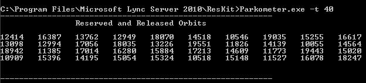

# <a name="skype-for-business-server-2015-resource-kit-tools-documentation"></a><span data-ttu-id="dd134-107">Документация по средствам набора ресурсов Skype для бизнеса Server 2015</span><span class="sxs-lookup"><span data-stu-id="dd134-107">Skype for Business Server 2015 Resource Kit Tools Documentation</span></span>

<span data-ttu-id="dd134-108">В этом разделе описываются средства в наборе ресурсов Skype для бизнеса Server 2015, включая назначение каждого средства, а также примеры его использования.</span><span class="sxs-lookup"><span data-stu-id="dd134-108">This topic describes the tools in the Skype for Business Server 2015 Resource Kit, including the purpose of each tool, and examples of its use.</span></span> <span data-ttu-id="dd134-109">Набор ресурсов Skype для бизнеса Server 2015 упрощает выполнение рутинных задач ИТ-администраторам, которые развертывают Skype для бизнеса Server 2015 и управляют ими.</span><span class="sxs-lookup"><span data-stu-id="dd134-109">The Skype for Business Server 2015 Resource Kit helps to make routine tasks easier for IT administrators who deploy and manage Skype for Business Server 2015.</span></span> <span data-ttu-id="dd134-110">Например, средство **Web Conf Data** можно использовать для легкого управления данными, которые загружаются пользователями во время собрания в Интернете.</span><span class="sxs-lookup"><span data-stu-id="dd134-110">For example, the **Web Conf Data** tool can be used to easily control data that is uploaded by users during an online meeting.</span></span> <span data-ttu-id="dd134-111">Средство **SEFAUtil** можно использовать для создания переадэстройки и ответа на вызовы делегатов для пользователей.</span><span class="sxs-lookup"><span data-stu-id="dd134-111">The **SEFAUtil** tool can be used to set up delegate call forwarding and answering for users.</span></span> <span data-ttu-id="dd134-112">Мы рекомендуем ИТ-администраторам использовать эти средства для более эффективного управления Skype для бизнеса Server 2015.</span><span class="sxs-lookup"><span data-stu-id="dd134-112">We encourage IT administrators to use these tools to more effectively manage Skype for Business Server 2015.</span></span>

## <a name="installation-of-the-resource-kit-tools"></a><span data-ttu-id="dd134-113">Установка средств набора ресурсов</span><span class="sxs-lookup"><span data-stu-id="dd134-113">Installation of the Resource Kit Tools</span></span>

<span data-ttu-id="dd134-114">Чтобы установить набор ресурсов Skype для бизнеса Server 2015, скачайтеOCSReskit.msi[ из ](https://www.microsoft.com/download/details.aspx?id=52631) Центра загрузки.</span><span class="sxs-lookup"><span data-stu-id="dd134-114">To install the Skype for Business Server 2015 Resource Kit, download [OCSReskit.msi](https://www.microsoft.com/download/details.aspx?id=52631) from the Download Center.</span></span>

<span data-ttu-id="dd134-115">Запустите **OCSResKit.msi,** чтобы выполнить простую установку.</span><span class="sxs-lookup"><span data-stu-id="dd134-115">Run **OCSResKit.msi** to do a simple installation.</span></span> <span data-ttu-id="dd134-116">.msi устанавливает все средства на следующем пути: **%Program Files%\Skype для бизнеса Server 2015\ResKit**.</span><span class="sxs-lookup"><span data-stu-id="dd134-116">The .msi installs all the tools in the following path: **%Program Files%\Skype for Business Server 2015\ResKit**.</span></span> <span data-ttu-id="dd134-117">Средства, которые являются автономными исполняемыми, находятся в этой папке.</span><span class="sxs-lookup"><span data-stu-id="dd134-117">Tools that are self-contained executables are in this folder.</span></span> <span data-ttu-id="dd134-118">Средства, которые также имеют вспомогательные файлы, находятся в своих подмостках.</span><span class="sxs-lookup"><span data-stu-id="dd134-118">Tools that also have supporting files are in their own subfolders.</span></span>

## <a name="supported-environments"></a><span data-ttu-id="dd134-119">Поддерживаемые среды</span><span class="sxs-lookup"><span data-stu-id="dd134-119">Supported Environments</span></span>

<span data-ttu-id="dd134-120">Набор ресурсов Skype для бизнеса Server 2015 должен быть установлен на сервере, который соответствует требованиям, требуемой для Skype для бизнеса Server 2015, обычно для запуска Skype для бизнеса Server 2015.</span><span class="sxs-lookup"><span data-stu-id="dd134-120">The Skype for Business Server 2015 Resource Kit should be installed on a server that meets the specifications required for Skype for Business Server 2015, usually one being used to run Skype for Business Server 2015.</span></span>

## <a name="resource-kit-tools-overview"></a><span data-ttu-id="dd134-121">Обзор средств набора ресурсов</span><span class="sxs-lookup"><span data-stu-id="dd134-121">Resource Kit Tools Overview</span></span>

<span data-ttu-id="dd134-122">Ниже представлен список средств, предоставляемых в наборе ресурсов Skype для бизнеса Server 2015.</span><span class="sxs-lookup"><span data-stu-id="dd134-122">The following is a list of the tools that are provided in the Skype for Business Server 2015 Resource Kit.</span></span> <span data-ttu-id="dd134-123">Описание каждого средства, включая требования и пример использования, описано в следующих разделах.</span><span class="sxs-lookup"><span data-stu-id="dd134-123">A description of each tool, including the requirements and example usage is covered in the following sections.</span></span>

- [<span data-ttu-id="dd134-124">ABSConfig</span><span class="sxs-lookup"><span data-stu-id="dd134-124">ABSConfig</span></span>](resource-kit-tools.md#ABSConfig)

- [<span data-ttu-id="dd134-125">Монитор службы политики пропускной способности</span><span class="sxs-lookup"><span data-stu-id="dd134-125">Bandwidth Policy Service Monitor</span></span>](resource-kit-tools.md#bpsm)

- [<span data-ttu-id="dd134-126">Анализатор использования пропускной способности</span><span class="sxs-lookup"><span data-stu-id="dd134-126">Bandwidth Utilization Analyzer</span></span>](resource-kit-tools.md#bua)

- [<span data-ttu-id="dd134-127">Call Parkometer</span><span class="sxs-lookup"><span data-stu-id="dd134-127">Call Parkometer</span></span>](resource-kit-tools.md#callpark)

- [<span data-ttu-id="dd134-128">DBAnalyze</span><span class="sxs-lookup"><span data-stu-id="dd134-128">DBAnalyze</span></span>](resource-kit-tools.md#dba)

- [<span data-ttu-id="dd134-129">Данные службы импорта</span><span class="sxs-lookup"><span data-stu-id="dd134-129">Import Storage Service Data</span></span>](resource-kit-tools.md#Issd)

- [<span data-ttu-id="dd134-130">LCSSync</span><span class="sxs-lookup"><span data-stu-id="dd134-130">LCSSync</span></span>](resource-kit-tools.md#LCSSync)

- [<span data-ttu-id="dd134-131">Консоль пользователя Lookup</span><span class="sxs-lookup"><span data-stu-id="dd134-131">Lookup User Console</span></span>](resource-kit-tools.md#LUC)

- [<span data-ttu-id="dd134-132">MsTurnPing</span><span class="sxs-lookup"><span data-stu-id="dd134-132">MsTurnPing</span></span>](resource-kit-tools.md#MsTurnPing)

- [<span data-ttu-id="dd134-133">Просмотр конфигурации сети</span><span class="sxs-lookup"><span data-stu-id="dd134-133">Network Configuration Viewer</span></span>](resource-kit-tools.md#NCV)

- [<span data-ttu-id="dd134-134">Агент группы ответов в прямом эфире</span><span class="sxs-lookup"><span data-stu-id="dd134-134">Response Group Agent Live</span></span>](resource-kit-tools.md#RGAL)

- [<span data-ttu-id="dd134-135">SEFAUtil</span><span class="sxs-lookup"><span data-stu-id="dd134-135">SEFAUtil</span></span>](resource-kit-tools.md#SEFAUtil)

- [<span data-ttu-id="dd134-136">SYSPrep.ps1</span><span class="sxs-lookup"><span data-stu-id="dd134-136">SYSPrep.ps1</span></span>](resource-kit-tools.md#SYSPrep)

- [<span data-ttu-id="dd134-137">Миграция неназвных объявлений номеров</span><span class="sxs-lookup"><span data-stu-id="dd134-137">Unassigned Number Announcements Migration</span></span>](resource-kit-tools.md#UNAM)

- [<span data-ttu-id="dd134-138">Данные веб-конфи</span><span class="sxs-lookup"><span data-stu-id="dd134-138">Web Conf Data</span></span>](resource-kit-tools.md#WebConfData)

## <a name="absconfig"></a><span data-ttu-id="dd134-139">ABSConfig</span><span class="sxs-lookup"><span data-stu-id="dd134-139">ABSConfig</span></span>
<span data-ttu-id="dd134-140"><a name="ABSConfig"> </a></span><span class="sxs-lookup"><span data-stu-id="dd134-140"><a name="ABSConfig"> </a></span></span>

<span data-ttu-id="dd134-141">Средство конфигурации служб адресной книги (ABSConfig) — это административный инструмент, который помогает администраторам настраивать конфигурацию службы адресных книг в Skype для бизнеса Server 2015.</span><span class="sxs-lookup"><span data-stu-id="dd134-141">The Address Book Service Configuration tool (ABSConfig) is an administrative tool that helps administrators customize Address Book Service configuration in Skype for Business Server 2015.</span></span> <span data-ttu-id="dd134-142">Этот инструмент также позволяет администраторам Skype для бизнеса Server 2015 восстанавливать параметры службы адресной книги по умолчанию.</span><span class="sxs-lookup"><span data-stu-id="dd134-142">This tool also enables Skype for Business Server 2015 administrators to restore the default Address Book Service settings.</span></span>

### <a name="description"></a><span data-ttu-id="dd134-143">Описание</span><span class="sxs-lookup"><span data-stu-id="dd134-143">Description</span></span>

<span data-ttu-id="dd134-144">ABSConfig — это графическое приложение пользовательского интерфейса, которое позволяет администраторам настраивать атрибуты служб домена Active Directory, связанные со службой адресной книги.</span><span class="sxs-lookup"><span data-stu-id="dd134-144">ABSConfig is a graphical user interface application that enables administrators to configure Active Directory Domain Services attributes that are related to Address Book Service.</span></span>

<span data-ttu-id="dd134-145">Основные сценарии для этого средства:</span><span class="sxs-lookup"><span data-stu-id="dd134-145">The primary scenarios for the tool are the following:</span></span>

- <span data-ttu-id="dd134-146">Чтобы администраторы могли сопопоминали атрибуты служб домена Active Directory с атрибутами Skype для бизнеса Server 2015.</span><span class="sxs-lookup"><span data-stu-id="dd134-146">To enable administrators to map attributes in Active Directory Domain Services to the attributes for Skype for Business Server 2015.</span></span>

- <span data-ttu-id="dd134-147">Чтобы администраторы могли указать атрибут Службы домена Active Directory, который должен быть включен или исключен в файлы службы адресной книги.</span><span class="sxs-lookup"><span data-stu-id="dd134-147">To enable administrators to specify the Active Directory Domain Services attribute to be included or excluded in the Address Book Service files.</span></span>

- <span data-ttu-id="dd134-148">Чтобы администраторы могли восстанавливать параметры службы адресной книги по умолчанию.</span><span class="sxs-lookup"><span data-stu-id="dd134-148">To enable administrators to restore default Address Book Service settings.</span></span>

<span data-ttu-id="dd134-149">Инструмент ABSConfig можно начать с помощью ABSConfig.exe файла.</span><span class="sxs-lookup"><span data-stu-id="dd134-149">The ABSConfig tool can be started by using the ABSConfig.exe file.</span></span> <span data-ttu-id="dd134-150">Средство открывает вкладку **Configure Attributes.** В этой таблице доступны параметры для картографии атрибутов Active Directory Domain Services к полям атрибутов Для Skype для бизнеса Server 2015 и указания пользователей, которые должны включать или исключать в файлы службы адресных книг на основе определенных фильтров атрибутов.</span><span class="sxs-lookup"><span data-stu-id="dd134-150">The tool opens to the **Configure Attributes** tab. This table has options to map Active Directory Domain Services attributes to the attribute fields for Skype for Business Server 2015 and to specify which users to include or exclude in Address Book Service files based on specific attribute filters.</span></span> <span data-ttu-id="dd134-151">Он также имеет параметры для настройки значения номера телефона, который будет включен в файл адресной книги.</span><span class="sxs-lookup"><span data-stu-id="dd134-151">It also has options to customize which value of the phone number to be included in the Address Book file.</span></span> <span data-ttu-id="dd134-152">Параметр **Restore Defaults** позволяет администраторам восстанавливать параметры службы адресных книг до значений по умолчанию.</span><span class="sxs-lookup"><span data-stu-id="dd134-152">The **Restore Defaults** option enables administrators to restore Address Book Service settings to default values.</span></span>

> [!NOTE]
> <span data-ttu-id="dd134-153">Повторное сопоставление атрибутов AD с различными именами полей OC будет работать только для загрузки файлов адресной книги и не поддерживается веб-запросом адресной книги.</span><span class="sxs-lookup"><span data-stu-id="dd134-153">Re-mapping of AD attributes to different OC Field Names will only work for Address Book File Download, and is not supported by Address Book Web Query.</span></span>

### <a name="output"></a><span data-ttu-id="dd134-154">Выходные данные</span><span class="sxs-lookup"><span data-stu-id="dd134-154">Output</span></span>

<span data-ttu-id="dd134-155">ABSConfig хранит конфигурацию службы адресных книг в базе данных.</span><span class="sxs-lookup"><span data-stu-id="dd134-155">ABSConfig stores the Address Book Service configuration in the database.</span></span>

```console
Path: %ProgramFiles%\Skype for Business Server 2015\Reskit
```

### <a name="purpose"></a><span data-ttu-id="dd134-156">Назначение</span><span class="sxs-lookup"><span data-stu-id="dd134-156">Purpose</span></span>

<span data-ttu-id="dd134-157">ABSConfig предоставляет быстрый и простой способ настройки службы адресной книги Skype для бизнеса Server 2015.</span><span class="sxs-lookup"><span data-stu-id="dd134-157">ABSConfig provides a quick and easy way to customize Skype for Business Server 2015 Address Book Service.</span></span>

### <a name="requirements"></a><span data-ttu-id="dd134-158">Требования</span><span class="sxs-lookup"><span data-stu-id="dd134-158">Requirements</span></span>

#### <a name="computer"></a><span data-ttu-id="dd134-159">Компьютер</span><span class="sxs-lookup"><span data-stu-id="dd134-159">Computer</span></span>

<span data-ttu-id="dd134-160">ABSConfig можно запускать только с компьютера с доменом, на который установлен Skype для бизнеса Server 2015.</span><span class="sxs-lookup"><span data-stu-id="dd134-160">ABSConfig can be run only from a domain-joined computer that has Skype for Business Server 2015 installed.</span></span> <span data-ttu-id="dd134-161">В случае Skype для бизнеса Server 2015, Enterprise Edition, этот инструмент можно запустить на любых серверов переднего конца, которые имеют службу адресной книги включен во время установки.</span><span class="sxs-lookup"><span data-stu-id="dd134-161">In the case of Skype for Business Server 2015, Enterprise Edition, this tool can be run on any Front End servers that have the Address Book Service enabled during setup.</span></span>

#### <a name="network"></a><span data-ttu-id="dd134-162">Сеть</span><span class="sxs-lookup"><span data-stu-id="dd134-162">Network</span></span>

<span data-ttu-id="dd134-163">Компьютер должен иметь возможность подключения к пулу переднего и заднего баз данных.</span><span class="sxs-lookup"><span data-stu-id="dd134-163">The computer should be able to connect to the Front End pool and back-end database.</span></span>

#### <a name="software"></a><span data-ttu-id="dd134-164">Программное обеспечение</span><span class="sxs-lookup"><span data-stu-id="dd134-164">Software</span></span>

<span data-ttu-id="dd134-165">Перед запуском инструмента ABSConfig необходимо установить следующие компоненты программного обеспечения:</span><span class="sxs-lookup"><span data-stu-id="dd134-165">The following software components must be installed before running the ABSConfig tool:</span></span>

- <span data-ttu-id="dd134-166">Skype для бизнеса Server 2015</span><span class="sxs-lookup"><span data-stu-id="dd134-166">Skype for Business Server 2015</span></span>

#### <a name="users"></a><span data-ttu-id="dd134-167">Пользователи</span><span class="sxs-lookup"><span data-stu-id="dd134-167">Users</span></span>

<span data-ttu-id="dd134-168">Администраторы, у которых есть разрешения, необходимые для обновления развертывания Skype для бизнеса Server 2015.</span><span class="sxs-lookup"><span data-stu-id="dd134-168">Administrators who have the permissions required to update the Skype for Business Server 2015 deployment.</span></span>

### <a name="examples"></a><span data-ttu-id="dd134-169">Примеры</span><span class="sxs-lookup"><span data-stu-id="dd134-169">Examples</span></span>

<span data-ttu-id="dd134-170">ABSConfig можно начать с вводаABSConfig.exe **по** командной подсказке.</span><span class="sxs-lookup"><span data-stu-id="dd134-170">ABSConfig can be started by typing **ABSConfig.exe** at a command prompt.</span></span> <span data-ttu-id="dd134-171">Ниже показан пользовательский интерфейс инструмента ABSConfig.</span><span class="sxs-lookup"><span data-stu-id="dd134-171">Shown below is the ABSConfig tool user interface.</span></span>


### <a name="summary"></a><span data-ttu-id="dd134-173">Аннотация</span><span class="sxs-lookup"><span data-stu-id="dd134-173">Summary</span></span>

<span data-ttu-id="dd134-174">Средство ABSConfig предоставляет администраторам быстрый и простой в использовании инструмент для настройки службы адресной книги Skype для бизнеса Server 2015.</span><span class="sxs-lookup"><span data-stu-id="dd134-174">The ABSConfig tool provides administrators a quick and easy to use tool to customize Skype for Business Server 2015 Address Book Service.</span></span>

## <a name="bandwidth-policy-service-monitor"></a><span data-ttu-id="dd134-175">Монитор службы политики пропускной способности</span><span class="sxs-lookup"><span data-stu-id="dd134-175">Bandwidth Policy Service Monitor</span></span>
<span data-ttu-id="dd134-176"><a name="bpsm"> </a></span><span class="sxs-lookup"><span data-stu-id="dd134-176"><a name="bpsm"> </a></span></span>

<span data-ttu-id="dd134-177">Средство Мониторинга политики пропускной способности предназначено для того, чтобы администраторы просмотрели список следующих ниже.</span><span class="sxs-lookup"><span data-stu-id="dd134-177">The Bandwidth Policy Service Monitor tool is intended to allow administrators to view a list of the following:</span></span>

1. <span data-ttu-id="dd134-178">Все настроенные службы политики пропускной способности Skype для бизнеса Server 2015 (проверка подлинности и core) в топологии</span><span class="sxs-lookup"><span data-stu-id="dd134-178">All the configured Skype for Business Server 2015 Bandwidth Policy services (Authentication and Core) in the topology</span></span>

2. <span data-ttu-id="dd134-179">Подключения каждой службы к другим службам политики пропускной способности и к серверам Edge</span><span class="sxs-lookup"><span data-stu-id="dd134-179">The connections that each service makes to other Bandwidth Policy services and to the Edge servers</span></span>

3. <span data-ttu-id="dd134-180">Все ссылки, настроенные в документе конфигурации сети и использовании пропускной способности в режиме реального времени, как сообщается каждой из служб политики пропускной способности</span><span class="sxs-lookup"><span data-stu-id="dd134-180">All the links that are configured in the Network configuration document and real-time bandwidth usage as reported by each of the Bandwidth Policy services</span></span>

### <a name="description"></a><span data-ttu-id="dd134-181">Описание</span><span class="sxs-lookup"><span data-stu-id="dd134-181">Description</span></span>

<span data-ttu-id="dd134-182">Средство Мониторинга политики пропускной способности реализуется в качестве приложения на основе GUI.</span><span class="sxs-lookup"><span data-stu-id="dd134-182">The Bandwidth Policy Service Monitor tool is implemented as a GUI-based application.</span></span> <span data-ttu-id="dd134-183">Администраторы запускают средство, запуская PDPMonUI.exe.</span><span class="sxs-lookup"><span data-stu-id="dd134-183">Administrators start the tool by running PDPMonUI.exe.</span></span>

<span data-ttu-id="dd134-184">Когда средство запускается, он пытается обнаружить список служб политики пропускной способности в топологии.</span><span class="sxs-lookup"><span data-stu-id="dd134-184">When the tool starts, it attempts to discover the list of Bandwidth Policy services in the topology.</span></span> <span data-ttu-id="dd134-185">После первоначального обновления области слева от окна заполняется список служб, которые сгруппируются по кластерам, которые они принадлежат.</span><span class="sxs-lookup"><span data-stu-id="dd134-185">After the initial update is done, the pane to the left of the window is populated with a list of services that are grouped by the clusters that they belong to.</span></span>

<span data-ttu-id="dd134-186">Когда администраторы выбирают определенную службу политики пропускной способности, на правой области отображаются сведения об этой конкретной службе.</span><span class="sxs-lookup"><span data-stu-id="dd134-186">When administrators select a particular Bandwidth Policy Service, the pane on the right displays the information about that particular service.</span></span> <span data-ttu-id="dd134-187">На этой области также есть две основные вкладки, на которые отображаются сведения.</span><span class="sxs-lookup"><span data-stu-id="dd134-187">That pane also has two main tabs that display information.</span></span>

#### <a name="machine-info-tab"></a><span data-ttu-id="dd134-188">Вкладка Сведения о машине</span><span class="sxs-lookup"><span data-stu-id="dd134-188">Machine Info Tab</span></span>

<span data-ttu-id="dd134-189">На **вкладке** Machine Info показаны сведения о выбранной службе политики пропускной способности и списке и состоянии всех подключений, которые сделаны выбранной службой политики пропускной способности к другим службам.</span><span class="sxs-lookup"><span data-stu-id="dd134-189">The **Machine Info** tab shows the details of the Bandwidth Policy Service that is selected and the list and state of all the connections that are made by the selected Bandwidth Policy Service to other services.</span></span>

#### <a name="topology-info-tab"></a><span data-ttu-id="dd134-190">Вкладка Топология Info</span><span class="sxs-lookup"><span data-stu-id="dd134-190">Topology Info Tab</span></span>

<span data-ttu-id="dd134-191">На **вкладке Топология Info** показан список всех ссылок, настроенных в параметрах конфигурации Сети.</span><span class="sxs-lookup"><span data-stu-id="dd134-191">The **Topology Info** tab shows a list of all the links that are configured in the Network configuration settings.</span></span> <span data-ttu-id="dd134-192">Для каждой ссылки отображается пропускная способность аудио- и видеосвязи.</span><span class="sxs-lookup"><span data-stu-id="dd134-192">For each link, the audio and video bandwidth capacity is displayed.</span></span> <span data-ttu-id="dd134-193">Кроме того, отображается используемая в настоящее время пропускная способность как в Kbps, так и в процентах от емкости.</span><span class="sxs-lookup"><span data-stu-id="dd134-193">Additionally, the currently utilized bandwidth is displayed, both in Kbps and as a percentage of the capacity.</span></span> <span data-ttu-id="dd134-194">Средство использует цветовое кодирование, чтобы выделить ссылки с использованием, которые близки к емкости, что позволяет администраторам быстро изолировать такие ссылки.</span><span class="sxs-lookup"><span data-stu-id="dd134-194">The tool uses color-coding to highlight links that have utilization that is close to the capacity—this allows administrators to quickly isolate such links.</span></span>

> [!NOTE]
>  <span data-ttu-id="dd134-195">Если средство Мониторинга политики пропускной способности испытывает сбой при подключении к какой-либо  из настроенных служб политики пропускной способности, сведения в машинной информации и вкладки **Топология Info** не будут заполнены.</span><span class="sxs-lookup"><span data-stu-id="dd134-195">If the Bandwidth Policy Service Monitor tool experiences failure when it connects to any of the configured Bandwidth Policy services, the information in the **Machine Info** and the **Topology Info** tabs won't be populated.</span></span> <span data-ttu-id="dd134-196">Однако не исключено, что средство может подключиться изначально, но впоследствии потерять подключение к службе.</span><span class="sxs-lookup"><span data-stu-id="dd134-196">However, it is possible that the tool might connect initially but subsequently lose its connection to the service.</span></span> <span data-ttu-id="dd134-197">В таких случаях администраторы могут видеть устаревшие сведения.</span><span class="sxs-lookup"><span data-stu-id="dd134-197">In such cases, administrators might see outdated information.</span></span> <span data-ttu-id="dd134-198">На каждой **вкладке** имеется отметка последнего обновленного времени, которая позволяет администраторам видеть, когда данные были обновлены в последний раз для определенной службы политики пропускной способности.</span><span class="sxs-lookup"><span data-stu-id="dd134-198">There is a **Last Updated** time stamp on each of the tabs that can allow administrators to see when the data was last updated for a particular Bandwidth Policy Service.</span></span>

### <a name="output"></a><span data-ttu-id="dd134-199">Выходные данные</span><span class="sxs-lookup"><span data-stu-id="dd134-199">Output</span></span>

<span data-ttu-id="dd134-200">Выход командной строки не существует; выход программы содержится в основном графическом пользовательском интерфейсе (GUI).</span><span class="sxs-lookup"><span data-stu-id="dd134-200">There is no command-line output; the program output is contained within the main graphical user interface (GUI).</span></span>

### <a name="purpose"></a><span data-ttu-id="dd134-201">Назначение</span><span class="sxs-lookup"><span data-stu-id="dd134-201">Purpose</span></span>

<span data-ttu-id="dd134-202">Цель средства Мониторинга политики пропускной способности — разрешить администраторам видимость состояния каждой из служб политики пропускной способности, определенных в топологии.</span><span class="sxs-lookup"><span data-stu-id="dd134-202">The purpose of the Bandwidth Policy Service Monitor tool is to allow administrators visibility into the state of each of the Bandwidth Policy services that are defined in the topology.</span></span> <span data-ttu-id="dd134-203">Кроме того, администраторы могут видеть использование пропускной способности в режиме реального времени для всех ссылок, определенных в документе конфигурации сети.</span><span class="sxs-lookup"><span data-stu-id="dd134-203">In addition, administrators can see real-time bandwidth usage for all the links that are defined in the Network configuration document.</span></span>

### <a name="requirements"></a><span data-ttu-id="dd134-204">Требования</span><span class="sxs-lookup"><span data-stu-id="dd134-204">Requirements</span></span>

<span data-ttu-id="dd134-205">Средство Мониторинга политики пропускной способности должно запускаться на компьютере, который входит в топологию Skype для бизнеса Server.</span><span class="sxs-lookup"><span data-stu-id="dd134-205">The Bandwidth Policy Service Monitor tool needs to be run on a computer that is part of the Skype for Business Server topology.</span></span>

### <a name="summary"></a><span data-ttu-id="dd134-206">Аннотация</span><span class="sxs-lookup"><span data-stu-id="dd134-206">Summary</span></span>

<span data-ttu-id="dd134-207">Средство Мониторинга политики пропускной способности может быть ценным ресурсом для администраторов, чтобы они могли проверять состояние всех служб политики пропускной способности в топологии, и что еще более важно— они могут получать использование пропускной способности в режиме реального времени для ссылок, определенных в параметрах конфигурации сети.</span><span class="sxs-lookup"><span data-stu-id="dd134-207">The Bandwidth Policy Service Monitor tool can be a valuable resource to administrators so they can inspect the state of all the Bandwidth Policy services in the topology—and more importantly—they can obtain real-time bandwidth utilization for the links that are defined in the Network configuration settings.</span></span>

## <a name="bandwidth-utilization-analyzer"></a><span data-ttu-id="dd134-208">Анализатор использования пропускной способности</span><span class="sxs-lookup"><span data-stu-id="dd134-208">Bandwidth Utilization Analyzer</span></span>
<span data-ttu-id="dd134-209"><a name="bua"> </a></span><span class="sxs-lookup"><span data-stu-id="dd134-209"><a name="bua"> </a></span></span>

<span data-ttu-id="dd134-210">Анализатор использования пропускной способности — это средство, которое создает отчеты о различных представлениях потребления пропускной способности конечными точками UC по ссылкам WAN в корпоративной сети.</span><span class="sxs-lookup"><span data-stu-id="dd134-210">Bandwidth Utilization Analyzer is a tool that creates reports about various views of bandwidth consumption by the UC endpoints across WAN links in the enterprise network.</span></span> <span data-ttu-id="dd134-211">Эти отчеты можно использовать для понимания текущего шаблона потребления пропускной способности и для планирования пропускной способности пропускной способности.</span><span class="sxs-lookup"><span data-stu-id="dd134-211">These reports can be used to understand the current bandwidth consumption pattern and to aid in bandwidth capacity planning.</span></span>

### <a name="description"></a><span data-ttu-id="dd134-212">Описание</span><span class="sxs-lookup"><span data-stu-id="dd134-212">Description</span></span>

<span data-ttu-id="dd134-213">Анализатор использования пропускной способности реализуется в качестве приложения на основе GUI.</span><span class="sxs-lookup"><span data-stu-id="dd134-213">Bandwidth Utilization Analyzer is implemented as a GUI-based application.</span></span> <span data-ttu-id="dd134-214">Этот инструмент создает отчеты специально для использования аудио в сети и помогает с планированием емкости.</span><span class="sxs-lookup"><span data-stu-id="dd134-214">This tool generates reports specifically for audio utilization across the network and helps with capacity planning.</span></span> <span data-ttu-id="dd134-215">Он также итерирует пропускную способность, назначенную различным ссылкам.</span><span class="sxs-lookup"><span data-stu-id="dd134-215">It also iterates on the bandwidth capacity that is assigned to various links.</span></span>

### <a name="output"></a><span data-ttu-id="dd134-216">Выходные данные</span><span class="sxs-lookup"><span data-stu-id="dd134-216">Output</span></span>

<span data-ttu-id="dd134-217">Анализатор использования пропускной способности предоставляет графические al-участки пропускной способности и использования для аудио для всех WAN-ссылок, настроенных в системе.</span><span class="sxs-lookup"><span data-stu-id="dd134-217">Bandwidth Utilization Analyzer provides graphic al plots of bandwidth capacity and utilization for audio for all the WAN links that are configured in the system.</span></span>

### <a name="purpose"></a><span data-ttu-id="dd134-218">Назначение</span><span class="sxs-lookup"><span data-stu-id="dd134-218">Purpose</span></span>

<span data-ttu-id="dd134-219">В любом развертывании голосовых и видеосвязи важно отслеживать и понимать тенденцию использования пропускной способности трафика мультимедиа в корпоративной сети.</span><span class="sxs-lookup"><span data-stu-id="dd134-219">In any voice and video deployment, it's critical to monitor and understand the trend of bandwidth utilization of media traffic across the enterprise network.</span></span> <span data-ttu-id="dd134-220">Средство анализатора использования пропускной способности позволяет администратору достичь именно этого.</span><span class="sxs-lookup"><span data-stu-id="dd134-220">The Bandwidth Utilization Analyzer tool allows an administrator to achieve just that.</span></span> <span data-ttu-id="dd134-221">Этот инструмент делает следующее:</span><span class="sxs-lookup"><span data-stu-id="dd134-221">This tool does the following:</span></span>

- <span data-ttu-id="dd134-222">Создает конкретные отчеты для использования аудио в сети</span><span class="sxs-lookup"><span data-stu-id="dd134-222">Generates specific reports for audio utilization across the network</span></span>

- <span data-ttu-id="dd134-223">Помогает более эффективному планированию емкости и итерации пропускной способности, которая назначена различным ссылкам</span><span class="sxs-lookup"><span data-stu-id="dd134-223">Helps with more effective capacity planning and iteration on the bandwidth capacity that is assigned to various links</span></span>

<span data-ttu-id="dd134-224">Анализатор использования пропускной способности может создавать графические участки отчетов о пропускной способности и использовании; они являются следующими:</span><span class="sxs-lookup"><span data-stu-id="dd134-224">Bandwidth Utilization Analyzer can generate graphical plots of bandwidth capacity and utilization reports; they are as follows:</span></span>

- <span data-ttu-id="dd134-225">Все ссылки WAN в корпоративной сети</span><span class="sxs-lookup"><span data-stu-id="dd134-225">All the WAN links in the enterprise network</span></span>

- <span data-ttu-id="dd134-226">Фильтруемая выбранными ссылками WAN</span><span class="sxs-lookup"><span data-stu-id="dd134-226">Filtered by selected WAN links that have been chosen</span></span>

- <span data-ttu-id="dd134-227">Фильтрация по ссылкам WAN с превышением емкости ссылок</span><span class="sxs-lookup"><span data-stu-id="dd134-227">Filtered by WAN links that have exceeded link capacity</span></span>

- <span data-ttu-id="dd134-228">Фильтруются ссылки WAN, которые недополучит предусмотренную полосу пропускания</span><span class="sxs-lookup"><span data-stu-id="dd134-228">Filtered by WAN links that have been under-utilizing the provisioned bandwidth</span></span>

- <span data-ttu-id="dd134-229">Фильтр по ссылкам WAN, достигающим критических уровней (использование пропускной способности, которое превышает 90% пропускной способности WAN-ссылки)</span><span class="sxs-lookup"><span data-stu-id="dd134-229">Filter by WAN links that have been reaching critical levels (a bandwidth utilization that is greater than 90% of bandwidth capacity of the WAN link)</span></span>

- <span data-ttu-id="dd134-230">Фильтруется по типу ссылки WAN-network-site, межрегиональным ссылкам и ссылкам на сайте</span><span class="sxs-lookup"><span data-stu-id="dd134-230">Filtered by WAN link type—network-site links, interregional links, and links within a site</span></span>

- <span data-ttu-id="dd134-231">Фильтрация по сетевому региону</span><span class="sxs-lookup"><span data-stu-id="dd134-231">Filtered by network region</span></span>

#### <a name="applications"></a><span data-ttu-id="dd134-232">Приложения</span><span class="sxs-lookup"><span data-stu-id="dd134-232">Applications</span></span>

<span data-ttu-id="dd134-233">Анализатор использования пропускной способности имеет следующие два приложения (средства):</span><span class="sxs-lookup"><span data-stu-id="dd134-233">Bandwidth Utilization Analyzer has the following two applications (tools):</span></span>

- <span data-ttu-id="dd134-234">**WanLinkLogCollector.exe** Этот инструмент позволяет пользователю вводить требуемую информацию.</span><span class="sxs-lookup"><span data-stu-id="dd134-234">**WanLinkLogCollector.exe** This tool enables its user to input the required information.</span></span>

- <span data-ttu-id="dd134-235">**BandwidthUtilizationAnalyzer.xlsm** Отчет о программном обеспечении для электронных таблиц Microsoft Excel автоматически запускается WanLinkLogCollector.exe.</span><span class="sxs-lookup"><span data-stu-id="dd134-235">**BandwidthUtilizationAnalyzer.xlsm** A Microsoft Excel spreadsheet software report is automatically launched by WanLinkLogCollector.exe.</span></span> <span data-ttu-id="dd134-236">Это приложение позволяет пользователю применять фильтры к отчету, как показано ниже в этой статье.</span><span class="sxs-lookup"><span data-stu-id="dd134-236">This application allows the user to apply filters to the report as shown later in this article.</span></span>

#### <a name="phases-of-using-bandwidth-utilization-analyzer"></a><span data-ttu-id="dd134-237">Этапы использования анализатора использования пропускной способности</span><span class="sxs-lookup"><span data-stu-id="dd134-237">Phases of Using Bandwidth Utilization Analyzer</span></span>

<span data-ttu-id="dd134-238">При использовании анализатора использования пропускной способности существует два этапа:</span><span class="sxs-lookup"><span data-stu-id="dd134-238">There are two phases when using Bandwidth Utilization Analyzer:</span></span>

- <span data-ttu-id="dd134-239">Сбор журналов, выполняемый с помощью WanLinkLogCollector.exe</span><span class="sxs-lookup"><span data-stu-id="dd134-239">Collect logs, which is performed by using WanLinkLogCollector.exe</span></span>

- <span data-ttu-id="dd134-240">Настройка отчетов, выполняемых с помощью BandwidthUtilizationAnalyzer.xlsm</span><span class="sxs-lookup"><span data-stu-id="dd134-240">Customize reports, which is performed by using BandwidthUtilizationAnalyzer.xlsm</span></span>

    > [!IMPORTANT]
    > <span data-ttu-id="dd134-241">Мы настоятельно рекомендуем BandwidthUtilizationAnalyzer.xlsне запускать м вручную конечными пользователями.</span><span class="sxs-lookup"><span data-stu-id="dd134-241">We strongly recommend that BandwidthUtilizationAnalyzer.xlsm not be manually launched by end users.</span></span>

#### <a name="starting-bandwidth-utilization-analyzer"></a><span data-ttu-id="dd134-242">Запуск анализатора использования пропускной способности</span><span class="sxs-lookup"><span data-stu-id="dd134-242">Starting Bandwidth Utilization Analyzer</span></span>

<span data-ttu-id="dd134-243">Начните WanLinkLogCollector.exe по командной подсказке или с помощью Обозревателя Windows.</span><span class="sxs-lookup"><span data-stu-id="dd134-243">Start WanLinkLogCollector.exe at the command prompt or by using Windows Explorer.</span></span>

 <span data-ttu-id="dd134-244">**Использование WanLinkLogCollector.exe**</span><span class="sxs-lookup"><span data-stu-id="dd134-244">**Using WanLinkLogCollector.exe**</span></span>

<span data-ttu-id="dd134-245">Существует три шага к использованию WanLinkLogCollector.exe:</span><span class="sxs-lookup"><span data-stu-id="dd134-245">There are three steps to using WanLinkLogCollector.exe:</span></span>

1. <span data-ttu-id="dd134-246">**Журнал временной шкалы** Укай сроки, которые необходимо сгенерить для отчета</span><span class="sxs-lookup"><span data-stu-id="dd134-246">**Log the timeline** Provide the timeline that the report needs to be generated for</span></span>

2. <span data-ttu-id="dd134-247">**Укажите каталоги файлов** Предоставление сведений о расположении файлов</span><span class="sxs-lookup"><span data-stu-id="dd134-247">**Specify the file directories** Provide file location information</span></span>

3. <span data-ttu-id="dd134-248">**Сбор журналов и запуск просмотра отчетов** Выполните команду для создания отчета</span><span class="sxs-lookup"><span data-stu-id="dd134-248">**Collect the logs and launch the report viewer** Execute the command to generate the report</span></span>

#### <a name="step-1---log-the-timeline"></a><span data-ttu-id="dd134-249">Шаг 1 . Журнал временной шкалы</span><span class="sxs-lookup"><span data-stu-id="dd134-249">Step 1 - Log the timeline</span></span>

<span data-ttu-id="dd134-250">Ведение журнала временной шкалы позволяет пользователю средства указать следующее, как показано на рисунке ниже.</span><span class="sxs-lookup"><span data-stu-id="dd134-250">Logging the timeline allows the tool user to specify the following as shown in the figure below.</span></span>

1. <span data-ttu-id="dd134-251">**Дата начала** Это дата начала хронологии, для которую должен быть создан отчет; например, 1 августа 2010 г.</span><span class="sxs-lookup"><span data-stu-id="dd134-251">**Start date** This is the start date of the timeline that the report is to be generated for; for example, August 1, 2010.</span></span>

2. <span data-ttu-id="dd134-252">**Дата окончания** Это дата окончания временной шкалы, для которую должен быть создан отчет; например, 30 сентября 2010 г.</span><span class="sxs-lookup"><span data-stu-id="dd134-252">**End date** This is the end date of the timeline that the report is to be generated for; for example, September 30, 2010.</span></span>

     

#### <a name="step-2---specify-the-file-directories"></a><span data-ttu-id="dd134-254">Шаг 2 . Укажите каталоги файлов</span><span class="sxs-lookup"><span data-stu-id="dd134-254">Step 2 - Specify the file directories</span></span>

<span data-ttu-id="dd134-255">Указанные ниже каталоги файлов могут быть указаны пользователем показано.</span><span class="sxs-lookup"><span data-stu-id="dd134-255">The following file directories can be specified by the user as shown.</span></span>

- <span data-ttu-id="dd134-256">**Расположение файлов журнала сервера** Расположение папки, где хранятся журналы серверов политики пропускной способности.</span><span class="sxs-lookup"><span data-stu-id="dd134-256">**Server log files location** The folder location where Bandwidth policy server logs are stored.</span></span> <span data-ttu-id="dd134-257">Как правило, это<\<fileserver\> \\ fe \> \AppServerFiles\PDP.</span><span class="sxs-lookup"><span data-stu-id="dd134-257">This is typically in \<fileserver\>\\<choice of FE\>\AppServerFiles\PDP.</span></span>

- <span data-ttu-id="dd134-258">**Временное расположение хранилища файлов** Временное расположение файла, в котором хранятся промежуточные файлы во время сгенерации отчета.</span><span class="sxs-lookup"><span data-stu-id="dd134-258">**Temporary file storage location** The temporary file location where intermediate files are stored while the report is being generated.</span></span>

    

    > [!NOTE]
    > <span data-ttu-id="dd134-260">Убедитесь, что пользователю инструмента предоставляется достаточный доступ к журналам серверов и временной папке хранения файлов.</span><span class="sxs-lookup"><span data-stu-id="dd134-260">Ensure that sufficient file access to the server logs and the temporary file store folder is provided to the tool user.</span></span>

#### <a name="step-3---collect-the-logs-and-start-the-report-viewer"></a><span data-ttu-id="dd134-261">Шаг 3 . Сбор журналов и запуск просмотра отчетов</span><span class="sxs-lookup"><span data-stu-id="dd134-261">Step 3 - Collect the logs and start the report viewer</span></span>

<span data-ttu-id="dd134-262">Чтобы собрать журналы и запустить просмотр отчетов, нажмите **кнопку Выполнить,** как показано ниже.</span><span class="sxs-lookup"><span data-stu-id="dd134-262">To collect the logs and start the report viewer, click **Execute** as shown below.</span></span> <span data-ttu-id="dd134-263">На этом этапе собираются необходимые данные.</span><span class="sxs-lookup"><span data-stu-id="dd134-263">This step collects the required data.</span></span>


<span data-ttu-id="dd134-265">После успешной проверки ввода отображается сообщение, показанное ниже.</span><span class="sxs-lookup"><span data-stu-id="dd134-265">When the input validation is successful, the message shown below is displayed.</span></span>


<span data-ttu-id="dd134-267">Нажмите кнопку **ОК**.</span><span class="sxs-lookup"><span data-stu-id="dd134-267">Click **OK**.</span></span> <span data-ttu-id="dd134-268">BandwidthUtilizationAnalyzer.xlsм автоматически запущен.</span><span class="sxs-lookup"><span data-stu-id="dd134-268">BandwidthUtilizationAnalyzer.xlsm is automatically started.</span></span> <span data-ttu-id="dd134-269">Следуйте инструкциям в поле сообщений.</span><span class="sxs-lookup"><span data-stu-id="dd134-269">Follow the instructions in the message box.</span></span> <span data-ttu-id="dd134-270">Подробные сведения см. **в BandwidthUtilizationAnalyzer.xlsm** в следующем разделе.</span><span class="sxs-lookup"><span data-stu-id="dd134-270">For details, see **Using BandwidthUtilizationAnalyzer.xlsm** in the next section.</span></span>


### <a name="using-bandwidthutilizationanalyzerxlsm"></a><span data-ttu-id="dd134-271">Использование BandwidthUtilizationAnalyzer.xlsm</span><span class="sxs-lookup"><span data-stu-id="dd134-271">Using BandwidthUtilizationAnalyzer.xlsm</span></span>

1. <span data-ttu-id="dd134-272">Когда BandwidthUtilizationAnalyzer.xlsм автоматически запущен, щелкните **Обновить,** как показано ниже.</span><span class="sxs-lookup"><span data-stu-id="dd134-272">When BandwidthUtilizationAnalyzer.xlsm is automatically started, click **Refresh** as shown below.</span></span>

     

2. <span data-ttu-id="dd134-274">Когда папка файлов открывается, выберите consolidated.csv из расположения, указанного в поле сообщений, как показано ниже.</span><span class="sxs-lookup"><span data-stu-id="dd134-274">When a file folder is opened, select consolidated.csv from the location that is specified in the message box as shown below.</span></span> <span data-ttu-id="dd134-275">В нем также показано расположение **C:\Temp**.</span><span class="sxs-lookup"><span data-stu-id="dd134-275">It also shows the location as **C:\Temp**.</span></span>

     

3. <span data-ttu-id="dd134-277">Нажмите кнопку **Импортировать**.</span><span class="sxs-lookup"><span data-stu-id="dd134-277">Click **Import**.</span></span>

4. <span data-ttu-id="dd134-278">Графический сюжет создается автоматически.</span><span class="sxs-lookup"><span data-stu-id="dd134-278">The graphical plot is automatically generated.</span></span> <span data-ttu-id="dd134-279">Он доступен при исчезновении указателя рабочей фоновой точки.</span><span class="sxs-lookup"><span data-stu-id="dd134-279">It is available when the working-in-the-background pointer disappears.</span></span>

     

#### <a name="applying-filters-to-the-report-view"></a><span data-ttu-id="dd134-281">Применение фильтров к представлению отчета</span><span class="sxs-lookup"><span data-stu-id="dd134-281">Applying Filters to the Report View</span></span>

<span data-ttu-id="dd134-282">Фильтры, которые можно применить к представлению отчета, как показано ниже, описаны следующим образом:</span><span class="sxs-lookup"><span data-stu-id="dd134-282">The filters that can be applied to the report view as shown below are described as follows:</span></span>


1. <span data-ttu-id="dd134-284">**Имя** Фильтр по ссылкам WAN (фильтр находится на правой стороне графика). Префикс обозначает следующие типы ссылок; см. вертикальное (синее) поле:</span><span class="sxs-lookup"><span data-stu-id="dd134-284">**Name** Filter by WAN links (the filter is on the right side of the graph).The prefix denotes the following link types; see the vertical (blue) box:</span></span>

   - <span data-ttu-id="dd134-285">**Сайт S** Ссылка WAN с сетевого сайта на сетевой регион</span><span class="sxs-lookup"><span data-stu-id="dd134-285">**S Site** The WAN link from a network site to a network region</span></span>

   - <span data-ttu-id="dd134-286">**Is Inter-Site** Связь WAN между двумя сетевыми сайтами</span><span class="sxs-lookup"><span data-stu-id="dd134-286">**IS Inter-Site** The WAN link between two network sites</span></span>

   - <span data-ttu-id="dd134-287">**R Межрегион** Связь WAN между двумя сетевыми регионами</span><span class="sxs-lookup"><span data-stu-id="dd134-287">**R Inter-Region** The WAN link between two network region</span></span>

2. <span data-ttu-id="dd134-288">**Превышение лимита** Фильтр по ссылкам WAN, использование пропускной способности которых превышает пропускную способность</span><span class="sxs-lookup"><span data-stu-id="dd134-288">**Exceeded limit** Filter by WAN links whose bandwidth utilization is more than the bandwidth capacity</span></span>

3. <span data-ttu-id="dd134-289">**Критические уровни** Фильтр по ссылкам WAN, использование пропускной способности которых достигло 90% или больше пропускной способности</span><span class="sxs-lookup"><span data-stu-id="dd134-289">**Critical levels** Filter by WAN links whose bandwidth utilization has reached 90% or more than the bandwidth capacity</span></span>

4. <span data-ttu-id="dd134-290">**Недоосвояемая** Фильтр по ссылкам WAN, использование пропускной способности которых составляет менее 25% пропускной способности</span><span class="sxs-lookup"><span data-stu-id="dd134-290">**Under-utilized** Filter by WAN links whose bandwidth utilization has been less than 25% of the bandwidth capacity</span></span>

5. <span data-ttu-id="dd134-291">**Тип ссылки** Фильтр по следующим типам ссылок WAN:</span><span class="sxs-lookup"><span data-stu-id="dd134-291">**Link type** Filter by the following WAN links types:</span></span>

   - <span data-ttu-id="dd134-292">**Тип сетевого** сайта</span><span class="sxs-lookup"><span data-stu-id="dd134-292">**Network site** type</span></span>

   - <span data-ttu-id="dd134-293">**Тип междометия**</span><span class="sxs-lookup"><span data-stu-id="dd134-293">**Inter-site** type</span></span>

   - <span data-ttu-id="dd134-294">**Тип ссылки между регионами**</span><span class="sxs-lookup"><span data-stu-id="dd134-294">**Inter-Region link** type</span></span>

6. <span data-ttu-id="dd134-295">**Регион** Фильтрация по сетевому региону</span><span class="sxs-lookup"><span data-stu-id="dd134-295">**Region** Filter by network region</span></span>

<span data-ttu-id="dd134-296">На следующих рисунках покажут описанные ранее фильтры.</span><span class="sxs-lookup"><span data-stu-id="dd134-296">The following figures show the previously described filters.</span></span>

<span data-ttu-id="dd134-297">Фильтр по **имени**.</span><span class="sxs-lookup"><span data-stu-id="dd134-297">Filter by **Name**.</span></span> <span data-ttu-id="dd134-298">Выберите список ссылок, которые необходимо отобразить на графике.</span><span class="sxs-lookup"><span data-stu-id="dd134-298">Select the list of links that need to be displayed in the graph.</span></span>


<span data-ttu-id="dd134-300">Фильтр по **превышению лимита**.</span><span class="sxs-lookup"><span data-stu-id="dd134-300">Filter by **Exceeded limit**.</span></span> <span data-ttu-id="dd134-301">Выберите **True,** чтобы обеспечить соблюдение фильтра.</span><span class="sxs-lookup"><span data-stu-id="dd134-301">Select **True** to enforce the filter.</span></span>


<span data-ttu-id="dd134-303">Фильтр по **критическим уровням**.</span><span class="sxs-lookup"><span data-stu-id="dd134-303">Filter by **Critical levels**.</span></span> <span data-ttu-id="dd134-304">Выберите **True,** чтобы обеспечить соблюдение фильтра.</span><span class="sxs-lookup"><span data-stu-id="dd134-304">Select **True** to enforce the filter.</span></span>


<span data-ttu-id="dd134-306">Фильтр по **under используется**.</span><span class="sxs-lookup"><span data-stu-id="dd134-306">Filter by **Under utilized**.</span></span> <span data-ttu-id="dd134-307">Выберите **True,** чтобы обеспечить соблюдение фильтра.</span><span class="sxs-lookup"><span data-stu-id="dd134-307">Select **True** to enforce the filter.</span></span>


<span data-ttu-id="dd134-309">Фильтр по **типу link**.</span><span class="sxs-lookup"><span data-stu-id="dd134-309">Filter by **Link Type**.</span></span> <span data-ttu-id="dd134-310">Выберите тип или типы, которые необходимо отобразить.</span><span class="sxs-lookup"><span data-stu-id="dd134-310">Select the type or types that need to be displayed.</span></span>


<span data-ttu-id="dd134-312">Фильтр по **регионам**.</span><span class="sxs-lookup"><span data-stu-id="dd134-312">Filter by **Region**.</span></span> <span data-ttu-id="dd134-313">Выберите список регионов, ссылки которых необходимо отобразить.</span><span class="sxs-lookup"><span data-stu-id="dd134-313">Select a list of regions whose links need to be displayed.</span></span>


### <a name="requirements"></a><span data-ttu-id="dd134-315">Требования</span><span class="sxs-lookup"><span data-stu-id="dd134-315">Requirements</span></span>

- <span data-ttu-id="dd134-316">The платформа .NET Framework 3.5</span><span class="sxs-lookup"><span data-stu-id="dd134-316">The .NET Framework 3.5</span></span>

- <span data-ttu-id="dd134-317">Microsoft Excel 2010, русская версия Или Excel 2007</span><span class="sxs-lookup"><span data-stu-id="dd134-317">Microsoft Excel 2010 or Excel 2007</span></span>

### <a name="summary"></a><span data-ttu-id="dd134-318">Аннотация</span><span class="sxs-lookup"><span data-stu-id="dd134-318">Summary</span></span>

<span data-ttu-id="dd134-319">Анализатор использования пропускной способности используется для сюжета использования звуковой пропускной способности для трафика UC по всей сети.</span><span class="sxs-lookup"><span data-stu-id="dd134-319">Bandwidth Utilization Analyzer is used to plot the audio bandwidth utilization for UC traffic across the network.</span></span> <span data-ttu-id="dd134-320">Этот инструмент также можно использовать для сообщения об использовании пропускной способности видео в сети.</span><span class="sxs-lookup"><span data-stu-id="dd134-320">This tool can be used to report the utilization of video bandwidth on the network as well.</span></span>

## <a name="call-parkometer"></a><span data-ttu-id="dd134-321">Call Parkometer</span><span class="sxs-lookup"><span data-stu-id="dd134-321">Call Parkometer</span></span>
<span data-ttu-id="dd134-322"><a name="callpark"> </a></span><span class="sxs-lookup"><span data-stu-id="dd134-322"><a name="callpark"> </a></span></span>

<span data-ttu-id="dd134-323">Call Parkometer — это приложение командной строки, которое обеспечивает легкий доступ к базе данных орбиты Call Park.</span><span class="sxs-lookup"><span data-stu-id="dd134-323">Call Parkometer is a command-line application that provides easy access to the Call Park orbit database.</span></span>

### <a name="description"></a><span data-ttu-id="dd134-324">Описание</span><span class="sxs-lookup"><span data-stu-id="dd134-324">Description</span></span>

<span data-ttu-id="dd134-325">Паркометр вызовов — это средство для отслеживания припаркованных вызовов.</span><span class="sxs-lookup"><span data-stu-id="dd134-325">Call Parkometer is a tool to track currently parked calls.</span></span> <span data-ttu-id="dd134-326">Он также собирает статистику об орбитах и использовании Call Park Server (CPS).</span><span class="sxs-lookup"><span data-stu-id="dd134-326">It also collects statistics about orbits and Call Park Server (CPS) usage.</span></span> <span data-ttu-id="dd134-327">Этот инструмент командной строки обеспечивает как чтение, так и доступ к SQL Server КПС с локального или удаленно подключенного компьютера.</span><span class="sxs-lookup"><span data-stu-id="dd134-327">This command-line tool provides both read and write-access to the CPS orbit SQL Server database from a local or remotely connected computer.</span></span>

<span data-ttu-id="dd134-328">Все параметры взаимоисключающие.</span><span class="sxs-lookup"><span data-stu-id="dd134-328">All options are mutually exclusive.</span></span> <span data-ttu-id="dd134-329">Синтаксис командной строки:</span><span class="sxs-lookup"><span data-stu-id="dd134-329">Command-line syntax is as follows:</span></span>

- <span data-ttu-id="dd134-330">**-o** parameter — списки всех диапазонов орбит, настроенных для этого пула.</span><span class="sxs-lookup"><span data-stu-id="dd134-330">**-o** parameter—lists all orbit ranges configured for this pool.</span></span>

- <span data-ttu-id="dd134-331">**-n** параметр — списки всех используемых в настоящее время орбит в этом пуле.</span><span class="sxs-lookup"><span data-stu-id="dd134-331">**-n** parameter—lists all currently used orbits in this pool.</span></span> <span data-ttu-id="dd134-332">Отображаемая информация будет следующим образом:</span><span class="sxs-lookup"><span data-stu-id="dd134-332">The information displayed is as follows:</span></span>

  - <span data-ttu-id="dd134-333">Идентификатор единого ресурса SIP (URI) паркетника и паркера.</span><span class="sxs-lookup"><span data-stu-id="dd134-333">SIP Uniform Resource Identifier (URI) of the parkee and parker.</span></span>

  - <span data-ttu-id="dd134-334">Имя хозяйского cpS, где вызов припаркован.</span><span class="sxs-lookup"><span data-stu-id="dd134-334">Host name of the CPS where the call is parked.</span></span>

  - <span data-ttu-id="dd134-335">Отметка времени, когда вызов был припаркован.</span><span class="sxs-lookup"><span data-stu-id="dd134-335">Time stamp of when the call was parked.</span></span>

- <span data-ttu-id="dd134-336">**параметр -f—** перечисляет количество свободных в настоящее время орбит в пуле.</span><span class="sxs-lookup"><span data-stu-id="dd134-336">**-f** parameter—lists the number of currently free orbits in the pool.</span></span>

- <span data-ttu-id="dd134-337">**-r \<n\>** параметр — списки \<n\> последних припаркованных вызовов.</span><span class="sxs-lookup"><span data-stu-id="dd134-337">**-r \<n\>** parameter—lists the \<n\> last parked calls.</span></span> <span data-ttu-id="dd134-338">Отображаемая информация будет следующим образом:</span><span class="sxs-lookup"><span data-stu-id="dd134-338">The information displayed is as follows:</span></span>

  - <span data-ttu-id="dd134-339">Parkee SIP URI.</span><span class="sxs-lookup"><span data-stu-id="dd134-339">Parkee SIP URI.</span></span>

  - <span data-ttu-id="dd134-340">Parker SIP URI.</span><span class="sxs-lookup"><span data-stu-id="dd134-340">Parker SIP URI.</span></span>

  - <span data-ttu-id="dd134-341">Имя хозяина CPS, где был припаркован вызов.</span><span class="sxs-lookup"><span data-stu-id="dd134-341">Host name of the CPS where the call was parked.</span></span>

  - <span data-ttu-id="dd134-342">Отметка времени, когда вызов был извлечен или отброшен.</span><span class="sxs-lookup"><span data-stu-id="dd134-342">Time stamp of when the call was retrieved or dropped.</span></span>

- <span data-ttu-id="dd134-343">**-t \<n\>** параметр — тесты, замеряющие орбиту в базе данных, чтобы показать случайность заданных номеров орбиты.</span><span class="sxs-lookup"><span data-stu-id="dd134-343">**-t\<n\>** parameter - tests reserving an orbit in the database to show the randomness of the assigned orbit numbers.</span></span>

### <a name="output"></a><span data-ttu-id="dd134-344">Выходные данные</span><span class="sxs-lookup"><span data-stu-id="dd134-344">Output</span></span>

<span data-ttu-id="dd134-345">В зависимости от параметров ввода, указанных в командной подсказке, call Parkometer отображает следующий вывод:</span><span class="sxs-lookup"><span data-stu-id="dd134-345">Depending on the input parameters that are specified at a command prompt, Call Parkometer displays the following output:</span></span>

- <span data-ttu-id="dd134-346">Все диапазоны орбит, настроенные для этого пула</span><span class="sxs-lookup"><span data-stu-id="dd134-346">All orbit ranges that are configured for this pool</span></span>

- <span data-ttu-id="dd134-347">В настоящее время припаркованные вызовы</span><span class="sxs-lookup"><span data-stu-id="dd134-347">Currently parked calls</span></span>

- <span data-ttu-id="dd134-348">Количество бесплатных (доступных) орбит</span><span class="sxs-lookup"><span data-stu-id="dd134-348">Number of free (available) orbits</span></span>

- <span data-ttu-id="dd134-349">Недавно припаркованные вызовы</span><span class="sxs-lookup"><span data-stu-id="dd134-349">Recently parked calls</span></span>

- <span data-ttu-id="dd134-350">Зарезервированные орбиты для тестирования значений единой и случайной орбиты</span><span class="sxs-lookup"><span data-stu-id="dd134-350">Reserved orbits for testing uniform and random orbit values</span></span>

### <a name="purpose"></a><span data-ttu-id="dd134-351">Назначение</span><span class="sxs-lookup"><span data-stu-id="dd134-351">Purpose</span></span>

<span data-ttu-id="dd134-352">Целью средства CPS является предоставление командного доступа к базе данных CPS.</span><span class="sxs-lookup"><span data-stu-id="dd134-352">The purpose of the CPS tool is to provide command-line access to the CPS database.</span></span> <span data-ttu-id="dd134-353">Администратор может просмотреть использование CPS и определить количество орбит, назначенных пулу.</span><span class="sxs-lookup"><span data-stu-id="dd134-353">The administrator can view the CPS usage and determine the number of orbits assigned to a pool.</span></span>

### <a name="requirements"></a><span data-ttu-id="dd134-354">Требования</span><span class="sxs-lookup"><span data-stu-id="dd134-354">Requirements</span></span>

<span data-ttu-id="dd134-355">Нет никаких требований, если этот инструмент запущен на том же компьютере, где работает CPS.</span><span class="sxs-lookup"><span data-stu-id="dd134-355">There are no requirements if this tool is run on the same computer that is running CPS.</span></span> <span data-ttu-id="dd134-356">Если этот инструмент работает на удаленном компьютере, SQL Server базы данных, используемой Skype для бизнеса Server 2015, необходимо настроить, чтобы разрешить удаленный доступ.</span><span class="sxs-lookup"><span data-stu-id="dd134-356">If this tool is run on a remote computer, the SQL Server database used by Skype for Business Server 2015 must be configured to allow remote access.</span></span> <span data-ttu-id="dd134-357">Для подключения к SQL Server необходимо настроить SQL Server для подключения к SQL Server базы данных.</span><span class="sxs-lookup"><span data-stu-id="dd134-357">Call Parkometer must be configured with a SQL Server database connection string to connect to the pool's SQL Server.</span></span> <span data-ttu-id="dd134-358">Эта SQL Server для подключения к базе данных определяется в файле конфигурации **parkometer.exe.config**. Он должен быть размещен в том же каталоге, parkometer.exe находится.</span><span class="sxs-lookup"><span data-stu-id="dd134-358">This SQL Server database connection string is defined in the configuration file, **parkometer.exe.config**. It must be placed in the same directory where parkometer.exe is located.</span></span> <span data-ttu-id="dd134-359">Следующий XML-файл является примером parkometer.exe.config. Параметры, которые необходимо настроить, это имя пользователя (например, mydomain\Administrator), пароль (например, mypassword) и имя хозяина (например, myserver).</span><span class="sxs-lookup"><span data-stu-id="dd134-359">The following XML file is an example of a parkometer.exe.config. The parameters that must be configured are user name (for example, mydomain\Administrator), password (for example, mypassword), and host name (for example, myserver).</span></span>

```xml
<?xml version="1.0" encoding="utf-8" ?>
<configuration>
  <appSettings>
   <add key="SQL" value="server=myserver\RTC;
database=cpsdyn;
User Id=mydomain\Administrator;
Password=mypassword.;
Integrated Security=false;"/>
  </appSettings>
</configuration>
```

### <a name="examples"></a><span data-ttu-id="dd134-360">Примеры</span><span class="sxs-lookup"><span data-stu-id="dd134-360">Examples</span></span>

<span data-ttu-id="dd134-361">Развернутые диапазоны орбит: параметр -o перечисляет все диапазоны орбит, настроенные для этого пула, как показано</span><span class="sxs-lookup"><span data-stu-id="dd134-361">Deployed orbit ranges: the -o parameter lists all orbit ranges that are configured for this pool as shown</span></span>


<span data-ttu-id="dd134-363">В настоящее время припаркованные вызовы: параметр -n перечисляет все используемые в настоящее время орбиты в этом пуле, как показано</span><span class="sxs-lookup"><span data-stu-id="dd134-363">Currently parked calls: the -n parameter lists all currently used orbits on this pool as shown</span></span>


<span data-ttu-id="dd134-365">Количество свободных орбит: параметр -f перечисляет количество свободных в настоящее время орбит в пуле, как показано</span><span class="sxs-lookup"><span data-stu-id="dd134-365">Number of free orbits: the -f parameter lists the number of currently free orbits in the pool as shown</span></span>


<span data-ttu-id="dd134-367">Недавно припаркованные вызовы: параметр -r \<n\> перечисляет последние \<n\> припаркованные вызовы, как показано</span><span class="sxs-lookup"><span data-stu-id="dd134-367">Recently parked calls: the -r \<n\> parameter lists the \<n\> last parked calls as shown</span></span>


<span data-ttu-id="dd134-369">Тестирование резервирования орбиты: параметр -t тестирует резервирование орбиты \<n\> в базе данных, как показано</span><span class="sxs-lookup"><span data-stu-id="dd134-369">Test orbit reservation: the -t \<n\> parameter tests reserving an orbit in the database as shown</span></span>



### <a name="summary"></a><span data-ttu-id="dd134-371">Аннотация</span><span class="sxs-lookup"><span data-stu-id="dd134-371">Summary</span></span>

<span data-ttu-id="dd134-372">Call Parkometer — это средство командной строки, которое предоставляет подробные сведения о сервере Call Park Server.</span><span class="sxs-lookup"><span data-stu-id="dd134-372">Call Parkometer is a command-line tool that provides detailed information about the Call Park Server.</span></span>

## <a name="dbanalyze"></a><span data-ttu-id="dd134-373">DBAnalyze</span><span class="sxs-lookup"><span data-stu-id="dd134-373">DBAnalyze</span></span>
<span data-ttu-id="dd134-374"><a name="dba"> </a></span><span class="sxs-lookup"><span data-stu-id="dd134-374"><a name="dba"> </a></span></span>

### <a name="description"></a><span data-ttu-id="dd134-375">Описание</span><span class="sxs-lookup"><span data-stu-id="dd134-375">Description</span></span>

<span data-ttu-id="dd134-376">DBAnalyze — это средство командной строки, которое помогает администраторам собирать аналитические отчеты о базах данных Skype для бизнеса Server 2015.</span><span class="sxs-lookup"><span data-stu-id="dd134-376">DBAnalyze is a command-line tool that helps administrators to gather analysis reports about the Skype for Business Server 2015 databases.</span></span> <span data-ttu-id="dd134-377">DBAnalyze имеет следующие режимы: диагностика, данные пользователей, конференция, фрагментация mcUs и диска:</span><span class="sxs-lookup"><span data-stu-id="dd134-377">DBAnalyze has the following modes: diagnostic, user data, conference, MCUs, and disk fragmentation:</span></span>

- <span data-ttu-id="dd134-378">**Диагностический режим** Создает отчет, который содержит сведения о таблицах (количество записей, фрагментация, размер данных и размер индекса), размеры файлов данных и журналов, последнее время архивации, распределение контактов между серверами, которые работают Microsoft Office Communications Server, среднее число разрешений, контактов, контейнеров, подписок, публикаций, конечных точек на одного пользователя, любых неправильно домашних пользователей, пользователей, которые не могут быть маршрутизованы, среднее число конференций, организованных для каждого пользователя, запланированные конференции, активные конференции и версия базы данных.</span><span class="sxs-lookup"><span data-stu-id="dd134-378">**Diagnostic mode** Creates a report that includes information about tables (number of records, fragmentation, data size, and index size), data and log file sizes, the last back-up time, contact distribution among servers that are running Microsoft Office Communications Server, the average number of permissions, contacts, containers, subscriptions, publications, endpoints per user, any improperly homed users, users that can't be routed, the average number of conferences organized per user, scheduled conferences, active conferences, and the database version.</span></span>

    > [!NOTE]
    > <span data-ttu-id="dd134-379">Режим диагностики может повлиять на производительность сервера.</span><span class="sxs-lookup"><span data-stu-id="dd134-379">Running diagnostic mode can affect server performance.</span></span>

- <span data-ttu-id="dd134-380">**Режим пользовательских данных** Отчеты о контактах, контейнерах, подписке, публикации, разрешении и данных контактной группы для указанного пользователя или пользователей, которые имеют этого пользователя в списках контактов и разрешений.</span><span class="sxs-lookup"><span data-stu-id="dd134-380">**User data mode** Reports contact, container, subscription, publication, permission, and contact-group data for a specified user or for users who have that user in their contact and permission lists.</span></span> <span data-ttu-id="dd134-381">Этот режим также сообщает сводные данные для конференций, которые пользователь организует или приглашает.</span><span class="sxs-lookup"><span data-stu-id="dd134-381">This mode also reports summary data for conferences that a user organizes or is invited to.</span></span>

- <span data-ttu-id="dd134-382">**Режим конференции** Сообщает подробные данные для конкретной конференции, включая все сведения о расписаниях конференции, список приглашенных, список типов мультимедиа, разрешенных для конференции, активные mcUs (блоки управления несколькими точками), список активных участников и состояние сигнала каждого участника.</span><span class="sxs-lookup"><span data-stu-id="dd134-382">**Conference mode** Reports detailed data for a specific conference, including all schedule-time details for the conference, the invitee list, the list of media types allowed for the conference, active MCUs (multipoint control units), the active participant list, and each participant's signaling state.</span></span>

- <span data-ttu-id="dd134-383">**Код ID собрания** Расшифровка кода общего номера телефонной сети (PSTN) для собрания, заданного коммутатором **/pstnid,** но не подключаемого к задней части для получения подробных сведений.</span><span class="sxs-lookup"><span data-stu-id="dd134-383">**Decode Meeting ID** Decodes a public switched telephone network (PSTN) meeting ID that is specified by the **/pstnid** switch but does not connect to the back end for detailed information.</span></span>

- <span data-ttu-id="dd134-384">**Конференция resolve** Декодирует ID собрания PSTN, заданный коммутатором **/pstnid,** и отображает сведения о конференции, указанной в ID.</span><span class="sxs-lookup"><span data-stu-id="dd134-384">**Resolve conference** Decodes a PSTN meeting ID that is specified by the **/pstnid** switch and displays information about the conference indicated by the ID.</span></span>

- <span data-ttu-id="dd134-385">**Режим MCUs** Отчеты о ID, типе мультимедиа, URL-адресе, состоянии сердцебиения, нагрузке на конференцию и загрузке участника для каждого MCU в пуле.</span><span class="sxs-lookup"><span data-stu-id="dd134-385">**MCUs mode** Reports the ID, media type, URL, heartbeat status, conference load, and participant load for each MCU in the pool.</span></span>

- <span data-ttu-id="dd134-386">**Режим фрагментации диска** Отображает состояние фрагментации всех дисков.</span><span class="sxs-lookup"><span data-stu-id="dd134-386">**Disk fragmentation mode** Displays the fragmentation status of all disks.</span></span>

<span data-ttu-id="dd134-387">Этот инструмент можно использовать для диагностики различных проблем или для оказания помощи администраторам в планировании емкости.</span><span class="sxs-lookup"><span data-stu-id="dd134-387">This tool can be used to diagnose various problems or to assist administrators with capacity planning.</span></span> <span data-ttu-id="dd134-388">Например, если большинство пользователей, уехав на сервер A, выбирают в качестве контактов пользователей на сервере B, администратор может переместить пользователей на сервер A на сервер B, чтобы уменьшить трафик на меж сервере.</span><span class="sxs-lookup"><span data-stu-id="dd134-388">For example, if most of the users homed on server A choose users homed on server B as their contacts, the administrator can move the users on server A to server B to reduce cross-server traffic.</span></span>

### <a name="output"></a><span data-ttu-id="dd134-389">Выходные данные</span><span class="sxs-lookup"><span data-stu-id="dd134-389">Output</span></span>

<span data-ttu-id="dd134-390">Этот инструмент выводит предварительные отчеты о базе данных Skype для бизнеса Server 2015.</span><span class="sxs-lookup"><span data-stu-id="dd134-390">This tool outputs predefined reports about the Skype for Business Server 2015 database.</span></span> <span data-ttu-id="dd134-391">**Путь:**%ProgramFiles%\Skype для бизнеса Server 2015\Reskit</span><span class="sxs-lookup"><span data-stu-id="dd134-391">**Path**: %ProgramFiles%\Skype for Business Server 2015\Reskit</span></span>

### <a name="purpose"></a><span data-ttu-id="dd134-392">Назначение</span><span class="sxs-lookup"><span data-stu-id="dd134-392">Purpose</span></span>

<span data-ttu-id="dd134-393">Чтобы установить Dbanalyze.exe, скопируйте его в локализованную папку и запустите средство.</span><span class="sxs-lookup"><span data-stu-id="dd134-393">To install Dbanalyze.exe, copy it to a local folder and then run the tool.</span></span> <span data-ttu-id="dd134-394">Чтобы использовать средство, запустите следующую команду из командной строки.</span><span class="sxs-lookup"><span data-stu-id="dd134-394">To use the tool, run the following command from the command line.</span></span> <span data-ttu-id="dd134-395">`dbanalyze.exe [/v] [/report:value] [/sqlserver:value] [/user:user@domain.com] [/conf:value][/pstnid:Value] [/maxcontacts:value]` Ниже показаны описания параметров командной строки.</span><span class="sxs-lookup"><span data-stu-id="dd134-395">`dbanalyze.exe [/v] [/report:value] [/sqlserver:value] [/user:user@domain.com] [/conf:value][/pstnid:Value] [/maxcontacts:value]` The descriptions for the command-line options are shown below.</span></span>


### <a name="requirements"></a><span data-ttu-id="dd134-397">Требования</span><span class="sxs-lookup"><span data-stu-id="dd134-397">Requirements</span></span>

 <span data-ttu-id="dd134-398">**Компьютер** DBAnalyze можно запускать только с компьютера с доменом, на который установлен Skype для бизнеса Server 2015.</span><span class="sxs-lookup"><span data-stu-id="dd134-398">**Computer** DBAnalyze can be run only from a domain-joined computer that has Skype for Business Server 2015 installed.</span></span>

 <span data-ttu-id="dd134-399">**Сеть** Компьютер должен иметь возможность подключения к базе данных задней части.</span><span class="sxs-lookup"><span data-stu-id="dd134-399">**Network** The computer should be able to connect to the back-end database.</span></span>

 <span data-ttu-id="dd134-400">**Программное обеспечение** Компоненты программного обеспечения Skype для бизнеса Server 2015 необходимо установить перед запуском DBAnalyze.</span><span class="sxs-lookup"><span data-stu-id="dd134-400">**Software** Skype for Business Server 2015 software components must be installed before running DBAnalyze.</span></span>

 <span data-ttu-id="dd134-401">**Пользователи** В приведенной ниже таблице показаны администраторы, у которых есть необходимые разрешения на доступ к базам данных Skype для бизнеса Server 2015.</span><span class="sxs-lookup"><span data-stu-id="dd134-401">**Users** The table below shows the administrators who have the necessary permissions to access Skype for Business Server 2015 databases.</span></span>


> [!NOTE]
> <span data-ttu-id="dd134-403">Для режима **/report:disk** требуется учетная запись локального администратора.</span><span class="sxs-lookup"><span data-stu-id="dd134-403">A local administrator account is required for **/report:disk** mode.</span></span>

### <a name="examples"></a><span data-ttu-id="dd134-404">Примеры</span><span class="sxs-lookup"><span data-stu-id="dd134-404">Examples</span></span>

<span data-ttu-id="dd134-405">Ниже приводится пример допустимых Dbanalyze.exe команд:</span><span class="sxs-lookup"><span data-stu-id="dd134-405">The following are examples of valid Dbanalyze.exe commands:</span></span>

```console
dbanalyze.exe /report:diag
dbanalyze.exe /report:user /user:usera@domainb.com
dbanalyze.exe /report:conf /user:bob@example.com /conf:1W9J71SKSX2X
dbanalyze.exe /report:resolve /pstnid:12345
dbanalyze.exe /report:mcus
dbanalyze.exe /report:disk
```

### <a name="summary"></a><span data-ttu-id="dd134-406">Аннотация</span><span class="sxs-lookup"><span data-stu-id="dd134-406">Summary</span></span>

<span data-ttu-id="dd134-407">DBAnalyzer позволяет администраторам быстро и легко анализировать базы данных Skype для бизнеса Server 2015.</span><span class="sxs-lookup"><span data-stu-id="dd134-407">DBAnalyzer provides administrators a quick and easy to analyze Skype for Business Server 2015 databases.</span></span>

## <a name="import-storage-service-data"></a><span data-ttu-id="dd134-408">Данные службы импорта</span><span class="sxs-lookup"><span data-stu-id="dd134-408">Import Storage Service Data</span></span>
<span data-ttu-id="dd134-409"><a name="Issd"> </a></span><span class="sxs-lookup"><span data-stu-id="dd134-409"><a name="Issd"> </a></span></span>

<span data-ttu-id="dd134-410">Средство набора ресурсов ImportStorageServiceData позволяет повторно импортировать данные очереди и конечной точки, которые были выброщены из службы хранения (LYSS) обратно в службу хранения.</span><span class="sxs-lookup"><span data-stu-id="dd134-410">The ImportStorageServiceData resource kit tool allows for re-importing Queue and Endpoint data that was flushed out of the Storage Service (LYSS) back into the Storage Service.</span></span>

### <a name="description"></a><span data-ttu-id="dd134-411">Описание</span><span class="sxs-lookup"><span data-stu-id="dd134-411">Description</span></span>

<span data-ttu-id="dd134-412">Данные, вымытые из службы хранения, могли быть автоматическими (периодическими) в зависимости от состояния элемента очереди или размера базы данных.</span><span class="sxs-lookup"><span data-stu-id="dd134-412">The data flushed out of the Storage Service could have been automatic (periodic) based on Queue Item status or database size.</span></span> <span data-ttu-id="dd134-413">Это могло произойти из-за ручного вызова комлета обрушения пула или cmdlet StorageServiceFullFlush (который вызывается в пуле).</span><span class="sxs-lookup"><span data-stu-id="dd134-413">It could have happened due to the manual invocation of the pool failover cmdlet, or the StorageServiceFullFlush cmdlet (which the pool failover cmdlet invokes).</span></span> <span data-ttu-id="dd134-414">Обратите внимание, что в идеале не следует импортировать данные, если размер базы данных службы хранения данных (LYSS) на передних концах превышает обычный уровень, так как это, скорее всего, приведет к обратному экспорту большего объема данных. Кроме того, необходимо сначала устранить все проблемы, которые могли привести к ошибкам, которые привели к росту очереди служб хранения (например, ошибки конечной точки Exchange, сетевые проблемы или другие проблемы).</span><span class="sxs-lookup"><span data-stu-id="dd134-414">Note that data should ideally not be re-imported if any of the Storage Service (LYSS ) database size on the front ends is above the normal level, because doing so will likely just cause more data to be exported back out. Furthermore, any problems which could have contributed to errors that caused the Storage Service Queue to grow should first be resolved (for example Exchange endpoint errors, network issues, or other problems).</span></span>

 <span data-ttu-id="dd134-415">**Сценарий 1.** При сбойе пула файлы могут быть смыть из службы хранения для каждого переднего конца.</span><span class="sxs-lookup"><span data-stu-id="dd134-415">**Scenario 1:** during pool failover, files may be flushed out from storage service for each front end.</span></span> <span data-ttu-id="dd134-416">После завершения сбой необходимо запустить средство для повторного импорта данных.</span><span class="sxs-lookup"><span data-stu-id="dd134-416">After failover is completed, the tool should be run to re-import the data.</span></span>

 <span data-ttu-id="dd134-417">**Сценарий 2:** данные сбрасываются автоматически каждый день или в ответ на данные службы хранения, превышающие определенные пороговые значения размера (например, 60%, 80%, 90% полных).</span><span class="sxs-lookup"><span data-stu-id="dd134-417">**Scenario 2:** data is being flushed automatically each day or in response to Storage Service database exceeding certain size thresholds ( for example 60%, 80%, 90% full ).</span></span> <span data-ttu-id="dd134-418">Эти автоматически сбрасываемые данные должны регулярно импортироваться администратором.</span><span class="sxs-lookup"><span data-stu-id="dd134-418">This automatically flushed data should be re-imported routinely by the administrator.</span></span> <span data-ttu-id="dd134-419">В вышеупомяданной ситуации, если пакет мониторинга SCOM не развернут, для службы хранения серверов Skype для бизнеса имеют место события, связанные с очисткой данных из службы хранения.</span><span class="sxs-lookup"><span data-stu-id="dd134-419">In the above situation, if the monitoring SCOM pack is not deployed, there are events for Skype for Business Server Storage Service relating to data being flushed from the Storage Service.</span></span> <span data-ttu-id="dd134-420">ID-данных событий 32075 (запущена полная операция флеша), 32076 (полный флеш завершен), 32082 (запущен флеш уровня обслуживания), 32083 (полное завершение очистки уровня обслуживания), 32089 (флеш произошел из-за заполнения базы данных).</span><span class="sxs-lookup"><span data-stu-id="dd134-420">Event IDs of 32075 (full flush operation is started), 32076 (full flush has completed), 32082 (maintenance level flush started), 32083 (maintenance level flush complete), 32089 (flush occurred due to filling up of database).</span></span> <span data-ttu-id="dd134-421">Обратите внимание, что эти Ids событий соответствуют выпуску RTM.</span><span class="sxs-lookup"><span data-stu-id="dd134-421">Note these event Ids correspond to the RTM release.</span></span> <span data-ttu-id="dd134-422">Когда администратор видит эти события, это означает, что есть файлы, которые были выбросываются. Эти данные следует регулярно импортировать обратно с помощью этого средства, например один раз в неделю.</span><span class="sxs-lookup"><span data-stu-id="dd134-422">When an administrator sees these events, it means that there are files that have been flushed out. This data should routinely be imported back using this tool, for example once per week.</span></span>

<span data-ttu-id="dd134-423">Для выпуска online-службы при развертывании пакета SCOM для Skype для бизнеса Server могут быть подняты новые оповещения, которые могут потребовать от администратора повторного импорта смытых данных обратно в службу хранения.</span><span class="sxs-lookup"><span data-stu-id="dd134-423">For the Online Service release, if health monitoring SCOM pack for Skype for Business Server is deployed, there are new alerts which may be raised which ask the administrator to re-import the flushed data back into Storage Service.</span></span> <span data-ttu-id="dd134-424">Соответствующее событие будет в журнале событий на сервере переднего конца, которое вызвало оповещение.</span><span class="sxs-lookup"><span data-stu-id="dd134-424">There will be a corresponding event in the event log on the Front End server which triggered the alert.</span></span> <span data-ttu-id="dd134-425">В этом событии будет описан родительский путь, в котором находятся файлы с флеш-данными, а также количество файлов, которые соответствуют критериям оповещения.</span><span class="sxs-lookup"><span data-stu-id="dd134-425">The event will give a description of the Parent path under which the flushed data files are located, as well as how many files there are which meet the alert criteria.</span></span> <span data-ttu-id="dd134-426">Критерии оповещения в том, что в определенном родительском пути находятся X или несколько файлов, которым не менее Y дней (где X и Y предварительно заданы в StorageService, но могут быть переопределены путем изменения файла APPCONFIG.) Ниже показаны два примера событий, которые могут вызвать оповещение о состоянии здоровья, с разницей в родительском пути.</span><span class="sxs-lookup"><span data-stu-id="dd134-426">The alert criteria is that there are X or more files under the particular parent path which are at least Y days old ( where X and Y are preset within the StorageService but can be overridden by changing the APPCONFIG file.)Two examples of events which can trigger the health alert are shown below, with the difference being their parent path.</span></span> <span data-ttu-id="dd134-427">Одна из возможностей находится в файле веб-службы, а другая — в локальном каталоге данных приложений для каждого переднего конца.</span><span class="sxs-lookup"><span data-stu-id="dd134-427">One possibility is under Web service file share, while the other possibility is the local Application Data directory of each front end.</span></span> <span data-ttu-id="dd134-428">(например, c:\ProgramData\Microsoft\Skype для бизнеса Server 2015\StorageService).</span><span class="sxs-lookup"><span data-stu-id="dd134-428">( for example c:\ProgramData\Microsoft\Skype for Business Server 2015\StorageService ).</span></span> <span data-ttu-id="dd134-429">Затем администратор запустит этот инструмент reskit.</span><span class="sxs-lookup"><span data-stu-id="dd134-429">The administrator will then run this reskit tool.</span></span>

<span data-ttu-id="dd134-430">Этот инструмент увеличит нагрузку ЦП и IO на переднем конце, на который он работает, а также на другие передние концы, в ситуации, когда данные не принадлежат переднему концу, на который выполняется инструмент.</span><span class="sxs-lookup"><span data-stu-id="dd134-430">This tool will increase CPU and IO load on the front end it is running on, as well as other front ends, in the situation that the data is not owned by the front end that the tool is executed on.</span></span> <span data-ttu-id="dd134-431">Рекомендуется запускать этот инструмент, если передние концы не находятся под нагрузкой на ЦП и IO, например за пределами пиковых часов.</span><span class="sxs-lookup"><span data-stu-id="dd134-431">We recommend runng this tool when front ends are not under heavy CPU and IO load, for example outside of peak hours.</span></span> <span data-ttu-id="dd134-432">Во-вторых, этот инструмент может импортировать один файл данных от 2 до 3 минут.</span><span class="sxs-lookup"><span data-stu-id="dd134-432">Secondly, this tool can 2 to 3 minutes to import one data file.</span></span> <span data-ttu-id="dd134-433">Помните об этом при оценке продолжительного запуска инструмента.</span><span class="sxs-lookup"><span data-stu-id="dd134-433">Keep this in mind when estimating how long tool will be running.</span></span> <span data-ttu-id="dd134-434">Многословный файл журнала, созданный средством, по умолчанию появится в Хранилище файлов.</span><span class="sxs-lookup"><span data-stu-id="dd134-434">The verbose log file generated by the tool will by default appear on the File Store.</span></span> <span data-ttu-id="dd134-435">Удалите его, если не будет сообщений об ошибках, так как файл журнала может быть десятками МБ или более.</span><span class="sxs-lookup"><span data-stu-id="dd134-435">Delete it if there are no errors reported, because the log file can be tens of MB or more.</span></span>


### <a name="requirements"></a><span data-ttu-id="dd134-437">Требования</span><span class="sxs-lookup"><span data-stu-id="dd134-437">Requirements</span></span>

<span data-ttu-id="dd134-438">Установите средства набора ресурсов Skype для бизнеса Server 2015.</span><span class="sxs-lookup"><span data-stu-id="dd134-438">Install the Skype for Business Server 2015 Resource Kit tools.</span></span> <span data-ttu-id="dd134-439">Средство работает на компьютерах с доменом, на которых установлены Skype для бизнеса Server и Skype для управления бизнес-серверами.</span><span class="sxs-lookup"><span data-stu-id="dd134-439">The tool runs on domain-joined machines where Skype for Business Server and Skype for Business Server Management Shell are installed.</span></span> <span data-ttu-id="dd134-440">Средство использует командылет из оболочки управления для идентификации всех серверов переднего конца в пуле.</span><span class="sxs-lookup"><span data-stu-id="dd134-440">The tool uses a cmdlet from the management shell to identify all the Front End servers in the pool.</span></span> <span data-ttu-id="dd134-441">Во-вторых, инструмент должен выполняться с компьютера в пуле, где установлена база **данных RtcLocal.**</span><span class="sxs-lookup"><span data-stu-id="dd134-441">Secondly, the tool must be executed from a machine in the pool which has the **RtcLocal** database installed.</span></span> <span data-ttu-id="dd134-442">Эта база данных используется средством для получения расположения файла WEBSERVICE для пула.</span><span class="sxs-lookup"><span data-stu-id="dd134-442">This database is used by the tool to retrieve the location of the WEBSERVICE file share for the pool.</span></span> <span data-ttu-id="dd134-443">Кроме того, перед использованием средства каждый сервер переднего конца должен сначала включить Windows PowerShell с помощью **Enable-PSRemoting** на каждом переднем сервере, а также на компьютере, на который выполняется инструмент.</span><span class="sxs-lookup"><span data-stu-id="dd134-443">Additionally, before using the tool, each Front End server must first enable Windows PowerShell Remoting using **Enable-PSRemoting** on each Front End server, as well as the machine that the tool is executed from.</span></span> <span data-ttu-id="dd134-444">В противном случае Windows PowerShell удаленные команды из этого средства сбой.</span><span class="sxs-lookup"><span data-stu-id="dd134-444">Otherwise, remote Windows PowerShell commands from this tool will fail.</span></span> <span data-ttu-id="dd134-445">Windows PowerShell можно отключить повторное отключение на всех серверах переднего конца пула после ее завершения.</span><span class="sxs-lookup"><span data-stu-id="dd134-445">Windows PowerShell Remoting can be turned off on all Front End servers in the pool after it is finished.</span></span> <span data-ttu-id="dd134-446">Наконец, у учетной записи или учетных данных, на которые выполнят этот инструмент, должно быть разрешение на чтение и запись в файле веб-службы для пула, на который они выполняют этот инструмент.</span><span class="sxs-lookup"><span data-stu-id="dd134-446">Finally, the account or credential invoking the tool must have read/write permission to the webservice file share for the pool they are executing this tool on.</span></span> <span data-ttu-id="dd134-447">В противном случае средство не будет работать с ошибками разрешений IO.</span><span class="sxs-lookup"><span data-stu-id="dd134-447">Otherwise the tool will fail with IO Permission errors.</span></span>

> [!NOTE]
> <span data-ttu-id="dd134-448">В Windows Server 2012 Windows PowerShell по умолчанию включена remoting, но не в операционной системе Windows Server 2008.</span><span class="sxs-lookup"><span data-stu-id="dd134-448">On Windows Server 2012, Windows PowerShell Remoting is enabled by default, but not on the Windows Server 2008 operating system.</span></span>

### <a name="examples"></a><span data-ttu-id="dd134-449">Примеры</span><span class="sxs-lookup"><span data-stu-id="dd134-449">Examples</span></span>

```console
>  C:\StorageService>ImportStorageServiceData.exe
Description:
This tool will re-import Storage Service (LYSS) flushed queue data back in.  For a pool: you are required to run this tool on a machine inside the pool which has the Lync Server Management Shell installed.  Additionally, all front end machines need to have Windows Powershell Remoting enabled before executing this tool by executing Enable-PSRemoting.  Also, please ensure that all Storage Service instance DB Size are at the 'Normal' level (verify this by viewing Eventlog events). Otherwise re-importing may cause data to be flushed out again if any Storage Service instance DB size level goes above 'Normal'.
Usage: Default behavior is to Import data from web service file share as well as any files on all Front End machines in pool.
Additional Options:
-Verbose                    : Turn verbose output on.

-StorageServiceHostName     : Host Name of Storage Service WCF endpoint.  ( Default=localhost netnamedpipe binding. )

-FileSharePath              : Import only all data from just under the UNC path specified.

ActivityID: cc3b62ff-bb66-4e61-a6e2-96cb3626315c. <-- Use this to correlate with StorageService trace logs if troubleshooting.
Type Server name (TCP binding) or press <enter> for localhost (NamePipe binding):
Using NetNamedPipeBinding...
OnTopologyChanged Event received
Web Service File Share: \\dc.vdomain.com\OcsFileStore\co1-WebServices-1\StorageService

Front Ends:
server.vdomain.com
server2.vdomain.com
server1.vdomain.com
server3.vdomain.com
Looking under directory: \\dc.vdomain.com\OcsFileStore\co1-WebServices-1\StorageService for exported data.
# Files found: 8
Starting Import for file:\\dc.vdomain.com\OcsFileStore\co1-WebServices-1\StorageService\DataExport\2
0120910\SERVER.vdomain.com\944f5724c65c5f93900dc1c8c898b102__0.xml
Items deserialized: 20

All items in file were enqueued successfully, will try to delete file: \\dc.vdomain.com\OcsFileStore\co1-WebServices-1\StorageService\DataExport\20120910\SERVER.vdomain.com\944f5724c65c5f93900dc1c8c898b102__0.xml

All items in file failed to enqueue so file will not be deleted.  File path: \\dc.vdomain.com\OcsFileStore\co1-WebServices-1\StorageService\DataExport\20120910\SERVER.vdomain.com\944f5724c65c5f93900dc1c8c898b102__0.xml

Summary for file \\dc.vdomain.com\OcsFileStore\co1-WebServices-1\StorageService\DataExport\20120910\SERVER.vdomain.com\944f5724c65c5f93900dc1c8c898b102__0.xml: succeeded: 20, failed: 0

Starting Import for file:\\dc.vdomain.com\OcsFileStore\co1-WebServices-1\StorageService\DataExport\20120910\SERVER1.vdomain.com\17d5435ae40259f7bbdf1866776386e4__0.xml
Items deserialized: 20

[cc3b62ff-bb66-4e61-a6e2-96cb3626315c] Send EnqueueMessages to redirected, targetServer=server1.vdomain.com, queueItems=20

All items in file were enqueued successfully, will try to delete file: \\dc.vdomain.com\OcsFileStore\co1-WebServices-1\StorageService\DataExport\20120910\SERVER1.vdomain.com\17d5435ae40259f7bbdf1866776386e4__0.xml

All items in file failed to enqueue so file will not be deleted.  File path: \\dc.vdomain.com\OcsFileStore\co1-WebServices-1\StorageService\DataExport\20120910\SERVER1.vdomain.com\17d5435ae40259f7bbdf1866776386e4__0.xml

Summary for file \\dc.vdomain.com\OcsFileStore\co1-WebServices-1\StorageService\DataExport\20120910\
SERVER1.vdomain.com\17d5435ae40259f7bbdf1866776386e4__0.xml: succeeded: 20, failed: 0

Starting Import for file:\\dc.vdomain.com\OcsFileStore\co1-WebServices-1\StorageService\DataExport\20120910\SERVER1.vdomain.com\904f6c9b8ac951ae8b3c86684d3832e4__0.xml

Items deserialized: 20
[cc3b62ff-bb66-4e61-a6e2-96cb3626315c] Send EnqueueMessages to redirected, targetServer=server1.vdomain.com, queueItems=20

All items in file were enqueued successfully, will try to delete file: \\dc.vdomain.com\OcsFileStore
\co1-WebServices-1\StorageService\DataExport\20120910\SERVER1.vdomain.com\904f6c9b8ac951ae8b3c86684d
3832e4__0.xml

All items in file failed to enqueue so file will not be deleted.  File path: \\dc.vdomain.com\OcsFil
eStore\co1-WebServices-1\StorageService\DataExport\20120910\SERVER1.vdomain.com\904f6c9b8ac951ae8b3c
86684d3832e4__0.xml

Summary for file \\dc.vdomain.com\OcsFileStore\co1-WebServices-1\StorageService\DataExport\20120910\
SERVER1.vdomain.com\904f6c9b8ac951ae8b3c86684d3832e4__0.xml: succeeded: 20, failed: 0

Starting Import for file:\\dc.vdomain.com\OcsFileStore\co1-WebServices-1\StorageService\DataExport\2
0120910\SERVER2.vdomain.com\69844a271e6c5633a1f2b46a42287dd6__0.xml

Items deserialized: 20

[cc3b62ff-bb66-4e61-a6e2-96cb3626315c] Send EnqueueMessages to redirected, targetServer=server2.vdom
ain.com, queueItems=20

All items in file were enqueued successfully, will try to delete file: \\dc.vdomain.com\OcsFileStore
\co1-WebServices-1\StorageService\DataExport\20120910\SERVER2.vdomain.com\69844a271e6c5633a1f2b46a42
287dd6__0.xml

All items in file failed to enqueue so file will not be deleted.  File path: \\dc.vdomain.com\OcsFil
eStore\co1-WebServices-1\StorageService\DataExport\20120910\SERVER2.vdomain.com\69844a271e6c5633a1f2
b46a42287dd6__0.xml

Summary for file \\dc.vdomain.com\OcsFileStore\co1-WebServices-1\StorageService\DataExport\20120910\
SERVER2.vdomain.com\69844a271e6c5633a1f2b46a42287dd6__0.xml: succeeded: 20, failed: 0

Starting Import for file:\\dc.vdomain.com\OcsFileStore\co1-WebServices-1\StorageService\DataExport\2
0120910\SERVER3.vdomain.com\3313935458e35b9b9759e08a15d251e6__0.xml

Items deserialized: 20

[cc3b62ff-bb66-4e61-a6e2-96cb3626315c] Send EnqueueMessages to redirected, targetServer=server3.vdom
ain.com, queueItems=1

All items in file were enqueued successfully, will try to delete file: \\dc.vdomain.com\OcsFileStore
\co1-WebServices-1\StorageService\DataExport\20120910\SERVER3.vdomain.com\3313935458e35b9b9759e08a15
d251e6__0.xml

All items in file failed to enqueue so file will not be deleted.  File path: \\dc.vdomain.com\OcsFil
eStore\co1-WebServices-1\StorageService\DataExport\20120910\SERVER3.vdomain.com\3313935458e35b9b9759
e08a15d251e6__0.xml

Summary for file \\dc.vdomain.com\OcsFileStore\co1-WebServices-1\StorageService\DataExport\20120910\
SERVER3.vdomain.com\3313935458e35b9b9759e08a15d251e6__0.xml: succeeded: 20, failed: 0

Starting Import for file:\\dc.vdomain.com\OcsFileStore\co1-WebServices-1\StorageService\DataExport\2
0120910\SERVER3.vdomain.com\4501e04eae4856059346949ff817c220__0.xml
Items deserialized: 20
[cc3b62ff-bb66-4e61-a6e2-96cb3626315c] Send EnqueueMessages to redirected, targetServer=server3.vdom
ain.com, queueItems=1
All items in file were enqueued successfully, will try to delete file: \\dc.vdomain.com\OcsFileStore
\co1-WebServices-1\StorageService\DataExport\20120910\SERVER3.vdomain.com\4501e04eae4856059346949ff8
17c220__0.xml
All items in file failed to enqueue so file will not be deleted.  File path: \\dc.vdomain.com\OcsFil
eStore\co1-WebServices-1\StorageService\DataExport\20120910\SERVER3.vdomain.com\4501e04eae4856059346
949ff817c220__0.xml

Summary for file \\dc.vdomain.com\OcsFileStore\co1-WebServices-1\StorageService\DataExport\20120910\
SERVER3.vdomain.com\4501e04eae4856059346949ff817c220__0.xml: succeeded: 20, failed: 0
Starting Import for file:\\dc.vdomain.com\OcsFileStore\co1-WebServices-1\StorageService\DataExport\2
0120910\SERVER3.vdomain.com\5ad77443ad955a22a876749be66d5317__0.xml

Items deserialized: 20
[cc3b62ff-bb66-4e61-a6e2-96cb3626315c] Send EnqueueMessages to redirected, targetServer=server3.vdom
ain.com, queueItems=20
All items in file were enqueued successfully, will try to delete file: \\dc.vdomain.com\OcsFileStore
\co1-WebServices-1\StorageService\DataExport\20120910\SERVER3.vdomain.com\5ad77443ad955a22a876749be6
6d5317__0.xml
All items in file failed to enqueue so file will not be deleted.  File path: \\dc.vdomain.com\OcsFil
eStore\co1-WebServices-1\StorageService\DataExport\20120910\SERVER3.vdomain.com\5ad77443ad955a22a876
749be66d5317__0.xml
Summary for file \\dc.vdomain.com\OcsFileStore\co1-WebServices-1\StorageService\DataExport\20120910\
SERVER3.vdomain.com\5ad77443ad955a22a876749be66d5317__0.xml: succeeded: 20, failed: 0
Starting Import for file:\\dc.vdomain.com\OcsFileStore\co1-WebServices-1\StorageService\DataExport\2
0120910\SERVER3.vdomain.com\a11e27ae439a582288d4657eda86b565__0.xml
Items deserialized: 20
[cc3b62ff-bb66-4e61-a6e2-96cb3626315c] Send EnqueueMessages to redirected, targetServer=server3.vdom
ain.com, queueItems=20
All items in file were enqueued successfully, will try to delete file: \\dc.vdomain.com\OcsFileStore
\co1-WebServices-1\StorageService\DataExport\20120910\SERVER3.vdomain.com\a11e27ae439a582288d4657eda
86b565__0.xml
All items in file failed to enqueue so file will not be deleted.  File path: \\dc.vdomain.com\OcsFil
eStore\co1-WebServices-1\StorageService\DataExport\20120910\SERVER3.vdomain.com\a11e27ae439a582288d4
657eda86b565__0.xml
Summary for file \\dc.vdomain.com\OcsFileStore\co1-WebServices-1\StorageService\DataExport\20120910\
SERVER3.vdomain.com\a11e27ae439a582288d4657eda86b565__0.xml: succeeded: 20, failed: 0
All files have been imported into Storage Service for path: \\dc.vdomain.com\OcsFileStore\co1-WebSer
vices-1\StorageService
Importing files for: server.vdomain.com
No files founds.
Importing files for: server2.vdomain.com
No files founds.
Importing files for: server1.vdomain.com
No files founds.
Importing files for: server3.vdomain.com
No files founds.
Writing log: \\dc.vdomain.com\OcsFileStore\co1-WebServices-1\StorageService\ImportStorageServiceData
Log20120910_1609SS
Tool has finished execution.
>  C:\StorageService>
```

## <a name="lcssync"></a><span data-ttu-id="dd134-450">LCSSync</span><span class="sxs-lookup"><span data-stu-id="dd134-450">LCSSync</span></span>
<span data-ttu-id="dd134-451"><a name="LCSSync"> </a></span><span class="sxs-lookup"><span data-stu-id="dd134-451"><a name="LCSSync"> </a></span></span>

<span data-ttu-id="dd134-452">Средство LCSSync помогает развернуть программное обеспечение связи Skype для бизнеса Server 2015 в многолесной среде.</span><span class="sxs-lookup"><span data-stu-id="dd134-452">The LCSSync tool helps to deploy Skype for Business Server 2015 communications software in a multi-forest environment.</span></span> <span data-ttu-id="dd134-453">Этот инструмент используется для синхронизации пользователей и групп из разных лесов пользователей в качестве контактного объекта Службы домена Active Directory в центральный лес, где установлен Skype для бизнеса Server 2015.</span><span class="sxs-lookup"><span data-stu-id="dd134-453">This tool is used to synchronize users and groups from different user forests as an Active Directory Domain Services contact object to a central forest where Skype for Business Server 2015 is installed.</span></span>

### <a name="description"></a><span data-ttu-id="dd134-454">Описание</span><span class="sxs-lookup"><span data-stu-id="dd134-454">Description</span></span>

 <span data-ttu-id="dd134-455">LCSSync использует синхронизированные контактные объекты Active Directory Domain Services в центральном лесу, чтобы включить пользователей для Skype для бизнеса Server.</span><span class="sxs-lookup"><span data-stu-id="dd134-455">LCSSync uses the synchronized Active Directory Domain Services contact objects in the central forest to enable users for Skype for Business Server.</span></span> <span data-ttu-id="dd134-456">Чтобы обеспечить единую регистрацию, основная учетная запись пользователя должна быть сопопостанована с контактным объектом Active Directory Domain Services в центральном лесу для Skype для бизнеса Server 2015.</span><span class="sxs-lookup"><span data-stu-id="dd134-456">To provide single sign-in, the primary user account must be mapped to the Active Directory Domain Services contact object in the central forest for Skype for Business Server 2015.</span></span> <span data-ttu-id="dd134-457">Этот инструмент помогает выполнять сопоставление.</span><span class="sxs-lookup"><span data-stu-id="dd134-457">This tool helps perform that mapping.</span></span> <span data-ttu-id="dd134-458">Этот инструмент предоставляет шаблоны для создания агентов управления в Microsoft Identity Integration Server.</span><span class="sxs-lookup"><span data-stu-id="dd134-458">This tool provides templates for creating Management Agents in the Microsoft Identity Integration Server.</span></span>

### <a name="summary"></a><span data-ttu-id="dd134-459">Аннотация</span><span class="sxs-lookup"><span data-stu-id="dd134-459">Summary</span></span>

<span data-ttu-id="dd134-460">Средство LCSSync помогает развернуть Skype для бизнеса Server 2015 в многолесной среде.</span><span class="sxs-lookup"><span data-stu-id="dd134-460">The LCSSync tool helps to deploy Skype for Business Server 2015 in a multi-forest environment.</span></span>

## <a name="lookup-user-console"></a><span data-ttu-id="dd134-461">Консоль пользователя Lookup</span><span class="sxs-lookup"><span data-stu-id="dd134-461">Lookup User Console</span></span>
<span data-ttu-id="dd134-462"><a name="LUC"> </a></span><span class="sxs-lookup"><span data-stu-id="dd134-462"><a name="LUC"> </a></span></span>

<span data-ttu-id="dd134-463">Средство LookupUserConsole отображает внутренние сведения о маршрутике Skype для бизнеса Server.</span><span class="sxs-lookup"><span data-stu-id="dd134-463">The LookupUserConsole tool displays internal Skype for Business Server routing information about specific users.</span></span> <span data-ttu-id="dd134-464">Эти сведения могут быть полезны для личной поддержки Корпорации Майкрософт в диагностике проблем развертывания и маршрутов.</span><span class="sxs-lookup"><span data-stu-id="dd134-464">This information may be useful to Microsoft support personal in diagnosing deployment and routing problems.</span></span>

### <a name="description"></a><span data-ttu-id="dd134-465">Описание</span><span class="sxs-lookup"><span data-stu-id="dd134-465">Description</span></span>

 <span data-ttu-id="dd134-466">При выполнении LookupUserConsole.exe откроется командная подсказка, которая принимает SIP-адреса и пытается отобразить внутренние сведения о маршрутике Skype для бизнеса Server.</span><span class="sxs-lookup"><span data-stu-id="dd134-466">Executing LookupUserConsole.exe will open a command prompt that accepts SIP addresses and attempts to display internal Skype for Business Server routing information relating them.</span></span> <span data-ttu-id="dd134-467">Введите **выход,** чтобы выйти из инструмента LookupUserConsole.</span><span class="sxs-lookup"><span data-stu-id="dd134-467">Type **exit** to quit the LookupUserConsole tool.</span></span>

### <a name="requirements"></a><span data-ttu-id="dd134-468">Требования</span><span class="sxs-lookup"><span data-stu-id="dd134-468">Requirements</span></span>

<span data-ttu-id="dd134-469">Установите набор ресурсов Skype для бизнеса Server 2015.</span><span class="sxs-lookup"><span data-stu-id="dd134-469">Install the Skype for Business Server 2015 Resource Kit.</span></span> <span data-ttu-id="dd134-470">Средство работает на компьютерах, присоединимых к домену, на которых установлен Skype для бизнеса Server.</span><span class="sxs-lookup"><span data-stu-id="dd134-470">The tool runs on domain-joined machines where Skype for Business Server is installed.</span></span>

### <a name="examples"></a><span data-ttu-id="dd134-471">Примеры</span><span class="sxs-lookup"><span data-stu-id="dd134-471">Examples</span></span>

<span data-ttu-id="dd134-472">C:\Program Files\Skype для бизнеса Server 2015\ResKit \>LookupUserConsole.exe</span><span class="sxs-lookup"><span data-stu-id="dd134-472">C:\Program Files\Skype for Business Server 2015\ResKit\>LookupUserConsole.exe</span></span>

```console
> sip:john.doe@vdomain.com

  Execution time (ms):                            171.094
  Exeuction result:                               Success
  SIP URI:                                        sip:john.doe@vdomain.com
  User info:
    SID:                                          S-1-5-21-2831376166-29632525...    Display name:                                     John Doe
    Grouping ID:                                  00000000-0000-0000-0000-...
    Line URI:                                     <null>
    Policy assignment:                            TenantId={00000000--0000-000....
    SIP enabled:                                  True
    UC enabled:                                   False
    Tenant ID:                                    00000000-0000-0000-0000-...  Cluster info:
    Active cluster:                               pool0.vdomain.com
    Backup registrar cluster:                     <null>
    Deployment location:                          <null>
    Home Front-End FQDN:                          SERVER.vdomain.com
    Primary Registrar cluster:                    pool0.vdomain.com
    Remote Director external SIP FQDN:            <null>
    Remote Director internal SIP FQDN:            <null>
    Remote Director Web FQDN:                     <null>
    Routing group ID:                             4501e04e-ae48-5605-9346...
    Service tag ID:                               1266953005
    User Front-End resolved:                      True
    User in local forest:                         True
    User in remote forest:                        False
    User in split domain:                         False
    User-Services cluster:                        pool0.vdomain.com

> sip:nouser@vdomain.com

  Execution time (ms):                            948.7574
  Exeuction result:                               UserDoesNotExist

> exit
```

## <a name="msturnping"></a><span data-ttu-id="dd134-473">MsTurnPing</span><span class="sxs-lookup"><span data-stu-id="dd134-473">MsTurnPing</span></span>
<span data-ttu-id="dd134-474"><a name="MsTurnPing"> </a></span><span class="sxs-lookup"><span data-stu-id="dd134-474"><a name="MsTurnPing"> </a></span></span>

<span data-ttu-id="dd134-475">Средство MSTurnPing позволяет администратору программного обеспечения связи Skype для бизнеса Server 2015 проверять состояние серверов, на которые работают службы проверки подлинности аудио и видео, а также серверов, на которые работают службы политики пропускной способности в топологии.</span><span class="sxs-lookup"><span data-stu-id="dd134-475">The MSTurnPing tool allows an administrator of Skype for Business Server 2015 communications software to check the status of the servers running the Audio/Video Edge and Audio/Video Authentication services as well as the servers that are running Bandwidth Policy Services in the topology.</span></span>

### <a name="description"></a><span data-ttu-id="dd134-476">Описание</span><span class="sxs-lookup"><span data-stu-id="dd134-476">Description</span></span>

<span data-ttu-id="dd134-477">Средство MSTurnPing позволяет администратору программного обеспечения связи Skype для бизнеса Server 2015 проверять состояние серверов, на которые работают службы проверки подлинности аудио и видео, а также серверов, на которые работают службы политики пропускной способности в топологии.</span><span class="sxs-lookup"><span data-stu-id="dd134-477">The MSTurnPing tool allows an administrator of Skype for Business Server 2015 communications software to check the status of the servers running the Audio/Video Edge and Audio/Video Authentication services as well as the servers that are running Bandwidth Policy Services in the topology.</span></span>

<span data-ttu-id="dd134-478">Средство позволяет администратору выполнять следующие тесты:</span><span class="sxs-lookup"><span data-stu-id="dd134-478">The tool allows the administrator to perform the following tests:</span></span>

1. <span data-ttu-id="dd134-479">Тест A/V Edge Server: средство выполняет тесты для всех серверов A/V Edge Server в топологии, выполняя следующие:</span><span class="sxs-lookup"><span data-stu-id="dd134-479">A/V Edge Server test: The tool performs tests against all A/V Edge Servers in the topology by doing the following:</span></span>

   - <span data-ttu-id="dd134-480">Проверка того, что служба аудио- и видеоконтента Skype для бизнеса Server запущена и может выдавать соответствующие учетные данные.</span><span class="sxs-lookup"><span data-stu-id="dd134-480">Verifying that the Skype for Business Server Audio/Video Authentication service is started and can issue proper credentials.</span></span>

   - <span data-ttu-id="dd134-481">Проверка того, что служба Skype для бизнеса Server Audio/Video Edge запущена и может успешно распределять ресурсы на внешнем краю.</span><span class="sxs-lookup"><span data-stu-id="dd134-481">Verifying that the Skype for Business Server Audio/Video Edge service is started and can allocate the resources on the external edge successfully.</span></span>

2. <span data-ttu-id="dd134-482">Тест службы политики пропускной способности: средство выполняет тесты на всех серверах, на которые работают службы политики пропускной способности в топологии, выполняя следующие:</span><span class="sxs-lookup"><span data-stu-id="dd134-482">Bandwidth Policy Service test: The tool performs tests against all the servers that are running the Bandwidth Policy Services in the topology by doing the following:</span></span>

   - <span data-ttu-id="dd134-483">Проверка того, что служба политики пропускной способности Skype для бизнес-серверов (проверка подлинности) запущена и может выдавать соответствующие учетные данные.</span><span class="sxs-lookup"><span data-stu-id="dd134-483">Verifying that the Skype for Business Server Bandwidth Policy Service (Authentication) is started and can issue proper credentials.</span></span>

   - <span data-ttu-id="dd134-484">Проверка того, что служба политики пропускной способности Skype для бизнеса Server (Core) запущена и может успешно выполнять проверку пропускной способности.</span><span class="sxs-lookup"><span data-stu-id="dd134-484">Verifying that the Skype for Business Server Bandwidth Policy Service (Core) is started and can perform the bandwidth check successfully.</span></span>

<span data-ttu-id="dd134-485">Этот инструмент должен запускаться с компьютера, который входит в топологию и имеет локальный магазин.</span><span class="sxs-lookup"><span data-stu-id="dd134-485">This tool must be run from a computer that is part of the topology and has the local store installed.</span></span>

### <a name="output"></a><span data-ttu-id="dd134-486">Выходные данные</span><span class="sxs-lookup"><span data-stu-id="dd134-486">Output</span></span>

<span data-ttu-id="dd134-487">Средство выводит результаты каждой из операций.</span><span class="sxs-lookup"><span data-stu-id="dd134-487">The tool outputs the results of each of the operations.</span></span>

- <span data-ttu-id="dd134-488">Если **выполняется тест AudioVideoEdgeServer,** выходы инструмента следующие:</span><span class="sxs-lookup"><span data-stu-id="dd134-488">If the **AudioVideoEdgeServer** test is performed, the tool outputs are the following:</span></span>

  - <span data-ttu-id="dd134-489">Результаты тестирования компьютеров, которые предоставляют службу проверки подлинности аудио и видео Skype для бизнеса Server 2015 в топологии</span><span class="sxs-lookup"><span data-stu-id="dd134-489">The test results of the computers that provide the Skype for Business Server 2015 Audio/Video Authentication service in the topology</span></span>

  - <span data-ttu-id="dd134-490">Результаты тестирования компьютеров, которые предоставляют службу Skype для бизнеса Server 2015 Audio/Video Edge в топологии</span><span class="sxs-lookup"><span data-stu-id="dd134-490">The test results of the computers that provide the Skype for Business Server 2015 Audio/Video Edge service in the topology</span></span>

- <span data-ttu-id="dd134-491">Если **выполняется тест BandwidthPolicyServer,** выходы инструмента следующие:</span><span class="sxs-lookup"><span data-stu-id="dd134-491">If the **BandwidthPolicyServer** test is performed, the tool outputs are the following:</span></span>

  - <span data-ttu-id="dd134-492">Результаты тестирования компьютеров, которые предоставляют службу политики пропускной способности Skype для бизнеса Server 2015 (Проверка подлинности) в топологии</span><span class="sxs-lookup"><span data-stu-id="dd134-492">The test results of the computers that provide the Skype for Business Server 2015 Bandwidth Policy Service (Authentication) in the topology</span></span>

  - <span data-ttu-id="dd134-493">Результаты тестирования компьютеров, которые предоставляют службу политики пропускной способности Skype для бизнеса Server 2015 (Core) в топологии</span><span class="sxs-lookup"><span data-stu-id="dd134-493">The test results of the computers that provide the Skype for Business Server 2015 Bandwidth Policy Service (Core) in the topology</span></span>

### <a name="requirements"></a><span data-ttu-id="dd134-494">Требования</span><span class="sxs-lookup"><span data-stu-id="dd134-494">Requirements</span></span>

- <span data-ttu-id="dd134-495">Этот инструмент должен запускаться с компьютера, который находится в топологии и имеет локальный магазин.</span><span class="sxs-lookup"><span data-stu-id="dd134-495">This tool must be run from a computer that is in the topology and that has the local store.</span></span>

- <span data-ttu-id="dd134-496">Инструмент должен работать в качестве администратора, который имеет доступ к локальному магазину.</span><span class="sxs-lookup"><span data-stu-id="dd134-496">The tool must be run as an administrator who has access to the local store.</span></span>

### <a name="examples"></a><span data-ttu-id="dd134-497">Примеры</span><span class="sxs-lookup"><span data-stu-id="dd134-497">Examples</span></span>

<span data-ttu-id="dd134-498">Ниже приводится пример ввода средства.</span><span class="sxs-lookup"><span data-stu-id="dd134-498">The following is an example of the tool input.</span></span>

```console
MsTurnPing -ServerRole AudioVideoEdgeServer

MsTurnPing -ServerRole BandwidthPolicyServer
```

### <a name="summary"></a><span data-ttu-id="dd134-499">Аннотация</span><span class="sxs-lookup"><span data-stu-id="dd134-499">Summary</span></span>

<span data-ttu-id="dd134-500">Этот инструмент может быть ценным ресурсом для администраторов Skype для бизнеса Server 2015, которые хотят проверить состояние серверов, на которых работают службы политики аудио- и видеосвязи и пропускной способности.</span><span class="sxs-lookup"><span data-stu-id="dd134-500">This tool can be a valuable resource to Skype for Business Server 2015 administrators who want to check the status of the servers that are running audio/video and bandwidth policy services.</span></span>

## <a name="network-configuration-viewer"></a><span data-ttu-id="dd134-501">Просмотр конфигурации сети</span><span class="sxs-lookup"><span data-stu-id="dd134-501">Network Configuration Viewer</span></span>
<span data-ttu-id="dd134-502"><a name="NCV"> </a></span><span class="sxs-lookup"><span data-stu-id="dd134-502"><a name="NCV"> </a></span></span>

<span data-ttu-id="dd134-503">Средство просмотра конфигурации сети может использоваться администраторами программного обеспечения skype для бизнеса Server 2015 для просмотра топологии сетевой топологии управления приемом вызовов (CAC) для предприятия, которое должно разрешить сеансы связи в режиме реального времени, такие как голосовые или видеозвонков на основе указанной пропускной способности.</span><span class="sxs-lookup"><span data-stu-id="dd134-503">Network Configuration Viewer can be used by Skype for Business Server 2015 communications software administrators to view call admission control (CAC) network topology for an enterprise that is provisioned to allow real-time communication sessions, such as voice or video calls based on specified bandwidth capacity.</span></span> <span data-ttu-id="dd134-504">Администраторы Skype для бизнеса Server 2015 определяют политики CAC, которые применяются службами политики пропускной способности, установленными в Skype для бизнеса Server 2015.</span><span class="sxs-lookup"><span data-stu-id="dd134-504">Skype for Business Server 2015 administrators define CAC policies, which are enforced by the Bandwidth Policy services that are installed with Skype for Business Server 2015.</span></span>

### <a name="description"></a><span data-ttu-id="dd134-505">Описание</span><span class="sxs-lookup"><span data-stu-id="dd134-505">Description</span></span>

<span data-ttu-id="dd134-506">Network Configuration Viewer (NetworkConfigurationViewer.exe) позволяет администраторам выполнять следующие задачи:</span><span class="sxs-lookup"><span data-stu-id="dd134-506">Network Configuration Viewer (NetworkConfigurationViewer.exe) allows administrators to perform the following tasks:</span></span>

- <span data-ttu-id="dd134-507">Загрузка и просмотр сетевой топологии CAC из развертывания Skype для бизнеса Server 2015 в графическом формате.</span><span class="sxs-lookup"><span data-stu-id="dd134-507">Load and view CAC network topology from a Skype for Business Server 2015 deployment in a graphical format.</span></span>

- <span data-ttu-id="dd134-508">Загрузка и просмотр сетевой топологии CAC из файла журнала политики пропускной способности Server в графическом формате.</span><span class="sxs-lookup"><span data-stu-id="dd134-508">Load and view CAC network topology from a Bandwidth Policy Server log file in a graphical format.</span></span>

- <span data-ttu-id="dd134-509">Сохранение и хранение сетевой топологии CAC в формате XML на диске.</span><span class="sxs-lookup"><span data-stu-id="dd134-509">Save and store CAC network topology in an XML format on the disk.</span></span>

- <span data-ttu-id="dd134-510">Сохранение и хранение схемы топологии сети CAC в формате JPG или BMP.</span><span class="sxs-lookup"><span data-stu-id="dd134-510">Save and store CAC network topology diagram in JPG or BMP format.</span></span>

- <span data-ttu-id="dd134-511">Просмотр данных конфигурации конфигурации сетевой топологии CAC.</span><span class="sxs-lookup"><span data-stu-id="dd134-511">View CAC network topology configuration data.</span></span>

- <span data-ttu-id="dd134-512">Просмотр топологии сети CAC в стиле представления дерева.</span><span class="sxs-lookup"><span data-stu-id="dd134-512">View CAC network topology in a tree-view style.</span></span>

- <span data-ttu-id="dd134-513">Определите настраиваемые соединители для ссылок сетевой топологии CAC (например, ссылок от сайта к региону, региона к региону и ссылок на сайт).</span><span class="sxs-lookup"><span data-stu-id="dd134-513">Define custom connectors for CAC network topology links (for example, site-to-region, region-to-region, and site-to-site links).</span></span>

- <span data-ttu-id="dd134-514">Просмотр сведений о сетевой топологии cac, сведений о регионах и политик пропускной способности и сетевых ссылок.</span><span class="sxs-lookup"><span data-stu-id="dd134-514">View CAC network topology site information, region Information, and provisioned bandwidth policies and network links.</span></span>

### <a name="purpose"></a><span data-ttu-id="dd134-515">Назначение</span><span class="sxs-lookup"><span data-stu-id="dd134-515">Purpose</span></span>

<span data-ttu-id="dd134-516">Просмотр корпоративных сетевых топологий CAC в графическом интерфейсе.</span><span class="sxs-lookup"><span data-stu-id="dd134-516">View enterprise CAC network topology links in a graphical interface.</span></span>

### <a name="examples"></a><span data-ttu-id="dd134-517">Примеры</span><span class="sxs-lookup"><span data-stu-id="dd134-517">Examples</span></span>

 <span data-ttu-id="dd134-518">Загрузка и просмотр топологии сети CAC из развертывания Skype для бизнеса **Server 2015** в графическом формате: администраторы Skype для бизнеса Server 2015 могут загружать и просматривать конфигурацию топологии сети CAC на любом компьютере Skype для бизнеса Server 2015 с помощью параметра **Конфигурация** сети загрузки, как показано на рисунке ниже.</span><span class="sxs-lookup"><span data-stu-id="dd134-518">**Load and view CAC network topology from a Skype for Business Server 2015 deployment in a graphical format**: Skype for Business Server 2015 administrators can load and view CAC network topology configuration on any Skype for Business Server 2015 computer by using the **Download Network Configuration** option as shown in the figure below.</span></span> <span data-ttu-id="dd134-519">При развертывании на компьютере, не подключенном к хранилище конфигурации Skype для бизнеса Server 2015, средство не сможет скачать или просмотреть такую конфигурацию.</span><span class="sxs-lookup"><span data-stu-id="dd134-519">The tool will fail to download or view such a configuration when deployed on a computer that does not have connectivity to the Skype for Business Server 2015 configuration store.</span></span>


 <span data-ttu-id="dd134-521">**Загрузка и просмотр сетевой топологии CAC из** файла журнала сервера политики пропускной способности в графическом формате: Серверы политики пропускной способности Skype для бизнеса Server 2015 сэкономят топологию сети CAC в рамках механизма ведения журнала в месте обмена файлами Skype для бизнеса Server 2015.</span><span class="sxs-lookup"><span data-stu-id="dd134-521">**Load and View CAC network topology from a Bandwidth Policy server log file in a graphical format:** Skype for Business Server 2015 Bandwidth Policy servers save the CAC network topology as a part of the logging mechanism under the Skype for Business Server 2015 file share location.</span></span> <span data-ttu-id="dd134-522">Администраторы Skype для бизнеса Server 2015 могут просматривать такой файл в графическом формате с помощью параметра **Open Network Configuration,** как показано ниже.</span><span class="sxs-lookup"><span data-stu-id="dd134-522">Skype for Business Server 2015 administrators can view such a file in a graphical format by using the **Open Network Configuration** option as shown below.</span></span>


<span data-ttu-id="dd134-524">Сохранение и хранение сетевой топологии CAC в формате XML на диске: администраторы Skype для бизнеса Server 2015 могут сохранить файл конфигурации топологии сети CAC в формате XML с помощью параметра **Сохранить** копию параметра конфигурации сети, как показано ниже.</span><span class="sxs-lookup"><span data-stu-id="dd134-524">Save and store CAC network topology in an XML format on the disk: Skype for Business Server 2015 administrators can save the CAC network topology configuration file in an XML format by using the **Save a copy of Network Configuration** option as shown below.</span></span> <span data-ttu-id="dd134-525">Сохраненный файл конфигурации можно использовать в автономном режиме для графического просмотра.</span><span class="sxs-lookup"><span data-stu-id="dd134-525">The saved configuration file can then be used offline for graphical viewing purposes.</span></span>


<span data-ttu-id="dd134-527">Сохранение и хранение схемы топологии сети CAC в формате JPG или BMP: администраторы Skype для бизнеса Server 2015 могут сохранить конфигурацию  топологии сети CAC в графическом формате (форматы файлов JPG и BMP) с помощью схемы Сохранить конфигурацию сети в качестве варианта изображения, как показано ниже.</span><span class="sxs-lookup"><span data-stu-id="dd134-527">Save and Store CAC network topology diagram in JPG or BMP format: Skype for Business Server 2015 administrators can save the CAC network topology configuration in a graphical format (JPG and BMP file formats) by using the **Save Network Configuration diagram as picture** option as shown below.</span></span>


 <span data-ttu-id="dd134-529"><strong>Просмотр данных конфигурации конфигурации сетевой топологии CAC:</strong> Администраторы Skype для бизнеса Server 2015 могут просматривать связанные данные конфигурации сети, такие как сетевые регионы, сетевые сайты, профили пропускной способности и IP-адреса подсети сайта в текстовом формате с помощью параметра Конфигурация сети просмотра, как показано ниже.</span><span class="sxs-lookup"><span data-stu-id="dd134-529"><strong>View CAC network topology configuration data:</strong>Skype for Business Server 2015 administrators can view related network configuration data such as network regions, network sites, bandwidth profiles, and site subnet IP addresses in a textual format by using the View Network Configuration data option as shown below.</span></span>


 <span data-ttu-id="dd134-531">**Просмотр сетевой топологии CAC в стиле представления дерева:** Администраторы Skype для бизнеса Server 2015 могут просматривать связанные данные конфигурации сети в стиле представления графического дерева с помощью панели управления в левой части окна инструмента, как показано ниже.</span><span class="sxs-lookup"><span data-stu-id="dd134-531">**View CAC network topology in a tree-view style:** Skype for Business Server 2015 administrators can view related network configuration data in a graphical tree view style by using the control panel on the left side of the tool window as shown below.</span></span>


 <span data-ttu-id="dd134-533">**Определите настраиваемые** соединители для сетевых топологий CAC (например, ссылки от сайта к региону, региону и ссылки на сайт): Администраторы Skype для бизнеса Server 2015 могут определять настраиваемые графические соединители для ссылок WAN конфигурации сети CAC с помощью параметра Параметры, как показано ниже.</span><span class="sxs-lookup"><span data-stu-id="dd134-533">**Define custom connectors for CAC network topology links (such as site-to-region, region-to-region, and site-to-site links):** Skype for Business Server 2015 administrators can define custom graphical connectors for CAC network configuration WAN links by using the Settings option as shown below.</span></span> <span data-ttu-id="dd134-534">Это позволяет различать различные типы сетевых ссылок, которые предусмотрены в конфигурации сети.</span><span class="sxs-lookup"><span data-stu-id="dd134-534">This helps differentiate between various types of network links that are provisioned in the network configuration.</span></span>


 <span data-ttu-id="dd134-536">**Просмотр сведений о веб-сайте** топологии сети CAC, сведений о регионах и политик пропускной способности с предварительной пропускной способностью: Администраторы Skype для бизнеса Server 2015 могут просматривать связанные сведения о сетевом регионе CAC, сведения о веб-сайте и сведения об обеспечении пропускной способности CAC с помощью параметров, показанных ниже.</span><span class="sxs-lookup"><span data-stu-id="dd134-536">**View CAC network topology site information, region information, and provisioned bandwidth policies:** Skype for Business Server 2015 administrators can view related CAC network region information, site information, and CAC bandwidth provisioning information by using options shown below.</span></span> <span data-ttu-id="dd134-537">(Например, щелкните **Info** в сетевом регионе или объекте сетевого сайта.)</span><span class="sxs-lookup"><span data-stu-id="dd134-537">(For example, click **Info** in a network region or network site object.)</span></span>


### <a name="summary"></a><span data-ttu-id="dd134-539">Аннотация</span><span class="sxs-lookup"><span data-stu-id="dd134-539">Summary</span></span>

<span data-ttu-id="dd134-540">Этот инструмент может быть ценным ресурсом для администраторов Skype для бизнеса Server 2015, которые хотели бы просмотреть топологию сети CAC для их развертывания в графическом формате.</span><span class="sxs-lookup"><span data-stu-id="dd134-540">This tool can be a valuable resource to Skype for Business Server 2015 administrators who would like to view CAC network topology for their deployment in a graphical format.</span></span>

## <a name="response-group-agent-live"></a><span data-ttu-id="dd134-541">Агент группы ответов в прямом эфире</span><span class="sxs-lookup"><span data-stu-id="dd134-541">Response Group Agent Live</span></span>
<span data-ttu-id="dd134-542"><a name="RGAL"> </a></span><span class="sxs-lookup"><span data-stu-id="dd134-542"><a name="RGAL"> </a></span></span>

<span data-ttu-id="dd134-543">Приложение Response Group предоставляет агентам возможность получать доступ к полезной информации в режиме реального времени с помощью встроенной веб-службы.</span><span class="sxs-lookup"><span data-stu-id="dd134-543">The Response Group application gives agents the ability to access useful real-time information using its built-in Web service.</span></span> <span data-ttu-id="dd134-544">К сожалению, за пределами приложения отсутствует графическое представление этих данных.</span><span class="sxs-lookup"><span data-stu-id="dd134-544">Unfortunately, no graphical view of this data is available outside the application.</span></span> <span data-ttu-id="dd134-545">Средство Набора живых ресурсов группы реагирования позволяет решить эту проблему, предоставляя простой и графический способ доступа к этой информации, расширенный с помощью программного обеспечения Skype для бизнеса в режиме реального времени, например, с присутствием других агентов.</span><span class="sxs-lookup"><span data-stu-id="dd134-545">The Response Group Agent Live Resource Kit tool solves this issue by providing a simple and graphical way to access this information, enhanced with real-time Skype for Business communications software information such as the presence of other agents.</span></span>

### <a name="description"></a><span data-ttu-id="dd134-546">Описание</span><span class="sxs-lookup"><span data-stu-id="dd134-546">Description</span></span>

<span data-ttu-id="dd134-547">Агент Группы реагирования — это приложение Для Windows, которое предоставляет агентам группы реагирования функции входов и входов, а также некоторые сведения в режиме реального времени (например, членство в группе и текущее количество вызовов).</span><span class="sxs-lookup"><span data-stu-id="dd134-547">Response Group Agent Live is a Windows application that provides sign-in and sign-out functionality and some real-time information (such as group membership and current number of calls) to Response Group agents.</span></span> <span data-ttu-id="dd134-548">Он предназначен для расширенной версии страницы группы агентов (доступной из Skype для бизнеса.</span><span class="sxs-lookup"><span data-stu-id="dd134-548">It is meant to be an enhanced version of the Agent Groups page (accessible from Skype for Business.</span></span>

### <a name="purpose"></a><span data-ttu-id="dd134-549">Назначение</span><span class="sxs-lookup"><span data-stu-id="dd134-549">Purpose</span></span>

<span data-ttu-id="dd134-550">Приложение Группы реагирования ставит в очередь входящие вызовы, а затем передает их в группы агентов.</span><span class="sxs-lookup"><span data-stu-id="dd134-550">The Response Group application queues incoming calls, and then routes them to agent groups.</span></span> <span data-ttu-id="dd134-551">Для принятия обоснованных решений о том, какие вызовы для службы, агенты могут получать доступ к сведениям о группах агентов в режиме реального времени, например о доступных агентах и о том, сколько вызовов ожидается в каждой очереди.</span><span class="sxs-lookup"><span data-stu-id="dd134-551">To make informed decisions about which calls to service, agents can access real-time information about their agent groups, such as what other agents are available and how many calls are waiting in each queue.</span></span> <span data-ttu-id="dd134-552">Эта информация, изначально доступная только через службу группы реагирования, интуитивно доступна агентом группы реагирования Live.</span><span class="sxs-lookup"><span data-stu-id="dd134-552">This information, initially accessible only through the Response Group service, is made available in an intuitive way by Response Group Agent Live.</span></span>

#### <a name="features"></a><span data-ttu-id="dd134-553">Функции</span><span class="sxs-lookup"><span data-stu-id="dd134-553">Features</span></span>

<span data-ttu-id="dd134-554">Средство Agent Live группы ответов построено на службе Группы реагирования и SDK Skype для бизнеса Server 2015.</span><span class="sxs-lookup"><span data-stu-id="dd134-554">The Response Group Agent Live tool is built on the Response Group service and the Skype for Business Server 2015 SDK.</span></span> <span data-ttu-id="dd134-555">Она предоставляет агентам группы реагирования сведения и возможности, доступные из службы Группы реагирования (например, членство в группе, присутствие других агентов и количество ожидающих вызовов).</span><span class="sxs-lookup"><span data-stu-id="dd134-555">It provides Response Group agents the information and capabilities that are available from the Response Group service (such as group membership, presence of other agents, and number of waiting calls).</span></span>

<span data-ttu-id="dd134-556">На рисунке ниже иллюстрируется основной интерфейс агента группы ответов Live.</span><span class="sxs-lookup"><span data-stu-id="dd134-556">The figure below illustrates the main interface of Response Group Agent Live.</span></span>


<span data-ttu-id="dd134-558">Следующие три основных функции доступны для агентов в агенте группы реагирования в Live:</span><span class="sxs-lookup"><span data-stu-id="dd134-558">The following three main features are available for agents in Response Group Agent Live:</span></span>

- <span data-ttu-id="dd134-559">**Вход/выход:** В отличие от страницы Группы агентов (доступной в Skype для бизнеса Server 2015), агент Группы ответов в Прямом эфире позволяет только агентам одновременно войти или выйти из всех групп агентов.</span><span class="sxs-lookup"><span data-stu-id="dd134-559">**Sign-in/out:** Contrary to the Agent Groups page (accessible from Skype for Business Server 2015), Response Group Agent Live allows only agents to sign-in or out of all agent groups at once.</span></span> <span data-ttu-id="dd134-560">Это приложение предоставляет три быстрых способа для агентов, чтобы войти или выйти:</span><span class="sxs-lookup"><span data-stu-id="dd134-560">This application provides three quick ways for agents to sign in or out:</span></span>

  - <span data-ttu-id="dd134-561">Щелкните кнопки Вход и выход (зеленый и красный) в приложении.</span><span class="sxs-lookup"><span data-stu-id="dd134-561">Click the Sign-in/out (green and red) buttons within the application.</span></span>

  - <span data-ttu-id="dd134-562">Щелкните правой кнопкой мыши значок лотка системы и выберите вход или выход.</span><span class="sxs-lookup"><span data-stu-id="dd134-562">Right-click the system tray icon, and select sign in or sign out.</span></span>

  - <span data-ttu-id="dd134-563">Использование настраиваемых ярлыков клавиатуры.</span><span class="sxs-lookup"><span data-stu-id="dd134-563">Using configurable keyboard shortcuts.</span></span>

- <span data-ttu-id="dd134-564">**Членство в группе:** Когда выбрана группа агентов, агент группы реагирования в прямом эфире отображает список агентов в этой группе в правой области.</span><span class="sxs-lookup"><span data-stu-id="dd134-564">**Group membership:** When an agent group is selected, Response Group Agent Live displays the list of agents in this group in the right pane.</span></span> <span data-ttu-id="dd134-565">Если Skype для бизнеса Server 2015 работает на том же компьютере, что и это приложение, сведения о присутствии и контактная карточка отображаются в агенте группы реагирования Live.</span><span class="sxs-lookup"><span data-stu-id="dd134-565">If Skype for Business Server 2015 is running on the same computer as this application, presence information and the contact card are displayed in the Response Group Agent Live.</span></span> <span data-ttu-id="dd134-566">Агенты могут отправлять мгновенный вызов или вызывать других агентов непосредственно оттуда.</span><span class="sxs-lookup"><span data-stu-id="dd134-566">Agents can send an IM or call other agents directly from there.</span></span>

- <span data-ttu-id="dd134-567">**Статистика в режиме реального времени:** Агент группы реагирования Live предоставляет статистику в режиме реального времени для всех групп агентов.</span><span class="sxs-lookup"><span data-stu-id="dd134-567">**Real-time statistics:** Response Group Agent Live provides real-time statistics for all agent groups.</span></span> <span data-ttu-id="dd134-568">Частота обновления — одна минута.</span><span class="sxs-lookup"><span data-stu-id="dd134-568">The update frequency is one minute.</span></span> <span data-ttu-id="dd134-569">Когда на вызов отвечает группа ответа, рядом с именем группы добавляется визуальный индикатор с текущим числом очередных вызовов.</span><span class="sxs-lookup"><span data-stu-id="dd134-569">When a call is answered by a Response Group, a visual indicator is added next to the group name with the current number of queued calls.</span></span> <span data-ttu-id="dd134-570">Приодержание указателя над группой также отображает самое длительное время ожидания.</span><span class="sxs-lookup"><span data-stu-id="dd134-570">Pausing the pointer over a group also displays the longest waiting time.</span></span>

### <a name="requirements"></a><span data-ttu-id="dd134-571">Требования</span><span class="sxs-lookup"><span data-stu-id="dd134-571">Requirements</span></span>

<span data-ttu-id="dd134-572">Агент группы ответов Live требует платформа .NET Framework 4.0.</span><span class="sxs-lookup"><span data-stu-id="dd134-572">Response Group Agent Live requires the .NET Framework 4.0.</span></span> <span data-ttu-id="dd134-573">Кроме того, чтобы воспользоваться функциями контактной карты и присутствия, Skype для бизнеса должен быть установлен локально (и будет запущен).</span><span class="sxs-lookup"><span data-stu-id="dd134-573">In addition, to take advantage of the presence and contact card features, Skype for Business must be installed locally (and be running).</span></span>

#### <a name="configuration"></a><span data-ttu-id="dd134-574">Конфигурация</span><span class="sxs-lookup"><span data-stu-id="dd134-574">Configuration</span></span>

<span data-ttu-id="dd134-575">Агент Группы отклика Агент Live может быть настроен на индивидуальные предпочтения с помощью диалогового окна Options в приложении.</span><span class="sxs-lookup"><span data-stu-id="dd134-575">Response Group Agent Live can be customized to individual preferences by using the Options dialog box in the application.</span></span> <span data-ttu-id="dd134-576">Кроме того, администратор может определить хост-адрес по умолчанию путем непосредственного редактирования свойства defaultHostAddress RGAgentLive.exe.config файла.</span><span class="sxs-lookup"><span data-stu-id="dd134-576">In addition, the administrator can define the default host address by editing directly the defaultHostAddress property of the RGAgentLive.exe.config file.</span></span>

<span data-ttu-id="dd134-577">На рисунке ниже иллюстрирует диалоговое окно Options, которое агенты могут использовать для настройки адреса хоста и клавиш ярлыков.</span><span class="sxs-lookup"><span data-stu-id="dd134-577">The figure below illustrates the Options dialog box that agents can use to configure the host address and shortcut keys.</span></span> <span data-ttu-id="dd134-578">Этот диалоговое окно можно получить, нажав кнопку Параметры в правом верхнем справа от основного интерфейса.</span><span class="sxs-lookup"><span data-stu-id="dd134-578">This dialog is accessed by clicking the Options button on the top right of the main interface.</span></span>


<span data-ttu-id="dd134-580">Следующие три различных параметра могут быть настроены в конфигурации Агента группы реагирования в Live:</span><span class="sxs-lookup"><span data-stu-id="dd134-580">The following three different settings can be customized in the Response Group Agent Live configuration:</span></span>

- <span data-ttu-id="dd134-581">Адрес хост. Обычно это веб-пул FQDN, принадлежащий домашнему пулу агента.</span><span class="sxs-lookup"><span data-stu-id="dd134-581">Host address: This is typically the web pool FQDN belonging to the agent's home pool.</span></span> <span data-ttu-id="dd134-582">Точный адрес службы группы реагирования автоматически выводится в фоновом режиме из этой информации (путем придания нужного пути после хоста).</span><span class="sxs-lookup"><span data-stu-id="dd134-582">The exact Response Group service address is automatically derived in the background from this information (by appending the right path after the host).</span></span>

- <span data-ttu-id="dd134-583">Ярлыки. Точные ярлыки для входов и выходов можно настроить.</span><span class="sxs-lookup"><span data-stu-id="dd134-583">Shortcuts: The exact shortcuts to sign-in/out can be customized.</span></span> <span data-ttu-id="dd134-584">Единственным ограничением является то, что оба ярлыка должны содержать ключ "Логотип Windows" (в дополнение по крайней мере к другому ключу).</span><span class="sxs-lookup"><span data-stu-id="dd134-584">The only limitation is that both shortcuts must contain the "Windows Logo" key (in addition to at least another key).</span></span>

- <span data-ttu-id="dd134-585">Начните с Windows. Приложение можно настроить для автоматического запуска с Windows.</span><span class="sxs-lookup"><span data-stu-id="dd134-585">Start with Windows: The application can be configured to start automatically with Windows.</span></span>

### <a name="examples"></a><span data-ttu-id="dd134-586">Примеры</span><span class="sxs-lookup"><span data-stu-id="dd134-586">Examples</span></span>

<span data-ttu-id="dd134-587">На рисунке ниже показано, как вызвать или отправить мгновенный вызов другому агенту, щелкнув правой кнопкой мыши контакт в правой области.</span><span class="sxs-lookup"><span data-stu-id="dd134-587">The figure below illustrates how to call or send an IM to another agent by right-clicking the contact in the right pane.</span></span>


<span data-ttu-id="dd134-589">На рисунке ниже показано, как агент Группы ответов в Прямом эфире отображает текущее число вызовов в очереди и самое длительное время ожидания среди всех этих входящих вызовов.</span><span class="sxs-lookup"><span data-stu-id="dd134-589">The figure below illustrates how Response Group Agent Live displays the current number of calls in the queue and the longest waiting time among all these incoming calls.</span></span>


### <a name="summary"></a><span data-ttu-id="dd134-591">Аннотация</span><span class="sxs-lookup"><span data-stu-id="dd134-591">Summary</span></span>

<span data-ttu-id="dd134-592">Быстрый вход и вход, членство в группе и базовая статистика в режиме реального времени — это интересные функции агента группы реагирования, доступные только за пределами приложения из службы Группы реагирования.</span><span class="sxs-lookup"><span data-stu-id="dd134-592">Fast sign-in and sign-out, group membership, and basic real-time statistics are interesting Response Group agent features that are only available outside the application from the Response Group service.</span></span> <span data-ttu-id="dd134-593">С помощью средства набора живых ресурсов группы реагирования администраторы Skype для бизнеса Server 2015 могут предоставить своим агентам приложение Для Windows, которое позволяет им выполнять задачи более быстрым и графическим образом.</span><span class="sxs-lookup"><span data-stu-id="dd134-593">With the Response Group Agent Live Resource Kit tool, Skype for Business Server 2015 administrators can provide their agents with a Windows application that allows them to perform tasks in a faster and graphical way.</span></span>

## <a name="sefautil"></a><span data-ttu-id="dd134-594">SEFAUtil</span><span class="sxs-lookup"><span data-stu-id="dd134-594">SEFAUtil</span></span>
<span data-ttu-id="dd134-595"><a name="SEFAUtil"> </a></span><span class="sxs-lookup"><span data-stu-id="dd134-595"><a name="SEFAUtil"> </a></span></span>

<span data-ttu-id="dd134-596">SEFAUtil (активация дополнительных функций расширения) — это средство командной строки, которое позволяет администраторам программного обеспечения для коммуникаций Skype для Бизнеса Server 2015 и агентам helpdesk настраивать для пользователя Skype для бизнеса Server 2015 вызовы делегатов, переадправление вызовов, одновременный звон, параметры командного вызова и сбор групповых вызовов от имени пользователя Skype для бизнеса Server 2015.</span><span class="sxs-lookup"><span data-stu-id="dd134-596">SEFAUtil (secondary extension feature activation) is a command-line tool that enables Skype for Business Server 2015 communications software administrators and helpdesk agents to configure delegate-ringing, call-forwarding, simultaneous ringing, team-call settings and group call pickup on behalf of a Skype for Business Server 2015 user.</span></span> <span data-ttu-id="dd134-597">Этот инструмент также позволяет администраторам запрашивать параметры маршрутизов вызовов, опубликованные для конкретного пользователя. Средство SEFAUtil позволяет администратору включить/отключить/изменить переадправление вызовов или одновременно звонить от имени пользователя.</span><span class="sxs-lookup"><span data-stu-id="dd134-597">The tool also allows administrators to query the call-routing settings that are published for a particular user.The SEFAUtil tool allows the administrator to enable/disable/modify call forwarding or simultaneously ringing on behalf of the user.</span></span> <span data-ttu-id="dd134-598">Администратор может указать цель (в виде SIP URI) или использовать цель, которая уже опубликована пользователем.</span><span class="sxs-lookup"><span data-stu-id="dd134-598">The administrator can specify the target (in the form of a SIP URI) or use a target that has already been published by the user.</span></span> <span data-ttu-id="dd134-599">Этот инструмент также позволяет администраторам добавлять или удалять делегатов или членов группы по вызову группы от имени пользователя. Этот инструмент построен на API управляемых единой связи Майкрософт (UCMA) 3.0 и требует, чтобы администраторы создали надежное приложение в центральном хранилище управления для SEFAUtil.</span><span class="sxs-lookup"><span data-stu-id="dd134-599">This tool also allows administrators to add or remove delegates or team-call group members on behalf of the user.This tool is built on Microsoft Unified Communications Managed API (UCMA) 3.0 and requires that administrators create a trusted application in the Central Management store for SEFAUtil.</span></span>

<span data-ttu-id="dd134-600">SEFAUtil (активация дополнительных функций расширения) позволяет администраторам Skype для бизнеса Server 2015 и агентам helpdesk настраивать для пользователя Skype для бизнеса Server 2015 функции делегирования, переададации вызовов, одновременных звонков, параметров командного вызова и группового вызова от имени пользователя Skype для бизнеса Server 2015.</span><span class="sxs-lookup"><span data-stu-id="dd134-600">SEFAUtil (secondary extension feature activation) enables Skype for Business Server 2015 administrators and helpdesk agents to configure delegate-ringing, call-forwarding, simultaneous ringing, team-call settings and group call pickup on behalf of a Skype for Business Server 2015 user.</span></span> <span data-ttu-id="dd134-601">Этот инструмент также позволяет администраторам запрашивать параметры маршрутивки вызовов, опубликованные для конкретного пользователя.</span><span class="sxs-lookup"><span data-stu-id="dd134-601">This tool also allows administrators to query the call-routing settings that are published for a particular user.</span></span>

### <a name="description"></a><span data-ttu-id="dd134-602">Описание</span><span class="sxs-lookup"><span data-stu-id="dd134-602">Description</span></span>

<span data-ttu-id="dd134-603">Текущая версия SEFAUtil — это только средство командной строки; нет поддерживающих графических пользовательских интерфейсов.</span><span class="sxs-lookup"><span data-stu-id="dd134-603">The current version of SEFAUtil is only a command-line tool; there is no supporting graphical user interface.</span></span> <span data-ttu-id="dd134-604">Этот инструмент основан на microsoft Unified Communications Managed API (UCMA) 3.0.</span><span class="sxs-lookup"><span data-stu-id="dd134-604">This tool is based on Microsoft Unified Communications Managed API (UCMA) 3.0.</span></span> <span data-ttu-id="dd134-605">Функции этого средства позволяют администраторам и агентам helpdesk делать следующие функции:</span><span class="sxs-lookup"><span data-stu-id="dd134-605">The features in this tool allow administrators and helpdesk agents to do the following:</span></span>

- <span data-ttu-id="dd134-606">Просмотр всех параметров маршрутирования вызовов для пользователя (включает переададку, делегирования, одновременный звонок, вызов группы и сбор групповых вызовов)</span><span class="sxs-lookup"><span data-stu-id="dd134-606">View all call routing settings for a user (includes call-forwarding, delegation, simultaneous ringing, team-call and group call pickup)</span></span>

- <span data-ttu-id="dd134-607">Параметр Enable/disable/modify call-forwarding setting (includes destination and no-answer timer)</span><span class="sxs-lookup"><span data-stu-id="dd134-607">Enable/disable/modify call-forwarding setting (includes destination and no-answer timer)</span></span>

- <span data-ttu-id="dd134-608">Включить/отключить/изменить непосредственные конфигурации переададации вызовов</span><span class="sxs-lookup"><span data-stu-id="dd134-608">Enable/disable/modify call-forwarding immediate configurations</span></span>

- <span data-ttu-id="dd134-609">Включить/отключить или изменить параметры делегирования</span><span class="sxs-lookup"><span data-stu-id="dd134-609">Enable/disable/modify delegation settings</span></span>

- <span data-ttu-id="dd134-610">Включить/отключить или изменить параметры групп групп по вызову группы</span><span class="sxs-lookup"><span data-stu-id="dd134-610">Enable/disable/modify team-call group settings</span></span>

    > [!NOTE]
    > <span data-ttu-id="dd134-611">Новое средство Skype для бизнеса Server 2015 SEFAUtil</span><span class="sxs-lookup"><span data-stu-id="dd134-611">New in Skype for Business Server 2015 SEFAUtil tool</span></span>

- <span data-ttu-id="dd134-612">Включить/отключить/изменить параметры одновременного звона (включает пункт назначения)</span><span class="sxs-lookup"><span data-stu-id="dd134-612">Enable/disable/modify simultaneous ringing settings (includes destination)</span></span>

    > [!NOTE]
    > <span data-ttu-id="dd134-613">Новое средство Skype для бизнеса Server 2015 SEFAUtil</span><span class="sxs-lookup"><span data-stu-id="dd134-613">New in Skype for Business Server 2015 SEFAUtil tool</span></span>

- <span data-ttu-id="dd134-614">Включить/отключить или изменить параметры группового вызова</span><span class="sxs-lookup"><span data-stu-id="dd134-614">Enable/disable/modify group call pickup settings</span></span>

    > [!CAUTION]
    > <span data-ttu-id="dd134-615">Новое средство Skype для бизнеса Server 2015 SEFAUtil</span><span class="sxs-lookup"><span data-stu-id="dd134-615">New in Skype for Business Server 2015 SEFAUtil tool</span></span>

<span data-ttu-id="dd134-616">Этот инструмент имеет следующие ограничения:</span><span class="sxs-lookup"><span data-stu-id="dd134-616">This tool has the following limitations:</span></span>

- <span data-ttu-id="dd134-617">Поддерживается только для пользователей, которые поддерживаются в пуле Skype для бизнеса Server</span><span class="sxs-lookup"><span data-stu-id="dd134-617">Supported only for users homed in a Skype for Business Server pool</span></span>

- <span data-ttu-id="dd134-618">Массовая правка параметров маршрутивки вызовов для нескольких пользователей не поддерживается</span><span class="sxs-lookup"><span data-stu-id="dd134-618">Bulk-edit of call routing settings for several users is not supported</span></span>

### <a name="output"></a><span data-ttu-id="dd134-619">Выходные данные</span><span class="sxs-lookup"><span data-stu-id="dd134-619">Output</span></span>

<span data-ttu-id="dd134-620">Текущая версия этого средства обеспечивает выход только в окне Командная подсказка.</span><span class="sxs-lookup"><span data-stu-id="dd134-620">The current version of this tool provides output only in the Command Prompt window.</span></span> <span data-ttu-id="dd134-621">Подробные сведения см. в разделе Примеры в этом документе.</span><span class="sxs-lookup"><span data-stu-id="dd134-621">For details, see the Examples section later in this document.</span></span>

### <a name="purpose"></a><span data-ttu-id="dd134-622">Назначение</span><span class="sxs-lookup"><span data-stu-id="dd134-622">Purpose</span></span>

<span data-ttu-id="dd134-623">Ниже приводится несколько ключевых сценариев, в которых этот инструмент может использоваться:</span><span class="sxs-lookup"><span data-stu-id="dd134-623">Following are some of the key scenarios where this tool may be used:</span></span>

- <span data-ttu-id="dd134-624">Боб является руководителем и переведен в телефонию Skype для бизнеса Server.</span><span class="sxs-lookup"><span data-stu-id="dd134-624">Bob is an executive and has been moved to Skype for Business Server telephony.</span></span> <span data-ttu-id="dd134-625">У него есть делегирования в существующей системе PBX.</span><span class="sxs-lookup"><span data-stu-id="dd134-625">He has delegation on his existing PBX system.</span></span> <span data-ttu-id="dd134-626">В рамках переходов на Skype for Business Server 2015 администратор может настроить маршрутику Боба, чтобы отразить его уже существующую конфигурацию делегирования.</span><span class="sxs-lookup"><span data-stu-id="dd134-626">As part of the move to Skype for Business Server 2015, the administrator is able to configure Bob's routing to reflect his pre-existing delegation configuration.</span></span>

- <span data-ttu-id="dd134-627">Алиса путешествует и понимает, что ожидает важного звонка от одного из своих клиентов.</span><span class="sxs-lookup"><span data-stu-id="dd134-627">Alice is travelling and realizes that she is expecting an important call from one of her customers.</span></span> <span data-ttu-id="dd134-628">Однако она находится в гостинице и не имеет доступа к компьютеру.</span><span class="sxs-lookup"><span data-stu-id="dd134-628">However, she is in a hotel and has no access to a computer.</span></span> <span data-ttu-id="dd134-629">Она вызывает справку и просит переадлить на ее мобильный номер все вызовы, сделанные на ее рабочий номер.</span><span class="sxs-lookup"><span data-stu-id="dd134-629">She calls the helpdesk and requests that they forward to her mobile number all the calls made to her work number.</span></span> <span data-ttu-id="dd134-630">Персонал helpdesk может сделать конфигурацию от ее имени.</span><span class="sxs-lookup"><span data-stu-id="dd134-630">The helpdesk personnel are able to do the configuration on her behalf.</span></span>

- <span data-ttu-id="dd134-631">Звонки Джо на его рабочий номер идут на его мобильную голосовую почту всякий раз, когда он находится на работе; однако, как представляется, все работает правильно в большинстве других мест.</span><span class="sxs-lookup"><span data-stu-id="dd134-631">Joe's calls to his work number are going to his mobile voicemail whenever he is at work; however, things appear to be working correctly in most other locations.</span></span> <span data-ttu-id="dd134-632">Техник helpdesk может просматривать конфигурацию маршрутики Джо и обнаруживает, что у Джо есть одновременный звонок, настроенный на его мобильный телефон.</span><span class="sxs-lookup"><span data-stu-id="dd134-632">The helpdesk technician is able to view Joe's routing configuration and discovers that Joe has simultaneous ringing configured to his mobile phone.</span></span> <span data-ttu-id="dd134-633">Техник спрашивает Джо о мобильном охвате в его офисе и может определить, что правило одновременного звонка вызывает вызовы, чтобы перейти на мобильную голосовую почту Джо, когда его сетевое покрытие является плохим.</span><span class="sxs-lookup"><span data-stu-id="dd134-633">The technician asks Joe about the mobile coverage at his office and is able to determine that the simultaneous ringing rule is what is causing the calls to go to Joe's mobile voicemail when his network coverage is poor.</span></span>

- <span data-ttu-id="dd134-634">Майк является новым сотрудником в Contoso, и он присоединяется к новой команде, в которой все члены настроены для вызова группы, при включении для Skype для бизнеса Server 2015 администратор может настроить параметры группы командных звонков, чтобы включить всех своих новых членов команды, кроме того, администратор добавляет Майка в качестве члена группы группового вызова для каждого из членов его команды.</span><span class="sxs-lookup"><span data-stu-id="dd134-634">Mike is a new employee at Contoso and he's joining a new team on which all members are configured for team-call, when being enabled for Skype for Business Server 2015, the administrator is able to set his team-call group settings to include all his new team members, additionally, the administrator adds Mike as a team-call group member for each of the members in his team.</span></span>

- <span data-ttu-id="dd134-635">Практика обслуживания клиентов в отделе кадров в Contoso — предоставлять личную службу всем звонителям с первого звонка.</span><span class="sxs-lookup"><span data-stu-id="dd134-635">A customer service practice in the human resources department at Contoso is to provide personal service for all callers since the first call.</span></span> <span data-ttu-id="dd134-636">Учитывая, что все сотрудники отдела сидят очень близко друг к другу, звон всех телефонов одновременно с командным вызовом является очень разрушительным для команды.</span><span class="sxs-lookup"><span data-stu-id="dd134-636">Given that all members of the department sit very close to each other, having all phones ringing at the same time with team-call is very disruptive for the team.</span></span> <span data-ttu-id="dd134-637">Чтобы обеспечить лучшую службу, не нарушая членов группы, администратор Skype для бизнеса Server 2015 воспользовался возможностью группового вызова.</span><span class="sxs-lookup"><span data-stu-id="dd134-637">To provide the best service without disrupting the team members, the Skype for Business Server 2015 administrator takes advantage of the Group Call Pickup capability.</span></span> <span data-ttu-id="dd134-638">Администратор добавляет всех сотрудников отдела в группу пикапов и передает в отдел номер группы пикапа.</span><span class="sxs-lookup"><span data-stu-id="dd134-638">The administrator adds all department members to a pickup group and communicates to the department the pickup group number.</span></span> <span data-ttu-id="dd134-639">Когда Саманта отсутствует на рабочем столе, Джо замечает звон телефона и продолжает отвечать на звонок со своего стола.</span><span class="sxs-lookup"><span data-stu-id="dd134-639">When Samantha is absent from her desk, Joe notices her phone ringing and he proceeds to answer the call from his desk.</span></span>

### <a name="requirements"></a><span data-ttu-id="dd134-640">Требования</span><span class="sxs-lookup"><span data-stu-id="dd134-640">Requirements</span></span>

<span data-ttu-id="dd134-641">Средство SEFAUtil можно запускать только на компьютере, который является частью пула доверенных приложений.</span><span class="sxs-lookup"><span data-stu-id="dd134-641">The SEFAUtil tool can be run only on a computer that is a part of a Trusted Application Pool.</span></span> <span data-ttu-id="dd134-642">На этом компьютере необходимо установить UCMA 3.0.</span><span class="sxs-lookup"><span data-stu-id="dd134-642">UCMA 3.0 must be installed on that computer.</span></span> <span data-ttu-id="dd134-643">Чтобы запустить средство, в этом пуле должно быть создано новое надежное приложение с ИД приложения SEFAUtil.</span><span class="sxs-lookup"><span data-stu-id="dd134-643">To run the tool, a new Trusted Application with the SEFAUtil application ID must be created on that pool.</span></span>

### <a name="creating-a-new-trusted-application-for-the-sefautil-tool"></a><span data-ttu-id="dd134-644">Создание нового надежного приложения для средства SEFAUtil</span><span class="sxs-lookup"><span data-stu-id="dd134-644">Creating a new Trusted Application for the SEFAUtil tool</span></span>

1. <span data-ttu-id="dd134-645">Средство SEFAUTil можно запускать только на компьютере, который является частью доверенного пула приложений.</span><span class="sxs-lookup"><span data-stu-id="dd134-645">The SEFAUTil tool can be run only on a computer that is part of a trusted application pool.</span></span> <span data-ttu-id="dd134-646">При необходимости добавление пула в качестве нового доверенного пула приложений можно сделать с помощью оболочки управления Skype для бизнес-серверов со следующими cmdlet:</span><span class="sxs-lookup"><span data-stu-id="dd134-646">If needed, adding a pool as a new trusted application pool can be done via the Skype for Business Server Management Shell with the following cmdlet:</span></span>

   ```powershell
   New-CsTrustedApplicationPool -id <Pool FQDN> -Registrar <Pool Registrar FQDN> -site Site:<Pool Site>
   ```

    > [!NOTE]
    > <span data-ttu-id="dd134-647">UCMA 3.0 должна быть установлена на любом компьютере, который будет использоваться для запуска средства SEFAUtil.</span><span class="sxs-lookup"><span data-stu-id="dd134-647">UCMA 3.0 must be installed on any computer that will be used to run the SEFAUtil tool.</span></span>

2. <span data-ttu-id="dd134-648">Надежное приложение должно быть определено в топологии для средства SEFAUtil.</span><span class="sxs-lookup"><span data-stu-id="dd134-648">A trusted application needs to be defined in the topology for the SEFAUtil tool.</span></span> <span data-ttu-id="dd134-649">Чтобы определить SEFAUtil в качестве нового надежного приложения, используйте оболочку управления Skype для бизнес-серверов и выполните следующие команды:</span><span class="sxs-lookup"><span data-stu-id="dd134-649">To define SEFAUtil as a new trusted application, use the Skype for Business Server Management Shell and execute the following cmdlet:</span></span>

   ```powershell
   New-CsTrustedApplication -ApplicationId sefautil -TrustedApplicationPoolFqdn <Pool FQDN> -Port 7489
   ```

    > [!NOTE]
    > <span data-ttu-id="dd134-650">При необходимости можно использовать другой порт.</span><span class="sxs-lookup"><span data-stu-id="dd134-650">A different port can be used if needed.</span></span>
    
    > [!NOTE]
    > <span data-ttu-id="dd134-651">FQDN пула: FQDN сервера или пула, который будет принимать приложение SEFAUtil (как правило, сервер Skype для бизнеса переднего > или пула).</span><span class="sxs-lookup"><span data-stu-id="dd134-651">Pool FQDN: The FQDN of the server or pool that will host the SEFAUtil application (usually a Skype for Business Front End server     > or pool).</span></span>
    > <span data-ttu-id="dd134-652">FQDN регистратора пула: FQDN переднего сервера Skype для бизнеса или пула, связанных с этим пулом приложений.</span><span class="sxs-lookup"><span data-stu-id="dd134-652">Pool Registrar FQDN: The FQDN of the Skype for Business Front End server or pool associated with this application pool.</span></span>
    > <span data-ttu-id="dd134-653">Сайт пула. ID сайта, на котором находится этот пул.</span><span class="sxs-lookup"><span data-stu-id="dd134-653">Pool Site: The Site ID of the site on which this pool is homed.</span></span>

3. <span data-ttu-id="dd134-654">Необходимо включить изменения топологии.</span><span class="sxs-lookup"><span data-stu-id="dd134-654">The topology changes need to be enabled.</span></span> <span data-ttu-id="dd134-655">Включение изменений топологии можно сделать с помощью оболочки управления Skype для бизнес-серверов, исполнив следующие команды:</span><span class="sxs-lookup"><span data-stu-id="dd134-655">Enabling the topology changes can be done via the Skype for Business Server Management Shell by executing the following cmdlet:</span></span>

   ```powershell
   Enable-CsToplogy
   ```

4. <span data-ttu-id="dd134-656">При необходимости установите средства набора ресурсов Skype для бизнеса Server 2015 на сервере, который будет использоваться для запуска средства SEFAUtil (сервер должен быть частью доверенного пула приложений).</span><span class="sxs-lookup"><span data-stu-id="dd134-656">If needed, install the Skype for Business Server 2015 Resource Kit Tools in the server that will be used to run the SEFAUtil tool (the server must be part of a trusted application pool).</span></span>

5. <span data-ttu-id="dd134-657">Убедитесь, что SEFAUtil работает правильно.</span><span class="sxs-lookup"><span data-stu-id="dd134-657">Verify the SEFAUtil is running correctly.</span></span> <span data-ttu-id="dd134-658">Для этого запустите средство из командной подсказки Windows с привилегиями администратора, чтобы отобразить параметры переададации вызовов пользователя в развертывании.</span><span class="sxs-lookup"><span data-stu-id="dd134-658">To do this, run the tool from a windows command prompt with administrator privileges to display the call forwarding settings of a user in the deployment.</span></span> <span data-ttu-id="dd134-659">По умолчанию средство будет расположено в: "...\Program Files\Skype для бизнеса Server 2015\Reskit".</span><span class="sxs-lookup"><span data-stu-id="dd134-659">By default the tool will be located in: "…\Program Files\Skype for Business Server 2015\Reskit".</span></span> <span data-ttu-id="dd134-660">Чтобы отобразить параметры переададки вызовов пользователя, используйте следующую команду:</span><span class="sxs-lookup"><span data-stu-id="dd134-660">To display the call forwarding settings of a user, use the following command:</span></span>

   ```console
   SEFAUtil.exe <user SIP address> /server:<Skype for Business Server/Pool FQDN>
   ```

    <span data-ttu-id="dd134-661">Необходимо отобразить параметры переададки вызовов пользователя.</span><span class="sxs-lookup"><span data-stu-id="dd134-661">The call forwarding settings of the user should be displayed.</span></span>

#### <a name="group-call-pickup"></a><span data-ttu-id="dd134-662">Групповой прием звонков</span><span class="sxs-lookup"><span data-stu-id="dd134-662">Group Call Pickup</span></span>

<span data-ttu-id="dd134-663">Для полного включения функции группового вызова требуется дополнительная конфигурация в Skype для бизнеса Server 2015.</span><span class="sxs-lookup"><span data-stu-id="dd134-663">Group Call Pickup requires additional configuration in Skype for Business Server 2015 for the capability to be fully enabled.</span></span> <span data-ttu-id="dd134-664">Прежде чем назначать группы пикапов пользователям, обратитесь к документации по продукту Групповой выбор вызовов для этапов планирования и развертывания этой возможности.</span><span class="sxs-lookup"><span data-stu-id="dd134-664">Before assigning pickup groups to users, refer to the Group Call Pickup product documentation for the planning and deployment steps of this capability.</span></span>

### <a name="examples"></a><span data-ttu-id="dd134-665">Примеры</span><span class="sxs-lookup"><span data-stu-id="dd134-665">Examples</span></span>

#### <a name="display-current-call-handling-settings"></a><span data-ttu-id="dd134-666">Отображение текущих параметров обработки вызовов</span><span class="sxs-lookup"><span data-stu-id="dd134-666">Display Current Call Handling Settings</span></span>

<span data-ttu-id="dd134-667">Следующая команда отображает обработку вызовов для пользователя.</span><span class="sxs-lookup"><span data-stu-id="dd134-667">The following command displays the call handling for the user.</span></span>  `SEFAUtil.exe /server:SfBS2015server.contoso.com katarina@contoso.com`

> [!NOTE]
> <span data-ttu-id="dd134-668">В этом примере **используется переключатель /server** для указания подключения к Skype для бизнес-сервера.</span><span class="sxs-lookup"><span data-stu-id="dd134-668">This example uses the **/server** switch to specify the Skype for Business Server to connect to.</span></span>

 <span data-ttu-id="dd134-669">**Вывести**</span><span class="sxs-lookup"><span data-stu-id="dd134-669">**Output**</span></span>

```console
User Aor: sip:katarina@contoso.com
Display Name: Katarina Larsson
UM Enabled: True
Simulring enabled: False
User Ring time: 00:00:20
Call Forward No Answer to: voicemail
```

#### <a name="set-the-call-forwardno-answer-destination"></a><span data-ttu-id="dd134-670">Задай пункт назначения вызовов вперед/без ответа</span><span class="sxs-lookup"><span data-stu-id="dd134-670">Set the Call Forward/No Answer Destination</span></span>

<span data-ttu-id="dd134-671">В этом примере задайте пункт назначения вызовов вперед/без ответа и задержку звонка.</span><span class="sxs-lookup"><span data-stu-id="dd134-671">This example sets the call forward/no answer destination and the ring delay.</span></span> <span data-ttu-id="dd134-672">Здесь не предоставляется переключатель /server; SEFAUtil пытается автооткрыть Skype для бизнеса Server 2015.</span><span class="sxs-lookup"><span data-stu-id="dd134-672">Here, the /server switch is not provided; SEFAUtil attempts to autodiscover the Skype for Business Server 2015.</span></span>

```console
SEFAUtil.exe /server:SfBserver.contoso.com sip:katarina@contoso.com /enablefwdnoanswer /callanswerwaittime:30 /setfwddestination:+14255550126@contoso.com;user=phone
```

 <span data-ttu-id="dd134-673">**Вывести**</span><span class="sxs-lookup"><span data-stu-id="dd134-673">**Output**</span></span>

```console
User Aor: sip:katarina@contoso.com
Display Name: Katarina Larsson
UM Enabled: True
Simulring enabled: False
User Ring time: 00:00:30
Call Forward No Answer to: sip:+14255550126@contoso.com;user=phone
```

#### <a name="enable-call-forwarding-immediately"></a><span data-ttu-id="dd134-674">Включить немедленное переададение вызовов</span><span class="sxs-lookup"><span data-stu-id="dd134-674">Enable Call Forwarding Immediately</span></span>

<span data-ttu-id="dd134-675">В этом примере сразу же включается переададка вызовов другому пользователю.</span><span class="sxs-lookup"><span data-stu-id="dd134-675">This example immediately enables call-forwarding to another user.</span></span>

```console
SEFAUtil.exe sip:katarina@contoso.com /enablefwdimmediate /setfwddestination:anders@contoso.com
```

 <span data-ttu-id="dd134-676">**Вывести**</span><span class="sxs-lookup"><span data-stu-id="dd134-676">**Output**</span></span>

```console
User Aor: sip:katarina@contoso.com
Display Name: Katarina Larsson
UM Enabled: True
Simulring enabled: False
Forward immediate to: sip:anders@contoso.com
```

#### <a name="disable-call-forwarding-immediately"></a><span data-ttu-id="dd134-677">Отключение немедленной переададки вызовов</span><span class="sxs-lookup"><span data-stu-id="dd134-677">Disable Call Forwarding Immediately</span></span>

<span data-ttu-id="dd134-678">В этом примере немедленно отключает переададку вызовов.</span><span class="sxs-lookup"><span data-stu-id="dd134-678">This example immediately disables call forwarding.</span></span>

```console
SEFAUtil.exe /server:SfBserver.contoso.com katarina@contoso.com /disablefwdimmediate
```

 <span data-ttu-id="dd134-679">**Вывести**</span><span class="sxs-lookup"><span data-stu-id="dd134-679">**Output**</span></span>

```console
User Aor: sip:katarina@contoso.com
Display Name: Katarina Larsson
UM Enabled: True
Simulring enabled: False
User Ring time: 00:00:30
Call Forward No Answer to: voicemail
```

#### <a name="add-a-user-as-a-delegate-and-set-up-simultaneous-ringing-of-delegates"></a><span data-ttu-id="dd134-680">Добавление пользователя в качестве делегата и настройка одновременного звонка делегатов</span><span class="sxs-lookup"><span data-stu-id="dd134-680">Add a User as a Delegate and Set Up Simultaneous Ringing of Delegates</span></span>

<span data-ttu-id="dd134-681">В этом примере пользователь добавляется в качестве делегата и настраивает одновременный звон делегатов.</span><span class="sxs-lookup"><span data-stu-id="dd134-681">This example adds a user as a delegate and sets up simultaneous ringing of delegates.</span></span>

```console
SEFAUtil.exe /server:SfBserver.contoso.com sip:katarina@contoso.com /adddelegate:joe@contoso.com /simulringdelegates
```

 <span data-ttu-id="dd134-682">**Вывести**</span><span class="sxs-lookup"><span data-stu-id="dd134-682">**Output**</span></span>

```console
User Aor: sip:katarina@contoso.com
Display Name: Katarina Larsson
UM Enabled: True
Simultaneously Ringing Delegates: sip:joe@contoso.com
```

#### <a name="change-simultaneous-ringing-rule-of-delegates"></a><span data-ttu-id="dd134-683">Изменение правила одновременного звонка делегатов</span><span class="sxs-lookup"><span data-stu-id="dd134-683">Change Simultaneous Ringing Rule of Delegates</span></span>

<span data-ttu-id="dd134-684">В этом примере изменяется правило одновременного звонка, заданной в предыдущем примере, на правило задержки звонка.</span><span class="sxs-lookup"><span data-stu-id="dd134-684">This example changes the simultaneous ringing rule that was set in the previous example to the delayed ringing rule.</span></span>

```console
SEFAUtil.exe /server:SfBserver.contoso.com sip:katarina@contoso.com /delayringdelegates:10
```

 <span data-ttu-id="dd134-685">**Вывести**</span><span class="sxs-lookup"><span data-stu-id="dd134-685">**Output**</span></span>

```console
User Aor: sip:katarina@contoso.com
Display Name: Katarina Larsson
UM Enabled: True
Simulring enabled: False
Delay Ringing Delegates (delay:10 seconds): sip:joe@contoso.com
```

#### <a name="remove-the-delegate"></a><span data-ttu-id="dd134-686">Удаление делегата</span><span class="sxs-lookup"><span data-stu-id="dd134-686">Remove the Delegate</span></span>

<span data-ttu-id="dd134-687">В этом примере делегат удаляется.</span><span class="sxs-lookup"><span data-stu-id="dd134-687">This example removes the delegate.</span></span>

> [!NOTE]
> <span data-ttu-id="dd134-688">При удалении последнего делегата звонок делегата автоматически отключен.</span><span class="sxs-lookup"><span data-stu-id="dd134-688">When the last delegate is removed, delegate ringing is automatically disabled.</span></span>

```console
SEFAUtil.exe /server:SfBserver.contoso.com sip:katarina@contoso.com /removedelegate:joe@contoso.com
```

 <span data-ttu-id="dd134-689">**Вывести**</span><span class="sxs-lookup"><span data-stu-id="dd134-689">**Output**</span></span>

```console
User Aor: sip:katarina@contoso.com
Display Name: Katarina Larsson
UM Enabled: True
Simulring enabled: False
User Ring time: 00:00:30
Call Forward No Answer to: voicemail
```

#### <a name="add-a-delegate-and-set-up-the-call-forward-to-delegates-rule"></a><span data-ttu-id="dd134-690">Добавление делегата и настройка правила Call-Forward для делегатов</span><span class="sxs-lookup"><span data-stu-id="dd134-690">Add a Delegate and Set Up the Call-Forward to Delegates Rule</span></span>

<span data-ttu-id="dd134-691">В этом примере добавляется делегат и настраивается правило "Переадъемка для делегатов".</span><span class="sxs-lookup"><span data-stu-id="dd134-691">This example adds a delegate and sets up the call-forward to delegates rule.</span></span>

```console
SEFAUtil.exe /server:SfBserver.contoso.com sip:katarina@contoso.com /adddelegate:anders@contoso.com /fwdtodelegates
```

 <span data-ttu-id="dd134-692">**Вывести**</span><span class="sxs-lookup"><span data-stu-id="dd134-692">**Output**</span></span>

```console
User Aor: sip:katarina@contoso.com
Display Name: Katarina Larsson
UM Enabled: True
Forwarding calls to Delegates: sip:anders@contoso.com
```

#### <a name="enable-simultaneous-ringing-and-set-a-destination-number"></a><span data-ttu-id="dd134-693">Включить одновременный звонок и установить номер назначения</span><span class="sxs-lookup"><span data-stu-id="dd134-693">Enable Simultaneous Ringing and Set a Destination Number</span></span>

<span data-ttu-id="dd134-694">В этом примере включается одновременный звон и устанавливается одновременный номер назначения звона.</span><span class="sxs-lookup"><span data-stu-id="dd134-694">This example enables simultaneous ringing and sets a simultaneous ringing destination number.</span></span>

```console
SEFAUtil.exe /server:SfBserver.contoso.com sip:katarina@contoso.com /setsimulringdestination:+14255550126 /enablesimulring
```

> [!NOTE]
> <span data-ttu-id="dd134-695">Чтобы изменить одновременный номер назначения звона пользователя, который уже включен одновременным звоном, держите команду с переключателем /enablesimulring, в противном случае номер назначения не будет изменен.</span><span class="sxs-lookup"><span data-stu-id="dd134-695">To change the simultaneous ringing destination number of a user that has already simultaneous ringing enabled, keep the command with the /enablesimulring switch, otherwise the destination number will not be changed.</span></span>

 <span data-ttu-id="dd134-696">**Вывести**</span><span class="sxs-lookup"><span data-stu-id="dd134-696">**Output**</span></span>

```console
User Aor: sip:katarina@contoso.com
Display Name: Katarina Larsson
UM Enabled: True
Simulring enabled: True
Simul_Ringing to: sip:+14255550126@contoso.com;user=phone
```

#### <a name="disable-simultaneous-ringing"></a><span data-ttu-id="dd134-697">Отключение одновременного звонка</span><span class="sxs-lookup"><span data-stu-id="dd134-697">Disable Simultaneous Ringing</span></span>

<span data-ttu-id="dd134-698">В этом примере отключает одновременный звон.</span><span class="sxs-lookup"><span data-stu-id="dd134-698">This example disables simultaneous ringing.</span></span>

```console
SEFAUtil.exe /server:SfBserver.contoso.com sip:katarina@contoso.com /disablesimulring
```

 <span data-ttu-id="dd134-699">**Вывести**</span><span class="sxs-lookup"><span data-stu-id="dd134-699">**Output**</span></span>

```console
User Aor: sip:katarina@contoso.com
Display Name: Katarina Larsson
UM Enabled: True
Simulring enabled: False
User Ring time: 00:00:30
Call Forward No Answer to: voicemail
```

#### <a name="add-a-team-member-for-team-call-and-set-up-simultaneous-ringing-to-the-team-call-members-group"></a><span data-ttu-id="dd134-700">Добавление участника группы для Team-Call и настройка одновременного звонка в группу Team-Call участников</span><span class="sxs-lookup"><span data-stu-id="dd134-700">Add a Team Member for Team-Call and Set up Simultaneous Ringing to the Team-Call Members Group</span></span>

<span data-ttu-id="dd134-701">В этом примере добавляется член группы в группу вызовов пользователя и включается одновременный звон в группу вызовов.</span><span class="sxs-lookup"><span data-stu-id="dd134-701">This example adds a team member to the team-call group of a user and enables simultaneous ringing to the team-call group.</span></span>

```console
SEFAUtil.exe /server:SfBserver.contoso.com sip:katarina@contoso.com /addteammember:anders@contoso.com /simulringteam
```

> [!NOTE]
> <span data-ttu-id="dd134-702">Добавление участника в группу вызовов пользователя автоматически переключает синхронный звон сетти пользователей для моделирования его группы вызовов.</span><span class="sxs-lookup"><span data-stu-id="dd134-702">Adding a member to the team-call group of a user will automatically switch the simultaneous ringing settigs of the users to simulring his team-call group.</span></span>

 <span data-ttu-id="dd134-703">**Вывести**</span><span class="sxs-lookup"><span data-stu-id="dd134-703">**Output**</span></span>

```console
User Aor: sip:katarina@contoso.com
Display Name: Katarina Larsson
UM Enabled: True
Team ringing enabled. Team: sip:anders@contoso.com
```

#### <a name="remove-a-member-from-the-team-call-group"></a><span data-ttu-id="dd134-704">Удаление участника из Team-Call группы</span><span class="sxs-lookup"><span data-stu-id="dd134-704">Remove a Member from the Team-Call Group</span></span>

<span data-ttu-id="dd134-705">В этом примере удаляется член группы вызова группы пользователя.</span><span class="sxs-lookup"><span data-stu-id="dd134-705">This example removes a team member of the team-call group of a user.</span></span>

```console
SEFAUtil.exe /server:SfBserver.contoso.com sip:katarina@contoso.com /removeteammember:anders@contoso.com
```

> [!NOTE]
> <span data-ttu-id="dd134-706">Если удаляемый член является единственным членом группы вызовов, одновременное звон в группу вызовов будет автоматически отключен.</span><span class="sxs-lookup"><span data-stu-id="dd134-706">If the member being removed is the only member of the team-call group, simultaneously ringing to the team-call group will be automatically disabled.</span></span>

 <span data-ttu-id="dd134-707">**Вывести**</span><span class="sxs-lookup"><span data-stu-id="dd134-707">**Output**</span></span>

```console
User Aor: sip:katarina@contoso.com
Display Name: Katarina Larsson
UM Enabled: True
User Ring time: 00:00:30
Call Forward No Answer to: voicemail
```

#### <a name="set-the-delayed-ring-to-the-team-call-group"></a><span data-ttu-id="dd134-708">Установите задержанное кольцо в группу Team-Call</span><span class="sxs-lookup"><span data-stu-id="dd134-708">Set the Delayed Ring to the Team-Call Group</span></span>

<span data-ttu-id="dd134-709">В этом примере отложенное кольцо изменяется в параметр времени группового вызова группы.</span><span class="sxs-lookup"><span data-stu-id="dd134-709">This example changes the delayed ring to the team-call group time setting.</span></span>

```console
SEFAUtil.exe /server:SfBserver.contoso.com sip:katarina@contoso.com /delayringteam:5
```

 <span data-ttu-id="dd134-710">**Вывести**</span><span class="sxs-lookup"><span data-stu-id="dd134-710">**Output**</span></span>

```console
User Aor: sip:katarina@contoso.com
Display Name: Katarina Larsson
UM Enabled: True
Delay Ringing Team (delay:5 seconds). Team: sip:anders@contoso.com
```

#### <a name="enable-team-call"></a><span data-ttu-id="dd134-711">Включить Team-Call</span><span class="sxs-lookup"><span data-stu-id="dd134-711">Enable Team-Call</span></span>

<span data-ttu-id="dd134-712">В этом примере включается командный вызов для данного пользователя.</span><span class="sxs-lookup"><span data-stu-id="dd134-712">This example enables team-call for a given user.</span></span>

```console
SEFAUtil.exe /server:SfBserver.contoso.com sip:katarina@contoso.com /simulringteam
```

> [!NOTE]
> <span data-ttu-id="dd134-713">Если в группе командных зовов пользователя нет участников, вызов группы не будет включен.</span><span class="sxs-lookup"><span data-stu-id="dd134-713">If the team-call group of the user has no members, team-call won't be enabled.</span></span>

 <span data-ttu-id="dd134-714">**Вывести**</span><span class="sxs-lookup"><span data-stu-id="dd134-714">**Output**</span></span>

#### <a name="disable-team-call"></a><span data-ttu-id="dd134-715">Отключение Team-Call</span><span class="sxs-lookup"><span data-stu-id="dd134-715">Disable Team-Call</span></span>

<span data-ttu-id="dd134-716">В этом примере отключен вызов группы для данного пользователя.</span><span class="sxs-lookup"><span data-stu-id="dd134-716">This example disables team-call for a given user.</span></span>

```console
SEFAUtil.exe /server:SfBserver.contoso.com sip:katarina@contoso.com /disableteamcall
```

 <span data-ttu-id="dd134-717">**Вывести**</span><span class="sxs-lookup"><span data-stu-id="dd134-717">**Output**</span></span>

```console
User Aor: sip:katarina@contoso.com
Display Name: Katarina Larsson
UM Enabled: True
User Ring time: 00:00:30
Call Forward No Answer to: voicemail
```

#### <a name="enable-group-call-pickup-and-assign-a-pickup-group-to-a-user"></a><span data-ttu-id="dd134-718">Включить групповую группу вызова и назначить группу пикапа пользователю</span><span class="sxs-lookup"><span data-stu-id="dd134-718">Enable Group Call Pickup and Assign a Pickup Group to a User</span></span>

<span data-ttu-id="dd134-719">В этом примере группа пикапов назначается пользователю и включает групповую группу вызова.</span><span class="sxs-lookup"><span data-stu-id="dd134-719">This example assigns a pickup group to a user and enables Group Call Pickup.</span></span>

```console
SEFAUtil.exe /server:SfBserver.contoso.com sip:katarina@contoso.com /enablegrouppickup:199
```

 <span data-ttu-id="dd134-720">**Вывести**</span><span class="sxs-lookup"><span data-stu-id="dd134-720">**Output**</span></span>

```console
User Aor: sip:katarina@contoso.com
Display Name: Katarina Larsson
UM Enabled: True
Group Pickup Orbit: sip:199;phone-context=user-default@contoso.com;user=phone
```

#### <a name="disable-group-call-pickup"></a><span data-ttu-id="dd134-721">Отключение группового вызова</span><span class="sxs-lookup"><span data-stu-id="dd134-721">Disable Group Call Pickup</span></span>

<span data-ttu-id="dd134-722">В этом примере отключает групповой вызов для данного пользователя.</span><span class="sxs-lookup"><span data-stu-id="dd134-722">This example disables Group Call Pickup for a given user.</span></span>

```console
SEFAUtil.exe /server:SfBserver.contoso.com sip:katarina@contoso.com /disablegrouppickup
```

> [!NOTE]
> <span data-ttu-id="dd134-723">При отключении группового вызова для пользователя номер группы, назначенный пользователю, не сохраняется.</span><span class="sxs-lookup"><span data-stu-id="dd134-723">When you disable Group Call Pickup for a user, the group number that was assigned to the user is not retained.</span></span> <span data-ttu-id="dd134-724">Если впоследствии необходимо повторно включить групповой вызов для этого пользователя, необходимо назначить номер группы снова с помощью переключателя /enablegrouppickup.</span><span class="sxs-lookup"><span data-stu-id="dd134-724">If you subsequently want to re-enable Group Call Pickup for that user, you must assign the group number again with the /enablegrouppickup switch.</span></span>

```console
User Aor: sip:katarina@contoso.com
Display Name: Katarina Larsson
UM Enabled: True
```

## <a name="sysprepps1"></a><span data-ttu-id="dd134-725">SYSPrep.ps1</span><span class="sxs-lookup"><span data-stu-id="dd134-725">SYSPrep.ps1</span></span>
<span data-ttu-id="dd134-726"><a name="SYSPrep"> </a></span><span class="sxs-lookup"><span data-stu-id="dd134-726"><a name="SYSPrep"> </a></span></span>

### <a name="description"></a><span data-ttu-id="dd134-727">Описание</span><span class="sxs-lookup"><span data-stu-id="dd134-727">Description</span></span>

<span data-ttu-id="dd134-728">SYSPrep.ps1 — это Windows PowerShell, который установит следующие необходимые условия Skype для бизнеса Server 2015 на компьютере операционной системы Windows Server 2008.</span><span class="sxs-lookup"><span data-stu-id="dd134-728">SYSPrep.ps1 is a Windows PowerShell script that will install the following Skype for Business Server 2015 prerequisites on your Windows Server 2008 operating system machine.</span></span>

- <span data-ttu-id="dd134-729">Microsoft .Net Framework 4.5</span><span class="sxs-lookup"><span data-stu-id="dd134-729">Microsoft .Net Framework 4.5</span></span>

- <span data-ttu-id="dd134-730">Microsoft SQL Server Express</span><span class="sxs-lookup"><span data-stu-id="dd134-730">Microsoft SQL Server Express</span></span>

- <span data-ttu-id="dd134-731">Windows Powershell версии 3.0</span><span class="sxs-lookup"><span data-stu-id="dd134-731">Windows Powershell version 3.0</span></span>

- <span data-ttu-id="dd134-732">Visual C++ 2010 Redistributable</span><span class="sxs-lookup"><span data-stu-id="dd134-732">Visual C++ 2010 Redistributable</span></span>

- <span data-ttu-id="dd134-733">Обновления информационного сервера Интернета</span><span class="sxs-lookup"><span data-stu-id="dd134-733">Internet Information Server Updates</span></span>

- <span data-ttu-id="dd134-734">Windows Identity Foundation</span><span class="sxs-lookup"><span data-stu-id="dd134-734">Windows Identity Foundation</span></span>

- <span data-ttu-id="dd134-735">Основные файлы Skype для бизнеса Server 2015</span><span class="sxs-lookup"><span data-stu-id="dd134-735">Skype for Business Server 2015 Core files</span></span>

  <span data-ttu-id="dd134-736">Хотя имя скрипта похоже на средство подготовки системы для операционных систем Microsoft Windows, они отличаются.</span><span class="sxs-lookup"><span data-stu-id="dd134-736">While the script name is similar to the System Preparation Tool for the Microsoft Windows operating systems, they are different.</span></span> <span data-ttu-id="dd134-737">Этот скрипт установит только необходимые условия для Skype для бизнеса Server 2015.</span><span class="sxs-lookup"><span data-stu-id="dd134-737">This script will only install the required prerequisites for Skype for Business Server 2015.</span></span> <span data-ttu-id="dd134-738">После установки этих необходимых условий средство Windows SYSPrep можно использовать для создания изображения сервера.</span><span class="sxs-lookup"><span data-stu-id="dd134-738">Once those prerequisites are installed, the Windows SYSPrep tool can then be used to create an image of the server.</span></span>

### <a name="requirements"></a><span data-ttu-id="dd134-739">Требования</span><span class="sxs-lookup"><span data-stu-id="dd134-739">Requirements</span></span>

<span data-ttu-id="dd134-740">Перед запуском SYSPrep.ps1 необходимо скопировать необходимые файлы в локализованную папку на компьютере операционной системы Windows Server 2008 **(например, D:\Setup).**</span><span class="sxs-lookup"><span data-stu-id="dd134-740">Prior to running the SYSPrep.ps1 script, you must copy the prerequisite files to a local folder on the Windows Server 2008 operating system machine (for example **D:\Setup)**.</span></span> <span data-ttu-id="dd134-741">Эта папка также должна включать копию файлов Skype для бизнеса Server 2015, в частности **Setup.exe.**</span><span class="sxs-lookup"><span data-stu-id="dd134-741">This folder must also include a copy of the Skype for Business Server 2015 files, specifically **Setup.exe.**</span></span> <span data-ttu-id="dd134-742">Необходимые файлы можно загрузить из следующих местоположений:</span><span class="sxs-lookup"><span data-stu-id="dd134-742">The prerequisite files can be downloaded from the following locations:</span></span>


| <span data-ttu-id="dd134-743">**Предварительное условие**</span><span class="sxs-lookup"><span data-stu-id="dd134-743">**Prerequisite**</span></span>                                | <span data-ttu-id="dd134-744">**Location**</span><span class="sxs-lookup"><span data-stu-id="dd134-744">**Location**</span></span>                                                            |
|:------------------------------------------------|:------------------------------------------------------------------------|
| <span data-ttu-id="dd134-745">Microsoft .Net Framework 4.5</span><span class="sxs-lookup"><span data-stu-id="dd134-745">Microsoft .Net Framework 4.5</span></span>  <br/>             | <https://go.microsoft.com/?linkid=9816306>  <br/>                       |
| <span data-ttu-id="dd134-746">Microsoft SQL Server Express 2008 R2</span><span class="sxs-lookup"><span data-stu-id="dd134-746">Microsoft SQL Server Express 2008 R2</span></span>  <br/>     | <https://www.microsoft.com/download/details.aspx?id=23650>  <br/> |
| <span data-ttu-id="dd134-747">Windows Powershell версии 3.0</span><span class="sxs-lookup"><span data-stu-id="dd134-747">Windows Powershell version 3.0</span></span>  <br/>           | <https://www.microsoft.com/download/details.aspx?id=34595>  <br/> |
| <span data-ttu-id="dd134-748">Visual C++ 2010 Redistributable</span><span class="sxs-lookup"><span data-stu-id="dd134-748">Visual C++ 2010 Redistributable</span></span>  <br/>          | <https://www.microsoft.com/download/details.aspx?id=5555>  <br/>  |
| <span data-ttu-id="dd134-749">Обновления информационного сервера Интернета</span><span class="sxs-lookup"><span data-stu-id="dd134-749">Internet Information Server Updates</span></span>  <br/>      | <https://www.microsoft.com/download/details.aspx?id=34869>  <br/> |
| <span data-ttu-id="dd134-750">Windows Identity Foundation</span><span class="sxs-lookup"><span data-stu-id="dd134-750">Windows Identity Foundation</span></span>  <br/>              | <https://www.microsoft.com/download/details.aspx?id=17331>  <br/> |
| <span data-ttu-id="dd134-751">Skype для бизнеса Server 2015 Setup.exe</span><span class="sxs-lookup"><span data-stu-id="dd134-751">Skype for Business Server 2015 Setup.exe</span></span>  <br/> | <span data-ttu-id="dd134-752">Копирование из мультимедиа Skype для бизнеса Server 2015</span><span class="sxs-lookup"><span data-stu-id="dd134-752">Copy from Skype for Business Server 2015 media</span></span>  <br/>                   |

### <a name="parameter"></a><span data-ttu-id="dd134-753">Параметр</span><span class="sxs-lookup"><span data-stu-id="dd134-753">Parameter</span></span>

<span data-ttu-id="dd134-754">Параметр **-SetupFolder** принимает в качестве аргумента расположение каталога необходимых файлов</span><span class="sxs-lookup"><span data-stu-id="dd134-754">The **-SetupFolder** parameter takes as an argument the directory location of the prerequisite files</span></span>

### <a name="examples"></a><span data-ttu-id="dd134-755">Примеры</span><span class="sxs-lookup"><span data-stu-id="dd134-755">Examples</span></span>

<span data-ttu-id="dd134-756">Чтобы запустить SYSPrep.ps1 и установить необходимые условия Skype для бизнеса Server 2015, запустите следующую команду из командной подсказки:</span><span class="sxs-lookup"><span data-stu-id="dd134-756">To run the SYSPrep.ps1 script and install the Skype for Business Server 2015 prerequisites, run the following command from an elevated command prompt:</span></span>

```console
./SysPrep.PS1 -SetupFolder D:\Setup
```

## <a name="unassigned-number-announcements-migration"></a><span data-ttu-id="dd134-757">Миграция неназвных объявлений номеров</span><span class="sxs-lookup"><span data-stu-id="dd134-757">Unassigned Number Announcements Migration</span></span>
<span data-ttu-id="dd134-758"><a name="UNAM"> </a></span><span class="sxs-lookup"><span data-stu-id="dd134-758"><a name="UNAM"> </a></span></span>

<span data-ttu-id="dd134-759">Средство миграции ненаправленных номеров позволяет администратору Skype для бизнеса Server 2015 переместить конфигурацию ненаправленных номеров, которая обслужяется приложением объявления, из источника Skype для бизнес-сервера или пула в пункт назначения Skype для бизнес-сервера или пула.</span><span class="sxs-lookup"><span data-stu-id="dd134-759">The Unassigned Number Announcements Migration tool enables a Skype for Business Server 2015 administrator to move the unassigned numbers configuration that is serviced by the announcement application from a source Skype for Business Server or Pool to a destination Skype for Business Server or Pool.</span></span>

### <a name="description"></a><span data-ttu-id="dd134-760">Описание</span><span class="sxs-lookup"><span data-stu-id="dd134-760">Description</span></span>

<span data-ttu-id="dd134-761">Средство миграции неназвных объявлений номеров — это сценарий Windows PowerShell, который перемещает конфигурацию ненанаписаных номеров, обслужив приложение-объявление сервера или пула исходных серверов или пула, на другой сервер или пул.</span><span class="sxs-lookup"><span data-stu-id="dd134-761">The Unassigned Number Announcements Migration tool is a Windows PowerShell script that moves the unassigned numbers configuration serviced by the announcement application of a source server or pool to a different server or pool.</span></span>

<span data-ttu-id="dd134-762">При выполнении сценарий миграции без присвоения номеров выполнит следующие операции:</span><span class="sxs-lookup"><span data-stu-id="dd134-762">When executed, the Unassigned Number Announcements Migration script will perform the following operations:</span></span>

1. <span data-ttu-id="dd134-763">Перемещение всех аудиофайлов, используемых неназваными номерами приложения-объявления, хранимого на сервере источника или пуле, в хранилище файлов конечного сервера или пула.</span><span class="sxs-lookup"><span data-stu-id="dd134-763">Move all the audio files used by the unassigned number announcements of the announcement application hosted in the source server or pool to the file store of the destination server or pool.</span></span>

    > [!NOTE]
    > <span data-ttu-id="dd134-764">Аудиофайлы удаляются из пула исходных данных после их копирования в пул назначения.</span><span class="sxs-lookup"><span data-stu-id="dd134-764">The audio files are removed from the source pool once they're copied to the destination pool.</span></span>

2. <span data-ttu-id="dd134-765">Перемещение всех ненаправленных номеров, настроенных для приложения-объявления, на сервере или пуле источника, на сервер назначения или пул.</span><span class="sxs-lookup"><span data-stu-id="dd134-765">Move all unassigned number announcements configured for the announcement application hosted in the source server or pool to the destination server or pool.</span></span>

3. <span data-ttu-id="dd134-766">Перенаправление всех ненаправленных диапазонов номеров, которые обслуживало приложение объявления, на сервере источника или пуле, на сервер назначения или пул.</span><span class="sxs-lookup"><span data-stu-id="dd134-766">Reassign all the unassigned number ranges that are serviced by the announcement application hosted in the source server or pool to the destination server or pool.</span></span>

<span data-ttu-id="dd134-767">После успешного запуска скрипта все ненаправленные диапазоны номеров, которые были обслужимы приложением объявлений, на сервере или пуле исходных источников, теперь будут обслужимы с той же конфигурацией сервером назначения или пулом.</span><span class="sxs-lookup"><span data-stu-id="dd134-767">After successfully running the script, all the unassigned number ranges that were serviced by the announcement application hosted in the source server or pool will now be serviced with the same configuration by the destination server or pool.</span></span>

### <a name="output"></a><span data-ttu-id="dd134-768">Выходные данные</span><span class="sxs-lookup"><span data-stu-id="dd134-768">Output</span></span>

<span data-ttu-id="dd134-769">Сценарий **Move-CsAnnouncementConfiguration** указывает в окне Skype для управления бизнес-серверами, откуда выполняется успешность или сбой операции миграции.</span><span class="sxs-lookup"><span data-stu-id="dd134-769">The **Move-CsAnnouncementConfiguration** script indicates in the Skype for Business Server Management Shell window from where it's executed the success or failure of the migration operation.</span></span>

<span data-ttu-id="dd134-770">Если выполнение операции прерывается из-за какой-либо ошибки, ненаправленные диапазоны номеров, успешно перемещенные в пункт назначения, останутся в пункте назначения в операционной форме, а остальные ненаправленные диапазоны номеров, которые будут перенесены, останутся в источнике, а также в операционной форме.</span><span class="sxs-lookup"><span data-stu-id="dd134-770">If the execution of the operation is interrupted by any error, the unassigned number ranges that were successfully moved to the destination will remain in the destination in an operational form and the rest of the unassigned number ranges to be migrated will remain in the source as well in an operational form.</span></span> <span data-ttu-id="dd134-771">Чтобы полностью перенести остальную конфигурацию, повторяем сценарий после устранения ошибки.</span><span class="sxs-lookup"><span data-stu-id="dd134-771">To fully migrate the rest of the configuration, rerun the script after addressing the error.</span></span>

### <a name="purpose"></a><span data-ttu-id="dd134-772">Назначение</span><span class="sxs-lookup"><span data-stu-id="dd134-772">Purpose</span></span>

<span data-ttu-id="dd134-773">Сценарий миграции без присвоения номеров можно использовать в следующих трех сценариях:</span><span class="sxs-lookup"><span data-stu-id="dd134-773">The Unassigned Number Announcements Migration script can be used in the following three scenarios:</span></span>

- <span data-ttu-id="dd134-774">**Перенос параметров конфигурации в новую версию Skype для бизнеса Server:** Contoso находится в процессе миграции в Skype для бизнеса Server 2015, и в рамках процесса миграции администратор Skype для бизнес-сервера хотел бы переместить конфигурацию ненаправленных номеров, обслужив приложением объявлений, из развертывания Lync Server 2013 в новое развертывание Skype для бизнеса Server 2015.</span><span class="sxs-lookup"><span data-stu-id="dd134-774">**Migrating configuration settings to a new version of Skype for Business Server:** Contoso is in the process of migrating to Skype for Business Server 2015 and as part of the migration process the Skype for Business Server administrator would like to move the unassigned numbers configuration serviced by the announcement application from the Lync Server 2013 deployment to the new Skype for Business Server 2015 deployment.</span></span> <span data-ttu-id="dd134-775">Чтобы переместить параметры конфигурации, администратор Skype для бизнеса Server использует средство миграции ненаправленных объявлений о количестве.</span><span class="sxs-lookup"><span data-stu-id="dd134-775">To move the configuration settings, the Skype for Business Server administrator uses the Unassigned Number Announcements Migration tool.</span></span>

- <span data-ttu-id="dd134-776">**Откат развертывания из Skype для бизнеса Server 2015 в Lync Server 2013:** Из-за непредвиденных факторов Contoso должна откатить миграцию в новое развертывание Skype для бизнеса Server 2015.</span><span class="sxs-lookup"><span data-stu-id="dd134-776">**Rolling back a deployment from Skype for Business Server 2015 to Lync Server 2013:** Due unexpected factors, Contoso has to roll back the migration to the new Skype for Business Server 2015 deployment.</span></span> <span data-ttu-id="dd134-777">Чтобы свести к минимуму сбои в работе службы, администратор Skype для бизнеса Server использует средство миграции ненаправленных номеров для отката конфигурации с развертывания Skype для бизнеса Server 2015 в развертывание Lync Server 2013.</span><span class="sxs-lookup"><span data-stu-id="dd134-777">To minimize disruptions to the service, the Skype for Business Server administrator uses the Unassigned Number Announcements Migration tool to roll back the configuration from the Skype for Business Server 2015 deployment to the Lync Server 2013 deployment.</span></span>

- <span data-ttu-id="dd134-778">**Перемещение данных между развертываниями:** Contoso находится в процессе замены всех серверов одного пула более новыми серверами.</span><span class="sxs-lookup"><span data-stu-id="dd134-778">**Moving data between deployments:** Contoso is in the process of replacing all the servers of one pool with newer servers.</span></span> <span data-ttu-id="dd134-779">Их стратегия — развертывание нового пула Skype для бизнеса Server 2015, перемещение всех данных из старого в новый пул, а затем обесценить старый пул.</span><span class="sxs-lookup"><span data-stu-id="dd134-779">Their strategy is to deploy a new Skype for Business Server 2015 pool, move all the data from the old to the new pool, and then deprecate the old pool.</span></span> <span data-ttu-id="dd134-780">После развертывания нового пула для переноса конфигурации из старого пула в новый используется средство миграции неназвинных объявлений номеров.</span><span class="sxs-lookup"><span data-stu-id="dd134-780">Once the new pool is deployed, the Unassigned Number Announcements Migration tool is used to move the configuration from the old pool to the new one.</span></span>

#### <a name="requirements"></a><span data-ttu-id="dd134-781">Требования</span><span class="sxs-lookup"><span data-stu-id="dd134-781">Requirements</span></span>

<span data-ttu-id="dd134-782">Основные требования, необходимые для успешного запуска инструмента:</span><span class="sxs-lookup"><span data-stu-id="dd134-782">The following are the main requirements needed to successfully run the tool:</span></span>

1. <span data-ttu-id="dd134-783">Сценарий должен запускаться с компьютера, на который установлена оболочка управления Skype для бизнес-серверов.</span><span class="sxs-lookup"><span data-stu-id="dd134-783">The script must be run from a computer that has Skype for Business Server Management Shell installed.</span></span>

2. <span data-ttu-id="dd134-784">Приложение объявления должно быть успешно развернуто в источнике и пункте назначения Skype для бизнес-серверов или пулов.</span><span class="sxs-lookup"><span data-stu-id="dd134-784">The announcement application has to be successfully deployed in the source and destination Skype for Business Servers or Pools.</span></span>

#### <a name="move-csannouncementconfiguration-script"></a><span data-ttu-id="dd134-785">Move-CsAnnouncementConfiguration сценарий</span><span class="sxs-lookup"><span data-stu-id="dd134-785">Move-CsAnnouncementConfiguration script</span></span>

<span data-ttu-id="dd134-786">Сценарий Move-CsAnnouncementConfiguration требует двух параметров, описанных в таблице ниже.</span><span class="sxs-lookup"><span data-stu-id="dd134-786">The Move-CsAnnouncementConfiguration script requires the two parameters that are described in the table below.</span></span>


### <a name="examples"></a><span data-ttu-id="dd134-788">Примеры</span><span class="sxs-lookup"><span data-stu-id="dd134-788">Examples</span></span>

#### <a name="moving-the-unassigned-number-announcements-configuration-from-a-lync-server-2013-pool-to-a-skype-for-business-server-2015-pool"></a><span data-ttu-id="dd134-789">Перемещение конфигурации неназланных номеров из пула Lync Server 2013 в пул Skype для бизнеса Server 2015</span><span class="sxs-lookup"><span data-stu-id="dd134-789">Moving the Unassigned Number Announcements Configuration from a Lync Server 2013 Pool to a Skype for Business Server 2015 Pool</span></span>

<span data-ttu-id="dd134-790">В этом примере ненаправленные объявления номеров перемещаются из пула исходных данных (Lync Server 2013) в пул назначения (Skype для бизнеса Server 2015).</span><span class="sxs-lookup"><span data-stu-id="dd134-790">This example moves the unassigned number announcements from the source pool (Lync Server 2013) to the destination pool (Skype for Business Server 2015).</span></span>

```powershell
Move-CsAnnouncementConfiguration.ps1 -Source LS2013Pool.contoso.com -Destination SfBS2015Pool.contoso.com
```

#### <a name="moving-the-unassigned-number-announcements-configuration-from-a-skype-for-business-server-2015-pool-to-a-lync-server-2013-pool"></a><span data-ttu-id="dd134-791">Перемещение конфигурации неназланных номеров из пула Skype для бизнеса Server 2015 в пул Lync Server 2013</span><span class="sxs-lookup"><span data-stu-id="dd134-791">Moving the Unassigned Number Announcements Configuration from a Skype for Business Server 2015 Pool to a Lync Server 2013 Pool</span></span>

<span data-ttu-id="dd134-792">В этом примере ненаправленные объявления номеров перемещаются из пула исходных данных (Skype для бизнеса Server 2015) в пул назначения (Lync Server 2013).</span><span class="sxs-lookup"><span data-stu-id="dd134-792">This example moves the unassigned number announcements from the source pool (Skype for Business Server 2015) to the destination pool (Lync Server 2013).</span></span>

```powershell
Move-CsAnnouncementConfiguration.ps1 -Source SfBS2015Pool.contoso.com -Destination LS2013Pool.contoso.com
```

## <a name="web-conf-data"></a><span data-ttu-id="dd134-793">Данные веб-конфи</span><span class="sxs-lookup"><span data-stu-id="dd134-793">Web Conf Data</span></span>
<span data-ttu-id="dd134-794"><a name="WebConfData"> </a></span><span class="sxs-lookup"><span data-stu-id="dd134-794"><a name="WebConfData"> </a></span></span>

<span data-ttu-id="dd134-795">Средство обработки данных веб-конференций позволяет администратору программного обеспечения связи Skype для бизнеса Server 2015 иметь больше контроля над данными, связанными с веб-конференциями организатора.</span><span class="sxs-lookup"><span data-stu-id="dd134-795">The Web Conf Data Tool allows an administrator of Skype for Business Server 2015 communications software to have more control over the data associated with an organizer's Web conferences.</span></span> <span data-ttu-id="dd134-796">Сценарии включают возможность удаления данных собраний определенного пользователя на основе критериев штампа времени.</span><span class="sxs-lookup"><span data-stu-id="dd134-796">Scenarios include the ability to delete a specific user's meeting data based on a time stamp criteria.</span></span>

### <a name="description"></a><span data-ttu-id="dd134-797">Описание</span><span class="sxs-lookup"><span data-stu-id="dd134-797">Description</span></span>

<span data-ttu-id="dd134-798">Этот инструмент позволяет администратору выполнять следующие операции:</span><span class="sxs-lookup"><span data-stu-id="dd134-798">This tool allows the administrator to perform the following operations:</span></span>

1. <span data-ttu-id="dd134-799">Поиск всех данных веб-конференций, связанных с одним пользователем.</span><span class="sxs-lookup"><span data-stu-id="dd134-799">Find all Web conferencing data associated with a single user.</span></span>

2. <span data-ttu-id="dd134-800">Удаление всех данных веб-конференций, связанных с одним пользователем.</span><span class="sxs-lookup"><span data-stu-id="dd134-800">Delete all Web conferencing data associated with a single user.</span></span>

3. <span data-ttu-id="dd134-801">Удаление всех данных веб-конференций, связанных с одним пользователем, который старше определенной даты.</span><span class="sxs-lookup"><span data-stu-id="dd134-801">Delete all Web conferencing data associated with a single user that is older than a certain date.</span></span>

4. <span data-ttu-id="dd134-802">Перемещение всех данных веб-конференций, связанных с одним пользователем при перемещении этого пользователя из одного пула в другой.</span><span class="sxs-lookup"><span data-stu-id="dd134-802">Move all Web conferencing data associated with a single user when that user is moved from one pool to another.</span></span>

    > [!NOTE]
    > <span data-ttu-id="dd134-803">Средства набора ресурсов для Lync Server 2010 поддерживали перемещение всех данных веб-конференций, связанных с одним пользователем при перемещении этого пользователя из одного пула в другой.</span><span class="sxs-lookup"><span data-stu-id="dd134-803">The Resource Kit Tools for Lync Server 2010 supported moving all Web conferencing data associated with a single user when that user is moved from one pool to another.</span></span> <span data-ttu-id="dd134-804">Эта функция теперь отстает от этого средства в пользу **параметра MoveConferenceData.**</span><span class="sxs-lookup"><span data-stu-id="dd134-804">That functionality is now deprecated from this tool in favor of the **MoveConferenceData** parameter.</span></span> <span data-ttu-id="dd134-805">Сведения об этом параметре см. в [комлете Move-CsUser.](/powershell/module/skype/move-csuser.md?view=skype-ps)</span><span class="sxs-lookup"><span data-stu-id="dd134-805">For details about this parameter, see the [Move-CsUser](/powershell/module/skype/move-csuser.md?view=skype-ps) cmdlet.</span></span>

<span data-ttu-id="dd134-806">Средство удаляет данные собраний только для неактивных собраний.</span><span class="sxs-lookup"><span data-stu-id="dd134-806">The tool deletes meeting data only for meetings that are inactive.</span></span> <span data-ttu-id="dd134-807">Активные собрания (или собрания в сеансах) не могут быть удалены.</span><span class="sxs-lookup"><span data-stu-id="dd134-807">Active meetings (or meetings in sessions) cannot be deleted.</span></span>

<span data-ttu-id="dd134-808">Этот инструмент должен запускаться с компьютера, который находится в том же пуле, что и целевой пользователь.</span><span class="sxs-lookup"><span data-stu-id="dd134-808">This tool must be run from a computer that is in the same pool as the target user.</span></span> <span data-ttu-id="dd134-809">Пользователь, чьими данными контента собраний управляется с помощью этого средства, должен быть у себя в одном пуле пользователей.</span><span class="sxs-lookup"><span data-stu-id="dd134-809">The user whose meeting content data is being managed by this tool must be homed in the same user pool.</span></span>

### <a name="output"></a><span data-ttu-id="dd134-810">Выходные данные</span><span class="sxs-lookup"><span data-stu-id="dd134-810">Output</span></span>

<span data-ttu-id="dd134-811">Этот инструмент выводит результаты каждой из операций:</span><span class="sxs-lookup"><span data-stu-id="dd134-811">This tool outputs the results of each of the operations:</span></span>

- <span data-ttu-id="dd134-812">Если выполняется запрос, средство выводит список всех неактивных папок данных собраний, которые имеют этого пользователя в качестве организатора.</span><span class="sxs-lookup"><span data-stu-id="dd134-812">If a query is performed, the tool outputs the list of all inactive meeting data folders that have that user as an organizer.</span></span>

- <span data-ttu-id="dd134-813">Если выполняется удаление, средство выводит список всех папок данных собраний, данные которых будут удалены.</span><span class="sxs-lookup"><span data-stu-id="dd134-813">If a delete is performed, the tool outputs the list of all meeting data folders whose data will be deleted.</span></span>

### <a name="requirements"></a><span data-ttu-id="dd134-814">Требования</span><span class="sxs-lookup"><span data-stu-id="dd134-814">Requirements</span></span>

<span data-ttu-id="dd134-815">Этот инструмент необходимо запустить в том же пуле, где в настоящее время находится организатор.</span><span class="sxs-lookup"><span data-stu-id="dd134-815">The tool needs to be run in the same pool where the organizer is currently homed.</span></span>

<span data-ttu-id="dd134-816">Этот инструмент должен запускаться с использованием привилегий администратора с доступом к хранилище файлов контента.</span><span class="sxs-lookup"><span data-stu-id="dd134-816">The tool must be run using administrator privileges with access to the Content File Store.</span></span>

### <a name="examples"></a><span data-ttu-id="dd134-817">Примеры</span><span class="sxs-lookup"><span data-stu-id="dd134-817">Examples</span></span>

<span data-ttu-id="dd134-818">В следующей таблице описываются параметры, некоторые из которых используются в примерах.</span><span class="sxs-lookup"><span data-stu-id="dd134-818">The following table describes the parameters, some of which are used in the examples.</span></span>


```console
WebConfDataTool.exe /User:user0@contoso.com /Action:query ""/ExpirationDate:08/09/2010 12:00:00""
```

<span data-ttu-id="dd134-820">В предыдущем примере показано, как будет работать команда запроса.</span><span class="sxs-lookup"><span data-stu-id="dd134-820">The preceding example shows how a query command would work.</span></span> <span data-ttu-id="dd134-821">Выход такой команды будет списком всех папок контента собраний, которые будут затронуты этим средством.</span><span class="sxs-lookup"><span data-stu-id="dd134-821">The output of such a command would be a list of all meeting content folders that would be affected by this tool.</span></span>

```console
WebConfDataTool.exe /User:user0@contoso.com /Action:delete
```

<span data-ttu-id="dd134-822">Предыдущий пример команды удаления.</span><span class="sxs-lookup"><span data-stu-id="dd134-822">The preceding is an example of a delete command.</span></span> <span data-ttu-id="dd134-823">Команда удаления удаляет все неактивные папки собраний у этого пользователя.</span><span class="sxs-lookup"><span data-stu-id="dd134-823">The delete command will remove all inactive meeting folders from this user.</span></span>

### <a name="summary"></a><span data-ttu-id="dd134-824">Аннотация</span><span class="sxs-lookup"><span data-stu-id="dd134-824">Summary</span></span>

<span data-ttu-id="dd134-825">Этот инструмент может быть ценным ресурсом для администраторов, которым требуется более точный контроль над данными собраний конференций.</span><span class="sxs-lookup"><span data-stu-id="dd134-825">This tool can be a valuable resource to administrators who need more precise control over conference meeting data.</span></span>