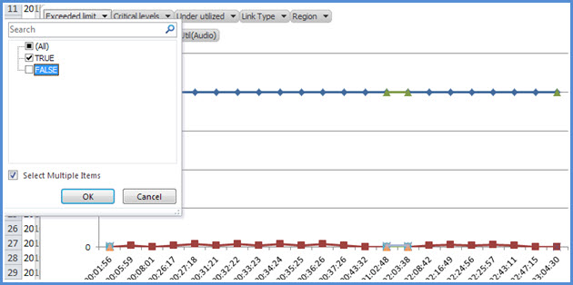

# <a name="skype-for-business-server-2015-resource-kit-tools-documentation"></a>Документация по средствам набора ресурсов Skype для бизнеса Server 2015

В этом разделе описываются средства из набора ресурсов Skype для бизнеса Server 2015, включая назначение каждого средства, а также примеры его использования. Набор ресурсов Skype для бизнеса Server 2015 упрощает выполнение повседневных задач для ИТ-администраторов, которые развертывают Skype для бизнеса Server 2015 и управляют ими. Например, средство **web Conf Data** можно использовать для управления данными, которые пользователи загружают во время собрания по сети. Средство **SEFAUtil** можно использовать для создания делегирования переадментирования вызовов и ответа для пользователей. Мы рекомендуем ИТ-администраторам использовать эти средства для более эффективного управления Skype для бизнеса Server 2015.

## <a name="installation-of-the-resource-kit-tools"></a>Установка средств набора ресурсов

Чтобы установить набор ресурсов Skype для бизнеса Server 2015, скачайтеOCSReskit.msi[ из ](https://www.microsoft.com/download/details.aspx?id=52631) Центра загрузки.

Запустите **OCSResKit.msi,** чтобы выполнить простую установку. MSI устанавливает все средства по следующему пути: **%Program Files%\Skype для бизнеса Server 2015\ResKit.** В этой папке находятся средства, которые являются автономными исполняемыми папками. Средства, которые также имеют вспомогательные файлы, находятся в своих собственных в папках.

## <a name="supported-environments"></a>Поддерживаемые среды

Набор ресурсов Skype для бизнеса Server 2015 должен быть установлен на сервере, который соответствует спецификациям, требуемой для Skype для бизнеса Server 2015( обычно он используется для запуска Skype для бизнеса Server 2015).

## <a name="resource-kit-tools-overview"></a>Обзор средств набора ресурсов

Ниже представлен список средств, предоставляемых в наборе ресурсов Skype для бизнеса Server 2015. Описание каждого средства, включая требования и примеры использования, описано в следующих разделах.

- [ABSConfig](resource-kit-tools.md#ABSConfig)

- [Монитор службы политики пропускной способности](resource-kit-tools.md#bpsm)

- [Анализатор использования полосы пропускания](resource-kit-tools.md#bua)

- [Call Parkometer](resource-kit-tools.md#callpark)

- [DBAnalyze](resource-kit-tools.md#dba)

- [Импорт данных службы хранилища](resource-kit-tools.md#Issd)

- [LCSSync](resource-kit-tools.md#LCSSync)

- [Консоль пользователя подкатки](resource-kit-tools.md#LUC)

- [MsTurnPing](resource-kit-tools.md#MsTurnPing)

- [Просмотр конфигурации сети](resource-kit-tools.md#NCV)

- [Live агента группы ответа](resource-kit-tools.md#RGAL)

- [SEFAUtil](resource-kit-tools.md#SEFAUtil)

- [SYSPrep.ps1](resource-kit-tools.md#SYSPrep)

- [Миграция объявлений о ненаписаном номере](resource-kit-tools.md#UNAM)

- [Данные веб-конферент](resource-kit-tools.md#WebConfData)

## <a name="absconfig"></a>ABSConfig
<a name="ABSConfig"> </a>

Средство настройки службы адресной книги (ABSConfig) — это средство администрирования, которое помогает администраторам настраивать конфигурацию службы адресной книги в Skype для бизнеса Server 2015. Это средство также позволяет администраторам Skype для бизнеса Server 2015 восстанавливать параметры службы адресной книги по умолчанию.

### <a name="description"></a>Описание

ABSConfig — это графическое приложение пользовательского интерфейса, которое позволяет администраторам настраивать атрибуты доменных служб Active Directory, связанные со службой адресной книги.

Основные сценарии для средства:

- Чтобы позволить администраторам сопооставить атрибуты в доменных службах Active Directory с атрибутами Skype для бизнеса Server 2015.

- Чтобы позволить администраторам указать атрибут доменных служб Active Directory, который необходимо включить или исключить из файлов службы адресной книги.

- Чтобы позволить администраторам восстанавливать параметры службы адресной книги по умолчанию.

Средство ABSConfig можно начать с помощью ABSConfig.exe файла. Средство откроется на **вкладке "Настройка атрибутов".** В этой таблице можно сопоказать атрибуты доменных служб Active Directory с полями атрибутов для Skype для бизнеса Server 2015 и указать пользователей, которых необходимо включить или исключить из файлов службы адресной книги на основе определенных фильтров атрибутов. Он также имеет параметры для настройки того, какое значение номера телефона должно быть включено в файл адресной книги. Параметр **"Восстановить значения по умолчанию"** позволяет администраторам восстанавливать значения по умолчанию для параметров службы адресной книги.

> [!NOTE]
> Повторное сопоставление атрибутов AD с разными именами полей OC будет работать только для загрузки файла адресной книги и не поддерживается веб-запросом адресной книги.

### <a name="output"></a>Выходные данные

ABSConfig сохраняет конфигурацию службы адресной книги в базе данных.

```console
Path: %ProgramFiles%\Skype for Business Server 2015\Reskit
```

### <a name="purpose"></a>Назначение

ABSConfig предоставляет быстрый и простой способ настройки службы адресной книги Skype для бизнеса Server 2015.

### <a name="requirements"></a>Requirements

#### <a name="computer"></a>Компьютер

ABSConfig можно запускать только на компьютере, который присоединяется к домену с установленным Skype для бизнеса Server 2015. В случае Skype для бизнеса Server 2015 Enterprise Edition это средство можно запустить на любых серверах переднего сервера, на которые во время установки включена служба адресной книги.

#### <a name="network"></a>Сеть

Компьютер должен иметь возможность подключения к пулу переднего и тыловой баз данных.

#### <a name="software"></a>Программное обеспечение

Перед запуском средства ABSConfig необходимо установить следующие компоненты программного обеспечения:

- Skype для бизнеса Server 2015

#### <a name="users"></a>Пользователи

Администраторы, у которых есть разрешения, необходимые для обновления развертывания Skype для бизнеса Server 2015.

### <a name="examples"></a>Примеры

AbSConfig можно начать, **введяABSConfig.exe** в командной командной области. Ниже показан пользовательский интерфейс средства ABSConfig.


### <a name="summary"></a>Аннотация

Средство ABSConfig предоставляет администраторам быстрый и простой в использовании инструмент для настройки службы адресной книги Skype для бизнеса Server 2015.

## <a name="bandwidth-policy-service-monitor"></a>Монитор службы политики пропускной способности
<a name="bpsm"> </a>

Средство "Монитор службы политики пропускной способности" позволяет администраторам просматривать список следующих данных:

1. Все настроенные службы политики пропускной способности Skype для бизнеса Server 2015 (проверка подлинности и ядро) в топологии

2. Подключения, которые каждая служба делает с другими службами политики пропускной способности и к серверам

3. Все ссылки, настроенные в документе конфигурации сети, и использование пропускной способности в режиме реального времени, как сообщается каждой службой политики пропускной способности

### <a name="description"></a>Описание

Монитор службы политики пропускной способности реализован в качестве приложения на основе GUI. Администраторы запускают средство, запуская PDPMonUI.exe.

При открытии средства оно пытается обнаружить список служб политики пропускной способности в топологии. После первоначального обновления в области слева от окна будет отсеяно список служб, сгруппленных по кластерам, к которые они принадлежат.

Когда администраторы выбирают определенную службу политики пропускной способности, в области справа отображаются сведения об этой службе. В этой области также есть две основные вкладки, на которые отображаются сведения.

#### <a name="machine-info-tab"></a>Вкладка "Сведения о компьютере"

На  вкладке "Сведения о компьютере" показаны сведения о выбранной службе политики пропускной способности, а также список и состояние всех подключений, которые были сделаны выбранной службой политики пропускной способности к другим службам.

#### <a name="topology-info-tab"></a>Вкладка "Сведения о топологии"

На **вкладке "Сведения** о топологии" показан список всех ссылок, настроенных в параметрах конфигурации сети. Для каждой связи отображается пропускная способность звука и видео. Кроме того, отображается используемая в данный момент пропускная способность как в кбайт/с, так и в процентах от емкости. Средство использует цветовое кодирование для выделения ссылок с использованием, которые близки к емкости, что позволяет администраторам быстро изолировать такие ссылки.

> [!NOTE]
>  Если при подключении к какой-либо из настроенных служб политики пропускной способности происходит  сбой  средства мониторинга службы политики пропускной способности, данные на вкладке "Сведения о компьютере" и "Сведения о топологии" не будут заполнены. Однако возможно, что средство изначально подключилось, но впоследствии потеряет подключение к службе. В таких случаях администраторы могут видеть устаревшую информацию. На каждой **вкладке** есть отметка времени последнего обновления, которая позволяет администраторам видеть время последнего обновления данных для определенной службы политики пропускной способности.

### <a name="output"></a>Выходные данные

Выходных данных из командной строки нет; выходные данные программы содержатся в основном графическом пользовательском интерфейсе (GUI).

### <a name="purpose"></a>Назначение

Средство мониторинга службы политики пропускной способности позволяет администраторам отслеживать состояние каждой службы политики пропускной способности, определенной в топологии. Кроме того, администраторы могут видеть использование пропускной способности в режиме реального времени для всех каналов, определенных в документе конфигурации сети.

### <a name="requirements"></a>Requirements

Средство мониторинга службы политики пропускной способности должно быть запускаться на компьютере, который входит в топологию Skype для бизнеса Server.

### <a name="summary"></a>Аннотация

Монитор службы политики пропускной способности может быть ценным ресурсом для администраторов, чтобы они могли проверить состояние всех служб политики пропускной способности в топологии, и, что более важно, они могут получить использование пропускной способности в режиме реального времени для каналов, определенных в параметрах конфигурации сети.

## <a name="bandwidth-utilization-analyzer"></a>Анализатор использования полосы пропускания
<a name="bua"> </a>

Анализатор использования полосы пропускания — это средство, которое создает отчеты о различных представлениях потребления пропускной способности конечными точками UC по каналам WAN в корпоративной сети. Эти отчеты можно использовать для понимания текущего шаблона потребления пропускной способности и для планирования пропускной способности.

### <a name="description"></a>Описание

Анализатор использования полосы пропускания реализован в качестве приложения на основе интерфейса GUI. Это средство создает отчеты специально для использования звука в сети и помогает с планированием емкости. Кроме того, он итерирует пропускную способность, назначенную различным каналам.

### <a name="output"></a>Выходные данные

Анализатор использования полосы пропускания предоставляет графические диаграммы пропускной способности и использования звука для всех каналов WAN, настроенных в системе.

### <a name="purpose"></a>Назначение

В любом развертывании голосовой и видеосвязи важно отслеживать и понимать тенденцию использования пропускной способности трафика мультимедиа в корпоративной сети. Анализатор использования полосы пропускания позволяет администратору достичь именно этого. Это средство делает следующее:

- Создает отчеты об использовании звука в сети

- Более эффективное планирование емкости и итерация пропускной способности, назначенной различным каналам связи

Анализатор использования полосы пропускания может создавать графические отчеты о емкости и использовании пропускной способности; они следуют следующим образом:

- Все связи WAN в корпоративной сети

- Фильтрация по выбранным соединениям WAN, которые были выбраны

- Фильтрация по ссылкам WAN с превышением пропускной способности

- Фильтрация по каналам WAN, которые использовали несвойенную пропускную способность

- Фильтрация по каналам WAN, достигающим критических уровней (использование пропускной способности, которое превышает 90 % пропускной способности канала WAN)

- Фильтруется по типу связи WAN— связи между сетевыми сайтами, межрегиональные ссылки и ссылки на сайте

- Фильтрация по области сети

#### <a name="applications"></a>Приложения

Анализатор использования полосы пропускания имеет следующие два приложения (средства):

- **WanLinkLogCollector.exe** Это средство позволяет пользователю вводить требуемую информацию.

- **BandwidthUtilizationAnalyzer.xlsm** Отчет о программном обеспечении для электронных таблиц Microsoft Excel автоматически WanLinkLogCollector.exe. Это приложение позволяет пользователю применять фильтры к отчету, как показано далее в этой статье.

#### <a name="phases-of-using-bandwidth-utilization-analyzer"></a>Этапы использования анализатора использования полосы пропускания

При использовании анализатора использования полосы пропускания существует два этапа:

- Сбор журналов, который выполняется с помощью WanLinkLogCollector.exe

- Настройка отчетов, выполняемая с помощью BandwidthUtilizationAnalyzer.xlsm

    > [!IMPORTANT]
    > Настоятельно рекомендуется, чтобы BandwidthUtilizationAnalyzer.xlsm не запускались вручную конечными пользователями.

#### <a name="starting-bandwidth-utilization-analyzer"></a>Запуск анализатора использования полосы пропускания

Начните WanLinkLogCollector.exe в командной области или с помощью проводника Windows.

 **Использование WanLinkLogCollector.exe**

Существует три этапа использования WanLinkLogCollector.exe:

1. **Занося в журнал временную шкалу** Предоставление временной шкалы, для которую требуется сгенерирован отчет

2. **Указание каталогов файлов** Предоставление сведений о расположении файла

3. **Сбор журналов и запуск средства просмотра отчетов** Выполнение команды для создания отчета

#### <a name="step-1---log-the-timeline"></a>Шаг 1. Занося временную шкалу в журнал

Ведение журнала временной шкалы позволяет пользователю средства указать следующее, как показано на рисунке ниже.

1. **Дата начала** Это начальная дата временной шкалы, для которую создается отчет; например, 1 августа 2010 г.

2. **Дата окончания** Это дата окончания временной шкалы, для которую создается отчет; например, 30 сентября 2010 г.

     

#### <a name="step-2---specify-the-file-directories"></a>Шаг 2. Указание каталогов файлов

Указанные ниже каталоги файлов могут быть указаны пользователем, как показано ниже.

- **Расположение файлов журналов сервера** Расположение папки, в которой хранятся журналы сервера политики пропускной способности. Как правило, это<\<fileserver\> \\ fe \> \AppServerFiles\PDP.

- **Временное расположение хранения файлов** Временное расположение файлов, где хранятся промежуточные файлы во время сгенерации отчета.

    

    > [!NOTE]
    > Убедитесь, что пользователю средства предоставлен достаточный доступ к журналам сервера и папке временного хранения файлов.

#### <a name="step-3---collect-the-logs-and-start-the-report-viewer"></a>Шаг 3. Сбор журналов и запуск средства просмотра отчетов

Чтобы собрать журналы и запустить средства просмотра отчетов, нажмите кнопку **"Выполнить",** как показано ниже. На этом этапе собираются необходимые данные.


После успешной проверки ввода отображается сообщение, показанное ниже.


Нажмите **ОК**. BandwidthUtilizationAnalyzer.xlsm автоматически запущен. Следуйте инструкциям в окне сообщения. Подробные сведения **см. в BandwidthUtilizationAnalyzer.xlsразделе** "Использование BandwidthUtilizationAnalyzer.xlsm".


### <a name="using-bandwidthutilizationanalyzerxlsm"></a>Использование BandwidthUtilizationAnalyzer.xlsm

1. При BandwidthUtilizationAnalyzer.xlsm автоматически нажмите кнопку **"Обновить",** как показано ниже.

     

2. Когда папка файлов открывается, выберите consolidated.csv из расположения, указанного в окне сообщения, как показано ниже. Здесь также показано расположение **C:\Temp.**

     

3. Нажмите кнопку **Импортировать**.

4. Графический график создается автоматически. Он доступен, когда пропадает работающий в фоновом режиме указатель.

     

#### <a name="applying-filters-to-the-report-view"></a>Применение фильтров к представлению отчета

Фильтры, которые можно применить к представлению отчета, как показано ниже, описаны следующим образом:


1. **Имя** Фильтрация по ссылкам WAN (фильтр находится в правой части графа). Префикс обозначает следующие типы ссылок; см. вертикальное (синее) поле:

   - **Сайт S** Связь WAN между сетевым сайтом и регионом сети

   - **Is Inter-Site** Связь WAN между двумя сетевыми сайтами

   - **Между регионами R** Соединение WAN между двумя областями сети

2. **Превышено ограничение** Фильтрация по каналам WAN, использование пропускной способности которых превышает пропускную способность

3. **Критические уровни** Фильтрация по каналам WAN, использование пропускной способности которых достигло 90 % или более, чем пропускная способность

4. **Under-utilized** Фильтрация по каналам WAN, использование пропускной способности которых составляет менее 25 % от пропускной способности

5. **Тип ссылки** Фильтрация по следующим типам связи WAN:

   - **Тип сетевого** сайта

   - **Тип меж сайта**

   - **Тип связи между регионами**

6. **Регион** Фильтрация по области сети

На следующих рисунках покажите ранее описанные фильтры.

Фильтрация по **имени.** Выберите список ссылок, которые должны отображаться на графике.


Фильтрация **по превышению ограничения.** Выберите **"True",** чтобы применить фильтр.



Фильтрация по **критическим уровням.** Выберите **"True",** чтобы применить фильтр.


Фильтрация по **затмеяемой .** Выберите **"True",** чтобы применить фильтр.


Фильтрация **по типу ссылки.** Выберите тип или типы, которые необходимо отобразить.


Фильтрация по **регионам.** Выберите список областей, ссылки которых необходимо отобразить.


### <a name="requirements"></a>Requirements

- .NET Framework 3.5

- Microsoft Excel 2010, русская версия Или Excel 2007

### <a name="summary"></a>Аннотация

Анализатор использования полосы пропускания используется для списки использования полосы пропускания звука для трафика UC по сети. Это средство также можно использовать для создания отчетов об использовании пропускной способности видео в сети.

## <a name="call-parkometer"></a>Call Parkometer
<a name="callpark"> </a>

Парковка вызовов — это приложение командной строки, которое обеспечивает простой доступ к базе данных орбиты парковки вызовов.

### <a name="description"></a>Описание

Парковка вызовов — это средство для отслеживания текущих припаркованных вызовов. Он также собирает статистику об орбитах и использовании сервера парковки вызовов (CPS). Это средство командной строки предоставляет доступ на чтение и записи к базе данных орбиты CPS SQL Server с локального или удаленно подключенного компьютера.

Все параметры являются взаимоисключающими. Синтаксис командной строки:

- **Параметр -o** — перечисляет все диапазоны орбит, настроенные для этого пула.

- **Параметр -n** — перечисляет все используемые в данный момент орбиты в этом пуле. Отображаются такие сведения:

  - Единый код ресурса (URI) SIP парковки и парковки.

  - Имя хоста CPS, в котором припаркован вызов.

  - Отметка времени парковки вызова.

- **Параметр -f** — перечисляет количество свободных в данный момент орбит в пуле.

- **-r \<n\>** — перечисляет \<n\> последние припаркованные вызовы. Отображаются такие сведения:

  - URI SIP для парковки.

  - URI SIP парковки.

  - Имя хоста CPS, в котором был припаркован вызов.

  - Отметка времени получения или сброса вызова.

- **-t \<n\>** - тестирует заархивинг орбиты в базе данных, чтобы показать случайность назначенного номера орбиты.

### <a name="output"></a>Выходные данные

В зависимости от входных параметров, указанных в командной подсказке, при парковке вызовов отображаются следующие выходные данные:

- Все диапазоны орбит, настроенные для этого пула

- В настоящее время припаркованные вызовы

- Количество бесплатных (доступных) орбит

- Недавно припаркованные вызовы

- Зарезервированные орбиты для тестирования однонамерных и случайных значений орбиты

### <a name="purpose"></a>Назначение

Средство CPS предназначено для предоставления доступа к базе данных CPS из командной строки. Администратор может просмотреть использование CPS и определить количество орбит, назначенное пулу.

### <a name="requirements"></a>Requirements

Если это средство запущено на том же компьютере, где работает CPS, требования не предъявляются. Если это средство работает на удаленном компьютере, необходимо настроить SQL Server, используемую Skype для бизнеса Server 2015, чтобы разрешить удаленный доступ. Для подключения к SQL Server SQL Server пула необходимо настроить SQL Server парковки вызовов. Эта SQL Server подключения к базе данных определена в файле конфигурации **parkometer.exe.config.** Его необходимо поместить в тот же каталог, в котором parkometer.exe расположен. Следующий XML-файл является примером parkometer.exe.config. Параметры, которые необходимо настроить: имя пользователя (например, mydomain\Administrator), пароль (например, mypassword) и имя хоста (например, myserver).

```xml
<?xml version="1.0" encoding="utf-8" ?>
<configuration>
  <appSettings>
   <add key="SQL" value="server=myserver\RTC;
database=cpsdyn;
User Id=mydomain\Administrator;
Password=mypassword.;
Integrated Security=false;"/>
  </appSettings>
</configuration>
```

### <a name="examples"></a>Примеры

Развернутые диапазоны орбит: параметр -o перечисляет все диапазоны орбит, настроенные для этого пула, как показано ниже.


В настоящее время припаркованные вызовы: параметр -n перечисляет все используемые в данный момент орбиты в этом пуле, как показано ниже.


Количество свободных орбит: параметр -f перечисляет число свободных в данный момент орбит в пуле, как показано ниже.


Недавно припаркованные вызовы: параметр -r \<n\> перечисляет \<n\> последние припаркованные вызовы, как показано ниже.


Проверка резервирования орбиты: параметр -t тестирует резервирование \<n\> орбиты в базе данных, как показано ниже


### <a name="summary"></a>Аннотация

Парковка вызовов — это средство командной строки, которое предоставляет подробные сведения о сервере парковки вызовов.

## <a name="dbanalyze"></a>DBAnalyze
<a name="dba"> </a>

### <a name="description"></a>Описание

DBAnalyze — это средство командной строки, которое помогает администраторам собирать аналитические отчеты о базах данных Skype для бизнеса Server 2015. DBAnalyze имеет следующие режимы: диагностика, данные пользователя, конференция, mcus и фрагментация диска:

- **Режим диагностики** Создает отчет, который включает сведения о таблицах (число записей, фрагментация, размер данных и размер индекса), размер файлов данных и журналов, время последнего архивирования, распределение контактов между серверами, на которых работает Microsoft Office Communications Server, среднее количество разрешений, контактов, контейнеров, подписок, публикаций, конечных точек на пользователя, неправильно домашних пользователей, пользователей, которые не могут быть перенаправлены, среднее количество конференций, организованных на пользователя, запланированные конференции, активные конференции и версия базы данных.

    > [!NOTE]
    > Запуск режима диагностики может повлиять на производительность сервера.

- **Режим пользовательских данных** Сообщает контактные данные, контейнер, подписку, публикацию, разрешение и данные группы контактов для указанного пользователя или пользователей, у которых этот пользователь есть в списках контактов и разрешений. Этот режим также сообщает сводные данные о конференциях, которые пользователь организовывает или приглашает.

- **Режим конференции** Сообщает подробные данные для конкретной конференции, включая все сведения о расписании конференции, список приглашенных, список типов мультимедиа, разрешенных для конференции, активные mcUs (блоки управления несколькими точками), список активных участников и состояние сигналов каждого участника.

- **Расшифровка кода собрания** Декодирует ИД собрания по STN, указанный в коммутаторе **/pstnid,** но не подключается к тыловой части для получения подробных сведений.

- **Разрешение конференции** Декодирует ИД собрания STN, указанный с помощью переключателя **/pstnid,** и отображает сведения о конференции, указанной по этому ИД.

- **Режим mcUs** Сообщает об ИД, типе мультимедиа, URL-адресе, состоянии пульса, загрузке конференции и загрузке участника для каждого MCU в пуле.

- **Режим фрагментации диска** Отображает состояние фрагментации всех дисков.

Это средство можно использовать для диагностики различных проблем или помощи администраторам в планировании емкости. Например, если большинство пользователей, которые были на сервере А, выбирают пользователей, которые были на сервере B, в качестве контактов, администратор может переместить пользователей на сервер A на сервер Б, чтобы уменьшить трафик между серверами.

### <a name="output"></a>Выходные данные

Это средство выводит предварительно заранее заданной отчеты о базе данных Skype для бизнеса Server 2015. **Путь:**%ProgramFiles%\Skype для бизнеса Server 2015\Reskit

### <a name="purpose"></a>Назначение

Чтобы установить Dbanalyze.exe, скопируйте его в локализованную папку и запустите средство. Чтобы использовать средство, в командной строке запустите следующую команду. `dbanalyze.exe [/v] [/report:value] [/sqlserver:value] [/user:user@domain.com] [/conf:value][/pstnid:Value] [/maxcontacts:value]` Ниже приведены описания параметров командной строки.


### <a name="requirements"></a>Requirements

 **Компьютер** DBAnalyze можно запускать только на компьютере, к домену на который установлен Skype для бизнеса Server 2015.

 **Сеть** Компьютер должен иметь возможность подключения к тыловой базе данных.

 **Программное обеспечение** Перед запуском DBAnalyze необходимо установить компоненты программного обеспечения Skype для бизнеса Server 2015.

 **Пользователи** В таблице ниже показаны администраторы, у которых есть необходимые разрешения на доступ к базам данных Skype для бизнеса Server 2015.


> [!NOTE]
> Для режима **/report:disk** требуется учетная запись локального администратора.

### <a name="examples"></a>Примеры

Ниже примеры допустимых Dbanalyze.exe команд:

```console
dbanalyze.exe /report:diag
dbanalyze.exe /report:user /user:usera@domainb.com
dbanalyze.exe /report:conf /user:bob@example.com /conf:1W9J71SKSX2X
dbanalyze.exe /report:resolve /pstnid:12345
dbanalyze.exe /report:mcus
dbanalyze.exe /report:disk
```

### <a name="summary"></a>Аннотация

DBAnalyzer позволяет администраторам быстро и легко анализировать базы данных Skype для бизнеса Server 2015.

## <a name="import-storage-service-data"></a>Импорт данных службы хранилища
<a name="Issd"> </a>

Средство importStorageServiceData resource kit позволяет повторно импортировать данные очереди и конечных точек, которые были сброщены из службы хранилища (LYSS) обратно в службу хранилища.

### <a name="description"></a>Описание

Очистка данных из службы хранилища могла быть автоматической (периодической) в зависимости от состояния элемента очереди или размера базы данных. Это могло произойти из-за вызова вручную для отката пула или из-за того, что он вызывается в этом пуле. Обратите внимание, что в идеале не следует импортировать данные повторно, если размер базы данных службы хранилища (LYSS) на переднем конце выше обычного уровня, так как это, скорее всего, приведет к простому экспорту большего объема данных. Кроме того, необходимо сначала устранить все проблемы, которые могли быть вызваны ошибками, которые привели к росту очереди службы хранилища (например, ошибки конечной точки Exchange, проблемы с сетью или другие проблемы).

 **Сценарий 1.** Во время от сбойного пула файлы могут быть сбробросами из службы хранилища для каждого переднего конца. После завершения отсев необходимо запустить средство для повторного импорта данных.

 **Сценарий 2.** Данные очищаются автоматически каждый день или в ответ на то, что база данных службы хранилища превысила определенные пороговые значения (например, 60%, 80 %, 90 % заполнено). Администратор должен регулярно повторно импортировать эти автоматически очищаемые данные. В вышеперечисленной ситуации, если пакет мониторинга SCOM не развернут, существуют события для службы хранилища Skype для бизнеса Server, связанные с очисткой данных из службы хранилища. События 32075 (запущена операция полной очистки), 32076 (полная очистка завершена), 32082 (очистка на уровне обслуживания запущена), 32083 (очистка на уровне обслуживания завершена), 32089 (очистка выполнена в связи с заполнением базы данных). Обратите внимание, что эти события соответствуют выпуску RTM. Когда администратор видит эти события, это означает, что существуют файлы, которые были сбросываются. Эти данные следует регулярно импортировать с помощью этого средства, например один раз в неделю.

При развертывании пакета SCOM для мониторинга состояния системы online Service для Skype для бизнеса Server могут появиться новые оповещения, которые попросите администратора повторно импортировать сбросанные данные обратно в службу хранения. В журнале событий на сервере переднего сервера будет иметься соответствующее событие, которое вызвало оповещение. Это событие даст описание родительского пути, по которому расположены сброщенные файлы данных, а также количество файлов, которые соответствуют условиям оповещения. Критерии оповещения : x или более файлов находятся по определенному родительскому пути не менее Y дней (где X и Y предварительно заданы в StorageService, но могут быть переопределены путем изменения файла APPCONFIG.) Ниже показаны два примера событий, которые могут вызывать оповещение о состоянии, с разницей в их родительском пути. Один из вариантов находится в файловом каталоге веб-службы, а другой — в локальном каталоге данных приложений на каждом сервере переднего входа. ( Например, c:\ProgramData\Microsoft\Skype для бизнеса Server 2015\StorageService ). Затем администратор запустит это средство reskit.

Это средство увеличит загрузку ЦП и IO на переднем конце, на который оно запущено, а также на других переднем конце, в ситуации, когда данные не принадлежат переднему концу, на который выполняется средство. Мы рекомендуем запускать это средство, если на переднем конце нет большой нагрузки на ЦП и производительности, например в периоды пиковой нагрузки. Во-вторых, это средство может импортировать один файл данных от 2 до 3 минут. Помните об этом при оценке времени работы средства. Подробный файл журнала, созданный средством, по умолчанию будет отображаться в хранилище файлов. Удалите его, если об ошибках не сообщается, так как размер файла журнала может быть десятками МБ или более.


### <a name="requirements"></a>Requirements

Установите средства skype для бизнеса Server 2015 Resource Kit. Средство запускается на компьютерах, которые присоединяются к домену, на которых установлены Skype для бизнеса Server и Skype для бизнеса Server Management Shell. Средство использует из оболочки управления для идентификации всех серверов переднего сервера в пуле. Во-вторых, средство должно выполняться с компьютера в пуле, на котором установлена база **данных RtcLocal.** Эта база данных используется средством для извлечения расположения файловой папки WEBSERVICE для пула. Кроме того, перед использованием этого средства каждый сервер переднего сервера должен сначала включить Windows PowerShell -Remoting с помощью **Enable-PSRemoting** на каждом сервере переднего сервера, а также на компьютере, с которых выполняется средство. В противном случае Windows PowerShell команды этого средства не будут работать. Windows PowerShell отключение можно отключить на всех серверах переднего сервера в пуле после его завершения. Наконец, учетная запись или учетные данные, выдающие средство, должны иметь разрешение на чтение и запись для файловой папки веб-службы для пула, в который они выполняют это средство. В противном случае средство не будет работать с ошибками разрешения на доступ к доступу.

> [!NOTE]
> В Windows Server 2012 Windows PowerShell по умолчанию включено, но не в операционной системе Windows Server 2008.

### <a name="examples"></a>Примеры

```console
>  C:\StorageService>ImportStorageServiceData.exe
Description:
This tool will re-import Storage Service (LYSS) flushed queue data back in.  For a pool: you are required to run this tool on a machine inside the pool which has the Lync Server Management Shell installed.  Additionally, all front end machines need to have Windows Powershell Remoting enabled before executing this tool by executing Enable-PSRemoting.  Also, please ensure that all Storage Service instance DB Size are at the 'Normal' level (verify this by viewing Eventlog events). Otherwise re-importing may cause data to be flushed out again if any Storage Service instance DB size level goes above 'Normal'.
Usage: Default behavior is to Import data from web service file share as well as any files on all Front End machines in pool.
Additional Options:
-Verbose                    : Turn verbose output on.

-StorageServiceHostName     : Host Name of Storage Service WCF endpoint.  ( Default=localhost netnamedpipe binding. )

-FileSharePath              : Import only all data from just under the UNC path specified.

ActivityID: cc3b62ff-bb66-4e61-a6e2-96cb3626315c. <-- Use this to correlate with StorageService trace logs if troubleshooting.
Type Server name (TCP binding) or press <enter> for localhost (NamePipe binding):
Using NetNamedPipeBinding...
OnTopologyChanged Event received
Web Service File Share: \\dc.vdomain.com\OcsFileStore\co1-WebServices-1\StorageService

Front Ends:
server.vdomain.com
server2.vdomain.com
server1.vdomain.com
server3.vdomain.com
Looking under directory: \\dc.vdomain.com\OcsFileStore\co1-WebServices-1\StorageService for exported data.
# Files found: 8
Starting Import for file:\\dc.vdomain.com\OcsFileStore\co1-WebServices-1\StorageService\DataExport\2
0120910\SERVER.vdomain.com\944f5724c65c5f93900dc1c8c898b102__0.xml
Items deserialized: 20

All items in file were enqueued successfully, will try to delete file: \\dc.vdomain.com\OcsFileStore\co1-WebServices-1\StorageService\DataExport\20120910\SERVER.vdomain.com\944f5724c65c5f93900dc1c8c898b102__0.xml

All items in file failed to enqueue so file will not be deleted.  File path: \\dc.vdomain.com\OcsFileStore\co1-WebServices-1\StorageService\DataExport\20120910\SERVER.vdomain.com\944f5724c65c5f93900dc1c8c898b102__0.xml

Summary for file \\dc.vdomain.com\OcsFileStore\co1-WebServices-1\StorageService\DataExport\20120910\SERVER.vdomain.com\944f5724c65c5f93900dc1c8c898b102__0.xml: succeeded: 20, failed: 0

Starting Import for file:\\dc.vdomain.com\OcsFileStore\co1-WebServices-1\StorageService\DataExport\20120910\SERVER1.vdomain.com\17d5435ae40259f7bbdf1866776386e4__0.xml
Items deserialized: 20

[cc3b62ff-bb66-4e61-a6e2-96cb3626315c] Send EnqueueMessages to redirected, targetServer=server1.vdomain.com, queueItems=20

All items in file were enqueued successfully, will try to delete file: \\dc.vdomain.com\OcsFileStore\co1-WebServices-1\StorageService\DataExport\20120910\SERVER1.vdomain.com\17d5435ae40259f7bbdf1866776386e4__0.xml

All items in file failed to enqueue so file will not be deleted.  File path: \\dc.vdomain.com\OcsFileStore\co1-WebServices-1\StorageService\DataExport\20120910\SERVER1.vdomain.com\17d5435ae40259f7bbdf1866776386e4__0.xml

Summary for file \\dc.vdomain.com\OcsFileStore\co1-WebServices-1\StorageService\DataExport\20120910\
SERVER1.vdomain.com\17d5435ae40259f7bbdf1866776386e4__0.xml: succeeded: 20, failed: 0

Starting Import for file:\\dc.vdomain.com\OcsFileStore\co1-WebServices-1\StorageService\DataExport\20120910\SERVER1.vdomain.com\904f6c9b8ac951ae8b3c86684d3832e4__0.xml

Items deserialized: 20
[cc3b62ff-bb66-4e61-a6e2-96cb3626315c] Send EnqueueMessages to redirected, targetServer=server1.vdomain.com, queueItems=20

All items in file were enqueued successfully, will try to delete file: \\dc.vdomain.com\OcsFileStore
\co1-WebServices-1\StorageService\DataExport\20120910\SERVER1.vdomain.com\904f6c9b8ac951ae8b3c86684d
3832e4__0.xml

All items in file failed to enqueue so file will not be deleted.  File path: \\dc.vdomain.com\OcsFil
eStore\co1-WebServices-1\StorageService\DataExport\20120910\SERVER1.vdomain.com\904f6c9b8ac951ae8b3c
86684d3832e4__0.xml

Summary for file \\dc.vdomain.com\OcsFileStore\co1-WebServices-1\StorageService\DataExport\20120910\
SERVER1.vdomain.com\904f6c9b8ac951ae8b3c86684d3832e4__0.xml: succeeded: 20, failed: 0

Starting Import for file:\\dc.vdomain.com\OcsFileStore\co1-WebServices-1\StorageService\DataExport\2
0120910\SERVER2.vdomain.com\69844a271e6c5633a1f2b46a42287dd6__0.xml

Items deserialized: 20

[cc3b62ff-bb66-4e61-a6e2-96cb3626315c] Send EnqueueMessages to redirected, targetServer=server2.vdom
ain.com, queueItems=20

All items in file were enqueued successfully, will try to delete file: \\dc.vdomain.com\OcsFileStore
\co1-WebServices-1\StorageService\DataExport\20120910\SERVER2.vdomain.com\69844a271e6c5633a1f2b46a42
287dd6__0.xml

All items in file failed to enqueue so file will not be deleted.  File path: \\dc.vdomain.com\OcsFil
eStore\co1-WebServices-1\StorageService\DataExport\20120910\SERVER2.vdomain.com\69844a271e6c5633a1f2
b46a42287dd6__0.xml

Summary for file \\dc.vdomain.com\OcsFileStore\co1-WebServices-1\StorageService\DataExport\20120910\
SERVER2.vdomain.com\69844a271e6c5633a1f2b46a42287dd6__0.xml: succeeded: 20, failed: 0

Starting Import for file:\\dc.vdomain.com\OcsFileStore\co1-WebServices-1\StorageService\DataExport\2
0120910\SERVER3.vdomain.com\3313935458e35b9b9759e08a15d251e6__0.xml

Items deserialized: 20

[cc3b62ff-bb66-4e61-a6e2-96cb3626315c] Send EnqueueMessages to redirected, targetServer=server3.vdom
ain.com, queueItems=1

All items in file were enqueued successfully, will try to delete file: \\dc.vdomain.com\OcsFileStore
\co1-WebServices-1\StorageService\DataExport\20120910\SERVER3.vdomain.com\3313935458e35b9b9759e08a15
d251e6__0.xml

All items in file failed to enqueue so file will not be deleted.  File path: \\dc.vdomain.com\OcsFil
eStore\co1-WebServices-1\StorageService\DataExport\20120910\SERVER3.vdomain.com\3313935458e35b9b9759
e08a15d251e6__0.xml

Summary for file \\dc.vdomain.com\OcsFileStore\co1-WebServices-1\StorageService\DataExport\20120910\
SERVER3.vdomain.com\3313935458e35b9b9759e08a15d251e6__0.xml: succeeded: 20, failed: 0

Starting Import for file:\\dc.vdomain.com\OcsFileStore\co1-WebServices-1\StorageService\DataExport\2
0120910\SERVER3.vdomain.com\4501e04eae4856059346949ff817c220__0.xml
Items deserialized: 20
[cc3b62ff-bb66-4e61-a6e2-96cb3626315c] Send EnqueueMessages to redirected, targetServer=server3.vdom
ain.com, queueItems=1
All items in file were enqueued successfully, will try to delete file: \\dc.vdomain.com\OcsFileStore
\co1-WebServices-1\StorageService\DataExport\20120910\SERVER3.vdomain.com\4501e04eae4856059346949ff8
17c220__0.xml
All items in file failed to enqueue so file will not be deleted.  File path: \\dc.vdomain.com\OcsFil
eStore\co1-WebServices-1\StorageService\DataExport\20120910\SERVER3.vdomain.com\4501e04eae4856059346
949ff817c220__0.xml

Summary for file \\dc.vdomain.com\OcsFileStore\co1-WebServices-1\StorageService\DataExport\20120910\
SERVER3.vdomain.com\4501e04eae4856059346949ff817c220__0.xml: succeeded: 20, failed: 0
Starting Import for file:\\dc.vdomain.com\OcsFileStore\co1-WebServices-1\StorageService\DataExport\2
0120910\SERVER3.vdomain.com\5ad77443ad955a22a876749be66d5317__0.xml

Items deserialized: 20
[cc3b62ff-bb66-4e61-a6e2-96cb3626315c] Send EnqueueMessages to redirected, targetServer=server3.vdom
ain.com, queueItems=20
All items in file were enqueued successfully, will try to delete file: \\dc.vdomain.com\OcsFileStore
\co1-WebServices-1\StorageService\DataExport\20120910\SERVER3.vdomain.com\5ad77443ad955a22a876749be6
6d5317__0.xml
All items in file failed to enqueue so file will not be deleted.  File path: \\dc.vdomain.com\OcsFil
eStore\co1-WebServices-1\StorageService\DataExport\20120910\SERVER3.vdomain.com\5ad77443ad955a22a876
749be66d5317__0.xml
Summary for file \\dc.vdomain.com\OcsFileStore\co1-WebServices-1\StorageService\DataExport\20120910\
SERVER3.vdomain.com\5ad77443ad955a22a876749be66d5317__0.xml: succeeded: 20, failed: 0
Starting Import for file:\\dc.vdomain.com\OcsFileStore\co1-WebServices-1\StorageService\DataExport\2
0120910\SERVER3.vdomain.com\a11e27ae439a582288d4657eda86b565__0.xml
Items deserialized: 20
[cc3b62ff-bb66-4e61-a6e2-96cb3626315c] Send EnqueueMessages to redirected, targetServer=server3.vdom
ain.com, queueItems=20
All items in file were enqueued successfully, will try to delete file: \\dc.vdomain.com\OcsFileStore
\co1-WebServices-1\StorageService\DataExport\20120910\SERVER3.vdomain.com\a11e27ae439a582288d4657eda
86b565__0.xml
All items in file failed to enqueue so file will not be deleted.  File path: \\dc.vdomain.com\OcsFil
eStore\co1-WebServices-1\StorageService\DataExport\20120910\SERVER3.vdomain.com\a11e27ae439a582288d4
657eda86b565__0.xml
Summary for file \\dc.vdomain.com\OcsFileStore\co1-WebServices-1\StorageService\DataExport\20120910\
SERVER3.vdomain.com\a11e27ae439a582288d4657eda86b565__0.xml: succeeded: 20, failed: 0
All files have been imported into Storage Service for path: \\dc.vdomain.com\OcsFileStore\co1-WebSer
vices-1\StorageService
Importing files for: server.vdomain.com
No files founds.
Importing files for: server2.vdomain.com
No files founds.
Importing files for: server1.vdomain.com
No files founds.
Importing files for: server3.vdomain.com
No files founds.
Writing log: \\dc.vdomain.com\OcsFileStore\co1-WebServices-1\StorageService\ImportStorageServiceData
Log20120910_1609SS
Tool has finished execution.
>  C:\StorageService>
```

## <a name="lcssync"></a>LCSSync
<a name="LCSSync"> </a>

Средство LCSSync помогает развернуть программное обеспечение связи Skype для бизнеса Server 2015 в среде с несколькими лесами. Это средство используется для синхронизации пользователей и групп из разных лесов пользователей в качестве контактного объекта доменных служб Active Directory с центральным лесом, в котором установлен Skype для бизнеса Server 2015.

### <a name="description"></a>Описание

 LCSSync использует синхронизированные контактные объекты доменных служб Active Directory в центральном лесу, чтобы пользователи могли использовать Skype для бизнеса Server. Чтобы обеспечить единый вход, основная учетная запись пользователя должна быть сопопуна объекту контакта доменных служб Active Directory в центральном лесу для Skype для бизнеса Server 2015. Это средство помогает выполнить сопоставление. Это средство предоставляет шаблоны для создания агентов управления в Microsoft Identity Integration Server.

### <a name="summary"></a>Аннотация

Средство LCSSync помогает развернуть Skype для бизнеса Server 2015 в среде с несколькими лесами.

## <a name="lookup-user-console"></a>Консоль пользователя подкатки
<a name="LUC"> </a>

The LookupUserConsole tool displays internal Skype for Business Server routing information about specific users. Эти сведения могут быть полезны персоналу службы поддержки Майкрософт при диагностике проблем с развертыванием и маршрутией.

### <a name="description"></a>Описание

 При выполнении LookupUserConsole.exe откроется командная подсказка, которая принимает SIP-адреса и пытается отобразить сведения о внутренней маршрутике Skype для бизнеса Server. Введите **выход,** чтобы выйти из средства LookupUserConsole.

### <a name="requirements"></a>Requirements

Установите набор ресурсов Skype для бизнеса Server 2015. Средство запускается на компьютерах, которые присоединились к домену, на которых установлен Skype для бизнеса Server.

### <a name="examples"></a>Примеры

C:\Program Files\Skype for Business Server 2015\ResKit \>LookupUserConsole.exe

```console
> sip:john.doe@vdomain.com

  Execution time (ms):                            171.094
  Exeuction result:                               Success
  SIP URI:                                        sip:john.doe@vdomain.com
  User info:
    SID:                                          S-1-5-21-2831376166-29632525...    Display name:                                     John Doe
    Grouping ID:                                  00000000-0000-0000-0000-...
    Line URI:                                     <null>
    Policy assignment:                            TenantId={00000000--0000-000....
    SIP enabled:                                  True
    UC enabled:                                   False
    Tenant ID:                                    00000000-0000-0000-0000-...  Cluster info:
    Active cluster:                               pool0.vdomain.com
    Backup registrar cluster:                     <null>
    Deployment location:                          <null>
    Home Front-End FQDN:                          SERVER.vdomain.com
    Primary Registrar cluster:                    pool0.vdomain.com
    Remote Director external SIP FQDN:            <null>
    Remote Director internal SIP FQDN:            <null>
    Remote Director Web FQDN:                     <null>
    Routing group ID:                             4501e04e-ae48-5605-9346...
    Service tag ID:                               1266953005
    User Front-End resolved:                      True
    User in local forest:                         True
    User in remote forest:                        False
    User in split domain:                         False
    User-Services cluster:                        pool0.vdomain.com

> sip:nouser@vdomain.com

  Execution time (ms):                            948.7574
  Exeuction result:                               UserDoesNotExist

> exit
```

## <a name="msturnping"></a>MsTurnPing
<a name="MsTurnPing"> </a>

Средство MSTurnPing позволяет администратору программного обеспечения связи Skype для бизнеса Server 2015 проверять состояние серверов, на котором запущены службы аудио- и видеоконференций и проверки подлинности аудио- и видеосвязи, а также серверов, на которые в топологии запущены службы политики пропускной способности.

### <a name="description"></a>Описание

Средство MSTurnPing позволяет администратору программного обеспечения связи Skype для бизнеса Server 2015 проверять состояние серверов, на котором запущены службы аудио- и видеоконференций и проверки подлинности аудио- и видеосвязи, а также серверов, на которые в топологии запущены службы политики пропускной способности.

Это средство позволяет администратору выполнять следующие тесты:

1. Проверка сервера A/V Edge Server: средство выполняет тесты для всех серверов A/V Edge Server в топологии, выполняя следующие следующую проверку:

   - Проверка того, что служба проверки подлинности аудио- и видеосвязи Skype для бизнеса Server запущена и может выдавать правильные учетные данные.

   - Проверка того, что по краям аудио- и видеосвязи Skype для бизнеса Server запущена и может ли успешно выделить ресурсы на внешнем границе.

2. Тест службы политики пропускной способности: средство выполняет тесты для всех серверов, на которые в топологии запущены службы политики пропускной способности, выполняя следующие следующую проверку:

   - Проверка того, что служба политики пропускной способности (проверка подлинности) Skype для бизнеса Server запущена и может выдавать правильные учетные данные.

   - Проверка того, что служба политики пропускной способности Skype для бизнеса Server (Core) запущена и может успешно выполнить проверку пропускной способности.

Это средство должно запускаться с компьютера, который входит в топологию и где установлено локальное хранилище.

### <a name="output"></a>Выходные данные

Средство выводит результаты каждой операции.

- Если тест **AudioVideoEdgeServer** выполнен, средство выводит следующие данные:

  - Результаты тестирования компьютеров, которые предоставляют службу проверки подлинности аудио- и видеосвязи Skype для бизнеса Server 2015 в топологии

  - Результаты тестирования компьютеров, которые предоставляют службу Skype для бизнеса Server 2015 Audio/Video Edge в топологии

- Если тест **BandwidthPolicyServer** выполняется, средство выводит следующие данные:

  - Результаты тестирования компьютеров, которые предоставляют службу политики пропускной способности Skype для бизнеса Server 2015 (проверка подлинности) в топологии

  - Результаты тестирования компьютеров, которые предоставляют службу политики пропускной способности Skype для бизнеса Server 2015 (Core) в топологии

### <a name="requirements"></a>Requirements

- Это средство должно запускаться с компьютера, который находится в топологии и имеет локальное хранилище.

- Средство должно запускаться от учетной записи администратора, который имеет доступ к локальному магазину.

### <a name="examples"></a>Примеры

Ниже приводится пример ввода средства.

```console
MsTurnPing -ServerRole AudioVideoEdgeServer

MsTurnPing -ServerRole BandwidthPolicyServer
```

### <a name="summary"></a>Аннотация

Это средство может быть ценным ресурсом для администраторов Skype для бизнеса Server 2015, которые хотят проверить состояние серверов, на которых запущены службы политик аудио- и видеосвязи и пропускной способности.

## <a name="network-configuration-viewer"></a>Просмотр конфигурации сети
<a name="NCV"> </a>

Средство просмотра конфигурации сети может использоваться администраторами программного обеспечения связи Skype для бизнеса Server 2015 для просмотра сетевой топологии контроля допуска звонков (CAC) для предприятия, которое должно разрешить сеансы связи в режиме реального времени, такие как голосовые или видеозвонков на основе указанной пропускной способности. Администраторы Skype для бизнеса Server 2015 определяют политики CAC, которые применяются службами политики пропускной способности, установленными вместе со Skype для бизнеса Server 2015.

### <a name="description"></a>Описание

Просмотр конфигурации сети (NetworkConfigurationViewer.exe) позволяет администраторам выполнять следующие задачи:

- Загрузка и просмотр сетевой топологии CAC из развертывания Skype для бизнеса Server 2015 в графическом формате.

- Загрузка и просмотр сетевой топологии CAC из файла журнала сервера политики пропускной способности в графическом формате.

- Сохраните и сохраните сетевую топологию CAC в формате XML на диске.

- Сохраните и сохраните схему сетевой топологии CAC в формате JPG или BMP.

- Просмотр данных конфигурации сетевой топологии CAC.

- Просмотреть сетевую топологию CAC в стиле древового представления.

- Определите настраиваемые соединители для связей сетевой топологии CAC (например, связи между сайтами, между областями и сайтами).

- Просмотр сведений о сайте топологии сети CAC, сведений о регионе, а также политик пропускной способности и сетевых каналов.

### <a name="purpose"></a>Назначение

Просмотр ссылок на сетевую топологию cac предприятия в графическом интерфейсе.

### <a name="examples"></a>Примеры

 Загрузка и просмотр сетевой топологии CAC из развертывания Skype для бизнеса **Server 2015** в графическом формате: администраторы Skype для бизнеса Server 2015 могут  загружать и просматривать конфигурацию сетевой топологии CAC на любом компьютере Skype для бизнеса Server 2015 с помощью параметра загрузки конфигурации сети, как показано на рисунке ниже. Средство не сможет скачать или просмотреть такую конфигурацию при развертывании на компьютере, не подключенном к окнам конфигурации Skype для бизнеса Server 2015.


 **Загрузка и просмотр сетевой топологии CAC** из файла журнала сервера политики пропускной способности в графическом формате: Серверы политики пропускной способности Skype для бизнеса Server 2015 сохранения сетевой топологии CAC в рамках механизма ведения журнала в расположении файловой папки Skype для бизнеса Server 2015. Администраторы Skype для бизнеса Server 2015 могут просматривать этот файл в графическом формате с помощью параметра **"Конфигурация** открытой сети", как показано ниже.


Сохраните и сохраните сетевую топологию CAC в формате XML на диске: администраторы Skype для бизнеса Server  2015 могут сохранить файл конфигурации сетевой топологии CAC в формате XML с помощью параметра "Сохранить копию конфигурации сети", как показано ниже. Сохраненный файл конфигурации можно использовать в автономном режиме в целях графического просмотра.


Сохраните и сохраните схему сетевой топологии CAC в формате JPG или BMP: администраторы Skype для бизнеса Server 2015 могут сохранить  конфигурацию сетевой топологии CAC в графическом формате (в форматах файлов JPG и BMP) с помощью схемы "Сохранить сетевую конфигурацию" в виде параметра рисунка, как показано ниже.


 <strong>Просмотр данных конфигурации сетевой топологии CAC:</strong> Администраторы Skype для бизнеса Server 2015 могут просматривать связанные данные конфигурации сети, такие как области сети, сетевые сайты, профили пропускной способности и IP-адреса подсети сайта в текстовом формате с помощью параметра просмотра данных конфигурации сети, как показано ниже.


 **Просмотреть сетевую топологию CAC в стиле древового представления:** Администраторы Skype для бизнеса Server 2015 могут просматривать связанные данные конфигурации сети в стиле графического дерева с помощью панели управления в левой части окна средства, как показано ниже.


 **Определите настраиваемые соединители** для связей сетевой топологии CAC (например, связи между сайтами, между регионами и между узлами): Администраторы Skype для бизнеса Server 2015 могут определять настраиваемые графические соединители для подключений WAN конфигурации сети CAC с помощью параметра "Параметры", как показано ниже. Это помогает различать различные типы сетевых связей, которые были предусмотрены в конфигурации сети.


 **Просмотр сведений о сайте топологии сети CAC, сведений о регионе** и политик пропускной способности: Администраторы Skype для бизнеса Server 2015 могут просматривать сведения о связанных областях сети CAC, сведения о сайте и сведения о предоставлении пропускной способности CAC с помощью параметров, показанных ниже. (Например, щелкните **"Сведения"** в области сети или объекте сетевого сайта.)


### <a name="summary"></a>Аннотация

Это средство может быть ценным ресурсом для администраторов Skype для бизнеса Server 2015, которые хотели бы просмотреть сетевую топологию CAC для своего развертывания в графическом формате.

## <a name="response-group-agent-live"></a>Live агента группы ответа
<a name="RGAL"> </a>

Приложение группы ответа предоставляет агентам возможность получать доступ к полезной информации в режиме реального времени с помощью встроенной веб-службы. К сожалению, графическое представление этих данных не доступно за пределами приложения. Средство Live Resource Kit для агента группы ответа решает эту проблему, предоставляя простой и графический способ доступа к этой информации, усовершенствовав информацию о программном обеспечении связи Skype для бизнеса в режиме реального времени, например о присутствии других агентов.

### <a name="description"></a>Описание

Live агента группы ответа — это приложение для Windows, которое предоставляет агентам группы ответа функции для входов и выходов, а также некоторые сведения в режиме реального времени (например, членство в группах и текущее число звонков). Она должна быть расширенной версией страницы "Группы агентов" (доступной из Skype для бизнеса).

### <a name="purpose"></a>Назначение

Приложение "Группа ответа" ставит в очередь входящие вызовы, а затем маршрутит их в группы агентов. Для принятия обоснованных решений о том, какие вызовы в службу, агенты могут получать доступ к сведениям в режиме реального времени о своих группах агентов, таким как доступные агенты и количество звонков, ожидающих в каждой очереди. Эти сведения, изначально доступные только через службу группы ответа, интуитивно доступны агентом группы ответа Live.

#### <a name="features"></a>Возможности

Средство Live агента группы ответа построено на службе группы ответа и skype для бизнеса Server 2015 SDK. Он предоставляет агентам группы ответа информацию и возможности, доступные в службе группы ответа (например, членство в группах, присутствие других агентов и количество ожидающих звонков).

На рисунке ниже приведен основной интерфейс агента группы ответа Live.


Для агентов в Live агента группы ответа доступны следующие три основных функции:

- **Вход и выход:** В отличие от страницы "Группы агентов" (доступной из Skype для бизнеса Server 2015), live агента группы ответа позволяет только агентам в одно и то же время войти или выйти из всех групп агентов. Это приложение предоставляет агентам три быстрых способа войти или выйти из нее:

  - Нажмите кнопки "Вход/выход" (зеленый и красный) в приложении.

  - Щелкните правой кнопкой мыши значок области системы и выберите вход или выход.

  - Использование настраиваемых сочетания клавиш.

- **Членство в группах:** Когда группа агентов выбрана, live агента группы ответа отображает список агентов в этой группе в правой области. Если Skype для бизнеса Server 2015 работает на том же компьютере, что и это приложение, сведения о присутствии и карточка контакта отображаются в live агенте группы ответа. Агенты могут отправлять мгновенные сообщение или звонить другим агентам непосредственно оттуда.

- **Статистика в режиме реального времени:** Live агента группы ответа предоставляет статистику в режиме реального времени для всех групп агентов. Частота обновления составляет одну минуту. Когда группа ответа отвечает на вызов, рядом с именем группы добавляется визуальный индикатор с текущим количеством вызовов в очереди. Приодержание указателя на группу также отображает самое длительное время ожидания.

### <a name="requirements"></a>Requirements

Для live агента группы ответа требуется .NET Framework 4.0. Кроме того, чтобы воспользоваться преимуществами функций присутствия и карточки контакта, Skype для бизнеса должен быть установлен локально (и запущен).

#### <a name="configuration"></a>Конфигурация

Live агента группы ответа можно настроить с учетом индивидуальных настроек с помощью диалоговых окна "Параметры" в приложении. Кроме того, администратор может определить адрес хоста по умолчанию, отредактировать непосредственно свойство defaultHostAddress RGAgentLive.exe.config файла.

На рисунке ниже показано диалоговое окно "Параметры", которое агенты могут использовать для настройки адреса хоста и сочетания клавиш. Доступ к этому диалоговом оклу можно получить, нажав кнопку "Параметры" в верхней правой части основного интерфейса.


В конфигурации Live агента группы ответа можно настроить следующие три различных параметра:

- Хост-адрес: обычно это FQDN веб-пула, принадлежащего домашнему пулу агента. Точный адрес службы группы ответа автоматически получается в фоновом режиме на основе этих сведений (путем стека нужного пути после ведущего приложения).

- Ярлыки: можно настроить точные сочетания клавиш для входов и выходов. Единственное ограничение — оба ярлыка должны содержать клавишу "Логотип Windows" (в дополнение к хотя бы другому ключу).

- Начните с Windows: приложение можно настроить для автоматического запуска с Windows.

### <a name="examples"></a>Примеры

На рисунке ниже показано, как позвонить или отправить мгновенные сообщение другому агенту, щелкнув правой кнопкой мыши контакт в правой области.


На рисунке ниже показано, как агент группы ответа Live отображает текущее количество вызовов в очереди и самое длительное время ожидания для всех этих входящих вызовов.


### <a name="summary"></a>Аннотация

Быстрый вход и выход, членство в группах и базовая статистика в режиме реального времени — это интересные функции агента группы ответа, доступные только вне приложения из службы группы ответа. С помощью средства Live Resource Kit агента группы ответа администраторы Skype для бизнеса Server 2015 могут предоставить агентам приложение для Windows, которое позволяет им выполнять задачи более быстрым и графическим образом.

## <a name="sefautil"></a>SEFAUtil
<a name="SEFAUtil"> </a>

SEFAUtil (активация дополнительных функций расширения) — это программа командной строки, которая позволяет администраторам программного обеспечения связи Skype для бизнеса Server 2015 и агентам службы поддержки настраивать делегирование звонков, переадминирование вызовов, одновременные звонки, параметры группового вызова и групповой выбор звонков от имени пользователя Skype для бизнеса Server 2015. Это средство также позволяет администраторам запрашивать параметры маршрутки вызовов, опубликованные для определенного пользователя. Средство SEFAUtil позволяет администратору включить, отключить или изменить переадминант вызовов или одновременно звонить от имени пользователя. Администратор может указать целевой объект (в виде SIP URI) или использовать целевой объект, который уже был опубликован пользователем. Это средство также позволяет администраторам добавлять или удалять делегатов или участников группы группового вызова от имени пользователя. Это средство построено на основе Microsoft Unified Communications Managed API (UCMA) 3.0 и требует, чтобы администраторы создали доверенного приложения в центральном хранилище управления для SEFAUtil.

SEFAUtil (активация дополнительных функций расширения) позволяет администраторам Skype для бизнеса Server 2015 и агентам службы поддержки настраивать делегирование звонков, переадминирование вызовов, одновременные звонки, параметры группового вызова и групповой выбор звонков от имени пользователя Skype для бизнеса Server 2015. Это средство также позволяет администраторам запрашивать параметры маршрутки вызовов, опубликованные для определенного пользователя.

### <a name="description"></a>Описание

Текущая версия SEFAUtil является только средством командной строки; графический пользовательский интерфейс не поддерживается. Это средство основано на Microsoft Unified Communications Managed API (UCMA) 3.0. Функции этого средства позволяют администраторам и агентам службы справки:

- Просмотр всех параметров маршрутирования параметров для пользователя (в том числе переад/ или делегирования, одновременных звонках, группового звонка и группового).

- Включить, отключить или изменить параметры переадправления вызовов (включая пункт назначения и отключающий ответ)

- Включить, отключить или изменить конфигурации немедленной переададации вызовов

- Включить, отключить или изменить параметры делегирования

- Enable/disable/modify team-call group settings

    > [!NOTE]
    > New in Skype for Business Server 2015 SEFAUtil tool

- Включить, отключить или изменить параметры одновременных звонка (включая пункт назначения)

    > [!NOTE]
    > New in Skype for Business Server 2015 SEFAUtil tool

- Включить, отключить или изменить параметры группового вызова

    > [!CAUTION]
    > New in Skype for Business Server 2015 SEFAUtil tool

Это средство имеет следующие ограничения:

- Поддерживается только для пользователей, которые были в пуле Skype для бизнеса Server

- Массовое изменение параметров маршрутики вызовов для нескольких пользователей не поддерживается

### <a name="output"></a>Выходные данные

Текущая версия этого средства предоставляет выходные данные только в окне командной подсказки. Подробные сведения см. в разделе "Примеры" далее в этом документе.

### <a name="purpose"></a>Назначение

Ниже ключевых сценариев, в которых может использоваться это средство:

- Боб является руководителем и был перемещен в телефонию Skype для бизнеса Server. У него есть делегирования в существующей системе УАКСИ. При переходе на Skype для бизнеса Server 2015 администратор может настроить маршрутику Боба, чтобы отразить его существующую конфигурацию делегирования.

- Алиса находится в поездке и понимает, что ожидает важный звонок от одного из клиентов. Однако она находится в гостинице и не имеет доступа к компьютеру. Она вызывает helpdesk и запрашивает перенапределять на ее мобильный номер все вызовы, сделанные на ее рабочий номер. Сотрудники службы справки могут сделать настройку от ее имени.

- Вызовы На рабочий номер Е. будут перенаходить на его мобильную голосовую почту, когда он находится на работе; однако в большинстве других мест все работает правильно. Специалист по технической помощи может просмотреть конфигурацию маршрутиации, задав ему возможность узнать, настроены ли одновременные звонки на мобильном телефоне. Специалист спросит Его о мобильном охвате в офисе и может определить, что правило одновременных звонков является причиной того, что звонки перенаправить на мобильную голосовую почту Joe, когда его сетевой охват плохой.

- Майкл является новым сотрудником компании Contoso и присоединяется к новой команде, в которой все участники настроены для группового звонка, при включив Skype для бизнеса Server 2015, администратор может настроить параметры группы группового вызова, включив в нее всех новых участников группы. Кроме того, администратор добавляет Его в качестве участника группы звонков для каждого члена группы.

- Практика обслуживания клиентов в отделе кадров компании Contoso — предоставление личных услуг всем звонителям с момента первого вызова. Учитывая, что все сотрудники отдела очень близко друг к другу, звонки на все телефоны одновременно с помощью командного звонка очень нарушают работу команды. Чтобы обеспечить наилучшее обслуживание, не нарушая работу участников группы, администратор Skype для бизнеса Server 2015 может воспользоваться функцией группового вызова. Администратор добавляет всех сотрудников отдела в группу разметки и сообщает отделу номер группы разметки. Когда Samantha отсутствует на рабочем столе, Сергей заметит звонок по телефону и продолжает отвечать на вызов со своего рабочего стола.

### <a name="requirements"></a>Requirements

Средство SEFAUtil можно запустить только на компьютере, который входит в пул доверенных приложений. На этом компьютере необходимо установить UCMA 3.0. Чтобы запустить средство, необходимо создать новое доверенного приложения с ИД приложения SEFAUtil в этом пуле.

### <a name="creating-a-new-trusted-application-for-the-sefautil-tool"></a>Создание доверенного приложения для средства SEFAUtil

1. Средство SEFAUTil можно запустить только на компьютере, который входит в пул доверенных приложений. При необходимости добавление пула в качестве нового пула доверенных приложений можно сделать с помощью оболочки управления Skype для бизнеса Server с помощью следующего cmdlet:

   ```powershell
   New-CsTrustedApplicationPool -id <Pool FQDN> -Registrar <Pool Registrar FQDN> -site Site:<Pool Site>
   ```

    > [!NOTE]
    > UCMA 3.0 должен быть установлен на любом компьютере, который будет использоваться для запуска средства SEFAUtil.

2. Надежное приложение должно быть определено в топологии для средства SEFAUtil. Чтобы определить SEFAUtil в качестве нового доверенного приложения, используйте оболочку управления Skype для бизнеса Server и выполните следующий cmdlet:

   ```powershell
   New-CsTrustedApplication -ApplicationId sefautil -TrustedApplicationPoolFqdn <Pool FQDN> -Port 7489
   ```

    > [!NOTE]
    > При необходимости можно использовать другой порт.
    
    > [!NOTE]
    > FQDN пула: FQDN сервера или пула, на который будет работать приложение SEFAUtil (обычно это сервер переднего > Или пул Skype для бизнеса).
    > FQDN регистратора пулов: FQDN сервера переднего сервера или пула Skype для бизнеса, связанного с этим пулом приложений.
    > Сайт пула: ИД сайта, на котором находится этот пул.

3. Необходимо включить изменения топологии. Включение изменений топологии можно выполнять с помощью оболочки управления Skype для бизнеса Server, выполняв следующий cmdlet:

   ```powershell
   Enable-CsToplogy
   ```

4. При необходимости установите средства набора ресурсов Skype для бизнеса Server 2015 на сервере, который будет использоваться для запуска средства SEFAUtil (сервер должен быть частью пула доверенных приложений).

5. Убедитесь, что SEFAUtil работает правильно. Для этого запустите средство из командной окна Windows с привилегиями администратора, чтобы отобразить параметры переадминации вызовов пользователя в развертывании. По умолчанию средство находится в папке "...\Program Files\Skype for Business Server 2015\Reskit". Чтобы отобразить параметры переад вызовов пользователя, используйте следующую команду:

   ```console
   SEFAUtil.exe <user SIP address> /server:<Skype for Business Server/Pool FQDN>
   ```

    Необходимо отобразить параметры переад вызовов пользователя.

#### <a name="group-call-pickup"></a>Групповой прием звонков

Для полного включения функции группового вызова в Skype для бизнеса Server 2015 требуется дополнительная настройка. Прежде чем назначать группы раздатки пользователям, обратитесь к документации по продукту группового вызова для планирования и развертывания этой возможности.

### <a name="examples"></a>Примеры

#### <a name="display-current-call-handling-settings"></a>Отображение текущих параметров обработки вызовов

Следующая команда отображает обработку вызовов для пользователя.  `SEFAUtil.exe /server:SfBS2015server.contoso.com katarina@contoso.com`

> [!NOTE]
> В этом примере используется **коммутатор /server** для указания skype для бизнеса Server для подключения.

 **Вывести**

```console
User Aor: sip:katarina@contoso.com
Display Name: Katarina Larsson
UM Enabled: True
Simulring enabled: False
User Ring time: 00:00:20
Call Forward No Answer to: voicemail
```

#### <a name="set-the-call-forwardno-answer-destination"></a>Set the Call Forward/No Answer Destination

В этом примере задаются пункт назначения переад/без ответа и задержка звонка. Здесь коммутатор /server не предоставлен; SEFAUtil пытается автооружить Skype для бизнеса Server 2015.

```console
SEFAUtil.exe /server:SfBserver.contoso.com sip:katarina@contoso.com /enablefwdnoanswer /callanswerwaittime:30 /setfwddestination:+14255550126@contoso.com;user=phone
```

 **Вывести**

```console
User Aor: sip:katarina@contoso.com
Display Name: Katarina Larsson
UM Enabled: True
Simulring enabled: False
User Ring time: 00:00:30
Call Forward No Answer to: sip:+14255550126@contoso.com;user=phone
```

#### <a name="enable-call-forwarding-immediately"></a>Немедленное включить переадение вызовов

В этом примере немедленно включается переададант вызовов другому пользователю.

```console
SEFAUtil.exe sip:katarina@contoso.com /enablefwdimmediate /setfwddestination:anders@contoso.com
```

 **Вывести**

```console
User Aor: sip:katarina@contoso.com
Display Name: Katarina Larsson
UM Enabled: True
Simulring enabled: False
Forward immediate to: sip:anders@contoso.com
```

#### <a name="disable-call-forwarding-immediately"></a>Немедленное отключение переад вызовов

В этом примере немедленно отключается переад вперед.

```console
SEFAUtil.exe /server:SfBserver.contoso.com katarina@contoso.com /disablefwdimmediate
```

 **Вывести**

```console
User Aor: sip:katarina@contoso.com
Display Name: Katarina Larsson
UM Enabled: True
Simulring enabled: False
User Ring time: 00:00:30
Call Forward No Answer to: voicemail
```

#### <a name="add-a-user-as-a-delegate-and-set-up-simultaneous-ringing-of-delegates"></a>Добавление пользователя в качестве делегата и настройка одновременных звонка делегатов

В этом примере пользователь добавляется в качестве делегата и настраивается одновременный звонок делегатам.

```console
SEFAUtil.exe /server:SfBserver.contoso.com sip:katarina@contoso.com /adddelegate:joe@contoso.com /simulringdelegates
```

 **Вывести**

```console
User Aor: sip:katarina@contoso.com
Display Name: Katarina Larsson
UM Enabled: True
Simultaneously Ringing Delegates: sip:joe@contoso.com
```

#### <a name="change-simultaneous-ringing-rule-of-delegates"></a>Изменение правила одновременных звонка делегатов

В этом примере изменяется правило одновременных звонка, заданной в предыдущем примере, на правило отложенного звонка.

```console
SEFAUtil.exe /server:SfBserver.contoso.com sip:katarina@contoso.com /delayringdelegates:10
```

 **Вывести**

```console
User Aor: sip:katarina@contoso.com
Display Name: Katarina Larsson
UM Enabled: True
Simulring enabled: False
Delay Ringing Delegates (delay:10 seconds): sip:joe@contoso.com
```

#### <a name="remove-the-delegate"></a>Удаление делегата

В этом примере делегат удаляется.

> [!NOTE]
> При удалении последнего делегата звонок делегата автоматически отключается.

```console
SEFAUtil.exe /server:SfBserver.contoso.com sip:katarina@contoso.com /removedelegate:joe@contoso.com
```

 **Вывести**

```console
User Aor: sip:katarina@contoso.com
Display Name: Katarina Larsson
UM Enabled: True
Simulring enabled: False
User Ring time: 00:00:30
Call Forward No Answer to: voicemail
```

#### <a name="add-a-delegate-and-set-up-the-call-forward-to-delegates-rule"></a>Добавление делегата и настройка правила Call-Forward делегатам

В этом примере добавляется делегат и настраивается правило переад вперед для делегатов.

```console
SEFAUtil.exe /server:SfBserver.contoso.com sip:katarina@contoso.com /adddelegate:anders@contoso.com /fwdtodelegates
```

 **Вывести**

```console
User Aor: sip:katarina@contoso.com
Display Name: Katarina Larsson
UM Enabled: True
Forwarding calls to Delegates: sip:anders@contoso.com
```

#### <a name="enable-simultaneous-ringing-and-set-a-destination-number"></a>Включить одновременные звонок и установить номер назначения

В этом примере включается одновременный звонок и устанавливается номер назначения одновременного звонка.

```console
SEFAUtil.exe /server:SfBserver.contoso.com sip:katarina@contoso.com /setsimulringdestination:+14255550126 /enablesimulring
```

> [!NOTE]
> Чтобы изменить номер назначения одновременных звонках пользователя, для него уже включен одновременный звонок, оохраняем команду с переключателем /enablesimulring, иначе номер назначения не будет изменен.

 **Вывести**

```console
User Aor: sip:katarina@contoso.com
Display Name: Katarina Larsson
UM Enabled: True
Simulring enabled: True
Simul_Ringing to: sip:+14255550126@contoso.com;user=phone
```

#### <a name="disable-simultaneous-ringing"></a>Отключение одновременных звонках

В этом примере отключаются одновременные звонка.

```console
SEFAUtil.exe /server:SfBserver.contoso.com sip:katarina@contoso.com /disablesimulring
```

 **Вывести**

```console
User Aor: sip:katarina@contoso.com
Display Name: Katarina Larsson
UM Enabled: True
Simulring enabled: False
User Ring time: 00:00:30
Call Forward No Answer to: voicemail
```

#### <a name="add-a-team-member-for-team-call-and-set-up-simultaneous-ringing-to-the-team-call-members-group"></a>Добавление участника группы для Team-Call и настройка одновременных звонках в группу Team-Call участников

В этом примере участник группы добавляется в группу группового вызова пользователя и включается одновременный звонок в группу группового вызова.

```console
SEFAUtil.exe /server:SfBserver.contoso.com sip:katarina@contoso.com /addteammember:anders@contoso.com /simulringteam
```

> [!NOTE]
> При добавлении участника в группу группового вызова пользователя автоматически переключаются одновременные вызовы пользователей на simulring его группу группового вызова.

 **Вывести**

```console
User Aor: sip:katarina@contoso.com
Display Name: Katarina Larsson
UM Enabled: True
Team ringing enabled. Team: sip:anders@contoso.com
```

#### <a name="remove-a-member-from-the-team-call-group"></a>Удаление участника из Team-Call группы

В этом примере удаляется участник группы группового вызова пользователя.

```console
SEFAUtil.exe /server:SfBserver.contoso.com sip:katarina@contoso.com /removeteammember:anders@contoso.com
```

> [!NOTE]
> Если удаляемый участник является единственным членом группы группового вызова, одновременный звонок в группу группового вызова будет автоматически отключен.

 **Вывести**

```console
User Aor: sip:katarina@contoso.com
Display Name: Katarina Larsson
UM Enabled: True
User Ring time: 00:00:30
Call Forward No Answer to: voicemail
```

#### <a name="set-the-delayed-ring-to-the-team-call-group"></a>Настройка отложенного звонка в группу Team-Call

В этом примере отложенный звонок изменяется на параметр времени группы группового вызова.

```console
SEFAUtil.exe /server:SfBserver.contoso.com sip:katarina@contoso.com /delayringteam:5
```

 **Вывести**

```console
User Aor: sip:katarina@contoso.com
Display Name: Katarina Larsson
UM Enabled: True
Delay Ringing Team (delay:5 seconds). Team: sip:anders@contoso.com
```

#### <a name="enable-team-call"></a>Включить Team-Call

В этом примере включается командный звонок для данного пользователя.

```console
SEFAUtil.exe /server:SfBserver.contoso.com sip:katarina@contoso.com /simulringteam
```

> [!NOTE]
> Если группа группового вызова пользователя не имеет участников, групповой звонок не будет включен.

 **Вывести**

#### <a name="disable-team-call"></a>Отключение Team-Call

В этом примере отключается командный звонок для данного пользователя.

```console
SEFAUtil.exe /server:SfBserver.contoso.com sip:katarina@contoso.com /disableteamcall
```

 **Вывести**

```console
User Aor: sip:katarina@contoso.com
Display Name: Katarina Larsson
UM Enabled: True
User Ring time: 00:00:30
Call Forward No Answer to: voicemail
```

#### <a name="enable-group-call-pickup-and-assign-a-pickup-group-to-a-user"></a>Enable Group Call Pickup and Assign a Pickup Group to a User

В этом примере пользователю назначается группа раздатки и включается групповой звонок.

```console
SEFAUtil.exe /server:SfBserver.contoso.com sip:katarina@contoso.com /enablegrouppickup:199
```

 **Вывести**

```console
User Aor: sip:katarina@contoso.com
Display Name: Katarina Larsson
UM Enabled: True
Group Pickup Orbit: sip:199;phone-context=user-default@contoso.com;user=phone
```

#### <a name="disable-group-call-pickup"></a>Отключение группового вызова

В этом примере отключается групповой звонок для данного пользователя.

```console
SEFAUtil.exe /server:SfBserver.contoso.com sip:katarina@contoso.com /disablegrouppickup
```

> [!NOTE]
> При отключлении группового вызова для пользователя номер группы, который был назначен пользователю, не сохраняется. Если впоследствии вы хотите повторно включить групповой звонок для этого пользователя, необходимо снова назначить номер группы с помощью переключателя /enablegrouppickup.

```console
User Aor: sip:katarina@contoso.com
Display Name: Katarina Larsson
UM Enabled: True
```

## <a name="sysprepps1"></a>SYSPrep.ps1
<a name="SYSPrep"> </a>

### <a name="description"></a>Описание

SYSPrep.ps1 это Windows PowerShell, который установит следующие необходимые точки Skype для бизнеса Server 2015 на компьютере с операционной системой Windows Server 2008.

- Microsoft .Net Framework 4.5

- Microsoft SQL Server Express

- Windows Powershell версии 3.0

- Распространяемый распространяемый код Visual C++ 2010

- Обновления internet Information Server

- Windows Identity Foundation

- Файлы основных файлов Skype для бизнеса Server 2015

  Хотя имя сценария аналогично средству подготовки системы для операционных систем Microsoft Windows, они отличаются. Этот сценарий установит только необходимые условия для Skype для бизнеса Server 2015. После установки этих необходимых условий средство Windows SYSPrep можно использовать для создания образа сервера.

### <a name="requirements"></a>Requirements

Перед запуском сценария SYSPrep.ps1 необходимо скопировать необходимые файлы в локонную папку на компьютере операционной системы Windows Server 2008 **(например, D:\Setup).** Эта папка также должна включать копию файлов Skype для бизнеса Server 2015, в частности **Setup.exe.** Необходимые файлы можно скачать из следующих мест:


| **Необходимые условия**                                | **Location**                                                            |
|:------------------------------------------------|:------------------------------------------------------------------------|
| Microsoft .Net Framework 4.5  <br/>             | <https://go.microsoft.com/?linkid=9816306>  <br/>                       |
| Microsoft SQL Server Express 2008 R2  <br/>     | <https://www.microsoft.com/download/details.aspx?id=23650>  <br/> |
| Windows Powershell версии 3.0  <br/>           | <https://www.microsoft.com/download/details.aspx?id=34595>  <br/> |
| Распространяемый распространяемый код Visual C++ 2010  <br/>          | <https://www.microsoft.com/download/details.aspx?id=5555>  <br/>  |
| Обновления internet Information Server  <br/>      | <https://www.microsoft.com/download/details.aspx?id=34869>  <br/> |
| Windows Identity Foundation  <br/>              | <https://www.microsoft.com/download/details.aspx?id=17331>  <br/> |
| Skype для бизнеса Server 2015 Setup.exe  <br/> | Копирование с носители Skype для бизнеса Server 2015  <br/>                   |

### <a name="parameter"></a>Параметр

Параметр **-SetupFolder** принимает в качестве аргумента расположение каталога необходимых файлов

### <a name="examples"></a>Примеры

Чтобы запустить сценарий SYSPrep.ps1 и установить необходимые условия для Skype для бизнеса Server 2015, в командной области с повышенными уровнями запустите следующую команду:

```console
./SysPrep.PS1 -SetupFolder D:\Setup
```

## <a name="unassigned-number-announcements-migration"></a>Миграция объявлений о ненаписаном номере
<a name="UNAM"> </a>

Средство миграции объявлений о ненаправленных номерах позволяет администратору Skype для бизнеса Server 2015 перемещать конфигурацию ненаправленных номеров, которая обеспечивается приложением объявлений, из источника Skype для бизнеса Server или пула в назначения Skype для бизнеса Server или пула.

### <a name="description"></a>Описание

Средство переноса объявлений о ненаписаном номере — это сценарий Windows PowerShell, который перемещает конфигурацию ненаписаных номеров, которая была службой приложения объявлений исходных серверов или пулов, на другой сервер или в другой пул.

При выполнении скрипта переноса объявлений о ненаписанных номерах выполняются следующие операции:

1. Переместит все звуковые файлы, используемые объявлениями ненаправленных номеров приложения объявлений, которое хранится на сервере-источнике или в пуле, в хранилище файлов конечного сервера или пула.

    > [!NOTE]
    > Звуковые файлы удаляются из пула источника после их копирования в пул назначения.

2. Переместит все объявления ненаправленных номеров, настроенные для приложения объявлений, которое было установлено на сервере или в пуле, на сервер назначения или пул.

3. Перенаправление всех диапазонов ненаправленных номеров, которые службы приложения объявлений, на сервере или в пуле, на сервер назначения или пул.

После успешного запуска сценария все диапазоны ненаправленных номеров, которые были службы приложения объявлений, который находится на сервере-источнике или в пуле, теперь будут службы с такой же конфигурацией для сервера назначения или пула.

### <a name="output"></a>Выходные данные

The **Move-CsAnnouncementConfiguration** script indicates in the Skype for Business Server Management Shell window from where it's executed the success or failure of the migration operation.

Если выполнение операции будет прервано из-за какой-либо ошибки, диапазоны ненаправленных номеров, которые были успешно перемещены в место назначения, останутся в месте назначения в операционной форме, а остальные диапазоны ненаправленных номеров, которые необходимо перенести, останутся в источнике и в операционной форме. Чтобы полностью перенести остальную часть конфигурации, повторного скрипта после устранения ошибки.

### <a name="purpose"></a>Назначение

Сценарий переноса объявлений о ненаписаном номере можно использовать в следующих трех сценариях:

- **Перенос параметров конфигурации в новую версию Skype для бизнеса Server:** Contoso is in the process of migrating to Skype for Business Server 2015 and as part of the migration process the Skype for Business Server administrator would like to move the unassigned numbers configuration serviced by the announcement application from the Lync Server 2013 deployment to the new Skype for Business Server 2015 deployment. Для перемещения параметров конфигурации администратор Skype для бизнеса Server использует средство миграции объявлений о ненаписаных номерах.

- **Откат развертывания со Skype для бизнеса Server 2015 до Lync Server 2013:** Из-за непредвиденных факторов компании Contoso необходимо откатить миграцию в новое развертывание Skype для бизнеса Server 2015. To minimize disruptions to the service, the Skype for Business Server administrator uses the Unassigned Number Announcements Migration tool to roll back the configuration from the Skype for Business Server 2015 deployment to the Lync Server 2013 deployment.

- **Перемещение данных между развертываниями:** Компания Contoso заменяет все серверы одного пула более новыми серверами. Их стратегией является развертывание нового пула Skype для бизнеса Server 2015, перемещение всех данных из старого в новый, а затем амортизации старого пула. После развертывания нового пула для перемещения конфигурации из старого пула в новый используется средство переноса ненаписаных номеров.

#### <a name="requirements"></a>Requirements

Ниже следующую часть основных требований, необходимых для успешного запуска средства:

1. Сценарий должен запускаться с компьютера, на компьютере с установленной оболочкой управления Skype для бизнеса Server.

2. Приложение объявления должно быть успешно развернуто в исходных и пунктов назначения Skype для бизнеса Server или Пулы.

#### <a name="move-csannouncementconfiguration-script"></a>Move-CsAnnouncementConfiguration сценарий

Сценарий Move-CsAnnouncementConfiguration требует двух параметров, описанных в таблице ниже.


### <a name="examples"></a>Примеры

#### <a name="moving-the-unassigned-number-announcements-configuration-from-a-lync-server-2013-pool-to-a-skype-for-business-server-2015-pool"></a>Перемещение конфигурации объявлений о ненаписаном номере из пула Lync Server 2013 в пул Skype для бизнеса Server 2015

В этом примере объявления ненаправленных номеров перемещаются из пула источника (Lync Server 2013) в пул назначения (Skype для бизнеса Server 2015).

```powershell
Move-CsAnnouncementConfiguration.ps1 -Source LS2013Pool.contoso.com -Destination SfBS2015Pool.contoso.com
```

#### <a name="moving-the-unassigned-number-announcements-configuration-from-a-skype-for-business-server-2015-pool-to-a-lync-server-2013-pool"></a>Перемещение конфигурации объявлений о ненаписаном номере из пула Skype для бизнеса Server 2015 в пул Lync Server 2013

В этом примере объявления ненаправленных номеров перемещаются из пула источника (Skype для бизнеса Server 2015) в пул назначения (Lync Server 2013).

```powershell
Move-CsAnnouncementConfiguration.ps1 -Source SfBS2015Pool.contoso.com -Destination LS2013Pool.contoso.com
```

## <a name="web-conf-data"></a>Данные веб-конферент
<a name="WebConfData"> </a>

Средство "Данные веб-конференций" позволяет администратору программного обеспечения связи Skype для бизнеса Server 2015 более контролировать данные, связанные с веб-конференциями организатора. Сценарии включают возможность удаления данных о собрании определенного пользователя на основе критериев отметки времени.

### <a name="description"></a>Описание

Это средство позволяет администратору выполнять следующие операции:

1. Поиск всех данных веб-служб, связанных с одним пользователем.

2. Удалите все данные веб-конференций, связанные с одним пользователем.

3. Удаление всех данных веб-проведения веб-проведения, связанных с одним пользователем, возрастом более определенной даты.

4. Переместите все данные веб-службы, связанные с одним пользователем при перемещении этого пользователя из одного пула в другой.

    > [!NOTE]
    > Средства набора ресурсов для Lync Server 2010 поддерживали перемещение всех данных веб-служб, связанных с одним пользователем, при перемещении этого пользователя из одного пула в другой. Эта функциональность теперь не поддерживается этим средством в пользу параметра **MoveConferenceData.** Подробные сведения об этом параметре см. в сведениях о [cmdlet Move-CsUser.](https://docs.microsoft.com/powershell/module/skype/move-csuser.md?view=skype-ps)

Средство удаляет данные собраний только для неактивных собраний. Активные собрания (или собрания в сеансах) нельзя удалить.

Это средство должно запускаться с компьютера, который находится в том же пуле, что и целевой пользователь. Пользователь, данные содержимого собраний которого управляются этим средством, должен быть находится в том же пуле пользователей.

### <a name="output"></a>Выходные данные

Это средство выводит результаты каждой из операций:

- При выполнении запроса средство выводит список всех неактивных папок с данными о собрании, включающих этого пользователя в качестве организатора.

- При удалении средство выводит список всех папок данных собрания, данные которых будут удалены.

### <a name="requirements"></a>Requirements

Средство должно быть запускаться в том же пуле, в котором в данный момент находится организатор.

Средство должно запускаться с использованием прав администратора с доступом к содержимого.

### <a name="examples"></a>Примеры

В следующей таблице описываются параметры, некоторые из которых используются в примерах.


```console
WebConfDataTool.exe /User:user0@contoso.com /Action:query ""/ExpirationDate:08/09/2010 12:00:00""
```

В предыдущем примере показано, как будет работать команда запроса. Результат такой команды будет иметь список всех папок содержимого собраний, которые будут затронуты этим средством.

```console
WebConfDataTool.exe /User:user0@contoso.com /Action:delete
```

Предыдущий пример является примером команды удаления. Команда удаления удалит все неактивные папки собраний для этого пользователя.

### <a name="summary"></a>Аннотация

Это средство может быть ценным ресурсом для администраторов, которым требуется более точный контроль над данными собраний конференции.


