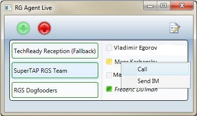

# <a name="skype-for-business-server-2015-resource-kit-tools-documentation"></a>Документация по инструментам Skype для бизнеса Server 2015 Resource Kit

В этом разделе описываются средства в Скайп Business Server 2015 для набора ресурсов для, включая назначение каждого средства и примеры его использования. Скайп для набора ресурсов 2015 Business Server позволяет упростить выполнять рутинные задачи для ИТ-администраторам, развертывания и управления Скайп для Business Server 2015. Например, инструмент **Web Conf Data** упрощает управление данными, которые отправляют пользователи во время собрания по сети. А при помощи **SEFAUtil** можно настроить переадресацию звонков делегатам и ответ на них для пользователей. Мы рекомендуем использовать эти средства для более эффективного управления Скайп для Business Server 2015 ИТ-администраторов.

## <a name="installation-of-the-resource-kit-tools"></a>Установка средств из набора ресурсов

Чтобы установить Скайп для набора ресурсов Business Server 2015, загрузите [OCSReskit.msi](https://www.microsoft.com/en-us/download/details.aspx?id=52631) из центра загрузки Майкрософт.

Чтобы выполнить простую установку, запустите файл **OCSResKit.msi**. MSI-файл установит все средства в следующую папку: **%Program Files%\Skype for Business Server 2015\ResKit**. Инструменты, представляющие собой автономные исполняемые файлы, находятся непосредственно в этой папке. Инструменты, имеющие дополнительные файлы, находятся в отдельных вложенных папках.

## <a name="supported-environments"></a>Поддерживаемые среды

Скайп для набора ресурсов 2015 Business Server должны быть установлены на сервере, который соответствует требованиям для Скайп для Business Server 2015, обычно на одном используется для запуска Скайп для Business Server 2015.

## <a name="resource-kit-tools-overview"></a>Обзор средств из набора ресурсов

Ниже приведен список средств, представленных в Скайп для набора ресурсов 2015 Business Server. Описание каждого средства, включая требования и примеры использования, можно найти в следующих разделах.

- [ABSConfig](resource-kit-tools.md#ABSConfig)

- [Монитор службы политики пропускной способности](resource-kit-tools.md#bpsm)

- [Анализатор использования полосы пропускания](resource-kit-tools.md#bua)

- [Счетчик парковки вызовов](resource-kit-tools.md#callpark)

- [DBAnalyze](resource-kit-tools.md#dba)

- [Импорт данных службы хранилища](resource-kit-tools.md#Issd)

- [LCSSync](resource-kit-tools.md#LCSSync)

- [Консоль поиска пользователей](resource-kit-tools.md#LUC)

- [MsTurnPing](resource-kit-tools.md#MsTurnPing)

- [Средство просмотра конфигурации сети](resource-kit-tools.md#NCV)

- [Динамический агент группы ответа](resource-kit-tools.md#RGAL)

- [SEFAUtil](resource-kit-tools.md#SEFAUtil)

- [SYSPrep.ps1](resource-kit-tools.md#SYSPrep)

- [Перенос оповещений о неназначенных номерах](resource-kit-tools.md#UNAM)

- [Web Conf Data](resource-kit-tools.md#WebConfData)

## <a name="absconfig"></a>ABSConfig
<a name="ABSConfig"> </a>

Средство конфигурации службы адресной книги (ABSConfig) — это средство администрирования, помогающих администраторам настроить конфигурацию службы адресной книги в Скайп для Business Server 2015. Это средство также позволяет Скайп для администраторов Business Server 2015 для восстановления службы адресной книги по умолчанию.

### <a name="description"></a>Описание

ABSConfig является приложением графический пользовательский интерфейс, который позволяет администраторам настраивать атрибуты доменных служб Active Directory, которые связаны с службы адресной книги.

Основные сценарии использования этого средства:

- Чтобы разрешить администраторам сопоставление атрибутов в доменных службах Active Directory в атрибуты для Скайп для Business Server 2015.

- позволяет администраторам указывать, что атрибут доменных служб Active Directory должен быть включен в файлы службы адресной книги или исключен из них;

- позволяет администраторам восстанавливать параметры службы адресной книги по умолчанию.

Средство ABSConfig можно запустить с помощью файла absConfig.exe. Средство открывается на вкладке **Настройка атрибутов** . Эта таблица имеет настроек для сопоставления доменных служб Active Directory атрибуты полей атрибута для Скайп для Business Server 2015, а также для определения пользователей, которые включаются или исключаются в файлов службы адресной книги в зависимости от конкретного атрибута фильтры. Также можно настроить значение номера телефона, которое необходимо включить в файл адресной книги. Кнопка **Восстановить значения по умолчанию** позволяет администраторам восстановить параметры службы адресной книги по умолчанию.

> [!NOTE]
> Повторное сопоставление атрибутов AD для разных имена полей OC будет только трудозатраты для Загрузка файла адресной книги и не поддерживается в веб-запросов адресной книги.

### <a name="output"></a>Выходные данные

Средство ABSConfig сохраняет конфигурацию службы адресной книги в базе данных.

```
Path: %ProgramFiles%\Skype for Business Server 2015\Reskit
```

### <a name="purpose"></a>Назначение

ABSConfig позволяет быстро и легко настроить Скайп для службы Business Server 2015 адресной книги.

### <a name="requirements"></a>Требования

#### <a name="computer"></a>Компьютер

ABSConfig может выполняться только с компьютера, присоединенный к домену, который имеет Скайп для Business Server 2015 установлены. В случае Скайп для 2015 сервера Business, Enterprise Edition этой программы может выполняться на любой серверов переднего плана, на которых включена во время установки службы адресной книги.

#### <a name="network"></a>Сеть

Компьютер должен иметь возможность подключения к интерфейсному пулу и внутренней базе данных.

#### <a name="software"></a>Программное обеспечение

Перед запуском средства ABSConfig необходимо установить перечисленные ниже программные компоненты.

- Skype для бизнеса Server 2015

#### <a name="users"></a>Пользователи

Администраторы, которые имеют разрешения, необходимые для обновления Скайп для развертывания Business Server 2015.

### <a name="examples"></a>Примеры

Средство ABSConfig можно запустить, введя в командной строке команду **ABSConfig.exe**. Ниже показан пользовательский интерфейс средства ABSConfig.


### <a name="summary"></a>Заключение

Средство ABSConfig предоставляет администраторам быстрый и простой в использовании средства для настройки Скайп для службы Business Server 2015 адресной книги.

## <a name="bandwidth-policy-service-monitor"></a>Монитор службы политики пропускной способности
<a name="bpsm"> </a>

Монитор службы политики пропускной способности позволяет администраторам просматривать следующие сведения:

1. Все настроенные Скайп для служб Business Server 2015 полосы пропускания (проверка подлинности и основных) в топологии

2. соединения, которые каждая служба устанавливает с другими службами политики пропускной способности и с пограничными серверами;

3. все каналы, настроенные в документе конфигурации сети, и сведения об использовании пропускной способности в реальном времени, сообщаемые каждой службой политики пропускной способности.

### <a name="description"></a>Описание

Монитор службы политики пропускной способности реализован в виде приложения с графическим пользовательским интерфейсом. Чтобы запустить средство, администраторам необходимо выполнить файл PDPMonUI.exe.

При запуске средства оно пытается обнаружить все службы политики пропускной способности в топологии. После начального обновления данных область в левой части окна заполняется списком служб, сгруппированным по кластерам, к которым они относятся.

Когда администратор выбирает определенную службу политики пропускной способности, в области справа выводятся сведения о ней. Эта область имеет две основные вкладки.

#### <a name="machine-info-tab"></a>Вкладка Machine Info

На вкладке **Machine Info** (Сведения о компьютере) выводятся подробные сведения о выбранной службе политики пропускной способности, а также список соединений, установленных этой службой с другими службами, и их состояний.

#### <a name="topology-info-tab"></a>Вкладка Topology Info

На вкладке **Topology Info** (Сведения о топологии) показан список всех каналов, настроенных в параметрах конфигурации сети. Для каждого канала показана пропускная способность звука и видео. Кроме того, показана текущая используемая пропускная способность в Кбит/с и в процентах от общей пропускной способности. Для выделения каналов, пропускная способность которых используется почти максимально, в средстве применяется цветовая кодировка. Это позволяет администраторам быстро определять такие каналы.

> [!NOTE]
>  Если средство монитор службы политики пропускной способности произойдет сбой при подключении к любой из настроенные службы политики пропускной способности, сведения в вкладки **Сведения о топологии** и **Сведения о компьютере** не появится. Однако также возможна ситуация, когда средству изначально удается подключиться к службе, но затем это соединение оказывается разорванным. В таких случаях администраторы будут видеть устаревшие данные. На каждой вкладке есть метка времени **Last Updated** (Последнее обновление), с помощью которой администраторы могут узнать, когда в последний раз обновлялись данные для определенной службы политики пропускной способности.

### <a name="output"></a>Выходные данные

Вывод данных через командную строку не используется. Данные программы выводятся в основном графическом интерфейсе пользователя.

### <a name="purpose"></a>Назначение

Монитор службы политики пропускной способности позволяет администраторам просматривать состояние каждой службы политики пропускной способности, определенной в топологии. Кроме того, администраторы могут просматривать сведения об использовании пропускной способности в реальном времени для всех каналов, определенных в документе конфигурации сети.

### <a name="requirements"></a>Требования

Средство монитор службы политики пропускной способности необходимо выполнять на компьютере, который является частью Скайп для топологии Business Server.

### <a name="summary"></a>Сводка

Монитор службы пропускной способности может быть ценным ресурсом для администраторов, позволяя им наблюдать за состоянием всех служб политики пропускной способности в топологии и, что еще более важно, получать сведения об использовании пропускной способности в реальном времени для каналов, определенных в параметрах конфигурации сети.

## <a name="bandwidth-utilization-analyzer"></a>Анализатор использования полосы пропускания
<a name="bua"> </a>

Анализатор использования полосы пропускания — это средство, которое создает отчеты о различных аспектах использования полосы пропускания каналов глобальной сети конечными точками объединенных коммуникаций в корпоративной сети. Эти отчеты можно использовать для анализа текущей схемы использования полосы пропускания, а также при планировании емкости полосы пропускания.

### <a name="description"></a>Описание

Анализатор использования полосы пропускания реализован в виде приложения с графическим пользовательским интерфейсом. Это средство создает отчеты об использовании полосы пропускания аудиоданных в сети и помогает при планировании ресурсов. Оно также позволяет просматривать полосу пропускания, назначенную различным каналам.

### <a name="output"></a>Выходные данные

Анализатор использования пропускной способности предоставляет графическое изображение полосы пропускания аудиоданных и степени ее использования для всех каналов глобальной сети, настроенных в системе.

### <a name="purpose"></a>Назначение

В голосовой и видеосвязи развертывания очень важно для контроля и понять тенденции использования пропускной способности трафика мультимедиа в корпоративной сети. Анализатор использования полосы пропускания позволяет администраторам решать эту задачу. Это средство предоставляет следующие возможности:

- создает отчеты по использованию звуковых каналов в сети;

- позволяет более эффективно планировать емкость и распределять полосы пропускания, назначенные различным каналам.

Анализатор пропускной способности позволяет создавать следующие графические отчеты о полосе пропускания и степени ее загрузки:

- для всех каналов глобальной сети в корпоративной сети;

- для выбранных каналов глобальной сети;

- для каналов глобальной сети, емкость которых превышена;

- для каналов глобальной сети, полоса пропускания которых используется недостаточно;

- для каналов глобальной сети, использование которых достигает критического уровня (то есть превышает 90 % полосы пропускания канала глобальной сети);

- для каналов глобальной сети, отфильтрованных по типу: каналы между сетевыми сайтами, каналы между областями и каналы внутри сайта;

- с фильтрацией по области сети.

#### <a name="applications"></a>Приложения

Анализатор использования полосы пропускания включает следующие два приложения (средства).

- **WanLinkLogCollector.exe** это средство дает возможность его пользователя ввод необходимой информации.

- **BandwidthUtilizationAnalyzer.xlsm** отчета программного обеспечения электронную таблицу Microsoft Excel автоматически запускается с WanLinkLogCollector.exe. Это приложение позволяет пользователю применять фильтры к отчету, как описывается далее в этой статье.

#### <a name="phases-of-using-bandwidth-utilization-analyzer"></a>Этапы работы с анализатором использования полосы пропускания

Работа с анализатором использования пропускной способности состоит из двух этапов:

- сбор журналов, выполняемый с помощью программы WanLinkLogCollector.exe;

- настройка отчетов, выполняемая с помощью электронной таблицы BandwidthUtilizationAnalyzer.xlsm.

> [!IMPORTANT]
> Мы настоятельно рекомендуем конечным пользователям не запускать электронную таблицу BandwidthUtilizationAnalyzer.xlsm вручную.

#### <a name="starting-bandwidth-utilization-analyzer"></a>Запуск анализатора использования полосы пропускания

Запустите файл WanLinkLogCollector.exe с помощью командной строки или проводника.

 **Использование программы WanLinkLogCollector.exe**

Использование программы WanLinkLogCollector.exe включает три этапа.

1. **Журнал временной шкалы** Предоставить временной шкалы, который требуется создать для отчета

2. **Укажите каталогах файлов** Предоставляют сведения о размещении файлов

3. **Сбор журналов и запустите средство просмотра отчетов** Выполните команду для создания отчета

#### <a name="step-1---log-the-timeline"></a>Этап 1. Регистрация временной шкалы

Регистрация временной шкалы позволяет пользователю средства указать следующие сведения, как показано на рисунке ниже. 

1. **Дата начала**. Это начальная дата временной шкалы, для которой нужно создать отчет, например 1 августа 2010 г.

2. **Дата окончания**. Это конечная дата временной шкалы, для которой нужно создать отчет, например 30 сентября 2010 г.

     

#### <a name="step-2---specify-the-file-directories"></a>Этап 2. Указание каталогов файлов

Пользователь может указать следующие каталоги файлов, как показано на рисунке.

- **Местоположение файлов журнала сервера** Местоположение папки, в котором хранятся журналы сервера политики пропускной способности. Это обычно в \<файлового сервера\>\\<choice FE\>\AppServerFiles\PDP.

- **Место хранения временных файлов** Временный файл места хранения промежуточных файлов во время которого создается отчет.


> [!NOTE]
> Пользователю средства необходимо предоставить достаточные права на доступ к файлам журналов сервера и папке хранения временных файлов.

#### <a name="step-3---collect-the-logs-and-start-the-report-viewer"></a>Этап 3. Сбор журналов и запуск средства просмотра отчетов

Чтобы выполнить сбор журналов и запустить средство просмотра отчетов, нажмите кнопку **Execute** (Выполнить), как показано ниже. На этом этапе собираются необходимые данные.


Если проверка входных данных прошла успешно, выводится показанное ниже сообщение.


Нажмите кнопку **ОК**. Автоматически откроется электронная таблица BandwidthUtilizationAnalyzer.xlsm. Следуйте инструкциям в окне сообщения. Подробные сведения см. в следующем разделе, **Использование таблицы BandwidthUtilizationAnalyzer.xlsm**.


### <a name="using-bandwidthutilizationanalyzerxlsm"></a>Использование таблицы BandwidthUtilizationAnalyzer.xlsm

1. Когда таблица BandwidthUtilizationAnalyzer.xlsm автоматически откроется, нажмите кнопку **Refresh** (Обновить), как показано ниже.

     

2. Когда откроется папка с файлами, выберите файл consolidated.csv в папке, указанной в окне сообщения, как показано ниже. Папка будет указана как **C:\Temp**.

     

3. Нажмите кнопку **Import** (Импорт).

4. Графический отчет будет создан автоматически. Он станет доступен, когда исчезнет указатель выполнения операции в фоновом режиме.

     

#### <a name="applying-filters-to-the-report-view"></a>Применение фильтров к представлению отчета

Далее описываются фильтры, которые можно применить к представлению отчета и которые показаны ниже.


1. **Name** (Имя). Фильтрация по каналам глобальной сети (фильтр находится в правой части графика). Префикс означает следующие типы каналов (см. вертикальное (синее) поле):

   - **S (Site)** — канал глобальной сети между сетевым сайтом и областью сети;

   - **IS (Inter-Site)** — канал глобальной сети между двумя сетевыми сайтами;

   - **R (Inter-Region)** — канал глобальной сети между двумя областями сети.

2. **Exceeded limit** (Превышение предела). Фильтрация каналов глобальной сети, использование полосы пропускания которых превышает доступные ресурсы.

3. **Critical levels** (Критические уровни). Фильтрация каналов глобальной сети, использование полосы пропускания которых достигло 90 % или более от максимального значения.

4. **Under-utilized** (Недостаточное использование). Фильтрация каналов глобальной сети, использование полосы пропускания которых составляет менее 25 % от максимального.

5. **Link type** (Тип канала). Фильтрация по следующим типам каналов глобальной сети:

   - **Network site** (Сетевой сайт);

   - **Inter-site** (Между сайтами);

   - **Inter-Region link**(Канал между областями).

6. **Region** (Область). Фильтрация по области сети.

На следующих рисунках показаны ранее описанные фильтры.

Примените фильтр **Name**. Выберите список каналов, которые нужно показать на графике.


Примените фильтр **Exceeded limit**. Установите флажок **True**, чтобы применить фильтр.


Примените фильтр **Critical levels**. Установите флажок **True**, чтобы применить фильтр.


Примените фильтр **Under utilized**. Установите флажок **True**, чтобы применить фильтр.


Примените фильтр **Link Type**. Выберите один или несколько типов каналов, которые нужно показать.


Примените фильтр **Region**. Выберите список областей, каналы которых нужно показать.


### <a name="requirements"></a>Требования

- Платформа .NET Framework 3.5

- Microsoft Excel 2010 или Excel 2007

### <a name="summary"></a>Сводка

Анализатор использования полосы пропускания предназначен для графического представления данных об использовании полосы пропускания звуковых каналов для трафика объединенных коммуникаций в сети. Это средство также можно использовать для создания отчетов об использовании полосы пропускания видеоканалов в сети.

## <a name="call-parkometer"></a>Счетчик парковки вызовов
<a name="callpark"> </a>

Счетчик парковки вызовов — это программа командной строки, облегчающая доступ к базе данных орбиты парковки вызовов.

### <a name="description"></a>Описание

Счетчик парковки вызовов — это средство для отслеживания вызовов, находящихся в состоянии парковки на данный момент. Оно также собирает статистику по орбитам и использованию сервера парковки вызовов (CPS). Это средство командной строки предоставляет чтение и доступ на запись к орбиты CPS базы данных SQL Server с компьютера, локальный или удаленный подключение.

Все параметры являются взаимоисключающими. Синтаксис командной строки имеет следующий вид:

- параметр **-o** — список всех Орбита диапазоны, настроенных для этого пула.

- параметр **-n** — списки, используемые в настоящее время все орбиты в этом пуле. Сведения, отображаемые выглядит следующим образом:

  - универсальный код ресурса (URI) протокола SIP паркуемого и паркующего;

  - имя узла сервера парковки вызовов, на котором паркуется вызов;

  - метка времени парковки вызова;

- параметр **-f** — количество свободного орбиты в пуле.

- **-r \<n\> ** параметр — список \<n\> последнего парковка вызовов. Сведения, отображаемые выглядит следующим образом:

  - URI SIP паркуемого;

  - URI SIP паркующего;

  - имя узла сервера, на котором был припаркован вызов;

  - метка времени извлечения или пропуска вызова;

- **-t\<n\> ** параметр - тестируется резервирование орбиты в базе данных для отображения случайности номера назначенных орбиты.

### <a name="output"></a>Выходные данные

В зависимости от входных параметров, указанных в командной строке, счетчик парковки вызовов отображает следующие выходные данные:

- все диапазоны орбиты, настроенные для этого пула;

- вызовы, припаркованные в настоящее время;

- число свободных (доступных) орбит;

- недавно припаркованные вызовы;

- зарезервированные орбиты для проверки универсальных и случайных значений орбиты.

### <a name="purpose"></a>Назначение

Средство CPS предназначено для предоставления доступа к базе данных CPS из командной строки. Администратор может просматривать сведения об использовании CPS и определять число орбит, назначенных пулу.

### <a name="requirements"></a>Требования

Если это средство запускается на компьютере с сервером парковки вызовов, то дополнительные требования не предъявляются. Если это средство выполняется на удаленном компьютере, базы данных SQL Server, используемый Скайп для Business Server 2015 должен быть настроен на разрешение удаленного доступа. Вызов Parkometer должны быть настроены строки подключения базы данных SQL Server для подключения к SQL Server пула. Эта строка подключения базы данных SQL Server определен в файле конфигурации **parkometer.exe.config**. Он должен помещен в ту же папку, где находится parkometer.exe. Следующий XML-файл является примером parkometer.exe.config. Имя пользователя (например, mydomain\Administrator), пароль (например, mypassword) и имя узла (например, myserver) используются параметры, которые необходимо настроить.

```
<?xml version="1.0" encoding="utf-8" ?>
<configuration>
  <appSettings>
   <add key="SQL" value="server=myserver\RTC;
database=cpsdyn;
User Id=mydomain\Administrator;
Password=mypassword.;
Integrated Security=false;"/>
  </appSettings>
</configuration>
```

### <a name="examples"></a>Примеры

Развертывание диапазонов орбит: параметр -o список всех диапазонов орбит, которые настроены для этого пула, как показано


В настоящее время парковка вызовов: параметр - n перечислены все орбиты в настоящее время используемых в этом пуле, как показано


Количество свободного орбиты: параметр -f список количество свободного орбиты в пуле, как показано


Недавно парковка вызовов: - r \<n\> списки параметров \<n\> последнего приостанавливать вызовы, как показано


Тестирование орбиты резервирования: -t \<n\> параметр тестируется резервирование орбиты в базе данных, как показано


### <a name="summary"></a>Сводка

Счетчик парковки вызовов — это средство командной строки, предоставляющее подробные сведения о сервере парковки вызовов.

## <a name="dbanalyze"></a>DBAnalyze
<a name="dba"> </a>

### <a name="description"></a>Описание

DBAnalyze — это средство командной строки, которая позволяет администраторам выполнять анализ отчеты о Скайп для баз данных Business Server 2015. Средство DBAnalyze имеет следующие режимы: диагностика, пользовательские данные, конференция, узлы MCU и фрагментация дисков.

- **Режим диагностики** Создает отчет, содержащий сведения о таблицах (количество записей, фрагментации, размер данных и размер индекса), размеры файлов данных и журналов, время последнего резервного копирования, контактов рассылки между серверами, на которых выполняется Microsoft Office Communications Server Среднее число разрешения, контакты, контейнеров, подписок, публикации, конечные точки для пользователей, любой неправильно перехода пользователей, пользователей, которые не могут быть маршрутизированы, среднее число конференций организовал для пользователей, назначенных конференций active конференций и версию базы данных.

    > [!NOTE]
    > Запуск средства в режиме диагностики может повлиять на производительность сервера.

- **Режим данных пользователя** Отчеты контакт, контейнер, подписки, публикации, разрешений и группы контактов данных для указанного пользователя или для пользователей, имеющих этого пользователя в свой список контактов и разрешений. Этот режим также предоставляет сводные данные по конференциям, которые организовал пользователь или на которые он приглашен.

- **Режим конференции** Подробные данные отчетов для определенного конференции, включая все сведения о времени расписания для конференции, в списке приглашаемому пользователю, в список типов мультимедиа разрешенные для конференции active MCUs (многоточечных управления единицы), список активных участников и каждый сигналы состояние участника.

- **Декодирования идентификатор собрания** Декодирует телефонной сети общего пользования (PSTN) собрания идентификатор, указанный в параметре **/pstnid** , но не подключаются к внутренние серверы для получения дополнительных сведений.

- **Разрешить конференции** Декодирует идентификатор собрания PSTN, указанного в параметре **/pstnid** и отображает сведения о конференции, указанный в параметре с идентификатором.

- **Режим MCUs** Отчеты идентификатор, тип носителя, URL-адрес, состояние пульса, конференции нагрузки и участников нагрузки для каждого MCU в пуле.

- **Режим степени фрагментации дисков** Отображает состояние фрагментации всех дисках.

Администраторы могут использовать это средство для диагностики различных проблем или при планировании емкости. Например, если большинство пользователей, размещенных на сервере А, выбрали в качестве контактов пользователей, размещенных на сервере Б, администратор может перенести пользователей с сервера А на сервер Б, чтобы уменьшить объем трафика между серверами.

### <a name="output"></a>Выходные данные

Это средство выводит предварительно определенные отчеты о Скайп для базы данных Business Server 2015. **Путь**: %ProgramFiles%\Skype for Business Server 2015\Reskit

### <a name="purpose"></a>Назначение

Чтобы установить Dbanalyze.exe, скопируйте его в локальную папку и запустите средство. Чтобы использовать средство, выполните следующую команду из командной строки. `dbanalyze.exe [/v] [/report:value] [/sqlserver:value] [/user:user@domain.com] [/conf:value][/pstnid:Value] [/maxcontacts:value]`Ниже перечислены описания параметров командной строки.


### <a name="requirements"></a>Требования

 **Компьютер** DBAnalyze может выполняться только с компьютера, присоединенный к домену, который имеет Скайп для Business Server 2015 установлены.

 **Сеть**. Компьютер должен иметь возможность подключения к внутренней базе данных.

 **Программное обеспечение** Перед запуском DBAnalyze необходимо установить Скайп для компонентов программного обеспечения Business Server 2015.

 **Пользователи** В следующей таблице перечислены администраторов пользователей, которые имеют необходимые разрешения для доступа к Скайп для баз данных Business Server 2015.


> [!NOTE]
> Для режима **/report:disk** необходима учетная запись локального администратора.

### <a name="examples"></a>Примеры

Ниже приведены примеры допустимых команд Dbanalyze.exe.

```
dbanalyze.exe /report:diag
dbanalyze.exe /report:user /user:usera@domainb.com
dbanalyze.exe /report:conf /user:bob@example.com /conf:1W9J71SKSX2X
dbanalyze.exe /report:resolve /pstnid:12345
dbanalyze.exe /report:mcus
dbanalyze.exe /report:disk
```

### <a name="summary"></a>Сводка

DBAnalyzer предоставляет администраторам быстро и легко анализировать Скайп для баз данных Business Server 2015.

## <a name="import-storage-service-data"></a>Импорт данных службы хранилища
<a name="Issd"> </a>

Средство ImportStorageServiceData из набора ресурсов позволяет повторно импортировать данные очереди и конечных точек, записанные на диск из службы хранилища (LYSS), обратно в эту службу.

### <a name="description"></a>Описание

Данные могут записываться на диск из службы хранилища автоматически (периодически) в зависимости от состояния элемента очереди или размера базы данных. Это может происходить в результате вызова командлета отработки отказа пула вручную или вызова командлета StorageServiceFullFlush (командлетом отработки отказа пула). Обратите внимание, что в идеальном варианте не следует повторно импортировать данные в случае любого размера базы данных службы хранения (LYSS) на интерфейсных выше обычного уровня, так как это может просто привести к дополнительные данные для экспорта обратно в работе. Кроме того проблем, которые может повлиять на ошибки, возникающие очереди службы хранения на случай увеличения сначала должно быть разрешено (для пример Exchange конечной точки ошибки, неполадки с сетью или другие неполадки с).

 **Сценарий 1:** во время отработки отказа, файлы могут сброшены из службы хранилища для каждого сервера переднего плана в работе. После завершения перехода на другой ресурс следует запускать средство повторно импортируйте данные.

 **Сценарий 2**. Данные записываются на диск автоматически каждый день или при превышении базой данных службы хранилища определенного порогового значения размера (например заполненность на 60, 80 или 90 %). В приведенном выше ситуации Если пакет мониторинга SCOM не развернуто, существует события для Скайп для службы хранилища сервера Business, относящиеся к данным, записи на диск в службе хранилища. Если в описанной выше ситуации не развернут пакет мониторинга SCOM, создаются события службы хранилища skype16_server_short, связанные с записью на диск данных из нее, а именно события с идентификаторами 32075 (началась операция полной записи на диск), 32076 (полная запись на диск завершена), 32082 (началась запись на диск на уровне обслуживания), 32083 (запись на диск на уровне обслуживания завершена) и 32089 (запись на диск выполнена в связи с заполнением базы данных). Обратите внимание, что эти идентификаторы событий соответствуют окончательному первоначальному выпуску (RTM). Когда администратор видит эти события, оно означает, что файлы, которые были сброшены в работе. В этом следует регулярно импортировать данные обратно с помощью этого средства, например один раз в неделю.

Обновление веб-службами Если развернут пакет SCOM для Скайп Business Server для наблюдения за работоспособностью системы, существует оповещения о новых которых могут быть созданы, которые обратитесь к администратору, чтобы повторно импортируйте данные сброшены обратно в хранилище службы. Будет соответствующего события в журнале событий на сервере переднего плана, который запускается оповещение. Событие дает описание родительского пути, в котором находятся файлы данные сброшены, а также как существует много файлов являются которого условиям оповещения. Условий оповещения является наличие расположены X или несколько файлов в разделе конкретный родительский путь, который находится на наименее Y дней (где X и Y заданы в StorageService, но можно переопределить с помощью изменения файла APPCONFIG.) Ниже, показаны два примера события, которые может активировать оповещение о работоспособности с разницы выполняется их родительского пути. Один из вариантов является в разделе веб-службы общих папках, а другие возможности — это локальный каталог Application Data каждого переднего плана. (например c:\ProgramData\Microsoft\Skype для 2015\StorageService Business Server). Администратор будет запускаться этого средства пакета ресурсов.

Это средство повышает загрузку ЦП и интенсивность операций ввода-вывода на сервере переднего плана, на котором оно запущено, а также на других серверах переднего плана, если данные не принадлежат серверу, на котором выполняется средство. Мы не рекомендуем запускать это средство, когда загрузка ЦП и интенсивность операций ввода-вывода на серверах переднего плана высоки (например, в часы пиковой нагрузки). Во-вторых, на импорт одного файла данных средству может потребоваться 2–3 минуты. Учитывайте это при оценке времени работы средства. Подробный файл журнала, создаваемый средством, по умолчанию находится в хранилище файлов. Удалите его, если он не содержит ошибок, так как его размер может составлять десятки мегабайт и более.


### <a name="requirements"></a>Требования

Установка Скайп для Business Server 2015 Resource Kit tools. Будет запущена на присоединенный к домену машины установленными Скайп для Business Server и Скайп для консоли Business Server. Средство использует командлет из командной консоли для идентификации всех серверов переднего плана в пуле. Во-вторых средство должна быть выполнена с компьютера в пул, в котором установлен базу данных **RtcLocal** . Эта база данных используется с помощью данного средства для извлечения расположение WEBSERVICE общий файловый ресурс для пула. Кроме того перед использованием этого инструмента, каждый сервер переднего плана сначала необходимо включить удаленного взаимодействия Windows PowerShell, с помощью **Enable-PSRemoting** на каждом сервере переднего плана, а также компьютера, на котором выполняется средство. В противном случае удаленных команд Windows PowerShell из этой программы завершится с ошибкой. Об удаленном взаимодействии Windows PowerShell может быть отключена на всех серверах переднего плана в пуле после его завершения. Наконец учетной записи или учетных данных, вызов средства должны иметь разрешение на чтение и запись в общую папку файлов webservice для пула, в котором они выполняются это средство на. В противном случае — средство завершится ошибкой при этом возникают ошибки ввода-ВЫВОДА разрешений.

> [!NOTE]
> В Windows Server 2012 об удаленном взаимодействии Windows PowerShell включена по умолчанию, но не в операционной системе Windows Server 2008.

### <a name="examples"></a>Примеры

```
>  C:\StorageService>ImportStorageServiceData.exe
Description:
This tool will re-import Storage Service (LYSS) flushed queue data back in.  For a pool: you are required to run this tool on a machine inside the pool which has the Lync Server Management Shell installed.  Additionally, all front end machines need to have Windows Powershell Remoting enabled before executing this tool by executing Enable-PSRemoting.  Also, please ensure that all Storage Service instance DB Size are at the 'Normal' level (verify this by viewing Eventlog events). Otherwise re-importing may cause data to be flushed out again if any Storage Service instance DB size level goes above 'Normal'.
Usage: Default behavior is to Import data from web service file share as well as any files on all Front End machines in pool.
Additional Options:
-Verbose                    : Turn verbose output on.

-StorageServiceHostName     : Host Name of Storage Service WCF endpoint.  ( Default=localhost netnamedpipe binding. )

-FileSharePath              : Import only all data from just under the UNC path specified.

ActivityID: cc3b62ff-bb66-4e61-a6e2-96cb3626315c. <-- Use this to correlate with StorageService trace logs if troubleshooting.
Type Server name (TCP binding) or press <enter> for localhost (NamePipe binding):
Using NetNamedPipeBinding...
OnTopologyChanged Event received
Web Service File Share: \\dc.vdomain.com\OcsFileStore\co1-WebServices-1\StorageService

Front Ends:
server.vdomain.com
server2.vdomain.com
server1.vdomain.com
server3.vdomain.com
Looking under directory: \\dc.vdomain.com\OcsFileStore\co1-WebServices-1\StorageService for exported data.
# Files found: 8
Starting Import for file:\\dc.vdomain.com\OcsFileStore\co1-WebServices-1\StorageService\DataExport\2
0120910\SERVER.vdomain.com\944f5724c65c5f93900dc1c8c898b102__0.xml
Items deserialized: 20

All items in file were enqueued successfully, will try to delete file: \\dc.vdomain.com\OcsFileStore\co1-WebServices-1\StorageService\DataExport\20120910\SERVER.vdomain.com\944f5724c65c5f93900dc1c8c898b102__0.xml

All items in file failed to enqueue so file will not be deleted.  File path: \\dc.vdomain.com\OcsFileStore\co1-WebServices-1\StorageService\DataExport\20120910\SERVER.vdomain.com\944f5724c65c5f93900dc1c8c898b102__0.xml

Summary for file \\dc.vdomain.com\OcsFileStore\co1-WebServices-1\StorageService\DataExport\20120910\SERVER.vdomain.com\944f5724c65c5f93900dc1c8c898b102__0.xml: succeeded: 20, failed: 0

Starting Import for file:\\dc.vdomain.com\OcsFileStore\co1-WebServices-1\StorageService\DataExport\20120910\SERVER1.vdomain.com\17d5435ae40259f7bbdf1866776386e4__0.xml
Items deserialized: 20

[cc3b62ff-bb66-4e61-a6e2-96cb3626315c] Send EnqueueMessages to redirected, targetServer=server1.vdomain.com, queueItems=20

All items in file were enqueued successfully, will try to delete file: \\dc.vdomain.com\OcsFileStore\co1-WebServices-1\StorageService\DataExport\20120910\SERVER1.vdomain.com\17d5435ae40259f7bbdf1866776386e4__0.xml

All items in file failed to enqueue so file will not be deleted.  File path: \\dc.vdomain.com\OcsFileStore\co1-WebServices-1\StorageService\DataExport\20120910\SERVER1.vdomain.com\17d5435ae40259f7bbdf1866776386e4__0.xml

Summary for file \\dc.vdomain.com\OcsFileStore\co1-WebServices-1\StorageService\DataExport\20120910\
SERVER1.vdomain.com\17d5435ae40259f7bbdf1866776386e4__0.xml: succeeded: 20, failed: 0

Starting Import for file:\\dc.vdomain.com\OcsFileStore\co1-WebServices-1\StorageService\DataExport\20120910\SERVER1.vdomain.com\904f6c9b8ac951ae8b3c86684d3832e4__0.xml

Items deserialized: 20
[cc3b62ff-bb66-4e61-a6e2-96cb3626315c] Send EnqueueMessages to redirected, targetServer=server1.vdomain.com, queueItems=20

All items in file were enqueued successfully, will try to delete file: \\dc.vdomain.com\OcsFileStore
\co1-WebServices-1\StorageService\DataExport\20120910\SERVER1.vdomain.com\904f6c9b8ac951ae8b3c86684d
3832e4__0.xml

All items in file failed to enqueue so file will not be deleted.  File path: \\dc.vdomain.com\OcsFil
eStore\co1-WebServices-1\StorageService\DataExport\20120910\SERVER1.vdomain.com\904f6c9b8ac951ae8b3c
86684d3832e4__0.xml

Summary for file \\dc.vdomain.com\OcsFileStore\co1-WebServices-1\StorageService\DataExport\20120910\
SERVER1.vdomain.com\904f6c9b8ac951ae8b3c86684d3832e4__0.xml: succeeded: 20, failed: 0

Starting Import for file:\\dc.vdomain.com\OcsFileStore\co1-WebServices-1\StorageService\DataExport\2
0120910\SERVER2.vdomain.com\69844a271e6c5633a1f2b46a42287dd6__0.xml

Items deserialized: 20

[cc3b62ff-bb66-4e61-a6e2-96cb3626315c] Send EnqueueMessages to redirected, targetServer=server2.vdom
ain.com, queueItems=20

All items in file were enqueued successfully, will try to delete file: \\dc.vdomain.com\OcsFileStore
\co1-WebServices-1\StorageService\DataExport\20120910\SERVER2.vdomain.com\69844a271e6c5633a1f2b46a42
287dd6__0.xml

All items in file failed to enqueue so file will not be deleted.  File path: \\dc.vdomain.com\OcsFil
eStore\co1-WebServices-1\StorageService\DataExport\20120910\SERVER2.vdomain.com\69844a271e6c5633a1f2
b46a42287dd6__0.xml

Summary for file \\dc.vdomain.com\OcsFileStore\co1-WebServices-1\StorageService\DataExport\20120910\
SERVER2.vdomain.com\69844a271e6c5633a1f2b46a42287dd6__0.xml: succeeded: 20, failed: 0

Starting Import for file:\\dc.vdomain.com\OcsFileStore\co1-WebServices-1\StorageService\DataExport\2
0120910\SERVER3.vdomain.com\3313935458e35b9b9759e08a15d251e6__0.xml

Items deserialized: 20

[cc3b62ff-bb66-4e61-a6e2-96cb3626315c] Send EnqueueMessages to redirected, targetServer=server3.vdom
ain.com, queueItems=1

All items in file were enqueued successfully, will try to delete file: \\dc.vdomain.com\OcsFileStore
\co1-WebServices-1\StorageService\DataExport\20120910\SERVER3.vdomain.com\3313935458e35b9b9759e08a15
d251e6__0.xml

All items in file failed to enqueue so file will not be deleted.  File path: \\dc.vdomain.com\OcsFil
eStore\co1-WebServices-1\StorageService\DataExport\20120910\SERVER3.vdomain.com\3313935458e35b9b9759
e08a15d251e6__0.xml

Summary for file \\dc.vdomain.com\OcsFileStore\co1-WebServices-1\StorageService\DataExport\20120910\
SERVER3.vdomain.com\3313935458e35b9b9759e08a15d251e6__0.xml: succeeded: 20, failed: 0

Starting Import for file:\\dc.vdomain.com\OcsFileStore\co1-WebServices-1\StorageService\DataExport\2
0120910\SERVER3.vdomain.com\4501e04eae4856059346949ff817c220__0.xml
Items deserialized: 20
[cc3b62ff-bb66-4e61-a6e2-96cb3626315c] Send EnqueueMessages to redirected, targetServer=server3.vdom
ain.com, queueItems=1
All items in file were enqueued successfully, will try to delete file: \\dc.vdomain.com\OcsFileStore
\co1-WebServices-1\StorageService\DataExport\20120910\SERVER3.vdomain.com\4501e04eae4856059346949ff8
17c220__0.xml
All items in file failed to enqueue so file will not be deleted.  File path: \\dc.vdomain.com\OcsFil
eStore\co1-WebServices-1\StorageService\DataExport\20120910\SERVER3.vdomain.com\4501e04eae4856059346
949ff817c220__0.xml

Summary for file \\dc.vdomain.com\OcsFileStore\co1-WebServices-1\StorageService\DataExport\20120910\
SERVER3.vdomain.com\4501e04eae4856059346949ff817c220__0.xml: succeeded: 20, failed: 0
Starting Import for file:\\dc.vdomain.com\OcsFileStore\co1-WebServices-1\StorageService\DataExport\2
0120910\SERVER3.vdomain.com\5ad77443ad955a22a876749be66d5317__0.xml

Items deserialized: 20
[cc3b62ff-bb66-4e61-a6e2-96cb3626315c] Send EnqueueMessages to redirected, targetServer=server3.vdom
ain.com, queueItems=20
All items in file were enqueued successfully, will try to delete file: \\dc.vdomain.com\OcsFileStore
\co1-WebServices-1\StorageService\DataExport\20120910\SERVER3.vdomain.com\5ad77443ad955a22a876749be6
6d5317__0.xml
All items in file failed to enqueue so file will not be deleted.  File path: \\dc.vdomain.com\OcsFil
eStore\co1-WebServices-1\StorageService\DataExport\20120910\SERVER3.vdomain.com\5ad77443ad955a22a876
749be66d5317__0.xml
Summary for file \\dc.vdomain.com\OcsFileStore\co1-WebServices-1\StorageService\DataExport\20120910\
SERVER3.vdomain.com\5ad77443ad955a22a876749be66d5317__0.xml: succeeded: 20, failed: 0
Starting Import for file:\\dc.vdomain.com\OcsFileStore\co1-WebServices-1\StorageService\DataExport\2
0120910\SERVER3.vdomain.com\a11e27ae439a582288d4657eda86b565__0.xml
Items deserialized: 20
[cc3b62ff-bb66-4e61-a6e2-96cb3626315c] Send EnqueueMessages to redirected, targetServer=server3.vdom
ain.com, queueItems=20
All items in file were enqueued successfully, will try to delete file: \\dc.vdomain.com\OcsFileStore
\co1-WebServices-1\StorageService\DataExport\20120910\SERVER3.vdomain.com\a11e27ae439a582288d4657eda
86b565__0.xml
All items in file failed to enqueue so file will not be deleted.  File path: \\dc.vdomain.com\OcsFil
eStore\co1-WebServices-1\StorageService\DataExport\20120910\SERVER3.vdomain.com\a11e27ae439a582288d4
657eda86b565__0.xml
Summary for file \\dc.vdomain.com\OcsFileStore\co1-WebServices-1\StorageService\DataExport\20120910\
SERVER3.vdomain.com\a11e27ae439a582288d4657eda86b565__0.xml: succeeded: 20, failed: 0
All files have been imported into Storage Service for path: \\dc.vdomain.com\OcsFileStore\co1-WebSer
vices-1\StorageService
Importing files for: server.vdomain.com
No files founds.
Importing files for: server2.vdomain.com
No files founds.
Importing files for: server1.vdomain.com
No files founds.
Importing files for: server3.vdomain.com
No files founds.
Writing log: \\dc.vdomain.com\OcsFileStore\co1-WebServices-1\StorageService\ImportStorageServiceData
Log20120910_1609SS
Tool has finished execution.
>  C:\StorageService>
```

## <a name="lcssync"></a>LCSSync
<a name="LCSSync"> </a>

Средство LCSSync помогает развертывания Скайп для программного обеспечения Business Server 2015 в среде с несколькими лесами. Это средство используется для синхронизации пользователей и групп из лесов другого пользователя в доменных службах Active Directory обратитесь объект, который требуется центральный лес, установленными Скайп для Business Server 2015.

### <a name="description"></a>Описание

 Использование LCSSync синхронизированного доменных служб Active Directory контактов объектов в центральном лесу Включение пользователей для Скайп для Business Server. Для обеспечения единого входа в систему, учетная запись основной должен быть сопоставлен объекта контакта доменных служб Active Directory в центральном лесу для Скайп для Business Server 2015. Это средство помогает выполнить такое сопоставление. Оно предоставляет шаблоны для создания агентов управления на сервере Microsoft Identity Integration Server.

### <a name="summary"></a>Заключение

Средство LCSSync помогает развертывания Скайп для Business Server 2015 в среде с несколькими лесами.

## <a name="lookup-user-console"></a>Консоль поиска пользователей
<a name="LUC"> </a>

Средство LookupUserConsole отображает внутреннего Скайп Business Server маршрутизации сведения о конкретных пользователей. Эти сведения могут быть полезны специалистам службы поддержки Майкрософт при диагностике проблем с развертыванием и маршрутизацией.

### <a name="description"></a>Описание

 Выполнение LookupUserConsole.exe будет откройте командную строку, которая принимает SIP-адреса и пытается отобразить внутреннего Скайп Business Server маршрутизации сведения, связанные с ними. Чтобы выйти из средства LookupUserConsole, введите команду **exit**.

### <a name="requirements"></a>Требования

Установка Скайп for Business Server 2015 Resource Kit. Будет запущена на присоединенный к домену машины установленными Скайп для Business Server.

### <a name="examples"></a>Примеры

C:\Program Files\Skype for Business Server 2015\ResKit\>LookupUserConsole.exe

```
> sip:john.doe@vdomain.com

  Execution time (ms):                            171.094
  Exeuction result:                               Success
  SIP URI:                                        sip:john.doe@vdomain.com
  User info:
    SID:                                          S-1-5-21-2831376166-29632525...    Display name:                                     John Doe
    Grouping ID:                                  00000000-0000-0000-0000-...
    Line URI:                                     <null>
    Policy assignment:                            TenantId={00000000--0000-000....
    SIP enabled:                                  True
    UC enabled:                                   False
    Tenant ID:                                    00000000-0000-0000-0000-...  Cluster info:
    Active cluster:                               pool0.vdomain.com
    Backup registrar cluster:                     <null>
    Deployment location:                          <null>
    Home Front-End FQDN:                          SERVER.vdomain.com
    Primary Registrar cluster:                    pool0.vdomain.com
    Remote Director external SIP FQDN:            <null>
    Remote Director internal SIP FQDN:            <null>
    Remote Director Web FQDN:                     <null>
    Routing group ID:                             4501e04e-ae48-5605-9346...
    Service tag ID:                               1266953005
    User Front-End resolved:                      True
    User in local forest:                         True
    User in remote forest:                        False
    User in split domain:                         False
    User-Services cluster:                        pool0.vdomain.com

> sip:nouser@vdomain.com

  Execution time (ms):                            948.7574
  Exeuction result:                               UserDoesNotExist

> exit
```

## <a name="msturnping"></a>MsTurnPing
<a name="MsTurnPing"> </a>

Средство MSTurnPing позволяет администратору Скайп для программного обеспечения Business Server 2015 для проверки состояния серверов под управлением службы пограничного сервера аудио/видео и проверки подлинности аудио и видео, а также серверы, на которых выполняется политика пропускной способности Службы в топологии.

### <a name="description"></a>Описание

Средство MSTurnPing позволяет администратору Скайп для программного обеспечения Business Server 2015 для проверки состояния серверов под управлением службы пограничного сервера аудио/видео и проверки подлинности аудио и видео, а также серверы, на которых выполняется политика пропускной способности Службы в топологии.

Средство позволяет администратору выполнять перечисленные ниже проверки.

1. Проверка пограничных серверов аудио- и видеоданных — средство тестирует все пограничные серверы аудио- и видеоданных в топологии, выполняя следующие действия:

   - Проверка, что Скайп для службы проверки подлинности аудио/видео Business Server запущена и может выдавать правильные учетные данные.

   - Проверка, что Скайп для службы пограничного сервера аудио/видео Business Server запущена и можно распределить ресурсы на внешний пограничный сервер успешно.

2. Проверка службы политики пропускной способности — средство тестирует все серверы в топологии, на которых запущены службы политики пропускной способности, выполняя следующие действия:

   - Проверка, что Скайп для службы политики пропускной способности Business Server (проверка подлинности) запущена и может выдавать правильные учетные данные.

   - Проверка, что Скайп для службы политики пропускной способности Business Server (ядро) запущена и можно успешно выполнить проверку пропускной способности.

Это средство необходимо запускать на компьютере, который входит в топологию и на котором установлено локальное хранилище. 

### <a name="output"></a>Выходные данные

Средство выводит результаты каждой операции.

- Если выполняется тест **AudioVideoEdgeServer**, выходные данные включают следующие сведения:

  - Результаты теста компьютеры, которые предоставляют Скайп для службы проверки подлинности Business Server 2015 аудио и видео в топологии

  - Результаты теста компьютеры, которые предоставляют Скайп для службы пограничного сервера Business Server 2015 аудио и видео в топологии

- Если выполняется тест **BandwidthPolicyServer**, выходные данные включают следующие сведения:

  - Результаты теста компьютеры, которые обеспечивают Скайп для службы политики пропускной способности Server 2015 Business (проверка подлинности) в топологии

  - Результаты теста компьютеры, которые обеспечивают Скайп для службы политики пропускной способности Server 2015 Business (ядро) в топологии

### <a name="requirements"></a>Требования

- Это средство необходимо запускать на компьютере, который входит в топологию и на котором установлено локальное хранилище.

- Средство должно запускаться администратором, который имеет доступ к локальному хранилищу.

### <a name="examples"></a>Примеры

Ниже приведен пример входных данных средства.

```
MsTurnPing -ServerRole AudioVideoEdgeServer

MsTurnPing -ServerRole BandwidthPolicyServer
```

### <a name="summary"></a>Сводка

Это средство может быть ценных ресурсов для Скайп для администраторов Business Server 2015, чтобы проверить состояние серверов, использующих аудио и видео и службы политики пропускной способности.

## <a name="network-configuration-viewer"></a>Средство просмотра конфигурации сети
<a name="NCV"> </a>

Можно использовать средство просмотра конфигурации сети с Скайп для администраторов программного обеспечения Business Server 2015 communications Просмотр топологии сети контроля допуска звонков допуска предприятия, которая может разрешать сеансы связи в режиме реального времени, таких как голосовые звонки и видеозвонки на основе указанного емкости пропускной способности. Скайп Business Server 2015 администраторам определить политики контроля допуска звонков, которые применяются службы политики пропускной способности, которые устанавливаются вместе с Скайп для Business Server 2015.

### <a name="description"></a>Описание

Средство просмотра конфигурации сети (NetworkConfigurationViewer.exe) позволяет администраторам выполнять следующие задачи:

- Загрузите и Просмотр топологии сети CAC из Скайп для развертывания Business Server 2015 в графическом формате.

- загружать и просматривать сетевую топологию CAC из файла журнала сервера политики пропускной способности в графическом формате;

- сохранять сетевую топологию CAC в формате XML на диске;

- сохранять схему сетевой топологии CAC в формате JPG или BMP;

- просматривать данные конфигурации сетевой топологии CAC;

- просматривать сетевую топологию CAC в виде древовидного представления;

- определять настраиваемые соединители для каналов сетевой топологии CAC (например каналов между сайтом и областью, между двумя областями или между двумя сайтами);

- просматривать сведения о сайтах и областях сетевой топологии CAC, а также о настроенных политиках пропускной способности и сетевых каналах.

### <a name="purpose"></a>Назначение

Просмотр каналов корпоративной сетевой топологии CAC в графическом интерфейсе.

### <a name="examples"></a>Примеры

 **Загрузка и Просмотр топологии сети CAC из Скайп для развертывания Business Server 2015 в виде графического**: Скайп для администраторов Business Server 2015 можно загружать и просматривать конфигурации топологии сети CAC на любой Скайп для компьютера Business Server 2015, с помощью параметра **Загрузки конфигурации сети** , как показано на следующем рисунке. Средство не удастся загрузить или просмотра такой конфигурации при развертывании на компьютере, который не имеет возможность подключения к Скайп для хранилища конфигурации Business Server 2015.


 **Нагрузки и просмотр CAC топологии сети из файла журнала сервера политики пропускной способности в графическом формате:** Скайп для серверов Business Server 2015 полосы пропускания сохраните топологии сети CAC как часть механизм ведения журнала в разделе Скайп Business Server 2015 расположение общей папки. Скайп для администраторов Business Server 2015 можно просмотреть этот файл в графическом формате с помощью параметра **Open конфигурации сети** , как показано ниже.


Сохранить и сохраните топологию сети CAC в формате XML на диске: Скайп для администраторов Business Server 2015 можно сохранить файл конфигурации топологии сети CAC в формате XML, выбрав пункт **Сохранить копию конфигурации сети** , как показано ниже. Сохраненный файл конфигурации может использоваться для целей графический просмотра нажмите автономный режим.


Схема топологии сети CAC хранилища в формате JPG или BMP и сохранить: Скайп для администраторов Business Server 2015 можно сохранить конфигурации топологии сети CAC в графическом формате (форматы файлов JPG и BMP) с помощью схемы **Сохранить настройки сети в виде Рисунок** как показано ниже.


 <strong>Данные конфигурации топологии сети CAC представления:</strong> Скайп для администраторов Business Server 2015 можно просмотреть данные конфигурации сети, связанных с ними рабочих областей сети, сети, профили пропускной способности и сайта подсети IP-адресов в текстовый формат с помощью параметра данные конфигурации сети представления, как показано ниже.


 **Топология сети CAC представления в древовидном представлении стилей:** Скайп Business Server 2015 администраторы могут просматривать данные о конфигурации сети, связанных с ними в стиль представления графического дерева с помощью панели управления в левой части окна инструментов, как показано ниже.


 **Определение настраиваемых соединителей для контроля допуска звонков связи топологии (например, расположение узла, -регионах и веб сайта ссылки):** Скайп для администраторов Business Server 2015 можно определить настраиваемых графический соединителей для контроля допуска звонков сетевой конфигурации каналов связи ГЛОБАЛЬНОЙ сети с помощью параметра параметров, как показано ниже. Это помогает различать различные типы сетевых соединений, подготавливаются для сетевой конфигурации.


 **Сведения о сайте топологии сети CAC представления, сведений об области и политики пропускной способности подготовленных:** Скайп для администраторов Business Server 2015 можно просмотреть, связанных с ними сведений о сетевом регионе CAC, сведения о сайте и полосы пропускания CAC подготовки, используя параметры, приведенные ниже сведения. (Например, нажмите кнопку **сведения** в области сети или сетевого узла объекта.)


### <a name="summary"></a>Заключение

Это средство может быть ценных ресурсов для Скайп для администраторов Business Server 2015, которые хотите просмотреть топологии сети CAC для их развертывания в графическом формате.

## <a name="response-group-agent-live"></a>Динамический агент группы ответа
<a name="RGAL"> </a>

Приложение группы ответа позволяет агентам для доступа к полезную информацию в реальном времени, с помощью его встроенной веб-службы. К сожалению нет графического представления эти данные недоступны вне приложения. Средство ответа группы агентов Live Resource Kit решает эту проблему, предоставляя простой и графический способ доступа к эти сведения, улучшена благодаря Скайп в режиме реального времени для бизнес-коммуникаций программного обеспечения информация таких как сведения о присутствии других агентов.

### <a name="description"></a>Описание

Динамический агент группы ответа — это приложение Windows, которое предоставляет агентам группы ответа функции входа и выхода и некоторые сведения в режиме реального времени (такие как членство в группах и текущее число звонков). Он должен быть улучшенной версии страницу группы агентов (доступен из Скайп для бизнеса.

### <a name="purpose"></a>Назначение

Приложение группы ответа помещает входящие звонки в очередь, а затем направляет их группам агентов. Для принятия обоснованных решений по поводу того, какие звонки следует обслуживать, агенты могут получать доступ к информации о своих группах агентов в режиме реального времени, например к сведениям о том, какие еще агенты доступны и сколько звонков помещено в каждую очередь. Динамический агент группы ответа обеспечивает интуитивно понятный доступ к этой информации, которая ранее была доступна только через службу группы ответа.

#### <a name="features"></a>Возможности

Средство Live агента группы ответа — это от службы группы ответа и Скайп построенными на базе Business Server 2015 SDK. Он предоставляет агентам группы ответа информацию и возможности, доступные в службе группе ответа (например сведения о членстве в группах, присутствии других агентов и числе ожидающих звонков).

На рисунке ниже показан главный интерфейс динамического агента группы ответа.


В динамическом агенте группы ответа доступны следующие три основные функции.

- **Sign-in/out:** В отличие от (доступен Скайп для Business Server 2015) страницу группы агентов Live агента группы ответа позволяет только агентам для входа в систему или из него все агента группам за один раз. Это приложение предоставляет агентам три быстрых способа входа или выхода.

  - Нажмите в приложении кнопку входа или выхода (зеленую или красную соответственно).

  - Щелкните значок в области уведомлений и выберите команду входа или выхода.

  - Используйте настраиваемые сочетания клавиш.

- **Членства:** При выборе группы агента Live агента группы ответа отображается список агентов в эту группу в правой области. Если Скайп для Business Server 2015 работает на том же компьютере, что это приложение, сведения о присутствии и карточке контакта отображаются в Live агента группы ответа. Агенты могут отправлять мгновенные сообщения или звонить другим агентам непосредственно отсюда.

- **Статистика в режиме реального времени**. Динамический агент группы ответа предоставляет статистику в режиме реального времени по всем группам агентов. Частота обновления составляет одну минуту. Когда группа ответа отвечает на звонок, рядом с именем группы появляется визуальный индикатор с текущим числом звонков в очереди. Если навести указатель на группу, также отображается самое долгое время ожидания.

### <a name="requirements"></a>Требования

Для динамического агента группы ответа требуется платформа .NET Framework 4.0. Кроме того чтобы воспользоваться преимуществами функций карточки контакта и сведения о присутствии, Скайп для бизнеса должно быть установлено локально (и работать под управлением).

#### <a name="configuration"></a>Конфигурация

Динамический агент группы ответа можно настроить в соответствии с личными предпочтениями с помощью диалогового окна Options (Параметры) приложения. Кроме того, администратор может определить адрес узла по умолчанию, изменив свойство defaultHostAddress в файле RGAgentLive.exe.config.

На приведенном ниже рисунке показано диалоговое окно Options, с помощью которого агенты могут настраивать адрес узла и сочетания клавиш. Чтобы открыть его, нажмите кнопку Options в правом верхнем углу главного интерфейса.


В конфигурации динамического агента группы ответа можно настроить следующие три параметра.

- Адрес узла: это обычно веб-сайта пула полное доменное имя, относящегося к агента домашнего пула. Адрес службы группы ответа автоматически формируется на основе этой информации (путем добавления соответствующего пути после имени узла).

- Shortcuts (Сочетания клавиш) — можно настроить сочетания клавиш, используемые для входа и выхода. Единственное ограничение заключается в том, что оба сочетания клавиш должен содержать ключ «Эмблема Windows» (в дополнение к по крайней мере другой ключ).

- Start with Windows (Запускать при загрузке Windows) — приложение можно настроить так, чтобы оно запускалось автоматически при загрузке ОС Windows.

### <a name="examples"></a>Примеры

На приведенном ниже рисунке показано, как позвонить или отправить мгновенное сообщение другому агенту, щелкнув правой кнопкой мыши контакт в области справа.



На приведенном ниже рисунке показано, как в динамическом агенте группы ответа отображается текущее число звонков в очереди и самое долгое время ожидания для входящих звонков.


### <a name="summary"></a>Сводка

Агент группы ответа предоставляет такие полезные функции, как быстрый вход и выход, сведения о членстве в группах и базовая статистика в режиме реального времени, которые вне приложения доступны только посредством службы группы ответа. С помощью инструмента ответа группы агентов Live набора ресурсов Скайп для администраторов Business Server 2015 можно обеспечить их агенты с приложением Windows, которая позволяет выполнять задачи быстрее и графических способом.

## <a name="sefautil"></a>SEFAUtil
<a name="SEFAUtil"> </a>

SEFAUtil (дополнительный компонент расширению) — это средство командной строки, которая позволяет Скайп Business Server 2015 communications программного обеспечения администраторам и агенты служба технической поддержки для настройки мелодий делегата, переадресации вызовов, одновременных звонков, Параметры группы общих звонков и группу раскладки звонок от имени Скайп для пользователя Business Server 2015. Средство также позволяет администраторам запроса параметров маршрутизации вызовов, опубликованных для определенного пользователя. Средство SEFAUtil администратор может включить или отключить/изменение вызова пересылка или одновременный вызов от имени пользователя. Администратор можно указать целевой (в виде SIP URI) или использовать целевой объект, который был опубликован пользователем. Это средство также позволяет администраторам добавлять или удалять делегатов или членов группы общих звонков от имени пользователя. Это средство построения на Microsoft Unified Communications управляемых API (UCMA) 3.0 и необходимо создать доверенное приложение, чтобы администраторы в центральном хранилище управления для SEFAUtil.

SEFAUtil (дополнительный компонент расширению) позволяет Скайп для администраторов Business Server 2015 и служба технической поддержки агенты, для настройки мелодий делегата, переадресации вызовов, одновременных звонков, приема звонков параметры и групповой раскладки звонок от имени Скайп для пользователя Business Server 2015. Оно также позволяет администраторам запрашивать параметры маршрутизации звонков, опубликованные для определенного пользователя.

### <a name="description"></a>Описание

Текущая версия SEFAUtil — только программа командной строки; Нет, не поддерживающей графический интерфейс пользователя. Это средство основано на Microsoft Unified Communications управляемых API (UCMA) 3.0. Функции в этой программы Разрешить администраторам и агенты служба технической поддержки, выполните следующие:

- просматривать все параметры маршрутизации звонков для пользователя (включая параметры переадресации звонков, делегирования, одновременных звонков, групповых звонков и группового ответа на звонки);

- включать, отключать и изменять параметры переадресации звонков (включая назначение и таймер ожидания ответа);

- включать, отключать и изменять непосредственные конфигурации переадресации звонков;

- включать, отключать и изменять параметры делегирования;

- включать, отключать и изменять параметры группы приема звонков;

    > [!NOTE]
    > Новые возможности Скайп средством Business Server 2015 SEFAUtil

- включать, отключать и изменять параметры одновременных звонков (включая назначение);

    > [!NOTE]
    > Новые возможности Скайп средством Business Server 2015 SEFAUtil

- включать, отключать и изменять параметры группового ответа на звонки.

    > [!CAUTION]
    > Новые возможности Скайп средством Business Server 2015 SEFAUtil

В отношении средства действуют перечисленные ниже ограничения.

- Поддерживается только для пользователей, размещенных в Скайп для пула Business Server

- Групповое изменение параметров маршрутизации звонков для нескольких пользователей не поддерживается.

### <a name="output"></a>Выходные данные

В текущей версии средства данные выводятся только в окне командной строки. Подробные сведения см. в разделе «Примеры» далее в этой статье.

### <a name="purpose"></a>Назначение

Ниже приведены некоторые основные сценарии, в которых можно использовать это средство.

- Боб является руководителем и перемещена в Скайп для телефонии Business Server. Он имеет делегирования на свой существующая система УАТС. Как часть переход на Скайп для Business Server 2015 администратор имеет возможность настройки Bob маршрутизации в соответствии с уже существующей конфигурацию и делегирования.

- Юлия находится в командировке и должна получить важный звонок от одного из клиентов. Однако она находится в гостинице и не имеет доступа к компьютеру. Юлия звонит в службу технической поддержки и просит, чтобы все звонки на ее рабочий номер переадресовывались на номер мобильного телефона. Специалисты службы поддержки производят настройку от ее имени.

- Будет Джо звонков на свой рабочий номер своего мобильного голосовой почты каждый раз, когда он находится на работе; Тем не менее все выглядит правильно работать в других местах. Техника служба технической поддержки доступны для просмотра конфигурации маршрутизации Джо и обнаруживает, что Иван имеет одновременных звонков, настроенных на свой мобильный телефон. Технического специалиста указываются Джо мобильных покрытия на свой office и может определить, что одновременных звонков правила является причину вызывает переход на мобильных Джо голосовой почты при его покрытия сети очень медленно.

- Майк новых сотрудников в компании Contoso и он присоединения к собранию — новой группы, на котором все члены настроены для приема звонков, при включаемого для Скайп для Business Server 2015, администратор имеет возможность задать параметры группы для включения всех членов группы, его нового его группы приема звонков , кроме того, администратор добавляет Майк в качестве члена группы приема звонков для каждого из участников в его группы.

- В отделе кадров компании Contoso все абоненты обслуживаются специалистами с первого звонка. При групповых звонках все телефоны звонят одновременно, что отвлекает сотрудников отдела от работы. Для предоставления услуг без нарушения работы участников группы, Скайп для администратора Business Server 2015 использует возможность вызова раскладки группы. Он добавляет всех сотрудников отдела в группу ответа и сообщает им номер этой группы. Когда Светланы нет на рабочем месте, Алексей, замечая, что ее телефон звонит, может ответить на звонок со своего рабочего места.

### <a name="requirements"></a>Требования

Средство SEFAUtil можно запускать только на компьютере, входящем в пул доверенных приложений. На этом компьютере должен быть установлен интерфейс UCMA 3.0. Для запуска средства в пуле необходимо создать доверенное приложение с идентификатором приложения SEFAUtil.

### <a name="creating-a-new-trusted-application-for-the-sefautil-tool"></a>Создание доверенного приложения для средства SEFAUtil

1. The SEFAUTil tool can be run only on a computer that is part of a trusted application pool. При необходимости добавления в пул в качестве нового пула доверенных приложений можно выполнить с помощью Скайп для консоли Business Server с помощью следующего командлета:

   ```
   New-CsTrustedApplicationPool -id <Pool FQDN> -Registrar <Pool Registrar FQDN> -site Site:<Pool Site>
   ```

    > [!NOTE]
    > Интерфейс UCMA 3.0 нужно установить на всех компьютерах, на которых будет запускаться средство SEFAUtil.

2. A trusted application needs to be defined in the topology for the SEFAUtil tool. Определение SEFAUtil в качестве нового доверенного приложения, используйте Скайп для Business Server Командная консоль и выполните следующий командлет:

   ```
   New-CsTrustedApplication -ApplicationId sefautil -TrustedApplicationPoolFqdn <Pool FQDN> -Port 7489
   ```

    > [!NOTE]
    > При необходимости можно использовать другой порт.
    
    > [!NOTE]
    > Полное доменное имя пула: Полное доменное имя сервера или пула, в котором будет размещаться приложение SEFAUtil (обычно Скайп для сервера переднего плана Business > или пула).
    > Полное доменное имя пула регистратора: Полное доменное имя Скайп для сервера переднего плана Business или пула, связанного с этого пула приложений.
    > Сайт группы: Идентификатор сайта сайта, на котором размещаются в этом пуле.

3. The topology changes need to be enabled. Включение изменения топологии можно выполнить с помощью Скайп для консоли Business Server, выполнив следующий командлет:

   ```
   Enable-CsToplogy
   ```

4. При необходимости установите Скайп для Business Server 2015 Resource Kit Tools на сервере, который будет использоваться для запуска инструмента SEFAUtil (сервер должен быть частью пула доверенных приложений).

5. Убедитесь в том, что средство SEFAUtil работает правильно. Для этого запустите его из командной строки Windows с правами администратора, чтобы отобразить параметры переадресации звонков пользователя в развертывании. По умолчанию средство размещаются в: «...\Program Files\Skype для 2015\Reskit Business Server». Чтобы вывести на экран параметры переадресации звонков пользователя, используйте следующую команду:

   ```
   SEFAUtil.exe <user SIP address> /server:<Skype for Business Server/Pool FQDN>
   ```

    На экране должны появиться параметры переадресации звонков пользователя.

#### <a name="group-call-pickup"></a>Групповой ответ на звонки

Групповой звонок раскладки требуется дополнительная настройка в Скайп для Business Server 2015 возможности полностью необходимо включить. Перед тем как назначать группы ответа пользователям, обратитесь к документации по функции группового ответа на звонки, чтобы получить инструкции по ее планированию и развертыванию.

### <a name="examples"></a>Примеры

#### <a name="display-current-call-handling-settings"></a>Отображение текущих параметров обработки звонков

Следующая команда выводит параметры обработки звонков для пользователя.  `SEFAUtil.exe /server:SfBS2015server.contoso.com katarina@contoso.com`

> [!NOTE]
> В этом примере используется **параметр/Server** для указания Скайп для Business Server для подключения.

 **Выходные данные**

```
User Aor: sip:katarina@contoso.com
Display Name: Katarina Larsson
UM Enabled: True
Simulring enabled: False
User Ring time: 00:00:20
Call Forward No Answer to: voicemail
```

#### <a name="set-the-call-forwardno-answer-destination"></a>Задание назначения для переадресации звонков и неотвеченных звонков

В этом примере задается назначения ответов прямого/нет вызовов и задержка звонка. Здесь не указан параметр/Server; SEFAUtil предпринимается попытка автоматического обнаружения Скайп для Business Server 2015.

```
SEFAUtil.exe /server:SfBserver.contoso.com sip:katarina@contoso.com /enablefwdnoanswer /callanswerwaittime:30 /setfwddestination:+1425555 0126@contoso.com;user=phone
```

 **Выходные данные**

```
User Aor: sip:katarina@contoso.com
Display Name: Katarina Larsson
UM Enabled: True
Simulring enabled: False
User Ring time: 00:00:30
Call Forward No Answer to: sip:+14255550126@contoso.com;user=phone
```

#### <a name="enable-call-forwarding-immediately"></a>Немедленное включение переадресации звонков

В этом примере немедленно включается переадресация звонков другому пользователю.

```
SEFAUtil.exe sip:katarina@contoso.com /enablefwdimmediate /setfwddestination:anders@contoso.com
```

 **Выходные данные**

```
User Aor: sip:katarina@contoso.com
Display Name: Katarina Larsson
UM Enabled: True
Simulring enabled: False
Forward immediate to: sip:anders@contoso.com
```

#### <a name="disable-call-forwarding-immediately"></a>Немедленное отключение переадресации звонков

В этом примере немедленно отключается переадресация звонков.

```
SEFAUtil.exe /server:SfBserver.contoso.com katarina@contoso.com  /disablefwdimmediate
```

 **Выходные данные**

```
User Aor: sip:katarina@contoso.com
Display Name: Katarina Larsson
UM Enabled: True
Simulring enabled: False
User Ring time: 00:00:30
Call Forward No Answer to: voicemail
```

#### <a name="add-a-user-as-a-delegate-and-set-up-simultaneous-ringing-of-delegates"></a>Добавление пользователя в качестве делегата и настройка одновременных звонков делегатам

В этом примере пользователь добавляется в качестве делегата и настраиваются одновременные звонки делегатам.

```
SEFAUtil.exe /server:SfBserver.contoso.com sip:katarina@contoso.com /adddelegate:joe@contoso.com /simulringdelegates
```

 **Выходные данные**

```
User Aor: sip:katarina@contoso.com
Display Name: Katarina Larsson
UM Enabled: True
Simultaneously Ringing Delegates: sip:joe@contoso.com
```

#### <a name="change-simultaneous-ringing-rule-of-delegates"></a>Изменение правила одновременных звонков делегатам

В этом примере правило одновременных звонков, настроенное в предыдущем примере, изменяется на правило задержки звонков.

```
SEFAUtil.exe /server:SfBserver.contoso.com sip:katarina@contoso.com /delayringdelegates:10
```

 **Выходные данные**

```
User Aor: sip:katarina@contoso.com
Display Name: Katarina Larsson
UM Enabled: True
Simulring enabled: False
Delay Ringing Delegates (delay:10 seconds): sip:joe@contoso.com
```

#### <a name="remove-the-delegate"></a>Удаление делегата

В этом примере удаляется делегат.

> [!NOTE]
> После удаления последнего делегата делегированные звонки автоматически отключаются.

```
SEFAUtil.exe /server:SfBserver.contoso.com sip:katarina@contoso.com /removedelegate:joe@contoso.com
```

 **Выходные данные**

```
User Aor: sip:katarina@contoso.com
Display Name: Katarina Larsson
UM Enabled: True
Simulring enabled: False
User Ring time: 00:00:30
Call Forward No Answer to: voicemail
```

#### <a name="add-a-delegate-and-set-up-the-call-forward-to-delegates-rule"></a>Добавление делегата и настройка правила переадресации звонков делегатам

В этом примере добавляется делегат и настраивается правило переадресации звонков делегатам.

```
SEFAUtil.exe /server:SfBserver.contoso.com sip:katarina@contoso.com /adddelegate:anders@contoso.com /fwdtodelegates
```

 **Выходные данные**

```
User Aor: sip:katarina@contoso.com
Display Name: Katarina Larsson
UM Enabled: True
Forwarding calls to Delegates: sip:anders@contoso.com
```

#### <a name="enable-simultaneous-ringing-and-set-a-destination-number"></a>Включение одновременных звонков и задание номера назначения

В этом примере включаются одновременные звонки и задается номер назначения для них.

```
SEFAUtil.exe /server:SfBserver.contoso.com sip:katarina@contoso.com /setsimulringdestination:+14255550126 /enablesimulring
```

> [!NOTE]
> Чтобы изменить номер назначения одновременных звонков для пользователя, для которого уже включены одновременные звонки, используйте в команде параметр /enablesimulring. В противном случае номер назначения не изменится.

 **Выходные данные**

```
User Aor: sip:katarina@contoso.com
Display Name: Katarina Larsson
UM Enabled: True
Simulring enabled: True
Simul_Ringing to: sip:+14255550126@contoso.com;user=phone
```

#### <a name="disable-simultaneous-ringing"></a>Отключение одновременных звонков

В этом примере отключаются одновременные звонки.

```
SEFAUtil.exe /server:SfBserver.contoso.com sip:katarina@contoso.com /disablesimulring
```

 **Выходные данные**

```
User Aor: sip:katarina@contoso.com
Display Name: Katarina Larsson
UM Enabled: True
Simulring enabled: False
User Ring time: 00:00:30
Call Forward No Answer to: voicemail
```

#### <a name="add-a-team-member-for-team-call-and-set-up-simultaneous-ringing-to-the-team-call-members-group"></a>Добавление пользователя в группу приема звонков и настройка одновременных звонков группе приема звонков

В этом примере добавляется член группы приема звонков и включаются одновременные звонки этой группе.

```
SEFAUtil.exe /server:SfBserver.contoso.com sip:katarina@contoso.com /addteammember:anders@contoso.com /simulringteam
```

> [!NOTE]
> При добавлении члена в группу приема звонков пользователя параметры одновременных звонков автоматически изменяются на выполнение одновременных звонков в эту группу.

 **Выходные данные**

```
User Aor: sip:katarina@contoso.com
Display Name: Katarina Larsson
UM Enabled: True
Team ringing enabled. Team: sip:anders@contoso.com
```

#### <a name="remove-a-member-from-the-team-call-group"></a>Удаление члена из группы приема звонков

В этом примере удаляется один из членов группы приема звонков пользователя.

```
SEFAUtil.exe /server:SfBserver.contoso.com sip:katarina@contoso.com /removeteammember:anders@contoso.com
```

> [!NOTE]
> Если удаляемый член является единственным в группе приема звонков, одновременные звонки группе приема звонков автоматически отключаются.

 **Выходные данные**

```
User Aor: sip:katarina@contoso.com
Display Name: Katarina Larsson
UM Enabled: True
User Ring time: 00:00:30
Call Forward No Answer to: voicemail
```

#### <a name="set-the-delayed-ring-to-the-team-call-group"></a>Настройка задержки звонков в группу приема звонков

В этом примере изменяется параметр задержки звонков в группу приема звонков.

```
SEFAUtil.exe /server:SfBserver.contoso.com sip:katarina@contoso.com /delayringteam:5
```

 **Выходные данные**

```
User Aor: sip:katarina@contoso.com
Display Name: Katarina Larsson
UM Enabled: True
Delay Ringing Team (delay:5 seconds). Team: sip:anders@contoso.com
```

#### <a name="enable-team-call"></a>Включение группового звонка

В этом примере включается групповой звонок для определенного пользователя.

```
SEFAUtil.exe /server:SfBserver.contoso.com sip:katarina@contoso.com /simulringteam
```

> [!NOTE]
> Если группы приема звонков пользователя, не имеет членов, не будут включены приема звонков.

 **Выходные данные**

#### <a name="disable-team-call"></a>Отключение группового звонка

В этом примере отключается групповой звонок для определенного пользователя.

```
SEFAUtil.exe /server:SfBserver.contoso.com sip:katarina@contoso.com /disableteamcall
```

 **Выходные данные**

```
User Aor: sip:katarina@contoso.com
Display Name: Katarina Larsson
UM Enabled: True
User Ring time: 00:00:30
Call Forward No Answer to: voicemail
```

#### <a name="enable-group-call-pickup-and-assign-a-pickup-group-to-a-user"></a>Включение группового ответа на звонки и назначение группы ответа пользователю

В этом примере пользователю назначается группа ответа и включается групповой ответ на звонки.

```
SEFAUtil.exe /server:SfBserver.contoso.com sip:katarina@contoso.com /enablegrouppickup:199
```

 **Выходные данные**

```
User Aor: sip:katarina@contoso.com
Display Name: Katarina Larsson
UM Enabled: True
Group Pickup Orbit: sip:199;phone-context=user-default@ contoso.com;user=phone
```

#### <a name="disable-group-call-pickup"></a>Отключение группового ответа на звонки

В этом примере отключается групповой ответ на звонки для определенного пользователя.

```
SEFAUtil.exe /server:SfBserver.contoso.com sip:katarina@contoso.com /disablegrouppickup
```

> [!NOTE]
> Когда вы отключаете функцию группового ответа на звонки для пользователя, номер группы, который был назначен пользователю, не сохраняется. Если вы впоследствии повторно включаете функцию группового ответа на звонки для данного пользователя, необходимо снова назначить номер группы с помощью параметра /enablegrouppickup.

```
User Aor: sip:katarina@contoso.com
Display Name: Katarina Larsson
UM Enabled: True
```

## <a name="sysprepps1"></a>SYSPrep.ps1
<a name="SYSPrep"> </a>

### <a name="description"></a>Описание

SYSPrep.ps1 — это сценарий Windows PowerShell, предназначенным для установки следующих Скайп наличие необходимых компонентов Business Server 2015 на компьютере операционной системы Windows Server 2008.

- Microsoft .Net Framework 4.5

- Microsoft SQL Server, экспресс-выпуск

- Windows PowerShell 3.0

- Распространяемый пакет Visual C++ 2010

- Обновления для сервера IIS

- Windows Identity Foundation

- Скайп для Business Server 2015 основные файлы

  Хотя имя этого сценария совпадает с именем средства SysPrep для операционных систем Microsoft Windows, эти средства отличаются. Этот сценарий только установит необходимые условия для Скайп Business Server 2015. После установки этих компонентов можно создать образ сервера с помощью средства SysPrep Windows.

### <a name="requirements"></a>Требования

Перед запуском сценария SYSPrep.ps1 необходимо скопировать необходимые файлы в локальную папку на компьютере операционной системы Windows Server 2008 (например **D:\Setup)**. Эта папка должен также включать копию Скайп для файлов, Business Server 2015, в частности **Setup.exe.** Файлы необходимых компонентов можно загрузить на следующих страницах.


| **Необходимый компонент**                                | **Расположение**                                                            |
|:------------------------------------------------|:------------------------------------------------------------------------|
| Microsoft .Net Framework 4.5  <br/>             | <https://go.microsoft.com/?linkid=9816306>  <br/>                       |
| Microsoft SQL Server 2008 R2, экспресс-выпуск  <br/>     | <https://www.microsoft.com/en-us/download/details.aspx?id=23650>  <br/> |
| Windows PowerShell 3.0  <br/>           | <https://www.microsoft.com/en-us/download/details.aspx?id=34595>  <br/> |
| Распространяемый пакет Visual C++ 2010  <br/>          | <https://www.microsoft.com/en-us/download/details.aspx?id=5555>  <br/>  |
| Обновления для сервера IIS  <br/>      | <https://www.microsoft.com/en-us/download/details.aspx?id=34869>  <br/> |
| Windows Identity Foundation  <br/>              | <https://www.microsoft.com/en-us/download/details.aspx?id=17331>  <br/> |
| Скайп для Business Server 2015 Setup.exe  <br/> | Копировать из Скайп Business Server 2015 мультимедиа  <br/>                   |

### <a name="parameter"></a>Параметр

Параметр **- SetupFolder** принимает в качестве аргумента расположение каталога необходимых компонентов

### <a name="examples"></a>Примеры

Чтобы запустить сценарий SYSPrep.ps1 и установить Скайп наличие необходимых компонентов Business Server 2015, выполните следующую команду из командной строки с повышенными привилегиями:

```
./SysPrep.PS1 -SetupFolder D:\Setup
```

## <a name="unassigned-number-announcements-migration"></a>Перенос оповещений о неназначенных номерах
<a name="UNAM"> </a>

Средство миграции извещения неназначенный номер позволяет Скайп Business Server 2015 администратора для настройки неназначенных номеров, который обслуживается объявлений приложения из источника Скайп для Business Server или пула для перемещения Назначение Скайп Business Server или пула.

### <a name="description"></a>Описание

Средство переноса оповещений о неназначенных номерах — это сценарий Windows PowerShell, который перемещает конфигурацию неназначенных номеров, обслуживаемую приложением «Оповещение», с исходного сервера (или пула) на другой.

При запуске сценарий переноса оповещений о неназначенных номерах выполняет следующие операции.

1. Переносит все звуковые файлы, которые используются оповещениями о неназначенных номерах в приложении «Оповещение», размещенном на исходном сервере или в исходном пуле, в хранилище файлов конечного сервера или пула.

    > [!NOTE]
    > Звуковые файлы удаляются из исходный пул, как только они будут скопированы в конечном пуле.

2. Переносит все оповещения о неназначенных номерах, которые настроены для приложения «Оповещение», размещенного на исходном сервере или в исходном пуле, на конечный сервер или в конечный пул.

3. Переназначает все диапазоны неназначенных номеров, которые обслуживаются приложением «Оповещение», размещенным на исходном сервере или в исходном пуле, конечному серверу или пулу.

После успешного выполнения сценария все диапазоны неназначенных номеров, которые обслуживались приложением «Оповещение», размещенным на исходном сервере или в исходном пуле, будут обслуживаться конечным сервером или пулом с сохранением конфигурации.

### <a name="output"></a>Выходные данные

Указывает сценария **Move-CsAnnouncementConfiguration** в Скайп, для которой оно выполнено успешное или неудачное выполнение операции переноса в окне консоли Business Server.

Если выполнение операции было прервано в результате ошибки, успешно перенесенные диапазоны неназначенных номеров останутся на конечном сервере или в конечном пуле и будут работоспособны, а остальные диапазоны останутся на исходном сервере или в исходном пуле и также будут работоспособны. Чтобы полностью перенести конфигурацию, устраните причину ошибки и повторно запустите сценарий.

### <a name="purpose"></a>Назначение

Сценарий переноса оповещений о неназначенных номерах можно использовать в следующих трех сценариях.

- **Параметры конфигурации миграция на новую версию Скайп для Business Server:** Contoso — в процессе миграции в Скайп for Business Server 2015 и в ходе процесса миграции Скайп для Business Server администратор хочет перемещение настройки неназначенных номеров, обслуживаемых приложением объявлений из Lync Развертывание Server 2013 для нового Скайп для развертывания Business Server 2015. Чтобы переместить параметры конфигурации, Скайп для администратора Business Server использует средства переноса извещения неназначенный номер.

- **Откат развертывания в Скайп для Business Server 2015 на Lync Server 2013:** Из-за непредвиденных последствий Contoso должен откат миграции для нового Скайп для развертывания Business Server 2015. Для сведения к минимуму перерывы в службе, Скайп для администратора Business Server использует средства переноса извещения неназначенный номер выполнить откат конфигурации из Скайп для развертывания Business Server 2015 по отношению к развертыванию Lync Server 2013.

- **Перемещение данных между развертываний:** Contoso — в процессе замена всех серверов из одного пула на новые серверы. Их стратегия предназначена для развертывания нового Скайп для пула Business Server 2015 переместить все данные из старого в новый пул, а затем отказаться от старого пула. После развертывания нового пула конфигурация переносится из старого пула в новый с помощью средства переноса оповещений о неназначенных номерах.

#### <a name="requirements"></a>Требования

Для успешной работы средства должны выполняться перечисленные ниже основные требования.

1. Необходимо выполнить скрипт в компьютер с Скайп установлена командная консоль Business Server.

2. Приложение оповещения имеет для успешного развертывания в исходном и целевом Скайп для бизнеса серверов или пулов.

#### <a name="move-csannouncementconfiguration-script"></a>Сценарий Move-CsAnnouncementConfiguration

Сценарий Move-CsAnnouncementConfiguration требует использования двух параметров, которые описаны в таблице ниже. 


### <a name="examples"></a>Примеры

#### <a name="moving-the-unassigned-number-announcements-configuration-from-a-lync-server-2013-pool-to-a-skype-for-business-server-2015-pool"></a>Перемещение неназначенных номеров конфигурации объявлений из пула Lync Server 2013 Скайп Business Server 2015 пула

В этом примере перемещает неназначенных номеров объявлений из исходный пул (Lync Server 2013) в целевом пуле (Скайп для Business Server 2015).

```
Move-CsAnnouncementConfiguration.ps1 -Source LS2013Pool.contoso.com -Destination SfBS2015Pool.contoso.com
```

#### <a name="moving-the-unassigned-number-announcements-configuration-from-a-skype-for-business-server-2015-pool-to-a-lync-server-2013-pool"></a>Перемещение неназначенных номеров конфигурации объявлений из Скайп для пула сервера 2015 Business пула Lync Server 2013

В этом примере перемещает неназначенных номеров объявлений из исходный пул (Скайп для Business Server 2015) в целевом пуле (Lync Server 2013).

```
Move-CsAnnouncementConfiguration.ps1 -Source SfBS2015Pool.contoso.com -Destination LS2013Pool.contoso.com
```

## <a name="web-conf-data"></a>Web Conf Data
<a name="WebConfData"> </a>

Веб-средство данных Conf администратор Скайп для программного обеспечения Business Server 2015 иметь лучше контролировать данные, связанные с организатора веб-конференции. Сценарии включают возможность удаления данных собрания определенного пользователя на основе критериев отметок времени.

### <a name="description"></a>Описание

Это средство позволяет администратору выполнять следующие операции:

1. находить все данные веб-конференций, связанные с отдельным пользователем;

2. удалять все данные веб-конференций, связанные с отдельным пользователем;

3. удалять все данные веб-конференций, связанные с отдельным пользователем, старше определенной даты;

4. переносить все данные веб-конференций, связанные с отдельным пользователем, если этот пользователь переносится из одного пула в другой.

> [!NOTE]
> Средства набора ресурсов для Lync Server 2010 поддерживается перемещение всех веб-конференций данных, связанных с одним пользователем, при перемещении пользователя из одного пула в другой. That functionality is now deprecated from this tool in favor of the **MoveConferenceData** parameter. Для получения дополнительных сведений об этом параметре видеть командлета [Move-CsUser](https://docs.microsoft.com/powershell/module/skype/move-csuser.md?view=skype-ps) .

Средство удаляет данные только для неактивных собраний. Активные собрания (или собрания в рамках сеансов) удалить нельзя.

Это средство необходимо запускать на компьютере, который входит в тот же пул, что и целевой пользователь. Пользователь, для управления данными собраний которого используется это средство, должен быть размещен в том же пуле пользователей.

### <a name="output"></a>Выходные данные

Средство выводит результаты каждой операции.

- Если выполняется запрос, средство выводит список всех папок с данными неактивных собраний, организатором которых является указанный пользователь.

- Если выполняется удаление, средство выводит список всех папок с данными собраний, которые будут удалены.

### <a name="requirements"></a>Требования

Средство необходимо запускать в том же пуле, в котором в настоящее время размещен организатор.

Средство должно запускаться с правами администратора на доступ к хранилищу файлов содержимого.

### <a name="examples"></a>Примеры

В приведенной ниже таблице описываются параметры, некоторые из которых используются в примерах.


```
WebConfDataTool.exe /User:user0@contoso.com /Action:query ""/ExpirationDate:08/09/2010 12:00:00""
```

В предыдущем примере показано, как выполняется команда запроса. Выходные данные этой команды представляют собой список всех папок с содержимым собраний, которые будут затронуты при работе средства.

```
WebConfDataTool.exe /User:user0@contoso.com /Action:delete
```

Выше приведен пример команды удаления. Она удаляет все папки неактивных собраний для указанного пользователя.

### <a name="summary"></a>Сводка

Это средство может быть ценным ресурсом для администраторов, которым требуется более полный контроль над данными конференций.


