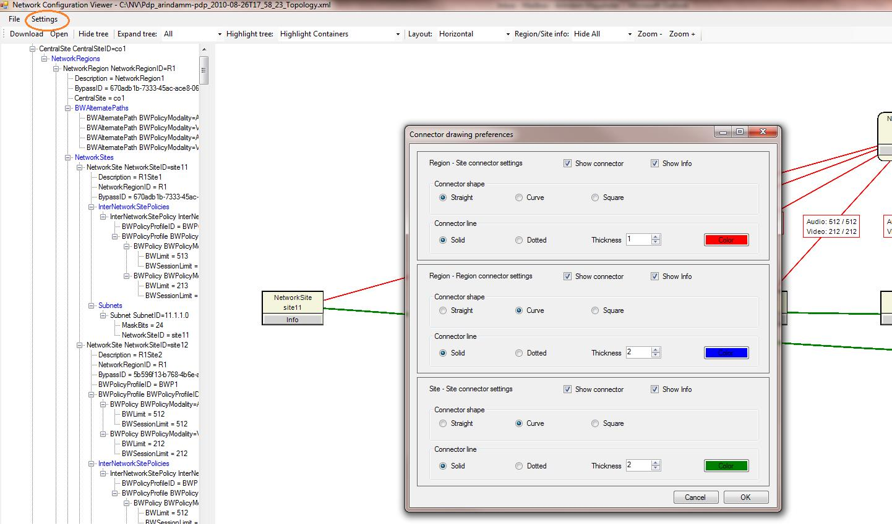

# <a name="skype-for-business-server-2015-resource-kit-tools-documentation"></a><span data-ttu-id="1d570-107">Документация по инструментам Skype для бизнеса Server 2015 Resource Kit</span><span class="sxs-lookup"><span data-stu-id="1d570-107">Skype for Business Server 2015 Resource Kit Tools Documentation</span></span>

<span data-ttu-id="1d570-108">В этой статье описаны инструменты в наборе ресурсов Skype для бизнеса Server 2015, в том числе назначение каждого из них, а также примеры его использования.</span><span class="sxs-lookup"><span data-stu-id="1d570-108">This topic describes the tools in the Skype for Business Server 2015 Resource Kit, including the purpose of each tool, and examples of its use.</span></span> <span data-ttu-id="1d570-109">Набор ресурсов Skype для бизнеса Server 2015 поможет вам упростить повседневные задачи для ИТ-администраторов, развертывающих Skype для бизнеса Server 2015 и управляющих ими.</span><span class="sxs-lookup"><span data-stu-id="1d570-109">The Skype for Business Server 2015 Resource Kit helps to make routine tasks easier for IT administrators who deploy and manage Skype for Business Server 2015.</span></span> <span data-ttu-id="1d570-110">Например, инструмент **Web Conf Data** упрощает управление данными, которые отправляют пользователи во время собрания по сети.</span><span class="sxs-lookup"><span data-stu-id="1d570-110">For example, the **Web Conf Data** tool can be used to easily control data that is uploaded by users during an online meeting.</span></span> <span data-ttu-id="1d570-111">А при помощи **SEFAUtil** можно настроить переадресацию звонков делегатам и ответ на них для пользователей.</span><span class="sxs-lookup"><span data-stu-id="1d570-111">The **SEFAUtil** tool can be used to set up delegate call forwarding and answering for users.</span></span> <span data-ttu-id="1d570-112">Мы рекомендуем ИТ-администраторам использовать эти средства для более эффективного управления Skype для бизнеса Server 2015.</span><span class="sxs-lookup"><span data-stu-id="1d570-112">We encourage IT administrators to use these tools to more effectively manage Skype for Business Server 2015.</span></span>

## <a name="installation-of-the-resource-kit-tools"></a><span data-ttu-id="1d570-113">Установка средств из набора ресурсов</span><span class="sxs-lookup"><span data-stu-id="1d570-113">Installation of the Resource Kit Tools</span></span>

<span data-ttu-id="1d570-114">Чтобы установить пакет ресурсов Skype для бизнеса Server 2015, скачайте [оксрескит. msi](https://www.microsoft.com/en-us/download/details.aspx?id=52631) из центра загрузки.</span><span class="sxs-lookup"><span data-stu-id="1d570-114">To install the Skype for Business Server 2015 Resource Kit, download [OCSReskit.msi](https://www.microsoft.com/en-us/download/details.aspx?id=52631) from the Download Center.</span></span>

<span data-ttu-id="1d570-p103">Чтобы выполнить простую установку, запустите файл **OCSResKit.msi**. MSI-файл установит все средства в следующую папку: **%Program Files%\Skype for Business Server 2015\ResKit**. Инструменты, представляющие собой автономные исполняемые файлы, находятся непосредственно в этой папке. Инструменты, имеющие дополнительные файлы, находятся в отдельных вложенных папках.</span><span class="sxs-lookup"><span data-stu-id="1d570-p103">Run **OCSResKit.msi** to do a simple installation. The .msi installs all the tools in the following path: **%Program Files%\Skype for Business Server 2015\ResKit**. Tools that are self-contained executables are in this folder. Tools that also have supporting files are in their own subfolders.</span></span>

## <a name="supported-environments"></a><span data-ttu-id="1d570-119">Поддерживаемые среды</span><span class="sxs-lookup"><span data-stu-id="1d570-119">Supported Environments</span></span>

<span data-ttu-id="1d570-120">Набор ресурсов для Skype для бизнеса Server 2015 должен быть установлен на сервере, который соответствует требованиям, необходимым для использования Skype для бизнеса Server 2015, обычно используется для запуска Skype для бизнеса Server 2015.</span><span class="sxs-lookup"><span data-stu-id="1d570-120">The Skype for Business Server 2015 Resource Kit should be installed on a server that meets the specifications required for Skype for Business Server 2015, usually one being used to run Skype for Business Server 2015.</span></span>

## <a name="resource-kit-tools-overview"></a><span data-ttu-id="1d570-121">Обзор средств из набора ресурсов</span><span class="sxs-lookup"><span data-stu-id="1d570-121">Resource Kit Tools Overview</span></span>

<span data-ttu-id="1d570-122">Ниже приведен список средств, указанных в наборе ресурсов для Skype для бизнеса Server 2015.</span><span class="sxs-lookup"><span data-stu-id="1d570-122">The following is a list of the tools that are provided in the Skype for Business Server 2015 Resource Kit.</span></span> <span data-ttu-id="1d570-123">Описание каждого средства, включая требования и примеры использования, можно найти в следующих разделах.</span><span class="sxs-lookup"><span data-stu-id="1d570-123">A description of each tool, including the requirements and example usage is covered in the following sections.</span></span>

- [<span data-ttu-id="1d570-124">ABSConfig</span><span class="sxs-lookup"><span data-stu-id="1d570-124">ABSConfig</span></span>](resource-kit-tools.md#ABSConfig)

- [<span data-ttu-id="1d570-125">Монитор службы политики пропускной способности</span><span class="sxs-lookup"><span data-stu-id="1d570-125">Bandwidth Policy Service Monitor</span></span>](resource-kit-tools.md#bpsm)

- [<span data-ttu-id="1d570-126">Анализатор использования полосы пропускания</span><span class="sxs-lookup"><span data-stu-id="1d570-126">Bandwidth Utilization Analyzer</span></span>](resource-kit-tools.md#bua)

- [<span data-ttu-id="1d570-127">Счетчик парковки вызовов</span><span class="sxs-lookup"><span data-stu-id="1d570-127">Call Parkometer</span></span>](resource-kit-tools.md#callpark)

- [<span data-ttu-id="1d570-128">DBAnalyze</span><span class="sxs-lookup"><span data-stu-id="1d570-128">DBAnalyze</span></span>](resource-kit-tools.md#dba)

- [<span data-ttu-id="1d570-129">Импорт данных службы хранилища</span><span class="sxs-lookup"><span data-stu-id="1d570-129">Import Storage Service Data</span></span>](resource-kit-tools.md#Issd)

- [<span data-ttu-id="1d570-130">LCSSync</span><span class="sxs-lookup"><span data-stu-id="1d570-130">LCSSync</span></span>](resource-kit-tools.md#LCSSync)

- [<span data-ttu-id="1d570-131">Консоль поиска пользователей</span><span class="sxs-lookup"><span data-stu-id="1d570-131">Lookup User Console</span></span>](resource-kit-tools.md#LUC)

- [<span data-ttu-id="1d570-132">MsTurnPing</span><span class="sxs-lookup"><span data-stu-id="1d570-132">MsTurnPing</span></span>](resource-kit-tools.md#MsTurnPing)

- [<span data-ttu-id="1d570-133">Средство просмотра конфигурации сети</span><span class="sxs-lookup"><span data-stu-id="1d570-133">Network Configuration Viewer</span></span>](resource-kit-tools.md#NCV)

- [<span data-ttu-id="1d570-134">Динамический агент группы ответа</span><span class="sxs-lookup"><span data-stu-id="1d570-134">Response Group Agent Live</span></span>](resource-kit-tools.md#RGAL)

- [<span data-ttu-id="1d570-135">SEFAUtil</span><span class="sxs-lookup"><span data-stu-id="1d570-135">SEFAUtil</span></span>](resource-kit-tools.md#SEFAUtil)

- [<span data-ttu-id="1d570-136">SYSPrep.ps1</span><span class="sxs-lookup"><span data-stu-id="1d570-136">SYSPrep.ps1</span></span>](resource-kit-tools.md#SYSPrep)

- [<span data-ttu-id="1d570-137">Перенос оповещений о неназначенных номерах</span><span class="sxs-lookup"><span data-stu-id="1d570-137">Unassigned Number Announcements Migration</span></span>](resource-kit-tools.md#UNAM)

- [<span data-ttu-id="1d570-138">Web Conf Data</span><span class="sxs-lookup"><span data-stu-id="1d570-138">Web Conf Data</span></span>](resource-kit-tools.md#WebConfData)

## <a name="absconfig"></a><span data-ttu-id="1d570-139">ABSConfig</span><span class="sxs-lookup"><span data-stu-id="1d570-139">ABSConfig</span></span>
<span data-ttu-id="1d570-140"><a name="ABSConfig"> </a></span><span class="sxs-lookup"><span data-stu-id="1d570-140"></span></span>

<span data-ttu-id="1d570-141">Средство настройки службы адресных книг (Абсконфиг) — это средство администрирования, которое помогает администраторам настраивать конфигурацию службы адресной книги в Skype для бизнеса Server 2015.</span><span class="sxs-lookup"><span data-stu-id="1d570-141">The Address Book Service Configuration tool (ABSConfig) is an administrative tool that helps administrators customize Address Book Service configuration in Skype for Business Server 2015.</span></span> <span data-ttu-id="1d570-142">Этот инструмент также позволяет администраторам Skype для бизнеса Server 2015 восстанавливать параметры службы адресной книги по умолчанию.</span><span class="sxs-lookup"><span data-stu-id="1d570-142">This tool also enables Skype for Business Server 2015 administrators to restore the default Address Book Service settings.</span></span>

### <a name="description"></a><span data-ttu-id="1d570-143">Описание</span><span class="sxs-lookup"><span data-stu-id="1d570-143">Description</span></span>

<span data-ttu-id="1d570-144">Абсконфиг — это графическое приложение пользовательского интерфейса, которое позволяет администраторам настраивать атрибуты доменных служб Active Directory, связанные с службой адресной книги.</span><span class="sxs-lookup"><span data-stu-id="1d570-144">ABSConfig is a graphical user interface application that enables administrators to configure Active Directory Domain Services attributes that are related to Address Book Service.</span></span>

<span data-ttu-id="1d570-145">Основные сценарии использования этого средства:</span><span class="sxs-lookup"><span data-stu-id="1d570-145">The primary scenarios for the tool are the following:</span></span>

- <span data-ttu-id="1d570-146">Чтобы разрешить администраторам сопоставлять атрибуты доменных служб Active Directory с атрибутами для Skype для бизнеса Server 2015.</span><span class="sxs-lookup"><span data-stu-id="1d570-146">To enable administrators to map attributes in Active Directory Domain Services to the attributes for Skype for Business Server 2015.</span></span>

- <span data-ttu-id="1d570-147">позволяет администраторам указывать, что атрибут доменных служб Active Directory должен быть включен в файлы службы адресной книги или исключен из них;</span><span class="sxs-lookup"><span data-stu-id="1d570-147">To enable administrators to specify the Active Directory Domain Services attribute to be included or excluded in the Address Book Service files.</span></span>

- <span data-ttu-id="1d570-148">позволяет администраторам восстанавливать параметры службы адресной книги по умолчанию.</span><span class="sxs-lookup"><span data-stu-id="1d570-148">To enable administrators to restore default Address Book Service settings.</span></span>

<span data-ttu-id="1d570-149">Средство ABSConfig можно запустить с помощью файла absConfig.exe.</span><span class="sxs-lookup"><span data-stu-id="1d570-149">The ABSConfig tool can be started by using the ABSConfig.exe file.</span></span> <span data-ttu-id="1d570-150">Это средство откроется на вкладке " **Настройка атрибутов** ". В этой таблице есть параметры сопоставления атрибутов доменных служб Active Directory полям атрибутов в Skype для бизнеса Server 2015 и указаны, какие пользователи должны включать или исключаться в файлах службы адресной книги на основе определенных фильтров атрибутов.</span><span class="sxs-lookup"><span data-stu-id="1d570-150">The tool opens to the **Configure Attributes** tab. This table has options to map Active Directory Domain Services attributes to the attribute fields for Skype for Business Server 2015 and to specify which users to include or exclude in Address Book Service files based on specific attribute filters.</span></span> <span data-ttu-id="1d570-151">Также можно настроить значение номера телефона, которое необходимо включить в файл адресной книги.</span><span class="sxs-lookup"><span data-stu-id="1d570-151">It also has options to customize which value of the phone number to be included in the Address Book file.</span></span> <span data-ttu-id="1d570-152">Кнопка **Восстановить значения по умолчанию** позволяет администраторам восстановить параметры службы адресной книги по умолчанию.</span><span class="sxs-lookup"><span data-stu-id="1d570-152">The **Restore Defaults** option enables administrators to restore Address Book Service settings to default values.</span></span>

> [!NOTE]
> <span data-ttu-id="1d570-153">Повторное сопоставление атрибутов рекламы с разными именами полей OC будет доступно только для скачивания файла адресной книги и не поддерживается веб-запросом адресной книги.</span><span class="sxs-lookup"><span data-stu-id="1d570-153">Re-mapping of AD attributes to different OC Field Names will only work for Address Book File Download, and is not supported by Address Book Web Query.</span></span>

### <a name="output"></a><span data-ttu-id="1d570-154">Выходные данные</span><span class="sxs-lookup"><span data-stu-id="1d570-154">Output</span></span>

<span data-ttu-id="1d570-155">Средство ABSConfig сохраняет конфигурацию службы адресной книги в базе данных.</span><span class="sxs-lookup"><span data-stu-id="1d570-155">ABSConfig stores the Address Book Service configuration in the database.</span></span>

```PowerShell
Path: %ProgramFiles%\Skype for Business Server 2015\Reskit
```

### <a name="purpose"></a><span data-ttu-id="1d570-156">Назначение</span><span class="sxs-lookup"><span data-stu-id="1d570-156">Purpose</span></span>

<span data-ttu-id="1d570-157">Абсконфиг предоставляет быстрый и простой способ настройки службы записной книжки Skype для бизнеса Server 2015.</span><span class="sxs-lookup"><span data-stu-id="1d570-157">ABSConfig provides a quick and easy way to customize Skype for Business Server 2015 Address Book Service.</span></span>

### <a name="requirements"></a><span data-ttu-id="1d570-158">Требования</span><span class="sxs-lookup"><span data-stu-id="1d570-158">Requirements</span></span>

#### <a name="computer"></a><span data-ttu-id="1d570-159">Компьютер</span><span class="sxs-lookup"><span data-stu-id="1d570-159">Computer</span></span>

<span data-ttu-id="1d570-160">Абсконфиг можно запускать только с компьютера, подключенного к домену, в котором установлен Skype для Business Server 2015.</span><span class="sxs-lookup"><span data-stu-id="1d570-160">ABSConfig can be run only from a domain-joined computer that has Skype for Business Server 2015 installed.</span></span> <span data-ttu-id="1d570-161">В случае использования Skype для бизнеса Server 2015, Enterprise Edition это средство может быть запущено на всех серверах переднего плана, на которых в процессе настройки включена служба адресной книги.</span><span class="sxs-lookup"><span data-stu-id="1d570-161">In the case of Skype for Business Server 2015, Enterprise Edition, this tool can be run on any Front End servers that have the Address Book Service enabled during setup.</span></span>

#### <a name="network"></a><span data-ttu-id="1d570-162">Сеть</span><span class="sxs-lookup"><span data-stu-id="1d570-162">Network</span></span>

<span data-ttu-id="1d570-163">Компьютер должен иметь возможность подключения к интерфейсному пулу и внутренней базе данных.</span><span class="sxs-lookup"><span data-stu-id="1d570-163">The computer should be able to connect to the Front End pool and back-end database.</span></span>

#### <a name="software"></a><span data-ttu-id="1d570-164">Программное обеспечение</span><span class="sxs-lookup"><span data-stu-id="1d570-164">Software</span></span>

<span data-ttu-id="1d570-165">Перед запуском средства ABSConfig необходимо установить перечисленные ниже программные компоненты.</span><span class="sxs-lookup"><span data-stu-id="1d570-165">The following software components must be installed before running the ABSConfig tool:</span></span>

- <span data-ttu-id="1d570-166">Skype для бизнеса Server 2015</span><span class="sxs-lookup"><span data-stu-id="1d570-166">Skype for Business Server 2015</span></span>

#### <a name="users"></a><span data-ttu-id="1d570-167">Пользователи</span><span class="sxs-lookup"><span data-stu-id="1d570-167">Users</span></span>

<span data-ttu-id="1d570-168">Администраторы, у которых есть разрешения, необходимые для обновления развертывания Skype для бизнеса Server 2015.</span><span class="sxs-lookup"><span data-stu-id="1d570-168">Administrators who have the permissions required to update the Skype for Business Server 2015 deployment.</span></span>

### <a name="examples"></a><span data-ttu-id="1d570-169">Примеры</span><span class="sxs-lookup"><span data-stu-id="1d570-169">Examples</span></span>

<span data-ttu-id="1d570-p108">Средство ABSConfig можно запустить, введя в командной строке команду **ABSConfig.exe**. Ниже показан пользовательский интерфейс средства ABSConfig.</span><span class="sxs-lookup"><span data-stu-id="1d570-p108">ABSConfig can be started by typing **ABSConfig.exe** at a command prompt. Shown below is the ABSConfig tool user interface.</span></span>


### <a name="summary"></a><span data-ttu-id="1d570-173">Заключение</span><span class="sxs-lookup"><span data-stu-id="1d570-173">Summary</span></span>

<span data-ttu-id="1d570-174">Средство Абсконфиг предоставляет администраторам простой и удобный инструмент для настройки службы адресной книги Skype для бизнеса Server 2015.</span><span class="sxs-lookup"><span data-stu-id="1d570-174">The ABSConfig tool provides administrators a quick and easy to use tool to customize Skype for Business Server 2015 Address Book Service.</span></span>

## <a name="bandwidth-policy-service-monitor"></a><span data-ttu-id="1d570-175">Монитор службы политики пропускной способности</span><span class="sxs-lookup"><span data-stu-id="1d570-175">Bandwidth Policy Service Monitor</span></span>
<span data-ttu-id="1d570-176"><a name="bpsm"> </a></span><span class="sxs-lookup"><span data-stu-id="1d570-176"></span></span>

<span data-ttu-id="1d570-177">Монитор службы политики пропускной способности позволяет администраторам просматривать следующие сведения:</span><span class="sxs-lookup"><span data-stu-id="1d570-177">The Bandwidth Policy Service Monitor tool is intended to allow administrators to view a list of the following:</span></span>

1. <span data-ttu-id="1d570-178">Все настроенные службы политики пропускной способности Skype для бизнеса Server 2015 (проверка подлинности и ядро) в топологии</span><span class="sxs-lookup"><span data-stu-id="1d570-178">All the configured Skype for Business Server 2015 Bandwidth Policy services (Authentication and Core) in the topology</span></span>

2. <span data-ttu-id="1d570-179">соединения, которые каждая служба устанавливает с другими службами политики пропускной способности и с пограничными серверами;</span><span class="sxs-lookup"><span data-stu-id="1d570-179">The connections that each service makes to other Bandwidth Policy services and to the Edge servers</span></span>

3. <span data-ttu-id="1d570-180">все каналы, настроенные в документе конфигурации сети, и сведения об использовании пропускной способности в реальном времени, сообщаемые каждой службой политики пропускной способности.</span><span class="sxs-lookup"><span data-stu-id="1d570-180">All the links that are configured in the Network configuration document and real-time bandwidth usage as reported by each of the Bandwidth Policy services</span></span>

### <a name="description"></a><span data-ttu-id="1d570-181">Описание</span><span class="sxs-lookup"><span data-stu-id="1d570-181">Description</span></span>

<span data-ttu-id="1d570-p109">Монитор службы политики пропускной способности реализован в виде приложения с графическим пользовательским интерфейсом. Чтобы запустить средство, администраторам необходимо выполнить файл PDPMonUI.exe.</span><span class="sxs-lookup"><span data-stu-id="1d570-p109">The Bandwidth Policy Service Monitor tool is implemented as a GUI-based application. Administrators start the tool by running PDPMonUI.exe.</span></span>

<span data-ttu-id="1d570-p110">При запуске средства оно пытается обнаружить все службы политики пропускной способности в топологии. После начального обновления данных область в левой части окна заполняется списком служб, сгруппированным по кластерам, к которым они относятся.</span><span class="sxs-lookup"><span data-stu-id="1d570-p110">When the tool starts, it attempts to discover the list of Bandwidth Policy services in the topology. After the initial update is done, the pane to the left of the window is populated with a list of services that are grouped by the clusters that they belong to.</span></span>

<span data-ttu-id="1d570-p111">Когда администратор выбирает определенную службу политики пропускной способности, в области справа выводятся сведения о ней. Эта область имеет две основные вкладки.</span><span class="sxs-lookup"><span data-stu-id="1d570-p111">When administrators select a particular Bandwidth Policy Service, the pane on the right displays the information about that particular service. That pane also has two main tabs that display information.</span></span>

#### <a name="machine-info-tab"></a><span data-ttu-id="1d570-188">Вкладка Machine Info</span><span class="sxs-lookup"><span data-stu-id="1d570-188">Machine Info Tab</span></span>

<span data-ttu-id="1d570-189">На вкладке **Machine Info** (Сведения о компьютере) выводятся подробные сведения о выбранной службе политики пропускной способности, а также список соединений, установленных этой службой с другими службами, и их состояний.</span><span class="sxs-lookup"><span data-stu-id="1d570-189">The **Machine Info** tab shows the details of the Bandwidth Policy Service that is selected and the list and state of all the connections that are made by the selected Bandwidth Policy Service to other services.</span></span>

#### <a name="topology-info-tab"></a><span data-ttu-id="1d570-190">Вкладка Topology Info</span><span class="sxs-lookup"><span data-stu-id="1d570-190">Topology Info Tab</span></span>

<span data-ttu-id="1d570-p112">На вкладке **Topology Info** (Сведения о топологии) показан список всех каналов, настроенных в параметрах конфигурации сети. Для каждого канала показана пропускная способность звука и видео. Кроме того, показана текущая используемая пропускная способность в Кбит/с и в процентах от общей пропускной способности. Для выделения каналов, пропускная способность которых используется почти максимально, в средстве применяется цветовая кодировка. Это позволяет администраторам быстро определять такие каналы.</span><span class="sxs-lookup"><span data-stu-id="1d570-p112">The **Topology Info** tab shows a list of all the links that are configured in the Network configuration settings. For each link, the audio and video bandwidth capacity is displayed. Additionally, the currently utilized bandwidth is displayed, both in Kbps and as a percentage of the capacity. The tool uses color-coding to highlight links that have utilization that is close to the capacity—this allows administrators to quickly isolate such links.</span></span>

> [!NOTE]
>  <span data-ttu-id="1d570-195">Если при подключении к какой – либо из настроенных служб политики пропускной способности монитор пропускной способности проошел сбой, информация на вкладке сведения о **компьютере** и **сведения о топологии** не будут заполнены.</span><span class="sxs-lookup"><span data-stu-id="1d570-195">If the Bandwidth Policy Service Monitor tool experiences failure when it connects to any of the configured Bandwidth Policy services, the information in the **Machine Info** and the **Topology Info** tabs won't be populated.</span></span> <span data-ttu-id="1d570-196">Однако также возможна ситуация, когда средству изначально удается подключиться к службе, но затем это соединение оказывается разорванным.</span><span class="sxs-lookup"><span data-stu-id="1d570-196">However, it is possible that the tool might connect initially but subsequently lose its connection to the service.</span></span> <span data-ttu-id="1d570-197">В таких случаях администраторы будут видеть устаревшие данные.</span><span class="sxs-lookup"><span data-stu-id="1d570-197">In such cases, administrators might see outdated information.</span></span> <span data-ttu-id="1d570-198">На каждой вкладке есть метка времени **Last Updated** (Последнее обновление), с помощью которой администраторы могут узнать, когда в последний раз обновлялись данные для определенной службы политики пропускной способности.</span><span class="sxs-lookup"><span data-stu-id="1d570-198">There is a **Last Updated** time stamp on each of the tabs that can allow administrators to see when the data was last updated for a particular Bandwidth Policy Service.</span></span>

### <a name="output"></a><span data-ttu-id="1d570-199">Выходные данные</span><span class="sxs-lookup"><span data-stu-id="1d570-199">Output</span></span>

<span data-ttu-id="1d570-200">Вывод данных через командную строку не используется. Данные программы выводятся в основном графическом интерфейсе пользователя.</span><span class="sxs-lookup"><span data-stu-id="1d570-200">There is no command-line output; the program output is contained within the main graphical user interface (GUI).</span></span>

### <a name="purpose"></a><span data-ttu-id="1d570-201">Назначение</span><span class="sxs-lookup"><span data-stu-id="1d570-201">Purpose</span></span>

<span data-ttu-id="1d570-p114">Монитор службы политики пропускной способности позволяет администраторам просматривать состояние каждой службы политики пропускной способности, определенной в топологии. Кроме того, администраторы могут просматривать сведения об использовании пропускной способности в реальном времени для всех каналов, определенных в документе конфигурации сети.</span><span class="sxs-lookup"><span data-stu-id="1d570-p114">The purpose of the Bandwidth Policy Service Monitor tool is to allow administrators visibility into the state of each of the Bandwidth Policy services that are defined in the topology. In addition, administrators can see real-time bandwidth usage for all the links that are defined in the Network configuration document.</span></span>

### <a name="requirements"></a><span data-ttu-id="1d570-204">Требования</span><span class="sxs-lookup"><span data-stu-id="1d570-204">Requirements</span></span>

<span data-ttu-id="1d570-205">Средство наблюдения за работой политики пропускной способности необходимо запускать на компьютере, входящем в топологию сервера Skype для бизнеса.</span><span class="sxs-lookup"><span data-stu-id="1d570-205">The Bandwidth Policy Service Monitor tool needs to be run on a computer that is part of the Skype for Business Server topology.</span></span>

### <a name="summary"></a><span data-ttu-id="1d570-206">Сводка</span><span class="sxs-lookup"><span data-stu-id="1d570-206">Summary</span></span>

<span data-ttu-id="1d570-207">Монитор службы пропускной способности может быть ценным ресурсом для администраторов, позволяя им наблюдать за состоянием всех служб политики пропускной способности в топологии и, что еще более важно, получать сведения об использовании пропускной способности в реальном времени для каналов, определенных в параметрах конфигурации сети.</span><span class="sxs-lookup"><span data-stu-id="1d570-207">The Bandwidth Policy Service Monitor tool can be a valuable resource to administrators so they can inspect the state of all the Bandwidth Policy services in the topology—and more importantly—they can obtain real-time bandwidth utilization for the links that are defined in the Network configuration settings.</span></span>

## <a name="bandwidth-utilization-analyzer"></a><span data-ttu-id="1d570-208">Анализатор использования полосы пропускания</span><span class="sxs-lookup"><span data-stu-id="1d570-208">Bandwidth Utilization Analyzer</span></span>
<span data-ttu-id="1d570-209"><a name="bua"> </a></span><span class="sxs-lookup"><span data-stu-id="1d570-209"></span></span>

<span data-ttu-id="1d570-p115">Анализатор использования полосы пропускания — это средство, которое создает отчеты о различных аспектах использования полосы пропускания каналов глобальной сети конечными точками объединенных коммуникаций в корпоративной сети. Эти отчеты можно использовать для анализа текущей схемы использования полосы пропускания, а также при планировании емкости полосы пропускания.</span><span class="sxs-lookup"><span data-stu-id="1d570-p115">Bandwidth Utilization Analyzer is a tool that creates reports about various views of bandwidth consumption by the UC endpoints across WAN links in the enterprise network. These reports can be used to understand the current bandwidth consumption pattern and to aid in bandwidth capacity planning.</span></span>

### <a name="description"></a><span data-ttu-id="1d570-212">Описание</span><span class="sxs-lookup"><span data-stu-id="1d570-212">Description</span></span>

<span data-ttu-id="1d570-p116">Анализатор использования полосы пропускания реализован в виде приложения с графическим пользовательским интерфейсом. Это средство создает отчеты об использовании полосы пропускания аудиоданных в сети и помогает при планировании ресурсов. Оно также позволяет просматривать полосу пропускания, назначенную различным каналам.</span><span class="sxs-lookup"><span data-stu-id="1d570-p116">Bandwidth Utilization Analyzer is implemented as a GUI-based application. This tool generates reports specifically for audio utilization across the network and helps with capacity planning. It also iterates on the bandwidth capacity that is assigned to various links.</span></span>

### <a name="output"></a><span data-ttu-id="1d570-216">Выходные данные</span><span class="sxs-lookup"><span data-stu-id="1d570-216">Output</span></span>

<span data-ttu-id="1d570-217">Анализатор использования пропускной способности предоставляет графическое изображение полосы пропускания аудиоданных и степени ее использования для всех каналов глобальной сети, настроенных в системе.</span><span class="sxs-lookup"><span data-stu-id="1d570-217">Bandwidth Utilization Analyzer provides graphic al plots of bandwidth capacity and utilization for audio for all the WAN links that are configured in the system.</span></span>

### <a name="purpose"></a><span data-ttu-id="1d570-218">Назначение</span><span class="sxs-lookup"><span data-stu-id="1d570-218">Purpose</span></span>

<span data-ttu-id="1d570-219">При любом развертывании голосовых и видеофайлов важно следить за тем, как использование пропускной способности пропускания трафика мультимедиа в корпоративной сети.</span><span class="sxs-lookup"><span data-stu-id="1d570-219">In any voice and video deployment, it's critical to monitor and understand the trend of bandwidth utilization of media traffic across the enterprise network.</span></span> <span data-ttu-id="1d570-220">Анализатор использования полосы пропускания позволяет администраторам решать эту задачу.</span><span class="sxs-lookup"><span data-stu-id="1d570-220">The Bandwidth Utilization Analyzer tool allows an administrator to achieve just that.</span></span> <span data-ttu-id="1d570-221">Это средство предоставляет следующие возможности:</span><span class="sxs-lookup"><span data-stu-id="1d570-221">This tool does the following:</span></span>

- <span data-ttu-id="1d570-222">создает отчеты по использованию звуковых каналов в сети;</span><span class="sxs-lookup"><span data-stu-id="1d570-222">Generates specific reports for audio utilization across the network</span></span>

- <span data-ttu-id="1d570-223">позволяет более эффективно планировать емкость и распределять полосы пропускания, назначенные различным каналам.</span><span class="sxs-lookup"><span data-stu-id="1d570-223">Helps with more effective capacity planning and iteration on the bandwidth capacity that is assigned to various links</span></span>

<span data-ttu-id="1d570-224">Анализатор пропускной способности позволяет создавать следующие графические отчеты о полосе пропускания и степени ее загрузки:</span><span class="sxs-lookup"><span data-stu-id="1d570-224">Bandwidth Utilization Analyzer can generate graphical plots of bandwidth capacity and utilization reports; they are as follows:</span></span>

- <span data-ttu-id="1d570-225">для всех каналов глобальной сети в корпоративной сети;</span><span class="sxs-lookup"><span data-stu-id="1d570-225">All the WAN links in the enterprise network</span></span>

- <span data-ttu-id="1d570-226">для выбранных каналов глобальной сети;</span><span class="sxs-lookup"><span data-stu-id="1d570-226">Filtered by selected WAN links that have been chosen</span></span>

- <span data-ttu-id="1d570-227">для каналов глобальной сети, емкость которых превышена;</span><span class="sxs-lookup"><span data-stu-id="1d570-227">Filtered by WAN links that have exceeded link capacity</span></span>

- <span data-ttu-id="1d570-228">для каналов глобальной сети, полоса пропускания которых используется недостаточно;</span><span class="sxs-lookup"><span data-stu-id="1d570-228">Filtered by WAN links that have been under-utilizing the provisioned bandwidth</span></span>

- <span data-ttu-id="1d570-229">для каналов глобальной сети, использование которых достигает критического уровня (то есть превышает 90 % полосы пропускания канала глобальной сети);</span><span class="sxs-lookup"><span data-stu-id="1d570-229">Filter by WAN links that have been reaching critical levels (a bandwidth utilization that is greater than 90% of bandwidth capacity of the WAN link)</span></span>

- <span data-ttu-id="1d570-230">для каналов глобальной сети, отфильтрованных по типу: каналы между сетевыми сайтами, каналы между областями и каналы внутри сайта;</span><span class="sxs-lookup"><span data-stu-id="1d570-230">Filtered by WAN link type—network-site links, interregional links, and links within a site</span></span>

- <span data-ttu-id="1d570-231">с фильтрацией по области сети.</span><span class="sxs-lookup"><span data-stu-id="1d570-231">Filtered by network region</span></span>

#### <a name="applications"></a><span data-ttu-id="1d570-232">Приложения</span><span class="sxs-lookup"><span data-stu-id="1d570-232">Applications</span></span>

<span data-ttu-id="1d570-233">Анализатор использования полосы пропускания включает следующие два приложения (средства).</span><span class="sxs-lookup"><span data-stu-id="1d570-233">Bandwidth Utilization Analyzer has the following two applications (tools):</span></span>

- <span data-ttu-id="1d570-234">**Ванлинклогколлектор. exe** это средство позволяет пользователю вводить необходимые сведения.</span><span class="sxs-lookup"><span data-stu-id="1d570-234">**WanLinkLogCollector.exe** This tool enables its user to input the required information.</span></span>

- <span data-ttu-id="1d570-235">**Бандвидсутилизатионанализер. xlsm.** отчет по электронной таблице Microsoft Excel автоматически запускается программой ванлинклогколлектор. exe.</span><span class="sxs-lookup"><span data-stu-id="1d570-235">**BandwidthUtilizationAnalyzer.xlsm** A Microsoft Excel spreadsheet software report is automatically launched by WanLinkLogCollector.exe.</span></span> <span data-ttu-id="1d570-236">Это приложение позволяет пользователю применять фильтры к отчету, как описывается далее в этой статье.</span><span class="sxs-lookup"><span data-stu-id="1d570-236">This application allows the user to apply filters to the report as shown later in this article.</span></span>

#### <a name="phases-of-using-bandwidth-utilization-analyzer"></a><span data-ttu-id="1d570-237">Этапы работы с анализатором использования полосы пропускания</span><span class="sxs-lookup"><span data-stu-id="1d570-237">Phases of Using Bandwidth Utilization Analyzer</span></span>

<span data-ttu-id="1d570-238">Работа с анализатором использования пропускной способности состоит из двух этапов:</span><span class="sxs-lookup"><span data-stu-id="1d570-238">There are two phases when using Bandwidth Utilization Analyzer:</span></span>

- <span data-ttu-id="1d570-239">сбор журналов, выполняемый с помощью программы WanLinkLogCollector.exe;</span><span class="sxs-lookup"><span data-stu-id="1d570-239">Collect logs, which is performed by using WanLinkLogCollector.exe</span></span>

- <span data-ttu-id="1d570-240">настройка отчетов, выполняемая с помощью электронной таблицы BandwidthUtilizationAnalyzer.xlsm.</span><span class="sxs-lookup"><span data-stu-id="1d570-240">Customize reports, which is performed by using BandwidthUtilizationAnalyzer.xlsm</span></span>

> [!IMPORTANT]
> <span data-ttu-id="1d570-241">Мы настоятельно рекомендуем конечным пользователям не запускать электронную таблицу BandwidthUtilizationAnalyzer.xlsm вручную.</span><span class="sxs-lookup"><span data-stu-id="1d570-241">We strongly recommend that BandwidthUtilizationAnalyzer.xlsm not be manually launched by end users.</span></span>

#### <a name="starting-bandwidth-utilization-analyzer"></a><span data-ttu-id="1d570-242">Запуск анализатора использования полосы пропускания</span><span class="sxs-lookup"><span data-stu-id="1d570-242">Starting Bandwidth Utilization Analyzer</span></span>

<span data-ttu-id="1d570-243">Запустите файл WanLinkLogCollector.exe с помощью командной строки или проводника.</span><span class="sxs-lookup"><span data-stu-id="1d570-243">Start WanLinkLogCollector.exe at the command prompt or by using Windows Explorer.</span></span>

 <span data-ttu-id="1d570-244">**Использование программы WanLinkLogCollector.exe**</span><span class="sxs-lookup"><span data-stu-id="1d570-244">**Using WanLinkLogCollector.exe**</span></span>

<span data-ttu-id="1d570-245">Использование программы WanLinkLogCollector.exe включает три этапа.</span><span class="sxs-lookup"><span data-stu-id="1d570-245">There are three steps to using WanLinkLogCollector.exe:</span></span>

1. <span data-ttu-id="1d570-246">**Ведение журнала временной шкалы** Укажите временную шкалу, для которой требуется создать отчет</span><span class="sxs-lookup"><span data-stu-id="1d570-246">**Log the timeline** Provide the timeline that the report needs to be generated for</span></span>

2. <span data-ttu-id="1d570-247">**Указание каталогов файлов** Предоставление сведений о расположении файла</span><span class="sxs-lookup"><span data-stu-id="1d570-247">**Specify the file directories** Provide file location information</span></span>

3. <span data-ttu-id="1d570-248">**Сбор журналов и запуск средства просмотра отчетов** Выполнение команды для создания отчета</span><span class="sxs-lookup"><span data-stu-id="1d570-248">**Collect the logs and launch the report viewer** Execute the command to generate the report</span></span>

#### <a name="step-1---log-the-timeline"></a><span data-ttu-id="1d570-249">Этап 1. Регистрация временной шкалы</span><span class="sxs-lookup"><span data-stu-id="1d570-249">Step 1 - Log the timeline</span></span>

<span data-ttu-id="1d570-250">Регистрация временной шкалы позволяет пользователю средства указать следующие сведения, как показано на рисунке ниже. </span><span class="sxs-lookup"><span data-stu-id="1d570-250">Logging the timeline allows the tool user to specify the following as shown in the figure below.</span></span>

1. <span data-ttu-id="1d570-251">**Дата начала**. Это начальная дата временной шкалы, для которой нужно создать отчет, например 1 августа 2010 г.</span><span class="sxs-lookup"><span data-stu-id="1d570-251">**Start date** This is the start date of the timeline that the report is to be generated for; for example, August 1, 2010.</span></span>

2. <span data-ttu-id="1d570-252">**Дата окончания**. Это конечная дата временной шкалы, для которой нужно создать отчет, например 30 сентября 2010 г.</span><span class="sxs-lookup"><span data-stu-id="1d570-252">**End date** This is the end date of the timeline that the report is to be generated for; for example, September 30, 2010.</span></span>

     

#### <a name="step-2---specify-the-file-directories"></a><span data-ttu-id="1d570-254">Этап 2. Указание каталогов файлов</span><span class="sxs-lookup"><span data-stu-id="1d570-254">Step 2 - Specify the file directories</span></span>

<span data-ttu-id="1d570-255">Пользователь может указать следующие каталоги файлов, как показано на рисунке.</span><span class="sxs-lookup"><span data-stu-id="1d570-255">The following file directories can be specified by the user as shown.</span></span>

- <span data-ttu-id="1d570-256">**Расположение файлов журнала сервера** Расположение папки, в которой хранятся журналы сервера политики пропускной способности.</span><span class="sxs-lookup"><span data-stu-id="1d570-256">**Server log files location** The folder location where Bandwidth policy server logs are stored.</span></span> <span data-ttu-id="1d570-257">\<Обычно филесервер\> \\<выбора \аппсерверфилес\пдп. на Fe\></span><span class="sxs-lookup"><span data-stu-id="1d570-257">This is typically in \<fileserver\>\\<choice of FE\>\AppServerFiles\PDP.</span></span>

- <span data-ttu-id="1d570-258">**Место хранения временных файлов** Временное расположение файлов, в котором хранятся промежуточные файлы, при создании отчета.</span><span class="sxs-lookup"><span data-stu-id="1d570-258">**Temporary file storage location** The temporary file location where intermediate files are stored while the report is being generated.</span></span>


> [!NOTE]
> <span data-ttu-id="1d570-260">Пользователю средства необходимо предоставить достаточные права на доступ к файлам журналов сервера и папке хранения временных файлов.</span><span class="sxs-lookup"><span data-stu-id="1d570-260">Ensure that sufficient file access to the server logs and the temporary file store folder is provided to the tool user.</span></span>

#### <a name="step-3---collect-the-logs-and-start-the-report-viewer"></a><span data-ttu-id="1d570-261">Этап 3. Сбор журналов и запуск средства просмотра отчетов</span><span class="sxs-lookup"><span data-stu-id="1d570-261">Step 3 - Collect the logs and start the report viewer</span></span>

<span data-ttu-id="1d570-p120">Чтобы выполнить сбор журналов и запустить средство просмотра отчетов, нажмите кнопку **Execute** (Выполнить), как показано ниже. На этом этапе собираются необходимые данные.</span><span class="sxs-lookup"><span data-stu-id="1d570-p120">To collect the logs and start the report viewer, click **Execute** as shown below. This step collects the required data.</span></span>


<span data-ttu-id="1d570-265">Если проверка входных данных прошла успешно, выводится показанное ниже сообщение.</span><span class="sxs-lookup"><span data-stu-id="1d570-265">When the input validation is successful, the message shown below is displayed.</span></span>


<span data-ttu-id="1d570-p121">Нажмите кнопку **ОК**. Автоматически откроется электронная таблица BandwidthUtilizationAnalyzer.xlsm. Следуйте инструкциям в окне сообщения. Подробные сведения см. в следующем разделе, **Использование таблицы BandwidthUtilizationAnalyzer.xlsm**.</span><span class="sxs-lookup"><span data-stu-id="1d570-p121">Click **OK**. BandwidthUtilizationAnalyzer.xlsm is automatically started. Follow the instructions in the message box. For details, see **Using BandwidthUtilizationAnalyzer.xlsm** in the next section.</span></span>


### <a name="using-bandwidthutilizationanalyzerxlsm"></a><span data-ttu-id="1d570-271">Использование таблицы BandwidthUtilizationAnalyzer.xlsm</span><span class="sxs-lookup"><span data-stu-id="1d570-271">Using BandwidthUtilizationAnalyzer.xlsm</span></span>

1. <span data-ttu-id="1d570-272">Когда таблица BandwidthUtilizationAnalyzer.xlsm автоматически откроется, нажмите кнопку **Refresh** (Обновить), как показано ниже.</span><span class="sxs-lookup"><span data-stu-id="1d570-272">When BandwidthUtilizationAnalyzer.xlsm is automatically started, click **Refresh** as shown below.</span></span>

     

2. <span data-ttu-id="1d570-p122">Когда откроется папка с файлами, выберите файл consolidated.csv в папке, указанной в окне сообщения, как показано ниже. Папка будет указана как **C:\Temp**.</span><span class="sxs-lookup"><span data-stu-id="1d570-p122">When a file folder is opened, select consolidated.csv from the location that is specified in the message box as shown below. It also shows the location as **C:\Temp**.</span></span>

     

3. <span data-ttu-id="1d570-277">Нажмите кнопку **Import** (Импорт).</span><span class="sxs-lookup"><span data-stu-id="1d570-277">Click **Import**.</span></span>

4. <span data-ttu-id="1d570-p123">Графический отчет будет создан автоматически. Он станет доступен, когда исчезнет указатель выполнения операции в фоновом режиме.</span><span class="sxs-lookup"><span data-stu-id="1d570-p123">The graphical plot is automatically generated. It is available when the working-in-the-background pointer disappears.</span></span>

     

#### <a name="applying-filters-to-the-report-view"></a><span data-ttu-id="1d570-281">Применение фильтров к представлению отчета</span><span class="sxs-lookup"><span data-stu-id="1d570-281">Applying Filters to the Report View</span></span>

<span data-ttu-id="1d570-282">Далее описываются фильтры, которые можно применить к представлению отчета и которые показаны ниже.</span><span class="sxs-lookup"><span data-stu-id="1d570-282">The filters that can be applied to the report view as shown below are described as follows:</span></span>


1. <span data-ttu-id="1d570-284">**Name** (Имя). Фильтрация по каналам глобальной сети (фильтр находится в правой части графика). Префикс означает следующие типы каналов (см. вертикальное (синее) поле):</span><span class="sxs-lookup"><span data-stu-id="1d570-284">**Name** Filter by WAN links (the filter is on the right side of the graph).The prefix denotes the following link types; see the vertical (blue) box:</span></span>

   - <span data-ttu-id="1d570-285">**S (Site)** — канал глобальной сети между сетевым сайтом и областью сети;</span><span class="sxs-lookup"><span data-stu-id="1d570-285">**S Site** The WAN link from a network site to a network region</span></span>

   - <span data-ttu-id="1d570-286">**IS (Inter-Site)** — канал глобальной сети между двумя сетевыми сайтами;</span><span class="sxs-lookup"><span data-stu-id="1d570-286">**IS Inter-Site** The WAN link between two network sites</span></span>

   - <span data-ttu-id="1d570-287">**R (Inter-Region)** — канал глобальной сети между двумя областями сети.</span><span class="sxs-lookup"><span data-stu-id="1d570-287">**R Inter-Region** The WAN link between two network region</span></span>

2. <span data-ttu-id="1d570-288">**Exceeded limit** (Превышение предела). Фильтрация каналов глобальной сети, использование полосы пропускания которых превышает доступные ресурсы.</span><span class="sxs-lookup"><span data-stu-id="1d570-288">**Exceeded limit** Filter by WAN links whose bandwidth utilization is more than the bandwidth capacity</span></span>

3. <span data-ttu-id="1d570-289">**Critical levels** (Критические уровни). Фильтрация каналов глобальной сети, использование полосы пропускания которых достигло 90 % или более от максимального значения.</span><span class="sxs-lookup"><span data-stu-id="1d570-289">**Critical levels** Filter by WAN links whose bandwidth utilization has reached 90% or more than the bandwidth capacity</span></span>

4. <span data-ttu-id="1d570-290">**Under-utilized** (Недостаточное использование). Фильтрация каналов глобальной сети, использование полосы пропускания которых составляет менее 25 % от максимального.</span><span class="sxs-lookup"><span data-stu-id="1d570-290">**Under-utilized** Filter by WAN links whose bandwidth utilization has been less than 25% of the bandwidth capacity</span></span>

5. <span data-ttu-id="1d570-291">**Link type** (Тип канала). Фильтрация по следующим типам каналов глобальной сети:</span><span class="sxs-lookup"><span data-stu-id="1d570-291">**Link type** Filter by the following WAN links types:</span></span>

   - <span data-ttu-id="1d570-292">**Network site** (Сетевой сайт);</span><span class="sxs-lookup"><span data-stu-id="1d570-292">**Network site** type</span></span>

   - <span data-ttu-id="1d570-293">**Inter-site** (Между сайтами);</span><span class="sxs-lookup"><span data-stu-id="1d570-293">**Inter-site** type</span></span>

   - <span data-ttu-id="1d570-294">**Inter-Region link**(Канал между областями).</span><span class="sxs-lookup"><span data-stu-id="1d570-294">**Inter-Region link** type</span></span>

6. <span data-ttu-id="1d570-295">**Region** (Область). Фильтрация по области сети.</span><span class="sxs-lookup"><span data-stu-id="1d570-295">**Region** Filter by network region</span></span>

<span data-ttu-id="1d570-296">На следующих рисунках показаны ранее описанные фильтры.</span><span class="sxs-lookup"><span data-stu-id="1d570-296">The following figures show the previously described filters.</span></span>

<span data-ttu-id="1d570-p124">Примените фильтр **Name**. Выберите список каналов, которые нужно показать на графике.</span><span class="sxs-lookup"><span data-stu-id="1d570-p124">Filter by **Name**. Select the list of links that need to be displayed in the graph.</span></span>


<span data-ttu-id="1d570-300">Примените фильтр **Exceeded limit**.</span><span class="sxs-lookup"><span data-stu-id="1d570-300">Filter by **Exceeded limit**.</span></span> <span data-ttu-id="1d570-301">Установите флажок **True**, чтобы применить фильтр.</span><span class="sxs-lookup"><span data-stu-id="1d570-301">Select **True** to enforce the filter.</span></span>


<span data-ttu-id="1d570-303">Примените фильтр **Critical levels**.</span><span class="sxs-lookup"><span data-stu-id="1d570-303">Filter by **Critical levels**.</span></span> <span data-ttu-id="1d570-304">Установите флажок **True**, чтобы применить фильтр.</span><span class="sxs-lookup"><span data-stu-id="1d570-304">Select **True** to enforce the filter.</span></span>


<span data-ttu-id="1d570-306">Примените фильтр **Under utilized**.</span><span class="sxs-lookup"><span data-stu-id="1d570-306">Filter by **Under utilized**.</span></span> <span data-ttu-id="1d570-307">Установите флажок **True**, чтобы применить фильтр.</span><span class="sxs-lookup"><span data-stu-id="1d570-307">Select **True** to enforce the filter.</span></span>


<span data-ttu-id="1d570-309">Примените фильтр **Link Type**.</span><span class="sxs-lookup"><span data-stu-id="1d570-309">Filter by **Link Type**.</span></span> <span data-ttu-id="1d570-310">Выберите один или несколько типов каналов, которые нужно показать.</span><span class="sxs-lookup"><span data-stu-id="1d570-310">Select the type or types that need to be displayed.</span></span>


<span data-ttu-id="1d570-312">Примените фильтр **Region**.</span><span class="sxs-lookup"><span data-stu-id="1d570-312">Filter by **Region**.</span></span> <span data-ttu-id="1d570-313">Выберите список областей, каналы которых нужно показать.</span><span class="sxs-lookup"><span data-stu-id="1d570-313">Select a list of regions whose links need to be displayed.</span></span>


### <a name="requirements"></a><span data-ttu-id="1d570-315">Требования</span><span class="sxs-lookup"><span data-stu-id="1d570-315">Requirements</span></span>

- <span data-ttu-id="1d570-316">Платформа .NET Framework 3.5</span><span class="sxs-lookup"><span data-stu-id="1d570-316">The .NET Framework 3.5</span></span>

- <span data-ttu-id="1d570-317">Microsoft Excel 2010 или Excel 2007</span><span class="sxs-lookup"><span data-stu-id="1d570-317">Microsoft Excel 2010 or Excel 2007</span></span>

### <a name="summary"></a><span data-ttu-id="1d570-318">Сводка</span><span class="sxs-lookup"><span data-stu-id="1d570-318">Summary</span></span>

<span data-ttu-id="1d570-p130">Анализатор использования полосы пропускания предназначен для графического представления данных об использовании полосы пропускания звуковых каналов для трафика объединенных коммуникаций в сети. Это средство также можно использовать для создания отчетов об использовании полосы пропускания видеоканалов в сети.</span><span class="sxs-lookup"><span data-stu-id="1d570-p130">Bandwidth Utilization Analyzer is used to plot the audio bandwidth utilization for UC traffic across the network. This tool can be used to report the utilization of video bandwidth on the network as well.</span></span>

## <a name="call-parkometer"></a><span data-ttu-id="1d570-321">Счетчик парковки вызовов</span><span class="sxs-lookup"><span data-stu-id="1d570-321">Call Parkometer</span></span>
<span data-ttu-id="1d570-322"><a name="callpark"> </a></span><span class="sxs-lookup"><span data-stu-id="1d570-322"></span></span>

<span data-ttu-id="1d570-323">Счетчик парковки вызовов — это программа командной строки, облегчающая доступ к базе данных орбиты парковки вызовов.</span><span class="sxs-lookup"><span data-stu-id="1d570-323">Call Parkometer is a command-line application that provides easy access to the Call Park orbit database.</span></span>

### <a name="description"></a><span data-ttu-id="1d570-324">Описание</span><span class="sxs-lookup"><span data-stu-id="1d570-324">Description</span></span>

<span data-ttu-id="1d570-325">Счетчик парковки вызовов — это средство для отслеживания вызовов, находящихся в состоянии парковки на данный момент.</span><span class="sxs-lookup"><span data-stu-id="1d570-325">Call Parkometer is a tool to track currently parked calls.</span></span> <span data-ttu-id="1d570-326">Оно также собирает статистику по орбитам и использованию сервера парковки вызовов (CPS).</span><span class="sxs-lookup"><span data-stu-id="1d570-326">It also collects statistics about orbits and Call Park Server (CPS) usage.</span></span> <span data-ttu-id="1d570-327">Это средство командной строки предоставляет доступ для чтения и записи к базе данных SQL Server орбиты на локальном или удаленном компьютере.</span><span class="sxs-lookup"><span data-stu-id="1d570-327">This command-line tool provides both read and write-access to the CPS orbit SQL Server database from a local or remotely connected computer.</span></span>

<span data-ttu-id="1d570-328">Все параметры являются взаимоисключающими.</span><span class="sxs-lookup"><span data-stu-id="1d570-328">All options are mutually exclusive.</span></span> <span data-ttu-id="1d570-329">Синтаксис командной строки имеет следующий вид:</span><span class="sxs-lookup"><span data-stu-id="1d570-329">Command-line syntax is as follows:</span></span>

- <span data-ttu-id="1d570-330">**-o** параметр — список всех диапазонов орбиты, настроенных для этого пула.</span><span class="sxs-lookup"><span data-stu-id="1d570-330">**-o** parameter—lists all orbit ranges configured for this pool.</span></span>

- <span data-ttu-id="1d570-331">параметр **-n** — список всех используемых в настоящее время орбиток в этом пуле.</span><span class="sxs-lookup"><span data-stu-id="1d570-331">**-n** parameter—lists all currently used orbits in this pool.</span></span> <span data-ttu-id="1d570-332">Отображаются следующие сведения:</span><span class="sxs-lookup"><span data-stu-id="1d570-332">The information displayed is as follows:</span></span>

  - <span data-ttu-id="1d570-333">универсальный код ресурса (URI) протокола SIP паркуемого и паркующего;</span><span class="sxs-lookup"><span data-stu-id="1d570-333">SIP Uniform Resource Identifier (URI) of the parkee and parker.</span></span>

  - <span data-ttu-id="1d570-334">имя узла сервера парковки вызовов, на котором паркуется вызов;</span><span class="sxs-lookup"><span data-stu-id="1d570-334">Host name of the CPS where the call is parked.</span></span>

  - <span data-ttu-id="1d570-335">метка времени парковки вызова;</span><span class="sxs-lookup"><span data-stu-id="1d570-335">Time stamp of when the call was parked.</span></span>

- <span data-ttu-id="1d570-336">**-f** — показывает количество свободных орбит в пуле.</span><span class="sxs-lookup"><span data-stu-id="1d570-336">**-f** parameter—lists the number of currently free orbits in the pool.</span></span>

- <span data-ttu-id="1d570-337">**параметр " \<-\> r n** " \<\> — показывает список всех неприпаркованных звонков.</span><span class="sxs-lookup"><span data-stu-id="1d570-337">**-r \<n\>** parameter—lists the \<n\> last parked calls.</span></span> <span data-ttu-id="1d570-338">Отображаются следующие сведения:</span><span class="sxs-lookup"><span data-stu-id="1d570-338">The information displayed is as follows:</span></span>

  - <span data-ttu-id="1d570-339">URI SIP паркуемого;</span><span class="sxs-lookup"><span data-stu-id="1d570-339">Parkee SIP URI.</span></span>

  - <span data-ttu-id="1d570-340">URI SIP паркующего;</span><span class="sxs-lookup"><span data-stu-id="1d570-340">Parker SIP URI.</span></span>

  - <span data-ttu-id="1d570-341">имя узла сервера, на котором был припаркован вызов;</span><span class="sxs-lookup"><span data-stu-id="1d570-341">Host name of the CPS where the call was parked.</span></span>

  - <span data-ttu-id="1d570-342">метка времени извлечения или пропуска вызова;</span><span class="sxs-lookup"><span data-stu-id="1d570-342">Time stamp of when the call was retrieved or dropped.</span></span>

- <span data-ttu-id="1d570-343">\*\*-t\<n\> \*\* — тестирование параметров, резервирование орбиты в базе данных для отображения случайного количества назначенных номеров орбиты.</span><span class="sxs-lookup"><span data-stu-id="1d570-343">**-t\<n\>** parameter - tests reserving an orbit in the database to show the randomness of the assigned orbit numbers.</span></span>

### <a name="output"></a><span data-ttu-id="1d570-344">Выходные данные</span><span class="sxs-lookup"><span data-stu-id="1d570-344">Output</span></span>

<span data-ttu-id="1d570-345">В зависимости от входных параметров, указанных в командной строке, счетчик парковки вызовов отображает следующие выходные данные:</span><span class="sxs-lookup"><span data-stu-id="1d570-345">Depending on the input parameters that are specified at a command prompt, Call Parkometer displays the following output:</span></span>

- <span data-ttu-id="1d570-346">все диапазоны орбиты, настроенные для этого пула;</span><span class="sxs-lookup"><span data-stu-id="1d570-346">All orbit ranges that are configured for this pool</span></span>

- <span data-ttu-id="1d570-347">вызовы, припаркованные в настоящее время;</span><span class="sxs-lookup"><span data-stu-id="1d570-347">Currently parked calls</span></span>

- <span data-ttu-id="1d570-348">число свободных (доступных) орбит;</span><span class="sxs-lookup"><span data-stu-id="1d570-348">Number of free (available) orbits</span></span>

- <span data-ttu-id="1d570-349">недавно припаркованные вызовы;</span><span class="sxs-lookup"><span data-stu-id="1d570-349">Recently parked calls</span></span>

- <span data-ttu-id="1d570-350">зарезервированные орбиты для проверки универсальных и случайных значений орбиты.</span><span class="sxs-lookup"><span data-stu-id="1d570-350">Reserved orbits for testing uniform and random orbit values</span></span>

### <a name="purpose"></a><span data-ttu-id="1d570-351">Назначение</span><span class="sxs-lookup"><span data-stu-id="1d570-351">Purpose</span></span>

<span data-ttu-id="1d570-p135">Средство CPS предназначено для предоставления доступа к базе данных CPS из командной строки. Администратор может просматривать сведения об использовании CPS и определять число орбит, назначенных пулу.</span><span class="sxs-lookup"><span data-stu-id="1d570-p135">The purpose of the CPS tool is to provide command-line access to the CPS database. The administrator can view the CPS usage and determine the number of orbits assigned to a pool.</span></span>

### <a name="requirements"></a><span data-ttu-id="1d570-354">Требования</span><span class="sxs-lookup"><span data-stu-id="1d570-354">Requirements</span></span>

<span data-ttu-id="1d570-355">Если это средство запускается на компьютере с сервером парковки вызовов, то дополнительные требования не предъявляются.</span><span class="sxs-lookup"><span data-stu-id="1d570-355">There are no requirements if this tool is run on the same computer that is running CPS.</span></span> <span data-ttu-id="1d570-356">Если это средство запущено на удаленном компьютере, база данных SQL Server, используемая в Skype для бизнеса Server 2015, должна быть настроена для разрешения удаленного доступа.</span><span class="sxs-lookup"><span data-stu-id="1d570-356">If this tool is run on a remote computer, the SQL Server database used by Skype for Business Server 2015 must be configured to allow remote access.</span></span> <span data-ttu-id="1d570-357">Чтобы подключиться к серверу SQL Server, необходимо настроить вызов Паркометер с помощью строки подключения к базе данных SQL Server.</span><span class="sxs-lookup"><span data-stu-id="1d570-357">Call Parkometer must be configured with a SQL Server database connection string to connect to the pool's SQL Server.</span></span> <span data-ttu-id="1d570-358">Эта строка подключения к базе данных SQL Server определена в файле конфигурации **паркометер. exe. config**. Он должен находиться в той же папке, где находится файл паркометер. exe.</span><span class="sxs-lookup"><span data-stu-id="1d570-358">This SQL Server database connection string is defined in the configuration file, **parkometer.exe.config**. It must be placed in the same directory where parkometer.exe is located.</span></span> <span data-ttu-id="1d570-359">Ниже приведен пример XML-файла паркометер. exe. config. Параметры, которые необходимо настроить: имя пользователя (например, Мидомаин\администратор), пароль (например, MOyParoL) и имя узла (например, MyServer).</span><span class="sxs-lookup"><span data-stu-id="1d570-359">The following XML file is an example of a parkometer.exe.config. The parameters that must be configured are user name (for example, mydomain\Administrator), password (for example, mypassword), and host name (for example, myserver).</span></span>

```xml
<?xml version="1.0" encoding="utf-8" ?>
<configuration>
  <appSettings>
   <add key="SQL" value="server=myserver\RTC;
database=cpsdyn;
User Id=mydomain\Administrator;
Password=mypassword.;
Integrated Security=false;"/>
  </appSettings>
</configuration>
```

### <a name="examples"></a><span data-ttu-id="1d570-360">Примеры</span><span class="sxs-lookup"><span data-stu-id="1d570-360">Examples</span></span>

<span data-ttu-id="1d570-361">Развернутые диапазоны на орбите: параметр-o содержит все диапазоны на орбиту, которые настроены для этого пула, как показано ниже.</span><span class="sxs-lookup"><span data-stu-id="1d570-361">Deployed orbit ranges: the -o parameter lists all orbit ranges that are configured for this pool as shown</span></span>


<span data-ttu-id="1d570-363">В данный момент припаркованные звонки: параметр-n показывает все использованные на данный момент орбиты в этом пуле, как показано ниже.</span><span class="sxs-lookup"><span data-stu-id="1d570-363">Currently parked calls: the -n parameter lists all currently used orbits on this pool as shown</span></span>


<span data-ttu-id="1d570-365">Число бесплатных орбит: параметр-f показывает количество свободных орбит в пуле, как показано ниже.</span><span class="sxs-lookup"><span data-stu-id="1d570-365">Number of free orbits: the -f parameter lists the number of currently free orbits in the pool as shown</span></span>


<span data-ttu-id="1d570-367">Недавно припаркованные звонки: параметр-r \<n\> содержит \<n\> последних звонков, как показано ниже.</span><span class="sxs-lookup"><span data-stu-id="1d570-367">Recently parked calls: the -r \<n\> parameter lists the \<n\> last parked calls as shown</span></span>


<span data-ttu-id="1d570-369">Проверка резервирования на орбите: параметр \<-\> t n проверяет, как показано на странице базы данных.</span><span class="sxs-lookup"><span data-stu-id="1d570-369">Test orbit reservation: the -t \<n\> parameter tests reserving an orbit in the database as shown</span></span>


### <a name="summary"></a><span data-ttu-id="1d570-371">Сводка</span><span class="sxs-lookup"><span data-stu-id="1d570-371">Summary</span></span>

<span data-ttu-id="1d570-372">Счетчик парковки вызовов — это средство командной строки, предоставляющее подробные сведения о сервере парковки вызовов.</span><span class="sxs-lookup"><span data-stu-id="1d570-372">Call Parkometer is a command-line tool that provides detailed information about the Call Park Server.</span></span>

## <a name="dbanalyze"></a><span data-ttu-id="1d570-373">DBAnalyze</span><span class="sxs-lookup"><span data-stu-id="1d570-373">DBAnalyze</span></span>
<span data-ttu-id="1d570-374"><a name="dba"> </a></span><span class="sxs-lookup"><span data-stu-id="1d570-374"></span></span>

### <a name="description"></a><span data-ttu-id="1d570-375">Описание</span><span class="sxs-lookup"><span data-stu-id="1d570-375">Description</span></span>

<span data-ttu-id="1d570-376">Дбанализе — это средство командной строки, позволяющее администраторам собирать отчеты анализа о базах данных Skype для бизнеса Server 2015.</span><span class="sxs-lookup"><span data-stu-id="1d570-376">DBAnalyze is a command-line tool that helps administrators to gather analysis reports about the Skype for Business Server 2015 databases.</span></span> <span data-ttu-id="1d570-377">Средство DBAnalyze имеет следующие режимы: диагностика, пользовательские данные, конференция, узлы MCU и фрагментация дисков.</span><span class="sxs-lookup"><span data-stu-id="1d570-377">DBAnalyze has the following modes: diagnostic, user data, conference, MCUs, and disk fragmentation:</span></span>

- <span data-ttu-id="1d570-378">**Диагностический режим** Создание отчета, содержащего сведения о таблицах (число записей, фрагментация, размер данных, и размер указателя), размер файла данных и журнала, время последнего резервного копирования, связь с контактами между серверами с Microsoft Office Communications Server, среднее количество разрешений, контактов, контейнеров, подписок, публикаций, конечных точек на одного пользователя, неверно подключенных пользователей, пользователей, которые не могут маршрутизироваться, среднее количество конференций на пользователя, запланированных конференций, активных конференций и версию базы данных.</span><span class="sxs-lookup"><span data-stu-id="1d570-378">**Diagnostic mode** Creates a report that includes information about tables (number of records, fragmentation, data size, and index size), data and log file sizes, the last back-up time, contact distribution among servers that are running Microsoft Office Communications Server, the average number of permissions, contacts, containers, subscriptions, publications, endpoints per user, any improperly homed users, users that can't be routed, the average number of conferences organized per user, scheduled conferences, active conferences, and the database version.</span></span>

    > [!NOTE]
    > <span data-ttu-id="1d570-379">Запуск средства в режиме диагностики может повлиять на производительность сервера.</span><span class="sxs-lookup"><span data-stu-id="1d570-379">Running diagnostic mode can affect server performance.</span></span>

- <span data-ttu-id="1d570-380">**Режим данных пользователя** Отчеты о контактах, контейнерах, подписках, публикациях, разрешениях и контактных данных для определенного пользователя или пользователей, которые имеют этого пользователя в списках контактов и разрешений.</span><span class="sxs-lookup"><span data-stu-id="1d570-380">**User data mode** Reports contact, container, subscription, publication, permission, and contact-group data for a specified user or for users who have that user in their contact and permission lists.</span></span> <span data-ttu-id="1d570-381">Этот режим также предоставляет сводные данные по конференциям, которые организовал пользователь или на которые он приглашен.</span><span class="sxs-lookup"><span data-stu-id="1d570-381">This mode also reports summary data for conferences that a user organizes or is invited to.</span></span>

- <span data-ttu-id="1d570-382">**Режим конференции** Отчет о подробных данных для конкретной конференции, включая сведения о времени расписания для Конференции, список приглашенных, список типов мультимедиа, разрешенных для Конференции, активный Мкус (единицы управления MultiPoint), активный список участников и состояние сигнальных сигналов для каждого участника.</span><span class="sxs-lookup"><span data-stu-id="1d570-382">**Conference mode** Reports detailed data for a specific conference, including all schedule-time details for the conference, the invitee list, the list of media types allowed for the conference, active MCUs (multipoint control units), the active participant list, and each participant's signaling state.</span></span>

- <span data-ttu-id="1d570-383">**Код собрания для расшифровки** Декодирует идентификационный номер собрания (PSTN) публичной коммутируемой телефонной сети, заданный переключателем **/пстнид** , но не подключается к серверной части для получения подробных сведений.</span><span class="sxs-lookup"><span data-stu-id="1d570-383">**Decode Meeting ID** Decodes a public switched telephone network (PSTN) meeting ID that is specified by the **/pstnid** switch but does not connect to the back end for detailed information.</span></span>

- <span data-ttu-id="1d570-384">**Разрешение конференции** Декодирует идентификационный номер, указанный в переключателе **/пстнид** , и отображает сведения о конференции, указанной идентификатором.</span><span class="sxs-lookup"><span data-stu-id="1d570-384">**Resolve conference** Decodes a PSTN meeting ID that is specified by the **/pstnid** switch and displays information about the conference indicated by the ID.</span></span>

- <span data-ttu-id="1d570-385">**Режим мкус** Показывает идентификатор, тип носителя, URL-адрес, состояние пульса, загрузку Конференции и нагрузку участника для каждого MCU в пуле.</span><span class="sxs-lookup"><span data-stu-id="1d570-385">**MCUs mode** Reports the ID, media type, URL, heartbeat status, conference load, and participant load for each MCU in the pool.</span></span>

- <span data-ttu-id="1d570-386">**Режим фрагментации диска** Показывает состояние фрагментации всех дисков.</span><span class="sxs-lookup"><span data-stu-id="1d570-386">**Disk fragmentation mode** Displays the fragmentation status of all disks.</span></span>

<span data-ttu-id="1d570-p139">Администраторы могут использовать это средство для диагностики различных проблем или при планировании емкости. Например, если большинство пользователей, размещенных на сервере А, выбрали в качестве контактов пользователей, размещенных на сервере Б, администратор может перенести пользователей с сервера А на сервер Б, чтобы уменьшить объем трафика между серверами.</span><span class="sxs-lookup"><span data-stu-id="1d570-p139">This tool can be used to diagnose various problems or to assist administrators with capacity planning. For example, if most of the users homed on server A choose users homed on server B as their contacts, the administrator can move the users on server A to server B to reduce cross-server traffic.</span></span>

### <a name="output"></a><span data-ttu-id="1d570-389">Выходные данные</span><span class="sxs-lookup"><span data-stu-id="1d570-389">Output</span></span>

<span data-ttu-id="1d570-390">Это средство выводит предопределенные отчеты о базе данных Skype для бизнеса Server 2015.</span><span class="sxs-lookup"><span data-stu-id="1d570-390">This tool outputs predefined reports about the Skype for Business Server 2015 database.</span></span> <span data-ttu-id="1d570-391">**Путь**: %ProgramFiles%\Skype for Business Server 2015\Reskit</span><span class="sxs-lookup"><span data-stu-id="1d570-391">**Path**: %ProgramFiles%\Skype for Business Server 2015\Reskit</span></span>

### <a name="purpose"></a><span data-ttu-id="1d570-392">Назначение</span><span class="sxs-lookup"><span data-stu-id="1d570-392">Purpose</span></span>

<span data-ttu-id="1d570-393">Чтобы установить Дбанализе. exe, скопируйте его в локальную папку, а затем запустите средство.</span><span class="sxs-lookup"><span data-stu-id="1d570-393">To install Dbanalyze.exe, copy it to a local folder and then run the tool.</span></span> <span data-ttu-id="1d570-394">Чтобы воспользоваться средством, выполните в командной строке следующую команду:</span><span class="sxs-lookup"><span data-stu-id="1d570-394">To use the tool, run the following command from the command line.</span></span> <span data-ttu-id="1d570-395">`dbanalyze.exe [/v] [/report:value] [/sqlserver:value] [/user:user@domain.com] [/conf:value][/pstnid:Value] [/maxcontacts:value]`Ниже приведены описания параметров командной строки.</span><span class="sxs-lookup"><span data-stu-id="1d570-395">`dbanalyze.exe [/v] [/report:value] [/sqlserver:value] [/user:user@domain.com] [/conf:value][/pstnid:Value] [/maxcontacts:value]` The descriptions for the command-line options are shown below.</span></span>


### <a name="requirements"></a><span data-ttu-id="1d570-397">Требования</span><span class="sxs-lookup"><span data-stu-id="1d570-397">Requirements</span></span>

 <span data-ttu-id="1d570-398">**Компьютера** Дбанализе можно запускать только с компьютера, подключенного к домену, в котором установлен Skype для Business Server 2015.</span><span class="sxs-lookup"><span data-stu-id="1d570-398">**Computer** DBAnalyze can be run only from a domain-joined computer that has Skype for Business Server 2015 installed.</span></span>

 <span data-ttu-id="1d570-399">**Сеть**. Компьютер должен иметь возможность подключения к внутренней базе данных.</span><span class="sxs-lookup"><span data-stu-id="1d570-399">**Network** The computer should be able to connect to the back-end database.</span></span>

 <span data-ttu-id="1d570-400">**Software (программное обеспечение** ) Перед запуском Дбанализе необходимо установить компоненты программного обеспечения Skype для Business Server 2015.</span><span class="sxs-lookup"><span data-stu-id="1d570-400">**Software** Skype for Business Server 2015 software components must be installed before running DBAnalyze.</span></span>

 <span data-ttu-id="1d570-401">**Пользователи** В приведенной ниже таблице указаны администраторы, у которых есть необходимые разрешения на доступ к базам данных Skype для бизнеса Server 2015.</span><span class="sxs-lookup"><span data-stu-id="1d570-401">**Users**The table below shows the administrators who have the necessary permissions to access Skype for Business Server 2015 databases.</span></span>


> [!NOTE]
> <span data-ttu-id="1d570-403">Для режима **/report:disk** необходима учетная запись локального администратора.</span><span class="sxs-lookup"><span data-stu-id="1d570-403">A local administrator account is required for **/report:disk** mode.</span></span>

### <a name="examples"></a><span data-ttu-id="1d570-404">Примеры</span><span class="sxs-lookup"><span data-stu-id="1d570-404">Examples</span></span>

<span data-ttu-id="1d570-405">Ниже приведены примеры допустимых команд Dbanalyze.exe.</span><span class="sxs-lookup"><span data-stu-id="1d570-405">The following are examples of valid Dbanalyze.exe commands:</span></span>

```
dbanalyze.exe /report:diag
dbanalyze.exe /report:user /user:usera@domainb.com
dbanalyze.exe /report:conf /user:bob@example.com /conf:1W9J71SKSX2X
dbanalyze.exe /report:resolve /pstnid:12345
dbanalyze.exe /report:mcus
dbanalyze.exe /report:disk
```

### <a name="summary"></a><span data-ttu-id="1d570-406">Сводка</span><span class="sxs-lookup"><span data-stu-id="1d570-406">Summary</span></span>

<span data-ttu-id="1d570-407">Дбанализер позволяет администраторам быстро и легко анализировать базы данных в Skype для бизнеса Server 2015.</span><span class="sxs-lookup"><span data-stu-id="1d570-407">DBAnalyzer provides administrators a quick and easy to analyze Skype for Business Server 2015 databases.</span></span>

## <a name="import-storage-service-data"></a><span data-ttu-id="1d570-408">Импорт данных службы хранилища</span><span class="sxs-lookup"><span data-stu-id="1d570-408">Import Storage Service Data</span></span>
<span data-ttu-id="1d570-409"><a name="Issd"> </a></span><span class="sxs-lookup"><span data-stu-id="1d570-409"></span></span>

<span data-ttu-id="1d570-410">Средство ImportStorageServiceData из набора ресурсов позволяет повторно импортировать данные очереди и конечных точек, записанные на диск из службы хранилища (LYSS), обратно в эту службу.</span><span class="sxs-lookup"><span data-stu-id="1d570-410">The ImportStorageServiceData resource kit tool allows for re-importing Queue and Endpoint data that was flushed out of the Storage Service (LYSS) back into the Storage Service.</span></span>

### <a name="description"></a><span data-ttu-id="1d570-411">Описание</span><span class="sxs-lookup"><span data-stu-id="1d570-411">Description</span></span>

<span data-ttu-id="1d570-412">Данные могут записываться на диск из службы хранилища автоматически (периодически) в зависимости от состояния элемента очереди или размера базы данных.</span><span class="sxs-lookup"><span data-stu-id="1d570-412">The data flushed out of the Storage Service could have been automatic (periodic) based on Queue Item status or database size.</span></span> <span data-ttu-id="1d570-413">Это может происходить в результате вызова командлета отработки отказа пула вручную или вызова командлета StorageServiceFullFlush (командлетом отработки отказа пула).</span><span class="sxs-lookup"><span data-stu-id="1d570-413">It could have happened due to the manual invocation of the pool failover cmdlet, or the StorageServiceFullFlush cmdlet (which the pool failover cmdlet invokes).</span></span> <span data-ttu-id="1d570-414">Обратите внимание, что в противном случае данные должны быть повторно импортированы, если какой-либо размер базы данных службы хранилища (Лисс) на передних координатах выходит за границы обычного уровня, так как это может привести к тому, что все данные будут экспортированы. Кроме того, любые проблемы, которые могут привести к ошибкам увеличения размера очереди обслуживания хранилища, должны быть решены (например, ошибки конечной точки Exchange, проблемы с сетью или другие проблемы).</span><span class="sxs-lookup"><span data-stu-id="1d570-414">Note that data should ideally not be re-imported if any of the Storage Service (LYSS ) database size on the front ends is above the normal level, because doing so will likely just cause more data to be exported back out. Furthermore, any problems which could have contributed to errors that caused the Storage Service Queue to grow should first be resolved (for example Exchange endpoint errors, network issues, or other problems).</span></span>

 <span data-ttu-id="1d570-415">**Сценарий 1:** во время отработки отказа пула файлы могут быть удалены из службы хранилища для каждого интерфейса.</span><span class="sxs-lookup"><span data-stu-id="1d570-415">**Scenario 1:** during pool failover, files may be flushed out from storage service for each front end.</span></span> <span data-ttu-id="1d570-416">После завершения отработки отказа необходимо выполнить повторное импорт данных с помощью инструмента.</span><span class="sxs-lookup"><span data-stu-id="1d570-416">After failover is completed, the tool should be run to re-import the data.</span></span>

 <span data-ttu-id="1d570-417">**Сценарий 2**.</span><span class="sxs-lookup"><span data-stu-id="1d570-417">**Scenario 2:** data is being flushed automatically each day or in response to Storage Service database exceeding certain size thresholds ( for example 60%, 80%, 90% full ).</span></span> <span data-ttu-id="1d570-418">Данные записываются на диск автоматически каждый день или при превышении базой данных службы хранилища определенного порогового значения размера (например заполненность на 60, 80 или 90 %).</span><span class="sxs-lookup"><span data-stu-id="1d570-418">This automatically flushed data should be re-imported routinely by the administrator.</span></span> <span data-ttu-id="1d570-419">В приведенной выше ситуации, если пакет для мониторинга версии SCOM не развернут, для службы хранилища Skype для бизнеса Server, связанной с сбросом данных из службы хранилища, есть события.</span><span class="sxs-lookup"><span data-stu-id="1d570-419">In the above situation, if the monitoring SCOM pack is not deployed, there are events for Skype for Business Server Storage Service relating to data being flushed from the Storage Service.</span></span> <span data-ttu-id="1d570-420">Если в описанной выше ситуации не развернут пакет мониторинга SCOM, создаются события службы хранилища skype16_server_short, связанные с записью на диск данных из нее, а именно события с идентификаторами 32075 (началась операция полной записи на диск), 32076 (полная запись на диск завершена), 32082 (началась запись на диск на уровне обслуживания), 32083 (запись на диск на уровне обслуживания завершена) и 32089 (запись на диск выполнена в связи с заполнением базы данных).</span><span class="sxs-lookup"><span data-stu-id="1d570-420">Event IDs of 32075 (full flush operation is started), 32076 (full flush has completed), 32082 (maintenance level flush started), 32083 (maintenance level flush complete), 32089 (flush occurred due to filling up of database).</span></span> <span data-ttu-id="1d570-421">Обратите внимание, что эти идентификаторы событий соответствуют окончательному первоначальному выпуску (RTM).</span><span class="sxs-lookup"><span data-stu-id="1d570-421">Note these event Ids correspond to the RTM release.</span></span> <span data-ttu-id="1d570-422">Если администратор видит эти события, это означает, что файлы были удалены. Эти данные следует регулярно импортировать с помощью этого инструмента, например один раз в неделю.</span><span class="sxs-lookup"><span data-stu-id="1d570-422">When an administrator sees these events, it means that there are files that have been flushed out. This data should routinely be imported back using this tool, for example once per week.</span></span>

<span data-ttu-id="1d570-423">Для выпусков веб-служб, если пакет SCOM мониторинга работоспособности для Skype для Business Server развернут, вы можете создать новые оповещения, которые попросите администратора повторно импортировать очищенные данные обратно в службу хранилища.</span><span class="sxs-lookup"><span data-stu-id="1d570-423">For the Online Service release, if health monitoring SCOM pack for Skype for Business Server is deployed, there are new alerts which may be raised which ask the administrator to re-import the flushed data back into Storage Service.</span></span> <span data-ttu-id="1d570-424">На сервере переднего плана, на котором инициировано оповещение, появится соответствующее событие в журнале событий.</span><span class="sxs-lookup"><span data-stu-id="1d570-424">There will be a corresponding event in the event log on the Front End server which triggered the alert.</span></span> <span data-ttu-id="1d570-425">Событие выдаст описание родительского пути, под которым находятся очищенные файлы данных, а также количество файлов, которые удовлетворяют условиям оповещения.</span><span class="sxs-lookup"><span data-stu-id="1d570-425">The event will give a description of the Parent path under which the flushed data files are located, as well as how many files there are which meet the alert criteria.</span></span> <span data-ttu-id="1d570-426">Критерий оповещения состоит в том, что для определенного родительского пути есть X или более файлов, которые имеют по крайней мере по меньшей мере Y дн. (где X и Y являются предварительно заданными в Сторажесервице, но их можно переопределить, изменив АППКОНФИГ файл). Ниже приведены два примера событий, которые могут инициировать оповещение о работоспособности, а также отличия от их родительского пути.</span><span class="sxs-lookup"><span data-stu-id="1d570-426">The alert criteria is that there are X or more files under the particular parent path which are at least Y days old ( where X and Y are preset within the StorageService but can be overridden by changing the APPCONFIG file.)Two examples of events which can trigger the health alert are shown below, with the difference being their parent path.</span></span> <span data-ttu-id="1d570-427">Один из возможных вариантов — это файловый общий доступ к веб-службе, а другая возможность — локальный каталог данных приложения для каждого интерфейса.</span><span class="sxs-lookup"><span data-stu-id="1d570-427">One possibility is under Web service file share, while the other possibility is the local Application Data directory of each front end.</span></span> <span data-ttu-id="1d570-428">(например, К:\програмдата\микрософт\скипе для Business Server 2015 \ Сторажесервице).</span><span class="sxs-lookup"><span data-stu-id="1d570-428">( for example c:\ProgramData\Microsoft\Skype for Business Server 2015\StorageService ).</span></span> <span data-ttu-id="1d570-429">После этого администратор запустит это средство рескит.</span><span class="sxs-lookup"><span data-stu-id="1d570-429">The administrator will then run this reskit tool.</span></span>

<span data-ttu-id="1d570-430">Это средство повышает загрузку ЦП и интенсивность операций ввода-вывода на сервере переднего плана, на котором оно запущено, а также на других серверах переднего плана, если данные не принадлежат серверу, на котором выполняется средство.</span><span class="sxs-lookup"><span data-stu-id="1d570-430">This tool will increase CPU and IO load on the front end it is running on, as well as other front ends, in the situation that the data is not owned by the front end that the tool is executed on.</span></span> <span data-ttu-id="1d570-431">Мы не рекомендуем запускать это средство, когда загрузка ЦП и интенсивность операций ввода-вывода на серверах переднего плана высоки (например, в часы пиковой нагрузки).</span><span class="sxs-lookup"><span data-stu-id="1d570-431">We recommend runng this tool when front ends are not under heavy CPU and IO load, for example outside of peak hours.</span></span> <span data-ttu-id="1d570-432">Во-вторых, на импорт одного файла данных средству может потребоваться 2–3 минуты.</span><span class="sxs-lookup"><span data-stu-id="1d570-432">Secondly, this tool can 2 to 3 minutes to import one data file.</span></span> <span data-ttu-id="1d570-433">Учитывайте это при оценке времени работы средства.</span><span class="sxs-lookup"><span data-stu-id="1d570-433">Keep this in mind when estimating how long tool will be running.</span></span> <span data-ttu-id="1d570-434">Подробный файл журнала, создаваемый средством, по умолчанию находится в хранилище файлов.</span><span class="sxs-lookup"><span data-stu-id="1d570-434">The verbose log file generated by the tool will by default appear on the File Store.</span></span> <span data-ttu-id="1d570-435">Удалите его, если он не содержит ошибок, так как его размер может составлять десятки мегабайт и более.</span><span class="sxs-lookup"><span data-stu-id="1d570-435">Delete it if there are no errors reported, because the log file can be tens of MB or more.</span></span>


### <a name="requirements"></a><span data-ttu-id="1d570-437">Требования</span><span class="sxs-lookup"><span data-stu-id="1d570-437">Requirements</span></span>

<span data-ttu-id="1d570-438">Установите инструменты пакета ресурсов Skype для бизнеса Server 2015.</span><span class="sxs-lookup"><span data-stu-id="1d570-438">Install the Skype for Business Server 2015 Resource Kit tools.</span></span> <span data-ttu-id="1d570-439">Это средство запускается на компьютерах, подключенных к домену, для которых установлены сервер Skype для Business Server и консоль управления Skype для Business Server.</span><span class="sxs-lookup"><span data-stu-id="1d570-439">The tool runs on domain-joined machines where Skype for Business Server and Skype for Business Server Management Shell are installed.</span></span> <span data-ttu-id="1d570-440">Средство использует командлет из командной консоли для идентификации всех серверов переднего плана в пуле.</span><span class="sxs-lookup"><span data-stu-id="1d570-440">The tool uses a cmdlet from the management shell to identify all the Front End servers in the pool.</span></span> <span data-ttu-id="1d570-441">Во-вторых, средство должно выполняться с компьютера в пуле, на котором установлена база данных **ртклокал** .</span><span class="sxs-lookup"><span data-stu-id="1d570-441">Secondly, the tool must be executed from a machine in the pool which has the **RtcLocal** database installed.</span></span> <span data-ttu-id="1d570-442">Эта база данных используется средством для извлечения расположения файла сетевой службы WebService для пула.</span><span class="sxs-lookup"><span data-stu-id="1d570-442">This database is used by the tool to retrieve the location of the WEBSERVICE file share for the pool.</span></span> <span data-ttu-id="1d570-443">Кроме того, прежде чем использовать инструмент, каждый сервер переднего плана должен сначала включить удаленное взаимодействие Windows PowerShell с помощью функции **Enable-псремотинг** на каждом сервере переднего плана, а также на компьютере, с которого запускается средство.</span><span class="sxs-lookup"><span data-stu-id="1d570-443">Additionally, before using the tool, each Front End server must first enable Windows PowerShell Remoting using **Enable-PSRemoting** on each Front End server, as well as the machine that the tool is executed from.</span></span> <span data-ttu-id="1d570-444">В противном случае удаленные команды Windows PowerShell из этого средства завершатся сбоем.</span><span class="sxs-lookup"><span data-stu-id="1d570-444">Otherwise, remote Windows PowerShell commands from this tool will fail.</span></span> <span data-ttu-id="1d570-445">Удаленное взаимодействие Windows PowerShell может быть отключено на всех серверах переднего плана в пуле после его завершения.</span><span class="sxs-lookup"><span data-stu-id="1d570-445">Windows PowerShell Remoting can be turned off on all Front End servers in the pool after it is finished.</span></span> <span data-ttu-id="1d570-446">Наконец, учетная запись или учетные данные, вызывающие этот инструмент, должны иметь разрешение на чтение и запись для общего файлового файла WebService для пула, на котором они выполняются.</span><span class="sxs-lookup"><span data-stu-id="1d570-446">Finally, the account or credential invoking the tool must have read/write permission to the webservice file share for the pool they are executing this tool on.</span></span> <span data-ttu-id="1d570-447">В противном случае средство завершится сбоем с ошибками разрешений на ввод-вывод.</span><span class="sxs-lookup"><span data-stu-id="1d570-447">Otherwise the tool will fail with IO Permission errors.</span></span>

> [!NOTE]
> <span data-ttu-id="1d570-448">В Windows Server 2012 удаленное взаимодействие Windows PowerShell включено по умолчанию, но не в операционной системе Windows Server 2008.</span><span class="sxs-lookup"><span data-stu-id="1d570-448">On Windows Server 2012, Windows PowerShell Remoting is enabled by default, but not on the Windows Server 2008 operating system.</span></span>

### <a name="examples"></a><span data-ttu-id="1d570-449">Примеры</span><span class="sxs-lookup"><span data-stu-id="1d570-449">Examples</span></span>

```
>  C:\StorageService>ImportStorageServiceData.exe
Description:
This tool will re-import Storage Service (LYSS) flushed queue data back in.  For a pool: you are required to run this tool on a machine inside the pool which has the Lync Server Management Shell installed.  Additionally, all front end machines need to have Windows Powershell Remoting enabled before executing this tool by executing Enable-PSRemoting.  Also, please ensure that all Storage Service instance DB Size are at the 'Normal' level (verify this by viewing Eventlog events). Otherwise re-importing may cause data to be flushed out again if any Storage Service instance DB size level goes above 'Normal'.
Usage: Default behavior is to Import data from web service file share as well as any files on all Front End machines in pool.
Additional Options:
-Verbose                    : Turn verbose output on.

-StorageServiceHostName     : Host Name of Storage Service WCF endpoint.  ( Default=localhost netnamedpipe binding. )

-FileSharePath              : Import only all data from just under the UNC path specified.

ActivityID: cc3b62ff-bb66-4e61-a6e2-96cb3626315c. <-- Use this to correlate with StorageService trace logs if troubleshooting.
Type Server name (TCP binding) or press <enter> for localhost (NamePipe binding):
Using NetNamedPipeBinding...
OnTopologyChanged Event received
Web Service File Share: \\dc.vdomain.com\OcsFileStore\co1-WebServices-1\StorageService

Front Ends:
server.vdomain.com
server2.vdomain.com
server1.vdomain.com
server3.vdomain.com
Looking under directory: \\dc.vdomain.com\OcsFileStore\co1-WebServices-1\StorageService for exported data.
# Files found: 8
Starting Import for file:\\dc.vdomain.com\OcsFileStore\co1-WebServices-1\StorageService\DataExport\2
0120910\SERVER.vdomain.com\944f5724c65c5f93900dc1c8c898b102__0.xml
Items deserialized: 20

All items in file were enqueued successfully, will try to delete file: \\dc.vdomain.com\OcsFileStore\co1-WebServices-1\StorageService\DataExport\20120910\SERVER.vdomain.com\944f5724c65c5f93900dc1c8c898b102__0.xml

All items in file failed to enqueue so file will not be deleted.  File path: \\dc.vdomain.com\OcsFileStore\co1-WebServices-1\StorageService\DataExport\20120910\SERVER.vdomain.com\944f5724c65c5f93900dc1c8c898b102__0.xml

Summary for file \\dc.vdomain.com\OcsFileStore\co1-WebServices-1\StorageService\DataExport\20120910\SERVER.vdomain.com\944f5724c65c5f93900dc1c8c898b102__0.xml: succeeded: 20, failed: 0

Starting Import for file:\\dc.vdomain.com\OcsFileStore\co1-WebServices-1\StorageService\DataExport\20120910\SERVER1.vdomain.com\17d5435ae40259f7bbdf1866776386e4__0.xml
Items deserialized: 20

[cc3b62ff-bb66-4e61-a6e2-96cb3626315c] Send EnqueueMessages to redirected, targetServer=server1.vdomain.com, queueItems=20

All items in file were enqueued successfully, will try to delete file: \\dc.vdomain.com\OcsFileStore\co1-WebServices-1\StorageService\DataExport\20120910\SERVER1.vdomain.com\17d5435ae40259f7bbdf1866776386e4__0.xml

All items in file failed to enqueue so file will not be deleted.  File path: \\dc.vdomain.com\OcsFileStore\co1-WebServices-1\StorageService\DataExport\20120910\SERVER1.vdomain.com\17d5435ae40259f7bbdf1866776386e4__0.xml

Summary for file \\dc.vdomain.com\OcsFileStore\co1-WebServices-1\StorageService\DataExport\20120910\
SERVER1.vdomain.com\17d5435ae40259f7bbdf1866776386e4__0.xml: succeeded: 20, failed: 0

Starting Import for file:\\dc.vdomain.com\OcsFileStore\co1-WebServices-1\StorageService\DataExport\20120910\SERVER1.vdomain.com\904f6c9b8ac951ae8b3c86684d3832e4__0.xml

Items deserialized: 20
[cc3b62ff-bb66-4e61-a6e2-96cb3626315c] Send EnqueueMessages to redirected, targetServer=server1.vdomain.com, queueItems=20

All items in file were enqueued successfully, will try to delete file: \\dc.vdomain.com\OcsFileStore
\co1-WebServices-1\StorageService\DataExport\20120910\SERVER1.vdomain.com\904f6c9b8ac951ae8b3c86684d
3832e4__0.xml

All items in file failed to enqueue so file will not be deleted.  File path: \\dc.vdomain.com\OcsFil
eStore\co1-WebServices-1\StorageService\DataExport\20120910\SERVER1.vdomain.com\904f6c9b8ac951ae8b3c
86684d3832e4__0.xml

Summary for file \\dc.vdomain.com\OcsFileStore\co1-WebServices-1\StorageService\DataExport\20120910\
SERVER1.vdomain.com\904f6c9b8ac951ae8b3c86684d3832e4__0.xml: succeeded: 20, failed: 0

Starting Import for file:\\dc.vdomain.com\OcsFileStore\co1-WebServices-1\StorageService\DataExport\2
0120910\SERVER2.vdomain.com\69844a271e6c5633a1f2b46a42287dd6__0.xml

Items deserialized: 20

[cc3b62ff-bb66-4e61-a6e2-96cb3626315c] Send EnqueueMessages to redirected, targetServer=server2.vdom
ain.com, queueItems=20

All items in file were enqueued successfully, will try to delete file: \\dc.vdomain.com\OcsFileStore
\co1-WebServices-1\StorageService\DataExport\20120910\SERVER2.vdomain.com\69844a271e6c5633a1f2b46a42
287dd6__0.xml

All items in file failed to enqueue so file will not be deleted.  File path: \\dc.vdomain.com\OcsFil
eStore\co1-WebServices-1\StorageService\DataExport\20120910\SERVER2.vdomain.com\69844a271e6c5633a1f2
b46a42287dd6__0.xml

Summary for file \\dc.vdomain.com\OcsFileStore\co1-WebServices-1\StorageService\DataExport\20120910\
SERVER2.vdomain.com\69844a271e6c5633a1f2b46a42287dd6__0.xml: succeeded: 20, failed: 0

Starting Import for file:\\dc.vdomain.com\OcsFileStore\co1-WebServices-1\StorageService\DataExport\2
0120910\SERVER3.vdomain.com\3313935458e35b9b9759e08a15d251e6__0.xml

Items deserialized: 20

[cc3b62ff-bb66-4e61-a6e2-96cb3626315c] Send EnqueueMessages to redirected, targetServer=server3.vdom
ain.com, queueItems=1

All items in file were enqueued successfully, will try to delete file: \\dc.vdomain.com\OcsFileStore
\co1-WebServices-1\StorageService\DataExport\20120910\SERVER3.vdomain.com\3313935458e35b9b9759e08a15
d251e6__0.xml

All items in file failed to enqueue so file will not be deleted.  File path: \\dc.vdomain.com\OcsFil
eStore\co1-WebServices-1\StorageService\DataExport\20120910\SERVER3.vdomain.com\3313935458e35b9b9759
e08a15d251e6__0.xml

Summary for file \\dc.vdomain.com\OcsFileStore\co1-WebServices-1\StorageService\DataExport\20120910\
SERVER3.vdomain.com\3313935458e35b9b9759e08a15d251e6__0.xml: succeeded: 20, failed: 0

Starting Import for file:\\dc.vdomain.com\OcsFileStore\co1-WebServices-1\StorageService\DataExport\2
0120910\SERVER3.vdomain.com\4501e04eae4856059346949ff817c220__0.xml
Items deserialized: 20
[cc3b62ff-bb66-4e61-a6e2-96cb3626315c] Send EnqueueMessages to redirected, targetServer=server3.vdom
ain.com, queueItems=1
All items in file were enqueued successfully, will try to delete file: \\dc.vdomain.com\OcsFileStore
\co1-WebServices-1\StorageService\DataExport\20120910\SERVER3.vdomain.com\4501e04eae4856059346949ff8
17c220__0.xml
All items in file failed to enqueue so file will not be deleted.  File path: \\dc.vdomain.com\OcsFil
eStore\co1-WebServices-1\StorageService\DataExport\20120910\SERVER3.vdomain.com\4501e04eae4856059346
949ff817c220__0.xml

Summary for file \\dc.vdomain.com\OcsFileStore\co1-WebServices-1\StorageService\DataExport\20120910\
SERVER3.vdomain.com\4501e04eae4856059346949ff817c220__0.xml: succeeded: 20, failed: 0
Starting Import for file:\\dc.vdomain.com\OcsFileStore\co1-WebServices-1\StorageService\DataExport\2
0120910\SERVER3.vdomain.com\5ad77443ad955a22a876749be66d5317__0.xml

Items deserialized: 20
[cc3b62ff-bb66-4e61-a6e2-96cb3626315c] Send EnqueueMessages to redirected, targetServer=server3.vdom
ain.com, queueItems=20
All items in file were enqueued successfully, will try to delete file: \\dc.vdomain.com\OcsFileStore
\co1-WebServices-1\StorageService\DataExport\20120910\SERVER3.vdomain.com\5ad77443ad955a22a876749be6
6d5317__0.xml
All items in file failed to enqueue so file will not be deleted.  File path: \\dc.vdomain.com\OcsFil
eStore\co1-WebServices-1\StorageService\DataExport\20120910\SERVER3.vdomain.com\5ad77443ad955a22a876
749be66d5317__0.xml
Summary for file \\dc.vdomain.com\OcsFileStore\co1-WebServices-1\StorageService\DataExport\20120910\
SERVER3.vdomain.com\5ad77443ad955a22a876749be66d5317__0.xml: succeeded: 20, failed: 0
Starting Import for file:\\dc.vdomain.com\OcsFileStore\co1-WebServices-1\StorageService\DataExport\2
0120910\SERVER3.vdomain.com\a11e27ae439a582288d4657eda86b565__0.xml
Items deserialized: 20
[cc3b62ff-bb66-4e61-a6e2-96cb3626315c] Send EnqueueMessages to redirected, targetServer=server3.vdom
ain.com, queueItems=20
All items in file were enqueued successfully, will try to delete file: \\dc.vdomain.com\OcsFileStore
\co1-WebServices-1\StorageService\DataExport\20120910\SERVER3.vdomain.com\a11e27ae439a582288d4657eda
86b565__0.xml
All items in file failed to enqueue so file will not be deleted.  File path: \\dc.vdomain.com\OcsFil
eStore\co1-WebServices-1\StorageService\DataExport\20120910\SERVER3.vdomain.com\a11e27ae439a582288d4
657eda86b565__0.xml
Summary for file \\dc.vdomain.com\OcsFileStore\co1-WebServices-1\StorageService\DataExport\20120910\
SERVER3.vdomain.com\a11e27ae439a582288d4657eda86b565__0.xml: succeeded: 20, failed: 0
All files have been imported into Storage Service for path: \\dc.vdomain.com\OcsFileStore\co1-WebSer
vices-1\StorageService
Importing files for: server.vdomain.com
No files founds.
Importing files for: server2.vdomain.com
No files founds.
Importing files for: server1.vdomain.com
No files founds.
Importing files for: server3.vdomain.com
No files founds.
Writing log: \\dc.vdomain.com\OcsFileStore\co1-WebServices-1\StorageService\ImportStorageServiceData
Log20120910_1609SS
Tool has finished execution.
>  C:\StorageService>
```

## <a name="lcssync"></a><span data-ttu-id="1d570-450">LCSSync</span><span class="sxs-lookup"><span data-stu-id="1d570-450">LCSSync</span></span>
<span data-ttu-id="1d570-451"><a name="LCSSync"> </a></span><span class="sxs-lookup"><span data-stu-id="1d570-451"></span></span>

<span data-ttu-id="1d570-452">Средство Лкссинк помогает развертывать программное обеспечение Skype для бизнеса Server 2015 в среде с несколькими лесами.</span><span class="sxs-lookup"><span data-stu-id="1d570-452">The LCSSync tool helps to deploy Skype for Business Server 2015 communications software in a multi-forest environment.</span></span> <span data-ttu-id="1d570-453">Это средство используется для синхронизации пользователей и групп из разных лесов пользователей в качестве объекта-контакта доменных служб Active Directory с основным лесом, в котором установлен Skype для бизнеса Server 2015.</span><span class="sxs-lookup"><span data-stu-id="1d570-453">This tool is used to synchronize users and groups from different user forests as an Active Directory Domain Services contact object to a central forest where Skype for Business Server 2015 is installed.</span></span>

### <a name="description"></a><span data-ttu-id="1d570-454">Описание</span><span class="sxs-lookup"><span data-stu-id="1d570-454">Description</span></span>

 <span data-ttu-id="1d570-455">Лкссинк использует синхронизированные объекты-контакты доменных служб Active Directory в центральном лесе для поддержки пользователей Skype для бизнеса Server.</span><span class="sxs-lookup"><span data-stu-id="1d570-455">LCSSync uses the synchronized Active Directory Domain Services contact objects in the central forest to enable users for Skype for Business Server.</span></span> <span data-ttu-id="1d570-456">Для предоставления единого входа основная учетная запись пользователя должна быть сопоставлена с объектом контакта доменных служб Active Directory в центральном лесе для Skype для бизнеса Server 2015.</span><span class="sxs-lookup"><span data-stu-id="1d570-456">To provide single sign-in, the primary user account must be mapped to the Active Directory Domain Services contact object in the central forest for Skype for Business Server 2015.</span></span> <span data-ttu-id="1d570-457">Это средство помогает выполнить такое сопоставление.</span><span class="sxs-lookup"><span data-stu-id="1d570-457">This tool helps perform that mapping.</span></span> <span data-ttu-id="1d570-458">Оно предоставляет шаблоны для создания агентов управления на сервере Microsoft Identity Integration Server.</span><span class="sxs-lookup"><span data-stu-id="1d570-458">This tool provides templates for creating Management Agents in the Microsoft Identity Integration Server.</span></span>

### <a name="summary"></a><span data-ttu-id="1d570-459">Заключение</span><span class="sxs-lookup"><span data-stu-id="1d570-459">Summary</span></span>

<span data-ttu-id="1d570-460">Средство Лкссинк помогает развертывать Skype для бизнеса Server 2015 в среде с несколькими лесами.</span><span class="sxs-lookup"><span data-stu-id="1d570-460">The LCSSync tool helps to deploy Skype for Business Server 2015 in a multi-forest environment.</span></span>

## <a name="lookup-user-console"></a><span data-ttu-id="1d570-461">Консоль поиска пользователей</span><span class="sxs-lookup"><span data-stu-id="1d570-461">Lookup User Console</span></span>
<span data-ttu-id="1d570-462"><a name="LUC"> </a></span><span class="sxs-lookup"><span data-stu-id="1d570-462"></span></span>

<span data-ttu-id="1d570-463">Средство Лукупусерконсоле отображает сведения о маршрутизации внутренних пользователей Skype для бизнеса Server.</span><span class="sxs-lookup"><span data-stu-id="1d570-463">The LookupUserConsole tool displays internal Skype for Business Server routing information about specific users.</span></span> <span data-ttu-id="1d570-464">Эти сведения могут быть полезны специалистам службы поддержки Майкрософт при диагностике проблем с развертыванием и маршрутизацией.</span><span class="sxs-lookup"><span data-stu-id="1d570-464">This information may be useful to Microsoft support personal in diagnosing deployment and routing problems.</span></span>

### <a name="description"></a><span data-ttu-id="1d570-465">Описание</span><span class="sxs-lookup"><span data-stu-id="1d570-465">Description</span></span>

 <span data-ttu-id="1d570-466">При запуске Лукупусерконсоле. exe откроется Командная строка, которая принимает адреса SIP и пытается отобразить информацию о маршрутизации внутренних пользователей Skype для бизнеса Server.</span><span class="sxs-lookup"><span data-stu-id="1d570-466">Executing LookupUserConsole.exe will open a command prompt that accepts SIP addresses and attempts to display internal Skype for Business Server routing information relating them.</span></span> <span data-ttu-id="1d570-467">Чтобы выйти из средства LookupUserConsole, введите команду **exit**.</span><span class="sxs-lookup"><span data-stu-id="1d570-467">Type **exit** to quit the LookupUserConsole tool.</span></span>

### <a name="requirements"></a><span data-ttu-id="1d570-468">Требования</span><span class="sxs-lookup"><span data-stu-id="1d570-468">Requirements</span></span>

<span data-ttu-id="1d570-469">Установите пакет ресурсов Skype для бизнеса Server 2015.</span><span class="sxs-lookup"><span data-stu-id="1d570-469">Install the Skype for Business Server 2015 Resource Kit.</span></span> <span data-ttu-id="1d570-470">Это средство запускается на компьютерах, подключенных к домену, на которых установлен Skype для бизнеса Server.</span><span class="sxs-lookup"><span data-stu-id="1d570-470">The tool runs on domain-joined machines where Skype for Business Server is installed.</span></span>

### <a name="examples"></a><span data-ttu-id="1d570-471">Примеры</span><span class="sxs-lookup"><span data-stu-id="1d570-471">Examples</span></span>

<span data-ttu-id="1d570-472">C:\Program Филес\скипе для бизнеса Server 2015 \ Рескит\>лукупусерконсоле. exe</span><span class="sxs-lookup"><span data-stu-id="1d570-472">C:\Program Files\Skype for Business Server 2015\ResKit\>LookupUserConsole.exe</span></span>

```
> sip:john.doe@vdomain.com

  Execution time (ms):                            171.094
  Exeuction result:                               Success
  SIP URI:                                        sip:john.doe@vdomain.com
  User info:
    SID:                                          S-1-5-21-2831376166-29632525...    Display name:                                     John Doe
    Grouping ID:                                  00000000-0000-0000-0000-...
    Line URI:                                     <null>
    Policy assignment:                            TenantId={00000000--0000-000....
    SIP enabled:                                  True
    UC enabled:                                   False
    Tenant ID:                                    00000000-0000-0000-0000-...  Cluster info:
    Active cluster:                               pool0.vdomain.com
    Backup registrar cluster:                     <null>
    Deployment location:                          <null>
    Home Front-End FQDN:                          SERVER.vdomain.com
    Primary Registrar cluster:                    pool0.vdomain.com
    Remote Director external SIP FQDN:            <null>
    Remote Director internal SIP FQDN:            <null>
    Remote Director Web FQDN:                     <null>
    Routing group ID:                             4501e04e-ae48-5605-9346...
    Service tag ID:                               1266953005
    User Front-End resolved:                      True
    User in local forest:                         True
    User in remote forest:                        False
    User in split domain:                         False
    User-Services cluster:                        pool0.vdomain.com

> sip:nouser@vdomain.com

  Execution time (ms):                            948.7574
  Exeuction result:                               UserDoesNotExist

> exit
```

## <a name="msturnping"></a><span data-ttu-id="1d570-473">MsTurnPing</span><span class="sxs-lookup"><span data-stu-id="1d570-473">MsTurnPing</span></span>
<span data-ttu-id="1d570-474"><a name="MsTurnPing"> </a></span><span class="sxs-lookup"><span data-stu-id="1d570-474"></span></span>

<span data-ttu-id="1d570-475">Средство Мстурнпинг позволяет администратору коммуникационного программного обеспечения Skype для Business Server 2015 проверять состояние серверов, использующих голосовые и видеозвонки, службы проверки подлинности аудио-и видеосвязи, а также серверы, на которых выполняются службы политики пропускной способности в топологии.</span><span class="sxs-lookup"><span data-stu-id="1d570-475">The MSTurnPing tool allows an administrator of Skype for Business Server 2015 communications software to check the status of the servers running the Audio/Video Edge and Audio/Video Authentication services as well as the servers that are running Bandwidth Policy Services in the topology.</span></span>

### <a name="description"></a><span data-ttu-id="1d570-476">Описание</span><span class="sxs-lookup"><span data-stu-id="1d570-476">Description</span></span>

<span data-ttu-id="1d570-477">Средство Мстурнпинг позволяет администратору коммуникационного программного обеспечения Skype для Business Server 2015 проверять состояние серверов, использующих голосовые и видеозвонки, службы проверки подлинности аудио-и видеосвязи, а также серверы, на которых выполняются службы политики пропускной способности в топологии.</span><span class="sxs-lookup"><span data-stu-id="1d570-477">The MSTurnPing tool allows an administrator of Skype for Business Server 2015 communications software to check the status of the servers running the Audio/Video Edge and Audio/Video Authentication services as well as the servers that are running Bandwidth Policy Services in the topology.</span></span>

<span data-ttu-id="1d570-478">Средство позволяет администратору выполнять перечисленные ниже проверки.</span><span class="sxs-lookup"><span data-stu-id="1d570-478">The tool allows the administrator to perform the following tests:</span></span>

1. <span data-ttu-id="1d570-479">Проверка пограничных серверов аудио- и видеоданных — средство тестирует все пограничные серверы аудио- и видеоданных в топологии, выполняя следующие действия:</span><span class="sxs-lookup"><span data-stu-id="1d570-479">A/V Edge Server test: The tool performs tests against all A/V Edge Servers in the topology by doing the following:</span></span>

   - <span data-ttu-id="1d570-480">Проверка того, что служба голосовой связи и проверки подлинности в Skype для бизнеса Server запущена и может выпустить правильные учетные данные.</span><span class="sxs-lookup"><span data-stu-id="1d570-480">Verifying that the Skype for Business Server Audio/Video Authentication service is started and can issue proper credentials.</span></span>

   - <span data-ttu-id="1d570-481">Проверка того, что служба аудиоподсистемы и видео в Skype для бизнеса Server запущена, и может успешно выделять ресурсы на внешнем Edge.</span><span class="sxs-lookup"><span data-stu-id="1d570-481">Verifying that the Skype for Business Server Audio/Video Edge service is started and can allocate the resources on the external edge successfully.</span></span>

2. <span data-ttu-id="1d570-482">Проверка службы политики пропускной способности — средство тестирует все серверы в топологии, на которых запущены службы политики пропускной способности, выполняя следующие действия:</span><span class="sxs-lookup"><span data-stu-id="1d570-482">Bandwidth Policy Service test: The tool performs tests against all the servers that are running the Bandwidth Policy Services in the topology by doing the following:</span></span>

   - <span data-ttu-id="1d570-483">Проверка того, что служба политики пропускной способности сервера Skype для бизнеса (проверка подлинности) запущена и может выпустить правильные учетные данные.</span><span class="sxs-lookup"><span data-stu-id="1d570-483">Verifying that the Skype for Business Server Bandwidth Policy Service (Authentication) is started and can issue proper credentials.</span></span>

   - <span data-ttu-id="1d570-484">Проверка того, что служба политики пропускной способности сервера Skype для бизнеса (ядро) запущена, и может успешно выполнить проверку пропускной способности.</span><span class="sxs-lookup"><span data-stu-id="1d570-484">Verifying that the Skype for Business Server Bandwidth Policy Service (Core) is started and can perform the bandwidth check successfully.</span></span>

<span data-ttu-id="1d570-485">Это средство необходимо запускать на компьютере, который входит в топологию и на котором установлено локальное хранилище. </span><span class="sxs-lookup"><span data-stu-id="1d570-485">This tool must be run from a computer that is part of the topology and has the local store installed.</span></span>

### <a name="output"></a><span data-ttu-id="1d570-486">Выходные данные</span><span class="sxs-lookup"><span data-stu-id="1d570-486">Output</span></span>

<span data-ttu-id="1d570-487">Средство выводит результаты каждой операции.</span><span class="sxs-lookup"><span data-stu-id="1d570-487">The tool outputs the results of each of the operations.</span></span>

- <span data-ttu-id="1d570-488">Если выполняется тест **AudioVideoEdgeServer**, выходные данные включают следующие сведения:</span><span class="sxs-lookup"><span data-stu-id="1d570-488">If the **AudioVideoEdgeServer** test is performed, the tool outputs are the following:</span></span>

  - <span data-ttu-id="1d570-489">Результаты тестирования компьютеров с помощью службы проверки подлинности голосовой и видеосвязи в Skype для бизнеса Server 2015 в топологии</span><span class="sxs-lookup"><span data-stu-id="1d570-489">The test results of the computers that provide the Skype for Business Server 2015 Audio/Video Authentication service in the topology</span></span>

  - <span data-ttu-id="1d570-490">Результаты тестирования компьютеров, которые предоставляют службу Microsoft Skype для бизнеса Server 2015 Audio/Video EDGE в топологии</span><span class="sxs-lookup"><span data-stu-id="1d570-490">The test results of the computers that provide the Skype for Business Server 2015 Audio/Video Edge service in the topology</span></span>

- <span data-ttu-id="1d570-491">Если выполняется тест **BandwidthPolicyServer**, выходные данные включают следующие сведения:</span><span class="sxs-lookup"><span data-stu-id="1d570-491">If the **BandwidthPolicyServer** test is performed, the tool outputs are the following:</span></span>

  - <span data-ttu-id="1d570-492">Результаты тестирования компьютеров, которые предоставляют службу политики пропускной способности Skype для бизнеса Server 2015 (проверка подлинности) в топологии</span><span class="sxs-lookup"><span data-stu-id="1d570-492">The test results of the computers that provide the Skype for Business Server 2015 Bandwidth Policy Service (Authentication) in the topology</span></span>

  - <span data-ttu-id="1d570-493">Результаты тестирования компьютеров, которые предоставляют службу политики пропускной способности Skype для бизнеса Server 2015 (ядро) в топологии</span><span class="sxs-lookup"><span data-stu-id="1d570-493">The test results of the computers that provide the Skype for Business Server 2015 Bandwidth Policy Service (Core) in the topology</span></span>

### <a name="requirements"></a><span data-ttu-id="1d570-494">Требования</span><span class="sxs-lookup"><span data-stu-id="1d570-494">Requirements</span></span>

- <span data-ttu-id="1d570-495">Это средство необходимо запускать на компьютере, который входит в топологию и на котором установлено локальное хранилище.</span><span class="sxs-lookup"><span data-stu-id="1d570-495">This tool must be run from a computer that is in the topology and that has the local store.</span></span>

- <span data-ttu-id="1d570-496">Средство должно запускаться администратором, который имеет доступ к локальному хранилищу.</span><span class="sxs-lookup"><span data-stu-id="1d570-496">The tool must be run as an administrator who has access to the local store.</span></span>

### <a name="examples"></a><span data-ttu-id="1d570-497">Примеры</span><span class="sxs-lookup"><span data-stu-id="1d570-497">Examples</span></span>

<span data-ttu-id="1d570-498">Ниже приведен пример входных данных средства.</span><span class="sxs-lookup"><span data-stu-id="1d570-498">The following is an example of the tool input.</span></span>

```
MsTurnPing -ServerRole AudioVideoEdgeServer

MsTurnPing -ServerRole BandwidthPolicyServer
```

### <a name="summary"></a><span data-ttu-id="1d570-499">Сводка</span><span class="sxs-lookup"><span data-stu-id="1d570-499">Summary</span></span>

<span data-ttu-id="1d570-500">Это средство может быть ценным ресурсом для администраторов Skype для бизнеса Server 2015, которые хотят проверить состояние серверов, использующих службы политики голосовой связи, видео и пропускной способности.</span><span class="sxs-lookup"><span data-stu-id="1d570-500">This tool can be a valuable resource to Skype for Business Server 2015 administrators who want to check the status of the servers that are running audio/video and bandwidth policy services.</span></span>

## <a name="network-configuration-viewer"></a><span data-ttu-id="1d570-501">Средство просмотра конфигурации сети</span><span class="sxs-lookup"><span data-stu-id="1d570-501">Network Configuration Viewer</span></span>
<span data-ttu-id="1d570-502"><a name="NCV"> </a></span><span class="sxs-lookup"><span data-stu-id="1d570-502"></span></span>

<span data-ttu-id="1d570-503">Средство просмотра конфигурации сети может использоваться администраторами программного обеспечения для связи в Skype для бизнеса Server 2015 для просмотра топологии сети управления допуском звонков (CAC) для предприятия, для которого настроено предоставление сеанса связи в реальном времени, например голосовые и видеозвонки, основанные на заданной пропускной способности.</span><span class="sxs-lookup"><span data-stu-id="1d570-503">Network Configuration Viewer can be used by Skype for Business Server 2015 communications software administrators to view call admission control (CAC) network topology for an enterprise that is provisioned to allow real-time communication sessions, such as voice or video calls based on specified bandwidth capacity.</span></span> <span data-ttu-id="1d570-504">В Skype для бизнеса Server 2015 администраторы определяют политики CAC, применяемые службами политики пропускной способности, установленными в Skype для бизнеса Server 2015.</span><span class="sxs-lookup"><span data-stu-id="1d570-504">Skype for Business Server 2015 administrators define CAC policies, which are enforced by the Bandwidth Policy services that are installed with Skype for Business Server 2015.</span></span>

### <a name="description"></a><span data-ttu-id="1d570-505">Описание</span><span class="sxs-lookup"><span data-stu-id="1d570-505">Description</span></span>

<span data-ttu-id="1d570-506">Средство просмотра конфигурации сети (NetworkConfigurationViewer.exe) позволяет администраторам выполнять следующие задачи:</span><span class="sxs-lookup"><span data-stu-id="1d570-506">Network Configuration Viewer (NetworkConfigurationViewer.exe) allows administrators to perform the following tasks:</span></span>

- <span data-ttu-id="1d570-507">Загрузите и просмотрите топологию сети CAC с помощью развертывания Skype для бизнеса Server 2015 в графическом формате.</span><span class="sxs-lookup"><span data-stu-id="1d570-507">Load and view CAC network topology from a Skype for Business Server 2015 deployment in a graphical format.</span></span>

- <span data-ttu-id="1d570-508">загружать и просматривать сетевую топологию CAC из файла журнала сервера политики пропускной способности в графическом формате;</span><span class="sxs-lookup"><span data-stu-id="1d570-508">Load and view CAC network topology from a Bandwidth Policy Server log file in a graphical format.</span></span>

- <span data-ttu-id="1d570-509">сохранять сетевую топологию CAC в формате XML на диске;</span><span class="sxs-lookup"><span data-stu-id="1d570-509">Save and store CAC network topology in an XML format on the disk.</span></span>

- <span data-ttu-id="1d570-510">сохранять схему сетевой топологии CAC в формате JPG или BMP;</span><span class="sxs-lookup"><span data-stu-id="1d570-510">Save and store CAC network topology diagram in JPG or BMP format.</span></span>

- <span data-ttu-id="1d570-511">просматривать данные конфигурации сетевой топологии CAC;</span><span class="sxs-lookup"><span data-stu-id="1d570-511">View CAC network topology configuration data.</span></span>

- <span data-ttu-id="1d570-512">просматривать сетевую топологию CAC в виде древовидного представления;</span><span class="sxs-lookup"><span data-stu-id="1d570-512">View CAC network topology in a tree-view style.</span></span>

- <span data-ttu-id="1d570-513">определять настраиваемые соединители для каналов сетевой топологии CAC (например каналов между сайтом и областью, между двумя областями или между двумя сайтами);</span><span class="sxs-lookup"><span data-stu-id="1d570-513">Define custom connectors for CAC network topology links (for example, site-to-region, region-to-region, and site-to-site links).</span></span>

- <span data-ttu-id="1d570-514">просматривать сведения о сайтах и областях сетевой топологии CAC, а также о настроенных политиках пропускной способности и сетевых каналах.</span><span class="sxs-lookup"><span data-stu-id="1d570-514">View CAC network topology site information, region Information, and provisioned bandwidth policies and network links.</span></span>

### <a name="purpose"></a><span data-ttu-id="1d570-515">Назначение</span><span class="sxs-lookup"><span data-stu-id="1d570-515">Purpose</span></span>

<span data-ttu-id="1d570-516">Просмотр каналов корпоративной сетевой топологии CAC в графическом интерфейсе.</span><span class="sxs-lookup"><span data-stu-id="1d570-516">View enterprise CAC network topology links in a graphical interface.</span></span>

### <a name="examples"></a><span data-ttu-id="1d570-517">Примеры</span><span class="sxs-lookup"><span data-stu-id="1d570-517">Examples</span></span>

 <span data-ttu-id="1d570-518">**Загрузите и просмотрите топологию сети CAC на странице Развертывание Skype для бизнеса server 2015 в графическом формате**. Администраторы Skype для бизнеса Server 2015 могут загружать и просматривать конфигурацию ТОПОЛОГИИ сети CAC на любом компьютере Skype для бизнеса Server 2015 с помощью параметра " **загрузить конфигурацию сети** ", как показано на рисунке ниже.</span><span class="sxs-lookup"><span data-stu-id="1d570-518">**Load and view CAC network topology from a Skype for Business Server 2015 deployment in a graphical format**: Skype for Business Server 2015 administrators can load and view CAC network topology configuration on any Skype for Business Server 2015 computer by using the **Download Network Configuration** option as shown in the figure below.</span></span> <span data-ttu-id="1d570-519">При развертывании на компьютере, на котором не установлено подключение к хранилищу конфигураций Skype для бизнеса Server 2015, средству не удастся загрузить или просмотреть такую конфигурацию.</span><span class="sxs-lookup"><span data-stu-id="1d570-519">The tool will fail to download or view such a configuration when deployed on a computer that does not have connectivity to the Skype for Business Server 2015 configuration store.</span></span>


 <span data-ttu-id="1d570-521">**Загрузка и просмотр топологии сети CAC из файла журнала политики пропускной способности в графическом формате:** Серверы политики "пропускная способность" в Skype для бизнеса Server 2015 сохранение топологии сети CAC в рамках механизма ведения журнала в разделе "общий доступ к файлам в Skype для бизнеса Server 2015".</span><span class="sxs-lookup"><span data-stu-id="1d570-521">**Load and View CAC network topology from a Bandwidth Policy server log file in a graphical format:** Skype for Business Server 2015 Bandwidth Policy servers save the CAC network topology as a part of the logging mechanism under the Skype for Business Server 2015 file share location.</span></span> <span data-ttu-id="1d570-522">В Skype для бизнеса Server 2015 администраторы могут просматривать такие файлы в графическом формате с помощью команды " **открыть конфигурацию сети** ", как показано ниже.</span><span class="sxs-lookup"><span data-stu-id="1d570-522">Skype for Business Server 2015 administrators can view such a file in a graphical format by using the **Open Network Configuration** option as shown below.</span></span>


<span data-ttu-id="1d570-524">Сохранение топологии сети CAC и сохранение ее в формате XML на диске: Skype для бизнеса Server 2015. Администраторы могут сохранить файл конфигурации топологии сети CAC в формате XML с помощью параметра " **сохранить копию конфигурации сети** ", как показано ниже.</span><span class="sxs-lookup"><span data-stu-id="1d570-524">Save and store CAC network topology in an XML format on the disk: Skype for Business Server 2015 administrators can save the CAC network topology configuration file in an XML format by using the **Save a copy of Network Configuration** option as shown below.</span></span> <span data-ttu-id="1d570-525">Сохраненный файл конфигурации можно использовать в автономном режиме для наглядного просмотра.</span><span class="sxs-lookup"><span data-stu-id="1d570-525">The saved configuration file can then be used offline for graphical viewing purposes.</span></span>


<span data-ttu-id="1d570-527">Сохранить и сохранить схему топологии сети CAC в формате JPG или BMP: Skype для бизнеса Server 2015 администраторы могут сохранить конфигурацию топологии сети CAC в графическом формате (форматы файлов JPG и BMP) с помощью параметра **сохранить схему настройки сети как рисунок** , как показано ниже.</span><span class="sxs-lookup"><span data-stu-id="1d570-527">Save and Store CAC network topology diagram in JPG or BMP format: Skype for Business Server 2015 administrators can save the CAC network topology configuration in a graphical format (JPG and BMP file formats) by using the **Save Network Configuration diagram as picture** option as shown below.</span></span>


 <span data-ttu-id="1d570-529"><strong>Просмотр данных конфигурации топологии сети CAC:</strong> Skype для бизнеса Server 2015 администраторы могут просматривать связанные данные конфигурации сети, такие как регионы сети, сайты сети, профили пропускной способности и IP-адреса подсети, в текстовом формате с помощью параметра Просмотр данных конфигурации сети, как показано ниже.</span><span class="sxs-lookup"><span data-stu-id="1d570-529"><strong>View CAC network topology configuration data:</strong>Skype for Business Server 2015 administrators can view related network configuration data such as network regions, network sites, bandwidth profiles, and site subnet IP addresses in a textual format by using the View Network Configuration data option as shown below.</span></span>


 <span data-ttu-id="1d570-531">**Просмотр топологии сети CAC в стиле представления дерева.** Skype для бизнеса Server 2015 администраторы могут просматривать данные настройки сети в графическом стиле представления с помощью панели управления в левой части окна инструментов, как показано ниже.</span><span class="sxs-lookup"><span data-stu-id="1d570-531">**View CAC network topology in a tree-view style:** Skype for Business Server 2015 administrators can view related network configuration data in a graphical tree view style by using the control panel on the left side of the tool window as shown below.</span></span>


 <span data-ttu-id="1d570-533">**Определите пользовательские соединители для связей топологии сети CAC (например, "сайт-регион", "регион — регион" и "связь между сайтами"):** В Skype для бизнеса Server 2015 администраторы могут определять пользовательские графические соединители для сетевых адаптеров CAC в конфигурации сети с помощью параметра параметры, как показано ниже.</span><span class="sxs-lookup"><span data-stu-id="1d570-533">**Define custom connectors for CAC network topology links (such as site-to-region, region-to-region, and site-to-site links):** Skype for Business Server 2015 administrators can define custom graphical connectors for CAC network configuration WAN links by using the Settings option as shown below.</span></span> <span data-ttu-id="1d570-534">Это помогает отличать различные типы сетевых ссылок, которые настроены в конфигурации сети.</span><span class="sxs-lookup"><span data-stu-id="1d570-534">This helps differentiate between various types of network links that are provisioned in the network configuration.</span></span>



 <span data-ttu-id="1d570-536">**Просмотр сведений сайта топологии сети CAC, сведений о регионе и стратегий подготовки пропускной способности.** В Skype для бизнеса Server 2015 администраторы могут просматривать связанные сведения о сети CAC, сведения о сайте и сведения о подготовке пропускной способности с помощью приведенных ниже параметров.</span><span class="sxs-lookup"><span data-stu-id="1d570-536">**View CAC network topology site information, region information, and provisioned bandwidth policies:** Skype for Business Server 2015 administrators can view related CAC network region information, site information, and CAC bandwidth provisioning information by using options shown below.</span></span> <span data-ttu-id="1d570-537">(Например, щелкните элемент **сведения** в сетевом регионе или объекте сетевого сайта.)</span><span class="sxs-lookup"><span data-stu-id="1d570-537">(For example, click **Info** in a network region or network site object.)</span></span>


### <a name="summary"></a><span data-ttu-id="1d570-539">Заключение</span><span class="sxs-lookup"><span data-stu-id="1d570-539">Summary</span></span>

<span data-ttu-id="1d570-540">Это средство может быть ценным ресурсом для пользователей Skype для бизнеса Server 2015, которые хотели бы просматривать топологию сети CAC для развертывания в графическом формате.</span><span class="sxs-lookup"><span data-stu-id="1d570-540">This tool can be a valuable resource to Skype for Business Server 2015 administrators who would like to view CAC network topology for their deployment in a graphical format.</span></span>

## <a name="response-group-agent-live"></a><span data-ttu-id="1d570-541">Динамический агент группы ответа</span><span class="sxs-lookup"><span data-stu-id="1d570-541">Response Group Agent Live</span></span>
<span data-ttu-id="1d570-542"><a name="RGAL"> </a></span><span class="sxs-lookup"><span data-stu-id="1d570-542"></span></span>

<span data-ttu-id="1d570-543">Приложение "группа ответа" дает агентам возможность доступа к полезной информации в реальном времени с помощью встроенной веб-службы.</span><span class="sxs-lookup"><span data-stu-id="1d570-543">The Response Group application gives agents the ability to access useful real-time information using its built-in Web service.</span></span> <span data-ttu-id="1d570-544">К сожалению, графическое представление этих данных не доступно за пределами приложения.</span><span class="sxs-lookup"><span data-stu-id="1d570-544">Unfortunately, no graphical view of this data is available outside the application.</span></span> <span data-ttu-id="1d570-545">Средство "Live Resource Kit" агента группы ответа решает эту проблему, предоставляя простой и графический способ доступа к этим сведениям, дополненный с помощью программного обеспечения Skype для бизнеса для связи в реальном времени, например наличия других агентов.</span><span class="sxs-lookup"><span data-stu-id="1d570-545">The Response Group Agent Live Resource Kit tool solves this issue by providing a simple and graphical way to access this information, enhanced with real-time Skype for Business communications software information such as the presence of other agents.</span></span>

### <a name="description"></a><span data-ttu-id="1d570-546">Описание</span><span class="sxs-lookup"><span data-stu-id="1d570-546">Description</span></span>

<span data-ttu-id="1d570-547">Динамический агент группы ответа — это приложение Windows, которое предоставляет агентам группы ответа функции входа и выхода и некоторые сведения в режиме реального времени (такие как членство в группах и текущее число звонков).</span><span class="sxs-lookup"><span data-stu-id="1d570-547">Response Group Agent Live is a Windows application that provides sign-in and sign-out functionality and some real-time information (such as group membership and current number of calls) to Response Group agents.</span></span> <span data-ttu-id="1d570-548">Она должна быть расширенной версией страницы группы агента (доступна в Skype для бизнеса.</span><span class="sxs-lookup"><span data-stu-id="1d570-548">It is meant to be an enhanced version of the Agent Groups page (accessible from Skype for Business.</span></span>

### <a name="purpose"></a><span data-ttu-id="1d570-549">Назначение</span><span class="sxs-lookup"><span data-stu-id="1d570-549">Purpose</span></span>

<span data-ttu-id="1d570-p161">Приложение группы ответа помещает входящие звонки в очередь, а затем направляет их группам агентов. Для принятия обоснованных решений по поводу того, какие звонки следует обслуживать, агенты могут получать доступ к информации о своих группах агентов в режиме реального времени, например к сведениям о том, какие еще агенты доступны и сколько звонков помещено в каждую очередь. Динамический агент группы ответа обеспечивает интуитивно понятный доступ к этой информации, которая ранее была доступна только через службу группы ответа.</span><span class="sxs-lookup"><span data-stu-id="1d570-p161">The Response Group application queues incoming calls, and then routes them to agent groups. To make informed decisions about which calls to service, agents can access real-time information about their agent groups, such as what other agents are available and how many calls are waiting in each queue. This information, initially accessible only through the Response Group service, is made available in an intuitive way by Response Group Agent Live.</span></span>

#### <a name="features"></a><span data-ttu-id="1d570-553">Возможности</span><span class="sxs-lookup"><span data-stu-id="1d570-553">Features</span></span>

<span data-ttu-id="1d570-554">Средство агента группы ответа в реальном времени строится на основе службы групп ответов и пакета SDK Skype для бизнеса Server 2015.</span><span class="sxs-lookup"><span data-stu-id="1d570-554">The Response Group Agent Live tool is built on the Response Group service and the Skype for Business Server 2015 SDK.</span></span> <span data-ttu-id="1d570-555">Он предоставляет агентам группы ответа информацию и возможности, доступные в службе группе ответа (например сведения о членстве в группах, присутствии других агентов и числе ожидающих звонков).</span><span class="sxs-lookup"><span data-stu-id="1d570-555">It provides Response Group agents the information and capabilities that are available from the Response Group service (such as group membership, presence of other agents, and number of waiting calls).</span></span>

<span data-ttu-id="1d570-556">На рисунке ниже показан главный интерфейс динамического агента группы ответа.</span><span class="sxs-lookup"><span data-stu-id="1d570-556">The figure below illustrates the main interface of Response Group Agent Live.</span></span>


<span data-ttu-id="1d570-558">В динамическом агенте группы ответа доступны следующие три основные функции.</span><span class="sxs-lookup"><span data-stu-id="1d570-558">The following three main features are available for agents in Response Group Agent Live:</span></span>

- <span data-ttu-id="1d570-559">**Вход в службу.** В отличие от страницы "группы агента" (доступного из Skype для бизнеса Server 2015), агент группы ответа Live позволяет только агентам входить и выходить из всех групп агента одновременно.</span><span class="sxs-lookup"><span data-stu-id="1d570-559">**Sign-in/out:** Contrary to the Agent Groups page (accessible from Skype for Business Server 2015), Response Group Agent Live allows only agents to sign-in or out of all agent groups at once.</span></span> <span data-ttu-id="1d570-560">Это приложение предоставляет агентам три быстрых способа входа или выхода.</span><span class="sxs-lookup"><span data-stu-id="1d570-560">This application provides three quick ways for agents to sign in or out:</span></span>

  - <span data-ttu-id="1d570-561">Нажмите в приложении кнопку входа или выхода (зеленую или красную соответственно).</span><span class="sxs-lookup"><span data-stu-id="1d570-561">Click the Sign-in/out (green and red) buttons within the application.</span></span>

  - <span data-ttu-id="1d570-562">Щелкните значок в области уведомлений и выберите команду входа или выхода.</span><span class="sxs-lookup"><span data-stu-id="1d570-562">Right-click the system tray icon, and select sign in or sign out.</span></span>

  - <span data-ttu-id="1d570-563">Используйте настраиваемые сочетания клавиш.</span><span class="sxs-lookup"><span data-stu-id="1d570-563">Using configurable keyboard shortcuts.</span></span>

- <span data-ttu-id="1d570-564">**Участие** в группах: Если выбрана группа агента, агент группы ответов Live отображает список агентов в этой группе на правой панели.</span><span class="sxs-lookup"><span data-stu-id="1d570-564">**Group membership:** When an agent group is selected, Response Group Agent Live displays the list of agents in this group in the right pane.</span></span> <span data-ttu-id="1d570-565">Если Skype для бизнеса Server 2015 запущен на том же компьютере, что и это приложение, сведения о присутствии и карточка контакта отображаются в агенте группы ответа.</span><span class="sxs-lookup"><span data-stu-id="1d570-565">If Skype for Business Server 2015 is running on the same computer as this application, presence information and the contact card are displayed in the Response Group Agent Live.</span></span> <span data-ttu-id="1d570-566">Агенты могут отправлять мгновенные сообщения или звонить другим агентам непосредственно отсюда.</span><span class="sxs-lookup"><span data-stu-id="1d570-566">Agents can send an IM or call other agents directly from there.</span></span>

- <span data-ttu-id="1d570-p165">**Статистика в режиме реального времени**. Динамический агент группы ответа предоставляет статистику в режиме реального времени по всем группам агентов. Частота обновления составляет одну минуту. Когда группа ответа отвечает на звонок, рядом с именем группы появляется визуальный индикатор с текущим числом звонков в очереди. Если навести указатель на группу, также отображается самое долгое время ожидания.</span><span class="sxs-lookup"><span data-stu-id="1d570-p165">**Real-time statistics:** Response Group Agent Live provides real-time statistics for all agent groups. The update frequency is one minute. When a call is answered by a Response Group, a visual indicator is added next to the group name with the current number of queued calls. Pausing the pointer over a group also displays the longest waiting time.</span></span>

### <a name="requirements"></a><span data-ttu-id="1d570-571">Требования</span><span class="sxs-lookup"><span data-stu-id="1d570-571">Requirements</span></span>

<span data-ttu-id="1d570-572">Для динамического агента группы ответа требуется платформа .NET Framework 4.0.</span><span class="sxs-lookup"><span data-stu-id="1d570-572">Response Group Agent Live requires the .NET Framework 4.0.</span></span> <span data-ttu-id="1d570-573">Кроме того, чтобы воспользоваться преимуществами функций присутствия и карточки контакта, необходимо установить Skype для бизнеса на локальном компьютере (и на работе).</span><span class="sxs-lookup"><span data-stu-id="1d570-573">In addition, to take advantage of the presence and contact card features, Skype for Business must be installed locally (and be running).</span></span>

#### <a name="configuration"></a><span data-ttu-id="1d570-574">Конфигурация</span><span class="sxs-lookup"><span data-stu-id="1d570-574">Configuration</span></span>

<span data-ttu-id="1d570-p167">Динамический агент группы ответа можно настроить в соответствии с личными предпочтениями с помощью диалогового окна Options (Параметры) приложения. Кроме того, администратор может определить адрес узла по умолчанию, изменив свойство defaultHostAddress в файле RGAgentLive.exe.config.</span><span class="sxs-lookup"><span data-stu-id="1d570-p167">Response Group Agent Live can be customized to individual preferences by using the Options dialog box in the application. In addition, the administrator can define the default host address by editing directly the defaultHostAddress property of the RGAgentLive.exe.config file.</span></span>

<span data-ttu-id="1d570-p168">На приведенном ниже рисунке показано диалоговое окно Options, с помощью которого агенты могут настраивать адрес узла и сочетания клавиш. Чтобы открыть его, нажмите кнопку Options в правом верхнем углу главного интерфейса.</span><span class="sxs-lookup"><span data-stu-id="1d570-p168">The figure below illustrates the Options dialog box that agents can use to configure the host address and shortcut keys. This dialog is accessed by clicking the Options button on the top right of the main interface.</span></span>


<span data-ttu-id="1d570-580">В конфигурации динамического агента группы ответа можно настроить следующие три параметра.</span><span class="sxs-lookup"><span data-stu-id="1d570-580">The following three different settings can be customized in the Response Group Agent Live configuration:</span></span>

- <span data-ttu-id="1d570-581">Адрес узла: обычно это полное доменное имя веб-пула, которое принадлежит домашнему пулу агента.</span><span class="sxs-lookup"><span data-stu-id="1d570-581">Host address: This is typically the web pool FQDN belonging to the agent's home pool.</span></span> <span data-ttu-id="1d570-582">Адрес службы группы ответа автоматически формируется на основе этой информации (путем добавления соответствующего пути после имени узла).</span><span class="sxs-lookup"><span data-stu-id="1d570-582">The exact Response Group service address is automatically derived in the background from this information (by appending the right path after the host).</span></span>

- <span data-ttu-id="1d570-583">Shortcuts (Сочетания клавиш) — можно настроить сочетания клавиш, используемые для входа и выхода.</span><span class="sxs-lookup"><span data-stu-id="1d570-583">Shortcuts: The exact shortcuts to sign-in/out can be customized.</span></span> <span data-ttu-id="1d570-584">Единственное ограничение состоит в том, что оба сочетания клавиш должны содержать клавишу Windows Logo (в дополнение к еще крайней мере к другому разделу).</span><span class="sxs-lookup"><span data-stu-id="1d570-584">The only limitation is that both shortcuts must contain the "Windows Logo" key (in addition to at least another key).</span></span>

- <span data-ttu-id="1d570-585">Start with Windows (Запускать при загрузке Windows) — приложение можно настроить так, чтобы оно запускалось автоматически при загрузке ОС Windows.</span><span class="sxs-lookup"><span data-stu-id="1d570-585">Start with Windows: The application can be configured to start automatically with Windows.</span></span>

### <a name="examples"></a><span data-ttu-id="1d570-586">Примеры</span><span class="sxs-lookup"><span data-stu-id="1d570-586">Examples</span></span>

<span data-ttu-id="1d570-587">На приведенном ниже рисунке показано, как позвонить или отправить мгновенное сообщение другому агенту, щелкнув правой кнопкой мыши контакт в области справа.</span><span class="sxs-lookup"><span data-stu-id="1d570-587">The figure below illustrates how to call or send an IM to another agent by right-clicking the contact in the right pane.</span></span>


<span data-ttu-id="1d570-589">На приведенном ниже рисунке показано, как в динамическом агенте группы ответа отображается текущее число звонков в очереди и самое долгое время ожидания для входящих звонков.</span><span class="sxs-lookup"><span data-stu-id="1d570-589">The figure below illustrates how Response Group Agent Live displays the current number of calls in the queue and the longest waiting time among all these incoming calls.</span></span>


### <a name="summary"></a><span data-ttu-id="1d570-591">Сводка</span><span class="sxs-lookup"><span data-stu-id="1d570-591">Summary</span></span>

<span data-ttu-id="1d570-592">Агент группы ответа предоставляет такие полезные функции, как быстрый вход и выход, сведения о членстве в группах и базовая статистика в режиме реального времени, которые вне приложения доступны только посредством службы группы ответа.</span><span class="sxs-lookup"><span data-stu-id="1d570-592">Fast sign-in and sign-out, group membership, and basic real-time statistics are interesting Response Group agent features that are only available outside the application from the Response Group service.</span></span> <span data-ttu-id="1d570-593">С помощью средства Live Resource Kit агента группы ответа администраторы Skype для бизнеса Server 2015 могут предоставлять свои агенты с помощью приложения Windows, позволяющего выполнять задачи быстрее и в графическом виде.</span><span class="sxs-lookup"><span data-stu-id="1d570-593">With the Response Group Agent Live Resource Kit tool, Skype for Business Server 2015 administrators can provide their agents with a Windows application that allows them to perform tasks in a faster and graphical way.</span></span>

## <a name="sefautil"></a><span data-ttu-id="1d570-594">SEFAUtil</span><span class="sxs-lookup"><span data-stu-id="1d570-594">SEFAUtil</span></span>
<span data-ttu-id="1d570-595"><a name="SEFAUtil"> </a></span><span class="sxs-lookup"><span data-stu-id="1d570-595"></span></span>

<span data-ttu-id="1d570-596">Сефаутил (вспомогательная Активация компонентов расширения) — это средство командной строки, которое позволяет администраторам и агентам службы поддержки для Skype для бизнеса Server 2015 настраивать звонок, переадресацию звонков, одновременную связь с другими абонентами. параметры звонков и группового звонка от имени пользователя Skype для бизнеса Server 2015.</span><span class="sxs-lookup"><span data-stu-id="1d570-596">SEFAUtil (secondary extension feature activation) is a command-line tool that enables Skype for Business Server 2015 communications software administrators and helpdesk agents to configure delegate-ringing, call-forwarding, simultaneous ringing, team-call settings and group call pickup on behalf of a Skype for Business Server 2015 user.</span></span> <span data-ttu-id="1d570-597">Кроме того, с помощью этого средства администраторы могут запрашивать параметры маршрутизации звонков, опубликованные для определенного пользователя. С помощью средства Сефаутил администратор может включить/отключить/изменить переадресацию звонков или одновременно звонить от имени пользователя.</span><span class="sxs-lookup"><span data-stu-id="1d570-597">The tool also allows administrators to query the call-routing settings that are published for a particular user.The SEFAUtil tool allows the administrator to enable/disable/modify call forwarding or simultaneously ringing on behalf of the user.</span></span> <span data-ttu-id="1d570-598">Администратор может указать целевой объект (в форме универсального кода ресурса (URI) SIP) или использовать цель, уже опубликованную пользователем.</span><span class="sxs-lookup"><span data-stu-id="1d570-598">The administrator can specify the target (in the form of a SIP URI) or use a target that has already been published by the user.</span></span> <span data-ttu-id="1d570-599">Это средство также позволяет администраторам добавлять или удалять делегатов или участников группы приема звонков от имени пользователя. Этот инструмент создан на основе управляемого API Microsoft Unified Communications (УКМА) 3,0 и требует, чтобы администраторы создавали надежное приложение в хранилище Центрального управления для Сефаутил.</span><span class="sxs-lookup"><span data-stu-id="1d570-599">This tool also allows administrators to add or remove delegates or team-call group members on behalf of the user.This tool is built on Microsoft Unified Communications Managed API (UCMA) 3.0 and requires that administrators create a trusted application in the Central Management store for SEFAUtil.</span></span>

<span data-ttu-id="1d570-600">Сефаутил (активация дополнительного расширения) позволяет администраторам Skype для бизнеса Server 2015 и агентам службы поддержки настраивать абонентов, переадресацию звонков, Одновременный звонок, параметры группового звонка и рассылку групповых звонков от имени Skype. для пользователей Business Server 2015.</span><span class="sxs-lookup"><span data-stu-id="1d570-600">SEFAUtil (secondary extension feature activation) enables Skype for Business Server 2015 administrators and helpdesk agents to configure delegate-ringing, call-forwarding, simultaneous ringing, team-call settings and group call pickup on behalf of a Skype for Business Server 2015 user.</span></span> <span data-ttu-id="1d570-601">Оно также позволяет администраторам запрашивать параметры маршрутизации звонков, опубликованные для определенного пользователя.</span><span class="sxs-lookup"><span data-stu-id="1d570-601">This tool also allows administrators to query the call-routing settings that are published for a particular user.</span></span>

### <a name="description"></a><span data-ttu-id="1d570-602">Описание</span><span class="sxs-lookup"><span data-stu-id="1d570-602">Description</span></span>

<span data-ttu-id="1d570-603">Текущая версия Сефаутил — это только инструмент командной строки; не существует поддерживающего графический интерфейс пользователя.</span><span class="sxs-lookup"><span data-stu-id="1d570-603">The current version of SEFAUtil is only a command-line tool; there is no supporting graphical user interface.</span></span> <span data-ttu-id="1d570-604">Это средство основано на управляемом интерфейсе API Microsoft Unified Communications (УКМА) 3,0.</span><span class="sxs-lookup"><span data-stu-id="1d570-604">This tool is based on Microsoft Unified Communications Managed API (UCMA) 3.0.</span></span> <span data-ttu-id="1d570-605">Возможности, доступные в этом средстве, позволяют администраторам и агентам службы поддержки выполнять указанные ниже действия.</span><span class="sxs-lookup"><span data-stu-id="1d570-605">The features in this tool allow administrators and helpdesk agents to do the following:</span></span>

- <span data-ttu-id="1d570-606">просматривать все параметры маршрутизации звонков для пользователя (включая параметры переадресации звонков, делегирования, одновременных звонков, групповых звонков и группового ответа на звонки);</span><span class="sxs-lookup"><span data-stu-id="1d570-606">View all call routing settings for a user (includes call-forwarding, delegation, simultaneous ringing, team-call and group call pickup)</span></span>

- <span data-ttu-id="1d570-607">включать, отключать и изменять параметры переадресации звонков (включая назначение и таймер ожидания ответа);</span><span class="sxs-lookup"><span data-stu-id="1d570-607">Enable/disable/modify call-forwarding setting (includes destination and no-answer timer)</span></span>

- <span data-ttu-id="1d570-608">включать, отключать и изменять непосредственные конфигурации переадресации звонков;</span><span class="sxs-lookup"><span data-stu-id="1d570-608">Enable/disable/modify call-forwarding immediate configurations</span></span>

- <span data-ttu-id="1d570-609">включать, отключать и изменять параметры делегирования;</span><span class="sxs-lookup"><span data-stu-id="1d570-609">Enable/disable/modify delegation settings</span></span>

- <span data-ttu-id="1d570-610">включать, отключать и изменять параметры группы приема звонков;</span><span class="sxs-lookup"><span data-stu-id="1d570-610">Enable/disable/modify team-call group settings</span></span>

    > [!NOTE]
    > <span data-ttu-id="1d570-611">Новые возможности в Skype для бизнеса Server 2015 с помощью средства Сефаутил</span><span class="sxs-lookup"><span data-stu-id="1d570-611">New in Skype for Business Server 2015 SEFAUtil tool</span></span>

- <span data-ttu-id="1d570-612">включать, отключать и изменять параметры одновременных звонков (включая назначение);</span><span class="sxs-lookup"><span data-stu-id="1d570-612">Enable/disable/modify simultaneous ringing settings (includes destination)</span></span>

    > [!NOTE]
    > <span data-ttu-id="1d570-613">Новые возможности в Skype для бизнеса Server 2015 с помощью средства Сефаутил</span><span class="sxs-lookup"><span data-stu-id="1d570-613">New in Skype for Business Server 2015 SEFAUtil tool</span></span>

- <span data-ttu-id="1d570-614">включать, отключать и изменять параметры группового ответа на звонки.</span><span class="sxs-lookup"><span data-stu-id="1d570-614">Enable/disable/modify group call pickup settings</span></span>

    > [!CAUTION]
    > <span data-ttu-id="1d570-615">Новые возможности в Skype для бизнеса Server 2015 с помощью средства Сефаутил</span><span class="sxs-lookup"><span data-stu-id="1d570-615">New in Skype for Business Server 2015 SEFAUtil tool</span></span>

<span data-ttu-id="1d570-616">В отношении средства действуют перечисленные ниже ограничения.</span><span class="sxs-lookup"><span data-stu-id="1d570-616">This tool has the following limitations:</span></span>

- <span data-ttu-id="1d570-617">Поддерживается только для пользователей, исразделенных в пуле сервера Skype для бизнеса.</span><span class="sxs-lookup"><span data-stu-id="1d570-617">Supported only for users homed in a Skype for Business Server pool</span></span>

- <span data-ttu-id="1d570-618">Групповое изменение параметров маршрутизации звонков для нескольких пользователей не поддерживается.</span><span class="sxs-lookup"><span data-stu-id="1d570-618">Bulk-edit of call routing settings for several users is not supported</span></span>

### <a name="output"></a><span data-ttu-id="1d570-619">Выходные данные</span><span class="sxs-lookup"><span data-stu-id="1d570-619">Output</span></span>

<span data-ttu-id="1d570-p175">В текущей версии средства данные выводятся только в окне командной строки. Подробные сведения см. в разделе «Примеры» далее в этой статье.</span><span class="sxs-lookup"><span data-stu-id="1d570-p175">The current version of this tool provides output only in the Command Prompt window. For details, see the Examples section later in this document.</span></span>

### <a name="purpose"></a><span data-ttu-id="1d570-622">Назначение</span><span class="sxs-lookup"><span data-stu-id="1d570-622">Purpose</span></span>

<span data-ttu-id="1d570-623">Ниже приведены некоторые основные сценарии, в которых можно использовать это средство.</span><span class="sxs-lookup"><span data-stu-id="1d570-623">Following are some of the key scenarios where this tool may be used:</span></span>

- <span data-ttu-id="1d570-624">Боб является руководителем и перенесен на телефон Skype для бизнеса Server.</span><span class="sxs-lookup"><span data-stu-id="1d570-624">Bob is an executive and has been moved to Skype for Business Server telephony.</span></span> <span data-ttu-id="1d570-625">У него есть делегирование для существующей системы УАТС.</span><span class="sxs-lookup"><span data-stu-id="1d570-625">He has delegation on his existing PBX system.</span></span> <span data-ttu-id="1d570-626">В рамках перехода на Skype для бизнеса Server 2015 администратор может настроить маршрутизацию Боба так, чтобы она отражала уже существующую конфигурацию делегирования.</span><span class="sxs-lookup"><span data-stu-id="1d570-626">As part of the move to Skype for Business Server 2015, the administrator is able to configure Bob's routing to reflect his pre-existing delegation configuration.</span></span>

- <span data-ttu-id="1d570-p177">Юлия находится в командировке и должна получить важный звонок от одного из клиентов. Однако она находится в гостинице и не имеет доступа к компьютеру. Юлия звонит в службу технической поддержки и просит, чтобы все звонки на ее рабочий номер переадресовывались на номер мобильного телефона. Специалисты службы поддержки производят настройку от ее имени.</span><span class="sxs-lookup"><span data-stu-id="1d570-p177">Alice is travelling and realizes that she is expecting an important call from one of her customers. However, she is in a hotel and has no access to a computer. She calls the helpdesk and requests that they forward to her mobile number all the calls made to her work number. The helpdesk personnel are able to do the configuration on her behalf.</span></span>

- <span data-ttu-id="1d570-631">Звонки Джо на свой рабочий номер будут перечислены на мобильные голосовые сообщения, когда он находится на работе; Тем не менее, в большинстве других местоположений они будут работать правильно.</span><span class="sxs-lookup"><span data-stu-id="1d570-631">Joe's calls to his work number are going to his mobile voicemail whenever he is at work; however, things appear to be working correctly in most other locations.</span></span> <span data-ttu-id="1d570-632">Специалист службы поддержки может просмотреть конфигурацию маршрутизации Джо и узнать, что Сергей имеет одновременные звонки, настроенные на свой мобильный телефон.</span><span class="sxs-lookup"><span data-stu-id="1d570-632">The helpdesk technician is able to view Joe's routing configuration and discovers that Joe has simultaneous ringing configured to his mobile phone.</span></span> <span data-ttu-id="1d570-633">Специалист запрашивает Joe о покрытии мобильных устройств в своем офисе и может определить, что одновременный звонок – это то, что вызывает переход на голосовую почту Джо на мобильный телефон.</span><span class="sxs-lookup"><span data-stu-id="1d570-633">The technician asks Joe about the mobile coverage at his office and is able to determine that the simultaneous ringing rule is what is causing the calls to go to Joe's mobile voicemail when his network coverage is poor.</span></span>

- <span data-ttu-id="1d570-634">Майк является новым сотрудником компании Contoso и присоединяется к новой группе, для которой настроены все пользователи, когда включена поддержка для всех пользователей в Skype для бизнеса Server 2015, администратор может настроить параметры своей группы приема звонков для включения всех ее новых участников группы. Кроме того, администратор добавляет пользователя Mike в группу приема звонков для каждого участника в своей группе.</span><span class="sxs-lookup"><span data-stu-id="1d570-634">Mike is a new employee at Contoso and he's joining a new team on which all members are configured for team-call, when being enabled for Skype for Business Server 2015, the administrator is able to set his team-call group settings to include all his new team members, additionally, the administrator adds Mike as a team-call group member for each of the members in his team.</span></span>

- <span data-ttu-id="1d570-635">В отделе кадров компании Contoso все абоненты обслуживаются специалистами с первого звонка.</span><span class="sxs-lookup"><span data-stu-id="1d570-635">A customer service practice in the human resources department at Contoso is to provide personal service for all callers since the first call.</span></span> <span data-ttu-id="1d570-636">При групповых звонках все телефоны звонят одновременно, что отвлекает сотрудников отдела от работы.</span><span class="sxs-lookup"><span data-stu-id="1d570-636">Given that all members of the department sit very close to each other, having all phones ringing at the same time with team-call is very disruptive for the team.</span></span> <span data-ttu-id="1d570-637">Чтобы обеспечить наилучшее обслуживание, не нарушая участников группы, администратор Skype для бизнеса Server 2015 использует преимущества функции отправки группового звонка.</span><span class="sxs-lookup"><span data-stu-id="1d570-637">To provide the best service without disrupting the team members, the Skype for Business Server 2015 administrator takes advantage of the Group Call Pickup capability.</span></span> <span data-ttu-id="1d570-638">Он добавляет всех сотрудников отдела в группу ответа и сообщает им номер этой группы.</span><span class="sxs-lookup"><span data-stu-id="1d570-638">The administrator adds all department members to a pickup group and communicates to the department the pickup group number.</span></span> <span data-ttu-id="1d570-639">Когда Светланы нет на рабочем месте, Алексей, замечая, что ее телефон звонит, может ответить на звонок со своего рабочего места.</span><span class="sxs-lookup"><span data-stu-id="1d570-639">When Samantha is absent from her desk, Joe notices her phone ringing and he proceeds to answer the call from his desk.</span></span>

### <a name="requirements"></a><span data-ttu-id="1d570-640">Требования</span><span class="sxs-lookup"><span data-stu-id="1d570-640">Requirements</span></span>

<span data-ttu-id="1d570-p180">Средство SEFAUtil можно запускать только на компьютере, входящем в пул доверенных приложений. На этом компьютере должен быть установлен интерфейс UCMA 3.0. Для запуска средства в пуле необходимо создать доверенное приложение с идентификатором приложения SEFAUtil.</span><span class="sxs-lookup"><span data-stu-id="1d570-p180">The SEFAUtil tool can be run only on a computer that is a part of a Trusted Application Pool. UCMA 3.0 must be installed on that computer. To run the tool, a new Trusted Application with the SEFAUtil application ID must be created on that pool.</span></span>

### <a name="creating-a-new-trusted-application-for-the-sefautil-tool"></a><span data-ttu-id="1d570-644">Создание доверенного приложения для средства SEFAUtil</span><span class="sxs-lookup"><span data-stu-id="1d570-644">Creating a new Trusted Application for the SEFAUtil tool</span></span>

1. <span data-ttu-id="1d570-645">The SEFAUTil tool can be run only on a computer that is part of a trusted application pool.</span><span class="sxs-lookup"><span data-stu-id="1d570-645">The SEFAUTil tool can be run only on a computer that is part of a trusted application pool.</span></span> <span data-ttu-id="1d570-646">При необходимости для добавления пула в качестве нового доверенного пула приложений можно использовать командную консоль управления Skype для бизнеса Server с помощью следующего командлета:</span><span class="sxs-lookup"><span data-stu-id="1d570-646">If needed, adding a pool as a new trusted application pool can be done via the Skype for Business Server Management Shell with the following cmdlet:</span></span>

   ```PowerShell
   New-CsTrustedApplicationPool -id <Pool FQDN> -Registrar <Pool Registrar FQDN> -site Site:<Pool Site>
   ```

    > [!NOTE]
    > <span data-ttu-id="1d570-647">Интерфейс UCMA 3.0 нужно установить на всех компьютерах, на которых будет запускаться средство SEFAUtil.</span><span class="sxs-lookup"><span data-stu-id="1d570-647">UCMA 3.0 must be installed on any computer that will be used to run the SEFAUtil tool.</span></span>

2. <span data-ttu-id="1d570-648">A trusted application needs to be defined in the topology for the SEFAUtil tool.</span><span class="sxs-lookup"><span data-stu-id="1d570-648">A trusted application needs to be defined in the topology for the SEFAUtil tool.</span></span> <span data-ttu-id="1d570-649">Чтобы определить Сефаутил как новое надежное приложение, используйте командную консоль управления Skype для бизнеса Server и выполните следующий командлет:</span><span class="sxs-lookup"><span data-stu-id="1d570-649">To define SEFAUtil as a new trusted application, use the Skype for Business Server Management Shell and execute the following cmdlet:</span></span>

   ```PowerShell
   New-CsTrustedApplication -ApplicationId sefautil -TrustedApplicationPoolFqdn <Pool FQDN> -Port 7489
   ```

    > [!NOTE]
    > <span data-ttu-id="1d570-650">При необходимости можно использовать другой порт.</span><span class="sxs-lookup"><span data-stu-id="1d570-650">A different port can be used if needed.</span></span>
    
    > [!NOTE]
    > <span data-ttu-id="1d570-651">Полное доменное имя пула: полное доменное имя (FQDN) сервера или пула, на котором будет размещено приложение Сефаутил (обычно это веб-сервер Skype для бизнеса с интерфейсом > или пул).</span><span class="sxs-lookup"><span data-stu-id="1d570-651">Pool FQDN: The FQDN of the server or pool that will host the SEFAUtil application (usually a Skype for Business Front End server     > or pool).</span></span>
    > <span data-ttu-id="1d570-652">Полное доменное имя регистратора пула: полное доменное имя сервера или пула приложений Skype для бизнеса, связанного с этим пулом.</span><span class="sxs-lookup"><span data-stu-id="1d570-652">Pool Registrar FQDN: The FQDN of the Skype for Business Front End server or pool associated with this application pool.</span></span>
    > <span data-ttu-id="1d570-653">Сайт пула: идентификатор сайта, на котором находится этот пул.</span><span class="sxs-lookup"><span data-stu-id="1d570-653">Pool Site: The Site ID of the site on which this pool is homed.</span></span>

3. <span data-ttu-id="1d570-654">The topology changes need to be enabled.</span><span class="sxs-lookup"><span data-stu-id="1d570-654">The topology changes need to be enabled.</span></span> <span data-ttu-id="1d570-655">Чтобы включить изменения топологии, можно использовать командную консоль управления Skype для бизнеса Server, выполнив следующий командлет:</span><span class="sxs-lookup"><span data-stu-id="1d570-655">Enabling the topology changes can be done via the Skype for Business Server Management Shell by executing the following cmdlet:</span></span>

   ```PowerShell
   Enable-CsToplogy
   ```

4. <span data-ttu-id="1d570-656">При необходимости установите инструменты пакета ресурсов Skype для бизнеса Server 2015 на сервер, который будет использоваться для запуска средства Сефаутил (сервер должен входить в состав надежного пула приложений).</span><span class="sxs-lookup"><span data-stu-id="1d570-656">If needed, install the Skype for Business Server 2015 Resource Kit Tools in the server that will be used to run the SEFAUtil tool (the server must be part of a trusted application pool).</span></span>

5. <span data-ttu-id="1d570-657">Убедитесь в том, что средство SEFAUtil работает правильно.</span><span class="sxs-lookup"><span data-stu-id="1d570-657">Verify the SEFAUtil is running correctly.</span></span> <span data-ttu-id="1d570-658">Для этого запустите его из командной строки Windows с правами администратора, чтобы отобразить параметры переадресации звонков пользователя в развертывании.</span><span class="sxs-lookup"><span data-stu-id="1d570-658">To do this, run the tool from a windows command prompt with administrator privileges to display the call forwarding settings of a user in the deployment.</span></span> <span data-ttu-id="1d570-659">По умолчанию оно находится в: ". ..\Програм Филес\скипе для бизнеса Server 2015 \ Рескит".</span><span class="sxs-lookup"><span data-stu-id="1d570-659">By default the tool will be located in: "…\Program Files\Skype for Business Server 2015\Reskit".</span></span> <span data-ttu-id="1d570-660">Чтобы вывести на экран параметры переадресации звонков пользователя, используйте следующую команду:</span><span class="sxs-lookup"><span data-stu-id="1d570-660">To display the call forwarding settings of a user, use the following command:</span></span>

   ```console
   SEFAUtil.exe <user SIP address> /server:<Skype for Business Server/Pool FQDN>
   ```

    <span data-ttu-id="1d570-661">На экране должны появиться параметры переадресации звонков пользователя.</span><span class="sxs-lookup"><span data-stu-id="1d570-661">The call forwarding settings of the user should be displayed.</span></span>

#### <a name="group-call-pickup"></a><span data-ttu-id="1d570-662">Групповой ответ на звонки</span><span class="sxs-lookup"><span data-stu-id="1d570-662">Group Call Pickup</span></span>

<span data-ttu-id="1d570-663">Для отправки группового звонка требуется дополнительная настройка в Skype для бизнеса Server 2015 для возможности полной поддержки.</span><span class="sxs-lookup"><span data-stu-id="1d570-663">Group Call Pickup requires additional configuration in Skype for Business Server 2015 for the capability to be fully enabled.</span></span> <span data-ttu-id="1d570-664">Перед тем как назначать группы ответа пользователям, обратитесь к документации по функции группового ответа на звонки, чтобы получить инструкции по ее планированию и развертыванию.</span><span class="sxs-lookup"><span data-stu-id="1d570-664">Before assigning pickup groups to users, refer to the Group Call Pickup product documentation for the planning and deployment steps of this capability.</span></span>

### <a name="examples"></a><span data-ttu-id="1d570-665">Примеры</span><span class="sxs-lookup"><span data-stu-id="1d570-665">Examples</span></span>

#### <a name="display-current-call-handling-settings"></a><span data-ttu-id="1d570-666">Отображение текущих параметров обработки звонков</span><span class="sxs-lookup"><span data-stu-id="1d570-666">Display Current Call Handling Settings</span></span>

<span data-ttu-id="1d570-667">Следующая команда выводит параметры обработки звонков для пользователя.</span><span class="sxs-lookup"><span data-stu-id="1d570-667">The following command displays the call handling for the user.</span></span>  `SEFAUtil.exe /server:SfBS2015server.contoso.com katarina@contoso.com`

> [!NOTE]
> <span data-ttu-id="1d570-668">В этом примере параметр **/Server** используется, чтобы указать сервер Skype для бизнеса, к которому нужно подключиться.</span><span class="sxs-lookup"><span data-stu-id="1d570-668">This example uses the **/server** switch to specify the Skype for Business Server to connect to.</span></span>

 <span data-ttu-id="1d570-669">**Выходные данные**</span><span class="sxs-lookup"><span data-stu-id="1d570-669">**Output**</span></span>

```output
User Aor: sip:katarina@contoso.com
Display Name: Katarina Larsson
UM Enabled: True
Simulring enabled: False
User Ring time: 00:00:20
Call Forward No Answer to: voicemail
```

#### <a name="set-the-call-forwardno-answer-destination"></a><span data-ttu-id="1d570-670">Задание назначения для переадресации звонков и неотвеченных звонков</span><span class="sxs-lookup"><span data-stu-id="1d570-670">Set the Call Forward/No Answer Destination</span></span>

<span data-ttu-id="1d570-671">В этом примере задается направление переадресации, назначение ответа и Задержка звонка.</span><span class="sxs-lookup"><span data-stu-id="1d570-671">This example sets the call forward/no answer destination and the ring delay.</span></span> <span data-ttu-id="1d570-672">Параметр/Server не предоставляется; Сефаутил пытается выполнить автообнаружение в Skype для бизнеса Server 2015.</span><span class="sxs-lookup"><span data-stu-id="1d570-672">Here, the /server switch is not provided; SEFAUtil attempts to autodiscover the Skype for Business Server 2015.</span></span>

```
SEFAUtil.exe /server:SfBserver.contoso.com sip:katarina@contoso.com /enablefwdnoanswer /callanswerwaittime:30 /setfwddestination:+1425555 0126@contoso.com;user=phone
```

 <span data-ttu-id="1d570-673">**Выходные данные**</span><span class="sxs-lookup"><span data-stu-id="1d570-673">**Output**</span></span>

```output
User Aor: sip:katarina@contoso.com
Display Name: Katarina Larsson
UM Enabled: True
Simulring enabled: False
User Ring time: 00:00:30
Call Forward No Answer to: sip:+14255550126@contoso.com;user=phone
```

#### <a name="enable-call-forwarding-immediately"></a><span data-ttu-id="1d570-674">Немедленное включение переадресации звонков</span><span class="sxs-lookup"><span data-stu-id="1d570-674">Enable Call Forwarding Immediately</span></span>

<span data-ttu-id="1d570-675">В этом примере немедленно включается переадресация звонков другому пользователю.</span><span class="sxs-lookup"><span data-stu-id="1d570-675">This example immediately enables call-forwarding to another user.</span></span>

```
SEFAUtil.exe sip:katarina@contoso.com /enablefwdimmediate /setfwddestination:anders@contoso.com
```

 <span data-ttu-id="1d570-676">**Выходные данные**</span><span class="sxs-lookup"><span data-stu-id="1d570-676">**Output**</span></span>

```output
User Aor: sip:katarina@contoso.com
Display Name: Katarina Larsson
UM Enabled: True
Simulring enabled: False
Forward immediate to: sip:anders@contoso.com
```

#### <a name="disable-call-forwarding-immediately"></a><span data-ttu-id="1d570-677">Немедленное отключение переадресации звонков</span><span class="sxs-lookup"><span data-stu-id="1d570-677">Disable Call Forwarding Immediately</span></span>

<span data-ttu-id="1d570-678">В этом примере немедленно отключается переадресация звонков.</span><span class="sxs-lookup"><span data-stu-id="1d570-678">This example immediately disables call forwarding.</span></span>

```
SEFAUtil.exe /server:SfBserver.contoso.com katarina@contoso.com  /disablefwdimmediate
```

 <span data-ttu-id="1d570-679">**Выходные данные**</span><span class="sxs-lookup"><span data-stu-id="1d570-679">**Output**</span></span>

```output
User Aor: sip:katarina@contoso.com
Display Name: Katarina Larsson
UM Enabled: True
Simulring enabled: False
User Ring time: 00:00:30
Call Forward No Answer to: voicemail
```

#### <a name="add-a-user-as-a-delegate-and-set-up-simultaneous-ringing-of-delegates"></a><span data-ttu-id="1d570-680">Добавление пользователя в качестве делегата и настройка одновременных звонков делегатам</span><span class="sxs-lookup"><span data-stu-id="1d570-680">Add a User as a Delegate and Set Up Simultaneous Ringing of Delegates</span></span>

<span data-ttu-id="1d570-681">В этом примере пользователь добавляется в качестве делегата и настраиваются одновременные звонки делегатам.</span><span class="sxs-lookup"><span data-stu-id="1d570-681">This example adds a user as a delegate and sets up simultaneous ringing of delegates.</span></span>

```
SEFAUtil.exe /server:SfBserver.contoso.com sip:katarina@contoso.com /adddelegate:joe@contoso.com /simulringdelegates
```

 <span data-ttu-id="1d570-682">**Выходные данные**</span><span class="sxs-lookup"><span data-stu-id="1d570-682">**Output**</span></span>

```output
User Aor: sip:katarina@contoso.com
Display Name: Katarina Larsson
UM Enabled: True
Simultaneously Ringing Delegates: sip:joe@contoso.com
```

#### <a name="change-simultaneous-ringing-rule-of-delegates"></a><span data-ttu-id="1d570-683">Изменение правила одновременных звонков делегатам</span><span class="sxs-lookup"><span data-stu-id="1d570-683">Change Simultaneous Ringing Rule of Delegates</span></span>

<span data-ttu-id="1d570-684">В этом примере правило одновременных звонков, настроенное в предыдущем примере, изменяется на правило задержки звонков.</span><span class="sxs-lookup"><span data-stu-id="1d570-684">This example changes the simultaneous ringing rule that was set in the previous example to the delayed ringing rule.</span></span>

```
SEFAUtil.exe /server:SfBserver.contoso.com sip:katarina@contoso.com /delayringdelegates:10
```

 <span data-ttu-id="1d570-685">**Выходные данные**</span><span class="sxs-lookup"><span data-stu-id="1d570-685">**Output**</span></span>

```output
User Aor: sip:katarina@contoso.com
Display Name: Katarina Larsson
UM Enabled: True
Simulring enabled: False
Delay Ringing Delegates (delay:10 seconds): sip:joe@contoso.com
```

#### <a name="remove-the-delegate"></a><span data-ttu-id="1d570-686">Удаление делегата</span><span class="sxs-lookup"><span data-stu-id="1d570-686">Remove the Delegate</span></span>

<span data-ttu-id="1d570-687">В этом примере удаляется делегат.</span><span class="sxs-lookup"><span data-stu-id="1d570-687">This example removes the delegate.</span></span>

> [!NOTE]
> <span data-ttu-id="1d570-688">После удаления последнего делегата делегированные звонки автоматически отключаются.</span><span class="sxs-lookup"><span data-stu-id="1d570-688">When the last delegate is removed, delegate ringing is automatically disabled.</span></span>

```
SEFAUtil.exe /server:SfBserver.contoso.com sip:katarina@contoso.com /removedelegate:joe@contoso.com
```

 <span data-ttu-id="1d570-689">**Выходные данные**</span><span class="sxs-lookup"><span data-stu-id="1d570-689">**Output**</span></span>

```output
User Aor: sip:katarina@contoso.com
Display Name: Katarina Larsson
UM Enabled: True
Simulring enabled: False
User Ring time: 00:00:30
Call Forward No Answer to: voicemail
```

#### <a name="add-a-delegate-and-set-up-the-call-forward-to-delegates-rule"></a><span data-ttu-id="1d570-690">Добавление делегата и настройка правила переадресации звонков делегатам</span><span class="sxs-lookup"><span data-stu-id="1d570-690">Add a Delegate and Set Up the Call-Forward to Delegates Rule</span></span>

<span data-ttu-id="1d570-691">В этом примере добавляется делегат и настраивается правило переадресации звонков делегатам.</span><span class="sxs-lookup"><span data-stu-id="1d570-691">This example adds a delegate and sets up the call-forward to delegates rule.</span></span>

```
SEFAUtil.exe /server:SfBserver.contoso.com sip:katarina@contoso.com /adddelegate:anders@contoso.com /fwdtodelegates
```

 <span data-ttu-id="1d570-692">**Выходные данные**</span><span class="sxs-lookup"><span data-stu-id="1d570-692">**Output**</span></span>

```output
User Aor: sip:katarina@contoso.com
Display Name: Katarina Larsson
UM Enabled: True
Forwarding calls to Delegates: sip:anders@contoso.com
```

#### <a name="enable-simultaneous-ringing-and-set-a-destination-number"></a><span data-ttu-id="1d570-693">Включение одновременных звонков и задание номера назначения</span><span class="sxs-lookup"><span data-stu-id="1d570-693">Enable Simultaneous Ringing and Set a Destination Number</span></span>

<span data-ttu-id="1d570-694">В этом примере включаются одновременные звонки и задается номер назначения для них.</span><span class="sxs-lookup"><span data-stu-id="1d570-694">This example enables simultaneous ringing and sets a simultaneous ringing destination number.</span></span>

```
SEFAUtil.exe /server:SfBserver.contoso.com sip:katarina@contoso.com /setsimulringdestination:+14255550126 /enablesimulring
```

> [!NOTE]
> <span data-ttu-id="1d570-695">Чтобы изменить номер назначения одновременных звонков для пользователя, для которого уже включены одновременные звонки, используйте в команде параметр /enablesimulring. В противном случае номер назначения не изменится.</span><span class="sxs-lookup"><span data-stu-id="1d570-695">To change the simultaneous ringing destination number of a user that has already simultaneous ringing enabled, keep the command with the /enablesimulring switch, otherwise the destination number will not be changed.</span></span>

 <span data-ttu-id="1d570-696">**Выходные данные**</span><span class="sxs-lookup"><span data-stu-id="1d570-696">**Output**</span></span>

```output
User Aor: sip:katarina@contoso.com
Display Name: Katarina Larsson
UM Enabled: True
Simulring enabled: True
Simul_Ringing to: sip:+14255550126@contoso.com;user=phone
```

#### <a name="disable-simultaneous-ringing"></a><span data-ttu-id="1d570-697">Отключение одновременных звонков</span><span class="sxs-lookup"><span data-stu-id="1d570-697">Disable Simultaneous Ringing</span></span>

<span data-ttu-id="1d570-698">В этом примере отключаются одновременные звонки.</span><span class="sxs-lookup"><span data-stu-id="1d570-698">This example disables simultaneous ringing.</span></span>

```
SEFAUtil.exe /server:SfBserver.contoso.com sip:katarina@contoso.com /disablesimulring
```

 <span data-ttu-id="1d570-699">**Выходные данные**</span><span class="sxs-lookup"><span data-stu-id="1d570-699">**Output**</span></span>

```output
User Aor: sip:katarina@contoso.com
Display Name: Katarina Larsson
UM Enabled: True
Simulring enabled: False
User Ring time: 00:00:30
Call Forward No Answer to: voicemail
```

#### <a name="add-a-team-member-for-team-call-and-set-up-simultaneous-ringing-to-the-team-call-members-group"></a><span data-ttu-id="1d570-700">Добавление пользователя в группу приема звонков и настройка одновременных звонков группе приема звонков</span><span class="sxs-lookup"><span data-stu-id="1d570-700">Add a Team Member for Team-Call and Set up Simultaneous Ringing to the Team-Call Members Group</span></span>

<span data-ttu-id="1d570-701">В этом примере добавляется член группы приема звонков и включаются одновременные звонки этой группе.</span><span class="sxs-lookup"><span data-stu-id="1d570-701">This example adds a team member to the team-call group of a user and enables simultaneous ringing to the team-call group.</span></span>

```
SEFAUtil.exe /server:SfBserver.contoso.com sip:katarina@contoso.com /addteammember:anders@contoso.com /simulringteam
```

> [!NOTE]
> <span data-ttu-id="1d570-702">При добавлении члена в группу приема звонков пользователя параметры одновременных звонков автоматически изменяются на выполнение одновременных звонков в эту группу.</span><span class="sxs-lookup"><span data-stu-id="1d570-702">Adding a member to the team-call group of a user will automatically switch the simultaneous ringing settigs of the users to simulring his team-call group.</span></span>

 <span data-ttu-id="1d570-703">**Выходные данные**</span><span class="sxs-lookup"><span data-stu-id="1d570-703">**Output**</span></span>

```output
User Aor: sip:katarina@contoso.com
Display Name: Katarina Larsson
UM Enabled: True
Team ringing enabled. Team: sip:anders@contoso.com
```

#### <a name="remove-a-member-from-the-team-call-group"></a><span data-ttu-id="1d570-704">Удаление члена из группы приема звонков</span><span class="sxs-lookup"><span data-stu-id="1d570-704">Remove a Member from the Team-Call Group</span></span>

<span data-ttu-id="1d570-705">В этом примере удаляется один из членов группы приема звонков пользователя.</span><span class="sxs-lookup"><span data-stu-id="1d570-705">This example removes a team member of the team-call group of a user.</span></span>

```
SEFAUtil.exe /server:SfBserver.contoso.com sip:katarina@contoso.com /removeteammember:anders@contoso.com
```

> [!NOTE]
> <span data-ttu-id="1d570-706">Если удаляемый член является единственным в группе приема звонков, одновременные звонки группе приема звонков автоматически отключаются.</span><span class="sxs-lookup"><span data-stu-id="1d570-706">If the member being removed is the only member of the team-call group, simultaneously ringing to the team-call group will be automatically disabled.</span></span>

 <span data-ttu-id="1d570-707">**Выходные данные**</span><span class="sxs-lookup"><span data-stu-id="1d570-707">**Output**</span></span>

```output
User Aor: sip:katarina@contoso.com
Display Name: Katarina Larsson
UM Enabled: True
User Ring time: 00:00:30
Call Forward No Answer to: voicemail
```

#### <a name="set-the-delayed-ring-to-the-team-call-group"></a><span data-ttu-id="1d570-708">Настройка задержки звонков в группу приема звонков</span><span class="sxs-lookup"><span data-stu-id="1d570-708">Set the Delayed Ring to the Team-Call Group</span></span>

<span data-ttu-id="1d570-709">В этом примере изменяется параметр задержки звонков в группу приема звонков.</span><span class="sxs-lookup"><span data-stu-id="1d570-709">This example changes the delayed ring to the team-call group time setting.</span></span>

```
SEFAUtil.exe /server:SfBserver.contoso.com sip:katarina@contoso.com /delayringteam:5
```

 <span data-ttu-id="1d570-710">**Выходные данные**</span><span class="sxs-lookup"><span data-stu-id="1d570-710">**Output**</span></span>

```output
User Aor: sip:katarina@contoso.com
Display Name: Katarina Larsson
UM Enabled: True
Delay Ringing Team (delay:5 seconds). Team: sip:anders@contoso.com
```

#### <a name="enable-team-call"></a><span data-ttu-id="1d570-711">Включение группового звонка</span><span class="sxs-lookup"><span data-stu-id="1d570-711">Enable Team-Call</span></span>

<span data-ttu-id="1d570-712">В этом примере включается групповой звонок для определенного пользователя.</span><span class="sxs-lookup"><span data-stu-id="1d570-712">This example enables team-call for a given user.</span></span>

```
SEFAUtil.exe /server:SfBserver.contoso.com sip:katarina@contoso.com /simulringteam
```

> [!NOTE]
> <span data-ttu-id="1d570-713">Если группа "Звонок" не имеет пользователей, вызов по команде не будет включен.</span><span class="sxs-lookup"><span data-stu-id="1d570-713">If the team-call group of the user has no members, team-call won't be enabled.</span></span>

 <span data-ttu-id="1d570-714">**Выходные данные**</span><span class="sxs-lookup"><span data-stu-id="1d570-714">**Output**</span></span>

#### <a name="disable-team-call"></a><span data-ttu-id="1d570-715">Отключение группового звонка</span><span class="sxs-lookup"><span data-stu-id="1d570-715">Disable Team-Call</span></span>

<span data-ttu-id="1d570-716">В этом примере отключается групповой звонок для определенного пользователя.</span><span class="sxs-lookup"><span data-stu-id="1d570-716">This example disables team-call for a given user.</span></span>

```
SEFAUtil.exe /server:SfBserver.contoso.com sip:katarina@contoso.com /disableteamcall
```

 <span data-ttu-id="1d570-717">**Выходные данные**</span><span class="sxs-lookup"><span data-stu-id="1d570-717">**Output**</span></span>

```output
User Aor: sip:katarina@contoso.com
Display Name: Katarina Larsson
UM Enabled: True
User Ring time: 00:00:30
Call Forward No Answer to: voicemail
```

#### <a name="enable-group-call-pickup-and-assign-a-pickup-group-to-a-user"></a><span data-ttu-id="1d570-718">Включение группового ответа на звонки и назначение группы ответа пользователю</span><span class="sxs-lookup"><span data-stu-id="1d570-718">Enable Group Call Pickup and Assign a Pickup Group to a User</span></span>

<span data-ttu-id="1d570-719">В этом примере пользователю назначается группа ответа и включается групповой ответ на звонки.</span><span class="sxs-lookup"><span data-stu-id="1d570-719">This example assigns a pickup group to a user and enables Group Call Pickup.</span></span>

```
SEFAUtil.exe /server:SfBserver.contoso.com sip:katarina@contoso.com /enablegrouppickup:199
```

 <span data-ttu-id="1d570-720">**Выходные данные**</span><span class="sxs-lookup"><span data-stu-id="1d570-720">**Output**</span></span>

```output
User Aor: sip:katarina@contoso.com
Display Name: Katarina Larsson
UM Enabled: True
Group Pickup Orbit: sip:199;phone-context=user-default@ contoso.com;user=phone
```

#### <a name="disable-group-call-pickup"></a><span data-ttu-id="1d570-721">Отключение группового ответа на звонки</span><span class="sxs-lookup"><span data-stu-id="1d570-721">Disable Group Call Pickup</span></span>

<span data-ttu-id="1d570-722">В этом примере отключается групповой ответ на звонки для определенного пользователя.</span><span class="sxs-lookup"><span data-stu-id="1d570-722">This example disables Group Call Pickup for a given user.</span></span>

```
SEFAUtil.exe /server:SfBserver.contoso.com sip:katarina@contoso.com /disablegrouppickup
```

> [!NOTE]
> <span data-ttu-id="1d570-p188">Когда вы отключаете функцию группового ответа на звонки для пользователя, номер группы, который был назначен пользователю, не сохраняется. Если вы впоследствии повторно включаете функцию группового ответа на звонки для данного пользователя, необходимо снова назначить номер группы с помощью параметра /enablegrouppickup.</span><span class="sxs-lookup"><span data-stu-id="1d570-p188">When you disable Group Call Pickup for a user, the group number that was assigned to the user is not retained. If you subsequently want to re-enable Group Call Pickup for that user, you must assign the group number again with the /enablegrouppickup switch.</span></span>

```
User Aor: sip:katarina@contoso.com
Display Name: Katarina Larsson
UM Enabled: True
```

## <a name="sysprepps1"></a><span data-ttu-id="1d570-725">SYSPrep.ps1</span><span class="sxs-lookup"><span data-stu-id="1d570-725">SYSPrep.ps1</span></span>
<span data-ttu-id="1d570-726"><a name="SYSPrep"> </a></span><span class="sxs-lookup"><span data-stu-id="1d570-726"></span></span>

### <a name="description"></a><span data-ttu-id="1d570-727">Описание</span><span class="sxs-lookup"><span data-stu-id="1d570-727">Description</span></span>

<span data-ttu-id="1d570-728">SYSPrep. ps1 — это сценарий Windows PowerShell, который будет устанавливать указанные ниже предварительные требования для Skype для бизнеса Server 2015 на компьютере с операционной системой Windows Server 2008.</span><span class="sxs-lookup"><span data-stu-id="1d570-728">SYSPrep.ps1 is a Windows PowerShell script that will install the following Skype for Business Server 2015 prerequisites on your Windows Server 2008 operating system machine.</span></span>

- <span data-ttu-id="1d570-729">Microsoft .Net Framework 4.5</span><span class="sxs-lookup"><span data-stu-id="1d570-729">Microsoft .Net Framework 4.5</span></span>

- <span data-ttu-id="1d570-730">Microsoft SQL Server, экспресс-выпуск</span><span class="sxs-lookup"><span data-stu-id="1d570-730">Microsoft SQL Server Express</span></span>

- <span data-ttu-id="1d570-731">Windows PowerShell 3.0</span><span class="sxs-lookup"><span data-stu-id="1d570-731">Windows Powershell version 3.0</span></span>

- <span data-ttu-id="1d570-732">Распространяемый пакет Visual C++ 2010</span><span class="sxs-lookup"><span data-stu-id="1d570-732">Visual C++ 2010 Redistributable</span></span>

- <span data-ttu-id="1d570-733">Обновления для сервера IIS</span><span class="sxs-lookup"><span data-stu-id="1d570-733">Internet Information Server Updates</span></span>

- <span data-ttu-id="1d570-734">Windows Identity Foundation</span><span class="sxs-lookup"><span data-stu-id="1d570-734">Windows Identity Foundation</span></span>

- <span data-ttu-id="1d570-735">Файлы основных файлов в Skype для бизнеса Server 2015</span><span class="sxs-lookup"><span data-stu-id="1d570-735">Skype for Business Server 2015 Core files</span></span>

  <span data-ttu-id="1d570-736">Хотя имя этого сценария совпадает с именем средства SysPrep для операционных систем Microsoft Windows, эти средства отличаются.</span><span class="sxs-lookup"><span data-stu-id="1d570-736">While the script name is similar to the System Preparation Tool for the Microsoft Windows operating systems, they are different.</span></span> <span data-ttu-id="1d570-737">Этот сценарий установит необходимые предварительные условия для Skype для бизнеса Server 2015.</span><span class="sxs-lookup"><span data-stu-id="1d570-737">This script will only install the required prerequisites for Skype for Business Server 2015.</span></span> <span data-ttu-id="1d570-738">После установки этих компонентов можно создать образ сервера с помощью средства SysPrep Windows.</span><span class="sxs-lookup"><span data-stu-id="1d570-738">Once those prerequisites are installed, the Windows SYSPrep tool can then be used to create an image of the server.</span></span>

### <a name="requirements"></a><span data-ttu-id="1d570-739">Требования</span><span class="sxs-lookup"><span data-stu-id="1d570-739">Requirements</span></span>

<span data-ttu-id="1d570-740">Перед запуском сценария SYSPrep. ps1 необходимо скопировать необходимые файлы в локальную папку на компьютере с операционной системой Windows Server 2008 (например, **д:\сетуп)**.</span><span class="sxs-lookup"><span data-stu-id="1d570-740">Prior to running the SYSPrep.ps1 script, you must copy the prerequisite files to a local folder on the Windows Server 2008 operating system machine (for example **D:\Setup)**.</span></span> <span data-ttu-id="1d570-741">В эту папку также должны входить копии файлов Skype для бизнеса Server 2015, а именно **Setup. exe.**</span><span class="sxs-lookup"><span data-stu-id="1d570-741">This folder must also include a copy of the Skype for Business Server 2015 files, specifically **Setup.exe.**</span></span> <span data-ttu-id="1d570-742">Файлы необходимых компонентов можно загрузить на следующих страницах.</span><span class="sxs-lookup"><span data-stu-id="1d570-742">The prerequisite files can be downloaded from the following locations:</span></span>


| <span data-ttu-id="1d570-743">**Необходимый компонент**</span><span class="sxs-lookup"><span data-stu-id="1d570-743">**Prerequisite**</span></span>                                | <span data-ttu-id="1d570-744">**Расположение**</span><span class="sxs-lookup"><span data-stu-id="1d570-744">**Location**</span></span>                                                            |
|:------------------------------------------------|:------------------------------------------------------------------------|
| <span data-ttu-id="1d570-745">Microsoft .Net Framework 4.5</span><span class="sxs-lookup"><span data-stu-id="1d570-745">Microsoft .Net Framework 4.5</span></span>  <br/>             | <https://go.microsoft.com/?linkid=9816306>  <br/>                       |
| <span data-ttu-id="1d570-746">Microsoft SQL Server 2008 R2, экспресс-выпуск</span><span class="sxs-lookup"><span data-stu-id="1d570-746">Microsoft SQL Server Express 2008 R2</span></span>  <br/>     | <https://www.microsoft.com/en-us/download/details.aspx?id=23650>  <br/> |
| <span data-ttu-id="1d570-747">Windows PowerShell 3.0</span><span class="sxs-lookup"><span data-stu-id="1d570-747">Windows Powershell version 3.0</span></span>  <br/>           | <https://www.microsoft.com/en-us/download/details.aspx?id=34595>  <br/> |
| <span data-ttu-id="1d570-748">Распространяемый пакет Visual C++ 2010</span><span class="sxs-lookup"><span data-stu-id="1d570-748">Visual C++ 2010 Redistributable</span></span>  <br/>          | <https://www.microsoft.com/en-us/download/details.aspx?id=5555>  <br/>  |
| <span data-ttu-id="1d570-749">Обновления для сервера IIS</span><span class="sxs-lookup"><span data-stu-id="1d570-749">Internet Information Server Updates</span></span>  <br/>      | <https://www.microsoft.com/en-us/download/details.aspx?id=34869>  <br/> |
| <span data-ttu-id="1d570-750">Windows Identity Foundation</span><span class="sxs-lookup"><span data-stu-id="1d570-750">Windows Identity Foundation</span></span>  <br/>              | <https://www.microsoft.com/en-us/download/details.aspx?id=17331>  <br/> |
| <span data-ttu-id="1d570-751">Skype для бизнеса Server 2015 Setup. exe</span><span class="sxs-lookup"><span data-stu-id="1d570-751">Skype for Business Server 2015 Setup.exe</span></span>  <br/> | <span data-ttu-id="1d570-752">Копирование из Skype для Business Server 2015 Media</span><span class="sxs-lookup"><span data-stu-id="1d570-752">Copy from Skype for Business Server 2015 media</span></span>  <br/>                   |

### <a name="parameter"></a><span data-ttu-id="1d570-753">Параметр</span><span class="sxs-lookup"><span data-stu-id="1d570-753">Parameter</span></span>

<span data-ttu-id="1d570-754">Параметр **-сетупфолдер** принимает в качестве аргумента расположение каталога необходимых файлов</span><span class="sxs-lookup"><span data-stu-id="1d570-754">The **-SetupFolder** parameter takes as an argument the directory location of the prerequisite files</span></span>

### <a name="examples"></a><span data-ttu-id="1d570-755">Примеры</span><span class="sxs-lookup"><span data-stu-id="1d570-755">Examples</span></span>

<span data-ttu-id="1d570-756">Чтобы запустить сценарий SYSPrep. ps1 и установить необходимые компоненты Skype для бизнеса Server 2015, выполните следующую команду из командной строки с повышенными привилегиями:</span><span class="sxs-lookup"><span data-stu-id="1d570-756">To run the SYSPrep.ps1 script and install the Skype for Business Server 2015 prerequisites, run the following command from an elevated command prompt:</span></span>

```console
./SysPrep.PS1 -SetupFolder D:\Setup
```

## <a name="unassigned-number-announcements-migration"></a><span data-ttu-id="1d570-757">Перенос оповещений о неназначенных номерах</span><span class="sxs-lookup"><span data-stu-id="1d570-757">Unassigned Number Announcements Migration</span></span>
<span data-ttu-id="1d570-758"><a name="UNAM"> </a></span><span class="sxs-lookup"><span data-stu-id="1d570-758"></span></span>

<span data-ttu-id="1d570-759">Средство миграции "неназначенные номера" позволяет администратору Skype для бизнеса Server 2015 переместить неназначенные номера, которые обработаны приложением-объявлением из исходного сервера или пула в Skype для бизнеса Целевой сервер или пул Skype для бизнеса.</span><span class="sxs-lookup"><span data-stu-id="1d570-759">The Unassigned Number Announcements Migration tool enables a Skype for Business Server 2015 administrator to move the unassigned numbers configuration that is serviced by the announcement application from a source Skype for Business Server or Pool to a destination Skype for Business Server or Pool.</span></span>

### <a name="description"></a><span data-ttu-id="1d570-760">Описание</span><span class="sxs-lookup"><span data-stu-id="1d570-760">Description</span></span>

<span data-ttu-id="1d570-761">Средство переноса оповещений о неназначенных номерах — это сценарий Windows PowerShell, который перемещает конфигурацию неназначенных номеров, обслуживаемую приложением «Оповещение», с исходного сервера (или пула) на другой.</span><span class="sxs-lookup"><span data-stu-id="1d570-761">The Unassigned Number Announcements Migration tool is a Windows PowerShell script that moves the unassigned numbers configuration serviced by the announcement application of a source server or pool to a different server or pool.</span></span>

<span data-ttu-id="1d570-762">При запуске сценарий переноса оповещений о неназначенных номерах выполняет следующие операции.</span><span class="sxs-lookup"><span data-stu-id="1d570-762">When executed, the Unassigned Number Announcements Migration script will perform the following operations:</span></span>

1. <span data-ttu-id="1d570-763">Переносит все звуковые файлы, которые используются оповещениями о неназначенных номерах в приложении «Оповещение», размещенном на исходном сервере или в исходном пуле, в хранилище файлов конечного сервера или пула.</span><span class="sxs-lookup"><span data-stu-id="1d570-763">Move all the audio files used by the unassigned number announcements of the announcement application hosted in the source server or pool to the file store of the destination server or pool.</span></span>

    > [!NOTE]
    > <span data-ttu-id="1d570-764">Звуковые файлы удаляются из исходного пула после того, как они будут скопированы в конечный пул.</span><span class="sxs-lookup"><span data-stu-id="1d570-764">The audio files are removed from the source pool once they're copied to the destination pool.</span></span>

2. <span data-ttu-id="1d570-765">Переносит все оповещения о неназначенных номерах, которые настроены для приложения «Оповещение», размещенного на исходном сервере или в исходном пуле, на конечный сервер или в конечный пул.</span><span class="sxs-lookup"><span data-stu-id="1d570-765">Move all unassigned number announcements configured for the announcement application hosted in the source server or pool to the destination server or pool.</span></span>

3. <span data-ttu-id="1d570-766">Переназначает все диапазоны неназначенных номеров, которые обслуживаются приложением «Оповещение», размещенным на исходном сервере или в исходном пуле, конечному серверу или пулу.</span><span class="sxs-lookup"><span data-stu-id="1d570-766">Reassign all the unassigned number ranges that are serviced by the announcement application hosted in the source server or pool to the destination server or pool.</span></span>

<span data-ttu-id="1d570-767">После успешного выполнения сценария все диапазоны неназначенных номеров, которые обслуживались приложением «Оповещение», размещенным на исходном сервере или в исходном пуле, будут обслуживаться конечным сервером или пулом с сохранением конфигурации.</span><span class="sxs-lookup"><span data-stu-id="1d570-767">After successfully running the script, all the unassigned number ranges that were serviced by the announcement application hosted in the source server or pool will now be serviced with the same configuration by the destination server or pool.</span></span>

### <a name="output"></a><span data-ttu-id="1d570-768">Выходные данные</span><span class="sxs-lookup"><span data-stu-id="1d570-768">Output</span></span>

<span data-ttu-id="1d570-769">Сценарий **Move-ксаннаунцементконфигуратион** указывает в окне командной консоли Skype для бизнеса Server, откуда она выполнялась успешно или не завершила операцию миграции.</span><span class="sxs-lookup"><span data-stu-id="1d570-769">The **Move-CsAnnouncementConfiguration** script indicates in the Skype for Business Server Management Shell window from where it's executed the success or failure of the migration operation.</span></span>

<span data-ttu-id="1d570-p191">Если выполнение операции было прервано в результате ошибки, успешно перенесенные диапазоны неназначенных номеров останутся на конечном сервере или в конечном пуле и будут работоспособны, а остальные диапазоны останутся на исходном сервере или в исходном пуле и также будут работоспособны. Чтобы полностью перенести конфигурацию, устраните причину ошибки и повторно запустите сценарий.</span><span class="sxs-lookup"><span data-stu-id="1d570-p191">If the execution of the operation is interrupted by any error, the unassigned number ranges that were successfully moved to the destination will remain in the destination in an operational form and the rest of the unassigned number ranges to be migrated will remain in the source as well in an operational form. To fully migrate the rest of the configuration, rerun the script after addressing the error.</span></span>

### <a name="purpose"></a><span data-ttu-id="1d570-772">Назначение</span><span class="sxs-lookup"><span data-stu-id="1d570-772">Purpose</span></span>

<span data-ttu-id="1d570-773">Сценарий переноса оповещений о неназначенных номерах можно использовать в следующих трех сценариях.</span><span class="sxs-lookup"><span data-stu-id="1d570-773">The Unassigned Number Announcements Migration script can be used in the following three scenarios:</span></span>

- <span data-ttu-id="1d570-774">**Перенос параметров конфигурации в новую версию Skype для бизнеса Server:** Компания Contoso выполняет миграцию на Skype для бизнеса Server 2015 и в рамках процесса миграции администратор Skype для бизнеса Server хотел бы переместить на конфигурацию неназначенных номеров, предоставляемую приложением объявления, из развертывания Lync Server 2013 на новое развертывание Skype для бизнеса Server 2015.</span><span class="sxs-lookup"><span data-stu-id="1d570-774">**Migrating configuration settings to a new version of Skype for Business Server:** Contoso is in the process of migrating to Skype for Business Server 2015 and as part of the migration process the Skype for Business Server administrator would like to move the unassigned numbers configuration serviced by the announcement application from the Lync Server 2013 deployment to the new Skype for Business Server 2015 deployment.</span></span> <span data-ttu-id="1d570-775">Для перемещения параметров конфигурации администратор сервера Skype для бизнеса может использовать средство миграции "неназначенные номера объявлений".</span><span class="sxs-lookup"><span data-stu-id="1d570-775">To move the configuration settings, the Skype for Business Server administrator uses the Unassigned Number Announcements Migration tool.</span></span>

- <span data-ttu-id="1d570-776">**Откат развертывания Skype для бизнеса server 2015 до Lync server 2013:** Из-за непредвиденных факторов компания Contoso должна откатить миграцию на новый сервер развертывания Skype для бизнеса Server 2015.</span><span class="sxs-lookup"><span data-stu-id="1d570-776">**Rolling back a deployment from Skype for Business Server 2015 to Lync Server 2013:** Due unexpected factors, Contoso has to roll back the migration to the new Skype for Business Server 2015 deployment.</span></span> <span data-ttu-id="1d570-777">Чтобы свести к минимуму перерывы для службы, администратор Skype для бизнеса Server использует средство миграции "неназначенные номера", чтобы откатить конфигурацию из развертывания Skype для бизнеса Server 2015 на Lync Server 2013.</span><span class="sxs-lookup"><span data-stu-id="1d570-777">To minimize disruptions to the service, the Skype for Business Server administrator uses the Unassigned Number Announcements Migration tool to roll back the configuration from the Skype for Business Server 2015 deployment to the Lync Server 2013 deployment.</span></span>

- <span data-ttu-id="1d570-778">**Перемещение данных между развертываниями.** Компания Contoso — это процесс замены всех серверов одного пула на новые.</span><span class="sxs-lookup"><span data-stu-id="1d570-778">**Moving data between deployments:** Contoso is in the process of replacing all the servers of one pool with newer servers.</span></span> <span data-ttu-id="1d570-779">Их стратегии состоит в развертывании нового пула 2015 в Skype для бизнеса Server, перенос всех данных из старой версии в новый пул и использование старого пула.</span><span class="sxs-lookup"><span data-stu-id="1d570-779">Their strategy is to deploy a new Skype for Business Server 2015 pool, move all the data from the old to the new pool, and then deprecate the old pool.</span></span> <span data-ttu-id="1d570-780">После развертывания нового пула конфигурация переносится из старого пула в новый с помощью средства переноса оповещений о неназначенных номерах.</span><span class="sxs-lookup"><span data-stu-id="1d570-780">Once the new pool is deployed, the Unassigned Number Announcements Migration tool is used to move the configuration from the old pool to the new one.</span></span>

#### <a name="requirements"></a><span data-ttu-id="1d570-781">Требования</span><span class="sxs-lookup"><span data-stu-id="1d570-781">Requirements</span></span>

<span data-ttu-id="1d570-782">Для успешной работы средства должны выполняться перечисленные ниже основные требования.</span><span class="sxs-lookup"><span data-stu-id="1d570-782">The following are the main requirements needed to successfully run the tool:</span></span>

1. <span data-ttu-id="1d570-783">Сценарий необходимо запускать с компьютера, на котором установлена консоль управления Skype для бизнеса Server.</span><span class="sxs-lookup"><span data-stu-id="1d570-783">The script must be run from a computer that has Skype for Business Server Management Shell installed.</span></span>

2. <span data-ttu-id="1d570-784">Приложение объявлений должно быть успешно развернуто на серверах и пулах, использующих Skype для бизнеса или на целевом сервере.</span><span class="sxs-lookup"><span data-stu-id="1d570-784">The announcement application has to be successfully deployed in the source and destination Skype for Business Servers or Pools.</span></span>

#### <a name="move-csannouncementconfiguration-script"></a><span data-ttu-id="1d570-785">Сценарий Move-CsAnnouncementConfiguration</span><span class="sxs-lookup"><span data-stu-id="1d570-785">Move-CsAnnouncementConfiguration script</span></span>

<span data-ttu-id="1d570-786">Сценарий Move-CsAnnouncementConfiguration требует использования двух параметров, которые описаны в таблице ниже. </span><span class="sxs-lookup"><span data-stu-id="1d570-786">The Move-CsAnnouncementConfiguration script requires the two parameters that are described in the table below.</span></span>


### <a name="examples"></a><span data-ttu-id="1d570-788">Примеры</span><span class="sxs-lookup"><span data-stu-id="1d570-788">Examples</span></span>

#### <a name="moving-the-unassigned-number-announcements-configuration-from-a-lync-server-2013-pool-to-a-skype-for-business-server-2015-pool"></a><span data-ttu-id="1d570-789">Перемещение неназначенного числа объявлений из пула Lync Server 2013 в пул Skype для бизнеса Server 2015</span><span class="sxs-lookup"><span data-stu-id="1d570-789">Moving the Unassigned Number Announcements Configuration from a Lync Server 2013 Pool to a Skype for Business Server 2015 Pool</span></span>

<span data-ttu-id="1d570-790">В этом примере из исходного пула (Lync Server 2013) перемещается число извещений о неназначенном номере, которое находится в целевом пуле (в Skype для бизнеса Server 2015).</span><span class="sxs-lookup"><span data-stu-id="1d570-790">This example moves the unassigned number announcements from the source pool (Lync Server 2013) to the destination pool (Skype for Business Server 2015).</span></span>

```PowerShell
Move-CsAnnouncementConfiguration.ps1 -Source LS2013Pool.contoso.com -Destination SfBS2015Pool.contoso.com
```

#### <a name="moving-the-unassigned-number-announcements-configuration-from-a-skype-for-business-server-2015-pool-to-a-lync-server-2013-pool"></a><span data-ttu-id="1d570-791">Перемещение неназначенного числа объявлений из пула Skype для бизнеса Server 2015 в пул Lync Server 2013</span><span class="sxs-lookup"><span data-stu-id="1d570-791">Moving the Unassigned Number Announcements Configuration from a Skype for Business Server 2015 Pool to a Lync Server 2013 Pool</span></span>

<span data-ttu-id="1d570-792">В этом примере из исходного пула (Skype для бизнеса Server 2015) перемещается число извещений о неназначенном числе (в Lync Server 2013) в целевом пуле.</span><span class="sxs-lookup"><span data-stu-id="1d570-792">This example moves the unassigned number announcements from the source pool (Skype for Business Server 2015) to the destination pool (Lync Server 2013).</span></span>

```PowerShell
Move-CsAnnouncementConfiguration.ps1 -Source SfBS2015Pool.contoso.com -Destination LS2013Pool.contoso.com
```

## <a name="web-conf-data"></a><span data-ttu-id="1d570-793">Web Conf Data</span><span class="sxs-lookup"><span data-stu-id="1d570-793">Web Conf Data</span></span>
<span data-ttu-id="1d570-794"><a name="WebConfData"> </a></span><span class="sxs-lookup"><span data-stu-id="1d570-794"></span></span>

<span data-ttu-id="1d570-795">Средство Web CONF Data Tools позволяет администратору коммуникационного программного обеспечения Skype для Business Server 2015 получить больший контроль над данными, связанными с веб-конференции организатора.</span><span class="sxs-lookup"><span data-stu-id="1d570-795">The Web Conf Data Tool allows an administrator of Skype for Business Server 2015 communications software to have more control over the data associated with an organizer's Web conferences.</span></span> <span data-ttu-id="1d570-796">Сценарии включают возможность удаления данных собрания определенного пользователя на основе условий штампа времени.</span><span class="sxs-lookup"><span data-stu-id="1d570-796">Scenarios include the ability to delete a specific user's meeting data based on a time stamp criteria.</span></span>

### <a name="description"></a><span data-ttu-id="1d570-797">Описание</span><span class="sxs-lookup"><span data-stu-id="1d570-797">Description</span></span>

<span data-ttu-id="1d570-798">Это средство позволяет администратору выполнять следующие операции:</span><span class="sxs-lookup"><span data-stu-id="1d570-798">This tool allows the administrator to perform the following operations:</span></span>

1. <span data-ttu-id="1d570-799">находить все данные веб-конференций, связанные с отдельным пользователем;</span><span class="sxs-lookup"><span data-stu-id="1d570-799">Find all Web conferencing data associated with a single user.</span></span>

2. <span data-ttu-id="1d570-800">удалять все данные веб-конференций, связанные с отдельным пользователем;</span><span class="sxs-lookup"><span data-stu-id="1d570-800">Delete all Web conferencing data associated with a single user.</span></span>

3. <span data-ttu-id="1d570-801">удалять все данные веб-конференций, связанные с отдельным пользователем, старше определенной даты;</span><span class="sxs-lookup"><span data-stu-id="1d570-801">Delete all Web conferencing data associated with a single user that is older than a certain date.</span></span>

4. <span data-ttu-id="1d570-802">переносить все данные веб-конференций, связанные с отдельным пользователем, если этот пользователь переносится из одного пула в другой.</span><span class="sxs-lookup"><span data-stu-id="1d570-802">Move all Web conferencing data associated with a single user when that user is moved from one pool to another.</span></span>

> [!NOTE]
> <span data-ttu-id="1d570-803">Средства набора ресурсов для Lync Server 2010 поддерживают перенос всех данных веб-конференций, связанных с одним пользователем, когда пользователь перемещается из одного пула в другой.</span><span class="sxs-lookup"><span data-stu-id="1d570-803">The Resource Kit Tools for Lync Server 2010 supported moving all Web conferencing data associated with a single user when that user is moved from one pool to another.</span></span> <span data-ttu-id="1d570-804">That functionality is now deprecated from this tool in favor of the **MoveConferenceData** parameter.</span><span class="sxs-lookup"><span data-stu-id="1d570-804">That functionality is now deprecated from this tool in favor of the **MoveConferenceData** parameter.</span></span> <span data-ttu-id="1d570-805">Подробнее об этом параметре можно узнать в командлете [Move-CsUser](https://docs.microsoft.com/powershell/module/skype/move-csuser.md?view=skype-ps) .</span><span class="sxs-lookup"><span data-stu-id="1d570-805">For details about this parameter, see the [Move-CsUser](https://docs.microsoft.com/powershell/module/skype/move-csuser.md?view=skype-ps) cmdlet.</span></span>

<span data-ttu-id="1d570-p197">Средство удаляет данные только для неактивных собраний. Активные собрания (или собрания в рамках сеансов) удалить нельзя.</span><span class="sxs-lookup"><span data-stu-id="1d570-p197">The tool deletes meeting data only for meetings that are inactive. Active meetings (or meetings in sessions) cannot be deleted.</span></span>

<span data-ttu-id="1d570-p198">Это средство необходимо запускать на компьютере, который входит в тот же пул, что и целевой пользователь. Пользователь, для управления данными собраний которого используется это средство, должен быть размещен в том же пуле пользователей.</span><span class="sxs-lookup"><span data-stu-id="1d570-p198">This tool must be run from a computer that is in the same pool as the target user. The user whose meeting content data is being managed by this tool must be homed in the same user pool.</span></span>

### <a name="output"></a><span data-ttu-id="1d570-810">Выходные данные</span><span class="sxs-lookup"><span data-stu-id="1d570-810">Output</span></span>

<span data-ttu-id="1d570-811">Средство выводит результаты каждой операции.</span><span class="sxs-lookup"><span data-stu-id="1d570-811">This tool outputs the results of each of the operations:</span></span>

- <span data-ttu-id="1d570-812">Если выполняется запрос, средство выводит список всех папок с данными неактивных собраний, организатором которых является указанный пользователь.</span><span class="sxs-lookup"><span data-stu-id="1d570-812">If a query is performed, the tool outputs the list of all inactive meeting data folders that have that user as an organizer.</span></span>

- <span data-ttu-id="1d570-813">Если выполняется удаление, средство выводит список всех папок с данными собраний, которые будут удалены.</span><span class="sxs-lookup"><span data-stu-id="1d570-813">If a delete is performed, the tool outputs the list of all meeting data folders whose data will be deleted.</span></span>

### <a name="requirements"></a><span data-ttu-id="1d570-814">Требования</span><span class="sxs-lookup"><span data-stu-id="1d570-814">Requirements</span></span>

<span data-ttu-id="1d570-815">Средство необходимо запускать в том же пуле, в котором в настоящее время размещен организатор.</span><span class="sxs-lookup"><span data-stu-id="1d570-815">The tool needs to be run in the same pool where the organizer is currently homed.</span></span>

<span data-ttu-id="1d570-816">Средство должно запускаться с правами администратора на доступ к хранилищу файлов содержимого.</span><span class="sxs-lookup"><span data-stu-id="1d570-816">The tool must be run using administrator privileges with access to the Content File Store.</span></span>

### <a name="examples"></a><span data-ttu-id="1d570-817">Примеры</span><span class="sxs-lookup"><span data-stu-id="1d570-817">Examples</span></span>

<span data-ttu-id="1d570-818">В приведенной ниже таблице описываются параметры, некоторые из которых используются в примерах.</span><span class="sxs-lookup"><span data-stu-id="1d570-818">The following table describes the parameters, some of which are used in the examples.</span></span>


```
WebConfDataTool.exe /User:user0@contoso.com /Action:query ""/ExpirationDate:08/09/2010 12:00:00""
```

<span data-ttu-id="1d570-p199">В предыдущем примере показано, как выполняется команда запроса. Выходные данные этой команды представляют собой список всех папок с содержимым собраний, которые будут затронуты при работе средства.</span><span class="sxs-lookup"><span data-stu-id="1d570-p199">The preceding example shows how a query command would work. The output of such a command would be a list of all meeting content folders that would be affected by this tool.</span></span>

```
WebConfDataTool.exe /User:user0@contoso.com /Action:delete
```

<span data-ttu-id="1d570-p200">Выше приведен пример команды удаления. Она удаляет все папки неактивных собраний для указанного пользователя.</span><span class="sxs-lookup"><span data-stu-id="1d570-p200">The preceding is an example of a delete command. The delete command will remove all inactive meeting folders from this user.</span></span>

### <a name="summary"></a><span data-ttu-id="1d570-824">Сводка</span><span class="sxs-lookup"><span data-stu-id="1d570-824">Summary</span></span>

<span data-ttu-id="1d570-825">Это средство может быть ценным ресурсом для администраторов, которым требуется более полный контроль над данными конференций.</span><span class="sxs-lookup"><span data-stu-id="1d570-825">This tool can be a valuable resource to administrators who need more precise control over conference meeting data.</span></span>


