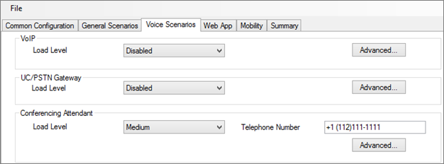

# Настройка политик для Скайп для Business Server 2015 Stress and Performance Tool
 
Настройка политики для Скайп для Business Server 2015 Stress and Performance Tool.
  
Существует несколько политик и других областях, которые можно настроить в Скайп для Business Server 2015, перед запуском Stress and Performance Tool.
  
- [Политика архивации](configuring-policies.md#ArchivingPolicy),
    
- [Политика конференц-связи](configuring-policies.md#ConferencingPolicy),
    
- [Политика контактов](configuring-policies.md#ContactsPolicy)
    
- [Политика федерации](configuring-policies.md#FederationPolicy)
    
- [Политика контроля допуска звонков](configuring-policies.md#CACPolicy)
    
- [Правила маршрутизации голосовой связи](configuring-policies.md#VoiceRoutingRules)
    
- [Помощника по конференции](configuring-policies.md#ConfAttendantApp)
    
- [Служба приостановки звонков сервера](configuring-policies.md#ServerCallParkServ)
    
- [Экстренные вызовы](configuring-policies.md#EmergencyCalls)
    
- [Настройка группы ответа приложения](configuring-policies.md#ConfigResponseGroupApp)
    
## Политики архивации

Если у вас есть сервер архивации, развернутых в вашей Скайп для топологии Business Server, вы откроете ArchivingPolicy.ps1 скрипта. Если вам требуется дополнительная помощь, просмотрите командлеты архивации и веб-конференций.
  
## Политика конференц-связи

Для конференц-связи у нас есть сценарий MeetingPolicy.ps1. Если вам требуется дополнительная помощь, просмотрите командлеты веб-конференций.
  
## Политика контактов

Сценарий ContactsPolicy.ps1 будет пример, который необходимо просмотреть. Командлеты обмена мгновенными Сообщениями и присутствия представлены сведения, если вам требуется дополнительная ссылки.
  
## Политика федерации

Образец сценария для федерации — FederationPolicy.ps1. Командлеты для просмотра, если вам требуется дополнительная возможность получения, будут пограничного сервера, Федерация и внешний доступ.
  
## Политика контроля допуска звонков

Можно указывать BandwidthPolicy.ps1 для этой политики. Дополнительные сведения также будут иметь командлеты контроля допуска звонков.
  
## Правила маршрутизации голосовой связи

Образец сценария RoutingRules.ps1 потребуются для маршрутизации голосовых вызовов. При настройке эти правила, запомните контекста телефона (то есть, профиль /Location или /SimpleName) и коды области внутренний или внешний, таким образом, чтобы их можно задать при создании пользователей. Вам также понадобится их во время настройки LyncPerfTool (специально для объединенных Коммуникаций ТСОП и объединенных Коммуникаций PSTN).
  
Например параметр SimpleName в вызове командлета **New-CsDialPlan** в примере RoutingRules.ps1 должен использоваться для значения LocationProfile на следующем рисунке UserProfileGenerator.exe:
  

  
Для получения дополнительных сведений можно просмотреть командлеты корпоративной голосовой связи.
  
## Помощника по конференции

Сначала просмотрите сценарий ConferenceAutoAttendantConfiguration.ps1. Вы наверняка хотели бы принять к сведению ConferencingAutoAttendant номер телефона (1121111111 по умолчанию), чтобы ввести в средстве настройки LyncPerfTool для создания конфигурации, как показано ниже:
  

  
Более подробные сведения можно найти в конференц-связь и конференц связи с телефонным командлетов.
  
## Служба приостановки звонков сервера

Фактически отключена по умолчанию. Если вам нужно проверить это, можно просмотреть образец сценария CallParkConfiguration.ps1. Кроме того извлекать командлеты приложения парковки вызовов при необходимости.
  
## Экстренные вызовы

Вам потребуется выполнить следующие действия по настройке нагрузка и тестирование производительности для экстренных вызовов:
  
1. Настройка маршрута голосовой связи для экстренных вызовов. Можно использовать сценарий RoutingRules.ps1 и проверьте в поле Примечание « **Службы E911 маршрут ТСОП** » пример того, как настроить этот маршрут голосовой связи.
    
    > [!CAUTION]
    > Пример команды в RoutingRules.ps1 имеет шаблон номера, который включает в себя номер 119, а не 911. Следует избегать использования 911 (или фактический номер экстренного вызова на локальном), чтобы предотвратить случайное вызовы вашей локальной экстренных операторов во время нагрузочного тестирования. Имейте в виду, эта конфигурация только для целей моделирования! 
  
2. Настройте адреса, заполнив значения на вкладке **Расположение файла конфигурации службы сведения** в UserProvisioningTool, как показано на следующем рисунке:
    
     
  
3. После ввода всех компонентов в UserProvisioningTool, нажмите кнопку **Создать файлы Config локальный источник установки** .
    
4. Теперь будет создан CSV-файлов для портов, подсетей, коммутаторы и точки беспроводного доступа (WAPs), а также XML-файла для средства нагрузка и производительность. При настройке службы сведения о местоположении (LIS) с помощью сценария LisConfiguration.ps1 можно использовать CSV-файлов для входные данные. Для этого необходимо переместить файл Locations0.xml в ту же папку Stress and Performance Tool исполняемый файл (LyncPerfTool.exe). Это позволит выполнить расположение сценарии профиля (абонентской группы).
    
## Настройка группы ответа приложения

Образец сценария — ResponseGroupConfiguration.ps1. Также есть командлеты приложения группы ответа для просмотра для сведения о конфигурации. Следующая схема будет показывать некоторые сведения о конфигурации:
  

  

