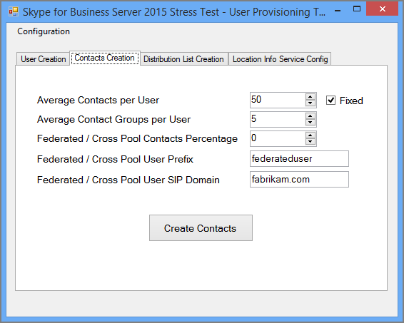

# <a name="using-the-skype-for-business-server-2015-stress-and-performance-tool"></a><span data-ttu-id="758d8-103">С помощью Скайп for Business Server 2015 Stress and Performance Tool</span><span class="sxs-lookup"><span data-stu-id="758d8-103">Using the Skype for Business Server 2015 Stress and Performance Tool</span></span>
 
<span data-ttu-id="758d8-104">Для запуска Скайп для Business Server 2015 Stress and Performance Tool, вы будете должны должны иметь возможность управлять пользователи, контакты и профили пользователей, Настройка средства для выполнения и просмотрите выходные данные или результаты, созданные с помощью данного средства.</span><span class="sxs-lookup"><span data-stu-id="758d8-104">To run the Skype for Business Server 2015 Stress and Performance Tool, you'll need to be able to manage both users, contacts and user profiles, configure the tool for running, and then review the output or results that are produced by the tool.</span></span>
  
<span data-ttu-id="758d8-105">Существует четыре области, связанные с управлением Скайп для Business Server 2015 Stress and Performance Tool (исполняемый файл — LyncPerfTool.exe):</span><span class="sxs-lookup"><span data-stu-id="758d8-105">There are four areas involved with running the Skype for Business Server 2015 Stress and Performance Tool (the executable is LyncPerfTool.exe):</span></span>
  
- [<span data-ttu-id="758d8-106">Создание пользователей и контактов</span><span class="sxs-lookup"><span data-stu-id="758d8-106">Create Users and Contacts</span></span>](using-the-tool.md#BKMK_CreateUsersAndContacts)
    
- [<span data-ttu-id="758d8-107">Настройка профилей пользователей</span><span class="sxs-lookup"><span data-stu-id="758d8-107">Configure User Profile</span></span>](using-the-tool.md#BKMK_UserProfile)
    
- [<span data-ttu-id="758d8-108">Запустите LyncPerfTool</span><span class="sxs-lookup"><span data-stu-id="758d8-108">Run LyncPerfTool</span></span>](using-the-tool.md#BKMK_RunTool)
    
- [<span data-ttu-id="758d8-109">Толкование результатов</span><span class="sxs-lookup"><span data-stu-id="758d8-109">Interpreting the Results</span></span>](using-the-tool.md#BKMK_Interpret)
    
## <a name="create-users-and-contacts"></a><span data-ttu-id="758d8-110">Создание пользователей и контактов</span><span class="sxs-lookup"><span data-stu-id="758d8-110">Create Users and Contacts</span></span>
<span data-ttu-id="758d8-111"><a name="BKMK_CreateUsersAndContacts"> </a></span><span class="sxs-lookup"><span data-stu-id="758d8-111"></span></span>

<span data-ttu-id="758d8-112">Необходимо использовать Скайп средства подготовки 2015 Business Server (SB 2015) пользователя (UserProvisioningTool.exe) для создания пользователей и контактов для нагрузочного тестирования и тестирования производительности.</span><span class="sxs-lookup"><span data-stu-id="758d8-112">You need to use the Skype for Business Server 2015 (SB 2015) User Provisioning Tool (UserProvisioningTool.exe) to create users and contacts for your stress and performance testing.</span></span>
  
<span data-ttu-id="758d8-113">Это список полезные термины, которые могут оказаться полезными при чтении разделов:</span><span class="sxs-lookup"><span data-stu-id="758d8-113">This is a list of helpful terms that might be useful as you read through the topics:</span></span>
  
- <span data-ttu-id="758d8-114">**Подразделение** - доменных служб Active Directory (AD DS) подразделение (OU).</span><span class="sxs-lookup"><span data-stu-id="758d8-114">**Organizational Unit** - The Active Directory Domain Services (AD DS) organizational unit (OU).</span></span>
    
- <span data-ttu-id="758d8-115">**Федеративные аудио- и кросс-пула** - пользователей, которые могут общаться с пользователями из других служб мгновенного обмена Мгновенными сообщениями.</span><span class="sxs-lookup"><span data-stu-id="758d8-115">**Federated / Cross Pool** - Users who can communicate with users from other Instant Messaging (IM) services.</span></span>
    
- <span data-ttu-id="758d8-116">**Списки рассылки** - или списки рассылки.</span><span class="sxs-lookup"><span data-stu-id="758d8-116">**Distribution Lists** - Or DLs.</span></span> <span data-ttu-id="758d8-117">Это объекты в Доменных службах Active Directory, которая содержит список пользователей, Доменные службы Active Directory.</span><span class="sxs-lookup"><span data-stu-id="758d8-117">These are objects in AD DS that contain a list of AD DS users.</span></span> <span data-ttu-id="758d8-118">Они используются для упрощения связи между разными группами пользователей.</span><span class="sxs-lookup"><span data-stu-id="758d8-118">They're used to facilitate communications across groups of people.</span></span>
    
- <span data-ttu-id="758d8-119">**Сведения о расположении службы** — Скайп для службы Business Server 2015, если он включен и настроен на телефон, обеспечивающий для извлечения физическое расположение для служб улучшены 911 (службы E911).</span><span class="sxs-lookup"><span data-stu-id="758d8-119">**Location Info Service** - The Skype for Business Server 2015 service that, when it's enabled and configured per phone, allows for the retrieval of physical location for Enhanced 911 (E911) services.</span></span>
    
- <span data-ttu-id="758d8-120">**Номера телефонов США** - номера телефонов, назначенных пользователю в дополнение к SIP URI, используемый для маршрутизации входящих и исходящих вызовов, в обратном номер подстановки (RNL).</span><span class="sxs-lookup"><span data-stu-id="758d8-120">**U.S. Phone Numbers** - Phone numbers assigned to user in addition to the SIP URI that's used for routing inbound and outbound calls in Reverse Number Lookup (RNL).</span></span>
    
### <a name="create-users-and-contacts-by-using-userprovisioningtoolexe"></a><span data-ttu-id="758d8-121">Создание пользователей и контактов с помощью UserProvisioningTool.exe</span><span class="sxs-lookup"><span data-stu-id="758d8-121">Create Users and Contacts by using UserProvisioningTool.exe</span></span>

> [!NOTE]
> <span data-ttu-id="758d8-122">Прежде чем даже начать, убедитесь, что абсолютно необходимо войти систему как член группы безопасности "Администраторы домена" для запуска этой программы.</span><span class="sxs-lookup"><span data-stu-id="758d8-122">Before you even begin, be absolutely sure you're logged in as a member of the Domain Admins security group to run this tool.</span></span> <span data-ttu-id="758d8-123">Необходимо сделать это, так как вы будете создавать пользователей Active Directory.</span><span class="sxs-lookup"><span data-stu-id="758d8-123">You need to do this, because you're going to be creating Active Directory users.</span></span> 
  
<span data-ttu-id="758d8-124">Необходимо использовать Скайп для средство подготовки пользователей Business Server для создания пользователей и контактов для моделирования нагрузки.</span><span class="sxs-lookup"><span data-stu-id="758d8-124">You have to use the Skype for Business Server User Provisioning Tool to create users and contacts for load simulation.</span></span>
  
<span data-ttu-id="758d8-125">Пакет **Скайп для Business Server Stress and Performance Tool** установка **Скайп для средство подготовки пользователей Business Server** .</span><span class="sxs-lookup"><span data-stu-id="758d8-125">The **Skype for Business Server User Provisioning Tool** is installed with the **Skype for Business Server Stress and Performance Tool** package.</span></span> <span data-ttu-id="758d8-126">Убедитесь, что пакет установщика (CapacityPlanningTool.msi) уже была запущена на сервере переднего плана или сервера Standard Edition, которые планируется тестировать.</span><span class="sxs-lookup"><span data-stu-id="758d8-126">Be sure that the package installer (CapacityPlanningTool.msi) has been run on the Front End Server or the Standard Edition server you intend to test.</span></span>
  
<span data-ttu-id="758d8-127">На сервере переднего плана или сервера Standard Edition, можно начать Скайп средства подготовки пользователей Business Server, запустив файл UserProvisioningTool.exe (находится в папке % InstalledDirectory%LyncStressAndPerfTool\LyncStress).</span><span class="sxs-lookup"><span data-stu-id="758d8-127">You can start the Skype for Business Server User Provisioning Tool by running the file UserProvisioningTool.exe (located at %InstalledDirectory%LyncStressAndPerfTool\LyncStress) on the Front End Server or on the Standard Edition server.</span></span>
  
> [!IMPORTANT]
> <span data-ttu-id="758d8-128">При создании большого числа пользователей (например, 10 000 или более), запустите UserProvisioningTool.exe.</span><span class="sxs-lookup"><span data-stu-id="758d8-128">When you create a large number of users (for example, 10,000 or more), run the UserProvisioningTool.exe.</span></span> <span data-ttu-id="758d8-129">Вам потребуется сделать это, так как средство будет создание и настройка *нового* AD пользователей.</span><span class="sxs-lookup"><span data-stu-id="758d8-129">You'll need to do this because the tool will be creating and configuring  *new*  AD users.</span></span>
  
<span data-ttu-id="758d8-130">Откроется программа подготовки пользователей, нажмите кнопку настройки и выберите Конфигурация нагрузки.</span><span class="sxs-lookup"><span data-stu-id="758d8-130">When the User Provisioning Tool opens, click Configuration and select the Load Configuration.</span></span> 
  
<span data-ttu-id="758d8-131">Чтобы приступить к настройке пользователей и контактов, загрузите файл по умолчанию, включенные в состав пакета, называется «SampleData.xml».</span><span class="sxs-lookup"><span data-stu-id="758d8-131">To begin configuring users and contacts, load the default file included with the package, called "SampleData.xml".</span></span> <span data-ttu-id="758d8-132">Это подготовит полей с образцами данных, который необходимо изменить чтобы сделать соответствующий для вашего развертывания.</span><span class="sxs-lookup"><span data-stu-id="758d8-132">This will prepopulate fields with sample data that you'll need to change to make it relevant for your deployment.</span></span>
  
<span data-ttu-id="758d8-133">Если имеется предварительно настроенный XML-файл, который уже содержит индивидуальные настройки, можно загрузить файл вместо этого.</span><span class="sxs-lookup"><span data-stu-id="758d8-133">If you have a preconfigured XML file that already contains your customized settings, you can load that file instead.</span></span> <span data-ttu-id="758d8-134">Заполните поля в средстве подготовки пользователей, как описано в следующих разделах.</span><span class="sxs-lookup"><span data-stu-id="758d8-134">Fill in the fields in the User Provisioning Tool, as described in the sections below.</span></span>
  
### <a name="to-configure-server-options"></a><span data-ttu-id="758d8-135">Чтобы настроить параметры сервера:</span><span class="sxs-lookup"><span data-stu-id="758d8-135">To configure server options:</span></span>

1. <span data-ttu-id="758d8-136">В поле **Полное доменное имя пула переднего плана** введите полное доменное имя (FQDN) сервера Standard Edition или пула переднего плана, где будут размещены пользователей.</span><span class="sxs-lookup"><span data-stu-id="758d8-136">In the **Front End Pool FQDN** field, type the fully qualified domain name (FQDN) of the Standard Edition server, or the Front End pool where you want to host the users.</span></span>
    
2. <span data-ttu-id="758d8-137">В поле **Префикс имени пользователя** введите префикс, который будет использоваться для bust вашей имена пользователей для тестирования (например, «TestUser»).</span><span class="sxs-lookup"><span data-stu-id="758d8-137">In the **User Name Prefix** field, type a prefix that you want to use to bust your user names for testing purposes (such as "TestUser").</span></span>
    
3. <span data-ttu-id="758d8-138">В поле **пароль** введите пароль, который будет использоваться для всех тестовых учетных записей пользователей.</span><span class="sxs-lookup"><span data-stu-id="758d8-138">In the **Password** field, type a password that will be used across all the test user accounts.</span></span>
    
4. <span data-ttu-id="758d8-139">В поле **Домен учетной записи** введите имя домена из текущего домена AD (один, в котором вы хотите создать тестовых пользователей).</span><span class="sxs-lookup"><span data-stu-id="758d8-139">In the **Account Domain** field, type the domain name of your current AD domain (the one in which you want to create your test users).</span></span>
    
5. <span data-ttu-id="758d8-140">В поле **Подразделение** , введите имя домена AD, где вы хотите создать эти тестовых пользователей.</span><span class="sxs-lookup"><span data-stu-id="758d8-140">In the **Organizational Unit** field, type the name of the AD domain where you want to create these test users.</span></span> <span data-ttu-id="758d8-141">(Если Подразделение еще не существует, он будет создан автоматически).</span><span class="sxs-lookup"><span data-stu-id="758d8-141">(If the OU doesn't already exist, it'll be created for you).</span></span>
    
6. <span data-ttu-id="758d8-142">В поле **код области телефона** введите код города трехзначный, чтобы использовать во всех тестовых учетных записей пользователей.</span><span class="sxs-lookup"><span data-stu-id="758d8-142">In the **Phone Area Code** field, type the three-digit area code to be used across all test user accounts.</span></span> <span data-ttu-id="758d8-143">Убедитесь, что код города выбранное вами не конфликтовала с кодами области других пользователей в AD.</span><span class="sxs-lookup"><span data-stu-id="758d8-143">Make certain that the area code you chose doesn't conflict with other users' area codes in AD.</span></span>
    
7. <span data-ttu-id="758d8-144">Щелкните, чтобы установить флажок **Включено голосовой связи** , если вы хотите включить тестовых пользователей корпоративной голосовой связи.</span><span class="sxs-lookup"><span data-stu-id="758d8-144">Click to select the **Voice Enabled** check box, if you want to enable the test users for Enterprise Voice.</span></span>
    
8. <span data-ttu-id="758d8-145">В поле **Количество пользователей** предоставьте общее число тестовых пользователей, которые необходимо создать.</span><span class="sxs-lookup"><span data-stu-id="758d8-145">In the **Number of Users** field, give the total number of test users you want to create.</span></span>
    
9. <span data-ttu-id="758d8-146">В поле **Начать индекса** , предоставьте начальный номер, который будет использоваться в качестве суффикса с префиксом имя пользователя (, например «TestUser» — это префикс и имя приведет к сбросу в «0» в приведенном ниже примере.)</span><span class="sxs-lookup"><span data-stu-id="758d8-146">In the **Start Index** field, give the starting number that'll be used as a suffix to the user name prefix (for example, the prefix is "TestUser", and the first name will end in "0" in the example below.)</span></span>
    
     
  
#### <a name="create-users-button"></a><span data-ttu-id="758d8-148">Кнопка "Создать" пользователей</span><span class="sxs-lookup"><span data-stu-id="758d8-148">Create Users button</span></span>

<span data-ttu-id="758d8-149">При нажатии кнопки **Создания пользователей** проверяются входные параметры, которые вы ввели.</span><span class="sxs-lookup"><span data-stu-id="758d8-149">When you click on the **Create Users** button, the input parameters you've entered are validated.</span></span> <span data-ttu-id="758d8-150">В случае ошибки проверки, вам будет предложено исправить их.</span><span class="sxs-lookup"><span data-stu-id="758d8-150">If there are any validation errors, you'll be prompted to fix them.</span></span> <span data-ttu-id="758d8-151">Или, если все значения верны, пользователей будет запущен процесс появления в AD (в Подразделении независимо от выбранного указанному).</span><span class="sxs-lookup"><span data-stu-id="758d8-151">Or, if all the values are correct, users will start appearing in AD (in whichever OU you specified).</span></span> <span data-ttu-id="758d8-152">Вы увидите индикатор хода выполнения в нижней части Средство во время его выполнения.</span><span class="sxs-lookup"><span data-stu-id="758d8-152">You'll see a progress bar at the bottom of the tool as it runs.</span></span> <span data-ttu-id="758d8-153">Не закрывайте приложение во время активности индикатор хода выполнения.</span><span class="sxs-lookup"><span data-stu-id="758d8-153">Don't close the application while the progress bar is active.</span></span>
  
<span data-ttu-id="758d8-154">При создании пользователей времени, так что произведите план соответствующим образом.</span><span class="sxs-lookup"><span data-stu-id="758d8-154">User creation takes time, so please plan accordingly.</span></span> <span data-ttu-id="758d8-155">Этот процесс может занять от нескольких минут для нескольких пользователей до нескольких часов для большого числа пользователей.</span><span class="sxs-lookup"><span data-stu-id="758d8-155">This process can take anywhere from several minutes for a few users, to a few hours for a large number of users.</span></span>
  
<span data-ttu-id="758d8-156">Если у вас нет доступа к контроллеру домена AD в тестовой среде, по-прежнему можно проверить при создании пользователей войдите в систему как один из пользователей в диапазоне от пользователей, которого требуется создать.</span><span class="sxs-lookup"><span data-stu-id="758d8-156">If you don't have access to the AD Domain Controller in your test environment, you can still validate user creation by logging in as one of the users in the range of users you specified to create.</span></span> <span data-ttu-id="758d8-157">Не забудьте префикс и суффикс, а также @sipDomain как имя пользователя.</span><span class="sxs-lookup"><span data-stu-id="758d8-157">Remember to use the prefix, and the suffix, along with the @sipDomain as the username.</span></span> <span data-ttu-id="758d8-158">Ниже приведен пример: <em>TestUser20@contoso.net</em> .</span><span class="sxs-lookup"><span data-stu-id="758d8-158">Here is an example:  <em>TestUser20@contoso.net</em>  .</span></span>
  
> [!NOTE]
> <span data-ttu-id="758d8-159">Если пользователи уже существует, нажав кнопку Создать пользователей будет обновлена их изменений конфигурации.</span><span class="sxs-lookup"><span data-stu-id="758d8-159">If the users already exist, clicking the Create Users button will update them with any configuration changes.</span></span> 
  
#### <a name="delete-users-button"></a><span data-ttu-id="758d8-160">Пользователи кнопка "Удалить"</span><span class="sxs-lookup"><span data-stu-id="758d8-160">Delete Users button</span></span>

<span data-ttu-id="758d8-161">При нажатии кнопки **Удалить пользователей** проверяются на вкладке входные параметры.</span><span class="sxs-lookup"><span data-stu-id="758d8-161">When you click on the **Delete Users** button, the tab's input parameters will be validated.</span></span> <span data-ttu-id="758d8-162">В случае ошибки проверки, вам будет предложено исправить их, и если входного значения верны, указанного тестовых пользователей будет отключены и удалены из службы каталогов Active Directory.</span><span class="sxs-lookup"><span data-stu-id="758d8-162">If there are validation errors, you'll be prompted to fix them, and if the input values are correct, the specified test users will be disabled and deleted from Active Directory.</span></span> <span data-ttu-id="758d8-163">Опять же индикатор хода выполнения будет отображаться в нижней части на этой вкладке и не следует закрыть приложение во время активности индикатор хода выполнения.</span><span class="sxs-lookup"><span data-stu-id="758d8-163">Again, a progress bar will appear on the bottom of this tab, and you shouldn't close the application while the progress bar is active.</span></span>
  
> [!NOTE]
> <span data-ttu-id="758d8-164">Поддерживаются только США телефонные номера в формате.</span><span class="sxs-lookup"><span data-stu-id="758d8-164">Only U.S.-formatted phone numbers are supported.</span></span> <span data-ttu-id="758d8-165">Номера телефонов всегда назначить пользователям и всех пользователей, созданные с UserProvisioningTool.exe по умолчанию включены для корпоративной голосовой связи.</span><span class="sxs-lookup"><span data-stu-id="758d8-165">Phone numbers are always assigned to users, and all users created by UserProvisioningTool.exe are enabled for Enterprise Voice by default.</span></span> <span data-ttu-id="758d8-166">Сценарии, используйте номер телефона, например автосекретарь конференц-связи или звонки по ТСОП объединенных Коммуникаций, используйте этот номер телефона для правильной маршрутизации вызовов.</span><span class="sxs-lookup"><span data-stu-id="758d8-166">Any scenarios that use the phone number, such as Conferencing Auto Attendant or UC-PSTN calls, use this phone number to properly route calls.</span></span> <span data-ttu-id="758d8-167">По этой причине *каждый пользователь* должен иметь *Уникальный номер телефона* .</span><span class="sxs-lookup"><span data-stu-id="758d8-167">For this reason,  *every user*  must have a *unique phone number*  .</span></span>
  
> [!NOTE]
> <span data-ttu-id="758d8-168">**При наличии для создания пользователей дважды команда завершится ошибкой, если не использовать другой код области или предыдущей пользователи были отключены с помощью командлета Disable-CsUser.**</span><span class="sxs-lookup"><span data-stu-id="758d8-168">**If you have to create users twice, the command will fail unless you use a different area code, or if the previous users have been disabled by using the Disable-CsUser cmdlet.**</span></span>
  
> [!IMPORTANT]
> <span data-ttu-id="758d8-169">Перед созданием контактов, необходимо сначала выполнить репликацию пользователя (который выполняется на вкладке Пользователи).</span><span class="sxs-lookup"><span data-stu-id="758d8-169">Before you create contacts, you first need to complete user replication (which is done from the Users tab).</span></span> 
  
> [!IMPORTANT]
> <span data-ttu-id="758d8-170">Если вы только что создали пользователей, то необходимо ожидать завершения Скайп репликации Business Server и заполняет учетных записей пользователей в базе данных.</span><span class="sxs-lookup"><span data-stu-id="758d8-170">If you've just created your users, you'll need to wait until Skype for Business Server replication completes and populates the user accounts in the database.</span></span> <span data-ttu-id="758d8-171">**Если он еще не завершено репликации, вы узнаете об ошибке.**</span><span class="sxs-lookup"><span data-stu-id="758d8-171">**If the users haven't finished replicating, you'll see an error.**</span></span> <span data-ttu-id="758d8-172">Вы узнаете, по окончании пользователей репликации, если запущен Скайп для службы Business Server 2015 переднего плана или запустив командлет Get-CsUser на последний пользователя общему числу указанному успешно.</span><span class="sxs-lookup"><span data-stu-id="758d8-172">You'll know when users have finished replicating if the Skype for Business Server 2015 Front End service has started, or by successfully running the Get-CsUser cmdlet on the last user of the total number you specified.</span></span>
  
#### <a name="contacts-creation-tab"></a><span data-ttu-id="758d8-173">Вкладка Создание контактов</span><span class="sxs-lookup"><span data-stu-id="758d8-173">Contacts Creation tab</span></span>

<span data-ttu-id="758d8-174">Эта вкладка позволяет предоставить сведения о контактах пользователей для тестирования.</span><span class="sxs-lookup"><span data-stu-id="758d8-174">This tab lets you give users' contacts details for your testing.</span></span>
  

  
### <a name="to-configure-users-contacts-do-the-following"></a><span data-ttu-id="758d8-176">Чтобы настроить контактов, выполните следующие действия.</span><span class="sxs-lookup"><span data-stu-id="758d8-176">To configure users' contacts, do the following:</span></span>

1. <span data-ttu-id="758d8-177">В поле **Средняя контактов на пользователя** введите среднее число контактов, чтобы заполнить в список контактов для каждого пользователя.</span><span class="sxs-lookup"><span data-stu-id="758d8-177">In the **Average Contacts per User** field, enter the average number of contacts to populate in contact lists for each user.</span></span>
    
2. <span data-ttu-id="758d8-178">Выберите флажок **фиксированный** , если вы хотите создать равно числу контактов для каждого пользователя.</span><span class="sxs-lookup"><span data-stu-id="758d8-178">Select the **Fixed** check box if you want to create an equal number of contacts for every user.</span></span> <span data-ttu-id="758d8-179">Если вы хотите варьировать число контактов, созданной для пользователей, снимите этот флажок.</span><span class="sxs-lookup"><span data-stu-id="758d8-179">If you want to vary the number of contacts created for users, clear that check box.</span></span>
    
3. <span data-ttu-id="758d8-180">В поле **Средняя группы контактов на пользователя** введите число групп контактов на пользователя.</span><span class="sxs-lookup"><span data-stu-id="758d8-180">In the **Average Contact Groups per User** field, enter the number of contact groups per user.</span></span> <span data-ttu-id="758d8-181">Этот номер должен быть меньше, чем **Средняя контактов на пользователя**.</span><span class="sxs-lookup"><span data-stu-id="758d8-181">This number needs to be smaller than **Average Contacts per User**.</span></span>
    
4. <span data-ttu-id="758d8-182">В поле **федеративных аудио- и кросс-процентное отношение контакты пула** задайте число в диапазоне от 0 до 100.</span><span class="sxs-lookup"><span data-stu-id="758d8-182">In the **Federated / Cross Pool Contacts Percentage** field, give a number between 0 and 100.</span></span> <span data-ttu-id="758d8-183">Этот процент контакты будут создаваться с федеративными пользователями.</span><span class="sxs-lookup"><span data-stu-id="758d8-183">This percentage of contacts will be created with the federated users.</span></span>
    
5. <span data-ttu-id="758d8-184">В поле **федеративных аудио- и кросс-префикс пула пользователя** ввести имя пользователя для федеративных пользователей, которые будут добавлены в список контактов локальных пользователей.</span><span class="sxs-lookup"><span data-stu-id="758d8-184">In the **Federated / Cross Pool User Prefix** field, give the username for federated users that will be added to the contact lists of local users.</span></span>
    
6. <span data-ttu-id="758d8-185">В поле **федеративных аудио- и кросс-домен SIP пользователя пула** присвойте имя домена SIP федеративных пользователей.</span><span class="sxs-lookup"><span data-stu-id="758d8-185">In the **Federated / Cross Pool User SIP Domain** field, give the SIP Domain Name of the federated users.</span></span>
    
7. <span data-ttu-id="758d8-186">**При создании пользователей** на вкладке убедитесь, что указаны правильные данные.</span><span class="sxs-lookup"><span data-stu-id="758d8-186">In **User Creation** tab make sure the information is correct.</span></span> <span data-ttu-id="758d8-187">Контакты будут создаваться из значений на вкладке Создать пользователя.</span><span class="sxs-lookup"><span data-stu-id="758d8-187">Your contacts will be created from values on the User Creation tab.</span></span>
    
8. <span data-ttu-id="758d8-188">Нажмите кнопку **Создать контакты** для начала создания контакта.</span><span class="sxs-lookup"><span data-stu-id="758d8-188">Click **Create Contacts** to begin the contact creation.</span></span> <span data-ttu-id="758d8-189">Этот процесс может занять несколько минут.</span><span class="sxs-lookup"><span data-stu-id="758d8-189">This process can take several minutes.</span></span> <span data-ttu-id="758d8-190">После завершения, будет отображаться диалоговое окно с сообщением «операция успешно завершена.»</span><span class="sxs-lookup"><span data-stu-id="758d8-190">After it completes, a dialog box will appear with the message, "Operation Completed Successfully."</span></span> <span data-ttu-id="758d8-191">Можно проверить контакты, которые были созданы с вход в систему под учетной записью пользователя, который был создан на вкладке Создать пользователя.</span><span class="sxs-lookup"><span data-stu-id="758d8-191">You can validate the contacts that were created by logging on as a user that was created from the User Creation tab.</span></span>
    
> [!NOTE]
> <span data-ttu-id="758d8-192">После создания контактов это средство перезапустится сервера переднего плана в пуле целевой.</span><span class="sxs-lookup"><span data-stu-id="758d8-192">After the contacts are created, this tool will restart all the Front End Servers in the target pool.</span></span> <span data-ttu-id="758d8-193">Может потребоваться больше времени (вверх на 2 часа) для серверов переднего плана начать, в зависимости от того, сколько контактов были созданы в данной операции.</span><span class="sxs-lookup"><span data-stu-id="758d8-193">It may take longer (up to 2 hours) for the Front End Servers to start, depending on how many contacts were created by this operation.</span></span> 
  
#### <a name="distribution-list"></a><span data-ttu-id="758d8-194">Список рассылки</span><span class="sxs-lookup"><span data-stu-id="758d8-194">Distribution List</span></span>

<span data-ttu-id="758d8-195">Скайп для Business Server 2015 Stress and Performance Tool можно смоделировать компонент расширение списка рассылки (DL) в Скайп для клиента 2015 бизнеса.</span><span class="sxs-lookup"><span data-stu-id="758d8-195">The Skype for Business Server 2015 Stress and Performance Tool can simulate the Distribution List (DL) expansion feature in the Skype for Business 2015 client.</span></span> <span data-ttu-id="758d8-196">Этот шаг можно пропустить, если не планируется включить расширение списка Рассылки в средство подготовки пользователей.</span><span class="sxs-lookup"><span data-stu-id="758d8-196">You can skip this step if you don't intend to enable DL expansion in the User Provisioning tool.</span></span>
  

  
<span data-ttu-id="758d8-198">Вкладка списка рассылки позволяет создавать списки рассылки, которые будут использовать Stress and Performance Tool для функции раскрытие списков рассылки.</span><span class="sxs-lookup"><span data-stu-id="758d8-198">The Distribution List tab allows you to create DLs that the Stress and Performance Tool will use for Distribution List Expansion feature.</span></span> <span data-ttu-id="758d8-199">Прежде чем создавать списки рассылки, Скайп для Business Server 2015 должен быть развернут, включая запуска только.</span><span class="sxs-lookup"><span data-stu-id="758d8-199">Before creating DLs, Skype for Business Server 2015 needs to be deployed, including having run ForestPrep.</span></span> <span data-ttu-id="758d8-200">Если это не будет сделано, атрибутов списка Рассылки отсутствует в схеме AD, поэтому средство не будут иметь возможность создавать списки рассылки.</span><span class="sxs-lookup"><span data-stu-id="758d8-200">If this isn't done, the DL attributes will not exist in the AD schema, so the tool won't be able to create DLs.</span></span>
  
### <a name="to-configure-distribution-lists"></a><span data-ttu-id="758d8-201">Чтобы настроить списки рассылки:</span><span class="sxs-lookup"><span data-stu-id="758d8-201">To configure Distribution Lists:</span></span>

1. <span data-ttu-id="758d8-202">В поле **Номер из списков рассылки** , предоставьте общее число библиотек документов, необходимо создать (здесь рекомендуется начать с значение типа double, количество пользователей, у вас есть.).</span><span class="sxs-lookup"><span data-stu-id="758d8-202">In the **Number of Distribution Lists** field, give the total number of DLs you want to create (The recommendation here is that you start with a value that is double the number of users you have.).</span></span>
    
2. <span data-ttu-id="758d8-203">В поле **Префикс списка рассылки** введите префикс, который будет иметь все списки рассылки, вы создаете, например *testDL* .</span><span class="sxs-lookup"><span data-stu-id="758d8-203">In the **Distribution List Prefix** field, enter a prefix that all the DLs you create will have, for example *testDL*  .</span></span> <span data-ttu-id="758d8-204">Это означает, в 100 списки рассылки имена списков Рассылки будет иметь вид: testDL0, testDL1 до testDL99.</span><span class="sxs-lookup"><span data-stu-id="758d8-204">That means, at 100 DLs, your DL names will look like: testDL0, testDL1, up to testDL99.</span></span>
    
3. <span data-ttu-id="758d8-205">В поле **Минимальный участников в список Dist.** введите минимальное число пользователей для помещения в каждом списка Рассылки.</span><span class="sxs-lookup"><span data-stu-id="758d8-205">In the **Minimum Members in a Dist. List** field, enter the minimum number of users to put in each DL.</span></span>
    
4. <span data-ttu-id="758d8-206">В поле **Максимальное число элементов в списке Dist.** введите максимальное количество пользователей, чтобы добавить в каждый список Рассылки.</span><span class="sxs-lookup"><span data-stu-id="758d8-206">In the **Maximum Members in a Dist. List** field, enter the maximum number of users to add in each DL.</span></span>
    
#### <a name="create-distribution-lists-button"></a><span data-ttu-id="758d8-207">Кнопка "Создать списки рассылки"</span><span class="sxs-lookup"><span data-stu-id="758d8-207">Create Distribution Lists button</span></span>

<span data-ttu-id="758d8-208">При нажатии кнопки Создать списки рассылки, средство запрашивает см Если сопоставление префикса и номера уже существует в Active Directory.</span><span class="sxs-lookup"><span data-stu-id="758d8-208">When you click the Create Distribution Lists button, the tool queries Active Directory to see if distribution lists matching the prefix and numbers already exist.</span></span> <span data-ttu-id="758d8-209">Средство создает списки, которые не существуют.</span><span class="sxs-lookup"><span data-stu-id="758d8-209">The tool creates any DLs that don't already exist.</span></span> <span data-ttu-id="758d8-210">При добавлении членов в эти новые списки рассылки, он будет выберите пользователей из диапазона, указанного на вкладке при создании пользователей.</span><span class="sxs-lookup"><span data-stu-id="758d8-210">When adding members to these newly created Distribution Lists, it'll choose the users from the range specified on the User Creation tab.</span></span>
  
#### <a name="location-info-service-config-tab"></a><span data-ttu-id="758d8-211">Перейдите на вкладку расположение файла конфигурации службы Info</span><span class="sxs-lookup"><span data-stu-id="758d8-211">Location Info Service Config tab</span></span>

<span data-ttu-id="758d8-212">Скайп для Business Server 2015 Stress and Performance Tool также можно создать файлы фиктивного конфигурации для информирования о местонахождении.</span><span class="sxs-lookup"><span data-stu-id="758d8-212">The Skype for Business Server 2015 Stress and Performance Tool can also generate dummy configuration files for the Location Information Service.</span></span> <span data-ttu-id="758d8-213">Обратите внимание на то, что служба информирования о местонахождении обычно не имеет значительно влияет на производительность на серверах.</span><span class="sxs-lookup"><span data-stu-id="758d8-213">Note that the Location Information Service typically doesn't have significant performance impact on the servers.</span></span> 
  

  
<span data-ttu-id="758d8-215">Если нужно проверить эту возможность, введите значения в форме и нажмите кнопку Создать файлы Config локальный источник установки, которая будет создана. Вызывать CSV-файлов:</span><span class="sxs-lookup"><span data-stu-id="758d8-215">If you choose to test this feature, fill in the values in the form and click the Generate LIS Config Files button, which will create .CSV files called:</span></span>
  
- <span data-ttu-id="758d8-216">LIS_Subnet.csv</span><span class="sxs-lookup"><span data-stu-id="758d8-216">LIS_Subnet.csv</span></span>
    
- <span data-ttu-id="758d8-217">LIS_Switches.csv</span><span class="sxs-lookup"><span data-stu-id="758d8-217">LIS_Switches.csv</span></span>
    
- <span data-ttu-id="758d8-218">LIS_Ports.csv</span><span class="sxs-lookup"><span data-stu-id="758d8-218">LIS_Ports.csv</span></span>
    
- <span data-ttu-id="758d8-219">LIS_WAP.csv</span><span class="sxs-lookup"><span data-stu-id="758d8-219">LIS_WAP.csv</span></span>
    
<span data-ttu-id="758d8-220">Для импорта этих файлов в базу данных локальный источник установки используйте эти командлеты PowerShell:</span><span class="sxs-lookup"><span data-stu-id="758d8-220">To import these files into the LIS database use these PowerShell cmdlets:</span></span>
  
- <span data-ttu-id="758d8-221">SET-CsLisSubnet</span><span class="sxs-lookup"><span data-stu-id="758d8-221">Set-CsLisSubnet</span></span>
    
- <span data-ttu-id="758d8-222">SET-CsLisSwitch</span><span class="sxs-lookup"><span data-stu-id="758d8-222">Set-CsLisSwitch</span></span>
    
- <span data-ttu-id="758d8-223">SET-CsLisPort</span><span class="sxs-lookup"><span data-stu-id="758d8-223">Set-CsLisPort</span></span>
    
- <span data-ttu-id="758d8-224">SET-CsWirelessAccessPoint</span><span class="sxs-lookup"><span data-stu-id="758d8-224">Set-CsWirelessAccessPoint</span></span>
    
## <a name="configure-user-profile"></a><span data-ttu-id="758d8-225">Настройка профилей пользователей</span><span class="sxs-lookup"><span data-stu-id="758d8-225">Configure User Profile</span></span>
<span data-ttu-id="758d8-226"><a name="BKMK_UserProfile"> </a></span><span class="sxs-lookup"><span data-stu-id="758d8-226"></span></span>

<span data-ttu-id="758d8-227">После создания пользователей (с помощью средства создания пользователя) можно настроить профили пользователей с Скайп для Business Server 2015 нагрузки средства настройки (UserProfileGenerator.exe).</span><span class="sxs-lookup"><span data-stu-id="758d8-227">After your users are created (via the User Creation Tool) you can configure user profiles with the Skype for Business Server 2015 Load Configuration tool (UserProfileGenerator.exe).</span></span>
  
### <a name="running-the-skype-for-business-server-2015-load-configuration-tool"></a><span data-ttu-id="758d8-228">Под управлением Скайп для средства настройки нагрузки 2015 Business Server</span><span class="sxs-lookup"><span data-stu-id="758d8-228">Running the Skype for Business Server 2015 Load Configuration tool</span></span>

<span data-ttu-id="758d8-229">Запустите программу настройки нагрузки (UserProfileGenerator.exe) и заполните поля на вкладках.</span><span class="sxs-lookup"><span data-stu-id="758d8-229">Start the Load Configuration tool (UserProfileGenerator.exe) and fill in the tabs.</span></span> <span data-ttu-id="758d8-230">Это средство создает каталог для каждого клиента компьютеры, которые необходимо выполнить на моделирования.</span><span class="sxs-lookup"><span data-stu-id="758d8-230">This tool creates a directory for each of the client computers that you'll need to run your simulations.</span></span> <span data-ttu-id="758d8-231">Каждого клиента каталога, поступающие с помощью скрипта запуска Скайп Business Server 2015 Stress and Performance tool (LyncPerfTool.exe).</span><span class="sxs-lookup"><span data-stu-id="758d8-231">Each client directory comes with a script to start the Skype for Business Server 2015 Stress and Performance tool (LyncPerfTool.exe).</span></span> <span data-ttu-id="758d8-232">В следующих разделах предоставит примеры того, как для заполнения полей на всех листах Скайп для средства настройки нагрузки 2015 Business Server.</span><span class="sxs-lookup"><span data-stu-id="758d8-232">The sections below will give examples of how to fill in the fields on each tab of the Skype for Business Server 2015 Load Configuration tool.</span></span>
  
> [!IMPORTANT]
> <span data-ttu-id="758d8-233">Пользовательские значения, используемые в средстве настройки нагрузки (UserProfileGenerator.exe) должен совпадать значения, заданные в Скайп для создания пользователя средство (UserProvisioningTool.exe) Business Server 2015 для пула.</span><span class="sxs-lookup"><span data-stu-id="758d8-233">The user-specific values used in the Load Configuration tool (UserProfileGenerator.exe) must match the values specified in the Skype for Business Server 2015 User Creation Tool (UserProvisioningTool.exe) for the pool.</span></span> 
  
#### <a name="common-configuration-tab"></a><span data-ttu-id="758d8-234">Вкладка Общие настройки</span><span class="sxs-lookup"><span data-stu-id="758d8-234">Common Configuration tab</span></span>

<span data-ttu-id="758d8-235">Ниже показаны на вкладке **Общие конфигурация** средства настройки нагрузки.</span><span class="sxs-lookup"><span data-stu-id="758d8-235">The **Common Configuration** tab of the Load Configuration Tool is shown below.</span></span> <span data-ttu-id="758d8-236">Заполните поля на вкладке Общие конфигурация, как описано в следующих шагах.</span><span class="sxs-lookup"><span data-stu-id="758d8-236">Fill in the fields of the Common Configuration tab, as described in the following steps.</span></span>
  

  
1. <span data-ttu-id="758d8-238">В поле **Номер доступные компьютеры** введите количество компьютеров, которые необходимо использовать для запуска Stress and Performance tool (LyncPerfTool.exe).</span><span class="sxs-lookup"><span data-stu-id="758d8-238">In the **Number of Available Machines** field, type the number of computers you want to use to run the Stress and Performance tool (LyncPerfTool.exe).</span></span> <span data-ttu-id="758d8-239">Мы рекомендуем, что у вас есть один компьютер для каждых 4500 пользователей, которые вы будете моделирования, но этот номер может различаться, если снизить уровень нагрузки или использовать только подмножество доступных возможностей этого средства (уровни загрузки устанавливаются на вкладке Общие сценарии).</span><span class="sxs-lookup"><span data-stu-id="758d8-239">We recommend that you have one computer for every 4500 users you'll be simulating, but that number may vary if you reduce the load level, or use only a subset of the tool's available features (Load levels are set on the General Scenarios tab).</span></span>
    
2. <span data-ttu-id="758d8-240">В поле **префикс для имен пользователей** введите префикс в поле имя пользователя для всех пользователей.</span><span class="sxs-lookup"><span data-stu-id="758d8-240">In the **Prefix for User Names** field, enter a prefix for the user name field of all users.</span></span> <span data-ttu-id="758d8-241">Для записи в журнал в универсальный код ресурса (URI) будет: *UserPrefix [пользователя запустите индекса... (Число пользователей-1)] @User домена* , например, myUser009@Contoso.com.</span><span class="sxs-lookup"><span data-stu-id="758d8-241">To log in the Uniform Resource Identifier (URI) will be: *UserPrefix[User Start Index…(Number Of Users-1)]@User Domain*  , for example, myUser009@Contoso.com.</span></span>
    
3. <span data-ttu-id="758d8-242">В поле **пароль для всех пользователей,** введите пароль, используемый во время создания пользователей.</span><span class="sxs-lookup"><span data-stu-id="758d8-242">In the **Password for All Users** field, enter the password used during creation of the users.</span></span> <span data-ttu-id="758d8-243">Если оставить это поле пустым имя пользователя будет установлен в качестве пароля.</span><span class="sxs-lookup"><span data-stu-id="758d8-243">If you leave this field empty the username will be set as the password.</span></span>
    
4. <span data-ttu-id="758d8-244">В поле **Начать индекса пользователя** введите индекс первого пользователя, который требуется настроить.</span><span class="sxs-lookup"><span data-stu-id="758d8-244">In the **User Start Index** field, enter the index of the first user to be configured.</span></span> <span data-ttu-id="758d8-245">Можно настроить несколько диапазонов для различных типов или уровня нагрузки, но необходимо запустить программу настройки загрузки (UserProfileGenerator.exe) после каждого диапазона, который необходимо настроить.</span><span class="sxs-lookup"><span data-stu-id="758d8-245">You can configure different ranges for different types or levels of load, but you must run the Load Configuration tool (UserProfileGenerator.exe) once per the range you want to configure.</span></span>
    
5. <span data-ttu-id="758d8-246">В поле **Количество пользователей** введите общее количество пользователей, которые нужно настроить.</span><span class="sxs-lookup"><span data-stu-id="758d8-246">In the **Number of Users** field, enter the total number of users you're going to configure.</span></span>
    
6. <span data-ttu-id="758d8-247">В поле **Домен** введите домен, используемый для SIP URI.</span><span class="sxs-lookup"><span data-stu-id="758d8-247">In the **User Domain** field, enter the domain used for the SIP URI.</span></span> <span data-ttu-id="758d8-248">Используется для создания URI SIP каждого пользователя, войдите в систему Скайп для сервера переднего плана Business Server 2015 или сервере Standard Edition и может отличаться от учетной записи домена.</span><span class="sxs-lookup"><span data-stu-id="758d8-248">This is used to construct the SIP URI of each user to log on to the Skype for Business Server 2015 Front End Server or Standard Edition server, and may be different from the Account Domain.</span></span>
    
7. <span data-ttu-id="758d8-249">В поле **Домен учетной записи** введите имя домена AD DS.</span><span class="sxs-lookup"><span data-stu-id="758d8-249">In the **Account Domain** field, enter the AD DS domain logon.</span></span>
    
8. <span data-ttu-id="758d8-250">В поле **Процент MPOP** (нескольких точка присутствия в процентах) задайте значение для процент пользователей, вошедших из нескольких компьютеров или устройств, например 10 процентов.</span><span class="sxs-lookup"><span data-stu-id="758d8-250">In the **MPOP Percentage** (Multiple Point of Presence percentage) field, give a value for the percentage of users that are logged on from multiple machines or devices, for example 10 percent.</span></span>
    
9. <span data-ttu-id="758d8-251">Введите максимальное число параллельных конечных точек в поле **Вход в секунду, (на каждый экземпляр)** .</span><span class="sxs-lookup"><span data-stu-id="758d8-251">Enter the maximum number of concurrent endpoints in the **Sign in Per Second (per Instance)** field.</span></span> <span data-ttu-id="758d8-252">Это максимальное количество входов пользователей и рекомендуется частота меньше / равно 2 в секунду (< = 2).</span><span class="sxs-lookup"><span data-stu-id="758d8-252">This is the maximum number of log ins for your users, and the recommendation is a rate of less than/equal to 2 per second (<=2).</span></span>
    
10. <span data-ttu-id="758d8-253">В поле **прокси-сервера доступа или полное доменное имя пула** введите полное доменное имя (FQDN) сервера, будут клиентам подключаться к.</span><span class="sxs-lookup"><span data-stu-id="758d8-253">In the **Access Proxy or Pool FQDN** field, enter the fully qualified domain name (FQDN) of the server you want the clients to connect to.</span></span> <span data-ttu-id="758d8-254">При выполнении входа в извне, необходимо ввести прокси-сервера доступа.</span><span class="sxs-lookup"><span data-stu-id="758d8-254">If the users are logging on externally, you'll need to type the access proxy.</span></span> <span data-ttu-id="758d8-255">Если пользователи являются внутренними, задайте полное доменное имя их корпоративного пула или сервере Standard Edition.</span><span class="sxs-lookup"><span data-stu-id="758d8-255">If the users are internal, give the FQDN of their Enterprise Pool or Standard Edition server.</span></span>
    
11. <span data-ttu-id="758d8-256">В поле **порт** укажите порт, который пользователи должны использовать для SIP (по умолчанию — 5061).</span><span class="sxs-lookup"><span data-stu-id="758d8-256">In the **Port** field, enter the port that you want users to use for SIP (the default here is 5061).</span></span>
    
12. <span data-ttu-id="758d8-257">В поле **Внешний параметры сети сервера** укажите прокси-сервера доступа или полное доменное имя пула и, еще раз, **порт**.</span><span class="sxs-lookup"><span data-stu-id="758d8-257">For the **External Network Server Settings** field, give the Access Proxy or Pool FQDN and, again, the **Port**.</span></span> <span data-ttu-id="758d8-258">Эти параметры используются только для моделирования нагрузки внешних конечных точек.</span><span class="sxs-lookup"><span data-stu-id="758d8-258">These settings are used only for External endpoints load simulation.</span></span>
    
#### <a name="general-scenarios-tab"></a><span data-ttu-id="758d8-259">Вкладка Общие сценарии</span><span class="sxs-lookup"><span data-stu-id="758d8-259">General Scenarios tab</span></span>


  
<span data-ttu-id="758d8-261">Можно настроить уровни загрузки и параметры для каждого из общих сценариев, предлагаемых путем определения, необходимые для запуска или оставьте отключено.</span><span class="sxs-lookup"><span data-stu-id="758d8-261">You can configure the load levels and parameters for each of the general scenarios offered by determining what you want to run or leave disabled.</span></span> <span data-ttu-id="758d8-262">Ниже приведены общие параметры.</span><span class="sxs-lookup"><span data-stu-id="758d8-262">Here are your general options:</span></span>
  
> [!NOTE]
> <span data-ttu-id="758d8-263">Значения уровня нагрузки для всех полей, но локальной службы: **отключено**, **Low**, **Medium**, **высокой**или **Custom**.</span><span class="sxs-lookup"><span data-stu-id="758d8-263">Load level values for all fields but Local Information Services are **Disabled**, **Low**, **Medium**, **High**, or **Custom**.</span></span> <span data-ttu-id="758d8-264">Если выбрать любой параметр, кроме отключенного конфигураций создаются для каждого клиента.</span><span class="sxs-lookup"><span data-stu-id="758d8-264">If you select any setting but Disabled, then configurations are generated for each client.</span></span> <span data-ttu-id="758d8-265">Высокая результаты в максимальный поддерживаемый нагрузки на сервер. Средний — 60% высокой нагрузки; низкий — 30%.</span><span class="sxs-lookup"><span data-stu-id="758d8-265">High results in the max supported load on the server; medium is 60% of high load; low is 30%.</span></span> 
  
- <span data-ttu-id="758d8-266">**Обмен мгновенными сообщениями —** Сюда входят peer-to-peer и конференц-связи; Выберите соответствующее значение для уровня нагрузки.</span><span class="sxs-lookup"><span data-stu-id="758d8-266">**Instant Messaging -** This includes peer-to-peer and conferencing; choose the appropriate value for Load Level.</span></span>
    
- <span data-ttu-id="758d8-267">**Аудиоконференции-** Выберите уровень нагрузки для аудиоконференций *только* .</span><span class="sxs-lookup"><span data-stu-id="758d8-267">**Audio Conferencing -** Choose a load level for audio conferencing *only*  .</span></span> <span data-ttu-id="758d8-268">Peer-to-peer звонки будут решены немного позже в разделе **Сценарии голосовой связи** .</span><span class="sxs-lookup"><span data-stu-id="758d8-268">Peer-to-peer calls will be tackled a little later in the **Voice Scenarios** section.</span></span> <span data-ttu-id="758d8-269">Откройте вкладку **Дополнительно** , чтобы включить MultiView.</span><span class="sxs-lookup"><span data-stu-id="758d8-269">Open the **Advanced** tab to enable MultiView.</span></span>
    
- <span data-ttu-id="758d8-270">**Общий доступ к приложениям-** Выберите уровень загрузки для общего доступа к приложениям.</span><span class="sxs-lookup"><span data-stu-id="758d8-270">**Application Sharing -** Choose a load level for application sharing.</span></span>
    
- <span data-ttu-id="758d8-271">**Совместная работа с данными —** Выберите уровень нагрузки для совместной работы с данными, которая включает в себя данные конференц-связи.</span><span class="sxs-lookup"><span data-stu-id="758d8-271">**Data Collaboration -** Choose a load level for data collaboration, which includes data conferencing.</span></span>
    
- <span data-ttu-id="758d8-272">**Раскрытие списка рассылки-** Нажмите кнопку **Дополнительно** и заполните поле с те же значения, настроенные на вкладке DL средство создания пользователя (UserProvisioningTool.exe).</span><span class="sxs-lookup"><span data-stu-id="758d8-272">**Distribution List Expansion -** Click the **Advanced** button and fill in the field with the same values configured on the DL tab of the User Creation Tool (UserProvisioningTool.exe).</span></span> <span data-ttu-id="758d8-273">Выберите уровень нагрузки.</span><span class="sxs-lookup"><span data-stu-id="758d8-273">Choose a load level.</span></span>
    
- <span data-ttu-id="758d8-274">**Веб-запросов адресной книги-** Это подстановки службы адресной книги, а не Загрузка файла адресной книги.</span><span class="sxs-lookup"><span data-stu-id="758d8-274">**Address Book Web Query -** This is the address book lookup service rather than the address book file download.</span></span> <span data-ttu-id="758d8-275">Если вы хотите включить это для загрузки файла адресной книги, нажмите кнопку **Дополнительно** и **EnableABSDownload** задано значение True.</span><span class="sxs-lookup"><span data-stu-id="758d8-275">If you want to enable this for address book file downloads, click the **Advanced** button and set **EnableABSDownload** to True.</span></span> <span data-ttu-id="758d8-276">Задайте значение для уровня нагрузки.</span><span class="sxs-lookup"><span data-stu-id="758d8-276">Give a value for load level.</span></span>
    
- <span data-ttu-id="758d8-277">**Служба группы ответа —** Нажмите кнопку **Дополнительно** и укажите коды URI группы ответа, созданных при подготовке агентов службы группы ответа.</span><span class="sxs-lookup"><span data-stu-id="758d8-277">**Response Group Service -** Click the **Advanced** button and specify the URIs of the response groups you already created when you provisioned Response Group Service agents.</span></span> <span data-ttu-id="758d8-278">Необходимо выбрать по крайней мере одной группы ответа.</span><span class="sxs-lookup"><span data-stu-id="758d8-278">You must choose at least one response group.</span></span> <span data-ttu-id="758d8-279">Чтобы использовать несколько, разделяйте групп ответа с запятой.</span><span class="sxs-lookup"><span data-stu-id="758d8-279">To use more, separate the response groups with semicolons.</span></span> <span data-ttu-id="758d8-280">Обновление **RGSUriSuffixStartIndex** и **RGSUriSuffixEndIndex** для фактических значений.</span><span class="sxs-lookup"><span data-stu-id="758d8-280">Update **RGSUriSuffixStartIndex** and **RGSUriSuffixEndIndex** to the actual values.</span></span> <span data-ttu-id="758d8-281">Выберите уровень нагрузки.</span><span class="sxs-lookup"><span data-stu-id="758d8-281">Choose a load level.</span></span>
    
- <span data-ttu-id="758d8-282">**Расположение службы-** Выберите уровень нагрузки включено или отключено.</span><span class="sxs-lookup"><span data-stu-id="758d8-282">**Location Information Services -** Select a load level of either Enabled or Disabled.</span></span>
    
> [!NOTE]
> <span data-ttu-id="758d8-283">Каждый из сценариев имеет расширенные расположенную рядом с полем и набор флажки, которые позволяют вариантов до значения по умолчанию.</span><span class="sxs-lookup"><span data-stu-id="758d8-283">Each of the scenarios has an Advanced button located next to it, and a set of check boxes that enable variations to the default setting.</span></span> 
  
- <span data-ttu-id="758d8-284">Выбор *точечную* позволит средство для создания модели конференций, в которых будут создаваться в течение часа.</span><span class="sxs-lookup"><span data-stu-id="758d8-284">Choosing  *Ad-hoc*  will allow the tool to generate simulation of conferences that will be created throughout the hour.</span></span>
    
- <span data-ttu-id="758d8-285">Выбор *Больших Conf* означает, что будет моделировать большой сценарий конференции.</span><span class="sxs-lookup"><span data-stu-id="758d8-285">Choosing  *Large Conf*  means that a Large Conference Scenario will be simulated.</span></span>
    
-  <span data-ttu-id="758d8-286">*Внешние* указывает, что сымитировать внешних пользователей.</span><span class="sxs-lookup"><span data-stu-id="758d8-286">*External*  tells the tool to also simulate external users.</span></span>
    
<span data-ttu-id="758d8-287">Эти кнопки и флажки являются дополнительные значения для каждого сценария и будет изменить поведение Stress and Performance Tool и дают возможность настройки.</span><span class="sxs-lookup"><span data-stu-id="758d8-287">These buttons and check boxes are extra values specific to each scenario and will change the behavior of the Stress and Performance Tool and make customization possible.</span></span>
  
<span data-ttu-id="758d8-288">Для каждого сценария на вкладке Общие сценарии (за исключением службы IIS расположение) Если значение уровень загрузки **настраиваемого**нажмите скорость беседы будет рассчитываться с помощью соответствующее поле в диалоговом окне Расширенный.</span><span class="sxs-lookup"><span data-stu-id="758d8-288">For each scenario on the General Scenarios tab (except for Location Information Services), if the value of Load Level is **Custom**, then the conversation rate will be calculated using the corresponding field in the Advanced dialog box.</span></span> <span data-ttu-id="758d8-289">Имя поля может различаться в зависимости от сценария, но описание поля будет состояний: *Примечание Этот номер будет использоваться только если выбрано в раскрывающемся меню* .</span><span class="sxs-lookup"><span data-stu-id="758d8-289">The field name may differ, depending on the scenario, but the field description will state:  *NOTE This number will only be used if Custom is selected from the drop-down menu*  .</span></span>
  
<span data-ttu-id="758d8-290">Значения **высокого**, **среднего**и **низкого**будет изменить ставки беседы по модальности объектов на одной линии модели пользователя, который является баланс всех сценариев.</span><span class="sxs-lookup"><span data-stu-id="758d8-290">The values **High**, **Medium**, and **Low**, will alter the conversation rates per modality in line with the User Model that is a balance of all the scenarios.</span></span> <span data-ttu-id="758d8-291">Если требуется изменить уровень нагрузки для каждой модальности из-за разницы в ожидаемого использования, используйте ставку беседы Custom.</span><span class="sxs-lookup"><span data-stu-id="758d8-291">If there's a need to change the load level per modality due to a difference in expected usage, use a Custom conversation rate.</span></span>
  
#### <a name="voice-scenarios-tab"></a><span data-ttu-id="758d8-292">Вкладка сценарии голосовой связи</span><span class="sxs-lookup"><span data-stu-id="758d8-292">Voice Scenarios tab</span></span>

<span data-ttu-id="758d8-293">Это вкладки для настройки всех своих сценариев, связанные с голосовой связи.</span><span class="sxs-lookup"><span data-stu-id="758d8-293">This is the tab for configuration of all your voice-related scenarios.</span></span>
  

  
<span data-ttu-id="758d8-295">Имеются следующие возможности:</span><span class="sxs-lookup"><span data-stu-id="758d8-295">Your options are:</span></span>
  
- <span data-ttu-id="758d8-296">**VoIP-** Нажмите кнопку **Дополнительно** и добавьте значения для поля PhoneAreaCode и LocationProfile (абонентской группы).</span><span class="sxs-lookup"><span data-stu-id="758d8-296">**VoIP -** Click the **Advanced** button and add values for the PhoneAreaCode and LocationProfile (dial plan) fields.</span></span> <span data-ttu-id="758d8-297">Также вы получите значение уровня нагрузки.</span><span class="sxs-lookup"><span data-stu-id="758d8-297">You'll also give a value for Load Level.</span></span> <span data-ttu-id="758d8-298">При выборе уровень нагрузки для VoIP или объединенных Коммуникаций/PSTN Gateway этот параметр включен, затем общего пользования телефонной сети (общего пользования PSTN) для объединенных коммуникаций (UC) будет создан файл конфигурации для моделирования внешних вызовов.</span><span class="sxs-lookup"><span data-stu-id="758d8-298">If you choose a load level for VoIP or UC/PSTN Gateway enabled, then a public-switched telephone network (PSTN) to unified communications (UC) configuration file will be generated to simulate external calls.</span></span>
    
- <span data-ttu-id="758d8-299">**Шлюз объединенных Коммуникаций/ТСОП-** Необходимо выбрать значение уровень нагрузки и при выборе что-либо, отличное от отключено, вы также есть указывать значение для кода города PSTN, нажмите кнопку **Дополнительно** .</span><span class="sxs-lookup"><span data-stu-id="758d8-299">**UC/PSTN Gateway -** You need to choose a Load Level value, and when you choose anything other than Disabled, you've also got to supply a value for PSTN area code by clicking the **Advanced** button.</span></span> <span data-ttu-id="758d8-300">В разделе сервер-посредник и ТСОП нажмите кнопку **Добавить** .</span><span class="sxs-lookup"><span data-stu-id="758d8-300">Click **Add** under the Mediation Server and PSTN.</span></span> <span data-ttu-id="758d8-301">Убедитесь, что у вас есть маршрут, настроенных для области кода.</span><span class="sxs-lookup"><span data-stu-id="758d8-301">Make sure you have a route configured for the area code.</span></span>
    
    > [!TIP]
    > <span data-ttu-id="758d8-302">Можно использовать либо Скайп для панели управления Business или Скайп для бизнеса Командная консоль для проверки конфигурации маршрутизации голосовой связи.</span><span class="sxs-lookup"><span data-stu-id="758d8-302">You can use either the Skype for Business Control Panel or Skype for Business Management Shell to verify your voice route configuration.</span></span> 
  
- <span data-ttu-id="758d8-303">**Помощника по конференц-** Укажите значение для уровня нагрузки.</span><span class="sxs-lookup"><span data-stu-id="758d8-303">**Conferencing Attendant -** Supply a value for Load Level.</span></span> <span data-ttu-id="758d8-304">Любое значение, отличное от отключено будет включен в поле **Номер телефона** .</span><span class="sxs-lookup"><span data-stu-id="758d8-304">Any value other than Disabled will enable the **Telephone Number** field.</span></span> <span data-ttu-id="758d8-305">Введите номер телефона автосекретаря, необходимо использовать.</span><span class="sxs-lookup"><span data-stu-id="758d8-305">Enter the phone number of the Auto Attendant you want to use.</span></span> <span data-ttu-id="758d8-306">Нажмите кнопку **Дополнительно** и задайте значение для поля **LocationProfile** .</span><span class="sxs-lookup"><span data-stu-id="758d8-306">Click **Advanced** and give a value for the **LocationProfile** field.</span></span>
    
- <span data-ttu-id="758d8-307">**Вызов службы приостановки-** Здесь задаете уровень нагрузки.</span><span class="sxs-lookup"><span data-stu-id="758d8-307">**Call Parking Service -** Here, supply a Load Level.</span></span>
    
- <span data-ttu-id="758d8-308">**Сервер-посредник и ТСОП-** Каждый сервер-посредник, который вы хотите использовать должно собственный имитатора PSTN.</span><span class="sxs-lookup"><span data-stu-id="758d8-308">**Mediation Server and PSTN -** Each Mediation Server that you want to use needs its own PSTN simulator.</span></span> <span data-ttu-id="758d8-309">После определения какие клиента, который будет использоваться для имитатора конфигурации сервера-посредника для маршрутизации вызывается на этом компьютере имитатора ТСОП можно настроить.</span><span class="sxs-lookup"><span data-stu-id="758d8-309">After you've determined which client you're going to use for the simulator, configuration your Mediation Server to route calls to that computer on the PSTN Simulator you configured.</span></span> <span data-ttu-id="758d8-310">Нажмите кнопку **Добавить** , чтобы настроить значение для сервера-посредника.</span><span class="sxs-lookup"><span data-stu-id="758d8-310">Click the **Add** button to configure a value for the Mediation Server.</span></span>
    
    > [!NOTE]
    > <span data-ttu-id="758d8-311">В каждом сценарии есть дополнительные расположенную рядом с ним.</span><span class="sxs-lookup"><span data-stu-id="758d8-311">Each scenario has an Advanced button located next to it.</span></span> <span data-ttu-id="758d8-312">Расширенные диалоговые окна содержат параметры, характерные для каждого сценария, изменить поведение Stress and Performance Tool и включения настройки.</span><span class="sxs-lookup"><span data-stu-id="758d8-312">Advanced dialog boxes contain settings specific to each scenario that change the behavior of the Stress and Performance Tool and enable customization.</span></span> <span data-ttu-id="758d8-313">> Для каждого сценария на вкладке сценарии голосовой связи Если значение уровень нагрузки **Custom**, затем скорость беседы будет рассчитываться с помощью соответствующее поле в диалоговом окне Дополнительные.</span><span class="sxs-lookup"><span data-stu-id="758d8-313">> For each scenario on the Voice Scenarios tab, if the value of Load Level is **Custom**, then the conversation rate will be calculated by using the corresponding field in the Advanced dialog box.</span></span> <span data-ttu-id="758d8-314">Имя поля может различаться в зависимости от сценария, но описание поля будет состояний: *Примечание Этот номер будет использоваться только если выбрано в раскрывающемся меню* .</span><span class="sxs-lookup"><span data-stu-id="758d8-314">The field name may differ, depending on the scenario, but the field description will state:  *NOTE This number will only be used if Custom is selected from the drop-down menu*  .</span></span>
  
#### <a name="web-app-tab"></a><span data-ttu-id="758d8-315">Вкладка Web App</span><span class="sxs-lookup"><span data-stu-id="758d8-315">Web App tab</span></span>


  
<span data-ttu-id="758d8-317">Web App поддерживает сценарии конференц-связи через сервер Unified Communications Web API (UCWA), установленной на сервере переднего плана.</span><span class="sxs-lookup"><span data-stu-id="758d8-317">Web App supports conferencing scenarios through the Unified Communications Web API (UCWA) server that's installed on a Front End server.</span></span> <span data-ttu-id="758d8-318">Используйте вкладку Web App для настройки всех web сценариев, связанных с приложения.</span><span class="sxs-lookup"><span data-stu-id="758d8-318">Use the Web App tab to configure all web app-related scenarios.</span></span> <span data-ttu-id="758d8-319">Доступны следующие параметры:</span><span class="sxs-lookup"><span data-stu-id="758d8-319">Options are:</span></span>
  
- <span data-ttu-id="758d8-320">**Общие параметры приложения веб-** Нажмите кнопку **Дополнительные параметры** и установите **ReachTargetServerUrl** для пула каталогов виртуальный IP-адрес (VIP) виртуальный IP-адрес пула переднего плана.</span><span class="sxs-lookup"><span data-stu-id="758d8-320">**General Web App Settings -** Click the **Additional Settings** button and set the **ReachTargetServerUrl** to the Directory Pool virtual IP (VIP) of the Front End pool VIP.</span></span>
    
- <span data-ttu-id="758d8-321">**Общий доступ к приложениям-** Выберите значение для уровня нагрузки.</span><span class="sxs-lookup"><span data-stu-id="758d8-321">**Application Sharing -** Select a value for Load Level.</span></span>
    
- <span data-ttu-id="758d8-322">**Совместная работа с данными —** Выберите значение для уровня нагрузки.</span><span class="sxs-lookup"><span data-stu-id="758d8-322">**Data Collaboration -** Select a value for Load Level.</span></span>
    
- <span data-ttu-id="758d8-323">**Обмен мгновенными сообщениями —** Выберите значение для уровня нагрузки.</span><span class="sxs-lookup"><span data-stu-id="758d8-323">**Instant Messaging -** Select a value for Load Level.</span></span>
    
- <span data-ttu-id="758d8-324">**Конференц-связи для голосовой связи —** Выберите значение для уровня нагрузки.</span><span class="sxs-lookup"><span data-stu-id="758d8-324">**Voice Conferencing -** Select a value for Load Level.</span></span>
    
> [!NOTE]
> <span data-ttu-id="758d8-325">Каждый из сценариев имеет **Дополнительно** , расположенную рядом с ним.</span><span class="sxs-lookup"><span data-stu-id="758d8-325">Each of the scenarios has an **Advanced** button located next to it.</span></span> <span data-ttu-id="758d8-326">Расширенные диалоговые окна содержат значения специально для каждого сценария, которые будут изменить поведение Stress and Performance Tool и включите customization. > для каждого из сценариев веб-приложения, если уровень нагрузки **Custom**затем значение, заданное в \*\* ConversationsPerHour\*\* используется вместо используемого по умолчанию.</span><span class="sxs-lookup"><span data-stu-id="758d8-326">Advanced dialogs contain values specific to each scenario that will change the behavior of the Stress and Performance Tool and enable customization.> For each of the Web App scenarios, if the Load Level is **Custom**, then the value specified in the **ConversationsPerHour** field is used instead of the default.</span></span>
  
#### <a name="mobility-tab"></a><span data-ttu-id="758d8-327">Вкладка мобильной работы</span><span class="sxs-lookup"><span data-stu-id="758d8-327">Mobility tab</span></span>

<span data-ttu-id="758d8-328">Эта вкладка позволяет настроить все сценарии, связанные с мобильных устройств.</span><span class="sxs-lookup"><span data-stu-id="758d8-328">Use this tab to configure all of the mobility-related scenarios.</span></span>
  

  
<span data-ttu-id="758d8-330">Параметры здесь, являются:</span><span class="sxs-lookup"><span data-stu-id="758d8-330">The options here are:</span></span>
  
- <span data-ttu-id="758d8-331">**Параметры мобильности общие-** Нажмите кнопку **Дополнительные параметры** и установите поля UcwaTargetServerUrl пул директоров виртуальный IP-адрес (VIP) или виртуальный IP-адрес пула переднего плана.</span><span class="sxs-lookup"><span data-stu-id="758d8-331">**General Mobility Settings -** Click **Additional Settings** and set the field UcwaTargetServerUrl to the Director Pool virtual IP (VIP) or the Front End pool VIP.</span></span>
    
- <span data-ttu-id="758d8-332">**Сведения о присутствии и аудио/P2P мгновенного обмена сообщениями —** Выберите значение для уровня нагрузки для включения моделирования мобильности.</span><span class="sxs-lookup"><span data-stu-id="758d8-332">**Presence and P2P Instant Messaging/Audio -** Select a value for Load Level to enable the Mobility simulation.</span></span>
    
> [!NOTE]
> <span data-ttu-id="758d8-333">Каждый из сценариев имеет **Дополнительно** , расположенную рядом с ним.</span><span class="sxs-lookup"><span data-stu-id="758d8-333">Each of the scenarios has an **Advanced** button located next to it.</span></span> <span data-ttu-id="758d8-334">Расширенные диалоговые окна содержат значения специально для каждого сценария, которые будут изменить поведение Stress and Performance Tool и включите customization. > для каждого из сценариев мобильности, если уровень нагрузки **Custom**, затем значение, заданное в \*\* ConversationsPerHour\*\* используется вместо используемого по умолчанию.</span><span class="sxs-lookup"><span data-stu-id="758d8-334">Advanced dialogs contain values specific to each scenario that will change the behavior of the Stress and Performance Tool and enable customization.> For each of the Mobility scenarios, if the Load Level is **Custom**, then the value specified in the **ConversationsPerHour** field is used instead of the default.</span></span>
  
#### <a name="summary-tab"></a><span data-ttu-id="758d8-335">Вкладка «Сводка»</span><span class="sxs-lookup"><span data-stu-id="758d8-335">Summary tab</span></span>

<span data-ttu-id="758d8-336">Вкладка «Сводка» указывает, какие пользователей для каждого из сценариев.</span><span class="sxs-lookup"><span data-stu-id="758d8-336">The Summary tab indicates which users to use for each of the scenarios.</span></span>
  

  
<span data-ttu-id="758d8-338">Вкладка «Сводка» указывает, какие пользователей для каждого из сценариев.</span><span class="sxs-lookup"><span data-stu-id="758d8-338">The Summary tab indicates which users to use for each of the scenarios.</span></span> 
  
<span data-ttu-id="758d8-339">Можно вручную настроить диапазоны номеров пользователя, установите флажок **Включить создание диапазона Custom пользователя** и дважды сценария в таблице, имеющей диапазон пользователя, который необходимо настроить.</span><span class="sxs-lookup"><span data-stu-id="758d8-339">It's possible to manually configure user number ranges by selecting the **Enable Custom User Range Generation** check box, and then double-clicking the scenario in the table that has the User Range that you want to customize.</span></span>
  
<span data-ttu-id="758d8-340">Проверьте **Add (RunClient.bat) входа задержки при запуске** , чтобы включить задержки в созданный пакетные файлы в соответствии с скорость входа в.</span><span class="sxs-lookup"><span data-stu-id="758d8-340">Check **(RunClient.bat) Add sign-in delay when starting** in order to include delays in the generated batch files to correspond to the sign-in rate.</span></span> <span data-ttu-id="758d8-341">Это полезно для предотвращения перегрузки сервера при входе в большого числа пользователей.</span><span class="sxs-lookup"><span data-stu-id="758d8-341">This is useful to prevent server overload when signing in a large number of users.</span></span>
  
<span data-ttu-id="758d8-342">Нажмите кнопку **Создать файлы** и выберите папку, в которой требуется создать конфигурацию.</span><span class="sxs-lookup"><span data-stu-id="758d8-342">Click **Generate Files** and select the folder where you want to generate the configuration.</span></span> <span data-ttu-id="758d8-343">Диалоговое окно будет появляться при файлов были успешно созданы.</span><span class="sxs-lookup"><span data-stu-id="758d8-343">A dialog box will appear when your files have been successfully created.</span></span>
  

  
## <a name="run-lyncperftool"></a><span data-ttu-id="758d8-346">Запустите LyncPerfTool</span><span class="sxs-lookup"><span data-stu-id="758d8-346">Run LyncPerfTool</span></span>
<span data-ttu-id="758d8-347"><a name="BKMK_RunTool"> </a></span><span class="sxs-lookup"><span data-stu-id="758d8-347"></span></span>

<span data-ttu-id="758d8-348">Вам потребуется создать пользователей, контактов и сценарии перед запуском Скайп для Business Server 2015 Stress and Performance Tool (LyncPerfTool.exe).</span><span class="sxs-lookup"><span data-stu-id="758d8-348">You'll need to create users, contacts, and scenarios before running the Skype for Business Server 2015 Stress and Performance Tool (LyncPerfTool.exe).</span></span> <span data-ttu-id="758d8-349">Для получения дополнительных сведений об использовании средств для выполнения этих действий просмотрите [Создание пользователей и контактов](using-the-tool.md#BKMK_CreateUsersAndContacts) и [Настройка профилей пользователей](using-the-tool.md#BKMK_UserProfile) ранее в этой статье.</span><span class="sxs-lookup"><span data-stu-id="758d8-349">For details about using the tools to perform these actions, see [Create Users and Contacts](using-the-tool.md#BKMK_CreateUsersAndContacts) and [Configure User Profile](using-the-tool.md#BKMK_UserProfile) previously in this article.</span></span> <span data-ttu-id="758d8-350">Выполнение этих средств также создание файла, которое выполняется с помощью средства нагрузка и производительность как часть пакетного файла с требуемые параметры включены.</span><span class="sxs-lookup"><span data-stu-id="758d8-350">Running these tools will also generate a file that will run with the Stress and Performance tool as part of a batch file with the required parameters included.</span></span>
  
### <a name="running-the-skype-for-business-server-2015-stress-and-performance-tool"></a><span data-ttu-id="758d8-351">Под управлением Скайп для Business Server 2015 Stress and Performance tool</span><span class="sxs-lookup"><span data-stu-id="758d8-351">Running the Skype for Business Server 2015 Stress and Performance tool</span></span>

<span data-ttu-id="758d8-352">Средство настройки нагрузки (UserProfileGenerator.exe) создает пакетного файла, который позволяет выполнять Stress and Performance tool (LyncPerfTool.exe), регистрация счетчики производительности и загрузке XML-файл конфигурации.</span><span class="sxs-lookup"><span data-stu-id="758d8-352">The Load Configuration tool (UserProfileGenerator.exe) creates a batch file that enables you to run the Stress and Performance tool (LyncPerfTool.exe) by registering performance counters and loading the XML configuration file.</span></span> <span data-ttu-id="758d8-353">Пакетный файл выполняет один экземпляр LyncPerfTool.exe каждого файла конфигурации.</span><span class="sxs-lookup"><span data-stu-id="758d8-353">The batch file runs one instance of LyncPerfTool.exe per configuration file.</span></span> <span data-ttu-id="758d8-354">Для запуска пакетного файла выполните следующие действия.</span><span class="sxs-lookup"><span data-stu-id="758d8-354">To run the batch file follow these steps:</span></span>
  
### <a name="run-the-stress-and-performance-test"></a><span data-ttu-id="758d8-355">Выполнение теста нагрузки и производительности</span><span class="sxs-lookup"><span data-stu-id="758d8-355">Run the Stress and Performance test</span></span>

1. <span data-ttu-id="758d8-356">Скопируйте папку с конфигурации папки и файлы в каталог, в котором LyncPerfTool.exe на каждом клиентском компьютере.</span><span class="sxs-lookup"><span data-stu-id="758d8-356">Copy the folder with the configuration folders and files inside to the directory that has LyncPerfTool.exe on each client computer.</span></span> <span data-ttu-id="758d8-357">(К примеру, если создана файлы конфигурации в папку с именем 1.28_13.16.16 скопируйте этой папки в папку с LyncPerfTool.exe в нем.</span><span class="sxs-lookup"><span data-stu-id="758d8-357">(For example, if you generated the configuration files in the folder named 1.28_13.16.16, copy that folder to the folder with LyncPerfTool.exe in it.</span></span> <span data-ttu-id="758d8-358">Это сделать на каждом клиенте).</span><span class="sxs-lookup"><span data-stu-id="758d8-358">Do this on each client.)</span></span>
    
2. <span data-ttu-id="758d8-359">Перейдите в папку клиента и запуск пакетного сценария **RunClient** .</span><span class="sxs-lookup"><span data-stu-id="758d8-359">Navigate to the client folder and run the **RunClient** batch script.</span></span> <span data-ttu-id="758d8-360">Дважды щелкните значок пакетный файл в проводнике Windows и его можно было запускать все файлы конфигурации клиента.</span><span class="sxs-lookup"><span data-stu-id="758d8-360">You can double-click the batch file in Windows Explorer and it will run all of the configuration files for that client.</span></span> <span data-ttu-id="758d8-361">Можно также запустить скрипт из папки клиента, используя следующий синтаксис:</span><span class="sxs-lookup"><span data-stu-id="758d8-361">You can also run the script from a client folder by using the following syntax:</span></span>
    
   ```
   RunClient0.bat "C:\Program Files\Skype for Business Server 2015\LyncStressAndPerfTool\LyncStress" 
   ```

<span data-ttu-id="758d8-362">Чтобы запустить средство нагрузка и производительность напрямую, откройте командную строку и введите следующую команду в командной строке (и когда это делается в первый раз, убедитесь, что для регистрации счетчики производительности `regsvr32 /i /n /s LyncPerfToolPerf.dll`, как показано в Примечание далее в этом разделе):</span><span class="sxs-lookup"><span data-stu-id="758d8-362">To run the Stress and Performance tool directly, open a command prompt and type the following command at the command line (and when doing this for the first time, be sure to register the performance counters  `regsvr32 /i /n /s LyncPerfToolPerf.dll`, as shown in the note later in this topic):</span></span>
  
```
LyncPerfTool.exe /file:IM_client0.xml
```

<span data-ttu-id="758d8-363">Чтобы средство отображения значения в файле конфигурации, включают `/displayfile` параметр в предыдущей команде, которая выглядит следующим образом:</span><span class="sxs-lookup"><span data-stu-id="758d8-363">To have the tool display the values in the configuration file, include the  `/displayfile` parameter on the preceding command, so that it looks like this:</span></span>
  
```
LyncPerfTool.exe /file:IM_client0.xml /displayfile
```

<span data-ttu-id="758d8-364">*Окончания* процесса нажмите клавиши Ctrl + C.</span><span class="sxs-lookup"><span data-stu-id="758d8-364">To  *end*  the process, press Ctrl+C.</span></span>
  
> [!NOTE]
> <span data-ttu-id="758d8-365">Перед запуском средства нагрузка и производительность напрямую, необходимо зарегистрировать счетчики производительности с помощью следующей команды:`regsvr32 /i /n /s LyncPerfToolPerf.dll`</span><span class="sxs-lookup"><span data-stu-id="758d8-365">Before running the Stress and Performance tool directly, you must register the performance counters via the following command:  `regsvr32 /i /n /s LyncPerfToolPerf.dll`</span></span>
  
> [!NOTE]
> <span data-ttu-id="758d8-366">Каждый экземпляр средства нагрузка и производительность при запуске начнется сразу же вход пользователей обычно со скоростью одного пользователя в секунду.</span><span class="sxs-lookup"><span data-stu-id="758d8-366">Every instance of the Stress and Performance tool that you start will immediately begin signing in users, usually at a rate of one user per second.</span></span> 
  
<span data-ttu-id="758d8-367">Пиковое пользователя входа процент для пула составляет около 12 в секунду.</span><span class="sxs-lookup"><span data-stu-id="758d8-367">The peak user sign-in rate for the pool is about 12 per second.</span></span> <span data-ttu-id="758d8-368">Это означает, что не следует начинать с более 12 LyncPerfTool.exe экземпляры в то же время во время пользователи по-прежнему вход.</span><span class="sxs-lookup"><span data-stu-id="758d8-368">This means that you shouldn't start more than 12 LyncPerfTool.exe instances at the same time while users are still signing in.</span></span> <span data-ttu-id="758d8-369">Одной тысячи пользователей займет примерно 20 минут полностью войти на одно в секунду.</span><span class="sxs-lookup"><span data-stu-id="758d8-369">One thousand users will take about 20 minutes to fully sign in at one per second.</span></span>
  
## <a name="interpreting-the-results"></a><span data-ttu-id="758d8-370">Толкование результатов</span><span class="sxs-lookup"><span data-stu-id="758d8-370">Interpreting the Results</span></span>
<span data-ttu-id="758d8-371"><a name="BKMK_Interpret"> </a></span><span class="sxs-lookup"><span data-stu-id="758d8-371"></span></span>

<span data-ttu-id="758d8-372">Скайп для Business Server 2015 Stress and Performance Tool имеет много счетчиков, которые помогут вам понять, что делает клиента и ли он возникли проблемы.</span><span class="sxs-lookup"><span data-stu-id="758d8-372">The Skype for Business Server 2015 Stress and Performance Tool has many counters that can help you understand what the client is doing, and whether it's encountering issues.</span></span>
  
### <a name="client-counters"></a><span data-ttu-id="758d8-373">Счетчики клиента</span><span class="sxs-lookup"><span data-stu-id="758d8-373">Client Counters</span></span>

<span data-ttu-id="758d8-374">Каждый экземпляр LyncPerfTool.exe под управлением имеет отдельный экземпляр счетчики.</span><span class="sxs-lookup"><span data-stu-id="758d8-374">Each instance of LyncPerfTool.exe running has a separate instance of the counters.</span></span> <span data-ttu-id="758d8-375">Каждый экземпляр называется по идентификатору процесса</span><span class="sxs-lookup"><span data-stu-id="758d8-375">Each instance is named by its process ID.</span></span> <span data-ttu-id="758d8-376">Если клиенты перегруженные могут возникнуть другие проблемы.</span><span class="sxs-lookup"><span data-stu-id="758d8-376">If clients are overloaded other issues can occur.</span></span> <span data-ttu-id="758d8-377">Чтобы избежать этих проблем:</span><span class="sxs-lookup"><span data-stu-id="758d8-377">To prevent these issues:</span></span>
  
- <span data-ttu-id="758d8-378">Мониторинг использования ЦП и памяти на клиентских компьютерах.</span><span class="sxs-lookup"><span data-stu-id="758d8-378">Monitor CPU and Memory usage on the client computers.</span></span> <span data-ttu-id="758d8-379">Если Процессора постоянно превышает 90 процентов, сократить число пользователей.</span><span class="sxs-lookup"><span data-stu-id="758d8-379">If the CPU is consistently above 90 percent, reduce the number of users.</span></span>
    
- <span data-ttu-id="758d8-380">При высоком объем памяти может вызывать проблемы при начнется избежать переполнения файла страницы.</span><span class="sxs-lookup"><span data-stu-id="758d8-380">When the Memory footprint is high, you may run into issues if the Page File begins to run out of space.</span></span> <span data-ttu-id="758d8-381">Убедитесь, что выделение памяти не является попадание ограничение на компьютере.</span><span class="sxs-lookup"><span data-stu-id="758d8-381">Verify that the Commit Charge is not hitting the limit on the computer.</span></span> <span data-ttu-id="758d8-382">При запуске в ограничений памяти необходимо учитывайте размер файла подкачки увеличение или уменьшение числа пользователей.</span><span class="sxs-lookup"><span data-stu-id="758d8-382">If you are running into Memory limits consider increasing the Page File size or reducing the number of users.</span></span>
    
<span data-ttu-id="758d8-383">Далее представлен список счетчиков производительности:</span><span class="sxs-lookup"><span data-stu-id="758d8-383">Here's a list of key performance counters:</span></span>
  
<span data-ttu-id="758d8-384">**Общие сведения**</span><span class="sxs-lookup"><span data-stu-id="758d8-384">**General Information**</span></span>

|<span data-ttu-id="758d8-385">**Счетчик производительности**</span><span class="sxs-lookup"><span data-stu-id="758d8-385">**Performance Counter**</span></span>|<span data-ttu-id="758d8-386">**Описание**</span><span class="sxs-lookup"><span data-stu-id="758d8-386">**Description**</span></span>|
|:-----|:-----|
|<span data-ttu-id="758d8-387">Время, затраченное в минутах</span><span class="sxs-lookup"><span data-stu-id="758d8-387">Time Spent in Minutes</span></span>  <br/> |<span data-ttu-id="758d8-388">Время, затрачиваемое с момента запуска процесса.</span><span class="sxs-lookup"><span data-stu-id="758d8-388">Time spent since the process was started.</span></span>  <br/> |
|<span data-ttu-id="758d8-389">Активных конечных точек</span><span class="sxs-lookup"><span data-stu-id="758d8-389">Active Endpoints</span></span>  <br/> |<span data-ttu-id="758d8-390">Число конечных точек выполнено подключение к серверу.</span><span class="sxs-lookup"><span data-stu-id="758d8-390">Number of endpoints currently connected to the server.</span></span>  <br/> |
|<span data-ttu-id="758d8-391">Ошибок входа</span><span class="sxs-lookup"><span data-stu-id="758d8-391">Failed Logons</span></span>  <br/> |<span data-ttu-id="758d8-392">Общее число конечных точек входа в сбоев.</span><span class="sxs-lookup"><span data-stu-id="758d8-392">Total number of endpoint sign-in failures.</span></span>  <br/> |
|<span data-ttu-id="758d8-393">Вход в систему</span><span class="sxs-lookup"><span data-stu-id="758d8-393">Logon Attempts</span></span>  <br/> |<span data-ttu-id="758d8-394">Общее количество попыток входа в конечную точку.</span><span class="sxs-lookup"><span data-stu-id="758d8-394">Total number of endpoint sign-in attempts.</span></span>  <br/> |
|<span data-ttu-id="758d8-395">Конечные точки соединены по сети</span><span class="sxs-lookup"><span data-stu-id="758d8-395">Endpoints Disconnected</span></span>  <br/> |<span data-ttu-id="758d8-396">Общее количество конечных точек, которые были отключены.</span><span class="sxs-lookup"><span data-stu-id="758d8-396">Total number of endpoints that have been disconnected.</span></span>  <br/> |
   
<span data-ttu-id="758d8-397">**Сведения о присутствии**</span><span class="sxs-lookup"><span data-stu-id="758d8-397">**Presence Information**</span></span>

|<span data-ttu-id="758d8-398">**Счетчик производительности**</span><span class="sxs-lookup"><span data-stu-id="758d8-398">**Performance Counter**</span></span>|<span data-ttu-id="758d8-399">**Описание**</span><span class="sxs-lookup"><span data-stu-id="758d8-399">**Description**</span></span>|
|:-----|:-----|
|<span data-ttu-id="758d8-400">SetPresence вызовы</span><span class="sxs-lookup"><span data-stu-id="758d8-400">SetPresence Calls</span></span>  <br/> |<span data-ttu-id="758d8-401">Общее количество сведений о присутствии измените попыток.</span><span class="sxs-lookup"><span data-stu-id="758d8-401">Total number of presence change attempts.</span></span> <span data-ttu-id="758d8-402">Различные типы изменения сведений о присутствии в разделе счетчика производительности вызовов SetPresence (тип сведений о присутствии).</span><span class="sxs-lookup"><span data-stu-id="758d8-402">For different types of presence changes, see the SetPresence (Presence Type) Calls Performance Counter.</span></span>  <br/> |
|<span data-ttu-id="758d8-403">NNN ответ для SetPresence</span><span class="sxs-lookup"><span data-stu-id="758d8-403">NNN Responses for SetPresence</span></span>  <br/> |<span data-ttu-id="758d8-404">Общее количество nnn коды ответа, полученные с сервера.</span><span class="sxs-lookup"><span data-stu-id="758d8-404">Total number of nnn response codes received from the server.</span></span>  <br/> |
|<span data-ttu-id="758d8-405">GetPresence вызовы</span><span class="sxs-lookup"><span data-stu-id="758d8-405">GetPresence Calls</span></span>  <br/> |<span data-ttu-id="758d8-406">Общее количество попыток запрос на получение сведений о присутствии.</span><span class="sxs-lookup"><span data-stu-id="758d8-406">Total number of get presence request attempts.</span></span>  <br/> |
|<span data-ttu-id="758d8-407">NNN ответ для GetPresence</span><span class="sxs-lookup"><span data-stu-id="758d8-407">NNN Responses for GetPresence</span></span>  <br/> |<span data-ttu-id="758d8-408">Общее количество nnn коды ответа, полученные с сервера.</span><span class="sxs-lookup"><span data-stu-id="758d8-408">Total number of nnn response codes received from the server.</span></span>  <br/> |
   
<span data-ttu-id="758d8-409">**Адресной книги сведений о службе**</span><span class="sxs-lookup"><span data-stu-id="758d8-409">**Address Book service information**</span></span>

|<span data-ttu-id="758d8-410">**Счетчик производительности**</span><span class="sxs-lookup"><span data-stu-id="758d8-410">**Performance Counter**</span></span>|<span data-ttu-id="758d8-411">**Описание**</span><span class="sxs-lookup"><span data-stu-id="758d8-411">**Description**</span></span>|
|:-----|:-----|
|<span data-ttu-id="758d8-412">Попытка загрузки файла ABS полного и разностного</span><span class="sxs-lookup"><span data-stu-id="758d8-412">ABS Full/Delta File Downloads Attempted</span></span>  <br/> |<span data-ttu-id="758d8-413">Общее количество полного или разностного файл запросов на загрузку попытка.</span><span class="sxs-lookup"><span data-stu-id="758d8-413">Total number of full or delta file download requests attempted.</span></span>  <br/> |
|<span data-ttu-id="758d8-414">Загрузка файлов ABS полного и разностного успешно</span><span class="sxs-lookup"><span data-stu-id="758d8-414">ABS Full/Delta File Downloads Succeeded</span></span>  <br/> |<span data-ttu-id="758d8-415">Общее количество полного или разностного файл запросов на загрузку попытка.</span><span class="sxs-lookup"><span data-stu-id="758d8-415">Total number of full or delta file download requests attempted.</span></span>  <br/> |
|<span data-ttu-id="758d8-416">Адрес веб-запросов книги службы, связанные с счетчики</span><span class="sxs-lookup"><span data-stu-id="758d8-416">Address Book Web Query service related counters</span></span>  <br/> |<span data-ttu-id="758d8-417">Файл адресной книги загрузка связанных с ними счетчики.</span><span class="sxs-lookup"><span data-stu-id="758d8-417">Address book file download related counters.</span></span>  <br/> |
|<span data-ttu-id="758d8-418">Предпринята попытка звонки WS ABS</span><span class="sxs-lookup"><span data-stu-id="758d8-418">ABS WS Calls attempted</span></span>  <br/> |<span data-ttu-id="758d8-419">Общее количество попыток запросы на обслуживание веб-запросов адресной книги.</span><span class="sxs-lookup"><span data-stu-id="758d8-419">Total number of Address Book Web Query service requests attempted.</span></span>  <br/> |
|<span data-ttu-id="758d8-420">Вызовы WS ABS успешно завершена</span><span class="sxs-lookup"><span data-stu-id="758d8-420">ABS WS Calls Succeeded</span></span>  <br/> |<span data-ttu-id="758d8-421">Общее число запросов службы веб-запросов адресной книги, код успешного ответа.</span><span class="sxs-lookup"><span data-stu-id="758d8-421">Total number of Address Book Web Query service requests that returned a successful response code.</span></span>  <br/> |
|<span data-ttu-id="758d8-422">Сбой вызовов WS ABS</span><span class="sxs-lookup"><span data-stu-id="758d8-422">ABS WS Calls Failed</span></span>  <br/> |<span data-ttu-id="758d8-423">Общее число запросов службы веб-запросов адресной книги, код ответа ошибки.</span><span class="sxs-lookup"><span data-stu-id="758d8-423">Total number of Address Book Web Query service requests that returned an error response code.</span></span>  <br/> |
   
> [!NOTE]
> <span data-ttu-id="758d8-424">В эту категорию входят счетчики, используемые для наблюдения за адресной книги для загрузки файлов службы (ABS) и запросы на обслуживание веб-запросов адресной книги.</span><span class="sxs-lookup"><span data-stu-id="758d8-424">This category includes counters used to monitor Address Book service (ABS) file downloads and Address Book Web Query service requests.</span></span> 
  
<span data-ttu-id="758d8-425">**Сведения о списке (DL) рассылки**</span><span class="sxs-lookup"><span data-stu-id="758d8-425">**Distribution List (DL) Information**</span></span>

|<span data-ttu-id="758d8-426">**Счетчик производительности**</span><span class="sxs-lookup"><span data-stu-id="758d8-426">**Performance Counter**</span></span>|<span data-ttu-id="758d8-427">**Описание**</span><span class="sxs-lookup"><span data-stu-id="758d8-427">**Description**</span></span>|
|:-----|:-----|
|<span data-ttu-id="758d8-428">Предпринята попытка звонков</span><span class="sxs-lookup"><span data-stu-id="758d8-428">Calls Attempted</span></span>  <br/> |<span data-ttu-id="758d8-429">Общее количество распределения списка расширения (DLX) веб-службы запросов попытка.</span><span class="sxs-lookup"><span data-stu-id="758d8-429">Total number of distribution list expansion (DLX) web service requests attempted.</span></span>  <br/> |
|<span data-ttu-id="758d8-430">Вызовы успешно завершена</span><span class="sxs-lookup"><span data-stu-id="758d8-430">Calls Succeeded</span></span>  <br/> |<span data-ttu-id="758d8-431">Общее число запросов DLX веб-служб, которые возвращены кода успешного ответа.</span><span class="sxs-lookup"><span data-stu-id="758d8-431">Total number of DLX web service requests that returned a successful response code.</span></span>  <br/> |
|<span data-ttu-id="758d8-432">Сбой вызовов</span><span class="sxs-lookup"><span data-stu-id="758d8-432">Calls Failed</span></span>  <br/> |<span data-ttu-id="758d8-433">Общее число запросов DLX веб-служб, код ответа ошибки.</span><span class="sxs-lookup"><span data-stu-id="758d8-433">Total number of DLX web service requests that returned an error response code.</span></span>  <br/> |
   

  
> [!NOTE]
> <span data-ttu-id="758d8-434">Счетчики производительности перечисленных ниже номера отчета для всех голосовой связи вызовов IP (VoIP), включая звонков на сервер-посредник A / V конференц-связи сервер, пограничный сервер, приложение группы ответа и конференции автосекретаря, если эти сценарии включены.</span><span class="sxs-lookup"><span data-stu-id="758d8-434">The performance counters listed below report numbers for all Voice over IP (VoIP) calls, including calls to Mediation Server, A/V Conferencing Server, Edge Server, Response Group application, and Conference Auto Attendant, when these scenarios are enabled.</span></span> 
  
<span data-ttu-id="758d8-435">**Сведения о VoIP Basic**</span><span class="sxs-lookup"><span data-stu-id="758d8-435">**VoIP Basic Information**</span></span>

|<span data-ttu-id="758d8-436">**Счетчик производительности**</span><span class="sxs-lookup"><span data-stu-id="758d8-436">**Performance Counter**</span></span>|<span data-ttu-id="758d8-437">**Описание**</span><span class="sxs-lookup"><span data-stu-id="758d8-437">**Description**</span></span>|
|:-----|:-----|
|<span data-ttu-id="758d8-438">Вызывает Active</span><span class="sxs-lookup"><span data-stu-id="758d8-438">Calls Active</span></span>  <br/> |<span data-ttu-id="758d8-439">Общее число входящих и исходящих голосовых вызывает текущего в настоящее время.</span><span class="sxs-lookup"><span data-stu-id="758d8-439">Total number of incoming/outgoing voice calls ongoing currently.</span></span>  <br/> |
|<span data-ttu-id="758d8-440">Вызовы завершен</span><span class="sxs-lookup"><span data-stu-id="758d8-440">Calls Terminated</span></span>  <br/> |<span data-ttu-id="758d8-441">Общее число входящих и исходящих голосовых вызовов уже завершен.</span><span class="sxs-lookup"><span data-stu-id="758d8-441">Total number of incoming/outgoing voice calls already terminated.</span></span>  <br/> |
|<span data-ttu-id="758d8-442">Звонки, отклоненные</span><span class="sxs-lookup"><span data-stu-id="758d8-442">Calls Declined</span></span>  <br/> |<span data-ttu-id="758d8-443">Общее число отклоненных входящих голосовых вызовов.</span><span class="sxs-lookup"><span data-stu-id="758d8-443">Total number of incoming voice calls declined.</span></span>  <br/> |
|<span data-ttu-id="758d8-444">Входящих и исходящих вызовов попытка</span><span class="sxs-lookup"><span data-stu-id="758d8-444">Incoming/Outgoing Calls Attempted</span></span>  <br/> |<span data-ttu-id="758d8-445">Общее число входящих и исходящих голосовых вызовов попытка.</span><span class="sxs-lookup"><span data-stu-id="758d8-445">Total number of incoming/outgoing voice calls attempted.</span></span>  <br/> |
|<span data-ttu-id="758d8-446">Входящих и исходящих вызовов установлено</span><span class="sxs-lookup"><span data-stu-id="758d8-446">Incoming/Outgoing Calls Established</span></span>  <br/> |<span data-ttu-id="758d8-447">Общее число входящих и исходящих голосовых вызовов установлено.</span><span class="sxs-lookup"><span data-stu-id="758d8-447">Total number of incoming/outgoing voice calls established.</span></span>  <br/> |
|<span data-ttu-id="758d8-448">NNN принятые вызовы</span><span class="sxs-lookup"><span data-stu-id="758d8-448">Calls Received NNN</span></span>  <br/> |<span data-ttu-id="758d8-449">Общее количество nnn коды ответа, полученные с сервера.</span><span class="sxs-lookup"><span data-stu-id="758d8-449">Total number of nnn response codes received from the server.</span></span>  <br/> |
|<span data-ttu-id="758d8-450">Уровень прохождения VoIP (%)</span><span class="sxs-lookup"><span data-stu-id="758d8-450">VoIP Pass Rate (%)</span></span>  <br/> |<span data-ttu-id="758d8-451">Всего звонков попытка установить/полная звонки.</span><span class="sxs-lookup"><span data-stu-id="758d8-451">Total calls established/Total calls attempted.</span></span>  <br/> |
   
<span data-ttu-id="758d8-452">**Служба группы ответа вызовах**</span><span class="sxs-lookup"><span data-stu-id="758d8-452">**Response Group service Call Information**</span></span>

|<span data-ttu-id="758d8-453">**Счетчик производительности**</span><span class="sxs-lookup"><span data-stu-id="758d8-453">**Performance Counter**</span></span>|<span data-ttu-id="758d8-454">**Описание**</span><span class="sxs-lookup"><span data-stu-id="758d8-454">**Description**</span></span>|
|:-----|:-----|
|<span data-ttu-id="758d8-455">Вызывает Active</span><span class="sxs-lookup"><span data-stu-id="758d8-455">Calls Active</span></span>  <br/> |<span data-ttu-id="758d8-456">Общее число активных вызовов для приложения группы ответа.</span><span class="sxs-lookup"><span data-stu-id="758d8-456">Total number of active calls to the Response Group application.</span></span>  <br/> |
|<span data-ttu-id="758d8-457">Предпринята попытка звонков</span><span class="sxs-lookup"><span data-stu-id="758d8-457">Calls Attempted</span></span>  <br/> |<span data-ttu-id="758d8-458">Общее количество попыток вызовов.</span><span class="sxs-lookup"><span data-stu-id="758d8-458">Total number of calls attempted.</span></span>  <br/> |
   
<span data-ttu-id="758d8-459">**Обмена мгновенными сообщениями, сведения о вызовах обмена Мгновенными сообщениями**</span><span class="sxs-lookup"><span data-stu-id="758d8-459">**Instant Messaging (IM) Call Information**</span></span>

|<span data-ttu-id="758d8-460">**Счетчик производительности**</span><span class="sxs-lookup"><span data-stu-id="758d8-460">**Performance Counter**</span></span>|<span data-ttu-id="758d8-461">**Описание**</span><span class="sxs-lookup"><span data-stu-id="758d8-461">**Description**</span></span>|
|:-----|:-----|
|<span data-ttu-id="758d8-462">Вызывает Active</span><span class="sxs-lookup"><span data-stu-id="758d8-462">Calls Active</span></span>  <br/> |<span data-ttu-id="758d8-463">Общее число текущих входящих и исходящих мгновенного обмена сообщениями звонки.</span><span class="sxs-lookup"><span data-stu-id="758d8-463">Total number of ongoing incoming/outgoing instant messaging calls.</span></span>  <br/> |
|<span data-ttu-id="758d8-464">Вызовы завершен</span><span class="sxs-lookup"><span data-stu-id="758d8-464">Calls Terminated</span></span>  <br/> |<span data-ttu-id="758d8-465">Общее число входящих и исходящих мгновенного обмена сообщениями звонки уже завершен.</span><span class="sxs-lookup"><span data-stu-id="758d8-465">Total number of incoming/outgoing instant messaging calls already terminated.</span></span>  <br/> |
|<span data-ttu-id="758d8-466">NNN принятые вызовы</span><span class="sxs-lookup"><span data-stu-id="758d8-466">Calls Received NNN</span></span>  <br/> |<span data-ttu-id="758d8-467">Общее количество nnn коды ответа, полученные с сервера.</span><span class="sxs-lookup"><span data-stu-id="758d8-467">Total number of nnn response codes received from the server.</span></span>  <br/> |
|<span data-ttu-id="758d8-468">Обмен мгновенными Сообщениями сообщений, полученных и отправленных</span><span class="sxs-lookup"><span data-stu-id="758d8-468">IM Messages Received/Sent</span></span>  <br/> |<span data-ttu-id="758d8-469">Общее число сообщений получено или отправлено для всех сеансов.</span><span class="sxs-lookup"><span data-stu-id="758d8-469">Total number of messages received or sent for all sessions.</span></span>  <br/> |
|<span data-ttu-id="758d8-470">Входящих и исходящих вызовов попытка</span><span class="sxs-lookup"><span data-stu-id="758d8-470">Incoming/Outgoing Calls Attempted</span></span>  <br/> |<span data-ttu-id="758d8-471">Общее число входящих и исходящих мгновенного обмена сообщениями звонки попытка.</span><span class="sxs-lookup"><span data-stu-id="758d8-471">Total number of incoming/outgoing instant messaging calls attempted.</span></span>  <br/> |
|<span data-ttu-id="758d8-472">Входящих и исходящих вызовов установлено</span><span class="sxs-lookup"><span data-stu-id="758d8-472">Incoming/Outgoing Calls Established</span></span>  <br/> |<span data-ttu-id="758d8-473">Общее число входящих и исходящих вызовов мгновенного сообщения установлено.</span><span class="sxs-lookup"><span data-stu-id="758d8-473">Total number of incoming/outgoing instant message calls established.</span></span>  <br/> |
   
<span data-ttu-id="758d8-474">**Сведения о вызовах совместное использование приложений**</span><span class="sxs-lookup"><span data-stu-id="758d8-474">**App Sharing Call Information**</span></span>

|<span data-ttu-id="758d8-475">**Счетчик производительности**</span><span class="sxs-lookup"><span data-stu-id="758d8-475">**Performance Counter**</span></span>|<span data-ttu-id="758d8-476">**Описание**</span><span class="sxs-lookup"><span data-stu-id="758d8-476">**Description**</span></span>|
|:-----|:-----|
|<span data-ttu-id="758d8-477">Вызывает Active</span><span class="sxs-lookup"><span data-stu-id="758d8-477">Calls Active</span></span>  <br/> |<span data-ttu-id="758d8-478">Общее количество совместного использования вызовов текущего входящих и исходящих приложений.</span><span class="sxs-lookup"><span data-stu-id="758d8-478">Total number of ongoing incoming/outgoing application sharing calls.</span></span>  <br/> |
|<span data-ttu-id="758d8-479">Вызовы завершен</span><span class="sxs-lookup"><span data-stu-id="758d8-479">Calls Terminated</span></span>  <br/> |<span data-ttu-id="758d8-480">Общее число входящих и исходящих приложения общего доступа к вызовы уже завершен.</span><span class="sxs-lookup"><span data-stu-id="758d8-480">Total number of incoming/outgoing application sharing calls already terminated.</span></span>  <br/> |
|<span data-ttu-id="758d8-481">NNN принятые вызовы</span><span class="sxs-lookup"><span data-stu-id="758d8-481">Calls Received NNN</span></span>  <br/> |<span data-ttu-id="758d8-482">Общее количество nnn коды ответа, полученные с сервера.</span><span class="sxs-lookup"><span data-stu-id="758d8-482">Total number of nnn response codes received from the server.</span></span>  <br/> |
|<span data-ttu-id="758d8-483">Входящих и исходящих вызовов попытка</span><span class="sxs-lookup"><span data-stu-id="758d8-483">Incoming/Outgoing Calls Attempted</span></span>  <br/> |<span data-ttu-id="758d8-484">Общее число входящих и исходящих приложения общего доступа к попытка звонки.</span><span class="sxs-lookup"><span data-stu-id="758d8-484">Total number of incoming/outgoing application sharing calls attempted.</span></span>  <br/> |
|<span data-ttu-id="758d8-485">Входящих и исходящих вызовов установлено</span><span class="sxs-lookup"><span data-stu-id="758d8-485">Incoming/Outgoing Calls Established</span></span>  <br/> |<span data-ttu-id="758d8-486">Общее число входящих и исходящих приложения общего доступа к звонки установлено.</span><span class="sxs-lookup"><span data-stu-id="758d8-486">Total number of incoming/outgoing application sharing calls established.</span></span>  <br/> |
   
<span data-ttu-id="758d8-487">**Сведения о CAA звонков**</span><span class="sxs-lookup"><span data-stu-id="758d8-487">**CAA Call Information**</span></span>

|<span data-ttu-id="758d8-488">**Счетчик производительности**</span><span class="sxs-lookup"><span data-stu-id="758d8-488">**Performance Counter**</span></span>|<span data-ttu-id="758d8-489">**Описание**</span><span class="sxs-lookup"><span data-stu-id="758d8-489">**Description**</span></span>|
|:-----|:-----|
|<span data-ttu-id="758d8-490">Вызывает Active</span><span class="sxs-lookup"><span data-stu-id="758d8-490">Calls Active</span></span>  <br/> |<span data-ttu-id="758d8-491">Общее число входящих и исходящих телефонной сети общего пользования (PSTN) вызывает текущего в настоящее время.</span><span class="sxs-lookup"><span data-stu-id="758d8-491">Total number of incoming/outgoing public switched telephone network (PSTN) calls ongoing currently.</span></span>  <br/> |
|<span data-ttu-id="758d8-492">Вызовы завершен</span><span class="sxs-lookup"><span data-stu-id="758d8-492">Calls Terminated</span></span>  <br/> |<span data-ttu-id="758d8-493">Общее число входящих и исходящих звонков ТСОП уже завершен.</span><span class="sxs-lookup"><span data-stu-id="758d8-493">Total number of incoming/outgoing PSTN calls already terminated.</span></span>  <br/> |
|<span data-ttu-id="758d8-494">Входящих и исходящих вызовов попытка</span><span class="sxs-lookup"><span data-stu-id="758d8-494">Incoming/Outgoing Calls Attempted</span></span>  <br/> |<span data-ttu-id="758d8-495">Общее число входящих и исходящих вызовов ТСОП попытка.</span><span class="sxs-lookup"><span data-stu-id="758d8-495">Total number of incoming/outgoing PSTN calls attempted.</span></span>  <br/> |
|<span data-ttu-id="758d8-496">Входящих и исходящих вызовов установлено</span><span class="sxs-lookup"><span data-stu-id="758d8-496">Incoming/Outgoing Calls Established</span></span>  <br/> |<span data-ttu-id="758d8-497">Общее число входящих и исходящих вызовов ТСОП установлено.</span><span class="sxs-lookup"><span data-stu-id="758d8-497">Total number of incoming/outgoing PSTN calls established.</span></span>  <br/> |
   
<span data-ttu-id="758d8-498">**Сведения о конференции**</span><span class="sxs-lookup"><span data-stu-id="758d8-498">**Conference Information**</span></span>

|<span data-ttu-id="758d8-499">**Счетчик производительности**</span><span class="sxs-lookup"><span data-stu-id="758d8-499">**Performance Counter**</span></span>|<span data-ttu-id="758d8-500">**Описание**</span><span class="sxs-lookup"><span data-stu-id="758d8-500">**Description**</span></span>|
|:-----|:-----|
|<span data-ttu-id="758d8-501">Активных конференций мгновенного обмена сообщениями</span><span class="sxs-lookup"><span data-stu-id="758d8-501">Active Instant Messaging Conferences</span></span>  <br/> |<span data-ttu-id="758d8-502">Общее количество текущие конференции мгновенного обмена сообщениями.</span><span class="sxs-lookup"><span data-stu-id="758d8-502">Total number of ongoing instant messaging conferences.</span></span>  <br/> |
|<span data-ttu-id="758d8-503">Активных аудиовизуальные конференции</span><span class="sxs-lookup"><span data-stu-id="758d8-503">Active Audio/Video Conferences</span></span>  <br/> |<span data-ttu-id="758d8-504">Общее число текущих аудио/видео (A / V) конференций.</span><span class="sxs-lookup"><span data-stu-id="758d8-504">Total number of ongoing audio/video (A/V) conferences.</span></span>  <br/> |
|<span data-ttu-id="758d8-505">Общий доступ к конференциям активного приложения</span><span class="sxs-lookup"><span data-stu-id="758d8-505">Active Application Sharing Conferences</span></span>  <br/> |<span data-ttu-id="758d8-506">Общее количество текущего приложения общего доступа к конференции.</span><span class="sxs-lookup"><span data-stu-id="758d8-506">Total number of ongoing application sharing conferences.</span></span>  <br/> |
|<span data-ttu-id="758d8-507">Число участников</span><span class="sxs-lookup"><span data-stu-id="758d8-507">Number of Participants</span></span>  <br/> |<span data-ttu-id="758d8-508">Общее количество участников, выполнено подключение к конференции.</span><span class="sxs-lookup"><span data-stu-id="758d8-508">Total number of participants currently connected to conferences.</span></span>  <br/> |
|<span data-ttu-id="758d8-509">Сбой расписание конференции</span><span class="sxs-lookup"><span data-stu-id="758d8-509">Conference Schedule Failure</span></span>  <br/> |<span data-ttu-id="758d8-510">Общее количество ошибок при попытке Планирование конференции.</span><span class="sxs-lookup"><span data-stu-id="758d8-510">Total number of failures while trying to schedule a conference.</span></span>  <br/> |
|<span data-ttu-id="758d8-511">Присоединение к конференции сбоя</span><span class="sxs-lookup"><span data-stu-id="758d8-511">Join Conference Failure</span></span>  <br/> |<span data-ttu-id="758d8-512">Общее количество ошибок при попытке подключиться к конференции.</span><span class="sxs-lookup"><span data-stu-id="758d8-512">Total number of failures while trying to connect to a conference.</span></span>  <br/> |
   
<span data-ttu-id="758d8-513">**Счетчики клиента UCWA**</span><span class="sxs-lookup"><span data-stu-id="758d8-513">**UCWA Client Counters**</span></span>

|<span data-ttu-id="758d8-514">**Счетчик производительности**</span><span class="sxs-lookup"><span data-stu-id="758d8-514">**Performance Counter**</span></span>|<span data-ttu-id="758d8-515">**Описание**</span><span class="sxs-lookup"><span data-stu-id="758d8-515">**Description**</span></span>|
|:-----|:-----|
|<span data-ttu-id="758d8-516">Общее число IMMCU операторы успешно</span><span class="sxs-lookup"><span data-stu-id="758d8-516">Total Number of IMMCU Joins Succeeded</span></span>  <br/> |<span data-ttu-id="758d8-517">В состав общее число конференций мгновенного обмена сообщениями.</span><span class="sxs-lookup"><span data-stu-id="758d8-517">Total number of instant messaging conferences joined.</span></span>  <br/> |
|<span data-ttu-id="758d8-518">Общее число DMCU операторы успешно</span><span class="sxs-lookup"><span data-stu-id="758d8-518">Total Number of DMCU Joins Succeeded</span></span>  <br/> |<span data-ttu-id="758d8-519">Общее число A аудио- и видеоконференций в состав.</span><span class="sxs-lookup"><span data-stu-id="758d8-519">Total number of A/V conferences joined.</span></span>  <br/> |
   

