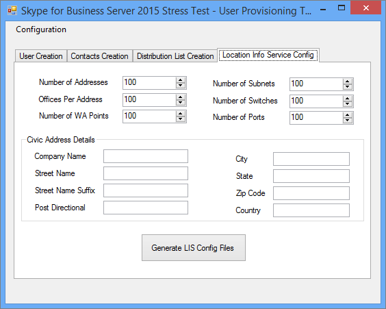
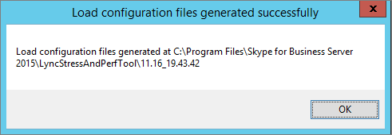

# <a name="using-the-skype-for-business-server-2015-stress-and-performance-tool"></a>Использование средства Skype для бизнеса Server и производительности 2015 г.
 
Чтобы запустить Skype для бизнеса Server 2015 года, необходимо иметь возможность управлять как пользователями, контактами, так и профилями пользователей, настраивать средство для выполнения, а затем просмотреть результаты или результаты, полученные с помощью этого средства.
  
Существует четыре области, связанные с выполнением Skype для бизнеса Server 2015 г. Средства стресса и производительности (исполняемый LyncPerfTool.exe):
  
- [Создание пользователей и контактов](using-the-tool.md#BKMK_CreateUsersAndContacts)
    
- [Настройка профиля пользователя](using-the-tool.md#BKMK_UserProfile)
    
- [Запуск LyncPerfTool](using-the-tool.md#BKMK_RunTool)
    
- [Интерпретация результатов](using-the-tool.md#BKMK_Interpret)
    
## <a name="create-users-and-contacts"></a>Создание пользователей и контактов
<a name="BKMK_CreateUsersAndContacts"> </a>

Для создания пользователей и контактов для тестирования стресса и производительности необходимо использовать средство предварительного Skype для бизнеса Server 2015 (SB 2015) (UserProvisioningTool.exe).
  
Это список полезных терминов, которые могут быть полезны при прочтях тем:
  
- **Организационное** подразделение — организационное подразделение Службы домена Active Directory (AD DS).
    
- **Federated / Cross Pool** — пользователи, которые могут общаться с пользователями из других служб обмена мгновенными сообщениями.
    
- **Списки рассылки** или DLs. Это объекты в AD DS, содержащие список пользователей AD DS. Они используются для облегчения общения между группами людей.
    
- **Служба** информации о расположении — служба Skype для бизнеса Server 2015 г., которая при ее включении и настройке на один телефон позволяет получить физическое расположение для служб Enhanced 911 (E911).
    
- **Номера** Телефон США — Телефон, присвоенные пользователю в дополнение к SIP URI, который используется для маршрутизов входящие и исходящие вызовы в обратный просмотр номера (RNL).
    
### <a name="create-users-and-contacts-by-using-userprovisioningtoolexe"></a>Создание пользователей и контактов с помощью UserProvisioningTool.exe

> [!NOTE]
> Перед началом работы убедитесь, что вы вошли в систему в качестве члена группы безопасности администраторов домена для запуска этого средства. Это необходимо сделать, так как вы создадим пользователей Active Directory. 
  
Для создания пользователей и контактов для моделирования нагрузки Skype для бизнеса Server средство предварительного обеспечения пользователей.
  
Средство **Skype для бизнеса Server пользователя** устанавливается с пакетом Skype для бизнеса Server **усилий** и производительности. Убедитесь, что установщик пакета (CapacityPlanningTool.msi) был работать на переднем или выпуск Standard сервере, который вы собираетесь протестировать.
  
Средство обеспечения Skype для бизнеса Server пользователей можно запустить с помощью файла UserProvisioningTool.exe (расположенного на %InstalledDirectory%LyncStressAndPerfTool\LyncStress) на переднем или выпуск Standard сервере.
  
> [!IMPORTANT]
> При создании большого количества пользователей (например, 10 000 или более) запустите UserProvisioningTool.exe. Это необходимо сделать, так как средство будет создавать и настраивать  *новых*  пользователей AD.
  
Когда откроется средство предварительного обеспечения пользователей, нажмите кнопку Конфигурация и выберите конфигурацию нагрузки. 
  
Чтобы приступить к настройке пользователей и контактов, загрузить файл по умолчанию, включенный в пакет, называемый "SampleData.xml". Это позволит засеять поля примерными данными, которые необходимо изменить, чтобы сделать их релевантной для развертывания.
  
Если у вас есть предварительно настроенный XML-файл, который уже содержит настраиваемые параметры, вы можете загрузить этот файл. Заполните поля в средстве предварительного обеспечения пользователей, как описано в разделах ниже.
  
### <a name="to-configure-server-options"></a>Настройка параметров сервера:

1. В поле **FQDN** переднего конечного пула введите полное доменное имя (FQDN) сервера выпуск Standard или пула переднего конца, в котором вы хотите принять пользователей.
    
2. В поле **Префикс имя** пользователя введите префикс, который необходимо использовать для перебора имен пользователей в целях тестирования (например, в "TestUser").
    
3. В поле **Пароль** введите пароль, который будет использоваться во всех тестовых учетных записях пользователей.
    
4. В поле **Домен учетной записи** введите доменное имя текущего домена AD (того, в котором необходимо создать тестовых пользователей).
    
5. В поле **Организационное подразделение** введите имя домена AD, в котором необходимо создать этих тестовых пользователей. (Если OU еще не существует, он будет создан для вас).
    
6. В поле **Телефон области введите** трехзначный код области, который будет использоваться во всех тестовых учетных записях пользователей. Убедитесь, что выбранный код области не конфликтует с кодами области других пользователей в AD.
    
7. Щелкните, чтобы выбрать окно **с** включенной голосовой поддержкой, если вы хотите включить тестовых пользователей для Корпоративная голосовая связь.
    
8. В поле **Число пользователей** укайте общее число тестовых пользователей, которые необходимо создать.
    
9. В поле **Start Index** передайте начальный номер, который будет использоваться в качестве суффикса, префиксу имени пользователя (например, префикс — "TestUser", а первое имя закончится в примере ниже .)
    
     
  
#### <a name="create-users-button"></a>Кнопка "Создание пользователей"

При нажатии кнопки **Create Users** параметры ввода, которые вы ввели, проверяются. Если есть какие-либо ошибки проверки, вам будет предложено исправить их. Или, если все значения верны, пользователи начнут появляться в AD (в зависимости от указанного вами OU). В нижней части инструмента вы увидите планку прогресса при его запуске. Не закрывайте приложение во время активного выполнения панели.
  
Создание пользователя требует времени, поэтому, пожалуйста, запланируйте. Этот процесс может занять от нескольких минут до нескольких часов для большого числа пользователей.
  
Если у вас нет доступа к контроллеру домена AD в тестовой среде, вы по-прежнему можете проверить создание пользователей, войдя в систему в качестве одного из пользователей в диапазоне пользователей, заданных для создания. Не забудьте использовать префикс и суффикс, а также @sipDomain имя пользователя. Вот пример:  <em>TestUser20@contoso.net</em>  .
  
> [!NOTE]
> Если пользователи уже существуют, нажатие кнопки Create Users обновит их с любыми изменениями конфигурации. 
  
#### <a name="delete-users-button"></a>Кнопка Удаление пользователей

При нажатии кнопки **"Удалить** пользователей" параметры ввода вкладки будут проверены. Если есть ошибки проверки, вам будет предложено исправить их, и если значения ввода верны, указанные тестовые пользователи будут отключены и удалены из Active Directory. В нижней части этой вкладки снова появится строка прогресса, и не следует закрывать приложение во время активного выполнения.
  
> [!NOTE]
> Поддерживаются только номера телефонов в формате США. Телефон номера всегда назначены пользователям, и все пользователи, созданные UserProvisioningTool.exe, включены для Корпоративная голосовая связь по умолчанию. Все сценарии, в которые используется номер телефона, например вызовы автосекретарь или UC-PSTN, используют этот номер телефона для правильного маршрута вызовов. По этой причине *каждый пользователь* должен иметь уникальный *номер телефона.*
  
> [!NOTE]
> **Если вам нужно создать пользователей дважды, команда не будет работать, если вы не используете другой код области или если предыдущие пользователи были отключены с помощью Disable-CsUser командлета.**
  
> [!IMPORTANT]
> Перед созданием контактов сначала необходимо завершить репликацию пользователей (что делается со вкладки "Пользователи"). 
  
> [!IMPORTANT]
> Если вы только что создали пользователей, вам потребуется подождать, пока Skype для бизнеса Server репликация завершится и заполнит учетные записи пользователей в базе данных. **Если пользователи еще не закончили репликацию, вы увидите ошибку.** Вы узнаете, когда пользователи завершат репликацию, если служба интерфейса Skype для бизнеса Server 2015 года запущена или успешно запущена Get-CsUser на последнем пользователе указанного вами общего числа.
  
#### <a name="contacts-creation-tab"></a>Вкладка Создание контактов

Эта вкладка позволяет предоставить сведения о контактах пользователей для тестирования.
  

  
### <a name="to-configure-users-contacts-do-the-following"></a>Чтобы настроить контакты пользователей, сделайте следующее:

1. В поле **Average Contacts per User** введите среднее число контактов для заполнения в списках контактов для каждого пользователя.
    
2. Выберите **фиксированный** контрольный ящик, если необходимо создать равное количество контактов для каждого пользователя. Если вы хотите изменить количество контактов, созданных для пользователей, очистить этот контрольный ящик.
    
3. В поле **Средняя контактная группа для пользователя** введите число контактных групп на одного пользователя. Это число должно быть меньше, чем **среднее число контактов на пользователя**.
    
4. В поле **Federated /Cross Pool Contacts Percentage** дайте номер от 0 до 100. Этот процент контактов будет создан с федерадными пользователями.
    
5. В поле **Префикс** пользователя федератов и кросс-пула укажи имя пользователя для федераированных пользователей, которое будет добавлено в списки контактов местных пользователей.
    
6. В поле SIP пользователя **федератов и** кросс-пула укапитать имя домена SIP федерадных пользователей.
    
7. На **вкладке Создание** пользователей убедитесь, что информация является правильной. Ваши контакты будут созданы из значений на вкладке Создание пользователей.
    
8. Нажмите **кнопку Создать контакты,** чтобы приступить к созданию контактов. Этот процесс может занять несколько минут. После его завершения появится диалоговое окно с сообщением "Операция успешно завершена". Вы можете проверить контакты, созданные при входе в систему в качестве пользователя, созданного со вкладки "Создание пользователей".
    
    > [!NOTE]
    > После создания контактов этот инструмент перезапустит все серверы переднего конца в целевом пуле. Запуск front End Servers может занять больше времени (до 2 часов) в зависимости от того, сколько контактов было создано этой операцией. 
  
#### <a name="distribution-list"></a>Список рассылки

Средство Skype для бизнеса Server и производительности 2015 г. может имитировать функцию расширения списка рассылки (DL) в клиенте Skype для бизнеса 2015 г. Вы можете пропустить этот шаг, если не собираетесь включить расширение DL в средстве подготовка пользователей.
  

  
Вкладка Список рассылки позволяет создавать DLs, которые средство стресс и производительность будет использовать для функции расширения списка рассылки. Перед созданием DLs необходимо развернуть Skype для бизнеса Server 2015 г., в том числе запустить ForestPrep. Если этого не сделать, атрибуты DL не будут существовать в схеме AD, поэтому средство не сможет создавать DLs.
  
### <a name="to-configure-distribution-lists"></a>Настройка списков рассылки:

1. В поле **Число** списков рассылки укайте общее число DLs, которые необходимо создать (рекомендация здесь в том, что вы начинаете со значения, которое в два раза больше числа пользователей, которые у вас есть.).
    
2. В поле **Префикс списка** рассылки введите префикс, который будет иметь все создавайте DLs, например *testDL.* Это означает, что при 100 DL имена DL будут выглядеть так: testDL0, testDL1, до testDL99.
    
3. В поле **Минимальные участники в поле Dist. Список** введите минимальное число пользователей, которые будут помещаться в каждый DL.
    
4. В поле Максимальное число участников **в поле Dist. Список** введите максимальное число пользователей, добавляемого в каждом DL.
    
#### <a name="create-distribution-lists-button"></a>Кнопка Создание списков рассылки

При нажатии кнопки Создать списки рассылки средство запрашивает Active Directory, чтобы узнать, существуют ли списки рассылки, совпадающие с префиксом и цифрами. Средство создает все DLs, которые еще не существуют. При добавлении участников в эти вновь созданные списки рассылки он будет выбирать пользователей из диапазона, указанного на вкладке Создание пользователей.
  
#### <a name="location-info-service-config-tab"></a>Вкладка Config службы информации о расположении

Средство Skype для бизнеса Server и производительности 2015 г. также может создавать фитофайковые файлы конфигурации для службы информации о расположении. Обратите внимание, что служба сведений о расположении обычно не оказывает существенного влияния на производительность серверов. 
  

  
Если вы решите протестировать эту функцию, заполните значения в форме и нажмите кнопку Create LIS Config Files, которая создаст .CSV файлы, называемые:
  
- LIS_Subnet.csv
    
- LIS_Switches.csv
    
- LIS_Ports.csv
    
- LIS_WAP.csv
    
Чтобы импортировать эти файлы в базу данных LIS, используйте эти кодлеты PowerShell:
  
- Set-CsLisSubnet
    
- Set-CsLisSwitch
    
- Set-CsLisPort
    
- Set-CsWirelessAccessPoint
    
## <a name="configure-user-profile"></a>Настройка профиля пользователя
<a name="BKMK_UserProfile"> </a>

После создания пользователей (с помощью средства создания пользователей) можно настроить профили пользователей с помощью средства конфигурации нагрузки Skype для бизнеса Server 2015 г. (UserProfileGenerator.exe).
  
### <a name="running-the-skype-for-business-server-2015-load-configuration-tool"></a>Запуск Skype для бизнеса Server конфигурации нагрузки 2015 г.

Запустите средство конфигурации нагрузки (UserProfileGenerator.exe) и заполните вкладки. Этот инструмент создает каталог для каждого из клиентских компьютеров, необходимый для запуска моделирования. Каждый клиентский каталог поставляется со сценарием для запуска Skype для бизнеса Server 2015 года (LyncPerfTool.exe). В разделах ниже приведены примеры заполнения полей на каждой вкладке средства конфигурации нагрузки Skype для бизнеса Server 2015 г.
  
> [!IMPORTANT]
> Значения, используемые в средстве конфигурации нагрузки (UserProfileGenerator.exe), должны соответствовать значениям, указанным в инструменте создания пользователей Skype для бизнеса Server 2015 г. (UserProvisioningTool.exe) для пула. 
  
#### <a name="common-configuration-tab"></a>Общая вкладка Конфигурация

Общая **вкладка Конфигурация** средства конфигурации нагрузки показана ниже. Заполните поля вкладки "Общая конфигурация", как описано в следующих действиях.
  

  
1. В поле **Число доступных** машин введите число компьютеров, которые необходимо использовать для запуска средства Stress and Performance (LyncPerfTool.exe). Мы рекомендуем иметь один компьютер на каждые 4500 пользователей, которые будут имитируть, но это число может отличаться при снижении уровня нагрузки или использовании только подмножества доступных функций инструмента (уровни нагрузки задаются на вкладке Общие сценарии).
    
2. В поле **Префикс для имен** пользователей введите префикс для поля имен пользователей всех пользователей. Для входа в единый идентификатор ресурсов (URI) будет: *UserPrefix[Индекс запуска пользователя... (Число пользователей-1)] @User Домен,*  например, myUser009@Contoso.com.
    
3. В поле **Пароль для всех пользователей** введите пароль, используемый при создании пользователей. Если вы оставите это поле пустым, имя пользователя будет заданной в качестве пароля.
    
4. В поле **Индекс запуска пользователя** введите индекс первого пользователя, который будет настроен. Вы можете настроить различные диапазоны для различных типов или уровней нагрузки, но необходимо запустить средство конфигурации нагрузки (UserProfileGenerator.exe) один раз в диапазоне, который вы хотите настроить.
    
5. В поле **Число пользователей** введите общее число пользователей, которые вы собираетесь настроить.
    
6. В поле **Домен пользователя** введите домен, используемый для SIP URI. Это используется для создания SIP URI каждого пользователя для входа на сервер Skype для бизнеса Server 2015 или выпуск Standard сервера, и может быть отличается от домена учетной записи.
    
7. В поле **Домен учетной записи** введите логотип домена AD DS.
    
8. В поле **MPOP Percentage** (Multiple Point of Presence percentage) указать значение для процента пользователей, которые вошли в систему с нескольких машин или устройств, например 10 процентов.
    
9. Введите максимальное количество одновременно конечных точек в поле "Вход в секунду" **(в экземпляре).** Это максимальное количество входных записей для пользователей, и эта рекомендация не превышает/равна 2 в секунду (<=2).
    
10. В поле **Access Proxy или Pool FQDN** введите полное доменное имя (FQDN) сервера, на который нужно подключить клиентов. Если пользователи во время входа во внешнем доступе, необходимо ввести прокси-сервер доступа. Если пользователи являются внутренними, дайте FQDN их Enterprise пула или выпуск Standard сервера.
    
11. В поле **Порт** введите порт, который необходимо использовать пользователям для SIP (по умолчанию здесь 5061).
    
12. Для поля **внешних сетевых серверов Параметры** в поле Access Proxy или Pool FQDN и, опять же, **порт**. Эти параметры используются только для моделирования загрузки внешних конечных точек.
    
#### <a name="general-scenarios-tab"></a>Вкладка Общие сценарии


  
Вы можете настроить уровни нагрузки и параметры для каждого из общих сценариев, предлагаемых путем определения того, что вы хотите запустить или оставить отключенным. Вот общие параметры:
  
> [!NOTE]
> Значения уровня нагрузки для всех полей, но локальные информационные службы **отключены,** **низкие,** **средние,** **высокие** или **настраиваемые.** Если вы выбираете любой параметр, но отключен, для каждого клиента создаются конфигурации. Высокие результаты в максимальной поддерживаемой нагрузке на сервер; средняя — 60% высокой нагрузки; низкий — 30%. 
  
- **Мгновенные сообщения —** Это включает одноранговую и конференцию; выберите соответствующее значение для уровня нагрузки.
    
- **Аудиоконференция —** Выберите уровень нагрузки только для *аудиоконференций.* Вызовы одноранговых вызовов будут решаться чуть позже в разделе **Сценарии** голосовой звонков. Откройте **вкладку Advanced,** чтобы включить MultiView.
    
- **Совместное использование приложений —** Выберите уровень нагрузки для общего доступа к приложениям.
    
- **Совместная работа с данными** Выберите уровень нагрузки для совместной работы с данными, который включает в себя конференцию данных.
    
- **Расширение списка рассылки —** Нажмите **кнопку Advanced** и заполните поле с помощью тех же значений, настроенных на вкладке DL средства создания пользователей (UserProvisioningTool.exe). Выберите уровень нагрузки.
    
- **Веб-запрос адресной книги —** Это служба смотра адресной книги, а не загрузка файлов адресной книги. Если вы хотите включить это для скачивания файлов адресной книги, нажмите кнопку **Advanced** и установите **EnableABSDownload** в True. Дайте значение для уровня нагрузки.
    
- **Служба групп реагирования —** Нажмите **кнопку Advanced** и укажите URL-адреса групп ответа, созданных при предоставлении агентов службы группы реагирования. Необходимо выбрать по крайней мере одну группу ответов. Чтобы использовать больше, разделять группы отклика с полуколонами. Обновление **RGSUriSuffixStartIndex** и **RGSUriSuffixEndIndex** до фактических значений. Выберите уровень нагрузки.
    
- **Службы информации о расположении —** Выберите уровень нагрузки включен или отключен.
    
> [!NOTE]
> Каждый из сценариев имеет кнопку Advanced, расположенную рядом с ней, и набор флажков, которые позволяют использовать изменения в параметре по умолчанию. 
  
- Выбор  *Ad-hoc*  позволит инструменту создавать моделирование конференций, которые будут создаваться в течение часа.
    
- Выбор  *большого конференц-зала*  означает, что будет смоделирован сценарий большой конференции.
    
-  *Внешний*  сообщает инструменту, чтобы также имитировать внешних пользователей.
    
Эти кнопки и флажки являются дополнительными значениями, определенными для каждого сценария, и изменят поведение средства стресса и производительности и сделают возможной настройку.
  
Для каждого сценария на вкладке Общие сценарии (за исключением служб информации о расположении), если значение уровня нагрузки настраивается, то скорость беседы будет вычисляться с помощью соответствующего поля в диалоговом окне Advanced. Имя поля может отличаться в зависимости от сценария, но в описании поля будет заявляться: ПРИМЕЧАНИЕ Это число будет использоваться только в том случае, если настраиваемый выбран из выпадаемого *меню.*
  
Значения **High,** **Medium** и **Low** изменят ставки беседы за модальность в соответствии с моделью пользователя, которая является балансом всех сценариев. Если необходимо изменить уровень нагрузки на один модальность из-за разницы в ожидаемом использовании, используйте настраиваемую скорость беседы.
  
#### <a name="voice-scenarios-tab"></a>Вкладка Сценарии голосовой платы

Это вкладка для настройки всех сценариев, связанных с голосом.
  

  
Доступны следующие параметры:
  
- **VoIP —** Нажмите **кнопку Advanced** и добавьте значения для полей PhoneAreaCode и LocationProfile (dial plan). Вы также указаете значение для уровня нагрузки. Если вы выбираете уровень нагрузки для включенного шлюза VoIP или UC/PSTN, то для имитации внешних вызовов будет создан общедоступный телефонный канал (PSTN) для единого файла конфигурации коммуникаций (UC).
    
- **Шлюз UC/PSTN —** Необходимо выбрать значение уровня нагрузки, и при выборе чего-либо, кроме отключенного, необходимо также предоставить значение для кода области PSTN, нажав кнопку **Advanced.** Щелкните **Добавить** под сервером-посредником и PSTN. Убедитесь, что у вас есть маршрут, настроенный для кода области.
    
    > [!TIP]
    > Для проверки конфигурации голосового маршрута Skype для бизнеса панели управления или Skype для бизнеса панели управления. 
  
- **помощник по конференц-связи -** Поставляем значение для уровня нагрузки. Любое значение, кроме отключенного, включает поле **номер телефона.** Введите номер телефона автосекретарь, который вы хотите использовать. Нажмите **кнопку Advanced** и укажи значение для **поля LocationProfile.**
    
- **Служба парковки вызовов —** Здесь поставляем уровень нагрузки.
    
- **Сервер-посредник и PSTN -** Каждый сервер-посредник, который вы хотите использовать, нуждается в собственном симуляторе PSTN. После того как вы определите, какой клиент вы собираетесь использовать для симулятора, настройте сервер-посредник для маршрутных вызовов на этот компьютер на настраиваемом имитаторе PSTN. Нажмите **кнопку Добавить,** чтобы настроить значение для сервера-посредника.
    
    > [!NOTE]
    > Каждый сценарий имеет кнопку Advanced, расположенную рядом с ней. Расширенные диалоги содержат параметры, специфические для каждого сценария, которые изменяют поведение средства стресса и производительности и позволяют настраивать. > для каждого сценария на вкладке Сценарии голосовой поддержки, если значение уровня нагрузки настраивается, то скорость разговора будет вычисляться с помощью соответствующего поля в диалоговом окне Advanced. Имя поля может отличаться в зависимости от сценария, но в описании поля будет заявляться: ПРИМЕЧАНИЕ Это число будет использоваться только в том случае, если настраиваемый выбран из выпадаемого *меню.*
  
#### <a name="web-app-tab"></a>Вкладка Веб-приложение


  
Веб-приложение поддерживает сценарии конференций с помощью сервера API Единой системы связи (UCWA), установленного на переднем сервере. Используйте вкладку Web App для настройки всех сценариев, связанных с веб-приложениями. Доступные варианты:
  
- **Общие веб-приложения Параметры -** Нажмите **кнопку Дополнительные Параметры** и установите **ReachTargetServerUrl** в виртуальный IP-адрес Пула каталогов (VIP) VIP-адреса переднего пула.
    
- **Совместное использование приложений —** Выберите значение для уровня нагрузки.
    
- **Совместная работа с данными** Выберите значение для уровня нагрузки.
    
- **Мгновенные сообщения —** Выберите значение для уровня нагрузки.
    
- **Голосовое конференция —** Выберите значение для уровня нагрузки.
    
> [!NOTE]
> Каждый из сценариев имеет **кнопку Advanced,** расположенную рядом с ней. Расширенные диалоги содержат значения, специфические для каждого сценария, которые изменят поведение средства стресса и производительности и позволят настроить.> Для каждого из сценариев веб-приложения, если настраивается уровень нагрузки, то вместо по умолчанию используется значение, указанное в поле **ConversationsPerHour.**
  
#### <a name="mobility-tab"></a>Вкладка Mobility

Используйте эту вкладку, чтобы настроить все сценарии, связанные с мобильностью.
  

  
Ниже параметров:
  
- **Общие Параметры -** Нажмите **кнопку Дополнительные Параметры** и установите поле UcwaTargetServerUrl виртуальному IP-адресу Пула директоров (VIP) или VIP-адресу пула передней части.
    
- **Присутствие и P2P мгновенные сообщения/аудио -** Выберите значение для уровня нагрузки, чтобы включить моделирование мобильности.
    
> [!NOTE]
> Каждый из сценариев имеет **кнопку Advanced,** расположенную рядом с ней. Расширенные диалоги содержат значения, специфические для каждого сценария, которые изменят поведение средства стресса и производительности и позволят настроить.> Для каждого из сценариев мобильности, если уровень нагрузки настраивается, то вместо по умолчанию используется значение, указанное в поле **ConversationsPerHour.**
  
#### <a name="summary-tab"></a>Вкладка Сводка

Вкладка Сводка указывает, какие пользователи будут использовать для каждого из сценариев.
  

  
Вкладка Сводка указывает, какие пользователи будут использовать для каждого из сценариев. 
  
Можно вручную настроить диапазоны номеров пользователей, выбрав окно Enable **Custom User Range Generation,** а затем дважды щелкнув сценарий в таблице с диапазоном пользователей, который необходимо настроить.
  
Проверьте **(RunClient.bat)** Добавьте задержку при входе при запуске, чтобы включить задержки в созданные пакетные файлы, чтобы соответствовать скорости регистрации. Это полезно для предотвращения перегрузки сервера при входе в большое число пользователей.
  
Щелкните **Создание файлов** и выберите папку, в которой необходимо создать конфигурацию. Диалоговое окно появится после успешного создания файлов.
  

  
## <a name="run-lyncperftool"></a>Запуск LyncPerfTool
<a name="BKMK_RunTool"> </a>

Необходимо создать пользователей, контакты и сценарии перед запуском Skype для бизнеса Server 2015 года (LyncPerfTool.exe). Дополнительные сведения об использовании средств для выполнения этих действий см. в статье [Create Users and Contacts](using-the-tool.md#BKMK_CreateUsersAndContacts) and [Configure User Profile](using-the-tool.md#BKMK_UserProfile) previously in this article. При запуске этих средств будет также создаваться файл, который будет работать с помощью средства Stress и Performance в составе пакетного файла с включенными параметрами.
  
### <a name="running-the-skype-for-business-server-2015-stress-and-performance-tool"></a>Запуск средства Skype для бизнеса Server и производительности 2015 г.

Средство конфигурации нагрузки (UserProfileGenerator.exe) создает пакетный файл, который позволяет запускать средство stress and Performance (LyncPerfTool.exe) путем регистрации счетчиков производительности и загрузки файла конфигурации XML. Пакетный файл выполняет один экземпляр LyncPerfTool.exe каждого файла конфигурации. Чтобы запустить пакетный файл, выполните следующие действия:
  
### <a name="run-the-stress-and-performance-test"></a>Запустите тест на стресс и производительность

1. Скопируйте папку с папками конфигурации и файлами внутри в каталог, который LyncPerfTool.exe на каждом клиентом компьютере. (Например, если вы создали файлы конфигурации в папке с именем 1.28_13.16.16, скопируйте эту папку в папку с LyncPerfTool.exe в ней. Сделайте это на каждом клиенте.)
    
2. Перейдите к папке клиента и запустите пакетный скрипт **RunClient.** Пакетный файл можно дважды щелкнуть в Windows Explorer, и он будет запускать все файлы конфигурации для этого клиента. Сценарий также можно запустить из клиентской папки, используя следующий синтаксис:
    
   ```console
   RunClient0.bat "C:\Program Files\Skype for Business Server 2015\LyncStressAndPerfTool\LyncStress" 
   ```

Чтобы запустить средство Stress и Performance напрямую, откройте командную строку и введите следующую команду в командной строке (и при первом запуске обязательно зарегистрируйте счетчики производительности, как показано в заметке ниже в этом  `regsvr32 /i /n /s LyncPerfToolPerf.dll` разделе):
  
```console
LyncPerfTool.exe /file:IM_client0.xml
```

Чтобы средство отображало значения в файле конфигурации, включай параметр в предшествую команду, чтобы он выглядел  `/displayfile` так:
  
```console
LyncPerfTool.exe /file:IM_client0.xml /displayfile
```

Чтобы  *закончить*  процесс, нажмите кнопку Ctrl+C.
  
> [!NOTE]
> Прежде чем запускать средство Stress и Performance напрямую, необходимо зарегистрировать счетчики производительности по следующей команде:  `regsvr32 /i /n /s LyncPerfToolPerf.dll`
  
> [!NOTE]
> Каждый экземпляр средства "Стресс и производительность", который вы начинаете, сразу же начнет подписываться в пользователях, как правило, со скоростью одного пользователя в секунду. 
  
Пиковая скорость входов пользователя для пула составляет около 12 в секунду. Это означает, что не следует запускать более 12 экземпляров LyncPerfTool.exe одновременно, пока пользователи еще войт. Тысяча пользователей будет принимать около 20 минут, чтобы полностью войти в один в секунду.
  
## <a name="interpreting-the-results"></a>Интерпретация результатов
<a name="BKMK_Interpret"> </a>

Средство Skype для бизнеса Server и производительности 2015 г. имеет множество счетчиков, которые помогут вам понять, что делает клиент и сталкиваются ли они с вопросами.
  
### <a name="client-counters"></a>Счетчики клиентов

Каждый экземпляр LyncPerfTool.exe имеет отдельный экземпляр счетчиков. Каждый экземпляр называется его ID процесса. Если клиенты перегружены, могут возникать другие проблемы. Чтобы предотвратить эти проблемы:
  
- Мониторинг использования ЦП и памяти на клиентских компьютерах. Если процессор постоянно превышает 90 процентов, уменьшите число пользователей.
    
- Если объем памяти высок, могут возникнуть проблемы, если в файле страницы начинает не оказаться места. Убедитесь, что плата за фиксацию не бьет предел на компьютере. Если вы работаете с ограничениями памяти, рассмотрите возможность увеличения размера файла страницы или уменьшения числа пользователей.
    
Вот список ключевых счетчиков производительности:
  
**Общие сведения**

|**Счетчик производительности**|**Описание**|
|:-----|:-----|
|Время, затраченное в минутах  <br/> |Время, затраченное с момента начала процесса.  <br/> |
|Активные конечные точки  <br/> |Количество конечных точек, подключенных к серверу.  <br/> |
|Failed Logons  <br/> |Общее число сбоев в входе конечной точки.  <br/> |
|Попытки логона  <br/> |Общее количество попыток входов в конечную точку.  <br/> |
|Отключены конечные точки  <br/> |Общее число отключенных конечных точек.  <br/> |
   
**Сведения о присутствии**

|**Счетчик производительности**|**Описание**|
|:-----|:-----|
|Вызовы setPresence  <br/> |Общее число попыток изменения присутствия. Для различных типов изменений присутствия см. счетчик производительности вызовов SetPresence (Тип присутствия).  <br/> |
|Ответы NNN для SetPresence  <br/> |Общее количество кодов ответа nnn, полученных с сервера.  <br/> |
|Вызовы GetPresence  <br/> |Общее число попыток запроса на присутствие.  <br/> |
|Ответы NNN для GetPresence  <br/> |Общее количество кодов ответа nnn, полученных с сервера.  <br/> |
   
**Сведения о службе адресной книги**

|**Счетчик производительности**|**Описание**|
|:-----|:-----|
|Попытка загрузки файлов ABS Full/Delta  <br/> |Общее число попыток загрузки полных или дельта-файлов.  <br/> |
|Успешное скачивание файлов ABS Full/Delta  <br/> |Общее число попыток загрузки полных или дельта-файлов.  <br/> |
|Счетчики службы веб-запросов адресной книги  <br/> |Счетчики загрузки файлов адресных книг.  <br/> |
|Попытка звонков САБ WS  <br/> |Общее число попыток запроса на веб-запросы адресной книги.  <br/> |
|Вызовы ABS WS увенчались успехом  <br/> |Общее число запросов служб веб-запроса адресной книги, которые возвращали код успешного ответа.  <br/> |
|Сбой вызовов ABS WS  <br/> |Общее число запросов службы веб-запросов адресной книги, которые возвращали код ответа на ошибку.  <br/> |
   
> [!NOTE]
> В эту категорию входят счетчики, используемые для мониторинга скачивания файлов службы адресной книги (ABS) и запросов службы веб-запросов адресной книги. 
  
**Сведения о списке рассылки (DL)**

|**Счетчик производительности**|**Описание**|
|:-----|:-----|
|Попытка вызовов  <br/> |Общее число запросов веб-службы расширения списка рассылки (DLX).  <br/> |
|Успешное вызовы  <br/> |Общее число запросов веб-службЫ DLX, которые возвращали код успешного ответа.  <br/> |
|Сбой вызовов  <br/> |Общее число запросов веб-службы DLX, возвращаемого кодом ответа на ошибки.  <br/> |
   

  
> [!NOTE]
> Счетчики производительности, указанные ниже номеров отчетов для всех вызовов голосовой связи по IP (VoIP), включая вызовы на сервер-посредник, сервер конференц-связи A/V, edge Server, приложение группы ответа и конференц-автосекретарь, когда эти сценарии включены. 
  
**Основные сведения VoIP**

|**Счетчик производительности**|**Описание**|
|:-----|:-----|
|Вызовы Активные  <br/> |Общее количество входящих и исходяющих голосовых вызовов, которые продолжаются в настоящее время.  <br/> |
|Прерываются вызовы  <br/> |Общее количество входящих и исходяющих голосовых вызовов, которые уже прекращены.  <br/> |
|Вызовы отклонены  <br/> |Общее число входящих голосовых вызовов сократилось.  <br/> |
|Попытка входящих и исходяющих вызовов  <br/> |Общее число попыток входящих и исходяющих голосовых вызовов.  <br/> |
|Установленные входящие и исходяющие вызовы  <br/> |Общее количество входящих и исходяющих голосовых вызовов установлено.  <br/> |
|Вызовы, полученные NNN  <br/> |Общее количество кодов ответа nnn, полученных с сервера.  <br/> |
|Скорость прохода VoIP (%)  <br/> |Общее количество вызовов, установленных и попытавшихся звонков.  <br/> |
   
**Сведения о вызове службы группы ответов**

|**Счетчик производительности**|**Описание**|
|:-----|:-----|
|Вызовы Активные  <br/> |Общее количество активных звонков в приложение Группы отклика.  <br/> |
|Попытка вызовов  <br/> |Общее количество попыток звонков.  <br/> |
   
**Сведения о вызове мгновенных сообщений**

|**Счетчик производительности**|**Описание**|
|:-----|:-----|
|Вызовы Активные  <br/> |Общее количество текущих входящих и исходяющих вызовов мгновенных сообщений.  <br/> |
|Прерываются вызовы  <br/> |Общее количество входящих и исходяющих вызовов мгновенных сообщений, которые уже прекращены.  <br/> |
|Вызовы, полученные NNN  <br/> |Общее количество кодов ответа nnn, полученных с сервера.  <br/> |
|Мгновенные сообщения, полученные и отправленные  <br/> |Общее количество сообщений, полученных или отправленных для всех сеансов.  <br/> |
|Попытка входящих и исходяющих вызовов  <br/> |Общее число попыток входящих и исходяющих вызовов мгновенных сообщений.  <br/> |
|Установленные входящие и исходяющие вызовы  <br/> |Общее количество входящих и исходяющих вызовов мгновенных сообщений установлено.  <br/> |
   
**Сведения о вызове общего доступа к приложениям**

|**Счетчик производительности**|**Описание**|
|:-----|:-----|
|Вызовы Активные  <br/> |Общее количество текущих вызовов общего доступа к приложениям.  <br/> |
|Прерываются вызовы  <br/> |Общее число входящих и исходяющих вызовов общего доступа к приложениям, которые уже прекращены.  <br/> |
|Вызовы, полученные NNN  <br/> |Общее количество кодов ответа nnn, полученных с сервера.  <br/> |
|Попытка входящих и исходяющих вызовов  <br/> |Общее число попыток входящих и исходяющих вызовов общего доступа к приложениям.  <br/> |
|Установленные входящие и исходяющие вызовы  <br/> |Установлено общее число входящих и исходяющих вызовов общего доступа к приложениям.  <br/> |
   
**Сведения о вызовах CAA**

|**Счетчик производительности**|**Описание**|
|:-----|:-----|
|Вызовы Активные  <br/> |Общее число вызовов входящих и исходяющих общедоступных телефонных сетей (PSTN) в настоящее время.  <br/> |
|Прерываются вызовы  <br/> |Общее число входящих и исходяющих вызовов PSTN уже прекращено.  <br/> |
|Попытка входящих и исходяющих вызовов  <br/> |Общее число попыток входящих и исходяющих вызовов PSTN.  <br/> |
|Установленные входящие и исходяющие вызовы  <br/> |Общее количество входящих и исходяющих вызовов PSTN установлено.  <br/> |
   
**Сведения о конференции**

|**Счетчик производительности**|**Описание**|
|:-----|:-----|
|Конференции активного обмена мгновенными сообщениями  <br/> |Общее количество текущих конференций обмена мгновенными сообщениями.  <br/> |
|Активные аудио- и видеоконференции  <br/> |Общее количество текущих аудио- и видеоконференции.  <br/> |
|Конференции активного обмена приложениями  <br/> |Общее количество текущих конференций общего доступа к приложениям.  <br/> |
|Количество участников  <br/> |Общее число участников, подключенных к конференциям.  <br/> |
|Сбой в расписании конференций  <br/> |Общее количество сбоев при попытке запланировать конференцию.  <br/> |
|Регистрация сбоя конференции  <br/> |Общее количество сбоев при попытке подключения к конференции.  <br/> |
   
**Клиентские счетчики UCWA**

|**Счетчик производительности**|**Описание**|
|:-----|:-----|
|Успешное общее число присоединяется к IMMCU  <br/> |Общее число конференций обмена мгновенными сообщениями.  <br/> |
|Успешное общее число оккупантов DMCU  <br/> |Общее число конференций A/V.  <br/> |
   

