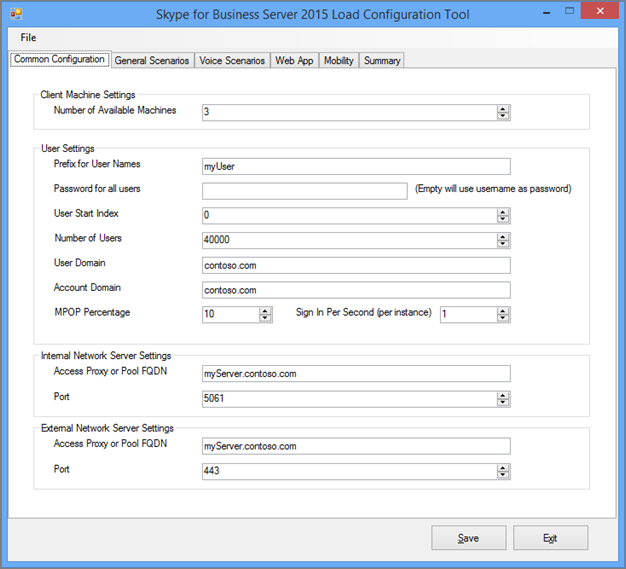

# <a name="using-the-skype-for-business-server-2015-stress-and-performance-tool"></a>Использование средства "Нагрузка и производительность Skype для бизнеса Server 2015"
 
To run the Skype for Business Server 2015 Stress and Performance Tool, you'll need to be able to manage both users, contacts and user profiles, configure the tool for running, and then review the output or results that are produced by the tool.
  
При запуске средства Stress and Performance Skype для бизнеса Server 2015 существует четыре области (исполняемый LyncPerfTool.exe):
  
- [Создание пользователей и контактов](using-the-tool.md#BKMK_CreateUsersAndContacts)
    
- [Настройка профиля пользователя](using-the-tool.md#BKMK_UserProfile)
    
- [Запуск LyncPerfTool](using-the-tool.md#BKMK_RunTool)
    
- [Интерпретация результатов](using-the-tool.md#BKMK_Interpret)
    
## <a name="create-users-and-contacts"></a>Создание пользователей и контактов
<a name="BKMK_CreateUsersAndContacts"> </a>

Для создания пользователей и контактов для тестирования нагрузки и производительности необходимо использовать средство пользовательской подготовка Skype для бизнеса Server 2015 (SB 2015 UserProvisioningTool.exe).
  
Это список полезных терминов, которые могут быть полезны при прочтях разделов:
  
- **Подразделение —** подразделение доменных служб Active Directory (AD DS).
    
- **Federated / Cross Pool** — пользователи, которые могут общаться с пользователями из других служб обмена мгновенными сообщениями.
    
- **Списки рассылки** или списки рассылки. Это объекты в AD DS, содержащие список пользователей AD DS. Они используются для упрощения взаимодействия между группами людей.
    
- **Служба** информации о расположении — служба Skype для бизнеса Server 2015, которая, когда она включена и настроена на телефон, позволяет получить физическое расположение для служб Enhanced 911 (E911).
    
- **Телефонные** номера в США — номера телефонов, присвоенные пользователю в дополнение к SIP URI, который используется для маршрутки входящие и исходящие вызовы при обратном подсмотре номера (RNL).
    
### <a name="create-users-and-contacts-by-using-userprovisioningtoolexe"></a>Создание пользователей и контактов с помощью UserProvisioningTool.exe

> [!NOTE]
> Прежде чем начать, убедитесь, что вы вошли в систему как участник группы безопасности "Администраторы домена", чтобы запустить это средство. Это необходимо сделать, так как вы собираетесь создавать пользователей Active Directory. 
  
Для создания пользователей и контактов для имитации загрузки необходимо использовать средство пользовательской подготовка Skype для бизнеса Server.
  
Средство **пользовательской подготовка Skype для** бизнеса Server устанавливается вместе с пакетом средства **"Нагрузка** и производительность Skype для бизнеса Server". Убедитесь, что установщик пакетов (CapacityPlanningTool.msi) был установлен на сервере переднего сервера или сервере Standard Edition, который вы собираетесь протестировать.
  
Чтобы запустить средство пользовательской подготовка Skype для бизнеса Server, запустите файл UserProvisioningTool.exe (расположенный в папке %InstalledDirectory%LyncStressAndPerfTool\LyncStress) на сервере переднего интерфейса или на сервере Standard Edition.
  
> [!IMPORTANT]
> При создании большого количества пользователей (например, 10 000 или более) запустите UserProvisioningTool.exe. Это необходимо, так как средство будет создавать и  *настраивать*  новых пользователей AD.
  
Когда откроется средство пользовательской подготовка, нажмите кнопку "Конфигурация" и выберите конфигурацию загрузки. 
  
Чтобы приступить к настройке пользователей и контактов, загрузите файл по умолчанию, включенный в пакет, под названием "SampleData.xml". При этом поля будут предварительно засеяны примерами данных, которые необходимо изменить, чтобы сделать их релевантными для развертывания.
  
Если у вас есть предварительно настроенный XML-файл, который уже содержит настроенные параметры, вы можете загрузить этот файл. Заполните поля в средстве пользовательской наполнения, как описано в разделах ниже.
  
### <a name="to-configure-server-options"></a>Чтобы настроить параметры сервера:

1. В  поле полного доменного имени пула переднего сервера введите полное доменное имя (FQDN) сервера Standard Edition или пула переднего сервера, в котором должны быть пользователи.
    
2. В поле **"Префикс** имени пользователя" введите префикс, который будет использовать для проверки имен пользователей (например, TestUser).
    
3. В поле **"Пароль"** введите пароль, который будет использоваться во всех тестовых учетных записях пользователей.
    
4. В поле **"Домен** учетной записи" введите доменное имя текущего домена AD (того, в котором вы хотите создать тестовых пользователей).
    
5. В поле **"Подразделение"** введите имя домена AD, в котором будут создаваться тестовые пользователи. (Если это OU еще не существует, оно будет создано для вас).
    
6. В поле **"Код города** телефона" введите трехзначный код области, который будет использоваться во всех тестовых учетных записях пользователей. Убедитесь, что выбранный код области не конфликтует с кодами других пользователей в AD.
    
7. Если вы  хотите включить проверку пользователей для проверки Корпоративная голосовая связь, щелкните этот Корпоративная голосовая связь.
    
8. В поле **"Число пользователей"** задайте общее количество тестовых пользователей, которые вы хотите создать.
    
9. В  поле "Начальный индекс" задайте начальный номер, который будет использоваться в качестве суффикса к префиксу имени пользователя (например, префикс "TestUser", а имя в примере ниже заканчивается на "0").)
    
     
  
#### <a name="create-users-button"></a>Кнопка "Создать пользователей"

При нажатии кнопки **"Создать** пользователей" вводимые входные параметры проверяются. Если имеются ошибки проверки, вам будет предложено исправить их. Или, если все значения указаны правильно, пользователи начнут отображаться в AD (в зависимости от указанного вами OU). Вы увидите строку хода выполнения в нижней части инструмента при его запуске. Не закрывайте приложение, пока активна г. ход выполнения.
  
Создание пользователей занимает много времени, поэтому спланируйте их соответствующим образом. Этот процесс может занять от нескольких минут до нескольких часов для большого числа пользователей.
  
Если у вас нет доступа к контроллеру домена AD в тестовой среде, вы по-прежнему можете проверить создание пользователей, войдя в систему как один из пользователей в диапазоне пользователей, которые вы указали для создания. Не забудьте использовать префикс и суффикс вместе с @sipDomain в качестве имени пользователя. Вот  <em>пример:</em>  TestUser20@contoso.net.
  
> [!NOTE]
> Если пользователи уже существуют, нажатие кнопки "Создать пользователей" обновит их любыми изменениями конфигурации. 
  
#### <a name="delete-users-button"></a>Кнопка "Удалить пользователей"

При нажатии кнопки **"Удалить пользователей"** входные параметры вкладки проверяются. Если имеются ошибки проверки, вам будет предложено исправить их, а если входные значения указаны правильно, указанные тестовые пользователи будут отключены и удалены из Active Directory. В нижней части этой вкладки снова появится строка хода выполнения, и не следует закрывать приложение, пока она активна.
  
> [!NOTE]
> Поддерживаются только номера телефонов в формате США. Номера телефонов всегда назначены пользователям, и все пользователи, созданные UserProvisioningTool.exe по умолчанию, Корпоративная голосовая связь для пользователей. Любой сценарий, в который используется номер телефона, например вызовы автосекретарь или вызовы UC-PSTN, используют этот номер телефона для правильной маршрутки вызовов. По этой причине у *каждого пользователя* должен быть уникальный *номер телефона.*
  
> [!NOTE]
> **Если требуется создать пользователей дважды, команда не будет работать, если не используется другой код области или если предыдущие пользователи были отключены с помощью Disable-CsUser командлета.**
  
> [!IMPORTANT]
> Перед созданием контактов сначала необходимо выполнить репликацию пользователей (что делается на вкладке "Пользователи"). 
  
> [!IMPORTANT]
> If you've just created your users, you'll need to wait until Skype for Business Server replication completes and populates the user accounts in the database. **Если пользователи не завершили репликацию, вы увидите ошибку.** You'll know when users have finished replicating if the Skype for Business Server 2015 Front End service has started, or by successfully running the Get-CsUser cmdlet on the last user of the total number you specified.
  
#### <a name="contacts-creation-tab"></a>Вкладка "Создание контактов"

На этой вкладке можно предоставить сведения о контактах пользователей для тестирования.
  

  
### <a name="to-configure-users-contacts-do-the-following"></a>Чтобы настроить контакты пользователей, сделайте следующее:

1. В поле **"Среднее число контактов на** пользователя" введите среднее число контактов, которые необходимо заполнить в списках контактов для каждого пользователя.
    
2. Если необходимо **создать** одинаковое количество контактов для каждого пользователя, выберите "Фиксированный". Если вы хотите изменить количество контактов, созданных для пользователей, отойте этот контроль.
    
3. В поле **"Среднее количество контактов на пользователя"** введите количество групп контактов на пользователя. Это число должно быть меньше среднего числа **контактов на пользователя.**
    
4. В поле **"Федерательный /cross Pool Contacts Percentage"** (Процент федератных и меж пулов) задают число от 0 до 100. Этот процент контактов создается вместе с федератерными пользователями.
    
5. В поле **"Федерательный/межфайтовой** префикс пользователей" в поле "Федерательный/перекрестный пул" в поле "Имя пользователя" в поле "Имя пользователя федератного пула" в поле "Имя пользователя" в поле "Имя пользователя федератного пула" в поле "Имя пользователя", которое будет добавлено в списки контактов локальных пользователей.
    
6. В поле **"Федерательный/меж** пульный домен пользователя SIP" задай имя домена SIP федераированных пользователей.
    
7. На **вкладке "Создание** пользователя" убедитесь, что сведения верны. Контакты будут созданы из значений на вкладке "Создание пользователей".
    
8. Нажмите **кнопку "Создать контакты",** чтобы начать создание контактов. Этот процесс может занять несколько минут. После завершения появится диалоговое окно с сообщением "Операция успешно завершена". Вы можете проверить контакты, созданные путем входа в систему в качестве пользователя, созданного на вкладке "Создание пользователя".
    
    > [!NOTE]
    > После создания контактов это средство перезапустит все серверы переднего сервера в целевом пуле. Запуск серверов переднего сервера может занять больше времени (до 2 часов) в зависимости от того, сколько контактов было создано этой операцией. 
  
#### <a name="distribution-list"></a>Список рассылки

Средство Skype для бизнеса Server 2015 Stress and Performance tool может имитировать функцию расширения списка рассылки (DL) в клиенте Skype для бизнеса 2015. Вы можете пропустить этот шаг, если не собираетесь включить расширение DL в средстве пользовательской подготовка.
  

  
Вкладка "Список рассылки" позволяет создавать списки рассылки, которые средство Stress and Performance будет использовать для расширения списка рассылки. Перед созданием DLS необходимо развернуть Skype для бизнеса Server 2015, включая запуск ForestPrep. Если этого не сделать, атрибуты DL не будут существовать в схеме AD, поэтому средство не сможет создавать DLS.
  
### <a name="to-configure-distribution-lists"></a>Чтобы настроить списки рассылки:

1. В поле **"Число** списков рассылки" задайте общее число списков рассылки, которое вы хотите создать (рекомендация здесь — начать со значения, которое в два раза больше числа пользователей).
    
2. В поле **"Префикс** списка рассылки" введите префикс, который будет иметься у всех списков рассылки, например *testDL.* Это означает, что при 100 DL-именах будут выглядеть так: testDL0, testDL1 до testDL99.
    
3. В поле **"Минимальные члены в списке"** введите минимальное количество пользователей, помещаемого в каждый DL.
    
4. В поле **"Максимальное число** участников в списке" введите максимальное количество пользователей, добавляемого в каждый DL.
    
#### <a name="create-distribution-lists-button"></a>Кнопка "Создать списки рассылки"

При нажатии кнопки "Создать списки рассылки" средство запрашивает Active Directory, чтобы узнать, существуют ли списки рассылки, совпадающие с префиксом и номерами. Средство создает все еще не существовавие DLS. При добавлении членов в новые списки рассылки пользователи выбираются из диапазона, указанного на вкладке "Создание пользователей".
  
#### <a name="location-info-service-config-tab"></a>Вкладка "Сведения о расположении"

Средство stress and Performance в Skype для бизнеса Server 2015 также может создавать фиmmy-файлы конфигурации для службы сведений о расположении. Обратите внимание, что служба сведений о расположении обычно не оказывает значительного влияния на производительность серверов. 
  

  
Если вы решили протестировать эту функцию, заполните значения в форме и нажмите кнопку "Создать файлы config lis", которая будет создавать . CSV-файлы, которые называются:
  
- LIS_Subnet.csv
    
- LIS_Switches.csv
    
- LIS_Ports.csv
    
- LIS_WAP.csv
    
Чтобы импортировать эти файлы в базу данных LIS, используйте указанные ниже cmdlets PowerShell.
  
- Set-CsLisSubnet
    
- Set-CsLisSwitch
    
- Set-CsLisPort
    
- Set-CsWirelessAccessPoint
    
## <a name="configure-user-profile"></a>Настройка профиля пользователя
<a name="BKMK_UserProfile"> </a>

После создания пользователей (с помощью средства создания пользователей) можно настроить профили пользователей с помощью средства настройки нагрузки Skype для бизнеса Server 2015 (UserProfileGenerator.exe).
  
### <a name="running-the-skype-for-business-server-2015-load-configuration-tool"></a>Запуск средства настройки загрузки Skype для бизнеса Server 2015

Запустите средство настройки нагрузки (UserProfileGenerator.exe) и заполните вкладки. Это средство создает каталог для каждого клиентского компьютера, который потребуется для запуска имитаций. Каждый каталог клиента поставляется со сценарием для запуска средства Stress and Performance в Skype для бизнеса Server 2015 (LyncPerfTool.exe). В разделах ниже приведены примеры заполнения полей на каждой вкладке средства настройки нагрузки Skype для бизнеса Server 2015.
  
> [!IMPORTANT]
> Значения, используемые в средстве настройки загрузки (UserProfileGenerator.exe), должны соответствовать значениям, указанным в средстве создания пользователей Skype для бизнеса Server 2015 (UserProvisioningTool.exe) для пула. 
  
#### <a name="common-configuration-tab"></a>Вкладка "Общая конфигурация"

Ниже **показана вкладка** "Общая конфигурация" средства настройки нагрузки. Заполните поля вкладки "Общая конфигурация", как описано в следующих шагах.
  

  
1. В поле **"Количество** доступных компьютеров" введите количество компьютеров, которые необходимо использовать для запуска средства Stress and Performance (LyncPerfTool.exe). Мы рекомендуем использовать один компьютер для каждых 4500 пользователей, которые вы будете симулировать, но это число может отличаться при снижении уровня нагрузки или использовании только подмножества доступных функций средства (уровни нагрузки задаются на вкладке "Общие сценарии").
    
2. В поле **"Префикс для** имен пользователей" введите префикс для поля имени пользователя всех пользователей. Для входа в единый код ресурса (URI) будет: *UserPrefix[User Start Index... (Количество пользователей-1)] @User Домен,*  например myUser009@Contoso.com.
    
3. В поле **"Пароль для всех пользователей"** введите пароль, используемый при создании пользователей. Если оставить это поле пустым, в качестве пароля будет заданной имя пользователя.
    
4. В поле **"Индекс запуска пользователя"** введите индекс первого пользователя, который будет настроен. Вы можете настроить различные диапазоны для разных типов или уровней нагрузки, но необходимо запустить средство настройки нагрузки (UserProfileGenerator.exe) один раз для каждого из настраиваемых диапазонов.
    
5. В поле **"Число пользователей"** введите общее количество пользователей, которые вы собираетесь настроить.
    
6. В поле **"Домен пользователя"** введите домен, используемый для URI SIP. Это используется для создания SIP URI каждого пользователя для входа на сервер переднего интерфейса Skype для бизнеса Server 2015 или сервер Standard Edition и может быть отличается от домена учетной записи.
    
7. В поле **"Домен учетной записи"** введите имя для входа в домен доменных имен AD DS.
    
8. В поле **MPOP Percentage** (Multiple Point of Presence percentage) (Процент точки присутствия) указать процент пользователей, которые вошли с нескольких компьютеров или устройств, например 10 процентов.
    
9. Введите максимальное число конечных точек одновременно в поле "Вход в секунду" **(на экземпляр).** Это максимальное количество входов в систему для пользователей, и рекомендация — скорость меньше/равной 2 в секунду (<=2).
    
10. В поле **полного** доменного имени прокси-сервера или пула access введите полное доменное имя сервера, к который должны подключаться клиенты. Если пользователи во время входа во внешние службы, необходимо ввести прокси-сервер доступа. Если пользователи являются внутренними, задав FQDN их корпоративного пула или сервера Standard Edition.
    
11. В поле **"Порт"** введите порт, который пользователи должны использовать для SIP (здесь по умолчанию используется значение 5061).
    
12. В поле **"Параметры внешнего** сетевого сервера" в поле "Прокси-сервер доступа" или "Пул" в поле "Параметры сервера внешней сети" в поле "Прокси-сервер доступа" или "Пул" задают его и, опять же, **порт.** Эти параметры используются только для имитации загрузки внешних конечных точек.
    
#### <a name="general-scenarios-tab"></a>Вкладка "Общие сценарии"


  
Вы можете настроить уровни нагрузки и параметры для каждого из общих сценариев, определив, что нужно запустить или оставить отключенным. Вот общие параметры:
  
> [!NOTE]
> Значения уровня нагрузки для всех полей, но локальные службы информации **отключены,** **низкий,** **средний,** **высокий** или **настраиваемый.** Если выбран какой-либо параметр, но отключен, то конфигурации создаются для каждого клиента. Высокие результаты в максимальной поддерживаемой нагрузке на сервер; средний — 60 % от высокой нагрузки; низкий — 30 %. 
  
- **Обмен мгновенными сообщениями —** К ним относятся одноранговая и видеоконференция; выберите подходящее значение для уровня нагрузки.
    
- **Аудиоконференция —** Выберите уровень нагрузки только для *аудиоконференций.* Одноранговые вызовы будут решаться немного позже в разделе **"Сценарии голосовой почты".** Откройте **вкладку "Дополнительные",** чтобы включить MultiView.
    
- **Общий доступ к приложениям —** Выберите уровень нагрузки для общего доступа к приложениям.
    
- **Совместная работа с данными —** Выберите уровень нагрузки для совместной работы с данными, включающий в себя передачу данных.
    
- **Расширение списка рассылки —** Нажмите **кнопку** "Дополнительные" и заполните поле тем же значением, что и на вкладке DL средства создания пользователей (UserProvisioningTool.exe). Выберите уровень нагрузки.
    
- **Веб-запрос адресной книги —** Это служба подыском адресной книги, а не скачивание файла адресной книги. Если вы хотите включить эту возможность для загрузки файлов адресной книги, нажмите кнопку **"Дополнительные"** и установите для **EnableABSDownload** true. Придать значение для уровня нагрузки.
    
- **Служба группы ответа —** Нажмите **кнопку "Дополнительные"** и укажите URIS групп ответа, которые вы уже создали при предоставлении агентов службы группы ответа. Необходимо выбрать хотя бы одну группу ответа. Чтобы использовать больше, отделять группы ответа друг от друга с зачетом. Обновление **RGSUriSuffixStartIndex** и **RGSUriSuffixEndIndex** до фактических значений. Выберите уровень нагрузки.
    
- **Location Information Services -** Выберите уровень нагрузки "Включено" или "Отключено".
    
> [!NOTE]
> В каждом сценарии рядом с ней находится кнопка "Advanced" и набор флажков, позволяющих использовать варианты для параметра по умолчанию. 
  
- Выбор  *специального средства*  позволит средству создавать имитацию конференций, которые будут создаваться в течение часа.
    
- Выбор  *большого конференц-зала*  означает, что будет смоделирован сценарий большой конференции.
    
-  *Внешний*  указывает средству также моделировать внешних пользователей.
    
Эти кнопки и флажки являются дополнительными значениями, характерна для каждого сценария и изменяют поведение средства Stress and Performance и делают возможными настройки.
  
Для каждого сценария на вкладке "Общие сценарии" (за исключением служб сведений о расположении), если значением уровня нагрузки является **Custom,** скорость беседы будет вычисляться с помощью соответствующего поля в диалоговом окне "Дополнительные сведения". Имя поля может отличаться в зависимости от сценария, но описание поля будет иметь состояние:  *ПРИМЕЧАНИЕ.*  Этот номер будет использоваться, только если в выпадаемом меню выбран пользовательский.
  
Значения **High,** **Medium** и **Low** меняют скорости бесед на модальность в соответствии с пользовательской моделью, которая является балансом всех сценариев. Если необходимо изменить уровень нагрузки на модальность из-за разницы в ожидаемом использовании, используйте настраиваемую скорость беседы.
  
#### <a name="voice-scenarios-tab"></a>Вкладка "Сценарии голосовой почты"

Это вкладка для настройки всех сценариев, связанных с голосовой связи.
  

  
Доступны следующие параметры:
  
- **VoIP —** Нажмите **кнопку "Дополнительные"** и добавьте значения для полей PhoneAreaCode и LocationProfile (dial plan). Вам также будет задано значение уровня нагрузки. Если выбрать уровень нагрузки для включенного шлюза VoIP или объединенных коммуникаций или STN, будет создан файл конфигурации телефонной сети общего звонков (STN) в объединенные коммуникации для имитации внешних вызовов.
    
- **Шлюз UC/STN —** Необходимо выбрать значение уровня нагрузки, и при выборе чего-либо, кроме "Отключено", необходимо также увести  значение для кода области STN, нажав кнопку "Дополнительные". Нажмите **кнопку "Добавить"** на сервере-посреднике и в STN. Убедитесь, что маршрут настроен для кода области.
    
    > [!TIP]
    > You can use either the Skype for Business Control Panel or Skype for Business Management Shell to verify your voice route configuration. 
  
- **Помощник по conferencing -** Укавите значение уровня нагрузки. Любое значение, кроме Disabled, включает поле **"Номер телефона".** Введите номер телефона автосекретарь, который вы хотите использовать. Щелкните **"Дополнительные"** и придате значение для поля **LocationProfile.**
    
- **Служба парковки вызовов —** Здесь укавите уровень нагрузки.
    
- **Сервер-посредник и PSTN -** Каждому серверу-посреднику, который вы хотите использовать, необходим собственный имитатор STN. После того как вы определили, какой клиент будет использовать для имитатора, настройте сервер-посредник для маршрутации вызовов на этот компьютер в настроенном имитаторе ЗВОНКОВ. Нажмите **кнопку** "Добавить", чтобы настроить значение для сервера-посредника.
    
    > [!NOTE]
    > Рядом с каждым сценарием имеется кнопка "Дополнительные". Расширенные диалоги содержат параметры, специфично определенные для каждого сценария, которые изменяют поведение средства Stress and Performance и обеспечивают настройку. > для каждого сценария на вкладке "Сценарии голосовой почты", если значением уровня нагрузки является **Custom,** то скорость беседы будет вычисляться с помощью соответствующего поля в диалоговом окне "Дополнительные". Имя поля может отличаться в зависимости от сценария, но описание поля будет иметь состояние:  *ПРИМЕЧАНИЕ.*  Этот номер будет использоваться, только если в выпадаемом меню выбран пользовательский.
  
#### <a name="web-app-tab"></a>Вкладка Web App


  
Веб-приложение поддерживает сценарии с помощью сервера веб-API объединенных коммуникаций (UCWA), установленного на сервере переднего сервера. Используйте вкладку Web App для настройки всех сценариев, связанных с веб-приложениями. Возможные варианты:
  
- **Общие параметры веб-приложения —** Нажмите **кнопку "Дополнительные** параметры" и установите для **ReachTargetServerUrl** виртуальный IP-адрес пула каталогов (VIP) виртуального IP-адреса пула переднего входа.
    
- **Общий доступ к приложениям —** Выберите значение уровня нагрузки.
    
- **Совместная работа с данными —** Выберите значение уровня нагрузки.
    
- **Обмен мгновенными сообщениями —** Выберите значение уровня нагрузки.
    
- **Голосовая conferencing -** Выберите значение уровня нагрузки.
    
> [!NOTE]
> Каждый из сценариев имеет кнопку **"Advanced"** рядом с ней. Расширенные диалоги содержат значения, специфические для каждого сценария, которые меняют поведение средства Stress and Performance и обеспечивают настройку.> Для каждого сценария Web App, если уровень загрузки настраивается, используется значение, указанное в поле **ConversationsPerHour,** а не значение по умолчанию.
  
#### <a name="mobility-tab"></a>Вкладка "Мобильность"

Эта вкладка используется для настройки всех сценариев, связанных с мобильностью.
  

  
Ниже параметров:
  
- **Общие параметры мобильности —** Щелкните **дополнительные параметры** и установите для поля UcwaTargetServerUrl виртуальный IP-адрес пула директоров (VIP) или виртуальный IP-адрес пула переднего конца.
    
- **Обмен мгновенными сообщениями и аудиосвязь** по о присутствии и P2P — Выберите значение уровня нагрузки, чтобы включить моделирование мобильности.
    
> [!NOTE]
> Каждый из сценариев имеет кнопку **"Advanced"** рядом с ней. Расширенные диалоги содержат значения, специфические для каждого сценария, которые меняют поведение средства Stress and Performance и обеспечивают настройку.> Для каждого из сценариев мобильности, если уровень нагрузки настраивается, используется значение, указанное в поле **ConversationsPerHour,** а не значение по умолчанию.
  
#### <a name="summary-tab"></a>Вкладка "Сводка"

На вкладке "Сводка" указано, какие пользователи следует использовать для каждого из сценариев.
  

  
На вкладке "Сводка" указано, какие пользователи следует использовать для каждого из сценариев. 
  
Можно вручную настроить диапазоны номеров пользователей, установленный с помощью параметра "Включить пользовательское поколение диапазона пользователей", а затем дважды щелкнуть сценарий в таблице с диапазоном пользователей, который необходимо настроить. 
  
Проверьте **(RunClient.bat)** Добавьте задержку при входе при запуске, чтобы включить задержки в созданные пакетные файлы, соответствующие скорости входов. Это полезно для предотвращения перегрузки сервера при входе большого количества пользователей.
  
Щелкните **"Создать** файлы" и выберите папку, в которой необходимо создать конфигурацию. После успешного создания файлов появится диалоговое окно.
  

  
## <a name="run-lyncperftool"></a>Запуск LyncPerfTool
<a name="BKMK_RunTool"> </a>

Перед запуском средства Stress and Performance (LyncPerfTool.exe) Skype для бизнеса Server 2015 необходимо создать пользователей, контакты и сценарии. Дополнительные сведения об использовании средств для выполнения этих действий см. в статье ["Создание](using-the-tool.md#BKMK_CreateUsersAndContacts) пользователей и контактов" и ["Настройка](using-the-tool.md#BKMK_UserProfile) профиля пользователя" этой статьи. При запуске этих средств также будет создаваться файл, который будет запускаться с помощью средства Stress and Performance в составе пакетного файла с включенными параметрами.
  
### <a name="running-the-skype-for-business-server-2015-stress-and-performance-tool"></a>Запуск средства Skype для бизнеса Server 2015 Stress and Performance

Средство настройки нагрузки (UserProfileGenerator.exe) создает пакетный файл, который позволяет запускать средство Stress and Performance (LyncPerfTool.exe) путем регистрации счетчиков производительности и загрузки XML-файла конфигурации. Пакетный файл запускает один экземпляр LyncPerfTool.exe для каждого файла конфигурации. Чтобы запустить пакетный файл, выполните следующие действия:
  
### <a name="run-the-stress-and-performance-test"></a>Запуск теста Stress and Performance

1. Скопируйте папку с папками конфигурации и файлами в каталог, LyncPerfTool.exe на каждом клиентский компьютер. (Например, если вы создали файлы конфигурации в папке с именем 1.28_13.16.16, скопируйте эту папку в папку с LyncPerfTool.exe в ней. Сделайте это на каждом клиенте.)
    
2. Перейдите к папке клиента и запустите пакетный **сценарий RunClient.** Пакетный файл можно дважды щелкнуть в проводнике Windows, и он запустит все файлы конфигурации для этого клиента. Сценарий также можно запустить из папки клиента, используя следующий синтаксис:
    
   ```console
   RunClient0.bat "C:\Program Files\Skype for Business Server 2015\LyncStressAndPerfTool\LyncStress" 
   ```

Чтобы запустить средство Stress and Performance напрямую, откройте командную строку и введите следующую команду в командной строке (и при первом запуске обязательно зарегистрируйте счетчики производительности, как показано в примечании далее в этом  `regsvr32 /i /n /s LyncPerfToolPerf.dll` разделе):
  
```console
LyncPerfTool.exe /file:IM_client0.xml
```

Чтобы средство отображало значения в файле конфигурации, включив параметр в предыдущей команде, чтобы он выглядел  `/displayfile` так:
  
```console
LyncPerfTool.exe /file:IM_client0.xml /displayfile
```

Чтобы  *закончить*  процесс, нажмите CTRL+C.
  
> [!NOTE]
> Перед непосредственным запуском средства Stress and Performance необходимо зарегистрировать счетчики производительности с помощью следующей команды:  `regsvr32 /i /n /s LyncPerfToolPerf.dll`
  
> [!NOTE]
> Каждый запускаемый экземпляр средства Stress and Performance сразу же начнет вход пользователей со скоростью одного пользователя в секунду. 
  
Пиковая скорость входов пользователей в пул составляет около 12 в секунду. Это означает, что не следует запускать более 12 экземпляров LyncPerfTool.exe одновременно, пока пользователи по-прежнему находятся в сети. Одна тысяча пользователей может в течение примерно 20 минут полностью войти в нее в секунду.
  
## <a name="interpreting-the-results"></a>Интерпретация результатов
<a name="BKMK_Interpret"> </a>

Средство "Нагрузка и производительность Skype для бизнеса Server 2015" имеет множество счетчиков, которые помогут вам понять, что делает клиент, и могут ли он столкнуться с проблемами.
  
### <a name="client-counters"></a>Счетчики клиентов

Каждый экземпляр LyncPerfTool.exe имеет отдельный экземпляр счетчиков. Каждый экземпляр именуется по его ИД процесса. Если клиенты перегружены, могут возникнуть другие проблемы. Чтобы избежать этих проблем:
  
- Отслеживайте использование ЦП и памяти на клиентских компьютерах. Если ЦП постоянно превышает 90 процентов, уменьшите число пользователей.
    
- Если объем памяти очень высок, могут возникнуть проблемы, если в файле страницы не будет места. Убедитесь, что плата за фиксацию не нажимают предельное количество на компьютере. Если вы работаете с ограничениями памяти, рассмотрите возможность увеличения размера файла страницы или уменьшения количества пользователей.
    
Вот список ключевых счетчиков производительности:
  
**Общие сведения**

|**Счетчик производительности**|**Описание**|
|:-----|:-----|
|Время, затраченное в минутах  <br/> |Время, затраченное с момента начала процесса.  <br/> |
|Активные конечные точки  <br/> |Количество конечных точек, подключенных к серверу.  <br/> |
|Неудачные во время logons  <br/> |Общее количество неудачных входов в конечную точку.  <br/> |
|Попытки влиять на себя  <br/> |Общее количество попыток входов в конечную точку.  <br/> |
|Конечные точки отключены  <br/> |Общее количество отключенных конечных точек.  <br/> |
   
**Сведения о присутствии**

|**Счетчик производительности**|**Описание**|
|:-----|:-----|
|Вызовы SetPresence  <br/> |Общее количество попыток изменения присутствия. Для различных типов изменений присутствия см. счетчик производительности вызовов SetPresence (Тип присутствия).  <br/> |
|Ответы NNN для SetPresence  <br/> |Общее число кодов ответа nnn, полученных от сервера.  <br/> |
|Вызовы GetPresence  <br/> |Общее количество попыток получения запроса на присутствие.  <br/> |
|Ответы NNN для GetPresence  <br/> |Общее число кодов ответа nnn, полученных от сервера.  <br/> |
   
**Сведения о службе адресной книги**

|**Счетчик производительности**|**Описание**|
|:-----|:-----|
|Попытка загрузки файлов с полным или дельта-файлом ABS  <br/> |Общее количество попыток полной или разной загрузки файлов.  <br/> |
|Полная или разностотная загрузка файлов ABS успешно  <br/> |Общее количество попыток полной или разной загрузки файлов.  <br/> |
|Счетчики, связанные со службой веб-запросов адресной книги  <br/> |Счетчики загрузки файлов адресной книги.  <br/> |
|Предпринята попытка вызова abS WS  <br/> |Общее количество попыток службы веб-запросов адресной книги.  <br/> |
|Вызовы ABS WS успешно  <br/> |Общее количество запросов службы веб-запросов адресной книги, которые вернули успешный код ответа.  <br/> |
|Сбой вызовов ABS WS  <br/> |Общее количество запросов службы веб-запросов адресной книги, которые вернули код ответа на ошибку.  <br/> |
   
> [!NOTE]
> Эта категория включает счетчики, используемые для отслеживания загрузки файлов службы адресной книги (ABS) и запросов службы веб-запросов адресной книги. 
  
**Сведения о списке рассылки (DL)**

|**Счетчик производительности**|**Описание**|
|:-----|:-----|
|Предпринята попытка вызова  <br/> |Общее количество попыток расширения списка рассылки (DLX) веб-службы.  <br/> |
|Вызовы успешно  <br/> |Общее количество запросов веб-службы DLX, которые вернули успешный код ответа.  <br/> |
|Сбой вызовов  <br/> |Общее количество запросов веб-службы DLX, которые вернули код ответа на ошибку.  <br/> |
   

  
> [!NOTE]
> Счетчики производительности, перечисленные ниже, сообщают номера для всех вызовов VoIP, включая вызовы сервера-посредника, сервера A/V Conferencing Server, edge Server, приложения группы ответа и конференции автосекретарь, если эти сценарии включены. 
  
**Основные сведения о VoIP**

|**Счетчик производительности**|**Описание**|
|:-----|:-----|
|Активные вызовы  <br/> |Общее количество входящих и исходяющих голосовых вызовов, текущих в настоящее время.  <br/> |
|Вызовы завершены  <br/> |Общее количество входящих и исходяющих голосовых вызовов, которые уже завершены.  <br/> |
|Вызовы отклонены  <br/> |Общее количество входящих голосовых вызовов отклонено.  <br/> |
|Предпринята попытка входящих и исходяющих звонков  <br/> |Общее количество попыток входящих и исходяющих голосовых вызовов.  <br/> |
|Входящие и исходяющие звонки установлены  <br/> |Общее количество установленных входящих и исходяных голосовых вызовов.  <br/> |
|Вызовы, полученные NNN  <br/> |Общее число кодов ответа nnn, полученных от сервера.  <br/> |
|Скорость прохода VoIP (%)  <br/> |Total calls established/Total calls attempted.  <br/> |
   
**Сведения о вызовах службы группы ответа**

|**Счетчик производительности**|**Описание**|
|:-----|:-----|
|Активные вызовы  <br/> |Общее количество активных звонков в приложение группы ответа.  <br/> |
|Предпринята попытка вызова  <br/> |Общее количество попыток вызова.  <br/> |
   
**Сведения о вызовах службы обмена мгновенными сообщениями**

|**Счетчик производительности**|**Описание**|
|:-----|:-----|
|Активные вызовы  <br/> |Общее количество текущих входящих и исходяющих вызовов мгновенных сообщений.  <br/> |
|Вызовы завершены  <br/> |Общее количество входящих и исходяющих вызовов мгновенных сообщений, которые уже завершены.  <br/> |
|Вызовы, полученные NNN  <br/> |Общее число кодов ответа nnn, полученных от сервера.  <br/> |
|Мгновенные сообщения, полученные и отправленные  <br/> |Общее количество сообщений, полученных или отправленных за все сеансы.  <br/> |
|Предпринята попытка входящих и исходяющих звонков  <br/> |Общее количество попыток входящих и исходяющих вызовов мгновенных сообщений.  <br/> |
|Входящие и исходяющие звонки установлены  <br/> |Общее количество установленных входящих и исходяющих вызовов мгновенных сообщений.  <br/> |
   
**Сведения о вызовах для общего доступа к приложениям**

|**Счетчик производительности**|**Описание**|
|:-----|:-----|
|Активные вызовы  <br/> |Общее количество текущих входящих и исходяющих вызовов общего доступа к приложениям.  <br/> |
|Вызовы завершены  <br/> |Общее количество входящих и исходяющих вызовов общего доступа к приложениям, которые уже завершены.  <br/> |
|Вызовы, полученные NNN  <br/> |Общее число кодов ответа nnn, полученных от сервера.  <br/> |
|Предпринята попытка входящих и исходяющих звонков  <br/> |Общее количество попыток входящих и исходяющих вызовов общего доступа к приложениям.  <br/> |
|Входящие и исходяющие звонки установлены  <br/> |Общее количество установленных входящих и исходяющих вызовов общего доступа к приложениям.  <br/> |
   
**Сведения о вызовах CAA**

|**Счетчик производительности**|**Описание**|
|:-----|:-----|
|Активные вызовы  <br/> |Общее количество входящих и исходяющих вызовов телефонной сети общего звонков (PSTN) в настоящее время.  <br/> |
|Вызовы завершены  <br/> |Общее количество входящих и исходяных вызовов STN, которые уже завершены.  <br/> |
|Предпринята попытка входящих и исходяющих звонков  <br/> |Общее количество попыток входящих и исходяных вызовов STN.  <br/> |
|Входящие и исходяющие звонки установлены  <br/> |Общее количество установленных входящих и исходяных вызовов STN.  <br/> |
   
**Сведения о конференции**

|**Счетчик производительности**|**Описание**|
|:-----|:-----|
|Активные конференции обмена мгновенными сообщениями  <br/> |Общее количество текущих конференций обмена мгновенными сообщениями.  <br/> |
|Активные аудио- и видеоконференции  <br/> |Общее количество текущих аудио- и видеоконференции.  <br/> |
|Активные конференции с совместным использованием приложений  <br/> |Общее количество текущих конференций с совместным использованием приложений.  <br/> |
|Количество участников  <br/> |Общее количество участников, подключенных к конференциям.  <br/> |
|Сбой расписания конференции  <br/> |Общее количество сбоев при попытке запланировать конференцию.  <br/> |
|Сбой присоединиться к конференции  <br/> |Общее количество неудачных попыток подключения к конференции.  <br/> |
   
**Счетчики клиентов UCWA**

|**Счетчик производительности**|**Описание**|
|:-----|:-----|
|Total Number of IMMCU Joins Succeeded  <br/> |Общее количество конференций с обменом мгновенными сообщениями, которые присоединились.  <br/> |
|Total Number of DMCU Joins Succeeded  <br/> |Общее количество конференций, к которые присоединились A/V.  <br/> |
   

