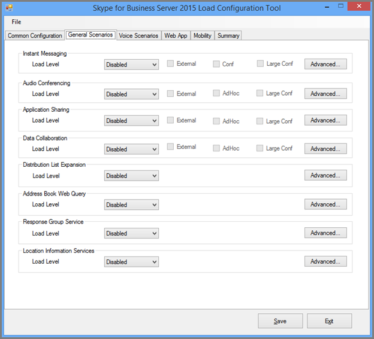

# <a name="using-the-skype-for-business-server-2015-stress-and-performance-tool"></a><span data-ttu-id="5f2f5-103">Using the Skype for Business Server 2015 Stress and Performance Tool</span><span class="sxs-lookup"><span data-stu-id="5f2f5-103">Using the Skype for Business Server 2015 Stress and Performance Tool</span></span>
 
<span data-ttu-id="5f2f5-104">To run the Skype for Business Server 2015 Stress and Performance Tool, you'll need to be able to manage both users, contacts and user profiles, configure the tool for running, and then review the output or results that are produced by the tool.</span><span class="sxs-lookup"><span data-stu-id="5f2f5-104">To run the Skype for Business Server 2015 Stress and Performance Tool, you'll need to be able to manage both users, contacts and user profiles, configure the tool for running, and then review the output or results that are produced by the tool.</span></span>
  
<span data-ttu-id="5f2f5-105">При запуске средства Stress and Performance Skype для бизнеса Server 2015 существует четыре области (исполняемый LyncPerfTool.exe):</span><span class="sxs-lookup"><span data-stu-id="5f2f5-105">There are four areas involved with running the Skype for Business Server 2015 Stress and Performance Tool (the executable is LyncPerfTool.exe):</span></span>
  
- [<span data-ttu-id="5f2f5-106">Создание пользователей и контактов</span><span class="sxs-lookup"><span data-stu-id="5f2f5-106">Create Users and Contacts</span></span>](using-the-tool.md#BKMK_CreateUsersAndContacts)
    
- [<span data-ttu-id="5f2f5-107">Настройка профиля пользователя</span><span class="sxs-lookup"><span data-stu-id="5f2f5-107">Configure User Profile</span></span>](using-the-tool.md#BKMK_UserProfile)
    
- [<span data-ttu-id="5f2f5-108">Запуск LyncPerfTool</span><span class="sxs-lookup"><span data-stu-id="5f2f5-108">Run LyncPerfTool</span></span>](using-the-tool.md#BKMK_RunTool)
    
- [<span data-ttu-id="5f2f5-109">Интерпретация результатов</span><span class="sxs-lookup"><span data-stu-id="5f2f5-109">Interpreting the Results</span></span>](using-the-tool.md#BKMK_Interpret)
    
## <a name="create-users-and-contacts"></a><span data-ttu-id="5f2f5-110">Создание пользователей и контактов</span><span class="sxs-lookup"><span data-stu-id="5f2f5-110">Create Users and Contacts</span></span>
<span data-ttu-id="5f2f5-111"><a name="BKMK_CreateUsersAndContacts"> </a></span><span class="sxs-lookup"><span data-stu-id="5f2f5-111"><a name="BKMK_CreateUsersAndContacts"> </a></span></span>

<span data-ttu-id="5f2f5-112">Для создания пользователей и контактов для тестирования нагрузки и производительности необходимо использовать средство пользовательской подготовка Skype для бизнеса Server 2015 (SB 2015 UserProvisioningTool.exe).</span><span class="sxs-lookup"><span data-stu-id="5f2f5-112">You need to use the Skype for Business Server 2015 (SB 2015) User Provisioning Tool (UserProvisioningTool.exe) to create users and contacts for your stress and performance testing.</span></span>
  
<span data-ttu-id="5f2f5-113">Это список полезных терминов, которые могут оказаться полезными при прочтях разделов:</span><span class="sxs-lookup"><span data-stu-id="5f2f5-113">This is a list of helpful terms that might be useful as you read through the topics:</span></span>
  
- <span data-ttu-id="5f2f5-114">**Подразделение —** подразделение доменных служб Active Directory (AD DS).</span><span class="sxs-lookup"><span data-stu-id="5f2f5-114">**Organizational Unit** - The Active Directory Domain Services (AD DS) organizational unit (OU).</span></span>
    
- <span data-ttu-id="5f2f5-115">**Federated / Cross Pool** — пользователи, которые могут общаться с пользователями из других служб обмена мгновенными сообщениями.</span><span class="sxs-lookup"><span data-stu-id="5f2f5-115">**Federated / Cross Pool** - Users who can communicate with users from other Instant Messaging (IM) services.</span></span>
    
- <span data-ttu-id="5f2f5-116">**Списки рассылки** или списки рассылки.</span><span class="sxs-lookup"><span data-stu-id="5f2f5-116">**Distribution Lists** - Or DLs.</span></span> <span data-ttu-id="5f2f5-117">Это объекты в AD DS, содержащие список пользователей AD DS.</span><span class="sxs-lookup"><span data-stu-id="5f2f5-117">These are objects in AD DS that contain a list of AD DS users.</span></span> <span data-ttu-id="5f2f5-118">Они используются для упрощения взаимодействия между группами людей.</span><span class="sxs-lookup"><span data-stu-id="5f2f5-118">They're used to facilitate communications across groups of people.</span></span>
    
- <span data-ttu-id="5f2f5-119">**Служба** информации о расположении — служба Skype для бизнеса Server 2015, которая, когда она включена и настроена на телефон, позволяет получить физическое расположение для служб Enhanced 911 (E911).</span><span class="sxs-lookup"><span data-stu-id="5f2f5-119">**Location Info Service** - The Skype for Business Server 2015 service that, when it's enabled and configured per phone, allows for the retrieval of physical location for Enhanced 911 (E911) services.</span></span>
    
- <span data-ttu-id="5f2f5-120">**Телефонные** номера в США — номера телефонов, присвоенные пользователю в дополнение к SIP URI, который используется для маршрутки входящие и исходящие вызовы при обратном подсмотре номера (RNL).</span><span class="sxs-lookup"><span data-stu-id="5f2f5-120">**U.S. Phone Numbers** - Phone numbers assigned to user in addition to the SIP URI that's used for routing inbound and outbound calls in Reverse Number Lookup (RNL).</span></span>
    
### <a name="create-users-and-contacts-by-using-userprovisioningtoolexe"></a><span data-ttu-id="5f2f5-121">Создание пользователей и контактов с помощью UserProvisioningTool.exe</span><span class="sxs-lookup"><span data-stu-id="5f2f5-121">Create Users and Contacts by using UserProvisioningTool.exe</span></span>

> [!NOTE]
> <span data-ttu-id="5f2f5-122">Прежде чем начать, убедитесь, что вы вошли в систему как участник группы безопасности "Администраторы домена", чтобы запустить это средство.</span><span class="sxs-lookup"><span data-stu-id="5f2f5-122">Before you even begin, be absolutely sure you're logged in as a member of the Domain Admins security group to run this tool.</span></span> <span data-ttu-id="5f2f5-123">Это необходимо сделать, так как вы собираетесь создавать пользователей Active Directory.</span><span class="sxs-lookup"><span data-stu-id="5f2f5-123">You need to do this, because you're going to be creating Active Directory users.</span></span> 
  
<span data-ttu-id="5f2f5-124">Для создания пользователей и контактов для имитации загрузки необходимо использовать средство пользовательской подготовка Skype для бизнеса Server.</span><span class="sxs-lookup"><span data-stu-id="5f2f5-124">You have to use the Skype for Business Server User Provisioning Tool to create users and contacts for load simulation.</span></span>
  
<span data-ttu-id="5f2f5-125">Средство **пользовательской подготовка Skype для** бизнеса Server устанавливается вместе с пакетом средства "Нагрузка и производительность **Skype для бизнеса** Server".</span><span class="sxs-lookup"><span data-stu-id="5f2f5-125">The **Skype for Business Server User Provisioning Tool** is installed with the **Skype for Business Server Stress and Performance Tool** package.</span></span> <span data-ttu-id="5f2f5-126">Убедитесь, что установщик пакетов (CapacityPlanningTool.msi) был установлен на сервере переднего сервера или сервере Standard Edition, который вы собираетесь протестировать.</span><span class="sxs-lookup"><span data-stu-id="5f2f5-126">Be sure that the package installer (CapacityPlanningTool.msi) has been run on the Front End Server or the Standard Edition server you intend to test.</span></span>
  
<span data-ttu-id="5f2f5-127">Чтобы запустить средство пользовательской подготовка Skype для бизнеса Server, запустите файл UserProvisioningTool.exe (расположенный в папке %InstalledDirectory%LyncStressAndPerfTool\LyncStress) на сервере переднего интерфейса или на сервере Standard Edition.</span><span class="sxs-lookup"><span data-stu-id="5f2f5-127">You can start the Skype for Business Server User Provisioning Tool by running the file UserProvisioningTool.exe (located at %InstalledDirectory%LyncStressAndPerfTool\LyncStress) on the Front End Server or on the Standard Edition server.</span></span>
  
> [!IMPORTANT]
> <span data-ttu-id="5f2f5-128">При создании большого количества пользователей (например, 10 000 или более) запустите UserProvisioningTool.exe.</span><span class="sxs-lookup"><span data-stu-id="5f2f5-128">When you create a large number of users (for example, 10,000 or more), run the UserProvisioningTool.exe.</span></span> <span data-ttu-id="5f2f5-129">Это необходимо, так как средство будет создавать и  *настраивать*  новых пользователей AD.</span><span class="sxs-lookup"><span data-stu-id="5f2f5-129">You'll need to do this because the tool will be creating and configuring  *new*  AD users.</span></span>
  
<span data-ttu-id="5f2f5-130">Когда откроется средство пользовательской подготовка, нажмите кнопку "Конфигурация" и выберите конфигурацию загрузки.</span><span class="sxs-lookup"><span data-stu-id="5f2f5-130">When the User Provisioning Tool opens, click Configuration and select the Load Configuration.</span></span> 
  
<span data-ttu-id="5f2f5-131">Чтобы приступить к настройке пользователей и контактов, загрузите файл по умолчанию, включенный в пакет, под названием "SampleData.xml".</span><span class="sxs-lookup"><span data-stu-id="5f2f5-131">To begin configuring users and contacts, load the default file included with the package, called "SampleData.xml".</span></span> <span data-ttu-id="5f2f5-132">При этом поля будут предварительно засеяны примерами данных, которые необходимо изменить, чтобы сделать их релевантными для развертывания.</span><span class="sxs-lookup"><span data-stu-id="5f2f5-132">This will prepopulate fields with sample data that you'll need to change to make it relevant for your deployment.</span></span>
  
<span data-ttu-id="5f2f5-133">Если у вас есть предварительно настроенный XML-файл, который уже содержит настроенные параметры, вы можете загрузить этот файл.</span><span class="sxs-lookup"><span data-stu-id="5f2f5-133">If you have a preconfigured XML file that already contains your customized settings, you can load that file instead.</span></span> <span data-ttu-id="5f2f5-134">Заполните поля в средстве пользовательской наполнения, как описано в разделах ниже.</span><span class="sxs-lookup"><span data-stu-id="5f2f5-134">Fill in the fields in the User Provisioning Tool, as described in the sections below.</span></span>
  
### <a name="to-configure-server-options"></a><span data-ttu-id="5f2f5-135">Чтобы настроить параметры сервера:</span><span class="sxs-lookup"><span data-stu-id="5f2f5-135">To configure server options:</span></span>

1. <span data-ttu-id="5f2f5-136">В поле **полного** доменного имени пула переднего сервера введите полное доменное имя (FQDN) сервера Standard Edition или пула переднего сервера, в котором должны быть пользователи.</span><span class="sxs-lookup"><span data-stu-id="5f2f5-136">In the **Front End Pool FQDN** field, type the fully qualified domain name (FQDN) of the Standard Edition server, or the Front End pool where you want to host the users.</span></span>
    
2. <span data-ttu-id="5f2f5-137">В поле **"Префикс** имени пользователя" введите префикс, который будет использовать для проверки имен пользователей (например, TestUser).</span><span class="sxs-lookup"><span data-stu-id="5f2f5-137">In the **User Name Prefix** field, type a prefix that you want to use to bust your user names for testing purposes (such as "TestUser").</span></span>
    
3. <span data-ttu-id="5f2f5-138">В поле **"Пароль"** введите пароль, который будет использоваться во всех тестовых учетных записях пользователей.</span><span class="sxs-lookup"><span data-stu-id="5f2f5-138">In the **Password** field, type a password that will be used across all the test user accounts.</span></span>
    
4. <span data-ttu-id="5f2f5-139">В поле **"Домен** учетной записи" введите доменное имя текущего домена AD (того, в котором вы хотите создать тестовых пользователей).</span><span class="sxs-lookup"><span data-stu-id="5f2f5-139">In the **Account Domain** field, type the domain name of your current AD domain (the one in which you want to create your test users).</span></span>
    
5. <span data-ttu-id="5f2f5-140">В поле **"Подразделение"** введите имя домена AD, в котором будут создаваться тестовые пользователи.</span><span class="sxs-lookup"><span data-stu-id="5f2f5-140">In the **Organizational Unit** field, type the name of the AD domain where you want to create these test users.</span></span> <span data-ttu-id="5f2f5-141">(Если это OU еще не существует, оно будет создано для вас).</span><span class="sxs-lookup"><span data-stu-id="5f2f5-141">(If the OU doesn't already exist, it'll be created for you).</span></span>
    
6. <span data-ttu-id="5f2f5-142">В поле **"Код города** телефона" введите трехзначный код области, который будет использоваться во всех тестовых учетных записях пользователей.</span><span class="sxs-lookup"><span data-stu-id="5f2f5-142">In the **Phone Area Code** field, type the three-digit area code to be used across all test user accounts.</span></span> <span data-ttu-id="5f2f5-143">Убедитесь, что выбранный код области не конфликтует с кодами других пользователей в AD.</span><span class="sxs-lookup"><span data-stu-id="5f2f5-143">Make certain that the area code you chose doesn't conflict with other users' area codes in AD.</span></span>
    
7. <span data-ttu-id="5f2f5-144">Если вы  хотите включить проверку пользователей для Корпоративная голосовая связь, щелкните этот Корпоративная голосовая связь.</span><span class="sxs-lookup"><span data-stu-id="5f2f5-144">Click to select the **Voice Enabled** check box, if you want to enable the test users for Enterprise Voice.</span></span>
    
8. <span data-ttu-id="5f2f5-145">В поле **"Число пользователей"** задайте общее количество тестовых пользователей, которые вы хотите создать.</span><span class="sxs-lookup"><span data-stu-id="5f2f5-145">In the **Number of Users** field, give the total number of test users you want to create.</span></span>
    
9. <span data-ttu-id="5f2f5-146">В  поле "Начальный индекс" задайте начальный номер, который будет использоваться в качестве суффикса к префиксу имени пользователя (например, префикс "TestUser", а имя в примере ниже заканчивается на "0").)</span><span class="sxs-lookup"><span data-stu-id="5f2f5-146">In the **Start Index** field, give the starting number that'll be used as a suffix to the user name prefix (for example, the prefix is "TestUser", and the first name will end in "0" in the example below.)</span></span>
    
     
  
#### <a name="create-users-button"></a><span data-ttu-id="5f2f5-148">Кнопка "Создать пользователей"</span><span class="sxs-lookup"><span data-stu-id="5f2f5-148">Create Users button</span></span>

<span data-ttu-id="5f2f5-149">При нажатии кнопки **"Создать** пользователей" вводимые входные параметры проверяются.</span><span class="sxs-lookup"><span data-stu-id="5f2f5-149">When you click on the **Create Users** button, the input parameters you've entered are validated.</span></span> <span data-ttu-id="5f2f5-150">Если имеются ошибки проверки, вам будет предложено исправить их.</span><span class="sxs-lookup"><span data-stu-id="5f2f5-150">If there are any validation errors, you'll be prompted to fix them.</span></span> <span data-ttu-id="5f2f5-151">Или, если все значения указаны правильно, пользователи начнут отображаться в AD (в зависимости от указанного вами OU).</span><span class="sxs-lookup"><span data-stu-id="5f2f5-151">Or, if all the values are correct, users will start appearing in AD (in whichever OU you specified).</span></span> <span data-ttu-id="5f2f5-152">Вы увидите строку хода выполнения в нижней части инструмента при его запуске.</span><span class="sxs-lookup"><span data-stu-id="5f2f5-152">You'll see a progress bar at the bottom of the tool as it runs.</span></span> <span data-ttu-id="5f2f5-153">Не закрывайте приложение, пока активна г. ход выполнения.</span><span class="sxs-lookup"><span data-stu-id="5f2f5-153">Don't close the application while the progress bar is active.</span></span>
  
<span data-ttu-id="5f2f5-154">Создание пользователей занимает много времени, поэтому спланируйте их соответствующим образом.</span><span class="sxs-lookup"><span data-stu-id="5f2f5-154">User creation takes time, so please plan accordingly.</span></span> <span data-ttu-id="5f2f5-155">Этот процесс может занять от нескольких минут до нескольких часов для большого числа пользователей.</span><span class="sxs-lookup"><span data-stu-id="5f2f5-155">This process can take anywhere from several minutes for a few users, to a few hours for a large number of users.</span></span>
  
<span data-ttu-id="5f2f5-156">Если у вас нет доступа к контроллеру домена AD в тестовой среде, вы по-прежнему можете проверить создание пользователей, войдя в систему как один из пользователей в диапазоне пользователей, которые вы указали для создания.</span><span class="sxs-lookup"><span data-stu-id="5f2f5-156">If you don't have access to the AD Domain Controller in your test environment, you can still validate user creation by logging in as one of the users in the range of users you specified to create.</span></span> <span data-ttu-id="5f2f5-157">Не забудьте использовать префикс и суффикс вместе с @sipDomain в качестве имени пользователя.</span><span class="sxs-lookup"><span data-stu-id="5f2f5-157">Remember to use the prefix, and the suffix, along with the @sipDomain as the username.</span></span> <span data-ttu-id="5f2f5-158">Вот  <em>пример:</em>  TestUser20@contoso.net.</span><span class="sxs-lookup"><span data-stu-id="5f2f5-158">Here is an example:  <em>TestUser20@contoso.net</em>  .</span></span>
  
> [!NOTE]
> <span data-ttu-id="5f2f5-159">Если пользователи уже существуют, нажатие кнопки "Создать пользователей" обновит их любыми изменениями конфигурации.</span><span class="sxs-lookup"><span data-stu-id="5f2f5-159">If the users already exist, clicking the Create Users button will update them with any configuration changes.</span></span> 
  
#### <a name="delete-users-button"></a><span data-ttu-id="5f2f5-160">Кнопка "Удалить пользователей"</span><span class="sxs-lookup"><span data-stu-id="5f2f5-160">Delete Users button</span></span>

<span data-ttu-id="5f2f5-161">При нажатии кнопки **"Удалить пользователей"** входные параметры вкладки проверяются.</span><span class="sxs-lookup"><span data-stu-id="5f2f5-161">When you click on the **Delete Users** button, the tab's input parameters will be validated.</span></span> <span data-ttu-id="5f2f5-162">Если имеются ошибки проверки, вам будет предложено исправить их, а если входные значения указаны правильно, указанные тестовые пользователи будут отключены и удалены из Active Directory.</span><span class="sxs-lookup"><span data-stu-id="5f2f5-162">If there are validation errors, you'll be prompted to fix them, and if the input values are correct, the specified test users will be disabled and deleted from Active Directory.</span></span> <span data-ttu-id="5f2f5-163">В нижней части этой вкладки снова появится строка хода выполнения, и не следует закрывать приложение, пока она активна.</span><span class="sxs-lookup"><span data-stu-id="5f2f5-163">Again, a progress bar will appear on the bottom of this tab, and you shouldn't close the application while the progress bar is active.</span></span>
  
> [!NOTE]
> <span data-ttu-id="5f2f5-164">Поддерживаются только номера телефонов в формате США.</span><span class="sxs-lookup"><span data-stu-id="5f2f5-164">Only U.S.-formatted phone numbers are supported.</span></span> <span data-ttu-id="5f2f5-165">Номера телефонов всегда назначены пользователям, и все пользователи, созданные UserProvisioningTool.exe по умолчанию, Корпоративная голосовая связь для пользователей.</span><span class="sxs-lookup"><span data-stu-id="5f2f5-165">Phone numbers are always assigned to users, and all users created by UserProvisioningTool.exe are enabled for Enterprise Voice by default.</span></span> <span data-ttu-id="5f2f5-166">Любой сценарий, в который используется номер телефона, например вызовы автосекретарь или вызовы UC-PSTN, используют этот номер телефона для правильной маршрутки вызовов.</span><span class="sxs-lookup"><span data-stu-id="5f2f5-166">Any scenarios that use the phone number, such as Conferencing Auto Attendant or UC-PSTN calls, use this phone number to properly route calls.</span></span> <span data-ttu-id="5f2f5-167">По этой причине у *каждого пользователя* должен быть уникальный *номер телефона.*</span><span class="sxs-lookup"><span data-stu-id="5f2f5-167">For this reason,  *every user*  must have a *unique phone number*  .</span></span>
  
> [!NOTE]
> <span data-ttu-id="5f2f5-168">**Если необходимо создать пользователей дважды, команда не будет работать, если не используется другой код области или если предыдущие пользователи были отключены с помощью Disable-CsUser командлета.**</span><span class="sxs-lookup"><span data-stu-id="5f2f5-168">**If you have to create users twice, the command will fail unless you use a different area code, or if the previous users have been disabled by using the Disable-CsUser cmdlet.**</span></span>
  
> [!IMPORTANT]
> <span data-ttu-id="5f2f5-169">Перед созданием контактов сначала необходимо выполнить репликацию пользователей (что делается на вкладке "Пользователи").</span><span class="sxs-lookup"><span data-stu-id="5f2f5-169">Before you create contacts, you first need to complete user replication (which is done from the Users tab).</span></span> 
  
> [!IMPORTANT]
> <span data-ttu-id="5f2f5-170">If you've just created your users, you'll need to wait until Skype for Business Server replication completes and populates the user accounts in the database.</span><span class="sxs-lookup"><span data-stu-id="5f2f5-170">If you've just created your users, you'll need to wait until Skype for Business Server replication completes and populates the user accounts in the database.</span></span> <span data-ttu-id="5f2f5-171">**Если пользователи не завершили репликацию, вы увидите ошибку.**</span><span class="sxs-lookup"><span data-stu-id="5f2f5-171">**If the users haven't finished replicating, you'll see an error.**</span></span> <span data-ttu-id="5f2f5-172">You'll know when users have finished replicating if the Skype for Business Server 2015 Front End service has started, or by successfully running the Get-CsUser cmdlet on the last user of the total number you specified.</span><span class="sxs-lookup"><span data-stu-id="5f2f5-172">You'll know when users have finished replicating if the Skype for Business Server 2015 Front End service has started, or by successfully running the Get-CsUser cmdlet on the last user of the total number you specified.</span></span>
  
#### <a name="contacts-creation-tab"></a><span data-ttu-id="5f2f5-173">Вкладка "Создание контактов"</span><span class="sxs-lookup"><span data-stu-id="5f2f5-173">Contacts Creation tab</span></span>

<span data-ttu-id="5f2f5-174">На этой вкладке можно предоставить сведения о контактах пользователей для тестирования.</span><span class="sxs-lookup"><span data-stu-id="5f2f5-174">This tab lets you give users' contacts details for your testing.</span></span>
  

  
### <a name="to-configure-users-contacts-do-the-following"></a><span data-ttu-id="5f2f5-176">Чтобы настроить контакты пользователей, сделайте следующее:</span><span class="sxs-lookup"><span data-stu-id="5f2f5-176">To configure users' contacts, do the following:</span></span>

1. <span data-ttu-id="5f2f5-177">В поле **"Среднее количество контактов на** пользователя" введите среднее число контактов, которые необходимо заполнить в списках контактов для каждого пользователя.</span><span class="sxs-lookup"><span data-stu-id="5f2f5-177">In the **Average Contacts per User** field, enter the average number of contacts to populate in contact lists for each user.</span></span>
    
2. <span data-ttu-id="5f2f5-178">Если необходимо **создать** одинаковое количество контактов для каждого пользователя, выберите "Фиксированный".</span><span class="sxs-lookup"><span data-stu-id="5f2f5-178">Select the **Fixed** check box if you want to create an equal number of contacts for every user.</span></span> <span data-ttu-id="5f2f5-179">Если вы хотите изменить количество контактов, созданных для пользователей, отойте этот контроль.</span><span class="sxs-lookup"><span data-stu-id="5f2f5-179">If you want to vary the number of contacts created for users, clear that check box.</span></span>
    
3. <span data-ttu-id="5f2f5-180">В поле **"Среднее количество контактов на пользователя"** введите количество групп контактов на пользователя.</span><span class="sxs-lookup"><span data-stu-id="5f2f5-180">In the **Average Contact Groups per User** field, enter the number of contact groups per user.</span></span> <span data-ttu-id="5f2f5-181">Это число должно быть меньше среднего числа **контактов на пользователя.**</span><span class="sxs-lookup"><span data-stu-id="5f2f5-181">This number needs to be smaller than **Average Contacts per User**.</span></span>
    
4. <span data-ttu-id="5f2f5-182">В поле **"Федерательный /cross Pool Contacts Percentage"** (Процент федератных и меж пулов) задают число от 0 до 100.</span><span class="sxs-lookup"><span data-stu-id="5f2f5-182">In the **Federated / Cross Pool Contacts Percentage** field, give a number between 0 and 100.</span></span> <span data-ttu-id="5f2f5-183">Этот процент контактов создается вместе с федератерными пользователями.</span><span class="sxs-lookup"><span data-stu-id="5f2f5-183">This percentage of contacts will be created with the federated users.</span></span>
    
5. <span data-ttu-id="5f2f5-184">В поле **"Федерательный/межфайтовой** префикс пользователей" в поле "Федерательный/перекрестный пул" в поле "Имя пользователя" в поле "Имена федератов и пользователей", задав имя пользователя для федеральных пользователей, которые будут добавлены в списки контактов локальных пользователей.</span><span class="sxs-lookup"><span data-stu-id="5f2f5-184">In the **Federated / Cross Pool User Prefix** field, give the username for federated users that will be added to the contact lists of local users.</span></span>
    
6. <span data-ttu-id="5f2f5-185">В поле **"Федерательный/меж** пульный домен пользователя SIP" удают имя домена SIP федератных пользователей.</span><span class="sxs-lookup"><span data-stu-id="5f2f5-185">In the **Federated / Cross Pool User SIP Domain** field, give the SIP Domain Name of the federated users.</span></span>
    
7. <span data-ttu-id="5f2f5-186">На **вкладке "Создание** пользователя" убедитесь, что сведения верны.</span><span class="sxs-lookup"><span data-stu-id="5f2f5-186">In **User Creation** tab make sure the information is correct.</span></span> <span data-ttu-id="5f2f5-187">Контакты будут созданы из значений на вкладке "Создание пользователей".</span><span class="sxs-lookup"><span data-stu-id="5f2f5-187">Your contacts will be created from values on the User Creation tab.</span></span>
    
8. <span data-ttu-id="5f2f5-188">Нажмите **кнопку "Создать контакты",** чтобы начать создание контактов.</span><span class="sxs-lookup"><span data-stu-id="5f2f5-188">Click **Create Contacts** to begin the contact creation.</span></span> <span data-ttu-id="5f2f5-189">Этот процесс может занять несколько минут.</span><span class="sxs-lookup"><span data-stu-id="5f2f5-189">This process can take several minutes.</span></span> <span data-ttu-id="5f2f5-190">После завершения появится диалоговое окно с сообщением "Операция успешно завершена".</span><span class="sxs-lookup"><span data-stu-id="5f2f5-190">After it completes, a dialog box will appear with the message, "Operation Completed Successfully."</span></span> <span data-ttu-id="5f2f5-191">Вы можете проверить контакты, созданные путем входа в систему в качестве пользователя, созданного на вкладке "Создание пользователя".</span><span class="sxs-lookup"><span data-stu-id="5f2f5-191">You can validate the contacts that were created by logging on as a user that was created from the User Creation tab.</span></span>
    
    > [!NOTE]
    > <span data-ttu-id="5f2f5-192">После создания контактов это средство перезапустит все серверы переднего сервера в целевом пуле.</span><span class="sxs-lookup"><span data-stu-id="5f2f5-192">After the contacts are created, this tool will restart all the Front End Servers in the target pool.</span></span> <span data-ttu-id="5f2f5-193">Запуск серверов переднего сервера может занять больше времени (до 2 часов) в зависимости от того, сколько контактов было создано этой операцией.</span><span class="sxs-lookup"><span data-stu-id="5f2f5-193">It may take longer (up to 2 hours) for the Front End Servers to start, depending on how many contacts were created by this operation.</span></span> 
  
#### <a name="distribution-list"></a><span data-ttu-id="5f2f5-194">Список рассылки</span><span class="sxs-lookup"><span data-stu-id="5f2f5-194">Distribution List</span></span>

<span data-ttu-id="5f2f5-195">Средство Skype для бизнеса Server 2015 Stress and Performance tool может имитировать функцию расширения списка рассылки (DL) в клиенте Skype для бизнеса 2015.</span><span class="sxs-lookup"><span data-stu-id="5f2f5-195">The Skype for Business Server 2015 Stress and Performance Tool can simulate the Distribution List (DL) expansion feature in the Skype for Business 2015 client.</span></span> <span data-ttu-id="5f2f5-196">Вы можете пропустить этот шаг, если не собираетесь включить расширение DL в средстве пользовательской подготовка.</span><span class="sxs-lookup"><span data-stu-id="5f2f5-196">You can skip this step if you don't intend to enable DL expansion in the User Provisioning tool.</span></span>
  

  
<span data-ttu-id="5f2f5-198">Вкладка "Список рассылки" позволяет создавать списки рассылки, которые средство Stress and Performance будет использовать для расширения списка рассылки.</span><span class="sxs-lookup"><span data-stu-id="5f2f5-198">The Distribution List tab allows you to create DLs that the Stress and Performance Tool will use for Distribution List Expansion feature.</span></span> <span data-ttu-id="5f2f5-199">Перед созданием DLS необходимо развернуть Skype для бизнеса Server 2015, включая запуск ForestPrep.</span><span class="sxs-lookup"><span data-stu-id="5f2f5-199">Before creating DLs, Skype for Business Server 2015 needs to be deployed, including having run ForestPrep.</span></span> <span data-ttu-id="5f2f5-200">Если этого не сделать, атрибуты DL не будут существовать в схеме AD, поэтому средство не сможет создавать DLS.</span><span class="sxs-lookup"><span data-stu-id="5f2f5-200">If this isn't done, the DL attributes will not exist in the AD schema, so the tool won't be able to create DLs.</span></span>
  
### <a name="to-configure-distribution-lists"></a><span data-ttu-id="5f2f5-201">Чтобы настроить списки рассылки:</span><span class="sxs-lookup"><span data-stu-id="5f2f5-201">To configure Distribution Lists:</span></span>

1. <span data-ttu-id="5f2f5-202">В поле **"Число** списков рассылки" задайте общее число списков рассылки, которое вы хотите создать (рекомендация здесь — начать со значения, которое в два раза больше числа пользователей).</span><span class="sxs-lookup"><span data-stu-id="5f2f5-202">In the **Number of Distribution Lists** field, give the total number of DLs you want to create (The recommendation here is that you start with a value that is double the number of users you have.).</span></span>
    
2. <span data-ttu-id="5f2f5-203">В поле **"Префикс** списка рассылки" введите префикс, который будет иметься у всех списков рассылки, например *testDL.*</span><span class="sxs-lookup"><span data-stu-id="5f2f5-203">In the **Distribution List Prefix** field, enter a prefix that all the DLs you create will have, for example *testDL*  .</span></span> <span data-ttu-id="5f2f5-204">Это означает, что при 100 DL-именах будут выглядеть так: testDL0, testDL1 до testDL99.</span><span class="sxs-lookup"><span data-stu-id="5f2f5-204">That means, at 100 DLs, your DL names will look like: testDL0, testDL1, up to testDL99.</span></span>
    
3. <span data-ttu-id="5f2f5-205">В поле **"Минимальные члены в списке"** введите минимальное количество пользователей, помещаемого в каждый DL.</span><span class="sxs-lookup"><span data-stu-id="5f2f5-205">In the **Minimum Members in a Dist. List** field, enter the minimum number of users to put in each DL.</span></span>
    
4. <span data-ttu-id="5f2f5-206">В поле **"Максимальное число** участников в списке" введите максимальное количество пользователей, добавляемого в каждый DL.</span><span class="sxs-lookup"><span data-stu-id="5f2f5-206">In the **Maximum Members in a Dist. List** field, enter the maximum number of users to add in each DL.</span></span>
    
#### <a name="create-distribution-lists-button"></a><span data-ttu-id="5f2f5-207">Кнопка "Создать списки рассылки"</span><span class="sxs-lookup"><span data-stu-id="5f2f5-207">Create Distribution Lists button</span></span>

<span data-ttu-id="5f2f5-208">При нажатии кнопки "Создать списки рассылки" средство запрашивает Active Directory, чтобы узнать, существуют ли списки рассылки, совпадающие с префиксом и номерами.</span><span class="sxs-lookup"><span data-stu-id="5f2f5-208">When you click the Create Distribution Lists button, the tool queries Active Directory to see if distribution lists matching the prefix and numbers already exist.</span></span> <span data-ttu-id="5f2f5-209">Средство создает все еще не существовавие DLS.</span><span class="sxs-lookup"><span data-stu-id="5f2f5-209">The tool creates any DLs that don't already exist.</span></span> <span data-ttu-id="5f2f5-210">При добавлении членов в новые списки рассылки пользователи выбираются из диапазона, указанного на вкладке "Создание пользователей".</span><span class="sxs-lookup"><span data-stu-id="5f2f5-210">When adding members to these newly created Distribution Lists, it'll choose the users from the range specified on the User Creation tab.</span></span>
  
#### <a name="location-info-service-config-tab"></a><span data-ttu-id="5f2f5-211">Вкладка "Сведения о расположении"</span><span class="sxs-lookup"><span data-stu-id="5f2f5-211">Location Info Service Config tab</span></span>

<span data-ttu-id="5f2f5-212">Средство Stress and Performance в Skype для бизнеса Server 2015 также может создавать фиmmy-файлы конфигурации для службы сведений о расположении.</span><span class="sxs-lookup"><span data-stu-id="5f2f5-212">The Skype for Business Server 2015 Stress and Performance Tool can also generate dummy configuration files for the Location Information Service.</span></span> <span data-ttu-id="5f2f5-213">Обратите внимание, что служба сведений о расположении обычно не оказывает значительного влияния на производительность серверов.</span><span class="sxs-lookup"><span data-stu-id="5f2f5-213">Note that the Location Information Service typically doesn't have significant performance impact on the servers.</span></span> 
  

  
<span data-ttu-id="5f2f5-215">Если вы решили протестировать эту функцию, заполните значения в форме и нажмите кнопку "Создать файлы config lis", которая будет создавать . CSV-файлы, которые называются:</span><span class="sxs-lookup"><span data-stu-id="5f2f5-215">If you choose to test this feature, fill in the values in the form and click the Generate LIS Config Files button, which will create .CSV files called:</span></span>
  
- <span data-ttu-id="5f2f5-216">LIS_Subnet.csv</span><span class="sxs-lookup"><span data-stu-id="5f2f5-216">LIS_Subnet.csv</span></span>
    
- <span data-ttu-id="5f2f5-217">LIS_Switches.csv</span><span class="sxs-lookup"><span data-stu-id="5f2f5-217">LIS_Switches.csv</span></span>
    
- <span data-ttu-id="5f2f5-218">LIS_Ports.csv</span><span class="sxs-lookup"><span data-stu-id="5f2f5-218">LIS_Ports.csv</span></span>
    
- <span data-ttu-id="5f2f5-219">LIS_WAP.csv</span><span class="sxs-lookup"><span data-stu-id="5f2f5-219">LIS_WAP.csv</span></span>
    
<span data-ttu-id="5f2f5-220">Чтобы импортировать эти файлы в базу данных LIS, используйте указанные ниже cmdlets PowerShell.</span><span class="sxs-lookup"><span data-stu-id="5f2f5-220">To import these files into the LIS database use these PowerShell cmdlets:</span></span>
  
- <span data-ttu-id="5f2f5-221">Set-CsLisSubnet</span><span class="sxs-lookup"><span data-stu-id="5f2f5-221">Set-CsLisSubnet</span></span>
    
- <span data-ttu-id="5f2f5-222">Set-CsLisSwitch</span><span class="sxs-lookup"><span data-stu-id="5f2f5-222">Set-CsLisSwitch</span></span>
    
- <span data-ttu-id="5f2f5-223">Set-CsLisPort</span><span class="sxs-lookup"><span data-stu-id="5f2f5-223">Set-CsLisPort</span></span>
    
- <span data-ttu-id="5f2f5-224">Set-CsWirelessAccessPoint</span><span class="sxs-lookup"><span data-stu-id="5f2f5-224">Set-CsWirelessAccessPoint</span></span>
    
## <a name="configure-user-profile"></a><span data-ttu-id="5f2f5-225">Настройка профиля пользователя</span><span class="sxs-lookup"><span data-stu-id="5f2f5-225">Configure User Profile</span></span>
<span data-ttu-id="5f2f5-226"><a name="BKMK_UserProfile"> </a></span><span class="sxs-lookup"><span data-stu-id="5f2f5-226"><a name="BKMK_UserProfile"> </a></span></span>

<span data-ttu-id="5f2f5-227">После создания пользователей (с помощью средства создания пользователей) можно настроить профили пользователей с помощью средства настройки нагрузки Skype для бизнеса Server 2015 (UserProfileGenerator.exe).</span><span class="sxs-lookup"><span data-stu-id="5f2f5-227">After your users are created (via the User Creation Tool) you can configure user profiles with the Skype for Business Server 2015 Load Configuration tool (UserProfileGenerator.exe).</span></span>
  
### <a name="running-the-skype-for-business-server-2015-load-configuration-tool"></a><span data-ttu-id="5f2f5-228">Запуск средства настройки нагрузки Skype для бизнеса Server 2015</span><span class="sxs-lookup"><span data-stu-id="5f2f5-228">Running the Skype for Business Server 2015 Load Configuration tool</span></span>

<span data-ttu-id="5f2f5-229">Запустите средство настройки нагрузки (UserProfileGenerator.exe) и заполните вкладки.</span><span class="sxs-lookup"><span data-stu-id="5f2f5-229">Start the Load Configuration tool (UserProfileGenerator.exe) and fill in the tabs.</span></span> <span data-ttu-id="5f2f5-230">Это средство создает каталог для каждого клиентского компьютера, который потребуется для запуска имитации.</span><span class="sxs-lookup"><span data-stu-id="5f2f5-230">This tool creates a directory for each of the client computers that you'll need to run your simulations.</span></span> <span data-ttu-id="5f2f5-231">Каждый каталог клиента поставляется со сценарием для запуска средства Stress and Performance в Skype для бизнеса Server 2015 (LyncPerfTool.exe).</span><span class="sxs-lookup"><span data-stu-id="5f2f5-231">Each client directory comes with a script to start the Skype for Business Server 2015 Stress and Performance tool (LyncPerfTool.exe).</span></span> <span data-ttu-id="5f2f5-232">В разделах ниже приведены примеры заполнения полей на каждой вкладке средства настройки нагрузки Skype для бизнеса Server 2015.</span><span class="sxs-lookup"><span data-stu-id="5f2f5-232">The sections below will give examples of how to fill in the fields on each tab of the Skype for Business Server 2015 Load Configuration tool.</span></span>
  
> [!IMPORTANT]
> <span data-ttu-id="5f2f5-233">Значения, используемые в средстве настройки загрузки (UserProfileGenerator.exe), должны соответствовать значениям, указанным в средстве создания пользователей Skype для бизнеса Server 2015 (UserProvisioningTool.exe) для пула.</span><span class="sxs-lookup"><span data-stu-id="5f2f5-233">The user-specific values used in the Load Configuration tool (UserProfileGenerator.exe) must match the values specified in the Skype for Business Server 2015 User Creation Tool (UserProvisioningTool.exe) for the pool.</span></span> 
  
#### <a name="common-configuration-tab"></a><span data-ttu-id="5f2f5-234">Вкладка "Общая конфигурация"</span><span class="sxs-lookup"><span data-stu-id="5f2f5-234">Common Configuration tab</span></span>

<span data-ttu-id="5f2f5-235">Ниже **показана вкладка** "Общая конфигурация" средства настройки нагрузки.</span><span class="sxs-lookup"><span data-stu-id="5f2f5-235">The **Common Configuration** tab of the Load Configuration Tool is shown below.</span></span> <span data-ttu-id="5f2f5-236">Заполните поля вкладки "Общая конфигурация", как описано в следующих шагах.</span><span class="sxs-lookup"><span data-stu-id="5f2f5-236">Fill in the fields of the Common Configuration tab, as described in the following steps.</span></span>
  

  
1. <span data-ttu-id="5f2f5-238">В поле **"Количество** доступных компьютеров" введите количество компьютеров, которые вы хотите использовать для запуска средства Stress and Performance (LyncPerfTool.exe).</span><span class="sxs-lookup"><span data-stu-id="5f2f5-238">In the **Number of Available Machines** field, type the number of computers you want to use to run the Stress and Performance tool (LyncPerfTool.exe).</span></span> <span data-ttu-id="5f2f5-239">Мы рекомендуем использовать один компьютер для каждого 4500 пользователей, которые вы будете симулировать, но это число может отличаться при снижении уровня нагрузки или использовании только подмножества доступных функций средства (уровни нагрузки задаются на вкладке "Общие сценарии").</span><span class="sxs-lookup"><span data-stu-id="5f2f5-239">We recommend that you have one computer for every 4500 users you'll be simulating, but that number may vary if you reduce the load level, or use only a subset of the tool's available features (Load levels are set on the General Scenarios tab).</span></span>
    
2. <span data-ttu-id="5f2f5-240">В поле **"Префикс для** имен пользователей" введите префикс для поля имени пользователя всех пользователей.</span><span class="sxs-lookup"><span data-stu-id="5f2f5-240">In the **Prefix for User Names** field, enter a prefix for the user name field of all users.</span></span> <span data-ttu-id="5f2f5-241">Для входа в единый код ресурса (URI) будет: *UserPrefix[User Start Index... (Количество пользователей-1)] @User Домен,*  например myUser009@Contoso.com.</span><span class="sxs-lookup"><span data-stu-id="5f2f5-241">To log in the Uniform Resource Identifier (URI) will be: *UserPrefix[User Start Index…(Number Of Users-1)]@User Domain*  , for example, myUser009@Contoso.com.</span></span>
    
3. <span data-ttu-id="5f2f5-242">В поле **"Пароль для всех пользователей"** введите пароль, используемый при создании пользователей.</span><span class="sxs-lookup"><span data-stu-id="5f2f5-242">In the **Password for All Users** field, enter the password used during creation of the users.</span></span> <span data-ttu-id="5f2f5-243">Если оставить это поле пустым, в качестве пароля будет заданной имя пользователя.</span><span class="sxs-lookup"><span data-stu-id="5f2f5-243">If you leave this field empty the username will be set as the password.</span></span>
    
4. <span data-ttu-id="5f2f5-244">В поле **"Индекс запуска пользователя"** введите индекс первого пользователя, который будет настроен.</span><span class="sxs-lookup"><span data-stu-id="5f2f5-244">In the **User Start Index** field, enter the index of the first user to be configured.</span></span> <span data-ttu-id="5f2f5-245">Можно настроить различные диапазоны для разных типов или уровней нагрузки, но необходимо запустить средство настройки нагрузки (UserProfileGenerator.exe) один раз для каждого из настраиваемых диапазонов.</span><span class="sxs-lookup"><span data-stu-id="5f2f5-245">You can configure different ranges for different types or levels of load, but you must run the Load Configuration tool (UserProfileGenerator.exe) once per the range you want to configure.</span></span>
    
5. <span data-ttu-id="5f2f5-246">В поле **"Число пользователей"** введите общее количество пользователей, которые вы собираетесь настроить.</span><span class="sxs-lookup"><span data-stu-id="5f2f5-246">In the **Number of Users** field, enter the total number of users you're going to configure.</span></span>
    
6. <span data-ttu-id="5f2f5-247">В поле **"Домен пользователя"** введите домен, используемый для URI SIP.</span><span class="sxs-lookup"><span data-stu-id="5f2f5-247">In the **User Domain** field, enter the domain used for the SIP URI.</span></span> <span data-ttu-id="5f2f5-248">Это используется для создания SIP URI каждого пользователя для входа на сервер переднего интерфейса Skype для бизнеса Server 2015 или сервер Standard Edition и может быть отличается от домена учетной записи.</span><span class="sxs-lookup"><span data-stu-id="5f2f5-248">This is used to construct the SIP URI of each user to log on to the Skype for Business Server 2015 Front End Server or Standard Edition server, and may be different from the Account Domain.</span></span>
    
7. <span data-ttu-id="5f2f5-249">В поле **"Домен учетной записи"** введите имя для входа в домен AD DS.</span><span class="sxs-lookup"><span data-stu-id="5f2f5-249">In the **Account Domain** field, enter the AD DS domain logon.</span></span>
    
8. <span data-ttu-id="5f2f5-250">В поле **MPOP Percentage** (Multiple Point of Presence percentage) (Процент точки присутствия) указать процент пользователей, которые вошли с нескольких компьютеров или устройств, например 10 процентов.</span><span class="sxs-lookup"><span data-stu-id="5f2f5-250">In the **MPOP Percentage** (Multiple Point of Presence percentage) field, give a value for the percentage of users that are logged on from multiple machines or devices, for example 10 percent.</span></span>
    
9. <span data-ttu-id="5f2f5-251">Введите максимальное число конечных точек одновременно в поле "Вход в секунду" **(на экземпляр).**</span><span class="sxs-lookup"><span data-stu-id="5f2f5-251">Enter the maximum number of concurrent endpoints in the **Sign in Per Second (per Instance)** field.</span></span> <span data-ttu-id="5f2f5-252">Это максимальное количество входов в систему для пользователей, а рекомендация — скорость меньше/равной 2 в секунду (<=2).</span><span class="sxs-lookup"><span data-stu-id="5f2f5-252">This is the maximum number of log ins for your users, and the recommendation is a rate of less than/equal to 2 per second (<=2).</span></span>
    
10. <span data-ttu-id="5f2f5-253">В поле **"Прокси-сервер** доступа" или "Полное доменное имя пула" введите полное доменное имя сервера, к нему должны подключаться клиенты.</span><span class="sxs-lookup"><span data-stu-id="5f2f5-253">In the **Access Proxy or Pool FQDN** field, enter the fully qualified domain name (FQDN) of the server you want the clients to connect to.</span></span> <span data-ttu-id="5f2f5-254">Если пользователи во время входа во внешние службы, необходимо ввести прокси-сервер доступа.</span><span class="sxs-lookup"><span data-stu-id="5f2f5-254">If the users are logging on externally, you'll need to type the access proxy.</span></span> <span data-ttu-id="5f2f5-255">Если пользователи являются внутренними, задав FQDN их корпоративного пула или сервера Standard Edition.</span><span class="sxs-lookup"><span data-stu-id="5f2f5-255">If the users are internal, give the FQDN of their Enterprise Pool or Standard Edition server.</span></span>
    
11. <span data-ttu-id="5f2f5-256">В поле **"Порт"** введите порт, который пользователи должны использовать для SIP (здесь по умолчанию используется значение 5061).</span><span class="sxs-lookup"><span data-stu-id="5f2f5-256">In the **Port** field, enter the port that you want users to use for SIP (the default here is 5061).</span></span>
    
12. <span data-ttu-id="5f2f5-257">В поле **"Параметры внешнего** сетевого сервера" в поле "Прокси-сервер доступа" или "Пул" в поле "Параметры сервера внешней сети" в поле "Прокси-сервер доступа" или "Пул" задают его и, опять же, **порт.**</span><span class="sxs-lookup"><span data-stu-id="5f2f5-257">For the **External Network Server Settings** field, give the Access Proxy or Pool FQDN and, again, the **Port**.</span></span> <span data-ttu-id="5f2f5-258">Эти параметры используются только для имитации загрузки внешних конечных точек.</span><span class="sxs-lookup"><span data-stu-id="5f2f5-258">These settings are used only for External endpoints load simulation.</span></span>
    
#### <a name="general-scenarios-tab"></a><span data-ttu-id="5f2f5-259">Вкладка "Общие сценарии"</span><span class="sxs-lookup"><span data-stu-id="5f2f5-259">General Scenarios tab</span></span>


  
<span data-ttu-id="5f2f5-261">Вы можете настроить уровни нагрузки и параметры для каждого из общих сценариев, определив, что нужно запустить или оставить отключенным.</span><span class="sxs-lookup"><span data-stu-id="5f2f5-261">You can configure the load levels and parameters for each of the general scenarios offered by determining what you want to run or leave disabled.</span></span> <span data-ttu-id="5f2f5-262">Вот общие параметры:</span><span class="sxs-lookup"><span data-stu-id="5f2f5-262">Here are your general options:</span></span>
  
> [!NOTE]
> <span data-ttu-id="5f2f5-263">Значения уровня нагрузки для всех полей, но локальные службы информации **отключены,** **низкий,** **средний,** **высокий** или **настраиваемый.**</span><span class="sxs-lookup"><span data-stu-id="5f2f5-263">Load level values for all fields but Local Information Services are **Disabled**, **Low**, **Medium**, **High**, or **Custom**.</span></span> <span data-ttu-id="5f2f5-264">Если выбран какой-либо параметр, но отключен, то конфигурации создаются для каждого клиента.</span><span class="sxs-lookup"><span data-stu-id="5f2f5-264">If you select any setting but Disabled, then configurations are generated for each client.</span></span> <span data-ttu-id="5f2f5-265">Высокие результаты в максимальной поддерживаемой нагрузке на сервер; средний — 60 % от высокой нагрузки; низкий — 30 %.</span><span class="sxs-lookup"><span data-stu-id="5f2f5-265">High results in the max supported load on the server; medium is 60% of high load; low is 30%.</span></span> 
  
- <span data-ttu-id="5f2f5-266">**Обмен мгновенными сообщениями —** К ним относятся одноранговая и видеоконференция; выберите подходящее значение для уровня нагрузки.</span><span class="sxs-lookup"><span data-stu-id="5f2f5-266">**Instant Messaging -** This includes peer-to-peer and conferencing; choose the appropriate value for Load Level.</span></span>
    
- <span data-ttu-id="5f2f5-267">**Аудиоконференция —** Выберите уровень нагрузки только для *аудиоконференций.*</span><span class="sxs-lookup"><span data-stu-id="5f2f5-267">**Audio Conferencing -** Choose a load level for audio conferencing *only*  .</span></span> <span data-ttu-id="5f2f5-268">Одноранговые вызовы будут решаться немного позже в разделе **"Сценарии голосовой почты".**</span><span class="sxs-lookup"><span data-stu-id="5f2f5-268">Peer-to-peer calls will be tackled a little later in the **Voice Scenarios** section.</span></span> <span data-ttu-id="5f2f5-269">Откройте **вкладку "Дополнительные",** чтобы включить MultiView.</span><span class="sxs-lookup"><span data-stu-id="5f2f5-269">Open the **Advanced** tab to enable MultiView.</span></span>
    
- <span data-ttu-id="5f2f5-270">**Общий доступ к приложениям —** Выберите уровень нагрузки для общего доступа к приложениям.</span><span class="sxs-lookup"><span data-stu-id="5f2f5-270">**Application Sharing -** Choose a load level for application sharing.</span></span>
    
- <span data-ttu-id="5f2f5-271">**Совместная работа с данными —** Выберите уровень нагрузки для совместной работы с данными, включающий в себя передачу данных.</span><span class="sxs-lookup"><span data-stu-id="5f2f5-271">**Data Collaboration -** Choose a load level for data collaboration, which includes data conferencing.</span></span>
    
- <span data-ttu-id="5f2f5-272">**Расширение списка рассылки —** Нажмите **кнопку** "Дополнительные" и заполните поле тем же значением, что и на вкладке DL средства создания пользователей (UserProvisioningTool.exe).</span><span class="sxs-lookup"><span data-stu-id="5f2f5-272">**Distribution List Expansion -** Click the **Advanced** button and fill in the field with the same values configured on the DL tab of the User Creation Tool (UserProvisioningTool.exe).</span></span> <span data-ttu-id="5f2f5-273">Выберите уровень нагрузки.</span><span class="sxs-lookup"><span data-stu-id="5f2f5-273">Choose a load level.</span></span>
    
- <span data-ttu-id="5f2f5-274">**Веб-запрос адресной книги —** Это служба подыском адресной книги, а не скачивание файла адресной книги.</span><span class="sxs-lookup"><span data-stu-id="5f2f5-274">**Address Book Web Query -** This is the address book lookup service rather than the address book file download.</span></span> <span data-ttu-id="5f2f5-275">Если вы хотите включить эту возможность для загрузки файлов адресной книги, нажмите кнопку **"Дополнительные"** и установите для **EnableABSDownload** true.</span><span class="sxs-lookup"><span data-stu-id="5f2f5-275">If you want to enable this for address book file downloads, click the **Advanced** button and set **EnableABSDownload** to True.</span></span> <span data-ttu-id="5f2f5-276">Придать значение для уровня нагрузки.</span><span class="sxs-lookup"><span data-stu-id="5f2f5-276">Give a value for load level.</span></span>
    
- <span data-ttu-id="5f2f5-277">**Служба группы ответа —** Нажмите **кнопку "Дополнительные"** и укажите URIS групп ответа, которые вы уже создали при предоставлении агентов службы группы ответа.</span><span class="sxs-lookup"><span data-stu-id="5f2f5-277">**Response Group Service -** Click the **Advanced** button and specify the URIs of the response groups you already created when you provisioned Response Group Service agents.</span></span> <span data-ttu-id="5f2f5-278">Необходимо выбрать хотя бы одну группу ответа.</span><span class="sxs-lookup"><span data-stu-id="5f2f5-278">You must choose at least one response group.</span></span> <span data-ttu-id="5f2f5-279">Чтобы использовать больше, отделять группы ответа друг от друга с зачетами.</span><span class="sxs-lookup"><span data-stu-id="5f2f5-279">To use more, separate the response groups with semicolons.</span></span> <span data-ttu-id="5f2f5-280">Обновление **RGSUriSuffixStartIndex** и **RGSUriSuffixEndIndex** до фактических значений.</span><span class="sxs-lookup"><span data-stu-id="5f2f5-280">Update **RGSUriSuffixStartIndex** and **RGSUriSuffixEndIndex** to the actual values.</span></span> <span data-ttu-id="5f2f5-281">Выберите уровень нагрузки.</span><span class="sxs-lookup"><span data-stu-id="5f2f5-281">Choose a load level.</span></span>
    
- <span data-ttu-id="5f2f5-282">**Location Information Services -** Выберите уровень нагрузки "Включено" или "Отключено".</span><span class="sxs-lookup"><span data-stu-id="5f2f5-282">**Location Information Services -** Select a load level of either Enabled or Disabled.</span></span>
    
> [!NOTE]
> <span data-ttu-id="5f2f5-283">В каждом сценарии рядом с ней находится кнопка "Advanced" и набор флажков, позволяющих использовать варианты для параметра по умолчанию.</span><span class="sxs-lookup"><span data-stu-id="5f2f5-283">Each of the scenarios has an Advanced button located next to it, and a set of check boxes that enable variations to the default setting.</span></span> 
  
- <span data-ttu-id="5f2f5-284">Выбор  *специального выбора*  позволит средству создавать имитацию конференций, которые будут создаваться в течение часа.</span><span class="sxs-lookup"><span data-stu-id="5f2f5-284">Choosing  *Ad-hoc*  will allow the tool to generate simulation of conferences that will be created throughout the hour.</span></span>
    
- <span data-ttu-id="5f2f5-285">Выбор  *большого конференц-зала*  означает, что сценарий большой конференции будет имитирован.</span><span class="sxs-lookup"><span data-stu-id="5f2f5-285">Choosing  *Large Conf*  means that a Large Conference Scenario will be simulated.</span></span>
    
-  <span data-ttu-id="5f2f5-286">*Внешний*  указывает средству также моделировать внешних пользователей.</span><span class="sxs-lookup"><span data-stu-id="5f2f5-286">*External*  tells the tool to also simulate external users.</span></span>
    
<span data-ttu-id="5f2f5-287">Эти кнопки и флажки являются дополнительными значениями, характерна для каждого сценария и изменяют поведение средства Stress and Performance и делают возможными настройки.</span><span class="sxs-lookup"><span data-stu-id="5f2f5-287">These buttons and check boxes are extra values specific to each scenario and will change the behavior of the Stress and Performance Tool and make customization possible.</span></span>
  
<span data-ttu-id="5f2f5-288">Для каждого сценария на вкладке "Общие сценарии" (за исключением служб сведений о расположении), если значением уровня нагрузки является **Custom,** скорость беседы будет вычисляться с помощью соответствующего поля в диалоговом окне "Дополнительные сведения".</span><span class="sxs-lookup"><span data-stu-id="5f2f5-288">For each scenario on the General Scenarios tab (except for Location Information Services), if the value of Load Level is **Custom**, then the conversation rate will be calculated using the corresponding field in the Advanced dialog box.</span></span> <span data-ttu-id="5f2f5-289">Имя поля может отличаться в зависимости от сценария, но описание поля будет иметь состояние:  *ПРИМЕЧАНИЕ.*  Это число будет использоваться только в том случае, если в выпадаемом меню выбран пользовательский.</span><span class="sxs-lookup"><span data-stu-id="5f2f5-289">The field name may differ, depending on the scenario, but the field description will state:  *NOTE This number will only be used if Custom is selected from the drop-down menu*  .</span></span>
  
<span data-ttu-id="5f2f5-290">Значения **High,** **Medium** и **Low** меняют скорости бесед на модальность в соответствии с пользовательской моделью, которая является балансом всех сценариев.</span><span class="sxs-lookup"><span data-stu-id="5f2f5-290">The values **High**, **Medium**, and **Low**, will alter the conversation rates per modality in line with the User Model that is a balance of all the scenarios.</span></span> <span data-ttu-id="5f2f5-291">Если необходимо изменить уровень нагрузки на модальность из-за разницы в ожидаемом использовании, используйте настраиваемую скорость беседы.</span><span class="sxs-lookup"><span data-stu-id="5f2f5-291">If there's a need to change the load level per modality due to a difference in expected usage, use a Custom conversation rate.</span></span>
  
#### <a name="voice-scenarios-tab"></a><span data-ttu-id="5f2f5-292">Вкладка "Сценарии голосовой почты"</span><span class="sxs-lookup"><span data-stu-id="5f2f5-292">Voice Scenarios tab</span></span>

<span data-ttu-id="5f2f5-293">Это вкладка для настройки всех сценариев, связанных с голосовой связи.</span><span class="sxs-lookup"><span data-stu-id="5f2f5-293">This is the tab for configuration of all your voice-related scenarios.</span></span>
  

  
<span data-ttu-id="5f2f5-295">Доступны следующие параметры:</span><span class="sxs-lookup"><span data-stu-id="5f2f5-295">Your options are:</span></span>
  
- <span data-ttu-id="5f2f5-296">**VoIP —** Нажмите **кнопку "Дополнительные"** и добавьте значения для полей PhoneAreaCode и LocationProfile (dial plan).</span><span class="sxs-lookup"><span data-stu-id="5f2f5-296">**VoIP -** Click the **Advanced** button and add values for the PhoneAreaCode and LocationProfile (dial plan) fields.</span></span> <span data-ttu-id="5f2f5-297">Вам также будет задано значение уровня нагрузки.</span><span class="sxs-lookup"><span data-stu-id="5f2f5-297">You'll also give a value for Load Level.</span></span> <span data-ttu-id="5f2f5-298">Если выбрать уровень нагрузки для включенного шлюза VoIP или объединенных коммуникаций или STN, будет создан файл конфигурации телефонной сети общего звонков (STN) в объединенные коммуникации для имитации внешних вызовов.</span><span class="sxs-lookup"><span data-stu-id="5f2f5-298">If you choose a load level for VoIP or UC/PSTN Gateway enabled, then a public-switched telephone network (PSTN) to unified communications (UC) configuration file will be generated to simulate external calls.</span></span>
    
- <span data-ttu-id="5f2f5-299">**Шлюз UC/STN —** Необходимо выбрать значение уровня нагрузки, и при выборе чего-либо, кроме "Отключено", необходимо также увести  значение для кода области STN, нажав кнопку "Дополнительные".</span><span class="sxs-lookup"><span data-stu-id="5f2f5-299">**UC/PSTN Gateway -** You need to choose a Load Level value, and when you choose anything other than Disabled, you've also got to supply a value for PSTN area code by clicking the **Advanced** button.</span></span> <span data-ttu-id="5f2f5-300">Нажмите **кнопку "Добавить"** на сервере-посреднике и в STN.</span><span class="sxs-lookup"><span data-stu-id="5f2f5-300">Click **Add** under the Mediation Server and PSTN.</span></span> <span data-ttu-id="5f2f5-301">Убедитесь, что маршрут настроен для кода области.</span><span class="sxs-lookup"><span data-stu-id="5f2f5-301">Make sure you have a route configured for the area code.</span></span>
    
    > [!TIP]
    > <span data-ttu-id="5f2f5-302">You can use either the Skype for Business Control Panel or Skype for Business Management Shell to verify your voice route configuration.</span><span class="sxs-lookup"><span data-stu-id="5f2f5-302">You can use either the Skype for Business Control Panel or Skype for Business Management Shell to verify your voice route configuration.</span></span> 
  
- <span data-ttu-id="5f2f5-303">**Помощник по conferencing -** Укавите значение уровня нагрузки.</span><span class="sxs-lookup"><span data-stu-id="5f2f5-303">**Conferencing Attendant -** Supply a value for Load Level.</span></span> <span data-ttu-id="5f2f5-304">Любое значение, кроме Disabled, включает поле **"Номер телефона".**</span><span class="sxs-lookup"><span data-stu-id="5f2f5-304">Any value other than Disabled will enable the **Telephone Number** field.</span></span> <span data-ttu-id="5f2f5-305">Введите номер телефона автосекретарь, который вы хотите использовать.</span><span class="sxs-lookup"><span data-stu-id="5f2f5-305">Enter the phone number of the Auto Attendant you want to use.</span></span> <span data-ttu-id="5f2f5-306">Щелкните **"Дополнительные"** и придате значение для поля **LocationProfile.**</span><span class="sxs-lookup"><span data-stu-id="5f2f5-306">Click **Advanced** and give a value for the **LocationProfile** field.</span></span>
    
- <span data-ttu-id="5f2f5-307">**Служба парковки вызовов —** Здесь укавите уровень нагрузки.</span><span class="sxs-lookup"><span data-stu-id="5f2f5-307">**Call Parking Service -** Here, supply a Load Level.</span></span>
    
- <span data-ttu-id="5f2f5-308">**Сервер-посредник и PSTN -** Каждому серверу-посреднику, который вы хотите использовать, необходим собственный имитатор STN.</span><span class="sxs-lookup"><span data-stu-id="5f2f5-308">**Mediation Server and PSTN -** Each Mediation Server that you want to use needs its own PSTN simulator.</span></span> <span data-ttu-id="5f2f5-309">После того как вы определили, какой клиент будет использовать для имитатора, настройте сервер-посредник для маршрутации вызовов на этот компьютер в настроенном имитаторе ЗВОНКОВ.</span><span class="sxs-lookup"><span data-stu-id="5f2f5-309">After you've determined which client you're going to use for the simulator, configuration your Mediation Server to route calls to that computer on the PSTN Simulator you configured.</span></span> <span data-ttu-id="5f2f5-310">Нажмите **кнопку** "Добавить", чтобы настроить значение для сервера-посредника.</span><span class="sxs-lookup"><span data-stu-id="5f2f5-310">Click the **Add** button to configure a value for the Mediation Server.</span></span>
    
    > [!NOTE]
    > <span data-ttu-id="5f2f5-311">Рядом с каждым сценарием имеется кнопка "Дополнительные".</span><span class="sxs-lookup"><span data-stu-id="5f2f5-311">Each scenario has an Advanced button located next to it.</span></span> <span data-ttu-id="5f2f5-312">Расширенные диалоги содержат параметры, специфично определенные для каждого сценария, которые изменяют поведение средства Stress and Performance и обеспечивают настройку.</span><span class="sxs-lookup"><span data-stu-id="5f2f5-312">Advanced dialog boxes contain settings specific to each scenario that change the behavior of the Stress and Performance Tool and enable customization.</span></span> <span data-ttu-id="5f2f5-313">> для каждого сценария на вкладке "Сценарии голосовой почты", если значением уровня нагрузки является **Custom,** то скорость беседы будет вычисляться с помощью соответствующего поля в диалоговом окне "Дополнительные".</span><span class="sxs-lookup"><span data-stu-id="5f2f5-313">> For each scenario on the Voice Scenarios tab, if the value of Load Level is **Custom**, then the conversation rate will be calculated by using the corresponding field in the Advanced dialog box.</span></span> <span data-ttu-id="5f2f5-314">Имя поля может отличаться в зависимости от сценария, но описание поля будет иметь состояние:  *ПРИМЕЧАНИЕ.*  Это число будет использоваться только в том случае, если в выпадаемом меню выбран пользовательский.</span><span class="sxs-lookup"><span data-stu-id="5f2f5-314">The field name may differ, depending on the scenario, but the field description will state:  *NOTE This number will only be used if Custom is selected from the drop-down menu*  .</span></span>
  
#### <a name="web-app-tab"></a><span data-ttu-id="5f2f5-315">Вкладка Web App</span><span class="sxs-lookup"><span data-stu-id="5f2f5-315">Web App tab</span></span>


  
<span data-ttu-id="5f2f5-317">Веб-приложение поддерживает сценарии с помощью сервера веб-API объединенных коммуникаций (UCWA), установленного на сервере переднего сервера.</span><span class="sxs-lookup"><span data-stu-id="5f2f5-317">Web App supports conferencing scenarios through the Unified Communications Web API (UCWA) server that's installed on a Front End server.</span></span> <span data-ttu-id="5f2f5-318">Используйте вкладку Web App для настройки всех сценариев, связанных с веб-приложениями.</span><span class="sxs-lookup"><span data-stu-id="5f2f5-318">Use the Web App tab to configure all web app-related scenarios.</span></span> <span data-ttu-id="5f2f5-319">Возможные варианты:</span><span class="sxs-lookup"><span data-stu-id="5f2f5-319">Options are:</span></span>
  
- <span data-ttu-id="5f2f5-320">**Общие параметры веб-приложения —** Нажмите **кнопку "Дополнительные** параметры" и установите для **ReachTargetServerUrl** виртуальный IP-адрес пула каталогов (VIP) виртуального IP-адреса пула переднего входа.</span><span class="sxs-lookup"><span data-stu-id="5f2f5-320">**General Web App Settings -** Click the **Additional Settings** button and set the **ReachTargetServerUrl** to the Directory Pool virtual IP (VIP) of the Front End pool VIP.</span></span>
    
- <span data-ttu-id="5f2f5-321">**Общий доступ к приложениям —** Выберите значение уровня нагрузки.</span><span class="sxs-lookup"><span data-stu-id="5f2f5-321">**Application Sharing -** Select a value for Load Level.</span></span>
    
- <span data-ttu-id="5f2f5-322">**Совместная работа с данными —** Выберите значение уровня нагрузки.</span><span class="sxs-lookup"><span data-stu-id="5f2f5-322">**Data Collaboration -** Select a value for Load Level.</span></span>
    
- <span data-ttu-id="5f2f5-323">**Обмен мгновенными сообщениями —** Выберите значение уровня нагрузки.</span><span class="sxs-lookup"><span data-stu-id="5f2f5-323">**Instant Messaging -** Select a value for Load Level.</span></span>
    
- <span data-ttu-id="5f2f5-324">**Голосовая conferencing -** Выберите значение уровня нагрузки.</span><span class="sxs-lookup"><span data-stu-id="5f2f5-324">**Voice Conferencing -** Select a value for Load Level.</span></span>
    
> [!NOTE]
> <span data-ttu-id="5f2f5-325">Каждый из сценариев имеет кнопку **"Advanced"** рядом с ней.</span><span class="sxs-lookup"><span data-stu-id="5f2f5-325">Each of the scenarios has an **Advanced** button located next to it.</span></span> <span data-ttu-id="5f2f5-326">Расширенные диалоги содержат значения, специфические для каждого сценария, которые меняют поведение средства Stress and Performance и обеспечивают настройку.> Для каждого сценария Web App, если уровень загрузки настраивается, используется значение, указанное в поле **ConversationsPerHour,** а не значение по умолчанию.</span><span class="sxs-lookup"><span data-stu-id="5f2f5-326">Advanced dialogs contain values specific to each scenario that will change the behavior of the Stress and Performance Tool and enable customization.> For each of the Web App scenarios, if the Load Level is **Custom**, then the value specified in the **ConversationsPerHour** field is used instead of the default.</span></span>
  
#### <a name="mobility-tab"></a><span data-ttu-id="5f2f5-327">Вкладка "Мобильность"</span><span class="sxs-lookup"><span data-stu-id="5f2f5-327">Mobility tab</span></span>

<span data-ttu-id="5f2f5-328">Эта вкладка используется для настройки всех сценариев, связанных с мобильностью.</span><span class="sxs-lookup"><span data-stu-id="5f2f5-328">Use this tab to configure all of the mobility-related scenarios.</span></span>
  

  
<span data-ttu-id="5f2f5-330">Ниже параметров:</span><span class="sxs-lookup"><span data-stu-id="5f2f5-330">The options here are:</span></span>
  
- <span data-ttu-id="5f2f5-331">**Общие параметры мобильности —** Щелкните **дополнительные параметры** и установите для поля UcwaTargetServerUrl виртуальный IP-адрес пула директоров (VIP) или виртуальный IP-адрес пула переднего конца.</span><span class="sxs-lookup"><span data-stu-id="5f2f5-331">**General Mobility Settings -** Click **Additional Settings** and set the field UcwaTargetServerUrl to the Director Pool virtual IP (VIP) or the Front End pool VIP.</span></span>
    
- <span data-ttu-id="5f2f5-332">**Присутствие и обмен мгновенными сообщениями P2P и аудио -** Выберите значение уровня нагрузки, чтобы включить моделирование мобильности.</span><span class="sxs-lookup"><span data-stu-id="5f2f5-332">**Presence and P2P Instant Messaging/Audio -** Select a value for Load Level to enable the Mobility simulation.</span></span>
    
> [!NOTE]
> <span data-ttu-id="5f2f5-333">Каждый из сценариев имеет кнопку **"Advanced"** рядом с ней.</span><span class="sxs-lookup"><span data-stu-id="5f2f5-333">Each of the scenarios has an **Advanced** button located next to it.</span></span> <span data-ttu-id="5f2f5-334">Расширенные диалоги содержат значения, специфические для каждого сценария, которые меняют поведение средства Stress and Performance и обеспечивают настройку.> Для каждого из сценариев мобильности, если уровень нагрузки настраивается, используется значение, указанное в поле **ConversationsPerHour,** а не значение по умолчанию.</span><span class="sxs-lookup"><span data-stu-id="5f2f5-334">Advanced dialogs contain values specific to each scenario that will change the behavior of the Stress and Performance Tool and enable customization.> For each of the Mobility scenarios, if the Load Level is **Custom**, then the value specified in the **ConversationsPerHour** field is used instead of the default.</span></span>
  
#### <a name="summary-tab"></a><span data-ttu-id="5f2f5-335">Вкладка "Сводка"</span><span class="sxs-lookup"><span data-stu-id="5f2f5-335">Summary tab</span></span>

<span data-ttu-id="5f2f5-336">Вкладка "Сводка" указывает, какие пользователи следует использовать для каждого из сценариев.</span><span class="sxs-lookup"><span data-stu-id="5f2f5-336">The Summary tab indicates which users to use for each of the scenarios.</span></span>
  

  
<span data-ttu-id="5f2f5-338">Вкладка "Сводка" указывает, какие пользователи следует использовать для каждого из сценариев.</span><span class="sxs-lookup"><span data-stu-id="5f2f5-338">The Summary tab indicates which users to use for each of the scenarios.</span></span> 
  
<span data-ttu-id="5f2f5-339">Можно вручную настроить диапазоны номеров пользователей, установленный с помощью параметра "Включить пользовательское поколение диапазона пользователей", а затем дважды щелкнуть сценарий в таблице с диапазоном пользователей, который необходимо настроить. </span><span class="sxs-lookup"><span data-stu-id="5f2f5-339">It's possible to manually configure user number ranges by selecting the **Enable Custom User Range Generation** check box, and then double-clicking the scenario in the table that has the User Range that you want to customize.</span></span>
  
<span data-ttu-id="5f2f5-340">Проверьте **(RunClient.bat)** Добавьте задержку при входе при запуске, чтобы включить задержки в созданные пакетные файлы, соответствующие скорости входов.</span><span class="sxs-lookup"><span data-stu-id="5f2f5-340">Check **(RunClient.bat) Add sign-in delay when starting** in order to include delays in the generated batch files to correspond to the sign-in rate.</span></span> <span data-ttu-id="5f2f5-341">Это полезно для предотвращения перегрузки сервера при входе большого количества пользователей.</span><span class="sxs-lookup"><span data-stu-id="5f2f5-341">This is useful to prevent server overload when signing in a large number of users.</span></span>
  
<span data-ttu-id="5f2f5-342">Щелкните **"Создать** файлы" и выберите папку, в которой необходимо создать конфигурацию.</span><span class="sxs-lookup"><span data-stu-id="5f2f5-342">Click **Generate Files** and select the folder where you want to generate the configuration.</span></span> <span data-ttu-id="5f2f5-343">После успешного создания файлов появится диалоговое окно.</span><span class="sxs-lookup"><span data-stu-id="5f2f5-343">A dialog box will appear when your files have been successfully created.</span></span>
  

  
## <a name="run-lyncperftool"></a><span data-ttu-id="5f2f5-346">Запуск LyncPerfTool</span><span class="sxs-lookup"><span data-stu-id="5f2f5-346">Run LyncPerfTool</span></span>
<span data-ttu-id="5f2f5-347"><a name="BKMK_RunTool"> </a></span><span class="sxs-lookup"><span data-stu-id="5f2f5-347"><a name="BKMK_RunTool"> </a></span></span>

<span data-ttu-id="5f2f5-348">Перед запуском средства Stress and Performance (LyncPerfTool.exe) Skype для бизнеса Server 2015 необходимо создать пользователей, контакты и сценарии.</span><span class="sxs-lookup"><span data-stu-id="5f2f5-348">You'll need to create users, contacts, and scenarios before running the Skype for Business Server 2015 Stress and Performance Tool (LyncPerfTool.exe).</span></span> <span data-ttu-id="5f2f5-349">Дополнительные сведения об использовании средств для выполнения этих действий см. в статье ["Создание](using-the-tool.md#BKMK_CreateUsersAndContacts) пользователей и контактов" и ["Настройка](using-the-tool.md#BKMK_UserProfile) профиля пользователя" этой статьи.</span><span class="sxs-lookup"><span data-stu-id="5f2f5-349">For details about using the tools to perform these actions, see [Create Users and Contacts](using-the-tool.md#BKMK_CreateUsersAndContacts) and [Configure User Profile](using-the-tool.md#BKMK_UserProfile) previously in this article.</span></span> <span data-ttu-id="5f2f5-350">При запуске этих средств также будет создаваться файл, который будет запускаться с помощью средства Stress and Performance в составе пакетного файла с включенными параметрами.</span><span class="sxs-lookup"><span data-stu-id="5f2f5-350">Running these tools will also generate a file that will run with the Stress and Performance tool as part of a batch file with the required parameters included.</span></span>
  
### <a name="running-the-skype-for-business-server-2015-stress-and-performance-tool"></a><span data-ttu-id="5f2f5-351">Запуск средства Skype для бизнеса Server 2015 Stress and Performance</span><span class="sxs-lookup"><span data-stu-id="5f2f5-351">Running the Skype for Business Server 2015 Stress and Performance tool</span></span>

<span data-ttu-id="5f2f5-352">Средство настройки нагрузки (UserProfileGenerator.exe) создает пакетный файл, который позволяет запускать средство Stress and Performance (LyncPerfTool.exe) путем регистрации счетчиков производительности и загрузки XML-файла конфигурации.</span><span class="sxs-lookup"><span data-stu-id="5f2f5-352">The Load Configuration tool (UserProfileGenerator.exe) creates a batch file that enables you to run the Stress and Performance tool (LyncPerfTool.exe) by registering performance counters and loading the XML configuration file.</span></span> <span data-ttu-id="5f2f5-353">Пакетный файл запускает один экземпляр LyncPerfTool.exe для каждого файла конфигурации.</span><span class="sxs-lookup"><span data-stu-id="5f2f5-353">The batch file runs one instance of LyncPerfTool.exe per configuration file.</span></span> <span data-ttu-id="5f2f5-354">Чтобы запустить пакетный файл, выполните следующие действия:</span><span class="sxs-lookup"><span data-stu-id="5f2f5-354">To run the batch file follow these steps:</span></span>
  
### <a name="run-the-stress-and-performance-test"></a><span data-ttu-id="5f2f5-355">Запуск теста Stress and Performance</span><span class="sxs-lookup"><span data-stu-id="5f2f5-355">Run the Stress and Performance test</span></span>

1. <span data-ttu-id="5f2f5-356">Скопируйте папку с папками конфигурации и файлами в каталог, LyncPerfTool.exe на каждом клиентский компьютер.</span><span class="sxs-lookup"><span data-stu-id="5f2f5-356">Copy the folder with the configuration folders and files inside to the directory that has LyncPerfTool.exe on each client computer.</span></span> <span data-ttu-id="5f2f5-357">(Например, если вы создали файлы конфигурации в папке с именем 1.28_13.16.16, скопируйте эту папку в папку с LyncPerfTool.exe в ней.</span><span class="sxs-lookup"><span data-stu-id="5f2f5-357">(For example, if you generated the configuration files in the folder named 1.28_13.16.16, copy that folder to the folder with LyncPerfTool.exe in it.</span></span> <span data-ttu-id="5f2f5-358">Сделайте это на каждом клиенте.)</span><span class="sxs-lookup"><span data-stu-id="5f2f5-358">Do this on each client.)</span></span>
    
2. <span data-ttu-id="5f2f5-359">Перейдите к папке клиента и запустите пакетный **сценарий RunClient.**</span><span class="sxs-lookup"><span data-stu-id="5f2f5-359">Navigate to the client folder and run the **RunClient** batch script.</span></span> <span data-ttu-id="5f2f5-360">Пакетный файл можно дважды щелкнуть в проводнике Windows, и он запустит все файлы конфигурации для этого клиента.</span><span class="sxs-lookup"><span data-stu-id="5f2f5-360">You can double-click the batch file in Windows Explorer and it will run all of the configuration files for that client.</span></span> <span data-ttu-id="5f2f5-361">Сценарий также можно запустить из папки клиента, используя следующий синтаксис:</span><span class="sxs-lookup"><span data-stu-id="5f2f5-361">You can also run the script from a client folder by using the following syntax:</span></span>
    
   ```console
   RunClient0.bat "C:\Program Files\Skype for Business Server 2015\LyncStressAndPerfTool\LyncStress" 
   ```

<span data-ttu-id="5f2f5-362">Чтобы запустить средство Stress and Performance напрямую, откройте командную строку и введите следующую команду в командной строке (и при первом запуске обязательно зарегистрируйте счетчики производительности, как показано в примечании далее в этом  `regsvr32 /i /n /s LyncPerfToolPerf.dll` разделе):</span><span class="sxs-lookup"><span data-stu-id="5f2f5-362">To run the Stress and Performance tool directly, open a command prompt and type the following command at the command line (and when doing this for the first time, be sure to register the performance counters  `regsvr32 /i /n /s LyncPerfToolPerf.dll`, as shown in the note later in this topic):</span></span>
  
```console
LyncPerfTool.exe /file:IM_client0.xml
```

<span data-ttu-id="5f2f5-363">Чтобы средство отображало значения в файле конфигурации, включив параметр в предыдущей команде, чтобы он выглядел  `/displayfile` так:</span><span class="sxs-lookup"><span data-stu-id="5f2f5-363">To have the tool display the values in the configuration file, include the  `/displayfile` parameter on the preceding command, so that it looks like this:</span></span>
  
```console
LyncPerfTool.exe /file:IM_client0.xml /displayfile
```

<span data-ttu-id="5f2f5-364">Чтобы  *закончить*  процесс, нажмите CTRL+C.</span><span class="sxs-lookup"><span data-stu-id="5f2f5-364">To  *end*  the process, press Ctrl+C.</span></span>
  
> [!NOTE]
> <span data-ttu-id="5f2f5-365">Перед непосредственным запуском средства Stress and Performance необходимо зарегистрировать счетчики производительности с помощью следующей команды:  `regsvr32 /i /n /s LyncPerfToolPerf.dll`</span><span class="sxs-lookup"><span data-stu-id="5f2f5-365">Before running the Stress and Performance tool directly, you must register the performance counters via the following command:  `regsvr32 /i /n /s LyncPerfToolPerf.dll`</span></span>
  
> [!NOTE]
> <span data-ttu-id="5f2f5-366">Каждый запускаемый экземпляр средства Stress and Performance сразу же начнет вход пользователей со скоростью одного пользователя в секунду.</span><span class="sxs-lookup"><span data-stu-id="5f2f5-366">Every instance of the Stress and Performance tool that you start will immediately begin signing in users, usually at a rate of one user per second.</span></span> 
  
<span data-ttu-id="5f2f5-367">Пиковая скорость входов пользователей в пул составляет около 12 в секунду.</span><span class="sxs-lookup"><span data-stu-id="5f2f5-367">The peak user sign-in rate for the pool is about 12 per second.</span></span> <span data-ttu-id="5f2f5-368">Это означает, что не следует запускать более 12 экземпляров LyncPerfTool.exe одновременно, пока пользователи по-прежнему в это время входит.</span><span class="sxs-lookup"><span data-stu-id="5f2f5-368">This means that you shouldn't start more than 12 LyncPerfTool.exe instances at the same time while users are still signing in.</span></span> <span data-ttu-id="5f2f5-369">Одна тысяча пользователей может в течение примерно 20 минут полностью войти в нее в секунду.</span><span class="sxs-lookup"><span data-stu-id="5f2f5-369">One thousand users will take about 20 minutes to fully sign in at one per second.</span></span>
  
## <a name="interpreting-the-results"></a><span data-ttu-id="5f2f5-370">Интерпретация результатов</span><span class="sxs-lookup"><span data-stu-id="5f2f5-370">Interpreting the Results</span></span>
<span data-ttu-id="5f2f5-371"><a name="BKMK_Interpret"> </a></span><span class="sxs-lookup"><span data-stu-id="5f2f5-371"><a name="BKMK_Interpret"> </a></span></span>

<span data-ttu-id="5f2f5-372">Средство "Нагрузка и производительность Skype для бизнеса Server 2015" имеет множество счетчиков, которые помогут вам понять, что делает клиент, и могут ли он столкнуться с проблемами.</span><span class="sxs-lookup"><span data-stu-id="5f2f5-372">The Skype for Business Server 2015 Stress and Performance Tool has many counters that can help you understand what the client is doing, and whether it's encountering issues.</span></span>
  
### <a name="client-counters"></a><span data-ttu-id="5f2f5-373">Счетчики клиентов</span><span class="sxs-lookup"><span data-stu-id="5f2f5-373">Client Counters</span></span>

<span data-ttu-id="5f2f5-374">Каждый экземпляр LyncPerfTool.exe имеет отдельный экземпляр счетчиков.</span><span class="sxs-lookup"><span data-stu-id="5f2f5-374">Each instance of LyncPerfTool.exe running has a separate instance of the counters.</span></span> <span data-ttu-id="5f2f5-375">Каждый экземпляр именуется по его ИД процесса.</span><span class="sxs-lookup"><span data-stu-id="5f2f5-375">Each instance is named by its process ID.</span></span> <span data-ttu-id="5f2f5-376">Если клиенты перегружены, могут возникнуть другие проблемы.</span><span class="sxs-lookup"><span data-stu-id="5f2f5-376">If clients are overloaded other issues can occur.</span></span> <span data-ttu-id="5f2f5-377">Чтобы избежать этих проблем:</span><span class="sxs-lookup"><span data-stu-id="5f2f5-377">To prevent these issues:</span></span>
  
- <span data-ttu-id="5f2f5-378">Отслеживайте использование ЦП и памяти на клиентских компьютерах.</span><span class="sxs-lookup"><span data-stu-id="5f2f5-378">Monitor CPU and Memory usage on the client computers.</span></span> <span data-ttu-id="5f2f5-379">Если ЦП постоянно превышает 90 процентов, уменьшите количество пользователей.</span><span class="sxs-lookup"><span data-stu-id="5f2f5-379">If the CPU is consistently above 90 percent, reduce the number of users.</span></span>
    
- <span data-ttu-id="5f2f5-380">Если объем памяти очень высок, могут возникнуть проблемы, если в файле страницы не будет места.</span><span class="sxs-lookup"><span data-stu-id="5f2f5-380">When the Memory footprint is high, you may run into issues if the Page File begins to run out of space.</span></span> <span data-ttu-id="5f2f5-381">Убедитесь, что плата за фиксацию не нажата на ограничение на компьютере.</span><span class="sxs-lookup"><span data-stu-id="5f2f5-381">Verify that the Commit Charge is not hitting the limit on the computer.</span></span> <span data-ttu-id="5f2f5-382">Если вы работаете с ограничениями памяти, рассмотрите возможность увеличения размера файла страницы или уменьшения количества пользователей.</span><span class="sxs-lookup"><span data-stu-id="5f2f5-382">If you are running into Memory limits consider increasing the Page File size or reducing the number of users.</span></span>
    
<span data-ttu-id="5f2f5-383">Вот список ключевых счетчиков производительности:</span><span class="sxs-lookup"><span data-stu-id="5f2f5-383">Here's a list of key performance counters:</span></span>
  
<span data-ttu-id="5f2f5-384">**Общие сведения**</span><span class="sxs-lookup"><span data-stu-id="5f2f5-384">**General Information**</span></span>

|<span data-ttu-id="5f2f5-385">**Счетчик производительности**</span><span class="sxs-lookup"><span data-stu-id="5f2f5-385">**Performance Counter**</span></span>|<span data-ttu-id="5f2f5-386">**Описание**</span><span class="sxs-lookup"><span data-stu-id="5f2f5-386">**Description**</span></span>|
|:-----|:-----|
|<span data-ttu-id="5f2f5-387">Время, затраченное в минутах</span><span class="sxs-lookup"><span data-stu-id="5f2f5-387">Time Spent in Minutes</span></span>  <br/> |<span data-ttu-id="5f2f5-388">Время, затраченное с момента начала процесса.</span><span class="sxs-lookup"><span data-stu-id="5f2f5-388">Time spent since the process was started.</span></span>  <br/> |
|<span data-ttu-id="5f2f5-389">Активные конечные точки</span><span class="sxs-lookup"><span data-stu-id="5f2f5-389">Active Endpoints</span></span>  <br/> |<span data-ttu-id="5f2f5-390">Количество конечных точек, подключенных к серверу.</span><span class="sxs-lookup"><span data-stu-id="5f2f5-390">Number of endpoints currently connected to the server.</span></span>  <br/> |
|<span data-ttu-id="5f2f5-391">Неудачные во время logons</span><span class="sxs-lookup"><span data-stu-id="5f2f5-391">Failed Logons</span></span>  <br/> |<span data-ttu-id="5f2f5-392">Общее количество неудачных входов в конечную точку.</span><span class="sxs-lookup"><span data-stu-id="5f2f5-392">Total number of endpoint sign-in failures.</span></span>  <br/> |
|<span data-ttu-id="5f2f5-393">Попытки влиять на себя</span><span class="sxs-lookup"><span data-stu-id="5f2f5-393">Logon Attempts</span></span>  <br/> |<span data-ttu-id="5f2f5-394">Общее количество попыток входов в конечную точку.</span><span class="sxs-lookup"><span data-stu-id="5f2f5-394">Total number of endpoint sign-in attempts.</span></span>  <br/> |
|<span data-ttu-id="5f2f5-395">Конечные точки отключены</span><span class="sxs-lookup"><span data-stu-id="5f2f5-395">Endpoints Disconnected</span></span>  <br/> |<span data-ttu-id="5f2f5-396">Общее количество отключенных конечных точек.</span><span class="sxs-lookup"><span data-stu-id="5f2f5-396">Total number of endpoints that have been disconnected.</span></span>  <br/> |
   
<span data-ttu-id="5f2f5-397">**Сведения о присутствии**</span><span class="sxs-lookup"><span data-stu-id="5f2f5-397">**Presence Information**</span></span>

|<span data-ttu-id="5f2f5-398">**Счетчик производительности**</span><span class="sxs-lookup"><span data-stu-id="5f2f5-398">**Performance Counter**</span></span>|<span data-ttu-id="5f2f5-399">**Описание**</span><span class="sxs-lookup"><span data-stu-id="5f2f5-399">**Description**</span></span>|
|:-----|:-----|
|<span data-ttu-id="5f2f5-400">Вызовы SetPresence</span><span class="sxs-lookup"><span data-stu-id="5f2f5-400">SetPresence Calls</span></span>  <br/> |<span data-ttu-id="5f2f5-401">Общее количество попыток изменения присутствия.</span><span class="sxs-lookup"><span data-stu-id="5f2f5-401">Total number of presence change attempts.</span></span> <span data-ttu-id="5f2f5-402">Для различных типов изменений присутствия см. счетчик производительности вызовов SetPresence (Тип присутствия).</span><span class="sxs-lookup"><span data-stu-id="5f2f5-402">For different types of presence changes, see the SetPresence (Presence Type) Calls Performance Counter.</span></span>  <br/> |
|<span data-ttu-id="5f2f5-403">Ответы NNN для SetPresence</span><span class="sxs-lookup"><span data-stu-id="5f2f5-403">NNN Responses for SetPresence</span></span>  <br/> |<span data-ttu-id="5f2f5-404">Общее количество кодов ответа nnn, полученных от сервера.</span><span class="sxs-lookup"><span data-stu-id="5f2f5-404">Total number of nnn response codes received from the server.</span></span>  <br/> |
|<span data-ttu-id="5f2f5-405">Вызовы GetPresence</span><span class="sxs-lookup"><span data-stu-id="5f2f5-405">GetPresence Calls</span></span>  <br/> |<span data-ttu-id="5f2f5-406">Общее количество попыток получения запросов на присутствие.</span><span class="sxs-lookup"><span data-stu-id="5f2f5-406">Total number of get presence request attempts.</span></span>  <br/> |
|<span data-ttu-id="5f2f5-407">Ответы NNN для GetPresence</span><span class="sxs-lookup"><span data-stu-id="5f2f5-407">NNN Responses for GetPresence</span></span>  <br/> |<span data-ttu-id="5f2f5-408">Общее количество кодов ответа nnn, полученных от сервера.</span><span class="sxs-lookup"><span data-stu-id="5f2f5-408">Total number of nnn response codes received from the server.</span></span>  <br/> |
   
<span data-ttu-id="5f2f5-409">**Сведения о службе адресной книги**</span><span class="sxs-lookup"><span data-stu-id="5f2f5-409">**Address Book service information**</span></span>

|<span data-ttu-id="5f2f5-410">**Счетчик производительности**</span><span class="sxs-lookup"><span data-stu-id="5f2f5-410">**Performance Counter**</span></span>|<span data-ttu-id="5f2f5-411">**Описание**</span><span class="sxs-lookup"><span data-stu-id="5f2f5-411">**Description**</span></span>|
|:-----|:-----|
|<span data-ttu-id="5f2f5-412">Попытка загрузки файлов с полным или дельта-файлом ABS</span><span class="sxs-lookup"><span data-stu-id="5f2f5-412">ABS Full/Delta File Downloads Attempted</span></span>  <br/> |<span data-ttu-id="5f2f5-413">Общее количество попыток полной или разной загрузки файлов.</span><span class="sxs-lookup"><span data-stu-id="5f2f5-413">Total number of full or delta file download requests attempted.</span></span>  <br/> |
|<span data-ttu-id="5f2f5-414">Полная или разностотная загрузка файлов ABS успешно</span><span class="sxs-lookup"><span data-stu-id="5f2f5-414">ABS Full/Delta File Downloads Succeeded</span></span>  <br/> |<span data-ttu-id="5f2f5-415">Общее количество попыток полной или разной загрузки файлов.</span><span class="sxs-lookup"><span data-stu-id="5f2f5-415">Total number of full or delta file download requests attempted.</span></span>  <br/> |
|<span data-ttu-id="5f2f5-416">Счетчики, связанные со службой веб-запросов адресной книги</span><span class="sxs-lookup"><span data-stu-id="5f2f5-416">Address Book Web Query service related counters</span></span>  <br/> |<span data-ttu-id="5f2f5-417">Счетчики загрузки файлов адресной книги.</span><span class="sxs-lookup"><span data-stu-id="5f2f5-417">Address book file download related counters.</span></span>  <br/> |
|<span data-ttu-id="5f2f5-418">Предпринята попытка вызова ABS WS</span><span class="sxs-lookup"><span data-stu-id="5f2f5-418">ABS WS Calls attempted</span></span>  <br/> |<span data-ttu-id="5f2f5-419">Общее количество попыток службы веб-запросов адресной книги.</span><span class="sxs-lookup"><span data-stu-id="5f2f5-419">Total number of Address Book Web Query service requests attempted.</span></span>  <br/> |
|<span data-ttu-id="5f2f5-420">Вызовы ABS WS успешно</span><span class="sxs-lookup"><span data-stu-id="5f2f5-420">ABS WS Calls Succeeded</span></span>  <br/> |<span data-ttu-id="5f2f5-421">Общее количество запросов службы веб-запросов адресной книги, которые вернули успешный код ответа.</span><span class="sxs-lookup"><span data-stu-id="5f2f5-421">Total number of Address Book Web Query service requests that returned a successful response code.</span></span>  <br/> |
|<span data-ttu-id="5f2f5-422">Сбой вызовов ABS WS</span><span class="sxs-lookup"><span data-stu-id="5f2f5-422">ABS WS Calls Failed</span></span>  <br/> |<span data-ttu-id="5f2f5-423">Общее количество запросов службы веб-запросов адресной книги, которые вернули код ответа на ошибку.</span><span class="sxs-lookup"><span data-stu-id="5f2f5-423">Total number of Address Book Web Query service requests that returned an error response code.</span></span>  <br/> |
   
> [!NOTE]
> <span data-ttu-id="5f2f5-424">Эта категория включает счетчики, используемые для отслеживания загрузки файлов службы адресной книги (ABS) и запросов службы веб-запросов адресной книги.</span><span class="sxs-lookup"><span data-stu-id="5f2f5-424">This category includes counters used to monitor Address Book service (ABS) file downloads and Address Book Web Query service requests.</span></span> 
  
<span data-ttu-id="5f2f5-425">**Сведения о списке рассылки (DL)**</span><span class="sxs-lookup"><span data-stu-id="5f2f5-425">**Distribution List (DL) Information**</span></span>

|<span data-ttu-id="5f2f5-426">**Счетчик производительности**</span><span class="sxs-lookup"><span data-stu-id="5f2f5-426">**Performance Counter**</span></span>|<span data-ttu-id="5f2f5-427">**Описание**</span><span class="sxs-lookup"><span data-stu-id="5f2f5-427">**Description**</span></span>|
|:-----|:-----|
|<span data-ttu-id="5f2f5-428">Предпринята попытка вызова</span><span class="sxs-lookup"><span data-stu-id="5f2f5-428">Calls Attempted</span></span>  <br/> |<span data-ttu-id="5f2f5-429">Общее количество попыток расширения списка рассылки (DLX) веб-службы.</span><span class="sxs-lookup"><span data-stu-id="5f2f5-429">Total number of distribution list expansion (DLX) web service requests attempted.</span></span>  <br/> |
|<span data-ttu-id="5f2f5-430">Вызовы успешно</span><span class="sxs-lookup"><span data-stu-id="5f2f5-430">Calls Succeeded</span></span>  <br/> |<span data-ttu-id="5f2f5-431">Общее количество запросов веб-службы DLX, которые вернули успешный код ответа.</span><span class="sxs-lookup"><span data-stu-id="5f2f5-431">Total number of DLX web service requests that returned a successful response code.</span></span>  <br/> |
|<span data-ttu-id="5f2f5-432">Сбой вызовов</span><span class="sxs-lookup"><span data-stu-id="5f2f5-432">Calls Failed</span></span>  <br/> |<span data-ttu-id="5f2f5-433">Общее количество запросов веб-службы DLX, которые вернули код ответа на ошибку.</span><span class="sxs-lookup"><span data-stu-id="5f2f5-433">Total number of DLX web service requests that returned an error response code.</span></span>  <br/> |
   

  
> [!NOTE]
> <span data-ttu-id="5f2f5-434">Счетчики производительности, перечисленные ниже, сообщают номера для всех вызовов VoIP, включая вызовы сервера-посредника, сервера A/V Conferencing Server, edge Server, приложения группы ответа и конференции автосекретарь, если эти сценарии включены.</span><span class="sxs-lookup"><span data-stu-id="5f2f5-434">The performance counters listed below report numbers for all Voice over IP (VoIP) calls, including calls to Mediation Server, A/V Conferencing Server, Edge Server, Response Group application, and Conference Auto Attendant, when these scenarios are enabled.</span></span> 
  
<span data-ttu-id="5f2f5-435">**Основные сведения о VoIP**</span><span class="sxs-lookup"><span data-stu-id="5f2f5-435">**VoIP Basic Information**</span></span>

|<span data-ttu-id="5f2f5-436">**Счетчик производительности**</span><span class="sxs-lookup"><span data-stu-id="5f2f5-436">**Performance Counter**</span></span>|<span data-ttu-id="5f2f5-437">**Описание**</span><span class="sxs-lookup"><span data-stu-id="5f2f5-437">**Description**</span></span>|
|:-----|:-----|
|<span data-ttu-id="5f2f5-438">Активные вызовы</span><span class="sxs-lookup"><span data-stu-id="5f2f5-438">Calls Active</span></span>  <br/> |<span data-ttu-id="5f2f5-439">Общее количество входящих и исходяющих голосовых вызовов, текущих в настоящее время.</span><span class="sxs-lookup"><span data-stu-id="5f2f5-439">Total number of incoming/outgoing voice calls ongoing currently.</span></span>  <br/> |
|<span data-ttu-id="5f2f5-440">Вызовы завершены</span><span class="sxs-lookup"><span data-stu-id="5f2f5-440">Calls Terminated</span></span>  <br/> |<span data-ttu-id="5f2f5-441">Общее количество входящих и исходяющих голосовых вызовов, которые уже завершены.</span><span class="sxs-lookup"><span data-stu-id="5f2f5-441">Total number of incoming/outgoing voice calls already terminated.</span></span>  <br/> |
|<span data-ttu-id="5f2f5-442">Вызовы отклонены</span><span class="sxs-lookup"><span data-stu-id="5f2f5-442">Calls Declined</span></span>  <br/> |<span data-ttu-id="5f2f5-443">Общее количество входящих голосовых вызовов, отклоненных.</span><span class="sxs-lookup"><span data-stu-id="5f2f5-443">Total number of incoming voice calls declined.</span></span>  <br/> |
|<span data-ttu-id="5f2f5-444">Предпринята попытка входящих и исходяющих звонков</span><span class="sxs-lookup"><span data-stu-id="5f2f5-444">Incoming/Outgoing Calls Attempted</span></span>  <br/> |<span data-ttu-id="5f2f5-445">Общее количество попыток входящих и исходяющих голосовых вызовов.</span><span class="sxs-lookup"><span data-stu-id="5f2f5-445">Total number of incoming/outgoing voice calls attempted.</span></span>  <br/> |
|<span data-ttu-id="5f2f5-446">Установлены входящие и исходяющие вызовы</span><span class="sxs-lookup"><span data-stu-id="5f2f5-446">Incoming/Outgoing Calls Established</span></span>  <br/> |<span data-ttu-id="5f2f5-447">Общее количество установленных входящих и исходяных голосовых вызовов.</span><span class="sxs-lookup"><span data-stu-id="5f2f5-447">Total number of incoming/outgoing voice calls established.</span></span>  <br/> |
|<span data-ttu-id="5f2f5-448">Вызовы, полученные NNN</span><span class="sxs-lookup"><span data-stu-id="5f2f5-448">Calls Received NNN</span></span>  <br/> |<span data-ttu-id="5f2f5-449">Общее количество кодов ответа nnn, полученных от сервера.</span><span class="sxs-lookup"><span data-stu-id="5f2f5-449">Total number of nnn response codes received from the server.</span></span>  <br/> |
|<span data-ttu-id="5f2f5-450">Скорость прохода VoIP (%)</span><span class="sxs-lookup"><span data-stu-id="5f2f5-450">VoIP Pass Rate (%)</span></span>  <br/> |<span data-ttu-id="5f2f5-451">Total calls established/Total calls attempted.</span><span class="sxs-lookup"><span data-stu-id="5f2f5-451">Total calls established/Total calls attempted.</span></span>  <br/> |
   
<span data-ttu-id="5f2f5-452">**Сведения о вызовах службы группы ответа**</span><span class="sxs-lookup"><span data-stu-id="5f2f5-452">**Response Group service Call Information**</span></span>

|<span data-ttu-id="5f2f5-453">**Счетчик производительности**</span><span class="sxs-lookup"><span data-stu-id="5f2f5-453">**Performance Counter**</span></span>|<span data-ttu-id="5f2f5-454">**Описание**</span><span class="sxs-lookup"><span data-stu-id="5f2f5-454">**Description**</span></span>|
|:-----|:-----|
|<span data-ttu-id="5f2f5-455">Активные вызовы</span><span class="sxs-lookup"><span data-stu-id="5f2f5-455">Calls Active</span></span>  <br/> |<span data-ttu-id="5f2f5-456">Общее количество активных звонков в приложение группы ответа.</span><span class="sxs-lookup"><span data-stu-id="5f2f5-456">Total number of active calls to the Response Group application.</span></span>  <br/> |
|<span data-ttu-id="5f2f5-457">Предпринята попытка вызова</span><span class="sxs-lookup"><span data-stu-id="5f2f5-457">Calls Attempted</span></span>  <br/> |<span data-ttu-id="5f2f5-458">Общее количество попыток вызова.</span><span class="sxs-lookup"><span data-stu-id="5f2f5-458">Total number of calls attempted.</span></span>  <br/> |
   
<span data-ttu-id="5f2f5-459">**Сведения о вызовах службы обмена мгновенными сообщениями**</span><span class="sxs-lookup"><span data-stu-id="5f2f5-459">**Instant Messaging (IM) Call Information**</span></span>

|<span data-ttu-id="5f2f5-460">**Счетчик производительности**</span><span class="sxs-lookup"><span data-stu-id="5f2f5-460">**Performance Counter**</span></span>|<span data-ttu-id="5f2f5-461">**Описание**</span><span class="sxs-lookup"><span data-stu-id="5f2f5-461">**Description**</span></span>|
|:-----|:-----|
|<span data-ttu-id="5f2f5-462">Активные вызовы</span><span class="sxs-lookup"><span data-stu-id="5f2f5-462">Calls Active</span></span>  <br/> |<span data-ttu-id="5f2f5-463">Общее количество текущих входящих и исходяных вызовов мгновенных сообщений.</span><span class="sxs-lookup"><span data-stu-id="5f2f5-463">Total number of ongoing incoming/outgoing instant messaging calls.</span></span>  <br/> |
|<span data-ttu-id="5f2f5-464">Вызовы завершены</span><span class="sxs-lookup"><span data-stu-id="5f2f5-464">Calls Terminated</span></span>  <br/> |<span data-ttu-id="5f2f5-465">Общее количество входящих и исходяющих вызовов мгновенных сообщений, которые уже завершены.</span><span class="sxs-lookup"><span data-stu-id="5f2f5-465">Total number of incoming/outgoing instant messaging calls already terminated.</span></span>  <br/> |
|<span data-ttu-id="5f2f5-466">Вызовы, полученные NNN</span><span class="sxs-lookup"><span data-stu-id="5f2f5-466">Calls Received NNN</span></span>  <br/> |<span data-ttu-id="5f2f5-467">Общее количество кодов ответа nnn, полученных от сервера.</span><span class="sxs-lookup"><span data-stu-id="5f2f5-467">Total number of nnn response codes received from the server.</span></span>  <br/> |
|<span data-ttu-id="5f2f5-468">Мгновенные сообщения, полученные и отправленные</span><span class="sxs-lookup"><span data-stu-id="5f2f5-468">IM Messages Received/Sent</span></span>  <br/> |<span data-ttu-id="5f2f5-469">Общее количество сообщений, полученных или отправленных за все сеансы.</span><span class="sxs-lookup"><span data-stu-id="5f2f5-469">Total number of messages received or sent for all sessions.</span></span>  <br/> |
|<span data-ttu-id="5f2f5-470">Предпринята попытка входящих и исходяющих звонков</span><span class="sxs-lookup"><span data-stu-id="5f2f5-470">Incoming/Outgoing Calls Attempted</span></span>  <br/> |<span data-ttu-id="5f2f5-471">Общее количество попыток входящих и исходяющих вызовов мгновенных сообщений.</span><span class="sxs-lookup"><span data-stu-id="5f2f5-471">Total number of incoming/outgoing instant messaging calls attempted.</span></span>  <br/> |
|<span data-ttu-id="5f2f5-472">Установлены входящие и исходяющие вызовы</span><span class="sxs-lookup"><span data-stu-id="5f2f5-472">Incoming/Outgoing Calls Established</span></span>  <br/> |<span data-ttu-id="5f2f5-473">Общее количество установленных входящих и исходяющих вызовов мгновенных сообщений.</span><span class="sxs-lookup"><span data-stu-id="5f2f5-473">Total number of incoming/outgoing instant message calls established.</span></span>  <br/> |
   
<span data-ttu-id="5f2f5-474">**Сведения о вызовах для общего доступа к приложениям**</span><span class="sxs-lookup"><span data-stu-id="5f2f5-474">**App Sharing Call Information**</span></span>

|<span data-ttu-id="5f2f5-475">**Счетчик производительности**</span><span class="sxs-lookup"><span data-stu-id="5f2f5-475">**Performance Counter**</span></span>|<span data-ttu-id="5f2f5-476">**Описание**</span><span class="sxs-lookup"><span data-stu-id="5f2f5-476">**Description**</span></span>|
|:-----|:-----|
|<span data-ttu-id="5f2f5-477">Активные вызовы</span><span class="sxs-lookup"><span data-stu-id="5f2f5-477">Calls Active</span></span>  <br/> |<span data-ttu-id="5f2f5-478">Общее количество текущих входящих и исходяющих вызовов общего доступа к приложениям.</span><span class="sxs-lookup"><span data-stu-id="5f2f5-478">Total number of ongoing incoming/outgoing application sharing calls.</span></span>  <br/> |
|<span data-ttu-id="5f2f5-479">Вызовы завершены</span><span class="sxs-lookup"><span data-stu-id="5f2f5-479">Calls Terminated</span></span>  <br/> |<span data-ttu-id="5f2f5-480">Общее количество входящих и исходяющих вызовов общего доступа к приложениям, которые уже завершены.</span><span class="sxs-lookup"><span data-stu-id="5f2f5-480">Total number of incoming/outgoing application sharing calls already terminated.</span></span>  <br/> |
|<span data-ttu-id="5f2f5-481">Вызовы, полученные NNN</span><span class="sxs-lookup"><span data-stu-id="5f2f5-481">Calls Received NNN</span></span>  <br/> |<span data-ttu-id="5f2f5-482">Общее количество кодов ответа nnn, полученных от сервера.</span><span class="sxs-lookup"><span data-stu-id="5f2f5-482">Total number of nnn response codes received from the server.</span></span>  <br/> |
|<span data-ttu-id="5f2f5-483">Предпринята попытка входящих и исходяющих звонков</span><span class="sxs-lookup"><span data-stu-id="5f2f5-483">Incoming/Outgoing Calls Attempted</span></span>  <br/> |<span data-ttu-id="5f2f5-484">Общее количество попыток входящих и исходяющих вызовов общего доступа к приложениям.</span><span class="sxs-lookup"><span data-stu-id="5f2f5-484">Total number of incoming/outgoing application sharing calls attempted.</span></span>  <br/> |
|<span data-ttu-id="5f2f5-485">Установлены входящие и исходяющие вызовы</span><span class="sxs-lookup"><span data-stu-id="5f2f5-485">Incoming/Outgoing Calls Established</span></span>  <br/> |<span data-ttu-id="5f2f5-486">Общее количество установленных входящих и исходяющих вызовов общего доступа к приложениям.</span><span class="sxs-lookup"><span data-stu-id="5f2f5-486">Total number of incoming/outgoing application sharing calls established.</span></span>  <br/> |
   
<span data-ttu-id="5f2f5-487">**Сведения о вызовах CAA**</span><span class="sxs-lookup"><span data-stu-id="5f2f5-487">**CAA Call Information**</span></span>

|<span data-ttu-id="5f2f5-488">**Счетчик производительности**</span><span class="sxs-lookup"><span data-stu-id="5f2f5-488">**Performance Counter**</span></span>|<span data-ttu-id="5f2f5-489">**Описание**</span><span class="sxs-lookup"><span data-stu-id="5f2f5-489">**Description**</span></span>|
|:-----|:-----|
|<span data-ttu-id="5f2f5-490">Активные вызовы</span><span class="sxs-lookup"><span data-stu-id="5f2f5-490">Calls Active</span></span>  <br/> |<span data-ttu-id="5f2f5-491">Общее количество входящих и исходяющих звонков по телефонной сети общего звонков (STN), которые в настоящее время продолжаются.</span><span class="sxs-lookup"><span data-stu-id="5f2f5-491">Total number of incoming/outgoing public switched telephone network (PSTN) calls ongoing currently.</span></span>  <br/> |
|<span data-ttu-id="5f2f5-492">Вызовы завершены</span><span class="sxs-lookup"><span data-stu-id="5f2f5-492">Calls Terminated</span></span>  <br/> |<span data-ttu-id="5f2f5-493">Общее количество входящих и исходяных вызовов STN, которые уже завершены.</span><span class="sxs-lookup"><span data-stu-id="5f2f5-493">Total number of incoming/outgoing PSTN calls already terminated.</span></span>  <br/> |
|<span data-ttu-id="5f2f5-494">Предпринята попытка входящих и исходяющих звонков</span><span class="sxs-lookup"><span data-stu-id="5f2f5-494">Incoming/Outgoing Calls Attempted</span></span>  <br/> |<span data-ttu-id="5f2f5-495">Общее количество попыток входящих и исходяных вызовов STN.</span><span class="sxs-lookup"><span data-stu-id="5f2f5-495">Total number of incoming/outgoing PSTN calls attempted.</span></span>  <br/> |
|<span data-ttu-id="5f2f5-496">Установлены входящие и исходяющие вызовы</span><span class="sxs-lookup"><span data-stu-id="5f2f5-496">Incoming/Outgoing Calls Established</span></span>  <br/> |<span data-ttu-id="5f2f5-497">Общее количество установленных входящих и исходяных вызовов STN.</span><span class="sxs-lookup"><span data-stu-id="5f2f5-497">Total number of incoming/outgoing PSTN calls established.</span></span>  <br/> |
   
<span data-ttu-id="5f2f5-498">**Сведения о конференции**</span><span class="sxs-lookup"><span data-stu-id="5f2f5-498">**Conference Information**</span></span>

|<span data-ttu-id="5f2f5-499">**Счетчик производительности**</span><span class="sxs-lookup"><span data-stu-id="5f2f5-499">**Performance Counter**</span></span>|<span data-ttu-id="5f2f5-500">**Описание**</span><span class="sxs-lookup"><span data-stu-id="5f2f5-500">**Description**</span></span>|
|:-----|:-----|
|<span data-ttu-id="5f2f5-501">Активные конференции обмена мгновенными сообщениями</span><span class="sxs-lookup"><span data-stu-id="5f2f5-501">Active Instant Messaging Conferences</span></span>  <br/> |<span data-ttu-id="5f2f5-502">Общее количество текущих конференций обмена мгновенными сообщениями.</span><span class="sxs-lookup"><span data-stu-id="5f2f5-502">Total number of ongoing instant messaging conferences.</span></span>  <br/> |
|<span data-ttu-id="5f2f5-503">Активные аудио- и видеоконференции</span><span class="sxs-lookup"><span data-stu-id="5f2f5-503">Active Audio/Video Conferences</span></span>  <br/> |<span data-ttu-id="5f2f5-504">Общее количество текущих аудио- и видеоконференции.</span><span class="sxs-lookup"><span data-stu-id="5f2f5-504">Total number of ongoing audio/video (A/V) conferences.</span></span>  <br/> |
|<span data-ttu-id="5f2f5-505">Активные конференции с совместным использованием приложений</span><span class="sxs-lookup"><span data-stu-id="5f2f5-505">Active Application Sharing Conferences</span></span>  <br/> |<span data-ttu-id="5f2f5-506">Общее количество текущих конференций с совместным использованием приложений.</span><span class="sxs-lookup"><span data-stu-id="5f2f5-506">Total number of ongoing application sharing conferences.</span></span>  <br/> |
|<span data-ttu-id="5f2f5-507">Количество участников</span><span class="sxs-lookup"><span data-stu-id="5f2f5-507">Number of Participants</span></span>  <br/> |<span data-ttu-id="5f2f5-508">Общее количество участников, подключенных к конференциям.</span><span class="sxs-lookup"><span data-stu-id="5f2f5-508">Total number of participants currently connected to conferences.</span></span>  <br/> |
|<span data-ttu-id="5f2f5-509">Сбой расписания конференции</span><span class="sxs-lookup"><span data-stu-id="5f2f5-509">Conference Schedule Failure</span></span>  <br/> |<span data-ttu-id="5f2f5-510">Общее количество сбоев при попытке запланировать конференцию.</span><span class="sxs-lookup"><span data-stu-id="5f2f5-510">Total number of failures while trying to schedule a conference.</span></span>  <br/> |
|<span data-ttu-id="5f2f5-511">Сбой присоединиться к конференции</span><span class="sxs-lookup"><span data-stu-id="5f2f5-511">Join Conference Failure</span></span>  <br/> |<span data-ttu-id="5f2f5-512">Общее количество неудачных попыток подключения к конференции.</span><span class="sxs-lookup"><span data-stu-id="5f2f5-512">Total number of failures while trying to connect to a conference.</span></span>  <br/> |
   
<span data-ttu-id="5f2f5-513">**Счетчики клиентов UCWA**</span><span class="sxs-lookup"><span data-stu-id="5f2f5-513">**UCWA Client Counters**</span></span>

|<span data-ttu-id="5f2f5-514">**Счетчик производительности**</span><span class="sxs-lookup"><span data-stu-id="5f2f5-514">**Performance Counter**</span></span>|<span data-ttu-id="5f2f5-515">**Описание**</span><span class="sxs-lookup"><span data-stu-id="5f2f5-515">**Description**</span></span>|
|:-----|:-----|
|<span data-ttu-id="5f2f5-516">Total Number of IMMCU Joins Succeeded</span><span class="sxs-lookup"><span data-stu-id="5f2f5-516">Total Number of IMMCU Joins Succeeded</span></span>  <br/> |<span data-ttu-id="5f2f5-517">Общее количество конференций с обменом мгновенными сообщениями, которые присоединились.</span><span class="sxs-lookup"><span data-stu-id="5f2f5-517">Total number of instant messaging conferences joined.</span></span>  <br/> |
|<span data-ttu-id="5f2f5-518">Total Number of DMCU Joins Succeeded</span><span class="sxs-lookup"><span data-stu-id="5f2f5-518">Total Number of DMCU Joins Succeeded</span></span>  <br/> |<span data-ttu-id="5f2f5-519">Общее количество конференций, к которые присоединились A/V.</span><span class="sxs-lookup"><span data-stu-id="5f2f5-519">Total number of A/V conferences joined.</span></span>  <br/> |
   

