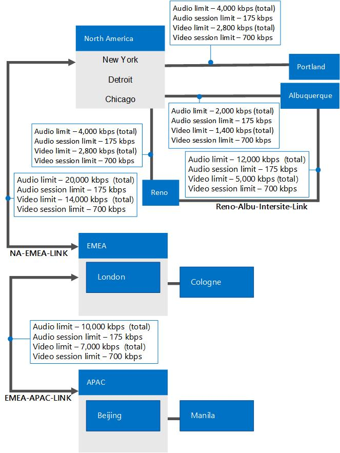

# Планирование управления приемом вызовов в Skype для бизнеса Server

Узнайте о контроле допуска вызовов, который может предотвратить вызовы, если они будут иметь низкое качество мультимедиа, в Skype для бизнеса Server Корпоративная голосовая связь.

Для ip-приложений, таких как телефония, видео и общий доступ к приложениям, доступная пропускная способность корпоративных сетей обычно не считается ограничивающим фактором в локальной среде. Однако на ссылках WAN, которые связаны между собой сайты, пропускная способность сети может быть ограничена.

Когда сетевой трафик переподписывает ссылку WAN, для устранения перегрузки используются текущие механизмы, такие как очередь, буферизации и сброс пакетов. Дополнительный трафик обычно задерживается до тех пор, пока перегрузка сети не ослабеет или, при необходимости, трафик будет отброшен. Для обычного трафика данных в таких ситуациях клиент может восстановиться. Однако для трафика в режиме реального времени, например единой связи, перегрузка сети не может быть решена таким образом, так как единый трафик коммуникаций чувствителен как к задержке, так и к потере пакета. Перегрузка на WAN может привести к плохому качеству работы (QoE) для пользователей. Для трафика в режиме реального времени в условиях перенапорки на самом деле лучше отказать в звонках, чем предоставлять подключения с плохим качеством.

Управление приемом вызовов (CAC) определяет, достаточно ли пропускной способности сети для создания сеанса приемлемого качества в режиме реального времени. В Skype для бизнеса Server cac управляет трафиком в режиме реального времени только для аудио и видео, но это не влияет на трафик данных. Если путь WAN по умолчанию не имеет требуемой пропускной способности, CAC может попытаться перенастроить вызов через интернет-путь или в общедоступные телефонные сети с переключениями (PSTN).

В этом разделе описаны функции управления приемом вызовов и описано планирование cac.

> [!NOTE]
> Skype для бизнеса Server имеет три расширенных Корпоративная голосовая связь: управление приемом вызовов (CAC), экстренные службы (E9-1-1) и обход мультимедиа. Обзор сведений о планировании, которые являются общими для всех трех этих функций, см. в примере Параметры сети для расширенных Корпоративная голосовая связь в [Skype для бизнеса Server.](network-settings-for-advanced-features.md)

Дизайн CAC в Skype для бизнеса Server предлагает четыре основных атрибута:

- Простота развертывания и управления без необходимости дополнительного оборудования, например специально настроенных маршрутизаторов.

- Разрешаются критические случаи использования объединенных коммуникаций, такие как перемещающиеся пользователи или несколько точек подключения. Политики контроля допуска звонков осуществляются в соответствии с тем, где располагается конечная точка, а не с тем, где находится пользователь.

- Помимо голосовых вызовов, контроль допуска звонков может применяться к другому трафику, такому как видеовызовы и сеансы аудио- и видеоконференций.

- Обеспечивает гибкость, позволяющую представление разных видов сетевых топологий.

Если новый аудио- или видеосеанс превышает ограничения пропускной способности, установленные в сети WAN, то этот сеанс либо блокируется, либо (только в случае телефонных вызовов) перенаправляется в ТСОП.

Контроль допуска звонков управляет трафиком в режиме реального времени только для звука и видео. Он не управляет трафиком данных.

Администраторы определяют политики CAC, которые применяются службой политики пропускной способности, установленной с каждым пулом переднего входа. Параметры CAC автоматически распространяются на все серверы Skype для бизнеса Server в сети.

Для вызовов, завершившихся неудачно из-за политик контроля допуска звонков, очередность перенаправления вызова выглядит следующим образом:

1. Интернет

2. ТСОП

3. голосовая почта.

Регистрация вызовов (CDR) захватывает сведения о вызовах, которые перенаправляются в ТСОП или в голосовую почту. CDR не захватывает сведения о вызовах, которые перенаправляются в Интернет, поскольку Интернет воспринимается скорее как альтернативный путь, а не как дополнительный вариант.

> [!NOTE]
> Вложения голосовой почты не будут отклоняться из-за ограничений пропускной способности.

Служба политик пропускной способности создает два типа файлов журналов в формате с разделением запятыми (CSV). Журнал **ошибок команд CHECK** заполняется, когда отклоняются запросы пропускной способности. Журнал **использования линий связи** регистрирует снимок топологии сети и использование полосы пропускания линии связи WAN. Оба эти журнала могут помочь при тонкой настройке политик контроля допуска звонков на основе использования.

## Аспекты контроля допуска звонков

Администратор выбирает установку службы политик пропускной способности в первом пуле, настроенном на центральном сайте. Поскольку в каждой области сети имеется один центральный сайт, то в этой области имеется только одна служба политик пропускной способности, управляющая политикой пропускной способности для этой области, связанными с нею сайтами и ссылками на эти сайты. Служба политики пропускной способности выполняется в составе серверов переднего конечного доступа, поэтому в этом пуле встроена высокая доступность. Служба политики пропускной способности, которая работает на каждом переднем сервере, синхронизируется каждые 15 секунд. Если пул переднего конца не работает, политики CAC больше не применяются для этого сайта до тех пор, пока пул переднего конца и, следовательно, служба политики пропускной способности снова не будет работать. Это означает, что все время неработоспособности службы политик пропускной способности будут проходить все звонки. Следовательно, существует возможность превышения лимита пропускной способности линий связи в течение этого периода.

Служба политики пропускной способности обеспечивает высокую доступность в пуле передней части; однако он не обеспечивает избыточность в пулах переднего конца. Служба политики пропускной способности не может отойт от одного пула переднего конца к другому. После восстановления службы в пуле передней части служба политики пропускной способности возобновляется и может снова выполнять проверки политики пропускной способности.

### Сетевые аспекты

Несмотря на то, что служба политики пропускной способности в Skype для бизнеса Server обеспечивает ограничение пропускной способности для аудио и видео, это ограничение не выполняется в сетевом маршрутизаторе (уровень 2 и 3). Cac не может запретить приложению данных, например, потреблять всю пропускную способность сети по ссылке WAN, включая пропускную способность, зарезервированную для аудио- и видео в политике CAC. Для защиты необходимой пропускной способности в сети можно развернуть протокол Quality of Service (QoS), например Дифференцированных служб (DiffServ). Поэтому передовая практика — координировать политики пропускной способности CAC, которые вы определяете, с любыми настройками QoS, которые можно развернуть.

### Пути передачи мультимедиа и сигналов через VPN

Если ваше предприятие поддерживает передачу мультимедиа через VPN, убедитесь, что как поток мультимедиа, так и поток сигналов проходят через VPN или маршрутизируются через Интернет. По умолчанию потоки мультимедиа и сигналов проходят через VPN-туннель.

### Контроль допуска звонков внешних пользователей

Контроль допуска вызовов не обеспечивается за пределами Skype для бизнеса Server организации. CAC не может применяться к трафику мультимедиа, пересекая Интернет, который не управляется Skype для бизнеса Server. Проверки CAC будут выполняться на части вызова, который проходит через корпоративную сеть, если вызываемая конечная точка принадлежит организации, а edge Server добавлен в конфигурацию сети, как описано в развертывании управления приемом [вызовов:](../../deploy/deploy-enterprise-voice/final-checklist.md)окончательный контрольный список для Skype для бизнеса Server . Если вызываемая конечная точка не принадлежит организации, например федератом или пользователем PIC, проверка политики пропускной способности не выполняется, а исходяющий вызов игнорирует ограничения CAC.

### Контроль допуска звонков подключений ТСОП

Управление приемом вызовов обеспечивается на сервере-посреднике независимо от того, подключен ли он к IP/PBX, шлюзу PSTN или магистрали SIP. Поскольку сервер-посредник является агентом пользователя (B2BUA), он прекращает работу мультимедиа. Он имеет две стороны подключения: сторона, подключенная к Skype для бизнеса Server и шлюзовая сторона, подключенная к шлюзам PSTN, IP/PBXs или магистральм SIP. Сведения о подключениях к PSTN см. в материале [Plan for PSTN connectivity in Skype для бизнеса Server.](pstn-connectivity-0.md)

CAC может применяться с обеих сторон сервера-посредника, если не включен обход мультимедиа. Если включен обход мультимедиа, медиа-трафик не пересекает сервер-посредник, а перетекает непосредственно между Skype для бизнеса клиентом и шлюзом. В этом случае контроль допуска звонков не требуется. Подробные сведения см. [в материале Plan for media bypass in Skype для бизнеса.](media-bypass.md)

На следующем рисунке показано, как осуществляется контроль допуска звонков в подключениях по ТСОП с включенным обходом сервера-посредника и без него.

**Осуществление контроля допуска звонков в подключениях к ТСОП**

## Определение требований к контролю допуска вызовов

Для планирования контроля допуска звонков (CAC) необходимы подробные сведения о топологии сети предприятия. Чтобы успешно спланировать контроль допуска звонков, выполните следующие действия.

1. Укажите концентраторы/магистральные области (называемые сетевыми регионами) в корпоративной сети.

2. Укажите офисы или филиалы (называемые сетевыми узлами) в каждом регионе сети.

3. Определите сетевой маршрут между каждой парой сетевых регионов.

4. Определите ограничения полосы пропускания для каждого соединения WAN.

    > [!NOTE]
    > Ограничения пропускной способности ссылаются на то, сколько пропускной способности на ссылке WAN выделяется для Корпоративная голосовая связь и аудио- и видеопотока. Если ссылка WAN описывается как "с ограниченной пропускной способностью", то у WAN-связи есть ограничение пропускной способности, которое ниже ожидаемого пикового трафика по ссылке.

5. Определите IP-подсети, назначенные каждому узлу сети.

Чтобы объяснить эти понятия, мы используем пример сетевой топологии, показанной на следующем рисунке.

**Пример топологии для контроля допуска звонков**

> [!NOTE]
> Все сетевые узлы связаны с регионом сети. Например, Портленд, Рено и Альбукерке включены в регион «Северная Америка». На этом рисунке представлены соединения WAN, к которым применяются политики CAC, с указанием ограничений полосы пропускании. Сетевые узлы Чикаго, Нью-Йорк и Детройт представлены внутри региона «Северная Америка», поскольку полоса пропускания для них не ограничена, а следовательно, применение политик CAC не требуется.

Описание компонентов этой примерной топологии приведено в следующих разделах. Подробные сведения о планировании этой топологии, включая ограничения пропускной способности, см. в [примере:](example-gathering-requirements.md)сбор требований для управления приемом вызовов в Skype для бизнеса Server .

### Определение регионов сети

Сетевой регион представляет собой сетевой концентратор или магистральную область.

Магистральная область или сетевой концентратор — это часть инфраструктуры компьютерной сети, которая соединяет различные части сети, предоставляя канал для обмена информацией между различными ЛВС или подсетями. Магистральная область может объединять разнообразные сети в широких географических масштабах. Емкости магистральной области обычно выше, чем емкостью сетей, подключенных к ней.

В наш пример топологии включены три сетевых региона: Северная Америка, EMEA и APAC. Сетевой регион содержит набор сетевых узлов (см. определение сетевых узлов далее в этом разделе). В сотрудничестве с отделом сетевых операций определите сетевые регионы.

### Связь центрального узла с каждым регионом сети

CAC требует, чтобы Skype для бизнеса Server для каждого сетевого региона определялся центральный сайт. Центральный сайт выбирается с учетом лучшего сетевого подключения и самой высокой пропускной способности для всех прочих сайтов в этом сетевом регионе. В предыдущем примере сетевая топология отображает разных сетевых регионов, каждый из которых имеет центральный сайт, обрабатывающий решения CAS. На основе предыдущего примера подходящее сопоставление приведено в следующей таблице.

> [!NOTE]
> Центральные узлы необязательно соответствуют сетевым узлам. В примерах, приведенных в данной документации, некоторые центральные узлы — Чикаго, Лондон и Пекин — имеют те же имена, что и соответствующие сайты сети. Однако даже если центральный сайт и сетевой сайт имеют одно и то же имя, центральный сайт является элементом топологии Skype для бизнеса Server, в то время как сетевой сайт является частью общей сети, в которой Skype для бизнеса Server топология.

**Области сети, центральные узлы и сетевые узлы**

|**Область сети**|**Центральный сайт**|**Сетевые узлы**|
|:-----|:-----|:-----|
|Северная Америка    |Чикаго    |Чикаго    Нью-Йорк    Детройт    Портленд    Reno    Альбукерке    |
|EMEA    |Лондон    |Лондон    Кельн    |
|APAC    |Пекин    |Пекин    Манила    |

### Определение сетевых узлов

Сетевой узел представляет собой место, в котором у организации имеется собственность, например офисы, здания или территории. Физический объект со связью через локальную или проводную сеть с другими сайтами считается сетевым сайтом. Начните с инвентаризации всех офисов организации. В нашем примере топологии регион сети «Северная Америка» состоит из следующих сетевых узлов: Нью-Йорк, Чикаго, Детройт, Портленд, Рено и Альбукерке.

Необходимо связать каждый сетевой узел с регионом сети. В зависимости от наличия или отсутствия у сетевого узла ограниченной связи WAN сетевому узлу назначается политика пропускной способности. Для получения дополнительных сведений о политиках CAC и полосе пропускания, выделяемой с их помощью, см. тему «Определение политик пропускной способности» далее в этом разделе. Чтобы настроить CAC, вы связываете сетевые узлы с регионами сети, а затем создаете политики выделения полосы пропускания для установления подключений с ограниченной полосой пропускания между данным узлом или регионом и подключений WAN между узлам и регионами.

### Определение сетевых соединений

Сетевые соединения представляют собой подключения к физической сети WAN, которая связывает различные регионы и узлы. В нашем примере топологии существуют два сетевых соединения с регионами, пять сетевых соединений между регионами и узлами и одно сетевое соединение между двумя узлами.

Два региональных соединения — это соединение между Северной Америкой и регионом EMEA, которое обозначается как канал NA-EMEA-LINK, и соединение между регионами APAC и EMEA, которое обозначается как канал EMEA-APAC-LINK.

Соединения между узлами обозначены как каналы, соединяющие Портленд, Рено и Альбукерке с регионом «Северная Америка», Манилу с регионом «APAC» и Кельн с регионом «EMEA». Соединение между Рено и Альбукерке представлено прямым сетевым каналом между этими двумя узлами.

### Определение политик пропускной способности

В сотрудничестве с отделом сетевых операций определите, какая полоса пропускания WAN доступна для передачи аудио-и видеоинформации в реальном времени по каналам WAN в организации. Политики полосы пропускания обычно применяются к соединениям WAN, если предполагается, что может потребоваться выделение более широкой полосы пропускания, чем та, которая может быть выделена для аудио- и видеокомпонентов.

Политики пропускной способности определяют максимальную пропускную способность, которая может быть зарезервирована для передачи звука и видео в режиме реального времени. Так как CAC не ограничивает скорость передачи другого трафика, он не может предотвратить полного использования пропускной способности сети при передаче других данных, таких как передача больших файлов или потоковое воспроизведение музыки.

Политики полосы пропускания CAC могут определять любые из следующих характеристик (или все следующие характеристики):

- Максимальная общая полоса пропускания, выделенная для аудиокомпонентов.

- Максимальная общая полоса пропускания, выделенная для видеокомпонентов.

- Максимальная полоса пропускания, выделенная для одного аудиовызова (сеанса).

- Максимальная полоса пропускания, выделенная для одного видеовызова (сеанса).

> [!NOTE]
> Все значения пропускной способности CAC представляют максимальные ограничения однонаправленной  *пропускной*  способности.

> [!NOTE]
> Функции Skype для бизнеса Server голосовой политики предоставляют возможность переопределять проверки политики пропускной способности для входящих вызовов для пользователя (не для исходяющих вызовов, которые размещаются пользователем). После того как сеанс будет установлен, будет точно учитываться потребление пропускной способности. Этот параметр следует использовать с осторожностью. Дополнительные сведения см. в материале Create [or modify a voice policy and configure PSTN use records in Skype для бизнеса](../../deploy/deploy-enterprise-voice/voice-policy-and-pstn-usage-records.md) or Modify a Voice Policy and [Configure PSTN Usage Records](/previous-versions/office/lync-server-2013/lync-server-2013-modify-a-voice-policy-and-configure-pstn-usage-records) in the Deployment documentation.

Чтобы оптимизировать использование полосы пропускания для отдельных сеансов, примите во внимание тип аудио- и видеокодеков, которые будут использоваться. В частности избегайте выделения недостаточной полосы пропускания для кодека, который предполагается использовать часто. Наоборот, если необходимо предотвратить использование кодека, для которого требуется выделение более широкой полосы пропускания, следует задать достаточно низкое значение максимальной полосы пропускания для отдельных сеансов, чтобы воспрепятствовать его использованию. Если речь идет об аудиокомпонентах, не все кодеки доступны для каждого сценария. Например:

- Одноранговые звуковые вызовы между Skype для бизнеса конечными точками будут использовать RTAudio (8kHz) или RTAudio (16kHz), если учитывать пропускную способность и приоритеты кодеков.

- Конференц-Skype для бизнеса между конечными точками и службой конференц-связи A/V будет использовать G.722 или Сирену.

- Вызовы в общедоступные телефонные сети (PSTN) в конечные точки или из Skype для бизнеса будут использовать G.711 или RTAudio (8kHz).

Используйте приведенную ниже таблицу для подбора максимальных параметров полосы пропускания для отдельного сеанса.

**Использование полосы пропускания — кодеки**

|**Кодек**|**Требования к полосе пропускания без метода прямой коррекции ошибок (FEC)**|**Требования к полосе пропускания с методом прямой коррекции ошибок (FEC)**|
|:-----|:-----|:-----|
|RTAudio (8 кГц)    |49,8 кбит/с    |61,6 кбит/с    |
|RTAudio (16 кГц)    |67 кбит/с    |96 кбит/с    |
|Сирена    |57,6 кбит/с    |73,6 кбит/с    |
|G.711    |102 кбит/с    |166 кбит/с    |
|G.722    |105,6 кбит/с    |169,6 кбит/с    |
|RTVideo (CIF 15 кадров в секунду)    |260 кбит/с    |Не применимо    |
|RTVideo (VGA 30 кадров в секунду)    |610 кбит/с    |Не применимо    |

> [!NOTE]
> Требования к пропускной способности должны определяться с учетом следующих расходов: Ethernet II, IP, UDP, RTP и SRTP. Они также включают 10 кбит/с для RTCP.

Кодеки G.722.1 и Siren аналогичны, но они обеспечивают разную скорость потока.

Кодек по умолчанию для Skype для бизнеса Server G.722 полностью отличается от кодеков G.722.1 и Siren.

Кодек сирены используется в Skype для бизнеса Server в следующих ситуациях:

- Если для полосы пропускания установлено слишком низкое значение, которое не позволяет использовать G.722.

- Если клиент Communications Server 2007 или Communications Server 2007 R2 подключается к службе Skype для бизнеса Server (так как эти клиенты не поддерживают кодек G.722).

**Использование полосы пропускания в различных сценариях**

|**Сценарий**|**Требования к полосе пропускания, оптимизированные с учетом количества (кбит/с)**|**Требования к полосе пропускания для сбалансированного режима (кбит/с)**|**Требования к полосе пропускания, оптимизированные с учетом качества (кбит/с)**|
|:-----|:-----|:-----|:-----|
|Одноранговые аудиовызовы    |45 кбит/с    |62 кбит/с    |91 кбит/с    |
|Конференц-вызовы    |53 кбит/с    |101 кбит/с    |165 кбит/с    |
|Вызовы PSTN (между Skype для бизнеса и шлюзом PSTN с обходом мультимедиа)    |97 кбит/с    |97 кбит/с    |161 кбит/с    |
|Вызовы PSTN (между Skype для бизнеса и сервером-посредником без обхода мультимедиа)    |45 кбит/с    |97 кбит/с    |161 кбит/с    |
|Вызовы PSTN (между сервером-посредником и шлюзом PSTN без обхода мультимедиа)    |97 кбит/с    |97 кбит/с    |161 кбит/с    |
|Skype для бизнеса - звонки Polycom    |101 Kbps    |101 Kbps    |101 Kbps    |

### Определение подсистем IP

Для каждого узла сети необходимо в сотрудничестве с сетевым администратором определить, какие IP-подсети назначены каждому сетевому узлу. Если администратор сети уже упорядочил IP-подсети в регионы сети, ваша работа значительно упрощается.

В нашем примере узлу «Нью-Йорке» в регионе «Северная Америка» назначаются следующие IP-подсети: 172.29.80.0/23, 157.57.216.0/25, 172.29.91.0/23, 172.29.81.0/24. Предположим, Боб, который обычно работает в Детройте, отправляется в Нью-Йоркское отделение для прохождения обучения. Когда он включает свой компьютер и подключается к сети, его компьютер получает IP-адрес в одном из четырех регионов, которые зарезервированы для Нью-Йорка, например 172.29.80.103.

> [!CAUTION]
> Подсети IP, указанные во время настройки сети на сервере, должны соответствовать формату, предоставленному клиентскими компьютерами, чтобы гарантировать их надлежащее использование для обхода сервера-посредника. Клиент Skype для бизнеса принимает локальный IP-адрес и маскирует IP-адрес с связанной подсети маской. При определении идентификатора обхода, связанного с каждым клиентом, регистратор сравнивает список IP-подсетей, связанных с каждым сетевым узлом, с подсетью, предоставленной клиентом, для поиска точного совпадения. По этой причине крайне важно, чтобы подсети, введенные во время настройки сети на сервере, являлись действительным, а не виртуальными подсетями. (Если вы развернули управление приемом вызовов, но не объезд мультимедиа, управление приемом вызовов будет функционировать должным образом, даже если вы настраиваете виртуальные подсети.) Например, если клиент вошел на компьютер с IP-адресом 172.29.81.57 с маской подсети IP 255.255.255.0, Skype для бизнеса запросит объездной ID, связанный с подсетей 172.29.81.0. Если подсеть определена как 172.29.0.0/16, то хотя клиент принадлежит этой виртуальной подсети, регистратор не будет считать это соответствием, поскольку точно ищет подсеть 172.29.81.0. Поэтому важно, чтобы администратор вводил подсети точно так же, как и Skype для бизнеса клиентов (которые обеспечиваются подсетями во время конфигурации сети либо статически, либо по DHCP).)

## Лучшие практики для управления приемом вызовов

Чтобы улучшить производительность и упростить развертывание, руководствуйтесь следующими рекомендациями при развертывании контроля допуска звонков:

- Убедитесь, что глобальные сети соответствующим образом подготовлены для текущего и прогнозируемого трафика мультимедиа.

    > [!NOTE]
    > Мы рекомендуем учесть в ограничениях пропускной способности буфер. Существуют сценарии, такие как состояние гонки, которые затрагивают общую пропускную способность и могут привести к превышению предела пропускной способности. Например, при попытке запуска двух звонков в условиях приближения к пределу пропускной способности один из них может быть отклонен, так как другому удалось запуститься первым.

- Отслеживайте использование сети и записи регистрации вызовов, чтобы вы могли выбрать оптимальные параметры управления допуском звонков и обновлять их по мере изменения использования сети.

- Используйте политики пропускной способности управления допуском звонков для настройки параметров качества обслуживания.

- Если требуется перенаправлять заблокированные звонки в ТСОП, убедитесь в работоспособности и достаточной емкости этой телефонной сети. Дополнительные сведения см. в разделе [Planning Outbound Call Routing](/previous-versions/office/lync-server-2013/lync-server-2013-planning-outbound-voice-routing).

    > [!NOTE]
    > Под емкостью понимается количество портов, которые требуется открыть для обеспечения поддержки потенциального объема перенаправлений в ТСОП.