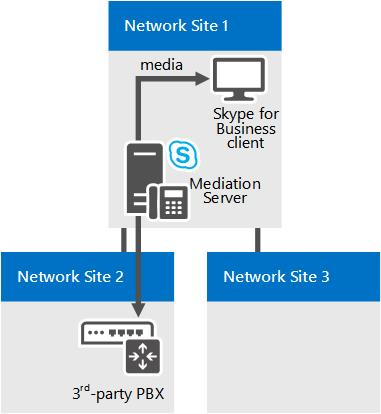

# Компоненты и топологии для управления приемом вызовов в Skype для бизнеса

Планирование управления приемом вызовов (CAC), если у вас есть сеть MPLS, магистраль SIP или сторонний шлюз PSTN или PBX. Применяется к Skype для бизнеса Server Корпоративная голосовая связь.

В этом разделе описываются моменты, которые следует учитывать при развертывании контроля допуска звонков с различными типами топологии сети.

## Управление приемом вызовов в сети MPLS

В сети с многопротокольной коммутацией по меткам (MPLS) все сайты соединены в полную сетку. То есть, все сайты подключаются напрямую к MPLS-магистрали поставщика услуг Интернета, и каждому сайту выделяется полоса пропускания, используемая для взаимодействия по каналу глобальной сети с MPLS-облаком. Не существует ни сетевого концентратора, ни центрального сайта для управления IP-маршрутизацией. На следующему рисунке показана простая сеть, основанная на технологии MPLS.

**Пример сети MPLS**

Чтобы развернуть контроль допуска звонков в сети MPLS, вам требуется создать область сети, представляющую облако MPLS, и создать сетевой узел, представляющий каждый вспомогательный сайт MPLS. На следующем рисунке показано, как следует настроить область сети и сетевые узлы, чтобы они представляли пример сети MPLS из предыдущего примера. Ограничения для общей пропускной способности и пропускной способности сеанса основываются на емкости канала связи глобальной сети от каждого сетевого узла к области сети, которая представляет облако MPLS.

**Область сети и сетевые узлы для сети MPLS**

## Управление приемом вызовов в магистрали SIP

Для развертывания контроля допуска звонков в канал SIP создается сетевой узел, который представляет поставщика услуг Интернет-телефонии (ITSP). Для применения значений политики пропускной способности в канале SIP создается межузловая политика между сетевым узлом в предприятии и сетевым узлом, созданным для представления ITSP.

На следующем рисунке показан пример развертывания контроля допуска звонков в канале SIP.

**Конфигурация контроля допуска звонков в канале SIP**

Чтобы настроить контроль допуска звонков в канале SIP, во время развертывания контроля допуска звонков необходимо выполнить следующие задачи.

1. Создать сетевой узел, представляющий поставщика услуг Интернет-телефонии (ITSP). Связать этот сетевой узел с соответствующей областью сети и выделить в этом сетевом узле нулевую пропускную способность для аудио и видео. Подробные сведения см. в разделе [Configure Network Sites for CAC](/previous-versions/office/lync-server-2013/lync-server-2013-configure-network-sites-for-cac) документации по развертыванию.

    > [!NOTE]
    > Для ITSP конфигурация этого сетевого узла не функциональна. Значения политики пропускной способности фактически применяются в шаге 2.

2. Создайте межсайтовую ссылку для магистрали SIP с использованием соответствующих значений параметров для сайта, созданного на шаге 1. Например, используйте имя сетевого сайта в вашем предприятии в качестве значения параметра NetworkSiteID1, а сетевого сайта ITSP как значение параметра NetworkSiteID2. Дополнительные сведения см. в материале [Create network intersite policies in Skype для бизнеса Server](../../deploy/deploy-enterprise-voice/create-network-intersite-policies.md) документации по развертыванию и [New-CsNetworkInterSitePolicy.](/powershell/module/skype/new-csnetworkintersitepolicy?view=skype-ps)

3. Получите IP-адрес точки прерывания мультимедиа диспетчера сеанса (SCB) в своем ITSP. Добавить этот IP-адрес с маской подсети 32 к сетевому узлу, представляющему ITSP. Подробные сведения см. в статье [Associate a Subnet with a Network Site](/previous-versions/office/lync-server-2013/lync-server-2013-associate-a-subnet-with-a-network-site).

## Управление приемом вызовов с помощью сторонних шлюзов PSTN или PBX

В этом разделе описываются примеры развертывания управления приемом вызовов (CAC) по ссылке между интерфейсом шлюза сервера-посредника и шлюзом открытой телефонной сети (PSTN) или частным филиалом (PBX).

### Случай 1. Контроль допуска звонков между сервером-посредником и шлюзом ТСОП

CAC можно развернуть по ссылке WAN из интерфейса шлюза сервера-посредника в сторонний шлюз PBX или PSTN.

**Случай 1. Контроль допуска звонков между сервером-посредником и шлюзом ТСОП**

В этом примере контроль допуска звонков реализуется между сервером-посредником и шлюзом ТСОП. Если клиент Skype для бизнеса на сетевом сайте 1 помещает вызов PSTN через шлюз PSTN в сетевом сайте 2, средства массовой информации течет через ссылку WAN. Поэтому для каждого сеанса ТСОП выполняются две проверки контроля допуска звонков:

- Между клиентом Skype для бизнеса и сервером-посредником

- между сервером-посредником и шлюзом ТСОП.

Проверки выполняются как для входящих звонков ТСОП, поступающих в клиент в сетевом узле 1, так и для исходящих звонков ТСОП из клиентского приложения в сетевом узле 1.

> [!NOTE]
> Убедитесь в том, что IP-подсеть, к которой относится шлюз ТСОП, настроена и связана с сетевым узлом 2.

> [!NOTE]
> Убедитесь в том, что IP-подсеть, к которой относятся оба интерфейса сервера-посредника, настроена и связана с сетевым узлом 1.

> [!NOTE]
> Подробнее см. в разделе [Associate a Subnet with a Network Site](/previous-versions/office/lync-server-2013/lync-server-2013-associate-a-subnet-with-a-network-site).

### Случай 2. Контроль допуска звонков между сервером-посредником и сторонней УАТС с точкой Media Termination Point

Эта конфигурация аналогична случаю 1. В обоих случаях серверу-посреднику известно, какое устройство является конечным на противоположном конце канала глобальной сети, и IP-адрес шлюза ТСОП или УАТС с точкой Media Termination Point (MTP) настраивается на сервере-посреднике как следующий прыжок.

**Случай 2. Контроль допуска звонков между сервером-посредником и сторонней УАТС с точкой MTP**

В этом примере контроль допуска звонков реализуется между сервером-посредником и УАТС с точкой MTP. Если клиент Skype для бизнеса на сетевом сайте 1 помещает вызов PSTN через PBX/MTP, расположенный в сетевом сайте 2, средства массовой информации течет через ссылку WAN. Поэтому для каждого сеанса ТСОП выполняются две проверки контроля допуска звонков:

- Между клиентом Skype для бизнеса и сервером-посредником

- между сервером-посредником и УАТС с точкой MTP.

Проверки выполняются как для входящих звонков ТСОП, поступающих в клиент в сетевом узле 1, так и для исходящих звонков ТСОП из клиента в сетевом узле 1.

> [!NOTE]
> Убедитесь в том, что IP-подсеть, к которой относится точка MTP, настроена и связана с сетевым узлом 2.

> [!NOTE]
> Убедитесь в том, что IP-подсеть, к которой относятся оба интерфейса сервера-посредника, настроена и связана с сетевым узлом 1.

> [!NOTE]
> Подробнее см. в разделе [Associate a Subnet with a Network Site](/previous-versions/office/lync-server-2013/lync-server-2013-associate-a-subnet-with-a-network-site).

### Случай 3. Контроль допуска звонков между сервером-посредником и сторонней УАТС без точки Media Termination Point

Случай 3 немного отличается от первых двух. Если на сторонней УАТС отсутствует точка MTP, то при выполнении запроса исходящего сеанса к сторонней УАТС серверу-посреднику неизвестно, куда поступят данные в пределах УАТС. В этом случае данные передаются непосредственно между сервером-посредником и сторонним конечным устройством.

**Случай 3. Контроль допуска звонков между сервером-посредником и сторонней УАТС без точки MTP**

В этом примере, если клиент Skype для бизнеса на сетевом сайте 1 помещает вызов пользователю через PBX, сервер-посредник может выполнять проверки CAC только на прокси-ноге (между клиентом Skype для бизнеса приложением и сервером-посредником). Поскольку сервер-посредник не имеет сведений о конечном устройстве при запросе сеанса, проверки контроля допуска звонков нельзя выполнить на канале глобальной сети (между сервером-посредником и сторонним устройством) до того, как звонок будет установлен. Однако после установки сеанса серверу-посреднику проще контролировать используемую пропускную способность магистрали.

Если звонки исходят со сторонней конечной точки, информация об устройстве становится доступна в момент выполнения запроса сеанса, после чего проверки контроля допуска звонков можно выполнить на обеих сторонах сервера-посредника.

> [!NOTE]
> Убедитесь в том, что IP-подсеть, к которой относятся устройства конечных точек, настроена и связана с сетевым узлом 2.

> [!NOTE]
> Убедитесь в том, что IP-подсеть, к которой относятся оба интерфейса сервера-посредника, настроена и связана с сетевым узлом 1.

> [!NOTE]
> Подробнее см. в разделе [Associate a Subnet with a Network Site](/previous-versions/office/lync-server-2013/lync-server-2013-associate-a-subnet-with-a-network-site).