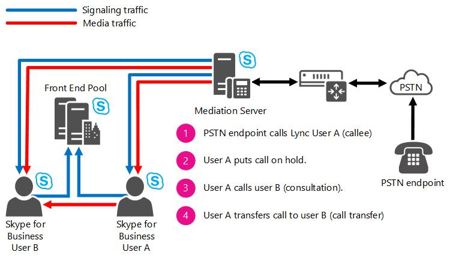

# <a name="location-based-routing-for-conferencing-in-skype-for-business-server"></a>Location-Based маршрутику для конференций в Skype для бизнеса Server

Планирование маршрутизов на основе расположения для проведения Skype для бизнеса Server Корпоративная голосовая связь, в том числе для переноса консультативных вызовов.

Location-Based маршрутизов позволяет ограничить маршрутику вызовов между конечными точками VoIP и конечными точками PSTN в зависимости от расположения сторон в вызове. Location-Based маршрутивка для конференц-конференций позволяет применять правила Location-Based маршрутов на собраниях (например, конференциях), чтобы предотвратить обход платных платы PSTN. Приложение отслеживает активную конференцию и применяет Location-Based маршрутных маршрутов в зависимости от расположения участников. Приложение Location-Based маршрутивка для приложения Conferencing дополнительно позволяет обеспечить применение ограничений Location-Based маршрутов для консультативных переводов с конечными точками PSTN.

Приложение Location-Based маршрутных конференций предоставляет Skype для бизнеса конференциям механизм для предотвращения обхода платы за проезд по платной трассе. Приложение отслеживает активные конференции и применяет Location-Based маршрутных маршрутов в зависимости от расположения Skype для бизнеса участников.

Приложение Location-Based маршрутных conferencing определяет, следует ли Location-Based на собрании Skype для бизнеса, если будут выполнены следующие критерии:

- Организатор собрания включен для Location-Based маршрутов. Location-Based маршрутизинга будут применяться только к конференциям, организованным пользователями, которые включены для Location-Based маршрутизов.

- По крайней мере один участник собрания является конечной точкой PSTN. Location-Based маршрутов применимы только для конференций, включающих конечные точки PSTN.

- Сетевой сайт, на котором шлюз PSTN, используемый для подключения конференции к PSTN, расположен, а также сетевые сайты, с которых подключаются организаторы и участники.

Приложение Location-Based маршрутивка для конференц-связи предотвращает участие Skype для бизнеса пользователей и конечных точек PSTN с разных сетевых сайтов в одной и той же конференции. Если организатор собрания включен для Location-Based маршрутов, приложение Conferencing применяет следующие ограничения:

- Конечные точки, которые могут присоединиться к собранию Skype для бизнеса, зависят от конечных точек, которые уже присоединились к конференции, и это ограничение регулируется по мере того, как присоединяются конечные точки и присоединяются к конференции новые конечные точки. Если организаторы и участники присоединяются к собранию Skype для бизнеса на одном сетевом сайте, то к нему допускаются конечная точка PSTN, другой участник из того же сетевого сайта, другой участник с другого сетевого сайта или участник с неизвестного сетевого сайта.

- Если организаторы и участники присоединяются к собранию с разных или неизвестных сетевых сайтов, конечная точка PSTN не может присоединиться к собранию, если вызов PSTN врещается из магистрали SIP, включенного для Location-Based маршрутинга.

- Если организаторы и участники присоединяются к собранию с одного сетевого сайта, а участники присоединяются к одному собранию из PSTN, Skype для бизнеса конечная точка с другого сетевого сайта не может присоединиться к собранию.

Эти ограничения Location-Based маршрутивке суммируются в следующей таблице.

|User(s) на конференции в любой момент|User(s) разрешено присоединяться к конференции|User(s) не разрешено присоединяться к конференции|
|:-----|:-----|:-----|
|Skype для бизнеса клиента VoIP с одного сетевого сайта  <br/> |Skype для бизнеса клиента VoIP с одного сетевого сайта  <br/> Skype для бизнеса клиента VoIP с другого сетевого сайта  <br/> Skype для бизнеса клиента VoIP с неизвестного сетевого сайта  <br/> Клиент federated Skype для бизнеса VoIP  <br/> Присоединение пользователей из конечной точки PSTN  <br/> |Нет  <br/> |
|Skype для бизнеса клиента VoIP с неизвестного сетевого сайта  <br/> |Skype для бизнеса клиента VoIP с любого сайта  <br/> Skype для бизнеса клиента VoIP с неизвестного сайта  <br/> Клиент federated Skype для бизнеса VoIP  <br/> |Присоединение пользователей с помощью конечной точки PSTN  <br/> |
|Skype для бизнеса клиентов VoIP с разных сетевых сайтов  <br/> |Skype для бизнеса клиента VoIP с любого сетевого сайта  <br/> Skype для бизнеса клиента VoIP с неизвестного сетевого сайта  <br/> Клиент federated Skype для бизнеса VoIP  <br/> |Присоединение пользователей с помощью конечной точки PSTN  <br/> |
|Skype для бизнеса клиента VoIP с одного сетевого сайта и пользователей, присоединявшихся с конечной точки PSTN  <br/> |Skype для бизнеса клиента VoIP с одного сетевого сайта  <br/> |Skype для бизнеса клиента VoIP с другого сетевого сайта  <br/> Skype для бизнеса клиента VoIP с неизвестного сетевого сайта  <br/> Клиент federated Skype для бизнеса VoIP  <br/> |

Далее следующую информацию можно ухудить с Location-Based для приложения Conferencing:

- Если пользователю не разрешено присоединяться к конференции, Location-Based ограничений на маршрутику, вызов на конференцию будет отклонен, а клиент Skype для бизнеса, что вызов не был завершен или завершен.

- Конечная точка PSTN, присоединяясь к конференции с Location-Based для обеспечения маршрутизации, не будет ограничена присоединением к конференции независимо от ее состояния, если конечная точка присоединяется через магистраль, который не включен для Location-Based маршрутинга.

- Система PBX, подключенная к серверу-посреднику через магистраль SIP, который не отступит от вызовов в PSTN, будет иметь те же правоприменители, что и Skype для бизнеса пользователей, расположенных на том же сетевом сайте, где определен магистраль SIP. Например, конечная точка PSTN сможет присоединяться к конференции с пользователем PBX и пользователем Skype для бизнеса, если они расположены на одном сетевом сайте; в противном случае конечная точка PSTN не будет допущена к конференции, если пользователь PBX находится на другом сетевом сайте, чем Skype для бизнеса пользователь.

> [!NOTE]
> При Skype для бизнеса накопительном обновлении 4 следует соблюдать поведение в следующей таблице:

|Пользователь.|Другая сторона|Action|Result|
|:-----|:-----|:-----|:-----|
|Skype для бизнеса Mobile  <br/> |ТСОП  <br/> |Skype для бизнеса Mobile находится в вызове PSTN. Skype для бизнеса Mobile затем перенагнет вызов в конференц-автосекретарь (CAA).  <br/> |Вызов блокируется с соответствующим сообщением об ошибке.  <br/> |
|Skype для бизнеса Mobile  <br/> |Skype для бизнеса клиент или федераированный пользователь  <br/> |Клиент или федераированный пользователь находится на вызове VoIP для пользователя Skype для бизнеса мобильных Location-Based маршрутизатора, и любая сторона перерастает в ЦАА.  <br/> |Вызов эскалации блокируется с соответствующим сообщением об ошибке.  <br/> |

## <a name="consultative-call-transfers"></a>Перенос консультативных вызовов

В дополнение к Location-Based маршрутизам Skype для бизнеса собраний приложение Location-Based маршрутиза для conferencing применяет Location-Based маршрутизацию для переноса консультативных вызовов, отступающих к конечным точкам PSTN. Перенос консультаций — это вызов, установленный между двумя сторонами, в котором одна из сторон передает вызов новому пользователю. Например, конечная точка PSTN вызывает пользователя A (Skype для бизнеса вызываемой). Пользователь A определяет, что пользователь PSTN должен быть переадворен пользователю B (Skype для бизнеса пользователю). Пользователь A помещает вызов с пользователем PSTN на удержание и вызывает пользователя B. Пользователь B соглашается поговорить с пользователем PSTN. Пользователь A передает вызов на удержание пользователю B.

**Поток вызовов для переноса консультативных вызовов**



Если пользователь включен для Location-Based маршрутинга инициирует перенос конечной точки PSTN (как показано на предыдущем рисунке), это создает два активных вызова, один вызов между пользователем PSTN и пользователем Skype для бизнеса A, а другой между Skype для бизнеса пользователем A и Skype для бизнеса  пользователь B. Следующее поведение обеспечивается приложением Location-Based маршрутике для conferencing:

- Если магистраль SIP, маршрутиздающий вызов PSTN, уполномочен перенаводить вызов PSTN на веб-сайт сети, на котором находится Skype для бизнеса пользователя B (то есть целевой объект передачи), то передача вызовов будет разрешена; в противном случае перенос консультативных вызовов будет заблокирован. Эта авторизация выполняется в зависимости от расположения переданной стороны на том же сетевом сайте, что и магистраль SIP, которая маршрутит активный вызов в конечную точку PSTN.

- Если магистраль SIP, маршрутиздающий входящий вызов PSTN, не уполномочен маршрутизировать вызовы на сетевой сайт, где расположена переданная сторона (Skype для бизнеса пользователь B) или переданная сторона находится на неизвестном сетевом сайте, то будет заблокирована консультативная передача вызова на конечную точку PSTN (например, цель передачи вызовов).

В следующей таблице описывается, как Location-Based маршрутизов применяются приложением Location-Based маршрутизов для конференциативной передачи вызовов. Хотя конечные точки PBX напрямую не связаны с сетевым сайтом, магистраль SIP, к который подключен PBX, может быть назначен сетевому сайту. Поэтому конечная точка PBX может быть косвенно связана с сетевым сайтом.


|Сетевой сайт перенаправленной стороны вызова|Сетевой сайт целевой задачи передачи вызовов|Поведение|
|:-----|:-----|:-----|
|Конечная точка PSTN  <br/> |Skype для бизнеса пользователя на том же сетевом сайте (например, сайт 1)  <br/> |Разрешена консультативный перевод  <br/> |
|Конечная точка PSTN  <br/> |Skype для бизнеса на разных сетевых сайтах (например, на сайте 2)  <br/> |Консультативная передача будет отложена  <br/> |
|Конечная точка PSTN  <br/> |Skype для бизнеса пользователя на неизвестном сетевом сайте  <br/> |Консультативная передача будет отложена  <br/> |
|Конечная точка PSTN  <br/> |Федера Skype для бизнеса пользователя  <br/> |Консультативная передача будет отложена  <br/> |
|Конечная точка PSTN  <br/> |Конечная точка PBX на том же сайте (например, сайт 1)  <br/> |Разрешена консультативный перевод  <br/> |
|Конечная точка PSTN  <br/> |Конечная точка PBX на разных сайтах (например, сайт 2)  <br/> |Консультативная передача будет отложена  <br/> |
|Конечная точка PBX на том же сайте (например, сайт 1)  <br/> |Конечная точка PSTN  <br/> |Разрешена консультативный перевод  <br/> |
|Конечная точка PBX на другом сайте (например, сайт 2)  <br/> |Конечная точка PSTN  <br/> |Консультативная передача будет отложена  <br/> |
|Конечная точка PBX на любом сайте  <br/> |Skype для бизнеса пользователя на том же сетевом сайте (например, сайт 1)  <br/> |Разрешена консультативный перевод  <br/> |
|Конечная точка PBX на любом сайте  <br/> |Skype для бизнеса на разных сетевых сайтах (например, на сайте 2)  <br/> |Разрешена консультативный перевод  <br/> |
|Конечная точка PBX на любом сайте  <br/> |Skype для бизнеса пользователя на неизвестном сетевом сайте  <br/> |Разрешена консультативный перевод  <br/> |
|Конечная точка PBX на любом сайте  <br/> |Федера Skype для бизнеса пользователя  <br/> |Разрешена консультативный перевод  <br/> |

## <a name="requirements"></a>Requirements

Приложение Location-Based маршрутивка для конференциалов требует, чтобы Skype для бизнеса Server или Lync Server 2013 Накопительное обновление 2 развертывалось во всех пулах Front-End и выпуск Standard серверов в топологии. Если эти серверные версии не установлены на некоторых серверах топологии, Location-Based не могут быть полностью применены ограничения на маршрутику собраний и переносов консультативных вызовов.

В следующей таблице определяется сочетание ролей сервера и версий, поддерживаюющих Location-Based маршрутику.


|Front-End Пул версия|Версия сервера-посредника|Поддерживается|
|:-----|:-----|:-----|
|Skype для бизнеса Server или Lync Server 2013 Накопительное обновление 2  <br/> |Skype для бизнеса Server или Lync Server 2013 Накопительное обновление 2  <br/> |Да  <br/> |
|Накопительное обновление Lync Server 2013 2  <br/> |Накопительное обновление Lync Server 2013 1  <br/> |Нет  <br/> |
|Накопительное обновление Lync Server 2013 2  <br/> |Lync Server 2010  <br/> |Нет  <br/> |
|Накопительное обновление Lync Server 2013 2  <br/> |Office Communications Server 2007 R2  <br/> |Нет  <br/> |
|Накопительное обновление Lync Server 2013 1  <br/> |Любой  <br/> |Нет  <br/> |
|Lync Server 2010  <br/> |Любой  <br/> |Нет  <br/> |
|Office Communications Server 2007 R2  <br/> |Любой  <br/> |Нет  <br/> |

## <a name="configuration-of-location-based-routing-for-conferencing"></a>Конфигурация Location-Based маршрутике для конференциации

Маршрут Location-Based для приложения conferencing зависит от конфигурации Location-Based маршрутов. Основные конфигурации:

- Расположение участников, присоединявшихся к собранию, определяется на основе веб-сайта сети. Сетевой сайт и связанные с ним сетевые подсети должны быть определены в Skype для бизнеса Server для обеспечения Location-Based маршрутизации.

- Чтобы обеспечить Location-Based маршрутику собраний, необходимо включить Skype для бизнеса участников для Location-Based маршрутов.

- Чтобы обеспечить Location-Based маршрутику конечных точек PSTN, присоединяющихся к собраниям, магистраль SIP, используемый для подключения конечных точек PSTN, должен быть настроен для Location-Based маршрутинга.

## <a name="enabling-the-location-based-routing-for-conferencing"></a>Включение Location-Based маршрутике для конференциинга

Маршрут Location-Based для приложения Conferencing отключен по умолчанию. Прежде чем включить это приложение, необходимо определить правильный приоритет для назначения для приложения. Чтобы определить этот приоритет, запустите следующий cmdlet в Skype для бизнеса Server управленческой оболочки:

```powershell
Get-CsServerApplication -Identity Service:Registrar:<Pool FQDN>
```

В этом комлете находится пул, \<Pool FQDN\> в котором необходимо включить Location-Based маршрутику для приложения Conferencing.

Этот комдлет возвращает список приложений, Skype для бизнеса Server и значение приоритета для каждого из них. Для Location-Based для приложения Conferencing необходимо присвоить приоритетное значение, превышающее значение "UdcAgent" и меньше, чем приложения "DefaultRouting", "ExumRouting" и "OutboundRouting". Рекомендуется назначить Location-Based для приложения Conferencing приоритетное значение, которое на один балл превышает приоритетное значение приложения UdcAgent.

Например, если приложение UdcAgent имеет приоритетное значение "2", приложение DefaultRouting имеет приоритетное значение "8", приложение "ExumRouting" имеет приоритетное значение "9", а приложение "Исходящие" имеет приоритетное значение "10", то следует назначить приложению Location-Based маршрутиза для приложения conferencing приоритет "3". При этом приоритет приложений будет присвоен следующему порядку: Другие приложения (приоритеты: 0 к 1), "UdcAgent" (приоритет: 2), Location-Based маршрутное приложение conferencing (Приоритет: 3), другие приложения (приоритеты: от 4 до 8), "DefaultRouting" (приоритет: 9), "ExumRouting" (приоритет: 10) и "Исходящие" (приоритет: 11).

После того, как вы найдете правильное значение приоритета для приложения Location-Based маршрутивка для приложения Conferencing, введите следующий cmdlet для каждого пула Front-End или выпуск Standard Server, в которых пользователи дома включены для Location-Based маршрутинга:

```powershell
New-CsServerApplication -Identity Service:Registrar:<Pool FQDN>/LBRouting -Priority <Application Priority> -Enabled $true -Critical $true -Uri <http://www.microsoft.com/LCS/LBRouting>
```

Например:

```powershell
New-CsServerApplication -Identity Service:Registrar:LS2013CU2LBRPool.contoso.com/LBRouting -Priority 3 -Enabled $true -Critical $true -Uri http://www.microsoft.com/LCS/LBRouting
```

После использования этого комлета перезапустите все серверы переднего конца в пуле или выпуск Standard серверах, где включено Location-Based маршрутизацию для приложения Conferencing.

> [!IMPORTANT]
> Location-Based принуждения к маршрутизам конференций или консультативных переводов не будут применяться до тех пор, пока не будут перезапущены все серверы переднего выпуск Standard серверов. Если вы установите **значение -Critical** **$true** в предыдущих cmdlets, Skype для бизнеса Server службы будут немедленно перезапущены. Если вы не хотите, чтобы эти службы немедленно перезагружались, **установите** **значение -Critical** для $false, а затем используйте **Set-CsServerApplication** для изменения **-Critical** to **$true** позже, после перезапуска служб.

После успешного включения Location-Based маршрутизации для конференц-службы и перезапуска всех применимых серверов все конференции, организованные Skype для бизнеса пользователями, включенными для Location-Based маршрутинга, будут отслеживаться для предотвращения обхода платных платы по PSTN


