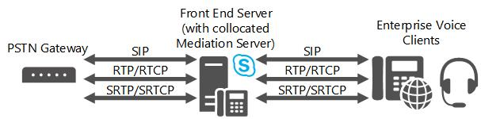

# Компонент Mediation Server в Skype для бизнеса Server
 
Узнайте о серверах-посредниках в Skype для бизнеса Server, включая поддерживаемые топологии и связи с магистралями M:N, обходом мультимедиа и управлением приемом вызовов.
  
Чтобы развернуть Корпоративная голосовая связь, необходимо развернуть один или несколько серверов-посредников. 
  
Сервер-посредник переводит сигнал между внутренней Корпоративная голосовая связь инфраструктурой и шлюзом открытой телефонной сети (PSTN) или магистралью протокола инициации сеансов (SIP). В некоторых развертываниях он также переводит само мультимедиа между этими точками.
  
На Skype для бизнеса Server сервер-посредник прослушивает один общий транспортный адрес TLS (MTLS). На стороне шлюза сервер-посредник прослушивает все связанные порты прослушивания, связанные с магистральными серверами. Все соответствующие шлюзы должны поддерживать TLS, но могут работать и через TCP. TCP используется для шлюзов, которые не поддерживают TLS.
  
Если у вас также есть существующий отдел Exchange (PBX) в среде, сервер-посредник обрабатывает вызовы между Корпоративная голосовая связь пользователями и PBX. Если ваш PBX является IP-PBX, можно создать прямое подключение SIP между PBX и сервером-посредником. Если ваш PBX — это PBX-мультиплекс подразделения времени (TDM), необходимо также развернуть шлюз PSTN между сервером-посредником и PBX.
  
Сервер-посредник по умолчанию находится в расположении с передним конечным сервером. Сервер-посредник также может быть развернут в отдельном пуле.
  
## Что делает сервер-посредник

Основные функции сервера-посредника:
  
- Шифрование и расшифровка SRTP на Skype для бизнеса Server стороне. 
    
- Перевод SIP через TCP (для шлюзов, не поддерживаюющих TLS) в SIP над взаимной TLS.
    
- Перевод потоков мультимедиа между Skype для бизнеса Server и шлюзом сервера-посредника.
    
- Подключение клиентов, которые находятся за пределами сети, к внутренним компонентам ICE, которые позволяют использовать средства массовой информации для nat и брандмауэров.
    
- Выступая в качестве посредника для потоков вызовов, которые шлюз не поддерживает, например вызовы удаленных сотрудников на Корпоративная голосовая связь clien.t
    
- В развертываниях, включающих магистральные SIP, работа с поставщиком магистральных служб SIP для обеспечения поддержки PSTN, что устраняет необходимость шлюза PSTN.
    
На следующем рисунке показаны протоколы сигнализации и мультимедиа, используемые сервером-посредником при общении с основным шлюзом PSTN и Корпоративная голосовая связь инфраструктурой.
  
**Протоколы передачи сигналов и мультимедиа, используемые сервером-посредником**

  
> [!NOTE]
> Если вы используете TCP или RTP/RTCP (вместо SRTP или SRTCP) в сети между шлюзом PSTN и сервером-посредником, рекомендуем принять меры для обеспечения безопасности и конфиденциальности сети. 
  
## Магистраль M:N

Skype для бизнеса Server поддерживает гибкость в определении магистрали для маршрутизов вызовов. Магистраль — это логическая связь между сервером-посредником и номером порта прослушивания с шлюзом и номером порта прослушивания. Это подразумевает несколько вещей: сервер-посредник может иметь несколько магистральных серверов к одному шлюзу; Сервер-посредник может иметь несколько магистральных серверов для разных шлюзов; Наоборот, шлюз может иметь несколько магистральных серверов для различных серверов-посредников.
  
При добавлении шлюза в топологию с помощью топологии Skype для бизнеса необходимо создать корневой магистраль. Количество шлюзов, которые может обрабатывать данный сервер-посредник, зависит от емкости обработки сервера в часы пик. Если развернуть сервер-посредник на оборудовании, которое отвечает минимальным требованиям к оборудованию для Skype для бизнеса Server, как описано в требованиях [к серверу для Skype для бизнеса Server 2015](../../plan-your-deployment/requirements-for-your-environment/server-requirements.md) г., то автономный сервер-посредник может обрабатывать около 1000 вызовов. Сервер-посредник выполняет транскодирование, но по-прежнему выполняет маршрутные вызовы для нескольких шлюзов, даже если шлюзы не поддерживают обход мультимедиа.
  
При определении маршрута вызова укажите магистрали, связанные с этим маршрутом, но не указываете, какие серверы-посредники связаны с этим маршрутом. Вместо этого вы используете Topology Builder для связывать магистрали с серверами-посредниками. Другими словами, маршрутизяция определяет, какой магистраль использовать для вызова, а затем сервер-посредник, связанный с этим магистралью, отправляет сигнал для этого вызова.
  
Сервер-посредник может быть развернут в качестве пула; этот пул может быть collocated с пулом переднего конца, или он может быть развернут в качестве отдельного пула. Если сервер-посредник расположен с пулом переднего конца, размер пула может быть не более 12 (предел размера пула регистратора). В совокупности эти возможности увеличивают надежность и гибкость развертывания для серверов-посредников, но требуют аналогичных возможностей в следующем:
  
- **Шлюз PSTN.** Квалифицированный шлюз Skype для бизнеса Server должен реализовать балансировку нагрузки DNS, которая позволяет квалифицированному шлюзу телефонной сети общего звонков (PSTN) выступать в качестве балансировки нагрузки для одного пула серверов-посредников и, таким образом, выполнять вызовы балансировки нагрузки в пуле.
    
- **Диспетчер пограничной службы сеанса.** Для магистрали SIP одноранговая сущность — это контроллер пограничной связи сеанса (SBC) в поставщике услуг телефонии в Интернете. В направлении от пула серверов-посредников до SBC SBC может получать подключения с любого сервера-посредника в пуле. В направлении от SBC к пулу трафик может быть отправлен на любой сервер-посредник в пуле. Одним из способов достижения этого является балансировка нагрузки DNS при поддержке поставщика услуг и SBC. Альтернативой является предоставление поставщику услуг IP-адресов всех серверов-посредников в пуле, и поставщик услуг будет предоставить их в своем SBC как отдельный магистраль SIP для каждого сервера-посредника. Затем поставщик услуг будет обрабатывать балансировку нагрузки для собственных серверов. Не все поставщики услуг или SBCs могут поддерживать эти возможности. Кроме того, поставщик услуг может взимать дополнительную плату за эту возможность. Как правило, каждый магистраль SIP в SBC взимает ежемесячную плату.
    
- **IP-PBX.** В направлении от пула серверов-посредников до прекращения SIP IP-PBX IP-PBX может получать подключения с любого сервера-посредника в пуле. В направлении от IP-PBX к пулу трафик может быть отправлен на любой сервер-посредник в пуле. Поскольку большинство IP-PBXs не поддерживают балансировку нагрузки DNS, рекомендуется определять отдельные прямые SIP-подключения от IP-PBX до каждого сервера-посредника в пуле. IP-АТС затем будет осуществлять собственную балансировку нагрузки, распределяя трафик через группу магистралей. Подразумевается, что для группы магистралей в IP-АТС задан согласованный набор правил маршрутизации. Необходимо ли определить, поддерживает ли определенная IP-PBX эту групповую концепцию магистрали и как она пересекается с собственной архитектурой избыточности и кластерирования IP-PBX, прежде чем вы сможете решить, может ли кластер-посредник сервер правильно взаимодействовать с IP-PBX.
    
Пул сервера-посредника должен иметь единое представление одноранговых шлюзов, с которыми он взаимодействует. Это означает, что все участники пула получают доступ к одному определению шлюза из хранилища конфигурации и могут с одинаковой вероятностью взаимодействовать с ним при обработке исходящих вызовов. Поэтому нет способа сегментировать пул, чтобы некоторые серверы-посредники связывались только с определенными однорангами шлюза для исходяющих вызовов. Если такая сегментация необходима, необходимо использовать отдельный пул серверов-посредников. Это может потребоваться, например, если отсутствуют связанные возможности в шлюзах PSTN, SIP-магистралях или IP-АТС для взаимодействия с пулом (как описывалось ранее в этой статье).
  
Определенный шлюз PSTN, IP-PBX или одноранговой магистрали SIP могут перенаправить к нескольким серверам-посредникам или магистральм. Количество шлюзов, которые может контролировать определенный пул серверов-посредников, зависит от количества вызовов, которые используют обход мультимедиа. Если большое количество вызовов использует обход мультимедиа, сервер-посредник в пуле может обрабатывать еще много вызовов, так как требуется только обработка сигнального слоя. 
  
## Контроль допуска звонков и сервер-посредник

Управление приемом вызовов (CAC), управляет созданием сеансов в режиме реального времени на основе доступной пропускной способности, чтобы предотвратить плохое качество работы (QoE) для пользователей в захламляемой сети. Для этого сервер-посредник отвечает за управление пропускной способностью для двух взаимодействий на Skype для бизнеса Server стороне и на стороне шлюза. При использовании контроля допуска звонков за резервирование пропускной способности отвечает объект-получатель звонка. Одноранговая система шлюза (шлюз PSTN, IP-PBX, SBC), с которую взаимодействует сервер-посредник на стороне шлюза, не поддерживают контроль Skype для бизнеса Server приема вызовов. Таким образом, сервер-посредник должен обрабатывать взаимодействия пропускной способности от имени своего одноранговой шлюзовой сети. По возможности сервер-посредник заранее зарезервировать пропускную способность. Если это невозможно (например, если расположение конечной точки сервера-посредника на стороне шлюза для исходящего звонка на одноранговый шлюз неизвестно), пропускная способность резервируется в момент выполнения звонка. Это может приводить к избыточному выделению полосы пропускания, однако это единственный способ предотвратить ошибочные звонки.
  
Обход сервера-посредника и резервирование пропускной способности являются взаимоисключающими подходами. Если для вызова используется обход мультимедиа, для этого вызова не выполняется управление приемом вызовов. При этом предполагается, что при выполнении звонка отсутствуют каналы с ограниченной пропускной способностью. Если для определенного вызова, который включает сервер-посредник, используется управление приемом вызовов, этот вызов не может использовать обход мультимедиа.
  
Сведения об обходе мультимедиа или контроле допуска вызовов см. в материале [Plan for media bypass in Skype для бизнеса](media-bypass.md) или [Plan for call admission control in Skype для бизнеса Server](call-admission-control.md).
  
## Enhanced 9-1-1 (E9-1-1) и сервер-посредник

Сервер-посредник обладает расширенными возможностями, чтобы правильно взаимодействовать с поставщиками служб Enhanced 9-1-1 (E9-1-1). Специальная конфигурация на сервере-посреднике не требуется. Расширения SIP, необходимые для взаимодействия E9-1-1, по умолчанию включаются в протокол SIP-сервера-посредника для взаимодействия с одноранговой шлюзовой сетью (шлюзом PSTN, IP-PBX или SBC поставщика услуг интернет-телефонии, включая поставщиков услуг E9-1-1)
  
Возможность завершения магистрали SIP к поставщику услуг E9-1-1 в существующем пуле сервера-посредника или обязательное наличие автономных серверов-посредников зависит от того, может ли SBC E9-1-1 взаимодействовать с пулом серверов-посредников. Подробные сведения см. [в материале M:N trunk in Skype для бизнеса Server](m-n-trunk.md).
  
## Обход мультимедиа и сервер-посредник

Обход мультимедиа — это Skype для бизнеса Server, которая позволяет администратору настраивать маршрутику вызовов для прямого потока между конечной точкой пользователя и шлюзом открытой телефонной сети (PSTN) без обхода сервера-посредника. Обход мультимедиа повышает качество вызовов, уменьшая задержку, ненужный перевод, возможность потери пакета и количество потенциальных точек сбоя. Если удаленный сайт без сервера-посредника подключен к центральному сайту одной или более WAN-ссылками с ограниченной пропускной способностью, обход средств массовой информации снижает требования к пропускной способности, позволяя средствам массовой информации из клиента на удаленном сайте напрямую перетекать к локальному шлюзу, не перетекая через ссылку WAN на сервер-посредник на центральном сайте и обратно. Это сокращение обработки мультимедиа также дополняет способность сервера-посредника управлять несколькими шлюзами.
  
Обход сервера-посредника и контроль допуска звонков являются взаимоисключающими функциями. Если для вызова применяется обход сервера-посредника, то для него не применяется контроль допуска звонков. Предполагается, что нет никакой связи с ограниченной пропускной способностью сторон, участвующих в вызове.
  
## Topologies for Mediation Server

Сервер Skype для бизнеса Server по умолчанию расположен с выпуск Standard сервером, пулом переднего выпуск Standard или устройством для ветвей. Все серверы-посредники в пуле переднего конца должны быть настроены одинаково.
  
Если производительность является проблемой, может быть предпочтительнее развернуть один или несколько серверов-посредников в выделенном отдельном пуле. Мы определенно рекомендуем автономный пул при развертывании магистрали SIP. 
  
Если вы развертываете прямые подключения SIP к квалифицированному шлюзу ТСОП, поддерживающему обход сервера-посредника и балансировку нагрузки DNS, отдельный пул серверов-посредников не является необходимым. Это потому, что квалифицированные шлюзы способны балансировать нагрузку DNS в пуле серверов-посредников, и они могут получать трафик с любого сервера-посредника в пуле.
  
Мы также рекомендуем объединить сервер-посредник в пуле передней части при развертывании IP-PBXs или подключиться к сеансу пограничного контроллера поставщика сеансов интернет-телефонии (SBC) при условии, что все следующие условия будут выполнены:
  
- IP-АТС или пограничный контроллер сеансов настроены на прием трафика от любого сервера-посредника в пуле и могут равномерно перенаправлять трафик на все серверы-посредники в пуле.
    
- IP-PBX не поддерживает обход мультимедиа, но пул переднего конца, в котором размещен сервер-посредник, может обрабатывать голосовое перекодирование для вызовов, к которым обход мультимедиа не применяется.
    
Вы можете использовать средство планирования Microsoft Lync Server 2013 для оценки того, может ли пул переднего плана, в котором необходимо создать сервер-посредник, справиться с нагрузкой. Если ваша среда не удовлетворяет данным требованиям, следует развернуть отдельный пул серверов-посредников.
  
На следующем рисунке показана простая топология, состоящая из двух сайтов, соединенных через глобальную сеть. Сервер-посредник находится в пуле переднего конца на сайте 1. Серверы-посредники на сайте 1 контролируют шлюз PSTN на сайте 1 и шлюз на сайте 2. В этой топологии обход сервера-посредника включен глобально, чтобы использовать сведения о сайте и регионе, и чтобы магистрали к каждому шлюзу ТСОП (GW1 и GW2) поддерживали обход.
  
**Пример сайтов, подключенных через глобальную сеть с сервером-посредником на сайте 1 и шлюзом ТСОП на сайте 2**

  
На следующем рисунке показана простая топология, в которой сервер-посредник находится на переднем конце пула на сайте 1 и имеет прямое SIP-подключение к IP-PBX на сайте 1. На этом рисунке сервер-посредник также управляет шлюзом PSTN на сайте 2. Предположим, Skype для бизнеса пользователи существуют на обоих сайтах 1 и 2. Кроме того, предположим, что IP-PBX имеет связанный процессор мультимедиа, который должен быть пройден всеми средствами массовой информации, происходящими из конечных точек Skype для бизнеса, прежде чем отправить в конечные точки мультимедиа, контролируемые IP-PBX. В этой топологии обход сервера-посредника включен глобально, чтобы использовать сведения сайта и региона, и чтобы магистрали к PBX и шлюзу ТСОП поддерживали обход сервера-посредника.
  
**Пример сайтов, подключенных через глобальную сеть с сервером-посредником на сайте 1 и PBX на сайте 2**

  
На последнем рисунке в этом разделе показана топология, в которой сервер-посредник подключен к SBC поставщика услуг интернет-телефонии. 
  
## Планирование решений для сервера-посредника

В этом разделе описываются решения по планированию, которые необходимо принять для развертывания сервера-посредника,
  
### Collocated или автономный сервер-посредник?

Сервер-посредник по умолчанию находится на выпуск Standard или переднем сервере в пуле переднего конца на центральных сайтах. Количество вызовов ТСОП, которое может быть обработано, и необходимое количество компьютеров в пуле будет зависеть от следующих факторов:
  
- Количество одноранговых одноранговых шлюзов, которые управляет пулом сервера-посредника
    
- от трафика через эти шлюзы в периоды высокой нагрузки;
    
- Процент вызовов, которые являются вызовами, носители которых обходят сервер-посредник
    
При планировании убедитесь, что после учета требований обработки для вызовов ТСОП и для аудио- и видеоконференций, которые не настроены для обхода сервера-посредника, а также для обработки, необходимой для взаимодействия по передаче сигналов для того количества вызовов в часы наибольшей нагрузки, которое должно поддерживаться. Если ЦП недостаточно, необходимо развернуть автономный пул серверов-посредников. и шлюзы PSTN, IP-PBX и SBCs должны быть разделены на подсети, контролируемые серверами-посредниками в одном пуле и автономными серверами-посредниками в одном или более автономных пулах.
  
Если вы развернули шлюзы PSTN, IP-PBX или контроллеры пограничной связи сеансов (SBCs), которые не поддерживают правильные возможности взаимодействия с пулом серверов-посредников, включая следующие, то их необходимо будет связывать с автономным пулом, состоящим из одного сервера-посредника:
  
- Выполнение балансировки нагрузки системы доменных имен сетевого уровня (DNS) между серверами-посредниками в пуле (или иным образом равномерное маршрутирование трафика на все серверы-посредники в пуле)
    
- Прием трафика с любого сервера-посредника в пуле
    
Вы можете использовать средство планирования Microsoft Lync Server 2013, чтобы оценить, может ли объединение сервера-посредника с вашим пулом переднего плана обрабатывать нагрузку. Если ваша среда не удовлетворяет данным требованиям, следует развернуть отдельный пул серверов-посредников.
  
### Некоторые аспекты центрального сайта и сайта филиала

 Серверы-посредники на центральном сайте можно использовать для маршрутных вызовов для IP-PBXs шлюзов или шлюзов PSTN на сайтах филиалов. Однако при развертывании магистрали SIP необходимо развернуть сервер-посредник на сайте, где завершается каждый магистраль. Наличие сервера-посредника на центральном маршруте сайта вызывает шлюз IP-PBX или PSTN на сайте филиала, не требует использования обхода мультимедиа. Однако, если вы можете включить обход мультимедиа, это снизит задержку пути мультимедиа и улучшит качество мультимедиа, так как путь мультимедиа больше не требуется для того, чтобы следовать сигнальным путем. Обход мультимедиа также снижает нагрузку на обработку пула.
  
> [!NOTE]
> Обход сервера-посредника не будет взаимодействовать с каждым шлюзом ТСОП, IP-УАТС и SBC. Корпорация Майкрософт протестировала ряд шлюзов ТСОП и SBC с сертифицированными партнерами и выполнила некоторые тесты с IP-УАТС компании Cisco. Обход мультимедиа поддерживается только продуктами и версиями, перечисленными в [программе open interoperability Unified Communications - Lync Server](../../../SfbPartnerCertification/lync-cert/qualified-ip-pbx-gateway.md). 
  
Если требуется устойчивость веб-сайта филиала, на сайте филиала необходимо развернуть устройство для выживших филиалов или сочетание переднего конечного сервера, сервера-посредника и шлюза. (Предположение с устойчивостью сайта филиала заключается в том, что присутствие и конференция на сайте не являются устойчивыми.) Инструкции по планированию голосового сайта филиала см. в [Корпоративная голосовая связь в](enterprise-voice-resiliency.md) Skype для бизнеса Server.
  
Для взаимодействия с IP-PBX, если IP-PBX неправильно поддерживает ранние взаимодействия мультимедиа с несколькими ранними диалогами и взаимодействиями RFC 3960, можно отрезать первые несколько слов приветствия для входящих вызовов из IP-PBX в Skype для бизнеса конечные точки. Эта проблема может быть более серьезной, если сервер-посредник на центральном сайте вызывает маршрутизацию IP-PBX, где маршрут завершается на сайте филиала, так как для завершения сигнализации требуется больше времени. Если вы испытываете такое поведение, развертывание сервера-посредника на сайте филиала — это единственный способ уменьшить отсеяние первых нескольких слов.
  
Наконец, если на центральном сайте есть TDM PBX или ip-PBX не устраняет необходимость шлюза PSTN, необходимо развернуть шлюз на маршруте вызовов, соединяющем сервер-посредник и PBX.
  
> [!NOTE]
> Чтобы улучшить производительность автономного сервера-посредника, следует включить масштабирование на принимающей стороне (RSS) в сетевых адаптерах на этих серверах. RSS позволяет обрабатывать входящие пакеты параллельно несколькими процессорами на сервере. Дополнительные сведения см[. в материале "Улучшения](/previous-versions/windows/it-pro/windows-server-2012-R2-and-2012/hh997036(v=ws.11)) масштабирования на стороне получения в Windows Server". Сведения о включении RSS см. в документации вашего сетевого адаптера. 
