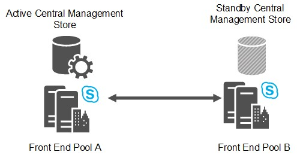

# Восстановление аварийного восстановления пула переднего Skype для бизнеса Server
 
Для аварийного восстановления Skype для бизнеса Server пула в случае сбойной работы одного пула.
  
Для наиболее надежных вариантов аварийного восстановления в Skype для бизнеса Server развертывание пар пулов переднего конца на двух географически разбросанных сайтах. Каждый сайт имеет пул переднего конца, который в паре с соответствующим пулом переднего конца на другом сайте. Оба сайта активны, и служба резервного копирования предоставляет репликацию данных в режиме реального времени, чтобы синхронизировать пулы. [Развертывание парных пулов переднего конца для аварийного](../../deploy/deploy-high-availability-and-disaster-recovery/front-end-pools-for-disaster-recovery.md) восстановления в Skype для бизнеса Server, если вы хотите реализовать сопряжение переднего пула.
  

  
Если сбой пула на одном сайте может привести к сбойу в доступе пользователей из этого пула к пулу на другом сайте, который затем обслуживает всех пользователей в обоих пулах. Для планирования емкости необходимо разработать каждый пул, чтобы иметь возможность обрабатывать нагрузку всех пользователей обоих пулов в случае аварии.
  
Два центра обработки данных, которые включают пулы переднего конца в паре друг с другом, могут быть на любом расстоянии друг от друга. Рекомендуется использовать два центра обработки данных в одном регионе мира с высокоскоростными связями между ними. 
  
Наличие двух центров обработки данных в разных регионах мира возможно, но может привести к более высокой потере данных в случае аварии из-за задержки репликации данных.
  
При планировании парных пулов необходимо иметь в виду, что поддерживаются только следующие пары:
  
- выпуск Enterprise пулы можно объединить только с другими выпуск Enterprise пулами. Аналогичным образом, выпуск Standard пулы могут быть сопряжены только с другими выпуск Standard пулами.
    
- Физические пулы могут быть сопряжены только с другими физическими пулами. Кроме того, виртуальные пулы могут быть сопряжены только с другими виртуальными пулами.
    
- Пулы, спаривные друг с другом, должны работать в одной базовой операционной системе.
    
Ни топология Builder, ни проверка топологии не запрещают сопряжение двух пулов таким образом, чтобы не следовать этим рекомендациям. Например, Topology Builder позволяет спарить пул выпуск Enterprise с выпуск Standard пулом. Однако эти типы сопряжений не поддерживаются.
  
## Отношения регистратора резервного копирования и сохранившиеся устройства филиала

Помимо обеспечения возможности аварийного восстановления, два сопряженных пула служат как резервные регистраторы друг для друга. Каждый пул может быть резервной копией только для одного другого пула переднего конца.
  
Несмотря на то, что отношения резервного копирования между двумя пулами переднего конца должны быть 1:1 и симметричны, каждый пул переднего конечного может также быть регистратором резервного копирования для любого числа сохранившихся устройств филиала.
  
Обратите внимание, что Skype для бизнеса не распространяет поддержку аварийного восстановления на пользователей, которые были уцелевшими устройствами филиалов. Если пул переднего конца, который служит резервной копией для устройства для сохранившихся ветвей, выходит из строя, пользователи, подписавшиеся на устройство для уцелевших ветвей, попадают в режим устойчивости, несмотря на то, что пользователи, которые находятся в пуле переднего конечного входа, не могут вернуться в пул резервного копирования.
  
## Время восстановления при сбойе пула и откате пула

Для сбойа пула и сбой пула цель инженерного обеспечения для цели времени восстановления (RTO) — 15-20 минут. Это время, необходимое для сбой, после того как администраторы определили, что произошла катастрофа, и начали процедуры сбой. Оно не учитывает время, необходимое администраторам для оценки ситуации и принятия решения, а также не учитывает время, необходимое пользователям для повторного входа после завершения отработки отказа.
  
Для сбойа пула и сбой пула целевая задача инженерной точки восстановления (RPO) — 5 минут. Оно представляет временную меру данных, которые могут быть потеряны вследствие аварии из-за задержки репликации службы резервного копирования. Например, если пул выходит из пула в 10:00, а RPO — 5 минут, данные, написанные в пуле между 9:55. и 10:00 утра ., возможно, не реплицируется в пул резервного копирования, и будет потеряно.
  
Все значения RTO и RPO в этом документе предполагают, что два центра обработки данных размещены в одном мировом регионе с высокоскоростным транспортом без задержек между двумя узлами. Эти цифры измеряются для пула с 40 000 одновременно активных пользователей и 200 000 пользователей, включенных для Skype для бизнеса в отношении заранее определенной пользовательской модели, где нет отставания в репликации данных. Они могут изменяться после тестирования производительности и проверки.
  
## Сбой центрального магазина управления

Центр управления содержит данные о конфигурации серверов и служб в развертывании. Каждое Skype для бизнеса Server развертывание включает один центральный магазин управления, который размещен на сервере заднего конца одного пула переднего конца.
  
При сопряжении пула, в котором расположен центральный магазин управления, в пуле резервного копирования настроена резервная база данных центра управления. В любой момент активна одна из двух баз данных центрального магазина управления, а другая — в режиме ожидания. Содержимое реплицируется службой резервного копирования из активной базы данных в резервную.
  

  
Во время сбой пула, в который входит пул, в который входит центральный магазин управления, необходимо сбой в центральном хранилище управления перед сбой в пуле переднего конца.
  
После устранения аварийного сбойа не требуется отысвка центра управления. Центральный магазин управления может оставаться в пуле, в который вы его не смогли.
  
Цели проектирования для сбойной работы центра управления в хранилище — 5 минут для цели времени восстановления (RTO) и 5 минут для цели точки восстановления (RPO).
  
## Безопасность данных в переднем конце пула

Служба резервного копирования непрерывно передает данные пользователей и содержимое конференции между двумя парами интерфейсных пулов. Пользовательские данные содержат пользовательские SIP-интерфейсы, а также расписание конференций, списки контактов и параметры. Содержимое конференции включает в себя PowerPoint microsoft, а также доски, используемые в конференциях.
  
Из пула исходных данных эти данные экспортируются из локального хранилища, заблокируются, а затем передаются в целевой пул, где они будут отсечены и импортируются в локальное хранилище. Служба резервного копирования предполагает, что канал связи между двумя центрами обработки данных находится в пределах корпоративной сети, защищенной от Интернета. Он не шифрует переданные данные между двумя центрами обработки данных и не инкапсулируется в защищенном протоколе, например HTTPS. Таким образом, возможна атака из внутреннего персонала внутри корпоративной сети.
  
Любое предприятие, которое развертывает Skype для бизнеса Server нескольких центрах обработки данных и использует функцию аварийного восстановления, должно обеспечить защиту трафика между центрами обработки данных корпоративной интрасети. Предприятия, которые заботятся о внутренней защите от атак, должны обеспечить связь между центрами обработки данных. Это стандартное требование, которое также помогает протехам многих других типов корпоративных конфиденциальных данных, переданных между центрами обработки данных.
  
Хотя риск атаки с посредником внутри корпоративной сети существует, он относительно небольшой по сравнению с предоставлением доступа к трафику из Интернета. В частности, пользовательские данные, открытые службой резервного копирования (например, SIP URIS), как правило, доступны всем сотрудникам в компании с помощью других средств, таких как глобальная адресная книга или другое программное обеспечение каталога. Поэтому основное внимание должно уделяться обеспечению безопасности WAN между двумя центрами обработки данных, когда служба резервного копирования используется для копирования данных между двумя парами пулов.
  
### Смягчение рисков безопасности

У вас есть много способов повышения безопасности для трафика службы резервного копирования. Это варьируется от ограничения доступа к центрам обработки данных до обеспечения безопасности транспорта WAN между двумя центрами обработки данных. В большинстве случаев предприятия, Skype для бизнеса Server уже могут иметь необходимую инфраструктуру безопасности. Для предприятий, которые ищут руководство, Корпорация Майкрософт предоставляет решение в качестве примера создания безопасной ИТ-инфраструктуры. Подробные сведения см. в .[https://go.microsoft.com/fwlink/p/?LinkId=268544](/previous-versions/windows/it-pro/windows-server-2008-R2-and-2008/cc725770(v=ws.10)) 
  
Мы не подразумеваем, что это единственное решение, и не подразумеваем, что оно является предпочтительным решением для Skype для бизнеса Server. Мы рекомендуем корпоративным клиентам выбрать решение, которое соответствует их конкретным потребностям, исходя из инфраструктуры ИТ-безопасности и требований. В примере решения Майкрософт применяются IPSec и групповой политики для изоляции серверов и доменов.
  
Другим возможным решением является использование IPSec только для защиты данных, отправленных самой службой резервного копирования. Если вы выбрали этот метод, следует настроить правила IPSec для протокола SMB для следующих серверов, где пул A и пул B являются двумя парными пулами переднего конца.
  
- Служба SMB (TCP/445) от каждого переднего сервера в пуле A до магазина файлов, используемой пулом B.
    
- Служба SMB (TCP/445) от каждого переднего сервера в пуле B до магазина файлов, используемой пулом A.
    
> [!CAUTION]
>  IPsec не предназначен для замены безопасности на уровне приложений, например SSL/TLS. Одно из преимуществ использования IPsec заключается в том, что он может обеспечить безопасность сетевого трафика для существующих приложений, не меняя их. Предприятиям, которые хотят просто обеспечить транспортировку между двумя центрами обработки данных, следует проконсультироваться с соответствующими поставщиками сетевого оборудования о способах настроить безопасные подключения WAN с помощью оборудования поставщика.
  
## См. также

[Развертывание парных пулов переднего конца для аварийного восстановления в Skype для бизнеса Server](../../deploy/deploy-high-availability-and-disaster-recovery/front-end-pools-for-disaster-recovery.md)