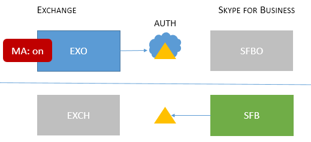

# Skype for Business topologies supported with Modern Authentication
 
В этой статье перечислены облачные и локальные топологии, которые поддерживает современная проверка подлинности в Skype для бизнеса, а также средства безопасности, применимые к каждой из них.
  
## Современная проверка подлинности в Skype для бизнеса

В Skype для бизнеса можно использовать преимущества современной проверки подлинности. Поскольку Skype для бизнеса тесно работает с Exchange, на поведение при входе, которое будут наблюдать пользователи клиента Skype для бизнеса, также влияет состояние современной проверки подлинности в Exchange. Это также применимо, если используется гибридное развертывание Skype для бизнеса с разделенными доменами. Переменных компонентов очень много, но в данном случае целью является упрощенное представление списка поддерживаемых топологий.
  
Какие топологии поддерживаются современной проверкой подлинности в Skype для бизнеса, Skype для бизнеса Online, Exchange Server и Exchange Online?
  
<!--  > [!TIP] > Not sure what Modern Authentication even is? No worries.  This Skype for Business article  4e6a99cd-7859-4062-8a30-5ac79ba36b52  explains it in the first paragraphs. --> 
  
### Топологии, поддерживаемые современной проверкой подлинности в Skype для бизнеса

Существуют два возможных серверных приложения и две рабочие нагрузки Office 365, связанные с топологиями Skype для бизнеса, которые использует современная проверка подлинности.
  
- Скайп для Business server (накопительный пакет обновления 5) локальных
    
- Skype для бизнеса Online (SFBO)
    
- Локальный сервер Exchange Server
    
- Exchange Server Online (EXO)
    
Кроме того, для современной проверки подлинности важно знать, где будут проходить проверка подлинности (authN) и авторизация (authZ) пользователей. Существует два варианта.
  
- Azure AD, по сети в Microsoft Cloud
    
- Локальный сервер федерации Active Directory (ADFS)
    
Поэтому он довольно следующим образом, с помощью EXO и SFBO в облаке с Azure AD и Exchange Server (EXCH) и Скайп для Business server (SFB) на prem.
  

  
Ниже представлены поддерживаемые топологии. В графиках топологий используются следующие условные обозначения.
  
- Серым цветом выделены значки, которые недоступны в этом сценарии.
    
- EXO — Exchange Online.
    
- SFBO — Skype для бизнеса Online.
    
- EXCH — локальный сервер Exchange.
    
- SFB — локальный сервер Skype для бизнеса.
    
- Выполняющие авторизацию серверы представлены треугольниками, например, Azure AD — это треугольник с облаком на заднем плане.
    
- Стрелки указывают на сервер авторизации, который будет использоваться при попытке клиентов получить доступ к заданному серверному ресурсу.
    
Сначала рассмотрим современную проверку подлинности с Skype для бизнеса в обеих топологиях: с использованием локально и в облаке.
  
> [!IMPORTANT]
> Вы готовы настроить современную проверку подлинности в Skype для бизнеса Online? Действия для включения этой функции подходят [здесь](https://social.technet.microsoft.com/wiki/contents/articles/34339.skype-for-business-online-enable-your-tenant-for-modern-authentication.aspx). 
  
|Имя топологии    |Пример    |Описание    |Поддерживается    |
|:-----|:-----|:-----|:-----|
|Только в облаке    |Пользователи/почтовые ящики находятся: в Интернете     |Современная проверка подлинности включена для EXO и SFBO.    Сервер авторизации — Azure AD.    |Многофакторная проверка подлинности (MFA), проверка подлинности на основе сертификата клиента (CBA), условный доступ (CA)/управление мобильными приложениями (MAM) с Intune. \*    |
|Только на локальном сервере    |Пользователи/почтовые ящики находятся: на локальном сервере    |Современная проверка подлинности включена для локального сервера SFB.    Сервер авторизации — ADFS.    Сведения о конфигурации, можно найти в [в этой статье.](https://technet.microsoft.com/en-us/library/mt710548.aspx)   |MFA (только для рабочих столов Windows, мобильные клиенты не поддерживаются). Функции интеграции с Exchange отсутствуют.    |
   
> [!IMPORTANT]
> Рекомендуется использовать одно состояние современной проверки подлинности в Skype для бизнеса и Exchange (а также их эквивалентах в сети), чтобы сократить количество запросов. 
  
Смешанные топологии включают в себя комбинации гибридных развертываний SFB с разделенными доменами. В настоящее время поддерживаются следующие смешанные топологии.
  
|Имя топологии    |Пример    |Описание    |Поддерживается    |
|:-----|:-----|:-----|:-----|
|Смешанная топология 1    |             Пользователи/почтовые ящики находятся: в EXO и SFB    |Современная проверка подлинности не включена для SFB. В этой топологии недоступны функции современной проверки подлинности для SFB.    |Функции современной проверки подлинности недоступны для SFB.    |
|Смешанная топология 2    |             Пользователи/почтовые ящики находятся: EXCH и SFBO    |Современная проверка подлинности включена только для SFBO. Сервер авторизации — Azure AD для пользователей, размещенных в SFBO, но AD для EXCH локальных.    |Многофакторной проверкой Подлинности, CBA, ЦС/MAM с Intune.\*    |
|Смешанная топология 3    |             Пользователи/почтовые ящики находятся: в EXO + SFB или EXCH + SFB    |В этой топологии недоступны функции современной проверки подлинности для SFB.    |Функции современной проверки подлинности недоступны для SFB.    |
|Смешанная топология 4    |             Пользователи/почтовые ящики находятся: в EXCH +SFBO или EXCH + SFB    |Агент Управления включен для SFBO, поэтому сервер авторизации Azure AD для пользователей, размещенных в SFBO. На prem в SFB и EXO используются AD.    |Многофакторной проверкой Подлинности, CBA, ЦС/MAM с Intune online только для пользователей.\*    |
|Смешанная топология 5    |             Пользователи/почтовые ящики находятся: в EXO + SFBO, EXO + SFB, EXCH + SFBO или EXCH + SFB    |Агент Управления — на EXO и SFBO, поэтому сервер авторизации — Azure AD для пользователей, размещенных в SFBO; на prem в EXCH и SFB используются AD.    |Многофакторной проверкой Подлинности, CBA, ЦС/MAM с Intune online только для пользователей.\*    |
|Смешанные 6    |             Пользователи/почтовые ящики находятся: в EXO + SFBO, EXO + SFB, EXCH + SFBO или EXCH + SFB    |Агент Управления находится в любом приложении, поэтому сервер авторизации Azure AD для всех пользователей. (online и локальной)     Ознакомьтесь с [https://aka.ms/ModernAuthOverview](https://aka.ms/ModernAuthOverview) для шаги развертывания.   |Многофакторной проверкой Подлинности, CBA и ЦС/MAM (с помощью Intune) для всех пользователей.    |
   
\*-Многофакторной проверкой Подлинности включает в себя рабочий стол Windows, MAC, операций ввода-вывода, Android и устройств Windows Phone; CBA включает рабочий стол Windows, iOS и устройствами Android; Центр сертификации/MAM с Intune, включает в себя устройства Android и операций ввода-вывода. 
  
> [!IMPORTANT]
> Очень важно отметить, что в некоторых случаях пользователи могут получать **несколько запросов**, особенно когда состояние современной проверки подлинности не одинаковое для различных ресурсов сервера, которые могут потребоваться клиентам и которые они могут запрашивать (как в случае со всеми версиями смешанных топологий). 

> [!IMPORTANT]
> Также Обратите внимание, что в некоторых случаях (Mixed 1, 3 и 5 специально) ключа реестра [AllowADALForNonLynIndependentOfLync](https://support.microsoft.com/en-us/help/3082803/info-about-the-allowadalfornonlyncindependentoflync-setting-in-skype-for-business,-lync-2013,-and-exchange-online) должны быть установлены для правильной конфигурации для клиентов, рабочий стол Windows.
  

